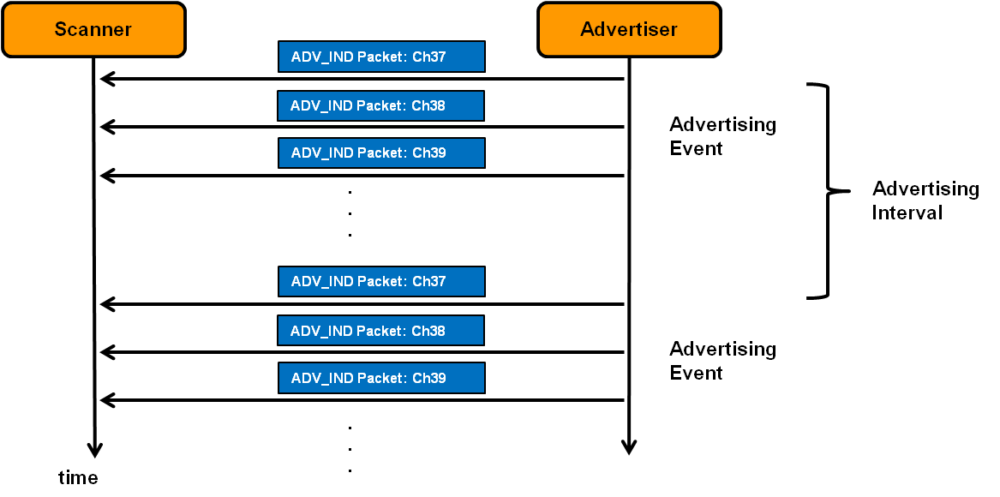
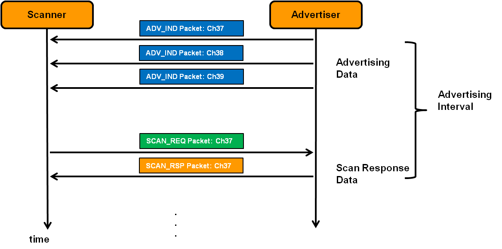
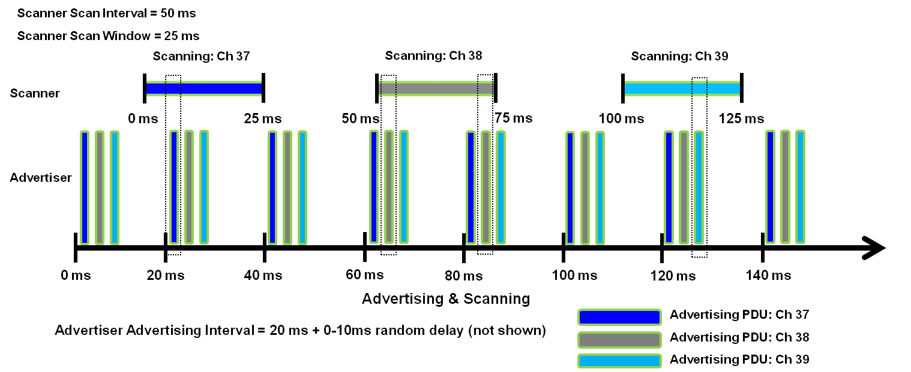

# Bluetooth® Low Energy Discovery Process
The Bluetooth® Low Energy (BLE) Link Layer discovery process consists of devices that use advertising channels to find each other, with one device advertising and another device scanning.

## Advertising
There are four types of advertising that can be performed: general, directed, nonconnectable, and discoverable. Each time a device advertises, it transmits the same packet in each of the three advertising channels.  This sequence of events is called an advertising event. 
The following example shows general advertising using ADV_IND Advertising Packets:

Apart from directed advertising packets, all of these advertising events can be sent as often as 20 milliseconds to as infrequently as every 10.24 seconds (step size: 0.625 ms).

To prevent advertising events of multiple devices from overlapping, a small random time (0 - 10 milliseconds) is added between advertising events (except directed advertising).

## Scanning
Scanning is an important task that completes the process of discovery. It is required to be able to receive advertising packets. There are two types of scanning: Passive and Active.

### Passive Scanning
In this type of scanning, the Scanner simply listens for advertising packets. The Advertiser is never aware that packets were received:

### Active Scanning
This type of scan is typically used when the potential Central device would like more information than can be provided in an ADV_IND packet, before making a decision to connect to it.

In an advertising interval, the Scanner issues a SCAN_REQ packet. The Advertiser responds with more information in a SCAN_RSP packet.

Refer to the Bluetooth Core Specification 4.2, Vol 6, Part B, Sec. 2.3 for a complete description of advertising PDU types and formats.

## Advertising and Scanning
We see that advertising and scanning activities occur at regular intervals. Note, however, that Advertisers and Scanners are not synchronized so these activities must overlap for discovery to begin. The following example depicts a specific scenario:

### Advertiser Settings:
 * Advertising Interval: 20 ms

### Scanner Settings:
 * Scan Interval: 50 ms
 * Scan Window: 25 ms

The black dotted rectangles above indicate potential time positions where advertising and scanning activities overlap, enabling discovery to take place.

The contents of this page were copied from https://microchipdeveloper.com/wireless:ble-link-layer-discovery 