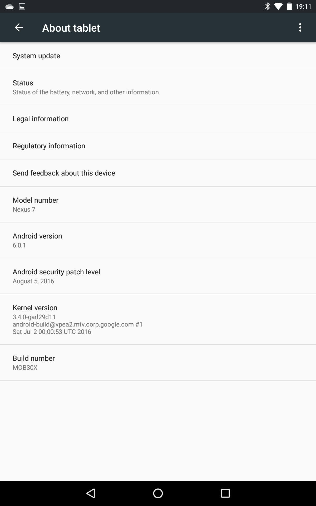
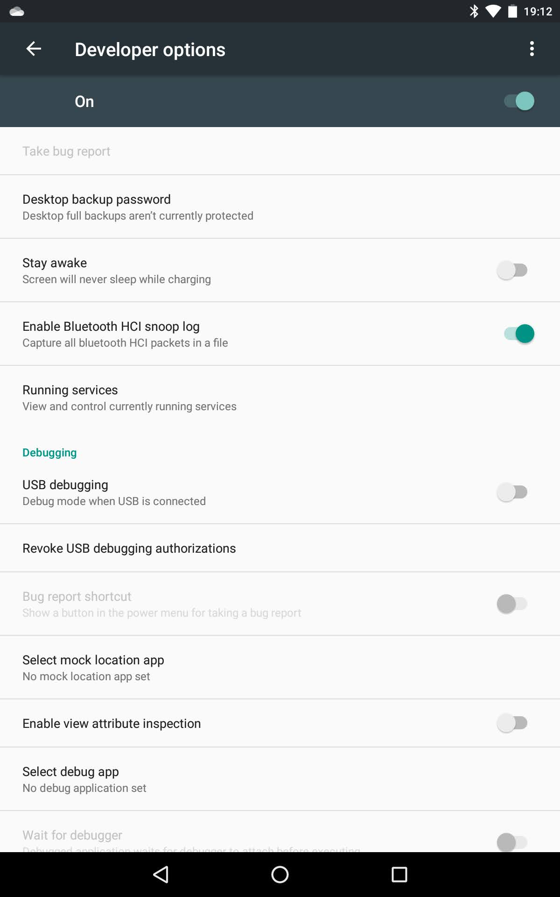
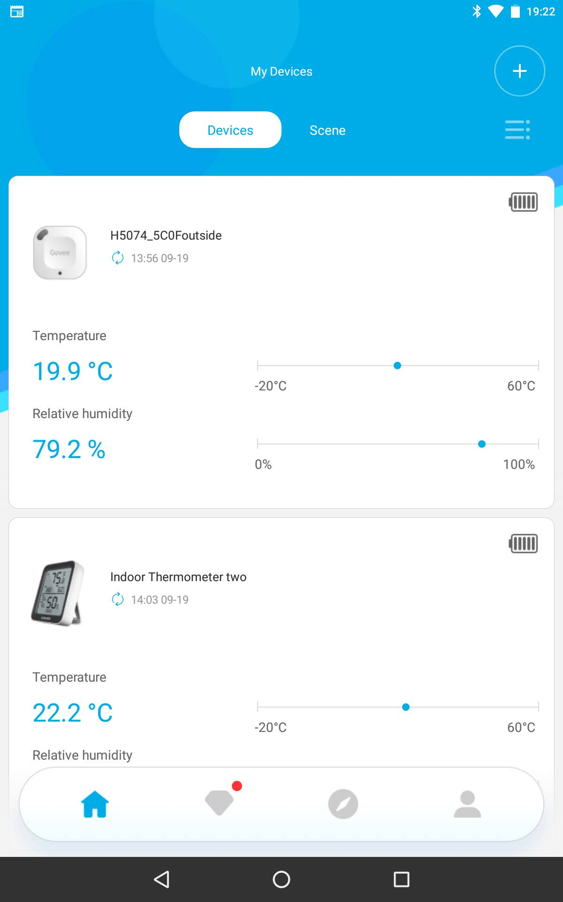
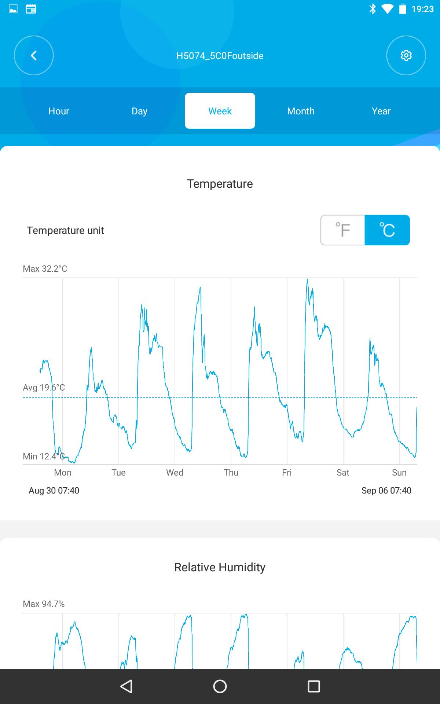

# BTData Bluetooth Captures
## TCPDump Captures
#### 2024-02-04 tcpdump details
A headless machine can be used to capture bluetooth data. The resulting file can be loaded in wireshark for a graphical decode.

Install tcpdump:
```
wim@WimPi400:~ $ sudo apt install tcpdump
```
See what interfaces are available:
```
wim@WimPi400:~ $ tcpdump --list-interfaces
1.eth0 [Up, Running, Connected]
2.any (Pseudo-device that captures on all interfaces) [Up, Running]
3.lo [Up, Running, Loopback]
4.wlan0 [Up, Wireless]
5.bluetooth0 (Bluetooth adapter number 0) [Wireless, Association status unknown]
6.bluetooth-monitor (Bluetooth Linux Monitor) [Wireless]
7.nflog (Linux netfilter log (NFLOG) interface) [none]
8.nfqueue (Linux netfilter queue (NFQUEUE) interface) [none]
9.dbus-system (D-Bus system bus) [none]
10.dbus-session (D-Bus session bus) [none]
```
Start tcpdump capturing bluetooth and running in the background:
```
wim@WimPi400:~ $ sudo tcpdump --interface=bluetooth0 --direction=inout -w `hostname`-`date --iso-8601`-bluetooth0-inout.pcap &
tcpdump: listening on bluetooth0, link-type BLUETOOTH_HCI_H4_WITH_PHDR (Bluetooth HCI UART transport layer plus pseudo-header), snapshot length 262144 bytes
```
Run the bluetooth program to generate data:
```
wim@WimPi400:~ $  /home/visualstudio/projects/GoveeBTTempLogger/bin/ARM/Debug/GoveeBTTempLogger.out && /home/visualstudio/projects/GoveeBTTempLogger/bin/ARM/Debug/GoveeBTTempLogger.out --log /var/log/goveebttemplogger --time 60 --svg /var/www/html/goveebttemplogger --battery 8 --minmax 8 --cache /var/cache/goveebttemplogger --download --only C2:35:33:30:25:50 --only D0:35:33:33:44:03 --only A4:C1:38:0D:3B:10 -v 2
[2024-02-05T01:08:39] GoveeBTTempLogger Version (non-CMake) Built on: Feb  4 2024 at 13:00:14
[                   ]      log: "/var/log/goveebttemplogger"
[                   ]    cache: "/var/cache/goveebttemplogger"
[                   ]      svg: "/var/www/html/goveebttemplogger"
[                   ]  battery: 8
[                   ]   minmax: 8
[                   ]  celsius: false
[                   ] titlemap: ""
[                   ]     time: 60
[                   ]  average: 5
[                   ] download: 14 (days betwen data download)
[                   ]  passive: false
[                   ] no-bluetooth: false
[                   ] BlueToothDevice_ID: 0
[                   ] Reset device: hci0. Success(0)
[                   ] DOWN device: hci0. Success(0)
[                   ] UP device: hci0. Success(0)
[2024-02-05T01:08:40] LocalName: WimPi400
[2024-02-05T01:08:40] BlueTooth Address Filter: [A4:C1:38:0D:3B:10] [C2:35:33:30:25:50] [D0:35:33:33:44:03]
[2024-02-05T01:08:40] Scanning Stopped.
[2024-02-05T01:08:40] BlueTooth Address Filter: [A4:C1:38:0D:3B:10] [C2:35:33:30:25:50] [D0:35:33:33:44:03]
[2024-02-05T01:08:40] Scanning Started. ScanInterval(11.25 msec) ScanWindow(11.25 msec) ScanType(1)
[2024-02-05T01:08:41] 46 [A4:C1:38:0D:3B:10] (Name) GVH5177_3B10 (UUID) 88EC (Flags) 05 (Manu) 0100010102482759 (Temp) 14.9543°C (Humidity) 54.3% (Battery) 89% (GVH5177)
[2024-02-05T01:08:41] Scanning Stopped.
^C***************** SIGINT: Caught Ctrl-C, finishing loop and quitting. *****************
[2024-02-05T01:09:16] [A4:C1:38:0D:3B:10] hci_le_create_conn Return(-1) handle (0000)
[2024-02-05T01:09:16] Scanning Stopped.
[2024-02-05T01:09:16] BlueTooth Address Filter: [A4:C1:38:0D:3B:10] [C2:35:33:30:25:50] [D0:35:33:33:44:03]
[2024-02-05T01:09:16] Scanning Started. ScanInterval(5000 msec) ScanWindow(500 msec) ScanType(1)
[2024-02-05T01:09:16] Scanning Stopped.
[2024-02-04T17:09:16] Writing: /var/cache/goveebttemplogger/gvh-A4C1380D3B10-cache.txt
GoveeBTTempLogger Version (non-CMake) Built on: Feb  4 2024 at 13:00:14 (exiting)
```
Git the PID of running tcpdump and send it the INT signal:
```
wim@WimPi400:~ $ ps aux | grep tcpdump
root      159431  0.0  0.1  10468  3908 pts/0    S    17:08   0:00 sudo tcpdump --interface=bluetooth0 --direction=inout -w WimPi400-2024-02-04-bluetooth0-inout.pcap
root      159434  0.0  0.0  10468   468 pts/1    Ss+  17:08   0:00 sudo tcpdump --interface=bluetooth0 --direction=inout -w WimPi400-2024-02-04-bluetooth0-inout.pcap
tcpdump   159435  0.0  0.1  13972  5024 pts/1    S    17:08   0:00 tcpdump --interface=bluetooth0 --direction=inout -w WimPi400-2024-02-04-bluetooth0-inout.pcap
wim       159844  0.0  0.0   6088  1932 pts/0    S+   17:09   0:00 grep --color=auto tcpdump
wim@WimPi400:~ $ sudo kill -SIGINT 159435
218 packets captured
7304 packets received by filter
0 packets dropped by kernel
```
Copy the resulting file somewhere useful to look at the data. Note that my filename format uses the hostname and the date, but multiple runs on the same date will overwrite the file.

## BTData directory contains a Data Dump
The file btsnoop_hci.log is a Bluetooth hci snoop log from a Google Nexus 7 device running Android and the Govee Home App. It can be loaded directly in Wireshark.

## Wireshark Captures
```sh
sudo apt install -y wireshark-qt
```
 
In frames 260, 261, 313, 320, 11126, 11402, and 11403 you can see advertisements from my H5074 device. (e3:5e:cc:21:5c:0f)

Using the Govee Home App, I add a connection to Govee_H5074_5C0F and download it's historical data.

In frames 5718, 5719, 5728, and 11450 you can see advertisements from one of my H5075 devices. (a4:c1:38:37:bc:ae)

Interesting frames start around 543 in response to [UUID: 494e54454c4c495f524f434b535f2013].

Two sequential values are:
 * 708003611c0365010365000368ea0368ea0368ec
 * 707a0368eb036cd3036cd1036cd3036cd3036cd0

Looking at the data I believe that the first two bytes are an offset into the total data, and then there are six repeating three byte datasets. 

7080 03611c 036501 036500 0368ea 0368ea 0368ec

Using the same math that decodes the BT LE Advertisements gets very reasonable values. (71.86424, 46.8) (72.0437, 46.5) (72.04352, 46.4) (72.22388, 46.6) (72.22388, 46.6) (72.22424, 46.8)

If I zoom all the way to frame 5414, it appears to bt the last response to [UUID: 494e54454c4c495f524f434b535f2013] and has a value of 

0002 030c6b 030c70 ffffffffffffffffffffffff

Using the Govee Home App, I add a connection to GVH5075_BCAE and download it's historical data. 

The frames received from the thermometer start to look especially interesting around 5924 when they are returning consistent length data (20 bytes) similar to 7080031322031325031324031325031326031328 in response to [UUID: 494e54454c4c495f524f434b535f2013]
 * 7080031322031325031324031325031326031328
 * 707a031327031329031329031329031329031329

7080 031322 031325 031324 031325 031326 031328 

The last frame from [UUID: 494e54454c4c495f524f434b535f2013] (16687) has Value: 000603658f036590036590036590036590036590

0006 03658f 036590 036590 036590 036590 036590

Off the top of my head each device is storing 0x7080 time/humidity values. That's 28,800. 20 days * 24 hours * 60 minutes = 28,800 entries.

### Wireshark filter that limits to visible packets sent or recieved from a single H5075 device
bluetooth.src || bluetooth.dst == a4:c1:38:37:bc:ae

bluetooth.src == a4:c1:38:37:bc:ae || bluetooth.dst == a4:c1:38:37:bc:ae || bluetooth.src_str == "controller" || bluetooth.src_str == "host"

#### My H5074 (Outside)
bluetooth.src == e3:5e:cc:21:5c:0f || bluetooth.dst == e3:5e:cc:21:5c:0f || bluetooth.src_str == "controller" || bluetooth.src_str == "host"

#### My H5174 (3 AA Batteries)
bluetooth.src == A4:C1:38:DC:CC:3D || bluetooth.dst == A4:C1:38:DC:CC:3D

# What I've learned from decoding H5074 2023-02-21
 * open and connect lcap socket
 * send struct { uint8_t opcode; uint16_t starting_handle; uint16_t ending_handle; uint16_t UUID; } primary_service_declaration_1 = {BT_ATT_OP_READ_BY_GRP_TYPE_REQ,  * send: 218	31.238678	ASUSTekC_30:4e:ef (Nexus 7)	e3:5e:cc:21:5c:0f ()	ATT	16	Sent Read By Group Type Request, GATT Primary Service Declaration, Handles: 0x0001..0xffff
 * recieve: 221	31.413696	e3:5e:cc:21:5c:0f ()	ASUSTekC_30:4e:ef (Nexus 7)	ATT	29	Rcvd Read By Group Type Response, Attribute List Length: 3, Generic Access Profile, Generic Attribute Profile, Device Information
 * because packet can't be bigger than 32 bytes, we only recived 3 handles, the biggest grout end handle is 0x0016, so we now need to modify our initial request to start at 0x0017
 * send: 222	31.431977	ASUSTekC_30:4e:ef (Nexus 7)	e3:5e:cc:21:5c:0f ()	ATT	16	Sent Read By Group Type Request, GATT Primary Service Declaration, Handles: 0x0017..0xffff
 * recieve: 224	31.510590	e3:5e:cc:21:5c:0f ()	ASUSTekC_30:4e:ef (Nexus 7)	ATT	17	Rcvd Read By Group Type Response, Attribute List Length: 1, Dialog Semiconductor GmbH
 * the group end handle is 0x002a so we send another request starting at 0x002b
 * send: 225	31.520508	ASUSTekC_30:4e:ef (Nexus 7)	e3:5e:cc:21:5c:0f ()	ATT	16	Sent Read By Group Type Request, GATT Primary Service Declaration, Handles: 0x002b..0xffff
 * recieve: 227	31.657318	e3:5e:cc:21:5c:0f ()	ASUSTekC_30:4e:ef (Nexus 7)	ATT	31	Rcvd Read By Group Type Response, Attribute List Length: 1, Unknown
 * which has a group end handle of 0x003b
 * send: 229	31.679199	ASUSTekC_30:4e:ef (Nexus 7)	e3:5e:cc:21:5c:0f ()	ATT	16	Sent Read By Group Type Request, GATT Primary Service Declaration, Handles: 0x003c..0xffff
 * recieve: 231	31.720642	e3:5e:cc:21:5c:0f ()	ASUSTekC_30:4e:ef (Nexus 7)	ATT	14	Rcvd Error Response - Attribute Not Found, Handle: 0xffff (Unknown: Unknown)
 * and that was our first error response. So now we are going to move on to reading by type
0x0001, 0xffff, 0x2800 };
```
[2023-02-21T20:19:37] GoveeBTTempLogger Version 2.20230221-1 Built on: Feb 21 2023 at 12:18:53
[2023-02-21T20:19:37] LocalName: WimPi4-Dev
[2023-02-21T20:19:37] BlueTooth Address Filter: [E3:5E:CC:21:5C:0F]
[2023-02-21T20:19:37] Scanning...
[2023-02-21T20:20:21] 26 [E3:5E:CC:21:5C:0F] (Temp) 11.67°C (Humidity) 82.22% (Battery) 100% (GVH5074)
[2023-02-21T20:20:21] Scanning Stopped
[2023-02-21T20:20:22] [E3:5E:CC:21:5C:0F] hci_le_create_conn Return(0) handle (0040)
[2023-02-21T20:20:22] [E3:5E:CC:21:5C:0F] Connected L2CAP LE connection on ATT channel: 4
[2023-02-21T20:20:22] [E3:5E:CC:21:5C:0F] ==> Read By Group Type Request, GATT Primary Service Declaration, Handles: 0x0001..0xffff
[2023-02-21T20:20:23] [E3:5E:CC:21:5C:0F] <== Handles: 0x0001..0x0005 UUID: 1800 (Generic Access)
[2023-02-21T20:20:23] [E3:5E:CC:21:5C:0F] <== Handles: 0x0006..0x0009 UUID: 1801 (Generic Attribute)
[2023-02-21T20:20:23] [E3:5E:CC:21:5C:0F] <== Handles: 0x000a..0x0016 UUID: 180a (Device Information)
[2023-02-21T20:20:23] [E3:5E:CC:21:5C:0F] ==> Read By Group Type Request, GATT Primary Service Declaration, Handles: 0x0017..0xffff
[2023-02-21T20:20:23] [E3:5E:CC:21:5C:0F] <== Handles: 0x0017..0x002a UUID: fef5 (Dialog Semiconductor GmbH)
[2023-02-21T20:20:23] [E3:5E:CC:21:5C:0F] ==> Read By Group Type Request, GATT Primary Service Declaration, Handles: 0x002b..0xffff
[2023-02-21T20:20:23] [E3:5E:CC:21:5C:0F] <== Handles: 0x002b..0x003b UUID: 57485f53-4b43-4f52-5f49-4c4c45544e49
[2023-02-21T20:20:23] [E3:5E:CC:21:5C:0F] ==> Read By Group Type Request, GATT Primary Service Declaration, Handles: 0x003c..0xffff
[2023-02-21T20:20:23] [E3:5E:CC:21:5C:0F] <== BT_ATT_OP_READ_BY_GRP_TYPE_REQ GATT_PRIM_SVC_UUID BT_ATT_OP_ERROR_RSP
```
This gets a list of services, each defined by a UUID and a pair of handles.
Next, for each service, we attempt to get details using the pair of handles. For each service, we try GATT Include Declaration and then GATT Characteristic Declaration, looping on the results as needed.
 * send struct { uint8_t opcode; uint16_t starting_handle; uint16_t ending_handle; uint16_t UUID; } gatt_include_declaration = { BT_ATT_OP_READ_BY_TYPE_REQ, 0x0001, 0x0005, 0x2802 };
 * send: 232	31.730683	ASUSTekC_30:4e:ef (Nexus 7)	e3:5e:cc:21:5c:0f ()	ATT	16	Sent Read By Type Request, GATT Include Declaration, Handles: 0x0001..0x0005
 * I'm not sure why the maximum handle was only 0x0005 on that one, but we got an error, so will move on to the next query
 * recieve: 234	31.750763	e3:5e:cc:21:5c:0f ()	ASUSTekC_30:4e:ef (Nexus 7)	ATT	14	Rcvd Error Response - Attribute Not Found, Handle: 0x0006 (Generic Attribute Profile)
 * send struct { uint8_t opcode; uint16_t starting_handle; uint16_t ending_handle; uint16_t UUID; } gatt_characteristic_declaration = { BT_ATT_OP_READ_BY_TYPE_REQ, 0x0001, 0x0005, 0x2803 };
 * send: 235	31.763550	ASUSTekC_30:4e:ef (Nexus 7)	e3:5e:cc:21:5c:0f ()	ATT	16	Sent Read By Type Request, GATT Characteristic Declaration, Handles: 0x0001..0x0005
 * recieve: 237	31.782593	e3:5e:cc:21:5c:0f ()	ASUSTekC_30:4e:ef (Nexus 7)	ATT	25	Rcvd Read By Type Response, Attribute List Length: 2, Device Name, Appearance
 * once again, maximum handle returned was 0x0005 sp we'll try again starting with 0x005.
 * send: 238	31.803650	ASUSTekC_30:4e:ef (Nexus 7)	e3:5e:cc:21:5c:0f ()	ATT	16	Sent Read By Type Request, GATT Characteristic Declaration, Handles: 0x0005..0x0005
 * recieve: 240	31.825531	e3:5e:cc:21:5c:0f ()	ASUSTekC_30:4e:ef (Nexus 7)	ATT	14	Rcvd Error Response - Attribute Not Found, Handle: 0x0006 (Generic Attribute Profile)
```
[2023-02-21T20:20:23] [E3:5E:CC:21:5C:0F] ==> Read By Type Request, GATT Include Declaration, Handles: 0x0001..0x0005
[2023-02-21T20:20:23] [E3:5E:CC:21:5C:0F] <== BT_ATT_OP_READ_BY_TYPE_REQ GATT_INCLUDE_UUID BT_ATT_OP_ERROR_RSP
[2023-02-21T20:20:23] [E3:5E:CC:21:5C:0F] ==> Read By Type Request, GATT Characteristic Declaration, Handles: 0x0001..0x0005
[2023-02-21T20:20:23] [E3:5E:CC:21:5C:0F] <== Handles: 0x0002..0x0003 Characteristic Properties: 0x02 UUID: 2a00 (Device Name)
[2023-02-21T20:20:23] [E3:5E:CC:21:5C:0F] <== Handles: 0x0004..0x0005 Characteristic Properties: 0x02 UUID: 2a01 (Appearance)
[2023-02-21T20:20:23] [E3:5E:CC:21:5C:0F] ==> Read By Type Request, GATT Characteristic Declaration, Handles: 0x0005..0x0005
[2023-02-21T20:20:24] [E3:5E:CC:21:5C:0F] <== BT_ATT_OP_READ_BY_TYPE_REQ GATT_CHARAC_UUID BT_ATT_OP_ERROR_RSP
[2023-02-21T20:20:24] [E3:5E:CC:21:5C:0F] ==> Read By Type Request, GATT Include Declaration, Handles: 0x0006..0x0009
[2023-02-21T20:20:24] [E3:5E:CC:21:5C:0F] <== BT_ATT_OP_READ_BY_TYPE_REQ GATT_INCLUDE_UUID BT_ATT_OP_ERROR_RSP
[2023-02-21T20:20:24] [E3:5E:CC:21:5C:0F] ==> Read By Type Request, GATT Characteristic Declaration, Handles: 0x0006..0x0009
[2023-02-21T20:20:24] [E3:5E:CC:21:5C:0F] <== Handles: 0x0007..0x0008 Characteristic Properties: 0x22 UUID: 2a05 (Service Changed)
[2023-02-21T20:20:24] [E3:5E:CC:21:5C:0F] ==> Read By Type Request, GATT Characteristic Declaration, Handles: 0x0008..0x0009
[2023-02-21T20:20:24] [E3:5E:CC:21:5C:0F] <== BT_ATT_OP_READ_BY_TYPE_REQ GATT_CHARAC_UUID BT_ATT_OP_ERROR_RSP
[2023-02-21T20:20:24] [E3:5E:CC:21:5C:0F] ==> Read By Type Request, GATT Include Declaration, Handles: 0x000a..0x0016
[2023-02-21T20:20:25] [E3:5E:CC:21:5C:0F] <== BT_ATT_OP_READ_BY_TYPE_REQ GATT_INCLUDE_UUID BT_ATT_OP_ERROR_RSP
[2023-02-21T20:20:25] [E3:5E:CC:21:5C:0F] ==> Read By Type Request, GATT Characteristic Declaration, Handles: 0x000a..0x0016
[2023-02-21T20:20:25] [E3:5E:CC:21:5C:0F] <== Handles: 0x000b..0x000c Characteristic Properties: 0x02 UUID: 2a29 (Manufacturer Name String)
[2023-02-21T20:20:25] [E3:5E:CC:21:5C:0F] <== Handles: 0x000d..0x000e Characteristic Properties: 0x02 UUID: 2a24 (Model Number String)
[2023-02-21T20:20:25] [E3:5E:CC:21:5C:0F] <== Handles: 0x000f..0x0010 Characteristic Properties: 0x02 UUID: 2a26 (Firmware Revision String)
[2023-02-21T20:20:25] [E3:5E:CC:21:5C:0F] ==> Read By Type Request, GATT Characteristic Declaration, Handles: 0x0010..0x0016
[2023-02-21T20:20:25] [E3:5E:CC:21:5C:0F] <== Handles: 0x0011..0x0012 Characteristic Properties: 0x02 UUID: 2a28 (Software Revision String)
[2023-02-21T20:20:25] [E3:5E:CC:21:5C:0F] <== Handles: 0x0013..0x0014 Characteristic Properties: 0x02 UUID: 2a23 (System ID)
[2023-02-21T20:20:25] [E3:5E:CC:21:5C:0F] <== Handles: 0x0015..0x0016 Characteristic Properties: 0x02 UUID: 2a50 (PnP ID)
[2023-02-21T20:20:25] [E3:5E:CC:21:5C:0F] ==> Read By Type Request, GATT Characteristic Declaration, Handles: 0x0016..0x0016
[2023-02-21T20:20:25] [E3:5E:CC:21:5C:0F] <== BT_ATT_OP_READ_BY_TYPE_REQ GATT_CHARAC_UUID BT_ATT_OP_ERROR_RSP
[2023-02-21T20:20:25] [E3:5E:CC:21:5C:0F] ==> Read By Type Request, GATT Include Declaration, Handles: 0x0017..0x002a
[2023-02-21T20:20:26] [E3:5E:CC:21:5C:0F] <== BT_ATT_OP_READ_BY_TYPE_REQ GATT_INCLUDE_UUID BT_ATT_OP_ERROR_RSP
[2023-02-21T20:20:26] [E3:5E:CC:21:5C:0F] ==> Read By Type Request, GATT Characteristic Declaration, Handles: 0x0017..0x002a
[2023-02-21T20:20:26] [E3:5E:CC:21:5C:0F] <== Handles: 0x0018..0x0019 Characteristic Properties: 0x0a UUID: 34cc54b9-f956-c691-2140-a641a8ca8280
[2023-02-21T20:20:26] [E3:5E:CC:21:5C:0F] ==> Read By Type Request, GATT Characteristic Declaration, Handles: 0x0019..0x002a
[2023-02-21T20:20:26] [E3:5E:CC:21:5C:0F] <== Handles: 0x001a..0x001b Characteristic Properties: 0x0a UUID: 5186f05a-3442-0488-5f4b-c35ef0494272
[2023-02-21T20:20:26] [E3:5E:CC:21:5C:0F] ==> Read By Type Request, GATT Characteristic Declaration, Handles: 0x001b..0x002a
[2023-02-21T20:20:27] [E3:5E:CC:21:5C:0F] <== Handles: 0x001c..0x001d Characteristic Properties: 0x02 UUID: d44f33fb-927c-22a0-fe45-a14725db536c
[2023-02-21T20:20:27] [E3:5E:CC:21:5C:0F] ==> Read By Type Request, GATT Characteristic Declaration, Handles: 0x001d..0x002a
[2023-02-21T20:20:27] [E3:5E:CC:21:5C:0F] <== Handles: 0x001e..0x001f Characteristic Properties: 0x0a UUID: 31da3f67-5b85-8391-d849-0c00a3b9849d
[2023-02-21T20:20:27] [E3:5E:CC:21:5C:0F] ==> Read By Type Request, GATT Characteristic Declaration, Handles: 0x001f..0x002a
[2023-02-21T20:20:27] [E3:5E:CC:21:5C:0F] <== Handles: 0x0020..0x0021 Characteristic Properties: 0x0e UUID: b29c7bb1-d057-1691-a14c-16d5e8717845
[2023-02-21T20:20:27] [E3:5E:CC:21:5C:0F] ==> Read By Type Request, GATT Characteristic Declaration, Handles: 0x0021..0x002a
[2023-02-21T20:20:27] [E3:5E:CC:21:5C:0F] <== Handles: 0x0022..0x0023 Characteristic Properties: 0x12 UUID: 885c066a-ebb3-0a99-f546-8c7994df785f
[2023-02-21T20:20:27] [E3:5E:CC:21:5C:0F] ==> Read By Type Request, GATT Characteristic Declaration, Handles: 0x0023..0x002a
[2023-02-21T20:20:27] [E3:5E:CC:21:5C:0F] <== Handles: 0x0025..0x0026 Characteristic Properties: 0x02 UUID: 3a913bdb-c8ac-1da2-1b40-e50db5e8b464
[2023-02-21T20:20:27] [E3:5E:CC:21:5C:0F] ==> Read By Type Request, GATT Characteristic Declaration, Handles: 0x0026..0x002a
[2023-02-21T20:20:28] [E3:5E:CC:21:5C:0F] <== Handles: 0x0027..0x0028 Characteristic Properties: 0x02 UUID: 3bfb6752-878f-5484-9c4d-be77dddfc342
[2023-02-21T20:20:28] [E3:5E:CC:21:5C:0F] ==> Read By Type Request, GATT Characteristic Declaration, Handles: 0x0028..0x002a
[2023-02-21T20:20:28] [E3:5E:CC:21:5C:0F] <== Handles: 0x0029..0x002a Characteristic Properties: 0x02 UUID: 3ce2fc3d-90c4-afa3-bb43-3d82ea1edeb7
[2023-02-21T20:20:28] [E3:5E:CC:21:5C:0F] ==> Read By Type Request, GATT Characteristic Declaration, Handles: 0x002a..0x002a
[2023-02-21T20:20:28] [E3:5E:CC:21:5C:0F] <== BT_ATT_OP_READ_BY_TYPE_REQ GATT_CHARAC_UUID BT_ATT_OP_ERROR_RSP
[2023-02-21T20:20:28] [E3:5E:CC:21:5C:0F] ==> Read By Type Request, GATT Include Declaration, Handles: 0x002b..0x003b
[2023-02-21T20:20:28] [E3:5E:CC:21:5C:0F] <== BT_ATT_OP_READ_BY_TYPE_REQ GATT_INCLUDE_UUID BT_ATT_OP_ERROR_RSP
[2023-02-21T20:20:28] [E3:5E:CC:21:5C:0F] ==> Read By Type Request, GATT Characteristic Declaration, Handles: 0x002b..0x003b
[2023-02-21T20:20:29] [E3:5E:CC:21:5C:0F] <== Handles: 0x002c..0x002d Characteristic Properties: 0x1a UUID: 12205f53-4b43-4f52-5f49-4c4c45544e49
[2023-02-21T20:20:29] [E3:5E:CC:21:5C:0F] ==> Read By Type Request, GATT Characteristic Declaration, Handles: 0x002d..0x003b
[2023-02-21T20:20:29] [E3:5E:CC:21:5C:0F] <== Handles: 0x0030..0x0031 Characteristic Properties: 0x12 UUID: 13205f53-4b43-4f52-5f49-4c4c45544e49
[2023-02-21T20:20:29] [E3:5E:CC:21:5C:0F] ==> Read By Type Request, GATT Characteristic Declaration, Handles: 0x0031..0x003b
[2023-02-21T20:20:29] [E3:5E:CC:21:5C:0F] <== Handles: 0x0034..0x0035 Characteristic Properties: 0x1a UUID: 11205f53-4b43-4f52-5f49-4c4c45544e49
[2023-02-21T20:20:29] [E3:5E:CC:21:5C:0F] ==> Read By Type Request, GATT Characteristic Declaration, Handles: 0x0035..0x003b
[2023-02-21T20:20:29] [E3:5E:CC:21:5C:0F] <== Handles: 0x0038..0x0039 Characteristic Properties: 0x1a UUID: 14205f53-4b43-4f52-5f49-4c4c45544e49
[2023-02-21T20:20:29] [E3:5E:CC:21:5C:0F] ==> Read By Type Request, GATT Characteristic Declaration, Handles: 0x0039..0x003b
[2023-02-21T20:20:30] [E3:5E:CC:21:5C:0F] <== BT_ATT_OP_READ_BY_TYPE_REQ GATT_CHARAC_UUID BT_ATT_OP_ERROR_RSP
```
Now I've cycled through all of the Characteristics Declarations and Properties. This next section is an output that I loop through of the service handles and characteristics that I've learned and am keeping track of so far.
```
[-------------------] Service Handles: 0x0001..0x0005 UUID: 1800 (Generic Access)
[                   ] Characteristic Handles: 0x0002..0x0003 Properties: 0x02 UUID: 2a00 (Device Name)
[                   ] Characteristic Handles: 0x0004..0x0005 Properties: 0x02 UUID: 2a01 (Appearance)
[-------------------] Service Handles: 0x0006..0x0009 UUID: 1801 (Generic Attribute)
[                   ] Characteristic Handles: 0x0007..0x0008 Properties: 0x22 UUID: 2a05 (Service Changed)
[-------------------] Service Handles: 0x000a..0x0016 UUID: 180a (Device Information)
[                   ] Characteristic Handles: 0x000b..0x000c Properties: 0x02 UUID: 2a29 (Manufacturer Name String)
[                   ] Characteristic Handles: 0x000d..0x000e Properties: 0x02 UUID: 2a24 (Model Number String)
[                   ] Characteristic Handles: 0x000f..0x0010 Properties: 0x02 UUID: 2a26 (Firmware Revision String)
[                   ] Characteristic Handles: 0x0011..0x0012 Properties: 0x02 UUID: 2a28 (Software Revision String)
[                   ] Characteristic Handles: 0x0013..0x0014 Properties: 0x02 UUID: 2a23 (System ID)
[                   ] Characteristic Handles: 0x0015..0x0016 Properties: 0x02 UUID: 2a50 (PnP ID)
[-------------------] Service Handles: 0x0017..0x002a UUID: fef5 (Dialog Semiconductor GmbH)
[                   ] Characteristic Handles: 0x0018..0x0019 Properties: 0x0a UUID: 34cc54b9-f956-c691-2140-a641a8ca8280
[                   ] Characteristic Handles: 0x001a..0x001b Properties: 0x0a UUID: 5186f05a-3442-0488-5f4b-c35ef0494272
[                   ] Characteristic Handles: 0x001c..0x001d Properties: 0x02 UUID: d44f33fb-927c-22a0-fe45-a14725db536c
[                   ] Characteristic Handles: 0x001e..0x001f Properties: 0x0a UUID: 31da3f67-5b85-8391-d849-0c00a3b9849d
[                   ] Characteristic Handles: 0x0020..0x0021 Properties: 0x0e UUID: b29c7bb1-d057-1691-a14c-16d5e8717845
[                   ] Characteristic Handles: 0x0022..0x0023 Properties: 0x12 UUID: 885c066a-ebb3-0a99-f546-8c7994df785f
[                   ] Characteristic Handles: 0x0025..0x0026 Properties: 0x02 UUID: 3a913bdb-c8ac-1da2-1b40-e50db5e8b464
[                   ] Characteristic Handles: 0x0027..0x0028 Properties: 0x02 UUID: 3bfb6752-878f-5484-9c4d-be77dddfc342
[                   ] Characteristic Handles: 0x0029..0x002a Properties: 0x02 UUID: 3ce2fc3d-90c4-afa3-bb43-3d82ea1edeb7
[-------------------] Service Handles: 0x002b..0x003b UUID: 57485f53-4b43-4f52-5f49-4c4c45544e49
[                   ] Characteristic Handles: 0x002c..0x002d Properties: 0x1a UUID: 12205f53-4b43-4f52-5f49-4c4c45544e49
[                   ] Characteristic Handles: 0x0030..0x0031 Properties: 0x12 UUID: 13205f53-4b43-4f52-5f49-4c4c45544e49
[                   ] Characteristic Handles: 0x0034..0x0035 Properties: 0x1a UUID: 11205f53-4b43-4f52-5f49-4c4c45544e49
[                   ] Characteristic Handles: 0x0038..0x0039 Properties: 0x1a UUID: 14205f53-4b43-4f52-5f49-4c4c45544e49
```
After this, I am sending some find information request commands to the handles on each of the characterstics from the that I've directly copied from the govee app trace in wireshark. I don't know where the handles are coming from.

I'm also writing a value to an unknown handle, in an attempt to get data returned from the device. It's not working.
```
[2023-02-21T20:20:30] [E3:5E:CC:21:5C:0F] ==> Find Information Request, Handles: 0x002e..0x002f
[2023-02-21T20:20:30] [E3:5E:CC:21:5C:0F] <== Handle: 0x002e UUID: 2902 (Client Characteristic Configuration)
[2023-02-21T20:20:30] [E3:5E:CC:21:5C:0F] <== Handle: 0x002f UUID: 2901 (Characteristic User Description)
[2023-02-21T20:20:30] [E3:5E:CC:21:5C:0F] ==> Find Information Request, Handles: 0x0032..0x0033
[2023-02-21T20:20:30] [E3:5E:CC:21:5C:0F] <== Handle: 0x0032 UUID: 2902 (Client Characteristic Configuration)
[2023-02-21T20:20:30] [E3:5E:CC:21:5C:0F] <== Handle: 0x0033 UUID: 2901 (Characteristic User Description)
[2023-02-21T20:20:30] [E3:5E:CC:21:5C:0F] ==> Find Information Request, Handles: 0x0036..0x0037
[2023-02-21T20:20:30] [E3:5E:CC:21:5C:0F] <== Handle: 0x0036 UUID: 2902 (Client Characteristic Configuration)
[2023-02-21T20:20:30] [E3:5E:CC:21:5C:0F] <== Handle: 0x0037 UUID: 2901 (Characteristic User Description)
[2023-02-21T20:20:30] [E3:5E:CC:21:5C:0F] ==> Find Information Request, Handles: 0x003a..0x003b
[2023-02-21T20:20:30] [E3:5E:CC:21:5C:0F] <== Handle: 0x003a UUID: 2902 (Client Characteristic Configuration)
[2023-02-21T20:20:30] [E3:5E:CC:21:5C:0F] <== Handle: 0x003b UUID: 2901 (Characteristic User Description)
[2023-02-21T20:20:30] [E3:5E:CC:21:5C:0F] ==> BT_ATT_OP_WRITE_REQ Handle: 002e Value: 0100
[2023-02-21T20:20:31] [E3:5E:CC:21:5C:0F] <== BT_ATT_OP_WRITE_RSP
[2023-02-21T20:20:31] [E3:5E:CC:21:5C:0F] ==> BT_ATT_OP_WRITE_REQ Handle: 0032 Value: 0100
[2023-02-21T20:20:31] [E3:5E:CC:21:5C:0F] <== BT_ATT_OP_WRITE_RSP
[2023-02-21T20:20:31] [E3:5E:CC:21:5C:0F] ==> BT_ATT_OP_WRITE_REQ Handle: 0036 Value: 0100
[2023-02-21T20:20:31] [E3:5E:CC:21:5C:0F] <== BT_ATT_OP_WRITE_RSP
[2023-02-21T20:20:31] [E3:5E:CC:21:5C:0F] ==> BT_ATT_OP_WRITE_REQ Handle: 003a Value: 0100
[2023-02-21T20:20:32] [E3:5E:CC:21:5C:0F] <== BT_ATT_OP_WRITE_RSP
[2023-02-21T20:20:32] [E3:5E:CC:21:5C:0F] ==> BT_ATT_OP_WRITE_REQ Handle: 0035 Value: aa0e0000000000000000000000000000000000a4
[2023-02-21T20:20:32] [E3:5E:CC:21:5C:0F] Reading from device. RetryCount = 32
[2023-02-21T20:20:32] [E3:5E:CC:21:5C:0F] ==> BT_ATT_OP_WRITE_REQ Handle: 0035 Value: aa0e0000000000000000000000000000000000a4
[2023-02-21T20:20:32] [E3:5E:CC:21:5C:0F] <== BT_ATT_OP_HANDLE_VAL_NOT Handle: 0035 Value: aa0e312e30312e30300000000000000000000094
[2023-02-21T20:20:32] [E3:5E:CC:21:5C:0F] ==> BT_ATT_OP_WRITE_REQ Handle: 0035 Value: aa0d0000000000000000000000000000000000a7
[2023-02-21T20:20:32] [E3:5E:CC:21:5C:0F] Reading from device. RetryCount = 32
[2023-02-21T20:20:32] [E3:5E:CC:21:5C:0F] ==> BT_ATT_OP_WRITE_REQ Handle: 0035 Value: 33105977aa0100000000000000000000000000a6
[2023-02-21T20:20:32] [E3:5E:CC:21:5C:0F] <== BT_ATT_OP_HANDLE_VAL_NOT Handle: 0035 Value: aa0e312e30312e30300000000000000000000094
[2023-02-21T20:20:32] [E3:5E:CC:21:5C:0F] ==> BT_ATT_OP_WRITE_REQ Handle: 002d Value: 3302008100000000000000000000000000000031
[2023-02-21T20:20:32] [E3:5E:CC:21:5C:0F] Reading from device. RetryCount = 32
[2023-02-21T20:20:32] [E3:5E:CC:21:5C:0F] ==> BT_ATT_OP_WRITE_REQ Handle: 002d Value: 33013dee000100000000000000000000000000e0
[2023-02-21T20:20:33] [E3:5E:CC:21:5C:0F] <== BT_ATT_OP_HANDLE_VAL_NOT Handle: 0035 Value: aa0d312e30302e30310000000000000000000097
[2023-02-21T20:20:33] [E3:5E:CC:21:5C:0F] ==> BT_ATT_OP_WRITE_REQ Handle: 002d Value: aa010000000000000000000000000000000000ab
[2023-02-21T20:20:33] [E3:5E:CC:21:5C:0F] Reading from device. RetryCount = 32
[2023-02-21T20:20:33] [E3:5E:CC:21:5C:0F] ==> BT_ATT_OP_WRITE_REQ Handle: 002d Value: aa010000000000000000000000000000000000ab
[2023-02-21T20:20:33] [E3:5E:CC:21:5C:0F] <== BT_ATT_OP_HANDLE_VAL_NOT Handle: 0035 Value: 3310000000000000000000000000000000000023
[2023-02-21T20:20:33] [E3:5E:CC:21:5C:0F] Reading from device. RetryCount = 32
[2023-02-21T20:20:33] [E3:5E:CC:21:5C:0F] Reading from device. RetryCount = 31
[2023-02-21T20:20:33] [E3:5E:CC:21:5C:0F] <== BT_ATT_OP_HANDLE_VAL_NOT Handle: 002d Value: 3301000000000000000000000000000000000032
[2023-02-21T20:20:33] [E3:5E:CC:21:5C:0F] <== BT_ATT_OP_HANDLE_VAL_NOT Handle: 0031 offset: 3dee 14.1842 84.2 14.1845 84.5 13.9832 83.2 13.9846 84.6 14.0851 85.1 14.1849 84.9
[2023-02-21T20:20:33] [E3:5E:CC:21:5C:0F] Reading from device. RetryCount = 32
[2023-02-21T20:20:33] [E3:5E:CC:21:5C:0F] <== BT_ATT_OP_HANDLE_VAL_NOT Handle: 002d Value: aa01048d201d640000000000000000000000007b
[2023-02-21T20:20:33] [E3:5E:CC:21:5C:0F] <== BT_ATT_OP_HANDLE_VAL_NOT Handle: 0031 offset: 3de8 14.1851 85.1 14.2847 84.7 14.2847 84.7 14.3842 84.2 14.3845 84.5 14.3835 83.5
[2023-02-21T20:20:33] [E3:5E:CC:21:5C:0F] <== BT_ATT_OP_HANDLE_VAL_NOT Handle: 0031 offset: 3de2 14.4837 83.7 14.4842 84.2 14.5843 84.3 14.584 84 14.5835 83.5 14.5836 83.6
[2023-02-21T20:20:33] [E3:5E:CC:21:5C:0F] <== BT_ATT_OP_HANDLE_VAL_NOT Handle: 0031 offset: 3ddc 14.5834 83.4 14.5833 83.3 14.4832 83.2 14.3817 81.7 14.2825 82.5 14.1821 82.1
[2023-02-21T20:20:33] [E3:5E:CC:21:5C:0F] <== BT_ATT_OP_HANDLE_VAL_NOT Handle: 0031 offset: 3dd6 14.0824 82.4 13.8809 80.9 13.7818 81.8 13.6821 82.1 13.6814 81.4 13.2811 81.1
[2023-02-21T20:20:33] [E3:5E:CC:21:5C:0F] <== BT_ATT_OP_HANDLE_VAL_NOT Handle: 0031 offset: 3dd0 13.2824 82.4 13.2824 82.4 13.1823 82.3 13.0825 82.5 13.0831 83.1 13.0835 83.5
[2023-02-21T20:20:33] [E3:5E:CC:21:5C:0F] <== BT_ATT_OP_HANDLE_VAL_NOT Handle: 0031 offset: 3dca 13.0835 83.5 13.1836 83.6 13.0834 83.4 13.0835 83.5 13.0838 83.8 13.0835 83.5
[2023-02-21T20:20:33] [E3:5E:CC:21:5C:0F] Reading from device. RetryCount = 32
[2023-02-21T20:20:33] [E3:5E:CC:21:5C:0F] <== BT_ATT_OP_HANDLE_VAL_NOT Handle: 0031 offset: 3dc4 13.1837 83.7 12.9826 82.6 12.8823 82.3 12.6819 81.9 12.5828 82.8 12.6835 83.5
[2023-02-21T20:20:33] [E3:5E:CC:21:5C:0F] <== BT_ATT_OP_HANDLE_VAL_NOT Handle: 002d Value: aa01048d201d640000000000000000000000007b
[2023-02-21T20:20:33] [E3:5E:CC:21:5C:0F] <== BT_ATT_OP_HANDLE_VAL_NOT Handle: 0031 offset: 3dbe 12.6829 82.9 12.5832 83.2 12.6836 83.6 12.6831 83.1 12.5827 82.7 12.2826 82.6
[2023-02-21T20:20:33] [E3:5E:CC:21:5C:0F] <== BT_ATT_OP_HANDLE_VAL_NOT Handle: 0031 offset: 3db8 12.2833 83.3 12.2837 83.7 12.384 84 12.3833 83.3 12.3838 83.8 12.4838 83.8
[2023-02-21T20:20:33] [E3:5E:CC:21:5C:0F] <== BT_ATT_OP_HANDLE_VAL_NOT Handle: 0031 offset: 3db2 12.5841 84.1 12.4825 82.5 12.4833 83.3 12.4836 83.6 12.5833 83.3 12.483 83
[2023-02-21T20:20:33] [E3:5E:CC:21:5C:0F] <== BT_ATT_OP_HANDLE_VAL_NOT Handle: 0031 offset: 3dac 12.5834 83.4 12.4828 82.8 12.483 83 12.4828 82.8 12.3813 81.3 12.1819 81.9
[2023-02-21T20:20:33] [E3:5E:CC:21:5C:0F] <== BT_ATT_OP_HANDLE_VAL_NOT Handle: 0031 offset: 3da6 12.182 82 12.183 83 12.183 83 12.1817 81.7 12.1829 82.9 12.1828 82.8
[2023-02-21T20:20:33] [E3:5E:CC:21:5C:0F] <== BT_ATT_OP_HANDLE_VAL_NOT Handle: 0031 offset: 3da0 12.1831 83.1 12.2827 82.7 12.3834 83.4 12.4836 83.6 12.6836 83.6 12.6829 82.9
[2023-02-21T20:20:33] [E3:5E:CC:21:5C:0F] <== BT_ATT_OP_HANDLE_VAL_NOT Handle: 0031 offset: 3d9a 12.6831 83.1 12.7832 83.2 12.782 82 12.6821 82.1 12.6827 82.7 12.7835 83.5
[2023-02-21T20:20:33] [E3:5E:CC:21:5C:0F] <== BT_ATT_OP_HANDLE_VAL_NOT Handle: 0031 offset: 3d94 12.9832 83.2 12.9832 83.2 12.983 83 12.9826 82.6 12.8823 82.3 12.7818 81.8
[2023-02-21T20:20:33] [E3:5E:CC:21:5C:0F] <== BT_ATT_OP_HANDLE_VAL_NOT Handle: 0031 offset: 3d8e 12.7825 82.5 12.7827 82.7 12.783 83 12.7831 83.1 12.783 83 12.7831 83.1
[2023-02-21T20:20:33] [E3:5E:CC:21:5C:0F] <== BT_ATT_OP_HANDLE_VAL_NOT Handle: 0031 offset: 3d88 12.7828 82.8 12.6828 82.8 12.7834 83.4 12.8832 83.2 12.9832 83.2 13.0834 83.4
[2023-02-21T20:20:33] [E3:5E:CC:21:5C:0F] <== BT_ATT_OP_HANDLE_VAL_NOT Handle: 0031 offset: 3d82 13.0827 82.7 13.183 83 13.1827 82.7 13.2825 82.5 13.2828 82.8 13.3826 82.6
[2023-02-21T20:20:33] [E3:5E:CC:21:5C:0F] <== BT_ATT_OP_HANDLE_VAL_NOT Handle: 0031 offset: 3d7c 13.3826 82.6 13.3823 82.3 13.3822 82.2 13.3819 81.9 13.3819 81.9 13.2818 81.8
[2023-02-21T20:20:33] [E3:5E:CC:21:5C:0F] <== BT_ATT_OP_HANDLE_VAL_NOT Handle: 0031 offset: 3d76 13.2818 81.8 13.1818 81.8 13.2821 82.1 13.2817 81.7 13.1808 80.8 12.9805 80.5
[2023-02-21T20:20:33] [E3:5E:CC:21:5C:0F] <== BT_ATT_OP_HANDLE_VAL_NOT Handle: 0031 offset: 3d70 12.9814 81.4 12.8815 81.5 12.982 82 12.982 82 13.082 82 13.0822 82.2
[2023-02-21T20:20:33] [E3:5E:CC:21:5C:0F] <== BT_ATT_OP_HANDLE_VAL_NOT Handle: 0031 offset: 3d6a 13.082 82 13.0817 81.7 13.0813 81.3 13.0815 81.5 13.0813 81.3 13.0815 81.5
[2023-02-21T20:20:33] [E3:5E:CC:21:5C:0F] <== BT_ATT_OP_HANDLE_VAL_NOT Handle: 0031 offset: 3d64 13.0813 81.3 13.0814 81.4 13.0815 81.5 12.9815 81.5 13.0816 81.6 13.0819 81.9
[2023-02-21T20:20:33] [E3:5E:CC:21:5C:0F] <== BT_ATT_OP_HANDLE_VAL_NOT Handle: 0031 offset: 3d5e 13.0818 81.8 13.1819 81.9 13.1821 82.1 13.1819 81.9 13.1814 81.4 13.1811 81.1
[2023-02-21T20:20:33] [E3:5E:CC:21:5C:0F] <== BT_ATT_OP_HANDLE_VAL_NOT Handle: 0031 offset: 3d58 13.1813 81.3 13.0804 80.4 12.8797 79.7 12.8808 80.8 12.8811 81.1 12.9815 81.5
[2023-02-21T20:20:33] [E3:5E:CC:21:5C:0F] <== BT_ATT_OP_HANDLE_VAL_NOT Handle: 0031 offset: 3d52 12.8816 81.6 12.9817 81.7 13.0817 81.7 13.0815 81.5 13.0817 81.7 13.1816 81.6
[2023-02-21T20:20:33] [E3:5E:CC:21:5C:0F] <== BT_ATT_OP_HANDLE_VAL_NOT Handle: 0031 offset: 3d4c 13.1817 81.7 13.1811 81.1 13.1812 81.2 13.1814 81.4 13.1811 81.1 13.1812 81.2
[2023-02-21T20:20:33] [E3:5E:CC:21:5C:0F] <== BT_ATT_OP_HANDLE_VAL_NOT Handle: 0031 offset: 3d46 13.181 81 13.1813 81.3 13.181 81 13.1813 81.3 13.281 81 13.2812 81.2
[2023-02-21T20:20:33] [E3:5E:CC:21:5C:0F] <== BT_ATT_OP_HANDLE_VAL_NOT Handle: 0031 offset: 3d40 13.2808 80.8 13.2808 80.8 13.281 81 13.3808 80.8 13.3809 80.9 13.3808 80.8
[2023-02-21T20:20:33] [E3:5E:CC:21:5C:0F] <== BT_ATT_OP_HANDLE_VAL_NOT Handle: 0031 offset: 3d3a 13.3809 80.9 13.381 81 13.3809 80.9 13.3806 80.6 13.2805 80.5 13.3809 80.9
[2023-02-21T20:20:33] [E3:5E:CC:21:5C:0F] <== BT_ATT_OP_HANDLE_VAL_NOT Handle: 0031 offset: 3d34 13.3809 80.9 13.2804 80.4 13.2806 80.6 13.2808 80.8 13.2806 80.6 13.2807 80.7
[2023-02-21T20:20:33] [E3:5E:CC:21:5C:0F] <== BT_ATT_OP_HANDLE_VAL_NOT Handle: 0031 offset: 3d2e 13.2806 80.6 13.1807 80.7 13.1805 80.5 13.1807 80.7 13.281 81 13.2808 80.8
[2023-02-21T20:20:34] [E3:5E:CC:21:5C:0F] <== BT_ATT_OP_HANDLE_VAL_NOT Handle: 0031 offset: 3d28 13.2804 80.4 13.2807 80.7 13.2804 80.4 13.1807 80.7 13.1805 80.5 13.0801 80.1
[2023-02-21T20:20:34] [E3:5E:CC:21:5C:0F] <== BT_ATT_OP_HANDLE_VAL_NOT Handle: 0031 offset: 3d22 12.9804 80.4 12.9808 80.8 12.9808 80.8 12.881 81 12.881 81 12.7806 80.6
[2023-02-21T20:20:34] [E3:5E:CC:21:5C:0F] <== BT_ATT_OP_HANDLE_VAL_NOT Handle: 0031 offset: 3d1c 12.6807 80.7 12.6808 80.8 12.681 81 12.681 81 12.681 81 12.6812 81.2
[2023-02-21T20:20:34] [E3:5E:CC:21:5C:0F] <== BT_ATT_OP_HANDLE_VAL_NOT Handle: 0031 offset: 3d16 12.6809 80.9 12.5809 80.9 12.581 81 12.4811 81.1 12.4811 81.1 12.4812 81.2
[2023-02-21T20:20:34] [E3:5E:CC:21:5C:0F] <== BT_ATT_OP_HANDLE_VAL_NOT Handle: 0031 offset: 3d10 12.4813 81.3 12.3813 81.3 12.4818 81.8 12.4814 81.4 12.4814 81.4 12.4815 81.5
[2023-02-21T20:20:34] [E3:5E:CC:21:5C:0F] <== BT_ATT_OP_HANDLE_VAL_NOT Handle: 0031 offset: 3d0a 12.5817 81.7 12.6817 81.7 12.6817 81.7 12.6819 81.9 12.7817 81.7 12.6815 81.5
[2023-02-21T20:20:34] [E3:5E:CC:21:5C:0F] <== BT_ATT_OP_HANDLE_VAL_NOT Handle: 0031 offset: 3d04 12.6814 81.4 12.5814 81.4 12.5815 81.5 12.4817 81.7 12.4818 81.8 12.4819 81.9
[2023-02-21T20:20:34] [E3:5E:CC:21:5C:0F] <== BT_ATT_OP_HANDLE_VAL_NOT Handle: 0031 offset: 3cfe 12.382 82 12.3821 82.1 12.2821 82.1 12.2821 82.1 12.1822 82.2 12.1823 82.3
[2023-02-21T20:20:34] [E3:5E:CC:21:5C:0F] <== BT_ATT_OP_HANDLE_VAL_NOT Handle: 0031 offset: 3cf8 12.1825 82.5 12.1825 82.5 12.0831 83.1 11.7837 83.7 11.5838 83.8 11.4841 84.1
[2023-02-21T20:20:34] [E3:5E:CC:21:5C:0F] <== BT_ATT_OP_HANDLE_VAL_NOT Handle: 0031 offset: 3cf2 11.2855 85.5 11.0865 86.5 10.8864 86.4 10.6866 86.6 10.4866 86.6 10.387 87
[2023-02-21T20:20:34] [E3:5E:CC:21:5C:0F] <== BT_ATT_OP_HANDLE_VAL_NOT Handle: 0031 offset: 3cec 10.1874 87.4 10.0876 87.6 9.9883 88.3 9.8891 89.1 9.7893 89.3 9.6895 89.5
[2023-02-21T20:20:34] [E3:5E:CC:21:5C:0F] <== BT_ATT_OP_HANDLE_VAL_NOT Handle: 0031 offset: 3ce6 9.6898 89.8 9.5898 89.8 9.4901 90.1 9.4896 89.6 9.3901 90.1 9.2901 90.1
[2023-02-21T20:20:34] [E3:5E:CC:21:5C:0F] <== BT_ATT_OP_HANDLE_VAL_NOT Handle: 0031 offset: 3ce0 9.2908 90.8 9.2906 90.6 9.1903 90.3 9.1904 90.4 9.0906 90.6 9.0911 91.1
[2023-02-21T20:20:34] [E3:5E:CC:21:5C:0F] <== BT_ATT_OP_HANDLE_VAL_NOT Handle: 0031 offset: 3cda 8.991 91 8.9914 91.4 8.9912 91.2 8.9911 91.1 8.9916 91.6 8.8912 91.2
[2023-02-21T20:20:34] [E3:5E:CC:21:5C:0F] <== BT_ATT_OP_HANDLE_VAL_NOT Handle: 0031 offset: 3cd4 8.8914 91.4 8.7915 91.5 8.7914 91.4 8.7915 91.5 8.7915 91.5 8.7914 91.4
[2023-02-21T20:20:34] [E3:5E:CC:21:5C:0F] <== BT_ATT_OP_HANDLE_VAL_NOT Handle: 0031 offset: 3cce 8.6914 91.4 8.6915 91.5 8.6916 91.6 8.6916 91.6 8.6914 91.4 8.6915 91.5
[2023-02-21T20:20:34] [E3:5E:CC:21:5C:0F] <== BT_ATT_OP_HANDLE_VAL_NOT Handle: 0031 offset: 3cc8 8.5913 91.3 8.5915 91.5 8.592 92 8.5919 91.9 8.5918 91.8 8.5917 91.7
[2023-02-21T20:20:34] [E3:5E:CC:21:5C:0F] <== BT_ATT_OP_HANDLE_VAL_NOT Handle: 0031 offset: 3cc2 8.4917 91.7 8.4923 92.3 8.4921 92.1 8.4922 92.2 8.4922 92.2 8.492 92
[2023-02-21T20:20:34] [E3:5E:CC:21:5C:0F] <== BT_ATT_OP_HANDLE_VAL_NOT Handle: 0031 offset: 3cbc 8.3922 92.2 8.3923 92.3 8.3922 92.2 8.2922 92.2 8.2927 92.7 8.2928 92.8
[2023-02-21T20:20:34] [E3:5E:CC:21:5C:0F] <== BT_ATT_OP_HANDLE_VAL_NOT Handle: 0031 offset: 3cb6 8.2928 92.8 8.2927 92.7 8.1926 92.6 8.1929 92.9 8.1928 92.8 8.1932 93.2
[2023-02-21T20:20:34] [E3:5E:CC:21:5C:0F] <== BT_ATT_OP_HANDLE_VAL_NOT Handle: 0031 offset: 3cb0 8.1931 93.1 8.0935 93.5 8.0936 93.6 8.0937 93.7 8.0938 93.8 8.0941 94.1
[2023-02-21T20:20:34] [E3:5E:CC:21:5C:0F] <== BT_ATT_OP_HANDLE_VAL_NOT Handle: 0031 offset: 3caa 8.0939 93.9 7.9937 93.7 7.9938 93.8 7.9942 94.2 7.9942 94.2 7.9944 94.4
[2023-02-21T20:20:34] [E3:5E:CC:21:5C:0F] <== BT_ATT_OP_HANDLE_VAL_NOT Handle: 0031 offset: 3ca4 7.9948 94.8 7.9947 94.7 7.9948 94.8 7.9948 94.8 7.9949 94.9 7.9947 94.7
[2023-02-21T20:20:34] [E3:5E:CC:21:5C:0F] <== BT_ATT_OP_HANDLE_VAL_NOT Handle: 0031 offset: 3c9e 7.9946 94.6 7.8948 94.8 7.8946 94.6 7.8947 94.7 7.895 95 7.995 95
[2023-02-21T20:20:34] [E3:5E:CC:21:5C:0F] <== BT_ATT_OP_HANDLE_VAL_NOT Handle: 0031 offset: 3c98 7.9948 94.8 7.8945 94.5 7.8946 94.6 7.8946 94.6 7.8945 94.5 7.7944 94.4
[2023-02-21T20:20:34] [E3:5E:CC:21:5C:0F] <== BT_ATT_OP_HANDLE_VAL_NOT Handle: 0031 offset: 3c92 7.7948 94.8 7.7949 94.9 7.7949 94.9 7.7951 95.1 7.7951 95.1 7.6953 95.3
[2023-02-21T20:20:34] [E3:5E:CC:21:5C:0F] <== BT_ATT_OP_HANDLE_VAL_NOT Handle: 0031 offset: 3c8c 7.6956 95.6 7.6958 95.8 7.6958 95.8 7.6958 95.8 7.6961 96.1 7.6962 96.2
[2023-02-21T20:20:34] [E3:5E:CC:21:5C:0F] <== BT_ATT_OP_HANDLE_VAL_NOT Handle: 0031 offset: 3c86 7.6964 96.4 7.6962 96.2 7.6967 96.7 7.6966 96.6 7.6966 96.6 7.697 97
[2023-02-21T20:20:34] [E3:5E:CC:21:5C:0F] <== BT_ATT_OP_HANDLE_VAL_NOT Handle: 0031 offset: 3c80 7.6974 97.4 7.6973 97.3 7.6971 97.1 7.6973 97.3 7.6971 97.1 7.6975 97.5
[2023-02-21T20:20:34] [E3:5E:CC:21:5C:0F] <== BT_ATT_OP_HANDLE_VAL_NOT Handle: 0031 offset: 3c7a 7.6973 97.3 7.6979 97.9 7.6982 98.2 7.6979 97.9 7.6979 97.9 7.6974 97.4
[2023-02-21T20:20:34] [E3:5E:CC:21:5C:0F] <== BT_ATT_OP_HANDLE_VAL_NOT Handle: 0031 offset: 3c74 7.6974 97.4 7.5974 97.4 7.5975 97.5 7.598 98 7.5981 98.1 7.5984 98.4
[2023-02-21T20:20:34] [E3:5E:CC:21:5C:0F] <== BT_ATT_OP_HANDLE_VAL_NOT Handle: 0031 offset: 3c6e 7.5984 98.4 7.6984 98.4 7.6985 98.5 7.6982 98.2 7.598 98 7.5978 97.8
[2023-02-21T20:20:34] [E3:5E:CC:21:5C:0F] <== BT_ATT_OP_HANDLE_VAL_NOT Handle: 0031 offset: 3c68 7.598 98 7.598 98 7.4978 97.8 7.4975 97.5 7.4974 97.4 7.4972 97.2
[2023-02-21T20:20:34] [E3:5E:CC:21:5C:0F] <== BT_ATT_OP_HANDLE_VAL_NOT Handle: 0031 offset: 3c62 7.4975 97.5 7.4973 97.3 7.497 97 7.4969 96.9 7.4972 97.2 7.4971 97.1
[2023-02-21T20:20:34] [E3:5E:CC:21:5C:0F] <== BT_ATT_OP_HANDLE_VAL_NOT Handle: 0031 offset: 3c5c 7.397 97 7.4972 97.2 7.4971 97.1 7.4971 97.1 7.3972 97.2 7.3971 97.1
[2023-02-21T20:20:34] [E3:5E:CC:21:5C:0F] <== BT_ATT_OP_HANDLE_VAL_NOT Handle: 0031 offset: 3c56 7.3972 97.2 7.3974 97.4 7.3973 97.3 7.3974 97.4 7.3973 97.3 7.3975 97.5
[2023-02-21T20:20:34] [E3:5E:CC:21:5C:0F] <== BT_ATT_OP_HANDLE_VAL_NOT Handle: 0031 offset: 3c50 7.3978 97.8 7.3978 97.8 7.3975 97.5 7.2973 97.3 7.2975 97.5 7.2976 97.6
[2023-02-21T20:20:34] [E3:5E:CC:21:5C:0F] <== BT_ATT_OP_HANDLE_VAL_NOT Handle: 0031 offset: 3c4a 7.2976 97.6 7.2978 97.8 7.2977 97.7 7.298 98 7.2979 97.9 7.2979 97.9
[2023-02-21T20:20:34] [E3:5E:CC:21:5C:0F] <== BT_ATT_OP_HANDLE_VAL_NOT Handle: 0031 offset: 3c44 7.298 98 7.2979 97.9 7.298 98 7.2977 97.7 7.2977 97.7 7.2977 97.7
[2023-02-21T20:20:34] [E3:5E:CC:21:5C:0F] <== BT_ATT_OP_HANDLE_VAL_NOT Handle: 0031 offset: 3c3e 7.2978 97.8 7.298 98 7.2978 97.8 7.2979 97.9 7.2979 97.9 7.2979 97.9
[2023-02-21T20:20:34] [E3:5E:CC:21:5C:0F] <== BT_ATT_OP_HANDLE_VAL_NOT Handle: 0031 offset: 3c38 7.2979 97.9 7.1978 97.8 7.1977 97.7 7.1981 98.1 7.298 98 7.2979 97.9
[2023-02-21T20:20:34] [E3:5E:CC:21:5C:0F] <== BT_ATT_OP_HANDLE_VAL_NOT Handle: 0031 offset: 3c32 7.2978 97.8 7.2978 97.8 7.2978 97.8 7.2977 97.7 7.2978 97.8 7.298 98
[2023-02-21T20:20:34] [E3:5E:CC:21:5C:0F] <== BT_ATT_OP_HANDLE_VAL_NOT Handle: 0031 offset: 3c2c 7.2978 97.8 7.2978 97.8 7.2978 97.8 7.2977 97.7 7.2978 97.8 7.2978 97.8
[2023-02-21T20:20:34] [E3:5E:CC:21:5C:0F] <== BT_ATT_OP_HANDLE_VAL_NOT Handle: 0031 offset: 3c26 7.298 98 7.2981 98.1 7.1983 98.3 7.1983 98.3 7.2985 98.5 7.1982 98.2
[2023-02-21T20:20:34] [E3:5E:CC:21:5C:0F] <== BT_ATT_OP_HANDLE_VAL_NOT Handle: 0031 offset: 3c20 7.1983 98.3 7.1983 98.3 7.1985 98.5 7.1987 98.7 7.1989 98.9 7.1987 98.7
[2023-02-21T20:20:34] [E3:5E:CC:21:5C:0F] <== BT_ATT_OP_HANDLE_VAL_NOT Handle: 0031 offset: 3c1a 7.1987 98.7 7.1987 98.7 7.1987 98.7 7.1986 98.6 7.1987 98.7 7.1987 98.7
[2023-02-21T20:20:34] [E3:5E:CC:21:5C:0F] <== BT_ATT_OP_HANDLE_VAL_NOT Handle: 0031 offset: 3c14 7.1987 98.7 7.1989 98.9 7.1987 98.7 7.1987 98.7 7.1988 98.8 7.1988 98.8
[2023-02-21T20:20:34] [E3:5E:CC:21:5C:0F] <== BT_ATT_OP_HANDLE_VAL_NOT Handle: 0031 offset: 3c0e 7.1988 98.8 7.1985 98.5 7.1986 98.6 7.1986 98.6 7.1986 98.6 7.1986 98.6
[2023-02-21T20:20:34] [E3:5E:CC:21:5C:0F] <== BT_ATT_OP_HANDLE_VAL_NOT Handle: 0031 offset: 3c08 7.1986 98.6 7.1987 98.7 7.1986 98.6 7.1985 98.5 7.1986 98.6 7.1985 98.5
[2023-02-21T20:20:34] [E3:5E:CC:21:5C:0F] <== BT_ATT_OP_HANDLE_VAL_NOT Handle: 0031 offset: 3c02 7.1986 98.6 7.1984 98.4 7.1984 98.4 7.1984 98.4 7.1983 98.3 7.1983 98.3
[2023-02-21T20:20:34] [E3:5E:CC:21:5C:0F] <== BT_ATT_OP_HANDLE_VAL_NOT Handle: 0031 offset: 3bfc 7.1983 98.3 7.1985 98.5 7.1983 98.3 7.1982 98.2 7.1983 98.3 7.1982 98.2
[2023-02-21T20:20:34] [E3:5E:CC:21:5C:0F] <== BT_ATT_OP_HANDLE_VAL_NOT Handle: 0031 offset: 3bf6 7.2982 98.2 7.2981 98.1 7.2981 98.1 7.2981 98.1 7.2981 98.1 7.298 98
[2023-02-21T20:20:34] [E3:5E:CC:21:5C:0F] <== BT_ATT_OP_HANDLE_VAL_NOT Handle: 0031 offset: 3bf0 7.3979 97.9 7.3979 97.9 7.3978 97.8 7.3978 97.8 7.3978 97.8 7.3977 97.7
[2023-02-21T20:20:35] [E3:5E:CC:21:5C:0F] <== BT_ATT_OP_HANDLE_VAL_NOT Handle: 0031 offset: 3bea 7.4977 97.7 7.4976 97.6 7.4975 97.5 7.4976 97.6 7.4974 97.4 7.5975 97.5
[2023-02-21T20:20:35] [E3:5E:CC:21:5C:0F] <== BT_ATT_OP_HANDLE_VAL_NOT Handle: 0031 offset: 3be4 7.5973 97.3 7.5972 97.2 7.4973 97.3 7.5972 97.2 7.597 97 7.597 97
[2023-02-21T20:20:35] [E3:5E:CC:21:5C:0F] <== BT_ATT_OP_HANDLE_VAL_NOT Handle: 0031 offset: 3bde 7.597 97 7.597 97 7.5971 97.1 7.597 97 7.597 97 7.597 97
[2023-02-21T20:20:35] [E3:5E:CC:21:5C:0F] <== BT_ATT_OP_HANDLE_VAL_NOT Handle: 0031 offset: 3bd8 7.5969 96.9 7.6969 96.9 7.5968 96.8 7.6967 96.7 7.6967 96.7 7.6967 96.7
[2023-02-21T20:20:35] [E3:5E:CC:21:5C:0F] <== BT_ATT_OP_HANDLE_VAL_NOT Handle: 0031 offset: 3bd2 7.5967 96.7 7.6966 96.6 7.5966 96.6 7.6966 96.6 7.6965 96.5 7.6965 96.5
[2023-02-21T20:20:35] [E3:5E:CC:21:5C:0F] <== BT_ATT_OP_HANDLE_VAL_NOT Handle: 0031 offset: 3bcc 7.6965 96.5 7.6963 96.3 7.5963 96.3 7.5962 96.2 7.5962 96.2 7.6961 96.1
[2023-02-21T20:20:35] [E3:5E:CC:21:5C:0F] <== BT_ATT_OP_HANDLE_VAL_NOT Handle: 0031 offset: 3bc6 7.6961 96.1 7.596 96 7.696 96 7.5959 95.9 7.5959 95.9 7.6958 95.8
[2023-02-21T20:20:35] [E3:5E:CC:21:5C:0F] <== BT_ATT_OP_HANDLE_VAL_NOT Handle: 0031 offset: 3bc0 7.6958 95.8 7.6958 95.8 7.6957 95.7 7.6957 95.7 7.6957 95.7 7.6955 95.5
[2023-02-21T20:20:35] [E3:5E:CC:21:5C:0F] <== BT_ATT_OP_HANDLE_VAL_NOT Handle: 0031 offset: 3bba 7.6954 95.4 7.6954 95.4 7.6954 95.4 7.6953 95.3 7.6952 95.2 7.6952 95.2
[2023-02-21T20:20:35] [E3:5E:CC:21:5C:0F] <== BT_ATT_OP_HANDLE_VAL_NOT Handle: 0031 offset: 3bb4 7.6953 95.3 7.6954 95.4 7.6952 95.2 7.6952 95.2 7.695 95 7.695 95
[2023-02-21T20:20:35] [E3:5E:CC:21:5C:0F] <== BT_ATT_OP_HANDLE_VAL_NOT Handle: 0031 offset: 3bae 7.6949 94.9 7.6948 94.8 7.6949 94.9 7.6948 94.8 7.6947 94.7 7.6947 94.7
[2023-02-21T20:20:35] [E3:5E:CC:21:5C:0F] <== BT_ATT_OP_HANDLE_VAL_NOT Handle: 0031 offset: 3ba8 7.6948 94.8 7.6948 94.8 7.6947 94.7 7.6947 94.7 7.6947 94.7 7.6948 94.8
[2023-02-21T20:20:35] [E3:5E:CC:21:5C:0F] <== BT_ATT_OP_HANDLE_VAL_NOT Handle: 0031 offset: 3ba2 7.6948 94.8 7.6947 94.7 7.6947 94.7 7.6947 94.7 7.6946 94.6 7.6946 94.6
[2023-02-21T20:20:35] [E3:5E:CC:21:5C:0F] <== BT_ATT_OP_HANDLE_VAL_NOT Handle: 0031 offset: 3b9c 7.6945 94.5 7.6944 94.4 7.6945 94.5 7.6945 94.5 7.6945 94.5 7.6944 94.4
[2023-02-21T20:20:35] [E3:5E:CC:21:5C:0F] <== BT_ATT_OP_HANDLE_VAL_NOT Handle: 0031 offset: 3b96 7.6945 94.5 7.6944 94.4 7.6944 94.4 7.6945 94.5 7.6946 94.6 7.6944 94.4
[2023-02-21T20:20:35] [E3:5E:CC:21:5C:0F] <== BT_ATT_OP_HANDLE_VAL_NOT Handle: 0031 offset: 3b90 7.6943 94.3 7.6943 94.3 7.6943 94.3 7.5944 94.4 7.6944 94.4 7.6943 94.3
[2023-02-21T20:20:35] [E3:5E:CC:21:5C:0F] <== BT_ATT_OP_HANDLE_VAL_NOT Handle: 0031 offset: 3b8a 7.6943 94.3 7.6943 94.3 7.6942 94.2 7.6943 94.3 7.6942 94.2 7.5944 94.4
[2023-02-21T20:20:35] [E3:5E:CC:21:5C:0F] <== BT_ATT_OP_HANDLE_VAL_NOT Handle: 0031 offset: 3b84 7.5945 94.5 7.6945 94.5 7.6944 94.4 7.6945 94.5 7.6945 94.5 7.6946 94.6
[2023-02-21T20:20:35] [E3:5E:CC:21:5C:0F] <== BT_ATT_OP_HANDLE_VAL_NOT Handle: 0031 offset: 3b7e 7.6945 94.5 7.6944 94.4 7.6944 94.4 7.6945 94.5 7.6944 94.4 7.6945 94.5
[2023-02-21T20:20:35] [E3:5E:CC:21:5C:0F] <== BT_ATT_OP_HANDLE_VAL_NOT Handle: 0031 offset: 3b78 7.6944 94.4 7.6944 94.4 7.5945 94.5 7.6946 94.6 7.5945 94.5 7.5946 94.6
[2023-02-21T20:20:35] [E3:5E:CC:21:5C:0F] <== BT_ATT_OP_HANDLE_VAL_NOT Handle: 0031 offset: 3b72 7.5947 94.7 7.5948 94.8 7.5949 94.9 7.5948 94.8 7.5948 94.8 -52.4287 28.7
[2023-02-21T20:20:35] [E3:5E:CC:21:5C:0F] <== BT_ATT_OP_HANDLE_VAL_NOT Handle: 0031 offset: 3b6d 7.5948 94.8 7.5948 94.8 7.5948 94.8 7.5947 94.7 7.5947 94.7 7.5946 94.6
[2023-02-21T20:20:35] [E3:5E:CC:21:5C:0F] <== BT_ATT_OP_HANDLE_VAL_NOT Handle: 0031 offset: 3b67 7.5946 94.6 7.5947 94.7 7.5947 94.7 7.5947 94.7 7.5946 94.6 7.5946 94.6
[2023-02-21T20:20:35] [E3:5E:CC:21:5C:0F] <== BT_ATT_OP_HANDLE_VAL_NOT Handle: 0031 offset: 3b61 7.5945 94.5 7.4946 94.6 7.4946 94.6 7.4947 94.7 7.4946 94.6 7.4947 94.7
[2023-02-21T20:20:35] [E3:5E:CC:21:5C:0F] <== BT_ATT_OP_HANDLE_VAL_NOT Handle: 0031 offset: 3b5b 7.4947 94.7 7.4948 94.8 7.4949 94.9 7.3947 94.7 7.3948 94.8 7.3948 94.8
[2023-02-21T20:20:35] [E3:5E:CC:21:5C:0F] <== BT_ATT_OP_HANDLE_VAL_NOT Handle: 0031 offset: 3b55 7.3948 94.8 7.395 95 7.2948 94.8 7.2949 94.9 7.295 95 7.295 95
[2023-02-21T20:20:35] [E3:5E:CC:21:5C:0F] <== BT_ATT_OP_HANDLE_VAL_NOT Handle: 0031 offset: 3b4f 7.2949 94.9 7.2951 95.1 7.2951 95.1 7.2952 95.2 7.2952 95.2 7.2954 95.4
[2023-02-21T20:20:35] [E3:5E:CC:21:5C:0F] <== BT_ATT_OP_HANDLE_VAL_NOT Handle: 0031 offset: 3b49 7.2952 95.2 7.295 95 7.2952 95.2 7.2952 95.2 7.2953 95.3 7.2953 95.3
[2023-02-21T20:20:35] [E3:5E:CC:21:5C:0F] <== BT_ATT_OP_HANDLE_VAL_NOT Handle: 0031 offset: 3b43 7.2953 95.3 7.2952 95.2 7.2953 95.3 7.3953 95.3 7.3954 95.4 7.3952 95.2
[2023-02-21T20:20:35] [E3:5E:CC:21:5C:0F] <== BT_ATT_OP_HANDLE_VAL_NOT Handle: 0031 offset: 3b3d 7.3952 95.2 7.3951 95.1 7.3952 95.2 7.3954 95.4 7.4953 95.3 7.4952 95.2
[2023-02-21T20:20:35] [E3:5E:CC:21:5C:0F] <== BT_ATT_OP_HANDLE_VAL_NOT Handle: 0031 offset: 3b37 7.4953 95.3 7.4952 95.2 7.3951 95.1 7.3953 95.3 7.4954 95.4 7.4954 95.4
[2023-02-21T20:20:35] [E3:5E:CC:21:5C:0F] <== BT_ATT_OP_HANDLE_VAL_NOT Handle: 0031 offset: 3b31 7.4953 95.3 7.4952 95.2 7.4954 95.4 7.4954 95.4 7.4954 95.4 7.4954 95.4
[2023-02-21T20:20:35] [E3:5E:CC:21:5C:0F] <== BT_ATT_OP_HANDLE_VAL_NOT Handle: 0031 offset: 3b2b 7.4954 95.4 7.4954 95.4 7.4954 95.4 7.4955 95.5 7.4955 95.5 7.4955 95.5
[2023-02-21T20:20:35] [E3:5E:CC:21:5C:0F] <== BT_ATT_OP_HANDLE_VAL_NOT Handle: 0031 offset: 3b25 7.4955 95.5 7.4953 95.3 7.4954 95.4 7.3954 95.4 7.3956 95.6 7.3955 95.5
[2023-02-21T20:20:35] [E3:5E:CC:21:5C:0F] <== BT_ATT_OP_HANDLE_VAL_NOT Handle: 0031 offset: 3b1f 7.3956 95.6 7.4957 95.7 7.4955 95.5 7.4954 95.4 7.4954 95.4 7.4955 95.5
[2023-02-21T20:20:36] [E3:5E:CC:21:5C:0F] <== BT_ATT_OP_HANDLE_VAL_NOT Handle: 0031 offset: 3b19 7.3955 95.5 7.3955 95.5 7.3957 95.7 7.3957 95.7 7.2956 95.6 7.2957 95.7
[2023-02-21T20:20:36] [E3:5E:CC:21:5C:0F] <== BT_ATT_OP_HANDLE_VAL_NOT Handle: 0031 offset: 3b13 7.2959 95.9 7.2959 95.9 7.296 96 7.296 96 7.296 96 7.2961 96.1
[2023-02-21T20:20:36] [E3:5E:CC:21:5C:0F] <== BT_ATT_OP_HANDLE_VAL_NOT Handle: 0031 offset: 3b0d 7.1961 96.1 7.1963 96.3 7.2964 96.4 7.1964 96.4 7.1964 96.4 7.1966 96.6
[2023-02-21T20:20:36] [E3:5E:CC:21:5C:0F] <== BT_ATT_OP_HANDLE_VAL_NOT Handle: 0031 offset: 3b07 7.2967 96.7 7.2966 96.6 7.1967 96.7 7.2968 96.8 7.2967 96.7 7.1968 96.8
[2023-02-21T20:20:36] [E3:5E:CC:21:5C:0F] <== BT_ATT_OP_HANDLE_VAL_NOT Handle: 0031 offset: 3b01 7.1969 96.9 7.197 97 7.097 97 7.0971 97.1 7.1973 97.3 7.1974 97.4
[2023-02-21T20:20:36] [E3:5E:CC:21:5C:0F] <== BT_ATT_OP_HANDLE_VAL_NOT Handle: 0031 offset: 3afb 7.0973 97.3 7.0974 97.4 6.9975 97.5 6.9976 97.6 6.9977 97.7 6.9977 97.7
[2023-02-21T20:20:36] [E3:5E:CC:21:5C:0F] <== BT_ATT_OP_HANDLE_VAL_NOT Handle: 0031 offset: 3af5 6.9978 97.8 6.9978 97.8 6.9979 97.9 6.8979 97.9 6.8979 97.9 6.8982 98.2
[2023-02-21T20:20:36] [E3:5E:CC:21:5C:0F] <== BT_ATT_OP_HANDLE_VAL_NOT Handle: 0031 offset: 3aef 6.898 98 6.898 98 6.7981 98.1 6.7982 98.2 6.6983 98.3 6.7984 98.4
[2023-02-21T20:20:36] [E3:5E:CC:21:5C:0F] <== BT_ATT_OP_HANDLE_VAL_NOT Handle: 0031 offset: 3ae9 6.6984 98.4 6.6985 98.5 6.6985 98.5 6.6986 98.6 6.6986 98.6 6.5986 98.6
[2023-02-21T20:20:36] [E3:5E:CC:21:5C:0F] <== BT_ATT_OP_HANDLE_VAL_NOT Handle: 0031 offset: 3ae3 6.5987 98.7 6.5988 98.8 6.5988 98.8 6.5989 98.9 6.499 99 6.5991 99.1
[2023-02-21T20:20:36] [E3:5E:CC:21:5C:0F] <== BT_ATT_OP_HANDLE_VAL_NOT Handle: 0031 offset: 3add 6.599 99 6.5992 99.2 6.5991 99.1 6.499 99 6.4993 99.3 6.4992 99.2
[2023-02-21T20:20:36] [E3:5E:CC:21:5C:0F] <== BT_ATT_OP_HANDLE_VAL_NOT Handle: 0031 offset: 3ad7 6.4993 99.3 6.4993 99.3 6.4992 99.2 6.4993 99.3 6.3994 99.4 6.3995 99.5
[2023-02-21T20:20:36] [E3:5E:CC:21:5C:0F] <== BT_ATT_OP_HANDLE_VAL_NOT Handle: 0031 offset: 3ad1 6.3995 99.5 6.3994 99.4 6.3995 99.5 6.3997 99.7 6.4997 99.7 6.4995 99.5
[2023-02-21T20:20:36] [E3:5E:CC:21:5C:0F] <== BT_ATT_OP_HANDLE_VAL_NOT Handle: 0031 offset: 3acb 6.4994 99.4 6.4995 99.5 6.4993 99.3 6.4993 99.3 6.4995 99.5 6.4996 99.6
[2023-02-21T20:20:36] [E3:5E:CC:21:5C:0F] <== BT_ATT_OP_HANDLE_VAL_NOT Handle: 0031 offset: 3ac5 6.4995 99.5 6.4996 99.6 6.4996 99.6 6.4997 99.7 6.4998 99.8 6.4997 99.7
[2023-02-21T20:20:36] [E3:5E:CC:21:5C:0F] <== BT_ATT_OP_HANDLE_VAL_NOT Handle: 0031 offset: 3abf 6.4997 99.7 6.4997 99.7 6.4997 99.7 6.4997 99.7 6.4998 99.8 6.4997 99.7
[2023-02-21T20:20:36] [E3:5E:CC:21:5C:0F] <== BT_ATT_OP_HANDLE_VAL_NOT Handle: 0031 offset: 3ab9 6.4999 99.9 6.4999 99.9 6.4999 99.9 6.4999 99.9 6.5999 99.9 6.5998 99.8
[2023-02-21T20:20:36] [E3:5E:CC:21:5C:0F] <== BT_ATT_OP_HANDLE_VAL_NOT Handle: 0031 offset: 3ab3 6.5997 99.7 6.5998 99.8 6.5998 99.8 6.5998 99.8 6.4997 99.7 6.4998 99.8
[2023-02-21T20:20:36] [E3:5E:CC:21:5C:0F] <== BT_ATT_OP_HANDLE_VAL_NOT Handle: 0031 offset: 3aad 6.5999 99.9 6.5998 99.8 6.5998 99.8 6.5999 99.9 6.5999 99.9 6.5999 99.9
[2023-02-21T20:20:36] [E3:5E:CC:21:5C:0F] <== BT_ATT_OP_HANDLE_VAL_NOT Handle: 0031 offset: 3aa7 6.5999 99.9 6.5999 99.9 6.5999 99.9 6.5999 99.9 6.5998 99.8 6.5998 99.8
[2023-02-21T20:20:36] [E3:5E:CC:21:5C:0F] <== BT_ATT_OP_HANDLE_VAL_NOT Handle: 0031 offset: 3aa1 6.5998 99.8 6.5998 99.8 6.5997 99.7 6.4995 99.5 6.4996 99.6 6.4998 99.8
[2023-02-21T20:20:36] [E3:5E:CC:21:5C:0F] <== BT_ATT_OP_HANDLE_VAL_NOT Handle: 0031 offset: 3a9b 6.4999 99.9 6.4998 99.8 6.3998 99.8 6.3998 99.8 6.3999 99.9 6.3999 99.9
[2023-02-21T20:20:36] [E3:5E:CC:21:5C:0F] <== BT_ATT_OP_HANDLE_VAL_NOT Handle: 0031 offset: 3a95 6.2998 99.8 6.2999 99.9 6.2999 99.9 6.2999 99.9 6.2999 99.9 6.1999 99.9
[2023-02-21T20:20:36] [E3:5E:CC:21:5C:0F] <== BT_ATT_OP_HANDLE_VAL_NOT Handle: 0031 offset: 3a8f 6.1999 99.9 6.1999 99.9 6.1999 99.9 6.1999 99.9 6.1999 99.9 6.1999 99.9
[2023-02-21T20:20:36] [E3:5E:CC:21:5C:0F] <== BT_ATT_OP_HANDLE_VAL_NOT Handle: 0031 offset: 3a89 6.0999 99.9 6.0999 99.9 6.0999 99.9 6.0999 99.9 6.0999 99.9 5.9999 99.9
[2023-02-21T20:20:36] [E3:5E:CC:21:5C:0F] <== BT_ATT_OP_HANDLE_VAL_NOT Handle: 0031 offset: 3a83 5.9999 99.9 5.8999 99.9 5.8999 99.9 5.8999 99.9 5.8999 99.9 5.7999 99.9
[2023-02-21T20:20:36] [E3:5E:CC:21:5C:0F] <== BT_ATT_OP_HANDLE_VAL_NOT Handle: 0031 offset: 3a7d 5.7999 99.9 5.7999 99.9 5.7999 99.9 5.7999 99.9 5.7999 99.9 5.6999 99.9
[2023-02-21T20:20:36] [E3:5E:CC:21:5C:0F] <== BT_ATT_OP_HANDLE_VAL_NOT Handle: 0031 offset: 3a77 5.6999 99.9 5.6999 99.9 5.5999 99.9 5.6999 99.9 5.6999 99.9 5.6999 99.9
[2023-02-21T20:20:36] [E3:5E:CC:21:5C:0F] <== BT_ATT_OP_HANDLE_VAL_NOT Handle: 0031 offset: 3a71 5.5999 99.9 5.5999 99.9 5.5999 99.9 5.4999 99.9 5.4999 99.9 5.4999 99.9
[2023-02-21T20:20:36] [E3:5E:CC:21:5C:0F] <== BT_ATT_OP_HANDLE_VAL_NOT Handle: 0031 offset: 3a6b 5.4999 99.9 5.5999 99.9 5.5999 99.9 5.5999 99.9 5.5999 99.9 5.5999 99.9
[2023-02-21T20:20:36] [E3:5E:CC:21:5C:0F] <== BT_ATT_OP_HANDLE_VAL_NOT Handle: 0031 offset: 3a65 5.4999 99.9 5.4999 99.9 5.4999 99.9 5.4999 99.9 5.4999 99.9 5.4999 99.9
[2023-02-21T20:20:36] [E3:5E:CC:21:5C:0F] <== BT_ATT_OP_HANDLE_VAL_NOT Handle: 0031 offset: 3a5f 5.4999 99.9 5.4999 99.9 5.4999 99.9 5.4999 99.9 5.4999 99.9 5.4999 99.9
[2023-02-21T20:20:36] [E3:5E:CC:21:5C:0F] <== BT_ATT_OP_HANDLE_VAL_NOT Handle: 0031 offset: 3a59 5.4999 99.9 5.4999 99.9 5.4999 99.9 5.4999 99.9 5.3999 99.9 5.3999 99.9
[2023-02-21T20:20:36] [E3:5E:CC:21:5C:0F] <== BT_ATT_OP_HANDLE_VAL_NOT Handle: 0031 offset: 3a53 5.3999 99.9 5.2999 99.9 5.2999 99.9 5.2999 99.9 5.1999 99.9 5.1999 99.9
[2023-02-21T20:20:36] [E3:5E:CC:21:5C:0F] <== BT_ATT_OP_HANDLE_VAL_NOT Handle: 0031 offset: 3a4d 5.1999 99.9 5.1999 99.9 5.0999 99.9 5.0999 99.9 5.0999 99.9 4.9999 99.9
[2023-02-21T20:20:36] [E3:5E:CC:21:5C:0F] <== BT_ATT_OP_HANDLE_VAL_NOT Handle: 0031 offset: 3a47 4.9999 99.9 4.9999 99.9 4.9999 99.9 4.9999 99.9 4.9999 99.9 4.9999 99.9
[2023-02-21T20:20:36] [E3:5E:CC:21:5C:0F] <== BT_ATT_OP_HANDLE_VAL_NOT Handle: 0031 offset: 3a41 4.8999 99.9 4.9999 99.9 4.9999 99.9 4.9999 99.9 4.9999 99.9 4.9999 99.9
[2023-02-21T20:20:36] [E3:5E:CC:21:5C:0F] <== BT_ATT_OP_HANDLE_VAL_NOT Handle: 0031 offset: 3a3b 4.9999 99.9 4.8999 99.9 4.8999 99.9 4.7999 99.9 4.7999 99.9 4.6999 99.9
[2023-02-21T20:20:36] [E3:5E:CC:21:5C:0F] <== BT_ATT_OP_HANDLE_VAL_NOT Handle: 0031 offset: 3a35 4.6999 99.9 4.6999 99.9 4.6999 99.9 4.5999 99.9 4.5999 99.9 4.4999 99.9
[2023-02-21T20:20:36] [E3:5E:CC:21:5C:0F] <== BT_ATT_OP_HANDLE_VAL_NOT Handle: 0031 offset: 3a2f 4.4999 99.9 4.3999 99.9 4.3999 99.9 4.4999 99.9 4.4999 99.9 4.4999 99.9
[2023-02-21T20:20:36] [E3:5E:CC:21:5C:0F] <== BT_ATT_OP_HANDLE_VAL_NOT Handle: 0031 offset: 3a29 4.4999 99.9 4.4999 99.9 4.4999 99.9 4.4999 99.9 4.3999 99.9 4.3999 99.9
[2023-02-21T20:20:36] [E3:5E:CC:21:5C:0F] <== BT_ATT_OP_HANDLE_VAL_NOT Handle: 0031 offset: 3a23 4.3999 99.9 4.3999 99.9 4.2999 99.9 4.2999 99.9 4.2999 99.9 4.2999 99.9
[2023-02-21T20:20:36] [E3:5E:CC:21:5C:0F] <== BT_ATT_OP_HANDLE_VAL_NOT Handle: 0031 offset: 3a1d 4.2999 99.9 4.2999 99.9 4.2999 99.9 4.3999 99.9 4.3999 99.9 4.4999 99.9
[2023-02-21T20:20:36] [E3:5E:CC:21:5C:0F] <== BT_ATT_OP_HANDLE_VAL_NOT Handle: 0031 offset: 3a17 4.4999 99.9 4.4999 99.9 4.4999 99.9 4.4999 99.9 4.4999 99.9 4.4999 99.9
[2023-02-21T20:20:36] [E3:5E:CC:21:5C:0F] <== BT_ATT_OP_HANDLE_VAL_NOT Handle: 0031 offset: 3a11 4.4999 99.9 4.4999 99.9 4.4999 99.9 4.4999 99.9 4.4999 99.9 4.4999 99.9
[2023-02-21T20:20:37] [E3:5E:CC:21:5C:0F] <== BT_ATT_OP_HANDLE_VAL_NOT Handle: 0031 offset: 3a0b 4.4999 99.9 4.5999 99.9 4.5999 99.9 4.5999 99.9 4.5999 99.9 4.5999 99.9
[2023-02-21T20:20:37] [E3:5E:CC:21:5C:0F] <== BT_ATT_OP_HANDLE_VAL_NOT Handle: 0031 offset: 3a05 4.5999 99.9 4.4999 99.9 4.4999 99.9 4.5999 99.9 4.4999 99.9 4.5999 99.9
[2023-02-21T20:20:37] [E3:5E:CC:21:5C:0F] <== BT_ATT_OP_HANDLE_VAL_NOT Handle: 0031 offset: 39ff 4.4999 99.9 4.4999 99.9 4.4999 99.9 4.4999 99.9 4.4999 99.9 4.4999 99.9
[2023-02-21T20:20:37] [E3:5E:CC:21:5C:0F] <== BT_ATT_OP_HANDLE_VAL_NOT Handle: 0031 offset: 39f9 4.4999 99.9 4.4999 99.9 4.4999 99.9 4.3999 99.9 4.3999 99.9 4.3999 99.9
[2023-02-21T20:20:37] [E3:5E:CC:21:5C:0F] <== BT_ATT_OP_HANDLE_VAL_NOT Handle: 0031 offset: 39f3 4.3999 99.9 4.4999 99.9 4.4999 99.9 4.4999 99.9 4.4999 99.9 4.4999 99.9
[2023-02-21T20:20:37] [E3:5E:CC:21:5C:0F] <== BT_ATT_OP_HANDLE_VAL_NOT Handle: 0031 offset: 39ed 4.4999 99.9 4.4999 99.9 4.4999 99.9 4.4999 99.9 4.3999 99.9 4.3999 99.9
[2023-02-21T20:20:37] [E3:5E:CC:21:5C:0F] <== BT_ATT_OP_HANDLE_VAL_NOT Handle: 0031 offset: 39e7 4.3999 99.9 4.3999 99.9 4.3999 99.9 4.3999 99.9 4.4999 99.9 4.3999 99.9
[2023-02-21T20:20:37] [E3:5E:CC:21:5C:0F] <== BT_ATT_OP_HANDLE_VAL_NOT Handle: 0031 offset: 39e1 4.3999 99.9 4.3999 99.9 4.3999 99.9 4.2999 99.9 4.2999 99.9 4.2999 99.9
[2023-02-21T20:20:37] [E3:5E:CC:21:5C:0F] <== BT_ATT_OP_HANDLE_VAL_NOT Handle: 0031 offset: 39db 4.1999 99.9 4.1999 99.9 4.1999 99.9 4.1999 99.9 4.1999 99.9 4.1999 99.9
[2023-02-21T20:20:37] [E3:5E:CC:21:5C:0F] <== BT_ATT_OP_HANDLE_VAL_NOT Handle: 0031 offset: 39d5 4.1999 99.9 4.1999 99.9 4.1999 99.9 4.0999 99.9 4.0999 99.9 4.1999 99.9
[2023-02-21T20:20:37] [E3:5E:CC:21:5C:0F] <== BT_ATT_OP_HANDLE_VAL_NOT Handle: 0031 offset: 39cf 4.1999 99.9 4.1999 99.9 4.1999 99.9 4.1999 99.9 4.1999 99.9 4.0999 99.9
[2023-02-21T20:20:37] [E3:5E:CC:21:5C:0F] <== BT_ATT_OP_HANDLE_VAL_NOT Handle: 0031 offset: 39c9 4.0999 99.9 4.0999 99.9 4.1999 99.9 4.1999 99.9 4.1999 99.9 4.1999 99.9
[2023-02-21T20:20:37] [E3:5E:CC:21:5C:0F] <== BT_ATT_OP_HANDLE_VAL_NOT Handle: 0031 offset: 39c3 4.1999 99.9 4.1999 99.9 4.0999 99.9 4.0999 99.9 4.0999 99.9 4.0999 99.9
[2023-02-21T20:20:37] [E3:5E:CC:21:5C:0F] <== BT_ATT_OP_HANDLE_VAL_NOT Handle: 0031 offset: 39bd 3.9999 99.9 3.9999 99.9 3.9999 99.9 3.9999 99.9 3.9999 99.9 3.8999 99.9
[2023-02-21T20:20:37] [E3:5E:CC:21:5C:0F] <== BT_ATT_OP_HANDLE_VAL_NOT Handle: 0031 offset: 39b7 3.8999 99.9 3.9999 99.9 3.8999 99.9 3.9999 99.9 3.9999 99.9 3.9999 99.9
[2023-02-21T20:20:37] [E3:5E:CC:21:5C:0F] <== BT_ATT_OP_HANDLE_VAL_NOT Handle: 0031 offset: 39b1 3.8999 99.9 3.8999 99.9 3.8999 99.9 3.8999 99.9 3.8999 99.9 3.7999 99.9
[2023-02-21T20:20:37] [E3:5E:CC:21:5C:0F] <== BT_ATT_OP_HANDLE_VAL_NOT Handle: 0031 offset: 39ab 3.7999 99.9 3.7999 99.9 3.7999 99.9 3.7999 99.9 3.7999 99.9 3.7999 99.9
[2023-02-21T20:20:37] [E3:5E:CC:21:5C:0F] <== BT_ATT_OP_HANDLE_VAL_NOT Handle: 0031 offset: 39a5 3.7999 99.9 3.7999 99.9 3.7999 99.9 3.7999 99.9 3.7999 99.9 3.7999 99.9
[2023-02-21T20:20:37] [E3:5E:CC:21:5C:0F] <== BT_ATT_OP_HANDLE_VAL_NOT Handle: 0031 offset: 399f 3.6999 99.9 3.7999 99.9 3.7999 99.9 3.7999 99.9 3.7999 99.9 3.7999 99.9
[2023-02-21T20:20:37] [E3:5E:CC:21:5C:0F] <== BT_ATT_OP_HANDLE_VAL_NOT Handle: 0031 offset: 3999 3.6999 99.9 3.6999 99.9 3.6999 99.9 3.7999 99.9 3.6999 99.9 3.6999 99.9
[2023-02-21T20:20:37] [E3:5E:CC:21:5C:0F] <== BT_ATT_OP_HANDLE_VAL_NOT Handle: 0031 offset: 3993 3.6999 99.9 3.6999 99.9 3.6999 99.9 3.6999 99.9 3.6999 99.9 3.6999 99.9
[2023-02-21T20:20:37] [E3:5E:CC:21:5C:0F] <== BT_ATT_OP_HANDLE_VAL_NOT Handle: 0031 offset: 398d 3.6999 99.9 3.6999 99.9 3.6999 99.9 3.6999 99.9 3.6999 99.9 3.6999 99.9
[2023-02-21T20:20:37] [E3:5E:CC:21:5C:0F] <== BT_ATT_OP_HANDLE_VAL_NOT Handle: 0031 offset: 3987 3.6999 99.9 3.7999 99.9 3.6999 99.9 3.6999 99.9 3.5999 99.9 3.5999 99.9
[2023-02-21T20:20:37] [E3:5E:CC:21:5C:0F] <== BT_ATT_OP_HANDLE_VAL_NOT Handle: 0031 offset: 3981 3.4999 99.9 3.4999 99.9 3.4999 99.9 3.5999 99.9 3.5999 99.9 3.5999 99.9
[2023-02-21T20:20:37] [E3:5E:CC:21:5C:0F] <== BT_ATT_OP_HANDLE_VAL_NOT Handle: 0031 offset: 397b 3.5999 99.9 3.5999 99.9 3.6999 99.9 3.6999 99.9 3.6999 99.9 3.6999 99.9
[2023-02-21T20:20:37] [E3:5E:CC:21:5C:0F] <== BT_ATT_OP_HANDLE_VAL_NOT Handle: 0031 offset: 3975 3.5999 99.9 3.5999 99.9 3.5999 99.9 3.6999 99.9 3.6999 99.9 3.6999 99.9
[2023-02-21T20:20:37] [E3:5E:CC:21:5C:0F] <== BT_ATT_OP_HANDLE_VAL_NOT Handle: 0031 offset: 396f 3.6999 99.9 3.6999 99.9 3.6999 99.9 3.6999 99.9 3.7999 99.9 3.7999 99.9
[2023-02-21T20:20:37] [E3:5E:CC:21:5C:0F] <== BT_ATT_OP_HANDLE_VAL_NOT Handle: 0031 offset: 3969 3.7999 99.9 3.7999 99.9 3.7999 99.9 3.7999 99.9 3.7999 99.9 3.7999 99.9
[2023-02-21T20:20:37] [E3:5E:CC:21:5C:0F] <== BT_ATT_OP_HANDLE_VAL_NOT Handle: 0031 offset: 3963 3.7999 99.9 3.7999 99.9 3.7999 99.9 3.7999 99.9 3.7999 99.9 3.7999 99.9
[2023-02-21T20:20:37] [E3:5E:CC:21:5C:0F] <== BT_ATT_OP_HANDLE_VAL_NOT Handle: 0031 offset: 395d 3.8999 99.9 3.8999 99.9 3.9999 99.9 3.9999 99.9 3.9999 99.9 3.9999 99.9
[2023-02-21T20:20:37] [E3:5E:CC:21:5C:0F] <== BT_ATT_OP_HANDLE_VAL_NOT Handle: 0031 offset: 3957 4.0999 99.9 4.0999 99.9 4.0999 99.9 4.0999 99.9 4.0999 99.9 4.1999 99.9
[2023-02-21T20:20:37] [E3:5E:CC:21:5C:0F] <== BT_ATT_OP_HANDLE_VAL_NOT Handle: 0031 offset: 3951 4.1999 99.9 4.1999 99.9 4.1999 99.9 4.1999 99.9 4.1999 99.9 4.1999 99.9
[2023-02-21T20:20:37] [E3:5E:CC:21:5C:0F] <== BT_ATT_OP_HANDLE_VAL_NOT Handle: 0031 offset: 394b 4.1999 99.9 4.1999 99.9 4.1999 99.9 4.1999 99.9 4.1999 99.9 4.1999 99.9
[2023-02-21T20:20:37] [E3:5E:CC:21:5C:0F] <== BT_ATT_OP_HANDLE_VAL_NOT Handle: 0031 offset: 3945 4.2999 99.9 4.2999 99.9 4.2999 99.9 4.2999 99.9 4.3999 99.9 4.3999 99.9
[2023-02-21T20:20:37] [E3:5E:CC:21:5C:0F] <== BT_ATT_OP_HANDLE_VAL_NOT Handle: 0031 offset: 393f 4.3999 99.9 4.4999 99.9 4.4999 99.9 4.4999 99.9 4.4999 99.9 4.4999 99.9
[2023-02-21T20:20:37] [E3:5E:CC:21:5C:0F] <== BT_ATT_OP_HANDLE_VAL_NOT Handle: 0031 offset: 3939 4.5999 99.9 4.5999 99.9 4.5999 99.9 4.6999 99.9 4.6999 99.9 4.6999 99.9
[2023-02-21T20:20:37] [E3:5E:CC:21:5C:0F] <== BT_ATT_OP_HANDLE_VAL_NOT Handle: 0031 offset: 3933 4.6999 99.9 4.6999 99.9 4.6999 99.9 4.6999 99.9 4.6999 99.9 4.6999 99.9
[2023-02-21T20:20:37] [E3:5E:CC:21:5C:0F] <== BT_ATT_OP_HANDLE_VAL_NOT Handle: 0031 offset: 392d 4.6999 99.9 4.6999 99.9 4.6999 99.9 4.6999 99.9 4.6999 99.9 4.7999 99.9
[2023-02-21T20:20:37] [E3:5E:CC:21:5C:0F] <== BT_ATT_OP_HANDLE_VAL_NOT Handle: 0031 offset: 3927 4.7999 99.9 4.7999 99.9 4.7999 99.9 4.8999 99.9 4.9999 99.9 4.9999 99.9
[2023-02-21T20:20:37] [E3:5E:CC:21:5C:0F] <== BT_ATT_OP_HANDLE_VAL_NOT Handle: 0031 offset: 3921 5.1999 99.9 5.1999 99.9 5.2999 99.9 5.3999 99.9 5.4999 99.9 5.5999 99.9
[2023-02-21T20:20:38] [E3:5E:CC:21:5C:0F] <== BT_ATT_OP_HANDLE_VAL_NOT Handle: 0031 offset: 391b 5.6999 99.9 5.6999 99.9 5.7999 99.9 5.8999 99.9 5.8999 99.9 5.9999 99.9
[2023-02-21T20:20:38] [E3:5E:CC:21:5C:0F] <== BT_ATT_OP_HANDLE_VAL_NOT Handle: 0031 offset: 3915 5.9999 99.9 6.0999 99.9 6.1999 99.9 6.2999 99.9 6.4999 99.9 6.7999 99.9
[2023-02-21T20:20:38] [E3:5E:CC:21:5C:0F] <== BT_ATT_OP_HANDLE_VAL_NOT Handle: 0031 offset: 390f 6.7999 99.9 6.8999 99.9 6.8999 99.9 6.9999 99.9 7.1999 99.9 7.2999 99.9
[2023-02-21T20:20:38] [E3:5E:CC:21:5C:0F] <== BT_ATT_OP_HANDLE_VAL_NOT Handle: 0031 offset: 3909 7.5999 99.9 8.2999 99.9 8.6997 99.7 8.7987 98.7 9.0984 98.4 9.2981 98.1
[2023-02-21T20:20:38] [E3:5E:CC:21:5C:0F] <== BT_ATT_OP_HANDLE_VAL_NOT Handle: 0031 offset: 3903 9.3976 97.6 9.6975 97.5 9.6966 96.6 9.6965 96.5 9.6961 96.1 9.8959 95.9
[2023-02-21T20:20:38] [E3:5E:CC:21:5C:0F] <== BT_ATT_OP_HANDLE_VAL_NOT Handle: 0031 offset: 38fd 10.3961 96.1 10.9961 96.1 11.5959 95.9 12.1957 95.7 12.6949 94.9 12.9951 95.1
[2023-02-21T20:20:38] [E3:5E:CC:21:5C:0F] <== BT_ATT_OP_HANDLE_VAL_NOT Handle: 0031 offset: 38f7 13.4946 94.6 13.8941 94.1 14.293 93 14.4917 91.7 14.3911 91.1 14.6915 91.5
[2023-02-21T20:20:38] [E3:5E:CC:21:5C:0F] <== BT_ATT_OP_HANDLE_VAL_NOT Handle: 0031 offset: 38f1 14.6896 89.6 14.7891 89.1 14.9885 88.5 15.3883 88.3 15.5878 87.8 15.7877 87.7
[2023-02-21T20:20:38] [E3:5E:CC:21:5C:0F] <== BT_ATT_OP_HANDLE_VAL_NOT Handle: 0031 offset: 38eb 16.188 88 16.2863 86.3 16.5861 86.1 16.7867 86.7 16.8853 85.3 16.8845 84.5
[2023-02-21T20:20:38] [E3:5E:CC:21:5C:0F] <== BT_ATT_OP_HANDLE_VAL_NOT Handle: 0031 offset: 38e5 16.7827 82.7 16.8829 82.9 17.1839 83.9 17.3826 82.6 17.4829 82.9 17.4834 83.4
[2023-02-21T20:20:38] [E3:5E:CC:21:5C:0F] <== BT_ATT_OP_HANDLE_VAL_NOT Handle: 0031 offset: 38df 17.2818 81.8 17.1812 81.2 17.2811 81.1 17.1807 80.7 16.9798 79.8 17.1801 80.1
[2023-02-21T20:20:38] [E3:5E:CC:21:5C:0F] <== BT_ATT_OP_HANDLE_VAL_NOT Handle: 0031 offset: 38d9 17.1794 79.4 16.8784 78.4 16.6772 77.2 16.2784 78.4 15.8761 76.1 15.4762 76.2
[2023-02-21T20:20:38] [E3:5E:CC:21:5C:0F] <== BT_ATT_OP_HANDLE_VAL_NOT Handle: 0031 offset: 38d3 15.1755 75.5 14.6764 76.4 14.4783 78.3 14.1789 78.9 13.7786 78.6 13.279 79
[2023-02-21T20:20:38] [E3:5E:CC:21:5C:0F] <== BT_ATT_OP_HANDLE_VAL_NOT Handle: 0031 offset: 38cd 12.9795 79.5 12.5802 80.2 12.1803 80.3 11.8805 80.5 11.5809 80.9 11.2816 81.6
[2023-02-21T20:20:38] [E3:5E:CC:21:5C:0F] <== BT_ATT_OP_HANDLE_VAL_NOT Handle: 0031 offset: 38c7 11.1819 81.9 10.9821 82.1 11.1831 83.1 11.2831 83.1 11.1829 82.9 11.183 83
[2023-02-21T20:20:38] [E3:5E:CC:21:5C:0F] <== BT_ATT_OP_HANDLE_VAL_NOT Handle: 0031 offset: 38c1 11.2834 83.4 11.183 83 11.1826 82.6 11.1826 82.6 10.9826 82.6 10.9832 83.2
[2023-02-21T20:20:38] [E3:5E:CC:21:5C:0F] <== BT_ATT_OP_HANDLE_VAL_NOT Handle: 0031 offset: 38bb 11.1835 83.5 11.4834 83.4 11.4833 83.3 11.7838 83.8 12.1834 83.4 12.483 83
[2023-02-21T20:20:38] [E3:5E:CC:21:5C:0F] <== BT_ATT_OP_HANDLE_VAL_NOT Handle: 0031 offset: 38b5 12.7826 82.6 13.0827 82.7 13.2826 82.6 13.6827 82.7 13.5826 82.6 13.1813 81.3
[2023-02-21T20:20:38] [E3:5E:CC:21:5C:0F] <== BT_ATT_OP_HANDLE_VAL_NOT Handle: 0031 offset: 38af 12.7804 80.4 12.4809 80.9 12.8819 81.9 13.1808 80.8 13.5816 81.6 13.8821 82.1
[2023-02-21T20:20:38] [E3:5E:CC:21:5C:0F] <== BT_ATT_OP_HANDLE_VAL_NOT Handle: 0031 offset: 38a9 14.1823 82.3 14.5822 82.2 15.0819 81.9 15.5812 81.2 15.98 80 16.0775 77.5
[2023-02-21T20:20:38] [E3:5E:CC:21:5C:0F] <== BT_ATT_OP_HANDLE_VAL_NOT Handle: 0031 offset: 38a3 16.0773 77.3 15.8757 75.7 15.5763 76.3 15.6766 76.6 15.7765 76.5 15.7769 76.9
[2023-02-21T20:20:38] [E3:5E:CC:21:5C:0F] <== BT_ATT_OP_HANDLE_VAL_NOT Handle: 0031 offset: 389d 15.7768 76.8 15.7771 77.1 15.9772 77.2 16.1767 76.7 16.2763 76.3 16.2758 75.8
[2023-02-21T20:20:38] [E3:5E:CC:21:5C:0F] <== BT_ATT_OP_HANDLE_VAL_NOT Handle: 0031 offset: 3897 16.1755 75.5 16.2757 75.7 16.1747 74.7 15.9749 74.9 15.8756 75.6 15.9756 75.6
[2023-02-21T20:20:38] [E3:5E:CC:21:5C:0F] <== BT_ATT_OP_HANDLE_VAL_NOT Handle: 0031 offset: 3891 16.076 76 16.2759 75.9 16.1755 75.5 16.1751 75.1 16.1753 75.3 15.774 74
[2023-02-21T20:20:38] [E3:5E:CC:21:5C:0F] <== BT_ATT_OP_HANDLE_VAL_NOT Handle: 0031 offset: 388b 15.1738 73.8 14.6739 73.9 14.1745 74.5 13.975 75 13.9759 75.9 14.1767 76.7
[2023-02-21T20:20:38] [E3:5E:CC:21:5C:0F] <== BT_ATT_OP_HANDLE_VAL_NOT Handle: 0031 offset: 3885 14.3763 76.3 14.1751 75.1 14.1759 75.9 14.4766 76.6 14.6768 76.8 14.7751 75.1
[2023-02-21T20:20:38] [E3:5E:CC:21:5C:0F] <== BT_ATT_OP_HANDLE_VAL_NOT Handle: 0031 offset: 387f 14.3756 75.6 14.3762 76.2 14.4763 76.3 14.3757 75.7 14.3761 76.1 14.4767 76.7
[2023-02-21T20:20:39] [E3:5E:CC:21:5C:0F] <== BT_ATT_OP_HANDLE_VAL_NOT Handle: 0031 offset: 3879 14.7771 77.1 14.9768 76.8 14.9765 76.5 14.8765 76.5 14.5761 76.1 14.4766 76.6
[2023-02-21T20:20:39] [E3:5E:CC:21:5C:0F] <== BT_ATT_OP_HANDLE_VAL_NOT Handle: 0031 offset: 3873 14.2766 76.6 14.0768 76.8 13.6768 76.8 13.4771 77.1 13.1773 77.3 12.8777 77.7
[2023-02-21T20:20:39] [E3:5E:CC:21:5C:0F] <== BT_ATT_OP_HANDLE_VAL_NOT Handle: 0031 offset: 386d 12.9782 78.2 13.0784 78.4 13.178 78 13.0775 77.5 12.9771 77.1 12.9773 77.3
[2023-02-21T20:20:39] [E3:5E:CC:21:5C:0F] <== BT_ATT_OP_HANDLE_VAL_NOT Handle: 0031 offset: 3867 12.9777 77.7 12.978 78 12.9783 78.3 13.0782 78.2 13.1778 77.8 12.9777 77.7
[2023-02-21T20:20:39] [E3:5E:CC:21:5C:0F] <== BT_ATT_OP_HANDLE_VAL_NOT Handle: 0031 offset: 3861 12.7781 78.1 12.7783 78.3 12.7785 78.5 12.7782 78.2 12.6783 78.3 12.7786 78.6
[2023-02-21T20:20:39] [E3:5E:CC:21:5C:0F] <== BT_ATT_OP_HANDLE_VAL_NOT Handle: 0031 offset: 385b 12.8789 78.9 12.8784 78.4 12.7784 78.4 12.7785 78.5 12.7784 78.4 12.7781 78.1
[2023-02-21T20:20:39] [E3:5E:CC:21:5C:0F] <== BT_ATT_OP_HANDLE_VAL_NOT Handle: 0031 offset: 3855 12.6781 78.1 12.6784 78.4 12.5785 78.5 12.5786 78.6 12.5788 78.8 12.5787 78.7
[2023-02-21T20:20:39] [E3:5E:CC:21:5C:0F] <== BT_ATT_OP_HANDLE_VAL_NOT Handle: 0031 offset: 384f 12.378 78 12.1785 78.5 12.1789 78.9 12.179 79 12.0784 78.4 11.8784 78.4
[2023-02-21T20:20:39] [E3:5E:CC:21:5C:0F] <== BT_ATT_OP_HANDLE_VAL_NOT Handle: 0031 offset: 3849 11.7787 78.7 11.679 79 11.5793 79.3 11.4794 79.4 11.3794 79.4 11.3797 79.7
[2023-02-21T20:20:39] [E3:5E:CC:21:5C:0F] <== BT_ATT_OP_HANDLE_VAL_NOT Handle: 0031 offset: 3843 11.2796 79.6 11.1795 79.5 11.1796 79.6 11.0798 79.8 11.0796 79.6 10.8796 79.6
[2023-02-21T20:20:39] [E3:5E:CC:21:5C:0F] <== BT_ATT_OP_HANDLE_VAL_NOT Handle: 0031 offset: 383d 10.7795 79.5 10.6798 79.8 10.58 80 10.4802 80.2 10.3805 80.5 10.28 80
[2023-02-21T20:20:39] [E3:5E:CC:21:5C:0F] <== BT_ATT_OP_HANDLE_VAL_NOT Handle: 0031 offset: 3837 10.1801 80.1 10.1806 80.6 10.0808 80.8 10.0809 80.9 9.9807 80.7 9.9808 80.8
[2023-02-21T20:20:39] [E3:5E:CC:21:5C:0F] <== BT_ATT_OP_HANDLE_VAL_NOT Handle: 0031 offset: 3831 9.8805 80.5 9.7804 80.4 9.7807 80.7 9.7807 80.7 9.6807 80.7 9.6811 81.1
[2023-02-21T20:20:39] [E3:5E:CC:21:5C:0F] <== BT_ATT_OP_HANDLE_VAL_NOT Handle: 0031 offset: 382b 9.6813 81.3 9.6816 81.6 9.5817 81.7 9.5816 81.6 9.5814 81.4 9.5816 81.6
[2023-02-21T20:20:39] [E3:5E:CC:21:5C:0F] <== BT_ATT_OP_HANDLE_VAL_NOT Handle: 0031 offset: 3825 9.5819 81.9 9.682 82 9.6819 81.9 9.5815 81.5 9.5816 81.6 9.5817 81.7
[2023-02-21T20:20:39] [E3:5E:CC:21:5C:0F] <== BT_ATT_OP_HANDLE_VAL_NOT Handle: 0031 offset: 381f 9.4816 81.6 9.4815 81.5 9.4816 81.6 9.3816 81.6 9.482 82 9.4819 81.9
[2023-02-21T20:20:39] [E3:5E:CC:21:5C:0F] <== BT_ATT_OP_HANDLE_VAL_NOT Handle: 0031 offset: 3819 9.5819 81.9 9.5818 81.8 9.5821 82.1 9.5819 81.9 9.6818 81.8 9.5816 81.6
[2023-02-21T20:20:39] [E3:5E:CC:21:5C:0F] <== BT_ATT_OP_HANDLE_VAL_NOT Handle: 0031 offset: 3813 9.5817 81.7 9.4812 81.2 9.4813 81.3 9.3817 81.7 9.3819 81.9 9.382 82
[2023-02-21T20:20:39] [E3:5E:CC:21:5C:0F] <== BT_ATT_OP_HANDLE_VAL_NOT Handle: 0031 offset: 380d 9.3821 82.1 9.4823 82.3 9.4822 82.2 9.4821 82.1 9.3815 81.5 9.2819 81.9
[2023-02-21T20:20:39] [E3:5E:CC:21:5C:0F] <== BT_ATT_OP_HANDLE_VAL_NOT Handle: 0031 offset: 3807 9.2822 82.2 9.3822 82.2 9.3823 82.3 9.3824 82.4 9.3826 82.6 9.3824 82.4
[2023-02-21T20:20:39] [E3:5E:CC:21:5C:0F] <== BT_ATT_OP_HANDLE_VAL_NOT Handle: 0031 offset: 3801 9.3823 82.3 9.3825 82.5 9.3827 82.7 9.3823 82.3 9.282 82 9.282 82
[2023-02-21T20:20:39] [E3:5E:CC:21:5C:0F] <== BT_ATT_OP_HANDLE_VAL_NOT Handle: 0031 offset: 37fb 9.2823 82.3 9.2824 82.4 9.2824 82.4 9.1823 82.3 9.1829 82.9 9.283 83
[2023-02-21T20:20:39] [E3:5E:CC:21:5C:0F] <== BT_ATT_OP_HANDLE_VAL_NOT Handle: 0031 offset: 37f5 9.2831 83.1 9.2831 83.1 9.283 83 9.2832 83.2 9.2829 82.9 9.283 83
[2023-02-21T20:20:39] [E3:5E:CC:21:5C:0F] <== BT_ATT_OP_HANDLE_VAL_NOT Handle: 0031 offset: 37ef 9.2827 82.7 9.2828 82.8 9.283 83 9.283 83 9.2832 83.2 9.2833 83.3
[2023-02-21T20:20:39] [E3:5E:CC:21:5C:0F] <== BT_ATT_OP_HANDLE_VAL_NOT Handle: 0031 offset: 37e9 9.3832 83.2 9.3832 83.2 9.3833 83.3 9.3831 83.1 9.3834 83.4 9.2836 83.6
[2023-02-21T20:20:39] [E3:5E:CC:21:5C:0F] <== BT_ATT_OP_HANDLE_VAL_NOT Handle: 0031 offset: 37e3 9.2833 83.3 9.2829 82.9 9.283 83 9.2829 82.9 9.2825 82.5 9.2826 82.6
[2023-02-21T20:20:39] [E3:5E:CC:21:5C:0F] <== BT_ATT_OP_HANDLE_VAL_NOT Handle: 0031 offset: 37dd 9.2828 82.8 9.1828 82.8 9.1829 82.9 9.1832 83.2 9.1833 83.3 9.2832 83.2
[2023-02-21T20:20:39] [E3:5E:CC:21:5C:0F] <== BT_ATT_OP_HANDLE_VAL_NOT Handle: 0031 offset: 37d7 9.1829 82.9 9.1827 82.7 9.1831 83.1 9.183 83 9.1823 82.3 9.1824 82.4
[2023-02-21T20:20:39] [E3:5E:CC:21:5C:0F] <== BT_ATT_OP_HANDLE_VAL_NOT Handle: 0031 offset: 37d1 9.1827 82.7 9.183 83 9.1834 83.4 9.1834 83.4 9.1831 83.1 9.1834 83.4
[2023-02-21T20:20:39] [E3:5E:CC:21:5C:0F] <== BT_ATT_OP_HANDLE_VAL_NOT Handle: 0031 offset: 37cb 9.1835 83.5 9.1836 83.6 9.1837 83.7 9.1837 83.7 9.1839 83.9 9.184 84
[2023-02-21T20:20:39] [E3:5E:CC:21:5C:0F] <== BT_ATT_OP_HANDLE_VAL_NOT Handle: 0031 offset: 37c5 9.1839 83.9 9.1838 83.8 9.1839 83.9 9.084 84 9.0842 84.2 8.9843 84.3
[2023-02-21T20:20:39] [E3:5E:CC:21:5C:0F] <== BT_ATT_OP_HANDLE_VAL_NOT Handle: 0031 offset: 37bf 8.9845 84.5 8.9848 84.8 9.0847 84.7 9.0846 84.6 8.9848 84.8 9.0851 85.1
[2023-02-21T20:20:39] [E3:5E:CC:21:5C:0F] <== BT_ATT_OP_HANDLE_VAL_NOT Handle: 0031 offset: 37b9 9.0853 85.3 9.0855 85.5 9.1854 85.4 9.1856 85.6 9.1855 85.5 9.1856 85.6
[2023-02-21T20:20:39] [E3:5E:CC:21:5C:0F] <== BT_ATT_OP_HANDLE_VAL_NOT Handle: 0031 offset: 37b3 9.1854 85.4 9.1853 85.3 9.1855 85.5 9.1856 85.6 9.1857 85.7 9.1856 85.6
[2023-02-21T20:20:39] [E3:5E:CC:21:5C:0F] <== BT_ATT_OP_HANDLE_VAL_NOT Handle: 0031 offset: 37ad 9.1857 85.7 9.0859 85.9 9.0859 85.9 9.0862 86.2 9.1861 86.1 9.1859 85.9
[2023-02-21T20:20:39] [E3:5E:CC:21:5C:0F] <== BT_ATT_OP_HANDLE_VAL_NOT Handle: 0031 offset: 37a7 9.1862 86.2 9.1863 86.3 9.1863 86.3 9.1863 86.3 9.1862 86.2 9.0861 86.1
[2023-02-21T20:20:39] [E3:5E:CC:21:5C:0F] <== BT_ATT_OP_HANDLE_VAL_NOT Handle: 0031 offset: 37a1 9.1861 86.1 9.0862 86.2 9.0862 86.2 8.9862 86.2 8.8861 86.1 8.9861 86.1
[2023-02-21T20:20:39] [E3:5E:CC:21:5C:0F] <== BT_ATT_OP_HANDLE_VAL_NOT Handle: 0031 offset: 379b 8.986 86 8.9858 85.8 8.9858 85.8 8.9859 85.9 8.9858 85.8 8.9859 85.9
[2023-02-21T20:20:39] [E3:5E:CC:21:5C:0F] <== BT_ATT_OP_HANDLE_VAL_NOT Handle: 0031 offset: 3795 8.986 86 8.9861 86.1 8.9859 85.9 8.986 86 8.986 86 8.9859 85.9
[2023-02-21T20:20:39] [E3:5E:CC:21:5C:0F] <== BT_ATT_OP_HANDLE_VAL_NOT Handle: 0031 offset: 378f 8.9859 85.9 8.886 86 8.8862 86.2 8.8863 86.3 8.8863 86.3 8.8863 86.3
[2023-02-21T20:20:39] [E3:5E:CC:21:5C:0F] <== BT_ATT_OP_HANDLE_VAL_NOT Handle: 0031 offset: 3789 8.8862 86.2 8.8858 85.8 8.7859 85.9 8.7859 85.9 8.7858 85.8 8.7859 85.9
[2023-02-21T20:20:39] [E3:5E:CC:21:5C:0F] <== BT_ATT_OP_HANDLE_VAL_NOT Handle: 0031 offset: 3783 8.6859 85.9 8.686 86 8.5862 86.2 8.5862 86.2 8.4862 86.2 8.4865 86.5
[2023-02-21T20:20:39] [E3:5E:CC:21:5C:0F] <== BT_ATT_OP_HANDLE_VAL_NOT Handle: 0031 offset: 377d 8.4865 86.5 8.3867 86.7 8.3866 86.6 8.3867 86.7 8.3868 86.8 8.3869 86.9
[2023-02-21T20:20:39] [E3:5E:CC:21:5C:0F] <== BT_ATT_OP_HANDLE_VAL_NOT Handle: 0031 offset: 3777 8.2871 87.1 8.2873 87.3 8.2875 87.5 8.2877 87.7 8.1877 87.7 8.1878 87.8
[2023-02-21T20:20:40] [E3:5E:CC:21:5C:0F] <== BT_ATT_OP_HANDLE_VAL_NOT Handle: 0031 offset: 3771 8.188 88 8.1881 88.1 8.1882 88.2 8.1883 88.3 8.1883 88.3 8.1883 88.3
[2023-02-21T20:20:40] [E3:5E:CC:21:5C:0F] <== BT_ATT_OP_HANDLE_VAL_NOT Handle: 0031 offset: 376b 8.1884 88.4 8.1885 88.5 8.1885 88.5 8.1888 88.8 8.1888 88.8 8.1887 88.7
[2023-02-21T20:20:40] [E3:5E:CC:21:5C:0F] <== BT_ATT_OP_HANDLE_VAL_NOT Handle: 0031 offset: 3765 8.1889 88.9 8.1889 88.9 8.1887 88.7 8.1889 88.9 8.1889 88.9 8.1892 89.2
[2023-02-21T20:20:40] [E3:5E:CC:21:5C:0F] <== BT_ATT_OP_HANDLE_VAL_NOT Handle: 0031 offset: 375f 8.1893 89.3 8.1895 89.5 8.0897 89.7 8.1895 89.5 8.1896 89.6 8.0897 89.7
[2023-02-21T20:20:40] [E3:5E:CC:21:5C:0F] <== BT_ATT_OP_HANDLE_VAL_NOT Handle: 0031 offset: 3759 8.0896 89.6 8.0896 89.6 8.0895 89.5 8.0896 89.6 8.0898 89.8 8.0896 89.6
[2023-02-21T20:20:40] [E3:5E:CC:21:5C:0F] <== BT_ATT_OP_HANDLE_VAL_NOT Handle: 0031 offset: 3753 8.09 90 8.09 90 8.09 90 7.99 90 7.9902 90.2 7.9902 90.2
[2023-02-21T20:20:40] [E3:5E:CC:21:5C:0F] <== BT_ATT_OP_HANDLE_VAL_NOT Handle: 0031 offset: 374d 7.9902 90.2 7.99 90 7.8903 90.3 7.9905 90.5 7.8904 90.4 7.8904 90.4
[2023-02-21T20:20:40] [E3:5E:CC:21:5C:0F] <== BT_ATT_OP_HANDLE_VAL_NOT Handle: 0031 offset: 3747 7.8904 90.4 7.7903 90.3 7.7903 90.3 7.7906 90.6 7.7907 90.7 7.6908 90.8
[2023-02-21T20:20:40] [E3:5E:CC:21:5C:0F] <== BT_ATT_OP_HANDLE_VAL_NOT Handle: 0031 offset: 3741 7.691 91 7.691 91 7.691 91 7.6911 91.1 7.6912 91.2 7.6915 91.5
[2023-02-21T20:20:40] [E3:5E:CC:21:5C:0F] <== BT_ATT_OP_HANDLE_VAL_NOT Handle: 0031 offset: 373b 7.5916 91.6 7.5918 91.8 7.5919 91.9 7.5918 91.8 7.5918 91.8 7.592 92
[2023-02-21T20:20:40] [E3:5E:CC:21:5C:0F] <== BT_ATT_OP_HANDLE_VAL_NOT Handle: 0031 offset: 3735 7.5921 92.1 7.5921 92.1 7.4921 92.1 7.4923 92.3 7.4921 92.1 7.4921 92.1
[2023-02-21T20:20:40] [E3:5E:CC:21:5C:0F] <== BT_ATT_OP_HANDLE_VAL_NOT Handle: 0031 offset: 372f 7.492 92 7.4918 91.8 7.4918 91.8 7.4915 91.5 7.4914 91.4 7.4914 91.4
[2023-02-21T20:20:40] [E3:5E:CC:21:5C:0F] <== BT_ATT_OP_HANDLE_VAL_NOT Handle: 0031 offset: 3729 7.4914 91.4 7.4915 91.5 7.4915 91.5 7.4915 91.5 7.4913 91.3 7.4912 91.2
[2023-02-21T20:20:40] [E3:5E:CC:21:5C:0F] <== BT_ATT_OP_HANDLE_VAL_NOT Handle: 0031 offset: 3723 7.3912 91.2 7.4912 91.2 7.4908 90.8 7.4905 90.5 7.3902 90.2 7.3901 90.1
[2023-02-21T20:20:40] [E3:5E:CC:21:5C:0F] <== BT_ATT_OP_HANDLE_VAL_NOT Handle: 0031 offset: 371d 7.3898 89.8 7.2898 89.8 7.2898 89.8 7.2898 89.8 7.2897 89.7 7.1897 89.7
[2023-02-21T20:20:40] [E3:5E:CC:21:5C:0F] <== BT_ATT_OP_HANDLE_VAL_NOT Handle: 0031 offset: 3717 7.1899 89.9 7.1899 89.9 7.19 90 7.1901 90.1 7.1902 90.2 7.1903 90.3
[2023-02-21T20:20:40] [E3:5E:CC:21:5C:0F] <== BT_ATT_OP_HANDLE_VAL_NOT Handle: 0031 offset: 3711 7.1904 90.4 7.1904 90.4 7.0903 90.3 7.0902 90.2 7.0903 90.3 6.9903 90.3
[2023-02-21T20:20:40] [E3:5E:CC:21:5C:0F] <== BT_ATT_OP_HANDLE_VAL_NOT Handle: 0031 offset: 370b 6.9904 90.4 6.8904 90.4 6.8904 90.4 6.8904 90.4 6.7904 90.4 6.7905 90.5
[2023-02-21T20:20:40] [E3:5E:CC:21:5C:0F] <== BT_ATT_OP_HANDLE_VAL_NOT Handle: 0031 offset: 3705 6.7904 90.4 6.6904 90.4 6.6904 90.4 6.6905 90.5 6.6905 90.5 6.6906 90.6
[2023-02-21T20:20:40] [E3:5E:CC:21:5C:0F] <== BT_ATT_OP_HANDLE_VAL_NOT Handle: 0031 offset: 36ff 6.5906 90.6 6.5907 90.7 6.4908 90.8 6.4909 90.9 6.491 91 6.5913 91.3
[2023-02-21T20:20:40] [E3:5E:CC:21:5C:0F] <== BT_ATT_OP_HANDLE_VAL_NOT Handle: 0031 offset: 36f9 6.5911 91.1 6.4911 91.1 6.491 91 6.491 91 6.3911 91.1 6.3911 91.1
[2023-02-21T20:20:40] [E3:5E:CC:21:5C:0F] <== BT_ATT_OP_HANDLE_VAL_NOT Handle: 0031 offset: 36f3 6.3911 91.1 6.2911 91.1 6.2911 91.1 6.2913 91.3 6.2913 91.3 6.2913 91.3
[2023-02-21T20:20:40] [E3:5E:CC:21:5C:0F] <== BT_ATT_OP_HANDLE_VAL_NOT Handle: 0031 offset: 36ed 6.1913 91.3 6.1913 91.3 6.1913 91.3 6.1913 91.3 6.1913 91.3 6.1914 91.4
[2023-02-21T20:20:40] [E3:5E:CC:21:5C:0F] <== BT_ATT_OP_HANDLE_VAL_NOT Handle: 0031 offset: 36e7 6.1914 91.4 6.1916 91.6 6.1918 91.8 6.1916 91.6 6.1916 91.6 6.1918 91.8
[2023-02-21T20:20:40] [E3:5E:CC:21:5C:0F] <== BT_ATT_OP_HANDLE_VAL_NOT Handle: 0031 offset: 36e1 6.2921 92.1 6.2919 91.9 6.2918 91.8 6.2916 91.6 6.1915 91.5 6.1915 91.5
[2023-02-21T20:20:40] [E3:5E:CC:21:5C:0F] <== BT_ATT_OP_HANDLE_VAL_NOT Handle: 0031 offset: 36db 6.1915 91.5 6.1916 91.6 6.0917 91.7 6.1918 91.8 6.192 92 6.2921 92.1
[2023-02-21T20:20:40] [E3:5E:CC:21:5C:0F] <== BT_ATT_OP_HANDLE_VAL_NOT Handle: 0031 offset: 36d5 6.2921 92.1 6.2919 91.9 6.2919 91.9 6.292 92 6.292 92 6.2919 91.9
[2023-02-21T20:20:40] [E3:5E:CC:21:5C:0F] <== BT_ATT_OP_HANDLE_VAL_NOT Handle: 0031 offset: 36cf 6.1918 91.8 6.1918 91.8 6.1918 91.8 6.0919 91.9 6.092 92 6.092 92
[2023-02-21T20:20:40] [E3:5E:CC:21:5C:0F] <== BT_ATT_OP_HANDLE_VAL_NOT Handle: 0031 offset: 36c9 5.992 92 5.9921 92.1 5.8921 92.1 5.8922 92.2 5.8923 92.3 5.7924 92.4
[2023-02-21T20:20:40] [E3:5E:CC:21:5C:0F] <== BT_ATT_OP_HANDLE_VAL_NOT Handle: 0031 offset: 36c3 5.8926 92.6 5.8927 92.7 5.9927 92.7 5.9927 92.7 5.9926 92.6 5.9927 92.7
[2023-02-21T20:20:40] [E3:5E:CC:21:5C:0F] <== BT_ATT_OP_HANDLE_VAL_NOT Handle: 0031 offset: 36bd 5.9926 92.6 5.8925 92.5 5.8926 92.6 5.8927 92.7 5.8927 92.7 5.8927 92.7
[2023-02-21T20:20:40] [E3:5E:CC:21:5C:0F] <== BT_ATT_OP_HANDLE_VAL_NOT Handle: 0031 offset: 36b7 5.9927 92.7 5.9927 92.7 5.9927 92.7 5.9927 92.7 5.9927 92.7 5.9927 92.7
[2023-02-21T20:20:40] [E3:5E:CC:21:5C:0F] <== BT_ATT_OP_HANDLE_VAL_NOT Handle: 0031 offset: 36b1 5.9928 92.8 5.9928 92.8 5.8928 92.8 5.8928 92.8 5.7928 92.8 5.7929 92.9
[2023-02-21T20:20:40] [E3:5E:CC:21:5C:0F] <== BT_ATT_OP_HANDLE_VAL_NOT Handle: 0031 offset: 36ab 5.7931 93.1 5.7933 93.3 5.7932 93.2 5.7933 93.3 5.7935 93.5 5.8935 93.5
[2023-02-21T20:20:40] [E3:5E:CC:21:5C:0F] <== BT_ATT_OP_HANDLE_VAL_NOT Handle: 0031 offset: 36a5 5.7934 93.4 5.8935 93.5 5.8934 93.4 5.7933 93.3 5.7932 93.2 5.7934 93.4
[2023-02-21T20:20:40] [E3:5E:CC:21:5C:0F] <== BT_ATT_OP_HANDLE_VAL_NOT Handle: 0031 offset: 369f 5.7934 93.4 5.7933 93.3 5.7933 93.3 5.6933 93.3 5.6934 93.4 5.6935 93.5
[2023-02-21T20:20:40] [E3:5E:CC:21:5C:0F] <== BT_ATT_OP_HANDLE_VAL_NOT Handle: 0031 offset: 3699 5.6935 93.5 5.6935 93.5 5.6936 93.6 5.6937 93.7 5.5937 93.7 5.5937 93.7
[2023-02-21T20:20:40] [E3:5E:CC:21:5C:0F] <== BT_ATT_OP_HANDLE_VAL_NOT Handle: 0031 offset: 3693 5.4937 93.7 5.4938 93.8 5.3939 93.9 5.394 94 5.2941 94.1 5.2942 94.2
[2023-02-21T20:20:40] [E3:5E:CC:21:5C:0F] <== BT_ATT_OP_HANDLE_VAL_NOT Handle: 0031 offset: 368d 5.1944 94.4 5.1944 94.4 5.1945 94.5 5.1946 94.6 5.0947 94.7 5.0948 94.8
[2023-02-21T20:20:40] [E3:5E:CC:21:5C:0F] <== BT_ATT_OP_HANDLE_VAL_NOT Handle: 0031 offset: 3687 4.9949 94.9 4.9951 95.1 4.8951 95.1 4.8952 95.2 4.8953 95.3 4.7954 95.4
[2023-02-21T20:20:40] [E3:5E:CC:21:5C:0F] <== BT_ATT_OP_HANDLE_VAL_NOT Handle: 0031 offset: 3681 4.7955 95.5 4.7956 95.6 4.6957 95.7 4.6957 95.7 4.6958 95.8 4.6958 95.8
[2023-02-21T20:20:40] [E3:5E:CC:21:5C:0F] <== BT_ATT_OP_HANDLE_VAL_NOT Handle: 0031 offset: 367b 4.5959 95.9 4.5959 95.9 4.5961 96.1 4.5963 96.3 4.6964 96.4 4.5962 96.2
[2023-02-21T20:20:40] [E3:5E:CC:21:5C:0F] <== BT_ATT_OP_HANDLE_VAL_NOT Handle: 0031 offset: 3675 4.5962 96.2 4.4962 96.2 4.4963 96.3 4.3963 96.3 4.3964 96.4 4.3966 96.6
[2023-02-21T20:20:40] [E3:5E:CC:21:5C:0F] <== BT_ATT_OP_HANDLE_VAL_NOT Handle: 0031 offset: 366f 4.2967 96.7 4.2967 96.7 4.2968 96.8 4.2969 96.9 4.297 97 4.2971 97.1
[2023-02-21T20:20:40] [E3:5E:CC:21:5C:0F] <== BT_ATT_OP_HANDLE_VAL_NOT Handle: 0031 offset: 3669 4.1971 97.1 4.1971 97.1 4.1971 97.1 4.1972 97.2 4.1974 97.4 4.1974 97.4
[2023-02-21T20:20:40] [E3:5E:CC:21:5C:0F] <== BT_ATT_OP_HANDLE_VAL_NOT Handle: 0031 offset: 3663 4.0975 97.5 4.0975 97.5 3.9975 97.5 3.9977 97.7 3.9977 97.7 3.9977 97.7
[2023-02-21T20:20:40] [E3:5E:CC:21:5C:0F] <== BT_ATT_OP_HANDLE_VAL_NOT Handle: 0031 offset: 365d 3.9978 97.8 3.9979 97.9 3.8979 97.9 3.898 98 3.8981 98.1 3.8981 98.1
[2023-02-21T20:20:41] [E3:5E:CC:21:5C:0F] <== BT_ATT_OP_HANDLE_VAL_NOT Handle: 0031 offset: 3657 3.898 98 3.898 98 3.8981 98.1 3.8982 98.2 3.8983 98.3 3.8982 98.2
[2023-02-21T20:20:41] [E3:5E:CC:21:5C:0F] <== BT_ATT_OP_HANDLE_VAL_NOT Handle: 0031 offset: 3651 3.7982 98.2 3.7983 98.3 3.8984 98.4 3.8983 98.3 3.8982 98.2 3.8981 98.1
[2023-02-21T20:20:41] [E3:5E:CC:21:5C:0F] <== BT_ATT_OP_HANDLE_VAL_NOT Handle: 0031 offset: 364b 3.7982 98.2 3.8982 98.2 3.8983 98.3 3.8982 98.2 3.8981 98.1 3.898 98
[2023-02-21T20:20:41] [E3:5E:CC:21:5C:0F] <== BT_ATT_OP_HANDLE_VAL_NOT Handle: 0031 offset: 3645 3.898 98 3.898 98 3.798 98 3.7979 97.9 3.798 98 3.798 98
[2023-02-21T20:20:41] [E3:5E:CC:21:5C:0F] <== BT_ATT_OP_HANDLE_VAL_NOT Handle: 0031 offset: 363f 3.798 98 3.798 98 3.798 98 3.798 98 3.798 98 3.8981 98.1
[2023-02-21T20:20:41] [E3:5E:CC:21:5C:0F] <== BT_ATT_OP_HANDLE_VAL_NOT Handle: 0031 offset: 3639 3.7979 97.9 3.7978 97.8 3.6979 97.9 3.6979 97.9 3.698 98 3.6981 98.1
[2023-02-21T20:20:41] [E3:5E:CC:21:5C:0F] <== BT_ATT_OP_HANDLE_VAL_NOT Handle: 0031 offset: 3633 3.6981 98.1 3.5981 98.1 3.5982 98.2 3.5983 98.3 3.5983 98.3 3.4983 98.3
[2023-02-21T20:20:41] [E3:5E:CC:21:5C:0F] <== BT_ATT_OP_HANDLE_VAL_NOT Handle: 0031 offset: 362d 3.4983 98.3 3.4983 98.3 3.4983 98.3 3.4983 98.3 3.4982 98.2 3.4982 98.2
[2023-02-21T20:20:41] [E3:5E:CC:21:5C:0F] <== BT_ATT_OP_HANDLE_VAL_NOT Handle: 0031 offset: 3627 3.4982 98.2 3.4981 98.1 3.4981 98.1 3.598 98 3.5979 97.9 3.598 98
[2023-02-21T20:20:41] [E3:5E:CC:21:5C:0F] <== BT_ATT_OP_HANDLE_VAL_NOT Handle: 0031 offset: 3621 3.6982 98.2 3.7982 98.2 3.798 98 3.7979 97.9 3.6977 97.7 3.6977 97.7
[2023-02-21T20:20:41] [E3:5E:CC:21:5C:0F] <== BT_ATT_OP_HANDLE_VAL_NOT Handle: 0031 offset: 361b 3.6978 97.8 3.698 98 3.6979 97.9 3.5979 97.9 3.5979 97.9 3.498 98
[2023-02-21T20:20:41] [E3:5E:CC:21:5C:0F] <== BT_ATT_OP_HANDLE_VAL_NOT Handle: 0031 offset: 3615 3.4981 98.1 3.4981 98.1 3.4981 98.1 3.3982 98.2 3.3983 98.3 3.3984 98.4
[2023-02-21T20:20:41] [E3:5E:CC:21:5C:0F] <== BT_ATT_OP_HANDLE_VAL_NOT Handle: 0031 offset: 360f 3.3984 98.4 3.3984 98.4 3.2984 98.4 3.2984 98.4 3.2984 98.4 3.2984 98.4
[2023-02-21T20:20:41] [E3:5E:CC:21:5C:0F] <== BT_ATT_OP_HANDLE_VAL_NOT Handle: 0031 offset: 3609 3.2985 98.5 3.1985 98.5 3.1985 98.5 3.1986 98.6 3.1986 98.6 3.1987 98.7
[2023-02-21T20:20:41] [E3:5E:CC:21:5C:0F] <== BT_ATT_OP_HANDLE_VAL_NOT Handle: 0031 offset: 3603 3.1987 98.7 3.1987 98.7 3.1987 98.7 3.1987 98.7 3.1987 98.7 3.1988 98.8
[2023-02-21T20:20:41] [E3:5E:CC:21:5C:0F] <== BT_ATT_OP_HANDLE_VAL_NOT Handle: 0031 offset: 35fd 3.0988 98.8 3.0988 98.8 3.0989 98.9 3.0989 98.9 3.0989 98.9 3.0989 98.9
[2023-02-21T20:20:41] [E3:5E:CC:21:5C:0F] <== BT_ATT_OP_HANDLE_VAL_NOT Handle: 0031 offset: 35f7 3.0989 98.9 3.0989 98.9 3.0989 98.9 3.099 99 3.099 99 3.099 99
[2023-02-21T20:20:41] [E3:5E:CC:21:5C:0F] <== BT_ATT_OP_HANDLE_VAL_NOT Handle: 0031 offset: 35f1 3.099 99 2.999 99 2.999 99 2.999 99 2.9991 99.1 2.9991 99.1
[2023-02-21T20:20:41] [E3:5E:CC:21:5C:0F] <== BT_ATT_OP_HANDLE_VAL_NOT Handle: 0031 offset: 35eb 2.9991 99.1 2.9992 99.2 2.9995 99.5 3.0994 99.4 2.9993 99.3 2.9993 99.3
[2023-02-21T20:20:41] [E3:5E:CC:21:5C:0F] <== BT_ATT_OP_HANDLE_VAL_NOT Handle: 0031 offset: 35e5 3.0996 99.6 2.9995 99.5 3.0996 99.6 3.0998 99.8 3.1999 99.9 3.1997 99.7
[2023-02-21T20:20:41] [E3:5E:CC:21:5C:0F] <== BT_ATT_OP_HANDLE_VAL_NOT Handle: 0031 offset: 35df 3.0995 99.5 3.0995 99.5 2.9995 99.5 3.0997 99.7 2.9996 99.6 2.9995 99.5
[2023-02-21T20:20:41] [E3:5E:CC:21:5C:0F] <== BT_ATT_OP_HANDLE_VAL_NOT Handle: 0031 offset: 35d9 2.8995 99.5 2.8996 99.6 2.8996 99.6 2.8997 99.7 2.8998 99.8 2.8999 99.9
[2023-02-21T20:20:41] [E3:5E:CC:21:5C:0F] <== BT_ATT_OP_HANDLE_VAL_NOT Handle: 0031 offset: 35d3 2.9999 99.9 2.9999 99.9 3.0999 99.9 2.9999 99.9 2.9998 99.8 2.9999 99.9
[2023-02-21T20:20:41] [E3:5E:CC:21:5C:0F] <== BT_ATT_OP_HANDLE_VAL_NOT Handle: 0031 offset: 35cd 2.9999 99.9 2.9999 99.9 2.9999 99.9 2.9999 99.9 2.9999 99.9 2.8999 99.9
[2023-02-21T20:20:41] [E3:5E:CC:21:5C:0F] <== BT_ATT_OP_HANDLE_VAL_NOT Handle: 0031 offset: 35c7 2.8999 99.9 2.8999 99.9 2.8999 99.9 2.8999 99.9 2.8999 99.9 2.8999 99.9
[2023-02-21T20:20:41] [E3:5E:CC:21:5C:0F] <== BT_ATT_OP_HANDLE_VAL_NOT Handle: 0031 offset: 35c1 2.8999 99.9 2.7999 99.9 2.7999 99.9 2.7999 99.9 2.7999 99.9 2.7999 99.9
[2023-02-21T20:20:41] [E3:5E:CC:21:5C:0F] <== BT_ATT_OP_HANDLE_VAL_NOT Handle: 0031 offset: 35bb 2.6999 99.9 2.6999 99.9 2.6999 99.9 2.6999 99.9 2.7999 99.9 2.7999 99.9
[2023-02-21T20:20:41] [E3:5E:CC:21:5C:0F] <== BT_ATT_OP_HANDLE_VAL_NOT Handle: 0031 offset: 35b5 2.7999 99.9 2.6999 99.9 2.6999 99.9 2.6999 99.9 2.5999 99.9 2.5999 99.9
[2023-02-21T20:20:41] [E3:5E:CC:21:5C:0F] <== BT_ATT_OP_HANDLE_VAL_NOT Handle: 0031 offset: 35af 2.5999 99.9 2.4999 99.9 2.4999 99.9 2.4999 99.9 2.4999 99.9 2.4999 99.9
[2023-02-21T20:20:41] [E3:5E:CC:21:5C:0F] <== BT_ATT_OP_HANDLE_VAL_NOT Handle: 0031 offset: 35a9 2.3999 99.9 2.4999 99.9 2.4999 99.9 2.3999 99.9 2.3999 99.9 2.4999 99.9
[2023-02-21T20:20:41] [E3:5E:CC:21:5C:0F] <== BT_ATT_OP_HANDLE_VAL_NOT Handle: 0031 offset: 35a3 2.4999 99.9 2.4999 99.9 2.4999 99.9 2.5999 99.9 2.6999 99.9 2.6999 99.9
[2023-02-21T20:20:42] [E3:5E:CC:21:5C:0F] <== BT_ATT_OP_HANDLE_VAL_NOT Handle: 0031 offset: 359d 2.6999 99.9 2.7999 99.9 2.6999 99.9 2.6999 99.9 2.7999 99.9 2.7999 99.9
[2023-02-21T20:20:42] [E3:5E:CC:21:5C:0F] <== BT_ATT_OP_HANDLE_VAL_NOT Handle: 0031 offset: 3597 2.7999 99.9 2.7999 99.9 2.7999 99.9 2.7999 99.9 2.7999 99.9 2.8999 99.9
[2023-02-21T20:20:42] [E3:5E:CC:21:5C:0F] <== BT_ATT_OP_HANDLE_VAL_NOT Handle: 0031 offset: 3591 2.8999 99.9 2.8999 99.9 2.7999 99.9 2.6999 99.9 2.6999 99.9 2.6999 99.9
[2023-02-21T20:20:42] [E3:5E:CC:21:5C:0F] <== BT_ATT_OP_HANDLE_VAL_NOT Handle: 0031 offset: 358b 2.5999 99.9 2.5999 99.9 2.5999 99.9 2.4999 99.9 2.4999 99.9 2.4999 99.9
[2023-02-21T20:20:42] [E3:5E:CC:21:5C:0F] <== BT_ATT_OP_HANDLE_VAL_NOT Handle: 0031 offset: 3585 2.4999 99.9 2.4999 99.9 2.4999 99.9 2.4999 99.9 2.4999 99.9 2.4999 99.9
[2023-02-21T20:20:42] [E3:5E:CC:21:5C:0F] <== BT_ATT_OP_HANDLE_VAL_NOT Handle: 0031 offset: 357f 2.4999 99.9 2.4999 99.9 2.4999 99.9 2.3999 99.9 2.3999 99.9 2.4999 99.9
[2023-02-21T20:20:42] [E3:5E:CC:21:5C:0F] <== BT_ATT_OP_HANDLE_VAL_NOT Handle: 0031 offset: 3579 2.4999 99.9 2.4999 99.9 2.3999 99.9 2.3999 99.9 2.3999 99.9 2.2999 99.9
[2023-02-21T20:20:42] [E3:5E:CC:21:5C:0F] <== BT_ATT_OP_HANDLE_VAL_NOT Handle: 0031 offset: 3573 2.2999 99.9 2.2999 99.9 2.2999 99.9 2.2999 99.9 2.2999 99.9 2.2999 99.9
[2023-02-21T20:20:42] [E3:5E:CC:21:5C:0F] <== BT_ATT_OP_HANDLE_VAL_NOT Handle: 0031 offset: 356d 2.2999 99.9 2.2999 99.9 2.2999 99.9 2.2999 99.9 2.2999 99.9 2.2999 99.9
[2023-02-21T20:20:42] [E3:5E:CC:21:5C:0F] <== BT_ATT_OP_HANDLE_VAL_NOT Handle: 0031 offset: 3567 2.2999 99.9 2.2999 99.9 2.2999 99.9 2.1999 99.9 2.1999 99.9 2.1999 99.9
[2023-02-21T20:20:42] [E3:5E:CC:21:5C:0F] <== BT_ATT_OP_HANDLE_VAL_NOT Handle: 0031 offset: 3561 2.1999 99.9 2.1999 99.9 2.1999 99.9 2.1999 99.9 2.1999 99.9 2.1999 99.9
[2023-02-21T20:20:42] [E3:5E:CC:21:5C:0F] <== BT_ATT_OP_HANDLE_VAL_NOT Handle: 0031 offset: 355b 2.1999 99.9 2.1999 99.9 2.1999 99.9 2.1999 99.9 2.1999 99.9 2.1999 99.9
[2023-02-21T20:20:42] [E3:5E:CC:21:5C:0F] <== BT_ATT_OP_HANDLE_VAL_NOT Handle: 0031 offset: 3555 2.1999 99.9 2.1999 99.9 2.0999 99.9 2.0999 99.9 2.0999 99.9 2.0999 99.9
[2023-02-21T20:20:42] [E3:5E:CC:21:5C:0F] <== BT_ATT_OP_HANDLE_VAL_NOT Handle: 0031 offset: 354f 2.0999 99.9 2.0999 99.9 2.0999 99.9 2.0999 99.9 2.0999 99.9 2.1999 99.9
[2023-02-21T20:20:42] [E3:5E:CC:21:5C:0F] <== BT_ATT_OP_HANDLE_VAL_NOT Handle: 0031 offset: 3549 2.1999 99.9 2.1999 99.9 2.1999 99.9 2.1999 99.9 2.1999 99.9 2.0999 99.9
[2023-02-21T20:20:42] [E3:5E:CC:21:5C:0F] <== BT_ATT_OP_HANDLE_VAL_NOT Handle: 0031 offset: 3543 2.0999 99.9 1.9999 99.9 2.0999 99.9 2.0999 99.9 2.0999 99.9 2.0999 99.9
[2023-02-21T20:20:42] [E3:5E:CC:21:5C:0F] <== BT_ATT_OP_HANDLE_VAL_NOT Handle: 0031 offset: 353d 1.9999 99.9 1.9999 99.9 2.0999 99.9 2.0999 99.9 2.0999 99.9 2.0999 99.9
[2023-02-21T20:20:42] [E3:5E:CC:21:5C:0F] <== BT_ATT_OP_HANDLE_VAL_NOT Handle: 0031 offset: 3537 2.0999 99.9 2.0999 99.9 2.0999 99.9 2.0999 99.9 2.0999 99.9 1.9999 99.9
[2023-02-21T20:20:42] [E3:5E:CC:21:5C:0F] <== BT_ATT_OP_HANDLE_VAL_NOT Handle: 0031 offset: 3531 1.9999 99.9 1.9999 99.9 1.9999 99.9 1.9999 99.9 1.9999 99.9 1.9999 99.9
[2023-02-21T20:20:42] [E3:5E:CC:21:5C:0F] <== BT_ATT_OP_HANDLE_VAL_NOT Handle: 0031 offset: 352b 1.9999 99.9 1.8999 99.9 1.8999 99.9 1.8999 99.9 1.8999 99.9 1.8999 99.9
[2023-02-21T20:20:42] [E3:5E:CC:21:5C:0F] <== BT_ATT_OP_HANDLE_VAL_NOT Handle: 0031 offset: 3525 1.7999 99.9 1.7999 99.9 1.7999 99.9 1.7999 99.9 1.7999 99.9 1.7999 99.9
[2023-02-21T20:20:42] [E3:5E:CC:21:5C:0F] <== BT_ATT_OP_HANDLE_VAL_NOT Handle: 0031 offset: 351f 1.7999 99.9 1.8999 99.9 1.8999 99.9 1.8999 99.9 1.8999 99.9 1.9999 99.9
[2023-02-21T20:20:42] [E3:5E:CC:21:5C:0F] <== BT_ATT_OP_HANDLE_VAL_NOT Handle: 0031 offset: 3519 1.9999 99.9 2.0999 99.9 2.0999 99.9 2.0999 99.9 2.1999 99.9 2.1999 99.9
[2023-02-21T20:20:42] [E3:5E:CC:21:5C:0F] <== BT_ATT_OP_HANDLE_VAL_NOT Handle: 0031 offset: 3513 2.2999 99.9 2.2999 99.9 2.2999 99.9 2.2999 99.9 2.2999 99.9 2.3999 99.9
[2023-02-21T20:20:42] [E3:5E:CC:21:5C:0F] <== BT_ATT_OP_HANDLE_VAL_NOT Handle: 0031 offset: 350d 2.3999 99.9 2.3999 99.9 2.3999 99.9 2.3999 99.9 2.4999 99.9 2.4999 99.9
[2023-02-21T20:20:42] [E3:5E:CC:21:5C:0F] <== BT_ATT_OP_HANDLE_VAL_NOT Handle: 0031 offset: 3507 2.5999 99.9 2.6999 99.9 2.7999 99.9 2.7999 99.9 2.7999 99.9 2.6999 99.9
[2023-02-21T20:20:42] [E3:5E:CC:21:5C:0F] <== BT_ATT_OP_HANDLE_VAL_NOT Handle: 0031 offset: 3501 2.6999 99.9 2.6999 99.9 2.7999 99.9 2.6999 99.9 2.6999 99.9 2.7999 99.9
[2023-02-21T20:20:42] [E3:5E:CC:21:5C:0F] <== BT_ATT_OP_HANDLE_VAL_NOT Handle: 0031 offset: 34fb 2.7999 99.9 2.6999 99.9 2.6999 99.9 2.6999 99.9 2.6999 99.9 2.6999 99.9
[2023-02-21T20:20:42] [E3:5E:CC:21:5C:0F] <== BT_ATT_OP_HANDLE_VAL_NOT Handle: 0031 offset: 34f5 2.6999 99.9 2.5999 99.9 2.5999 99.9 2.5999 99.9 2.5999 99.9 2.6999 99.9
[2023-02-21T20:20:42] [E3:5E:CC:21:5C:0F] <== BT_ATT_OP_HANDLE_VAL_NOT Handle: 0031 offset: 34ef 2.6999 99.9 2.7999 99.9 2.8999 99.9 2.8999 99.9 2.8999 99.9 2.8999 99.9
[2023-02-21T20:20:42] [E3:5E:CC:21:5C:0F] <== BT_ATT_OP_HANDLE_VAL_NOT Handle: 0031 offset: 34e9 2.7999 99.9 2.7999 99.9 2.6999 99.9 2.6999 99.9 2.6999 99.9 2.6999 99.9
[2023-02-21T20:20:42] [E3:5E:CC:21:5C:0F] <== BT_ATT_OP_HANDLE_VAL_NOT Handle: 0031 offset: 34e3 2.6999 99.9 2.6999 99.9 2.6999 99.9 2.6999 99.9 2.6999 99.9 2.6999 99.9
[2023-02-21T20:20:42] [E3:5E:CC:21:5C:0F] <== BT_ATT_OP_HANDLE_VAL_NOT Handle: 0031 offset: 34dd 2.6999 99.9 2.6999 99.9 2.6999 99.9 2.5999 99.9 2.5999 99.9 2.5999 99.9
[2023-02-21T20:20:42] [E3:5E:CC:21:5C:0F] <== BT_ATT_OP_HANDLE_VAL_NOT Handle: 0031 offset: 34d7 2.4999 99.9 2.4999 99.9 2.4999 99.9 2.4999 99.9 2.4999 99.9 2.4999 99.9
[2023-02-21T20:20:42] [E3:5E:CC:21:5C:0F] <== BT_ATT_OP_HANDLE_VAL_NOT Handle: 0031 offset: 34d1 2.5999 99.9 2.5999 99.9 2.5999 99.9 2.5999 99.9 2.4999 99.9 2.4999 99.9
[2023-02-21T20:20:42] [E3:5E:CC:21:5C:0F] <== BT_ATT_OP_HANDLE_VAL_NOT Handle: 0031 offset: 34cb 2.4999 99.9 2.4999 99.9 2.4999 99.9 2.4999 99.9 2.4999 99.9 2.4999 99.9
[2023-02-21T20:20:42] [E3:5E:CC:21:5C:0F] <== BT_ATT_OP_HANDLE_VAL_NOT Handle: 0031 offset: 34c5 2.5999 99.9 2.5999 99.9 2.6999 99.9 2.6999 99.9 2.7999 99.9 2.7999 99.9
[2023-02-21T20:20:42] [E3:5E:CC:21:5C:0F] <== BT_ATT_OP_HANDLE_VAL_NOT Handle: 0031 offset: 34bf 2.7999 99.9 2.6999 99.9 2.6999 99.9 2.6999 99.9 2.6999 99.9 2.6999 99.9
[2023-02-21T20:20:42] [E3:5E:CC:21:5C:0F] <== BT_ATT_OP_HANDLE_VAL_NOT Handle: 0031 offset: 34b9 2.5999 99.9 2.5999 99.9 2.5999 99.9 2.5999 99.9 2.6999 99.9 2.6999 99.9
[2023-02-21T20:20:42] [E3:5E:CC:21:5C:0F] <== BT_ATT_OP_HANDLE_VAL_NOT Handle: 0031 offset: 34b3 2.6999 99.9 2.6999 99.9 2.6999 99.9 2.6999 99.9 2.6999 99.9 2.6999 99.9
[2023-02-21T20:20:42] [E3:5E:CC:21:5C:0F] <== BT_ATT_OP_HANDLE_VAL_NOT Handle: 0031 offset: 34ad 2.7999 99.9 2.6999 99.9 2.6999 99.9 2.6999 99.9 2.6999 99.9 2.6999 99.9
[2023-02-21T20:20:42] [E3:5E:CC:21:5C:0F] <== BT_ATT_OP_HANDLE_VAL_NOT Handle: 0031 offset: 34a7 2.5999 99.9 2.5999 99.9 2.5999 99.9 2.5999 99.9 2.5999 99.9 2.6999 99.9
[2023-02-21T20:20:42] [E3:5E:CC:21:5C:0F] <== BT_ATT_OP_HANDLE_VAL_NOT Handle: 0031 offset: 34a1 2.6999 99.9 2.5999 99.9 2.6999 99.9 2.6999 99.9 2.6999 99.9 2.6999 99.9
[2023-02-21T20:20:42] [E3:5E:CC:21:5C:0F] <== BT_ATT_OP_HANDLE_VAL_NOT Handle: 0031 offset: 349b 2.6999 99.9 2.6999 99.9 2.5999 99.9 2.5999 99.9 2.5999 99.9 2.5999 99.9
[2023-02-21T20:20:42] [E3:5E:CC:21:5C:0F] <== BT_ATT_OP_HANDLE_VAL_NOT Handle: 0031 offset: 3495 2.5999 99.9 2.6999 99.9 2.5999 99.9 2.5999 99.9 2.6999 99.9 2.6999 99.9
[2023-02-21T20:20:42] [E3:5E:CC:21:5C:0F] <== BT_ATT_OP_HANDLE_VAL_NOT Handle: 0031 offset: 348f 2.6999 99.9 2.6999 99.9 2.6999 99.9 2.6999 99.9 2.6999 99.9 2.6999 99.9
[2023-02-21T20:20:42] [E3:5E:CC:21:5C:0F] <== BT_ATT_OP_HANDLE_VAL_NOT Handle: 0031 offset: 3489 2.6999 99.9 2.6999 99.9 2.6999 99.9 2.6999 99.9 2.6999 99.9 2.6999 99.9
[2023-02-21T20:20:43] [E3:5E:CC:21:5C:0F] <== BT_ATT_OP_HANDLE_VAL_NOT Handle: 0031 offset: 3483 2.6999 99.9 2.7999 99.9 2.7999 99.9 2.7999 99.9 2.6999 99.9 2.7999 99.9
[2023-02-21T20:20:43] [E3:5E:CC:21:5C:0F] <== BT_ATT_OP_HANDLE_VAL_NOT Handle: 0031 offset: 347d 2.6999 99.9 2.6999 99.9 2.6999 99.9 2.6999 99.9 2.6999 99.9 2.6999 99.9
[2023-02-21T20:20:43] [E3:5E:CC:21:5C:0F] <== BT_ATT_OP_HANDLE_VAL_NOT Handle: 0031 offset: 3477 2.6999 99.9 2.5999 99.9 2.5999 99.9 2.5999 99.9 2.6999 99.9 2.5999 99.9
[2023-02-21T20:20:43] [E3:5E:CC:21:5C:0F] <== BT_ATT_OP_HANDLE_VAL_NOT Handle: 0031 offset: 3471 2.4999 99.9 2.4999 99.9 2.4999 99.9 2.3999 99.9 2.3999 99.9 2.2999 99.9
[2023-02-21T20:20:43] [E3:5E:CC:21:5C:0F] <== BT_ATT_OP_HANDLE_VAL_NOT Handle: 0031 offset: 346b 2.3999 99.9 2.3999 99.9 2.3999 99.9 2.2999 99.9 2.1999 99.9 2.2999 99.9
[2023-02-21T20:20:43] [E3:5E:CC:21:5C:0F] <== BT_ATT_OP_HANDLE_VAL_NOT Handle: 0031 offset: 3465 2.2999 99.9 2.1999 99.9 2.1999 99.9 2.1999 99.9 2.1999 99.9 2.0999 99.9
[2023-02-21T20:20:43] [E3:5E:CC:21:5C:0F] <== BT_ATT_OP_HANDLE_VAL_NOT Handle: 0031 offset: 345f 2.1999 99.9 2.1999 99.9 2.0999 99.9 2.0999 99.9 2.0999 99.9 2.0999 99.9
[2023-02-21T20:20:43] [E3:5E:CC:21:5C:0F] <== BT_ATT_OP_HANDLE_VAL_NOT Handle: 0031 offset: 3459 2.1999 99.9 2.1999 99.9 2.1999 99.9 2.1999 99.9 2.2999 99.9 2.2999 99.9
[2023-02-21T20:20:43] [E3:5E:CC:21:5C:0F] <== BT_ATT_OP_HANDLE_VAL_NOT Handle: 0031 offset: 3453 2.3999 99.9 2.3999 99.9 2.2999 99.9 2.1999 99.9 2.1999 99.9 2.0999 99.9
[2023-02-21T20:20:43] [E3:5E:CC:21:5C:0F] <== BT_ATT_OP_HANDLE_VAL_NOT Handle: 0031 offset: 344d 1.9999 99.9 1.9999 99.9 1.8999 99.9 1.8999 99.9 1.9999 99.9 2.0999 99.9
[2023-02-21T20:20:43] [E3:5E:CC:21:5C:0F] <== BT_ATT_OP_HANDLE_VAL_NOT Handle: 0031 offset: 3447 2.0999 99.9 2.0999 99.9 2.0999 99.9 2.0999 99.9 2.0999 99.9 2.0999 99.9
[2023-02-21T20:20:43] [E3:5E:CC:21:5C:0F] <== BT_ATT_OP_HANDLE_VAL_NOT Handle: 0031 offset: 3441 2.0999 99.9 2.0999 99.9 2.0999 99.9 2.1999 99.9 2.1999 99.9 2.1999 99.9
[2023-02-21T20:20:43] [E3:5E:CC:21:5C:0F] <== BT_ATT_OP_HANDLE_VAL_NOT Handle: 0031 offset: 343b 2.2999 99.9 2.2999 99.9 2.2999 99.9 2.3999 99.9 2.3999 99.9 2.3999 99.9
[2023-02-21T20:20:43] [E3:5E:CC:21:5C:0F] <== BT_ATT_OP_HANDLE_VAL_NOT Handle: 0031 offset: 3435 2.2999 99.9 2.2999 99.9 2.3999 99.9 2.3999 99.9 2.3999 99.9 2.2999 99.9
[2023-02-21T20:20:43] [E3:5E:CC:21:5C:0F] <== BT_ATT_OP_HANDLE_VAL_NOT Handle: 0031 offset: 342f 2.2999 99.9 2.2999 99.9 2.3999 99.9 2.4999 99.9 2.4999 99.9 2.4999 99.9
[2023-02-21T20:20:43] [E3:5E:CC:21:5C:0F] <== BT_ATT_OP_HANDLE_VAL_NOT Handle: 0031 offset: 3429 2.5999 99.9 2.5999 99.9 2.6999 99.9 2.6999 99.9 2.6999 99.9 2.6999 99.9
[2023-02-21T20:20:43] [E3:5E:CC:21:5C:0F] <== BT_ATT_OP_HANDLE_VAL_NOT Handle: 0031 offset: 3423 2.7999 99.9 2.7999 99.9 2.8999 99.9 2.7999 99.9 2.8999 99.9 2.8999 99.9
[2023-02-21T20:20:43] [E3:5E:CC:21:5C:0F] <== BT_ATT_OP_HANDLE_VAL_NOT Handle: 0031 offset: 341d 2.9999 99.9 2.9999 99.9 2.9999 99.9 2.9999 99.9 2.9999 99.9 2.9999 99.9
[2023-02-21T20:20:43] [E3:5E:CC:21:5C:0F] <== BT_ATT_OP_HANDLE_VAL_NOT Handle: 0031 offset: 3417 2.8999 99.9 2.9999 99.9 2.9999 99.9 2.9999 99.9 2.9999 99.9 2.9999 99.9
[2023-02-21T20:20:43] [E3:5E:CC:21:5C:0F] <== BT_ATT_OP_HANDLE_VAL_NOT Handle: 0031 offset: 3411 2.9999 99.9 2.9999 99.9 2.9999 99.9 3.0999 99.9 3.0999 99.9 3.0999 99.9
[2023-02-21T20:20:43] [E3:5E:CC:21:5C:0F] <== BT_ATT_OP_HANDLE_VAL_NOT Handle: 0031 offset: 340b 3.0999 99.9 3.0999 99.9 3.0999 99.9 3.0999 99.9 3.0999 99.9 3.0999 99.9
[2023-02-21T20:20:43] [E3:5E:CC:21:5C:0F] <== BT_ATT_OP_HANDLE_VAL_NOT Handle: 0031 offset: 3405 3.0999 99.9 3.1999 99.9 3.1999 99.9 3.1999 99.9 3.1999 99.9 3.1999 99.9
[2023-02-21T20:20:43] [E3:5E:CC:21:5C:0F] <== BT_ATT_OP_HANDLE_VAL_NOT Handle: 0031 offset: 33ff 3.1999 99.9 3.0999 99.9 3.0999 99.9 2.9999 99.9 2.9999 99.9 2.9999 99.9
[2023-02-21T20:20:43] [E3:5E:CC:21:5C:0F] <== BT_ATT_OP_HANDLE_VAL_NOT Handle: 0031 offset: 33f9 2.9999 99.9 2.8999 99.9 2.8999 99.9 2.8999 99.9 2.8999 99.9 2.7999 99.9
[2023-02-21T20:20:43] [E3:5E:CC:21:5C:0F] <== BT_ATT_OP_HANDLE_VAL_NOT Handle: 0031 offset: 33f3 2.7999 99.9 2.6999 99.9 2.6999 99.9 2.5999 99.9 2.5999 99.9 2.4999 99.9
[2023-02-21T20:20:43] [E3:5E:CC:21:5C:0F] <== BT_ATT_OP_HANDLE_VAL_NOT Handle: 0031 offset: 33ed 2.4999 99.9 2.4999 99.9 2.4999 99.9 2.4999 99.9 2.4999 99.9 2.4999 99.9
[2023-02-21T20:20:43] [E3:5E:CC:21:5C:0F] <== BT_ATT_OP_HANDLE_VAL_NOT Handle: 0031 offset: 33e7 2.4999 99.9 2.6999 99.9 2.6999 99.9 2.6999 99.9 2.5999 99.9 2.5999 99.9
[2023-02-21T20:20:43] [E3:5E:CC:21:5C:0F] <== BT_ATT_OP_HANDLE_VAL_NOT Handle: 0031 offset: 33e1 2.5999 99.9 2.5999 99.9 2.5999 99.9 2.5999 99.9 2.5999 99.9 2.6999 99.9
[2023-02-21T20:20:43] [E3:5E:CC:21:5C:0F] <== BT_ATT_OP_HANDLE_VAL_NOT Handle: 0031 offset: 33db 2.7999 99.9 2.8999 99.9 2.8999 99.9 2.8999 99.9 2.8999 99.9 2.8999 99.9
[2023-02-21T20:20:43] [E3:5E:CC:21:5C:0F] <== BT_ATT_OP_HANDLE_VAL_NOT Handle: 0031 offset: 33d5 2.9999 99.9 2.9999 99.9 2.8999 99.9 2.8999 99.9 2.9999 99.9 2.9999 99.9
[2023-02-21T20:20:43] [E3:5E:CC:21:5C:0F] <== BT_ATT_OP_HANDLE_VAL_NOT Handle: 0031 offset: 33cf 2.9999 99.9 2.9999 99.9 2.9999 99.9 2.9999 99.9 2.9999 99.9 2.9999 99.9
[2023-02-21T20:20:43] [E3:5E:CC:21:5C:0F] <== BT_ATT_OP_HANDLE_VAL_NOT Handle: 0031 offset: 33c9 3.0999 99.9 3.0999 99.9 3.0999 99.9 3.0999 99.9 3.0999 99.9 3.0999 99.9
[2023-02-21T20:20:43] [E3:5E:CC:21:5C:0F] <== BT_ATT_OP_HANDLE_VAL_NOT Handle: 0031 offset: 33c3 3.0999 99.9 3.1999 99.9 3.0999 99.9 3.1999 99.9 3.1999 99.9 3.1999 99.9
[2023-02-21T20:20:43] [E3:5E:CC:21:5C:0F] <== BT_ATT_OP_HANDLE_VAL_NOT Handle: 0031 offset: 33bd 3.1999 99.9 3.1999 99.9 3.1999 99.9 3.1999 99.9 3.1999 99.9 3.2999 99.9
[2023-02-21T20:20:43] [E3:5E:CC:21:5C:0F] <== BT_ATT_OP_HANDLE_VAL_NOT Handle: 0031 offset: 33b7 3.2999 99.9 3.3999 99.9 3.3999 99.9 3.3999 99.9 3.3999 99.9 3.3999 99.9
[2023-02-21T20:20:43] [E3:5E:CC:21:5C:0F] <== BT_ATT_OP_HANDLE_VAL_NOT Handle: 0031 offset: 33b1 3.3999 99.9 3.3999 99.9 3.3999 99.9 3.3999 99.9 3.3999 99.9 3.2999 99.9
[2023-02-21T20:20:43] [E3:5E:CC:21:5C:0F] <== BT_ATT_OP_HANDLE_VAL_NOT Handle: 0031 offset: 33ab 3.3999 99.9 3.4999 99.9 3.3999 99.9 3.4999 99.9 3.4999 99.9 3.4999 99.9
[2023-02-21T20:20:43] [E3:5E:CC:21:5C:0F] <== BT_ATT_OP_HANDLE_VAL_NOT Handle: 0031 offset: 33a5 3.5999 99.9 3.6999 99.9 3.6999 99.9 3.6999 99.9 3.7999 99.9 3.7999 99.9
[2023-02-21T20:20:43] [E3:5E:CC:21:5C:0F] <== BT_ATT_OP_HANDLE_VAL_NOT Handle: 0031 offset: 339f 3.7999 99.9 3.6999 99.9 3.7999 99.9 3.7999 99.9 3.7999 99.9 3.7999 99.9
[2023-02-21T20:20:43] [E3:5E:CC:21:5C:0F] <== BT_ATT_OP_HANDLE_VAL_NOT Handle: 0031 offset: 3399 3.7999 99.9 3.7999 99.9 3.8999 99.9 3.8999 99.9 3.8999 99.9 3.8999 99.9
[2023-02-21T20:20:43] [E3:5E:CC:21:5C:0F] <== BT_ATT_OP_HANDLE_VAL_NOT Handle: 0031 offset: 3393 3.8999 99.9 3.8999 99.9 3.9999 99.9 3.9999 99.9 3.9999 99.9 3.9999 99.9
[2023-02-21T20:20:43] [E3:5E:CC:21:5C:0F] <== BT_ATT_OP_HANDLE_VAL_NOT Handle: 0031 offset: 338d 4.0999 99.9 4.1999 99.9 4.1999 99.9 4.1999 99.9 4.1999 99.9 4.1999 99.9
[2023-02-21T20:20:43] [E3:5E:CC:21:5C:0F] <== BT_ATT_OP_HANDLE_VAL_NOT Handle: 0031 offset: 3387 4.2999 99.9 4.2999 99.9 4.3999 99.9 4.3999 99.9 4.4999 99.9 4.4999 99.9
[2023-02-21T20:20:43] [E3:5E:CC:21:5C:0F] <== BT_ATT_OP_HANDLE_VAL_NOT Handle: 0031 offset: 3381 4.4999 99.9 4.4999 99.9 4.5999 99.9 4.5999 99.9 4.6999 99.9 4.6999 99.9
[2023-02-21T20:20:43] [E3:5E:CC:21:5C:0F] <== BT_ATT_OP_HANDLE_VAL_NOT Handle: 0031 offset: 337b 4.6999 99.9 4.5999 99.9 4.5999 99.9 4.6999 99.9 4.6999 99.9 4.6999 99.9
[2023-02-21T20:20:43] [E3:5E:CC:21:5C:0F] <== BT_ATT_OP_HANDLE_VAL_NOT Handle: 0031 offset: 3375 4.6999 99.9 4.6999 99.9 4.6999 99.9 4.6999 99.9 4.6999 99.9 4.7999 99.9
[2023-02-21T20:20:44] [E3:5E:CC:21:5C:0F] <== BT_ATT_OP_HANDLE_VAL_NOT Handle: 0031 offset: 336f 4.6999 99.9 4.7999 99.9 4.7999 99.9 4.7999 99.9 4.8999 99.9 4.8999 99.9
[2023-02-21T20:20:44] [E3:5E:CC:21:5C:0F] <== BT_ATT_OP_HANDLE_VAL_NOT Handle: 0031 offset: 3369 4.8999 99.9 4.8999 99.9 4.8999 99.9 4.8999 99.9 4.8999 99.9 4.8999 99.9
[2023-02-21T20:20:44] [E3:5E:CC:21:5C:0F] <== BT_ATT_OP_HANDLE_VAL_NOT Handle: 0031 offset: 3363 4.8999 99.9 4.8999 99.9 4.9999 99.9 4.9999 99.9 4.9999 99.9 4.9999 99.9
[2023-02-21T20:20:44] [E3:5E:CC:21:5C:0F] Reading from device. RetryCount = 32
[2023-02-21T20:20:44] [E3:5E:CC:21:5C:0F] Reading from device. RetryCount = 31
[2023-02-21T20:20:44] [E3:5E:CC:21:5C:0F] Reading from device. RetryCount = 30
[2023-02-21T20:20:44] [E3:5E:CC:21:5C:0F] Reading from device. RetryCount = 29
[2023-02-21T20:20:44] [E3:5E:CC:21:5C:0F] Reading from device. RetryCount = 28
[2023-02-21T20:20:44] [E3:5E:CC:21:5C:0F] Reading from device. RetryCount = 27
[2023-02-21T20:20:44] [E3:5E:CC:21:5C:0F] Reading from device. RetryCount = 26
[2023-02-21T20:20:44] [E3:5E:CC:21:5C:0F] Reading from device. RetryCount = 25
[2023-02-21T20:20:44] [E3:5E:CC:21:5C:0F] Reading from device. RetryCount = 24
[2023-02-21T20:20:45] [E3:5E:CC:21:5C:0F] Reading from device. RetryCount = 23
[2023-02-21T20:20:45] [E3:5E:CC:21:5C:0F] Reading from device. RetryCount = 22
[2023-02-21T20:20:45] [E3:5E:CC:21:5C:0F] Reading from device. RetryCount = 21
[2023-02-21T20:20:45] [E3:5E:CC:21:5C:0F] Reading from device. RetryCount = 20
[2023-02-21T20:20:45] [E3:5E:CC:21:5C:0F] Reading from device. RetryCount = 19
[2023-02-21T20:20:45] [E3:5E:CC:21:5C:0F] Reading from device. RetryCount = 18
[2023-02-21T20:20:45] [E3:5E:CC:21:5C:0F] Reading from device. RetryCount = 17
[2023-02-21T20:20:45] [E3:5E:CC:21:5C:0F] Reading from device. RetryCount = 16
[2023-02-21T20:20:45] [E3:5E:CC:21:5C:0F] Reading from device. RetryCount = 15
[2023-02-21T20:20:45] [E3:5E:CC:21:5C:0F] Reading from device. RetryCount = 14
[2023-02-21T20:20:46] [E3:5E:CC:21:5C:0F] Reading from device. RetryCount = 13
[2023-02-21T20:20:46] [E3:5E:CC:21:5C:0F] Reading from device. RetryCount = 12
[2023-02-21T20:20:46] [E3:5E:CC:21:5C:0F] Reading from device. RetryCount = 11
[2023-02-21T20:20:46] [E3:5E:CC:21:5C:0F] Reading from device. RetryCount = 10
[2023-02-21T20:20:46] [E3:5E:CC:21:5C:0F] Reading from device. RetryCount = 9
[2023-02-21T20:20:46] [E3:5E:CC:21:5C:0F] Reading from device. RetryCount = 8
[2023-02-21T20:20:46] [E3:5E:CC:21:5C:0F] Reading from device. RetryCount = 7
[2023-02-21T20:20:46] [E3:5E:CC:21:5C:0F] Reading from device. RetryCount = 6
[2023-02-21T20:20:46] [E3:5E:CC:21:5C:0F] Reading from device. RetryCount = 5
[2023-02-21T20:20:46] [E3:5E:CC:21:5C:0F] Reading from device. RetryCount = 4
[2023-02-21T20:20:47] [E3:5E:CC:21:5C:0F] Reading from device. RetryCount = 3
[2023-02-21T20:20:47] [E3:5E:CC:21:5C:0F] Reading from device. RetryCount = 2
[2023-02-21T20:20:47] [E3:5E:CC:21:5C:0F] Reading from device. RetryCount = 1
[2023-02-21T20:20:47] [E3:5E:CC:21:5C:0F] Reading from device. RetryCount = 0
[2023-02-21T20:20:47] [E3:5E:CC:21:5C:0F] Closing l2cap_socket
[2023-02-21T20:20:47] [E3:5E:CC:21:5C:0F] hci_disconnect
[2023-02-21T20:20:47] Scanning...
[2023-02-21T20:20:47] 60 seconds or more have passed. Writing LOG Files
[-------------------] [E3:5E:CC:21:5C:0F] 00:00:00
GoveeBTTempLogger Version 2.20230221-1 Built on: Feb 21 2023 at 12:18:53 (exiting)
```
 * UUID's are really important in the handshaking. [Service UUID: 494e54454c4c495f524f434b535f4857] and [UUID: 494e54454c4c495f524f434b535f2013] are associated with all of the data packets returned on Handle: 0x0031 that appear to be the historical data.

# Bluetooth Capture Files
This directory has several Bluetooth Capture files and details on how to create them. 
The files with extension pcappng were created using Wireshark. 
The files ending in _hci.log were created on an android device with "Enable Bluetoopth HCI snoop log" turned on.
Wireshark is the program I'm using to interpret each type of file.

I've recently found that the most reliable way to get the log from the android device to the PC for debugging is to use gmail on the android device to email the log to myself as an atachment.

## Nexus 7 About Screen


## Nexus 7 Developer Options Screen
Showing Blutooth Snooping Enabled


## Govee Home App Screen showing two devices


## Govee Home App detail on one of the devices

