# Govee Product Images
I've found it hard to remember which device is which when referring to them by product numbers. Images of each device are here.

## H5074
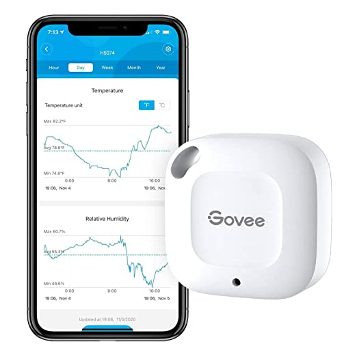 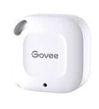
-20℃ ~ 60℃ (-4℉~140℉)
Powered by 1 CR2477 cell battery

## H5075
 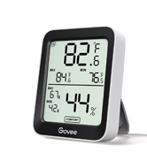
Powered by 2 AAA Batteries

## H5100
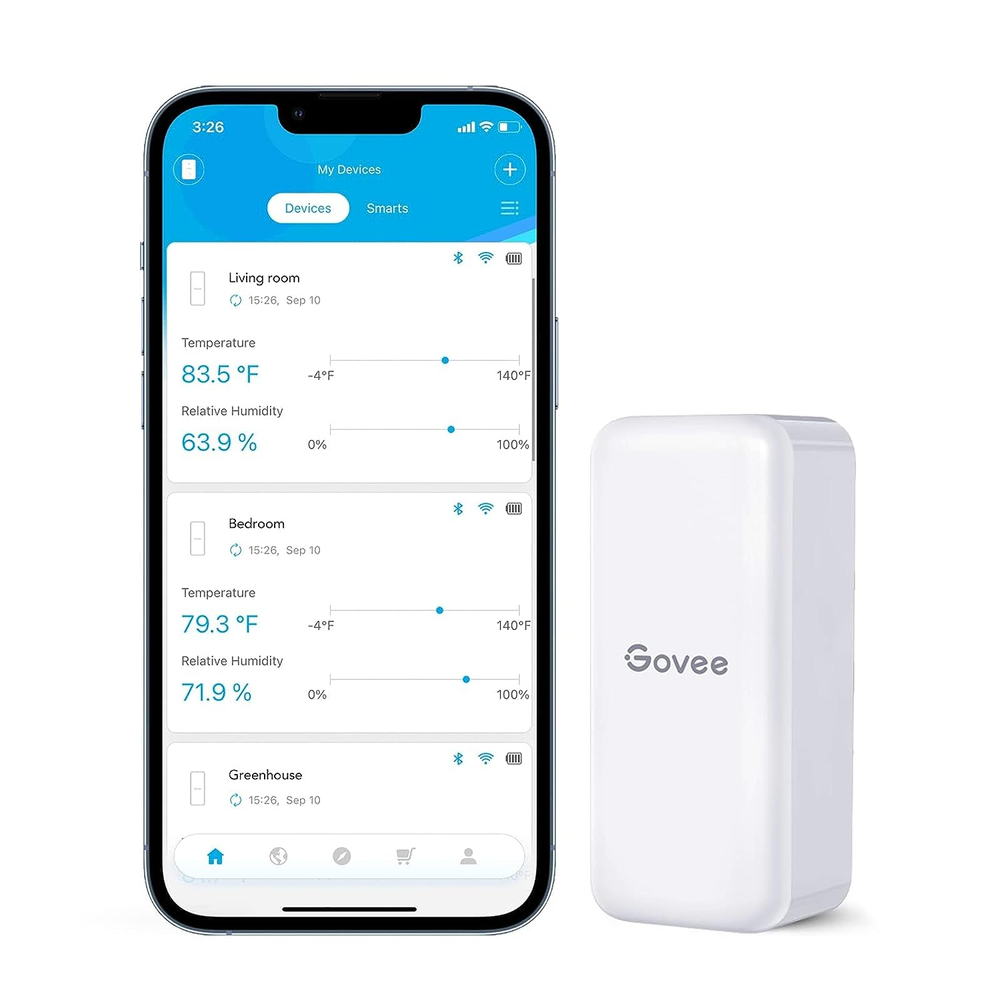
Powered by 1 AAA Battery

## H5101
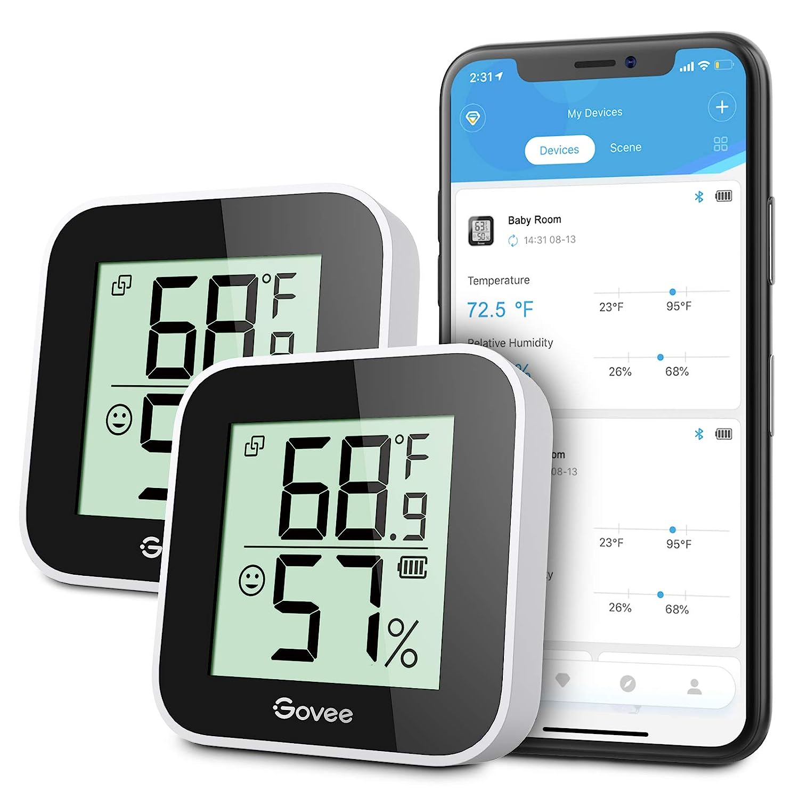
Powered by 1 CR2450 Battery

## H5104
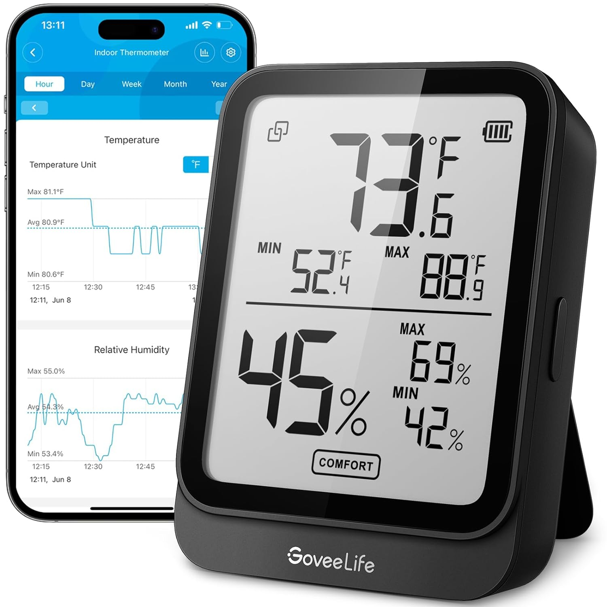
Powered by 2 AAA Batteries

## H5105
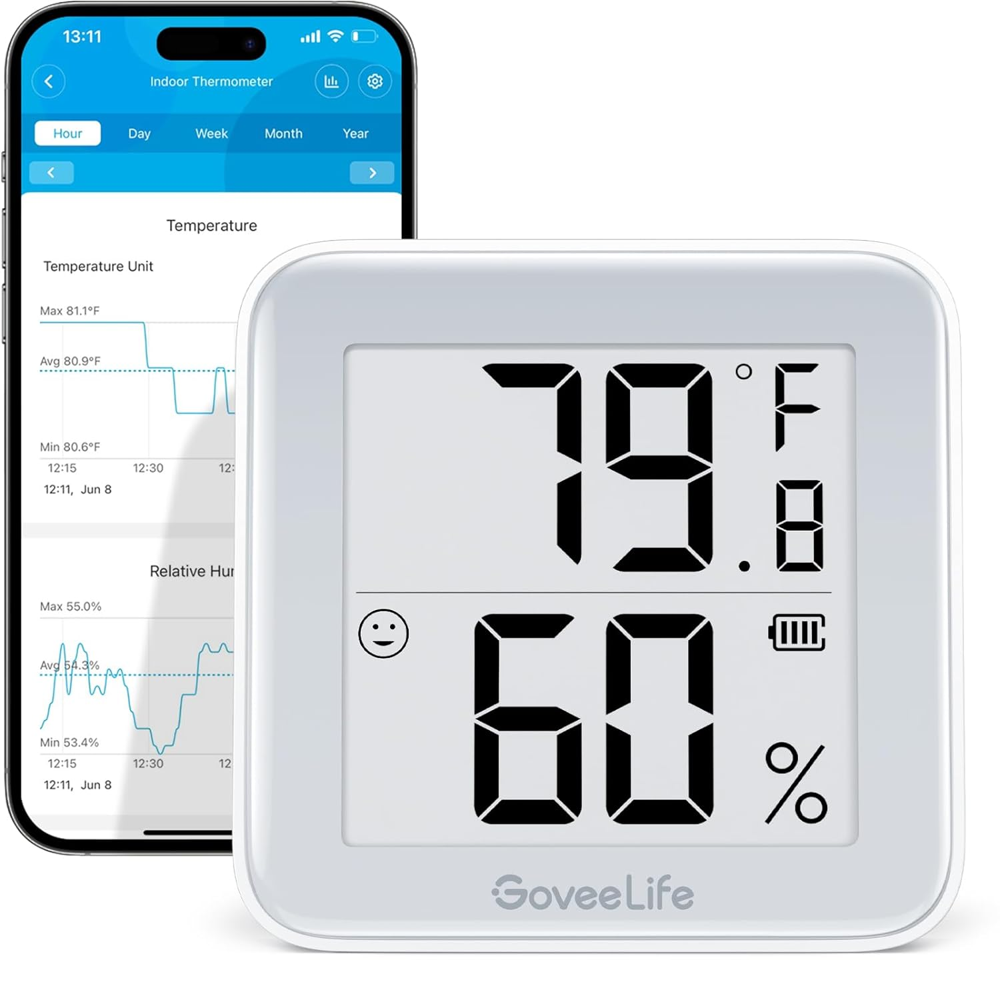
Powered by 1 CR2450 Battery

## H5174
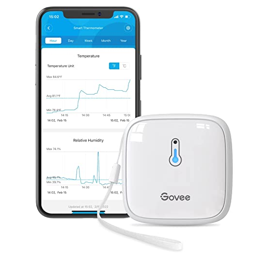
Powered by 3 AA Batteries

## H5177

Powered by 3 AA Batteries

## H5179
 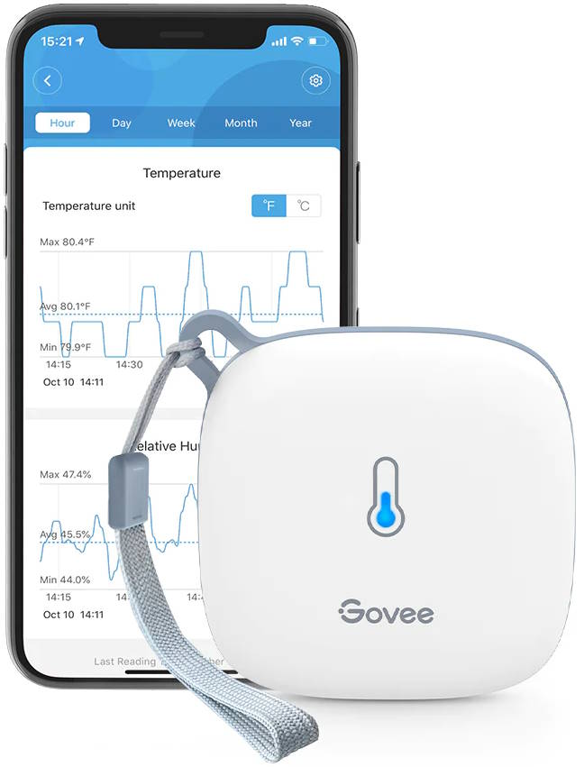
Powered by 3 AA Batteries

## H5072
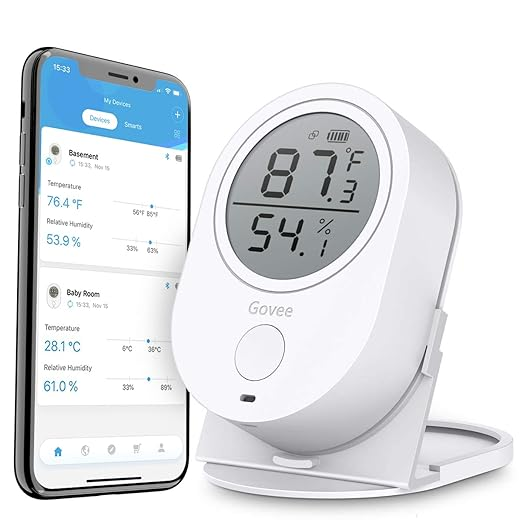
Powered by 3 AAA Batteries

## H5182
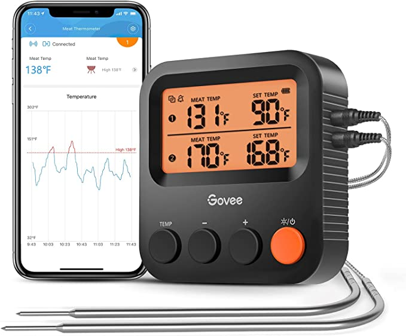 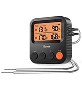
Powered by 2 AAA Batteries

## H5183
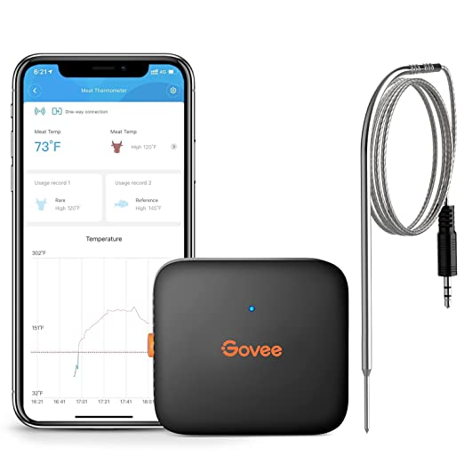
Powered by 1 AAA Battery

## H5184
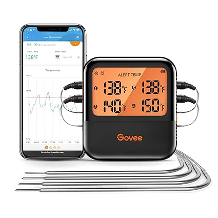
Powered by 2 AAA Batteries

## H5198
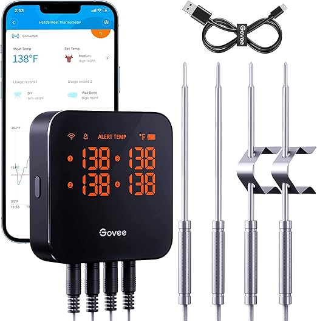
Powered by internal lithium battery. Charged by USB C

## Meat Thermometers
This image came from the replacement probe package for the meat thermometers. It's especially useful because it shows that the part numbers don't always report the number of probes.
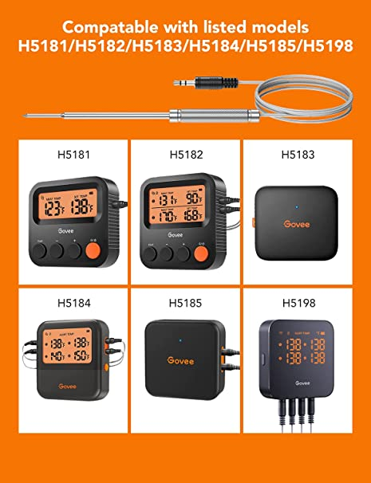 

## H5055
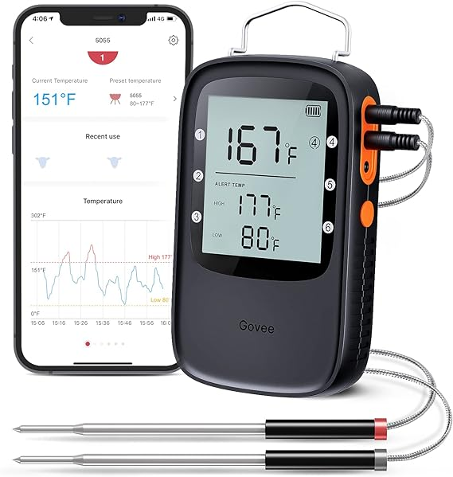
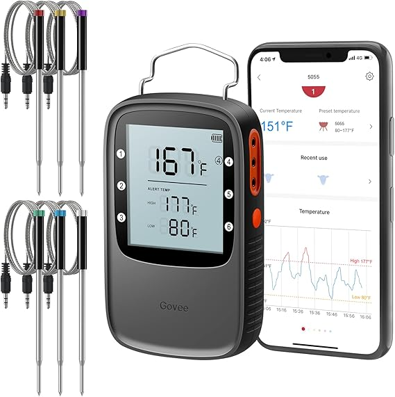
Powered by 2 AA Batteries
