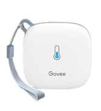

# Govee Product Images
I've found it hard to remember which device is which when referring to them by product numbers. I tried collecting images of each device here.

## H5074
 

## H5075
 

## H5174
 

## H5177

## H5182
 

## H5183

## Meat Thermometers
This image came from the replacement probe package for the meat thermometers. It's especially useful because it shows that the part numbers don't always report the number of probes.
 
