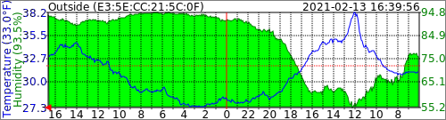
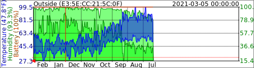

# GoveeBTTempLogger
Govee H5074, H5075, H5100, H5174, H5177, and H5179 Bluetooth Low Energy Temperature and Humidity Logger, and Govee H5181, H5182 and H5183 Smart Meat Thermometers

Uses libbluetooth functionality from BlueZ on linux to open the default Bluetooth device and listen for low energy advertisments from Govee thermometers.

Each of these devices currently cost less than $15 on Amazon and use BLE for communication, so don't require setting up a manufacterer account to track the data.  

GoveeBTTempLogger was initially built using Microsoft Visual Studio 2017, targeting ARM processor running on Linux. I'm using a Raspberry Pi 4 as my linux host. I've verified the same code works on a Raspbery Pi ZeroW and a Raspberry Pi 3b.

GoveeBTTempLogger creates a log file, if specified by the -l or --log option, for each of the devices it receives broadcasted data from using a simple tab-separated format that's compatible with loading in Microsoft Excel. Each line in the log file has Date, Temperature, relative humidity, and battery percent. The log file naming format includes the unique Govee device name, the current year, and month. A new log file is created monthly.

### Issue related to Pi Zero 2 W 2023-09-01
There seems to be a problem with Bluetooth on the Raspberry Pi Zero 2 W and Raspbian GNU/Linux 11 (bullseye) where BTLE Scanning doesn't start. It's reported to work on the same hardware if running Raspbian GNU/Linux 10 (buster) https://github.com/wcbonner/GoveeBTTempLogger/issues/50 Any suggestions for a solution are appreciated. 

### Minor update 2022-12-17
Added the option --index to create an html index file based on the existing log files. Example command to create index: 

```sh
sudo /usr/local/bin/goveebttemplogger --log /var/log/goveebttemplogger/ --index index.html
```

## Major update to version 2.
Added the SVG output function, directly creating SVG graphs from internal data in a specified directory. The causes the program to take longer to start up as it will attempt to read all of the old logged data into an internal memory structure as it starts. Once the program has entered the normal running state it writes four SVG files per device to the specified directory every five minutes.

Here is an example filename: gvh-E35ECC215C0F-day.svg



The most recent temperature and humidity are displayed in the vertical scale on the left. The temperature scale is displayed on the left side of the graph, the humidity scale on the right. The most recent time data is displayed in the top right, with a title on the top left of the graph.

Minimum and maximum temperature and humidity data, at the granularity of the graph, may be displayed. This is most useful in yearly graphs, where the granularity is one day. Here is the corresponding yearly graph for the previous daily graph: gvh-E35ECC215C0F-year.svg



Humidity, and the humidity scale on the right, are automatically omitted if the current data reports a humidity of zero. The meat thermometer reports its current temperature and its alarm set temperature but no humidity measurement.

A simple text file mapping Bluetooth addresses to titles will be read from the filename gvh-titlemap.txt in the svg output directory.  Each line in the file should consist of the bluetooth address (in hexadecimal format with (`:`) between octets), whitespace, and the title. See [gvh-titlemap.txt](./gvh-titlemap.txt) for an example. If no title mapping exists, the Bluetooth address is used for the graph title.

If the --svg option is not added to the command line, the program should continue to operate exactly the same as it did before.

## Verbosity has been significantly changed since the intial release.

 * -v 0 no output to stdout. Errors still sent to stderr.
 * -v 1 prints all advertisments that have been decoded from Govee H5075, H5074, H5174, and H5177 thermometers to stdout.
 * -v 2 prints all advertisments recieved and categorized
 * -v levels higher than 2 print way too much debugging information, but can be interesting to look at.

## Prerequisites

### Linux

 * Kernel version 3.6 or above
 * ```libbluetooth-dev```
 
#### Ubuntu/Debian/Raspbian

Note: be sure to clone this repository.

```sh
git clone https://github.com/wcbonner/GoveeBTTempLogger.git
cd GoveeBTTempLogger
sudo apt install bluetooth bluez libbluetooth-dev dpkg-dev
make deb
sudo make install-deb
```

This will install a systemd unit `goveebttemplogger.service` which will automatically start GoveeBTTempLogger. The service can be configured using environment variables via
the `systemctl edit goveebttemplogger.service` command. By default, it writes logs to `/var/log/goveebttemplogger` and writes SVG files to `/var/www/html/goveebttemplogger`.

The following environment variables control the service:

* `VERBOSITY` controlls the verbosity level; default: `0`
* `LOGDIR` directory the TSV files are written to; default: `/var/log/goveebttemplogger`
* `TIME` Sets the frequency data is written to the logs; default: `60`
* `SVGARGS` controlls options for writing SVG files; default: `--svg /var/www/html/goveebttemplogger/ --battery 8 --minmax 8`
* `EXTRAARGS` can be used to pass extra arguments; default is unset (empty)

As an example, to disable SVG files, increase verbosity, and change the directory the TSV files are written to, use 
`sudo systemctl edit goveebttemplogger.service` and enter the following file in the editor:

```
[Service]
Environment="VERBOSITY=1"
Environment="LOGDIR=/opt/govee/data"
Environment="SVGARGS="
```

Then use `sudo systemctl restart goveebttemplogger` to restart GoveeBTTempLogger.

#### Windows Subsystem for Linux (WSL) Cross Compile requirements (Debian)

The first two commands below set up the required environment for Visual Studio 2022 to build the project. The third command added the required libraries to build bluetooth projects.

```sh
sudo apt-get update
sudo apt install g++ gdb make ninja-build rsync zip -y
sudo apt install bluetooth bluez libbluetooth-dev -y
```

## Command Line Options
 * -h (--help) Prints supported options and exits.
 * -l (--log) Sets the log directory. If not specified, no logs are written.
 * -t (--time) Sets the frequency data is written to the logs. The time frequency of the data in the logs is based on bluetooth announcement time. This is how often the logfile is written.
 * -v (--verbose) Sets output verbosity.
 * -m (--mrtg) Takes a bluetooth address as parameter, returns data for that particular address in the format MRTG can interpret.
 * -o (--only) Takes a bluetooth address as parameter and only reports on that address.
 * -C (--controller) Takes a bluetooth address as parameter to specify the controller to listen with.
 * -a (--average) Affects MRTG output. The parameter is a number of minutes. 0 simply returns the last value in the log file. Any number more than zero will average the entries over that number of minutes. If no entries were logged in that time period, no results are returned. MRTG graphing is then determined by the setting of the unknaszero option in the MRTG.conf file.
 * -d (--download) download the 20 days historical data from each device. This is still very much a work in progress.
 * -s (--svg) SVG output directory. Writes four SVG files per device to this directory every 5 minutes that can be used in standard web page. 
 * -i (--index) HTML index file for SVG files, must be paired with log directory. HTML file is a fully qualified name. This is meant as a one time run option just to create a simple index of all the SVG files.
 * -T (--titlemap) SVG-title fully-qualified-filename. A mapfile with bluetooth addresses as the beginning of each line, and a replacement title to be used in the SVG graph.
 * -c (--celsius) SVG output using degrees C
 * -b (--battery) Draw the battery status on SVG graphs. 1:daily, 2:weekly, 4:monthly, 8:yearly
 * -x (--minmax) Draw the minimum and maximum temperature and humidity status on SVG graphs. 1:daily, 2:weekly, 4:monthly, 8:yearly
 * -d (--download) Periodically attempt to connect and download stored data
 * -p (--passive) Bluetooth LE Passive Scanning
 * -n (--no-bluetooth) Monitor Logging Directory and process logs without Bluetooth Scanning

 ## Log File Format

 The log file format has been stable for a long time as a simple tab-separated text file with a set number of columns: Date (UTC), Temperature (C), Humidity, Battery.

 With the addition of support for the meat thermometers multiple temperature readings, I've changed the format slightly in a way that should be backwards compatible with most programs reading existing logs. After the existing columns of Date, Temperature, Humidity, Battery I've added optional columns of Model, Temperature, Temperature, Temperature
 
 ### Minor update 2023-04-03
 I changed the default log filename to start with `gvh-` instead of `gvh507x_`. The code will still read the old log files, and will rename the current months log file to the new format. I used the linux shell command `for f in gvh507x_*.txt; do sudo mv "${f}" "${f//gvh507x_/gvh-}"; done` in the log file directory to rename all of the old files to the new format on my machine.

 ## Bluetooth UUID details
  * (UUID) 88EC (Name) Govee_H5074_C7A1
  * (Name) GVH5075_AE36 (UUID) 88EC
  * (Name) GVH5174_CC3D (UUID) 88EC
  * (Name) GVH5177_3B10 (UUID) 88EC
  * (UUID) 5182
  * (UUID) 5183

The 5074, 5075, 5174, and 5177 units all broadcast a UUID of 88EC. Unfortunately, the 5074 does not include the UUID in the same advertisment as the temperatures. 

The H5181, 5182 and 5183 units broadcast UUID of 5182 and 5183 respectivly in each of their broadcast messages including the temperatures.
```
(Flags) 06 (UUID) 5182 (Manu) 3013270100010164018007D0FFFF860708FFFF (Temp) 20°C (Temp) -0.01°C (Temp) 18°C (Temp) -0.01°C (Battery) 0%
(UUID) 5183 (Flags) 05 (Manu) 5DA1B401000101E40186076C2F660000 (Temp) 19°C (Temp) 121.34°C (Battery) 0% (Other: 00)  (Other: 00)  (Other: 00)  (Other: 00)  (Other: 00)  (Other: CB)
```

## Download Details
It has taken me a long time to get around to downloading data from the devices directly instead of purely listening for advertisments. The direct download method is nice because it can retrieve data accumulated while the listener was offline. 

I have also run into problems recognizing advertisments. This has led to too much time experimenting with the method of scanning for bluetooth advertisments, primarily with the settings of ScanWindow and ScanInterval, but also with the difference between active scanning and passive scanning. 
### Passive Scanning
In this mode that program is doing excactly what you'd expect, listening for advertisments.
### Active Scanning
In this mode the bluetooth stack itself will attempt to connect to devices it recives advertisments from and retrieve more information. 
### Scan Window vs Scan Interval
For the longest time I've had fixed values set in my code for Scan Window and Scan Interval quickly being set to bt_ScanInterval(0x0012) bt_ScanWindow(0x0012) followed by bt_ScanInterval(0x1f40) bt_ScanWindow(0x1f40).
The values are in increments of 0.625 msec. The First value was 11.25 msec, and the second value was  (5000 msec).
Doing a bunch of reading I came across recommendations to use 40 msec and 30 msec, so I've tried bt_ScanInterval(64) and bt_ScanWindow(48). When it's set this way, I seem to get advertisments, but I'm not able to connect and download.

## --only ff:ff:ff:ff:ff:ff Hack
I included a hack some time ago related to the bluetooth filtering to easily filter on devices that have already been logged. If a filter is specified with all the bits set, the program will submit a filter of known addresses to the stack when scanning is started. This disables new device discovery, but may improve performance in some situations.

Connections on bluetooth devices are all based on handles and UUIDs. There are some defined UUIDs that every bluetooth device is required to support, and then there are custom UUIDs. This listing came from a GVH5177. 
```
[-------------------] Service Handles: 0x0001..0x0007 UUID: 1800 (Generic Access)
[                   ] Characteristic Handles: 0x0002..0x0003 Properties: 0x12 UUID: 2a00 (Device Name)
[                   ] Characteristic Handles: 0x0004..0x0005 Properties: 0x02 UUID: 2a01 (Appearance)
[                   ] Characteristic Handles: 0x0006..0x0007 Properties: 0x02 UUID: 2a04 (Peripheral Preferred Connection Parameters)
[-------------------] Service Handles: 0x0008..0x000b UUID: 1801 (Generic Attribute)
[                   ] Characteristic Handles: 0x0009..0x000a Properties: 0x20 UUID: 2a05 (Service Changed)
[-------------------] Service Handles: 0x000c..0x000e UUID: 180a (Device Information)
[                   ] Characteristic Handles: 0x000d..0x000e Properties: 0x02 UUID: 2a50 (PnP ID)
[-------------------] Service Handles: 0x000f..0x001b UUID: 57485f53-4b43-4f52-5f49-4c4c45544e49
[                   ] Characteristic Handles: 0x0010..0x0011 Properties: 0x1a UUID: 11205f53-4b43-4f52-5f49-4c4c45544e49
[                   ] Characteristic Handles: 0x0014..0x0015 Properties: 0x1a UUID: 12205f53-4b43-4f52-5f49-4c4c45544e49
[                   ] Characteristic Handles: 0x0018..0x0019 Properties: 0x12 UUID: 13205f53-4b43-4f52-5f49-4c4c45544e49
[-------------------] Service Handles: 0x001c..0x001f UUID: 12190d0c-0b0a-0908-0706-050403020100
[                   ] Characteristic Handles: 0x001d..0x001e Properties: 0x06 UUID: 122b0d0c-0b0a-0908-0706-050403020100
```
**57485f53-4b43-4f52-5f49-4c4c45544e49** is the custom 128 bit UUID that all of the Govee thermometers seem to use for their primary service. If printed as an ascii string, it looks like this text backwards **INTELLI_ROCKS_HW**.  (**WH_SKCOR_ILLETNI**)

**12205f53-4b43-4f52-5f49-4c4c45544e49** is the 128 bit UUID of the service characteristic that I write to enable download of data. It looks like the primary UUID except that the first two bytes are different. **INTELLI_ROCKS_**.  (**_SKCOR_ILLETNI**)

Most of the devices hold 20 days of history. The GVH5177 and GVH5174 devices hald a month of data.
```
Feb 23 13:52:39 WimPi4 goveebttemplogger[28158]: Download from device: [A4:C1:38:DC:CC:3D] 2023-02-03 13:52:00 2023-02-23 13:52:00 (28800)
Feb 23 13:53:07 WimPi4 goveebttemplogger[28158]: Download from device: [A4:C1:38:EC:0B:03] 2023-02-03 13:51:00 2023-02-23 13:52:00 (28801)
Feb 23 13:53:40 WimPi4 goveebttemplogger[28158]: Download from device: [E3:5E:CC:21:5C:0F] 2023-02-03 13:53:00 2023-02-23 13:53:00 (28800)
Feb 23 13:54:25 WimPi4 goveebttemplogger[28158]: Download from device: [A4:C1:38:0D:3B:10] 2023-01-24 13:50:00 2023-02-23 13:53:00 (43203)
Feb 23 13:55:28 WimPi4 goveebttemplogger[28158]: Download from device: [A4:C1:38:D5:A3:3B] 2023-02-03 13:54:00 2023-02-23 13:54:00 (28800)
Feb 23 13:56:14 WimPi4 goveebttemplogger[28158]: Download from device: [A4:C1:38:65:A2:6A] 2023-02-03 13:52:00 2023-02-23 13:55:00 (28803)
Feb 23 13:57:05 WimPi4 goveebttemplogger[28158]: Download from device: [A4:C1:38:05:C7:A1] 2023-02-03 13:53:00 2023-02-23 13:56:00 (28803)
Feb 23 13:58:00 WimPi4 goveebttemplogger[28158]: Download from device: [A4:C1:38:13:AE:36] 2023-02-03 13:54:00 2023-02-23 13:57:00 (28803)
```

## BTData directory contains Data Dumps
The file btsnoop_hci.log is a Bluetooth hci snoop log from a Google Nexus 7 device running Android and the Govee Home App.
