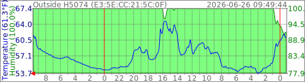
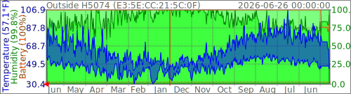

# GoveeBTTempLogger
Govee H5074, H5075, H5100, H5101, H5104, H5105, H5110, H5111, H5174, H5177, and H5179 Bluetooth Low Energy Temperature and Humidity Logger, and Govee H5181, H5182 and H5183 Smart Meat Thermometers

Each of these devices currently cost less than $15 on Amazon and use BLE for communication, so don't require setting up a manufacterer account to track the data.  

GoveeBTTempLogger was initially built using Microsoft Visual Studio 2017, targeting ARM processor running on Linux. I'm using a Raspberry Pi 4 as my linux host. I've verified the same code works on a Raspbery Pi ZeroW, Raspberry Pi Zero2W, Raspberry Pi 3b, and a Raspberry Pi 5.

GoveeBTTempLogger creates a log file, if specified by the -l or --log option, for each of the devices it receives broadcasted data from using a simple tab-separated format that's compatible with loading in Microsoft Excel. Each line in the log file has Date (recorded in UTC), Temperature, relative humidity, and battery percent. The log file naming format includes the unique Govee device name, the current year, and month. A new log file is created monthly.

## Update to Version 4 (2026-04-18)
### 2026-04-17 Ruuvi Tag support
I'm reading and logging Ruuvi tag bluetooth advertisments. See [ruuvi](ruuvi/) for more details.

I've changed some code to use templates to allow the same code to be used for both Govee and Ruuvi devices.
The program will automatically determine if a bluetooth advertisment is from a Govee or Ruuvi device and log the data accordingly. 
The log file format is similar but different. The Ruuvi log files have "ruuvi" in the filename instead of "gvh".

### 2026-02-12 Modification to user creation and groups
Access to the /dev/rfkill device for writing seems to be allowed by adding the user goveebttemplogger to the group "netdev". 
I've added this to the postinst script. I've also changed the inclusion of the user in the www-data group to be a secondary 
group instead of the primary group, which seems to be more standard for system users.

### 2026-02-11 rfkill support
I have been having a recurrent problem with rfkill soft blocking the bluetooth adapter on my Raspberry Pi 4. 
I have added code to display the rfkill status of all devices in /dev/rfkill and unblock all bluetooth adapters.
With the addition of the code in the program, I removed the calls to the external rfkill command in the postint script.

### Trixie Release Information 2025-10-07
Raspberry released the update to Trixie this week https://www.raspberrypi.com/news/trixie-the-new-version-of-raspberry-pi-os/ and while GoveeBTTempLogger works on the updated system, the built in bluetooth is blocked on many systems. 
I had two issues open related to Trixie, https://github.com/wcbonner/GoveeBTTempLogger/issues/89 and https://github.com/wcbonner/GoveeBTTempLogger/issues/91 with the second finding the solution, which is to run the command `rfkill unblock bluetooth` 
```
wim@WimPiZeroW-Sola:~ $ rfkill
ID TYPE      DEVICE      SOFT      HARD
 0 bluetooth hci0     blocked unblocked
 1 wlan      phy0   unblocked unblocked
```

### Minor update 2022-12-17
Added the option --index to create an html index file based on the existing log files. This option creates an index file and exits without running any of the bluetooth code. It can be run without affecting a running instance of the program listening to Bluetooth advertisments. Example command to create index: 

```sh
sudo /usr/local/bin/goveebttemplogger --log /var/log/goveebttemplogger/ --index index.html
```

## Major update to version 3.
Conversion to Bluetooth using BlueZ over DBus!
DBus is the approved method of Bluetooth communication. 
It seems to use more CPU than the pure HCI code.
When I tried building this on a machine running Raspbian GNU/Linux 10 (buster) the system builds but the BlueZ DBus routines to find the bluetooth adapter fail. 
For this reason, I've left the old HCI commands in the code and fallback to running HCI if DBus fails. 

I've added an --HCI option to allow the user to force it to run the HCI commands instead of using the DBus interface.

When running DBus, there is no way to run in passive scanning mode. The --passive option is ignored.

When running HCI mode, the whitelist created with the --only option is sent to the bluetooth hardware and only those devices are sent from the hardware to the software.
In DBus mode whitelisting does not appear to be available.
In DBus mode I'm filtering the output based on the whitelist.

### 2024-10-10 HCI Code in #ifdef sections
The code has been rearranged slightly for clarity, moving all of the HCI access code into #ifdef blocks. 
The CMakeLists.txt file defines \_BLUEZ_HCI\_ to keep the code in the application. 
Removing or commenting out the line add_compile_definitions(_BLUEZ_HCI_) will compile without the Bluetooth HCI libraries.
I should also be able to ignore the files att-types.h, uuid.c, and uuid.h. I'm proficient at CMake to do this yet.

HCI code uses libbluetooth functionality from BlueZ on linux to open the default Bluetooth device and listen for low energy advertisments from Govee thermometers.

### 2024-10-01 Run As goveebttemplogger
Updated the postinst debian install script to add a user goveebttemplogger and make changes to the permissions on the default directories appropriately.
Changed the service file to specify running the program as user goveebttemplogger. This is possible because accessing BlueZ via DBus does not require root access.

### 2025-02-18 Added --download to default service command
The download functionality is now working with the DBus code base as well as being more robust using the HCI code. As such I've added it to the default running configuration. 
It does not attempt to download data more than every two weeks, to reduce battery usage of the bluetooth device.
It retrieves the oldest data first, and if the transfer is stopped midway, will attempt to start from the new "oldest" data downloaded.

## Major update to version 2.
Added the SVG output function, directly creating SVG graphs from internal data in a specified directory. The causes the program to take longer to start up as it will attempt to read all of the old logged data into an internal memory structure as it starts. Once the program has entered the normal running state it writes four SVG files per device to the specified directory every five minutes.

Here is an example filename: gvh-E35ECC215C0F-day.svg



The most recent temperature and humidity are displayed in the vertical scale on the left. The temperature scale is displayed on the left side of the graph, the humidity scale on the right. The most recent time data is displayed in the top right, with a title on the top left of the graph.

Minimum and maximum temperature and humidity data, at the granularity of the graph, may be displayed. This is most useful in yearly graphs, where the granularity is one day. Here is the corresponding yearly graph for the previous daily graph: gvh-E35ECC215C0F-year.svg



Humidity, and the humidity scale on the right, are automatically omitted if the current data reports a humidity of zero. The meat thermometer reports its current temperature and its alarm set temperature but no humidity measurement.

A simple text file mapping Bluetooth addresses to titles will be read from the filename gvh-titlemap.txt in the svg output directory.  Each line in the file should consist of the bluetooth address (in hexadecimal format with (`:`) between octets), whitespace, and the title. See [gvh-titlemap.txt](./gvh-titlemap.txt) for an example. If no title mapping exists, the Bluetooth address is used for the graph title.

If the --svg option is not added to the command line, the program should continue to operate exactly the same as it did before.

## Verbosity has been significantly changed since the intial release.

 * -v 0 no output to stdout. Errors still sent to stderr.
 * -v 1 prints all advertisments that have been decoded from Govee H5075, H5074, H5174, and H5177 thermometers to stdout.
 * -v 2 prints all advertisments recieved and categorized
 * -v levels higher than 2 print way too much debugging information, but can be interesting to look at.

## Prerequisites

### Linux

 * Kernel version 3.6 or above
 * ```libbluetooth-dev```
 * ```libdbus-1-dev```
 
#### Ubuntu/Debian/Raspbian

##### Build Process changed from using make with a makefile to cmake 2023-09-18
This seems to better build the debian package with the correct installed size, dependencies, and md5sums details. I'm still learning CMake so there may be regular updates for a while.

```sh
sudo apt install build-essential cmake git libbluetooth-dev libdbus-1-dev
git clone https://github.com/wcbonner/GoveeBTTempLogger.git
cmake -S GoveeBTTempLogger -B GoveeBTTempLogger/build
cmake --build GoveeBTTempLogger/build
pushd GoveeBTTempLogger/build && cpack . && popd
```

The install package will creates a systemd unit `goveebttemplogger.service` which will automatically start GoveeBTTempLogger. The service can be configured via
the `systemctl edit goveebttemplogger.service` command. By default, it writes logs to `/var/log/goveebttemplogger` and writes SVG files to `/var/www/html/goveebttemplogger`.


The [postinst](https://github.com/wcbonner/GoveeBTTempLogger/blob/master/postinst) install routine creates a user and three directories.
It also will change the permissions on those dirctories to be owned by and writable by the newly created user.
```
adduser --system --ingroup www-data goveebttemplogger
mkdir --verbose --mode 0755 --parents /var/log/goveebttemplogger /var/cache/goveebttemplogger /var/www/html/goveebttemplogger
chown --changes --recursive goveebttemplogger:www-data /var/log/goveebttemplogger /var/cache/goveebttemplogger /var/www/html/goveebttemplogger
chmod --changes --recursive 0644 /var/log/goveebttemplogger/* /var/cache/goveebttemplogger/* /var/www/html/goveebttemplogger/*
sudo setcap 'cap_net_raw,cap_net_admin+eip' /usr/local/bin/goveebttemplogger
```

##### Debian 13 (Trixie) 2025-12-08
The systemd unit file section `ExecStart` to start the service has been broken into several lines for clarity.

```
[Service]
Type=simple
Restart=always
RestartSec=30
User=goveebttemplogger
Group=www-data
ExecStart=/usr/local/bin/goveebttemplogger \
    --verbose 0 \
    --log /var/log/goveebttemplogger \
    --time 60 \
    --download 7 \
    --restart 3 \
    --svg /var/www/html/goveebttemplogger --battery 8 --minmax 8 \
    --cache /var/cache/goveebttemplogger
KillSignal=SIGINT
```

As an example, to disable SVG files, increase verbosity, and change the directory the log files are written to, use 
`sudo systemctl edit --full goveebttemplogger.service` and enter the following file in the editor:
```
[Service]
Type=simple
Restart=always
RestartSec=5
ExecStartPre=/bin/mkdir -p /var/log/gvh
ExecStart=/usr/local/bin/goveebttemplogger \
    --verbose 1 \
    --log /var/log/gvh \
    --time 60 \
    --download
KillSignal=SIGINT
```

Then use `sudo systemctl restart goveebttemplogger` to restart GoveeBTTempLogger.

#### Windows Subsystem for Linux (WSL) Cross Compile requirements (Debian)

The first two commands below set up the required environment for Visual Studio 2022 to build the project. The third command added the required libraries to build bluetooth projects.

```sh
sudo apt-get update
sudo apt install g++ gdb make ninja-build rsync zip -y
sudo apt install bluetooth bluez libbluetooth-dev -y
```

## Command Line Options
 * -h (--help) Prints supported options and exits.
 * -l (--log) Sets the log directory. If not specified, no logs are written.
 * -t (--time) Sets the frequency data is written to the logs. The time frequency of the data in the logs is based on bluetooth announcement time. This is how often the logfile is written.
 * -v (--verbose) Sets output verbosity.
 * -m (--mrtg) Takes a bluetooth address as parameter, returns data for that particular address in the format MRTG can interpret.
 * -o (--only) Takes a bluetooth address as parameter and only reports on that address.
 * -C (--controller) Takes a bluetooth address as parameter to specify the controller to listen with.
 * -a (--average) Affects MRTG output. The parameter is a number of minutes. 0 simply returns the last value in the log file. Any number more than zero will average the entries over that number of minutes. If no entries were logged in that time period, no results are returned. MRTG graphing is then determined by the setting of the unknaszero option in the MRTG.conf file.
 * -s (--svg) SVG output directory. Writes four SVG files per device to this directory every 5 minutes that can be used in standard web page. 
 * -i (--index) HTML index file for SVG files, must be paired with log directory. HTML file is a fully qualified name. This is meant as a one time run option just to create a simple index of all the SVG files. The program will exit after creating the index file.
 * -T (--titlemap) SVG-title fully-qualified-filename. A mapfile with bluetooth addresses as the beginning of each line, and a replacement title to be used in the SVG graph.
 * -c (--celsius) SVG output using degrees C
 * -b (--battery) Draw the battery status on SVG graphs. 1:daily, 2:weekly, 4:monthly, 8:yearly
 * -x (--minmax) Draw the minimum and maximum temperature and humidity status on SVG graphs. 1:daily, 2:weekly, 4:monthly, 8:yearly
 * -d (--download) Sets the number of days between attempts to connect and download stored data
 * -n (--no-bluetooth) Monitor Logging Directory and process logs without Bluetooth Scanning
 * -M (--monitor) Monitor Logged Data for updated data
 * -R (--restart) Maximum minutes without bluetooth advertisments before attempting to restart
 * -H (--HCI) Prefer deprecated BlueZ HCI interface over modern DBus communication
 * -p (--passive) Bluetooth LE Passive Scanning

## Overview of gvh-organizelogs
### Introduction to gvh-organizelogs
gvh-organizelogs has existed as a separate program for some time. It was developed to streamline log files by internally sorting the data, eliminating exact duplicate lines, and removing unnecessary characters.
### New Feature: Directory Merge Capability 2026-03-08
The program is now being enhanced with a new feature: the ability to specify a directory containing data to merge into the primary log directory.
### Merge Process Workflow
The merging process involves loading each log file from the designated merge directory, sorting its contents, and then appending the sorted lines to the appropriate files in the main log directory. This assignment is based on the Bluetooth address and timestamp found in each data line from the merge file.
```
Usage: gvh-organizelogs [options]
  GoveeBTTempLogOrganizer Version 3.20260308.0 Built on: Mar  8 2026 at 12:46:14
  Options:
    -h | --help          Print this message
    -l | --log name      Logging Directory [""]
    -f | --file name     Single log file to process []
    -b | --backup name   Backup Directory [""]
    -m | --merge name    Merge Directory [""]
```

## Log File Format

The log file format has been stable for a long time as a simple tab-separated text file with a set number of columns: Date (UTC), Temperature (C), Humidity, Battery.

With the addition of support for the meat thermometers multiple temperature readings, I've changed the format slightly in a way that should be backwards compatible with most programs reading existing logs. After the existing columns of Date, Temperature, Humidity, Battery I've added optional columns of Model, Temperature, Temperature, Temperature
 
### Minor update 2023-04-03
I changed the default log filename to start with `gvh-` instead of `gvh507x_`. The code will still read the old log files, and will rename the current months log file to the new format. I used the linux shell command `for f in gvh507x_*.txt; do sudo mv "${f}" "${f//gvh507x_/gvh-}"; done` in the log file directory to rename all of the old files to the new format on my machine.

## Bluetooth UUID details
* (UUID) 88EC (Name) Govee_H5074_C7A1
* (Name) GVH5075_AE36 (UUID) 88EC
* (Name) GVH5174_CC3D (UUID) 88EC
* (Name) GVH5177_3B10 (UUID) 88EC
* (UUID) 5182
* (UUID) 5183

The 5074, 5075, 5174, and 5177 units all broadcast a UUID of 88EC. Unfortunately, the 5074 does not include the UUID in the same advertisment as the temperatures. 

The H5181, 5182 and 5183 units broadcast UUID of 5182 and 5183 respectivly in each of their broadcast messages including the temperatures.
```
(Flags) 06 (UUID) 5182 (Manu) 3013270100010164018007D0FFFF860708FFFF (Temp) 20°C (Temp) -0.01°C (Temp) 18°C (Temp) -0.01°C (Battery) 0%
(UUID) 5183 (Flags) 05 (Manu) 5DA1B401000101E40186076C2F660000 (Temp) 19°C (Temp) 121.34°C (Battery) 0% (Other: 00)  (Other: 00)  (Other: 00)  (Other: 00)  (Other: 00)  (Other: CB)
```

## Download Details
It has taken me a long time to get around to downloading data from the devices directly instead of purely listening for advertisments. The direct download method is nice because it can retrieve data accumulated while the listener was offline. 

#### 2024-01-14 H5105 support
It appears that the H5105 broadcast data is automatically recognized as a Govee thermometer and data stored, but downloading is not working. The H5105 has a pairing button on the top of the device. I've noticed that the H5100 device does not seem to be downloading historical data either. They may use the same protocol, different from the older thermometers.

##### 2024-02-03 H5100 and H5105 Device Support
I've made a couple of hacks to get the two devices I have at my location to work. The H5100 device I have has a bluetooth address that starts with a C, the H5105 device starts with a D. The realy big issue is that to communicate with them, the protocol must declare that it's talking with LE_RANDOM_ADDRESS as opposed to LE_PUBLIC_ADDRESS that the other devices I've used require. This also comes into play if a bluetooth filter is configured to only listen to certain devices. I don't understand this setup as according to what I've read, if the most significant bits of the 48 bit bluetooth address are set to one, that defines the address as RANDOM, which would mean that a C, D, E, or F in the leading digit of the address should all require RANDOM. 

I have run into problems recognizing advertisments. This has led to too much time experimenting with the method of scanning for bluetooth advertisments, primarily with the settings of ScanWindow and ScanInterval, but also with the difference between active scanning and passive scanning. 
### Passive Scanning
In this mode that program is doing excactly what you'd expect, listening for advertisments.
### Active Scanning
In this mode the bluetooth stack itself will attempt to connect to devices it recives advertisments from and retrieve more information. 
### Scan Window vs Scan Interval
For the longest time I've had fixed values set in my code for Scan Window and Scan Interval quickly being set to bt_ScanInterval(0x0012) bt_ScanWindow(0x0012) followed by bt_ScanInterval(0x1f40) bt_ScanWindow(0x1f40).
The values are in increments of 0.625 msec. The First value was 11.25 msec, and the second value was  (5000 msec).
Doing a bunch of reading I came across recommendations to use 40 msec and 30 msec, so I've tried bt_ScanInterval(64) and bt_ScanWindow(48). When it's set this way, I seem to get advertisments, but I'm not able to connect and download.

## --only ff:ff:ff:ff:ff:ff Hack
I included a hack some time ago related to the bluetooth filtering to easily filter on devices that have already been logged. If a filter is specified with all the bits set, the program will submit a filter of known addresses to the stack when scanning is started. This disables new device discovery, but may improve performance in some situations.

Connections on bluetooth devices are all based on handles and UUIDs. There are some defined UUIDs that every bluetooth device is required to support, and then there are custom UUIDs. This listing came from a GVH5177. 
```
[-------------------] Service Handles: 0x0001..0x0007 UUID: 1800 (Generic Access)
[                   ] Characteristic Handles: 0x0002..0x0003 Properties: 0x12 UUID: 2a00 (Device Name)
[                   ] Characteristic Handles: 0x0004..0x0005 Properties: 0x02 UUID: 2a01 (Appearance)
[                   ] Characteristic Handles: 0x0006..0x0007 Properties: 0x02 UUID: 2a04 (Peripheral Preferred Connection Parameters)
[-------------------] Service Handles: 0x0008..0x000b UUID: 1801 (Generic Attribute)
[                   ] Characteristic Handles: 0x0009..0x000a Properties: 0x20 UUID: 2a05 (Service Changed)
[-------------------] Service Handles: 0x000c..0x000e UUID: 180a (Device Information)
[                   ] Characteristic Handles: 0x000d..0x000e Properties: 0x02 UUID: 2a50 (PnP ID)
[-------------------] Service Handles: 0x000f..0x001b UUID: 494e5445-4c4c-495f-524f-434b535f4857
[                   ] Characteristic Handles: 0x0010..0x0011 Properties: 0x1a UUID: 494e5445-4c4c-495f-524f-434b535f2011
[                   ] Characteristic Handles: 0x0014..0x0015 Properties: 0x1a UUID: 494e5445-4c4c-495f-524f-434b535f2012
[                   ] Characteristic Handles: 0x0018..0x0019 Properties: 0x12 UUID: 494e5445-4c4c-495f-524f-434b535f2013
[-------------------] Service Handles: 0x001c..0x001f UUID: 00010203-0405-0607-0809-0a0b0c0d1912
[                   ] Characteristic Handles: 0x001d..0x001e Properties: 0x06 UUID: 00010203-0405-0607-0809-0a0b0c0d2b12
```
##### 2025-02-18 128 bit UUID output
My old code didn't properly display the UUID when it was a 128 bit UUID, I standardized on the proper output and have corrected this readme with updated respresentation. Thanks to [govee-h5075-thermo-hygrometer](https://github.com/Heckie75/govee-h5075-thermo-hygrometer/blob/main/API.md) I understand the three primary UUIDs much better.

**494e5445-4c4c-495f-524f-434b535f4857** is the custom 128 bit UUID that all of the Govee thermometers seem to use for their primary service. If printed as an ascii string, it looks like this text **INTELLI_ROCKS_HW**.

**494e5445-4c4c-495f-524f-434b535f2011** is the 128 bit UUID used for command and responses. There commands are well documented at the previous link.

**494e5445-4c4c-495f-524f-434b535f2012** is the 128 bit UUID of the service characteristic that I write to request download of data. It looks like the primary UUID except that the first two bytes are different. **INTELLI_ROCKS_**.

**494e5445-4c4c-495f-524f-434b535f2013** is the 128 bit UUID that will return requested historical data.

Finding other code working with Govee devices is easist to search for the UUIDs. 
Search GitHub code for [Govee Service UUID](https://github.com/search?q=494e5445-4c4c-495f-524f-434b535f4857&type=code), 
search GitHub code for [Govee Characteristic UUID (write)](https://github.com/search?q=494e5445-4c4c-495f-524f-434b535f2011&type=code),
search GitHub code for [Govee Characteristic UUID (notify)](https://github.com/search?q=494e5445-4c4c-495f-524f-434b535f2012&type=code),
or search Google for [all three UUIDs](https://www.google.com/search?q=494e5445-4c4c-495f-524f-434b535f4857+OR+494e5445-4c4c-495f-524f-434b535f2011+OR+494e5445-4c4c-495f-524f-434b535f2012)

Most of the devices hold 20 days of history. The GVH5177 devices hold a month of data. In my output below, the GVH5105 and GVH5179 devices have had their batteries replaced within the last month and I was not able to determine the historical data size.

```
Download from device: [E3:5E:CC:21:5C:0F] 2026-05-01 00:42:00 2026-05-21 00:44:00 (28802) (GVH5074) HW:1.01.00
Download from device: [E3:60:59:21:80:65] 2026-05-01 00:38:00 2026-05-21 00:43:00 (28805) (GVH5074) HW:1.01.04
Download from device: [A4:C1:38:D5:A3:3B] 2025-02-10 20:55:00 2025-03-02 20:57:00 (28802) (GVH5074)
Download from device: [A4:C1:38:05:C7:A1] 2026-05-01 00:54:00 2026-05-21 00:54:00 (28800) (GVH5074)
Download from device: [E3:8E:C8:C1:98:9A] 2026-05-01 00:41:00 2026-05-21 00:41:00 (28800) (GVH5074) HW:1.01.04
Download from device: [E3:60:59:23:14:7D] 2026-05-01 00:36:00 2026-05-21 00:38:00 (28802) (GVH5074) HW:1.01.04
Download from device: [A4:C1:38:37:BC:AE] 2026-05-01 00:41:00 2026-05-21 00:42:00 (28801) (GVH5075)
Download from device: [A4:C1:38:0D:42:7B] 2026-05-01 00:40:00 2026-05-21 00:43:00 (28803) (GVH5075)
Download from device: [C2:35:33:30:25:50] 2026-05-01 00:39:00 2026-05-21 00:39:00 (28800) (GVH5100) FW:1.00.14 HW:3.01.01
Download from device: [C3:36:35:30:61:77] 2026-05-01 00:05:00 2026-05-21 00:05:00 (28800) (GVH5104) FW:1.00.05 HW:3.01.01
Download from device: [D0:35:33:33:44:03] 2026-05-05 09:40:00 2026-05-21 00:40:00 (22500) (GVH5105) FW:1.00.17 HW:3.01.00
Download from device: [DD:42:03:06:4D:36] 2026-05-01 00:47:00 2026-05-21 00:47:00 (28800) (GVH5111) FW:1.00.11 HW:3.01.00
Download from device: [A4:C1:38:DC:CC:3D] 2026-05-01 00:49:00 2026-05-21 00:49:00 (28800) (GVH5174)
Download from device: [A4:C1:38:0D:3B:10] 2026-04-21 00:36:00 2026-05-21 00:41:00 (43205) (GVH5177)
Download from device: [D3:21:C4:06:25:0D] 2026-05-01 00:58:00 2026-05-21 00:58:00 (28800) (GVH5179) FW:1.00.11 HW:3.01.02
```
## 2026-05-21 Encryption Details
When I added the H5111 to my list of devices I ran into a problem where it wouldn't download historical data. Asking for help got me information that newer firmware on the H5105 uses encryption. I was able to get the H5105 to download data by using the same encryption method as the H5111. The H5105 and H5111 use a different key, but the same method of encryption. The key is derived from the bluetooth address of the device, and is different for each device. The key is derived from the bluetooth address by taking the last 6 bytes of the address, reversing them, and then using them as the key for AES-128 encryption in ECB mode.

**00010203-0405-0607-0809-0a0b0c0d1910** is the custom 128 bit UUID that the Govee thermometers seem to use for their encryption service. Govee App Authentication Service.
If this service exists, the first thing that happens using connected protocols is to negotiate a session key from the pre shared key.
The 16-byte pre shared key: **MakingLifeSmarte** `PreSharedKey{ 0x4d, 0x61, 0x6b, 0x69, 0x6e, 0x67, 0x4c, 0x69, 0x66, 0x65, 0x53, 0x6d, 0x61, 0x72, 0x74, 0x65 }`

There are three characteristics under the encryption service. The first is used to write the session key negotiation request, the second is used to read the session key negotiation response, and the third is used to write encrypted data and read encrypted responses.

**00010203-0405-0607-0809-0a0b0c0d2b10** DEVICE 

**00010203-0405-0607-0809-0a0b0c0d2b11** COMMAND

**00010203-0405-0607-0809-0a0b0c0d2b12** DATA

All data packets written to the device are 20 bytes long with a checksum in the last byte. 
The first two bytes are the command to the device.
The current steps to negotiate encryption follow. The Values are shown unencrypted and without checksums. 
TX1 is sent after creating a checksum and encrypting with the presharedkey. 
The response from TX1 is decrypted with the presharedkey and checked for a valid checksum. 
If the checksum is valid, the session key is derived from the response.
TX2 is sent by encrypting with the preshared key. The response from TX2 is decrypted with preshared key, but is currently unknown. 
TX1 and TX2 are both required. 

After this process is complete, the session key is used to encrypt and decrypt all further communication with the device. The session key is derived from the response to TX1 by taking the last 16 bytes of the response and using them as the key for AES-128 encryption in ECB mode.
```
==> BT_ATT_OP_WRITE_CMD      Handle: 0021 Value: e701000000000000000000000000000000000000 (TX1)
<== BT_ATT_OP_HANDLE_VAL_NOT Handle: 001d Value: e701b52d7ce81b9b5206e1e9880407171ee20056 (SessionKey: b52d7ce81b9b5206e1e9880407171ee2)
==> BT_ATT_OP_WRITE_CMD      Handle: 0021 Value: e702000000000000000000000000000000000000 (TX2)
<== BT_ATT_OP_HANDLE_VAL_NOT Handle: 001d Value: e7022514a073136a3eb9e120bc5f8f361a651d00
==> BT_ATT_OP_WRITE_CMD      Handle: 0010 Value: aa0e000000000000000000000000000000000000 (Firmware Version Request)
<== BT_ATT_OP_HANDLE_VAL_NOT Handle: 0010 Value: aa0e312e30302e31310000000000000000000095 (Firmware: 1.00.11)
==> BT_ATT_OP_WRITE_CMD      Handle: 0010 Value: aa0d000000000000000000000000000000000000 (Hardware Version Request)
<== BT_ATT_OP_HANDLE_VAL_NOT Handle: 0010 Value: aa0d332e30312e30300000000000000000000095 (Hardware: 3.01.00)
==> BT_ATT_OP_WRITE_CMD      Handle: 0010 Value: aa07000000000000000000000000000000000000 (Temperature Offset Request)
<== BT_ATT_OP_HANDLE_VAL_NOT Handle: 0010 Value: aa070000000000000000000000000000000000ad (Temperature Offset: 00)
==> BT_ATT_OP_WRITE_CMD      Handle: 0010 Value: aa06000000000000000000000000000000000000 (Humidity Offset Request)
<== BT_ATT_OP_HANDLE_VAL_NOT Handle: 0010 Value: aa060000000000000000000000000000000000ac (Humidity Offset: 00)
==> BT_ATT_OP_WRITE_CMD      Handle: 0010 Value: aa04000000000000000000000000000000000000 (Temperature Alarm Config Request)
<== BT_ATT_OP_HANDLE_VAL_NOT Handle: 0010 Value: aa040030f8d007010000000000000000000000b0 (Temperature Alarm Config: 00)
==> BT_ATT_OP_WRITE_CMD      Handle: 0010 Value: aa03000000000000000000000000000000000000 (Humidity Alarm Config Request)
<== BT_ATT_OP_HANDLE_VAL_NOT Handle: 0010 Value: aa0300000010270000000000000000000000009e (Humidity Alarm Config: 00)
==> BT_ATT_OP_WRITE_CMD      Handle: 0010 Value: aa08000000000000000000000000000000000000 (Battery Level Request)
<== BT_ATT_OP_HANDLE_VAL_NOT Handle: 0010 Value: aa085f00000000000000000000000000000000fd (Battery Level: 95%)
==> BT_ATT_OP_WRITE_CMD      Handle: 0010 Value: aa0c000000000000000000000000000000000000 (MAC Address and Serial Request)
<== BT_ATT_OP_HANDLE_VAL_NOT Handle: 0010 Value: aa0c364d060342dd0f2c00000000000000000064 (MAC Address: DD:42:03:06:4D:36 Serial Number: 3884)
==> BT_ATT_OP_WRITE_CMD      Handle: 0014 Value: 3301007b00010000000000000000000000000000 (Data Request: 123 points)
<== BT_ATT_OP_HANDLE_VAL_NOT Handle: 0014 Value: 3301000000000000000000000000000000000032 (DataPointsReturned: 0)
<== BT_ATT_OP_HANDLE_VAL_NOT Handle: 0018 Value: 007b033e78034260033e780336a80336a8033e78 offset: 007b 21.26 60 21.36 60 21.26 60 21.06 60 21.06 60 21.26 60
```
None of the queries I'm issuing above are really required, but they were interesting to see. 

| | | | |
| -- | -- | -- | -- |
| Characteristic GUID | Command | Description |
| 494e5445-4c4c-495f-524f-434b535f2011 | `aa 01` | Current Measurement Request | |
| 494e5445-4c4c-495f-524f-434b535f2011 | `aa 03` | Humidity Alarm Config Request | Requests the humidity alarm configuration of the device. The response is in the format of a signed integer, for example "-5". |
| 494e5445-4c4c-495f-524f-434b535f2011 | `aa 04` | Temperature Alarm Config Request | Requests the temperature alarm configuration of the device. The response is in the format of a signed integer, for example "-5". |
| 494e5445-4c4c-495f-524f-434b535f2011 | `aa 06` | Humidity Offset Request | Requests the humidity offset of the device. The response is in the format of a signed integer, for example "-5". |
| 494e5445-4c4c-495f-524f-434b535f2011 | `aa 07` | Temperature Offset Request | Requests the temperature offset of the device. The response is in the format of a signed integer, for example "-2". |
| 494e5445-4c4c-495f-524f-434b535f2011 | `aa 08` | Battery Level Request | Requests the battery level of the device. The response is in the format of a signed integer, for example "-2". |
| 494e5445-4c4c-495f-524f-434b535f2011 | `aa 0c` | MAC Address and Serial Request | Requests the MAC address and serial number of the device. The response is in the format of a string, for example "DD:42:03:06:4D:36". |
| 494e5445-4c4c-495f-524f-434b535f2011 | `aa 0d` | Hardware Version Request | Requests the hardware version of the device. The response is in the format of a string, for example "3.01.00". |
| 494e5445-4c4c-495f-524f-434b535f2011 | `aa 0e` | Firmware Version Request | Requests the firmware version of the device. The response is in the format of a string, for example "1.00.11". |
| 494e5445-4c4c-495f-524f-434b535f2012 | `33 01` | Historical Data Request | Requests data from the device. The response is returned on a different handle. 494e5445-4c4c-495f-524f-434b535f2013 |


```
[2026-05-21T00:38:39] 26 [E3:60:59:23:14:7D] (Temp) 17.4°C (Humidity)  71.9% (Battery) 100% (GVH5074)
[-------------------] Service Handles: 0x0001..0x0005 UUID: 1800 (Generic Access)
[                   ] Characteristic Handles: 0x0002..0x0003 Properties: 0x02 UUID: 2a00 (Device Name)
[                   ] Characteristic Handles: 0x0004..0x0005 Properties: 0x02 UUID: 2a01 (Appearance)
[-------------------] Service Handles: 0x0006..0x0009 UUID: 1801 (Generic Attribute)
[                   ] Characteristic Handles: 0x0007..0x0008 Properties: 0x22 UUID: 2a05 (Service Changed)
[-------------------] Service Handles: 0x000a..0x0016 UUID: 180a (Device Information)
[                   ] Characteristic Handles: 0x000b..0x000c Properties: 0x02 UUID: 2a29 (Manufacturer Name String)
[                   ] Characteristic Handles: 0x000d..0x000e Properties: 0x02 UUID: 2a24 (Model Number String)
[                   ] Characteristic Handles: 0x000f..0x0010 Properties: 0x02 UUID: 2a26 (Firmware Revision String)
[                   ] Characteristic Handles: 0x0011..0x0012 Properties: 0x02 UUID: 2a28 (Software Revision String)
[                   ] Characteristic Handles: 0x0013..0x0014 Properties: 0x02 UUID: 2a23 (System ID)
[                   ] Characteristic Handles: 0x0015..0x0016 Properties: 0x02 UUID: 2a50 (PnP ID)
[-------------------] Service Handles: 0x0017..0x002a UUID: fef5 (Dialog Semiconductor GmbH)
[                   ] Characteristic Handles: 0x0018..0x0019 Properties: 0x0a UUID: 8082caa8-41a6-4021-91c6-56f9b954cc34
[                   ] Characteristic Handles: 0x001a..0x001b Properties: 0x0a UUID: 724249f0-5ec3-4b5f-8804-42345af08651
[                   ] Characteristic Handles: 0x001c..0x001d Properties: 0x02 UUID: 6c53db25-47a1-45fe-a022-7c92fb334fd4
[                   ] Characteristic Handles: 0x001e..0x001f Properties: 0x0a UUID: 9d84b9a3-000c-49d8-9183-855b673fda31
[                   ] Characteristic Handles: 0x0020..0x0021 Properties: 0x0e UUID: 457871e8-d516-4ca1-9116-57d0b17b9cb2
[                   ] Characteristic Handles: 0x0022..0x0023 Properties: 0x12 UUID: 5f78df94-798c-46f5-990a-b3eb6a065c88
[                   ] Characteristic Handles: 0x0025..0x0026 Properties: 0x02 UUID: 64b4e8b5-0de5-401b-a21d-acc8db3b913a
[                   ] Characteristic Handles: 0x0027..0x0028 Properties: 0x02 UUID: 42c3dfdd-77be-4d9c-8454-8f875267fb3b
[                   ] Characteristic Handles: 0x0029..0x002a Properties: 0x02 UUID: b7de1eea-823d-43bb-a3af-c4903dfce23c
[-------------------] Service Handles: 0x002b..0x003b UUID: 494e5445-4c4c-495f-524f-434b535f4857
[                   ] Characteristic Handles: 0x002c..0x002d Properties: 0x1a UUID: 494e5445-4c4c-495f-524f-434b535f2012
[                   ] Characteristic Handles: 0x0030..0x0031 Properties: 0x12 UUID: 494e5445-4c4c-495f-524f-434b535f2013
[                   ] Characteristic Handles: 0x0034..0x0035 Properties: 0x1a UUID: 494e5445-4c4c-495f-524f-434b535f2011
[                   ] Characteristic Handles: 0x0038..0x0039 Properties: 0x1a UUID: 494e5445-4c4c-495f-524f-434b535f2014
[2026-05-21T00:39:13] Download from device: [E3:60:59:23:14:7D] 2026-05-01 00:36:00 2026-05-21 00:38:00 (28802) (GVH5074) HW:1.01.04

[2026-05-21T00:42:02] 46 [A4:C1:38:37:BC:AE] (Temp) 19.8°C (Humidity)  45.5% (Battery)  16% (GVH5075)
[-------------------] Service Handles: 0x0001..0x0007 UUID: 1800 (Generic Access)
[                   ] Characteristic Handles: 0x0002..0x0003 Properties: 0x12 UUID: 2a00 (Device Name)
[                   ] Characteristic Handles: 0x0004..0x0005 Properties: 0x02 UUID: 2a01 (Appearance)
[                   ] Characteristic Handles: 0x0006..0x0007 Properties: 0x02 UUID: 2a04 (Peripheral Preferred Connection Parameters)
[-------------------] Service Handles: 0x0008..0x000b UUID: 1801 (Generic Attribute)
[                   ] Characteristic Handles: 0x0009..0x000a Properties: 0x20 UUID: 2a05 (Service Changed)
[-------------------] Service Handles: 0x000c..0x000e UUID: 180a (Device Information)
[                   ] Characteristic Handles: 0x000d..0x000e Properties: 0x02 UUID: 2a50 (PnP ID)
[-------------------] Service Handles: 0x000f..0x001b UUID: 494e5445-4c4c-495f-524f-434b535f4857
[                   ] Characteristic Handles: 0x0010..0x0011 Properties: 0x1a UUID: 494e5445-4c4c-495f-524f-434b535f2011
[                   ] Characteristic Handles: 0x0014..0x0015 Properties: 0x1a UUID: 494e5445-4c4c-495f-524f-434b535f2012
[                   ] Characteristic Handles: 0x0018..0x0019 Properties: 0x12 UUID: 494e5445-4c4c-495f-524f-434b535f2013
[-------------------] Service Handles: 0x001c..0x001f UUID: 00010203-0405-0607-0809-0a0b0c0d1912
[                   ] Characteristic Handles: 0x001d..0x001e Properties: 0x06 UUID: 00010203-0405-0607-0809-0a0b0c0d2b12
[2026-05-21T00:42:42] Download from device: [A4:C1:38:37:BC:AE] 2026-05-01 00:41:00 2026-05-21 00:42:00 (28801) (GVH5075)

[2026-05-21T00:39:13] 46 [C2:35:33:30:25:50] (Temp) 16.5°C (Humidity)  54.5% (Battery)  73% (GVH5100)
[-------------------] Service Handles: 0x0001..0x0009 UUID: 1800 (Generic Access)
[                   ] Characteristic Handles: 0x0002..0x0003 Properties: 0x0a UUID: 2a00 (Device Name)
[                   ] Characteristic Handles: 0x0004..0x0005 Properties: 0x0a UUID: 2a01 (Appearance)
[                   ] Characteristic Handles: 0x0006..0x0007 Properties: 0x02 UUID: 2a04 (Peripheral Preferred Connection Parameters)
[                   ] Characteristic Handles: 0x0008..0x0009 Properties: 0x02 UUID: 2ac9
[-------------------] Service Handles: 0x000a..0x000d UUID: 1801 (Generic Attribute)
[                   ] Characteristic Handles: 0x000b..0x000c Properties: 0x22 UUID: 2a05 (Service Changed)
[-------------------] Service Handles: 0x000e..0x001a UUID: 494e5445-4c4c-495f-524f-434b535f4857
[                   ] Characteristic Handles: 0x000f..0x0010 Properties: 0x1a UUID: 494e5445-4c4c-495f-524f-434b535f2011
[                   ] Characteristic Handles: 0x0013..0x0014 Properties: 0x1a UUID: 494e5445-4c4c-495f-524f-434b535f2012
[                   ] Characteristic Handles: 0x0017..0x0018 Properties: 0x12 UUID: 494e5445-4c4c-495f-524f-434b535f2013
[-------------------] Service Handles: 0x001b..0x0025 UUID: 02f00000-0000-0000-0000-00000000fe00
[                   ] Characteristic Handles: 0x001c..0x001d Properties: 0x02 UUID: 02f00000-0000-0000-0000-00000000ff03
[                   ] Characteristic Handles: 0x001e..0x001f Properties: 0x12 UUID: 02f00000-0000-0000-0000-00000000ff02
[                   ] Characteristic Handles: 0x0022..0x0023 Properties: 0x02 UUID: 02f00000-0000-0000-0000-00000000ff00
[                   ] Characteristic Handles: 0x0024..0x0025 Properties: 0x0c UUID: 02f00000-0000-0000-0000-00000000ff01
[2026-05-21T00:40:21] Download from device: [C2:35:33:30:25:50] 2026-05-01 00:39:00 2026-05-21 00:39:00 (28800) (GVH5100) FW:1.00.14 HW:3.01.01

[2026-05-21T00:38:00] 46 [C3:36:35:30:61:77] (Temp) 17.1°C (Humidity)  53.3% (Battery)  78% (GVH5104)
[-------------------] Service Handles: 0x0001..0x0009 UUID: 1800 (Generic Access)
[                   ] Characteristic Handles: 0x0002..0x0003 Properties: 0x0a UUID: 2a00 (Device Name)
[                   ] Characteristic Handles: 0x0004..0x0005 Properties: 0x0a UUID: 2a01 (Appearance)
[                   ] Characteristic Handles: 0x0006..0x0007 Properties: 0x02 UUID: 2a04 (Peripheral Preferred Connection Parameters)
[                   ] Characteristic Handles: 0x0008..0x0009 Properties: 0x02 UUID: 2ac9
[-------------------] Service Handles: 0x000a..0x000d UUID: 1801 (Generic Attribute)
[                   ] Characteristic Handles: 0x000b..0x000c Properties: 0x22 UUID: 2a05 (Service Changed)
[-------------------] Service Handles: 0x000e..0x001a UUID: 494e5445-4c4c-495f-524f-434b535f4857
[                   ] Characteristic Handles: 0x000f..0x0010 Properties: 0x1a UUID: 494e5445-4c4c-495f-524f-434b535f2011
[                   ] Characteristic Handles: 0x0013..0x0014 Properties: 0x1a UUID: 494e5445-4c4c-495f-524f-434b535f2012
[                   ] Characteristic Handles: 0x0017..0x0018 Properties: 0x12 UUID: 494e5445-4c4c-495f-524f-434b535f2013
[-------------------] Service Handles: 0x001b..0x0025 UUID: 02f00000-0000-0000-0000-00000000fe00
[                   ] Characteristic Handles: 0x001c..0x001d Properties: 0x02 UUID: 02f00000-0000-0000-0000-00000000ff03
[                   ] Characteristic Handles: 0x001e..0x001f Properties: 0x12 UUID: 02f00000-0000-0000-0000-00000000ff02
[                   ] Characteristic Handles: 0x0022..0x0023 Properties: 0x02 UUID: 02f00000-0000-0000-0000-00000000ff00
[                   ] Characteristic Handles: 0x0024..0x0025 Properties: 0x0c UUID: 02f00000-0000-0000-0000-00000000ff01
[2026-05-21T00:38:39] Download from device: [C3:36:35:30:61:77] 2026-05-01 00:38:00 2026-05-21 00:38:00 (28800) (GVH5104) FW:1.00.05 HW:3.01.01

[2026-05-21T00:40:21] 46 [D0:35:33:33:44:03] (Temp) 17.1°C (Humidity)  50.6% (Battery)  97% (GVH5105)
[-------------------] Service Handles: 0x0001..0x0009 UUID: 1800 (Generic Access)
[                   ] Characteristic Handles: 0x0002..0x0003 Properties: 0x0a UUID: 2a00 (Device Name)
[                   ] Characteristic Handles: 0x0004..0x0005 Properties: 0x0a UUID: 2a01 (Appearance)
[                   ] Characteristic Handles: 0x0006..0x0007 Properties: 0x02 UUID: 2a04 (Peripheral Preferred Connection Parameters)
[                   ] Characteristic Handles: 0x0008..0x0009 Properties: 0x02 UUID: 2ac9
[-------------------] Service Handles: 0x000a..0x000d UUID: 1801 (Generic Attribute)
[                   ] Characteristic Handles: 0x000b..0x000c Properties: 0x22 UUID: 2a05 (Service Changed)
[-------------------] Service Handles: 0x000e..0x001a UUID: 494e5445-4c4c-495f-524f-434b535f4857
[                   ] Characteristic Handles: 0x000f..0x0010 Properties: 0x1e UUID: 494e5445-4c4c-495f-524f-434b535f2011
[                   ] Characteristic Handles: 0x0013..0x0014 Properties: 0x1e UUID: 494e5445-4c4c-495f-524f-434b535f2012
[                   ] Characteristic Handles: 0x0017..0x0018 Properties: 0x12 UUID: 494e5445-4c4c-495f-524f-434b535f2013
[-------------------] Service Handles: 0x001b..0x0027 UUID: 00010203-0405-0607-0809-0a0b0c0d1910
[                   ] Characteristic Handles: 0x001c..0x001d Properties: 0x12 UUID: 00010203-0405-0607-0809-0a0b0c0d2b10
[                   ] Characteristic Handles: 0x0020..0x0021 Properties: 0x1e UUID: 00010203-0405-0607-0809-0a0b0c0d2b11
[                   ] Characteristic Handles: 0x0024..0x0025 Properties: 0x0e UUID: 00010203-0405-0607-0809-0a0b0c0d2b12
[-------------------] Service Handles: 0x0028..0x0032 UUID: 02f00000-0000-0000-0000-00000000fe00
[                   ] Characteristic Handles: 0x0029..0x002a Properties: 0x02 UUID: 02f00000-0000-0000-0000-00000000ff03
[                   ] Characteristic Handles: 0x002b..0x002c Properties: 0x12 UUID: 02f00000-0000-0000-0000-00000000ff02
[                   ] Characteristic Handles: 0x002f..0x0030 Properties: 0x02 UUID: 02f00000-0000-0000-0000-00000000ff00
[                   ] Characteristic Handles: 0x0031..0x0032 Properties: 0x0c UUID: 02f00000-0000-0000-0000-00000000ff01
[2026-05-21T00:40:54] Download from device: [D0:35:33:33:44:03] 2026-05-05 09:40:00 2026-05-21 00:40:00 (22500) (GVH5105) FW:1.00.17 HW:3.01.00

[2026-05-21T00:46:53] 46 [DD:42:03:06:4D:36] (Temp) 16.5°C (Battery)  94% (GVH5111)
[-------------------] Service Handles: 0x0001..0x0009 UUID: 1800 (Generic Access)
[                   ] Characteristic Handles: 0x0002..0x0003 Properties: 0x0a UUID: 2a00 (Device Name)
[                   ] Characteristic Handles: 0x0004..0x0005 Properties: 0x0a UUID: 2a01 (Appearance)
[                   ] Characteristic Handles: 0x0006..0x0007 Properties: 0x02 UUID: 2a04 (Peripheral Preferred Connection Parameters)
[                   ] Characteristic Handles: 0x0008..0x0009 Properties: 0x02 UUID: 2ac9
[-------------------] Service Handles: 0x000a..0x000d UUID: 1801 (Generic Attribute)
[                   ] Characteristic Handles: 0x000b..0x000c Properties: 0x22 UUID: 2a05 (Service Changed)
[-------------------] Service Handles: 0x000e..0x001a UUID: 494e5445-4c4c-495f-524f-434b535f4857
[                   ] Characteristic Handles: 0x000f..0x0010 Properties: 0x1e UUID: 494e5445-4c4c-495f-524f-434b535f2011
[                   ] Characteristic Handles: 0x0013..0x0014 Properties: 0x1e UUID: 494e5445-4c4c-495f-524f-434b535f2012
[                   ] Characteristic Handles: 0x0017..0x0018 Properties: 0x12 UUID: 494e5445-4c4c-495f-524f-434b535f2013
[-------------------] Service Handles: 0x001b..0x0027 UUID: 00010203-0405-0607-0809-0a0b0c0d1910
[                   ] Characteristic Handles: 0x001c..0x001d Properties: 0x12 UUID: 00010203-0405-0607-0809-0a0b0c0d2b10
[                   ] Characteristic Handles: 0x0020..0x0021 Properties: 0x1e UUID: 00010203-0405-0607-0809-0a0b0c0d2b11
[                   ] Characteristic Handles: 0x0024..0x0025 Properties: 0x0e UUID: 00010203-0405-0607-0809-0a0b0c0d2b12
[-------------------] Service Handles: 0x0028..0x0032 UUID: 02f00000-0000-0000-0000-00000000fe00
[                   ] Characteristic Handles: 0x0029..0x002a Properties: 0x02 UUID: 02f00000-0000-0000-0000-00000000ff03
[                   ] Characteristic Handles: 0x002b..0x002c Properties: 0x12 UUID: 02f00000-0000-0000-0000-00000000ff02
[                   ] Characteristic Handles: 0x002f..0x0030 Properties: 0x02 UUID: 02f00000-0000-0000-0000-00000000ff00
[                   ] Characteristic Handles: 0x0031..0x0032 Properties: 0x0c UUID: 02f00000-0000-0000-0000-00000000ff01
[2026-05-21T00:47:40] Download from device: [DD:42:03:06:4D:36] 2026-05-01 00:47:00 2026-05-21 00:47:00 (28800) (GVH5111) FW:1.00.11 HW:3.01.00

[2026-05-21T00:48:26] 46 [A4:C1:38:DC:CC:3D] (Temp) 16.7°C (Humidity)  56.6% (Battery)  81% (GVH5174)
[-------------------] Service Handles: 0x0001..0x0007 UUID: 1800 (Generic Access)
[                   ] Characteristic Handles: 0x0002..0x0003 Properties: 0x12 UUID: 2a00 (Device Name)
[                   ] Characteristic Handles: 0x0004..0x0005 Properties: 0x02 UUID: 2a01 (Appearance)
[                   ] Characteristic Handles: 0x0006..0x0007 Properties: 0x02 UUID: 2a04 (Peripheral Preferred Connection Parameters)
[-------------------] Service Handles: 0x0008..0x000b UUID: 1801 (Generic Attribute)
[                   ] Characteristic Handles: 0x0009..0x000a Properties: 0x20 UUID: 2a05 (Service Changed)
[-------------------] Service Handles: 0x000c..0x000e UUID: 180a (Device Information)
[                   ] Characteristic Handles: 0x000d..0x000e Properties: 0x02 UUID: 2a50 (PnP ID)
[-------------------] Service Handles: 0x000f..0x001b UUID: 494e5445-4c4c-495f-524f-434b535f4857
[                   ] Characteristic Handles: 0x0010..0x0011 Properties: 0x1a UUID: 494e5445-4c4c-495f-524f-434b535f2011
[                   ] Characteristic Handles: 0x0014..0x0015 Properties: 0x1a UUID: 494e5445-4c4c-495f-524f-434b535f2012
[                   ] Characteristic Handles: 0x0018..0x0019 Properties: 0x12 UUID: 494e5445-4c4c-495f-524f-434b535f2013
[-------------------] Service Handles: 0x001c..0x001f UUID: 00010203-0405-0607-0809-0a0b0c0d1912
[                   ] Characteristic Handles: 0x001d..0x001e Properties: 0x06 UUID: 00010203-0405-0607-0809-0a0b0c0d2b12
[2026-05-21T00:49:24] Download from device: [A4:C1:38:DC:CC:3D] 2026-05-01 00:49:00 2026-05-21 00:49:00 (28800) (GVH5174)

[2026-05-21T00:40:55] 46 [A4:C1:38:0D:3B:10] (Temp) 15.6°C (Humidity)  55.6% (Battery)   2% (GVH5177)
[-------------------] Service Handles: 0x0001..0x0007 UUID: 1800 (Generic Access)
[                   ] Characteristic Handles: 0x0002..0x0003 Properties: 0x12 UUID: 2a00 (Device Name)
[                   ] Characteristic Handles: 0x0004..0x0005 Properties: 0x02 UUID: 2a01 (Appearance)
[                   ] Characteristic Handles: 0x0006..0x0007 Properties: 0x02 UUID: 2a04 (Peripheral Preferred Connection Parameters)
[-------------------] Service Handles: 0x0008..0x000b UUID: 1801 (Generic Attribute)
[                   ] Characteristic Handles: 0x0009..0x000a Properties: 0x20 UUID: 2a05 (Service Changed)
[-------------------] Service Handles: 0x000c..0x000e UUID: 180a (Device Information)
[                   ] Characteristic Handles: 0x000d..0x000e Properties: 0x02 UUID: 2a50 (PnP ID)
[-------------------] Service Handles: 0x000f..0x001b UUID: 494e5445-4c4c-495f-524f-434b535f4857
[                   ] Characteristic Handles: 0x0010..0x0011 Properties: 0x1a UUID: 494e5445-4c4c-495f-524f-434b535f2011
[                   ] Characteristic Handles: 0x0014..0x0015 Properties: 0x1a UUID: 494e5445-4c4c-495f-524f-434b535f2012
[                   ] Characteristic Handles: 0x0018..0x0019 Properties: 0x12 UUID: 494e5445-4c4c-495f-524f-434b535f2013
[-------------------] Service Handles: 0x001c..0x001f UUID: 00010203-0405-0607-0809-0a0b0c0d1912
[                   ] Characteristic Handles: 0x001d..0x001e Properties: 0x06 UUID: 00010203-0405-0607-0809-0a0b0c0d2b12
[2026-05-21T00:41:24] Download from device: [A4:C1:38:0D:3B:10] 2026-04-21 00:36:00 2026-05-21 00:41:00 (43205) (GVH5177)

[2026-05-21T00:58:09] 45 [D3:21:C4:06:25:0D] (Temp) 17.1°C (Humidity)  48.3% (Battery)  47% (GVH5179)
[-------------------] Service Handles: 0x0001..0x0009 UUID: 1800 (Generic Access)
[                   ] Characteristic Handles: 0x0002..0x0003 Properties: 0x0a UUID: 2a00 (Device Name)
[                   ] Characteristic Handles: 0x0004..0x0005 Properties: 0x0a UUID: 2a01 (Appearance)
[                   ] Characteristic Handles: 0x0006..0x0007 Properties: 0x02 UUID: 2a04 (Peripheral Preferred Connection Parameters)
[                   ] Characteristic Handles: 0x0008..0x0009 Properties: 0x02 UUID: 2ac9
[-------------------] Service Handles: 0x000a..0x000d UUID: 1801 (Generic Attribute)
[                   ] Characteristic Handles: 0x000b..0x000c Properties: 0x22 UUID: 2a05 (Service Changed)
[-------------------] Service Handles: 0x000e..0x001a UUID: 494e5445-4c4c-495f-524f-434b535f4857
[                   ] Characteristic Handles: 0x000f..0x0010 Properties: 0x1a UUID: 494e5445-4c4c-495f-524f-434b535f2011
[                   ] Characteristic Handles: 0x0013..0x0014 Properties: 0x1a UUID: 494e5445-4c4c-495f-524f-434b535f2012
[                   ] Characteristic Handles: 0x0017..0x0018 Properties: 0x12 UUID: 494e5445-4c4c-495f-524f-434b535f2013
[-------------------] Service Handles: 0x001b..0x0025 UUID: 02f00000-0000-0000-0000-00000000fe00
[                   ] Characteristic Handles: 0x001c..0x001d Properties: 0x02 UUID: 02f00000-0000-0000-0000-00000000ff03
[                   ] Characteristic Handles: 0x001e..0x001f Properties: 0x12 UUID: 02f00000-0000-0000-0000-00000000ff02
[                   ] Characteristic Handles: 0x0022..0x0023 Properties: 0x02 UUID: 02f00000-0000-0000-0000-00000000ff00
[                   ] Characteristic Handles: 0x0024..0x0025 Properties: 0x0c UUID: 02f00000-0000-0000-0000-00000000ff01
[2026-05-21T00:58:39] Download from device: [D3:21:C4:06:25:0D] 2026-05-01 00:58:00 2026-05-21 00:58:00 (28800) (GVH5179) FW:1.00.11 HW:3.01.02
```

## BTData directory contains Data Dumps
The file btsnoop_hci.log is a Bluetooth hci snoop log from a Google Nexus 7 device running Android and the Govee Home App.
