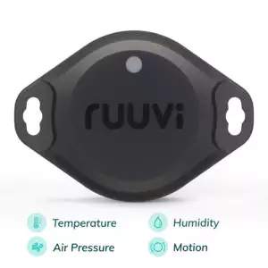
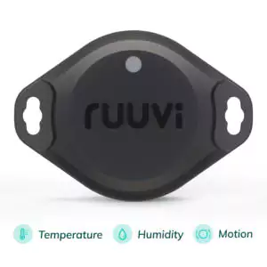
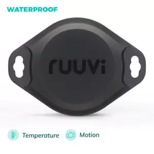

# Ruuvi Tag Information
I purchased a RuuviTag Pro Sensor and have been working with it because my Victron gateway will recognize and record data from it. 
They are significantly more expensive than the Govee tags, but are well documented. 
https://ruuvi.com/

## RuuviTag Pro Sensor – (4in1) temperature, humidity, pressure, motion

## RuuviTag Pro Sensor – (3in1) temperature, humidity, motion

## RuuviTag Pro Sensor – (2in1) temperature, motion. Waterproof.

## Data format 5 (RAWv2)
https://docs.ruuvi.com/communication/bluetooth-advertisements/data-format-5-rawv2

The data is decoded from "Manufacturer Specific Data" -field, for more details please check Bluetooth Advertisements section. Manufacturer ID is 0x0499 , which is transmitted as 0x9904 in raw data. The actual data payload is:

| | |
| Offset | Allowed values | Description |
| 0 | 5 | Data format (8bit) |
| 1-2 | -32767 ... 32767 | Temperature in 0.005 degrees |
| 3-4 | 0 ... 40 000 | Humidity (16bit unsigned) in 0.0025% (0-163.83% range, though realistically 0-100%) |
| 5-6 | 0 ... 65534 | Pressure (16bit unsigned) in 1 Pa units, with offset of -50 000 Pa |
| 7-8 | -32767 ... 32767 | Acceleration-X (Most Significant Byte first) |
| 9-10 | -32767 ... 32767 | Acceleration-Y (Most Significant Byte first) |
| 11-12 | -32767 ... 32767 | Acceleration-Z (Most Significant Byte first) |
| 13-14 | 0 ... 2046, 0 ... 30 | Power info (11+5bit unsigned), first 11 bits is the battery voltage above 1.6V, in millivolts (1.6V to 3.646V range). Last 5 bits unsigned are the TX power above -40dBm, in 2dBm steps. (-40dBm to +20dBm range) |
| 15 | 0 ... 254 | Movement counter (8 bit unsigned), incremented by motion detection interrupts from accelerometer |
| 16-17 | 0 ... 65534 | Measurement sequence number (16 bit unsigned), each time a measurement is taken, this is incremented by one, used for measurement de-duplication. Depending on the transmit interval, multiple packets with the same measurements can be sent, and there may be measurements that never were sent. |
| 18-23 | Any valid mac | 48bit MAC address. |

Not available is signified by largest presentable number for unsigned values, smallest presentable number for signed values and all bits set for mac. All fields are MSB first 2-complement, i.e. 0xFC18 is read as -1000 and 0x03E8 is read as 1000. If original data overflows the data format, data is clipped to closests value that can be represented. For example temperature 170.00 C becomes 163.835 C and acceleration -40.000 G becomes -32.767 G.
