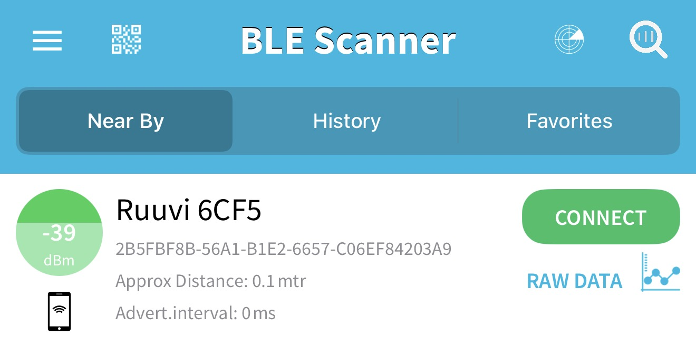

# Ruuvi Tag Information
I purchased a RuuviTag Pro Sensor and have been working with it because my Victron gateway will recognize and record data from it. 
They are significantly more expensive than the Govee tags and are well documented. The Ruuvi Tag is a popular bluetooth temperature and humidity sensor. It has a different bluetooth protocol than the Govee devices. 
I have added code to decode the Ruuvi Tag data and write it to the log files in a similar format to the Govee devices. 

https://ruuvi.com/

## RuuviTag Pro Sensor – (4in1) temperature, humidity, pressure, motion


## RuuviTag Pro Sensor – (3in1) temperature, humidity, motion


## RuuviTag Pro Sensor – (2in1) temperature, motion. Waterproof.


## Data format 5 (RAWv2)
https://docs.ruuvi.com/communication/bluetooth-advertisements/data-format-5-rawv2

The data is decoded from "Manufacturer Specific Data" -field, for more details please check Bluetooth Advertisements section. 
Manufacturer ID is `0x0499`, which is transmitted as `0x9904` in raw data. The actual data payload is:

| Offset | Allowed values | Description |
| --- | --- | --- |
| 0 | 5 | Data format (8bit) |
| 1-2 | -32767 ... 32767 | Temperature in 0.005 degrees |
| 3-4 | 0 ... 40 000 | Humidity (16bit unsigned) in 0.0025% (0-163.83% range, though realistically 0-100%) |
| 5-6 | 0 ... 65534 | Pressure (16bit unsigned) in 1 Pa units, with offset of -50 000 Pa |
| 7-8 | -32767 ... 32767 | Acceleration-X (Most Significant Byte first) |
| 9-10 | -32767 ... 32767 | Acceleration-Y (Most Significant Byte first) |
| 11-12 | -32767 ... 32767 | Acceleration-Z (Most Significant Byte first) |
| 13-14 | 0 ... 2046, 0 ... 30 | Power info (11+5bit unsigned), first 11 bits is the battery voltage above 1.6V, in millivolts (1.6V to 3.646V range). Last 5 bits unsigned are the TX power above -40dBm, in 2dBm steps. (-40dBm to +20dBm range) |
| 15 | 0 ... 254 | Movement counter (8 bit unsigned), incremented by motion detection interrupts from accelerometer |
| 16-17 | 0 ... 65534 | Measurement sequence number (16 bit unsigned), each time a measurement is taken, this is incremented by one, used for measurement de-duplication. Depending on the transmit interval, multiple packets with the same measurements can be sent, and there may be measurements that never were sent. |
| 18-23 | Any valid mac | 48bit MAC address. |

Not available is signified by largest presentable number for unsigned values, smallest presentable number for signed values 
and all bits set for mac. All fields are MSB first 2-complement, i.e. `0xFC18` is read as `-1000` and `0x03E8` is read as `1000`. 
If original data overflows the data format, data is clipped to closests value that can be represented. For example 
temperature 170.00 C becomes 163.835 C and acceleration -40.000 G becomes -32.767 G.

## Data field descriptions
### Temperature
Values supported: (-163.835 °C to +163.835 °C in 0.005 °C increments.

Example

| Value | Measurement |
| --- | --- |
| 0x0000 | 0 °C |
| 0x01C3 | +2.255 °C |
| 0xFE3D | -2.255 °C |
| 0x8000 | Invalid / not available |


### Humidity
Values supported: 0.0 % to 100 % in 0.0025 % increments. Higher values than 100 % are possible, but they generally indicate a faulty or miscalibrated sensor.

Example

| Value | Measurement |
| --- | --- |
| 0 | 0% |
| 10010 | 25.025% |
| 40000 | 100.0% |
| 65535 | Invalid / not available |

### Atmospheric Pressure
Values supported: 50000 Pa to 115536 Pa in 1 Pa increments.

Example

| Value | Measurement |
| --- | --- |
| 00000 | 50000 Pa |
| 51325 | 101325 Pa (average sea-level pressure) |
| 65534 | 115534 Pa |
| 65535 | Invalid / not available |

### Acceleration
Values supported: -32767 to 32767 (mG), however the sensor on RuuviTag supports only 16 G max (2 G in default configuration). Values are 2-complement int16_t, MSB first. All channels are identical.

Example

| Value | Measurement |
| --- | --- |
| 0xFC18 | -1000 mG |
| 0x03E8 | 1000 mG |
| 0x8000 | Invalid / not available |

### Battery voltage
Values supported: 1600 mV to 3647 mV in 1 mV increments, practically 1800 ... 3600 mV.

Example

| Value | Measurement |
| --- | --- |
| 0000 | 1600 mV |
| 1400 | 3000 mV |
| 2047 | Invalid / not available |


### Tx Power
Values supported: -40 dBm to +22 dBm in 2 dBm increments.

Example

| Value | Measurement |
| --- | --- |
| 00 | -40 dBm |
| 22 | +4 dBm |
| 31 | Invalid / not available |


### Movement counter
Movement counter is one-byte counter which gets triggered when LIS2DH12 gives "activity interrupt". Sensitivity depends on the firmware, by default the sensitivity is a movement over 64 mG. The counter will roll over. Movement is deduced by "rate of change". Please note that the highest valid value is 254, and 255 is reserved for the "not available".

Example

| Value | Measurement |
| --- | --- |
| 00 | 0 counts |
| 100 | 100 counts |
| 255 | Invalid / not available |

### Measurement sequence number
Measurement sequence number gets incremented by one for every measurement. It can be used to gauge signal quality and packet loss as well as to deduplicate data entries. You should note that the measurement sequence refers to data rather than transmission, so you might receive many transmissions with the same measurement sequence number. Please note that the highest valid value is 65534, and 65535 is reserved for the "not available".

Example

| Value | Measurement |
| --- | --- |
| 0000 | 0 counts |
| 1000 | 1000 counts |
| 65535 | Invalid / not available |

## HCI Example output
```
wim@WimPi5:~ $ ../visualstudio/projects/GoveeBTTempLogger/bin/ARM64/Debug/GoveeBTTempLogger.out --HCI --controller 2C:CF:67:0B:78:71 --verbose 3 --only DD:4C:E8:7A:11:6E
[2026-04-17T12:05:35] GoveeBTTempLogger Version (non-CMake) Built on: Apr 17 2026 at 12:05:17
[                   ]  verbose: 3
[                   ]      log: ""
[                   ]    cache: ""
[                   ]      svg: ""
[                   ]  battery: 0
[                   ]   minmax: 0
[                   ]  celsius: false
[                   ] titlemap: ""
[                   ]     time: 60
[                   ]  average: 5
[                   ] download: 0 (days betwen data download)
[                   ]  passive: false
[                   ] no-bluetooth: false
[                   ]      HCI: true
[                   ] only listening to: [DD:4C:E8:7A:11:6E]
[2026-04-17T12:05:35] /dev/rfkill 0 Bluetooth, Blocked: NO (Soft: no, Hard: no)
[2026-04-17T12:05:35] /dev/rfkill 2 Bluetooth, Blocked: NO (Soft: no, Hard: no)
[2026-04-17T12:05:35] /dev/rfkill 3 Wireless LAN, Blocked: NO (Soft: no, Hard: no)
[2026-04-17T12:05:35] /dev/rfkill 11 Bluetooth, Blocked: NO (Soft: no, Hard: no)
[2026-04-17T12:05:35] /dev/rfkill 0 Bluetooth, Blocked: NO (Soft: no, Hard: no)
[2026-04-17T12:05:35] /dev/rfkill 2 Bluetooth, Blocked: NO (Soft: no, Hard: no)
[2026-04-17T12:05:35] /dev/rfkill 3 Wireless LAN, Blocked: NO (Soft: no, Hard: no)
[2026-04-17T12:05:35] /dev/rfkill 11 Bluetooth, Blocked: NO (Soft: no, Hard: no)
[                   ] Host Controller Address: 04:7F:0E:00:FD:5C BlueTooth Device ID: 0 HCI Name: hci0
[                   ] Host Controller Address: F4:4E:FC:A0:F7:DA BlueTooth Device ID: 1 HCI Name: hci1
[                   ] Host Controller Address: 2C:CF:67:0B:78:71 BlueTooth Device ID: 2 HCI Name: hci2
[                   ] BlueToothDevice_ID: 2
[                   ] Reset device: hci2. Success(0)
[                   ] DOWN device: hci2. Success(0)
[                   ] UP device: hci2. Success(0)
[2026-04-17T12:05:35] Using Controller Address: 2C:CF:67:0B:78:71
[2026-04-17T12:05:35] LocalName: WimPi5 #3
[2026-04-17T12:05:35] BlueTooth Address Filter: [DD:4C:E8:7A:11:6E]
[2026-04-17T12:05:35] Scanning Stopped.
[2026-04-17T12:05:35] BlueTooth Address Filter: [DD:4C:E8:7A:11:6E]
[2026-04-17T12:05:35] Scanning Started. ScanInterval(11.25 msec) ScanWindow(11.25 msec) ScanType(1)
[2026-04-17T12:05:36] 46 [DD:4C:E8:7A:11:6E] (Flags) 06 (Manu) 0499:051C012806CE230390FE34FFD0C0765AF615DD4CE87A116E (Temp) 35.8°C (Humidity) 25.62% (Pressure) 1027.71 hPa (Battery) 3.139 V (TXPower)   4 dBm (AccelerationX)  0.912 g (AccelerationY) -0.460 g (AccelerationZ) -0.048 g (MovementCounter) 90 (MeasurementSequenceNumber) 62997 (BluetoothAddress) DD:4C:E8:7A:11:6E (Ruuvi)
[2026-04-17T12:05:45] 46 [DD:4C:E8:7A:11:6E] (Flags) 06 (Manu) 0499:051C0227FBCE20038CFE38FFC8C0765AF618DD4CE87A116E (Temp) 35.9°C (Humidity) 25.59% (Pressure) 1027.68 hPa (Battery) 3.139 V (TXPower)   4 dBm (AccelerationX)  0.908 g (AccelerationY) -0.456 g (AccelerationZ) -0.056 g (MovementCounter) 90 (MeasurementSequenceNumber) 63000 (BluetoothAddress) DD:4C:E8:7A:11:6E (Ruuvi)
[2026-04-17T12:05:47] 46 [DD:4C:E8:7A:11:6E] (Flags) 06 (Manu) 0499:051C0227F0CE20038CFE34FFCCC0765AF619DD4CE87A116E (Temp) 35.9°C (Humidity) 25.56% (Pressure) 1027.68 hPa (Battery) 3.139 V (TXPower)   4 dBm (AccelerationX)  0.908 g (AccelerationY) -0.460 g (AccelerationZ) -0.052 g (MovementCounter) 90 (MeasurementSequenceNumber) 63001 (BluetoothAddress) DD:4C:E8:7A:11:6E (Ruuvi)
[2026-04-17T12:05:52] 46 [DD:4C:E8:7A:11:6E] (Flags) 06 (Manu) 0499:051C0227EECE200388FE38FFC0C0765AF61BDD4CE87A116E (Temp) 35.9°C (Humidity) 25.55% (Pressure) 1027.68 hPa (Battery) 3.139 V (TXPower)   4 dBm (AccelerationX)  0.904 g (AccelerationY) -0.456 g (AccelerationZ) -0.064 g (MovementCounter) 90 (MeasurementSequenceNumber) 63003 (BluetoothAddress) DD:4C:E8:7A:11:6E (Ruuvi)
^C***************** SIGINT: Caught Ctrl-C, finishing loop and quitting. *****************
[2026-04-17T12:05:56] Scanning Stopped.
GoveeBTTempLogger Version (non-CMake) Built on: Apr 17 2026 at 12:05:17 (exiting)
```

## dBus Example output
```
wim@WimPi5:~ $ ../visualstudio/projects/GoveeBTTempLogger/bin/ARM64/Debug/GoveeBTTempLogger.out --controller 2C:CF:67:0B:78:71 --verbose 3 --only DD:4C:E8:7A:11:6E
[2026-04-17T12:17:42] GoveeBTTempLogger Version (non-CMake) Built on: Apr 17 2026 at 12:05:17
[                   ]  verbose: 3
[                   ]      log: ""
[                   ]    cache: ""
[                   ]      svg: ""
[                   ]  battery: 0
[                   ]   minmax: 0
[                   ]  celsius: false
[                   ] titlemap: ""
[                   ]     time: 60
[                   ]  average: 5
[                   ] download: 0 (days betwen data download)
[                   ]  passive: false
[                   ] no-bluetooth: false
[                   ]      HCI: false
[                   ] only listening to: [DD:4C:E8:7A:11:6E]
[2026-04-17T12:17:42] /dev/rfkill 0 Bluetooth, Blocked: NO (Soft: no, Hard: no)
[2026-04-17T12:17:42] /dev/rfkill 2 Bluetooth, Blocked: NO (Soft: no, Hard: no)
[2026-04-17T12:17:42] /dev/rfkill 3 Wireless LAN, Blocked: NO (Soft: no, Hard: no)
[2026-04-17T12:17:42] /dev/rfkill 11 Bluetooth, Blocked: NO (Soft: no, Hard: no)
[2026-04-17T12:17:42] /dev/rfkill 0 Bluetooth, Blocked: NO (Soft: no, Hard: no)
[2026-04-17T12:17:42] /dev/rfkill 2 Bluetooth, Blocked: NO (Soft: no, Hard: no)
[2026-04-17T12:17:42] /dev/rfkill 3 Wireless LAN, Blocked: NO (Soft: no, Hard: no)
[2026-04-17T12:17:42] /dev/rfkill 11 Bluetooth, Blocked: NO (Soft: no, Hard: no)
[2026-04-17T12:17:42] D-Bus connection ":1.834" Opened
[                   ] bluez_find_adapters ":1.834"
[                   ] /: org.freedesktop.DBus.ObjectManager: GetManagedObjects
[                   ]   Message Type: method_return
[                   ]      Signature: a{oa{sa{sv}}}
[                   ]    Destination: :1.834
[                   ]         Sender: :1.2
[                   ]        Object Path: /org/bluez
[                   ]             String: org.freedesktop.DBus.Introspectable
[                   ]             String: org.bluez.AgentManager1
[                   ]             String: org.bluez.ProfileManager1
[                   ]             String: org.bluez.HealthManager1
[                   ]        Object Path: /org/bluez/hci1
[                   ]             String: org.freedesktop.DBus.Introspectable
[                   ]             String: org.bluez.Adapter1
[                   ]                Address: F4:4E:FC:A0:F7:DA
[                   ]             String: org.freedesktop.DBus.Properties
[                   ]             String: org.bluez.BatteryProviderManager1
[                   ]             String: org.bluez.GattManager1
[                   ]             String: org.bluez.Media1
[                   ]             String: org.bluez.NetworkServer1
[                   ]             String: org.bluez.SimAccess1
[                   ]             String: org.bluez.LEAdvertisingManager1
[                   ]        Object Path: /org/bluez/hci1/dev_70_6F_C8_23_FA_5B
[                   ]             String: org.freedesktop.DBus.Introspectable
[                   ]             String: org.bluez.Device1
[                   ]             String: org.freedesktop.DBus.Properties
[                   ]        Object Path: /org/bluez/hci1/dev_FD_B6_2F_B9_DF_0D
[                   ]             String: org.freedesktop.DBus.Introspectable
[                   ]             String: org.bluez.Device1
[                   ]             String: org.freedesktop.DBus.Properties
[                   ]        Object Path: /org/bluez/hci1/dev_C0_FB_7E_F8_BF_5D
[                   ]             String: org.freedesktop.DBus.Introspectable
[                   ]             String: org.bluez.Device1
[                   ]             String: org.freedesktop.DBus.Properties
[                   ]        Object Path: /org/bluez/hci1/dev_C4_E8_05_0B_8B_30
[                   ]             String: org.freedesktop.DBus.Introspectable
[                   ]             String: org.bluez.Device1
[                   ]             String: org.freedesktop.DBus.Properties
[                   ]        Object Path: /org/bluez/hci1/dev_E0_AA_D9_8E_F9_49
[                   ]             String: org.freedesktop.DBus.Introspectable
[                   ]             String: org.bluez.Device1
[                   ]             String: org.freedesktop.DBus.Properties
[                   ]        Object Path: /org/bluez/hci1/dev_C0_0E_D3_45_4A_63
[                   ]             String: org.freedesktop.DBus.Introspectable
[                   ]             String: org.bluez.Device1
[                   ]             String: org.freedesktop.DBus.Properties
[                   ]        Object Path: /org/bluez/hci1/dev_61_2D_2D_20_C5_09
[                   ]             String: org.freedesktop.DBus.Introspectable
[                   ]             String: org.bluez.Device1
[                   ]             String: org.freedesktop.DBus.Properties
[                   ]        Object Path: /org/bluez/hci1/dev_04_44_66_F5_62_0A
[                   ]             String: org.freedesktop.DBus.Introspectable
[                   ]             String: org.bluez.Device1
[                   ]             String: org.freedesktop.DBus.Properties
[                   ]        Object Path: /org/bluez/hci1/dev_A4_C1_38_DC_CC_3D
[                   ]             String: org.freedesktop.DBus.Introspectable
[                   ]             String: org.bluez.Device1
[                   ]             String: org.freedesktop.DBus.Properties
[                   ]        Object Path: /org/bluez/hci1/dev_E3_5E_CC_21_5C_0F
[                   ]             String: org.freedesktop.DBus.Introspectable
[                   ]             String: org.bluez.Device1
[                   ]             String: org.freedesktop.DBus.Properties
[                   ]        Object Path: /org/bluez/hci1/dev_E3_8E_C8_C1_98_9A
[                   ]             String: org.freedesktop.DBus.Introspectable
[                   ]             String: org.bluez.Device1
[                   ]             String: org.freedesktop.DBus.Properties
[                   ]        Object Path: /org/bluez/hci1/dev_A4_C1_38_0D_42_7B
[                   ]             String: org.freedesktop.DBus.Introspectable
[                   ]             String: org.bluez.Device1
[                   ]             String: org.freedesktop.DBus.Properties
[                   ]        Object Path: /org/bluez/hci1/dev_A4_C1_38_05_C7_A1
[                   ]             String: org.freedesktop.DBus.Introspectable
[                   ]             String: org.bluez.Device1
[                   ]             String: org.freedesktop.DBus.Properties
[                   ]        Object Path: /org/bluez/hci1/dev_E3_60_59_21_80_65
[                   ]             String: org.freedesktop.DBus.Introspectable
[                   ]             String: org.bluez.Device1
[                   ]             String: org.freedesktop.DBus.Properties
[                   ]        Object Path: /org/bluez/hci1/dev_A4_C1_38_D5_A3_3B
[                   ]             String: org.freedesktop.DBus.Introspectable
[                   ]             String: org.bluez.Device1
[                   ]             String: org.freedesktop.DBus.Properties
[                   ]        Object Path: /org/bluez/hci1/dev_DD_4C_E8_7A_11_6E
[                   ]             String: org.freedesktop.DBus.Introspectable
[                   ]             String: org.bluez.Device1
[                   ]             String: org.freedesktop.DBus.Properties
[                   ]        Object Path: /org/bluez/hci1/dev_A4_C1_38_37_BC_AE
[                   ]             String: org.freedesktop.DBus.Introspectable
[                   ]             String: org.bluez.Device1
[                   ]             String: org.freedesktop.DBus.Properties
[                   ]        Object Path: /org/bluez/hci1/dev_A4_C1_38_0D_3B_10
[                   ]             String: org.freedesktop.DBus.Introspectable
[                   ]             String: org.bluez.Device1
[                   ]             String: org.freedesktop.DBus.Properties
[                   ]        Object Path: /org/bluez/hci1/dev_D0_35_33_33_44_03
[                   ]             String: org.freedesktop.DBus.Introspectable
[                   ]             String: org.bluez.Device1
[                   ]             String: org.freedesktop.DBus.Properties
[                   ]        Object Path: /org/bluez/hci1/dev_D3_21_C4_06_25_0D
[                   ]             String: org.freedesktop.DBus.Introspectable
[                   ]             String: org.bluez.Device1
[                   ]             String: org.freedesktop.DBus.Properties
[                   ]        Object Path: /org/bluez/hci1/dev_50_04_49_74_9E_B2
[                   ]             String: org.freedesktop.DBus.Introspectable
[                   ]             String: org.bluez.Device1
[                   ]             String: org.freedesktop.DBus.Properties
[                   ]        Object Path: /org/bluez/hci1/dev_C2_35_33_30_25_50
[                   ]             String: org.freedesktop.DBus.Introspectable
[                   ]             String: org.bluez.Device1
[                   ]             String: org.freedesktop.DBus.Properties
[                   ]        Object Path: /org/bluez/hci1/dev_D2_AF_09_4A_F0_4E
[                   ]             String: org.freedesktop.DBus.Introspectable
[                   ]             String: org.bluez.Device1
[                   ]             String: org.freedesktop.DBus.Properties
[                   ]        Object Path: /org/bluez/hci1/dev_D3_D1_90_54_EB_F0
[                   ]             String: org.freedesktop.DBus.Introspectable
[                   ]             String: org.bluez.Device1
[                   ]             String: org.freedesktop.DBus.Properties
[                   ]        Object Path: /org/bluez/hci1/dev_CE_A5_D7_7B_CD_81
[                   ]             String: org.freedesktop.DBus.Introspectable
[                   ]             String: org.bluez.Device1
[                   ]             String: org.freedesktop.DBus.Properties
[                   ]        Object Path: /org/bluez/hci1/dev_C3_36_35_30_61_77
[                   ]             String: org.freedesktop.DBus.Introspectable
[                   ]             String: org.bluez.Device1
[                   ]             String: org.freedesktop.DBus.Properties
[                   ]        Object Path: /org/bluez/hci1/dev_E3_60_59_23_14_7D
[                   ]             String: org.freedesktop.DBus.Introspectable
[                   ]             String: org.bluez.Device1
[                   ]             String: org.freedesktop.DBus.Properties
[                   ]        Object Path: /org/bluez/hci1/dev_E3_9C_25_49_FC_68
[                   ]             String: org.freedesktop.DBus.Introspectable
[                   ]             String: org.bluez.Device1
[                   ]             String: org.freedesktop.DBus.Properties
[                   ]        Object Path: /org/bluez/hci1/dev_0B_A0_89_1A_42_A7
[                   ]             String: org.freedesktop.DBus.Introspectable
[                   ]             String: org.bluez.Device1
[                   ]             String: org.freedesktop.DBus.Properties
[                   ]        Object Path: /org/bluez/hci2
[                   ]             String: org.freedesktop.DBus.Introspectable
[                   ]             String: org.bluez.Adapter1
[                   ]                Address: 2C:CF:67:0B:78:71
[                   ]             String: org.freedesktop.DBus.Properties
[                   ]             String: org.bluez.BatteryProviderManager1
[                   ]             String: org.bluez.GattManager1
[                   ]             String: org.bluez.Media1
[                   ]             String: org.bluez.NetworkServer1
[                   ]             String: org.bluez.SimAccess1
[                   ]             String: org.bluez.LEAdvertisingManager1
[                   ]        Object Path: /org/bluez/hci0
[                   ]             String: org.freedesktop.DBus.Introspectable
[                   ]             String: org.bluez.Adapter1
[                   ]                Address: 04:7F:0E:00:FD:5C
[                   ]             String: org.freedesktop.DBus.Properties
[                   ]             String: org.bluez.BatteryProviderManager1
[                   ]             String: org.bluez.GattManager1
[                   ]             String: org.bluez.Media1
[                   ]             String: org.bluez.NetworkServer1
[                   ]             String: org.bluez.SimAccess1
[                   ]             String: org.bluez.LEAdvertisingManager1
[                   ]        Object Path: /org/bluez/test
[                   ]             String: org.freedesktop.DBus.Introspectable
[                   ]             String: org.bluez.SimAccessTest1
[                   ] Host Controller Address: 04:7F:0E:00:FD:5C BlueZ Adapter Path: /org/bluez/hci0
[                   ] Host Controller Address: 2C:CF:67:0B:78:71 BlueZ Adapter Path: /org/bluez/hci2
[                   ] Host Controller Address: F4:4E:FC:A0:F7:DA BlueZ Adapter Path: /org/bluez/hci1
[                   ] /org/bluez/hci2: org.freedesktop.DBus.Properties: SetPowered: true
[                   ] /org/bluez/hci2: org.bluez.Adapter1: SetDiscoveryFilter
[                   ] /: org.freedesktop.DBus.ObjectManager: GetManagedObjects
[2026-04-17T12:17:42]        Object Path: /org/bluez/hci1/dev_70_6F_C8_23_FA_5B
[2026-04-17T12:17:42]        Object Path: /org/bluez/hci1/dev_FD_B6_2F_B9_DF_0D
[2026-04-17T12:17:42]        Object Path: /org/bluez/hci1/dev_C0_FB_7E_F8_BF_5D
[2026-04-17T12:17:42]        Object Path: /org/bluez/hci1/dev_C4_E8_05_0B_8B_30
[2026-04-17T12:17:42]        Object Path: /org/bluez/hci1/dev_E0_AA_D9_8E_F9_49
[2026-04-17T12:17:42]        Object Path: /org/bluez/hci1/dev_C0_0E_D3_45_4A_63
[2026-04-17T12:17:42]        Object Path: /org/bluez/hci1/dev_61_2D_2D_20_C5_09
[2026-04-17T12:17:42]        Object Path: /org/bluez/hci1/dev_04_44_66_F5_62_0A
[2026-04-17T12:17:42]        Object Path: /org/bluez/hci1/dev_A4_C1_38_DC_CC_3D
[2026-04-17T12:17:42]        Object Path: /org/bluez/hci1/dev_E3_5E_CC_21_5C_0F
[2026-04-17T12:17:42]        Object Path: /org/bluez/hci1/dev_E3_8E_C8_C1_98_9A
[2026-04-17T12:17:42]        Object Path: /org/bluez/hci1/dev_A4_C1_38_0D_42_7B
[2026-04-17T12:17:42]        Object Path: /org/bluez/hci1/dev_A4_C1_38_05_C7_A1
[2026-04-17T12:17:42]        Object Path: /org/bluez/hci1/dev_E3_60_59_21_80_65
[2026-04-17T12:17:42]        Object Path: /org/bluez/hci1/dev_A4_C1_38_D5_A3_3B
[2026-04-17T12:17:42]        Object Path: /org/bluez/hci1/dev_DD_4C_E8_7A_11_6E
[2026-04-17T12:17:42] [DD:4C:E8:7A:11:6E] ManufacturerData: 0499:051c872747ce17038cfe34ffd0c0765af72edd4ce87a116e (Temp) 36.5°C (Humidity) 25.14% (Pressure) 1027.59 hPa (Battery) 3.139 V (TXPower)   4 dBm (AccelerationX)  0.908 g (AccelerationY) -0.460 g (AccelerationZ) -0.048 g (MovementCounter) 90 (MeasurementSequenceNumber) 63278 (BluetoothAddress) DD:4C:E8:7A:11:6E (Ruuvi)
[2026-04-17T12:17:42]        Object Path: /org/bluez/hci1/dev_A4_C1_38_37_BC_AE
[2026-04-17T12:17:42]        Object Path: /org/bluez/hci1/dev_A4_C1_38_0D_3B_10
[2026-04-17T12:17:42]        Object Path: /org/bluez/hci1/dev_D0_35_33_33_44_03
[2026-04-17T12:17:42]        Object Path: /org/bluez/hci1/dev_D3_21_C4_06_25_0D
[2026-04-17T12:17:42]        Object Path: /org/bluez/hci1/dev_50_04_49_74_9E_B2
[2026-04-17T12:17:42]        Object Path: /org/bluez/hci1/dev_C2_35_33_30_25_50
[2026-04-17T12:17:42]        Object Path: /org/bluez/hci1/dev_D2_AF_09_4A_F0_4E
[2026-04-17T12:17:42]        Object Path: /org/bluez/hci1/dev_D3_D1_90_54_EB_F0
[2026-04-17T12:17:42]        Object Path: /org/bluez/hci1/dev_CE_A5_D7_7B_CD_81
[2026-04-17T12:17:42]        Object Path: /org/bluez/hci1/dev_C3_36_35_30_61_77
[2026-04-17T12:17:42]        Object Path: /org/bluez/hci1/dev_E3_60_59_23_14_7D
[2026-04-17T12:17:42]        Object Path: /org/bluez/hci1/dev_E3_9C_25_49_FC_68
[2026-04-17T12:17:42]        Object Path: /org/bluez/hci1/dev_0B_A0_89_1A_42_A7
[                   ] /org/bluez/hci2: org.bluez.Adapter1: StartDiscovery
[                   ] Add Match Rule: "type='signal',sender='org.bluez',member='InterfacesAdded'"
[                   ] Add Match Rule: "type='signal',sender='org.bluez',member='PropertiesChanged'"
[2026-04-17T12:17:42] 60 seconds or more have passed. Writing LOG Files
[2026-04-17T12:17:44] [DD:4C:E8:7A:11:6E] ManufacturerData: 0499:051c8a2748ce150380fe38ffc4c0765af730dd4ce87a116e (Temp) 36.5°C (Humidity) 25.14% (Pressure) 1027.57 hPa (Battery) 3.139 V (TXPower)   4 dBm (AccelerationX)  0.896 g (AccelerationY) -0.456 g (AccelerationZ) -0.060 g (MovementCounter) 90 (MeasurementSequenceNumber) 63280 (BluetoothAddress) DD:4C:E8:7A:11:6E (Ruuvi)
[2026-04-17T12:17:44] [DD:4C:E8:7A:11:6E] ManufacturerData: 0499:051c8a2748ce150380fe38ffc4c0765af730dd4ce87a116e (Temp) 36.5°C (Humidity) 25.14% (Pressure) 1027.57 hPa (Battery) 3.139 V (TXPower)   4 dBm (AccelerationX)  0.896 g (AccelerationY) -0.456 g (AccelerationZ) -0.060 g (MovementCounter) 90 (MeasurementSequenceNumber) 63280 (BluetoothAddress) DD:4C:E8:7A:11:6E (Ruuvi)
[2026-04-17T12:17:44] [DD:4C:E8:7A:11:6E] ManufacturerData: 0499:051c8a2748ce150380fe38ffc4c0765af730dd4ce87a116e (Temp) 36.5°C (Humidity) 25.14% (Pressure) 1027.57 hPa (Battery) 3.139 V (TXPower)   4 dBm (AccelerationX)  0.896 g (AccelerationY) -0.456 g (AccelerationZ) -0.060 g (MovementCounter) 90 (MeasurementSequenceNumber) 63280 (BluetoothAddress) DD:4C:E8:7A:11:6E (Ruuvi)
[2026-04-17T12:17:44] [DD:4C:E8:7A:11:6E] ManufacturerData: 0499:051c8a2748ce150380fe38ffc4c0765af730dd4ce87a116e (Temp) 36.5°C (Humidity) 25.14% (Pressure) 1027.57 hPa (Battery) 3.139 V (TXPower)   4 dBm (AccelerationX)  0.896 g (AccelerationY) -0.456 g (AccelerationZ) -0.060 g (MovementCounter) 90 (MeasurementSequenceNumber) 63280 (BluetoothAddress) DD:4C:E8:7A:11:6E (Ruuvi)
[2026-04-17T12:17:44] [DD:4C:E8:7A:11:6E] ManufacturerData: 0499:051c8a2748ce150380fe38ffc4c0765af730dd4ce87a116e (Temp) 36.5°C (Humidity) 25.14% (Pressure) 1027.57 hPa (Battery) 3.139 V (TXPower)   4 dBm (AccelerationX)  0.896 g (AccelerationY) -0.456 g (AccelerationZ) -0.060 g (MovementCounter) 90 (MeasurementSequenceNumber) 63280 (BluetoothAddress) DD:4C:E8:7A:11:6E (Ruuvi)
[2026-04-17T12:17:45] [DD:4C:E8:7A:11:6E] ManufacturerData: 0499:051c8a2748ce150380fe38ffc4c0765af730dd4ce87a116e (Temp) 36.5°C (Humidity) 25.14% (Pressure) 1027.57 hPa (Battery) 3.139 V (TXPower)   4 dBm (AccelerationX)  0.896 g (AccelerationY) -0.456 g (AccelerationZ) -0.060 g (MovementCounter) 90 (MeasurementSequenceNumber) 63280 (BluetoothAddress) DD:4C:E8:7A:11:6E (Ruuvi)
[2026-04-17T12:17:45] [DD:4C:E8:7A:11:6E] ManufacturerData: 0499:051c8a2748ce150380fe38ffc4c0765af730dd4ce87a116e (Temp) 36.5°C (Humidity) 25.14% (Pressure) 1027.57 hPa (Battery) 3.139 V (TXPower)   4 dBm (AccelerationX)  0.896 g (AccelerationY) -0.456 g (AccelerationZ) -0.060 g (MovementCounter) 90 (MeasurementSequenceNumber) 63280 (BluetoothAddress) DD:4C:E8:7A:11:6E (Ruuvi)
[2026-04-17T12:17:45] [DD:4C:E8:7A:11:6E] ManufacturerData: 0499:051c8a2748ce150380fe38ffc4c0765af730dd4ce87a116e (Temp) 36.5°C (Humidity) 25.14% (Pressure) 1027.57 hPa (Battery) 3.139 V (TXPower)   4 dBm (AccelerationX)  0.896 g (AccelerationY) -0.456 g (AccelerationZ) -0.060 g (MovementCounter) 90 (MeasurementSequenceNumber) 63280 (BluetoothAddress) DD:4C:E8:7A:11:6E (Ruuvi)
[2026-04-17T12:17:45] [DD:4C:E8:7A:11:6E] ManufacturerData: 0499:051c8a2748ce150380fe38ffc4c0765af730dd4ce87a116e (Temp) 36.5°C (Humidity) 25.14% (Pressure) 1027.57 hPa (Battery) 3.139 V (TXPower)   4 dBm (AccelerationX)  0.896 g (AccelerationY) -0.456 g (AccelerationZ) -0.060 g (MovementCounter) 90 (MeasurementSequenceNumber) 63280 (BluetoothAddress) DD:4C:E8:7A:11:6E (Ruuvi)
[2026-04-17T12:17:45] [DD:4C:E8:7A:11:6E] ManufacturerData: 0499:051c8a2748ce150380fe38ffc4c0765af730dd4ce87a116e (Temp) 36.5°C (Humidity) 25.14% (Pressure) 1027.57 hPa (Battery) 3.139 V (TXPower)   4 dBm (AccelerationX)  0.896 g (AccelerationY) -0.456 g (AccelerationZ) -0.060 g (MovementCounter) 90 (MeasurementSequenceNumber) 63280 (BluetoothAddress) DD:4C:E8:7A:11:6E (Ruuvi)
[2026-04-17T12:17:46] [DD:4C:E8:7A:11:6E] ManufacturerData: 0499:051c8a2748ce150380fe38ffc4c0765af730dd4ce87a116e (Temp) 36.5°C (Humidity) 25.14% (Pressure) 1027.57 hPa (Battery) 3.139 V (TXPower)   4 dBm (AccelerationX)  0.896 g (AccelerationY) -0.456 g (AccelerationZ) -0.060 g (MovementCounter) 90 (MeasurementSequenceNumber) 63280 (BluetoothAddress) DD:4C:E8:7A:11:6E (Ruuvi)
[2026-04-17T12:17:46] [DD:4C:E8:7A:11:6E] ManufacturerData: 0499:051c8a2748ce150380fe38ffc4c0765af730dd4ce87a116e (Temp) 36.5°C (Humidity) 25.14% (Pressure) 1027.57 hPa (Battery) 3.139 V (TXPower)   4 dBm (AccelerationX)  0.896 g (AccelerationY) -0.456 g (AccelerationZ) -0.060 g (MovementCounter) 90 (MeasurementSequenceNumber) 63280 (BluetoothAddress) DD:4C:E8:7A:11:6E (Ruuvi)
[2026-04-17T12:17:46] [DD:4C:E8:7A:11:6E] ManufacturerData: 0499:051c8a2748ce150380fe38ffc4c0765af730dd4ce87a116e (Temp) 36.5°C (Humidity) 25.14% (Pressure) 1027.57 hPa (Battery) 3.139 V (TXPower)   4 dBm (AccelerationX)  0.896 g (AccelerationY) -0.456 g (AccelerationZ) -0.060 g (MovementCounter) 90 (MeasurementSequenceNumber) 63280 (BluetoothAddress) DD:4C:E8:7A:11:6E (Ruuvi)
[2026-04-17T12:17:46] [DD:4C:E8:7A:11:6E] ManufacturerData: 0499:051c8a2748ce150380fe38ffc4c0765af730dd4ce87a116e (Temp) 36.5°C (Humidity) 25.14% (Pressure) 1027.57 hPa (Battery) 3.139 V (TXPower)   4 dBm (AccelerationX)  0.896 g (AccelerationY) -0.456 g (AccelerationZ) -0.060 g (MovementCounter) 90 (MeasurementSequenceNumber) 63280 (BluetoothAddress) DD:4C:E8:7A:11:6E (Ruuvi)
[2026-04-17T12:17:46] [DD:4C:E8:7A:11:6E] ManufacturerData: 0499:051c8a2748ce150380fe38ffc4c0765af730dd4ce87a116e (Temp) 36.5°C (Humidity) 25.14% (Pressure) 1027.57 hPa (Battery) 3.139 V (TXPower)   4 dBm (AccelerationX)  0.896 g (AccelerationY) -0.456 g (AccelerationZ) -0.060 g (MovementCounter) 90 (MeasurementSequenceNumber) 63280 (BluetoothAddress) DD:4C:E8:7A:11:6E (Ruuvi)
[2026-04-17T12:17:46] [DD:4C:E8:7A:11:6E] ManufacturerData: 0499:051c8a2748ce150380fe38ffc4c0765af730dd4ce87a116e (Temp) 36.5°C (Humidity) 25.14% (Pressure) 1027.57 hPa (Battery) 3.139 V (TXPower)   4 dBm (AccelerationX)  0.896 g (AccelerationY) -0.456 g (AccelerationZ) -0.060 g (MovementCounter) 90 (MeasurementSequenceNumber) 63280 (BluetoothAddress) DD:4C:E8:7A:11:6E (Ruuvi)
[2026-04-17T12:17:46] [DD:4C:E8:7A:11:6E] ManufacturerData: 0499:051c8c2746ce1b0388fe34ffc4c0765af731dd4ce87a116e (Temp) 36.5°C (Humidity) 25.14% (Pressure) 1027.63 hPa (Battery) 3.139 V (TXPower)   4 dBm (AccelerationX)  0.904 g (AccelerationY) -0.460 g (AccelerationZ) -0.060 g (MovementCounter) 90 (MeasurementSequenceNumber) 63281 (BluetoothAddress) DD:4C:E8:7A:11:6E (Ruuvi)
[2026-04-17T12:17:46] [DD:4C:E8:7A:11:6E] ManufacturerData: 0499:051c8c2746ce1b0388fe34ffc4c0765af731dd4ce87a116e (Temp) 36.5°C (Humidity) 25.14% (Pressure) 1027.63 hPa (Battery) 3.139 V (TXPower)   4 dBm (AccelerationX)  0.904 g (AccelerationY) -0.460 g (AccelerationZ) -0.060 g (MovementCounter) 90 (MeasurementSequenceNumber) 63281 (BluetoothAddress) DD:4C:E8:7A:11:6E (Ruuvi)
^C***************** SIGINT: Caught Ctrl-C, finishing loop and quitting. *****************
[                   ] Remove Match Rule: "type='signal',sender='org.bluez',member='InterfacesAdded'"
[                   ] Remove Match Rule: "type='signal',sender='org.bluez',member='PropertiesChanged'"
[                   ] /org/bluez/hci2: org.bluez.Adapter1: StopDiscovery
[2026-04-17T12:17:47] D-Bus connection ":1.834" Closed
GoveeBTTempLogger Version (non-CMake) Built on: Apr 17 2026 at 12:05:17 (exiting)
```

## Communicate with Ruuvi sensor devices via Bluetooth
### Bluetooth connection
#### Creating a connection
The Ruuvi advertises itself in connectable, scannable mode in 1 MBit / s PHY. The scan response contains full device name “Ruuvi XXXX” and UUID of Nordic UART Service (NUS).

The central must request for scan responses (active scan) and connect to a device with matching scan response. Advertising payload should be ignored.

The Ruuvi has 3 services: Nordic Buttonless DFU service (DFU), Device Information Service (DIS) and NUS. NUS is used for most of the application communication with the device.

In development versions of firmware there is 120 second delay from starting of the connection in which the central must complete the registration process and register to NUS TX Notfications. If the deadline is not met, tag assumes that there is a software lockup and reboots. In production versions this deadline is 12 seconds.


## Read logged history - RuuviTag
https://docs.ruuvi.com/communication/bluetooth-connection/nordic-uart-service-nus/log-read
https://github.com/ruuvi/ruuvi.air.ble_nus
### Log read flow
The log read is initiated by central which requests for the type of data and time range of the logs. The log is read with command that has a header destination set to physical quantity being read, source to any and type as a log read. The payload is two 32-bit timestamps, seconds since unix epoch. First timestamp is current time, and second time is the lower bound of log data timestamps. For example if the timestamps are 1567047917 and 1566047917 data from time between 2019-08-13 13:18 and 2019-08-29 03:05 is sent.

The logs are sent in format where header destination is the source of read command, source is the physical quantity and type is log write. Payload is 4 bytes of timestamp and 4 bytes of value. Interpretation of value depends on the type of data, possible types are listed below.

When the log buffer is sent and no more data remains, a special message with the entire payload set to 0xFF is sent. It should be noted that there is no way to send only “missing sections” of data from the middle of the logs, logs are always retrieved to the end of the stored data.

## Example communication - read temperature

| Device | Header | Payload | Description |
| --- | -- | -- | -- |
| Central | 0x30 30 11 | 5D6740ED 5D57FEAD | “To: temperature. From: temperature. Action: read log data. Clock is 2019-08-29 03:05 now, start from 2019-08-13 13:18” |
| Peripheral | 0x30 30 10 | 5D57FEAD 000000098D | “To: temperature. From: temperature. Action: write log data. Temperature at 2019-08-13 13:18 24.45 C“ |
| . | . | . | Log entry |
| . | . | . | Log entry |
| Peripheral | 0x30 30 10 | 0x5D6740ED FFFFF8AC | “To: temperature. From: temperature. Action: write log data. Temperature at 2019-08-29 0305 -18.76 C” |
| Peripheral | 0x30 30 10 | 0xFFFFFFFF FFFFFFFF | “To: temperature. From: temperature. Action: write log data. No more logs” |

## Example communication - read all environmental data

| Device | Header | Payload | Description |
| --- | -- | -- | -- |
| Central | 0x3A 3A 11 | 0x5D6740ED 5D57FEAD | “To: environmental. From: environmental. Action: read log data. Clock is 2019-08-29 03:05 now, start from 2019-08-13 13:18” |
| Peripheral | 0x3A 30 10 | 5D57FEAD 000000098D | “To: environmental. From: temperature. Action: write log data. Temperature at 2019-08-13 13:18 24.45 C“ |
| Peripheral | 0x3A 31 10 | 5D57FEAD 000000098D | “To: environmental. From: humidity. Action: write log data. Humidity at 2019-08-13 13:18 24.45 RH-%“ |
| Peripheral | 0x3A 32 10 | 5D57FEAD 000000098D | “To: environmental. From: pressure. Action: write log data. Pressure at 2019-08-13 13:18 2445 Pa“ |
| . | . | . | Log entry |
| . | . | . | Log entry |
| . | . | . | Log entry |
| Peripheral | 0x3A 3A 10 | 0xFFFFFFFF FFFFFFFF | “To: environmental. From: environmental. Action: write log data. No more logs” |

## Data endpoints

| Endpoint byte | Value | Interpretation |
| --- | --- | --- |
| 0x30 | Temperature | int32_t, 0.01 C per LSB |
| 0x31 | Humidity | uint32_t, 0.01 RH-% per LSB |
| 0x32 | Air pressure | uint32_t, 1 Pa per LSB |
| 0x3A | All environmental values | Special value which can be used to query all environmental data at once. |	

## BLE Scanner RuuviTag top level 


## BLE Scanner RuuviTag Service Level


## BLE Scanner RuuviTag Characteristic level


## HCI Download Example output
I'm attempting to learn the logging extents of the RuuviTag via HCI download. The following is an example output from a session where I ask for data from the last seven days:

```
[2026-11-20T09:47:54] 46 [DD:4C:E8:7A:11:6E] (Flags) 06 (Manu) 0499:050A95507FCB470384FE50FFC0B35662378EDD4CE87A116E (Temp) 13.5°C (Humidity) 51.52% (Pressure) 1020.39 hPa (Battery) 72% (TXPower)  4 dBm (AccelerationX)  0.900 g (AccelerationY) -0.432 g (AccelerationZ) -0.064 g (MovementCounter) 98 (MeasurementSequenceNumber) 14222 (BluetoothAddress) DD:4C:E8:7A:11:6E (Ruuvi)
[2026-11-20T09:47:54] Scanning Stopped.
[                   ] BlueZ_HCI_ConnectAndDownload DD:4C:E8:7A:11:6E
[2026-11-20T09:47:56] [DD:4C:E8:7A:11:6E] hci_le_create_conn Return(0) handle (0040)
[2026-11-20T09:47:56] [DD:4C:E8:7A:11:6E] Connected L2CAP LE connection on ATT channel: 4 BDADDR_LE_RANDOM
[2026-11-20T09:47:56] [DD:4C:E8:7A:11:6E] ==> Read By Group Type Request, GATT Primary Service Declaration, Handles: 0x0001..0xffff
[2026-11-20T09:47:57] [DD:4C:E8:7A:11:6E] <== Handles: 0x0001..0x0009 UUID: 1800 (Generic Access)
[2026-11-20T09:47:57] [DD:4C:E8:7A:11:6E] <== Handles: 0x000a..0x000d UUID: 1801 (Generic Attribute)
[2026-11-20T09:47:57] [DD:4C:E8:7A:11:6E] <== Handles: 0x000e..0x0016 UUID: 180a (Device Information)
[2026-11-20T09:47:57] [DD:4C:E8:7A:11:6E] ==> Read By Group Type Request, GATT Primary Service Declaration, Handles: 0x0017..0xffff
[2026-11-20T09:47:57] [DD:4C:E8:7A:11:6E] <== Handles: 0x0017..0xffff UUID: 6e400001-b5a3-f393-e0a9-e50e24dcca9e
[2026-11-20T09:47:57] [DD:4C:E8:7A:11:6E] ==> Read By Group Type Request, GATT Primary Service Declaration, Handles: 0x0000..0xffff
[2026-11-20T09:47:57] [DD:4C:E8:7A:11:6E] <== BT_ATT_OP_READ_BY_GRP_TYPE_REQ GATT_PRIM_SVC_UUID BT_ATT_OP_ERROR_RSP
[2026-11-20T09:47:57] [DD:4C:E8:7A:11:6E] ==> Read By Type Request, GATT Include Declaration, Handles: 0x0001..0x0009
[2026-11-20T09:47:57] [DD:4C:E8:7A:11:6E] <== BT_ATT_OP_READ_BY_TYPE_REQ GATT_INCLUDE_UUID BT_ATT_OP_ERROR_RSP
[2026-11-20T09:47:57] [DD:4C:E8:7A:11:6E] ==> Read By Type Request, GATT Characteristic Declaration, Handles: 0x0001..0x0009
[2026-11-20T09:47:57] [DD:4C:E8:7A:11:6E] <== Handles: 0x0002..0x0003 Characteristic Properties: 0x02 UUID: 2a00 (Device Name)
[                   ] [DD:4C:E8:7A:11:6E] <== Service: 0x09 Characteristic: 0x0003 UUID: 2a00 (Device Name)
[2026-11-20T09:47:57] [DD:4C:E8:7A:11:6E] <== Handles: 0x0004..0x0005 Characteristic Properties: 0x02 UUID: 2a01 (Appearance)
[                   ] [DD:4C:E8:7A:11:6E] <== Service: 0x09 Characteristic: 0x0005 UUID: 2a01 (Appearance)
[2026-11-20T09:47:57] [DD:4C:E8:7A:11:6E] <== Handles: 0x0006..0x0007 Characteristic Properties: 0x02 UUID: 2a04 (Peripheral Preferred Connection Parameters)
[                   ] [DD:4C:E8:7A:11:6E] <== Service: 0x09 Characteristic: 0x0007 UUID: 2a04 (Peripheral Preferred Connection Parameters)
[2026-11-20T09:47:57] [DD:4C:E8:7A:11:6E] ==> Read By Type Request, GATT Characteristic Declaration, Handles: 0x0007..0x0009
[2026-11-20T09:47:57] [DD:4C:E8:7A:11:6E] <== Handles: 0x0008..0x0009 Characteristic Properties: 0x02 UUID: 2aa6
[                   ] [DD:4C:E8:7A:11:6E] <== Service: 0x09 Characteristic: 0x0009 UUID: 2aa6
[2026-11-20T09:47:57] [DD:4C:E8:7A:11:6E] ==> Read By Type Request, GATT Characteristic Declaration, Handles: 0x0009..0x0009
[2026-11-20T09:47:57] [DD:4C:E8:7A:11:6E] <== BT_ATT_OP_READ_BY_TYPE_REQ GATT_CHARAC_UUID BT_ATT_OP_ERROR_RSP
[2026-11-20T09:47:57] [DD:4C:E8:7A:11:6E] ==> Read By Type Request, GATT Include Declaration, Handles: 0x000a..0x000d
[2026-11-20T09:47:57] [DD:4C:E8:7A:11:6E] <== BT_ATT_OP_READ_BY_TYPE_REQ GATT_INCLUDE_UUID BT_ATT_OP_ERROR_RSP
[2026-11-20T09:47:57] [DD:4C:E8:7A:11:6E] ==> Read By Type Request, GATT Characteristic Declaration, Handles: 0x000a..0x000d
[2026-11-20T09:47:57] [DD:4C:E8:7A:11:6E] <== Handles: 0x000b..0x000c Characteristic Properties: 0x20 UUID: 2a05 (Service Changed)
[                   ] [DD:4C:E8:7A:11:6E] <== Service: 0x0d Characteristic: 0x000c UUID: 2a05 (Service Changed)
[2026-11-20T09:47:57] [DD:4C:E8:7A:11:6E] ==> Read By Type Request, GATT Characteristic Declaration, Handles: 0x000c..0x000d
[2026-11-20T09:47:58] [DD:4C:E8:7A:11:6E] <== BT_ATT_OP_READ_BY_TYPE_REQ GATT_CHARAC_UUID BT_ATT_OP_ERROR_RSP
[2026-11-20T09:47:58] [DD:4C:E8:7A:11:6E] ==> Read By Type Request, GATT Include Declaration, Handles: 0x000e..0x0016
[2026-11-20T09:47:58] [DD:4C:E8:7A:11:6E] <== BT_ATT_OP_READ_BY_TYPE_REQ GATT_INCLUDE_UUID BT_ATT_OP_ERROR_RSP
[2026-11-20T09:47:58] [DD:4C:E8:7A:11:6E] ==> Read By Type Request, GATT Characteristic Declaration, Handles: 0x000e..0x0016
[2026-11-20T09:47:58] [DD:4C:E8:7A:11:6E] <== Handles: 0x000f..0x0010 Characteristic Properties: 0x02 UUID: 2a29 (Manufacturer Name String)
[                   ] [DD:4C:E8:7A:11:6E] <== Service: 0x16 Characteristic: 0x0010 UUID: 2a29 (Manufacturer Name String)
[2026-11-20T09:47:58] [DD:4C:E8:7A:11:6E] <== Handles: 0x0011..0x0012 Characteristic Properties: 0x02 UUID: 2a24 (Model Number String)
[                   ] [DD:4C:E8:7A:11:6E] <== Service: 0x16 Characteristic: 0x0012 UUID: 2a24 (Model Number String)
[2026-11-20T09:47:58] [DD:4C:E8:7A:11:6E] <== Handles: 0x0013..0x0014 Characteristic Properties: 0x02 UUID: 2a27
[                   ] [DD:4C:E8:7A:11:6E] <== Service: 0x16 Characteristic: 0x0014 UUID: 2a27
[2026-11-20T09:47:58] [DD:4C:E8:7A:11:6E] ==> Read By Type Request, GATT Characteristic Declaration, Handles: 0x0014..0x0016
[2026-11-20T09:47:58] [DD:4C:E8:7A:11:6E] <== Handles: 0x0015..0x0016 Characteristic Properties: 0x02 UUID: 2a26 (Firmware Revision String)
[                   ] [DD:4C:E8:7A:11:6E] <== Service: 0x16 Characteristic: 0x0016 UUID: 2a26 (Firmware Revision String)
[2026-11-20T09:47:58] [DD:4C:E8:7A:11:6E] ==> Read By Type Request, GATT Characteristic Declaration, Handles: 0x0016..0x0016
[2026-11-20T09:47:58] [DD:4C:E8:7A:11:6E] <== BT_ATT_OP_READ_BY_TYPE_REQ GATT_CHARAC_UUID BT_ATT_OP_ERROR_RSP
[2026-11-20T09:47:58] [DD:4C:E8:7A:11:6E] ==> Read By Type Request, GATT Include Declaration, Handles: 0x0017..0xffff
[2026-11-20T09:47:58] [DD:4C:E8:7A:11:6E] <== BT_ATT_OP_READ_BY_TYPE_REQ GATT_INCLUDE_UUID BT_ATT_OP_ERROR_RSP
[2026-11-20T09:47:58] [DD:4C:E8:7A:11:6E] ==> Read By Type Request, GATT Characteristic Declaration, Handles: 0x0017..0xffff
[2026-11-20T09:47:58] [DD:4C:E8:7A:11:6E] <== Handles: 0x0018..0x0019 Characteristic Properties: 0x0c UUID: 6e400002-b5a3-f393-e0a9-e50e24dcca9e
[                   ] [DD:4C:E8:7A:11:6E] <== Service: 0xffff Characteristic: 0x0019 UUID: 6e400002-b5a3-f393-e0a9-e50e24dcca9e
[2026-11-20T09:47:58] [DD:4C:E8:7A:11:6E] ==> Read By Type Request, GATT Characteristic Declaration, Handles: 0x0019..0xffff
[2026-11-20T09:47:58] [DD:4C:E8:7A:11:6E] <== Handles: 0x001a..0x001b Characteristic Properties: 0x10 UUID: 6e400003-b5a3-f393-e0a9-e50e24dcca9e
[                   ] [DD:4C:E8:7A:11:6E] <== Service: 0xffff Characteristic: 0x001b UUID: 6e400003-b5a3-f393-e0a9-e50e24dcca9e
[2026-11-20T09:47:58] [DD:4C:E8:7A:11:6E] ==> Read By Type Request, GATT Characteristic Declaration, Handles: 0x001b..0xffff
[2026-11-20T09:47:58] [DD:4C:E8:7A:11:6E] <== BT_ATT_OP_READ_BY_TYPE_REQ GATT_CHARAC_UUID BT_ATT_OP_ERROR_RSP
[-------------------] Service Handles: 0x0001..0x0009 UUID: 1800 (Generic Access)
[                   ] Characteristic Handles: 0x0002..0x0003 UUID: 2a00 (Device Name) Properties: 0x02 (Read)
[                   ] Characteristic Handles: 0x0004..0x0005 UUID: 2a01 (Appearance) Properties: 0x02 (Read)
[                   ] Characteristic Handles: 0x0006..0x0007 UUID: 2a04 (Peripheral Preferred Connection Parameters) Properties: 0x02 (Read)
[                   ] Characteristic Handles: 0x0008..0x0009 UUID: 2aa6 Properties: 0x02 (Read)
[-------------------] Service Handles: 0x000a..0x000d UUID: 1801 (Generic Attribute)
[                   ] Characteristic Handles: 0x000b..0x000c UUID: 2a05 (Service Changed) Properties: 0x20 (Indicate)
[-------------------] Service Handles: 0x000e..0x0016 UUID: 180a (Device Information)
[                   ] Characteristic Handles: 0x000f..0x0010 UUID: 2a29 (Manufacturer Name String) Properties: 0x02 (Read)
[                   ] Characteristic Handles: 0x0011..0x0012 UUID: 2a24 (Model Number String) Properties: 0x02 (Read)
[                   ] Characteristic Handles: 0x0013..0x0014 UUID: 2a27 Properties: 0x02 (Read)
[                   ] Characteristic Handles: 0x0015..0x0016 UUID: 2a26 (Firmware Revision String) Properties: 0x02 (Read)
[-------------------] Service Handles: 0x0017..0xffff UUID: 6e400001-b5a3-f393-e0a9-e50e24dcca9e
[                   ] Characteristic Handles: 0x0018..0x0019 UUID: 6e400002-b5a3-f393-e0a9-e50e24dcca9e Properties: 0x0c (Write Without Response) (Write)
[                   ] Characteristic Handles: 0x001a..0x001b UUID: 6e400003-b5a3-f393-e0a9-e50e24dcca9e Properties: 0x10 (Notify)
[2026-11-20T09:47:58] [DD:4C:E8:7A:11:6E] ==> BT_ATT_OP_WRITE_REQ Handle: 001c Value: 0100 (EnableNotification)
[2026-11-20T09:47:58] [DD:4C:E8:7A:11:6E] <== BT_ATT_OP_WRITE_RSP
[2026-11-20T09:47:58] [DD:4C:E8:7A:11:6E] ==> BT_ATT_OP_READ_REQ Handle: 0010
[2026-11-20T09:47:59] [DD:4C:E8:7A:11:6E] <== BT_ATT_OP_READ_RSP Value: 527575766920496e6e6f766174696f6e73204c7464 : Ruuvi Innovations Ltd
[2026-11-20T09:47:59] [DD:4C:E8:7A:11:6E] ==> BT_ATT_OP_READ_REQ Handle: 0012
[2026-11-20T09:47:59] [DD:4C:E8:7A:11:6E] <== BT_ATT_OP_READ_RSP Value: 52757576695461672042 : RuuviTag B
[2026-11-20T09:47:59] [DD:4C:E8:7A:11:6E] ==> BT_ATT_OP_READ_REQ Handle: 0014
[2026-11-20T09:47:59] [DD:4C:E8:7A:11:6E] <== BT_ATT_OP_READ_RSP Value: 436865636b20504342 : Check PCB
[2026-11-20T09:47:59] [DD:4C:E8:7A:11:6E] ==> BT_ATT_OP_READ_REQ Handle: 0016
[2026-11-20T09:47:59] [DD:4C:E8:7A:11:6E] <== BT_ATT_OP_READ_RSP Value: 52757576692046572076332e33312e312b6465666175 : Ruuvi FW v3.31.1+defau
[2026-11-20T09:47:59] [DD:4C:E8:7A:11:6E] ==> BT_ATT_OP_WRITE_CMD      Handle: 0019 Value: 3a3a116b0087cf6af74d4f (Nordic RX) (all) (all) (TX) 2026-11-13T17:47:59 2026-11-20T17:47:59
[2026-11-20T09:47:59] [DD:4C:E8:7A:11:6E] <== BT_ATT_OP_HANDLE_VAL_NOT Handle: 001b Value: 3a31106afcbb6100000fbb (Nordic TX) (all) (humi) (RX) 2026-11-17T20:38:57 40.27%
[2026-11-20T09:47:59] [DD:4C:E8:7A:11:6E] <== BT_ATT_OP_HANDLE_VAL_NOT Handle: 001b Value: 3a32106afcbb6100018c4a (Nordic TX) (all) (pres) (RX) 2026-11-17T20:38:57 1014.50 hPa
[2026-11-20T09:47:59] [DD:4C:E8:7A:11:6E] <== BT_ATT_OP_HANDLE_VAL_NOT Handle: 001b Value: 3a30106afcbb61000007c9 (Nordic TX) (all) (temp) (RX) 2026-11-17T20:38:57 19.93°C
[2026-11-20T09:47:59] [DD:4C:E8:7A:11:6E] <== BT_ATT_OP_HANDLE_VAL_NOT Handle: 001b Value: 3a31106afcbc8e00000f9a (Nordic TX) (all) (humi) (RX) 2026-11-17T20:43:58 39.94%
[2026-11-20T09:47:59] [DD:4C:E8:7A:11:6E] <== BT_ATT_OP_HANDLE_VAL_NOT Handle: 001b Value: 3a32106afcbc8e00018c47 (Nordic TX) (all) (pres) (RX) 2026-11-17T20:43:58 1014.47 hPa
[2026-11-20T09:47:59] [DD:4C:E8:7A:11:6E] <== BT_ATT_OP_HANDLE_VAL_NOT Handle: 001b Value: 3a30106afcbc8e000007c7 (Nordic TX) (all) (temp) (RX) 2026-11-17T20:43:58 19.91°C
[2026-11-20T09:47:59] [DD:4C:E8:7A:11:6E] <== BT_ATT_OP_HANDLE_VAL_NOT Handle: 001b Value: 3a31106afcbdba00000f99 (Nordic TX) (all) (humi) (RX) 2026-11-17T20:48:58 39.93%
[2026-11-20T09:47:59] [DD:4C:E8:7A:11:6E] <== BT_ATT_OP_HANDLE_VAL_NOT Handle: 001b Value: 3a32106afcbdba00018c43 (Nordic TX) (all) (pres) (RX) 2026-11-17T20:48:58 1014.43 hPa
[2026-11-20T09:47:59] [DD:4C:E8:7A:11:6E] <== BT_ATT_OP_HANDLE_VAL_NOT Handle: 001b Value: 3a30106afcbdba000007c4 (Nordic TX) (all) (temp) (RX) 2026-11-17T20:48:58 19.88°C
[2026-11-20T09:47:59] [DD:4C:E8:7A:11:6E] <== BT_ATT_OP_HANDLE_VAL_NOT Handle: 001b Value: 3a31106afcbee700000f91 (Nordic TX) (all) (humi) (RX) 2026-11-17T20:53:59 39.85%
[2026-11-20T09:47:59] [DD:4C:E8:7A:11:6E] <== BT_ATT_OP_HANDLE_VAL_NOT Handle: 001b Value: 3a32106afcbee700018c42 (Nordic TX) (all) (pres) (RX) 2026-11-17T20:53:59 1014.42 hPa
[2026-11-20T09:47:59] [DD:4C:E8:7A:11:6E] <== BT_ATT_OP_HANDLE_VAL_NOT Handle: 001b Value: 3a30106afcbee7000007bf (Nordic TX) (all) (temp) (RX) 2026-11-17T20:53:59 19.83°C
[2026-11-20T09:47:59] [DD:4C:E8:7A:11:6E] <== BT_ATT_OP_HANDLE_VAL_NOT Handle: 001b Value: 3a31106afcc01400000f9b (Nordic TX) (all) (humi) (RX) 2026-11-17T20:59:00 39.95%
[2026-11-20T09:47:59] [DD:4C:E8:7A:11:6E] <== BT_ATT_OP_HANDLE_VAL_NOT Handle: 001b Value: 3a32106afcc01400018c40 (Nordic TX) (all) (pres) (RX) 2026-11-17T20:59:00 1014.40 hPa
[2026-11-20T09:47:59] [DD:4C:E8:7A:11:6E] <== BT_ATT_OP_HANDLE_VAL_NOT Handle: 001b Value: 3a30106afcc014000007bf (Nordic TX) (all) (temp) (RX) 2026-11-17T20:59:00 19.83°C
[2026-11-20T09:47:59] [DD:4C:E8:7A:11:6E] <== BT_ATT_OP_HANDLE_VAL_NOT Handle: 001b Value: 3a31106afcc14000000f7c (Nordic TX) (all) (humi) (RX) 2026-11-17T21:04:00 39.64%
[2026-11-20T09:47:59] [DD:4C:E8:7A:11:6E] <== BT_ATT_OP_HANDLE_VAL_NOT Handle: 001b Value: 3a32106afcc14000018c39 (Nordic TX) (all) (pres) (RX) 2026-11-17T21:04:00 1014.33 hPa
[2026-11-20T09:47:59] [DD:4C:E8:7A:11:6E] <== BT_ATT_OP_HANDLE_VAL_NOT Handle: 001b Value: 3a30106afcc140000007ba (Nordic TX) (all) (temp) (RX) 2026-11-17T21:04:00 19.78°C
[2026-11-20T09:47:59] [DD:4C:E8:7A:11:6E] <== BT_ATT_OP_HANDLE_VAL_NOT Handle: 001b Value: 3a31106afcc26d00000f84 (Nordic TX) (all) (humi) (RX) 2026-11-17T21:09:01 39.72%
[2026-11-20T09:47:59] [DD:4C:E8:7A:11:6E] <== BT_ATT_OP_HANDLE_VAL_NOT Handle: 001b Value: 3a32106afcc26d00018c38 (Nordic TX) (all) (pres) (RX) 2026-11-17T21:09:01 1014.32 hPa
[2026-11-20T09:47:59] [DD:4C:E8:7A:11:6E] <== BT_ATT_OP_HANDLE_VAL_NOT Handle: 001b Value: 3a30106afcc26d000007b8 (Nordic TX) (all) (temp) (RX) 2026-11-17T21:09:01 19.76°C
[2026-11-20T09:47:59] [DD:4C:E8:7A:11:6E] <== BT_ATT_OP_HANDLE_VAL_NOT Handle: 001b Value: 3a31106afcc39a00000f70 (Nordic TX) (all) (humi) (RX) 2026-11-17T21:14:02 39.52%
[2026-11-20T09:47:59] [DD:4C:E8:7A:11:6E] <== BT_ATT_OP_HANDLE_VAL_NOT Handle: 001b Value: 3a32106afcc39a00018c2f (Nordic TX) (all) (pres) (RX) 2026-11-17T21:14:02 1014.23 hPa
[2026-11-20T09:47:59] [DD:4C:E8:7A:11:6E] <== BT_ATT_OP_HANDLE_VAL_NOT Handle: 001b Value: 3a30106afcc39a000007b4 (Nordic TX) (all) (temp) (RX) 2026-11-17T21:14:02 19.72°C
[2026-11-20T09:47:59] [DD:4C:E8:7A:11:6E] <== BT_ATT_OP_HANDLE_VAL_NOT Handle: 001b Value: 3a31106afcc4c700000f89 (Nordic TX) (all) (humi) (RX) 2026-11-17T21:19:03 39.77%
[2026-11-20T09:47:59] [DD:4C:E8:7A:11:6E] <== BT_ATT_OP_HANDLE_VAL_NOT Handle: 001b Value: 3a32106afcc4c700018c2f (Nordic TX) (all) (pres) (RX) 2026-11-17T21:19:03 1014.23 hPa
[2026-11-20T09:47:59] [DD:4C:E8:7A:11:6E] <== BT_ATT_OP_HANDLE_VAL_NOT Handle: 001b Value: 3a30106afcc4c7000007b3 (Nordic TX) (all) (temp) (RX) 2026-11-17T21:19:03 19.71°C
[2026-11-20T09:47:59] [DD:4C:E8:7A:11:6E] <== BT_ATT_OP_HANDLE_VAL_NOT Handle: 001b Value: 3a31106afcc5f300000f84 (Nordic TX) (all) (humi) (RX) 2026-11-17T21:24:03 39.72%
[2026-11-20T09:47:59] [DD:4C:E8:7A:11:6E] <== BT_ATT_OP_HANDLE_VAL_NOT Handle: 001b Value: 3a32106afcc5f300018c2f (Nordic TX) (all) (pres) (RX) 2026-11-17T21:24:03 1014.23 hPa
[2026-11-20T09:47:59] [DD:4C:E8:7A:11:6E] <== BT_ATT_OP_HANDLE_VAL_NOT Handle: 001b Value: 3a30106afcc5f3000007b1 (Nordic TX) (all) (temp) (RX) 2026-11-17T21:24:03 19.69°C
[2026-11-20T09:47:59] [DD:4C:E8:7A:11:6E] <== BT_ATT_OP_HANDLE_VAL_NOT Handle: 001b Value: 3a31106afcc72000000f8d (Nordic TX) (all) (humi) (RX) 2026-11-17T21:29:04 39.81%
[2026-11-20T09:47:59] [DD:4C:E8:7A:11:6E] <== BT_ATT_OP_HANDLE_VAL_NOT Handle: 001b Value: 3a32106afcc72000018c29 (Nordic TX) (all) (pres) (RX) 2026-11-17T21:29:04 1014.17 hPa
[2026-11-20T09:47:59] [DD:4C:E8:7A:11:6E] <== BT_ATT_OP_HANDLE_VAL_NOT Handle: 001b Value: 3a30106afcc720000007b1 (Nordic TX) (all) (temp) (RX) 2026-11-17T21:29:04 19.69°C
[2026-11-20T09:47:59] [DD:4C:E8:7A:11:6E] <== BT_ATT_OP_HANDLE_VAL_NOT Handle: 001b Value: 3a31106afcc84d00000f82 (Nordic TX) (all) (humi) (RX) 2026-11-17T21:34:05 39.70%
[2026-11-20T09:47:59] [DD:4C:E8:7A:11:6E] <== BT_ATT_OP_HANDLE_VAL_NOT Handle: 001b Value: 3a32106afcc84d00018c24 (Nordic TX) (all) (pres) (RX) 2026-11-17T21:34:05 1014.12 hPa
[2026-11-20T09:47:59] [DD:4C:E8:7A:11:6E] <== BT_ATT_OP_HANDLE_VAL_NOT Handle: 001b Value: 3a30106afcc84d000007ae (Nordic TX) (all) (temp) (RX) 2026-11-17T21:34:05 19.66°C
[2026-11-20T09:47:59] [DD:4C:E8:7A:11:6E] <== BT_ATT_OP_HANDLE_VAL_NOT Handle: 001b Value: 3a31106afcc97900000f9d (Nordic TX) (all) (humi) (RX) 2026-11-17T21:39:05 39.97%
[2026-11-20T09:47:59] [DD:4C:E8:7A:11:6E] <== BT_ATT_OP_HANDLE_VAL_NOT Handle: 001b Value: 3a32106afcc97900018c1f (Nordic TX) (all) (pres) (RX) 2026-11-17T21:39:05 1014.07 hPa
[2026-11-20T09:47:59] [DD:4C:E8:7A:11:6E] <== BT_ATT_OP_HANDLE_VAL_NOT Handle: 001b Value: 3a30106afcc979000007ac (Nordic TX) (all) (temp) (RX) 2026-11-17T21:39:05 19.64°C
[2026-11-20T09:47:59] [DD:4C:E8:7A:11:6E] <== BT_ATT_OP_HANDLE_VAL_NOT Handle: 001b Value: 3a31106afccaa600000f81 (Nordic TX) (all) (humi) (RX) 2026-11-17T21:44:06 39.69%
[2026-11-20T09:47:59] [DD:4C:E8:7A:11:6E] <== BT_ATT_OP_HANDLE_VAL_NOT Handle: 001b Value: 3a32106afccaa600018c11 (Nordic TX) (all) (pres) (RX) 2026-11-17T21:44:06 1013.93 hPa
[2026-11-20T09:47:59] [DD:4C:E8:7A:11:6E] <== BT_ATT_OP_HANDLE_VAL_NOT Handle: 001b Value: 3a30106afccaa6000007ae (Nordic TX) (all) (temp) (RX) 2026-11-17T21:44:06 19.66°C
[2026-11-20T09:47:59] [DD:4C:E8:7A:11:6E] <== BT_ATT_OP_HANDLE_VAL_NOT Handle: 001b Value: 3a31106afccbd300000f8f (Nordic TX) (all) (humi) (RX) 2026-11-17T21:49:07 39.83%
[2026-11-20T09:47:59] [DD:4C:E8:7A:11:6E] <== BT_ATT_OP_HANDLE_VAL_NOT Handle: 001b Value: 3a32106afccbd300018c13 (Nordic TX) (all) (pres) (RX) 2026-11-17T21:49:07 1013.95 hPa
[2026-11-20T09:47:59] [DD:4C:E8:7A:11:6E] <== BT_ATT_OP_HANDLE_VAL_NOT Handle: 001b Value: 3a30106afccbd3000007ad (Nordic TX) (all) (temp) (RX) 2026-11-17T21:49:07 19.65°C
[2026-11-20T09:48:00] [DD:4C:E8:7A:11:6E] <== BT_ATT_OP_HANDLE_VAL_NOT Handle: 001b Value: 3a31106afcccff00000f57 (Nordic TX) (all) (humi) (RX) 2026-11-17T21:54:07 39.27%
[2026-11-20T09:48:00] [DD:4C:E8:7A:11:6E] <== BT_ATT_OP_HANDLE_VAL_NOT Handle: 001b Value: 3a32106afcccff00018c0d (Nordic TX) (all) (pres) (RX) 2026-11-17T21:54:07 1013.89 hPa
[2026-11-20T09:48:00] [DD:4C:E8:7A:11:6E] <== BT_ATT_OP_HANDLE_VAL_NOT Handle: 001b Value: 3a30106afcccff000007ab (Nordic TX) (all) (temp) (RX) 2026-11-17T21:54:07 19.63°C
[2026-11-20T09:48:00] [DD:4C:E8:7A:11:6E] <== BT_ATT_OP_HANDLE_VAL_NOT Handle: 001b Value: 3a31106afcce2c00000f63 (Nordic TX) (all) (humi) (RX) 2026-11-17T21:59:08 39.39%
[2026-11-20T09:48:00] [DD:4C:E8:7A:11:6E] <== BT_ATT_OP_HANDLE_VAL_NOT Handle: 001b Value: 3a32106afcce2c00018c0e (Nordic TX) (all) (pres) (RX) 2026-11-17T21:59:08 1013.90 hPa
[2026-11-20T09:48:00] [DD:4C:E8:7A:11:6E] <== BT_ATT_OP_HANDLE_VAL_NOT Handle: 001b Value: 3a30106afcce2c000007ab (Nordic TX) (all) (temp) (RX) 2026-11-17T21:59:08 19.63°C
[2026-11-20T09:48:00] [DD:4C:E8:7A:11:6E] <== BT_ATT_OP_HANDLE_VAL_NOT Handle: 001b Value: 3a31106afccf5900000f71 (Nordic TX) (all) (humi) (RX) 2026-11-17T22:04:09 39.53%
[2026-11-20T09:48:00] [DD:4C:E8:7A:11:6E] <== BT_ATT_OP_HANDLE_VAL_NOT Handle: 001b Value: 3a32106afccf5900018c06 (Nordic TX) (all) (pres) (RX) 2026-11-17T22:04:09 1013.82 hPa
[2026-11-20T09:48:00] [DD:4C:E8:7A:11:6E] <== BT_ATT_OP_HANDLE_VAL_NOT Handle: 001b Value: 3a30106afccf59000007ab (Nordic TX) (all) (temp) (RX) 2026-11-17T22:04:09 19.63°C
[2026-11-20T09:48:00] [DD:4C:E8:7A:11:6E] <== BT_ATT_OP_HANDLE_VAL_NOT Handle: 001b Value: 3a31106afcd08500000f60 (Nordic TX) (all) (humi) (RX) 2026-11-17T22:09:09 39.36%
[2026-11-20T09:48:00] [DD:4C:E8:7A:11:6E] <== BT_ATT_OP_HANDLE_VAL_NOT Handle: 001b Value: 3a32106afcd08500018c06 (Nordic TX) (all) (pres) (RX) 2026-11-17T22:09:09 1013.82 hPa
[2026-11-20T09:48:00] [DD:4C:E8:7A:11:6E] <== BT_ATT_OP_HANDLE_VAL_NOT Handle: 001b Value: 3a30106afcd085000007aa (Nordic TX) (all) (temp) (RX) 2026-11-17T22:09:09 19.62°C
[2026-11-20T09:48:00] [DD:4C:E8:7A:11:6E] <== BT_ATT_OP_HANDLE_VAL_NOT Handle: 001b Value: 3a31106afcd1b200000f7e (Nordic TX) (all) (humi) (RX) 2026-11-17T22:14:10 39.66%
[2026-11-20T09:48:00] [DD:4C:E8:7A:11:6E] <== BT_ATT_OP_HANDLE_VAL_NOT Handle: 001b Value: 3a32106afcd1b200018c05 (Nordic TX) (all) (pres) (RX) 2026-11-17T22:14:10 1013.81 hPa
[2026-11-20T09:48:00] [DD:4C:E8:7A:11:6E] <== BT_ATT_OP_HANDLE_VAL_NOT Handle: 001b Value: 3a30106afcd1b2000007aa (Nordic TX) (all) (temp) (RX) 2026-11-17T22:14:10 19.62°C
[2026-11-20T09:48:00] [DD:4C:E8:7A:11:6E] <== BT_ATT_OP_HANDLE_VAL_NOT Handle: 001b Value: 3a31106afcd2df00000f74 (Nordic TX) (all) (humi) (RX) 2026-11-17T22:19:11 39.56%
[2026-11-20T09:48:00] [DD:4C:E8:7A:11:6E] <== BT_ATT_OP_HANDLE_VAL_NOT Handle: 001b Value: 3a32106afcd2df00018c06 (Nordic TX) (all) (pres) (RX) 2026-11-17T22:19:11 1013.82 hPa
[2026-11-20T09:48:00] [DD:4C:E8:7A:11:6E] <== BT_ATT_OP_HANDLE_VAL_NOT Handle: 001b Value: 3a30106afcd2df000007a9 (Nordic TX) (all) (temp) (RX) 2026-11-17T22:19:11 19.61°C
[2026-11-20T09:48:00] [DD:4C:E8:7A:11:6E] <== BT_ATT_OP_HANDLE_VAL_NOT Handle: 001b Value: 3a31106afcd40b00000f65 (Nordic TX) (all) (humi) (RX) 2026-11-17T22:24:11 39.41%
[2026-11-20T09:48:00] [DD:4C:E8:7A:11:6E] <== BT_ATT_OP_HANDLE_VAL_NOT Handle: 001b Value: 3a32106afcd40b00018c09 (Nordic TX) (all) (pres) (RX) 2026-11-17T22:24:11 1013.85 hPa
[2026-11-20T09:48:00] [DD:4C:E8:7A:11:6E] <== BT_ATT_OP_HANDLE_VAL_NOT Handle: 001b Value: 3a30106afcd40b000007aa (Nordic TX) (all) (temp) (RX) 2026-11-17T22:24:11 19.62°C
[2026-11-20T09:48:00] [DD:4C:E8:7A:11:6E] <== BT_ATT_OP_HANDLE_VAL_NOT Handle: 001b Value: 3a31106afcd53800000f68 (Nordic TX) (all) (humi) (RX) 2026-11-17T22:29:12 39.44%
[2026-11-20T09:48:00] [DD:4C:E8:7A:11:6E] <== BT_ATT_OP_HANDLE_VAL_NOT Handle: 001b Value: 3a32106afcd53800018c06 (Nordic TX) (all) (pres) (RX) 2026-11-17T22:29:12 1013.82 hPa
[2026-11-20T09:48:00] [DD:4C:E8:7A:11:6E] <== BT_ATT_OP_HANDLE_VAL_NOT Handle: 001b Value: 3a30106afcd538000007a9 (Nordic TX) (all) (temp) (RX) 2026-11-17T22:29:12 19.61°C
[2026-11-20T09:48:00] [DD:4C:E8:7A:11:6E] <== BT_ATT_OP_HANDLE_VAL_NOT Handle: 001b Value: 3a31106afcd66500000f7a (Nordic TX) (all) (humi) (RX) 2026-11-17T22:34:13 39.62%
[2026-11-20T09:48:00] [DD:4C:E8:7A:11:6E] <== BT_ATT_OP_HANDLE_VAL_NOT Handle: 001b Value: 3a32106afcd66500018c02 (Nordic TX) (all) (pres) (RX) 2026-11-17T22:34:13 1013.78 hPa
[2026-11-20T09:48:00] [DD:4C:E8:7A:11:6E] <== BT_ATT_OP_HANDLE_VAL_NOT Handle: 001b Value: 3a30106afcd665000007a7 (Nordic TX) (all) (temp) (RX) 2026-11-17T22:34:13 19.59°C
[2026-11-20T09:48:00] [DD:4C:E8:7A:11:6E] <== BT_ATT_OP_HANDLE_VAL_NOT Handle: 001b Value: 3a31106afcd79200000f82 (Nordic TX) (all) (humi) (RX) 2026-11-17T22:39:14 39.70%
[2026-11-20T09:48:00] [DD:4C:E8:7A:11:6E] <== BT_ATT_OP_HANDLE_VAL_NOT Handle: 001b Value: 3a32106afcd79200018c06 (Nordic TX) (all) (pres) (RX) 2026-11-17T22:39:14 1013.82 hPa
[2026-11-20T09:48:00] [DD:4C:E8:7A:11:6E] <== BT_ATT_OP_HANDLE_VAL_NOT Handle: 001b Value: 3a30106afcd792000007a7 (Nordic TX) (all) (temp) (RX) 2026-11-17T22:39:14 19.59°C
[2026-11-20T09:48:00] [DD:4C:E8:7A:11:6E] <== BT_ATT_OP_HANDLE_VAL_NOT Handle: 001b Value: 3a31106afcd8be00000f7d (Nordic TX) (all) (humi) (RX) 2026-11-17T22:44:14 39.65%
[2026-11-20T09:48:00] [DD:4C:E8:7A:11:6E] <== BT_ATT_OP_HANDLE_VAL_NOT Handle: 001b Value: 3a32106afcd8be00018c04 (Nordic TX) (all) (pres) (RX) 2026-11-17T22:44:14 1013.80 hPa
[2026-11-20T09:48:00] [DD:4C:E8:7A:11:6E] <== BT_ATT_OP_HANDLE_VAL_NOT Handle: 001b Value: 3a30106afcd8be000007a7 (Nordic TX) (all) (temp) (RX) 2026-11-17T22:44:14 19.59°C
[2026-11-20T09:48:00] [DD:4C:E8:7A:11:6E] <== BT_ATT_OP_HANDLE_VAL_NOT Handle: 001b Value: 3a31106afcd9eb00000f83 (Nordic TX) (all) (humi) (RX) 2026-11-17T22:49:15 39.71%
[2026-11-20T09:48:00] [DD:4C:E8:7A:11:6E] <== BT_ATT_OP_HANDLE_VAL_NOT Handle: 001b Value: 3a32106afcd9eb00018c02 (Nordic TX) (all) (pres) (RX) 2026-11-17T22:49:15 1013.78 hPa
[2026-11-20T09:48:00] [DD:4C:E8:7A:11:6E] <== BT_ATT_OP_HANDLE_VAL_NOT Handle: 001b Value: 3a30106afcd9eb000007a7 (Nordic TX) (all) (temp) (RX) 2026-11-17T22:49:15 19.59°C
[2026-11-20T09:48:00] [DD:4C:E8:7A:11:6E] <== BT_ATT_OP_HANDLE_VAL_NOT Handle: 001b Value: 3a31106afcdb1800000f93 (Nordic TX) (all) (humi) (RX) 2026-11-17T22:54:16 39.87%
[2026-11-20T09:48:00] [DD:4C:E8:7A:11:6E] <== BT_ATT_OP_HANDLE_VAL_NOT Handle: 001b Value: 3a32106afcdb1800018c02 (Nordic TX) (all) (pres) (RX) 2026-11-17T22:54:16 1013.78 hPa
[2026-11-20T09:48:00] [DD:4C:E8:7A:11:6E] <== BT_ATT_OP_HANDLE_VAL_NOT Handle: 001b Value: 3a30106afcdb18000007a9 (Nordic TX) (all) (temp) (RX) 2026-11-17T22:54:16 19.61°C
[2026-11-20T09:48:00] [DD:4C:E8:7A:11:6E] <== BT_ATT_OP_HANDLE_VAL_NOT Handle: 001b Value: 3a31106afcdc4400000f91 (Nordic TX) (all) (humi) (RX) 2026-11-17T22:59:16 39.85%
[2026-11-20T09:48:00] [DD:4C:E8:7A:11:6E] <== BT_ATT_OP_HANDLE_VAL_NOT Handle: 001b Value: 3a32106afcdc4400018bf8 (Nordic TX) (all) (pres) (RX) 2026-11-17T22:59:16 1013.68 hPa
[2026-11-20T09:48:00] [DD:4C:E8:7A:11:6E] <== BT_ATT_OP_HANDLE_VAL_NOT Handle: 001b Value: 3a30106afcdc44000007a7 (Nordic TX) (all) (temp) (RX) 2026-11-17T22:59:16 19.59°C
[2026-11-20T09:48:00] [DD:4C:E8:7A:11:6E] <== BT_ATT_OP_HANDLE_VAL_NOT Handle: 001b Value: 3a31106afcdd7100000fa1 (Nordic TX) (all) (humi) (RX) 2026-11-17T23:04:17 40.01%
[2026-11-20T09:48:00] [DD:4C:E8:7A:11:6E] <== BT_ATT_OP_HANDLE_VAL_NOT Handle: 001b Value: 3a32106afcdd7100018bf9 (Nordic TX) (all) (pres) (RX) 2026-11-17T23:04:17 1013.69 hPa
[2026-11-20T09:48:00] [DD:4C:E8:7A:11:6E] <== BT_ATT_OP_HANDLE_VAL_NOT Handle: 001b Value: 3a30106afcdd71000007a9 (Nordic TX) (all) (temp) (RX) 2026-11-17T23:04:17 19.61°C
[2026-11-20T09:48:00] [DD:4C:E8:7A:11:6E] <== BT_ATT_OP_HANDLE_VAL_NOT Handle: 001b Value: 3a31106afcde9e00000fb5 (Nordic TX) (all) (humi) (RX) 2026-11-17T23:09:18 40.21%
[2026-11-20T09:48:00] [DD:4C:E8:7A:11:6E] <== BT_ATT_OP_HANDLE_VAL_NOT Handle: 001b Value: 3a32106afcde9e00018bf6 (Nordic TX) (all) (pres) (RX) 2026-11-17T23:09:18 1013.66 hPa
[2026-11-20T09:48:00] [DD:4C:E8:7A:11:6E] <== BT_ATT_OP_HANDLE_VAL_NOT Handle: 001b Value: 3a30106afcde9e000007a8 (Nordic TX) (all) (temp) (RX) 2026-11-17T23:09:18 19.60°C
[2026-11-20T09:48:00] [DD:4C:E8:7A:11:6E] <== BT_ATT_OP_HANDLE_VAL_NOT Handle: 001b Value: 3a31106afcdfca00000faa (Nordic TX) (all) (humi) (RX) 2026-11-17T23:14:18 40.10%
[2026-11-20T09:48:00] [DD:4C:E8:7A:11:6E] <== BT_ATT_OP_HANDLE_VAL_NOT Handle: 001b Value: 3a32106afcdfca00018bf5 (Nordic TX) (all) (pres) (RX) 2026-11-17T23:14:18 1013.65 hPa
[2026-11-20T09:48:00] [DD:4C:E8:7A:11:6E] <== BT_ATT_OP_HANDLE_VAL_NOT Handle: 001b Value: 3a30106afcdfca000007a9 (Nordic TX) (all) (temp) (RX) 2026-11-17T23:14:18 19.61°C
[2026-11-20T09:48:00] [DD:4C:E8:7A:11:6E] <== BT_ATT_OP_HANDLE_VAL_NOT Handle: 001b Value: 3a31106afce0f700000f9a (Nordic TX) (all) (humi) (RX) 2026-11-17T23:19:19 39.94%
[2026-11-20T09:48:00] [DD:4C:E8:7A:11:6E] <== BT_ATT_OP_HANDLE_VAL_NOT Handle: 001b Value: 3a32106afce0f700018bfb (Nordic TX) (all) (pres) (RX) 2026-11-17T23:19:19 1013.71 hPa
[2026-11-20T09:48:00] [DD:4C:E8:7A:11:6E] <== BT_ATT_OP_HANDLE_VAL_NOT Handle: 001b Value: 3a30106afce0f7000007a9 (Nordic TX) (all) (temp) (RX) 2026-11-17T23:19:19 19.61°C
[2026-11-20T09:48:00] [DD:4C:E8:7A:11:6E] <== BT_ATT_OP_HANDLE_VAL_NOT Handle: 001b Value: 3a31106afce22400000fa1 (Nordic TX) (all) (humi) (RX) 2026-11-17T23:24:20 40.01%
[2026-11-20T09:48:00] [DD:4C:E8:7A:11:6E] <== BT_ATT_OP_HANDLE_VAL_NOT Handle: 001b Value: 3a32106afce22400018bf5 (Nordic TX) (all) (pres) (RX) 2026-11-17T23:24:20 1013.65 hPa
[2026-11-20T09:48:00] [DD:4C:E8:7A:11:6E] <== BT_ATT_OP_HANDLE_VAL_NOT Handle: 001b Value: 3a30106afce224000007a8 (Nordic TX) (all) (temp) (RX) 2026-11-17T23:24:20 19.60°C
[2026-11-20T09:48:00] [DD:4C:E8:7A:11:6E] <== BT_ATT_OP_HANDLE_VAL_NOT Handle: 001b Value: 3a31106afce35000000f95 (Nordic TX) (all) (humi) (RX) 2026-11-17T23:29:20 39.89%
[2026-11-20T09:48:00] [DD:4C:E8:7A:11:6E] <== BT_ATT_OP_HANDLE_VAL_NOT Handle: 001b Value: 3a32106afce35000018bf4 (Nordic TX) (all) (pres) (RX) 2026-11-17T23:29:20 1013.64 hPa
[2026-11-20T09:48:00] [DD:4C:E8:7A:11:6E] <== BT_ATT_OP_HANDLE_VAL_NOT Handle: 001b Value: 3a30106afce350000007a8 (Nordic TX) (all) (temp) (RX) 2026-11-17T23:29:20 19.60°C
[2026-11-20T09:48:00] [DD:4C:E8:7A:11:6E] <== BT_ATT_OP_HANDLE_VAL_NOT Handle: 001b Value: 3a31106afce47d00000f9e (Nordic TX) (all) (humi) (RX) 2026-11-17T23:34:21 39.98%
[2026-11-20T09:48:00] [DD:4C:E8:7A:11:6E] <== BT_ATT_OP_HANDLE_VAL_NOT Handle: 001b Value: 3a32106afce47d00018bf5 (Nordic TX) (all) (pres) (RX) 2026-11-17T23:34:21 1013.65 hPa
[2026-11-20T09:48:00] [DD:4C:E8:7A:11:6E] <== BT_ATT_OP_HANDLE_VAL_NOT Handle: 001b Value: 3a30106afce47d000007a8 (Nordic TX) (all) (temp) (RX) 2026-11-17T23:34:21 19.60°C
[2026-11-20T09:48:00] [DD:4C:E8:7A:11:6E] <== BT_ATT_OP_HANDLE_VAL_NOT Handle: 001b Value: 3a31106afce5aa00000fbf (Nordic TX) (all) (humi) (RX) 2026-11-17T23:39:22 40.31%
[2026-11-20T09:48:00] [DD:4C:E8:7A:11:6E] <== BT_ATT_OP_HANDLE_VAL_NOT Handle: 001b Value: 3a32106afce5aa00018bee (Nordic TX) (all) (pres) (RX) 2026-11-17T23:39:22 1013.58 hPa
[2026-11-20T09:48:00] [DD:4C:E8:7A:11:6E] <== BT_ATT_OP_HANDLE_VAL_NOT Handle: 001b Value: 3a30106afce5aa000007a7 (Nordic TX) (all) (temp) (RX) 2026-11-17T23:39:22 19.59°C
[2026-11-20T09:48:00] [DD:4C:E8:7A:11:6E] <== BT_ATT_OP_HANDLE_VAL_NOT Handle: 001b Value: 3a31106afce6d700000fb7 (Nordic TX) (all) (humi) (RX) 2026-11-17T23:44:23 40.23%
[2026-11-20T09:48:00] [DD:4C:E8:7A:11:6E] <== BT_ATT_OP_HANDLE_VAL_NOT Handle: 001b Value: 3a32106afce6d700018bee (Nordic TX) (all) (pres) (RX) 2026-11-17T23:44:23 1013.58 hPa
[2026-11-20T09:48:00] [DD:4C:E8:7A:11:6E] <== BT_ATT_OP_HANDLE_VAL_NOT Handle: 001b Value: 3a30106afce6d7000007a9 (Nordic TX) (all) (temp) (RX) 2026-11-17T23:44:23 19.61°C
[2026-11-20T09:48:00] [DD:4C:E8:7A:11:6E] <== BT_ATT_OP_HANDLE_VAL_NOT Handle: 001b Value: 3a31106afce80300000fb1 (Nordic TX) (all) (humi) (RX) 2026-11-17T23:49:23 40.17%
[2026-11-20T09:48:00] [DD:4C:E8:7A:11:6E] <== BT_ATT_OP_HANDLE_VAL_NOT Handle: 001b Value: 3a32106afce80300018be6 (Nordic TX) (all) (pres) (RX) 2026-11-17T23:49:23 1013.50 hPa
[2026-11-20T09:48:00] [DD:4C:E8:7A:11:6E] <== BT_ATT_OP_HANDLE_VAL_NOT Handle: 001b Value: 3a30106afce803000007a9 (Nordic TX) (all) (temp) (RX) 2026-11-17T23:49:23 19.61°C
[2026-11-20T09:48:00] [DD:4C:E8:7A:11:6E] <== BT_ATT_OP_HANDLE_VAL_NOT Handle: 001b Value: 3a31106afce93000000fbc (Nordic TX) (all) (humi) (RX) 2026-11-17T23:54:24 40.28%
[2026-11-20T09:48:00] [DD:4C:E8:7A:11:6E] <== BT_ATT_OP_HANDLE_VAL_NOT Handle: 001b Value: 3a32106afce93000018be4 (Nordic TX) (all) (pres) (RX) 2026-11-17T23:54:24 1013.48 hPa
[2026-11-20T09:48:00] [DD:4C:E8:7A:11:6E] <== BT_ATT_OP_HANDLE_VAL_NOT Handle: 001b Value: 3a30106afce930000007a7 (Nordic TX) (all) (temp) (RX) 2026-11-17T23:54:24 19.59°C
[2026-11-20T09:48:00] [DD:4C:E8:7A:11:6E] <== BT_ATT_OP_HANDLE_VAL_NOT Handle: 001b Value: 3a31106afcea5d00000fc9 (Nordic TX) (all) (humi) (RX) 2026-11-17T23:59:25 40.41%
[2026-11-20T09:48:00] [DD:4C:E8:7A:11:6E] <== BT_ATT_OP_HANDLE_VAL_NOT Handle: 001b Value: 3a32106afcea5d00018be7 (Nordic TX) (all) (pres) (RX) 2026-11-17T23:59:25 1013.51 hPa
[2026-11-20T09:48:00] [DD:4C:E8:7A:11:6E] <== BT_ATT_OP_HANDLE_VAL_NOT Handle: 001b Value: 3a30106afcea5d000007a6 (Nordic TX) (all) (temp) (RX) 2026-11-17T23:59:25 19.58°C
[2026-11-20T09:48:00] [DD:4C:E8:7A:11:6E] <== BT_ATT_OP_HANDLE_VAL_NOT Handle: 001b Value: 3a31106afceb8900000fd7 (Nordic TX) (all) (humi) (RX) 2026-11-18T00:04:25 40.55%
[2026-11-20T09:48:00] [DD:4C:E8:7A:11:6E] <== BT_ATT_OP_HANDLE_VAL_NOT Handle: 001b Value: 3a32106afceb8900018be7 (Nordic TX) (all) (pres) (RX) 2026-11-18T00:04:25 1013.51 hPa
[2026-11-20T09:48:00] [DD:4C:E8:7A:11:6E] <== BT_ATT_OP_HANDLE_VAL_NOT Handle: 001b Value: 3a30106afceb89000007a5 (Nordic TX) (all) (temp) (RX) 2026-11-18T00:04:25 19.57°C
[2026-11-20T09:48:00] [DD:4C:E8:7A:11:6E] <== BT_ATT_OP_HANDLE_VAL_NOT Handle: 001b Value: 3a31106afcecb600000ff0 (Nordic TX) (all) (humi) (RX) 2026-11-18T00:09:26 40.80%
[2026-11-20T09:48:00] [DD:4C:E8:7A:11:6E] <== BT_ATT_OP_HANDLE_VAL_NOT Handle: 001b Value: 3a32106afcecb600018beb (Nordic TX) (all) (pres) (RX) 2026-11-18T00:09:26 1013.55 hPa
[2026-11-20T09:48:00] [DD:4C:E8:7A:11:6E] <== BT_ATT_OP_HANDLE_VAL_NOT Handle: 001b Value: 3a30106afcecb6000007a5 (Nordic TX) (all) (temp) (RX) 2026-11-18T00:09:26 19.57°C
[2026-11-20T09:48:00] [DD:4C:E8:7A:11:6E] <== BT_ATT_OP_HANDLE_VAL_NOT Handle: 001b Value: 3a31106afcede30000100a (Nordic TX) (all) (humi) (RX) 2026-11-18T00:14:27 41.06%
[2026-11-20T09:48:00] [DD:4C:E8:7A:11:6E] <== BT_ATT_OP_HANDLE_VAL_NOT Handle: 001b Value: 3a32106afcede300018be7 (Nordic TX) (all) (pres) (RX) 2026-11-18T00:14:27 1013.51 hPa
[2026-11-20T09:48:00] [DD:4C:E8:7A:11:6E] <== BT_ATT_OP_HANDLE_VAL_NOT Handle: 001b Value: 3a30106afcede3000007a3 (Nordic TX) (all) (temp) (RX) 2026-11-18T00:14:27 19.55°C
[2026-11-20T09:48:00] [DD:4C:E8:7A:11:6E] <== BT_ATT_OP_HANDLE_VAL_NOT Handle: 001b Value: 3a31106afcef0f00001022 (Nordic TX) (all) (humi) (RX) 2026-11-18T00:19:27 41.30%
[2026-11-20T09:48:00] [DD:4C:E8:7A:11:6E] <== BT_ATT_OP_HANDLE_VAL_NOT Handle: 001b Value: 3a32106afcef0f00018be6 (Nordic TX) (all) (pres) (RX) 2026-11-18T00:19:27 1013.50 hPa
[2026-11-20T09:48:00] [DD:4C:E8:7A:11:6E] <== BT_ATT_OP_HANDLE_VAL_NOT Handle: 001b Value: 3a30106afcef0f000007a3 (Nordic TX) (all) (temp) (RX) 2026-11-18T00:19:27 19.55°C
[2026-11-20T09:48:00] [DD:4C:E8:7A:11:6E] <== BT_ATT_OP_HANDLE_VAL_NOT Handle: 001b Value: 3a31106afcf03c00001034 (Nordic TX) (all) (humi) (RX) 2026-11-18T00:24:28 41.48%
[2026-11-20T09:48:01] [DD:4C:E8:7A:11:6E] <== BT_ATT_OP_HANDLE_VAL_NOT Handle: 001b Value: 3a32106afcf03c00018bee (Nordic TX) (all) (pres) (RX) 2026-11-18T00:24:28 1013.58 hPa
[2026-11-20T09:48:01] [DD:4C:E8:7A:11:6E] <== BT_ATT_OP_HANDLE_VAL_NOT Handle: 001b Value: 3a30106afcf03c000007a3 (Nordic TX) (all) (temp) (RX) 2026-11-18T00:24:28 19.55°C
[2026-11-20T09:48:01] [DD:4C:E8:7A:11:6E] <== BT_ATT_OP_HANDLE_VAL_NOT Handle: 001b Value: 3a31106afcf16900001045 (Nordic TX) (all) (humi) (RX) 2026-11-18T00:29:29 41.65%
[2026-11-20T09:48:01] [DD:4C:E8:7A:11:6E] <== BT_ATT_OP_HANDLE_VAL_NOT Handle: 001b Value: 3a32106afcf16900018bee (Nordic TX) (all) (pres) (RX) 2026-11-18T00:29:29 1013.58 hPa
[2026-11-20T09:48:01] [DD:4C:E8:7A:11:6E] <== BT_ATT_OP_HANDLE_VAL_NOT Handle: 001b Value: 3a30106afcf169000007a1 (Nordic TX) (all) (temp) (RX) 2026-11-18T00:29:29 19.53°C
[2026-11-20T09:48:01] [DD:4C:E8:7A:11:6E] <== BT_ATT_OP_HANDLE_VAL_NOT Handle: 001b Value: 3a31106afcf29500001050 (Nordic TX) (all) (humi) (RX) 2026-11-18T00:34:29 41.76%
[2026-11-20T09:48:01] [DD:4C:E8:7A:11:6E] <== BT_ATT_OP_HANDLE_VAL_NOT Handle: 001b Value: 3a32106afcf29500018be5 (Nordic TX) (all) (pres) (RX) 2026-11-18T00:34:29 1013.49 hPa
[2026-11-20T09:48:01] [DD:4C:E8:7A:11:6E] <== BT_ATT_OP_HANDLE_VAL_NOT Handle: 001b Value: 3a30106afcf295000007a0 (Nordic TX) (all) (temp) (RX) 2026-11-18T00:34:29 19.52°C
[2026-11-20T09:48:01] [DD:4C:E8:7A:11:6E] <== BT_ATT_OP_HANDLE_VAL_NOT Handle: 001b Value: 3a31106afcf3c200001057 (Nordic TX) (all) (humi) (RX) 2026-11-18T00:39:30 41.83%
[2026-11-20T09:48:01] [DD:4C:E8:7A:11:6E] <== BT_ATT_OP_HANDLE_VAL_NOT Handle: 001b Value: 3a32106afcf3c200018be7 (Nordic TX) (all) (pres) (RX) 2026-11-18T00:39:30 1013.51 hPa
[2026-11-20T09:48:01] [DD:4C:E8:7A:11:6E] <== BT_ATT_OP_HANDLE_VAL_NOT Handle: 001b Value: 3a30106afcf3c20000079d (Nordic TX) (all) (temp) (RX) 2026-11-18T00:39:30 19.49°C
[2026-11-20T09:48:01] [DD:4C:E8:7A:11:6E] <== BT_ATT_OP_HANDLE_VAL_NOT Handle: 001b Value: 3a31106afcf4ef00001066 (Nordic TX) (all) (humi) (RX) 2026-11-18T00:44:31 41.98%
[2026-11-20T09:48:01] [DD:4C:E8:7A:11:6E] <== BT_ATT_OP_HANDLE_VAL_NOT Handle: 001b Value: 3a32106afcf4ef00018be3 (Nordic TX) (all) (pres) (RX) 2026-11-18T00:44:31 1013.47 hPa
[2026-11-20T09:48:01] [DD:4C:E8:7A:11:6E] <== BT_ATT_OP_HANDLE_VAL_NOT Handle: 001b Value: 3a30106afcf4ef0000079c (Nordic TX) (all) (temp) (RX) 2026-11-18T00:44:31 19.48°C
[2026-11-20T09:48:01] [DD:4C:E8:7A:11:6E] <== BT_ATT_OP_HANDLE_VAL_NOT Handle: 001b Value: 3a31106afcf61c00001067 (Nordic TX) (all) (humi) (RX) 2026-11-18T00:49:32 41.99%
[2026-11-20T09:48:01] [DD:4C:E8:7A:11:6E] <== BT_ATT_OP_HANDLE_VAL_NOT Handle: 001b Value: 3a32106afcf61c00018bed (Nordic TX) (all) (pres) (RX) 2026-11-18T00:49:32 1013.57 hPa
[2026-11-20T09:48:01] [DD:4C:E8:7A:11:6E] <== BT_ATT_OP_HANDLE_VAL_NOT Handle: 001b Value: 3a30106afcf61c0000079b (Nordic TX) (all) (temp) (RX) 2026-11-18T00:49:32 19.47°C
[2026-11-20T09:48:01] [DD:4C:E8:7A:11:6E] <== BT_ATT_OP_HANDLE_VAL_NOT Handle: 001b Value: 3a31106afcf74800001064 (Nordic TX) (all) (humi) (RX) 2026-11-18T00:54:32 41.96%
[2026-11-20T09:48:01] [DD:4C:E8:7A:11:6E] <== BT_ATT_OP_HANDLE_VAL_NOT Handle: 001b Value: 3a32106afcf74800018bfc (Nordic TX) (all) (pres) (RX) 2026-11-18T00:54:32 1013.72 hPa
[2026-11-20T09:48:01] [DD:4C:E8:7A:11:6E] <== BT_ATT_OP_HANDLE_VAL_NOT Handle: 001b Value: 3a30106afcf74800000797 (Nordic TX) (all) (temp) (RX) 2026-11-18T00:54:32 19.43°C
[2026-11-20T09:48:01] [DD:4C:E8:7A:11:6E] <== BT_ATT_OP_HANDLE_VAL_NOT Handle: 001b Value: 3a31106afcf8750000106a (Nordic TX) (all) (humi) (RX) 2026-11-18T00:59:33 42.02%
[2026-11-20T09:48:01] [DD:4C:E8:7A:11:6E] <== BT_ATT_OP_HANDLE_VAL_NOT Handle: 001b Value: 3a32106afcf87500018bfa (Nordic TX) (all) (pres) (RX) 2026-11-18T00:59:33 1013.70 hPa
[2026-11-20T09:48:01] [DD:4C:E8:7A:11:6E] <== BT_ATT_OP_HANDLE_VAL_NOT Handle: 001b Value: 3a30106afcf87500000794 (Nordic TX) (all) (temp) (RX) 2026-11-18T00:59:33 19.40°C
[2026-11-20T09:48:01] [DD:4C:E8:7A:11:6E] <== BT_ATT_OP_HANDLE_VAL_NOT Handle: 001b Value: 3a31106afcf9a200001077 (Nordic TX) (all) (humi) (RX) 2026-11-18T01:04:34 42.15%
[2026-11-20T09:48:01] [DD:4C:E8:7A:11:6E] <== BT_ATT_OP_HANDLE_VAL_NOT Handle: 001b Value: 3a32106afcf9a200018bf8 (Nordic TX) (all) (pres) (RX) 2026-11-18T01:04:34 1013.68 hPa
[2026-11-20T09:48:01] [DD:4C:E8:7A:11:6E] <== BT_ATT_OP_HANDLE_VAL_NOT Handle: 001b Value: 3a30106afcf9a20000078f (Nordic TX) (all) (temp) (RX) 2026-11-18T01:04:34 19.35°C
[2026-11-20T09:48:01] [DD:4C:E8:7A:11:6E] <== BT_ATT_OP_HANDLE_VAL_NOT Handle: 001b Value: 3a31106afcface0000107d (Nordic TX) (all) (humi) (RX) 2026-11-18T01:09:34 42.21%
[2026-11-20T09:48:01] [DD:4C:E8:7A:11:6E] <== BT_ATT_OP_HANDLE_VAL_NOT Handle: 001b Value: 3a32106afcface00018c02 (Nordic TX) (all) (pres) (RX) 2026-11-18T01:09:34 1013.78 hPa
[2026-11-20T09:48:01] [DD:4C:E8:7A:11:6E] <== BT_ATT_OP_HANDLE_VAL_NOT Handle: 001b Value: 3a30106afcface0000078e (Nordic TX) (all) (temp) (RX) 2026-11-18T01:09:34 19.34°C
[2026-11-20T09:48:01] [DD:4C:E8:7A:11:6E] <== BT_ATT_OP_HANDLE_VAL_NOT Handle: 001b Value: 3a31106afcfbfb00001085 (Nordic TX) (all) (humi) (RX) 2026-11-18T01:14:35 42.29%
[2026-11-20T09:48:01] [DD:4C:E8:7A:11:6E] <== BT_ATT_OP_HANDLE_VAL_NOT Handle: 001b Value: 3a32106afcfbfb00018bfc (Nordic TX) (all) (pres) (RX) 2026-11-18T01:14:35 1013.72 hPa
[2026-11-20T09:48:01] [DD:4C:E8:7A:11:6E] <== BT_ATT_OP_HANDLE_VAL_NOT Handle: 001b Value: 3a30106afcfbfb0000078a (Nordic TX) (all) (temp) (RX) 2026-11-18T01:14:35 19.30°C
[2026-11-20T09:48:01] [DD:4C:E8:7A:11:6E] <== BT_ATT_OP_HANDLE_VAL_NOT Handle: 001b Value: 3a31106afcfd2800001092 (Nordic TX) (all) (humi) (RX) 2026-11-18T01:19:36 42.42%
[2026-11-20T09:48:01] [DD:4C:E8:7A:11:6E] <== BT_ATT_OP_HANDLE_VAL_NOT Handle: 001b Value: 3a32106afcfd2800018bfc (Nordic TX) (all) (pres) (RX) 2026-11-18T01:19:36 1013.72 hPa
[2026-11-20T09:48:01] [DD:4C:E8:7A:11:6E] <== BT_ATT_OP_HANDLE_VAL_NOT Handle: 001b Value: 3a30106afcfd2800000786 (Nordic TX) (all) (temp) (RX) 2026-11-18T01:19:36 19.26°C
[2026-11-20T09:48:01] [DD:4C:E8:7A:11:6E] <== BT_ATT_OP_HANDLE_VAL_NOT Handle: 001b Value: 3a31106afcfe540000109e (Nordic TX) (all) (humi) (RX) 2026-11-18T01:24:36 42.54%
[2026-11-20T09:48:01] [DD:4C:E8:7A:11:6E] <== BT_ATT_OP_HANDLE_VAL_NOT Handle: 001b Value: 3a32106afcfe5400018bf8 (Nordic TX) (all) (pres) (RX) 2026-11-18T01:24:36 1013.68 hPa
[2026-11-20T09:48:01] [DD:4C:E8:7A:11:6E] <== BT_ATT_OP_HANDLE_VAL_NOT Handle: 001b Value: 3a30106afcfe5400000782 (Nordic TX) (all) (temp) (RX) 2026-11-18T01:24:36 19.22°C
[2026-11-20T09:48:01] [DD:4C:E8:7A:11:6E] <== BT_ATT_OP_HANDLE_VAL_NOT Handle: 001b Value: 3a31106afcff81000010a8 (Nordic TX) (all) (humi) (RX) 2026-11-18T01:29:37 42.64%
[2026-11-20T09:48:01] [DD:4C:E8:7A:11:6E] <== BT_ATT_OP_HANDLE_VAL_NOT Handle: 001b Value: 3a32106afcff8100018bf4 (Nordic TX) (all) (pres) (RX) 2026-11-18T01:29:37 1013.64 hPa
[2026-11-20T09:48:01] [DD:4C:E8:7A:11:6E] <== BT_ATT_OP_HANDLE_VAL_NOT Handle: 001b Value: 3a30106afcff810000077f (Nordic TX) (all) (temp) (RX) 2026-11-18T01:29:37 19.19°C
[2026-11-20T09:48:01] [DD:4C:E8:7A:11:6E] <== BT_ATT_OP_HANDLE_VAL_NOT Handle: 001b Value: 3a31106afd00ae000010b4 (Nordic TX) (all) (humi) (RX) 2026-11-18T01:34:38 42.76%
[2026-11-20T09:48:01] [DD:4C:E8:7A:11:6E] <== BT_ATT_OP_HANDLE_VAL_NOT Handle: 001b Value: 3a32106afd00ae00018bf9 (Nordic TX) (all) (pres) (RX) 2026-11-18T01:34:38 1013.69 hPa
[2026-11-20T09:48:01] [DD:4C:E8:7A:11:6E] <== BT_ATT_OP_HANDLE_VAL_NOT Handle: 001b Value: 3a30106afd00ae0000077a (Nordic TX) (all) (temp) (RX) 2026-11-18T01:34:38 19.14°C
[2026-11-20T09:48:01] [DD:4C:E8:7A:11:6E] <== BT_ATT_OP_HANDLE_VAL_NOT Handle: 001b Value: 3a31106afd01da000010b9 (Nordic TX) (all) (humi) (RX) 2026-11-18T01:39:38 42.81%
[2026-11-20T09:48:01] [DD:4C:E8:7A:11:6E] <== BT_ATT_OP_HANDLE_VAL_NOT Handle: 001b Value: 3a32106afd01da00018bfb (Nordic TX) (all) (pres) (RX) 2026-11-18T01:39:38 1013.71 hPa
[2026-11-20T09:48:01] [DD:4C:E8:7A:11:6E] <== BT_ATT_OP_HANDLE_VAL_NOT Handle: 001b Value: 3a30106afd01da00000777 (Nordic TX) (all) (temp) (RX) 2026-11-18T01:39:38 19.11°C
[2026-11-20T09:48:01] [DD:4C:E8:7A:11:6E] <== BT_ATT_OP_HANDLE_VAL_NOT Handle: 001b Value: 3a31106afd0307000010ba (Nordic TX) (all) (humi) (RX) 2026-11-18T01:44:39 42.82%
[2026-11-20T09:48:01] [DD:4C:E8:7A:11:6E] <== BT_ATT_OP_HANDLE_VAL_NOT Handle: 001b Value: 3a32106afd030700018bfa (Nordic TX) (all) (pres) (RX) 2026-11-18T01:44:39 1013.70 hPa
[2026-11-20T09:48:01] [DD:4C:E8:7A:11:6E] <== BT_ATT_OP_HANDLE_VAL_NOT Handle: 001b Value: 3a30106afd030700000773 (Nordic TX) (all) (temp) (RX) 2026-11-18T01:44:39 19.07°C
[2026-11-20T09:48:01] [DD:4C:E8:7A:11:6E] <== BT_ATT_OP_HANDLE_VAL_NOT Handle: 001b Value: 3a31106afd0434000010c8 (Nordic TX) (all) (humi) (RX) 2026-11-18T01:49:40 42.96%
[2026-11-20T09:48:01] [DD:4C:E8:7A:11:6E] <== BT_ATT_OP_HANDLE_VAL_NOT Handle: 001b Value: 3a32106afd043400018bf5 (Nordic TX) (all) (pres) (RX) 2026-11-18T01:49:40 1013.65 hPa
[2026-11-20T09:48:01] [DD:4C:E8:7A:11:6E] <== BT_ATT_OP_HANDLE_VAL_NOT Handle: 001b Value: 3a30106afd04340000076f (Nordic TX) (all) (temp) (RX) 2026-11-18T01:49:40 19.03°C
[2026-11-20T09:48:01] [DD:4C:E8:7A:11:6E] <== BT_ATT_OP_HANDLE_VAL_NOT Handle: 001b Value: 3a31106afd0561000010cb (Nordic TX) (all) (humi) (RX) 2026-11-18T01:54:41 42.99%
[2026-11-20T09:48:01] [DD:4C:E8:7A:11:6E] <== BT_ATT_OP_HANDLE_VAL_NOT Handle: 001b Value: 3a32106afd056100018bf2 (Nordic TX) (all) (pres) (RX) 2026-11-18T01:54:41 1013.62 hPa
[2026-11-20T09:48:01] [DD:4C:E8:7A:11:6E] <== BT_ATT_OP_HANDLE_VAL_NOT Handle: 001b Value: 3a30106afd05610000076b (Nordic TX) (all) (temp) (RX) 2026-11-18T01:54:41 18.99°C
[2026-11-20T09:48:01] [DD:4C:E8:7A:11:6E] <== BT_ATT_OP_HANDLE_VAL_NOT Handle: 001b Value: 3a31106afd068d000010cc (Nordic TX) (all) (humi) (RX) 2026-11-18T01:59:41 43.00%
[2026-11-20T09:48:01] [DD:4C:E8:7A:11:6E] <== BT_ATT_OP_HANDLE_VAL_NOT Handle: 001b Value: 3a32106afd068d00018bf0 (Nordic TX) (all) (pres) (RX) 2026-11-18T01:59:41 1013.60 hPa
[2026-11-20T09:48:01] [DD:4C:E8:7A:11:6E] <== BT_ATT_OP_HANDLE_VAL_NOT Handle: 001b Value: 3a30106afd068d00000767 (Nordic TX) (all) (temp) (RX) 2026-11-18T01:59:41 18.95°C
[2026-11-20T09:48:01] [DD:4C:E8:7A:11:6E] <== BT_ATT_OP_HANDLE_VAL_NOT Handle: 001b Value: 3a31106afd07ba000010d1 (Nordic TX) (all) (humi) (RX) 2026-11-18T02:04:42 43.05%
[2026-11-20T09:48:01] [DD:4C:E8:7A:11:6E] <== BT_ATT_OP_HANDLE_VAL_NOT Handle: 001b Value: 3a32106afd07ba00018bef (Nordic TX) (all) (pres) (RX) 2026-11-18T02:04:42 1013.59 hPa
[2026-11-20T09:48:01] [DD:4C:E8:7A:11:6E] <== BT_ATT_OP_HANDLE_VAL_NOT Handle: 001b Value: 3a30106afd07ba00000761 (Nordic TX) (all) (temp) (RX) 2026-11-18T02:04:42 18.89°C
[2026-11-20T09:48:01] [DD:4C:E8:7A:11:6E] <== BT_ATT_OP_HANDLE_VAL_NOT Handle: 001b Value: 3a31106afd08e7000010d2 (Nordic TX) (all) (humi) (RX) 2026-11-18T02:09:43 43.06%
[2026-11-20T09:48:01] [DD:4C:E8:7A:11:6E] <== BT_ATT_OP_HANDLE_VAL_NOT Handle: 001b Value: 3a32106afd08e700018bec (Nordic TX) (all) (pres) (RX) 2026-11-18T02:09:43 1013.56 hPa
[2026-11-20T09:48:01] [DD:4C:E8:7A:11:6E] <== BT_ATT_OP_HANDLE_VAL_NOT Handle: 001b Value: 3a30106afd08e70000075d (Nordic TX) (all) (temp) (RX) 2026-11-18T02:09:43 18.85°C
[2026-11-20T09:48:01] [DD:4C:E8:7A:11:6E] <== BT_ATT_OP_HANDLE_VAL_NOT Handle: 001b Value: 3a31106afd0a13000010d5 (Nordic TX) (all) (humi) (RX) 2026-11-18T02:14:43 43.09%
[2026-11-20T09:48:01] [DD:4C:E8:7A:11:6E] <== BT_ATT_OP_HANDLE_VAL_NOT Handle: 001b Value: 3a32106afd0a1300018bea (Nordic TX) (all) (pres) (RX) 2026-11-18T02:14:43 1013.54 hPa
[2026-11-20T09:48:01] [DD:4C:E8:7A:11:6E] <== BT_ATT_OP_HANDLE_VAL_NOT Handle: 001b Value: 3a30106afd0a1300000759 (Nordic TX) (all) (temp) (RX) 2026-11-18T02:14:43 18.81°C
[2026-11-20T09:48:01] [DD:4C:E8:7A:11:6E] <== BT_ATT_OP_HANDLE_VAL_NOT Handle: 001b Value: 3a31106afd0b40000010d9 (Nordic TX) (all) (humi) (RX) 2026-11-18T02:19:44 43.13%
[2026-11-20T09:48:01] [DD:4C:E8:7A:11:6E] <== BT_ATT_OP_HANDLE_VAL_NOT Handle: 001b Value: 3a32106afd0b4000018be1 (Nordic TX) (all) (pres) (RX) 2026-11-18T02:19:44 1013.45 hPa
[2026-11-20T09:48:01] [DD:4C:E8:7A:11:6E] <== BT_ATT_OP_HANDLE_VAL_NOT Handle: 001b Value: 3a30106afd0b4000000755 (Nordic TX) (all) (temp) (RX) 2026-11-18T02:19:44 18.77°C
[2026-11-20T09:48:01] [DD:4C:E8:7A:11:6E] <== BT_ATT_OP_HANDLE_VAL_NOT Handle: 001b Value: 3a31106afd0c6d000010dc (Nordic TX) (all) (humi) (RX) 2026-11-18T02:24:45 43.16%
[2026-11-20T09:48:01] [DD:4C:E8:7A:11:6E] <== BT_ATT_OP_HANDLE_VAL_NOT Handle: 001b Value: 3a32106afd0c6d00018be5 (Nordic TX) (all) (pres) (RX) 2026-11-18T02:24:45 1013.49 hPa
[2026-11-20T09:48:01] [DD:4C:E8:7A:11:6E] <== BT_ATT_OP_HANDLE_VAL_NOT Handle: 001b Value: 3a30106afd0c6d0000074f (Nordic TX) (all) (temp) (RX) 2026-11-18T02:24:45 18.71°C
[2026-11-20T09:48:01] [DD:4C:E8:7A:11:6E] <== BT_ATT_OP_HANDLE_VAL_NOT Handle: 001b Value: 3a31106afd0d99000010de (Nordic TX) (all) (humi) (RX) 2026-11-18T02:29:45 43.18%
[2026-11-20T09:48:01] [DD:4C:E8:7A:11:6E] <== BT_ATT_OP_HANDLE_VAL_NOT Handle: 001b Value: 3a32106afd0d9900018bef (Nordic TX) (all) (pres) (RX) 2026-11-18T02:29:45 1013.59 hPa
[2026-11-20T09:48:01] [DD:4C:E8:7A:11:6E] <== BT_ATT_OP_HANDLE_VAL_NOT Handle: 001b Value: 3a30106afd0d990000074a (Nordic TX) (all) (temp) (RX) 2026-11-18T02:29:45 18.66°C
[2026-11-20T09:48:01] [DD:4C:E8:7A:11:6E] <== BT_ATT_OP_HANDLE_VAL_NOT Handle: 001b Value: 3a31106afd0ec6000010dd (Nordic TX) (all) (humi) (RX) 2026-11-18T02:34:46 43.17%
[2026-11-20T09:48:01] [DD:4C:E8:7A:11:6E] <== BT_ATT_OP_HANDLE_VAL_NOT Handle: 001b Value: 3a32106afd0ec600018bfe (Nordic TX) (all) (pres) (RX) 2026-11-18T02:34:46 1013.74 hPa
[2026-11-20T09:48:01] [DD:4C:E8:7A:11:6E] <== BT_ATT_OP_HANDLE_VAL_NOT Handle: 001b Value: 3a30106afd0ec600000743 (Nordic TX) (all) (temp) (RX) 2026-11-18T02:34:46 18.59°C
[2026-11-20T09:48:01] [DD:4C:E8:7A:11:6E] <== BT_ATT_OP_HANDLE_VAL_NOT Handle: 001b Value: 3a31106afd0ff3000010e4 (Nordic TX) (all) (humi) (RX) 2026-11-18T02:39:47 43.24%
[2026-11-20T09:48:01] [DD:4C:E8:7A:11:6E] <== BT_ATT_OP_HANDLE_VAL_NOT Handle: 001b Value: 3a32106afd0ff300018bfc (Nordic TX) (all) (pres) (RX) 2026-11-18T02:39:47 1013.72 hPa
[2026-11-20T09:48:01] [DD:4C:E8:7A:11:6E] <== BT_ATT_OP_HANDLE_VAL_NOT Handle: 001b Value: 3a30106afd0ff300000740 (Nordic TX) (all) (temp) (RX) 2026-11-18T02:39:47 18.56°C
[2026-11-20T09:48:01] [DD:4C:E8:7A:11:6E] <== BT_ATT_OP_HANDLE_VAL_NOT Handle: 001b Value: 3a31106afd111f000010ea (Nordic TX) (all) (humi) (RX) 2026-11-18T02:44:47 43.30%
[2026-11-20T09:48:01] [DD:4C:E8:7A:11:6E] <== BT_ATT_OP_HANDLE_VAL_NOT Handle: 001b Value: 3a32106afd111f00018bf6 (Nordic TX) (all) (pres) (RX) 2026-11-18T02:44:47 1013.66 hPa
[2026-11-20T09:48:01] [DD:4C:E8:7A:11:6E] <== BT_ATT_OP_HANDLE_VAL_NOT Handle: 001b Value: 3a30106afd111f0000073b (Nordic TX) (all) (temp) (RX) 2026-11-18T02:44:47 18.51°C
[2026-11-20T09:48:01] [DD:4C:E8:7A:11:6E] <== BT_ATT_OP_HANDLE_VAL_NOT Handle: 001b Value: 3a31106afd124c000010ef (Nordic TX) (all) (humi) (RX) 2026-11-18T02:49:48 43.35%
[2026-11-20T09:48:01] [DD:4C:E8:7A:11:6E] <== BT_ATT_OP_HANDLE_VAL_NOT Handle: 001b Value: 3a32106afd124c00018bf2 (Nordic TX) (all) (pres) (RX) 2026-11-18T02:49:48 1013.62 hPa
[2026-11-20T09:48:01] [DD:4C:E8:7A:11:6E] <== BT_ATT_OP_HANDLE_VAL_NOT Handle: 001b Value: 3a30106afd124c00000735 (Nordic TX) (all) (temp) (RX) 2026-11-18T02:49:48 18.45°C
[2026-11-20T09:48:01] [DD:4C:E8:7A:11:6E] <== BT_ATT_OP_HANDLE_VAL_NOT Handle: 001b Value: 3a31106afd1379000010f5 (Nordic TX) (all) (humi) (RX) 2026-11-18T02:54:49 43.41%
[2026-11-20T09:48:02] [DD:4C:E8:7A:11:6E] <== BT_ATT_OP_HANDLE_VAL_NOT Handle: 001b Value: 3a32106afd137900018bf3 (Nordic TX) (all) (pres) (RX) 2026-11-18T02:54:49 1013.63 hPa
[2026-11-20T09:48:02] [DD:4C:E8:7A:11:6E] <== BT_ATT_OP_HANDLE_VAL_NOT Handle: 001b Value: 3a30106afd137900000731 (Nordic TX) (all) (temp) (RX) 2026-11-18T02:54:49 18.41°C
[2026-11-20T09:48:02] [DD:4C:E8:7A:11:6E] <== BT_ATT_OP_HANDLE_VAL_NOT Handle: 001b Value: 3a31106afd14a5000010f7 (Nordic TX) (all) (humi) (RX) 2026-11-18T02:59:49 43.43%
[2026-11-20T09:48:02] [DD:4C:E8:7A:11:6E] <== BT_ATT_OP_HANDLE_VAL_NOT Handle: 001b Value: 3a32106afd14a500018be8 (Nordic TX) (all) (pres) (RX) 2026-11-18T02:59:49 1013.52 hPa
[2026-11-20T09:48:02] [DD:4C:E8:7A:11:6E] <== BT_ATT_OP_HANDLE_VAL_NOT Handle: 001b Value: 3a30106afd14a50000072a (Nordic TX) (all) (temp) (RX) 2026-11-18T02:59:49 18.34°C
[2026-11-20T09:48:02] [DD:4C:E8:7A:11:6E] <== BT_ATT_OP_HANDLE_VAL_NOT Handle: 001b Value: 3a31106afd15d2000010fc (Nordic TX) (all) (humi) (RX) 2026-11-18T03:04:50 43.48%
[2026-11-20T09:48:02] [DD:4C:E8:7A:11:6E] <== BT_ATT_OP_HANDLE_VAL_NOT Handle: 001b Value: 3a32106afd15d200018beb (Nordic TX) (all) (pres) (RX) 2026-11-18T03:04:50 1013.55 hPa
[2026-11-20T09:48:02] [DD:4C:E8:7A:11:6E] <== BT_ATT_OP_HANDLE_VAL_NOT Handle: 001b Value: 3a30106afd15d200000725 (Nordic TX) (all) (temp) (RX) 2026-11-18T03:04:50 18.29°C
[2026-11-20T09:48:02] [DD:4C:E8:7A:11:6E] <== BT_ATT_OP_HANDLE_VAL_NOT Handle: 001b Value: 3a31106afd16ff000010fc (Nordic TX) (all) (humi) (RX) 2026-11-18T03:09:51 43.48%
[2026-11-20T09:48:02] [DD:4C:E8:7A:11:6E] <== BT_ATT_OP_HANDLE_VAL_NOT Handle: 001b Value: 3a32106afd16ff00018be5 (Nordic TX) (all) (pres) (RX) 2026-11-18T03:09:51 1013.49 hPa
[2026-11-20T09:48:02] [DD:4C:E8:7A:11:6E] <== BT_ATT_OP_HANDLE_VAL_NOT Handle: 001b Value: 3a30106afd16ff00000720 (Nordic TX) (all) (temp) (RX) 2026-11-18T03:09:51 18.24°C
[2026-11-20T09:48:02] [DD:4C:E8:7A:11:6E] <== BT_ATT_OP_HANDLE_VAL_NOT Handle: 001b Value: 3a31106afd182c000010fc (Nordic TX) (all) (humi) (RX) 2026-11-18T03:14:52 43.48%
[2026-11-20T09:48:02] [DD:4C:E8:7A:11:6E] <== BT_ATT_OP_HANDLE_VAL_NOT Handle: 001b Value: 3a32106afd182c00018bd6 (Nordic TX) (all) (pres) (RX) 2026-11-18T03:14:52 1013.34 hPa
[2026-11-20T09:48:02] [DD:4C:E8:7A:11:6E] <== BT_ATT_OP_HANDLE_VAL_NOT Handle: 001b Value: 3a30106afd182c0000071a (Nordic TX) (all) (temp) (RX) 2026-11-18T03:14:52 18.18°C
[2026-11-20T09:48:02] [DD:4C:E8:7A:11:6E] <== BT_ATT_OP_HANDLE_VAL_NOT Handle: 001b Value: 3a31106afd195800001102 (Nordic TX) (all) (humi) (RX) 2026-11-18T03:19:52 43.54%
[2026-11-20T09:48:02] [DD:4C:E8:7A:11:6E] <== BT_ATT_OP_HANDLE_VAL_NOT Handle: 001b Value: 3a32106afd195800018bce (Nordic TX) (all) (pres) (RX) 2026-11-18T03:19:52 1013.26 hPa
[2026-11-20T09:48:02] [DD:4C:E8:7A:11:6E] <== BT_ATT_OP_HANDLE_VAL_NOT Handle: 001b Value: 3a30106afd195800000715 (Nordic TX) (all) (temp) (RX) 2026-11-18T03:19:52 18.13°C
[2026-11-20T09:48:02] [DD:4C:E8:7A:11:6E] <== BT_ATT_OP_HANDLE_VAL_NOT Handle: 001b Value: 3a31106afd1a8500001108 (Nordic TX) (all) (humi) (RX) 2026-11-18T03:24:53 43.60%
[2026-11-20T09:48:02] [DD:4C:E8:7A:11:6E] <== BT_ATT_OP_HANDLE_VAL_NOT Handle: 001b Value: 3a32106afd1a8500018bca (Nordic TX) (all) (pres) (RX) 2026-11-18T03:24:53 1013.22 hPa
[2026-11-20T09:48:02] [DD:4C:E8:7A:11:6E] <== BT_ATT_OP_HANDLE_VAL_NOT Handle: 001b Value: 3a30106afd1a8500000711 (Nordic TX) (all) (temp) (RX) 2026-11-18T03:24:53 18.09°C
[2026-11-20T09:48:02] [DD:4C:E8:7A:11:6E] <== BT_ATT_OP_HANDLE_VAL_NOT Handle: 001b Value: 3a31106afd1bb200001105 (Nordic TX) (all) (humi) (RX) 2026-11-18T03:29:54 43.57%
[2026-11-20T09:48:02] [DD:4C:E8:7A:11:6E] <== BT_ATT_OP_HANDLE_VAL_NOT Handle: 001b Value: 3a32106afd1bb200018bc8 (Nordic TX) (all) (pres) (RX) 2026-11-18T03:29:54 1013.20 hPa
[2026-11-20T09:48:02] [DD:4C:E8:7A:11:6E] <== BT_ATT_OP_HANDLE_VAL_NOT Handle: 001b Value: 3a30106afd1bb20000070c (Nordic TX) (all) (temp) (RX) 2026-11-18T03:29:54 18.04°C
[2026-11-20T09:48:02] [DD:4C:E8:7A:11:6E] <== BT_ATT_OP_HANDLE_VAL_NOT Handle: 001b Value: 3a31106afd1cde00001106 (Nordic TX) (all) (humi) (RX) 2026-11-18T03:34:54 43.58%
[2026-11-20T09:48:02] [DD:4C:E8:7A:11:6E] <== BT_ATT_OP_HANDLE_VAL_NOT Handle: 001b Value: 3a32106afd1cde00018bca (Nordic TX) (all) (pres) (RX) 2026-11-18T03:34:54 1013.22 hPa
[2026-11-20T09:48:03] [DD:4C:E8:7A:11:6E] <== BT_ATT_OP_HANDLE_VAL_NOT Handle: 001b Value: 3a30106afd1cde00000708 (Nordic TX) (all) (temp) (RX) 2026-11-18T03:34:54 18.00°C
[2026-11-20T09:48:03] [DD:4C:E8:7A:11:6E] <== BT_ATT_OP_HANDLE_VAL_NOT Handle: 001b Value: 3a31106afd1e0b0000110d (Nordic TX) (all) (humi) (RX) 2026-11-18T03:39:55 43.65%
[2026-11-20T09:48:03] [DD:4C:E8:7A:11:6E] <== BT_ATT_OP_HANDLE_VAL_NOT Handle: 001b Value: 3a32106afd1e0b00018bc9 (Nordic TX) (all) (pres) (RX) 2026-11-18T03:39:55 1013.21 hPa
[2026-11-20T09:48:03] [DD:4C:E8:7A:11:6E] <== BT_ATT_OP_HANDLE_VAL_NOT Handle: 001b Value: 3a30106afd1e0b00000701 (Nordic TX) (all) (temp) (RX) 2026-11-18T03:39:55 17.93°C
[2026-11-20T09:48:03] [DD:4C:E8:7A:11:6E] <== BT_ATT_OP_HANDLE_VAL_NOT Handle: 001b Value: 3a31106afd1f3800001112 (Nordic TX) (all) (humi) (RX) 2026-11-18T03:44:56 43.70%
[2026-11-20T09:48:03] [DD:4C:E8:7A:11:6E] <== BT_ATT_OP_HANDLE_VAL_NOT Handle: 001b Value: 3a32106afd1f3800018bc3 (Nordic TX) (all) (pres) (RX) 2026-11-18T03:44:56 1013.15 hPa
[2026-11-20T09:48:03] [DD:4C:E8:7A:11:6E] <== BT_ATT_OP_HANDLE_VAL_NOT Handle: 001b Value: 3a30106afd1f38000006fc (Nordic TX) (all) (temp) (RX) 2026-11-18T03:44:56 17.88°C
[2026-11-20T09:48:03] [DD:4C:E8:7A:11:6E] <== BT_ATT_OP_HANDLE_VAL_NOT Handle: 001b Value: 3a31106afd20640000111a (Nordic TX) (all) (humi) (RX) 2026-11-18T03:49:56 43.78%
[2026-11-20T09:48:03] [DD:4C:E8:7A:11:6E] <== BT_ATT_OP_HANDLE_VAL_NOT Handle: 001b Value: 3a32106afd206400018bc3 (Nordic TX) (all) (pres) (RX) 2026-11-18T03:49:56 1013.15 hPa
[2026-11-20T09:48:03] [DD:4C:E8:7A:11:6E] <== BT_ATT_OP_HANDLE_VAL_NOT Handle: 001b Value: 3a30106afd2064000006f8 (Nordic TX) (all) (temp) (RX) 2026-11-18T03:49:56 17.84°C
[2026-11-20T09:48:04] [DD:4C:E8:7A:11:6E] <== BT_ATT_OP_HANDLE_VAL_NOT Handle: 001b Value: 3a31106afd21910000111a (Nordic TX) (all) (humi) (RX) 2026-11-18T03:54:57 43.78%
[2026-11-20T09:48:04] [DD:4C:E8:7A:11:6E] <== BT_ATT_OP_HANDLE_VAL_NOT Handle: 001b Value: 3a32106afd219100018bb7 (Nordic TX) (all) (pres) (RX) 2026-11-18T03:54:57 1013.03 hPa
[2026-11-20T09:48:04] [DD:4C:E8:7A:11:6E] <== BT_ATT_OP_HANDLE_VAL_NOT Handle: 001b Value: 3a30106afd2191000006f3 (Nordic TX) (all) (temp) (RX) 2026-11-18T03:54:57 17.79°C
[2026-11-20T09:48:04] [DD:4C:E8:7A:11:6E] <== BT_ATT_OP_HANDLE_VAL_NOT Handle: 001b Value: 3a31106afd22be0000111d (Nordic TX) (all) (humi) (RX) 2026-11-18T03:59:58 43.81%
[2026-11-20T09:48:04] [DD:4C:E8:7A:11:6E] <== BT_ATT_OP_HANDLE_VAL_NOT Handle: 001b Value: 3a32106afd22be00018bb7 (Nordic TX) (all) (pres) (RX) 2026-11-18T03:59:58 1013.03 hPa
[2026-11-20T09:48:04] [DD:4C:E8:7A:11:6E] <== BT_ATT_OP_HANDLE_VAL_NOT Handle: 001b Value: 3a30106afd22be000006ee (Nordic TX) (all) (temp) (RX) 2026-11-18T03:59:58 17.74°C
[2026-11-20T09:48:04] [DD:4C:E8:7A:11:6E] <== BT_ATT_OP_HANDLE_VAL_NOT Handle: 001b Value: 3a31106afd23ea0000111e (Nordic TX) (all) (humi) (RX) 2026-11-18T04:04:58 43.82%
[2026-11-20T09:48:04] [DD:4C:E8:7A:11:6E] <== BT_ATT_OP_HANDLE_VAL_NOT Handle: 001b Value: 3a32106afd23ea00018bab (Nordic TX) (all) (pres) (RX) 2026-11-18T04:04:58 1012.91 hPa
[2026-11-20T09:48:04] [DD:4C:E8:7A:11:6E] <== BT_ATT_OP_HANDLE_VAL_NOT Handle: 001b Value: 3a30106afd23ea000006ea (Nordic TX) (all) (temp) (RX) 2026-11-18T04:04:58 17.70°C
[2026-11-20T09:48:04] [DD:4C:E8:7A:11:6E] <== BT_ATT_OP_HANDLE_VAL_NOT Handle: 001b Value: 3a31106afd25170000111d (Nordic TX) (all) (humi) (RX) 2026-11-18T04:09:59 43.81%
[2026-11-20T09:48:05] [DD:4C:E8:7A:11:6E] <== BT_ATT_OP_HANDLE_VAL_NOT Handle: 001b Value: 3a32106afd251700018baf (Nordic TX) (all) (pres) (RX) 2026-11-18T04:09:59 1012.95 hPa
[2026-11-20T09:48:05] [DD:4C:E8:7A:11:6E] <== BT_ATT_OP_HANDLE_VAL_NOT Handle: 001b Value: 3a30106afd2517000006e4 (Nordic TX) (all) (temp) (RX) 2026-11-18T04:09:59 17.64°C
[2026-11-20T09:48:05] [DD:4C:E8:7A:11:6E] <== BT_ATT_OP_HANDLE_VAL_NOT Handle: 001b Value: 3a31106afd264400001123 (Nordic TX) (all) (humi) (RX) 2026-11-18T04:15:00 43.87%
[2026-11-20T09:48:05] [DD:4C:E8:7A:11:6E] <== BT_ATT_OP_HANDLE_VAL_NOT Handle: 001b Value: 3a32106afd264400018ba8 (Nordic TX) (all) (pres) (RX) 2026-11-18T04:15:00 1012.88 hPa
[2026-11-20T09:48:05] [DD:4C:E8:7A:11:6E] <== BT_ATT_OP_HANDLE_VAL_NOT Handle: 001b Value: 3a30106afd2644000006e0 (Nordic TX) (all) (temp) (RX) 2026-11-18T04:15:00 17.60°C
[2026-11-20T09:48:05] [DD:4C:E8:7A:11:6E] <== BT_ATT_OP_HANDLE_VAL_NOT Handle: 001b Value: 3a31106afd27710000112a (Nordic TX) (all) (humi) (RX) 2026-11-18T04:20:01 43.94%
[2026-11-20T09:48:05] [DD:4C:E8:7A:11:6E] <== BT_ATT_OP_HANDLE_VAL_NOT Handle: 001b Value: 3a32106afd277100018ba2 (Nordic TX) (all) (pres) (RX) 2026-11-18T04:20:01 1012.82 hPa
[2026-11-20T09:48:05] [DD:4C:E8:7A:11:6E] <== BT_ATT_OP_HANDLE_VAL_NOT Handle: 001b Value: 3a30106afd2771000006db (Nordic TX) (all) (temp) (RX) 2026-11-18T04:20:01 17.55°C
[2026-11-20T09:48:05] [DD:4C:E8:7A:11:6E] <== BT_ATT_OP_HANDLE_VAL_NOT Handle: 001b Value: 3a31106afd289d00001126 (Nordic TX) (all) (humi) (RX) 2026-11-18T04:25:01 43.90%
[2026-11-20T09:48:05] [DD:4C:E8:7A:11:6E] <== BT_ATT_OP_HANDLE_VAL_NOT Handle: 001b Value: 3a32106afd289d00018ba5 (Nordic TX) (all) (pres) (RX) 2026-11-18T04:25:01 1012.85 hPa
[2026-11-20T09:48:06] [DD:4C:E8:7A:11:6E] <== BT_ATT_OP_HANDLE_VAL_NOT Handle: 001b Value: 3a30106afd289d000006d8 (Nordic TX) (all) (temp) (RX) 2026-11-18T04:25:01 17.52°C
[2026-11-20T09:48:06] [DD:4C:E8:7A:11:6E] <== BT_ATT_OP_HANDLE_VAL_NOT Handle: 001b Value: 3a31106afd29ca00001127 (Nordic TX) (all) (humi) (RX) 2026-11-18T04:30:02 43.91%
[2026-11-20T09:48:06] [DD:4C:E8:7A:11:6E] <== BT_ATT_OP_HANDLE_VAL_NOT Handle: 001b Value: 3a32106afd29ca00018ba7 (Nordic TX) (all) (pres) (RX) 2026-11-18T04:30:02 1012.87 hPa
[2026-11-20T09:48:06] [DD:4C:E8:7A:11:6E] <== BT_ATT_OP_HANDLE_VAL_NOT Handle: 001b Value: 3a30106afd29ca000006d3 (Nordic TX) (all) (temp) (RX) 2026-11-18T04:30:02 17.47°C
[2026-11-20T09:48:06] [DD:4C:E8:7A:11:6E] <== BT_ATT_OP_HANDLE_VAL_NOT Handle: 001b Value: 3a31106afd2af70000112b (Nordic TX) (all) (humi) (RX) 2026-11-18T04:35:03 43.95%
[2026-11-20T09:48:06] [DD:4C:E8:7A:11:6E] <== BT_ATT_OP_HANDLE_VAL_NOT Handle: 001b Value: 3a32106afd2af700018ba2 (Nordic TX) (all) (pres) (RX) 2026-11-18T04:35:03 1012.82 hPa
[2026-11-20T09:48:06] [DD:4C:E8:7A:11:6E] <== BT_ATT_OP_HANDLE_VAL_NOT Handle: 001b Value: 3a30106afd2af7000006d0 (Nordic TX) (all) (temp) (RX) 2026-11-18T04:35:03 17.44°C
[2026-11-20T09:48:06] [DD:4C:E8:7A:11:6E] <== BT_ATT_OP_HANDLE_VAL_NOT Handle: 001b Value: 3a31106afd2c2300001130 (Nordic TX) (all) (humi) (RX) 2026-11-18T04:40:03 44.00%
[2026-11-20T09:48:06] [DD:4C:E8:7A:11:6E] <== BT_ATT_OP_HANDLE_VAL_NOT Handle: 001b Value: 3a32106afd2c2300018b9f (Nordic TX) (all) (pres) (RX) 2026-11-18T04:40:03 1012.79 hPa
[2026-11-20T09:48:06] [DD:4C:E8:7A:11:6E] <== BT_ATT_OP_HANDLE_VAL_NOT Handle: 001b Value: 3a30106afd2c23000006ca (Nordic TX) (all) (temp) (RX) 2026-11-18T04:40:03 17.38°C
[2026-11-20T09:48:07] [DD:4C:E8:7A:11:6E] <== BT_ATT_OP_HANDLE_VAL_NOT Handle: 001b Value: 3a31106afd2d5000001139 (Nordic TX) (all) (humi) (RX) 2026-11-18T04:45:04 44.09%
[2026-11-20T09:48:07] [DD:4C:E8:7A:11:6E] <== BT_ATT_OP_HANDLE_VAL_NOT Handle: 001b Value: 3a32106afd2d5000018b97 (Nordic TX) (all) (pres) (RX) 2026-11-18T04:45:04 1012.71 hPa
[2026-11-20T09:48:07] [DD:4C:E8:7A:11:6E] <== BT_ATT_OP_HANDLE_VAL_NOT Handle: 001b Value: 3a30106afd2d50000006c6 (Nordic TX) (all) (temp) (RX) 2026-11-18T04:45:04 17.34°C
[2026-11-20T09:48:07] [DD:4C:E8:7A:11:6E] <== BT_ATT_OP_HANDLE_VAL_NOT Handle: 001b Value: 3a31106afd2e7d00001141 (Nordic TX) (all) (humi) (RX) 2026-11-18T04:50:05 44.17%
[2026-11-20T09:48:07] [DD:4C:E8:7A:11:6E] <== BT_ATT_OP_HANDLE_VAL_NOT Handle: 001b Value: 3a32106afd2e7d00018b9a (Nordic TX) (all) (pres) (RX) 2026-11-18T04:50:05 1012.74 hPa
[2026-11-20T09:48:07] [DD:4C:E8:7A:11:6E] <== BT_ATT_OP_HANDLE_VAL_NOT Handle: 001b Value: 3a30106afd2e7d000006c3 (Nordic TX) (all) (temp) (RX) 2026-11-18T04:50:05 17.31°C
[2026-11-20T09:48:07] [DD:4C:E8:7A:11:6E] <== BT_ATT_OP_HANDLE_VAL_NOT Handle: 001b Value: 3a31106afd2fa900001147 (Nordic TX) (all) (humi) (RX) 2026-11-18T04:55:05 44.23%
[2026-11-20T09:48:07] [DD:4C:E8:7A:11:6E] <== BT_ATT_OP_HANDLE_VAL_NOT Handle: 001b Value: 3a32106afd2fa900018b95 (Nordic TX) (all) (pres) (RX) 2026-11-18T04:55:05 1012.69 hPa
[2026-11-20T09:48:07] [DD:4C:E8:7A:11:6E] <== BT_ATT_OP_HANDLE_VAL_NOT Handle: 001b Value: 3a30106afd2fa9000006bd (Nordic TX) (all) (temp) (RX) 2026-11-18T04:55:05 17.25°C
[2026-11-20T09:48:07] [DD:4C:E8:7A:11:6E] <== BT_ATT_OP_HANDLE_VAL_NOT Handle: 001b Value: 3a31106afd30d600001151 (Nordic TX) (all) (humi) (RX) 2026-11-18T05:00:06 44.33%
[2026-11-20T09:48:08] [DD:4C:E8:7A:11:6E] <== BT_ATT_OP_HANDLE_VAL_NOT Handle: 001b Value: 3a32106afd30d600018b91 (Nordic TX) (all) (pres) (RX) 2026-11-18T05:00:06 1012.65 hPa
[2026-11-20T09:48:08] [DD:4C:E8:7A:11:6E] <== BT_ATT_OP_HANDLE_VAL_NOT Handle: 001b Value: 3a30106afd30d6000006bb (Nordic TX) (all) (temp) (RX) 2026-11-18T05:00:06 17.23°C
[2026-11-20T09:48:08] [DD:4C:E8:7A:11:6E] <== BT_ATT_OP_HANDLE_VAL_NOT Handle: 001b Value: 3a31106afd320300001155 (Nordic TX) (all) (humi) (RX) 2026-11-18T05:05:07 44.37%
[2026-11-20T09:48:08] [DD:4C:E8:7A:11:6E] <== BT_ATT_OP_HANDLE_VAL_NOT Handle: 001b Value: 3a32106afd320300018b89 (Nordic TX) (all) (pres) (RX) 2026-11-18T05:05:07 1012.57 hPa
[2026-11-20T09:48:08] [DD:4C:E8:7A:11:6E] <== BT_ATT_OP_HANDLE_VAL_NOT Handle: 001b Value: 3a30106afd3203000006b6 (Nordic TX) (all) (temp) (RX) 2026-11-18T05:05:07 17.18°C
[2026-11-20T09:48:08] [DD:4C:E8:7A:11:6E] <== BT_ATT_OP_HANDLE_VAL_NOT Handle: 001b Value: 3a31106afd332f0000115b (Nordic TX) (all) (humi) (RX) 2026-11-18T05:10:07 44.43%
[2026-11-20T09:48:08] [DD:4C:E8:7A:11:6E] <== BT_ATT_OP_HANDLE_VAL_NOT Handle: 001b Value: 3a32106afd332f00018b81 (Nordic TX) (all) (pres) (RX) 2026-11-18T05:10:07 1012.49 hPa
[2026-11-20T09:48:08] [DD:4C:E8:7A:11:6E] <== BT_ATT_OP_HANDLE_VAL_NOT Handle: 001b Value: 3a30106afd332f000006b3 (Nordic TX) (all) (temp) (RX) 2026-11-18T05:10:07 17.15°C
[2026-11-20T09:48:08] [DD:4C:E8:7A:11:6E] <== BT_ATT_OP_HANDLE_VAL_NOT Handle: 001b Value: 3a31106afd345c0000115d (Nordic TX) (all) (humi) (RX) 2026-11-18T05:15:08 44.45%
[2026-11-20T09:48:08] [DD:4C:E8:7A:11:6E] <== BT_ATT_OP_HANDLE_VAL_NOT Handle: 001b Value: 3a32106afd345c00018b77 (Nordic TX) (all) (pres) (RX) 2026-11-18T05:15:08 1012.39 hPa
[2026-11-20T09:48:09] [DD:4C:E8:7A:11:6E] <== BT_ATT_OP_HANDLE_VAL_NOT Handle: 001b Value: 3a30106afd345c000006ae (Nordic TX) (all) (temp) (RX) 2026-11-18T05:15:08 17.10°C
[2026-11-20T09:48:09] [DD:4C:E8:7A:11:6E] <== BT_ATT_OP_HANDLE_VAL_NOT Handle: 001b Value: 3a31106afd35890000115f (Nordic TX) (all) (humi) (RX) 2026-11-18T05:20:09 44.47%
[2026-11-20T09:48:09] [DD:4C:E8:7A:11:6E] <== BT_ATT_OP_HANDLE_VAL_NOT Handle: 001b Value: 3a32106afd358900018b76 (Nordic TX) (all) (pres) (RX) 2026-11-18T05:20:09 1012.38 hPa
[2026-11-20T09:48:09] [DD:4C:E8:7A:11:6E] <== BT_ATT_OP_HANDLE_VAL_NOT Handle: 001b Value: 3a30106afd3589000006ab (Nordic TX) (all) (temp) (RX) 2026-11-18T05:20:09 17.07°C
[2026-11-20T09:48:09] [DD:4C:E8:7A:11:6E] <== BT_ATT_OP_HANDLE_VAL_NOT Handle: 001b Value: 3a31106afd36b600001169 (Nordic TX) (all) (humi) (RX) 2026-11-18T05:25:10 44.57%
[2026-11-20T09:48:09] [DD:4C:E8:7A:11:6E] <== BT_ATT_OP_HANDLE_VAL_NOT Handle: 001b Value: 3a32106afd36b600018b74 (Nordic TX) (all) (pres) (RX) 2026-11-18T05:25:10 1012.36 hPa
[2026-11-20T09:48:09] [DD:4C:E8:7A:11:6E] <== BT_ATT_OP_HANDLE_VAL_NOT Handle: 001b Value: 3a30106afd36b6000006a8 (Nordic TX) (all) (temp) (RX) 2026-11-18T05:25:10 17.04°C
[2026-11-20T09:48:09] [DD:4C:E8:7A:11:6E] <== BT_ATT_OP_HANDLE_VAL_NOT Handle: 001b Value: 3a31106afd37e20000117f (Nordic TX) (all) (humi) (RX) 2026-11-18T05:30:10 44.79%
[2026-11-20T09:48:09] [DD:4C:E8:7A:11:6E] <== BT_ATT_OP_HANDLE_VAL_NOT Handle: 001b Value: 3a32106afd37e200018b75 (Nordic TX) (all) (pres) (RX) 2026-11-18T05:30:10 1012.37 hPa
[2026-11-20T09:48:09] [DD:4C:E8:7A:11:6E] <== BT_ATT_OP_HANDLE_VAL_NOT Handle: 001b Value: 3a30106afd37e2000006a3 (Nordic TX) (all) (temp) (RX) 2026-11-18T05:30:10 16.99°C
[2026-11-20T09:48:10] [DD:4C:E8:7A:11:6E] <== BT_ATT_OP_HANDLE_VAL_NOT Handle: 001b Value: 3a31106afd390f00001186 (Nordic TX) (all) (humi) (RX) 2026-11-18T05:35:11 44.86%
[2026-11-20T09:48:10] [DD:4C:E8:7A:11:6E] <== BT_ATT_OP_HANDLE_VAL_NOT Handle: 001b Value: 3a32106afd390f00018b71 (Nordic TX) (all) (pres) (RX) 2026-11-18T05:35:11 1012.33 hPa
[2026-11-20T09:48:10] [DD:4C:E8:7A:11:6E] <== BT_ATT_OP_HANDLE_VAL_NOT Handle: 001b Value: 3a30106afd390f000006a1 (Nordic TX) (all) (temp) (RX) 2026-11-18T05:35:11 16.97°C
[2026-11-20T09:48:10] [DD:4C:E8:7A:11:6E] <== BT_ATT_OP_HANDLE_VAL_NOT Handle: 001b Value: 3a31106afd3a3c00001188 (Nordic TX) (all) (humi) (RX) 2026-11-18T05:40:12 44.88%
[2026-11-20T09:48:10] [DD:4C:E8:7A:11:6E] <== BT_ATT_OP_HANDLE_VAL_NOT Handle: 001b Value: 3a32106afd3a3c00018b71 (Nordic TX) (all) (pres) (RX) 2026-11-18T05:40:12 1012.33 hPa
[2026-11-20T09:48:10] [DD:4C:E8:7A:11:6E] <== BT_ATT_OP_HANDLE_VAL_NOT Handle: 001b Value: 3a30106afd3a3c0000069b (Nordic TX) (all) (temp) (RX) 2026-11-18T05:40:12 16.91°C
[2026-11-20T09:48:10] [DD:4C:E8:7A:11:6E] <== BT_ATT_OP_HANDLE_VAL_NOT Handle: 001b Value: 3a31106afd3b6800001196 (Nordic TX) (all) (humi) (RX) 2026-11-18T05:45:12 45.02%
[2026-11-20T09:48:10] [DD:4C:E8:7A:11:6E] <== BT_ATT_OP_HANDLE_VAL_NOT Handle: 001b Value: 3a32106afd3b6800018b78 (Nordic TX) (all) (pres) (RX) 2026-11-18T05:45:12 1012.40 hPa
[2026-11-20T09:48:10] [DD:4C:E8:7A:11:6E] <== BT_ATT_OP_HANDLE_VAL_NOT Handle: 001b Value: 3a30106afd3b6800000697 (Nordic TX) (all) (temp) (RX) 2026-11-18T05:45:12 16.87°C
[2026-11-20T09:48:10] [DD:4C:E8:7A:11:6E] <== BT_ATT_OP_HANDLE_VAL_NOT Handle: 001b Value: 3a31106afd3c9500001191 (Nordic TX) (all) (humi) (RX) 2026-11-18T05:50:13 44.97%
[2026-11-20T09:48:11] [DD:4C:E8:7A:11:6E] <== BT_ATT_OP_HANDLE_VAL_NOT Handle: 001b Value: 3a32106afd3c9500018b70 (Nordic TX) (all) (pres) (RX) 2026-11-18T05:50:13 1012.32 hPa
[2026-11-20T09:48:11] [DD:4C:E8:7A:11:6E] <== BT_ATT_OP_HANDLE_VAL_NOT Handle: 001b Value: 3a30106afd3c9500000694 (Nordic TX) (all) (temp) (RX) 2026-11-18T05:50:13 16.84°C
[2026-11-20T09:48:11] [DD:4C:E8:7A:11:6E] <== BT_ATT_OP_HANDLE_VAL_NOT Handle: 001b Value: 3a31106afd3dc20000118e (Nordic TX) (all) (humi) (RX) 2026-11-18T05:55:14 44.94%
[2026-11-20T09:48:11] [DD:4C:E8:7A:11:6E] <== BT_ATT_OP_HANDLE_VAL_NOT Handle: 001b Value: 3a32106afd3dc200018b65 (Nordic TX) (all) (pres) (RX) 2026-11-18T05:55:14 1012.21 hPa
[2026-11-20T09:48:11] [DD:4C:E8:7A:11:6E] <== BT_ATT_OP_HANDLE_VAL_NOT Handle: 001b Value: 3a30106afd3dc20000068d (Nordic TX) (all) (temp) (RX) 2026-11-18T05:55:14 16.77°C
[2026-11-20T09:48:11] [DD:4C:E8:7A:11:6E] <== BT_ATT_OP_HANDLE_VAL_NOT Handle: 001b Value: 3a31106afd3eee00001191 (Nordic TX) (all) (humi) (RX) 2026-11-18T06:00:14 44.97%
[2026-11-20T09:48:11] [DD:4C:E8:7A:11:6E] <== BT_ATT_OP_HANDLE_VAL_NOT Handle: 001b Value: 3a32106afd3eee00018b65 (Nordic TX) (all) (pres) (RX) 2026-11-18T06:00:14 1012.21 hPa
[2026-11-20T09:48:11] [DD:4C:E8:7A:11:6E] <== BT_ATT_OP_HANDLE_VAL_NOT Handle: 001b Value: 3a30106afd3eee00000689 (Nordic TX) (all) (temp) (RX) 2026-11-18T06:00:14 16.73°C
[2026-11-20T09:48:11] [DD:4C:E8:7A:11:6E] <== BT_ATT_OP_HANDLE_VAL_NOT Handle: 001b Value: 3a31106afd401b00001192 (Nordic TX) (all) (humi) (RX) 2026-11-18T06:05:15 44.98%
[2026-11-20T09:48:11] [DD:4C:E8:7A:11:6E] <== BT_ATT_OP_HANDLE_VAL_NOT Handle: 001b Value: 3a32106afd401b00018b66 (Nordic TX) (all) (pres) (RX) 2026-11-18T06:05:15 1012.22 hPa
[2026-11-20T09:48:12] [DD:4C:E8:7A:11:6E] <== BT_ATT_OP_HANDLE_VAL_NOT Handle: 001b Value: 3a30106afd401b00000686 (Nordic TX) (all) (temp) (RX) 2026-11-18T06:05:15 16.70°C
[2026-11-20T09:48:12] [DD:4C:E8:7A:11:6E] <== BT_ATT_OP_HANDLE_VAL_NOT Handle: 001b Value: 3a31106afd414800001194 (Nordic TX) (all) (humi) (RX) 2026-11-18T06:10:16 45.00%
[2026-11-20T09:48:12] [DD:4C:E8:7A:11:6E] <== BT_ATT_OP_HANDLE_VAL_NOT Handle: 001b Value: 3a32106afd414800018b66 (Nordic TX) (all) (pres) (RX) 2026-11-18T06:10:16 1012.22 hPa
[2026-11-20T09:48:12] [DD:4C:E8:7A:11:6E] <== BT_ATT_OP_HANDLE_VAL_NOT Handle: 001b Value: 3a30106afd414800000681 (Nordic TX) (all) (temp) (RX) 2026-11-18T06:10:16 16.65°C
[2026-11-20T09:48:12] [DD:4C:E8:7A:11:6E] <== BT_ATT_OP_HANDLE_VAL_NOT Handle: 001b Value: 3a31106afd42740000119c (Nordic TX) (all) (humi) (RX) 2026-11-18T06:15:16 45.08%
[2026-11-20T09:48:13] [DD:4C:E8:7A:11:6E] <== BT_ATT_OP_HANDLE_VAL_NOT Handle: 001b Value: 3a32106afd427400018b6c (Nordic TX) (all) (pres) (RX) 2026-11-18T06:15:16 1012.28 hPa
[2026-11-20T09:48:13] [DD:4C:E8:7A:11:6E] <== BT_ATT_OP_HANDLE_VAL_NOT Handle: 001b Value: 3a30106afd42740000067c (Nordic TX) (all) (temp) (RX) 2026-11-18T06:15:16 16.60°C
[2026-11-20T09:48:13] [DD:4C:E8:7A:11:6E] <== BT_ATT_OP_HANDLE_VAL_NOT Handle: 001b Value: 3a31106afd43a1000011a7 (Nordic TX) (all) (humi) (RX) 2026-11-18T06:20:17 45.19%
[2026-11-20T09:48:13] [DD:4C:E8:7A:11:6E] <== BT_ATT_OP_HANDLE_VAL_NOT Handle: 001b Value: 3a32106afd43a100018b69 (Nordic TX) (all) (pres) (RX) 2026-11-18T06:20:17 1012.25 hPa
[2026-11-20T09:48:13] [DD:4C:E8:7A:11:6E] <== BT_ATT_OP_HANDLE_VAL_NOT Handle: 001b Value: 3a30106afd43a10000067b (Nordic TX) (all) (temp) (RX) 2026-11-18T06:20:17 16.59°C
[2026-11-20T09:48:13] [DD:4C:E8:7A:11:6E] <== BT_ATT_OP_HANDLE_VAL_NOT Handle: 001b Value: 3a31106afd44ce000011a9 (Nordic TX) (all) (humi) (RX) 2026-11-18T06:25:18 45.21%
[2026-11-20T09:48:13] [DD:4C:E8:7A:11:6E] <== BT_ATT_OP_HANDLE_VAL_NOT Handle: 001b Value: 3a32106afd44ce00018b62 (Nordic TX) (all) (pres) (RX) 2026-11-18T06:25:18 1012.18 hPa
[2026-11-20T09:48:13] [DD:4C:E8:7A:11:6E] <== BT_ATT_OP_HANDLE_VAL_NOT Handle: 001b Value: 3a30106afd44ce00000677 (Nordic TX) (all) (temp) (RX) 2026-11-18T06:25:18 16.55°C
[2026-11-20T09:48:13] [DD:4C:E8:7A:11:6E] <== BT_ATT_OP_HANDLE_VAL_NOT Handle: 001b Value: 3a31106afd45fb000011a6 (Nordic TX) (all) (humi) (RX) 2026-11-18T06:30:19 45.18%
[2026-11-20T09:48:13] [DD:4C:E8:7A:11:6E] <== BT_ATT_OP_HANDLE_VAL_NOT Handle: 001b Value: 3a32106afd45fb00018b5c (Nordic TX) (all) (pres) (RX) 2026-11-18T06:30:19 1012.12 hPa
[2026-11-20T09:48:14] [DD:4C:E8:7A:11:6E] <== BT_ATT_OP_HANDLE_VAL_NOT Handle: 001b Value: 3a30106afd45fb00000674 (Nordic TX) (all) (temp) (RX) 2026-11-18T06:30:19 16.52°C
[2026-11-20T09:48:14] [DD:4C:E8:7A:11:6E] <== BT_ATT_OP_HANDLE_VAL_NOT Handle: 001b Value: 3a31106afd4727000011b9 (Nordic TX) (all) (humi) (RX) 2026-11-18T06:35:19 45.37%
[2026-11-20T09:48:14] [DD:4C:E8:7A:11:6E] <== BT_ATT_OP_HANDLE_VAL_NOT Handle: 001b Value: 3a32106afd472700018b57 (Nordic TX) (all) (pres) (RX) 2026-11-18T06:35:19 1012.07 hPa
[2026-11-20T09:48:14] [DD:4C:E8:7A:11:6E] <== BT_ATT_OP_HANDLE_VAL_NOT Handle: 001b Value: 3a30106afd47270000066f (Nordic TX) (all) (temp) (RX) 2026-11-18T06:35:19 16.47°C
[2026-11-20T09:48:14] [DD:4C:E8:7A:11:6E] <== BT_ATT_OP_HANDLE_VAL_NOT Handle: 001b Value: 3a31106afd4854000011ac (Nordic TX) (all) (humi) (RX) 2026-11-18T06:40:20 45.24%
[2026-11-20T09:48:14] [DD:4C:E8:7A:11:6E] <== BT_ATT_OP_HANDLE_VAL_NOT Handle: 001b Value: 3a32106afd485400018b5a (Nordic TX) (all) (pres) (RX) 2026-11-18T06:40:20 1012.10 hPa
[2026-11-20T09:48:14] [DD:4C:E8:7A:11:6E] <== BT_ATT_OP_HANDLE_VAL_NOT Handle: 001b Value: 3a30106afd48540000066c (Nordic TX) (all) (temp) (RX) 2026-11-18T06:40:20 16.44°C
[2026-11-20T09:48:14] [DD:4C:E8:7A:11:6E] <== BT_ATT_OP_HANDLE_VAL_NOT Handle: 001b Value: 3a31106afd4981000011b8 (Nordic TX) (all) (humi) (RX) 2026-11-18T06:45:21 45.36%
[2026-11-20T09:48:14] [DD:4C:E8:7A:11:6E] <== BT_ATT_OP_HANDLE_VAL_NOT Handle: 001b Value: 3a32106afd498100018b4f (Nordic TX) (all) (pres) (RX) 2026-11-18T06:45:21 1011.99 hPa
[2026-11-20T09:48:14] [DD:4C:E8:7A:11:6E] <== BT_ATT_OP_HANDLE_VAL_NOT Handle: 001b Value: 3a30106afd498100000668 (Nordic TX) (all) (temp) (RX) 2026-11-18T06:45:21 16.40°C
[2026-11-20T09:48:15] [DD:4C:E8:7A:11:6E] <== BT_ATT_OP_HANDLE_VAL_NOT Handle: 001b Value: 3a31106afd4aad000011af (Nordic TX) (all) (humi) (RX) 2026-11-18T06:50:21 45.27%
[2026-11-20T09:48:15] [DD:4C:E8:7A:11:6E] <== BT_ATT_OP_HANDLE_VAL_NOT Handle: 001b Value: 3a32106afd4aad00018b46 (Nordic TX) (all) (pres) (RX) 2026-11-18T06:50:21 1011.90 hPa
[2026-11-20T09:48:15] [DD:4C:E8:7A:11:6E] <== BT_ATT_OP_HANDLE_VAL_NOT Handle: 001b Value: 3a30106afd4aad00000664 (Nordic TX) (all) (temp) (RX) 2026-11-18T06:50:21 16.36°C
[2026-11-20T09:48:15] [DD:4C:E8:7A:11:6E] <== BT_ATT_OP_HANDLE_VAL_NOT Handle: 001b Value: 3a31106afd4bda000011b6 (Nordic TX) (all) (humi) (RX) 2026-11-18T06:55:22 45.34%
[2026-11-20T09:48:15] [DD:4C:E8:7A:11:6E] <== BT_ATT_OP_HANDLE_VAL_NOT Handle: 001b Value: 3a32106afd4bda00018b38 (Nordic TX) (all) (pres) (RX) 2026-11-18T06:55:22 1011.76 hPa
[2026-11-20T09:48:15] [DD:4C:E8:7A:11:6E] <== BT_ATT_OP_HANDLE_VAL_NOT Handle: 001b Value: 3a30106afd4bda00000661 (Nordic TX) (all) (temp) (RX) 2026-11-18T06:55:22 16.33°C
[2026-11-20T09:48:15] [DD:4C:E8:7A:11:6E] <== BT_ATT_OP_HANDLE_VAL_NOT Handle: 001b Value: 3a31106afd4d07000011be (Nordic TX) (all) (humi) (RX) 2026-11-18T07:00:23 45.42%
[2026-11-20T09:48:15] [DD:4C:E8:7A:11:6E] <== BT_ATT_OP_HANDLE_VAL_NOT Handle: 001b Value: 3a32106afd4d0700018b3c (Nordic TX) (all) (pres) (RX) 2026-11-18T07:00:23 1011.80 hPa
[2026-11-20T09:48:15] [DD:4C:E8:7A:11:6E] <== BT_ATT_OP_HANDLE_VAL_NOT Handle: 001b Value: 3a30106afd4d070000065e (Nordic TX) (all) (temp) (RX) 2026-11-18T07:00:23 16.30°C
[2026-11-20T09:48:15] [DD:4C:E8:7A:11:6E] <== BT_ATT_OP_HANDLE_VAL_NOT Handle: 001b Value: 3a31106afd4e33000011b7 (Nordic TX) (all) (humi) (RX) 2026-11-18T07:05:23 45.35%
[2026-11-20T09:48:16] [DD:4C:E8:7A:11:6E] <== BT_ATT_OP_HANDLE_VAL_NOT Handle: 001b Value: 3a32106afd4e3300018b43 (Nordic TX) (all) (pres) (RX) 2026-11-18T07:05:23 1011.87 hPa
[2026-11-20T09:48:16] [DD:4C:E8:7A:11:6E] <== BT_ATT_OP_HANDLE_VAL_NOT Handle: 001b Value: 3a30106afd4e3300000659 (Nordic TX) (all) (temp) (RX) 2026-11-18T07:05:23 16.25°C
[2026-11-20T09:48:16] [DD:4C:E8:7A:11:6E] <== BT_ATT_OP_HANDLE_VAL_NOT Handle: 001b Value: 3a31106afd4f60000011ba (Nordic TX) (all) (humi) (RX) 2026-11-18T07:10:24 45.38%
[2026-11-20T09:48:16] [DD:4C:E8:7A:11:6E] <== BT_ATT_OP_HANDLE_VAL_NOT Handle: 001b Value: 3a32106afd4f6000018b44 (Nordic TX) (all) (pres) (RX) 2026-11-18T07:10:24 1011.88 hPa
[2026-11-20T09:48:16] [DD:4C:E8:7A:11:6E] <== BT_ATT_OP_HANDLE_VAL_NOT Handle: 001b Value: 3a30106afd4f6000000656 (Nordic TX) (all) (temp) (RX) 2026-11-18T07:10:24 16.22°C
[2026-11-20T09:48:16] [DD:4C:E8:7A:11:6E] <== BT_ATT_OP_HANDLE_VAL_NOT Handle: 001b Value: 3a31106afd508d000011b9 (Nordic TX) (all) (humi) (RX) 2026-11-18T07:15:25 45.37%
[2026-11-20T09:48:16] [DD:4C:E8:7A:11:6E] <== BT_ATT_OP_HANDLE_VAL_NOT Handle: 001b Value: 3a32106afd508d00018b40 (Nordic TX) (all) (pres) (RX) 2026-11-18T07:15:25 1011.84 hPa
[2026-11-20T09:48:16] [DD:4C:E8:7A:11:6E] <== BT_ATT_OP_HANDLE_VAL_NOT Handle: 001b Value: 3a30106afd508d00000652 (Nordic TX) (all) (temp) (RX) 2026-11-18T07:15:25 16.18°C
[2026-11-20T09:48:16] [DD:4C:E8:7A:11:6E] <== BT_ATT_OP_HANDLE_VAL_NOT Handle: 001b Value: 3a31106afd51b9000011bc (Nordic TX) (all) (humi) (RX) 2026-11-18T07:20:25 45.40%
[2026-11-20T09:48:16] [DD:4C:E8:7A:11:6E] <== BT_ATT_OP_HANDLE_VAL_NOT Handle: 001b Value: 3a32106afd51b900018b39 (Nordic TX) (all) (pres) (RX) 2026-11-18T07:20:25 1011.77 hPa
[2026-11-20T09:48:17] [DD:4C:E8:7A:11:6E] <== BT_ATT_OP_HANDLE_VAL_NOT Handle: 001b Value: 3a30106afd51b90000064f (Nordic TX) (all) (temp) (RX) 2026-11-18T07:20:25 16.15°C
[2026-11-20T09:48:17] [DD:4C:E8:7A:11:6E] <== BT_ATT_OP_HANDLE_VAL_NOT Handle: 001b Value: 3a31106afd52e6000011be (Nordic TX) (all) (humi) (RX) 2026-11-18T07:25:26 45.42%
[2026-11-20T09:48:18] [DD:4C:E8:7A:11:6E] <== BT_ATT_OP_HANDLE_VAL_NOT Handle: 001b Value: 3a32106afd52e600018b36 (Nordic TX) (all) (pres) (RX) 2026-11-18T07:25:26 1011.74 hPa
[2026-11-20T09:48:18] [DD:4C:E8:7A:11:6E] <== BT_ATT_OP_HANDLE_VAL_NOT Handle: 001b Value: 3a30106afd52e60000064c (Nordic TX) (all) (temp) (RX) 2026-11-18T07:25:26 16.12°C
[2026-11-20T09:48:18] [DD:4C:E8:7A:11:6E] <== BT_ATT_OP_HANDLE_VAL_NOT Handle: 001b Value: 3a31106afd5413000011bf (Nordic TX) (all) (humi) (RX) 2026-11-18T07:30:27 45.43%
[2026-11-20T09:48:18] [DD:4C:E8:7A:11:6E] <== BT_ATT_OP_HANDLE_VAL_NOT Handle: 001b Value: 3a32106afd541300018b38 (Nordic TX) (all) (pres) (RX) 2026-11-18T07:30:27 1011.76 hPa
[2026-11-20T09:48:18] [DD:4C:E8:7A:11:6E] <== BT_ATT_OP_HANDLE_VAL_NOT Handle: 001b Value: 3a30106afd541300000648 (Nordic TX) (all) (temp) (RX) 2026-11-18T07:30:27 16.08°C
[2026-11-20T09:48:18] [DD:4C:E8:7A:11:6E] <== BT_ATT_OP_HANDLE_VAL_NOT Handle: 001b Value: 3a31106afd553f000011bc (Nordic TX) (all) (humi) (RX) 2026-11-18T07:35:27 45.40%
[2026-11-20T09:48:18] [DD:4C:E8:7A:11:6E] <== BT_ATT_OP_HANDLE_VAL_NOT Handle: 001b Value: 3a32106afd553f00018b30 (Nordic TX) (all) (pres) (RX) 2026-11-18T07:35:27 1011.68 hPa
[2026-11-20T09:48:18] [DD:4C:E8:7A:11:6E] <== BT_ATT_OP_HANDLE_VAL_NOT Handle: 001b Value: 3a30106afd553f00000645 (Nordic TX) (all) (temp) (RX) 2026-11-18T07:35:27 16.05°C
[2026-11-20T09:48:18] [DD:4C:E8:7A:11:6E] <== BT_ATT_OP_HANDLE_VAL_NOT Handle: 001b Value: 3a31106afd566c000011bd (Nordic TX) (all) (humi) (RX) 2026-11-18T07:40:28 45.41%
[2026-11-20T09:48:18] [DD:4C:E8:7A:11:6E] <== BT_ATT_OP_HANDLE_VAL_NOT Handle: 001b Value: 3a32106afd566c00018b2b (Nordic TX) (all) (pres) (RX) 2026-11-18T07:40:28 1011.63 hPa
[2026-11-20T09:48:19] [DD:4C:E8:7A:11:6E] <== BT_ATT_OP_HANDLE_VAL_NOT Handle: 001b Value: 3a30106afd566c00000641 (Nordic TX) (all) (temp) (RX) 2026-11-18T07:40:28 16.01°C
[2026-11-20T09:48:19] [DD:4C:E8:7A:11:6E] <== BT_ATT_OP_HANDLE_VAL_NOT Handle: 001b Value: 3a31106afd5799000011bf (Nordic TX) (all) (humi) (RX) 2026-11-18T07:45:29 45.43%
[2026-11-20T09:48:19] [DD:4C:E8:7A:11:6E] <== BT_ATT_OP_HANDLE_VAL_NOT Handle: 001b Value: 3a32106afd579900018b2f (Nordic TX) (all) (pres) (RX) 2026-11-18T07:45:29 1011.67 hPa
[2026-11-20T09:48:19] [DD:4C:E8:7A:11:6E] <== BT_ATT_OP_HANDLE_VAL_NOT Handle: 001b Value: 3a30106afd57990000063f (Nordic TX) (all) (temp) (RX) 2026-11-18T07:45:29 15.99°C
[2026-11-20T09:48:19] [DD:4C:E8:7A:11:6E] <== BT_ATT_OP_HANDLE_VAL_NOT Handle: 001b Value: 3a31106afd58c6000011c1 (Nordic TX) (all) (humi) (RX) 2026-11-18T07:50:30 45.45%
[2026-11-20T09:48:19] [DD:4C:E8:7A:11:6E] <== BT_ATT_OP_HANDLE_VAL_NOT Handle: 001b Value: 3a32106afd58c600018b30 (Nordic TX) (all) (pres) (RX) 2026-11-18T07:50:30 1011.68 hPa
[2026-11-20T09:48:19] [DD:4C:E8:7A:11:6E] <== BT_ATT_OP_HANDLE_VAL_NOT Handle: 001b Value: 3a30106afd58c60000063c (Nordic TX) (all) (temp) (RX) 2026-11-18T07:50:30 15.96°C
[2026-11-20T09:48:19] [DD:4C:E8:7A:11:6E] <== BT_ATT_OP_HANDLE_VAL_NOT Handle: 001b Value: 3a31106afd59f2000011bf (Nordic TX) (all) (humi) (RX) 2026-11-18T07:55:30 45.43%
[2026-11-20T09:48:19] [DD:4C:E8:7A:11:6E] <== BT_ATT_OP_HANDLE_VAL_NOT Handle: 001b Value: 3a32106afd59f200018b29 (Nordic TX) (all) (pres) (RX) 2026-11-18T07:55:30 1011.61 hPa
[2026-11-20T09:48:19] [DD:4C:E8:7A:11:6E] <== BT_ATT_OP_HANDLE_VAL_NOT Handle: 001b Value: 3a30106afd59f200000639 (Nordic TX) (all) (temp) (RX) 2026-11-18T07:55:30 15.93°C
[2026-11-20T09:48:20] [DD:4C:E8:7A:11:6E] <== BT_ATT_OP_HANDLE_VAL_NOT Handle: 001b Value: 3a31106afd5b1f000011c1 (Nordic TX) (all) (humi) (RX) 2026-11-18T08:00:31 45.45%
[2026-11-20T09:48:20] [DD:4C:E8:7A:11:6E] <== BT_ATT_OP_HANDLE_VAL_NOT Handle: 001b Value: 3a32106afd5b1f00018b31 (Nordic TX) (all) (pres) (RX) 2026-11-18T08:00:31 1011.69 hPa
[2026-11-20T09:48:20] [DD:4C:E8:7A:11:6E] <== BT_ATT_OP_HANDLE_VAL_NOT Handle: 001b Value: 3a30106afd5b1f00000635 (Nordic TX) (all) (temp) (RX) 2026-11-18T08:00:31 15.89°C
[2026-11-20T09:48:20] [DD:4C:E8:7A:11:6E] <== BT_ATT_OP_HANDLE_VAL_NOT Handle: 001b Value: 3a31106afd5c4c000011c1 (Nordic TX) (all) (humi) (RX) 2026-11-18T08:05:32 45.45%
[2026-11-20T09:48:20] [DD:4C:E8:7A:11:6E] <== BT_ATT_OP_HANDLE_VAL_NOT Handle: 001b Value: 3a32106afd5c4c00018b31 (Nordic TX) (all) (pres) (RX) 2026-11-18T08:05:32 1011.69 hPa
[2026-11-20T09:48:20] [DD:4C:E8:7A:11:6E] <== BT_ATT_OP_HANDLE_VAL_NOT Handle: 001b Value: 3a30106afd5c4c00000634 (Nordic TX) (all) (temp) (RX) 2026-11-18T08:05:32 15.88°C
[2026-11-20T09:48:20] [DD:4C:E8:7A:11:6E] <== BT_ATT_OP_HANDLE_VAL_NOT Handle: 001b Value: 3a31106afd5d78000011c3 (Nordic TX) (all) (humi) (RX) 2026-11-18T08:10:32 45.47%
[2026-11-20T09:48:20] [DD:4C:E8:7A:11:6E] <== BT_ATT_OP_HANDLE_VAL_NOT Handle: 001b Value: 3a32106afd5d7800018b3e (Nordic TX) (all) (pres) (RX) 2026-11-18T08:10:32 1011.82 hPa
[2026-11-20T09:48:20] [DD:4C:E8:7A:11:6E] <== BT_ATT_OP_HANDLE_VAL_NOT Handle: 001b Value: 3a30106afd5d7800000631 (Nordic TX) (all) (temp) (RX) 2026-11-18T08:10:32 15.85°C
[2026-11-20T09:48:20] [DD:4C:E8:7A:11:6E] <== BT_ATT_OP_HANDLE_VAL_NOT Handle: 001b Value: 3a31106afd5ea5000011c3 (Nordic TX) (all) (humi) (RX) 2026-11-18T08:15:33 45.47%
[2026-11-20T09:48:21] [DD:4C:E8:7A:11:6E] <== BT_ATT_OP_HANDLE_VAL_NOT Handle: 001b Value: 3a32106afd5ea500018b48 (Nordic TX) (all) (pres) (RX) 2026-11-18T08:15:33 1011.92 hPa
[2026-11-20T09:48:21] [DD:4C:E8:7A:11:6E] <== BT_ATT_OP_HANDLE_VAL_NOT Handle: 001b Value: 3a30106afd5ea50000062e (Nordic TX) (all) (temp) (RX) 2026-11-18T08:15:33 15.82°C
[2026-11-20T09:48:21] [DD:4C:E8:7A:11:6E] <== BT_ATT_OP_HANDLE_VAL_NOT Handle: 001b Value: 3a31106afd5fd2000011c2 (Nordic TX) (all) (humi) (RX) 2026-11-18T08:20:34 45.46%
[2026-11-20T09:48:21] [DD:4C:E8:7A:11:6E] <== BT_ATT_OP_HANDLE_VAL_NOT Handle: 001b Value: 3a32106afd5fd200018b41 (Nordic TX) (all) (pres) (RX) 2026-11-18T08:20:34 1011.85 hPa
[2026-11-20T09:48:21] [DD:4C:E8:7A:11:6E] <== BT_ATT_OP_HANDLE_VAL_NOT Handle: 001b Value: 3a30106afd5fd20000062c (Nordic TX) (all) (temp) (RX) 2026-11-18T08:20:34 15.80°C
[2026-11-20T09:48:21] [DD:4C:E8:7A:11:6E] <== BT_ATT_OP_HANDLE_VAL_NOT Handle: 001b Value: 3a31106afd60fe000011be (Nordic TX) (all) (humi) (RX) 2026-11-18T08:25:34 45.42%
[2026-11-20T09:48:21] [DD:4C:E8:7A:11:6E] <== BT_ATT_OP_HANDLE_VAL_NOT Handle: 001b Value: 3a32106afd60fe00018b33 (Nordic TX) (all) (pres) (RX) 2026-11-18T08:25:34 1011.71 hPa
[2026-11-20T09:48:21] [DD:4C:E8:7A:11:6E] <== BT_ATT_OP_HANDLE_VAL_NOT Handle: 001b Value: 3a30106afd60fe00000629 (Nordic TX) (all) (temp) (RX) 2026-11-18T08:25:34 15.77°C
[2026-11-20T09:48:21] [DD:4C:E8:7A:11:6E] <== BT_ATT_OP_HANDLE_VAL_NOT Handle: 001b Value: 3a31106afd622b000011c0 (Nordic TX) (all) (humi) (RX) 2026-11-18T08:30:35 45.44%
[2026-11-20T09:48:21] [DD:4C:E8:7A:11:6E] <== BT_ATT_OP_HANDLE_VAL_NOT Handle: 001b Value: 3a32106afd622b00018b31 (Nordic TX) (all) (pres) (RX) 2026-11-18T08:30:35 1011.69 hPa
[2026-11-20T09:48:22] [DD:4C:E8:7A:11:6E] <== BT_ATT_OP_HANDLE_VAL_NOT Handle: 001b Value: 3a30106afd622b00000626 (Nordic TX) (all) (temp) (RX) 2026-11-18T08:30:35 15.74°C
[2026-11-20T09:48:22] [DD:4C:E8:7A:11:6E] <== BT_ATT_OP_HANDLE_VAL_NOT Handle: 001b Value: 3a31106afd6358000011bb (Nordic TX) (all) (humi) (RX) 2026-11-18T08:35:36 45.39%
[2026-11-20T09:48:22] [DD:4C:E8:7A:11:6E] <== BT_ATT_OP_HANDLE_VAL_NOT Handle: 001b Value: 3a32106afd635800018b20 (Nordic TX) (all) (pres) (RX) 2026-11-18T08:35:36 1011.52 hPa
[2026-11-20T09:48:22] [DD:4C:E8:7A:11:6E] <== BT_ATT_OP_HANDLE_VAL_NOT Handle: 001b Value: 3a30106afd635800000625 (Nordic TX) (all) (temp) (RX) 2026-11-18T08:35:36 15.73°C
[2026-11-20T09:48:22] [DD:4C:E8:7A:11:6E] <== BT_ATT_OP_HANDLE_VAL_NOT Handle: 001b Value: 3a31106afd6484000011ba (Nordic TX) (all) (humi) (RX) 2026-11-18T08:40:36 45.38%
[2026-11-20T09:48:22] [DD:4C:E8:7A:11:6E] <== BT_ATT_OP_HANDLE_VAL_NOT Handle: 001b Value: 3a32106afd648400018b1f (Nordic TX) (all) (pres) (RX) 2026-11-18T08:40:36 1011.51 hPa
[2026-11-20T09:48:22] [DD:4C:E8:7A:11:6E] <== BT_ATT_OP_HANDLE_VAL_NOT Handle: 001b Value: 3a30106afd648400000621 (Nordic TX) (all) (temp) (RX) 2026-11-18T08:40:36 15.69°C
[2026-11-20T09:48:22] [DD:4C:E8:7A:11:6E] <== BT_ATT_OP_HANDLE_VAL_NOT Handle: 001b Value: 3a31106afd65b1000011ba (Nordic TX) (all) (humi) (RX) 2026-11-18T08:45:37 45.38%
[2026-11-20T09:48:22] [DD:4C:E8:7A:11:6E] <== BT_ATT_OP_HANDLE_VAL_NOT Handle: 001b Value: 3a32106afd65b100018b21 (Nordic TX) (all) (pres) (RX) 2026-11-18T08:45:37 1011.53 hPa
[2026-11-20T09:48:22] [DD:4C:E8:7A:11:6E] <== BT_ATT_OP_HANDLE_VAL_NOT Handle: 001b Value: 3a30106afd65b10000061f (Nordic TX) (all) (temp) (RX) 2026-11-18T08:45:37 15.67°C
[2026-11-20T09:48:23] [DD:4C:E8:7A:11:6E] <== BT_ATT_OP_HANDLE_VAL_NOT Handle: 001b Value: 3a31106afd66de000011b9 (Nordic TX) (all) (humi) (RX) 2026-11-18T08:50:38 45.37%
[2026-11-20T09:48:23] [DD:4C:E8:7A:11:6E] <== BT_ATT_OP_HANDLE_VAL_NOT Handle: 001b Value: 3a32106afd66de00018b1a (Nordic TX) (all) (pres) (RX) 2026-11-18T08:50:38 1011.46 hPa
[2026-11-20T09:48:23] [DD:4C:E8:7A:11:6E] <== BT_ATT_OP_HANDLE_VAL_NOT Handle: 001b Value: 3a30106afd66de0000061e (Nordic TX) (all) (temp) (RX) 2026-11-18T08:50:38 15.66°C
[2026-11-20T09:48:23] [DD:4C:E8:7A:11:6E] <== BT_ATT_OP_HANDLE_VAL_NOT Handle: 001b Value: 3a31106afd680b000011b9 (Nordic TX) (all) (humi) (RX) 2026-11-18T08:55:39 45.37%
[2026-11-20T09:48:23] [DD:4C:E8:7A:11:6E] <== BT_ATT_OP_HANDLE_VAL_NOT Handle: 001b Value: 3a32106afd680b00018b1a (Nordic TX) (all) (pres) (RX) 2026-11-18T08:55:39 1011.46 hPa
[2026-11-20T09:48:23] [DD:4C:E8:7A:11:6E] <== BT_ATT_OP_HANDLE_VAL_NOT Handle: 001b Value: 3a30106afd680b0000061d (Nordic TX) (all) (temp) (RX) 2026-11-18T08:55:39 15.65°C
[2026-11-20T09:48:23] [DD:4C:E8:7A:11:6E] <== BT_ATT_OP_HANDLE_VAL_NOT Handle: 001b Value: 3a31106afd6937000011b6 (Nordic TX) (all) (humi) (RX) 2026-11-18T09:00:39 45.34%
[2026-11-20T09:48:23] [DD:4C:E8:7A:11:6E] <== BT_ATT_OP_HANDLE_VAL_NOT Handle: 001b Value: 3a32106afd693700018b16 (Nordic TX) (all) (pres) (RX) 2026-11-18T09:00:39 1011.42 hPa
[2026-11-20T09:48:23] [DD:4C:E8:7A:11:6E] <== BT_ATT_OP_HANDLE_VAL_NOT Handle: 001b Value: 3a30106afd693700000619 (Nordic TX) (all) (temp) (RX) 2026-11-18T09:00:39 15.61°C
[2026-11-20T09:48:23] [DD:4C:E8:7A:11:6E] <== BT_ATT_OP_HANDLE_VAL_NOT Handle: 001b Value: 3a31106afd6a64000011b6 (Nordic TX) (all) (humi) (RX) 2026-11-18T09:05:40 45.34%
[2026-11-20T09:48:24] [DD:4C:E8:7A:11:6E] <== BT_ATT_OP_HANDLE_VAL_NOT Handle: 001b Value: 3a32106afd6a6400018b18 (Nordic TX) (all) (pres) (RX) 2026-11-18T09:05:40 1011.44 hPa
[2026-11-20T09:48:24] [DD:4C:E8:7A:11:6E] <== BT_ATT_OP_HANDLE_VAL_NOT Handle: 001b Value: 3a30106afd6a6400000616 (Nordic TX) (all) (temp) (RX) 2026-11-18T09:05:40 15.58°C
[2026-11-20T09:48:24] [DD:4C:E8:7A:11:6E] <== BT_ATT_OP_HANDLE_VAL_NOT Handle: 001b Value: 3a31106afd6b91000011b3 (Nordic TX) (all) (humi) (RX) 2026-11-18T09:10:41 45.31%
[2026-11-20T09:48:24] [DD:4C:E8:7A:11:6E] <== BT_ATT_OP_HANDLE_VAL_NOT Handle: 001b Value: 3a32106afd6b9100018b16 (Nordic TX) (all) (pres) (RX) 2026-11-18T09:10:41 1011.42 hPa
[2026-11-20T09:48:24] [DD:4C:E8:7A:11:6E] <== BT_ATT_OP_HANDLE_VAL_NOT Handle: 001b Value: 3a30106afd6b9100000615 (Nordic TX) (all) (temp) (RX) 2026-11-18T09:10:41 15.57°C
[2026-11-20T09:48:24] [DD:4C:E8:7A:11:6E] <== BT_ATT_OP_HANDLE_VAL_NOT Handle: 001b Value: 3a31106afd6cbd000011b6 (Nordic TX) (all) (humi) (RX) 2026-11-18T09:15:41 45.34%
[2026-11-20T09:48:24] [DD:4C:E8:7A:11:6E] <== BT_ATT_OP_HANDLE_VAL_NOT Handle: 001b Value: 3a32106afd6cbd00018b12 (Nordic TX) (all) (pres) (RX) 2026-11-18T09:15:41 1011.38 hPa
[2026-11-20T09:48:24] [DD:4C:E8:7A:11:6E] <== BT_ATT_OP_HANDLE_VAL_NOT Handle: 001b Value: 3a30106afd6cbd00000613 (Nordic TX) (all) (temp) (RX) 2026-11-18T09:15:41 15.55°C
[2026-11-20T09:48:24] [DD:4C:E8:7A:11:6E] <== BT_ATT_OP_HANDLE_VAL_NOT Handle: 001b Value: 3a31106afd6dea000011b0 (Nordic TX) (all) (humi) (RX) 2026-11-18T09:20:42 45.28%
[2026-11-20T09:48:24] [DD:4C:E8:7A:11:6E] <== BT_ATT_OP_HANDLE_VAL_NOT Handle: 001b Value: 3a32106afd6dea00018b18 (Nordic TX) (all) (pres) (RX) 2026-11-18T09:20:42 1011.44 hPa
[2026-11-20T09:48:25] [DD:4C:E8:7A:11:6E] <== BT_ATT_OP_HANDLE_VAL_NOT Handle: 001b Value: 3a30106afd6dea00000610 (Nordic TX) (all) (temp) (RX) 2026-11-18T09:20:42 15.52°C
[2026-11-20T09:48:25] [DD:4C:E8:7A:11:6E] <== BT_ATT_OP_HANDLE_VAL_NOT Handle: 001b Value: 3a31106afd6f17000011b2 (Nordic TX) (all) (humi) (RX) 2026-11-18T09:25:43 45.30%
[2026-11-20T09:48:26] [DD:4C:E8:7A:11:6E] <== BT_ATT_OP_HANDLE_VAL_NOT Handle: 001b Value: 3a32106afd6f1700018b19 (Nordic TX) (all) (pres) (RX) 2026-11-18T09:25:43 1011.45 hPa
[2026-11-20T09:48:26] [DD:4C:E8:7A:11:6E] <== BT_ATT_OP_HANDLE_VAL_NOT Handle: 001b Value: 3a30106afd6f170000060c (Nordic TX) (all) (temp) (RX) 2026-11-18T09:25:43 15.48°C
[2026-11-20T09:48:26] [DD:4C:E8:7A:11:6E] <== BT_ATT_OP_HANDLE_VAL_NOT Handle: 001b Value: 3a31106afd7043000011b6 (Nordic TX) (all) (humi) (RX) 2026-11-18T09:30:43 45.34%
[2026-11-20T09:48:26] [DD:4C:E8:7A:11:6E] <== BT_ATT_OP_HANDLE_VAL_NOT Handle: 001b Value: 3a32106afd704300018b0e (Nordic TX) (all) (pres) (RX) 2026-11-18T09:30:43 1011.34 hPa
[2026-11-20T09:48:26] [DD:4C:E8:7A:11:6E] <== BT_ATT_OP_HANDLE_VAL_NOT Handle: 001b Value: 3a30106afd704300000607 (Nordic TX) (all) (temp) (RX) 2026-11-18T09:30:43 15.43°C
[2026-11-20T09:48:26] [DD:4C:E8:7A:11:6E] <== BT_ATT_OP_HANDLE_VAL_NOT Handle: 001b Value: 3a31106afd7170000011ba (Nordic TX) (all) (humi) (RX) 2026-11-18T09:35:44 45.38%
[2026-11-20T09:48:26] [DD:4C:E8:7A:11:6E] <== BT_ATT_OP_HANDLE_VAL_NOT Handle: 001b Value: 3a32106afd717000018b02 (Nordic TX) (all) (pres) (RX) 2026-11-18T09:35:44 1011.22 hPa
[2026-11-20T09:48:26] [DD:4C:E8:7A:11:6E] <== BT_ATT_OP_HANDLE_VAL_NOT Handle: 001b Value: 3a30106afd717000000604 (Nordic TX) (all) (temp) (RX) 2026-11-18T09:35:44 15.40°C
[2026-11-20T09:48:26] [DD:4C:E8:7A:11:6E] <== BT_ATT_OP_HANDLE_VAL_NOT Handle: 001b Value: 3a31106afd729d000011b9 (Nordic TX) (all) (humi) (RX) 2026-11-18T09:40:45 45.37%
[2026-11-20T09:48:26] [DD:4C:E8:7A:11:6E] <== BT_ATT_OP_HANDLE_VAL_NOT Handle: 001b Value: 3a32106afd729d00018aed (Nordic TX) (all) (pres) (RX) 2026-11-18T09:40:45 1011.01 hPa
[2026-11-20T09:48:27] [DD:4C:E8:7A:11:6E] <== BT_ATT_OP_HANDLE_VAL_NOT Handle: 001b Value: 3a30106afd729d00000602 (Nordic TX) (all) (temp) (RX) 2026-11-18T09:40:45 15.38°C
[2026-11-20T09:48:27] [DD:4C:E8:7A:11:6E] <== BT_ATT_OP_HANDLE_VAL_NOT Handle: 001b Value: 3a31106afd73c9000011b3 (Nordic TX) (all) (humi) (RX) 2026-11-18T09:45:45 45.31%
[2026-11-20T09:48:27] [DD:4C:E8:7A:11:6E] <== BT_ATT_OP_HANDLE_VAL_NOT Handle: 001b Value: 3a32106afd73c900018ae3 (Nordic TX) (all) (pres) (RX) 2026-11-18T09:45:45 1010.91 hPa
[2026-11-20T09:48:27] [DD:4C:E8:7A:11:6E] <== BT_ATT_OP_HANDLE_VAL_NOT Handle: 001b Value: 3a30106afd73c9000005ff (Nordic TX) (all) (temp) (RX) 2026-11-18T09:45:45 15.35°C
[2026-11-20T09:48:27] [DD:4C:E8:7A:11:6E] <== BT_ATT_OP_HANDLE_VAL_NOT Handle: 001b Value: 3a31106afd74f6000011b0 (Nordic TX) (all) (humi) (RX) 2026-11-18T09:50:46 45.28%
[2026-11-20T09:48:28] [DD:4C:E8:7A:11:6E] <== BT_ATT_OP_HANDLE_VAL_NOT Handle: 001b Value: 3a32106afd74f600018ade (Nordic TX) (all) (pres) (RX) 2026-11-18T09:50:46 1010.86 hPa
[2026-11-20T09:48:28] [DD:4C:E8:7A:11:6E] <== BT_ATT_OP_HANDLE_VAL_NOT Handle: 001b Value: 3a30106afd74f6000005fd (Nordic TX) (all) (temp) (RX) 2026-11-18T09:50:46 15.33°C
[2026-11-20T09:48:28] [DD:4C:E8:7A:11:6E] <== BT_ATT_OP_HANDLE_VAL_NOT Handle: 001b Value: 3a31106afd7623000011ac (Nordic TX) (all) (humi) (RX) 2026-11-18T09:55:47 45.24%
[2026-11-20T09:48:28] [DD:4C:E8:7A:11:6E] <== BT_ATT_OP_HANDLE_VAL_NOT Handle: 001b Value: 3a32106afd762300018ae4 (Nordic TX) (all) (pres) (RX) 2026-11-18T09:55:47 1010.92 hPa
[2026-11-20T09:48:28] [DD:4C:E8:7A:11:6E] <== BT_ATT_OP_HANDLE_VAL_NOT Handle: 001b Value: 3a30106afd7623000005fb (Nordic TX) (all) (temp) (RX) 2026-11-18T09:55:47 15.31°C
[2026-11-20T09:48:29] [DD:4C:E8:7A:11:6E] <== BT_ATT_OP_HANDLE_VAL_NOT Handle: 001b Value: 3a31106afd7750000011a9 (Nordic TX) (all) (humi) (RX) 2026-11-18T10:00:48 45.21%
[2026-11-20T09:48:29] [DD:4C:E8:7A:11:6E] <== BT_ATT_OP_HANDLE_VAL_NOT Handle: 001b Value: 3a32106afd775000018ae3 (Nordic TX) (all) (pres) (RX) 2026-11-18T10:00:48 1010.91 hPa
[2026-11-20T09:48:29] [DD:4C:E8:7A:11:6E] <== BT_ATT_OP_HANDLE_VAL_NOT Handle: 001b Value: 3a30106afd7750000005f7 (Nordic TX) (all) (temp) (RX) 2026-11-18T10:00:48 15.27°C
[2026-11-20T09:48:29] [DD:4C:E8:7A:11:6E] <== BT_ATT_OP_HANDLE_VAL_NOT Handle: 001b Value: 3a31106afd787c000011a5 (Nordic TX) (all) (humi) (RX) 2026-11-18T10:05:48 45.17%
[2026-11-20T09:48:29] [DD:4C:E8:7A:11:6E] <== BT_ATT_OP_HANDLE_VAL_NOT Handle: 001b Value: 3a32106afd787c00018ad9 (Nordic TX) (all) (pres) (RX) 2026-11-18T10:05:48 1010.81 hPa
[2026-11-20T09:48:29] [DD:4C:E8:7A:11:6E] <== BT_ATT_OP_HANDLE_VAL_NOT Handle: 001b Value: 3a30106afd787c000005f5 (Nordic TX) (all) (temp) (RX) 2026-11-18T10:05:48 15.25°C
[2026-11-20T09:48:29] [DD:4C:E8:7A:11:6E] <== BT_ATT_OP_HANDLE_VAL_NOT Handle: 001b Value: 3a31106afd79a9000011a5 (Nordic TX) (all) (humi) (RX) 2026-11-18T10:10:49 45.17%
[2026-11-20T09:48:29] [DD:4C:E8:7A:11:6E] <== BT_ATT_OP_HANDLE_VAL_NOT Handle: 001b Value: 3a32106afd79a900018ad3 (Nordic TX) (all) (pres) (RX) 2026-11-18T10:10:49 1010.75 hPa
[2026-11-20T09:48:29] [DD:4C:E8:7A:11:6E] <== BT_ATT_OP_HANDLE_VAL_NOT Handle: 001b Value: 3a30106afd79a9000005f3 (Nordic TX) (all) (temp) (RX) 2026-11-18T10:10:49 15.23°C
[2026-11-20T09:48:30] [DD:4C:E8:7A:11:6E] <== BT_ATT_OP_HANDLE_VAL_NOT Handle: 001b Value: 3a31106afd7ad6000011a5 (Nordic TX) (all) (humi) (RX) 2026-11-18T10:15:50 45.17%
[2026-11-20T09:48:30] [DD:4C:E8:7A:11:6E] <== BT_ATT_OP_HANDLE_VAL_NOT Handle: 001b Value: 3a32106afd7ad600018ac8 (Nordic TX) (all) (pres) (RX) 2026-11-18T10:15:50 1010.64 hPa
[2026-11-20T09:48:31] [DD:4C:E8:7A:11:6E] <== BT_ATT_OP_HANDLE_VAL_NOT Handle: 001b Value: 3a30106afd7ad6000005f1 (Nordic TX) (all) (temp) (RX) 2026-11-18T10:15:50 15.21°C
[2026-11-20T09:48:31] [DD:4C:E8:7A:11:6E] <== BT_ATT_OP_HANDLE_VAL_NOT Handle: 001b Value: 3a31106afd7c02000011a5 (Nordic TX) (all) (humi) (RX) 2026-11-18T10:20:50 45.17%
[2026-11-20T09:48:31] [DD:4C:E8:7A:11:6E] <== BT_ATT_OP_HANDLE_VAL_NOT Handle: 001b Value: 3a32106afd7c0200018ad3 (Nordic TX) (all) (pres) (RX) 2026-11-18T10:20:50 1010.75 hPa
[2026-11-20T09:48:31] [DD:4C:E8:7A:11:6E] <== BT_ATT_OP_HANDLE_VAL_NOT Handle: 001b Value: 3a30106afd7c02000005ef (Nordic TX) (all) (temp) (RX) 2026-11-18T10:20:50 15.19°C
[2026-11-20T09:48:31] [DD:4C:E8:7A:11:6E] <== BT_ATT_OP_HANDLE_VAL_NOT Handle: 001b Value: 3a31106afd7d2f000011a9 (Nordic TX) (all) (humi) (RX) 2026-11-18T10:25:51 45.21%
[2026-11-20T09:48:31] [DD:4C:E8:7A:11:6E] <== BT_ATT_OP_HANDLE_VAL_NOT Handle: 001b Value: 3a32106afd7d2f00018acd (Nordic TX) (all) (pres) (RX) 2026-11-18T10:25:51 1010.69 hPa
[2026-11-20T09:48:31] [DD:4C:E8:7A:11:6E] <== BT_ATT_OP_HANDLE_VAL_NOT Handle: 001b Value: 3a30106afd7d2f000005ec (Nordic TX) (all) (temp) (RX) 2026-11-18T10:25:51 15.16°C
[2026-11-20T09:48:31] [DD:4C:E8:7A:11:6E] <== BT_ATT_OP_HANDLE_VAL_NOT Handle: 001b Value: 3a31106afd7e5c000011b1 (Nordic TX) (all) (humi) (RX) 2026-11-18T10:30:52 45.29%
[2026-11-20T09:48:31] [DD:4C:E8:7A:11:6E] <== BT_ATT_OP_HANDLE_VAL_NOT Handle: 001b Value: 3a32106afd7e5c00018ace (Nordic TX) (all) (pres) (RX) 2026-11-18T10:30:52 1010.70 hPa
[2026-11-20T09:48:31] [DD:4C:E8:7A:11:6E] <== BT_ATT_OP_HANDLE_VAL_NOT Handle: 001b Value: 3a30106afd7e5c000005ea (Nordic TX) (all) (temp) (RX) 2026-11-18T10:30:52 15.14°C
[2026-11-20T09:48:32] [DD:4C:E8:7A:11:6E] <== BT_ATT_OP_HANDLE_VAL_NOT Handle: 001b Value: 3a31106afd7f88000011b4 (Nordic TX) (all) (humi) (RX) 2026-11-18T10:35:52 45.32%
[2026-11-20T09:48:32] [DD:4C:E8:7A:11:6E] <== BT_ATT_OP_HANDLE_VAL_NOT Handle: 001b Value: 3a32106afd7f8800018add (Nordic TX) (all) (pres) (RX) 2026-11-18T10:35:52 1010.85 hPa
[2026-11-20T09:48:32] [DD:4C:E8:7A:11:6E] <== BT_ATT_OP_HANDLE_VAL_NOT Handle: 001b Value: 3a30106afd7f88000005e9 (Nordic TX) (all) (temp) (RX) 2026-11-18T10:35:52 15.13°C
[2026-11-20T09:48:32] [DD:4C:E8:7A:11:6E] <== BT_ATT_OP_HANDLE_VAL_NOT Handle: 001b Value: 3a31106afd80b5000011ba (Nordic TX) (all) (humi) (RX) 2026-11-18T10:40:53 45.38%
[2026-11-20T09:48:32] [DD:4C:E8:7A:11:6E] <== BT_ATT_OP_HANDLE_VAL_NOT Handle: 001b Value: 3a32106afd80b500018ae0 (Nordic TX) (all) (pres) (RX) 2026-11-18T10:40:53 1010.88 hPa
[2026-11-20T09:48:32] [DD:4C:E8:7A:11:6E] <== BT_ATT_OP_HANDLE_VAL_NOT Handle: 001b Value: 3a30106afd80b5000005e6 (Nordic TX) (all) (temp) (RX) 2026-11-18T10:40:53 15.10°C
[2026-11-20T09:48:32] [DD:4C:E8:7A:11:6E] <== BT_ATT_OP_HANDLE_VAL_NOT Handle: 001b Value: 3a31106afd81e2000011bd (Nordic TX) (all) (humi) (RX) 2026-11-18T10:45:54 45.41%
[2026-11-20T09:48:32] [DD:4C:E8:7A:11:6E] <== BT_ATT_OP_HANDLE_VAL_NOT Handle: 001b Value: 3a32106afd81e200018ae1 (Nordic TX) (all) (pres) (RX) 2026-11-18T10:45:54 1010.89 hPa
[2026-11-20T09:48:32] [DD:4C:E8:7A:11:6E] <== BT_ATT_OP_HANDLE_VAL_NOT Handle: 001b Value: 3a30106afd81e2000005e4 (Nordic TX) (all) (temp) (RX) 2026-11-18T10:45:54 15.08°C
[2026-11-20T09:48:32] [DD:4C:E8:7A:11:6E] <== BT_ATT_OP_HANDLE_VAL_NOT Handle: 001b Value: 3a31106afd830e000011bb (Nordic TX) (all) (humi) (RX) 2026-11-18T10:50:54 45.39%
[2026-11-20T09:48:33] [DD:4C:E8:7A:11:6E] <== BT_ATT_OP_HANDLE_VAL_NOT Handle: 001b Value: 3a32106afd830e00018ae0 (Nordic TX) (all) (pres) (RX) 2026-11-18T10:50:54 1010.88 hPa
[2026-11-20T09:48:33] [DD:4C:E8:7A:11:6E] <== BT_ATT_OP_HANDLE_VAL_NOT Handle: 001b Value: 3a30106afd830e000005e1 (Nordic TX) (all) (temp) (RX) 2026-11-18T10:50:54 15.05°C
[2026-11-20T09:48:33] [DD:4C:E8:7A:11:6E] <== BT_ATT_OP_HANDLE_VAL_NOT Handle: 001b Value: 3a31106afd843b000011bd (Nordic TX) (all) (humi) (RX) 2026-11-18T10:55:55 45.41%
[2026-11-20T09:48:33] [DD:4C:E8:7A:11:6E] <== BT_ATT_OP_HANDLE_VAL_NOT Handle: 001b Value: 3a32106afd843b00018ae5 (Nordic TX) (all) (pres) (RX) 2026-11-18T10:55:55 1010.93 hPa
[2026-11-20T09:48:33] [DD:4C:E8:7A:11:6E] <== BT_ATT_OP_HANDLE_VAL_NOT Handle: 001b Value: 3a30106afd843b000005de (Nordic TX) (all) (temp) (RX) 2026-11-18T10:55:55 15.02°C
[2026-11-20T09:48:33] [DD:4C:E8:7A:11:6E] <== BT_ATT_OP_HANDLE_VAL_NOT Handle: 001b Value: 3a31106afd8568000011b6 (Nordic TX) (all) (humi) (RX) 2026-11-18T11:00:56 45.34%
[2026-11-20T09:48:33] [DD:4C:E8:7A:11:6E] <== BT_ATT_OP_HANDLE_VAL_NOT Handle: 001b Value: 3a32106afd856800018adb (Nordic TX) (all) (pres) (RX) 2026-11-18T11:00:56 1010.83 hPa
[2026-11-20T09:48:33] [DD:4C:E8:7A:11:6E] <== BT_ATT_OP_HANDLE_VAL_NOT Handle: 001b Value: 3a30106afd8568000005de (Nordic TX) (all) (temp) (RX) 2026-11-18T11:00:56 15.02°C
[2026-11-20T09:48:33] [DD:4C:E8:7A:11:6E] <== BT_ATT_OP_HANDLE_VAL_NOT Handle: 001b Value: 3a31106afd8695000011b7 (Nordic TX) (all) (humi) (RX) 2026-11-18T11:05:57 45.35%
[2026-11-20T09:48:33] [DD:4C:E8:7A:11:6E] <== BT_ATT_OP_HANDLE_VAL_NOT Handle: 001b Value: 3a32106afd869500018adb (Nordic TX) (all) (pres) (RX) 2026-11-18T11:05:57 1010.83 hPa
[2026-11-20T09:48:33] [DD:4C:E8:7A:11:6E] <== BT_ATT_OP_HANDLE_VAL_NOT Handle: 001b Value: 3a30106afd8695000005da (Nordic TX) (all) (temp) (RX) 2026-11-18T11:05:57 14.98°C
[2026-11-20T09:48:33] [DD:4C:E8:7A:11:6E] <== BT_ATT_OP_HANDLE_VAL_NOT Handle: 001b Value: 3a31106afd87c1000011bf (Nordic TX) (all) (humi) (RX) 2026-11-18T11:10:57 45.43%
[2026-11-20T09:48:33] [DD:4C:E8:7A:11:6E] <== BT_ATT_OP_HANDLE_VAL_NOT Handle: 001b Value: 3a32106afd87c100018ad5 (Nordic TX) (all) (pres) (RX) 2026-11-18T11:10:57 1010.77 hPa
[2026-11-20T09:48:33] [DD:4C:E8:7A:11:6E] <== BT_ATT_OP_HANDLE_VAL_NOT Handle: 001b Value: 3a30106afd87c1000005d8 (Nordic TX) (all) (temp) (RX) 2026-11-18T11:10:57 14.96°C
[2026-11-20T09:48:33] [DD:4C:E8:7A:11:6E] <== BT_ATT_OP_HANDLE_VAL_NOT Handle: 001b Value: 3a31106afd88ee000011c4 (Nordic TX) (all) (humi) (RX) 2026-11-18T11:15:58 45.48%
[2026-11-20T09:48:33] [DD:4C:E8:7A:11:6E] <== BT_ATT_OP_HANDLE_VAL_NOT Handle: 001b Value: 3a32106afd88ee00018ace (Nordic TX) (all) (pres) (RX) 2026-11-18T11:15:58 1010.70 hPa
[2026-11-20T09:48:34] [DD:4C:E8:7A:11:6E] <== BT_ATT_OP_HANDLE_VAL_NOT Handle: 001b Value: 3a30106afd88ee000005d4 (Nordic TX) (all) (temp) (RX) 2026-11-18T11:15:58 14.92°C
[2026-11-20T09:48:34] [DD:4C:E8:7A:11:6E] <== BT_ATT_OP_HANDLE_VAL_NOT Handle: 001b Value: 3a31106afd8a1b000011c6 (Nordic TX) (all) (humi) (RX) 2026-11-18T11:20:59 45.50%
[2026-11-20T09:48:34] [DD:4C:E8:7A:11:6E] <== BT_ATT_OP_HANDLE_VAL_NOT Handle: 001b Value: 3a32106afd8a1b00018abb (Nordic TX) (all) (pres) (RX) 2026-11-18T11:20:59 1010.51 hPa
[2026-11-20T09:48:34] [DD:4C:E8:7A:11:6E] <== BT_ATT_OP_HANDLE_VAL_NOT Handle: 001b Value: 3a30106afd8a1b000005d4 (Nordic TX) (all) (temp) (RX) 2026-11-18T11:20:59 14.92°C
[2026-11-20T09:48:34] [DD:4C:E8:7A:11:6E] <== BT_ATT_OP_HANDLE_VAL_NOT Handle: 001b Value: 3a31106afd8b47000011cb (Nordic TX) (all) (humi) (RX) 2026-11-18T11:25:59 45.55%
[2026-11-20T09:48:34] [DD:4C:E8:7A:11:6E] <== BT_ATT_OP_HANDLE_VAL_NOT Handle: 001b Value: 3a32106afd8b4700018ac1 (Nordic TX) (all) (pres) (RX) 2026-11-18T11:25:59 1010.57 hPa
[2026-11-20T09:48:34] [DD:4C:E8:7A:11:6E] <== BT_ATT_OP_HANDLE_VAL_NOT Handle: 001b Value: 3a30106afd8b47000005d3 (Nordic TX) (all) (temp) (RX) 2026-11-18T11:25:59 14.91°C
[2026-11-20T09:48:34] [DD:4C:E8:7A:11:6E] <== BT_ATT_OP_HANDLE_VAL_NOT Handle: 001b Value: 3a31106afd8c74000011d7 (Nordic TX) (all) (humi) (RX) 2026-11-18T11:31:00 45.67%
[2026-11-20T09:48:34] [DD:4C:E8:7A:11:6E] <== BT_ATT_OP_HANDLE_VAL_NOT Handle: 001b Value: 3a32106afd8c7400018ad7 (Nordic TX) (all) (pres) (RX) 2026-11-18T11:31:00 1010.79 hPa
[2026-11-20T09:48:34] [DD:4C:E8:7A:11:6E] <== BT_ATT_OP_HANDLE_VAL_NOT Handle: 001b Value: 3a30106afd8c74000005d0 (Nordic TX) (all) (temp) (RX) 2026-11-18T11:31:00 14.88°C
[2026-11-20T09:48:34] [DD:4C:E8:7A:11:6E] <== BT_ATT_OP_HANDLE_VAL_NOT Handle: 001b Value: 3a31106afd8da1000011de (Nordic TX) (all) (humi) (RX) 2026-11-18T11:36:01 45.74%
[2026-11-20T09:48:34] [DD:4C:E8:7A:11:6E] <== BT_ATT_OP_HANDLE_VAL_NOT Handle: 001b Value: 3a32106afd8da100018ad6 (Nordic TX) (all) (pres) (RX) 2026-11-18T11:36:01 1010.78 hPa
[2026-11-20T09:48:34] [DD:4C:E8:7A:11:6E] <== BT_ATT_OP_HANDLE_VAL_NOT Handle: 001b Value: 3a30106afd8da1000005d0 (Nordic TX) (all) (temp) (RX) 2026-11-18T11:36:01 14.88°C
[2026-11-20T09:48:34] [DD:4C:E8:7A:11:6E] <== BT_ATT_OP_HANDLE_VAL_NOT Handle: 001b Value: 3a31106afd8ecd000011e8 (Nordic TX) (all) (humi) (RX) 2026-11-18T11:41:01 45.84%
[2026-11-20T09:48:34] [DD:4C:E8:7A:11:6E] <== BT_ATT_OP_HANDLE_VAL_NOT Handle: 001b Value: 3a32106afd8ecd00018ad4 (Nordic TX) (all) (pres) (RX) 2026-11-18T11:41:01 1010.76 hPa
[2026-11-20T09:48:34] [DD:4C:E8:7A:11:6E] <== BT_ATT_OP_HANDLE_VAL_NOT Handle: 001b Value: 3a30106afd8ecd000005cd (Nordic TX) (all) (temp) (RX) 2026-11-18T11:41:01 14.85°C
[2026-11-20T09:48:34] [DD:4C:E8:7A:11:6E] <== BT_ATT_OP_HANDLE_VAL_NOT Handle: 001b Value: 3a31106afd8ffa000011ec (Nordic TX) (all) (humi) (RX) 2026-11-18T11:46:02 45.88%
[2026-11-20T09:48:34] [DD:4C:E8:7A:11:6E] <== BT_ATT_OP_HANDLE_VAL_NOT Handle: 001b Value: 3a32106afd8ffa00018acf (Nordic TX) (all) (pres) (RX) 2026-11-18T11:46:02 1010.71 hPa
[2026-11-20T09:48:34] [DD:4C:E8:7A:11:6E] <== BT_ATT_OP_HANDLE_VAL_NOT Handle: 001b Value: 3a30106afd8ffa000005cb (Nordic TX) (all) (temp) (RX) 2026-11-18T11:46:02 14.83°C
[2026-11-20T09:48:34] [DD:4C:E8:7A:11:6E] <== BT_ATT_OP_HANDLE_VAL_NOT Handle: 001b Value: 3a31106afd9127000011f3 (Nordic TX) (all) (humi) (RX) 2026-11-18T11:51:03 45.95%
[2026-11-20T09:48:34] [DD:4C:E8:7A:11:6E] <== BT_ATT_OP_HANDLE_VAL_NOT Handle: 001b Value: 3a32106afd912700018ad2 (Nordic TX) (all) (pres) (RX) 2026-11-18T11:51:03 1010.74 hPa
[2026-11-20T09:48:34] [DD:4C:E8:7A:11:6E] <== BT_ATT_OP_HANDLE_VAL_NOT Handle: 001b Value: 3a30106afd9127000005c9 (Nordic TX) (all) (temp) (RX) 2026-11-18T11:51:03 14.81°C
[2026-11-20T09:48:34] [DD:4C:E8:7A:11:6E] <== BT_ATT_OP_HANDLE_VAL_NOT Handle: 001b Value: 3a31106afd9253000011fb (Nordic TX) (all) (humi) (RX) 2026-11-18T11:56:03 46.03%
[2026-11-20T09:48:34] [DD:4C:E8:7A:11:6E] <== BT_ATT_OP_HANDLE_VAL_NOT Handle: 001b Value: 3a32106afd925300018ae5 (Nordic TX) (all) (pres) (RX) 2026-11-18T11:56:03 1010.93 hPa
[2026-11-20T09:48:34] [DD:4C:E8:7A:11:6E] <== BT_ATT_OP_HANDLE_VAL_NOT Handle: 001b Value: 3a30106afd9253000005c8 (Nordic TX) (all) (temp) (RX) 2026-11-18T11:56:03 14.80°C
[2026-11-20T09:48:34] [DD:4C:E8:7A:11:6E] <== BT_ATT_OP_HANDLE_VAL_NOT Handle: 001b Value: 3a31106afd9380000011fd (Nordic TX) (all) (humi) (RX) 2026-11-18T12:01:04 46.05%
[2026-11-20T09:48:34] [DD:4C:E8:7A:11:6E] <== BT_ATT_OP_HANDLE_VAL_NOT Handle: 001b Value: 3a32106afd938000018ad4 (Nordic TX) (all) (pres) (RX) 2026-11-18T12:01:04 1010.76 hPa
[2026-11-20T09:48:34] [DD:4C:E8:7A:11:6E] <== BT_ATT_OP_HANDLE_VAL_NOT Handle: 001b Value: 3a30106afd9380000005c7 (Nordic TX) (all) (temp) (RX) 2026-11-18T12:01:04 14.79°C
[2026-11-20T09:48:34] [DD:4C:E8:7A:11:6E] <== BT_ATT_OP_HANDLE_VAL_NOT Handle: 001b Value: 3a31106afd94ad0000120a (Nordic TX) (all) (humi) (RX) 2026-11-18T12:06:05 46.18%
[2026-11-20T09:48:34] [DD:4C:E8:7A:11:6E] <== BT_ATT_OP_HANDLE_VAL_NOT Handle: 001b Value: 3a32106afd94ad00018ac8 (Nordic TX) (all) (pres) (RX) 2026-11-18T12:06:05 1010.64 hPa
[2026-11-20T09:48:34] [DD:4C:E8:7A:11:6E] <== BT_ATT_OP_HANDLE_VAL_NOT Handle: 001b Value: 3a30106afd94ad000005c5 (Nordic TX) (all) (temp) (RX) 2026-11-18T12:06:05 14.77°C
[2026-11-20T09:48:34] [DD:4C:E8:7A:11:6E] <== BT_ATT_OP_HANDLE_VAL_NOT Handle: 001b Value: 3a31106afd95d900001212 (Nordic TX) (all) (humi) (RX) 2026-11-18T12:11:05 46.26%
[2026-11-20T09:48:34] [DD:4C:E8:7A:11:6E] <== BT_ATT_OP_HANDLE_VAL_NOT Handle: 001b Value: 3a32106afd95d900018ac7 (Nordic TX) (all) (pres) (RX) 2026-11-18T12:11:05 1010.63 hPa
[2026-11-20T09:48:34] [DD:4C:E8:7A:11:6E] <== BT_ATT_OP_HANDLE_VAL_NOT Handle: 001b Value: 3a30106afd95d9000005c2 (Nordic TX) (all) (temp) (RX) 2026-11-18T12:11:05 14.74°C
[2026-11-20T09:48:34] [DD:4C:E8:7A:11:6E] <== BT_ATT_OP_HANDLE_VAL_NOT Handle: 001b Value: 3a31106afd97060000121f (Nordic TX) (all) (humi) (RX) 2026-11-18T12:16:06 46.39%
[2026-11-20T09:48:34] [DD:4C:E8:7A:11:6E] <== BT_ATT_OP_HANDLE_VAL_NOT Handle: 001b Value: 3a32106afd970600018ad5 (Nordic TX) (all) (pres) (RX) 2026-11-18T12:16:06 1010.77 hPa
[2026-11-20T09:48:34] [DD:4C:E8:7A:11:6E] <== BT_ATT_OP_HANDLE_VAL_NOT Handle: 001b Value: 3a30106afd9706000005c5 (Nordic TX) (all) (temp) (RX) 2026-11-18T12:16:06 14.77°C
[2026-11-20T09:48:34] [DD:4C:E8:7A:11:6E] <== BT_ATT_OP_HANDLE_VAL_NOT Handle: 001b Value: 3a31106afd98330000122b (Nordic TX) (all) (humi) (RX) 2026-11-18T12:21:07 46.51%
[2026-11-20T09:48:34] [DD:4C:E8:7A:11:6E] <== BT_ATT_OP_HANDLE_VAL_NOT Handle: 001b Value: 3a32106afd983300018aca (Nordic TX) (all) (pres) (RX) 2026-11-18T12:21:07 1010.66 hPa
[2026-11-20T09:48:34] [DD:4C:E8:7A:11:6E] <== BT_ATT_OP_HANDLE_VAL_NOT Handle: 001b Value: 3a30106afd9833000005c2 (Nordic TX) (all) (temp) (RX) 2026-11-18T12:21:07 14.74°C
[2026-11-20T09:48:34] [DD:4C:E8:7A:11:6E] <== BT_ATT_OP_HANDLE_VAL_NOT Handle: 001b Value: 3a31106afd996000001233 (Nordic TX) (all) (humi) (RX) 2026-11-18T12:26:08 46.59%
[2026-11-20T09:48:34] [DD:4C:E8:7A:11:6E] <== BT_ATT_OP_HANDLE_VAL_NOT Handle: 001b Value: 3a32106afd996000018ac0 (Nordic TX) (all) (pres) (RX) 2026-11-18T12:26:08 1010.56 hPa
[2026-11-20T09:48:34] [DD:4C:E8:7A:11:6E] <== BT_ATT_OP_HANDLE_VAL_NOT Handle: 001b Value: 3a30106afd9960000005c1 (Nordic TX) (all) (temp) (RX) 2026-11-18T12:26:08 14.73°C
[2026-11-20T09:48:34] [DD:4C:E8:7A:11:6E] <== BT_ATT_OP_HANDLE_VAL_NOT Handle: 001b Value: 3a31106afd9a8c0000123b (Nordic TX) (all) (humi) (RX) 2026-11-18T12:31:08 46.67%
[2026-11-20T09:48:34] [DD:4C:E8:7A:11:6E] <== BT_ATT_OP_HANDLE_VAL_NOT Handle: 001b Value: 3a32106afd9a8c00018ac8 (Nordic TX) (all) (pres) (RX) 2026-11-18T12:31:08 1010.64 hPa
[2026-11-20T09:48:34] [DD:4C:E8:7A:11:6E] <== BT_ATT_OP_HANDLE_VAL_NOT Handle: 001b Value: 3a30106afd9a8c000005c2 (Nordic TX) (all) (temp) (RX) 2026-11-18T12:31:08 14.74°C
[2026-11-20T09:48:34] [DD:4C:E8:7A:11:6E] <== BT_ATT_OP_HANDLE_VAL_NOT Handle: 001b Value: 3a31106afd9bb90000123f (Nordic TX) (all) (humi) (RX) 2026-11-18T12:36:09 46.71%
[2026-11-20T09:48:34] [DD:4C:E8:7A:11:6E] <== BT_ATT_OP_HANDLE_VAL_NOT Handle: 001b Value: 3a32106afd9bb900018ac3 (Nordic TX) (all) (pres) (RX) 2026-11-18T12:36:09 1010.59 hPa
[2026-11-20T09:48:34] [DD:4C:E8:7A:11:6E] <== BT_ATT_OP_HANDLE_VAL_NOT Handle: 001b Value: 3a30106afd9bb9000005c1 (Nordic TX) (all) (temp) (RX) 2026-11-18T12:36:09 14.73°C
[2026-11-20T09:48:34] [DD:4C:E8:7A:11:6E] <== BT_ATT_OP_HANDLE_VAL_NOT Handle: 001b Value: 3a31106afd9ce600001242 (Nordic TX) (all) (humi) (RX) 2026-11-18T12:41:10 46.74%
[2026-11-20T09:48:34] [DD:4C:E8:7A:11:6E] <== BT_ATT_OP_HANDLE_VAL_NOT Handle: 001b Value: 3a32106afd9ce600018ac9 (Nordic TX) (all) (pres) (RX) 2026-11-18T12:41:10 1010.65 hPa
[2026-11-20T09:48:34] [DD:4C:E8:7A:11:6E] <== BT_ATT_OP_HANDLE_VAL_NOT Handle: 001b Value: 3a30106afd9ce6000005bf (Nordic TX) (all) (temp) (RX) 2026-11-18T12:41:10 14.71°C
[2026-11-20T09:48:34] [DD:4C:E8:7A:11:6E] <== BT_ATT_OP_HANDLE_VAL_NOT Handle: 001b Value: 3a31106afd9e1200001249 (Nordic TX) (all) (humi) (RX) 2026-11-18T12:46:10 46.81%
[2026-11-20T09:48:34] [DD:4C:E8:7A:11:6E] <== BT_ATT_OP_HANDLE_VAL_NOT Handle: 001b Value: 3a32106afd9e1200018acf (Nordic TX) (all) (pres) (RX) 2026-11-18T12:46:10 1010.71 hPa
[2026-11-20T09:48:34] [DD:4C:E8:7A:11:6E] <== BT_ATT_OP_HANDLE_VAL_NOT Handle: 001b Value: 3a30106afd9e12000005bf (Nordic TX) (all) (temp) (RX) 2026-11-18T12:46:10 14.71°C
[2026-11-20T09:48:34] [DD:4C:E8:7A:11:6E] <== BT_ATT_OP_HANDLE_VAL_NOT Handle: 001b Value: 3a31106afd9f3f0000124d (Nordic TX) (all) (humi) (RX) 2026-11-18T12:51:11 46.85%
[2026-11-20T09:48:34] [DD:4C:E8:7A:11:6E] <== BT_ATT_OP_HANDLE_VAL_NOT Handle: 001b Value: 3a32106afd9f3f00018ad2 (Nordic TX) (all) (pres) (RX) 2026-11-18T12:51:11 1010.74 hPa
[2026-11-20T09:48:34] [DD:4C:E8:7A:11:6E] <== BT_ATT_OP_HANDLE_VAL_NOT Handle: 001b Value: 3a30106afd9f3f000005bf (Nordic TX) (all) (temp) (RX) 2026-11-18T12:51:11 14.71°C
[2026-11-20T09:48:34] [DD:4C:E8:7A:11:6E] <== BT_ATT_OP_HANDLE_VAL_NOT Handle: 001b Value: 3a31106afda06c00001251 (Nordic TX) (all) (humi) (RX) 2026-11-18T12:56:12 46.89%
[2026-11-20T09:48:34] [DD:4C:E8:7A:11:6E] <== BT_ATT_OP_HANDLE_VAL_NOT Handle: 001b Value: 3a32106afda06c00018ad2 (Nordic TX) (all) (pres) (RX) 2026-11-18T12:56:12 1010.74 hPa
[2026-11-20T09:48:34] [DD:4C:E8:7A:11:6E] <== BT_ATT_OP_HANDLE_VAL_NOT Handle: 001b Value: 3a30106afda06c000005bf (Nordic TX) (all) (temp) (RX) 2026-11-18T12:56:12 14.71°C
[2026-11-20T09:48:34] [DD:4C:E8:7A:11:6E] <== BT_ATT_OP_HANDLE_VAL_NOT Handle: 001b Value: 3a31106afda19800001251 (Nordic TX) (all) (humi) (RX) 2026-11-18T13:01:12 46.89%
[2026-11-20T09:48:34] [DD:4C:E8:7A:11:6E] <== BT_ATT_OP_HANDLE_VAL_NOT Handle: 001b Value: 3a32106afda19800018acc (Nordic TX) (all) (pres) (RX) 2026-11-18T13:01:12 1010.68 hPa
[2026-11-20T09:48:34] [DD:4C:E8:7A:11:6E] <== BT_ATT_OP_HANDLE_VAL_NOT Handle: 001b Value: 3a30106afda198000005bd (Nordic TX) (all) (temp) (RX) 2026-11-18T13:01:12 14.69°C
[2026-11-20T09:48:34] [DD:4C:E8:7A:11:6E] <== BT_ATT_OP_HANDLE_VAL_NOT Handle: 001b Value: 3a31106afda2c500001253 (Nordic TX) (all) (humi) (RX) 2026-11-18T13:06:13 46.91%
[2026-11-20T09:48:34] [DD:4C:E8:7A:11:6E] <== BT_ATT_OP_HANDLE_VAL_NOT Handle: 001b Value: 3a32106afda2c500018acc (Nordic TX) (all) (pres) (RX) 2026-11-18T13:06:13 1010.68 hPa
[2026-11-20T09:48:34] [DD:4C:E8:7A:11:6E] <== BT_ATT_OP_HANDLE_VAL_NOT Handle: 001b Value: 3a30106afda2c5000005be (Nordic TX) (all) (temp) (RX) 2026-11-18T13:06:13 14.70°C
[2026-11-20T09:48:34] [DD:4C:E8:7A:11:6E] <== BT_ATT_OP_HANDLE_VAL_NOT Handle: 001b Value: 3a31106afda3f200001256 (Nordic TX) (all) (humi) (RX) 2026-11-18T13:11:14 46.94%
[2026-11-20T09:48:34] [DD:4C:E8:7A:11:6E] <== BT_ATT_OP_HANDLE_VAL_NOT Handle: 001b Value: 3a32106afda3f200018ac5 (Nordic TX) (all) (pres) (RX) 2026-11-18T13:11:14 1010.61 hPa
[2026-11-20T09:48:34] [DD:4C:E8:7A:11:6E] <== BT_ATT_OP_HANDLE_VAL_NOT Handle: 001b Value: 3a30106afda3f2000005bc (Nordic TX) (all) (temp) (RX) 2026-11-18T13:11:14 14.68°C
[2026-11-20T09:48:34] [DD:4C:E8:7A:11:6E] <== BT_ATT_OP_HANDLE_VAL_NOT Handle: 001b Value: 3a31106afda51e0000125a (Nordic TX) (all) (humi) (RX) 2026-11-18T13:16:14 46.98%
[2026-11-20T09:48:34] [DD:4C:E8:7A:11:6E] <== BT_ATT_OP_HANDLE_VAL_NOT Handle: 001b Value: 3a32106afda51e00018ac5 (Nordic TX) (all) (pres) (RX) 2026-11-18T13:16:14 1010.61 hPa
[2026-11-20T09:48:34] [DD:4C:E8:7A:11:6E] <== BT_ATT_OP_HANDLE_VAL_NOT Handle: 001b Value: 3a30106afda51e000005bc (Nordic TX) (all) (temp) (RX) 2026-11-18T13:16:14 14.68°C
[2026-11-20T09:48:34] [DD:4C:E8:7A:11:6E] <== BT_ATT_OP_HANDLE_VAL_NOT Handle: 001b Value: 3a31106afda64b00001261 (Nordic TX) (all) (humi) (RX) 2026-11-18T13:21:15 47.05%
[2026-11-20T09:48:34] [DD:4C:E8:7A:11:6E] <== BT_ATT_OP_HANDLE_VAL_NOT Handle: 001b Value: 3a32106afda64b00018ad1 (Nordic TX) (all) (pres) (RX) 2026-11-18T13:21:15 1010.73 hPa
[2026-11-20T09:48:34] [DD:4C:E8:7A:11:6E] <== BT_ATT_OP_HANDLE_VAL_NOT Handle: 001b Value: 3a30106afda64b000005bc (Nordic TX) (all) (temp) (RX) 2026-11-18T13:21:15 14.68°C
[2026-11-20T09:48:34] [DD:4C:E8:7A:11:6E] <== BT_ATT_OP_HANDLE_VAL_NOT Handle: 001b Value: 3a31106afda77800001266 (Nordic TX) (all) (humi) (RX) 2026-11-18T13:26:16 47.10%
[2026-11-20T09:48:34] [DD:4C:E8:7A:11:6E] <== BT_ATT_OP_HANDLE_VAL_NOT Handle: 001b Value: 3a32106afda77800018ac8 (Nordic TX) (all) (pres) (RX) 2026-11-18T13:26:16 1010.64 hPa
[2026-11-20T09:48:34] [DD:4C:E8:7A:11:6E] <== BT_ATT_OP_HANDLE_VAL_NOT Handle: 001b Value: 3a30106afda778000005bd (Nordic TX) (all) (temp) (RX) 2026-11-18T13:26:16 14.69°C
[2026-11-20T09:48:34] [DD:4C:E8:7A:11:6E] <== BT_ATT_OP_HANDLE_VAL_NOT Handle: 001b Value: 3a31106afda8a500001269 (Nordic TX) (all) (humi) (RX) 2026-11-18T13:31:17 47.13%
[2026-11-20T09:48:34] [DD:4C:E8:7A:11:6E] <== BT_ATT_OP_HANDLE_VAL_NOT Handle: 001b Value: 3a32106afda8a500018ad5 (Nordic TX) (all) (pres) (RX) 2026-11-18T13:31:17 1010.77 hPa
[2026-11-20T09:48:34] [DD:4C:E8:7A:11:6E] <== BT_ATT_OP_HANDLE_VAL_NOT Handle: 001b Value: 3a30106afda8a5000005ba (Nordic TX) (all) (temp) (RX) 2026-11-18T13:31:17 14.66°C
[2026-11-20T09:48:34] [DD:4C:E8:7A:11:6E] <== BT_ATT_OP_HANDLE_VAL_NOT Handle: 001b Value: 3a31106afda9d10000126b (Nordic TX) (all) (humi) (RX) 2026-11-18T13:36:17 47.15%
[2026-11-20T09:48:34] [DD:4C:E8:7A:11:6E] <== BT_ATT_OP_HANDLE_VAL_NOT Handle: 001b Value: 3a32106afda9d100018ad5 (Nordic TX) (all) (pres) (RX) 2026-11-18T13:36:17 1010.77 hPa
[2026-11-20T09:48:34] [DD:4C:E8:7A:11:6E] <== BT_ATT_OP_HANDLE_VAL_NOT Handle: 001b Value: 3a30106afda9d1000005ba (Nordic TX) (all) (temp) (RX) 2026-11-18T13:36:17 14.66°C
[2026-11-20T09:48:34] [DD:4C:E8:7A:11:6E] <== BT_ATT_OP_HANDLE_VAL_NOT Handle: 001b Value: 3a31106afdaafe0000126f (Nordic TX) (all) (humi) (RX) 2026-11-18T13:41:18 47.19%
[2026-11-20T09:48:34] [DD:4C:E8:7A:11:6E] <== BT_ATT_OP_HANDLE_VAL_NOT Handle: 001b Value: 3a32106afdaafe00018ad3 (Nordic TX) (all) (pres) (RX) 2026-11-18T13:41:18 1010.75 hPa
[2026-11-20T09:48:34] [DD:4C:E8:7A:11:6E] <== BT_ATT_OP_HANDLE_VAL_NOT Handle: 001b Value: 3a30106afdaafe000005bb (Nordic TX) (all) (temp) (RX) 2026-11-18T13:41:18 14.67°C
[2026-11-20T09:48:34] [DD:4C:E8:7A:11:6E] <== BT_ATT_OP_HANDLE_VAL_NOT Handle: 001b Value: 3a31106afdac2b00001275 (Nordic TX) (all) (humi) (RX) 2026-11-18T13:46:19 47.25%
[2026-11-20T09:48:34] [DD:4C:E8:7A:11:6E] <== BT_ATT_OP_HANDLE_VAL_NOT Handle: 001b Value: 3a32106afdac2b00018ad0 (Nordic TX) (all) (pres) (RX) 2026-11-18T13:46:19 1010.72 hPa
[2026-11-20T09:48:34] [DD:4C:E8:7A:11:6E] <== BT_ATT_OP_HANDLE_VAL_NOT Handle: 001b Value: 3a30106afdac2b000005bb (Nordic TX) (all) (temp) (RX) 2026-11-18T13:46:19 14.67°C
[2026-11-20T09:48:34] [DD:4C:E8:7A:11:6E] <== BT_ATT_OP_HANDLE_VAL_NOT Handle: 001b Value: 3a31106afdad570000127f (Nordic TX) (all) (humi) (RX) 2026-11-18T13:51:19 47.35%
[2026-11-20T09:48:34] [DD:4C:E8:7A:11:6E] <== BT_ATT_OP_HANDLE_VAL_NOT Handle: 001b Value: 3a32106afdad5700018adb (Nordic TX) (all) (pres) (RX) 2026-11-18T13:51:19 1010.83 hPa
[2026-11-20T09:48:34] [DD:4C:E8:7A:11:6E] <== BT_ATT_OP_HANDLE_VAL_NOT Handle: 001b Value: 3a30106afdad57000005bb (Nordic TX) (all) (temp) (RX) 2026-11-18T13:51:19 14.67°C
[2026-11-20T09:48:34] [DD:4C:E8:7A:11:6E] <== BT_ATT_OP_HANDLE_VAL_NOT Handle: 001b Value: 3a31106afdae8400001282 (Nordic TX) (all) (humi) (RX) 2026-11-18T13:56:20 47.38%
[2026-11-20T09:48:34] [DD:4C:E8:7A:11:6E] <== BT_ATT_OP_HANDLE_VAL_NOT Handle: 001b Value: 3a32106afdae8400018adb (Nordic TX) (all) (pres) (RX) 2026-11-18T13:56:20 1010.83 hPa
[2026-11-20T09:48:34] [DD:4C:E8:7A:11:6E] <== BT_ATT_OP_HANDLE_VAL_NOT Handle: 001b Value: 3a30106afdae84000005ba (Nordic TX) (all) (temp) (RX) 2026-11-18T13:56:20 14.66°C
[2026-11-20T09:48:34] [DD:4C:E8:7A:11:6E] <== BT_ATT_OP_HANDLE_VAL_NOT Handle: 001b Value: 3a31106afdafb10000128d (Nordic TX) (all) (humi) (RX) 2026-11-18T14:01:21 47.49%
[2026-11-20T09:48:34] [DD:4C:E8:7A:11:6E] <== BT_ATT_OP_HANDLE_VAL_NOT Handle: 001b Value: 3a32106afdafb100018adb (Nordic TX) (all) (pres) (RX) 2026-11-18T14:01:21 1010.83 hPa
[2026-11-20T09:48:34] [DD:4C:E8:7A:11:6E] <== BT_ATT_OP_HANDLE_VAL_NOT Handle: 001b Value: 3a30106afdafb1000005ba (Nordic TX) (all) (temp) (RX) 2026-11-18T14:01:21 14.66°C
[2026-11-20T09:48:34] [DD:4C:E8:7A:11:6E] <== BT_ATT_OP_HANDLE_VAL_NOT Handle: 001b Value: 3a31106afdb0dd00001292 (Nordic TX) (all) (humi) (RX) 2026-11-18T14:06:21 47.54%
[2026-11-20T09:48:34] [DD:4C:E8:7A:11:6E] <== BT_ATT_OP_HANDLE_VAL_NOT Handle: 001b Value: 3a32106afdb0dd00018ad6 (Nordic TX) (all) (pres) (RX) 2026-11-18T14:06:21 1010.78 hPa
[2026-11-20T09:48:34] [DD:4C:E8:7A:11:6E] <== BT_ATT_OP_HANDLE_VAL_NOT Handle: 001b Value: 3a30106afdb0dd000005ba (Nordic TX) (all) (temp) (RX) 2026-11-18T14:06:21 14.66°C
[2026-11-20T09:48:34] [DD:4C:E8:7A:11:6E] <== BT_ATT_OP_HANDLE_VAL_NOT Handle: 001b Value: 3a31106afdb20a00001290 (Nordic TX) (all) (humi) (RX) 2026-11-18T14:11:22 47.52%
[2026-11-20T09:48:34] [DD:4C:E8:7A:11:6E] <== BT_ATT_OP_HANDLE_VAL_NOT Handle: 001b Value: 3a32106afdb20a00018adc (Nordic TX) (all) (pres) (RX) 2026-11-18T14:11:22 1010.84 hPa
[2026-11-20T09:48:34] [DD:4C:E8:7A:11:6E] <== BT_ATT_OP_HANDLE_VAL_NOT Handle: 001b Value: 3a30106afdb20a000005b9 (Nordic TX) (all) (temp) (RX) 2026-11-18T14:11:22 14.65°C
[2026-11-20T09:48:34] [DD:4C:E8:7A:11:6E] <== BT_ATT_OP_HANDLE_VAL_NOT Handle: 001b Value: 3a31106afdb33700001292 (Nordic TX) (all) (humi) (RX) 2026-11-18T14:16:23 47.54%
[2026-11-20T09:48:34] [DD:4C:E8:7A:11:6E] <== BT_ATT_OP_HANDLE_VAL_NOT Handle: 001b Value: 3a32106afdb33700018aed (Nordic TX) (all) (pres) (RX) 2026-11-18T14:16:23 1011.01 hPa
[2026-11-20T09:48:34] [DD:4C:E8:7A:11:6E] <== BT_ATT_OP_HANDLE_VAL_NOT Handle: 001b Value: 3a30106afdb337000005b9 (Nordic TX) (all) (temp) (RX) 2026-11-18T14:16:23 14.65°C
[2026-11-20T09:48:34] [DD:4C:E8:7A:11:6E] <== BT_ATT_OP_HANDLE_VAL_NOT Handle: 001b Value: 3a31106afdb46300001296 (Nordic TX) (all) (humi) (RX) 2026-11-18T14:21:23 47.58%
[2026-11-20T09:48:34] [DD:4C:E8:7A:11:6E] <== BT_ATT_OP_HANDLE_VAL_NOT Handle: 001b Value: 3a32106afdb46300018ae3 (Nordic TX) (all) (pres) (RX) 2026-11-18T14:21:23 1010.91 hPa
[2026-11-20T09:48:34] [DD:4C:E8:7A:11:6E] <== BT_ATT_OP_HANDLE_VAL_NOT Handle: 001b Value: 3a30106afdb463000005ba (Nordic TX) (all) (temp) (RX) 2026-11-18T14:21:23 14.66°C
[2026-11-20T09:48:34] [DD:4C:E8:7A:11:6E] <== BT_ATT_OP_HANDLE_VAL_NOT Handle: 001b Value: 3a31106afdb59000001298 (Nordic TX) (all) (humi) (RX) 2026-11-18T14:26:24 47.60%
[2026-11-20T09:48:34] [DD:4C:E8:7A:11:6E] <== BT_ATT_OP_HANDLE_VAL_NOT Handle: 001b Value: 3a32106afdb59000018ae2 (Nordic TX) (all) (pres) (RX) 2026-11-18T14:26:24 1010.90 hPa
[2026-11-20T09:48:34] [DD:4C:E8:7A:11:6E] <== BT_ATT_OP_HANDLE_VAL_NOT Handle: 001b Value: 3a30106afdb590000005b8 (Nordic TX) (all) (temp) (RX) 2026-11-18T14:26:24 14.64°C
[2026-11-20T09:48:34] [DD:4C:E8:7A:11:6E] <== BT_ATT_OP_HANDLE_VAL_NOT Handle: 001b Value: 3a31106afdb6bd00001298 (Nordic TX) (all) (humi) (RX) 2026-11-18T14:31:25 47.60%
[2026-11-20T09:48:34] [DD:4C:E8:7A:11:6E] <== BT_ATT_OP_HANDLE_VAL_NOT Handle: 001b Value: 3a32106afdb6bd00018ae1 (Nordic TX) (all) (pres) (RX) 2026-11-18T14:31:25 1010.89 hPa
[2026-11-20T09:48:34] [DD:4C:E8:7A:11:6E] <== BT_ATT_OP_HANDLE_VAL_NOT Handle: 001b Value: 3a30106afdb6bd000005b9 (Nordic TX) (all) (temp) (RX) 2026-11-18T14:31:25 14.65°C
[2026-11-20T09:48:34] [DD:4C:E8:7A:11:6E] <== BT_ATT_OP_HANDLE_VAL_NOT Handle: 001b Value: 3a31106afdb7ea00001299 (Nordic TX) (all) (humi) (RX) 2026-11-18T14:36:26 47.61%
[2026-11-20T09:48:34] [DD:4C:E8:7A:11:6E] <== BT_ATT_OP_HANDLE_VAL_NOT Handle: 001b Value: 3a32106afdb7ea00018ad7 (Nordic TX) (all) (pres) (RX) 2026-11-18T14:36:26 1010.79 hPa
[2026-11-20T09:48:34] [DD:4C:E8:7A:11:6E] <== BT_ATT_OP_HANDLE_VAL_NOT Handle: 001b Value: 3a30106afdb7ea000005ba (Nordic TX) (all) (temp) (RX) 2026-11-18T14:36:26 14.66°C
[2026-11-20T09:48:34] [DD:4C:E8:7A:11:6E] <== BT_ATT_OP_HANDLE_VAL_NOT Handle: 001b Value: 3a31106afdb9160000129c (Nordic TX) (all) (humi) (RX) 2026-11-18T14:41:26 47.64%
[2026-11-20T09:48:34] [DD:4C:E8:7A:11:6E] <== BT_ATT_OP_HANDLE_VAL_NOT Handle: 001b Value: 3a32106afdb91600018ad1 (Nordic TX) (all) (pres) (RX) 2026-11-18T14:41:26 1010.73 hPa
[2026-11-20T09:48:34] [DD:4C:E8:7A:11:6E] <== BT_ATT_OP_HANDLE_VAL_NOT Handle: 001b Value: 3a30106afdb916000005b7 (Nordic TX) (all) (temp) (RX) 2026-11-18T14:41:26 14.63°C
[2026-11-20T09:48:34] [DD:4C:E8:7A:11:6E] <== BT_ATT_OP_HANDLE_VAL_NOT Handle: 001b Value: 3a31106afdba430000129d (Nordic TX) (all) (humi) (RX) 2026-11-18T14:46:27 47.65%
[2026-11-20T09:48:34] [DD:4C:E8:7A:11:6E] <== BT_ATT_OP_HANDLE_VAL_NOT Handle: 001b Value: 3a32106afdba4300018ad7 (Nordic TX) (all) (pres) (RX) 2026-11-18T14:46:27 1010.79 hPa
[2026-11-20T09:48:34] [DD:4C:E8:7A:11:6E] <== BT_ATT_OP_HANDLE_VAL_NOT Handle: 001b Value: 3a30106afdba43000005b8 (Nordic TX) (all) (temp) (RX) 2026-11-18T14:46:27 14.64°C
[2026-11-20T09:48:34] [DD:4C:E8:7A:11:6E] <== BT_ATT_OP_HANDLE_VAL_NOT Handle: 001b Value: 3a31106afdbb700000129e (Nordic TX) (all) (humi) (RX) 2026-11-18T14:51:28 47.66%
[2026-11-20T09:48:34] [DD:4C:E8:7A:11:6E] <== BT_ATT_OP_HANDLE_VAL_NOT Handle: 001b Value: 3a32106afdbb7000018adb (Nordic TX) (all) (pres) (RX) 2026-11-18T14:51:28 1010.83 hPa
[2026-11-20T09:48:34] [DD:4C:E8:7A:11:6E] <== BT_ATT_OP_HANDLE_VAL_NOT Handle: 001b Value: 3a30106afdbb70000005b9 (Nordic TX) (all) (temp) (RX) 2026-11-18T14:51:28 14.65°C
[2026-11-20T09:48:34] [DD:4C:E8:7A:11:6E] <== BT_ATT_OP_HANDLE_VAL_NOT Handle: 001b Value: 3a31106afdbc9c000012a0 (Nordic TX) (all) (humi) (RX) 2026-11-18T14:56:28 47.68%
[2026-11-20T09:48:34] [DD:4C:E8:7A:11:6E] <== BT_ATT_OP_HANDLE_VAL_NOT Handle: 001b Value: 3a32106afdbc9c00018af2 (Nordic TX) (all) (pres) (RX) 2026-11-18T14:56:28 1011.06 hPa
[2026-11-20T09:48:34] [DD:4C:E8:7A:11:6E] <== BT_ATT_OP_HANDLE_VAL_NOT Handle: 001b Value: 3a30106afdbc9c000005b9 (Nordic TX) (all) (temp) (RX) 2026-11-18T14:56:28 14.65°C
[2026-11-20T09:48:34] [DD:4C:E8:7A:11:6E] <== BT_ATT_OP_HANDLE_VAL_NOT Handle: 001b Value: 3a31106afdbdc9000012a4 (Nordic TX) (all) (humi) (RX) 2026-11-18T15:01:29 47.72%
[2026-11-20T09:48:34] [DD:4C:E8:7A:11:6E] <== BT_ATT_OP_HANDLE_VAL_NOT Handle: 001b Value: 3a32106afdbdc900018b02 (Nordic TX) (all) (pres) (RX) 2026-11-18T15:01:29 1011.22 hPa
[2026-11-20T09:48:34] [DD:4C:E8:7A:11:6E] <== BT_ATT_OP_HANDLE_VAL_NOT Handle: 001b Value: 3a30106afdbdc9000005b7 (Nordic TX) (all) (temp) (RX) 2026-11-18T15:01:29 14.63°C
[2026-11-20T09:48:34] [DD:4C:E8:7A:11:6E] <== BT_ATT_OP_HANDLE_VAL_NOT Handle: 001b Value: 3a31106afdbef6000012a4 (Nordic TX) (all) (humi) (RX) 2026-11-18T15:06:30 47.72%
[2026-11-20T09:48:34] [DD:4C:E8:7A:11:6E] <== BT_ATT_OP_HANDLE_VAL_NOT Handle: 001b Value: 3a32106afdbef600018afe (Nordic TX) (all) (pres) (RX) 2026-11-18T15:06:30 1011.18 hPa
[2026-11-20T09:48:34] [DD:4C:E8:7A:11:6E] <== BT_ATT_OP_HANDLE_VAL_NOT Handle: 001b Value: 3a30106afdbef6000005b7 (Nordic TX) (all) (temp) (RX) 2026-11-18T15:06:30 14.63°C
[2026-11-20T09:48:34] [DD:4C:E8:7A:11:6E] <== BT_ATT_OP_HANDLE_VAL_NOT Handle: 001b Value: 3a31106afdc022000012a7 (Nordic TX) (all) (humi) (RX) 2026-11-18T15:11:30 47.75%
[2026-11-20T09:48:34] [DD:4C:E8:7A:11:6E] <== BT_ATT_OP_HANDLE_VAL_NOT Handle: 001b Value: 3a32106afdc02200018b02 (Nordic TX) (all) (pres) (RX) 2026-11-18T15:11:30 1011.22 hPa
[2026-11-20T09:48:34] [DD:4C:E8:7A:11:6E] <== BT_ATT_OP_HANDLE_VAL_NOT Handle: 001b Value: 3a30106afdc022000005b6 (Nordic TX) (all) (temp) (RX) 2026-11-18T15:11:30 14.62°C
[2026-11-20T09:48:34] [DD:4C:E8:7A:11:6E] <== BT_ATT_OP_HANDLE_VAL_NOT Handle: 001b Value: 3a31106afdc14f000012ac (Nordic TX) (all) (humi) (RX) 2026-11-18T15:16:31 47.80%
[2026-11-20T09:48:34] [DD:4C:E8:7A:11:6E] <== BT_ATT_OP_HANDLE_VAL_NOT Handle: 001b Value: 3a32106afdc14f00018b04 (Nordic TX) (all) (pres) (RX) 2026-11-18T15:16:31 1011.24 hPa
[2026-11-20T09:48:34] [DD:4C:E8:7A:11:6E] <== BT_ATT_OP_HANDLE_VAL_NOT Handle: 001b Value: 3a30106afdc14f000005b7 (Nordic TX) (all) (temp) (RX) 2026-11-18T15:16:31 14.63°C
[2026-11-20T09:48:34] [DD:4C:E8:7A:11:6E] <== BT_ATT_OP_HANDLE_VAL_NOT Handle: 001b Value: 3a31106afdc27c000012af (Nordic TX) (all) (humi) (RX) 2026-11-18T15:21:32 47.83%
[2026-11-20T09:48:34] [DD:4C:E8:7A:11:6E] <== BT_ATT_OP_HANDLE_VAL_NOT Handle: 001b Value: 3a32106afdc27c00018b0e (Nordic TX) (all) (pres) (RX) 2026-11-18T15:21:32 1011.34 hPa
[2026-11-20T09:48:34] [DD:4C:E8:7A:11:6E] <== BT_ATT_OP_HANDLE_VAL_NOT Handle: 001b Value: 3a30106afdc27c000005b7 (Nordic TX) (all) (temp) (RX) 2026-11-18T15:21:32 14.63°C
[2026-11-20T09:48:35] [DD:4C:E8:7A:11:6E] <== BT_ATT_OP_HANDLE_VAL_NOT Handle: 001b Value: 3a31106afdc3a8000012b1 (Nordic TX) (all) (humi) (RX) 2026-11-18T15:26:32 47.85%
[2026-11-20T09:48:35] [DD:4C:E8:7A:11:6E] <== BT_ATT_OP_HANDLE_VAL_NOT Handle: 001b Value: 3a32106afdc3a800018b13 (Nordic TX) (all) (pres) (RX) 2026-11-18T15:26:32 1011.39 hPa
[2026-11-20T09:48:35] [DD:4C:E8:7A:11:6E] <== BT_ATT_OP_HANDLE_VAL_NOT Handle: 001b Value: 3a30106afdc3a8000005b7 (Nordic TX) (all) (temp) (RX) 2026-11-18T15:26:32 14.63°C
[2026-11-20T09:48:35] [DD:4C:E8:7A:11:6E] <== BT_ATT_OP_HANDLE_VAL_NOT Handle: 001b Value: 3a31106afdc4d5000012b6 (Nordic TX) (all) (humi) (RX) 2026-11-18T15:31:33 47.90%
[2026-11-20T09:48:35] [DD:4C:E8:7A:11:6E] <== BT_ATT_OP_HANDLE_VAL_NOT Handle: 001b Value: 3a32106afdc4d500018b18 (Nordic TX) (all) (pres) (RX) 2026-11-18T15:31:33 1011.44 hPa
[2026-11-20T09:48:35] [DD:4C:E8:7A:11:6E] <== BT_ATT_OP_HANDLE_VAL_NOT Handle: 001b Value: 3a30106afdc4d5000005b7 (Nordic TX) (all) (temp) (RX) 2026-11-18T15:31:33 14.63°C
[2026-11-20T09:48:35] [DD:4C:E8:7A:11:6E] <== BT_ATT_OP_HANDLE_VAL_NOT Handle: 001b Value: 3a31106afdc602000012b9 (Nordic TX) (all) (humi) (RX) 2026-11-18T15:36:34 47.93%
[2026-11-20T09:48:35] [DD:4C:E8:7A:11:6E] <== BT_ATT_OP_HANDLE_VAL_NOT Handle: 001b Value: 3a32106afdc60200018b13 (Nordic TX) (all) (pres) (RX) 2026-11-18T15:36:34 1011.39 hPa
[2026-11-20T09:48:35] [DD:4C:E8:7A:11:6E] <== BT_ATT_OP_HANDLE_VAL_NOT Handle: 001b Value: 3a30106afdc602000005b6 (Nordic TX) (all) (temp) (RX) 2026-11-18T15:36:34 14.62°C
[2026-11-20T09:48:35] [DD:4C:E8:7A:11:6E] <== BT_ATT_OP_HANDLE_VAL_NOT Handle: 001b Value: 3a31106afdc72f000012b8 (Nordic TX) (all) (humi) (RX) 2026-11-18T15:41:35 47.92%
[2026-11-20T09:48:35] [DD:4C:E8:7A:11:6E] <== BT_ATT_OP_HANDLE_VAL_NOT Handle: 001b Value: 3a32106afdc72f00018b18 (Nordic TX) (all) (pres) (RX) 2026-11-18T15:41:35 1011.44 hPa
[2026-11-20T09:48:35] [DD:4C:E8:7A:11:6E] <== BT_ATT_OP_HANDLE_VAL_NOT Handle: 001b Value: 3a30106afdc72f000005b7 (Nordic TX) (all) (temp) (RX) 2026-11-18T15:41:35 14.63°C
[2026-11-20T09:48:35] [DD:4C:E8:7A:11:6E] <== BT_ATT_OP_HANDLE_VAL_NOT Handle: 001b Value: 3a31106afdc85b000012bb (Nordic TX) (all) (humi) (RX) 2026-11-18T15:46:35 47.95%
[2026-11-20T09:48:35] [DD:4C:E8:7A:11:6E] <== BT_ATT_OP_HANDLE_VAL_NOT Handle: 001b Value: 3a32106afdc85b00018b1a (Nordic TX) (all) (pres) (RX) 2026-11-18T15:46:35 1011.46 hPa
[2026-11-20T09:48:35] [DD:4C:E8:7A:11:6E] <== BT_ATT_OP_HANDLE_VAL_NOT Handle: 001b Value: 3a30106afdc85b000005b7 (Nordic TX) (all) (temp) (RX) 2026-11-18T15:46:35 14.63°C
[2026-11-20T09:48:35] [DD:4C:E8:7A:11:6E] <== BT_ATT_OP_HANDLE_VAL_NOT Handle: 001b Value: 3a31106afdc988000012c0 (Nordic TX) (all) (humi) (RX) 2026-11-18T15:51:36 48.00%
[2026-11-20T09:48:35] [DD:4C:E8:7A:11:6E] <== BT_ATT_OP_HANDLE_VAL_NOT Handle: 001b Value: 3a32106afdc98800018b19 (Nordic TX) (all) (pres) (RX) 2026-11-18T15:51:36 1011.45 hPa
[2026-11-20T09:48:35] [DD:4C:E8:7A:11:6E] <== BT_ATT_OP_HANDLE_VAL_NOT Handle: 001b Value: 3a30106afdc988000005b8 (Nordic TX) (all) (temp) (RX) 2026-11-18T15:51:36 14.64°C
[2026-11-20T09:48:35] [DD:4C:E8:7A:11:6E] <== BT_ATT_OP_HANDLE_VAL_NOT Handle: 001b Value: 3a31106afdcab5000012c2 (Nordic TX) (all) (humi) (RX) 2026-11-18T15:56:37 48.02%
[2026-11-20T09:48:35] [DD:4C:E8:7A:11:6E] <== BT_ATT_OP_HANDLE_VAL_NOT Handle: 001b Value: 3a32106afdcab500018b1b (Nordic TX) (all) (pres) (RX) 2026-11-18T15:56:37 1011.47 hPa
[2026-11-20T09:48:35] [DD:4C:E8:7A:11:6E] <== BT_ATT_OP_HANDLE_VAL_NOT Handle: 001b Value: 3a30106afdcab5000005b9 (Nordic TX) (all) (temp) (RX) 2026-11-18T15:56:37 14.65°C
[2026-11-20T09:48:35] [DD:4C:E8:7A:11:6E] <== BT_ATT_OP_HANDLE_VAL_NOT Handle: 001b Value: 3a31106afdcbe1000012c2 (Nordic TX) (all) (humi) (RX) 2026-11-18T16:01:37 48.02%
[2026-11-20T09:48:35] [DD:4C:E8:7A:11:6E] <== BT_ATT_OP_HANDLE_VAL_NOT Handle: 001b Value: 3a32106afdcbe100018b1d (Nordic TX) (all) (pres) (RX) 2026-11-18T16:01:37 1011.49 hPa
[2026-11-20T09:48:35] [DD:4C:E8:7A:11:6E] <== BT_ATT_OP_HANDLE_VAL_NOT Handle: 001b Value: 3a30106afdcbe1000005b8 (Nordic TX) (all) (temp) (RX) 2026-11-18T16:01:37 14.64°C
[2026-11-20T09:48:35] [DD:4C:E8:7A:11:6E] <== BT_ATT_OP_HANDLE_VAL_NOT Handle: 001b Value: 3a31106afdcd0e000012ca (Nordic TX) (all) (humi) (RX) 2026-11-18T16:06:38 48.10%
[2026-11-20T09:48:35] [DD:4C:E8:7A:11:6E] <== BT_ATT_OP_HANDLE_VAL_NOT Handle: 001b Value: 3a32106afdcd0e00018b2b (Nordic TX) (all) (pres) (RX) 2026-11-18T16:06:38 1011.63 hPa
[2026-11-20T09:48:35] [DD:4C:E8:7A:11:6E] <== BT_ATT_OP_HANDLE_VAL_NOT Handle: 001b Value: 3a30106afdcd0e000005b7 (Nordic TX) (all) (temp) (RX) 2026-11-18T16:06:38 14.63°C
[2026-11-20T09:48:35] [DD:4C:E8:7A:11:6E] <== BT_ATT_OP_HANDLE_VAL_NOT Handle: 001b Value: 3a31106afdce3b000012d0 (Nordic TX) (all) (humi) (RX) 2026-11-18T16:11:39 48.16%
[2026-11-20T09:48:35] [DD:4C:E8:7A:11:6E] <== BT_ATT_OP_HANDLE_VAL_NOT Handle: 001b Value: 3a32106afdce3b00018b27 (Nordic TX) (all) (pres) (RX) 2026-11-18T16:11:39 1011.59 hPa
[2026-11-20T09:48:35] [DD:4C:E8:7A:11:6E] <== BT_ATT_OP_HANDLE_VAL_NOT Handle: 001b Value: 3a30106afdce3b000005b9 (Nordic TX) (all) (temp) (RX) 2026-11-18T16:11:39 14.65°C
[2026-11-20T09:48:35] [DD:4C:E8:7A:11:6E] <== BT_ATT_OP_HANDLE_VAL_NOT Handle: 001b Value: 3a31106afdcf67000012d2 (Nordic TX) (all) (humi) (RX) 2026-11-18T16:16:39 48.18%
[2026-11-20T09:48:35] [DD:4C:E8:7A:11:6E] <== BT_ATT_OP_HANDLE_VAL_NOT Handle: 001b Value: 3a32106afdcf6700018b2e (Nordic TX) (all) (pres) (RX) 2026-11-18T16:16:39 1011.66 hPa
[2026-11-20T09:48:35] [DD:4C:E8:7A:11:6E] <== BT_ATT_OP_HANDLE_VAL_NOT Handle: 001b Value: 3a30106afdcf67000005b9 (Nordic TX) (all) (temp) (RX) 2026-11-18T16:16:39 14.65°C
[2026-11-20T09:48:35] [DD:4C:E8:7A:11:6E] <== BT_ATT_OP_HANDLE_VAL_NOT Handle: 001b Value: 3a31106afdd094000012d4 (Nordic TX) (all) (humi) (RX) 2026-11-18T16:21:40 48.20%
[2026-11-20T09:48:35] [DD:4C:E8:7A:11:6E] <== BT_ATT_OP_HANDLE_VAL_NOT Handle: 001b Value: 3a32106afdd09400018b2f (Nordic TX) (all) (pres) (RX) 2026-11-18T16:21:40 1011.67 hPa
[2026-11-20T09:48:35] [DD:4C:E8:7A:11:6E] <== BT_ATT_OP_HANDLE_VAL_NOT Handle: 001b Value: 3a30106afdd094000005bb (Nordic TX) (all) (temp) (RX) 2026-11-18T16:21:40 14.67°C
[2026-11-20T09:48:35] [DD:4C:E8:7A:11:6E] <== BT_ATT_OP_HANDLE_VAL_NOT Handle: 001b Value: 3a31106afdd1c1000012d6 (Nordic TX) (all) (humi) (RX) 2026-11-18T16:26:41 48.22%
[2026-11-20T09:48:35] [DD:4C:E8:7A:11:6E] <== BT_ATT_OP_HANDLE_VAL_NOT Handle: 001b Value: 3a32106afdd1c100018b30 (Nordic TX) (all) (pres) (RX) 2026-11-18T16:26:41 1011.68 hPa
[2026-11-20T09:48:35] [DD:4C:E8:7A:11:6E] <== BT_ATT_OP_HANDLE_VAL_NOT Handle: 001b Value: 3a30106afdd1c1000005bc (Nordic TX) (all) (temp) (RX) 2026-11-18T16:26:41 14.68°C
[2026-11-20T09:48:35] [DD:4C:E8:7A:11:6E] <== BT_ATT_OP_HANDLE_VAL_NOT Handle: 001b Value: 3a31106afdd2ed000012d9 (Nordic TX) (all) (humi) (RX) 2026-11-18T16:31:41 48.25%
[2026-11-20T09:48:35] [DD:4C:E8:7A:11:6E] <== BT_ATT_OP_HANDLE_VAL_NOT Handle: 001b Value: 3a32106afdd2ed00018b2b (Nordic TX) (all) (pres) (RX) 2026-11-18T16:31:41 1011.63 hPa
[2026-11-20T09:48:35] [DD:4C:E8:7A:11:6E] <== BT_ATT_OP_HANDLE_VAL_NOT Handle: 001b Value: 3a30106afdd2ed000005bd (Nordic TX) (all) (temp) (RX) 2026-11-18T16:31:41 14.69°C
[2026-11-20T09:48:35] [DD:4C:E8:7A:11:6E] <== BT_ATT_OP_HANDLE_VAL_NOT Handle: 001b Value: 3a31106afdd41a000012d9 (Nordic TX) (all) (humi) (RX) 2026-11-18T16:36:42 48.25%
[2026-11-20T09:48:35] [DD:4C:E8:7A:11:6E] <== BT_ATT_OP_HANDLE_VAL_NOT Handle: 001b Value: 3a32106afdd41a00018b2e (Nordic TX) (all) (pres) (RX) 2026-11-18T16:36:42 1011.66 hPa
[2026-11-20T09:48:35] [DD:4C:E8:7A:11:6E] <== BT_ATT_OP_HANDLE_VAL_NOT Handle: 001b Value: 3a30106afdd41a000005be (Nordic TX) (all) (temp) (RX) 2026-11-18T16:36:42 14.70°C
[2026-11-20T09:48:35] [DD:4C:E8:7A:11:6E] <== BT_ATT_OP_HANDLE_VAL_NOT Handle: 001b Value: 3a31106afdd547000012de (Nordic TX) (all) (humi) (RX) 2026-11-18T16:41:43 48.30%
[2026-11-20T09:48:35] [DD:4C:E8:7A:11:6E] <== BT_ATT_OP_HANDLE_VAL_NOT Handle: 001b Value: 3a32106afdd54700018b31 (Nordic TX) (all) (pres) (RX) 2026-11-18T16:41:43 1011.69 hPa
[2026-11-20T09:48:35] [DD:4C:E8:7A:11:6E] <== BT_ATT_OP_HANDLE_VAL_NOT Handle: 001b Value: 3a30106afdd547000005c0 (Nordic TX) (all) (temp) (RX) 2026-11-18T16:41:43 14.72°C
[2026-11-20T09:48:35] [DD:4C:E8:7A:11:6E] <== BT_ATT_OP_HANDLE_VAL_NOT Handle: 001b Value: 3a31106afdd673000012db (Nordic TX) (all) (humi) (RX) 2026-11-18T16:46:43 48.27%
[2026-11-20T09:48:35] [DD:4C:E8:7A:11:6E] <== BT_ATT_OP_HANDLE_VAL_NOT Handle: 001b Value: 3a32106afdd67300018b39 (Nordic TX) (all) (pres) (RX) 2026-11-18T16:46:43 1011.77 hPa
[2026-11-20T09:48:35] [DD:4C:E8:7A:11:6E] <== BT_ATT_OP_HANDLE_VAL_NOT Handle: 001b Value: 3a30106afdd673000005c0 (Nordic TX) (all) (temp) (RX) 2026-11-18T16:46:43 14.72°C
[2026-11-20T09:48:35] [DD:4C:E8:7A:11:6E] <== BT_ATT_OP_HANDLE_VAL_NOT Handle: 001b Value: 3a31106afdd7a0000012db (Nordic TX) (all) (humi) (RX) 2026-11-18T16:51:44 48.27%
[2026-11-20T09:48:35] [DD:4C:E8:7A:11:6E] <== BT_ATT_OP_HANDLE_VAL_NOT Handle: 001b Value: 3a32106afdd7a000018b3b (Nordic TX) (all) (pres) (RX) 2026-11-18T16:51:44 1011.79 hPa
[2026-11-20T09:48:35] [DD:4C:E8:7A:11:6E] <== BT_ATT_OP_HANDLE_VAL_NOT Handle: 001b Value: 3a30106afdd7a0000005c3 (Nordic TX) (all) (temp) (RX) 2026-11-18T16:51:44 14.75°C
[2026-11-20T09:48:35] [DD:4C:E8:7A:11:6E] <== BT_ATT_OP_HANDLE_VAL_NOT Handle: 001b Value: 3a31106afdd8cd000012da (Nordic TX) (all) (humi) (RX) 2026-11-18T16:56:45 48.26%
[2026-11-20T09:48:35] [DD:4C:E8:7A:11:6E] <== BT_ATT_OP_HANDLE_VAL_NOT Handle: 001b Value: 3a32106afdd8cd00018b35 (Nordic TX) (all) (pres) (RX) 2026-11-18T16:56:45 1011.73 hPa
[2026-11-20T09:48:35] [DD:4C:E8:7A:11:6E] <== BT_ATT_OP_HANDLE_VAL_NOT Handle: 001b Value: 3a30106afdd8cd000005c4 (Nordic TX) (all) (temp) (RX) 2026-11-18T16:56:45 14.76°C
[2026-11-20T09:48:35] [DD:4C:E8:7A:11:6E] <== BT_ATT_OP_HANDLE_VAL_NOT Handle: 001b Value: 3a31106afdd9fa000012db (Nordic TX) (all) (humi) (RX) 2026-11-18T17:01:46 48.27%
[2026-11-20T09:48:35] [DD:4C:E8:7A:11:6E] <== BT_ATT_OP_HANDLE_VAL_NOT Handle: 001b Value: 3a32106afdd9fa00018b39 (Nordic TX) (all) (pres) (RX) 2026-11-18T17:01:46 1011.77 hPa
[2026-11-20T09:48:35] [DD:4C:E8:7A:11:6E] <== BT_ATT_OP_HANDLE_VAL_NOT Handle: 001b Value: 3a30106afdd9fa000005c5 (Nordic TX) (all) (temp) (RX) 2026-11-18T17:01:46 14.77°C
[2026-11-20T09:48:35] [DD:4C:E8:7A:11:6E] <== BT_ATT_OP_HANDLE_VAL_NOT Handle: 001b Value: 3a31106afddb26000012e0 (Nordic TX) (all) (humi) (RX) 2026-11-18T17:06:46 48.32%
[2026-11-20T09:48:35] [DD:4C:E8:7A:11:6E] <== BT_ATT_OP_HANDLE_VAL_NOT Handle: 001b Value: 3a32106afddb2600018b35 (Nordic TX) (all) (pres) (RX) 2026-11-18T17:06:46 1011.73 hPa
[2026-11-20T09:48:35] [DD:4C:E8:7A:11:6E] <== BT_ATT_OP_HANDLE_VAL_NOT Handle: 001b Value: 3a30106afddb26000005c6 (Nordic TX) (all) (temp) (RX) 2026-11-18T17:06:46 14.78°C
[2026-11-20T09:48:35] [DD:4C:E8:7A:11:6E] <== BT_ATT_OP_HANDLE_VAL_NOT Handle: 001b Value: 3a31106afddc53000012e4 (Nordic TX) (all) (humi) (RX) 2026-11-18T17:11:47 48.36%
[2026-11-20T09:48:35] [DD:4C:E8:7A:11:6E] <== BT_ATT_OP_HANDLE_VAL_NOT Handle: 001b Value: 3a32106afddc5300018b35 (Nordic TX) (all) (pres) (RX) 2026-11-18T17:11:47 1011.73 hPa
[2026-11-20T09:48:35] [DD:4C:E8:7A:11:6E] <== BT_ATT_OP_HANDLE_VAL_NOT Handle: 001b Value: 3a30106afddc53000005c8 (Nordic TX) (all) (temp) (RX) 2026-11-18T17:11:47 14.80°C
[2026-11-20T09:48:35] [DD:4C:E8:7A:11:6E] <== BT_ATT_OP_HANDLE_VAL_NOT Handle: 001b Value: 3a31106afddd80000012e4 (Nordic TX) (all) (humi) (RX) 2026-11-18T17:16:48 48.36%
[2026-11-20T09:48:35] [DD:4C:E8:7A:11:6E] <== BT_ATT_OP_HANDLE_VAL_NOT Handle: 001b Value: 3a32106afddd8000018b32 (Nordic TX) (all) (pres) (RX) 2026-11-18T17:16:48 1011.70 hPa
[2026-11-20T09:48:35] [DD:4C:E8:7A:11:6E] <== BT_ATT_OP_HANDLE_VAL_NOT Handle: 001b Value: 3a30106afddd80000005cb (Nordic TX) (all) (temp) (RX) 2026-11-18T17:16:48 14.83°C
[2026-11-20T09:48:35] [DD:4C:E8:7A:11:6E] <== BT_ATT_OP_HANDLE_VAL_NOT Handle: 001b Value: 3a31106afddeac000012ea (Nordic TX) (all) (humi) (RX) 2026-11-18T17:21:48 48.42%
[2026-11-20T09:48:35] [DD:4C:E8:7A:11:6E] <== BT_ATT_OP_HANDLE_VAL_NOT Handle: 001b Value: 3a32106afddeac00018b38 (Nordic TX) (all) (pres) (RX) 2026-11-18T17:21:48 1011.76 hPa
[2026-11-20T09:48:35] [DD:4C:E8:7A:11:6E] <== BT_ATT_OP_HANDLE_VAL_NOT Handle: 001b Value: 3a30106afddeac000005cb (Nordic TX) (all) (temp) (RX) 2026-11-18T17:21:48 14.83°C
[2026-11-20T09:48:35] [DD:4C:E8:7A:11:6E] <== BT_ATT_OP_HANDLE_VAL_NOT Handle: 001b Value: 3a31106afddfd9000012ea (Nordic TX) (all) (humi) (RX) 2026-11-18T17:26:49 48.42%
[2026-11-20T09:48:35] [DD:4C:E8:7A:11:6E] <== BT_ATT_OP_HANDLE_VAL_NOT Handle: 001b Value: 3a32106afddfd900018b36 (Nordic TX) (all) (pres) (RX) 2026-11-18T17:26:49 1011.74 hPa
[2026-11-20T09:48:35] [DD:4C:E8:7A:11:6E] <== BT_ATT_OP_HANDLE_VAL_NOT Handle: 001b Value: 3a30106afddfd9000005cc (Nordic TX) (all) (temp) (RX) 2026-11-18T17:26:49 14.84°C
[2026-11-20T09:48:35] [DD:4C:E8:7A:11:6E] <== BT_ATT_OP_HANDLE_VAL_NOT Handle: 001b Value: 3a31106afde106000012ed (Nordic TX) (all) (humi) (RX) 2026-11-18T17:31:50 48.45%
[2026-11-20T09:48:35] [DD:4C:E8:7A:11:6E] <== BT_ATT_OP_HANDLE_VAL_NOT Handle: 001b Value: 3a32106afde10600018b2e (Nordic TX) (all) (pres) (RX) 2026-11-18T17:31:50 1011.66 hPa
[2026-11-20T09:48:35] [DD:4C:E8:7A:11:6E] <== BT_ATT_OP_HANDLE_VAL_NOT Handle: 001b Value: 3a30106afde106000005ce (Nordic TX) (all) (temp) (RX) 2026-11-18T17:31:50 14.86°C
[2026-11-20T09:48:35] [DD:4C:E8:7A:11:6E] <== BT_ATT_OP_HANDLE_VAL_NOT Handle: 001b Value: 3a31106afde232000012ef (Nordic TX) (all) (humi) (RX) 2026-11-18T17:36:50 48.47%
[2026-11-20T09:48:35] [DD:4C:E8:7A:11:6E] <== BT_ATT_OP_HANDLE_VAL_NOT Handle: 001b Value: 3a32106afde23200018b1e (Nordic TX) (all) (pres) (RX) 2026-11-18T17:36:50 1011.50 hPa
[2026-11-20T09:48:35] [DD:4C:E8:7A:11:6E] <== BT_ATT_OP_HANDLE_VAL_NOT Handle: 001b Value: 3a30106afde232000005d0 (Nordic TX) (all) (temp) (RX) 2026-11-18T17:36:50 14.88°C
[2026-11-20T09:48:35] [DD:4C:E8:7A:11:6E] <== BT_ATT_OP_HANDLE_VAL_NOT Handle: 001b Value: 3a31106afde35f000012eb (Nordic TX) (all) (humi) (RX) 2026-11-18T17:41:51 48.43%
[2026-11-20T09:48:35] [DD:4C:E8:7A:11:6E] <== BT_ATT_OP_HANDLE_VAL_NOT Handle: 001b Value: 3a32106afde35f00018b19 (Nordic TX) (all) (pres) (RX) 2026-11-18T17:41:51 1011.45 hPa
[2026-11-20T09:48:35] [DD:4C:E8:7A:11:6E] <== BT_ATT_OP_HANDLE_VAL_NOT Handle: 001b Value: 3a30106afde35f000005d0 (Nordic TX) (all) (temp) (RX) 2026-11-18T17:41:51 14.88°C
[2026-11-20T09:48:35] [DD:4C:E8:7A:11:6E] <== BT_ATT_OP_HANDLE_VAL_NOT Handle: 001b Value: 3a31106afde48c000012f5 (Nordic TX) (all) (humi) (RX) 2026-11-18T17:46:52 48.53%
[2026-11-20T09:48:35] [DD:4C:E8:7A:11:6E] <== BT_ATT_OP_HANDLE_VAL_NOT Handle: 001b Value: 3a32106afde48c00018b1f (Nordic TX) (all) (pres) (RX) 2026-11-18T17:46:52 1011.51 hPa
[2026-11-20T09:48:35] [DD:4C:E8:7A:11:6E] <== BT_ATT_OP_HANDLE_VAL_NOT Handle: 001b Value: 3a30106afde48c000005d3 (Nordic TX) (all) (temp) (RX) 2026-11-18T17:46:52 14.91°C
[2026-11-20T09:48:35] [DD:4C:E8:7A:11:6E] <== BT_ATT_OP_HANDLE_VAL_NOT Handle: 001b Value: 3a31106afde5b8000012fc (Nordic TX) (all) (humi) (RX) 2026-11-18T17:51:52 48.60%
[2026-11-20T09:48:35] [DD:4C:E8:7A:11:6E] <== BT_ATT_OP_HANDLE_VAL_NOT Handle: 001b Value: 3a32106afde5b800018b25 (Nordic TX) (all) (pres) (RX) 2026-11-18T17:51:52 1011.57 hPa
[2026-11-20T09:48:35] [DD:4C:E8:7A:11:6E] <== BT_ATT_OP_HANDLE_VAL_NOT Handle: 001b Value: 3a30106afde5b8000005d4 (Nordic TX) (all) (temp) (RX) 2026-11-18T17:51:52 14.92°C
[2026-11-20T09:48:35] [DD:4C:E8:7A:11:6E] <== BT_ATT_OP_HANDLE_VAL_NOT Handle: 001b Value: 3a31106afde6e5000012fc (Nordic TX) (all) (humi) (RX) 2026-11-18T17:56:53 48.60%
[2026-11-20T09:48:35] [DD:4C:E8:7A:11:6E] <== BT_ATT_OP_HANDLE_VAL_NOT Handle: 001b Value: 3a32106afde6e500018b22 (Nordic TX) (all) (pres) (RX) 2026-11-18T17:56:53 1011.54 hPa
[2026-11-20T09:48:35] [DD:4C:E8:7A:11:6E] <== BT_ATT_OP_HANDLE_VAL_NOT Handle: 001b Value: 3a30106afde6e5000005d7 (Nordic TX) (all) (temp) (RX) 2026-11-18T17:56:53 14.95°C
[2026-11-20T09:48:35] [DD:4C:E8:7A:11:6E] <== BT_ATT_OP_HANDLE_VAL_NOT Handle: 001b Value: 3a31106afde81200001300 (Nordic TX) (all) (humi) (RX) 2026-11-18T18:01:54 48.64%
[2026-11-20T09:48:35] [DD:4C:E8:7A:11:6E] <== BT_ATT_OP_HANDLE_VAL_NOT Handle: 001b Value: 3a32106afde81200018b27 (Nordic TX) (all) (pres) (RX) 2026-11-18T18:01:54 1011.59 hPa
[2026-11-20T09:48:35] [DD:4C:E8:7A:11:6E] <== BT_ATT_OP_HANDLE_VAL_NOT Handle: 001b Value: 3a30106afde812000005da (Nordic TX) (all) (temp) (RX) 2026-11-18T18:01:54 14.98°C
[2026-11-20T09:48:35] [DD:4C:E8:7A:11:6E] <== BT_ATT_OP_HANDLE_VAL_NOT Handle: 001b Value: 3a31106afde93f00001307 (Nordic TX) (all) (humi) (RX) 2026-11-18T18:06:55 48.71%
[2026-11-20T09:48:35] [DD:4C:E8:7A:11:6E] <== BT_ATT_OP_HANDLE_VAL_NOT Handle: 001b Value: 3a32106afde93f00018b2c (Nordic TX) (all) (pres) (RX) 2026-11-18T18:06:55 1011.64 hPa
[2026-11-20T09:48:35] [DD:4C:E8:7A:11:6E] <== BT_ATT_OP_HANDLE_VAL_NOT Handle: 001b Value: 3a30106afde93f000005dc (Nordic TX) (all) (temp) (RX) 2026-11-18T18:06:55 15.00°C
[2026-11-20T09:48:35] [DD:4C:E8:7A:11:6E] <== BT_ATT_OP_HANDLE_VAL_NOT Handle: 001b Value: 3a31106afdea6b00001308 (Nordic TX) (all) (humi) (RX) 2026-11-18T18:11:55 48.72%
[2026-11-20T09:48:35] [DD:4C:E8:7A:11:6E] <== BT_ATT_OP_HANDLE_VAL_NOT Handle: 001b Value: 3a32106afdea6b00018b34 (Nordic TX) (all) (pres) (RX) 2026-11-18T18:11:55 1011.72 hPa
[2026-11-20T09:48:35] [DD:4C:E8:7A:11:6E] <== BT_ATT_OP_HANDLE_VAL_NOT Handle: 001b Value: 3a30106afdea6b000005dc (Nordic TX) (all) (temp) (RX) 2026-11-18T18:11:55 15.00°C
[2026-11-20T09:48:35] [DD:4C:E8:7A:11:6E] <== BT_ATT_OP_HANDLE_VAL_NOT Handle: 001b Value: 3a31106afdeb980000130a (Nordic TX) (all) (humi) (RX) 2026-11-18T18:16:56 48.74%
[2026-11-20T09:48:35] [DD:4C:E8:7A:11:6E] <== BT_ATT_OP_HANDLE_VAL_NOT Handle: 001b Value: 3a32106afdeb9800018b37 (Nordic TX) (all) (pres) (RX) 2026-11-18T18:16:56 1011.75 hPa
[2026-11-20T09:48:35] [DD:4C:E8:7A:11:6E] <== BT_ATT_OP_HANDLE_VAL_NOT Handle: 001b Value: 3a30106afdeb98000005de (Nordic TX) (all) (temp) (RX) 2026-11-18T18:16:56 15.02°C
[2026-11-20T09:48:35] [DD:4C:E8:7A:11:6E] <== BT_ATT_OP_HANDLE_VAL_NOT Handle: 001b Value: 3a31106afdecc50000130a (Nordic TX) (all) (humi) (RX) 2026-11-18T18:21:57 48.74%
[2026-11-20T09:48:35] [DD:4C:E8:7A:11:6E] <== BT_ATT_OP_HANDLE_VAL_NOT Handle: 001b Value: 3a32106afdecc500018b3b (Nordic TX) (all) (pres) (RX) 2026-11-18T18:21:57 1011.79 hPa
[2026-11-20T09:48:35] [DD:4C:E8:7A:11:6E] <== BT_ATT_OP_HANDLE_VAL_NOT Handle: 001b Value: 3a30106afdecc5000005e2 (Nordic TX) (all) (temp) (RX) 2026-11-18T18:21:57 15.06°C
[2026-11-20T09:48:35] [DD:4C:E8:7A:11:6E] <== BT_ATT_OP_HANDLE_VAL_NOT Handle: 001b Value: 3a31106afdedf10000130d (Nordic TX) (all) (humi) (RX) 2026-11-18T18:26:57 48.77%
[2026-11-20T09:48:35] [DD:4C:E8:7A:11:6E] <== BT_ATT_OP_HANDLE_VAL_NOT Handle: 001b Value: 3a32106afdedf100018b43 (Nordic TX) (all) (pres) (RX) 2026-11-18T18:26:57 1011.87 hPa
[2026-11-20T09:48:35] [DD:4C:E8:7A:11:6E] <== BT_ATT_OP_HANDLE_VAL_NOT Handle: 001b Value: 3a30106afdedf1000005e3 (Nordic TX) (all) (temp) (RX) 2026-11-18T18:26:57 15.07°C
[2026-11-20T09:48:35] [DD:4C:E8:7A:11:6E] <== BT_ATT_OP_HANDLE_VAL_NOT Handle: 001b Value: 3a31106afdef1e00001314 (Nordic TX) (all) (humi) (RX) 2026-11-18T18:31:58 48.84%
[2026-11-20T09:48:35] [DD:4C:E8:7A:11:6E] <== BT_ATT_OP_HANDLE_VAL_NOT Handle: 001b Value: 3a32106afdef1e00018b3c (Nordic TX) (all) (pres) (RX) 2026-11-18T18:31:58 1011.80 hPa
[2026-11-20T09:48:35] [DD:4C:E8:7A:11:6E] <== BT_ATT_OP_HANDLE_VAL_NOT Handle: 001b Value: 3a30106afdef1e000005e5 (Nordic TX) (all) (temp) (RX) 2026-11-18T18:31:58 15.09°C
[2026-11-20T09:48:35] [DD:4C:E8:7A:11:6E] <== BT_ATT_OP_HANDLE_VAL_NOT Handle: 001b Value: 3a31106afdf04b00001315 (Nordic TX) (all) (humi) (RX) 2026-11-18T18:36:59 48.85%
[2026-11-20T09:48:35] [DD:4C:E8:7A:11:6E] <== BT_ATT_OP_HANDLE_VAL_NOT Handle: 001b Value: 3a32106afdf04b00018b42 (Nordic TX) (all) (pres) (RX) 2026-11-18T18:36:59 1011.86 hPa
[2026-11-20T09:48:35] [DD:4C:E8:7A:11:6E] <== BT_ATT_OP_HANDLE_VAL_NOT Handle: 001b Value: 3a30106afdf04b000005e8 (Nordic TX) (all) (temp) (RX) 2026-11-18T18:36:59 15.12°C
[2026-11-20T09:48:35] [DD:4C:E8:7A:11:6E] <== BT_ATT_OP_HANDLE_VAL_NOT Handle: 001b Value: 3a31106afdf1770000131b (Nordic TX) (all) (humi) (RX) 2026-11-18T18:41:59 48.91%
[2026-11-20T09:48:35] [DD:4C:E8:7A:11:6E] <== BT_ATT_OP_HANDLE_VAL_NOT Handle: 001b Value: 3a32106afdf17700018b38 (Nordic TX) (all) (pres) (RX) 2026-11-18T18:41:59 1011.76 hPa
[2026-11-20T09:48:35] [DD:4C:E8:7A:11:6E] <== BT_ATT_OP_HANDLE_VAL_NOT Handle: 001b Value: 3a30106afdf177000005e9 (Nordic TX) (all) (temp) (RX) 2026-11-18T18:41:59 15.13°C
[2026-11-20T09:48:35] [DD:4C:E8:7A:11:6E] <== BT_ATT_OP_HANDLE_VAL_NOT Handle: 001b Value: 3a31106afdf2a40000131f (Nordic TX) (all) (humi) (RX) 2026-11-18T18:47:00 48.95%
[2026-11-20T09:48:35] [DD:4C:E8:7A:11:6E] <== BT_ATT_OP_HANDLE_VAL_NOT Handle: 001b Value: 3a32106afdf2a400018b39 (Nordic TX) (all) (pres) (RX) 2026-11-18T18:47:00 1011.77 hPa
[2026-11-20T09:48:35] [DD:4C:E8:7A:11:6E] <== BT_ATT_OP_HANDLE_VAL_NOT Handle: 001b Value: 3a30106afdf2a4000005ec (Nordic TX) (all) (temp) (RX) 2026-11-18T18:47:00 15.16°C
[2026-11-20T09:48:35] [DD:4C:E8:7A:11:6E] <== BT_ATT_OP_HANDLE_VAL_NOT Handle: 001b Value: 3a31106afdf3d100001323 (Nordic TX) (all) (humi) (RX) 2026-11-18T18:52:01 48.99%
[2026-11-20T09:48:35] [DD:4C:E8:7A:11:6E] <== BT_ATT_OP_HANDLE_VAL_NOT Handle: 001b Value: 3a32106afdf3d100018b36 (Nordic TX) (all) (pres) (RX) 2026-11-18T18:52:01 1011.74 hPa
[2026-11-20T09:48:35] [DD:4C:E8:7A:11:6E] <== BT_ATT_OP_HANDLE_VAL_NOT Handle: 001b Value: 3a30106afdf3d1000005f0 (Nordic TX) (all) (temp) (RX) 2026-11-18T18:52:01 15.20°C
[2026-11-20T09:48:35] [DD:4C:E8:7A:11:6E] <== BT_ATT_OP_HANDLE_VAL_NOT Handle: 001b Value: 3a31106afdf4fd00001322 (Nordic TX) (all) (humi) (RX) 2026-11-18T18:57:01 48.98%
[2026-11-20T09:48:35] [DD:4C:E8:7A:11:6E] <== BT_ATT_OP_HANDLE_VAL_NOT Handle: 001b Value: 3a32106afdf4fd00018b2a (Nordic TX) (all) (pres) (RX) 2026-11-18T18:57:01 1011.62 hPa
[2026-11-20T09:48:35] [DD:4C:E8:7A:11:6E] <== BT_ATT_OP_HANDLE_VAL_NOT Handle: 001b Value: 3a30106afdf4fd000005f0 (Nordic TX) (all) (temp) (RX) 2026-11-18T18:57:01 15.20°C
[2026-11-20T09:48:35] [DD:4C:E8:7A:11:6E] <== BT_ATT_OP_HANDLE_VAL_NOT Handle: 001b Value: 3a31106afdf62a00001327 (Nordic TX) (all) (humi) (RX) 2026-11-18T19:02:02 49.03%
[2026-11-20T09:48:35] [DD:4C:E8:7A:11:6E] <== BT_ATT_OP_HANDLE_VAL_NOT Handle: 001b Value: 3a32106afdf62a00018b23 (Nordic TX) (all) (pres) (RX) 2026-11-18T19:02:02 1011.55 hPa
[2026-11-20T09:48:35] [DD:4C:E8:7A:11:6E] <== BT_ATT_OP_HANDLE_VAL_NOT Handle: 001b Value: 3a30106afdf62a000005f3 (Nordic TX) (all) (temp) (RX) 2026-11-18T19:02:02 15.23°C
[2026-11-20T09:48:35] [DD:4C:E8:7A:11:6E] <== BT_ATT_OP_HANDLE_VAL_NOT Handle: 001b Value: 3a31106afdf75700001329 (Nordic TX) (all) (humi) (RX) 2026-11-18T19:07:03 49.05%
[2026-11-20T09:48:35] [DD:4C:E8:7A:11:6E] <== BT_ATT_OP_HANDLE_VAL_NOT Handle: 001b Value: 3a32106afdf75700018b22 (Nordic TX) (all) (pres) (RX) 2026-11-18T19:07:03 1011.54 hPa
[2026-11-20T09:48:35] [DD:4C:E8:7A:11:6E] <== BT_ATT_OP_HANDLE_VAL_NOT Handle: 001b Value: 3a30106afdf757000005f7 (Nordic TX) (all) (temp) (RX) 2026-11-18T19:07:03 15.27°C
[2026-11-20T09:48:35] [DD:4C:E8:7A:11:6E] <== BT_ATT_OP_HANDLE_VAL_NOT Handle: 001b Value: 3a31106afdf88400001326 (Nordic TX) (all) (humi) (RX) 2026-11-18T19:12:04 49.02%
[2026-11-20T09:48:35] [DD:4C:E8:7A:11:6E] <== BT_ATT_OP_HANDLE_VAL_NOT Handle: 001b Value: 3a32106afdf88400018b26 (Nordic TX) (all) (pres) (RX) 2026-11-18T19:12:04 1011.58 hPa
[2026-11-20T09:48:35] [DD:4C:E8:7A:11:6E] <== BT_ATT_OP_HANDLE_VAL_NOT Handle: 001b Value: 3a30106afdf884000005fa (Nordic TX) (all) (temp) (RX) 2026-11-18T19:12:04 15.30°C
[2026-11-20T09:48:35] [DD:4C:E8:7A:11:6E] <== BT_ATT_OP_HANDLE_VAL_NOT Handle: 001b Value: 3a31106afdf9b000001326 (Nordic TX) (all) (humi) (RX) 2026-11-18T19:17:04 49.02%
[2026-11-20T09:48:35] [DD:4C:E8:7A:11:6E] <== BT_ATT_OP_HANDLE_VAL_NOT Handle: 001b Value: 3a32106afdf9b000018b2a (Nordic TX) (all) (pres) (RX) 2026-11-18T19:17:04 1011.62 hPa
[2026-11-20T09:48:35] [DD:4C:E8:7A:11:6E] <== BT_ATT_OP_HANDLE_VAL_NOT Handle: 001b Value: 3a30106afdf9b0000005fc (Nordic TX) (all) (temp) (RX) 2026-11-18T19:17:04 15.32°C
[2026-11-20T09:48:35] [DD:4C:E8:7A:11:6E] <== BT_ATT_OP_HANDLE_VAL_NOT Handle: 001b Value: 3a31106afdfadd00001327 (Nordic TX) (all) (humi) (RX) 2026-11-18T19:22:05 49.03%
[2026-11-20T09:48:35] [DD:4C:E8:7A:11:6E] <== BT_ATT_OP_HANDLE_VAL_NOT Handle: 001b Value: 3a32106afdfadd00018b24 (Nordic TX) (all) (pres) (RX) 2026-11-18T19:22:05 1011.56 hPa
[2026-11-20T09:48:35] [DD:4C:E8:7A:11:6E] <== BT_ATT_OP_HANDLE_VAL_NOT Handle: 001b Value: 3a30106afdfadd000005fe (Nordic TX) (all) (temp) (RX) 2026-11-18T19:22:05 15.34°C
[2026-11-20T09:48:35] [DD:4C:E8:7A:11:6E] <== BT_ATT_OP_HANDLE_VAL_NOT Handle: 001b Value: 3a31106afdfc0a00001323 (Nordic TX) (all) (humi) (RX) 2026-11-18T19:27:06 48.99%
[2026-11-20T09:48:35] [DD:4C:E8:7A:11:6E] <== BT_ATT_OP_HANDLE_VAL_NOT Handle: 001b Value: 3a32106afdfc0a00018b2a (Nordic TX) (all) (pres) (RX) 2026-11-18T19:27:06 1011.62 hPa
[2026-11-20T09:48:35] [DD:4C:E8:7A:11:6E] <== BT_ATT_OP_HANDLE_VAL_NOT Handle: 001b Value: 3a30106afdfc0a00000601 (Nordic TX) (all) (temp) (RX) 2026-11-18T19:27:06 15.37°C
[2026-11-20T09:48:35] [DD:4C:E8:7A:11:6E] <== BT_ATT_OP_HANDLE_VAL_NOT Handle: 001b Value: 3a31106afdfd3600001322 (Nordic TX) (all) (humi) (RX) 2026-11-18T19:32:06 48.98%
[2026-11-20T09:48:35] [DD:4C:E8:7A:11:6E] <== BT_ATT_OP_HANDLE_VAL_NOT Handle: 001b Value: 3a32106afdfd3600018b30 (Nordic TX) (all) (pres) (RX) 2026-11-18T19:32:06 1011.68 hPa
[2026-11-20T09:48:35] [DD:4C:E8:7A:11:6E] <== BT_ATT_OP_HANDLE_VAL_NOT Handle: 001b Value: 3a30106afdfd3600000603 (Nordic TX) (all) (temp) (RX) 2026-11-18T19:32:06 15.39°C
[2026-11-20T09:48:35] [DD:4C:E8:7A:11:6E] <== BT_ATT_OP_HANDLE_VAL_NOT Handle: 001b Value: 3a31106afdfe630000131b (Nordic TX) (all) (humi) (RX) 2026-11-18T19:37:07 48.91%
[2026-11-20T09:48:35] [DD:4C:E8:7A:11:6E] <== BT_ATT_OP_HANDLE_VAL_NOT Handle: 001b Value: 3a32106afdfe6300018b37 (Nordic TX) (all) (pres) (RX) 2026-11-18T19:37:07 1011.75 hPa
[2026-11-20T09:48:35] [DD:4C:E8:7A:11:6E] <== BT_ATT_OP_HANDLE_VAL_NOT Handle: 001b Value: 3a30106afdfe6300000606 (Nordic TX) (all) (temp) (RX) 2026-11-18T19:37:07 15.42°C
[2026-11-20T09:48:35] [DD:4C:E8:7A:11:6E] <== BT_ATT_OP_HANDLE_VAL_NOT Handle: 001b Value: 3a31106afdff9000001313 (Nordic TX) (all) (humi) (RX) 2026-11-18T19:42:08 48.83%
[2026-11-20T09:48:35] [DD:4C:E8:7A:11:6E] <== BT_ATT_OP_HANDLE_VAL_NOT Handle: 001b Value: 3a32106afdff9000018b35 (Nordic TX) (all) (pres) (RX) 2026-11-18T19:42:08 1011.73 hPa
[2026-11-20T09:48:35] [DD:4C:E8:7A:11:6E] <== BT_ATT_OP_HANDLE_VAL_NOT Handle: 001b Value: 3a30106afdff9000000609 (Nordic TX) (all) (temp) (RX) 2026-11-18T19:42:08 15.45°C
[2026-11-20T09:48:35] [DD:4C:E8:7A:11:6E] <== BT_ATT_OP_HANDLE_VAL_NOT Handle: 001b Value: 3a31106afe00bc00001314 (Nordic TX) (all) (humi) (RX) 2026-11-18T19:47:08 48.84%
[2026-11-20T09:48:35] [DD:4C:E8:7A:11:6E] <== BT_ATT_OP_HANDLE_VAL_NOT Handle: 001b Value: 3a32106afe00bc00018b3d (Nordic TX) (all) (pres) (RX) 2026-11-18T19:47:08 1011.81 hPa
[2026-11-20T09:48:35] [DD:4C:E8:7A:11:6E] <== BT_ATT_OP_HANDLE_VAL_NOT Handle: 001b Value: 3a30106afe00bc0000060b (Nordic TX) (all) (temp) (RX) 2026-11-18T19:47:08 15.47°C
[2026-11-20T09:48:35] [DD:4C:E8:7A:11:6E] <== BT_ATT_OP_HANDLE_VAL_NOT Handle: 001b Value: 3a31106afe01e900001311 (Nordic TX) (all) (humi) (RX) 2026-11-18T19:52:09 48.81%
[2026-11-20T09:48:35] [DD:4C:E8:7A:11:6E] <== BT_ATT_OP_HANDLE_VAL_NOT Handle: 001b Value: 3a32106afe01e900018b36 (Nordic TX) (all) (pres) (RX) 2026-11-18T19:52:09 1011.74 hPa
[2026-11-20T09:48:35] [DD:4C:E8:7A:11:6E] <== BT_ATT_OP_HANDLE_VAL_NOT Handle: 001b Value: 3a30106afe01e90000060f (Nordic TX) (all) (temp) (RX) 2026-11-18T19:52:09 15.51°C
[2026-11-20T09:48:36] [DD:4C:E8:7A:11:6E] <== BT_ATT_OP_HANDLE_VAL_NOT Handle: 001b Value: 3a31106afe03160000130b (Nordic TX) (all) (humi) (RX) 2026-11-18T19:57:10 48.75%
[2026-11-20T09:48:36] [DD:4C:E8:7A:11:6E] <== BT_ATT_OP_HANDLE_VAL_NOT Handle: 001b Value: 3a32106afe031600018b3e (Nordic TX) (all) (pres) (RX) 2026-11-18T19:57:10 1011.82 hPa
[2026-11-20T09:48:36] [DD:4C:E8:7A:11:6E] <== BT_ATT_OP_HANDLE_VAL_NOT Handle: 001b Value: 3a30106afe031600000610 (Nordic TX) (all) (temp) (RX) 2026-11-18T19:57:10 15.52°C
[2026-11-20T09:48:36] [DD:4C:E8:7A:11:6E] <== BT_ATT_OP_HANDLE_VAL_NOT Handle: 001b Value: 3a31106afe044200001309 (Nordic TX) (all) (humi) (RX) 2026-11-18T20:02:10 48.73%
[2026-11-20T09:48:36] [DD:4C:E8:7A:11:6E] <== BT_ATT_OP_HANDLE_VAL_NOT Handle: 001b Value: 3a32106afe044200018b42 (Nordic TX) (all) (pres) (RX) 2026-11-18T20:02:10 1011.86 hPa
[2026-11-20T09:48:36] [DD:4C:E8:7A:11:6E] <== BT_ATT_OP_HANDLE_VAL_NOT Handle: 001b Value: 3a30106afe044200000613 (Nordic TX) (all) (temp) (RX) 2026-11-18T20:02:10 15.55°C
[2026-11-20T09:48:36] [DD:4C:E8:7A:11:6E] <== BT_ATT_OP_HANDLE_VAL_NOT Handle: 001b Value: 3a31106afe056f00001305 (Nordic TX) (all) (humi) (RX) 2026-11-18T20:07:11 48.69%
[2026-11-20T09:48:36] [DD:4C:E8:7A:11:6E] <== BT_ATT_OP_HANDLE_VAL_NOT Handle: 001b Value: 3a32106afe056f00018b49 (Nordic TX) (all) (pres) (RX) 2026-11-18T20:07:11 1011.93 hPa
[2026-11-20T09:48:36] [DD:4C:E8:7A:11:6E] <== BT_ATT_OP_HANDLE_VAL_NOT Handle: 001b Value: 3a30106afe056f00000614 (Nordic TX) (all) (temp) (RX) 2026-11-18T20:07:11 15.56°C
[2026-11-20T09:48:36] [DD:4C:E8:7A:11:6E] <== BT_ATT_OP_HANDLE_VAL_NOT Handle: 001b Value: 3a31106afe069c00001300 (Nordic TX) (all) (humi) (RX) 2026-11-18T20:12:12 48.64%
[2026-11-20T09:48:36] [DD:4C:E8:7A:11:6E] <== BT_ATT_OP_HANDLE_VAL_NOT Handle: 001b Value: 3a32106afe069c00018b4a (Nordic TX) (all) (pres) (RX) 2026-11-18T20:12:12 1011.94 hPa
[2026-11-20T09:48:36] [DD:4C:E8:7A:11:6E] <== BT_ATT_OP_HANDLE_VAL_NOT Handle: 001b Value: 3a30106afe069c00000617 (Nordic TX) (all) (temp) (RX) 2026-11-18T20:12:12 15.59°C
[2026-11-20T09:48:36] [DD:4C:E8:7A:11:6E] <== BT_ATT_OP_HANDLE_VAL_NOT Handle: 001b Value: 3a31106afe07c900001300 (Nordic TX) (all) (humi) (RX) 2026-11-18T20:17:13 48.64%
[2026-11-20T09:48:36] [DD:4C:E8:7A:11:6E] <== BT_ATT_OP_HANDLE_VAL_NOT Handle: 001b Value: 3a32106afe07c900018b43 (Nordic TX) (all) (pres) (RX) 2026-11-18T20:17:13 1011.87 hPa
[2026-11-20T09:48:36] [DD:4C:E8:7A:11:6E] <== BT_ATT_OP_HANDLE_VAL_NOT Handle: 001b Value: 3a30106afe07c90000061a (Nordic TX) (all) (temp) (RX) 2026-11-18T20:17:13 15.62°C
[2026-11-20T09:48:36] [DD:4C:E8:7A:11:6E] <== BT_ATT_OP_HANDLE_VAL_NOT Handle: 001b Value: 3a31106afe08f500001300 (Nordic TX) (all) (humi) (RX) 2026-11-18T20:22:13 48.64%
[2026-11-20T09:48:36] [DD:4C:E8:7A:11:6E] <== BT_ATT_OP_HANDLE_VAL_NOT Handle: 001b Value: 3a32106afe08f500018b4b (Nordic TX) (all) (pres) (RX) 2026-11-18T20:22:13 1011.95 hPa
[2026-11-20T09:48:36] [DD:4C:E8:7A:11:6E] <== BT_ATT_OP_HANDLE_VAL_NOT Handle: 001b Value: 3a30106afe08f50000061c (Nordic TX) (all) (temp) (RX) 2026-11-18T20:22:13 15.64°C
[2026-11-20T09:48:36] [DD:4C:E8:7A:11:6E] <== BT_ATT_OP_HANDLE_VAL_NOT Handle: 001b Value: 3a31106afe0a22000012ff (Nordic TX) (all) (humi) (RX) 2026-11-18T20:27:14 48.63%
[2026-11-20T09:48:36] [DD:4C:E8:7A:11:6E] <== BT_ATT_OP_HANDLE_VAL_NOT Handle: 001b Value: 3a32106afe0a2200018b42 (Nordic TX) (all) (pres) (RX) 2026-11-18T20:27:14 1011.86 hPa
[2026-11-20T09:48:36] [DD:4C:E8:7A:11:6E] <== BT_ATT_OP_HANDLE_VAL_NOT Handle: 001b Value: 3a30106afe0a2200000621 (Nordic TX) (all) (temp) (RX) 2026-11-18T20:27:14 15.69°C
[2026-11-20T09:48:36] [DD:4C:E8:7A:11:6E] <== BT_ATT_OP_HANDLE_VAL_NOT Handle: 001b Value: 3a31106afe0b4f00001304 (Nordic TX) (all) (humi) (RX) 2026-11-18T20:32:15 48.68%
[2026-11-20T09:48:36] [DD:4C:E8:7A:11:6E] <== BT_ATT_OP_HANDLE_VAL_NOT Handle: 001b Value: 3a32106afe0b4f00018b4b (Nordic TX) (all) (pres) (RX) 2026-11-18T20:32:15 1011.95 hPa
[2026-11-20T09:48:36] [DD:4C:E8:7A:11:6E] <== BT_ATT_OP_HANDLE_VAL_NOT Handle: 001b Value: 3a30106afe0b4f00000622 (Nordic TX) (all) (temp) (RX) 2026-11-18T20:32:15 15.70°C
[2026-11-20T09:48:36] [DD:4C:E8:7A:11:6E] <== BT_ATT_OP_HANDLE_VAL_NOT Handle: 001b Value: 3a31106afe0c7b0000130a (Nordic TX) (all) (humi) (RX) 2026-11-18T20:37:15 48.74%
[2026-11-20T09:48:36] [DD:4C:E8:7A:11:6E] <== BT_ATT_OP_HANDLE_VAL_NOT Handle: 001b Value: 3a32106afe0c7b00018b50 (Nordic TX) (all) (pres) (RX) 2026-11-18T20:37:15 1012.00 hPa
[2026-11-20T09:48:36] [DD:4C:E8:7A:11:6E] <== BT_ATT_OP_HANDLE_VAL_NOT Handle: 001b Value: 3a30106afe0c7b00000625 (Nordic TX) (all) (temp) (RX) 2026-11-18T20:37:15 15.73°C
[2026-11-20T09:48:36] [DD:4C:E8:7A:11:6E] <== BT_ATT_OP_HANDLE_VAL_NOT Handle: 001b Value: 3a31106afe0da80000130b (Nordic TX) (all) (humi) (RX) 2026-11-18T20:42:16 48.75%
[2026-11-20T09:48:36] [DD:4C:E8:7A:11:6E] <== BT_ATT_OP_HANDLE_VAL_NOT Handle: 001b Value: 3a32106afe0da800018b51 (Nordic TX) (all) (pres) (RX) 2026-11-18T20:42:16 1012.01 hPa
[2026-11-20T09:48:36] [DD:4C:E8:7A:11:6E] <== BT_ATT_OP_HANDLE_VAL_NOT Handle: 001b Value: 3a30106afe0da800000626 (Nordic TX) (all) (temp) (RX) 2026-11-18T20:42:16 15.74°C
[2026-11-20T09:48:36] [DD:4C:E8:7A:11:6E] <== BT_ATT_OP_HANDLE_VAL_NOT Handle: 001b Value: 3a31106afe0ed500001310 (Nordic TX) (all) (humi) (RX) 2026-11-18T20:47:17 48.80%
[2026-11-20T09:48:36] [DD:4C:E8:7A:11:6E] <== BT_ATT_OP_HANDLE_VAL_NOT Handle: 001b Value: 3a32106afe0ed500018b5f (Nordic TX) (all) (pres) (RX) 2026-11-18T20:47:17 1012.15 hPa
[2026-11-20T09:48:36] [DD:4C:E8:7A:11:6E] <== BT_ATT_OP_HANDLE_VAL_NOT Handle: 001b Value: 3a30106afe0ed50000062b (Nordic TX) (all) (temp) (RX) 2026-11-18T20:47:17 15.79°C
[2026-11-20T09:48:36] [DD:4C:E8:7A:11:6E] <== BT_ATT_OP_HANDLE_VAL_NOT Handle: 001b Value: 3a31106afe100100001312 (Nordic TX) (all) (humi) (RX) 2026-11-18T20:52:17 48.82%
[2026-11-20T09:48:36] [DD:4C:E8:7A:11:6E] <== BT_ATT_OP_HANDLE_VAL_NOT Handle: 001b Value: 3a32106afe100100018b64 (Nordic TX) (all) (pres) (RX) 2026-11-18T20:52:17 1012.20 hPa
[2026-11-20T09:48:36] [DD:4C:E8:7A:11:6E] <== BT_ATT_OP_HANDLE_VAL_NOT Handle: 001b Value: 3a30106afe10010000062d (Nordic TX) (all) (temp) (RX) 2026-11-18T20:52:17 15.81°C
[2026-11-20T09:48:36] [DD:4C:E8:7A:11:6E] <== BT_ATT_OP_HANDLE_VAL_NOT Handle: 001b Value: 3a31106afe112e00001312 (Nordic TX) (all) (humi) (RX) 2026-11-18T20:57:18 48.82%
[2026-11-20T09:48:36] [DD:4C:E8:7A:11:6E] <== BT_ATT_OP_HANDLE_VAL_NOT Handle: 001b Value: 3a32106afe112e00018b69 (Nordic TX) (all) (pres) (RX) 2026-11-18T20:57:18 1012.25 hPa
[2026-11-20T09:48:36] [DD:4C:E8:7A:11:6E] <== BT_ATT_OP_HANDLE_VAL_NOT Handle: 001b Value: 3a30106afe112e0000062f (Nordic TX) (all) (temp) (RX) 2026-11-18T20:57:18 15.83°C
[2026-11-20T09:48:36] [DD:4C:E8:7A:11:6E] <== BT_ATT_OP_HANDLE_VAL_NOT Handle: 001b Value: 3a31106afe125b00001313 (Nordic TX) (all) (humi) (RX) 2026-11-18T21:02:19 48.83%
[2026-11-20T09:48:36] [DD:4C:E8:7A:11:6E] <== BT_ATT_OP_HANDLE_VAL_NOT Handle: 001b Value: 3a32106afe125b00018b65 (Nordic TX) (all) (pres) (RX) 2026-11-18T21:02:19 1012.21 hPa
[2026-11-20T09:48:36] [DD:4C:E8:7A:11:6E] <== BT_ATT_OP_HANDLE_VAL_NOT Handle: 001b Value: 3a30106afe125b00000630 (Nordic TX) (all) (temp) (RX) 2026-11-18T21:02:19 15.84°C
[2026-11-20T09:48:36] [DD:4C:E8:7A:11:6E] <== BT_ATT_OP_HANDLE_VAL_NOT Handle: 001b Value: 3a31106afe13f900001306 (Nordic TX) (all) (humi) (RX) 2026-11-18T21:09:13 48.70%
[2026-11-20T09:48:36] [DD:4C:E8:7A:11:6E] <== BT_ATT_OP_HANDLE_VAL_NOT Handle: 001b Value: 3a32106afe13f900018b73 (Nordic TX) (all) (pres) (RX) 2026-11-18T21:09:13 1012.35 hPa
[2026-11-20T09:48:36] [DD:4C:E8:7A:11:6E] <== BT_ATT_OP_HANDLE_VAL_NOT Handle: 001b Value: 3a30106afe13f900000637 (Nordic TX) (all) (temp) (RX) 2026-11-18T21:09:13 15.91°C
[2026-11-20T09:48:36] [DD:4C:E8:7A:11:6E] <== BT_ATT_OP_HANDLE_VAL_NOT Handle: 001b Value: 3a31106afe15260000130d (Nordic TX) (all) (humi) (RX) 2026-11-18T21:14:14 48.77%
[2026-11-20T09:48:36] [DD:4C:E8:7A:11:6E] <== BT_ATT_OP_HANDLE_VAL_NOT Handle: 001b Value: 3a32106afe152600018b79 (Nordic TX) (all) (pres) (RX) 2026-11-18T21:14:14 1012.41 hPa
[2026-11-20T09:48:36] [DD:4C:E8:7A:11:6E] <== BT_ATT_OP_HANDLE_VAL_NOT Handle: 001b Value: 3a30106afe152600000638 (Nordic TX) (all) (temp) (RX) 2026-11-18T21:14:14 15.92°C
[2026-11-20T09:48:36] [DD:4C:E8:7A:11:6E] <== BT_ATT_OP_HANDLE_VAL_NOT Handle: 001b Value: 3a31106afe16520000130a (Nordic TX) (all) (humi) (RX) 2026-11-18T21:19:14 48.74%
[2026-11-20T09:48:36] [DD:4C:E8:7A:11:6E] <== BT_ATT_OP_HANDLE_VAL_NOT Handle: 001b Value: 3a32106afe165200018b79 (Nordic TX) (all) (pres) (RX) 2026-11-18T21:19:14 1012.41 hPa
[2026-11-20T09:48:36] [DD:4C:E8:7A:11:6E] <== BT_ATT_OP_HANDLE_VAL_NOT Handle: 001b Value: 3a30106afe16520000063a (Nordic TX) (all) (temp) (RX) 2026-11-18T21:19:14 15.94°C
[2026-11-20T09:48:36] [DD:4C:E8:7A:11:6E] <== BT_ATT_OP_HANDLE_VAL_NOT Handle: 001b Value: 3a31106afe177f0000130b (Nordic TX) (all) (humi) (RX) 2026-11-18T21:24:15 48.75%
[2026-11-20T09:48:36] [DD:4C:E8:7A:11:6E] <== BT_ATT_OP_HANDLE_VAL_NOT Handle: 001b Value: 3a32106afe177f00018b7b (Nordic TX) (all) (pres) (RX) 2026-11-18T21:24:15 1012.43 hPa
[2026-11-20T09:48:36] [DD:4C:E8:7A:11:6E] <== BT_ATT_OP_HANDLE_VAL_NOT Handle: 001b Value: 3a30106afe177f0000063c (Nordic TX) (all) (temp) (RX) 2026-11-18T21:24:15 15.96°C
[2026-11-20T09:48:36] [DD:4C:E8:7A:11:6E] <== BT_ATT_OP_HANDLE_VAL_NOT Handle: 001b Value: 3a31106afe18ac00001309 (Nordic TX) (all) (humi) (RX) 2026-11-18T21:29:16 48.73%
[2026-11-20T09:48:36] [DD:4C:E8:7A:11:6E] <== BT_ATT_OP_HANDLE_VAL_NOT Handle: 001b Value: 3a32106afe18ac00018b6f (Nordic TX) (all) (pres) (RX) 2026-11-18T21:29:16 1012.31 hPa
[2026-11-20T09:48:36] [DD:4C:E8:7A:11:6E] <== BT_ATT_OP_HANDLE_VAL_NOT Handle: 001b Value: 3a30106afe18ac0000063d (Nordic TX) (all) (temp) (RX) 2026-11-18T21:29:16 15.97°C
[2026-11-20T09:48:36] [DD:4C:E8:7A:11:6E] <== BT_ATT_OP_HANDLE_VAL_NOT Handle: 001b Value: 3a31106afe19d800001309 (Nordic TX) (all) (humi) (RX) 2026-11-18T21:34:16 48.73%
[2026-11-20T09:48:36] [DD:4C:E8:7A:11:6E] <== BT_ATT_OP_HANDLE_VAL_NOT Handle: 001b Value: 3a32106afe19d800018b75 (Nordic TX) (all) (pres) (RX) 2026-11-18T21:34:16 1012.37 hPa
[2026-11-20T09:48:36] [DD:4C:E8:7A:11:6E] <== BT_ATT_OP_HANDLE_VAL_NOT Handle: 001b Value: 3a30106afe19d800000640 (Nordic TX) (all) (temp) (RX) 2026-11-18T21:34:16 16.00°C
[2026-11-20T09:48:36] [DD:4C:E8:7A:11:6E] <== BT_ATT_OP_HANDLE_VAL_NOT Handle: 001b Value: 3a31106afe1b0500001308 (Nordic TX) (all) (humi) (RX) 2026-11-18T21:39:17 48.72%
[2026-11-20T09:48:36] [DD:4C:E8:7A:11:6E] <== BT_ATT_OP_HANDLE_VAL_NOT Handle: 001b Value: 3a32106afe1b0500018b7c (Nordic TX) (all) (pres) (RX) 2026-11-18T21:39:17 1012.44 hPa
[2026-11-20T09:48:36] [DD:4C:E8:7A:11:6E] <== BT_ATT_OP_HANDLE_VAL_NOT Handle: 001b Value: 3a30106afe1b0500000641 (Nordic TX) (all) (temp) (RX) 2026-11-18T21:39:17 16.01°C
[2026-11-20T09:48:36] [DD:4C:E8:7A:11:6E] <== BT_ATT_OP_HANDLE_VAL_NOT Handle: 001b Value: 3a31106afe1c3200001309 (Nordic TX) (all) (humi) (RX) 2026-11-18T21:44:18 48.73%
[2026-11-20T09:48:36] [DD:4C:E8:7A:11:6E] <== BT_ATT_OP_HANDLE_VAL_NOT Handle: 001b Value: 3a32106afe1c3200018b6b (Nordic TX) (all) (pres) (RX) 2026-11-18T21:44:18 1012.27 hPa
[2026-11-20T09:48:36] [DD:4C:E8:7A:11:6E] <== BT_ATT_OP_HANDLE_VAL_NOT Handle: 001b Value: 3a30106afe1c3200000643 (Nordic TX) (all) (temp) (RX) 2026-11-18T21:44:18 16.03°C
[2026-11-20T09:48:36] [DD:4C:E8:7A:11:6E] <== BT_ATT_OP_HANDLE_VAL_NOT Handle: 001b Value: 3a31106afe1d5e00001308 (Nordic TX) (all) (humi) (RX) 2026-11-18T21:49:18 48.72%
[2026-11-20T09:48:36] [DD:4C:E8:7A:11:6E] <== BT_ATT_OP_HANDLE_VAL_NOT Handle: 001b Value: 3a32106afe1d5e00018b6d (Nordic TX) (all) (pres) (RX) 2026-11-18T21:49:18 1012.29 hPa
[2026-11-20T09:48:36] [DD:4C:E8:7A:11:6E] <== BT_ATT_OP_HANDLE_VAL_NOT Handle: 001b Value: 3a30106afe1d5e00000645 (Nordic TX) (all) (temp) (RX) 2026-11-18T21:49:18 16.05°C
[2026-11-20T09:48:36] [DD:4C:E8:7A:11:6E] <== BT_ATT_OP_HANDLE_VAL_NOT Handle: 001b Value: 3a31106afe1e8b00001300 (Nordic TX) (all) (humi) (RX) 2026-11-18T21:54:19 48.64%
[2026-11-20T09:48:36] [DD:4C:E8:7A:11:6E] <== BT_ATT_OP_HANDLE_VAL_NOT Handle: 001b Value: 3a32106afe1e8b00018b62 (Nordic TX) (all) (pres) (RX) 2026-11-18T21:54:19 1012.18 hPa
[2026-11-20T09:48:36] [DD:4C:E8:7A:11:6E] <== BT_ATT_OP_HANDLE_VAL_NOT Handle: 001b Value: 3a30106afe1e8b00000648 (Nordic TX) (all) (temp) (RX) 2026-11-18T21:54:19 16.08°C
[2026-11-20T09:48:36] [DD:4C:E8:7A:11:6E] <== BT_ATT_OP_HANDLE_VAL_NOT Handle: 001b Value: 3a31106afe1fb8000012fb (Nordic TX) (all) (humi) (RX) 2026-11-18T21:59:20 48.59%
[2026-11-20T09:48:36] [DD:4C:E8:7A:11:6E] <== BT_ATT_OP_HANDLE_VAL_NOT Handle: 001b Value: 3a32106afe1fb800018b5d (Nordic TX) (all) (pres) (RX) 2026-11-18T21:59:20 1012.13 hPa
[2026-11-20T09:48:36] [DD:4C:E8:7A:11:6E] <== BT_ATT_OP_HANDLE_VAL_NOT Handle: 001b Value: 3a30106afe1fb800000646 (Nordic TX) (all) (temp) (RX) 2026-11-18T21:59:20 16.06°C
[2026-11-20T09:48:36] [DD:4C:E8:7A:11:6E] <== BT_ATT_OP_HANDLE_VAL_NOT Handle: 001b Value: 3a31106afe20e5000012fa (Nordic TX) (all) (humi) (RX) 2026-11-18T22:04:21 48.58%
[2026-11-20T09:48:36] [DD:4C:E8:7A:11:6E] <== BT_ATT_OP_HANDLE_VAL_NOT Handle: 001b Value: 3a32106afe20e500018b5e (Nordic TX) (all) (pres) (RX) 2026-11-18T22:04:21 1012.14 hPa
[2026-11-20T09:48:36] [DD:4C:E8:7A:11:6E] <== BT_ATT_OP_HANDLE_VAL_NOT Handle: 001b Value: 3a30106afe20e500000649 (Nordic TX) (all) (temp) (RX) 2026-11-18T22:04:21 16.09°C
[2026-11-20T09:48:36] [DD:4C:E8:7A:11:6E] <== BT_ATT_OP_HANDLE_VAL_NOT Handle: 001b Value: 3a31106afe2211000012f6 (Nordic TX) (all) (humi) (RX) 2026-11-18T22:09:21 48.54%
[2026-11-20T09:48:36] [DD:4C:E8:7A:11:6E] <== BT_ATT_OP_HANDLE_VAL_NOT Handle: 001b Value: 3a32106afe221100018b66 (Nordic TX) (all) (pres) (RX) 2026-11-18T22:09:21 1012.22 hPa
[2026-11-20T09:48:36] [DD:4C:E8:7A:11:6E] <== BT_ATT_OP_HANDLE_VAL_NOT Handle: 001b Value: 3a30106afe221100000649 (Nordic TX) (all) (temp) (RX) 2026-11-18T22:09:21 16.09°C
[2026-11-20T09:48:36] [DD:4C:E8:7A:11:6E] <== BT_ATT_OP_HANDLE_VAL_NOT Handle: 001b Value: 3a31106afe233e000012f5 (Nordic TX) (all) (humi) (RX) 2026-11-18T22:14:22 48.53%
[2026-11-20T09:48:36] [DD:4C:E8:7A:11:6E] <== BT_ATT_OP_HANDLE_VAL_NOT Handle: 001b Value: 3a32106afe233e00018b5b (Nordic TX) (all) (pres) (RX) 2026-11-18T22:14:22 1012.11 hPa
[2026-11-20T09:48:36] [DD:4C:E8:7A:11:6E] <== BT_ATT_OP_HANDLE_VAL_NOT Handle: 001b Value: 3a30106afe233e0000064c (Nordic TX) (all) (temp) (RX) 2026-11-18T22:14:22 16.12°C
[2026-11-20T09:48:36] [DD:4C:E8:7A:11:6E] <== BT_ATT_OP_HANDLE_VAL_NOT Handle: 001b Value: 3a31106afe246b000012f1 (Nordic TX) (all) (humi) (RX) 2026-11-18T22:19:23 48.49%
[2026-11-20T09:48:36] [DD:4C:E8:7A:11:6E] <== BT_ATT_OP_HANDLE_VAL_NOT Handle: 001b Value: 3a32106afe246b00018b68 (Nordic TX) (all) (pres) (RX) 2026-11-18T22:19:23 1012.24 hPa
[2026-11-20T09:48:36] [DD:4C:E8:7A:11:6E] <== BT_ATT_OP_HANDLE_VAL_NOT Handle: 001b Value: 3a30106afe246b0000064d (Nordic TX) (all) (temp) (RX) 2026-11-18T22:19:23 16.13°C
[2026-11-20T09:48:36] [DD:4C:E8:7A:11:6E] <== BT_ATT_OP_HANDLE_VAL_NOT Handle: 001b Value: 3a31106afe2597000012e6 (Nordic TX) (all) (humi) (RX) 2026-11-18T22:24:23 48.38%
[2026-11-20T09:48:36] [DD:4C:E8:7A:11:6E] <== BT_ATT_OP_HANDLE_VAL_NOT Handle: 001b Value: 3a32106afe259700018b6a (Nordic TX) (all) (pres) (RX) 2026-11-18T22:24:23 1012.26 hPa
[2026-11-20T09:48:36] [DD:4C:E8:7A:11:6E] <== BT_ATT_OP_HANDLE_VAL_NOT Handle: 001b Value: 3a30106afe25970000064d (Nordic TX) (all) (temp) (RX) 2026-11-18T22:24:23 16.13°C
[2026-11-20T09:48:36] [DD:4C:E8:7A:11:6E] <== BT_ATT_OP_HANDLE_VAL_NOT Handle: 001b Value: 3a31106afe26c4000012e4 (Nordic TX) (all) (humi) (RX) 2026-11-18T22:29:24 48.36%
[2026-11-20T09:48:36] [DD:4C:E8:7A:11:6E] <== BT_ATT_OP_HANDLE_VAL_NOT Handle: 001b Value: 3a32106afe26c400018b6f (Nordic TX) (all) (pres) (RX) 2026-11-18T22:29:24 1012.31 hPa
[2026-11-20T09:48:36] [DD:4C:E8:7A:11:6E] <== BT_ATT_OP_HANDLE_VAL_NOT Handle: 001b Value: 3a30106afe26c40000064e (Nordic TX) (all) (temp) (RX) 2026-11-18T22:29:24 16.14°C
[2026-11-20T09:48:36] [DD:4C:E8:7A:11:6E] <== BT_ATT_OP_HANDLE_VAL_NOT Handle: 001b Value: 3a31106afe27f1000012e4 (Nordic TX) (all) (humi) (RX) 2026-11-18T22:34:25 48.36%
[2026-11-20T09:48:36] [DD:4C:E8:7A:11:6E] <== BT_ATT_OP_HANDLE_VAL_NOT Handle: 001b Value: 3a32106afe27f100018b7c (Nordic TX) (all) (pres) (RX) 2026-11-18T22:34:25 1012.44 hPa
[2026-11-20T09:48:36] [DD:4C:E8:7A:11:6E] <== BT_ATT_OP_HANDLE_VAL_NOT Handle: 001b Value: 3a30106afe27f10000064e (Nordic TX) (all) (temp) (RX) 2026-11-18T22:34:25 16.14°C
[2026-11-20T09:48:36] [DD:4C:E8:7A:11:6E] <== BT_ATT_OP_HANDLE_VAL_NOT Handle: 001b Value: 3a31106afe291d000012de (Nordic TX) (all) (humi) (RX) 2026-11-18T22:39:25 48.30%
[2026-11-20T09:48:36] [DD:4C:E8:7A:11:6E] <== BT_ATT_OP_HANDLE_VAL_NOT Handle: 001b Value: 3a32106afe291d00018b85 (Nordic TX) (all) (pres) (RX) 2026-11-18T22:39:25 1012.53 hPa
[2026-11-20T09:48:36] [DD:4C:E8:7A:11:6E] <== BT_ATT_OP_HANDLE_VAL_NOT Handle: 001b Value: 3a30106afe291d00000650 (Nordic TX) (all) (temp) (RX) 2026-11-18T22:39:25 16.16°C
[2026-11-20T09:48:36] [DD:4C:E8:7A:11:6E] <== BT_ATT_OP_HANDLE_VAL_NOT Handle: 001b Value: 3a31106afe2a4a000012da (Nordic TX) (all) (humi) (RX) 2026-11-18T22:44:26 48.26%
[2026-11-20T09:48:36] [DD:4C:E8:7A:11:6E] <== BT_ATT_OP_HANDLE_VAL_NOT Handle: 001b Value: 3a32106afe2a4a00018b94 (Nordic TX) (all) (pres) (RX) 2026-11-18T22:44:26 1012.68 hPa
[2026-11-20T09:48:36] [DD:4C:E8:7A:11:6E] <== BT_ATT_OP_HANDLE_VAL_NOT Handle: 001b Value: 3a30106afe2a4a00000650 (Nordic TX) (all) (temp) (RX) 2026-11-18T22:44:26 16.16°C
[2026-11-20T09:48:36] [DD:4C:E8:7A:11:6E] <== BT_ATT_OP_HANDLE_VAL_NOT Handle: 001b Value: 3a31106afe2b77000012e0 (Nordic TX) (all) (humi) (RX) 2026-11-18T22:49:27 48.32%
[2026-11-20T09:48:36] [DD:4C:E8:7A:11:6E] <== BT_ATT_OP_HANDLE_VAL_NOT Handle: 001b Value: 3a32106afe2b7700018b94 (Nordic TX) (all) (pres) (RX) 2026-11-18T22:49:27 1012.68 hPa
[2026-11-20T09:48:36] [DD:4C:E8:7A:11:6E] <== BT_ATT_OP_HANDLE_VAL_NOT Handle: 001b Value: 3a30106afe2b7700000651 (Nordic TX) (all) (temp) (RX) 2026-11-18T22:49:27 16.17°C
[2026-11-20T09:48:36] [DD:4C:E8:7A:11:6E] <== BT_ATT_OP_HANDLE_VAL_NOT Handle: 001b Value: 3a31106afe2ca3000012db (Nordic TX) (all) (humi) (RX) 2026-11-18T22:54:27 48.27%
[2026-11-20T09:48:36] [DD:4C:E8:7A:11:6E] <== BT_ATT_OP_HANDLE_VAL_NOT Handle: 001b Value: 3a32106afe2ca300018ba0 (Nordic TX) (all) (pres) (RX) 2026-11-18T22:54:27 1012.80 hPa
[2026-11-20T09:48:36] [DD:4C:E8:7A:11:6E] <== BT_ATT_OP_HANDLE_VAL_NOT Handle: 001b Value: 3a30106afe2ca300000652 (Nordic TX) (all) (temp) (RX) 2026-11-18T22:54:27 16.18°C
[2026-11-20T09:48:36] [DD:4C:E8:7A:11:6E] <== BT_ATT_OP_HANDLE_VAL_NOT Handle: 001b Value: 3a31106afe2dd0000012dc (Nordic TX) (all) (humi) (RX) 2026-11-18T22:59:28 48.28%
[2026-11-20T09:48:36] [DD:4C:E8:7A:11:6E] <== BT_ATT_OP_HANDLE_VAL_NOT Handle: 001b Value: 3a32106afe2dd000018ba5 (Nordic TX) (all) (pres) (RX) 2026-11-18T22:59:28 1012.85 hPa
[2026-11-20T09:48:36] [DD:4C:E8:7A:11:6E] <== BT_ATT_OP_HANDLE_VAL_NOT Handle: 001b Value: 3a30106afe2dd000000650 (Nordic TX) (all) (temp) (RX) 2026-11-18T22:59:28 16.16°C
[2026-11-20T09:48:36] [DD:4C:E8:7A:11:6E] <== BT_ATT_OP_HANDLE_VAL_NOT Handle: 001b Value: 3a31106afe2efd000012dc (Nordic TX) (all) (humi) (RX) 2026-11-18T23:04:29 48.28%
[2026-11-20T09:48:36] [DD:4C:E8:7A:11:6E] <== BT_ATT_OP_HANDLE_VAL_NOT Handle: 001b Value: 3a32106afe2efd00018bab (Nordic TX) (all) (pres) (RX) 2026-11-18T23:04:29 1012.91 hPa
[2026-11-20T09:48:36] [DD:4C:E8:7A:11:6E] <== BT_ATT_OP_HANDLE_VAL_NOT Handle: 001b Value: 3a30106afe2efd00000650 (Nordic TX) (all) (temp) (RX) 2026-11-18T23:04:29 16.16°C
[2026-11-20T09:48:36] [DD:4C:E8:7A:11:6E] <== BT_ATT_OP_HANDLE_VAL_NOT Handle: 001b Value: 3a31106afe3029000012de (Nordic TX) (all) (humi) (RX) 2026-11-18T23:09:29 48.30%
[2026-11-20T09:48:36] [DD:4C:E8:7A:11:6E] <== BT_ATT_OP_HANDLE_VAL_NOT Handle: 001b Value: 3a32106afe302900018bb2 (Nordic TX) (all) (pres) (RX) 2026-11-18T23:09:29 1012.98 hPa
[2026-11-20T09:48:36] [DD:4C:E8:7A:11:6E] <== BT_ATT_OP_HANDLE_VAL_NOT Handle: 001b Value: 3a30106afe302900000651 (Nordic TX) (all) (temp) (RX) 2026-11-18T23:09:29 16.17°C
[2026-11-20T09:48:36] [DD:4C:E8:7A:11:6E] <== BT_ATT_OP_HANDLE_VAL_NOT Handle: 001b Value: 3a31106afe3156000012de (Nordic TX) (all) (humi) (RX) 2026-11-18T23:14:30 48.30%
[2026-11-20T09:48:36] [DD:4C:E8:7A:11:6E] <== BT_ATT_OP_HANDLE_VAL_NOT Handle: 001b Value: 3a32106afe315600018bb7 (Nordic TX) (all) (pres) (RX) 2026-11-18T23:14:30 1013.03 hPa
[2026-11-20T09:48:36] [DD:4C:E8:7A:11:6E] <== BT_ATT_OP_HANDLE_VAL_NOT Handle: 001b Value: 3a30106afe315600000653 (Nordic TX) (all) (temp) (RX) 2026-11-18T23:14:30 16.19°C
[2026-11-20T09:48:36] [DD:4C:E8:7A:11:6E] <== BT_ATT_OP_HANDLE_VAL_NOT Handle: 001b Value: 3a31106afe3283000012e5 (Nordic TX) (all) (humi) (RX) 2026-11-18T23:19:31 48.37%
[2026-11-20T09:48:36] [DD:4C:E8:7A:11:6E] <== BT_ATT_OP_HANDLE_VAL_NOT Handle: 001b Value: 3a32106afe328300018bb6 (Nordic TX) (all) (pres) (RX) 2026-11-18T23:19:31 1013.02 hPa
[2026-11-20T09:48:36] [DD:4C:E8:7A:11:6E] <== BT_ATT_OP_HANDLE_VAL_NOT Handle: 001b Value: 3a30106afe328300000653 (Nordic TX) (all) (temp) (RX) 2026-11-18T23:19:31 16.19°C
[2026-11-20T09:48:36] [DD:4C:E8:7A:11:6E] <== BT_ATT_OP_HANDLE_VAL_NOT Handle: 001b Value: 3a31106afe33b0000012e5 (Nordic TX) (all) (humi) (RX) 2026-11-18T23:24:32 48.37%
[2026-11-20T09:48:36] [DD:4C:E8:7A:11:6E] <== BT_ATT_OP_HANDLE_VAL_NOT Handle: 001b Value: 3a32106afe33b000018bb8 (Nordic TX) (all) (pres) (RX) 2026-11-18T23:24:32 1013.04 hPa
[2026-11-20T09:48:36] [DD:4C:E8:7A:11:6E] <== BT_ATT_OP_HANDLE_VAL_NOT Handle: 001b Value: 3a30106afe33b000000651 (Nordic TX) (all) (temp) (RX) 2026-11-18T23:24:32 16.17°C
[2026-11-20T09:48:36] [DD:4C:E8:7A:11:6E] <== BT_ATT_OP_HANDLE_VAL_NOT Handle: 001b Value: 3a31106afe34dc000012ea (Nordic TX) (all) (humi) (RX) 2026-11-18T23:29:32 48.42%
[2026-11-20T09:48:36] [DD:4C:E8:7A:11:6E] <== BT_ATT_OP_HANDLE_VAL_NOT Handle: 001b Value: 3a32106afe34dc00018bc3 (Nordic TX) (all) (pres) (RX) 2026-11-18T23:29:32 1013.15 hPa
[2026-11-20T09:48:36] [DD:4C:E8:7A:11:6E] <== BT_ATT_OP_HANDLE_VAL_NOT Handle: 001b Value: 3a30106afe34dc00000652 (Nordic TX) (all) (temp) (RX) 2026-11-18T23:29:32 16.18°C
[2026-11-20T09:48:36] [DD:4C:E8:7A:11:6E] <== BT_ATT_OP_HANDLE_VAL_NOT Handle: 001b Value: 3a31106afe3609000012f2 (Nordic TX) (all) (humi) (RX) 2026-11-18T23:34:33 48.50%
[2026-11-20T09:48:36] [DD:4C:E8:7A:11:6E] <== BT_ATT_OP_HANDLE_VAL_NOT Handle: 001b Value: 3a32106afe360900018bcd (Nordic TX) (all) (pres) (RX) 2026-11-18T23:34:33 1013.25 hPa
[2026-11-20T09:48:36] [DD:4C:E8:7A:11:6E] <== BT_ATT_OP_HANDLE_VAL_NOT Handle: 001b Value: 3a30106afe360900000654 (Nordic TX) (all) (temp) (RX) 2026-11-18T23:34:33 16.20°C
[2026-11-20T09:48:36] [DD:4C:E8:7A:11:6E] <== BT_ATT_OP_HANDLE_VAL_NOT Handle: 001b Value: 3a31106afe3736000012f5 (Nordic TX) (all) (humi) (RX) 2026-11-18T23:39:34 48.53%
[2026-11-20T09:48:36] [DD:4C:E8:7A:11:6E] <== BT_ATT_OP_HANDLE_VAL_NOT Handle: 001b Value: 3a32106afe373600018bd0 (Nordic TX) (all) (pres) (RX) 2026-11-18T23:39:34 1013.28 hPa
[2026-11-20T09:48:36] [DD:4C:E8:7A:11:6E] <== BT_ATT_OP_HANDLE_VAL_NOT Handle: 001b Value: 3a30106afe373600000652 (Nordic TX) (all) (temp) (RX) 2026-11-18T23:39:34 16.18°C
[2026-11-20T09:48:36] [DD:4C:E8:7A:11:6E] <== BT_ATT_OP_HANDLE_VAL_NOT Handle: 001b Value: 3a31106afe3862000012f6 (Nordic TX) (all) (humi) (RX) 2026-11-18T23:44:34 48.54%
[2026-11-20T09:48:36] [DD:4C:E8:7A:11:6E] <== BT_ATT_OP_HANDLE_VAL_NOT Handle: 001b Value: 3a32106afe386200018bc5 (Nordic TX) (all) (pres) (RX) 2026-11-18T23:44:34 1013.17 hPa
[2026-11-20T09:48:36] [DD:4C:E8:7A:11:6E] <== BT_ATT_OP_HANDLE_VAL_NOT Handle: 001b Value: 3a30106afe386200000652 (Nordic TX) (all) (temp) (RX) 2026-11-18T23:44:34 16.18°C
[2026-11-20T09:48:36] [DD:4C:E8:7A:11:6E] <== BT_ATT_OP_HANDLE_VAL_NOT Handle: 001b Value: 3a31106afe398f000012f7 (Nordic TX) (all) (humi) (RX) 2026-11-18T23:49:35 48.55%
[2026-11-20T09:48:36] [DD:4C:E8:7A:11:6E] <== BT_ATT_OP_HANDLE_VAL_NOT Handle: 001b Value: 3a32106afe398f00018bc5 (Nordic TX) (all) (pres) (RX) 2026-11-18T23:49:35 1013.17 hPa
[2026-11-20T09:48:36] [DD:4C:E8:7A:11:6E] <== BT_ATT_OP_HANDLE_VAL_NOT Handle: 001b Value: 3a30106afe398f00000651 (Nordic TX) (all) (temp) (RX) 2026-11-18T23:49:35 16.17°C
[2026-11-20T09:48:36] [DD:4C:E8:7A:11:6E] <== BT_ATT_OP_HANDLE_VAL_NOT Handle: 001b Value: 3a31106afe3abc000012fb (Nordic TX) (all) (humi) (RX) 2026-11-18T23:54:36 48.59%
[2026-11-20T09:48:36] [DD:4C:E8:7A:11:6E] <== BT_ATT_OP_HANDLE_VAL_NOT Handle: 001b Value: 3a32106afe3abc00018bc9 (Nordic TX) (all) (pres) (RX) 2026-11-18T23:54:36 1013.21 hPa
[2026-11-20T09:48:36] [DD:4C:E8:7A:11:6E] <== BT_ATT_OP_HANDLE_VAL_NOT Handle: 001b Value: 3a30106afe3abc00000650 (Nordic TX) (all) (temp) (RX) 2026-11-18T23:54:36 16.16°C
[2026-11-20T09:48:36] [DD:4C:E8:7A:11:6E] <== BT_ATT_OP_HANDLE_VAL_NOT Handle: 001b Value: 3a31106afe3be8000012fd (Nordic TX) (all) (humi) (RX) 2026-11-18T23:59:36 48.61%
[2026-11-20T09:48:36] [DD:4C:E8:7A:11:6E] <== BT_ATT_OP_HANDLE_VAL_NOT Handle: 001b Value: 3a32106afe3be800018bc7 (Nordic TX) (all) (pres) (RX) 2026-11-18T23:59:36 1013.19 hPa
[2026-11-20T09:48:36] [DD:4C:E8:7A:11:6E] <== BT_ATT_OP_HANDLE_VAL_NOT Handle: 001b Value: 3a30106afe3be800000651 (Nordic TX) (all) (temp) (RX) 2026-11-18T23:59:36 16.17°C
[2026-11-20T09:48:36] [DD:4C:E8:7A:11:6E] <== BT_ATT_OP_HANDLE_VAL_NOT Handle: 001b Value: 3a31106afe3d1500001304 (Nordic TX) (all) (humi) (RX) 2026-11-19T00:04:37 48.68%
[2026-11-20T09:48:36] [DD:4C:E8:7A:11:6E] <== BT_ATT_OP_HANDLE_VAL_NOT Handle: 001b Value: 3a32106afe3d1500018bc1 (Nordic TX) (all) (pres) (RX) 2026-11-19T00:04:37 1013.13 hPa
[2026-11-20T09:48:36] [DD:4C:E8:7A:11:6E] <== BT_ATT_OP_HANDLE_VAL_NOT Handle: 001b Value: 3a30106afe3d1500000650 (Nordic TX) (all) (temp) (RX) 2026-11-19T00:04:37 16.16°C
[2026-11-20T09:48:36] [DD:4C:E8:7A:11:6E] <== BT_ATT_OP_HANDLE_VAL_NOT Handle: 001b Value: 3a31106afe3e4200001302 (Nordic TX) (all) (humi) (RX) 2026-11-19T00:09:38 48.66%
[2026-11-20T09:48:36] [DD:4C:E8:7A:11:6E] <== BT_ATT_OP_HANDLE_VAL_NOT Handle: 001b Value: 3a32106afe3e4200018bc6 (Nordic TX) (all) (pres) (RX) 2026-11-19T00:09:38 1013.18 hPa
[2026-11-20T09:48:36] [DD:4C:E8:7A:11:6E] <== BT_ATT_OP_HANDLE_VAL_NOT Handle: 001b Value: 3a30106afe3e420000064f (Nordic TX) (all) (temp) (RX) 2026-11-19T00:09:38 16.15°C
[2026-11-20T09:48:37] [DD:4C:E8:7A:11:6E] <== BT_ATT_OP_HANDLE_VAL_NOT Handle: 001b Value: 3a31106afe3f6e00001304 (Nordic TX) (all) (humi) (RX) 2026-11-19T00:14:38 48.68%
[2026-11-20T09:48:37] [DD:4C:E8:7A:11:6E] <== BT_ATT_OP_HANDLE_VAL_NOT Handle: 001b Value: 3a32106afe3f6e00018bc8 (Nordic TX) (all) (pres) (RX) 2026-11-19T00:14:38 1013.20 hPa
[2026-11-20T09:48:37] [DD:4C:E8:7A:11:6E] <== BT_ATT_OP_HANDLE_VAL_NOT Handle: 001b Value: 3a30106afe3f6e00000650 (Nordic TX) (all) (temp) (RX) 2026-11-19T00:14:38 16.16°C
[2026-11-20T09:48:37] [DD:4C:E8:7A:11:6E] <== BT_ATT_OP_HANDLE_VAL_NOT Handle: 001b Value: 3a31106afe409b00001307 (Nordic TX) (all) (humi) (RX) 2026-11-19T00:19:39 48.71%
[2026-11-20T09:48:37] [DD:4C:E8:7A:11:6E] <== BT_ATT_OP_HANDLE_VAL_NOT Handle: 001b Value: 3a32106afe409b00018bc2 (Nordic TX) (all) (pres) (RX) 2026-11-19T00:19:39 1013.14 hPa
[2026-11-20T09:48:37] [DD:4C:E8:7A:11:6E] <== BT_ATT_OP_HANDLE_VAL_NOT Handle: 001b Value: 3a30106afe409b00000650 (Nordic TX) (all) (temp) (RX) 2026-11-19T00:19:39 16.16°C
[2026-11-20T09:48:37] [DD:4C:E8:7A:11:6E] <== BT_ATT_OP_HANDLE_VAL_NOT Handle: 001b Value: 3a31106afe41c80000130b (Nordic TX) (all) (humi) (RX) 2026-11-19T00:24:40 48.75%
[2026-11-20T09:48:37] [DD:4C:E8:7A:11:6E] <== BT_ATT_OP_HANDLE_VAL_NOT Handle: 001b Value: 3a32106afe41c800018bc5 (Nordic TX) (all) (pres) (RX) 2026-11-19T00:24:40 1013.17 hPa
[2026-11-20T09:48:37] [DD:4C:E8:7A:11:6E] <== BT_ATT_OP_HANDLE_VAL_NOT Handle: 001b Value: 3a30106afe41c80000064e (Nordic TX) (all) (temp) (RX) 2026-11-19T00:24:40 16.14°C
[2026-11-20T09:48:37] [DD:4C:E8:7A:11:6E] <== BT_ATT_OP_HANDLE_VAL_NOT Handle: 001b Value: 3a31106afe42f500001310 (Nordic TX) (all) (humi) (RX) 2026-11-19T00:29:41 48.80%
[2026-11-20T09:48:37] [DD:4C:E8:7A:11:6E] <== BT_ATT_OP_HANDLE_VAL_NOT Handle: 001b Value: 3a32106afe42f500018bbf (Nordic TX) (all) (pres) (RX) 2026-11-19T00:29:41 1013.11 hPa
[2026-11-20T09:48:37] [DD:4C:E8:7A:11:6E] <== BT_ATT_OP_HANDLE_VAL_NOT Handle: 001b Value: 3a30106afe42f500000650 (Nordic TX) (all) (temp) (RX) 2026-11-19T00:29:41 16.16°C
[2026-11-20T09:48:37] [DD:4C:E8:7A:11:6E] <== BT_ATT_OP_HANDLE_VAL_NOT Handle: 001b Value: 3a31106afe442100001310 (Nordic TX) (all) (humi) (RX) 2026-11-19T00:34:41 48.80%
[2026-11-20T09:48:37] [DD:4C:E8:7A:11:6E] <== BT_ATT_OP_HANDLE_VAL_NOT Handle: 001b Value: 3a32106afe442100018bbc (Nordic TX) (all) (pres) (RX) 2026-11-19T00:34:41 1013.08 hPa
[2026-11-20T09:48:37] [DD:4C:E8:7A:11:6E] <== BT_ATT_OP_HANDLE_VAL_NOT Handle: 001b Value: 3a30106afe44210000064f (Nordic TX) (all) (temp) (RX) 2026-11-19T00:34:41 16.15°C
[2026-11-20T09:48:37] [DD:4C:E8:7A:11:6E] <== BT_ATT_OP_HANDLE_VAL_NOT Handle: 001b Value: 3a31106afe454e00001312 (Nordic TX) (all) (humi) (RX) 2026-11-19T00:39:42 48.82%
[2026-11-20T09:48:37] [DD:4C:E8:7A:11:6E] <== BT_ATT_OP_HANDLE_VAL_NOT Handle: 001b Value: 3a32106afe454e00018bc0 (Nordic TX) (all) (pres) (RX) 2026-11-19T00:39:42 1013.12 hPa
[2026-11-20T09:48:37] [DD:4C:E8:7A:11:6E] <== BT_ATT_OP_HANDLE_VAL_NOT Handle: 001b Value: 3a30106afe454e0000064e (Nordic TX) (all) (temp) (RX) 2026-11-19T00:39:42 16.14°C
[2026-11-20T09:48:37] [DD:4C:E8:7A:11:6E] <== BT_ATT_OP_HANDLE_VAL_NOT Handle: 001b Value: 3a31106afe467b00001312 (Nordic TX) (all) (humi) (RX) 2026-11-19T00:44:43 48.82%
[2026-11-20T09:48:37] [DD:4C:E8:7A:11:6E] <== BT_ATT_OP_HANDLE_VAL_NOT Handle: 001b Value: 3a32106afe467b00018bc0 (Nordic TX) (all) (pres) (RX) 2026-11-19T00:44:43 1013.12 hPa
[2026-11-20T09:48:37] [DD:4C:E8:7A:11:6E] <== BT_ATT_OP_HANDLE_VAL_NOT Handle: 001b Value: 3a30106afe467b0000064f (Nordic TX) (all) (temp) (RX) 2026-11-19T00:44:43 16.15°C
[2026-11-20T09:48:37] [DD:4C:E8:7A:11:6E] <== BT_ATT_OP_HANDLE_VAL_NOT Handle: 001b Value: 3a31106afe47a700001311 (Nordic TX) (all) (humi) (RX) 2026-11-19T00:49:43 48.81%
[2026-11-20T09:48:37] [DD:4C:E8:7A:11:6E] <== BT_ATT_OP_HANDLE_VAL_NOT Handle: 001b Value: 3a32106afe47a700018bba (Nordic TX) (all) (pres) (RX) 2026-11-19T00:49:43 1013.06 hPa
[2026-11-20T09:48:37] [DD:4C:E8:7A:11:6E] <== BT_ATT_OP_HANDLE_VAL_NOT Handle: 001b Value: 3a30106afe47a700000650 (Nordic TX) (all) (temp) (RX) 2026-11-19T00:49:43 16.16°C
[2026-11-20T09:48:37] [DD:4C:E8:7A:11:6E] <== BT_ATT_OP_HANDLE_VAL_NOT Handle: 001b Value: 3a31106afe48d400001313 (Nordic TX) (all) (humi) (RX) 2026-11-19T00:54:44 48.83%
[2026-11-20T09:48:37] [DD:4C:E8:7A:11:6E] <== BT_ATT_OP_HANDLE_VAL_NOT Handle: 001b Value: 3a32106afe48d400018bc0 (Nordic TX) (all) (pres) (RX) 2026-11-19T00:54:44 1013.12 hPa
[2026-11-20T09:48:37] [DD:4C:E8:7A:11:6E] <== BT_ATT_OP_HANDLE_VAL_NOT Handle: 001b Value: 3a30106afe48d40000064e (Nordic TX) (all) (temp) (RX) 2026-11-19T00:54:44 16.14°C
[2026-11-20T09:48:37] [DD:4C:E8:7A:11:6E] <== BT_ATT_OP_HANDLE_VAL_NOT Handle: 001b Value: 3a31106afe4a0100001310 (Nordic TX) (all) (humi) (RX) 2026-11-19T00:59:45 48.80%
[2026-11-20T09:48:37] [DD:4C:E8:7A:11:6E] <== BT_ATT_OP_HANDLE_VAL_NOT Handle: 001b Value: 3a32106afe4a0100018bb9 (Nordic TX) (all) (pres) (RX) 2026-11-19T00:59:45 1013.05 hPa
[2026-11-20T09:48:37] [DD:4C:E8:7A:11:6E] <== BT_ATT_OP_HANDLE_VAL_NOT Handle: 001b Value: 3a30106afe4a010000064d (Nordic TX) (all) (temp) (RX) 2026-11-19T00:59:45 16.13°C
[2026-11-20T09:48:37] [DD:4C:E8:7A:11:6E] <== BT_ATT_OP_HANDLE_VAL_NOT Handle: 001b Value: 3a31106afe4b2d00001313 (Nordic TX) (all) (humi) (RX) 2026-11-19T01:04:45 48.83%
[2026-11-20T09:48:37] [DD:4C:E8:7A:11:6E] <== BT_ATT_OP_HANDLE_VAL_NOT Handle: 001b Value: 3a32106afe4b2d00018bb5 (Nordic TX) (all) (pres) (RX) 2026-11-19T01:04:45 1013.01 hPa
[2026-11-20T09:48:37] [DD:4C:E8:7A:11:6E] <== BT_ATT_OP_HANDLE_VAL_NOT Handle: 001b Value: 3a30106afe4b2d0000064d (Nordic TX) (all) (temp) (RX) 2026-11-19T01:04:45 16.13°C
[2026-11-20T09:48:37] [DD:4C:E8:7A:11:6E] <== BT_ATT_OP_HANDLE_VAL_NOT Handle: 001b Value: 3a31106afe4c5a00001313 (Nordic TX) (all) (humi) (RX) 2026-11-19T01:09:46 48.83%
[2026-11-20T09:48:37] [DD:4C:E8:7A:11:6E] <== BT_ATT_OP_HANDLE_VAL_NOT Handle: 001b Value: 3a32106afe4c5a00018bb8 (Nordic TX) (all) (pres) (RX) 2026-11-19T01:09:46 1013.04 hPa
[2026-11-20T09:48:37] [DD:4C:E8:7A:11:6E] <== BT_ATT_OP_HANDLE_VAL_NOT Handle: 001b Value: 3a30106afe4c5a0000064d (Nordic TX) (all) (temp) (RX) 2026-11-19T01:09:46 16.13°C
[2026-11-20T09:48:37] [DD:4C:E8:7A:11:6E] <== BT_ATT_OP_HANDLE_VAL_NOT Handle: 001b Value: 3a31106afe4d8700001315 (Nordic TX) (all) (humi) (RX) 2026-11-19T01:14:47 48.85%
[2026-11-20T09:48:37] [DD:4C:E8:7A:11:6E] <== BT_ATT_OP_HANDLE_VAL_NOT Handle: 001b Value: 3a32106afe4d8700018bc4 (Nordic TX) (all) (pres) (RX) 2026-11-19T01:14:47 1013.16 hPa
[2026-11-20T09:48:37] [DD:4C:E8:7A:11:6E] <== BT_ATT_OP_HANDLE_VAL_NOT Handle: 001b Value: 3a30106afe4d870000064d (Nordic TX) (all) (temp) (RX) 2026-11-19T01:14:47 16.13°C
[2026-11-20T09:48:37] [DD:4C:E8:7A:11:6E] <== BT_ATT_OP_HANDLE_VAL_NOT Handle: 001b Value: 3a31106afe4eb300001317 (Nordic TX) (all) (humi) (RX) 2026-11-19T01:19:47 48.87%
[2026-11-20T09:48:37] [DD:4C:E8:7A:11:6E] <== BT_ATT_OP_HANDLE_VAL_NOT Handle: 001b Value: 3a32106afe4eb300018bd0 (Nordic TX) (all) (pres) (RX) 2026-11-19T01:19:47 1013.28 hPa
[2026-11-20T09:48:37] [DD:4C:E8:7A:11:6E] <== BT_ATT_OP_HANDLE_VAL_NOT Handle: 001b Value: 3a30106afe4eb30000064d (Nordic TX) (all) (temp) (RX) 2026-11-19T01:19:47 16.13°C
[2026-11-20T09:48:37] [DD:4C:E8:7A:11:6E] <== BT_ATT_OP_HANDLE_VAL_NOT Handle: 001b Value: 3a31106afe4fe000001314 (Nordic TX) (all) (humi) (RX) 2026-11-19T01:24:48 48.84%
[2026-11-20T09:48:37] [DD:4C:E8:7A:11:6E] <== BT_ATT_OP_HANDLE_VAL_NOT Handle: 001b Value: 3a32106afe4fe000018bd4 (Nordic TX) (all) (pres) (RX) 2026-11-19T01:24:48 1013.32 hPa
[2026-11-20T09:48:37] [DD:4C:E8:7A:11:6E] <== BT_ATT_OP_HANDLE_VAL_NOT Handle: 001b Value: 3a30106afe4fe00000064d (Nordic TX) (all) (temp) (RX) 2026-11-19T01:24:48 16.13°C
[2026-11-20T09:48:37] [DD:4C:E8:7A:11:6E] <== BT_ATT_OP_HANDLE_VAL_NOT Handle: 001b Value: 3a31106afe510d00001316 (Nordic TX) (all) (humi) (RX) 2026-11-19T01:29:49 48.86%
[2026-11-20T09:48:37] [DD:4C:E8:7A:11:6E] <== BT_ATT_OP_HANDLE_VAL_NOT Handle: 001b Value: 3a32106afe510d00018bd9 (Nordic TX) (all) (pres) (RX) 2026-11-19T01:29:49 1013.37 hPa
[2026-11-20T09:48:37] [DD:4C:E8:7A:11:6E] <== BT_ATT_OP_HANDLE_VAL_NOT Handle: 001b Value: 3a30106afe510d0000064c (Nordic TX) (all) (temp) (RX) 2026-11-19T01:29:49 16.12°C
[2026-11-20T09:48:37] [DD:4C:E8:7A:11:6E] <== BT_ATT_OP_HANDLE_VAL_NOT Handle: 001b Value: 3a31106afe523a00001317 (Nordic TX) (all) (humi) (RX) 2026-11-19T01:34:50 48.87%
[2026-11-20T09:48:37] [DD:4C:E8:7A:11:6E] <== BT_ATT_OP_HANDLE_VAL_NOT Handle: 001b Value: 3a32106afe523a00018bda (Nordic TX) (all) (pres) (RX) 2026-11-19T01:34:50 1013.38 hPa
[2026-11-20T09:48:37] [DD:4C:E8:7A:11:6E] <== BT_ATT_OP_HANDLE_VAL_NOT Handle: 001b Value: 3a30106afe523a0000064b (Nordic TX) (all) (temp) (RX) 2026-11-19T01:34:50 16.11°C
[2026-11-20T09:48:37] [DD:4C:E8:7A:11:6E] <== BT_ATT_OP_HANDLE_VAL_NOT Handle: 001b Value: 3a31106afe53660000131b (Nordic TX) (all) (humi) (RX) 2026-11-19T01:39:50 48.91%
[2026-11-20T09:48:37] [DD:4C:E8:7A:11:6E] <== BT_ATT_OP_HANDLE_VAL_NOT Handle: 001b Value: 3a32106afe536600018bda (Nordic TX) (all) (pres) (RX) 2026-11-19T01:39:50 1013.38 hPa
[2026-11-20T09:48:37] [DD:4C:E8:7A:11:6E] <== BT_ATT_OP_HANDLE_VAL_NOT Handle: 001b Value: 3a30106afe536600000649 (Nordic TX) (all) (temp) (RX) 2026-11-19T01:39:50 16.09°C
[2026-11-20T09:48:37] [DD:4C:E8:7A:11:6E] <== BT_ATT_OP_HANDLE_VAL_NOT Handle: 001b Value: 3a31106afe54930000131f (Nordic TX) (all) (humi) (RX) 2026-11-19T01:44:51 48.95%
[2026-11-20T09:48:37] [DD:4C:E8:7A:11:6E] <== BT_ATT_OP_HANDLE_VAL_NOT Handle: 001b Value: 3a32106afe549300018bdc (Nordic TX) (all) (pres) (RX) 2026-11-19T01:44:51 1013.40 hPa
[2026-11-20T09:48:37] [DD:4C:E8:7A:11:6E] <== BT_ATT_OP_HANDLE_VAL_NOT Handle: 001b Value: 3a30106afe549300000649 (Nordic TX) (all) (temp) (RX) 2026-11-19T01:44:51 16.09°C
[2026-11-20T09:48:37] [DD:4C:E8:7A:11:6E] <== BT_ATT_OP_HANDLE_VAL_NOT Handle: 001b Value: 3a31106afe55c000001320 (Nordic TX) (all) (humi) (RX) 2026-11-19T01:49:52 48.96%
[2026-11-20T09:48:37] [DD:4C:E8:7A:11:6E] <== BT_ATT_OP_HANDLE_VAL_NOT Handle: 001b Value: 3a32106afe55c000018bdc (Nordic TX) (all) (pres) (RX) 2026-11-19T01:49:52 1013.40 hPa
[2026-11-20T09:48:37] [DD:4C:E8:7A:11:6E] <== BT_ATT_OP_HANDLE_VAL_NOT Handle: 001b Value: 3a30106afe55c000000649 (Nordic TX) (all) (temp) (RX) 2026-11-19T01:49:52 16.09°C
[2026-11-20T09:48:37] [DD:4C:E8:7A:11:6E] <== BT_ATT_OP_HANDLE_VAL_NOT Handle: 001b Value: 3a31106afe56ec00001324 (Nordic TX) (all) (humi) (RX) 2026-11-19T01:54:52 49.00%
[2026-11-20T09:48:37] [DD:4C:E8:7A:11:6E] <== BT_ATT_OP_HANDLE_VAL_NOT Handle: 001b Value: 3a32106afe56ec00018bde (Nordic TX) (all) (pres) (RX) 2026-11-19T01:54:52 1013.42 hPa
[2026-11-20T09:48:37] [DD:4C:E8:7A:11:6E] <== BT_ATT_OP_HANDLE_VAL_NOT Handle: 001b Value: 3a30106afe56ec00000649 (Nordic TX) (all) (temp) (RX) 2026-11-19T01:54:52 16.09°C
[2026-11-20T09:48:37] [DD:4C:E8:7A:11:6E] <== BT_ATT_OP_HANDLE_VAL_NOT Handle: 001b Value: 3a31106afe58190000132c (Nordic TX) (all) (humi) (RX) 2026-11-19T01:59:53 49.08%
[2026-11-20T09:48:37] [DD:4C:E8:7A:11:6E] <== BT_ATT_OP_HANDLE_VAL_NOT Handle: 001b Value: 3a32106afe581900018be7 (Nordic TX) (all) (pres) (RX) 2026-11-19T01:59:53 1013.51 hPa
[2026-11-20T09:48:37] [DD:4C:E8:7A:11:6E] <== BT_ATT_OP_HANDLE_VAL_NOT Handle: 001b Value: 3a30106afe581900000649 (Nordic TX) (all) (temp) (RX) 2026-11-19T01:59:53 16.09°C
[2026-11-20T09:48:37] [DD:4C:E8:7A:11:6E] <== BT_ATT_OP_HANDLE_VAL_NOT Handle: 001b Value: 3a31106afe59460000132c (Nordic TX) (all) (humi) (RX) 2026-11-19T02:04:54 49.08%
[2026-11-20T09:48:37] [DD:4C:E8:7A:11:6E] <== BT_ATT_OP_HANDLE_VAL_NOT Handle: 001b Value: 3a32106afe594600018be8 (Nordic TX) (all) (pres) (RX) 2026-11-19T02:04:54 1013.52 hPa
[2026-11-20T09:48:37] [DD:4C:E8:7A:11:6E] <== BT_ATT_OP_HANDLE_VAL_NOT Handle: 001b Value: 3a30106afe594600000649 (Nordic TX) (all) (temp) (RX) 2026-11-19T02:04:54 16.09°C
[2026-11-20T09:48:37] [DD:4C:E8:7A:11:6E] <== BT_ATT_OP_HANDLE_VAL_NOT Handle: 001b Value: 3a31106afe5a7200001331 (Nordic TX) (all) (humi) (RX) 2026-11-19T02:09:54 49.13%
[2026-11-20T09:48:37] [DD:4C:E8:7A:11:6E] <== BT_ATT_OP_HANDLE_VAL_NOT Handle: 001b Value: 3a32106afe5a7200018bed (Nordic TX) (all) (pres) (RX) 2026-11-19T02:09:54 1013.57 hPa
[2026-11-20T09:48:37] [DD:4C:E8:7A:11:6E] <== BT_ATT_OP_HANDLE_VAL_NOT Handle: 001b Value: 3a30106afe5a7200000649 (Nordic TX) (all) (temp) (RX) 2026-11-19T02:09:54 16.09°C
[2026-11-20T09:48:37] [DD:4C:E8:7A:11:6E] <== BT_ATT_OP_HANDLE_VAL_NOT Handle: 001b Value: 3a31106afe5b9f00001336 (Nordic TX) (all) (humi) (RX) 2026-11-19T02:14:55 49.18%
[2026-11-20T09:48:37] [DD:4C:E8:7A:11:6E] <== BT_ATT_OP_HANDLE_VAL_NOT Handle: 001b Value: 3a32106afe5b9f00018be4 (Nordic TX) (all) (pres) (RX) 2026-11-19T02:14:55 1013.48 hPa
[2026-11-20T09:48:37] [DD:4C:E8:7A:11:6E] <== BT_ATT_OP_HANDLE_VAL_NOT Handle: 001b Value: 3a30106afe5b9f00000645 (Nordic TX) (all) (temp) (RX) 2026-11-19T02:14:55 16.05°C
[2026-11-20T09:48:37] [DD:4C:E8:7A:11:6E] <== BT_ATT_OP_HANDLE_VAL_NOT Handle: 001b Value: 3a31106afe5ccc00001339 (Nordic TX) (all) (humi) (RX) 2026-11-19T02:19:56 49.21%
[2026-11-20T09:48:37] [DD:4C:E8:7A:11:6E] <== BT_ATT_OP_HANDLE_VAL_NOT Handle: 001b Value: 3a32106afe5ccc00018bde (Nordic TX) (all) (pres) (RX) 2026-11-19T02:19:56 1013.42 hPa
[2026-11-20T09:48:37] [DD:4C:E8:7A:11:6E] <== BT_ATT_OP_HANDLE_VAL_NOT Handle: 001b Value: 3a30106afe5ccc00000647 (Nordic TX) (all) (temp) (RX) 2026-11-19T02:19:56 16.07°C
[2026-11-20T09:48:37] [DD:4C:E8:7A:11:6E] <== BT_ATT_OP_HANDLE_VAL_NOT Handle: 001b Value: 3a31106afe5df80000133c (Nordic TX) (all) (humi) (RX) 2026-11-19T02:24:56 49.24%
[2026-11-20T09:48:37] [DD:4C:E8:7A:11:6E] <== BT_ATT_OP_HANDLE_VAL_NOT Handle: 001b Value: 3a32106afe5df800018be2 (Nordic TX) (all) (pres) (RX) 2026-11-19T02:24:56 1013.46 hPa
[2026-11-20T09:48:37] [DD:4C:E8:7A:11:6E] <== BT_ATT_OP_HANDLE_VAL_NOT Handle: 001b Value: 3a30106afe5df800000646 (Nordic TX) (all) (temp) (RX) 2026-11-19T02:24:56 16.06°C
[2026-11-20T09:48:37] [DD:4C:E8:7A:11:6E] <== BT_ATT_OP_HANDLE_VAL_NOT Handle: 001b Value: 3a31106afe5f2500001341 (Nordic TX) (all) (humi) (RX) 2026-11-19T02:29:57 49.29%
[2026-11-20T09:48:37] [DD:4C:E8:7A:11:6E] <== BT_ATT_OP_HANDLE_VAL_NOT Handle: 001b Value: 3a32106afe5f2500018bdd (Nordic TX) (all) (pres) (RX) 2026-11-19T02:29:57 1013.41 hPa
[2026-11-20T09:48:37] [DD:4C:E8:7A:11:6E] <== BT_ATT_OP_HANDLE_VAL_NOT Handle: 001b Value: 3a30106afe5f2500000647 (Nordic TX) (all) (temp) (RX) 2026-11-19T02:29:57 16.07°C
[2026-11-20T09:48:37] [DD:4C:E8:7A:11:6E] <== BT_ATT_OP_HANDLE_VAL_NOT Handle: 001b Value: 3a31106afe60520000133e (Nordic TX) (all) (humi) (RX) 2026-11-19T02:34:58 49.26%
[2026-11-20T09:48:37] [DD:4C:E8:7A:11:6E] <== BT_ATT_OP_HANDLE_VAL_NOT Handle: 001b Value: 3a32106afe605200018bdd (Nordic TX) (all) (pres) (RX) 2026-11-19T02:34:58 1013.41 hPa
[2026-11-20T09:48:37] [DD:4C:E8:7A:11:6E] <== BT_ATT_OP_HANDLE_VAL_NOT Handle: 001b Value: 3a30106afe605200000646 (Nordic TX) (all) (temp) (RX) 2026-11-19T02:34:58 16.06°C
[2026-11-20T09:48:37] [DD:4C:E8:7A:11:6E] <== BT_ATT_OP_HANDLE_VAL_NOT Handle: 001b Value: 3a31106afe617e00001343 (Nordic TX) (all) (humi) (RX) 2026-11-19T02:39:58 49.31%
[2026-11-20T09:48:37] [DD:4C:E8:7A:11:6E] <== BT_ATT_OP_HANDLE_VAL_NOT Handle: 001b Value: 3a32106afe617e00018be1 (Nordic TX) (all) (pres) (RX) 2026-11-19T02:39:58 1013.45 hPa
[2026-11-20T09:48:37] [DD:4C:E8:7A:11:6E] <== BT_ATT_OP_HANDLE_VAL_NOT Handle: 001b Value: 3a30106afe617e00000645 (Nordic TX) (all) (temp) (RX) 2026-11-19T02:39:58 16.05°C
[2026-11-20T09:48:37] [DD:4C:E8:7A:11:6E] <== BT_ATT_OP_HANDLE_VAL_NOT Handle: 001b Value: 3a31106afe62ab00001342 (Nordic TX) (all) (humi) (RX) 2026-11-19T02:44:59 49.30%
[2026-11-20T09:48:37] [DD:4C:E8:7A:11:6E] <== BT_ATT_OP_HANDLE_VAL_NOT Handle: 001b Value: 3a32106afe62ab00018be7 (Nordic TX) (all) (pres) (RX) 2026-11-19T02:44:59 1013.51 hPa
[2026-11-20T09:48:37] [DD:4C:E8:7A:11:6E] <== BT_ATT_OP_HANDLE_VAL_NOT Handle: 001b Value: 3a30106afe62ab00000643 (Nordic TX) (all) (temp) (RX) 2026-11-19T02:44:59 16.03°C
[2026-11-20T09:48:37] [DD:4C:E8:7A:11:6E] <== BT_ATT_OP_HANDLE_VAL_NOT Handle: 001b Value: 3a31106afe63d800001346 (Nordic TX) (all) (humi) (RX) 2026-11-19T02:50:00 49.34%
[2026-11-20T09:48:37] [DD:4C:E8:7A:11:6E] <== BT_ATT_OP_HANDLE_VAL_NOT Handle: 001b Value: 3a32106afe63d800018bee (Nordic TX) (all) (pres) (RX) 2026-11-19T02:50:00 1013.58 hPa
[2026-11-20T09:48:37] [DD:4C:E8:7A:11:6E] <== BT_ATT_OP_HANDLE_VAL_NOT Handle: 001b Value: 3a30106afe63d800000645 (Nordic TX) (all) (temp) (RX) 2026-11-19T02:50:00 16.05°C
[2026-11-20T09:48:37] [DD:4C:E8:7A:11:6E] <== BT_ATT_OP_HANDLE_VAL_NOT Handle: 001b Value: 3a31106afe65050000133f (Nordic TX) (all) (humi) (RX) 2026-11-19T02:55:01 49.27%
[2026-11-20T09:48:37] [DD:4C:E8:7A:11:6E] <== BT_ATT_OP_HANDLE_VAL_NOT Handle: 001b Value: 3a32106afe650500018bef (Nordic TX) (all) (pres) (RX) 2026-11-19T02:55:01 1013.59 hPa
[2026-11-20T09:48:37] [DD:4C:E8:7A:11:6E] <== BT_ATT_OP_HANDLE_VAL_NOT Handle: 001b Value: 3a30106afe650500000645 (Nordic TX) (all) (temp) (RX) 2026-11-19T02:55:01 16.05°C
[2026-11-20T09:48:37] [DD:4C:E8:7A:11:6E] <== BT_ATT_OP_HANDLE_VAL_NOT Handle: 001b Value: 3a31106afe663100001341 (Nordic TX) (all) (humi) (RX) 2026-11-19T03:00:01 49.29%
[2026-11-20T09:48:37] [DD:4C:E8:7A:11:6E] <== BT_ATT_OP_HANDLE_VAL_NOT Handle: 001b Value: 3a32106afe663100018bed (Nordic TX) (all) (pres) (RX) 2026-11-19T03:00:01 1013.57 hPa
[2026-11-20T09:48:37] [DD:4C:E8:7A:11:6E] <== BT_ATT_OP_HANDLE_VAL_NOT Handle: 001b Value: 3a30106afe663100000642 (Nordic TX) (all) (temp) (RX) 2026-11-19T03:00:01 16.02°C
[2026-11-20T09:48:37] [DD:4C:E8:7A:11:6E] <== BT_ATT_OP_HANDLE_VAL_NOT Handle: 001b Value: 3a31106afe675e00001341 (Nordic TX) (all) (humi) (RX) 2026-11-19T03:05:02 49.29%
[2026-11-20T09:48:37] [DD:4C:E8:7A:11:6E] <== BT_ATT_OP_HANDLE_VAL_NOT Handle: 001b Value: 3a32106afe675e00018bf2 (Nordic TX) (all) (pres) (RX) 2026-11-19T03:05:02 1013.62 hPa
[2026-11-20T09:48:37] [DD:4C:E8:7A:11:6E] <== BT_ATT_OP_HANDLE_VAL_NOT Handle: 001b Value: 3a30106afe675e00000643 (Nordic TX) (all) (temp) (RX) 2026-11-19T03:05:02 16.03°C
[2026-11-20T09:48:37] [DD:4C:E8:7A:11:6E] <== BT_ATT_OP_HANDLE_VAL_NOT Handle: 001b Value: 3a31106afe688b00001344 (Nordic TX) (all) (humi) (RX) 2026-11-19T03:10:03 49.32%
[2026-11-20T09:48:37] [DD:4C:E8:7A:11:6E] <== BT_ATT_OP_HANDLE_VAL_NOT Handle: 001b Value: 3a32106afe688b00018bf5 (Nordic TX) (all) (pres) (RX) 2026-11-19T03:10:03 1013.65 hPa
[2026-11-20T09:48:37] [DD:4C:E8:7A:11:6E] <== BT_ATT_OP_HANDLE_VAL_NOT Handle: 001b Value: 3a30106afe688b00000642 (Nordic TX) (all) (temp) (RX) 2026-11-19T03:10:03 16.02°C
[2026-11-20T09:48:37] [DD:4C:E8:7A:11:6E] <== BT_ATT_OP_HANDLE_VAL_NOT Handle: 001b Value: 3a31106afe69b700001347 (Nordic TX) (all) (humi) (RX) 2026-11-19T03:15:03 49.35%
[2026-11-20T09:48:37] [DD:4C:E8:7A:11:6E] <== BT_ATT_OP_HANDLE_VAL_NOT Handle: 001b Value: 3a32106afe69b700018bf1 (Nordic TX) (all) (pres) (RX) 2026-11-19T03:15:03 1013.61 hPa
[2026-11-20T09:48:37] [DD:4C:E8:7A:11:6E] <== BT_ATT_OP_HANDLE_VAL_NOT Handle: 001b Value: 3a30106afe69b700000643 (Nordic TX) (all) (temp) (RX) 2026-11-19T03:15:03 16.03°C
[2026-11-20T09:48:37] [DD:4C:E8:7A:11:6E] <== BT_ATT_OP_HANDLE_VAL_NOT Handle: 001b Value: 3a31106afe6ae400001348 (Nordic TX) (all) (humi) (RX) 2026-11-19T03:20:04 49.36%
[2026-11-20T09:48:37] [DD:4C:E8:7A:11:6E] <== BT_ATT_OP_HANDLE_VAL_NOT Handle: 001b Value: 3a32106afe6ae400018bf2 (Nordic TX) (all) (pres) (RX) 2026-11-19T03:20:04 1013.62 hPa
[2026-11-20T09:48:37] [DD:4C:E8:7A:11:6E] <== BT_ATT_OP_HANDLE_VAL_NOT Handle: 001b Value: 3a30106afe6ae400000645 (Nordic TX) (all) (temp) (RX) 2026-11-19T03:20:04 16.05°C
[2026-11-20T09:48:37] [DD:4C:E8:7A:11:6E] <== BT_ATT_OP_HANDLE_VAL_NOT Handle: 001b Value: 3a31106afe6c1100001344 (Nordic TX) (all) (humi) (RX) 2026-11-19T03:25:05 49.32%
[2026-11-20T09:48:37] [DD:4C:E8:7A:11:6E] <== BT_ATT_OP_HANDLE_VAL_NOT Handle: 001b Value: 3a32106afe6c1100018bf7 (Nordic TX) (all) (pres) (RX) 2026-11-19T03:25:05 1013.67 hPa
[2026-11-20T09:48:37] [DD:4C:E8:7A:11:6E] <== BT_ATT_OP_HANDLE_VAL_NOT Handle: 001b Value: 3a30106afe6c1100000643 (Nordic TX) (all) (temp) (RX) 2026-11-19T03:25:05 16.03°C
[2026-11-20T09:48:37] [DD:4C:E8:7A:11:6E] <== BT_ATT_OP_HANDLE_VAL_NOT Handle: 001b Value: 3a31106afe6d3d00001344 (Nordic TX) (all) (humi) (RX) 2026-11-19T03:30:05 49.32%
[2026-11-20T09:48:37] [DD:4C:E8:7A:11:6E] <== BT_ATT_OP_HANDLE_VAL_NOT Handle: 001b Value: 3a32106afe6d3d00018bfb (Nordic TX) (all) (pres) (RX) 2026-11-19T03:30:05 1013.71 hPa
[2026-11-20T09:48:37] [DD:4C:E8:7A:11:6E] <== BT_ATT_OP_HANDLE_VAL_NOT Handle: 001b Value: 3a30106afe6d3d00000643 (Nordic TX) (all) (temp) (RX) 2026-11-19T03:30:05 16.03°C
[2026-11-20T09:48:37] [DD:4C:E8:7A:11:6E] <== BT_ATT_OP_HANDLE_VAL_NOT Handle: 001b Value: 3a31106afe6e6a0000133f (Nordic TX) (all) (humi) (RX) 2026-11-19T03:35:06 49.27%
[2026-11-20T09:48:37] [DD:4C:E8:7A:11:6E] <== BT_ATT_OP_HANDLE_VAL_NOT Handle: 001b Value: 3a32106afe6e6a00018c01 (Nordic TX) (all) (pres) (RX) 2026-11-19T03:35:06 1013.77 hPa
[2026-11-20T09:48:37] [DD:4C:E8:7A:11:6E] <== BT_ATT_OP_HANDLE_VAL_NOT Handle: 001b Value: 3a30106afe6e6a00000645 (Nordic TX) (all) (temp) (RX) 2026-11-19T03:35:06 16.05°C
[2026-11-20T09:48:37] [DD:4C:E8:7A:11:6E] <== BT_ATT_OP_HANDLE_VAL_NOT Handle: 001b Value: 3a31106afe6f970000133e (Nordic TX) (all) (humi) (RX) 2026-11-19T03:40:07 49.26%
[2026-11-20T09:48:37] [DD:4C:E8:7A:11:6E] <== BT_ATT_OP_HANDLE_VAL_NOT Handle: 001b Value: 3a32106afe6f9700018c00 (Nordic TX) (all) (pres) (RX) 2026-11-19T03:40:07 1013.76 hPa
[2026-11-20T09:48:37] [DD:4C:E8:7A:11:6E] <== BT_ATT_OP_HANDLE_VAL_NOT Handle: 001b Value: 3a30106afe6f9700000645 (Nordic TX) (all) (temp) (RX) 2026-11-19T03:40:07 16.05°C
[2026-11-20T09:48:37] [DD:4C:E8:7A:11:6E] <== BT_ATT_OP_HANDLE_VAL_NOT Handle: 001b Value: 3a31106afe70c300001344 (Nordic TX) (all) (humi) (RX) 2026-11-19T03:45:07 49.32%
[2026-11-20T09:48:37] [DD:4C:E8:7A:11:6E] <== BT_ATT_OP_HANDLE_VAL_NOT Handle: 001b Value: 3a32106afe70c300018c0a (Nordic TX) (all) (pres) (RX) 2026-11-19T03:45:07 1013.86 hPa
[2026-11-20T09:48:37] [DD:4C:E8:7A:11:6E] <== BT_ATT_OP_HANDLE_VAL_NOT Handle: 001b Value: 3a30106afe70c300000645 (Nordic TX) (all) (temp) (RX) 2026-11-19T03:45:07 16.05°C
[2026-11-20T09:48:37] [DD:4C:E8:7A:11:6E] <== BT_ATT_OP_HANDLE_VAL_NOT Handle: 001b Value: 3a31106afe71f000001342 (Nordic TX) (all) (humi) (RX) 2026-11-19T03:50:08 49.30%
[2026-11-20T09:48:37] [DD:4C:E8:7A:11:6E] <== BT_ATT_OP_HANDLE_VAL_NOT Handle: 001b Value: 3a32106afe71f000018c0f (Nordic TX) (all) (pres) (RX) 2026-11-19T03:50:08 1013.91 hPa
[2026-11-20T09:48:37] [DD:4C:E8:7A:11:6E] <== BT_ATT_OP_HANDLE_VAL_NOT Handle: 001b Value: 3a30106afe71f000000646 (Nordic TX) (all) (temp) (RX) 2026-11-19T03:50:08 16.06°C
[2026-11-20T09:48:37] [DD:4C:E8:7A:11:6E] <== BT_ATT_OP_HANDLE_VAL_NOT Handle: 001b Value: 3a31106afe731d00001340 (Nordic TX) (all) (humi) (RX) 2026-11-19T03:55:09 49.28%
[2026-11-20T09:48:37] [DD:4C:E8:7A:11:6E] <== BT_ATT_OP_HANDLE_VAL_NOT Handle: 001b Value: 3a32106afe731d00018c10 (Nordic TX) (all) (pres) (RX) 2026-11-19T03:55:09 1013.92 hPa
[2026-11-20T09:48:37] [DD:4C:E8:7A:11:6E] <== BT_ATT_OP_HANDLE_VAL_NOT Handle: 001b Value: 3a30106afe731d00000647 (Nordic TX) (all) (temp) (RX) 2026-11-19T03:55:09 16.07°C
[2026-11-20T09:48:37] [DD:4C:E8:7A:11:6E] <== BT_ATT_OP_HANDLE_VAL_NOT Handle: 001b Value: 3a31106afe744a0000133f (Nordic TX) (all) (humi) (RX) 2026-11-19T04:00:10 49.27%
[2026-11-20T09:48:37] [DD:4C:E8:7A:11:6E] <== BT_ATT_OP_HANDLE_VAL_NOT Handle: 001b Value: 3a32106afe744a00018c10 (Nordic TX) (all) (pres) (RX) 2026-11-19T04:00:10 1013.92 hPa
[2026-11-20T09:48:37] [DD:4C:E8:7A:11:6E] <== BT_ATT_OP_HANDLE_VAL_NOT Handle: 001b Value: 3a30106afe744a00000646 (Nordic TX) (all) (temp) (RX) 2026-11-19T04:00:10 16.06°C
[2026-11-20T09:48:37] [DD:4C:E8:7A:11:6E] <== BT_ATT_OP_HANDLE_VAL_NOT Handle: 001b Value: 3a31106afe757600001342 (Nordic TX) (all) (humi) (RX) 2026-11-19T04:05:10 49.30%
[2026-11-20T09:48:37] [DD:4C:E8:7A:11:6E] <== BT_ATT_OP_HANDLE_VAL_NOT Handle: 001b Value: 3a32106afe757600018c0b (Nordic TX) (all) (pres) (RX) 2026-11-19T04:05:10 1013.87 hPa
[2026-11-20T09:48:37] [DD:4C:E8:7A:11:6E] <== BT_ATT_OP_HANDLE_VAL_NOT Handle: 001b Value: 3a30106afe757600000645 (Nordic TX) (all) (temp) (RX) 2026-11-19T04:05:10 16.05°C
[2026-11-20T09:48:37] [DD:4C:E8:7A:11:6E] <== BT_ATT_OP_HANDLE_VAL_NOT Handle: 001b Value: 3a31106afe76a30000133e (Nordic TX) (all) (humi) (RX) 2026-11-19T04:10:11 49.26%
[2026-11-20T09:48:37] [DD:4C:E8:7A:11:6E] <== BT_ATT_OP_HANDLE_VAL_NOT Handle: 001b Value: 3a32106afe76a300018c0a (Nordic TX) (all) (pres) (RX) 2026-11-19T04:10:11 1013.86 hPa
[2026-11-20T09:48:37] [DD:4C:E8:7A:11:6E] <== BT_ATT_OP_HANDLE_VAL_NOT Handle: 001b Value: 3a30106afe76a300000647 (Nordic TX) (all) (temp) (RX) 2026-11-19T04:10:11 16.07°C
[2026-11-20T09:48:37] [DD:4C:E8:7A:11:6E] <== BT_ATT_OP_HANDLE_VAL_NOT Handle: 001b Value: 3a31106afe77d00000133c (Nordic TX) (all) (humi) (RX) 2026-11-19T04:15:12 49.24%
[2026-11-20T09:48:37] [DD:4C:E8:7A:11:6E] <== BT_ATT_OP_HANDLE_VAL_NOT Handle: 001b Value: 3a32106afe77d000018c0a (Nordic TX) (all) (pres) (RX) 2026-11-19T04:15:12 1013.86 hPa
[2026-11-20T09:48:37] [DD:4C:E8:7A:11:6E] <== BT_ATT_OP_HANDLE_VAL_NOT Handle: 001b Value: 3a30106afe77d000000646 (Nordic TX) (all) (temp) (RX) 2026-11-19T04:15:12 16.06°C
[2026-11-20T09:48:37] [DD:4C:E8:7A:11:6E] <== BT_ATT_OP_HANDLE_VAL_NOT Handle: 001b Value: 3a31106afe78fc00001340 (Nordic TX) (all) (humi) (RX) 2026-11-19T04:20:12 49.28%
[2026-11-20T09:48:37] [DD:4C:E8:7A:11:6E] <== BT_ATT_OP_HANDLE_VAL_NOT Handle: 001b Value: 3a32106afe78fc00018c08 (Nordic TX) (all) (pres) (RX) 2026-11-19T04:20:12 1013.84 hPa
[2026-11-20T09:48:37] [DD:4C:E8:7A:11:6E] <== BT_ATT_OP_HANDLE_VAL_NOT Handle: 001b Value: 3a30106afe78fc00000648 (Nordic TX) (all) (temp) (RX) 2026-11-19T04:20:12 16.08°C
[2026-11-20T09:48:37] [DD:4C:E8:7A:11:6E] <== BT_ATT_OP_HANDLE_VAL_NOT Handle: 001b Value: 3a31106afe7a290000133e (Nordic TX) (all) (humi) (RX) 2026-11-19T04:25:13 49.26%
[2026-11-20T09:48:37] [DD:4C:E8:7A:11:6E] <== BT_ATT_OP_HANDLE_VAL_NOT Handle: 001b Value: 3a32106afe7a2900018c07 (Nordic TX) (all) (pres) (RX) 2026-11-19T04:25:13 1013.83 hPa
[2026-11-20T09:48:37] [DD:4C:E8:7A:11:6E] <== BT_ATT_OP_HANDLE_VAL_NOT Handle: 001b Value: 3a30106afe7a2900000647 (Nordic TX) (all) (temp) (RX) 2026-11-19T04:25:13 16.07°C
[2026-11-20T09:48:37] [DD:4C:E8:7A:11:6E] <== BT_ATT_OP_HANDLE_VAL_NOT Handle: 001b Value: 3a31106afe7b5600001341 (Nordic TX) (all) (humi) (RX) 2026-11-19T04:30:14 49.29%
[2026-11-20T09:48:37] [DD:4C:E8:7A:11:6E] <== BT_ATT_OP_HANDLE_VAL_NOT Handle: 001b Value: 3a32106afe7b5600018c06 (Nordic TX) (all) (pres) (RX) 2026-11-19T04:30:14 1013.82 hPa
[2026-11-20T09:48:37] [DD:4C:E8:7A:11:6E] <== BT_ATT_OP_HANDLE_VAL_NOT Handle: 001b Value: 3a30106afe7b5600000645 (Nordic TX) (all) (temp) (RX) 2026-11-19T04:30:14 16.05°C
[2026-11-20T09:48:38] [DD:4C:E8:7A:11:6E] <== BT_ATT_OP_HANDLE_VAL_NOT Handle: 001b Value: 3a31106afe7c8200001342 (Nordic TX) (all) (humi) (RX) 2026-11-19T04:35:14 49.30%
[2026-11-20T09:48:38] [DD:4C:E8:7A:11:6E] <== BT_ATT_OP_HANDLE_VAL_NOT Handle: 001b Value: 3a32106afe7c8200018c0e (Nordic TX) (all) (pres) (RX) 2026-11-19T04:35:14 1013.90 hPa
[2026-11-20T09:48:38] [DD:4C:E8:7A:11:6E] <== BT_ATT_OP_HANDLE_VAL_NOT Handle: 001b Value: 3a30106afe7c8200000645 (Nordic TX) (all) (temp) (RX) 2026-11-19T04:35:14 16.05°C
[2026-11-20T09:48:38] [DD:4C:E8:7A:11:6E] <== BT_ATT_OP_HANDLE_VAL_NOT Handle: 001b Value: 3a31106afe7daf00001346 (Nordic TX) (all) (humi) (RX) 2026-11-19T04:40:15 49.34%
[2026-11-20T09:48:38] [DD:4C:E8:7A:11:6E] <== BT_ATT_OP_HANDLE_VAL_NOT Handle: 001b Value: 3a32106afe7daf00018c10 (Nordic TX) (all) (pres) (RX) 2026-11-19T04:40:15 1013.92 hPa
[2026-11-20T09:48:38] [DD:4C:E8:7A:11:6E] <== BT_ATT_OP_HANDLE_VAL_NOT Handle: 001b Value: 3a30106afe7daf00000646 (Nordic TX) (all) (temp) (RX) 2026-11-19T04:40:15 16.06°C
[2026-11-20T09:48:38] [DD:4C:E8:7A:11:6E] <== BT_ATT_OP_HANDLE_VAL_NOT Handle: 001b Value: 3a31106afe7edc00001345 (Nordic TX) (all) (humi) (RX) 2026-11-19T04:45:16 49.33%
[2026-11-20T09:48:38] [DD:4C:E8:7A:11:6E] <== BT_ATT_OP_HANDLE_VAL_NOT Handle: 001b Value: 3a32106afe7edc00018c0e (Nordic TX) (all) (pres) (RX) 2026-11-19T04:45:16 1013.90 hPa
[2026-11-20T09:48:38] [DD:4C:E8:7A:11:6E] <== BT_ATT_OP_HANDLE_VAL_NOT Handle: 001b Value: 3a30106afe7edc00000645 (Nordic TX) (all) (temp) (RX) 2026-11-19T04:45:16 16.05°C
[2026-11-20T09:48:38] [DD:4C:E8:7A:11:6E] <== BT_ATT_OP_HANDLE_VAL_NOT Handle: 001b Value: 3a31106afe800800001349 (Nordic TX) (all) (humi) (RX) 2026-11-19T04:50:16 49.37%
[2026-11-20T09:48:38] [DD:4C:E8:7A:11:6E] <== BT_ATT_OP_HANDLE_VAL_NOT Handle: 001b Value: 3a32106afe800800018c0a (Nordic TX) (all) (pres) (RX) 2026-11-19T04:50:16 1013.86 hPa
[2026-11-20T09:48:38] [DD:4C:E8:7A:11:6E] <== BT_ATT_OP_HANDLE_VAL_NOT Handle: 001b Value: 3a30106afe800800000645 (Nordic TX) (all) (temp) (RX) 2026-11-19T04:50:16 16.05°C
[2026-11-20T09:48:38] [DD:4C:E8:7A:11:6E] <== BT_ATT_OP_HANDLE_VAL_NOT Handle: 001b Value: 3a31106afe81350000134c (Nordic TX) (all) (humi) (RX) 2026-11-19T04:55:17 49.40%
[2026-11-20T09:48:38] [DD:4C:E8:7A:11:6E] <== BT_ATT_OP_HANDLE_VAL_NOT Handle: 001b Value: 3a32106afe813500018c0b (Nordic TX) (all) (pres) (RX) 2026-11-19T04:55:17 1013.87 hPa
[2026-11-20T09:48:38] [DD:4C:E8:7A:11:6E] <== BT_ATT_OP_HANDLE_VAL_NOT Handle: 001b Value: 3a30106afe813500000647 (Nordic TX) (all) (temp) (RX) 2026-11-19T04:55:17 16.07°C
[2026-11-20T09:48:38] [DD:4C:E8:7A:11:6E] <== BT_ATT_OP_HANDLE_VAL_NOT Handle: 001b Value: 3a31106afe82620000134f (Nordic TX) (all) (humi) (RX) 2026-11-19T05:00:18 49.43%
[2026-11-20T09:48:38] [DD:4C:E8:7A:11:6E] <== BT_ATT_OP_HANDLE_VAL_NOT Handle: 001b Value: 3a32106afe826200018c08 (Nordic TX) (all) (pres) (RX) 2026-11-19T05:00:18 1013.84 hPa
[2026-11-20T09:48:38] [DD:4C:E8:7A:11:6E] <== BT_ATT_OP_HANDLE_VAL_NOT Handle: 001b Value: 3a30106afe826200000645 (Nordic TX) (all) (temp) (RX) 2026-11-19T05:00:18 16.05°C
[2026-11-20T09:48:38] [DD:4C:E8:7A:11:6E] <== BT_ATT_OP_HANDLE_VAL_NOT Handle: 001b Value: 3a31106afe838f00001351 (Nordic TX) (all) (humi) (RX) 2026-11-19T05:05:19 49.45%
[2026-11-20T09:48:38] [DD:4C:E8:7A:11:6E] <== BT_ATT_OP_HANDLE_VAL_NOT Handle: 001b Value: 3a32106afe838f00018c08 (Nordic TX) (all) (pres) (RX) 2026-11-19T05:05:19 1013.84 hPa
[2026-11-20T09:48:38] [DD:4C:E8:7A:11:6E] <== BT_ATT_OP_HANDLE_VAL_NOT Handle: 001b Value: 3a30106afe838f00000645 (Nordic TX) (all) (temp) (RX) 2026-11-19T05:05:19 16.05°C
[2026-11-20T09:48:38] [DD:4C:E8:7A:11:6E] <== BT_ATT_OP_HANDLE_VAL_NOT Handle: 001b Value: 3a31106afe84bb00001353 (Nordic TX) (all) (humi) (RX) 2026-11-19T05:10:19 49.47%
[2026-11-20T09:48:38] [DD:4C:E8:7A:11:6E] <== BT_ATT_OP_HANDLE_VAL_NOT Handle: 001b Value: 3a32106afe84bb00018c08 (Nordic TX) (all) (pres) (RX) 2026-11-19T05:10:19 1013.84 hPa
[2026-11-20T09:48:38] [DD:4C:E8:7A:11:6E] <== BT_ATT_OP_HANDLE_VAL_NOT Handle: 001b Value: 3a30106afe84bb00000645 (Nordic TX) (all) (temp) (RX) 2026-11-19T05:10:19 16.05°C
[2026-11-20T09:48:38] [DD:4C:E8:7A:11:6E] <== BT_ATT_OP_HANDLE_VAL_NOT Handle: 001b Value: 3a31106afe85e800001355 (Nordic TX) (all) (humi) (RX) 2026-11-19T05:15:20 49.49%
[2026-11-20T09:48:38] [DD:4C:E8:7A:11:6E] <== BT_ATT_OP_HANDLE_VAL_NOT Handle: 001b Value: 3a32106afe85e800018c08 (Nordic TX) (all) (pres) (RX) 2026-11-19T05:15:20 1013.84 hPa
[2026-11-20T09:48:38] [DD:4C:E8:7A:11:6E] <== BT_ATT_OP_HANDLE_VAL_NOT Handle: 001b Value: 3a30106afe85e800000643 (Nordic TX) (all) (temp) (RX) 2026-11-19T05:15:20 16.03°C
[2026-11-20T09:48:38] [DD:4C:E8:7A:11:6E] <== BT_ATT_OP_HANDLE_VAL_NOT Handle: 001b Value: 3a31106afe87150000135b (Nordic TX) (all) (humi) (RX) 2026-11-19T05:20:21 49.55%
[2026-11-20T09:48:38] [DD:4C:E8:7A:11:6E] <== BT_ATT_OP_HANDLE_VAL_NOT Handle: 001b Value: 3a32106afe871500018c06 (Nordic TX) (all) (pres) (RX) 2026-11-19T05:20:21 1013.82 hPa
[2026-11-20T09:48:38] [DD:4C:E8:7A:11:6E] <== BT_ATT_OP_HANDLE_VAL_NOT Handle: 001b Value: 3a30106afe871500000645 (Nordic TX) (all) (temp) (RX) 2026-11-19T05:20:21 16.05°C
[2026-11-20T09:48:38] [DD:4C:E8:7A:11:6E] <== BT_ATT_OP_HANDLE_VAL_NOT Handle: 001b Value: 3a31106afe88410000135d (Nordic TX) (all) (humi) (RX) 2026-11-19T05:25:21 49.57%
[2026-11-20T09:48:38] [DD:4C:E8:7A:11:6E] <== BT_ATT_OP_HANDLE_VAL_NOT Handle: 001b Value: 3a32106afe884100018c07 (Nordic TX) (all) (pres) (RX) 2026-11-19T05:25:21 1013.83 hPa
[2026-11-20T09:48:38] [DD:4C:E8:7A:11:6E] <== BT_ATT_OP_HANDLE_VAL_NOT Handle: 001b Value: 3a30106afe884100000644 (Nordic TX) (all) (temp) (RX) 2026-11-19T05:25:21 16.04°C
[2026-11-20T09:48:38] [DD:4C:E8:7A:11:6E] <== BT_ATT_OP_HANDLE_VAL_NOT Handle: 001b Value: 3a31106afe896e00001361 (Nordic TX) (all) (humi) (RX) 2026-11-19T05:30:22 49.61%
[2026-11-20T09:48:38] [DD:4C:E8:7A:11:6E] <== BT_ATT_OP_HANDLE_VAL_NOT Handle: 001b Value: 3a32106afe896e00018c0a (Nordic TX) (all) (pres) (RX) 2026-11-19T05:30:22 1013.86 hPa
[2026-11-20T09:48:38] [DD:4C:E8:7A:11:6E] <== BT_ATT_OP_HANDLE_VAL_NOT Handle: 001b Value: 3a30106afe896e00000643 (Nordic TX) (all) (temp) (RX) 2026-11-19T05:30:22 16.03°C
[2026-11-20T09:48:38] [DD:4C:E8:7A:11:6E] <== BT_ATT_OP_HANDLE_VAL_NOT Handle: 001b Value: 3a31106afe8a9b00001362 (Nordic TX) (all) (humi) (RX) 2026-11-19T05:35:23 49.62%
[2026-11-20T09:48:38] [DD:4C:E8:7A:11:6E] <== BT_ATT_OP_HANDLE_VAL_NOT Handle: 001b Value: 3a32106afe8a9b00018c08 (Nordic TX) (all) (pres) (RX) 2026-11-19T05:35:23 1013.84 hPa
[2026-11-20T09:48:38] [DD:4C:E8:7A:11:6E] <== BT_ATT_OP_HANDLE_VAL_NOT Handle: 001b Value: 3a30106afe8a9b00000643 (Nordic TX) (all) (temp) (RX) 2026-11-19T05:35:23 16.03°C
[2026-11-20T09:48:38] [DD:4C:E8:7A:11:6E] <== BT_ATT_OP_HANDLE_VAL_NOT Handle: 001b Value: 3a31106afe8bc700001364 (Nordic TX) (all) (humi) (RX) 2026-11-19T05:40:23 49.64%
[2026-11-20T09:48:38] [DD:4C:E8:7A:11:6E] <== BT_ATT_OP_HANDLE_VAL_NOT Handle: 001b Value: 3a32106afe8bc700018c07 (Nordic TX) (all) (pres) (RX) 2026-11-19T05:40:23 1013.83 hPa
[2026-11-20T09:48:38] [DD:4C:E8:7A:11:6E] <== BT_ATT_OP_HANDLE_VAL_NOT Handle: 001b Value: 3a30106afe8bc700000643 (Nordic TX) (all) (temp) (RX) 2026-11-19T05:40:23 16.03°C
[2026-11-20T09:48:38] [DD:4C:E8:7A:11:6E] <== BT_ATT_OP_HANDLE_VAL_NOT Handle: 001b Value: 3a31106afe8cf400001364 (Nordic TX) (all) (humi) (RX) 2026-11-19T05:45:24 49.64%
[2026-11-20T09:48:38] [DD:4C:E8:7A:11:6E] <== BT_ATT_OP_HANDLE_VAL_NOT Handle: 001b Value: 3a32106afe8cf400018c08 (Nordic TX) (all) (pres) (RX) 2026-11-19T05:45:24 1013.84 hPa
[2026-11-20T09:48:38] [DD:4C:E8:7A:11:6E] <== BT_ATT_OP_HANDLE_VAL_NOT Handle: 001b Value: 3a30106afe8cf400000642 (Nordic TX) (all) (temp) (RX) 2026-11-19T05:45:24 16.02°C
[2026-11-20T09:48:38] [DD:4C:E8:7A:11:6E] <== BT_ATT_OP_HANDLE_VAL_NOT Handle: 001b Value: 3a31106afe8e210000135c (Nordic TX) (all) (humi) (RX) 2026-11-19T05:50:25 49.56%
[2026-11-20T09:48:38] [DD:4C:E8:7A:11:6E] <== BT_ATT_OP_HANDLE_VAL_NOT Handle: 001b Value: 3a32106afe8e2100018c0b (Nordic TX) (all) (pres) (RX) 2026-11-19T05:50:25 1013.87 hPa
[2026-11-20T09:48:38] [DD:4C:E8:7A:11:6E] <== BT_ATT_OP_HANDLE_VAL_NOT Handle: 001b Value: 3a30106afe8e2100000643 (Nordic TX) (all) (temp) (RX) 2026-11-19T05:50:25 16.03°C
[2026-11-20T09:48:38] [DD:4C:E8:7A:11:6E] <== BT_ATT_OP_HANDLE_VAL_NOT Handle: 001b Value: 3a31106afe8f4d0000135c (Nordic TX) (all) (humi) (RX) 2026-11-19T05:55:25 49.56%
[2026-11-20T09:48:38] [DD:4C:E8:7A:11:6E] <== BT_ATT_OP_HANDLE_VAL_NOT Handle: 001b Value: 3a32106afe8f4d00018c12 (Nordic TX) (all) (pres) (RX) 2026-11-19T05:55:25 1013.94 hPa
[2026-11-20T09:48:38] [DD:4C:E8:7A:11:6E] <== BT_ATT_OP_HANDLE_VAL_NOT Handle: 001b Value: 3a30106afe8f4d00000642 (Nordic TX) (all) (temp) (RX) 2026-11-19T05:55:25 16.02°C
[2026-11-20T09:48:38] [DD:4C:E8:7A:11:6E] <== BT_ATT_OP_HANDLE_VAL_NOT Handle: 001b Value: 3a31106afe907a0000135d (Nordic TX) (all) (humi) (RX) 2026-11-19T06:00:26 49.57%
[2026-11-20T09:48:38] [DD:4C:E8:7A:11:6E] <== BT_ATT_OP_HANDLE_VAL_NOT Handle: 001b Value: 3a32106afe907a00018c10 (Nordic TX) (all) (pres) (RX) 2026-11-19T06:00:26 1013.92 hPa
[2026-11-20T09:48:38] [DD:4C:E8:7A:11:6E] <== BT_ATT_OP_HANDLE_VAL_NOT Handle: 001b Value: 3a30106afe907a00000642 (Nordic TX) (all) (temp) (RX) 2026-11-19T06:00:26 16.02°C
[2026-11-20T09:48:38] [DD:4C:E8:7A:11:6E] <== BT_ATT_OP_HANDLE_VAL_NOT Handle: 001b Value: 3a31106afe91a70000135a (Nordic TX) (all) (humi) (RX) 2026-11-19T06:05:27 49.54%
[2026-11-20T09:48:38] [DD:4C:E8:7A:11:6E] <== BT_ATT_OP_HANDLE_VAL_NOT Handle: 001b Value: 3a32106afe91a700018c07 (Nordic TX) (all) (pres) (RX) 2026-11-19T06:05:27 1013.83 hPa
[2026-11-20T09:48:38] [DD:4C:E8:7A:11:6E] <== BT_ATT_OP_HANDLE_VAL_NOT Handle: 001b Value: 3a30106afe91a700000642 (Nordic TX) (all) (temp) (RX) 2026-11-19T06:05:27 16.02°C
[2026-11-20T09:48:38] [DD:4C:E8:7A:11:6E] <== BT_ATT_OP_HANDLE_VAL_NOT Handle: 001b Value: 3a31106afe92d40000135a (Nordic TX) (all) (humi) (RX) 2026-11-19T06:10:28 49.54%
[2026-11-20T09:48:38] [DD:4C:E8:7A:11:6E] <== BT_ATT_OP_HANDLE_VAL_NOT Handle: 001b Value: 3a32106afe92d400018c07 (Nordic TX) (all) (pres) (RX) 2026-11-19T06:10:28 1013.83 hPa
[2026-11-20T09:48:38] [DD:4C:E8:7A:11:6E] <== BT_ATT_OP_HANDLE_VAL_NOT Handle: 001b Value: 3a30106afe92d400000641 (Nordic TX) (all) (temp) (RX) 2026-11-19T06:10:28 16.01°C
[2026-11-20T09:48:38] [DD:4C:E8:7A:11:6E] <== BT_ATT_OP_HANDLE_VAL_NOT Handle: 001b Value: 3a31106afe940000001358 (Nordic TX) (all) (humi) (RX) 2026-11-19T06:15:28 49.52%
[2026-11-20T09:48:38] [DD:4C:E8:7A:11:6E] <== BT_ATT_OP_HANDLE_VAL_NOT Handle: 001b Value: 3a32106afe940000018c06 (Nordic TX) (all) (pres) (RX) 2026-11-19T06:15:28 1013.82 hPa
[2026-11-20T09:48:38] [DD:4C:E8:7A:11:6E] <== BT_ATT_OP_HANDLE_VAL_NOT Handle: 001b Value: 3a30106afe940000000641 (Nordic TX) (all) (temp) (RX) 2026-11-19T06:15:28 16.01°C
[2026-11-20T09:48:38] [DD:4C:E8:7A:11:6E] <== BT_ATT_OP_HANDLE_VAL_NOT Handle: 001b Value: 3a31106afe952d00001357 (Nordic TX) (all) (humi) (RX) 2026-11-19T06:20:29 49.51%
[2026-11-20T09:48:38] [DD:4C:E8:7A:11:6E] <== BT_ATT_OP_HANDLE_VAL_NOT Handle: 001b Value: 3a32106afe952d00018c0d (Nordic TX) (all) (pres) (RX) 2026-11-19T06:20:29 1013.89 hPa
[2026-11-20T09:48:38] [DD:4C:E8:7A:11:6E] <== BT_ATT_OP_HANDLE_VAL_NOT Handle: 001b Value: 3a30106afe952d00000641 (Nordic TX) (all) (temp) (RX) 2026-11-19T06:20:29 16.01°C
[2026-11-20T09:48:38] [DD:4C:E8:7A:11:6E] <== BT_ATT_OP_HANDLE_VAL_NOT Handle: 001b Value: 3a31106afe965a00001357 (Nordic TX) (all) (humi) (RX) 2026-11-19T06:25:30 49.51%
[2026-11-20T09:48:38] [DD:4C:E8:7A:11:6E] <== BT_ATT_OP_HANDLE_VAL_NOT Handle: 001b Value: 3a32106afe965a00018c10 (Nordic TX) (all) (pres) (RX) 2026-11-19T06:25:30 1013.92 hPa
[2026-11-20T09:48:38] [DD:4C:E8:7A:11:6E] <== BT_ATT_OP_HANDLE_VAL_NOT Handle: 001b Value: 3a30106afe965a00000640 (Nordic TX) (all) (temp) (RX) 2026-11-19T06:25:30 16.00°C
[2026-11-20T09:48:38] [DD:4C:E8:7A:11:6E] <== BT_ATT_OP_HANDLE_VAL_NOT Handle: 001b Value: 3a31106afe978600001354 (Nordic TX) (all) (humi) (RX) 2026-11-19T06:30:30 49.48%
[2026-11-20T09:48:38] [DD:4C:E8:7A:11:6E] <== BT_ATT_OP_HANDLE_VAL_NOT Handle: 001b Value: 3a32106afe978600018c0f (Nordic TX) (all) (pres) (RX) 2026-11-19T06:30:30 1013.91 hPa
[2026-11-20T09:48:38] [DD:4C:E8:7A:11:6E] <== BT_ATT_OP_HANDLE_VAL_NOT Handle: 001b Value: 3a30106afe97860000063f (Nordic TX) (all) (temp) (RX) 2026-11-19T06:30:30 15.99°C
[2026-11-20T09:48:38] [DD:4C:E8:7A:11:6E] <== BT_ATT_OP_HANDLE_VAL_NOT Handle: 001b Value: 3a31106afe98b300001354 (Nordic TX) (all) (humi) (RX) 2026-11-19T06:35:31 49.48%
[2026-11-20T09:48:38] [DD:4C:E8:7A:11:6E] <== BT_ATT_OP_HANDLE_VAL_NOT Handle: 001b Value: 3a32106afe98b300018c0a (Nordic TX) (all) (pres) (RX) 2026-11-19T06:35:31 1013.86 hPa
[2026-11-20T09:48:38] [DD:4C:E8:7A:11:6E] <== BT_ATT_OP_HANDLE_VAL_NOT Handle: 001b Value: 3a30106afe98b30000063e (Nordic TX) (all) (temp) (RX) 2026-11-19T06:35:31 15.98°C
[2026-11-20T09:48:38] [DD:4C:E8:7A:11:6E] <== BT_ATT_OP_HANDLE_VAL_NOT Handle: 001b Value: 3a31106afe99e000001354 (Nordic TX) (all) (humi) (RX) 2026-11-19T06:40:32 49.48%
[2026-11-20T09:48:38] [DD:4C:E8:7A:11:6E] <== BT_ATT_OP_HANDLE_VAL_NOT Handle: 001b Value: 3a32106afe99e000018c08 (Nordic TX) (all) (pres) (RX) 2026-11-19T06:40:32 1013.84 hPa
[2026-11-20T09:48:38] [DD:4C:E8:7A:11:6E] <== BT_ATT_OP_HANDLE_VAL_NOT Handle: 001b Value: 3a30106afe99e000000640 (Nordic TX) (all) (temp) (RX) 2026-11-19T06:40:32 16.00°C
[2026-11-20T09:48:38] [DD:4C:E8:7A:11:6E] <== BT_ATT_OP_HANDLE_VAL_NOT Handle: 001b Value: 3a31106afe9b0c00001351 (Nordic TX) (all) (humi) (RX) 2026-11-19T06:45:32 49.45%
[2026-11-20T09:48:38] [DD:4C:E8:7A:11:6E] <== BT_ATT_OP_HANDLE_VAL_NOT Handle: 001b Value: 3a32106afe9b0c00018c06 (Nordic TX) (all) (pres) (RX) 2026-11-19T06:45:32 1013.82 hPa
[2026-11-20T09:48:38] [DD:4C:E8:7A:11:6E] <== BT_ATT_OP_HANDLE_VAL_NOT Handle: 001b Value: 3a30106afe9b0c0000063e (Nordic TX) (all) (temp) (RX) 2026-11-19T06:45:32 15.98°C
[2026-11-20T09:48:38] [DD:4C:E8:7A:11:6E] <== BT_ATT_OP_HANDLE_VAL_NOT Handle: 001b Value: 3a31106afe9c3900001350 (Nordic TX) (all) (humi) (RX) 2026-11-19T06:50:33 49.44%
[2026-11-20T09:48:38] [DD:4C:E8:7A:11:6E] <== BT_ATT_OP_HANDLE_VAL_NOT Handle: 001b Value: 3a32106afe9c3900018c06 (Nordic TX) (all) (pres) (RX) 2026-11-19T06:50:33 1013.82 hPa
[2026-11-20T09:48:38] [DD:4C:E8:7A:11:6E] <== BT_ATT_OP_HANDLE_VAL_NOT Handle: 001b Value: 3a30106afe9c390000063e (Nordic TX) (all) (temp) (RX) 2026-11-19T06:50:33 15.98°C
[2026-11-20T09:48:38] [DD:4C:E8:7A:11:6E] <== BT_ATT_OP_HANDLE_VAL_NOT Handle: 001b Value: 3a31106afe9d6600001351 (Nordic TX) (all) (humi) (RX) 2026-11-19T06:55:34 49.45%
[2026-11-20T09:48:38] [DD:4C:E8:7A:11:6E] <== BT_ATT_OP_HANDLE_VAL_NOT Handle: 001b Value: 3a32106afe9d6600018c05 (Nordic TX) (all) (pres) (RX) 2026-11-19T06:55:34 1013.81 hPa
[2026-11-20T09:48:38] [DD:4C:E8:7A:11:6E] <== BT_ATT_OP_HANDLE_VAL_NOT Handle: 001b Value: 3a30106afe9d660000063e (Nordic TX) (all) (temp) (RX) 2026-11-19T06:55:34 15.98°C
[2026-11-20T09:48:38] [DD:4C:E8:7A:11:6E] <== BT_ATT_OP_HANDLE_VAL_NOT Handle: 001b Value: 3a31106afe9e9200001352 (Nordic TX) (all) (humi) (RX) 2026-11-19T07:00:34 49.46%
[2026-11-20T09:48:38] [DD:4C:E8:7A:11:6E] <== BT_ATT_OP_HANDLE_VAL_NOT Handle: 001b Value: 3a32106afe9e9200018c03 (Nordic TX) (all) (pres) (RX) 2026-11-19T07:00:34 1013.79 hPa
[2026-11-20T09:48:38] [DD:4C:E8:7A:11:6E] <== BT_ATT_OP_HANDLE_VAL_NOT Handle: 001b Value: 3a30106afe9e920000063e (Nordic TX) (all) (temp) (RX) 2026-11-19T07:00:34 15.98°C
[2026-11-20T09:48:38] [DD:4C:E8:7A:11:6E] <== BT_ATT_OP_HANDLE_VAL_NOT Handle: 001b Value: 3a31106afe9fbf00001351 (Nordic TX) (all) (humi) (RX) 2026-11-19T07:05:35 49.45%
[2026-11-20T09:48:38] [DD:4C:E8:7A:11:6E] <== BT_ATT_OP_HANDLE_VAL_NOT Handle: 001b Value: 3a32106afe9fbf00018c05 (Nordic TX) (all) (pres) (RX) 2026-11-19T07:05:35 1013.81 hPa
[2026-11-20T09:48:38] [DD:4C:E8:7A:11:6E] <== BT_ATT_OP_HANDLE_VAL_NOT Handle: 001b Value: 3a30106afe9fbf0000063c (Nordic TX) (all) (temp) (RX) 2026-11-19T07:05:35 15.96°C
[2026-11-20T09:48:38] [DD:4C:E8:7A:11:6E] <== BT_ATT_OP_HANDLE_VAL_NOT Handle: 001b Value: 3a31106afea0ec0000134a (Nordic TX) (all) (humi) (RX) 2026-11-19T07:10:36 49.38%
[2026-11-20T09:48:38] [DD:4C:E8:7A:11:6E] <== BT_ATT_OP_HANDLE_VAL_NOT Handle: 001b Value: 3a32106afea0ec00018c01 (Nordic TX) (all) (pres) (RX) 2026-11-19T07:10:36 1013.77 hPa
[2026-11-20T09:48:38] [DD:4C:E8:7A:11:6E] <== BT_ATT_OP_HANDLE_VAL_NOT Handle: 001b Value: 3a30106afea0ec0000063c (Nordic TX) (all) (temp) (RX) 2026-11-19T07:10:36 15.96°C
[2026-11-20T09:48:38] [DD:4C:E8:7A:11:6E] <== BT_ATT_OP_HANDLE_VAL_NOT Handle: 001b Value: 3a31106afea2180000134c (Nordic TX) (all) (humi) (RX) 2026-11-19T07:15:36 49.40%
[2026-11-20T09:48:38] [DD:4C:E8:7A:11:6E] <== BT_ATT_OP_HANDLE_VAL_NOT Handle: 001b Value: 3a32106afea21800018c06 (Nordic TX) (all) (pres) (RX) 2026-11-19T07:15:36 1013.82 hPa
[2026-11-20T09:48:38] [DD:4C:E8:7A:11:6E] <== BT_ATT_OP_HANDLE_VAL_NOT Handle: 001b Value: 3a30106afea2180000063c (Nordic TX) (all) (temp) (RX) 2026-11-19T07:15:36 15.96°C
[2026-11-20T09:48:38] [DD:4C:E8:7A:11:6E] <== BT_ATT_OP_HANDLE_VAL_NOT Handle: 001b Value: 3a31106afea3450000134d (Nordic TX) (all) (humi) (RX) 2026-11-19T07:20:37 49.41%
[2026-11-20T09:48:38] [DD:4C:E8:7A:11:6E] <== BT_ATT_OP_HANDLE_VAL_NOT Handle: 001b Value: 3a32106afea34500018c07 (Nordic TX) (all) (pres) (RX) 2026-11-19T07:20:37 1013.83 hPa
[2026-11-20T09:48:38] [DD:4C:E8:7A:11:6E] <== BT_ATT_OP_HANDLE_VAL_NOT Handle: 001b Value: 3a30106afea3450000063b (Nordic TX) (all) (temp) (RX) 2026-11-19T07:20:37 15.95°C
[2026-11-20T09:48:38] [DD:4C:E8:7A:11:6E] <== BT_ATT_OP_HANDLE_VAL_NOT Handle: 001b Value: 3a31106afea4720000134a (Nordic TX) (all) (humi) (RX) 2026-11-19T07:25:38 49.38%
[2026-11-20T09:48:38] [DD:4C:E8:7A:11:6E] <== BT_ATT_OP_HANDLE_VAL_NOT Handle: 001b Value: 3a32106afea47200018c07 (Nordic TX) (all) (pres) (RX) 2026-11-19T07:25:38 1013.83 hPa
[2026-11-20T09:48:38] [DD:4C:E8:7A:11:6E] <== BT_ATT_OP_HANDLE_VAL_NOT Handle: 001b Value: 3a30106afea4720000063d (Nordic TX) (all) (temp) (RX) 2026-11-19T07:25:38 15.97°C
[2026-11-20T09:48:38] [DD:4C:E8:7A:11:6E] <== BT_ATT_OP_HANDLE_VAL_NOT Handle: 001b Value: 3a31106afea59f00001347 (Nordic TX) (all) (humi) (RX) 2026-11-19T07:30:39 49.35%
[2026-11-20T09:48:38] [DD:4C:E8:7A:11:6E] <== BT_ATT_OP_HANDLE_VAL_NOT Handle: 001b Value: 3a32106afea59f00018c0e (Nordic TX) (all) (pres) (RX) 2026-11-19T07:30:39 1013.90 hPa
[2026-11-20T09:48:38] [DD:4C:E8:7A:11:6E] <== BT_ATT_OP_HANDLE_VAL_NOT Handle: 001b Value: 3a30106afea59f0000063b (Nordic TX) (all) (temp) (RX) 2026-11-19T07:30:39 15.95°C
[2026-11-20T09:48:38] [DD:4C:E8:7A:11:6E] <== BT_ATT_OP_HANDLE_VAL_NOT Handle: 001b Value: 3a31106afea6cb0000134a (Nordic TX) (all) (humi) (RX) 2026-11-19T07:35:39 49.38%
[2026-11-20T09:48:38] [DD:4C:E8:7A:11:6E] <== BT_ATT_OP_HANDLE_VAL_NOT Handle: 001b Value: 3a32106afea6cb00018c0b (Nordic TX) (all) (pres) (RX) 2026-11-19T07:35:39 1013.87 hPa
[2026-11-20T09:48:38] [DD:4C:E8:7A:11:6E] <== BT_ATT_OP_HANDLE_VAL_NOT Handle: 001b Value: 3a30106afea6cb0000063d (Nordic TX) (all) (temp) (RX) 2026-11-19T07:35:39 15.97°C
[2026-11-20T09:48:38] [DD:4C:E8:7A:11:6E] <== BT_ATT_OP_HANDLE_VAL_NOT Handle: 001b Value: 3a31106afea7f800001341 (Nordic TX) (all) (humi) (RX) 2026-11-19T07:40:40 49.29%
[2026-11-20T09:48:38] [DD:4C:E8:7A:11:6E] <== BT_ATT_OP_HANDLE_VAL_NOT Handle: 001b Value: 3a32106afea7f800018c0a (Nordic TX) (all) (pres) (RX) 2026-11-19T07:40:40 1013.86 hPa
[2026-11-20T09:48:38] [DD:4C:E8:7A:11:6E] <== BT_ATT_OP_HANDLE_VAL_NOT Handle: 001b Value: 3a30106afea7f80000063c (Nordic TX) (all) (temp) (RX) 2026-11-19T07:40:40 15.96°C
[2026-11-20T09:48:38] [DD:4C:E8:7A:11:6E] <== BT_ATT_OP_HANDLE_VAL_NOT Handle: 001b Value: 3a31106afea92500001342 (Nordic TX) (all) (humi) (RX) 2026-11-19T07:45:41 49.30%
[2026-11-20T09:48:38] [DD:4C:E8:7A:11:6E] <== BT_ATT_OP_HANDLE_VAL_NOT Handle: 001b Value: 3a32106afea92500018c05 (Nordic TX) (all) (pres) (RX) 2026-11-19T07:45:41 1013.81 hPa
[2026-11-20T09:48:38] [DD:4C:E8:7A:11:6E] <== BT_ATT_OP_HANDLE_VAL_NOT Handle: 001b Value: 3a30106afea9250000063d (Nordic TX) (all) (temp) (RX) 2026-11-19T07:45:41 15.97°C
[2026-11-20T09:48:38] [DD:4C:E8:7A:11:6E] <== BT_ATT_OP_HANDLE_VAL_NOT Handle: 001b Value: 3a31106afeaa5100001341 (Nordic TX) (all) (humi) (RX) 2026-11-19T07:50:41 49.29%
[2026-11-20T09:48:38] [DD:4C:E8:7A:11:6E] <== BT_ATT_OP_HANDLE_VAL_NOT Handle: 001b Value: 3a32106afeaa5100018c05 (Nordic TX) (all) (pres) (RX) 2026-11-19T07:50:41 1013.81 hPa
[2026-11-20T09:48:38] [DD:4C:E8:7A:11:6E] <== BT_ATT_OP_HANDLE_VAL_NOT Handle: 001b Value: 3a30106afeaa510000063c (Nordic TX) (all) (temp) (RX) 2026-11-19T07:50:41 15.96°C
[2026-11-20T09:48:38] [DD:4C:E8:7A:11:6E] <== BT_ATT_OP_HANDLE_VAL_NOT Handle: 001b Value: 3a31106afeab7e0000133e (Nordic TX) (all) (humi) (RX) 2026-11-19T07:55:42 49.26%
[2026-11-20T09:48:38] [DD:4C:E8:7A:11:6E] <== BT_ATT_OP_HANDLE_VAL_NOT Handle: 001b Value: 3a32106afeab7e00018c02 (Nordic TX) (all) (pres) (RX) 2026-11-19T07:55:42 1013.78 hPa
[2026-11-20T09:48:38] [DD:4C:E8:7A:11:6E] <== BT_ATT_OP_HANDLE_VAL_NOT Handle: 001b Value: 3a30106afeab7e0000063c (Nordic TX) (all) (temp) (RX) 2026-11-19T07:55:42 15.96°C
[2026-11-20T09:48:38] [DD:4C:E8:7A:11:6E] <== BT_ATT_OP_HANDLE_VAL_NOT Handle: 001b Value: 3a31106afeacab0000133c (Nordic TX) (all) (humi) (RX) 2026-11-19T08:00:43 49.24%
[2026-11-20T09:48:38] [DD:4C:E8:7A:11:6E] <== BT_ATT_OP_HANDLE_VAL_NOT Handle: 001b Value: 3a32106afeacab00018c01 (Nordic TX) (all) (pres) (RX) 2026-11-19T08:00:43 1013.77 hPa
[2026-11-20T09:48:38] [DD:4C:E8:7A:11:6E] <== BT_ATT_OP_HANDLE_VAL_NOT Handle: 001b Value: 3a30106afeacab0000063c (Nordic TX) (all) (temp) (RX) 2026-11-19T08:00:43 15.96°C
[2026-11-20T09:48:38] [DD:4C:E8:7A:11:6E] <== BT_ATT_OP_HANDLE_VAL_NOT Handle: 001b Value: 3a31106afeadd700001339 (Nordic TX) (all) (humi) (RX) 2026-11-19T08:05:43 49.21%
[2026-11-20T09:48:38] [DD:4C:E8:7A:11:6E] <== BT_ATT_OP_HANDLE_VAL_NOT Handle: 001b Value: 3a32106afeadd700018c05 (Nordic TX) (all) (pres) (RX) 2026-11-19T08:05:43 1013.81 hPa
[2026-11-20T09:48:38] [DD:4C:E8:7A:11:6E] <== BT_ATT_OP_HANDLE_VAL_NOT Handle: 001b Value: 3a30106afeadd70000063d (Nordic TX) (all) (temp) (RX) 2026-11-19T08:05:43 15.97°C
[2026-11-20T09:48:38] [DD:4C:E8:7A:11:6E] <== BT_ATT_OP_HANDLE_VAL_NOT Handle: 001b Value: 3a31106afeaf0400001334 (Nordic TX) (all) (humi) (RX) 2026-11-19T08:10:44 49.16%
[2026-11-20T09:48:38] [DD:4C:E8:7A:11:6E] <== BT_ATT_OP_HANDLE_VAL_NOT Handle: 001b Value: 3a32106afeaf0400018c0b (Nordic TX) (all) (pres) (RX) 2026-11-19T08:10:44 1013.87 hPa
[2026-11-20T09:48:38] [DD:4C:E8:7A:11:6E] <== BT_ATT_OP_HANDLE_VAL_NOT Handle: 001b Value: 3a30106afeaf040000063c (Nordic TX) (all) (temp) (RX) 2026-11-19T08:10:44 15.96°C
[2026-11-20T09:48:38] [DD:4C:E8:7A:11:6E] <== BT_ATT_OP_HANDLE_VAL_NOT Handle: 001b Value: 3a31106afeb03100001333 (Nordic TX) (all) (humi) (RX) 2026-11-19T08:15:45 49.15%
[2026-11-20T09:48:38] [DD:4C:E8:7A:11:6E] <== BT_ATT_OP_HANDLE_VAL_NOT Handle: 001b Value: 3a32106afeb03100018c07 (Nordic TX) (all) (pres) (RX) 2026-11-19T08:15:45 1013.83 hPa
[2026-11-20T09:48:38] [DD:4C:E8:7A:11:6E] <== BT_ATT_OP_HANDLE_VAL_NOT Handle: 001b Value: 3a30106afeb0310000063c (Nordic TX) (all) (temp) (RX) 2026-11-19T08:15:45 15.96°C
[2026-11-20T09:48:38] [DD:4C:E8:7A:11:6E] <== BT_ATT_OP_HANDLE_VAL_NOT Handle: 001b Value: 3a31106afeb15d00001331 (Nordic TX) (all) (humi) (RX) 2026-11-19T08:20:45 49.13%
[2026-11-20T09:48:38] [DD:4C:E8:7A:11:6E] <== BT_ATT_OP_HANDLE_VAL_NOT Handle: 001b Value: 3a32106afeb15d00018c07 (Nordic TX) (all) (pres) (RX) 2026-11-19T08:20:45 1013.83 hPa
[2026-11-20T09:48:38] [DD:4C:E8:7A:11:6E] <== BT_ATT_OP_HANDLE_VAL_NOT Handle: 001b Value: 3a30106afeb15d0000063b (Nordic TX) (all) (temp) (RX) 2026-11-19T08:20:45 15.95°C
[2026-11-20T09:48:38] [DD:4C:E8:7A:11:6E] <== BT_ATT_OP_HANDLE_VAL_NOT Handle: 001b Value: 3a31106afeb28a00001330 (Nordic TX) (all) (humi) (RX) 2026-11-19T08:25:46 49.12%
[2026-11-20T09:48:38] [DD:4C:E8:7A:11:6E] <== BT_ATT_OP_HANDLE_VAL_NOT Handle: 001b Value: 3a32106afeb28a00018c06 (Nordic TX) (all) (pres) (RX) 2026-11-19T08:25:46 1013.82 hPa
[2026-11-20T09:48:38] [DD:4C:E8:7A:11:6E] <== BT_ATT_OP_HANDLE_VAL_NOT Handle: 001b Value: 3a30106afeb28a0000063d (Nordic TX) (all) (temp) (RX) 2026-11-19T08:25:46 15.97°C
[2026-11-20T09:48:38] [DD:4C:E8:7A:11:6E] <== BT_ATT_OP_HANDLE_VAL_NOT Handle: 001b Value: 3a31106afeb3b70000132d (Nordic TX) (all) (humi) (RX) 2026-11-19T08:30:47 49.09%
[2026-11-20T09:48:38] [DD:4C:E8:7A:11:6E] <== BT_ATT_OP_HANDLE_VAL_NOT Handle: 001b Value: 3a32106afeb3b700018c01 (Nordic TX) (all) (pres) (RX) 2026-11-19T08:30:47 1013.77 hPa
[2026-11-20T09:48:38] [DD:4C:E8:7A:11:6E] <== BT_ATT_OP_HANDLE_VAL_NOT Handle: 001b Value: 3a30106afeb3b70000063c (Nordic TX) (all) (temp) (RX) 2026-11-19T08:30:47 15.96°C
[2026-11-20T09:48:38] [DD:4C:E8:7A:11:6E] <== BT_ATT_OP_HANDLE_VAL_NOT Handle: 001b Value: 3a31106afeb4e40000132d (Nordic TX) (all) (humi) (RX) 2026-11-19T08:35:48 49.09%
[2026-11-20T09:48:38] [DD:4C:E8:7A:11:6E] <== BT_ATT_OP_HANDLE_VAL_NOT Handle: 001b Value: 3a32106afeb4e400018c02 (Nordic TX) (all) (pres) (RX) 2026-11-19T08:35:48 1013.78 hPa
[2026-11-20T09:48:38] [DD:4C:E8:7A:11:6E] <== BT_ATT_OP_HANDLE_VAL_NOT Handle: 001b Value: 3a30106afeb4e40000063b (Nordic TX) (all) (temp) (RX) 2026-11-19T08:35:48 15.95°C
[2026-11-20T09:48:38] [DD:4C:E8:7A:11:6E] <== BT_ATT_OP_HANDLE_VAL_NOT Handle: 001b Value: 3a31106afeb61000001327 (Nordic TX) (all) (humi) (RX) 2026-11-19T08:40:48 49.03%
[2026-11-20T09:48:38] [DD:4C:E8:7A:11:6E] <== BT_ATT_OP_HANDLE_VAL_NOT Handle: 001b Value: 3a32106afeb61000018c03 (Nordic TX) (all) (pres) (RX) 2026-11-19T08:40:48 1013.79 hPa
[2026-11-20T09:48:38] [DD:4C:E8:7A:11:6E] <== BT_ATT_OP_HANDLE_VAL_NOT Handle: 001b Value: 3a30106afeb6100000063b (Nordic TX) (all) (temp) (RX) 2026-11-19T08:40:48 15.95°C
[2026-11-20T09:48:38] [DD:4C:E8:7A:11:6E] <== BT_ATT_OP_HANDLE_VAL_NOT Handle: 001b Value: 3a31106afeb73d00001328 (Nordic TX) (all) (humi) (RX) 2026-11-19T08:45:49 49.04%
[2026-11-20T09:48:38] [DD:4C:E8:7A:11:6E] <== BT_ATT_OP_HANDLE_VAL_NOT Handle: 001b Value: 3a32106afeb73d00018c02 (Nordic TX) (all) (pres) (RX) 2026-11-19T08:45:49 1013.78 hPa
[2026-11-20T09:48:38] [DD:4C:E8:7A:11:6E] <== BT_ATT_OP_HANDLE_VAL_NOT Handle: 001b Value: 3a30106afeb73d0000063a (Nordic TX) (all) (temp) (RX) 2026-11-19T08:45:49 15.94°C
[2026-11-20T09:48:38] [DD:4C:E8:7A:11:6E] <== BT_ATT_OP_HANDLE_VAL_NOT Handle: 001b Value: 3a31106afeb86a00001323 (Nordic TX) (all) (humi) (RX) 2026-11-19T08:50:50 48.99%
[2026-11-20T09:48:38] [DD:4C:E8:7A:11:6E] <== BT_ATT_OP_HANDLE_VAL_NOT Handle: 001b Value: 3a32106afeb86a00018c01 (Nordic TX) (all) (pres) (RX) 2026-11-19T08:50:50 1013.77 hPa
[2026-11-20T09:48:39] [DD:4C:E8:7A:11:6E] <== BT_ATT_OP_HANDLE_VAL_NOT Handle: 001b Value: 3a30106afeb86a0000063b (Nordic TX) (all) (temp) (RX) 2026-11-19T08:50:50 15.95°C
[2026-11-20T09:48:39] [DD:4C:E8:7A:11:6E] <== BT_ATT_OP_HANDLE_VAL_NOT Handle: 001b Value: 3a31106afeb99600001321 (Nordic TX) (all) (humi) (RX) 2026-11-19T08:55:50 48.97%
[2026-11-20T09:48:39] [DD:4C:E8:7A:11:6E] <== BT_ATT_OP_HANDLE_VAL_NOT Handle: 001b Value: 3a32106afeb99600018bff (Nordic TX) (all) (pres) (RX) 2026-11-19T08:55:50 1013.75 hPa
[2026-11-20T09:48:39] [DD:4C:E8:7A:11:6E] <== BT_ATT_OP_HANDLE_VAL_NOT Handle: 001b Value: 3a30106afeb9960000063b (Nordic TX) (all) (temp) (RX) 2026-11-19T08:55:50 15.95°C
[2026-11-20T09:48:39] [DD:4C:E8:7A:11:6E] <== BT_ATT_OP_HANDLE_VAL_NOT Handle: 001b Value: 3a31106afebac30000131c (Nordic TX) (all) (humi) (RX) 2026-11-19T09:00:51 48.92%
[2026-11-20T09:48:39] [DD:4C:E8:7A:11:6E] <== BT_ATT_OP_HANDLE_VAL_NOT Handle: 001b Value: 3a32106afebac300018bfe (Nordic TX) (all) (pres) (RX) 2026-11-19T09:00:51 1013.74 hPa
[2026-11-20T09:48:39] [DD:4C:E8:7A:11:6E] <== BT_ATT_OP_HANDLE_VAL_NOT Handle: 001b Value: 3a30106afebac300000639 (Nordic TX) (all) (temp) (RX) 2026-11-19T09:00:51 15.93°C
[2026-11-20T09:48:39] [DD:4C:E8:7A:11:6E] <== BT_ATT_OP_HANDLE_VAL_NOT Handle: 001b Value: 3a31106afebbf00000131f (Nordic TX) (all) (humi) (RX) 2026-11-19T09:05:52 48.95%
[2026-11-20T09:48:39] [DD:4C:E8:7A:11:6E] <== BT_ATT_OP_HANDLE_VAL_NOT Handle: 001b Value: 3a32106afebbf000018bfc (Nordic TX) (all) (pres) (RX) 2026-11-19T09:05:52 1013.72 hPa
[2026-11-20T09:48:39] [DD:4C:E8:7A:11:6E] <== BT_ATT_OP_HANDLE_VAL_NOT Handle: 001b Value: 3a30106afebbf000000639 (Nordic TX) (all) (temp) (RX) 2026-11-19T09:05:52 15.93°C
[2026-11-20T09:48:39] [DD:4C:E8:7A:11:6E] <== BT_ATT_OP_HANDLE_VAL_NOT Handle: 001b Value: 3a31106afebd1c0000131f (Nordic TX) (all) (humi) (RX) 2026-11-19T09:10:52 48.95%
[2026-11-20T09:48:39] [DD:4C:E8:7A:11:6E] <== BT_ATT_OP_HANDLE_VAL_NOT Handle: 001b Value: 3a32106afebd1c00018bfd (Nordic TX) (all) (pres) (RX) 2026-11-19T09:10:52 1013.73 hPa
[2026-11-20T09:48:39] [DD:4C:E8:7A:11:6E] <== BT_ATT_OP_HANDLE_VAL_NOT Handle: 001b Value: 3a30106afebd1c00000637 (Nordic TX) (all) (temp) (RX) 2026-11-19T09:10:52 15.91°C
[2026-11-20T09:48:39] [DD:4C:E8:7A:11:6E] <== BT_ATT_OP_HANDLE_VAL_NOT Handle: 001b Value: 3a31106afebe490000131b (Nordic TX) (all) (humi) (RX) 2026-11-19T09:15:53 48.91%
[2026-11-20T09:48:39] [DD:4C:E8:7A:11:6E] <== BT_ATT_OP_HANDLE_VAL_NOT Handle: 001b Value: 3a32106afebe4900018c01 (Nordic TX) (all) (pres) (RX) 2026-11-19T09:15:53 1013.77 hPa
[2026-11-20T09:48:39] [DD:4C:E8:7A:11:6E] <== BT_ATT_OP_HANDLE_VAL_NOT Handle: 001b Value: 3a30106afebe4900000638 (Nordic TX) (all) (temp) (RX) 2026-11-19T09:15:53 15.92°C
[2026-11-20T09:48:39] [DD:4C:E8:7A:11:6E] <== BT_ATT_OP_HANDLE_VAL_NOT Handle: 001b Value: 3a31106afebf760000131b (Nordic TX) (all) (humi) (RX) 2026-11-19T09:20:54 48.91%
[2026-11-20T09:48:39] [DD:4C:E8:7A:11:6E] <== BT_ATT_OP_HANDLE_VAL_NOT Handle: 001b Value: 3a32106afebf7600018bfc (Nordic TX) (all) (pres) (RX) 2026-11-19T09:20:54 1013.72 hPa
[2026-11-20T09:48:39] [DD:4C:E8:7A:11:6E] <== BT_ATT_OP_HANDLE_VAL_NOT Handle: 001b Value: 3a30106afebf7600000639 (Nordic TX) (all) (temp) (RX) 2026-11-19T09:20:54 15.93°C
[2026-11-20T09:48:39] [DD:4C:E8:7A:11:6E] <== BT_ATT_OP_HANDLE_VAL_NOT Handle: 001b Value: 3a31106afec0a20000131e (Nordic TX) (all) (humi) (RX) 2026-11-19T09:25:54 48.94%
[2026-11-20T09:48:39] [DD:4C:E8:7A:11:6E] <== BT_ATT_OP_HANDLE_VAL_NOT Handle: 001b Value: 3a32106afec0a200018bff (Nordic TX) (all) (pres) (RX) 2026-11-19T09:25:54 1013.75 hPa
[2026-11-20T09:48:39] [DD:4C:E8:7A:11:6E] <== BT_ATT_OP_HANDLE_VAL_NOT Handle: 001b Value: 3a30106afec0a200000638 (Nordic TX) (all) (temp) (RX) 2026-11-19T09:25:54 15.92°C
[2026-11-20T09:48:39] [DD:4C:E8:7A:11:6E] <== BT_ATT_OP_HANDLE_VAL_NOT Handle: 001b Value: 3a31106afec1cf0000131d (Nordic TX) (all) (humi) (RX) 2026-11-19T09:30:55 48.93%
[2026-11-20T09:48:39] [DD:4C:E8:7A:11:6E] <== BT_ATT_OP_HANDLE_VAL_NOT Handle: 001b Value: 3a32106afec1cf00018bfc (Nordic TX) (all) (pres) (RX) 2026-11-19T09:30:55 1013.72 hPa
[2026-11-20T09:48:39] [DD:4C:E8:7A:11:6E] <== BT_ATT_OP_HANDLE_VAL_NOT Handle: 001b Value: 3a30106afec1cf00000637 (Nordic TX) (all) (temp) (RX) 2026-11-19T09:30:55 15.91°C
[2026-11-20T09:48:39] [DD:4C:E8:7A:11:6E] <== BT_ATT_OP_HANDLE_VAL_NOT Handle: 001b Value: 3a31106afec2fc0000131e (Nordic TX) (all) (humi) (RX) 2026-11-19T09:35:56 48.94%
[2026-11-20T09:48:39] [DD:4C:E8:7A:11:6E] <== BT_ATT_OP_HANDLE_VAL_NOT Handle: 001b Value: 3a32106afec2fc00018bf7 (Nordic TX) (all) (pres) (RX) 2026-11-19T09:35:56 1013.67 hPa
[2026-11-20T09:48:39] [DD:4C:E8:7A:11:6E] <== BT_ATT_OP_HANDLE_VAL_NOT Handle: 001b Value: 3a30106afec2fc00000637 (Nordic TX) (all) (temp) (RX) 2026-11-19T09:35:56 15.91°C
[2026-11-20T09:48:39] [DD:4C:E8:7A:11:6E] <== BT_ATT_OP_HANDLE_VAL_NOT Handle: 001b Value: 3a31106afec4290000131e (Nordic TX) (all) (humi) (RX) 2026-11-19T09:40:57 48.94%
[2026-11-20T09:48:39] [DD:4C:E8:7A:11:6E] <== BT_ATT_OP_HANDLE_VAL_NOT Handle: 001b Value: 3a32106afec42900018bf6 (Nordic TX) (all) (pres) (RX) 2026-11-19T09:40:57 1013.66 hPa
[2026-11-20T09:48:39] [DD:4C:E8:7A:11:6E] <== BT_ATT_OP_HANDLE_VAL_NOT Handle: 001b Value: 3a30106afec42900000637 (Nordic TX) (all) (temp) (RX) 2026-11-19T09:40:57 15.91°C
[2026-11-20T09:48:39] [DD:4C:E8:7A:11:6E] <== BT_ATT_OP_HANDLE_VAL_NOT Handle: 001b Value: 3a31106afec5550000131a (Nordic TX) (all) (humi) (RX) 2026-11-19T09:45:57 48.90%
[2026-11-20T09:48:39] [DD:4C:E8:7A:11:6E] <== BT_ATT_OP_HANDLE_VAL_NOT Handle: 001b Value: 3a32106afec55500018bf0 (Nordic TX) (all) (pres) (RX) 2026-11-19T09:45:57 1013.60 hPa
[2026-11-20T09:48:39] [DD:4C:E8:7A:11:6E] <== BT_ATT_OP_HANDLE_VAL_NOT Handle: 001b Value: 3a30106afec55500000637 (Nordic TX) (all) (temp) (RX) 2026-11-19T09:45:57 15.91°C
[2026-11-20T09:48:39] [DD:4C:E8:7A:11:6E] <== BT_ATT_OP_HANDLE_VAL_NOT Handle: 001b Value: 3a31106afec6820000131b (Nordic TX) (all) (humi) (RX) 2026-11-19T09:50:58 48.91%
[2026-11-20T09:48:39] [DD:4C:E8:7A:11:6E] <== BT_ATT_OP_HANDLE_VAL_NOT Handle: 001b Value: 3a32106afec68200018bf4 (Nordic TX) (all) (pres) (RX) 2026-11-19T09:50:58 1013.64 hPa
[2026-11-20T09:48:39] [DD:4C:E8:7A:11:6E] <== BT_ATT_OP_HANDLE_VAL_NOT Handle: 001b Value: 3a30106afec68200000634 (Nordic TX) (all) (temp) (RX) 2026-11-19T09:50:58 15.88°C
[2026-11-20T09:48:39] [DD:4C:E8:7A:11:6E] <== BT_ATT_OP_HANDLE_VAL_NOT Handle: 001b Value: 3a31106afec7af0000131b (Nordic TX) (all) (humi) (RX) 2026-11-19T09:55:59 48.91%
[2026-11-20T09:48:39] [DD:4C:E8:7A:11:6E] <== BT_ATT_OP_HANDLE_VAL_NOT Handle: 001b Value: 3a32106afec7af00018bf5 (Nordic TX) (all) (pres) (RX) 2026-11-19T09:55:59 1013.65 hPa
[2026-11-20T09:48:39] [DD:4C:E8:7A:11:6E] <== BT_ATT_OP_HANDLE_VAL_NOT Handle: 001b Value: 3a30106afec7af00000636 (Nordic TX) (all) (temp) (RX) 2026-11-19T09:55:59 15.90°C
[2026-11-20T09:48:39] [DD:4C:E8:7A:11:6E] <== BT_ATT_OP_HANDLE_VAL_NOT Handle: 001b Value: 3a31106afec8db0000131b (Nordic TX) (all) (humi) (RX) 2026-11-19T10:00:59 48.91%
[2026-11-20T09:48:39] [DD:4C:E8:7A:11:6E] <== BT_ATT_OP_HANDLE_VAL_NOT Handle: 001b Value: 3a32106afec8db00018bfe (Nordic TX) (all) (pres) (RX) 2026-11-19T10:00:59 1013.74 hPa
[2026-11-20T09:48:39] [DD:4C:E8:7A:11:6E] <== BT_ATT_OP_HANDLE_VAL_NOT Handle: 001b Value: 3a30106afec8db00000635 (Nordic TX) (all) (temp) (RX) 2026-11-19T10:00:59 15.89°C
[2026-11-20T09:48:39] [DD:4C:E8:7A:11:6E] <== BT_ATT_OP_HANDLE_VAL_NOT Handle: 001b Value: 3a31106afeca0800001315 (Nordic TX) (all) (humi) (RX) 2026-11-19T10:06:00 48.85%
[2026-11-20T09:48:39] [DD:4C:E8:7A:11:6E] <== BT_ATT_OP_HANDLE_VAL_NOT Handle: 001b Value: 3a32106afeca0800018bfe (Nordic TX) (all) (pres) (RX) 2026-11-19T10:06:00 1013.74 hPa
[2026-11-20T09:48:39] [DD:4C:E8:7A:11:6E] <== BT_ATT_OP_HANDLE_VAL_NOT Handle: 001b Value: 3a30106afeca0800000634 (Nordic TX) (all) (temp) (RX) 2026-11-19T10:06:00 15.88°C
[2026-11-20T09:48:39] [DD:4C:E8:7A:11:6E] <== BT_ATT_OP_HANDLE_VAL_NOT Handle: 001b Value: 3a31106afecb3500001316 (Nordic TX) (all) (humi) (RX) 2026-11-19T10:11:01 48.86%
[2026-11-20T09:48:39] [DD:4C:E8:7A:11:6E] <== BT_ATT_OP_HANDLE_VAL_NOT Handle: 001b Value: 3a32106afecb3500018c00 (Nordic TX) (all) (pres) (RX) 2026-11-19T10:11:01 1013.76 hPa
[2026-11-20T09:48:39] [DD:4C:E8:7A:11:6E] <== BT_ATT_OP_HANDLE_VAL_NOT Handle: 001b Value: 3a30106afecb3500000634 (Nordic TX) (all) (temp) (RX) 2026-11-19T10:11:01 15.88°C
[2026-11-20T09:48:39] [DD:4C:E8:7A:11:6E] <== BT_ATT_OP_HANDLE_VAL_NOT Handle: 001b Value: 3a31106afecc6100001311 (Nordic TX) (all) (humi) (RX) 2026-11-19T10:16:01 48.81%
[2026-11-20T09:48:39] [DD:4C:E8:7A:11:6E] <== BT_ATT_OP_HANDLE_VAL_NOT Handle: 001b Value: 3a32106afecc6100018c03 (Nordic TX) (all) (pres) (RX) 2026-11-19T10:16:01 1013.79 hPa
[2026-11-20T09:48:39] [DD:4C:E8:7A:11:6E] <== BT_ATT_OP_HANDLE_VAL_NOT Handle: 001b Value: 3a30106afecc6100000634 (Nordic TX) (all) (temp) (RX) 2026-11-19T10:16:01 15.88°C
[2026-11-20T09:48:39] [DD:4C:E8:7A:11:6E] <== BT_ATT_OP_HANDLE_VAL_NOT Handle: 001b Value: 3a31106afecd8e0000130c (Nordic TX) (all) (humi) (RX) 2026-11-19T10:21:02 48.76%
[2026-11-20T09:48:39] [DD:4C:E8:7A:11:6E] <== BT_ATT_OP_HANDLE_VAL_NOT Handle: 001b Value: 3a32106afecd8e00018c06 (Nordic TX) (all) (pres) (RX) 2026-11-19T10:21:02 1013.82 hPa
[2026-11-20T09:48:39] [DD:4C:E8:7A:11:6E] <== BT_ATT_OP_HANDLE_VAL_NOT Handle: 001b Value: 3a30106afecd8e00000633 (Nordic TX) (all) (temp) (RX) 2026-11-19T10:21:02 15.87°C
[2026-11-20T09:48:39] [DD:4C:E8:7A:11:6E] <== BT_ATT_OP_HANDLE_VAL_NOT Handle: 001b Value: 3a31106afecebb0000130a (Nordic TX) (all) (humi) (RX) 2026-11-19T10:26:03 48.74%
[2026-11-20T09:48:39] [DD:4C:E8:7A:11:6E] <== BT_ATT_OP_HANDLE_VAL_NOT Handle: 001b Value: 3a32106afecebb00018c03 (Nordic TX) (all) (pres) (RX) 2026-11-19T10:26:03 1013.79 hPa
[2026-11-20T09:48:39] [DD:4C:E8:7A:11:6E] <== BT_ATT_OP_HANDLE_VAL_NOT Handle: 001b Value: 3a30106afecebb00000632 (Nordic TX) (all) (temp) (RX) 2026-11-19T10:26:03 15.86°C
[2026-11-20T09:48:39] [DD:4C:E8:7A:11:6E] <== BT_ATT_OP_HANDLE_VAL_NOT Handle: 001b Value: 3a31106afecfe70000130a (Nordic TX) (all) (humi) (RX) 2026-11-19T10:31:03 48.74%
[2026-11-20T09:48:39] [DD:4C:E8:7A:11:6E] <== BT_ATT_OP_HANDLE_VAL_NOT Handle: 001b Value: 3a32106afecfe700018bff (Nordic TX) (all) (pres) (RX) 2026-11-19T10:31:03 1013.75 hPa
[2026-11-20T09:48:39] [DD:4C:E8:7A:11:6E] <== BT_ATT_OP_HANDLE_VAL_NOT Handle: 001b Value: 3a30106afecfe700000631 (Nordic TX) (all) (temp) (RX) 2026-11-19T10:31:03 15.85°C
[2026-11-20T09:48:39] [DD:4C:E8:7A:11:6E] <== BT_ATT_OP_HANDLE_VAL_NOT Handle: 001b Value: 3a31106afed11400001308 (Nordic TX) (all) (humi) (RX) 2026-11-19T10:36:04 48.72%
[2026-11-20T09:48:39] [DD:4C:E8:7A:11:6E] <== BT_ATT_OP_HANDLE_VAL_NOT Handle: 001b Value: 3a32106afed11400018bfc (Nordic TX) (all) (pres) (RX) 2026-11-19T10:36:04 1013.72 hPa
[2026-11-20T09:48:39] [DD:4C:E8:7A:11:6E] <== BT_ATT_OP_HANDLE_VAL_NOT Handle: 001b Value: 3a30106afed11400000630 (Nordic TX) (all) (temp) (RX) 2026-11-19T10:36:04 15.84°C
[2026-11-20T09:48:39] [DD:4C:E8:7A:11:6E] <== BT_ATT_OP_HANDLE_VAL_NOT Handle: 001b Value: 3a31106afed24100001301 (Nordic TX) (all) (humi) (RX) 2026-11-19T10:41:05 48.65%
[2026-11-20T09:48:39] [DD:4C:E8:7A:11:6E] <== BT_ATT_OP_HANDLE_VAL_NOT Handle: 001b Value: 3a32106afed24100018bfa (Nordic TX) (all) (pres) (RX) 2026-11-19T10:41:05 1013.70 hPa
[2026-11-20T09:48:39] [DD:4C:E8:7A:11:6E] <== BT_ATT_OP_HANDLE_VAL_NOT Handle: 001b Value: 3a30106afed2410000062f (Nordic TX) (all) (temp) (RX) 2026-11-19T10:41:05 15.83°C
[2026-11-20T09:48:39] [DD:4C:E8:7A:11:6E] <== BT_ATT_OP_HANDLE_VAL_NOT Handle: 001b Value: 3a31106afed36e000012ff (Nordic TX) (all) (humi) (RX) 2026-11-19T10:46:06 48.63%
[2026-11-20T09:48:39] [DD:4C:E8:7A:11:6E] <== BT_ATT_OP_HANDLE_VAL_NOT Handle: 001b Value: 3a32106afed36e00018bf7 (Nordic TX) (all) (pres) (RX) 2026-11-19T10:46:06 1013.67 hPa
[2026-11-20T09:48:39] [DD:4C:E8:7A:11:6E] <== BT_ATT_OP_HANDLE_VAL_NOT Handle: 001b Value: 3a30106afed36e0000062d (Nordic TX) (all) (temp) (RX) 2026-11-19T10:46:06 15.81°C
[2026-11-20T09:48:39] [DD:4C:E8:7A:11:6E] <== BT_ATT_OP_HANDLE_VAL_NOT Handle: 001b Value: 3a31106afed49a000012fe (Nordic TX) (all) (humi) (RX) 2026-11-19T10:51:06 48.62%
[2026-11-20T09:48:39] [DD:4C:E8:7A:11:6E] <== BT_ATT_OP_HANDLE_VAL_NOT Handle: 001b Value: 3a32106afed49a00018bf7 (Nordic TX) (all) (pres) (RX) 2026-11-19T10:51:06 1013.67 hPa
[2026-11-20T09:48:39] [DD:4C:E8:7A:11:6E] <== BT_ATT_OP_HANDLE_VAL_NOT Handle: 001b Value: 3a30106afed49a0000062d (Nordic TX) (all) (temp) (RX) 2026-11-19T10:51:06 15.81°C
[2026-11-20T09:48:39] [DD:4C:E8:7A:11:6E] <== BT_ATT_OP_HANDLE_VAL_NOT Handle: 001b Value: 3a31106afed5c7000012fb (Nordic TX) (all) (humi) (RX) 2026-11-19T10:56:07 48.59%
[2026-11-20T09:48:39] [DD:4C:E8:7A:11:6E] <== BT_ATT_OP_HANDLE_VAL_NOT Handle: 001b Value: 3a32106afed5c700018bf7 (Nordic TX) (all) (pres) (RX) 2026-11-19T10:56:07 1013.67 hPa
[2026-11-20T09:48:39] [DD:4C:E8:7A:11:6E] <== BT_ATT_OP_HANDLE_VAL_NOT Handle: 001b Value: 3a30106afed5c70000062c (Nordic TX) (all) (temp) (RX) 2026-11-19T10:56:07 15.80°C
[2026-11-20T09:48:39] [DD:4C:E8:7A:11:6E] <== BT_ATT_OP_HANDLE_VAL_NOT Handle: 001b Value: 3a31106afed6f4000012f6 (Nordic TX) (all) (humi) (RX) 2026-11-19T11:01:08 48.54%
[2026-11-20T09:48:39] [DD:4C:E8:7A:11:6E] <== BT_ATT_OP_HANDLE_VAL_NOT Handle: 001b Value: 3a32106afed6f400018bf0 (Nordic TX) (all) (pres) (RX) 2026-11-19T11:01:08 1013.60 hPa
[2026-11-20T09:48:39] [DD:4C:E8:7A:11:6E] <== BT_ATT_OP_HANDLE_VAL_NOT Handle: 001b Value: 3a30106afed6f400000629 (Nordic TX) (all) (temp) (RX) 2026-11-19T11:01:08 15.77°C
[2026-11-20T09:48:39] [DD:4C:E8:7A:11:6E] <== BT_ATT_OP_HANDLE_VAL_NOT Handle: 001b Value: 3a31106afed820000012f5 (Nordic TX) (all) (humi) (RX) 2026-11-19T11:06:08 48.53%
[2026-11-20T09:48:39] [DD:4C:E8:7A:11:6E] <== BT_ATT_OP_HANDLE_VAL_NOT Handle: 001b Value: 3a32106afed82000018be9 (Nordic TX) (all) (pres) (RX) 2026-11-19T11:06:08 1013.53 hPa
[2026-11-20T09:48:39] [DD:4C:E8:7A:11:6E] <== BT_ATT_OP_HANDLE_VAL_NOT Handle: 001b Value: 3a30106afed82000000629 (Nordic TX) (all) (temp) (RX) 2026-11-19T11:06:08 15.77°C
[2026-11-20T09:48:39] [DD:4C:E8:7A:11:6E] <== BT_ATT_OP_HANDLE_VAL_NOT Handle: 001b Value: 3a31106afed94d000012f6 (Nordic TX) (all) (humi) (RX) 2026-11-19T11:11:09 48.54%
[2026-11-20T09:48:39] [DD:4C:E8:7A:11:6E] <== BT_ATT_OP_HANDLE_VAL_NOT Handle: 001b Value: 3a32106afed94d00018bea (Nordic TX) (all) (pres) (RX) 2026-11-19T11:11:09 1013.54 hPa
[2026-11-20T09:48:39] [DD:4C:E8:7A:11:6E] <== BT_ATT_OP_HANDLE_VAL_NOT Handle: 001b Value: 3a30106afed94d00000629 (Nordic TX) (all) (temp) (RX) 2026-11-19T11:11:09 15.77°C
[2026-11-20T09:48:39] [DD:4C:E8:7A:11:6E] <== BT_ATT_OP_HANDLE_VAL_NOT Handle: 001b Value: 3a31106afeda7a000012ee (Nordic TX) (all) (humi) (RX) 2026-11-19T11:16:10 48.46%
[2026-11-20T09:48:39] [DD:4C:E8:7A:11:6E] <== BT_ATT_OP_HANDLE_VAL_NOT Handle: 001b Value: 3a32106afeda7a00018bea (Nordic TX) (all) (pres) (RX) 2026-11-19T11:16:10 1013.54 hPa
[2026-11-20T09:48:39] [DD:4C:E8:7A:11:6E] <== BT_ATT_OP_HANDLE_VAL_NOT Handle: 001b Value: 3a30106afeda7a00000627 (Nordic TX) (all) (temp) (RX) 2026-11-19T11:16:10 15.75°C
[2026-11-20T09:48:39] [DD:4C:E8:7A:11:6E] <== BT_ATT_OP_HANDLE_VAL_NOT Handle: 001b Value: 3a31106afedba6000012ef (Nordic TX) (all) (humi) (RX) 2026-11-19T11:21:10 48.47%
[2026-11-20T09:48:39] [DD:4C:E8:7A:11:6E] <== BT_ATT_OP_HANDLE_VAL_NOT Handle: 001b Value: 3a32106afedba600018be9 (Nordic TX) (all) (pres) (RX) 2026-11-19T11:21:10 1013.53 hPa
[2026-11-20T09:48:39] [DD:4C:E8:7A:11:6E] <== BT_ATT_OP_HANDLE_VAL_NOT Handle: 001b Value: 3a30106afedba600000625 (Nordic TX) (all) (temp) (RX) 2026-11-19T11:21:10 15.73°C
[2026-11-20T09:48:39] [DD:4C:E8:7A:11:6E] <== BT_ATT_OP_HANDLE_VAL_NOT Handle: 001b Value: 3a31106afedcd3000012eb (Nordic TX) (all) (humi) (RX) 2026-11-19T11:26:11 48.43%
[2026-11-20T09:48:39] [DD:4C:E8:7A:11:6E] <== BT_ATT_OP_HANDLE_VAL_NOT Handle: 001b Value: 3a32106afedcd300018bdf (Nordic TX) (all) (pres) (RX) 2026-11-19T11:26:11 1013.43 hPa
[2026-11-20T09:48:39] [DD:4C:E8:7A:11:6E] <== BT_ATT_OP_HANDLE_VAL_NOT Handle: 001b Value: 3a30106afedcd300000624 (Nordic TX) (all) (temp) (RX) 2026-11-19T11:26:11 15.72°C
[2026-11-20T09:48:39] [DD:4C:E8:7A:11:6E] <== BT_ATT_OP_HANDLE_VAL_NOT Handle: 001b Value: 3a31106afede00000012ed (Nordic TX) (all) (humi) (RX) 2026-11-19T11:31:12 48.45%
[2026-11-20T09:48:39] [DD:4C:E8:7A:11:6E] <== BT_ATT_OP_HANDLE_VAL_NOT Handle: 001b Value: 3a32106afede0000018be7 (Nordic TX) (all) (pres) (RX) 2026-11-19T11:31:12 1013.51 hPa
[2026-11-20T09:48:39] [DD:4C:E8:7A:11:6E] <== BT_ATT_OP_HANDLE_VAL_NOT Handle: 001b Value: 3a30106afede0000000623 (Nordic TX) (all) (temp) (RX) 2026-11-19T11:31:12 15.71°C
[2026-11-20T09:48:39] [DD:4C:E8:7A:11:6E] <== BT_ATT_OP_HANDLE_VAL_NOT Handle: 001b Value: 3a31106afedf2c000012f0 (Nordic TX) (all) (humi) (RX) 2026-11-19T11:36:12 48.48%
[2026-11-20T09:48:39] [DD:4C:E8:7A:11:6E] <== BT_ATT_OP_HANDLE_VAL_NOT Handle: 001b Value: 3a32106afedf2c00018be3 (Nordic TX) (all) (pres) (RX) 2026-11-19T11:36:12 1013.47 hPa
[2026-11-20T09:48:39] [DD:4C:E8:7A:11:6E] <== BT_ATT_OP_HANDLE_VAL_NOT Handle: 001b Value: 3a30106afedf2c00000622 (Nordic TX) (all) (temp) (RX) 2026-11-19T11:36:12 15.70°C
[2026-11-20T09:48:39] [DD:4C:E8:7A:11:6E] <== BT_ATT_OP_HANDLE_VAL_NOT Handle: 001b Value: 3a31106afee059000012f0 (Nordic TX) (all) (humi) (RX) 2026-11-19T11:41:13 48.48%
[2026-11-20T09:48:39] [DD:4C:E8:7A:11:6E] <== BT_ATT_OP_HANDLE_VAL_NOT Handle: 001b Value: 3a32106afee05900018be3 (Nordic TX) (all) (pres) (RX) 2026-11-19T11:41:13 1013.47 hPa
[2026-11-20T09:48:39] [DD:4C:E8:7A:11:6E] <== BT_ATT_OP_HANDLE_VAL_NOT Handle: 001b Value: 3a30106afee05900000621 (Nordic TX) (all) (temp) (RX) 2026-11-19T11:41:13 15.69°C
[2026-11-20T09:48:39] [DD:4C:E8:7A:11:6E] <== BT_ATT_OP_HANDLE_VAL_NOT Handle: 001b Value: 3a31106afee186000012f0 (Nordic TX) (all) (humi) (RX) 2026-11-19T11:46:14 48.48%
[2026-11-20T09:48:39] [DD:4C:E8:7A:11:6E] <== BT_ATT_OP_HANDLE_VAL_NOT Handle: 001b Value: 3a32106afee18600018bdf (Nordic TX) (all) (pres) (RX) 2026-11-19T11:46:14 1013.43 hPa
[2026-11-20T09:48:39] [DD:4C:E8:7A:11:6E] <== BT_ATT_OP_HANDLE_VAL_NOT Handle: 001b Value: 3a30106afee1860000061f (Nordic TX) (all) (temp) (RX) 2026-11-19T11:46:14 15.67°C
[2026-11-20T09:48:39] [DD:4C:E8:7A:11:6E] <== BT_ATT_OP_HANDLE_VAL_NOT Handle: 001b Value: 3a31106afee2b2000012f4 (Nordic TX) (all) (humi) (RX) 2026-11-19T11:51:14 48.52%
[2026-11-20T09:48:39] [DD:4C:E8:7A:11:6E] <== BT_ATT_OP_HANDLE_VAL_NOT Handle: 001b Value: 3a32106afee2b200018bdc (Nordic TX) (all) (pres) (RX) 2026-11-19T11:51:14 1013.40 hPa
[2026-11-20T09:48:39] [DD:4C:E8:7A:11:6E] <== BT_ATT_OP_HANDLE_VAL_NOT Handle: 001b Value: 3a30106afee2b20000061e (Nordic TX) (all) (temp) (RX) 2026-11-19T11:51:14 15.66°C
[2026-11-20T09:48:39] [DD:4C:E8:7A:11:6E] <== BT_ATT_OP_HANDLE_VAL_NOT Handle: 001b Value: 3a31106afee3df000012f7 (Nordic TX) (all) (humi) (RX) 2026-11-19T11:56:15 48.55%
[2026-11-20T09:48:39] [DD:4C:E8:7A:11:6E] <== BT_ATT_OP_HANDLE_VAL_NOT Handle: 001b Value: 3a32106afee3df00018bd6 (Nordic TX) (all) (pres) (RX) 2026-11-19T11:56:15 1013.34 hPa
[2026-11-20T09:48:39] [DD:4C:E8:7A:11:6E] <== BT_ATT_OP_HANDLE_VAL_NOT Handle: 001b Value: 3a30106afee3df0000061e (Nordic TX) (all) (temp) (RX) 2026-11-19T11:56:15 15.66°C
[2026-11-20T09:48:39] [DD:4C:E8:7A:11:6E] <== BT_ATT_OP_HANDLE_VAL_NOT Handle: 001b Value: 3a31106afee50c000012f6 (Nordic TX) (all) (humi) (RX) 2026-11-19T12:01:16 48.54%
[2026-11-20T09:48:39] [DD:4C:E8:7A:11:6E] <== BT_ATT_OP_HANDLE_VAL_NOT Handle: 001b Value: 3a32106afee50c00018bd4 (Nordic TX) (all) (pres) (RX) 2026-11-19T12:01:16 1013.32 hPa
[2026-11-20T09:48:39] [DD:4C:E8:7A:11:6E] <== BT_ATT_OP_HANDLE_VAL_NOT Handle: 001b Value: 3a30106afee50c0000061d (Nordic TX) (all) (temp) (RX) 2026-11-19T12:01:16 15.65°C
[2026-11-20T09:48:39] [DD:4C:E8:7A:11:6E] <== BT_ATT_OP_HANDLE_VAL_NOT Handle: 001b Value: 3a31106afee639000012f7 (Nordic TX) (all) (humi) (RX) 2026-11-19T12:06:17 48.55%
[2026-11-20T09:48:39] [DD:4C:E8:7A:11:6E] <== BT_ATT_OP_HANDLE_VAL_NOT Handle: 001b Value: 3a32106afee63900018bd9 (Nordic TX) (all) (pres) (RX) 2026-11-19T12:06:17 1013.37 hPa
[2026-11-20T09:48:39] [DD:4C:E8:7A:11:6E] <== BT_ATT_OP_HANDLE_VAL_NOT Handle: 001b Value: 3a30106afee6390000061e (Nordic TX) (all) (temp) (RX) 2026-11-19T12:06:17 15.66°C
[2026-11-20T09:48:39] [DD:4C:E8:7A:11:6E] <== BT_ATT_OP_HANDLE_VAL_NOT Handle: 001b Value: 3a31106afee765000012f7 (Nordic TX) (all) (humi) (RX) 2026-11-19T12:11:17 48.55%
[2026-11-20T09:48:39] [DD:4C:E8:7A:11:6E] <== BT_ATT_OP_HANDLE_VAL_NOT Handle: 001b Value: 3a32106afee76500018bd8 (Nordic TX) (all) (pres) (RX) 2026-11-19T12:11:17 1013.36 hPa
[2026-11-20T09:48:39] [DD:4C:E8:7A:11:6E] <== BT_ATT_OP_HANDLE_VAL_NOT Handle: 001b Value: 3a30106afee7650000061c (Nordic TX) (all) (temp) (RX) 2026-11-19T12:11:17 15.64°C
[2026-11-20T09:48:39] [DD:4C:E8:7A:11:6E] <== BT_ATT_OP_HANDLE_VAL_NOT Handle: 001b Value: 3a31106afee892000012f9 (Nordic TX) (all) (humi) (RX) 2026-11-19T12:16:18 48.57%
[2026-11-20T09:48:39] [DD:4C:E8:7A:11:6E] <== BT_ATT_OP_HANDLE_VAL_NOT Handle: 001b Value: 3a32106afee89200018bdd (Nordic TX) (all) (pres) (RX) 2026-11-19T12:16:18 1013.41 hPa
[2026-11-20T09:48:39] [DD:4C:E8:7A:11:6E] <== BT_ATT_OP_HANDLE_VAL_NOT Handle: 001b Value: 3a30106afee8920000061b (Nordic TX) (all) (temp) (RX) 2026-11-19T12:16:18 15.63°C
[2026-11-20T09:48:39] [DD:4C:E8:7A:11:6E] <== BT_ATT_OP_HANDLE_VAL_NOT Handle: 001b Value: 3a31106afee9bf000012f9 (Nordic TX) (all) (humi) (RX) 2026-11-19T12:21:19 48.57%
[2026-11-20T09:48:39] [DD:4C:E8:7A:11:6E] <== BT_ATT_OP_HANDLE_VAL_NOT Handle: 001b Value: 3a32106afee9bf00018be1 (Nordic TX) (all) (pres) (RX) 2026-11-19T12:21:19 1013.45 hPa
[2026-11-20T09:48:39] [DD:4C:E8:7A:11:6E] <== BT_ATT_OP_HANDLE_VAL_NOT Handle: 001b Value: 3a30106afee9bf0000061a (Nordic TX) (all) (temp) (RX) 2026-11-19T12:21:19 15.62°C
[2026-11-20T09:48:39] [DD:4C:E8:7A:11:6E] <== BT_ATT_OP_HANDLE_VAL_NOT Handle: 001b Value: 3a31106afeeaeb00001300 (Nordic TX) (all) (humi) (RX) 2026-11-19T12:26:19 48.64%
[2026-11-20T09:48:39] [DD:4C:E8:7A:11:6E] <== BT_ATT_OP_HANDLE_VAL_NOT Handle: 001b Value: 3a32106afeeaeb00018be4 (Nordic TX) (all) (pres) (RX) 2026-11-19T12:26:19 1013.48 hPa
[2026-11-20T09:48:39] [DD:4C:E8:7A:11:6E] <== BT_ATT_OP_HANDLE_VAL_NOT Handle: 001b Value: 3a30106afeeaeb0000061b (Nordic TX) (all) (temp) (RX) 2026-11-19T12:26:19 15.63°C
[2026-11-20T09:48:39] [DD:4C:E8:7A:11:6E] <== BT_ATT_OP_HANDLE_VAL_NOT Handle: 001b Value: 3a31106afeec1800001301 (Nordic TX) (all) (humi) (RX) 2026-11-19T12:31:20 48.65%
[2026-11-20T09:48:39] [DD:4C:E8:7A:11:6E] <== BT_ATT_OP_HANDLE_VAL_NOT Handle: 001b Value: 3a32106afeec1800018bec (Nordic TX) (all) (pres) (RX) 2026-11-19T12:31:20 1013.56 hPa
[2026-11-20T09:48:39] [DD:4C:E8:7A:11:6E] <== BT_ATT_OP_HANDLE_VAL_NOT Handle: 001b Value: 3a30106afeec180000061a (Nordic TX) (all) (temp) (RX) 2026-11-19T12:31:20 15.62°C
[2026-11-20T09:48:39] [DD:4C:E8:7A:11:6E] <== BT_ATT_OP_HANDLE_VAL_NOT Handle: 001b Value: 3a31106afeed4500001300 (Nordic TX) (all) (humi) (RX) 2026-11-19T12:36:21 48.64%
[2026-11-20T09:48:39] [DD:4C:E8:7A:11:6E] <== BT_ATT_OP_HANDLE_VAL_NOT Handle: 001b Value: 3a32106afeed4500018bee (Nordic TX) (all) (pres) (RX) 2026-11-19T12:36:21 1013.58 hPa
[2026-11-20T09:48:39] [DD:4C:E8:7A:11:6E] <== BT_ATT_OP_HANDLE_VAL_NOT Handle: 001b Value: 3a30106afeed4500000618 (Nordic TX) (all) (temp) (RX) 2026-11-19T12:36:21 15.60°C
[2026-11-20T09:48:39] [DD:4C:E8:7A:11:6E] <== BT_ATT_OP_HANDLE_VAL_NOT Handle: 001b Value: 3a31106afeee7100001304 (Nordic TX) (all) (humi) (RX) 2026-11-19T12:41:21 48.68%
[2026-11-20T09:48:39] [DD:4C:E8:7A:11:6E] <== BT_ATT_OP_HANDLE_VAL_NOT Handle: 001b Value: 3a32106afeee7100018bf3 (Nordic TX) (all) (pres) (RX) 2026-11-19T12:41:21 1013.63 hPa
[2026-11-20T09:48:39] [DD:4C:E8:7A:11:6E] <== BT_ATT_OP_HANDLE_VAL_NOT Handle: 001b Value: 3a30106afeee7100000618 (Nordic TX) (all) (temp) (RX) 2026-11-19T12:41:21 15.60°C
[2026-11-20T09:48:39] [DD:4C:E8:7A:11:6E] <== BT_ATT_OP_HANDLE_VAL_NOT Handle: 001b Value: 3a31106afeef9e0000130b (Nordic TX) (all) (humi) (RX) 2026-11-19T12:46:22 48.75%
[2026-11-20T09:48:39] [DD:4C:E8:7A:11:6E] <== BT_ATT_OP_HANDLE_VAL_NOT Handle: 001b Value: 3a32106afeef9e00018bf1 (Nordic TX) (all) (pres) (RX) 2026-11-19T12:46:22 1013.61 hPa
[2026-11-20T09:48:39] [DD:4C:E8:7A:11:6E] <== BT_ATT_OP_HANDLE_VAL_NOT Handle: 001b Value: 3a30106afeef9e00000617 (Nordic TX) (all) (temp) (RX) 2026-11-19T12:46:22 15.59°C
[2026-11-20T09:48:39] [DD:4C:E8:7A:11:6E] <== BT_ATT_OP_HANDLE_VAL_NOT Handle: 001b Value: 3a31106afef0cb0000130c (Nordic TX) (all) (humi) (RX) 2026-11-19T12:51:23 48.76%
[2026-11-20T09:48:39] [DD:4C:E8:7A:11:6E] <== BT_ATT_OP_HANDLE_VAL_NOT Handle: 001b Value: 3a32106afef0cb00018bf9 (Nordic TX) (all) (pres) (RX) 2026-11-19T12:51:23 1013.69 hPa
[2026-11-20T09:48:39] [DD:4C:E8:7A:11:6E] <== BT_ATT_OP_HANDLE_VAL_NOT Handle: 001b Value: 3a30106afef0cb00000617 (Nordic TX) (all) (temp) (RX) 2026-11-19T12:51:23 15.59°C
[2026-11-20T09:48:39] [DD:4C:E8:7A:11:6E] <== BT_ATT_OP_HANDLE_VAL_NOT Handle: 001b Value: 3a31106afef1f700001310 (Nordic TX) (all) (humi) (RX) 2026-11-19T12:56:23 48.80%
[2026-11-20T09:48:39] [DD:4C:E8:7A:11:6E] <== BT_ATT_OP_HANDLE_VAL_NOT Handle: 001b Value: 3a32106afef1f700018c01 (Nordic TX) (all) (pres) (RX) 2026-11-19T12:56:23 1013.77 hPa
[2026-11-20T09:48:39] [DD:4C:E8:7A:11:6E] <== BT_ATT_OP_HANDLE_VAL_NOT Handle: 001b Value: 3a30106afef1f700000614 (Nordic TX) (all) (temp) (RX) 2026-11-19T12:56:23 15.56°C
[2026-11-20T09:48:39] [DD:4C:E8:7A:11:6E] <== BT_ATT_OP_HANDLE_VAL_NOT Handle: 001b Value: 3a31106afef32400001313 (Nordic TX) (all) (humi) (RX) 2026-11-19T13:01:24 48.83%
[2026-11-20T09:48:39] [DD:4C:E8:7A:11:6E] <== BT_ATT_OP_HANDLE_VAL_NOT Handle: 001b Value: 3a32106afef32400018bff (Nordic TX) (all) (pres) (RX) 2026-11-19T13:01:24 1013.75 hPa
[2026-11-20T09:48:39] [DD:4C:E8:7A:11:6E] <== BT_ATT_OP_HANDLE_VAL_NOT Handle: 001b Value: 3a30106afef32400000615 (Nordic TX) (all) (temp) (RX) 2026-11-19T13:01:24 15.57°C
[2026-11-20T09:48:39] [DD:4C:E8:7A:11:6E] <== BT_ATT_OP_HANDLE_VAL_NOT Handle: 001b Value: 3a31106afef4510000131b (Nordic TX) (all) (humi) (RX) 2026-11-19T13:06:25 48.91%
[2026-11-20T09:48:39] [DD:4C:E8:7A:11:6E] <== BT_ATT_OP_HANDLE_VAL_NOT Handle: 001b Value: 3a32106afef45100018c00 (Nordic TX) (all) (pres) (RX) 2026-11-19T13:06:25 1013.76 hPa
[2026-11-20T09:48:39] [DD:4C:E8:7A:11:6E] <== BT_ATT_OP_HANDLE_VAL_NOT Handle: 001b Value: 3a30106afef45100000613 (Nordic TX) (all) (temp) (RX) 2026-11-19T13:06:25 15.55°C
[2026-11-20T09:48:39] [DD:4C:E8:7A:11:6E] <== BT_ATT_OP_HANDLE_VAL_NOT Handle: 001b Value: 3a31106afef57e0000131c (Nordic TX) (all) (humi) (RX) 2026-11-19T13:11:26 48.92%
[2026-11-20T09:48:39] [DD:4C:E8:7A:11:6E] <== BT_ATT_OP_HANDLE_VAL_NOT Handle: 001b Value: 3a32106afef57e00018bfb (Nordic TX) (all) (pres) (RX) 2026-11-19T13:11:26 1013.71 hPa
[2026-11-20T09:48:39] [DD:4C:E8:7A:11:6E] <== BT_ATT_OP_HANDLE_VAL_NOT Handle: 001b Value: 3a30106afef57e00000613 (Nordic TX) (all) (temp) (RX) 2026-11-19T13:11:26 15.55°C
[2026-11-20T09:48:39] [DD:4C:E8:7A:11:6E] <== BT_ATT_OP_HANDLE_VAL_NOT Handle: 001b Value: 3a31106afef6aa00001321 (Nordic TX) (all) (humi) (RX) 2026-11-19T13:16:26 48.97%
[2026-11-20T09:48:39] [DD:4C:E8:7A:11:6E] <== BT_ATT_OP_HANDLE_VAL_NOT Handle: 001b Value: 3a32106afef6aa00018bf9 (Nordic TX) (all) (pres) (RX) 2026-11-19T13:16:26 1013.69 hPa
[2026-11-20T09:48:40] [DD:4C:E8:7A:11:6E] <== BT_ATT_OP_HANDLE_VAL_NOT Handle: 001b Value: 3a30106afef6aa00000613 (Nordic TX) (all) (temp) (RX) 2026-11-19T13:16:26 15.55°C
[2026-11-20T09:48:40] [DD:4C:E8:7A:11:6E] <== BT_ATT_OP_HANDLE_VAL_NOT Handle: 001b Value: 3a31106afef7d700001321 (Nordic TX) (all) (humi) (RX) 2026-11-19T13:21:27 48.97%
[2026-11-20T09:48:40] [DD:4C:E8:7A:11:6E] <== BT_ATT_OP_HANDLE_VAL_NOT Handle: 001b Value: 3a32106afef7d700018bfa (Nordic TX) (all) (pres) (RX) 2026-11-19T13:21:27 1013.70 hPa
[2026-11-20T09:48:40] [DD:4C:E8:7A:11:6E] <== BT_ATT_OP_HANDLE_VAL_NOT Handle: 001b Value: 3a30106afef7d700000612 (Nordic TX) (all) (temp) (RX) 2026-11-19T13:21:27 15.54°C
[2026-11-20T09:48:40] [DD:4C:E8:7A:11:6E] <== BT_ATT_OP_HANDLE_VAL_NOT Handle: 001b Value: 3a31106afef9040000131e (Nordic TX) (all) (humi) (RX) 2026-11-19T13:26:28 48.94%
[2026-11-20T09:48:40] [DD:4C:E8:7A:11:6E] <== BT_ATT_OP_HANDLE_VAL_NOT Handle: 001b Value: 3a32106afef90400018bf5 (Nordic TX) (all) (pres) (RX) 2026-11-19T13:26:28 1013.65 hPa
[2026-11-20T09:48:40] [DD:4C:E8:7A:11:6E] <== BT_ATT_OP_HANDLE_VAL_NOT Handle: 001b Value: 3a30106afef90400000611 (Nordic TX) (all) (temp) (RX) 2026-11-19T13:26:28 15.53°C
[2026-11-20T09:48:40] [DD:4C:E8:7A:11:6E] <== BT_ATT_OP_HANDLE_VAL_NOT Handle: 001b Value: 3a31106afefa300000131e (Nordic TX) (all) (humi) (RX) 2026-11-19T13:31:28 48.94%
[2026-11-20T09:48:40] [DD:4C:E8:7A:11:6E] <== BT_ATT_OP_HANDLE_VAL_NOT Handle: 001b Value: 3a32106afefa3000018bf3 (Nordic TX) (all) (pres) (RX) 2026-11-19T13:31:28 1013.63 hPa
[2026-11-20T09:48:40] [DD:4C:E8:7A:11:6E] <== BT_ATT_OP_HANDLE_VAL_NOT Handle: 001b Value: 3a30106afefa3000000611 (Nordic TX) (all) (temp) (RX) 2026-11-19T13:31:28 15.53°C
[2026-11-20T09:48:40] [DD:4C:E8:7A:11:6E] <== BT_ATT_OP_HANDLE_VAL_NOT Handle: 001b Value: 3a31106afefb5d0000131f (Nordic TX) (all) (humi) (RX) 2026-11-19T13:36:29 48.95%
[2026-11-20T09:48:40] [DD:4C:E8:7A:11:6E] <== BT_ATT_OP_HANDLE_VAL_NOT Handle: 001b Value: 3a32106afefb5d00018bf1 (Nordic TX) (all) (pres) (RX) 2026-11-19T13:36:29 1013.61 hPa
[2026-11-20T09:48:40] [DD:4C:E8:7A:11:6E] <== BT_ATT_OP_HANDLE_VAL_NOT Handle: 001b Value: 3a30106afefb5d00000610 (Nordic TX) (all) (temp) (RX) 2026-11-19T13:36:29 15.52°C
[2026-11-20T09:48:40] [DD:4C:E8:7A:11:6E] <== BT_ATT_OP_HANDLE_VAL_NOT Handle: 001b Value: 3a31106afefc8a00001317 (Nordic TX) (all) (humi) (RX) 2026-11-19T13:41:30 48.87%
[2026-11-20T09:48:40] [DD:4C:E8:7A:11:6E] <== BT_ATT_OP_HANDLE_VAL_NOT Handle: 001b Value: 3a32106afefc8a00018bf3 (Nordic TX) (all) (pres) (RX) 2026-11-19T13:41:30 1013.63 hPa
[2026-11-20T09:48:40] [DD:4C:E8:7A:11:6E] <== BT_ATT_OP_HANDLE_VAL_NOT Handle: 001b Value: 3a30106afefc8a0000060f (Nordic TX) (all) (temp) (RX) 2026-11-19T13:41:30 15.51°C
[2026-11-20T09:48:40] [DD:4C:E8:7A:11:6E] <== BT_ATT_OP_HANDLE_VAL_NOT Handle: 001b Value: 3a31106afefdb600001317 (Nordic TX) (all) (humi) (RX) 2026-11-19T13:46:30 48.87%
[2026-11-20T09:48:40] [DD:4C:E8:7A:11:6E] <== BT_ATT_OP_HANDLE_VAL_NOT Handle: 001b Value: 3a32106afefdb600018bef (Nordic TX) (all) (pres) (RX) 2026-11-19T13:46:30 1013.59 hPa
[2026-11-20T09:48:40] [DD:4C:E8:7A:11:6E] <== BT_ATT_OP_HANDLE_VAL_NOT Handle: 001b Value: 3a30106afefdb600000610 (Nordic TX) (all) (temp) (RX) 2026-11-19T13:46:30 15.52°C
[2026-11-20T09:48:40] [DD:4C:E8:7A:11:6E] <== BT_ATT_OP_HANDLE_VAL_NOT Handle: 001b Value: 3a31106afefee300001313 (Nordic TX) (all) (humi) (RX) 2026-11-19T13:51:31 48.83%
[2026-11-20T09:48:40] [DD:4C:E8:7A:11:6E] <== BT_ATT_OP_HANDLE_VAL_NOT Handle: 001b Value: 3a32106afefee300018bf5 (Nordic TX) (all) (pres) (RX) 2026-11-19T13:51:31 1013.65 hPa
[2026-11-20T09:48:40] [DD:4C:E8:7A:11:6E] <== BT_ATT_OP_HANDLE_VAL_NOT Handle: 001b Value: 3a30106afefee30000060d (Nordic TX) (all) (temp) (RX) 2026-11-19T13:51:31 15.49°C
[2026-11-20T09:48:40] [DD:4C:E8:7A:11:6E] <== BT_ATT_OP_HANDLE_VAL_NOT Handle: 001b Value: 3a31106aff001000001318 (Nordic TX) (all) (humi) (RX) 2026-11-19T13:56:32 48.88%
[2026-11-20T09:48:40] [DD:4C:E8:7A:11:6E] <== BT_ATT_OP_HANDLE_VAL_NOT Handle: 001b Value: 3a32106aff001000018bf2 (Nordic TX) (all) (pres) (RX) 2026-11-19T13:56:32 1013.62 hPa
[2026-11-20T09:48:40] [DD:4C:E8:7A:11:6E] <== BT_ATT_OP_HANDLE_VAL_NOT Handle: 001b Value: 3a30106aff00100000060c (Nordic TX) (all) (temp) (RX) 2026-11-19T13:56:32 15.48°C
[2026-11-20T09:48:40] [DD:4C:E8:7A:11:6E] <== BT_ATT_OP_HANDLE_VAL_NOT Handle: 001b Value: 3a31106aff013c0000131a (Nordic TX) (all) (humi) (RX) 2026-11-19T14:01:32 48.90%
[2026-11-20T09:48:40] [DD:4C:E8:7A:11:6E] <== BT_ATT_OP_HANDLE_VAL_NOT Handle: 001b Value: 3a32106aff013c00018bf0 (Nordic TX) (all) (pres) (RX) 2026-11-19T14:01:32 1013.60 hPa
[2026-11-20T09:48:40] [DD:4C:E8:7A:11:6E] <== BT_ATT_OP_HANDLE_VAL_NOT Handle: 001b Value: 3a30106aff013c0000060d (Nordic TX) (all) (temp) (RX) 2026-11-19T14:01:32 15.49°C
[2026-11-20T09:48:40] [DD:4C:E8:7A:11:6E] <== BT_ATT_OP_HANDLE_VAL_NOT Handle: 001b Value: 3a31106aff02690000131a (Nordic TX) (all) (humi) (RX) 2026-11-19T14:06:33 48.90%
[2026-11-20T09:48:40] [DD:4C:E8:7A:11:6E] <== BT_ATT_OP_HANDLE_VAL_NOT Handle: 001b Value: 3a32106aff026900018bf4 (Nordic TX) (all) (pres) (RX) 2026-11-19T14:06:33 1013.64 hPa
[2026-11-20T09:48:40] [DD:4C:E8:7A:11:6E] <== BT_ATT_OP_HANDLE_VAL_NOT Handle: 001b Value: 3a30106aff02690000060c (Nordic TX) (all) (temp) (RX) 2026-11-19T14:06:33 15.48°C
[2026-11-20T09:48:40] [DD:4C:E8:7A:11:6E] <== BT_ATT_OP_HANDLE_VAL_NOT Handle: 001b Value: 3a31106aff03960000131e (Nordic TX) (all) (humi) (RX) 2026-11-19T14:11:34 48.94%
[2026-11-20T09:48:40] [DD:4C:E8:7A:11:6E] <== BT_ATT_OP_HANDLE_VAL_NOT Handle: 001b Value: 3a32106aff039600018bf0 (Nordic TX) (all) (pres) (RX) 2026-11-19T14:11:34 1013.60 hPa
[2026-11-20T09:48:40] [DD:4C:E8:7A:11:6E] <== BT_ATT_OP_HANDLE_VAL_NOT Handle: 001b Value: 3a30106aff03960000060c (Nordic TX) (all) (temp) (RX) 2026-11-19T14:11:34 15.48°C
[2026-11-20T09:48:40] [DD:4C:E8:7A:11:6E] <== BT_ATT_OP_HANDLE_VAL_NOT Handle: 001b Value: 3a31106aff04c300001322 (Nordic TX) (all) (humi) (RX) 2026-11-19T14:16:35 48.98%
[2026-11-20T09:48:40] [DD:4C:E8:7A:11:6E] <== BT_ATT_OP_HANDLE_VAL_NOT Handle: 001b Value: 3a32106aff04c300018bf8 (Nordic TX) (all) (pres) (RX) 2026-11-19T14:16:35 1013.68 hPa
[2026-11-20T09:48:40] [DD:4C:E8:7A:11:6E] <== BT_ATT_OP_HANDLE_VAL_NOT Handle: 001b Value: 3a30106aff04c30000060c (Nordic TX) (all) (temp) (RX) 2026-11-19T14:16:35 15.48°C
[2026-11-20T09:48:40] [DD:4C:E8:7A:11:6E] <== BT_ATT_OP_HANDLE_VAL_NOT Handle: 001b Value: 3a31106aff05ef00001325 (Nordic TX) (all) (humi) (RX) 2026-11-19T14:21:35 49.01%
[2026-11-20T09:48:40] [DD:4C:E8:7A:11:6E] <== BT_ATT_OP_HANDLE_VAL_NOT Handle: 001b Value: 3a32106aff05ef00018bf6 (Nordic TX) (all) (pres) (RX) 2026-11-19T14:21:35 1013.66 hPa
[2026-11-20T09:48:40] [DD:4C:E8:7A:11:6E] <== BT_ATT_OP_HANDLE_VAL_NOT Handle: 001b Value: 3a30106aff05ef0000060b (Nordic TX) (all) (temp) (RX) 2026-11-19T14:21:35 15.47°C
[2026-11-20T09:48:40] [DD:4C:E8:7A:11:6E] <== BT_ATT_OP_HANDLE_VAL_NOT Handle: 001b Value: 3a31106aff071c00001325 (Nordic TX) (all) (humi) (RX) 2026-11-19T14:26:36 49.01%
[2026-11-20T09:48:40] [DD:4C:E8:7A:11:6E] <== BT_ATT_OP_HANDLE_VAL_NOT Handle: 001b Value: 3a32106aff071c00018bf9 (Nordic TX) (all) (pres) (RX) 2026-11-19T14:26:36 1013.69 hPa
[2026-11-20T09:48:40] [DD:4C:E8:7A:11:6E] <== BT_ATT_OP_HANDLE_VAL_NOT Handle: 001b Value: 3a30106aff071c00000609 (Nordic TX) (all) (temp) (RX) 2026-11-19T14:26:36 15.45°C
[2026-11-20T09:48:40] [DD:4C:E8:7A:11:6E] <== BT_ATT_OP_HANDLE_VAL_NOT Handle: 001b Value: 3a31106aff084900001325 (Nordic TX) (all) (humi) (RX) 2026-11-19T14:31:37 49.01%
[2026-11-20T09:48:40] [DD:4C:E8:7A:11:6E] <== BT_ATT_OP_HANDLE_VAL_NOT Handle: 001b Value: 3a32106aff084900018bf8 (Nordic TX) (all) (pres) (RX) 2026-11-19T14:31:37 1013.68 hPa
[2026-11-20T09:48:40] [DD:4C:E8:7A:11:6E] <== BT_ATT_OP_HANDLE_VAL_NOT Handle: 001b Value: 3a30106aff084900000609 (Nordic TX) (all) (temp) (RX) 2026-11-19T14:31:37 15.45°C
[2026-11-20T09:48:40] [DD:4C:E8:7A:11:6E] <== BT_ATT_OP_HANDLE_VAL_NOT Handle: 001b Value: 3a31106aff097500001327 (Nordic TX) (all) (humi) (RX) 2026-11-19T14:36:37 49.03%
[2026-11-20T09:48:40] [DD:4C:E8:7A:11:6E] <== BT_ATT_OP_HANDLE_VAL_NOT Handle: 001b Value: 3a32106aff097500018bf3 (Nordic TX) (all) (pres) (RX) 2026-11-19T14:36:37 1013.63 hPa
[2026-11-20T09:48:40] [DD:4C:E8:7A:11:6E] <== BT_ATT_OP_HANDLE_VAL_NOT Handle: 001b Value: 3a30106aff097500000609 (Nordic TX) (all) (temp) (RX) 2026-11-19T14:36:37 15.45°C
[2026-11-20T09:48:40] [DD:4C:E8:7A:11:6E] <== BT_ATT_OP_HANDLE_VAL_NOT Handle: 001b Value: 3a31106aff0aa20000132c (Nordic TX) (all) (humi) (RX) 2026-11-19T14:41:38 49.08%
[2026-11-20T09:48:40] [DD:4C:E8:7A:11:6E] <== BT_ATT_OP_HANDLE_VAL_NOT Handle: 001b Value: 3a32106aff0aa200018bf9 (Nordic TX) (all) (pres) (RX) 2026-11-19T14:41:38 1013.69 hPa
[2026-11-20T09:48:40] [DD:4C:E8:7A:11:6E] <== BT_ATT_OP_HANDLE_VAL_NOT Handle: 001b Value: 3a30106aff0aa200000606 (Nordic TX) (all) (temp) (RX) 2026-11-19T14:41:38 15.42°C
[2026-11-20T09:48:40] [DD:4C:E8:7A:11:6E] <== BT_ATT_OP_HANDLE_VAL_NOT Handle: 001b Value: 3a31106aff0bcf0000132d (Nordic TX) (all) (humi) (RX) 2026-11-19T14:46:39 49.09%
[2026-11-20T09:48:40] [DD:4C:E8:7A:11:6E] <== BT_ATT_OP_HANDLE_VAL_NOT Handle: 001b Value: 3a32106aff0bcf00018bfd (Nordic TX) (all) (pres) (RX) 2026-11-19T14:46:39 1013.73 hPa
[2026-11-20T09:48:40] [DD:4C:E8:7A:11:6E] <== BT_ATT_OP_HANDLE_VAL_NOT Handle: 001b Value: 3a30106aff0bcf00000606 (Nordic TX) (all) (temp) (RX) 2026-11-19T14:46:39 15.42°C
[2026-11-20T09:48:40] [DD:4C:E8:7A:11:6E] <== BT_ATT_OP_HANDLE_VAL_NOT Handle: 001b Value: 3a31106aff0cfb0000132b (Nordic TX) (all) (humi) (RX) 2026-11-19T14:51:39 49.07%
[2026-11-20T09:48:40] [DD:4C:E8:7A:11:6E] <== BT_ATT_OP_HANDLE_VAL_NOT Handle: 001b Value: 3a32106aff0cfb00018bfe (Nordic TX) (all) (pres) (RX) 2026-11-19T14:51:39 1013.74 hPa
[2026-11-20T09:48:40] [DD:4C:E8:7A:11:6E] <== BT_ATT_OP_HANDLE_VAL_NOT Handle: 001b Value: 3a30106aff0cfb00000606 (Nordic TX) (all) (temp) (RX) 2026-11-19T14:51:39 15.42°C
[2026-11-20T09:48:40] [DD:4C:E8:7A:11:6E] <== BT_ATT_OP_HANDLE_VAL_NOT Handle: 001b Value: 3a31106aff0e2800001333 (Nordic TX) (all) (humi) (RX) 2026-11-19T14:56:40 49.15%
[2026-11-20T09:48:40] [DD:4C:E8:7A:11:6E] <== BT_ATT_OP_HANDLE_VAL_NOT Handle: 001b Value: 3a32106aff0e2800018bfe (Nordic TX) (all) (pres) (RX) 2026-11-19T14:56:40 1013.74 hPa
[2026-11-20T09:48:40] [DD:4C:E8:7A:11:6E] <== BT_ATT_OP_HANDLE_VAL_NOT Handle: 001b Value: 3a30106aff0e2800000605 (Nordic TX) (all) (temp) (RX) 2026-11-19T14:56:40 15.41°C
[2026-11-20T09:48:40] [DD:4C:E8:7A:11:6E] <== BT_ATT_OP_HANDLE_VAL_NOT Handle: 001b Value: 3a31106aff0f5500001334 (Nordic TX) (all) (humi) (RX) 2026-11-19T15:01:41 49.16%
[2026-11-20T09:48:40] [DD:4C:E8:7A:11:6E] <== BT_ATT_OP_HANDLE_VAL_NOT Handle: 001b Value: 3a32106aff0f5500018c07 (Nordic TX) (all) (pres) (RX) 2026-11-19T15:01:41 1013.83 hPa
[2026-11-20T09:48:40] [DD:4C:E8:7A:11:6E] <== BT_ATT_OP_HANDLE_VAL_NOT Handle: 001b Value: 3a30106aff0f5500000605 (Nordic TX) (all) (temp) (RX) 2026-11-19T15:01:41 15.41°C
[2026-11-20T09:48:40] [DD:4C:E8:7A:11:6E] <== BT_ATT_OP_HANDLE_VAL_NOT Handle: 001b Value: 3a31106aff108100001333 (Nordic TX) (all) (humi) (RX) 2026-11-19T15:06:41 49.15%
[2026-11-20T09:48:40] [DD:4C:E8:7A:11:6E] <== BT_ATT_OP_HANDLE_VAL_NOT Handle: 001b Value: 3a32106aff108100018c0e (Nordic TX) (all) (pres) (RX) 2026-11-19T15:06:41 1013.90 hPa
[2026-11-20T09:48:40] [DD:4C:E8:7A:11:6E] <== BT_ATT_OP_HANDLE_VAL_NOT Handle: 001b Value: 3a30106aff108100000605 (Nordic TX) (all) (temp) (RX) 2026-11-19T15:06:41 15.41°C
[2026-11-20T09:48:40] [DD:4C:E8:7A:11:6E] <== BT_ATT_OP_HANDLE_VAL_NOT Handle: 001b Value: 3a31106aff11ae00001337 (Nordic TX) (all) (humi) (RX) 2026-11-19T15:11:42 49.19%
[2026-11-20T09:48:40] [DD:4C:E8:7A:11:6E] <== BT_ATT_OP_HANDLE_VAL_NOT Handle: 001b Value: 3a32106aff11ae00018c0b (Nordic TX) (all) (pres) (RX) 2026-11-19T15:11:42 1013.87 hPa
[2026-11-20T09:48:40] [DD:4C:E8:7A:11:6E] <== BT_ATT_OP_HANDLE_VAL_NOT Handle: 001b Value: 3a30106aff11ae00000603 (Nordic TX) (all) (temp) (RX) 2026-11-19T15:11:42 15.39°C
[2026-11-20T09:48:40] [DD:4C:E8:7A:11:6E] <== BT_ATT_OP_HANDLE_VAL_NOT Handle: 001b Value: 3a31106aff12db0000133a (Nordic TX) (all) (humi) (RX) 2026-11-19T15:16:43 49.22%
[2026-11-20T09:48:40] [DD:4C:E8:7A:11:6E] <== BT_ATT_OP_HANDLE_VAL_NOT Handle: 001b Value: 3a32106aff12db00018c0d (Nordic TX) (all) (pres) (RX) 2026-11-19T15:16:43 1013.89 hPa
[2026-11-20T09:48:40] [DD:4C:E8:7A:11:6E] <== BT_ATT_OP_HANDLE_VAL_NOT Handle: 001b Value: 3a30106aff12db00000603 (Nordic TX) (all) (temp) (RX) 2026-11-19T15:16:43 15.39°C
[2026-11-20T09:48:40] [DD:4C:E8:7A:11:6E] <== BT_ATT_OP_HANDLE_VAL_NOT Handle: 001b Value: 3a31106aff14080000133f (Nordic TX) (all) (humi) (RX) 2026-11-19T15:21:44 49.27%
[2026-11-20T09:48:40] [DD:4C:E8:7A:11:6E] <== BT_ATT_OP_HANDLE_VAL_NOT Handle: 001b Value: 3a32106aff140800018c10 (Nordic TX) (all) (pres) (RX) 2026-11-19T15:21:44 1013.92 hPa
[2026-11-20T09:48:40] [DD:4C:E8:7A:11:6E] <== BT_ATT_OP_HANDLE_VAL_NOT Handle: 001b Value: 3a30106aff140800000602 (Nordic TX) (all) (temp) (RX) 2026-11-19T15:21:44 15.38°C
[2026-11-20T09:48:40] [DD:4C:E8:7A:11:6E] <== BT_ATT_OP_HANDLE_VAL_NOT Handle: 001b Value: 3a31106aff15340000133e (Nordic TX) (all) (humi) (RX) 2026-11-19T15:26:44 49.26%
[2026-11-20T09:48:40] [DD:4C:E8:7A:11:6E] <== BT_ATT_OP_HANDLE_VAL_NOT Handle: 001b Value: 3a32106aff153400018c17 (Nordic TX) (all) (pres) (RX) 2026-11-19T15:26:44 1013.99 hPa
[2026-11-20T09:48:40] [DD:4C:E8:7A:11:6E] <== BT_ATT_OP_HANDLE_VAL_NOT Handle: 001b Value: 3a30106aff153400000601 (Nordic TX) (all) (temp) (RX) 2026-11-19T15:26:44 15.37°C
[2026-11-20T09:48:40] [DD:4C:E8:7A:11:6E] <== BT_ATT_OP_HANDLE_VAL_NOT Handle: 001b Value: 3a31106aff16610000133f (Nordic TX) (all) (humi) (RX) 2026-11-19T15:31:45 49.27%
[2026-11-20T09:48:40] [DD:4C:E8:7A:11:6E] <== BT_ATT_OP_HANDLE_VAL_NOT Handle: 001b Value: 3a32106aff166100018c1c (Nordic TX) (all) (pres) (RX) 2026-11-19T15:31:45 1014.04 hPa
[2026-11-20T09:48:40] [DD:4C:E8:7A:11:6E] <== BT_ATT_OP_HANDLE_VAL_NOT Handle: 001b Value: 3a30106aff166100000600 (Nordic TX) (all) (temp) (RX) 2026-11-19T15:31:45 15.36°C
[2026-11-20T09:48:40] [DD:4C:E8:7A:11:6E] <== BT_ATT_OP_HANDLE_VAL_NOT Handle: 001b Value: 3a31106aff178e0000133f (Nordic TX) (all) (humi) (RX) 2026-11-19T15:36:46 49.27%
[2026-11-20T09:48:40] [DD:4C:E8:7A:11:6E] <== BT_ATT_OP_HANDLE_VAL_NOT Handle: 001b Value: 3a32106aff178e00018c20 (Nordic TX) (all) (pres) (RX) 2026-11-19T15:36:46 1014.08 hPa
[2026-11-20T09:48:40] [DD:4C:E8:7A:11:6E] <== BT_ATT_OP_HANDLE_VAL_NOT Handle: 001b Value: 3a30106aff178e000005ff (Nordic TX) (all) (temp) (RX) 2026-11-19T15:36:46 15.35°C
[2026-11-20T09:48:40] [DD:4C:E8:7A:11:6E] <== BT_ATT_OP_HANDLE_VAL_NOT Handle: 001b Value: 3a31106aff18ba00001343 (Nordic TX) (all) (humi) (RX) 2026-11-19T15:41:46 49.31%
[2026-11-20T09:48:40] [DD:4C:E8:7A:11:6E] <== BT_ATT_OP_HANDLE_VAL_NOT Handle: 001b Value: 3a32106aff18ba00018c27 (Nordic TX) (all) (pres) (RX) 2026-11-19T15:41:46 1014.15 hPa
[2026-11-20T09:48:40] [DD:4C:E8:7A:11:6E] <== BT_ATT_OP_HANDLE_VAL_NOT Handle: 001b Value: 3a30106aff18ba000005fe (Nordic TX) (all) (temp) (RX) 2026-11-19T15:41:46 15.34°C
[2026-11-20T09:48:40] [DD:4C:E8:7A:11:6E] <== BT_ATT_OP_HANDLE_VAL_NOT Handle: 001b Value: 3a31106aff19e700001347 (Nordic TX) (all) (humi) (RX) 2026-11-19T15:46:47 49.35%
[2026-11-20T09:48:40] [DD:4C:E8:7A:11:6E] <== BT_ATT_OP_HANDLE_VAL_NOT Handle: 001b Value: 3a32106aff19e700018c26 (Nordic TX) (all) (pres) (RX) 2026-11-19T15:46:47 1014.14 hPa
[2026-11-20T09:48:40] [DD:4C:E8:7A:11:6E] <== BT_ATT_OP_HANDLE_VAL_NOT Handle: 001b Value: 3a30106aff19e7000005fe (Nordic TX) (all) (temp) (RX) 2026-11-19T15:46:47 15.34°C
[2026-11-20T09:48:40] [DD:4C:E8:7A:11:6E] <== BT_ATT_OP_HANDLE_VAL_NOT Handle: 001b Value: 3a31106aff1b1400001346 (Nordic TX) (all) (humi) (RX) 2026-11-19T15:51:48 49.34%
[2026-11-20T09:48:40] [DD:4C:E8:7A:11:6E] <== BT_ATT_OP_HANDLE_VAL_NOT Handle: 001b Value: 3a32106aff1b1400018c2a (Nordic TX) (all) (pres) (RX) 2026-11-19T15:51:48 1014.18 hPa
[2026-11-20T09:48:40] [DD:4C:E8:7A:11:6E] <== BT_ATT_OP_HANDLE_VAL_NOT Handle: 001b Value: 3a30106aff1b14000005fe (Nordic TX) (all) (temp) (RX) 2026-11-19T15:51:48 15.34°C
[2026-11-20T09:48:40] [DD:4C:E8:7A:11:6E] <== BT_ATT_OP_HANDLE_VAL_NOT Handle: 001b Value: 3a31106aff1c400000134a (Nordic TX) (all) (humi) (RX) 2026-11-19T15:56:48 49.38%
[2026-11-20T09:48:40] [DD:4C:E8:7A:11:6E] <== BT_ATT_OP_HANDLE_VAL_NOT Handle: 001b Value: 3a32106aff1c4000018c2a (Nordic TX) (all) (pres) (RX) 2026-11-19T15:56:48 1014.18 hPa
[2026-11-20T09:48:40] [DD:4C:E8:7A:11:6E] <== BT_ATT_OP_HANDLE_VAL_NOT Handle: 001b Value: 3a30106aff1c40000005fd (Nordic TX) (all) (temp) (RX) 2026-11-19T15:56:48 15.33°C
[2026-11-20T09:48:40] [DD:4C:E8:7A:11:6E] <== BT_ATT_OP_HANDLE_VAL_NOT Handle: 001b Value: 3a31106aff1d6d0000134c (Nordic TX) (all) (humi) (RX) 2026-11-19T16:01:49 49.40%
[2026-11-20T09:48:40] [DD:4C:E8:7A:11:6E] <== BT_ATT_OP_HANDLE_VAL_NOT Handle: 001b Value: 3a32106aff1d6d00018c34 (Nordic TX) (all) (pres) (RX) 2026-11-19T16:01:49 1014.28 hPa
[2026-11-20T09:48:40] [DD:4C:E8:7A:11:6E] <== BT_ATT_OP_HANDLE_VAL_NOT Handle: 001b Value: 3a30106aff1d6d000005fc (Nordic TX) (all) (temp) (RX) 2026-11-19T16:01:49 15.32°C
[2026-11-20T09:48:40] [DD:4C:E8:7A:11:6E] <== BT_ATT_OP_HANDLE_VAL_NOT Handle: 001b Value: 3a31106aff1e9a0000134d (Nordic TX) (all) (humi) (RX) 2026-11-19T16:06:50 49.41%
[2026-11-20T09:48:40] [DD:4C:E8:7A:11:6E] <== BT_ATT_OP_HANDLE_VAL_NOT Handle: 001b Value: 3a32106aff1e9a00018c36 (Nordic TX) (all) (pres) (RX) 2026-11-19T16:06:50 1014.30 hPa
[2026-11-20T09:48:40] [DD:4C:E8:7A:11:6E] <== BT_ATT_OP_HANDLE_VAL_NOT Handle: 001b Value: 3a30106aff1e9a000005fe (Nordic TX) (all) (temp) (RX) 2026-11-19T16:06:50 15.34°C
[2026-11-20T09:48:40] [DD:4C:E8:7A:11:6E] <== BT_ATT_OP_HANDLE_VAL_NOT Handle: 001b Value: 3a31106aff1fc60000134e (Nordic TX) (all) (humi) (RX) 2026-11-19T16:11:50 49.42%
[2026-11-20T09:48:40] [DD:4C:E8:7A:11:6E] <== BT_ATT_OP_HANDLE_VAL_NOT Handle: 001b Value: 3a32106aff1fc600018c37 (Nordic TX) (all) (pres) (RX) 2026-11-19T16:11:50 1014.31 hPa
[2026-11-20T09:48:40] [DD:4C:E8:7A:11:6E] <== BT_ATT_OP_HANDLE_VAL_NOT Handle: 001b Value: 3a30106aff1fc6000005fb (Nordic TX) (all) (temp) (RX) 2026-11-19T16:11:50 15.31°C
[2026-11-20T09:48:40] [DD:4C:E8:7A:11:6E] <== BT_ATT_OP_HANDLE_VAL_NOT Handle: 001b Value: 3a31106aff20f30000134e (Nordic TX) (all) (humi) (RX) 2026-11-19T16:16:51 49.42%
[2026-11-20T09:48:40] [DD:4C:E8:7A:11:6E] <== BT_ATT_OP_HANDLE_VAL_NOT Handle: 001b Value: 3a32106aff20f300018c3c (Nordic TX) (all) (pres) (RX) 2026-11-19T16:16:51 1014.36 hPa
[2026-11-20T09:48:40] [DD:4C:E8:7A:11:6E] <== BT_ATT_OP_HANDLE_VAL_NOT Handle: 001b Value: 3a30106aff20f3000005fc (Nordic TX) (all) (temp) (RX) 2026-11-19T16:16:51 15.32°C
[2026-11-20T09:48:40] [DD:4C:E8:7A:11:6E] <== BT_ATT_OP_HANDLE_VAL_NOT Handle: 001b Value: 3a31106aff222000001350 (Nordic TX) (all) (humi) (RX) 2026-11-19T16:21:52 49.44%
[2026-11-20T09:48:40] [DD:4C:E8:7A:11:6E] <== BT_ATT_OP_HANDLE_VAL_NOT Handle: 001b Value: 3a32106aff222000018c42 (Nordic TX) (all) (pres) (RX) 2026-11-19T16:21:52 1014.42 hPa
[2026-11-20T09:48:40] [DD:4C:E8:7A:11:6E] <== BT_ATT_OP_HANDLE_VAL_NOT Handle: 001b Value: 3a30106aff2220000005fa (Nordic TX) (all) (temp) (RX) 2026-11-19T16:21:52 15.30°C
[2026-11-20T09:48:40] [DD:4C:E8:7A:11:6E] <== BT_ATT_OP_HANDLE_VAL_NOT Handle: 001b Value: 3a31106aff234c0000134f (Nordic TX) (all) (humi) (RX) 2026-11-19T16:26:52 49.43%
[2026-11-20T09:48:40] [DD:4C:E8:7A:11:6E] <== BT_ATT_OP_HANDLE_VAL_NOT Handle: 001b Value: 3a32106aff234c00018c3f (Nordic TX) (all) (pres) (RX) 2026-11-19T16:26:52 1014.39 hPa
[2026-11-20T09:48:40] [DD:4C:E8:7A:11:6E] <== BT_ATT_OP_HANDLE_VAL_NOT Handle: 001b Value: 3a30106aff234c000005fb (Nordic TX) (all) (temp) (RX) 2026-11-19T16:26:52 15.31°C
[2026-11-20T09:48:40] [DD:4C:E8:7A:11:6E] <== BT_ATT_OP_HANDLE_VAL_NOT Handle: 001b Value: 3a31106aff24790000134f (Nordic TX) (all) (humi) (RX) 2026-11-19T16:31:53 49.43%
[2026-11-20T09:48:40] [DD:4C:E8:7A:11:6E] <== BT_ATT_OP_HANDLE_VAL_NOT Handle: 001b Value: 3a32106aff247900018c44 (Nordic TX) (all) (pres) (RX) 2026-11-19T16:31:53 1014.44 hPa
[2026-11-20T09:48:40] [DD:4C:E8:7A:11:6E] <== BT_ATT_OP_HANDLE_VAL_NOT Handle: 001b Value: 3a30106aff2479000005fa (Nordic TX) (all) (temp) (RX) 2026-11-19T16:31:53 15.30°C
[2026-11-20T09:48:40] [DD:4C:E8:7A:11:6E] <== BT_ATT_OP_HANDLE_VAL_NOT Handle: 001b Value: 3a31106aff25a60000134f (Nordic TX) (all) (humi) (RX) 2026-11-19T16:36:54 49.43%
[2026-11-20T09:48:40] [DD:4C:E8:7A:11:6E] <== BT_ATT_OP_HANDLE_VAL_NOT Handle: 001b Value: 3a32106aff25a600018c3b (Nordic TX) (all) (pres) (RX) 2026-11-19T16:36:54 1014.35 hPa
[2026-11-20T09:48:40] [DD:4C:E8:7A:11:6E] <== BT_ATT_OP_HANDLE_VAL_NOT Handle: 001b Value: 3a30106aff25a6000005fb (Nordic TX) (all) (temp) (RX) 2026-11-19T16:36:54 15.31°C
[2026-11-20T09:48:40] [DD:4C:E8:7A:11:6E] <== BT_ATT_OP_HANDLE_VAL_NOT Handle: 001b Value: 3a31106aff26d300001350 (Nordic TX) (all) (humi) (RX) 2026-11-19T16:41:55 49.44%
[2026-11-20T09:48:40] [DD:4C:E8:7A:11:6E] <== BT_ATT_OP_HANDLE_VAL_NOT Handle: 001b Value: 3a32106aff26d300018c41 (Nordic TX) (all) (pres) (RX) 2026-11-19T16:41:55 1014.41 hPa
[2026-11-20T09:48:40] [DD:4C:E8:7A:11:6E] <== BT_ATT_OP_HANDLE_VAL_NOT Handle: 001b Value: 3a30106aff26d3000005fa (Nordic TX) (all) (temp) (RX) 2026-11-19T16:41:55 15.30°C
[2026-11-20T09:48:40] [DD:4C:E8:7A:11:6E] <== BT_ATT_OP_HANDLE_VAL_NOT Handle: 001b Value: 3a31106aff27ff0000134d (Nordic TX) (all) (humi) (RX) 2026-11-19T16:46:55 49.41%
[2026-11-20T09:48:40] [DD:4C:E8:7A:11:6E] <== BT_ATT_OP_HANDLE_VAL_NOT Handle: 001b Value: 3a32106aff27ff00018c41 (Nordic TX) (all) (pres) (RX) 2026-11-19T16:46:55 1014.41 hPa
[2026-11-20T09:48:40] [DD:4C:E8:7A:11:6E] <== BT_ATT_OP_HANDLE_VAL_NOT Handle: 001b Value: 3a30106aff27ff000005fa (Nordic TX) (all) (temp) (RX) 2026-11-19T16:46:55 15.30°C
[2026-11-20T09:48:40] [DD:4C:E8:7A:11:6E] <== BT_ATT_OP_HANDLE_VAL_NOT Handle: 001b Value: 3a31106aff292c0000134a (Nordic TX) (all) (humi) (RX) 2026-11-19T16:51:56 49.38%
[2026-11-20T09:48:40] [DD:4C:E8:7A:11:6E] <== BT_ATT_OP_HANDLE_VAL_NOT Handle: 001b Value: 3a32106aff292c00018c4a (Nordic TX) (all) (pres) (RX) 2026-11-19T16:51:56 1014.50 hPa
[2026-11-20T09:48:40] [DD:4C:E8:7A:11:6E] <== BT_ATT_OP_HANDLE_VAL_NOT Handle: 001b Value: 3a30106aff292c000005f9 (Nordic TX) (all) (temp) (RX) 2026-11-19T16:51:56 15.29°C
[2026-11-20T09:48:40] [DD:4C:E8:7A:11:6E] <== BT_ATT_OP_HANDLE_VAL_NOT Handle: 001b Value: 3a31106aff2a590000134c (Nordic TX) (all) (humi) (RX) 2026-11-19T16:56:57 49.40%
[2026-11-20T09:48:40] [DD:4C:E8:7A:11:6E] <== BT_ATT_OP_HANDLE_VAL_NOT Handle: 001b Value: 3a32106aff2a5900018c4b (Nordic TX) (all) (pres) (RX) 2026-11-19T16:56:57 1014.51 hPa
[2026-11-20T09:48:40] [DD:4C:E8:7A:11:6E] <== BT_ATT_OP_HANDLE_VAL_NOT Handle: 001b Value: 3a30106aff2a59000005f8 (Nordic TX) (all) (temp) (RX) 2026-11-19T16:56:57 15.28°C
[2026-11-20T09:48:40] [DD:4C:E8:7A:11:6E] <== BT_ATT_OP_HANDLE_VAL_NOT Handle: 001b Value: 3a31106aff2b850000134b (Nordic TX) (all) (humi) (RX) 2026-11-19T17:01:57 49.39%
[2026-11-20T09:48:40] [DD:4C:E8:7A:11:6E] <== BT_ATT_OP_HANDLE_VAL_NOT Handle: 001b Value: 3a32106aff2b8500018c4d (Nordic TX) (all) (pres) (RX) 2026-11-19T17:01:57 1014.53 hPa
[2026-11-20T09:48:40] [DD:4C:E8:7A:11:6E] <== BT_ATT_OP_HANDLE_VAL_NOT Handle: 001b Value: 3a30106aff2b85000005f9 (Nordic TX) (all) (temp) (RX) 2026-11-19T17:01:57 15.29°C
[2026-11-20T09:48:40] [DD:4C:E8:7A:11:6E] <== BT_ATT_OP_HANDLE_VAL_NOT Handle: 001b Value: 3a31106aff2cb200001345 (Nordic TX) (all) (humi) (RX) 2026-11-19T17:06:58 49.33%
[2026-11-20T09:48:40] [DD:4C:E8:7A:11:6E] <== BT_ATT_OP_HANDLE_VAL_NOT Handle: 001b Value: 3a32106aff2cb200018c50 (Nordic TX) (all) (pres) (RX) 2026-11-19T17:06:58 1014.56 hPa
[2026-11-20T09:48:40] [DD:4C:E8:7A:11:6E] <== BT_ATT_OP_HANDLE_VAL_NOT Handle: 001b Value: 3a30106aff2cb2000005f9 (Nordic TX) (all) (temp) (RX) 2026-11-19T17:06:58 15.29°C
[2026-11-20T09:48:40] [DD:4C:E8:7A:11:6E] <== BT_ATT_OP_HANDLE_VAL_NOT Handle: 001b Value: 3a31106aff2ddf00001345 (Nordic TX) (all) (humi) (RX) 2026-11-19T17:11:59 49.33%
[2026-11-20T09:48:40] [DD:4C:E8:7A:11:6E] <== BT_ATT_OP_HANDLE_VAL_NOT Handle: 001b Value: 3a32106aff2ddf00018c4d (Nordic TX) (all) (pres) (RX) 2026-11-19T17:11:59 1014.53 hPa
[2026-11-20T09:48:40] [DD:4C:E8:7A:11:6E] <== BT_ATT_OP_HANDLE_VAL_NOT Handle: 001b Value: 3a30106aff2ddf000005f9 (Nordic TX) (all) (temp) (RX) 2026-11-19T17:11:59 15.29°C
[2026-11-20T09:48:40] [DD:4C:E8:7A:11:6E] <== BT_ATT_OP_HANDLE_VAL_NOT Handle: 001b Value: 3a31106aff2f0b0000134a (Nordic TX) (all) (humi) (RX) 2026-11-19T17:16:59 49.38%
[2026-11-20T09:48:40] [DD:4C:E8:7A:11:6E] <== BT_ATT_OP_HANDLE_VAL_NOT Handle: 001b Value: 3a32106aff2f0b00018c50 (Nordic TX) (all) (pres) (RX) 2026-11-19T17:16:59 1014.56 hPa
[2026-11-20T09:48:40] [DD:4C:E8:7A:11:6E] <== BT_ATT_OP_HANDLE_VAL_NOT Handle: 001b Value: 3a30106aff2f0b000005f7 (Nordic TX) (all) (temp) (RX) 2026-11-19T17:16:59 15.27°C
[2026-11-20T09:48:40] [DD:4C:E8:7A:11:6E] <== BT_ATT_OP_HANDLE_VAL_NOT Handle: 001b Value: 3a31106aff303800001358 (Nordic TX) (all) (humi) (RX) 2026-11-19T17:22:00 49.52%
[2026-11-20T09:48:40] [DD:4C:E8:7A:11:6E] <== BT_ATT_OP_HANDLE_VAL_NOT Handle: 001b Value: 3a32106aff303800018c58 (Nordic TX) (all) (pres) (RX) 2026-11-19T17:22:00 1014.64 hPa
[2026-11-20T09:48:40] [DD:4C:E8:7A:11:6E] <== BT_ATT_OP_HANDLE_VAL_NOT Handle: 001b Value: 3a30106aff3038000005f9 (Nordic TX) (all) (temp) (RX) 2026-11-19T17:22:00 15.29°C
[2026-11-20T09:48:41] [DD:4C:E8:7A:11:6E] <== BT_ATT_OP_HANDLE_VAL_NOT Handle: 001b Value: 3a31106aff316500001363 (Nordic TX) (all) (humi) (RX) 2026-11-19T17:27:01 49.63%
[2026-11-20T09:48:41] [DD:4C:E8:7A:11:6E] <== BT_ATT_OP_HANDLE_VAL_NOT Handle: 001b Value: 3a32106aff316500018c58 (Nordic TX) (all) (pres) (RX) 2026-11-19T17:27:01 1014.64 hPa
[2026-11-20T09:48:41] [DD:4C:E8:7A:11:6E] <== BT_ATT_OP_HANDLE_VAL_NOT Handle: 001b Value: 3a30106aff3165000005f9 (Nordic TX) (all) (temp) (RX) 2026-11-19T17:27:01 15.29°C
[2026-11-20T09:48:41] [DD:4C:E8:7A:11:6E] <== BT_ATT_OP_HANDLE_VAL_NOT Handle: 001b Value: 3a31106aff329100001374 (Nordic TX) (all) (humi) (RX) 2026-11-19T17:32:01 49.80%
[2026-11-20T09:48:41] [DD:4C:E8:7A:11:6E] <== BT_ATT_OP_HANDLE_VAL_NOT Handle: 001b Value: 3a32106aff329100018c56 (Nordic TX) (all) (pres) (RX) 2026-11-19T17:32:01 1014.62 hPa
[2026-11-20T09:48:41] [DD:4C:E8:7A:11:6E] <== BT_ATT_OP_HANDLE_VAL_NOT Handle: 001b Value: 3a30106aff3291000005f8 (Nordic TX) (all) (temp) (RX) 2026-11-19T17:32:01 15.28°C
[2026-11-20T09:48:41] [DD:4C:E8:7A:11:6E] <== BT_ATT_OP_HANDLE_VAL_NOT Handle: 001b Value: 3a31106aff33be00001381 (Nordic TX) (all) (humi) (RX) 2026-11-19T17:37:02 49.93%
[2026-11-20T09:48:41] [DD:4C:E8:7A:11:6E] <== BT_ATT_OP_HANDLE_VAL_NOT Handle: 001b Value: 3a32106aff33be00018c5d (Nordic TX) (all) (pres) (RX) 2026-11-19T17:37:02 1014.69 hPa
[2026-11-20T09:48:41] [DD:4C:E8:7A:11:6E] <== BT_ATT_OP_HANDLE_VAL_NOT Handle: 001b Value: 3a30106aff33be000005f9 (Nordic TX) (all) (temp) (RX) 2026-11-19T17:37:02 15.29°C
[2026-11-20T09:48:41] [DD:4C:E8:7A:11:6E] <== BT_ATT_OP_HANDLE_VAL_NOT Handle: 001b Value: 3a31106aff34eb00001390 (Nordic TX) (all) (humi) (RX) 2026-11-19T17:42:03 50.08%
[2026-11-20T09:48:41] [DD:4C:E8:7A:11:6E] <== BT_ATT_OP_HANDLE_VAL_NOT Handle: 001b Value: 3a32106aff34eb00018c62 (Nordic TX) (all) (pres) (RX) 2026-11-19T17:42:03 1014.74 hPa
[2026-11-20T09:48:41] [DD:4C:E8:7A:11:6E] <== BT_ATT_OP_HANDLE_VAL_NOT Handle: 001b Value: 3a30106aff34eb000005fa (Nordic TX) (all) (temp) (RX) 2026-11-19T17:42:03 15.30°C
[2026-11-20T09:48:41] [DD:4C:E8:7A:11:6E] <== BT_ATT_OP_HANDLE_VAL_NOT Handle: 001b Value: 3a31106aff36180000139a (Nordic TX) (all) (humi) (RX) 2026-11-19T17:47:04 50.18%
[2026-11-20T09:48:41] [DD:4C:E8:7A:11:6E] <== BT_ATT_OP_HANDLE_VAL_NOT Handle: 001b Value: 3a32106aff361800018c64 (Nordic TX) (all) (pres) (RX) 2026-11-19T17:47:04 1014.76 hPa
[2026-11-20T09:48:41] [DD:4C:E8:7A:11:6E] <== BT_ATT_OP_HANDLE_VAL_NOT Handle: 001b Value: 3a30106aff3618000005fd (Nordic TX) (all) (temp) (RX) 2026-11-19T17:47:04 15.33°C
[2026-11-20T09:48:41] [DD:4C:E8:7A:11:6E] <== BT_ATT_OP_HANDLE_VAL_NOT Handle: 001b Value: 3a31106aff3744000013a5 (Nordic TX) (all) (humi) (RX) 2026-11-19T17:52:04 50.29%
[2026-11-20T09:48:41] [DD:4C:E8:7A:11:6E] <== BT_ATT_OP_HANDLE_VAL_NOT Handle: 001b Value: 3a32106aff374400018c68 (Nordic TX) (all) (pres) (RX) 2026-11-19T17:52:04 1014.80 hPa
[2026-11-20T09:48:41] [DD:4C:E8:7A:11:6E] <== BT_ATT_OP_HANDLE_VAL_NOT Handle: 001b Value: 3a30106aff3744000005fe (Nordic TX) (all) (temp) (RX) 2026-11-19T17:52:04 15.34°C
[2026-11-20T09:48:41] [DD:4C:E8:7A:11:6E] <== BT_ATT_OP_HANDLE_VAL_NOT Handle: 001b Value: 3a31106aff3871000013af (Nordic TX) (all) (humi) (RX) 2026-11-19T17:57:05 50.39%
[2026-11-20T09:48:41] [DD:4C:E8:7A:11:6E] <== BT_ATT_OP_HANDLE_VAL_NOT Handle: 001b Value: 3a32106aff387100018c72 (Nordic TX) (all) (pres) (RX) 2026-11-19T17:57:05 1014.90 hPa
[2026-11-20T09:48:41] [DD:4C:E8:7A:11:6E] <== BT_ATT_OP_HANDLE_VAL_NOT Handle: 001b Value: 3a30106aff387100000602 (Nordic TX) (all) (temp) (RX) 2026-11-19T17:57:05 15.38°C
[2026-11-20T09:48:41] [DD:4C:E8:7A:11:6E] <== BT_ATT_OP_HANDLE_VAL_NOT Handle: 001b Value: 3a31106aff399e000013be (Nordic TX) (all) (humi) (RX) 2026-11-19T18:02:06 50.54%
[2026-11-20T09:48:41] [DD:4C:E8:7A:11:6E] <== BT_ATT_OP_HANDLE_VAL_NOT Handle: 001b Value: 3a32106aff399e00018c73 (Nordic TX) (all) (pres) (RX) 2026-11-19T18:02:06 1014.91 hPa
[2026-11-20T09:48:41] [DD:4C:E8:7A:11:6E] <== BT_ATT_OP_HANDLE_VAL_NOT Handle: 001b Value: 3a30106aff399e00000603 (Nordic TX) (all) (temp) (RX) 2026-11-19T18:02:06 15.39°C
[2026-11-20T09:48:41] [DD:4C:E8:7A:11:6E] <== BT_ATT_OP_HANDLE_VAL_NOT Handle: 001b Value: 3a31106aff3aca000013c8 (Nordic TX) (all) (humi) (RX) 2026-11-19T18:07:06 50.64%
[2026-11-20T09:48:41] [DD:4C:E8:7A:11:6E] <== BT_ATT_OP_HANDLE_VAL_NOT Handle: 001b Value: 3a32106aff3aca00018c74 (Nordic TX) (all) (pres) (RX) 2026-11-19T18:07:06 1014.92 hPa
[2026-11-20T09:48:41] [DD:4C:E8:7A:11:6E] <== BT_ATT_OP_HANDLE_VAL_NOT Handle: 001b Value: 3a30106aff3aca00000605 (Nordic TX) (all) (temp) (RX) 2026-11-19T18:07:06 15.41°C
[2026-11-20T09:48:41] [DD:4C:E8:7A:11:6E] <== BT_ATT_OP_HANDLE_VAL_NOT Handle: 001b Value: 3a31106aff3bf7000013ce (Nordic TX) (all) (humi) (RX) 2026-11-19T18:12:07 50.70%
[2026-11-20T09:48:41] [DD:4C:E8:7A:11:6E] <== BT_ATT_OP_HANDLE_VAL_NOT Handle: 001b Value: 3a32106aff3bf700018c76 (Nordic TX) (all) (pres) (RX) 2026-11-19T18:12:07 1014.94 hPa
[2026-11-20T09:48:41] [DD:4C:E8:7A:11:6E] <== BT_ATT_OP_HANDLE_VAL_NOT Handle: 001b Value: 3a30106aff3bf70000060c (Nordic TX) (all) (temp) (RX) 2026-11-19T18:12:07 15.48°C
[2026-11-20T09:48:41] [DD:4C:E8:7A:11:6E] <== BT_ATT_OP_HANDLE_VAL_NOT Handle: 001b Value: 3a31106aff3d24000013d5 (Nordic TX) (all) (humi) (RX) 2026-11-19T18:17:08 50.77%
[2026-11-20T09:48:41] [DD:4C:E8:7A:11:6E] <== BT_ATT_OP_HANDLE_VAL_NOT Handle: 001b Value: 3a32106aff3d2400018c75 (Nordic TX) (all) (pres) (RX) 2026-11-19T18:17:08 1014.93 hPa
[2026-11-20T09:48:41] [DD:4C:E8:7A:11:6E] <== BT_ATT_OP_HANDLE_VAL_NOT Handle: 001b Value: 3a30106aff3d240000060e (Nordic TX) (all) (temp) (RX) 2026-11-19T18:17:08 15.50°C
[2026-11-20T09:48:41] [DD:4C:E8:7A:11:6E] <== BT_ATT_OP_HANDLE_VAL_NOT Handle: 001b Value: 3a31106aff3e50000013d3 (Nordic TX) (all) (humi) (RX) 2026-11-19T18:22:08 50.75%
[2026-11-20T09:48:41] [DD:4C:E8:7A:11:6E] <== BT_ATT_OP_HANDLE_VAL_NOT Handle: 001b Value: 3a32106aff3e5000018c7c (Nordic TX) (all) (pres) (RX) 2026-11-19T18:22:08 1015.00 hPa
[2026-11-20T09:48:41] [DD:4C:E8:7A:11:6E] <== BT_ATT_OP_HANDLE_VAL_NOT Handle: 001b Value: 3a30106aff3e5000000612 (Nordic TX) (all) (temp) (RX) 2026-11-19T18:22:08 15.54°C
[2026-11-20T09:48:41] [DD:4C:E8:7A:11:6E] <== BT_ATT_OP_HANDLE_VAL_NOT Handle: 001b Value: 3a31106aff3f7d000013d2 (Nordic TX) (all) (humi) (RX) 2026-11-19T18:27:09 50.74%
[2026-11-20T09:48:41] [DD:4C:E8:7A:11:6E] <== BT_ATT_OP_HANDLE_VAL_NOT Handle: 001b Value: 3a32106aff3f7d00018c7e (Nordic TX) (all) (pres) (RX) 2026-11-19T18:27:09 1015.02 hPa
[2026-11-20T09:48:41] [DD:4C:E8:7A:11:6E] <== BT_ATT_OP_HANDLE_VAL_NOT Handle: 001b Value: 3a30106aff3f7d00000617 (Nordic TX) (all) (temp) (RX) 2026-11-19T18:27:09 15.59°C
[2026-11-20T09:48:41] [DD:4C:E8:7A:11:6E] <== BT_ATT_OP_HANDLE_VAL_NOT Handle: 001b Value: 3a31106aff40aa000013d2 (Nordic TX) (all) (humi) (RX) 2026-11-19T18:32:10 50.74%
[2026-11-20T09:48:41] [DD:4C:E8:7A:11:6E] <== BT_ATT_OP_HANDLE_VAL_NOT Handle: 001b Value: 3a32106aff40aa00018c87 (Nordic TX) (all) (pres) (RX) 2026-11-19T18:32:10 1015.11 hPa
[2026-11-20T09:48:41] [DD:4C:E8:7A:11:6E] <== BT_ATT_OP_HANDLE_VAL_NOT Handle: 001b Value: 3a30106aff40aa0000061c (Nordic TX) (all) (temp) (RX) 2026-11-19T18:32:10 15.64°C
[2026-11-20T09:48:41] [DD:4C:E8:7A:11:6E] <== BT_ATT_OP_HANDLE_VAL_NOT Handle: 001b Value: 3a31106aff41d6000013c8 (Nordic TX) (all) (humi) (RX) 2026-11-19T18:37:10 50.64%
[2026-11-20T09:48:41] [DD:4C:E8:7A:11:6E] <== BT_ATT_OP_HANDLE_VAL_NOT Handle: 001b Value: 3a32106aff41d600018c80 (Nordic TX) (all) (pres) (RX) 2026-11-19T18:37:10 1015.04 hPa
[2026-11-20T09:48:41] [DD:4C:E8:7A:11:6E] <== BT_ATT_OP_HANDLE_VAL_NOT Handle: 001b Value: 3a30106aff41d60000061f (Nordic TX) (all) (temp) (RX) 2026-11-19T18:37:10 15.67°C
[2026-11-20T09:48:41] [DD:4C:E8:7A:11:6E] <== BT_ATT_OP_HANDLE_VAL_NOT Handle: 001b Value: 3a31106aff4303000013c2 (Nordic TX) (all) (humi) (RX) 2026-11-19T18:42:11 50.58%
[2026-11-20T09:48:41] [DD:4C:E8:7A:11:6E] <== BT_ATT_OP_HANDLE_VAL_NOT Handle: 001b Value: 3a32106aff430300018c88 (Nordic TX) (all) (pres) (RX) 2026-11-19T18:42:11 1015.12 hPa
[2026-11-20T09:48:41] [DD:4C:E8:7A:11:6E] <== BT_ATT_OP_HANDLE_VAL_NOT Handle: 001b Value: 3a30106aff430300000623 (Nordic TX) (all) (temp) (RX) 2026-11-19T18:42:11 15.71°C
[2026-11-20T09:48:41] [DD:4C:E8:7A:11:6E] <== BT_ATT_OP_HANDLE_VAL_NOT Handle: 001b Value: 3a31106aff4430000013b8 (Nordic TX) (all) (humi) (RX) 2026-11-19T18:47:12 50.48%
[2026-11-20T09:48:41] [DD:4C:E8:7A:11:6E] <== BT_ATT_OP_HANDLE_VAL_NOT Handle: 001b Value: 3a32106aff443000018c8c (Nordic TX) (all) (pres) (RX) 2026-11-19T18:47:12 1015.16 hPa
[2026-11-20T09:48:41] [DD:4C:E8:7A:11:6E] <== BT_ATT_OP_HANDLE_VAL_NOT Handle: 001b Value: 3a30106aff443000000626 (Nordic TX) (all) (temp) (RX) 2026-11-19T18:47:12 15.74°C
[2026-11-20T09:48:41] [DD:4C:E8:7A:11:6E] <== BT_ATT_OP_HANDLE_VAL_NOT Handle: 001b Value: 3a31106aff455d000013b0 (Nordic TX) (all) (humi) (RX) 2026-11-19T18:52:13 50.40%
[2026-11-20T09:48:41] [DD:4C:E8:7A:11:6E] <== BT_ATT_OP_HANDLE_VAL_NOT Handle: 001b Value: 3a32106aff455d00018c90 (Nordic TX) (all) (pres) (RX) 2026-11-19T18:52:13 1015.20 hPa
[2026-11-20T09:48:41] [DD:4C:E8:7A:11:6E] <== BT_ATT_OP_HANDLE_VAL_NOT Handle: 001b Value: 3a30106aff455d0000062a (Nordic TX) (all) (temp) (RX) 2026-11-19T18:52:13 15.78°C
[2026-11-20T09:48:41] [DD:4C:E8:7A:11:6E] <== BT_ATT_OP_HANDLE_VAL_NOT Handle: 001b Value: 3a31106aff4689000013a5 (Nordic TX) (all) (humi) (RX) 2026-11-19T18:57:13 50.29%
[2026-11-20T09:48:41] [DD:4C:E8:7A:11:6E] <== BT_ATT_OP_HANDLE_VAL_NOT Handle: 001b Value: 3a32106aff468900018c94 (Nordic TX) (all) (pres) (RX) 2026-11-19T18:57:13 1015.24 hPa
[2026-11-20T09:48:41] [DD:4C:E8:7A:11:6E] <== BT_ATT_OP_HANDLE_VAL_NOT Handle: 001b Value: 3a30106aff46890000062f (Nordic TX) (all) (temp) (RX) 2026-11-19T18:57:13 15.83°C
[2026-11-20T09:48:41] [DD:4C:E8:7A:11:6E] <== BT_ATT_OP_HANDLE_VAL_NOT Handle: 001b Value: 3a31106aff47b6000013a1 (Nordic TX) (all) (humi) (RX) 2026-11-19T19:02:14 50.25%
[2026-11-20T09:48:41] [DD:4C:E8:7A:11:6E] <== BT_ATT_OP_HANDLE_VAL_NOT Handle: 001b Value: 3a32106aff47b600018c8f (Nordic TX) (all) (pres) (RX) 2026-11-19T19:02:14 1015.19 hPa
[2026-11-20T09:48:41] [DD:4C:E8:7A:11:6E] <== BT_ATT_OP_HANDLE_VAL_NOT Handle: 001b Value: 3a30106aff47b600000632 (Nordic TX) (all) (temp) (RX) 2026-11-19T19:02:14 15.86°C
[2026-11-20T09:48:41] [DD:4C:E8:7A:11:6E] <== BT_ATT_OP_HANDLE_VAL_NOT Handle: 001b Value: 3a31106aff48e30000139f (Nordic TX) (all) (humi) (RX) 2026-11-19T19:07:15 50.23%
[2026-11-20T09:48:41] [DD:4C:E8:7A:11:6E] <== BT_ATT_OP_HANDLE_VAL_NOT Handle: 001b Value: 3a32106aff48e300018c89 (Nordic TX) (all) (pres) (RX) 2026-11-19T19:07:15 1015.13 hPa
[2026-11-20T09:48:41] [DD:4C:E8:7A:11:6E] <== BT_ATT_OP_HANDLE_VAL_NOT Handle: 001b Value: 3a30106aff48e300000636 (Nordic TX) (all) (temp) (RX) 2026-11-19T19:07:15 15.90°C
[2026-11-20T09:48:41] [DD:4C:E8:7A:11:6E] <== BT_ATT_OP_HANDLE_VAL_NOT Handle: 001b Value: 3a31106aff4a0f00001397 (Nordic TX) (all) (humi) (RX) 2026-11-19T19:12:15 50.15%
[2026-11-20T09:48:41] [DD:4C:E8:7A:11:6E] <== BT_ATT_OP_HANDLE_VAL_NOT Handle: 001b Value: 3a32106aff4a0f00018c84 (Nordic TX) (all) (pres) (RX) 2026-11-19T19:12:15 1015.08 hPa
[2026-11-20T09:48:41] [DD:4C:E8:7A:11:6E] <== BT_ATT_OP_HANDLE_VAL_NOT Handle: 001b Value: 3a30106aff4a0f00000637 (Nordic TX) (all) (temp) (RX) 2026-11-19T19:12:15 15.91°C
[2026-11-20T09:48:41] [DD:4C:E8:7A:11:6E] <== BT_ATT_OP_HANDLE_VAL_NOT Handle: 001b Value: 3a31106aff4b3c00001393 (Nordic TX) (all) (humi) (RX) 2026-11-19T19:17:16 50.11%
[2026-11-20T09:48:41] [DD:4C:E8:7A:11:6E] <== BT_ATT_OP_HANDLE_VAL_NOT Handle: 001b Value: 3a32106aff4b3c00018c85 (Nordic TX) (all) (pres) (RX) 2026-11-19T19:17:16 1015.09 hPa
[2026-11-20T09:48:41] [DD:4C:E8:7A:11:6E] <== BT_ATT_OP_HANDLE_VAL_NOT Handle: 001b Value: 3a30106aff4b3c0000063b (Nordic TX) (all) (temp) (RX) 2026-11-19T19:17:16 15.95°C
[2026-11-20T09:48:41] [DD:4C:E8:7A:11:6E] <== BT_ATT_OP_HANDLE_VAL_NOT Handle: 001b Value: 3a31106aff4c6900001394 (Nordic TX) (all) (humi) (RX) 2026-11-19T19:22:17 50.12%
[2026-11-20T09:48:41] [DD:4C:E8:7A:11:6E] <== BT_ATT_OP_HANDLE_VAL_NOT Handle: 001b Value: 3a32106aff4c6900018c7d (Nordic TX) (all) (pres) (RX) 2026-11-19T19:22:17 1015.01 hPa
[2026-11-20T09:48:41] [DD:4C:E8:7A:11:6E] <== BT_ATT_OP_HANDLE_VAL_NOT Handle: 001b Value: 3a30106aff4c6900000640 (Nordic TX) (all) (temp) (RX) 2026-11-19T19:22:17 16.00°C
[2026-11-20T09:48:41] [DD:4C:E8:7A:11:6E] <== BT_ATT_OP_HANDLE_VAL_NOT Handle: 001b Value: 3a31106aff4d950000138d (Nordic TX) (all) (humi) (RX) 2026-11-19T19:27:17 50.05%
[2026-11-20T09:48:41] [DD:4C:E8:7A:11:6E] <== BT_ATT_OP_HANDLE_VAL_NOT Handle: 001b Value: 3a32106aff4d9500018c79 (Nordic TX) (all) (pres) (RX) 2026-11-19T19:27:17 1014.97 hPa
[2026-11-20T09:48:41] [DD:4C:E8:7A:11:6E] <== BT_ATT_OP_HANDLE_VAL_NOT Handle: 001b Value: 3a30106aff4d9500000642 (Nordic TX) (all) (temp) (RX) 2026-11-19T19:27:17 16.02°C
[2026-11-20T09:48:41] [DD:4C:E8:7A:11:6E] <== BT_ATT_OP_HANDLE_VAL_NOT Handle: 001b Value: 3a31106aff4ec20000138e (Nordic TX) (all) (humi) (RX) 2026-11-19T19:32:18 50.06%
[2026-11-20T09:48:41] [DD:4C:E8:7A:11:6E] <== BT_ATT_OP_HANDLE_VAL_NOT Handle: 001b Value: 3a32106aff4ec200018c75 (Nordic TX) (all) (pres) (RX) 2026-11-19T19:32:18 1014.93 hPa
[2026-11-20T09:48:41] [DD:4C:E8:7A:11:6E] <== BT_ATT_OP_HANDLE_VAL_NOT Handle: 001b Value: 3a30106aff4ec200000648 (Nordic TX) (all) (temp) (RX) 2026-11-19T19:32:18 16.08°C
[2026-11-20T09:48:41] [DD:4C:E8:7A:11:6E] <== BT_ATT_OP_HANDLE_VAL_NOT Handle: 001b Value: 3a31106aff4fef00001392 (Nordic TX) (all) (humi) (RX) 2026-11-19T19:37:19 50.10%
[2026-11-20T09:48:41] [DD:4C:E8:7A:11:6E] <== BT_ATT_OP_HANDLE_VAL_NOT Handle: 001b Value: 3a32106aff4fef00018c75 (Nordic TX) (all) (pres) (RX) 2026-11-19T19:37:19 1014.93 hPa
[2026-11-20T09:48:41] [DD:4C:E8:7A:11:6E] <== BT_ATT_OP_HANDLE_VAL_NOT Handle: 001b Value: 3a30106aff4fef0000064c (Nordic TX) (all) (temp) (RX) 2026-11-19T19:37:19 16.12°C
[2026-11-20T09:48:41] [DD:4C:E8:7A:11:6E] <== BT_ATT_OP_HANDLE_VAL_NOT Handle: 001b Value: 3a31106aff511b00001390 (Nordic TX) (all) (humi) (RX) 2026-11-19T19:42:19 50.08%
[2026-11-20T09:48:41] [DD:4C:E8:7A:11:6E] <== BT_ATT_OP_HANDLE_VAL_NOT Handle: 001b Value: 3a32106aff511b00018c75 (Nordic TX) (all) (pres) (RX) 2026-11-19T19:42:19 1014.93 hPa
[2026-11-20T09:48:41] [DD:4C:E8:7A:11:6E] <== BT_ATT_OP_HANDLE_VAL_NOT Handle: 001b Value: 3a30106aff511b0000064f (Nordic TX) (all) (temp) (RX) 2026-11-19T19:42:19 16.15°C
[2026-11-20T09:48:41] [DD:4C:E8:7A:11:6E] <== BT_ATT_OP_HANDLE_VAL_NOT Handle: 001b Value: 3a31106aff524800001391 (Nordic TX) (all) (humi) (RX) 2026-11-19T19:47:20 50.09%
[2026-11-20T09:48:41] [DD:4C:E8:7A:11:6E] <== BT_ATT_OP_HANDLE_VAL_NOT Handle: 001b Value: 3a32106aff524800018c70 (Nordic TX) (all) (pres) (RX) 2026-11-19T19:47:20 1014.88 hPa
[2026-11-20T09:48:41] [DD:4C:E8:7A:11:6E] <== BT_ATT_OP_HANDLE_VAL_NOT Handle: 001b Value: 3a30106aff524800000654 (Nordic TX) (all) (temp) (RX) 2026-11-19T19:47:20 16.20°C
[2026-11-20T09:48:41] [DD:4C:E8:7A:11:6E] <== BT_ATT_OP_HANDLE_VAL_NOT Handle: 001b Value: 3a31106aff537600001390 (Nordic TX) (all) (humi) (RX) 2026-11-19T19:52:22 50.08%
[2026-11-20T09:48:41] [DD:4C:E8:7A:11:6E] <== BT_ATT_OP_HANDLE_VAL_NOT Handle: 001b Value: 3a32106aff537600018c70 (Nordic TX) (all) (pres) (RX) 2026-11-19T19:52:22 1014.88 hPa
[2026-11-20T09:48:41] [DD:4C:E8:7A:11:6E] <== BT_ATT_OP_HANDLE_VAL_NOT Handle: 001b Value: 3a30106aff537600000659 (Nordic TX) (all) (temp) (RX) 2026-11-19T19:52:22 16.25°C
[2026-11-20T09:48:41] [DD:4C:E8:7A:11:6E] <== BT_ATT_OP_HANDLE_VAL_NOT Handle: 001b Value: 3a31106aff54a300001392 (Nordic TX) (all) (humi) (RX) 2026-11-19T19:57:23 50.10%
[2026-11-20T09:48:41] [DD:4C:E8:7A:11:6E] <== BT_ATT_OP_HANDLE_VAL_NOT Handle: 001b Value: 3a32106aff54a300018c70 (Nordic TX) (all) (pres) (RX) 2026-11-19T19:57:23 1014.88 hPa
[2026-11-20T09:48:41] [DD:4C:E8:7A:11:6E] <== BT_ATT_OP_HANDLE_VAL_NOT Handle: 001b Value: 3a30106aff54a30000065e (Nordic TX) (all) (temp) (RX) 2026-11-19T19:57:23 16.30°C
[2026-11-20T09:48:41] [DD:4C:E8:7A:11:6E] <== BT_ATT_OP_HANDLE_VAL_NOT Handle: 001b Value: 3a31106aff55d000001393 (Nordic TX) (all) (humi) (RX) 2026-11-19T20:02:24 50.11%
[2026-11-20T09:48:41] [DD:4C:E8:7A:11:6E] <== BT_ATT_OP_HANDLE_VAL_NOT Handle: 001b Value: 3a32106aff55d000018c71 (Nordic TX) (all) (pres) (RX) 2026-11-19T20:02:24 1014.89 hPa
[2026-11-20T09:48:41] [DD:4C:E8:7A:11:6E] <== BT_ATT_OP_HANDLE_VAL_NOT Handle: 001b Value: 3a30106aff55d000000665 (Nordic TX) (all) (temp) (RX) 2026-11-19T20:02:24 16.37°C
[2026-11-20T09:48:41] [DD:4C:E8:7A:11:6E] <== BT_ATT_OP_HANDLE_VAL_NOT Handle: 001b Value: 3a31106aff56fc00001395 (Nordic TX) (all) (humi) (RX) 2026-11-19T20:07:24 50.13%
[2026-11-20T09:48:41] [DD:4C:E8:7A:11:6E] <== BT_ATT_OP_HANDLE_VAL_NOT Handle: 001b Value: 3a32106aff56fc00018c75 (Nordic TX) (all) (pres) (RX) 2026-11-19T20:07:24 1014.93 hPa
[2026-11-20T09:48:41] [DD:4C:E8:7A:11:6E] <== BT_ATT_OP_HANDLE_VAL_NOT Handle: 001b Value: 3a30106aff56fc0000066b (Nordic TX) (all) (temp) (RX) 2026-11-19T20:07:24 16.43°C
[2026-11-20T09:48:41] [DD:4C:E8:7A:11:6E] <== BT_ATT_OP_HANDLE_VAL_NOT Handle: 001b Value: 3a31106aff582900001398 (Nordic TX) (all) (humi) (RX) 2026-11-19T20:12:25 50.16%
[2026-11-20T09:48:41] [DD:4C:E8:7A:11:6E] <== BT_ATT_OP_HANDLE_VAL_NOT Handle: 001b Value: 3a32106aff582900018c75 (Nordic TX) (all) (pres) (RX) 2026-11-19T20:12:25 1014.93 hPa
[2026-11-20T09:48:41] [DD:4C:E8:7A:11:6E] <== BT_ATT_OP_HANDLE_VAL_NOT Handle: 001b Value: 3a30106aff582900000671 (Nordic TX) (all) (temp) (RX) 2026-11-19T20:12:25 16.49°C
[2026-11-20T09:48:41] [DD:4C:E8:7A:11:6E] <== BT_ATT_OP_HANDLE_VAL_NOT Handle: 001b Value: 3a31106aff59560000139b (Nordic TX) (all) (humi) (RX) 2026-11-19T20:17:26 50.19%
[2026-11-20T09:48:41] [DD:4C:E8:7A:11:6E] <== BT_ATT_OP_HANDLE_VAL_NOT Handle: 001b Value: 3a32106aff595600018c74 (Nordic TX) (all) (pres) (RX) 2026-11-19T20:17:26 1014.92 hPa
[2026-11-20T09:48:41] [DD:4C:E8:7A:11:6E] <== BT_ATT_OP_HANDLE_VAL_NOT Handle: 001b Value: 3a30106aff595600000676 (Nordic TX) (all) (temp) (RX) 2026-11-19T20:17:26 16.54°C
[2026-11-20T09:48:41] [DD:4C:E8:7A:11:6E] <== BT_ATT_OP_HANDLE_VAL_NOT Handle: 001b Value: 3a31106aff5a8200001396 (Nordic TX) (all) (humi) (RX) 2026-11-19T20:22:26 50.14%
[2026-11-20T09:48:41] [DD:4C:E8:7A:11:6E] <== BT_ATT_OP_HANDLE_VAL_NOT Handle: 001b Value: 3a32106aff5a8200018c76 (Nordic TX) (all) (pres) (RX) 2026-11-19T20:22:26 1014.94 hPa
[2026-11-20T09:48:41] [DD:4C:E8:7A:11:6E] <== BT_ATT_OP_HANDLE_VAL_NOT Handle: 001b Value: 3a30106aff5a820000067c (Nordic TX) (all) (temp) (RX) 2026-11-19T20:22:26 16.60°C
[2026-11-20T09:48:41] [DD:4C:E8:7A:11:6E] <== BT_ATT_OP_HANDLE_VAL_NOT Handle: 001b Value: 3a31106aff5baf00001395 (Nordic TX) (all) (humi) (RX) 2026-11-19T20:27:27 50.13%
[2026-11-20T09:48:41] [DD:4C:E8:7A:11:6E] <== BT_ATT_OP_HANDLE_VAL_NOT Handle: 001b Value: 3a32106aff5baf00018c76 (Nordic TX) (all) (pres) (RX) 2026-11-19T20:27:27 1014.94 hPa
[2026-11-20T09:48:41] [DD:4C:E8:7A:11:6E] <== BT_ATT_OP_HANDLE_VAL_NOT Handle: 001b Value: 3a30106aff5baf00000682 (Nordic TX) (all) (temp) (RX) 2026-11-19T20:27:27 16.66°C
[2026-11-20T09:48:41] [DD:4C:E8:7A:11:6E] <== BT_ATT_OP_HANDLE_VAL_NOT Handle: 001b Value: 3a31106aff5cdc00001390 (Nordic TX) (all) (humi) (RX) 2026-11-19T20:32:28 50.08%
[2026-11-20T09:48:41] [DD:4C:E8:7A:11:6E] <== BT_ATT_OP_HANDLE_VAL_NOT Handle: 001b Value: 3a32106aff5cdc00018c77 (Nordic TX) (all) (pres) (RX) 2026-11-19T20:32:28 1014.95 hPa
[2026-11-20T09:48:41] [DD:4C:E8:7A:11:6E] <== BT_ATT_OP_HANDLE_VAL_NOT Handle: 001b Value: 3a30106aff5cdc00000688 (Nordic TX) (all) (temp) (RX) 2026-11-19T20:32:28 16.72°C
[2026-11-20T09:48:41] [DD:4C:E8:7A:11:6E] <== BT_ATT_OP_HANDLE_VAL_NOT Handle: 001b Value: 3a31106aff5e0800001387 (Nordic TX) (all) (humi) (RX) 2026-11-19T20:37:28 49.99%
[2026-11-20T09:48:41] [DD:4C:E8:7A:11:6E] <== BT_ATT_OP_HANDLE_VAL_NOT Handle: 001b Value: 3a32106aff5e0800018c79 (Nordic TX) (all) (pres) (RX) 2026-11-19T20:37:28 1014.97 hPa
[2026-11-20T09:48:41] [DD:4C:E8:7A:11:6E] <== BT_ATT_OP_HANDLE_VAL_NOT Handle: 001b Value: 3a30106aff5e0800000690 (Nordic TX) (all) (temp) (RX) 2026-11-19T20:37:28 16.80°C
[2026-11-20T09:48:41] [DD:4C:E8:7A:11:6E] <== BT_ATT_OP_HANDLE_VAL_NOT Handle: 001b Value: 3a31106aff5f3700001384 (Nordic TX) (all) (humi) (RX) 2026-11-19T20:42:31 49.96%
[2026-11-20T09:48:41] [DD:4C:E8:7A:11:6E] <== BT_ATT_OP_HANDLE_VAL_NOT Handle: 001b Value: 3a32106aff5f3700018c77 (Nordic TX) (all) (pres) (RX) 2026-11-19T20:42:31 1014.95 hPa
[2026-11-20T09:48:41] [DD:4C:E8:7A:11:6E] <== BT_ATT_OP_HANDLE_VAL_NOT Handle: 001b Value: 3a30106aff5f3700000694 (Nordic TX) (all) (temp) (RX) 2026-11-19T20:42:31 16.84°C
[2026-11-20T09:48:41] [DD:4C:E8:7A:11:6E] <== BT_ATT_OP_HANDLE_VAL_NOT Handle: 001b Value: 3a31106aff606300001380 (Nordic TX) (all) (humi) (RX) 2026-11-19T20:47:31 49.92%
[2026-11-20T09:48:41] [DD:4C:E8:7A:11:6E] <== BT_ATT_OP_HANDLE_VAL_NOT Handle: 001b Value: 3a32106aff606300018c7a (Nordic TX) (all) (pres) (RX) 2026-11-19T20:47:31 1014.98 hPa
[2026-11-20T09:48:41] [DD:4C:E8:7A:11:6E] <== BT_ATT_OP_HANDLE_VAL_NOT Handle: 001b Value: 3a30106aff606300000699 (Nordic TX) (all) (temp) (RX) 2026-11-19T20:47:31 16.89°C
[2026-11-20T09:48:41] [DD:4C:E8:7A:11:6E] <== BT_ATT_OP_HANDLE_VAL_NOT Handle: 001b Value: 3a31106aff619200001378 (Nordic TX) (all) (humi) (RX) 2026-11-19T20:52:34 49.84%
[2026-11-20T09:48:41] [DD:4C:E8:7A:11:6E] <== BT_ATT_OP_HANDLE_VAL_NOT Handle: 001b Value: 3a32106aff619200018c79 (Nordic TX) (all) (pres) (RX) 2026-11-19T20:52:34 1014.97 hPa
[2026-11-20T09:48:41] [DD:4C:E8:7A:11:6E] <== BT_ATT_OP_HANDLE_VAL_NOT Handle: 001b Value: 3a30106aff61920000069e (Nordic TX) (all) (temp) (RX) 2026-11-19T20:52:34 16.94°C
[2026-11-20T09:48:41] [DD:4C:E8:7A:11:6E] <== BT_ATT_OP_HANDLE_VAL_NOT Handle: 001b Value: 3a31106aff62bf00001371 (Nordic TX) (all) (humi) (RX) 2026-11-19T20:57:35 49.77%
[2026-11-20T09:48:41] [DD:4C:E8:7A:11:6E] <== BT_ATT_OP_HANDLE_VAL_NOT Handle: 001b Value: 3a32106aff62bf00018c83 (Nordic TX) (all) (pres) (RX) 2026-11-19T20:57:35 1015.07 hPa
[2026-11-20T09:48:41] [DD:4C:E8:7A:11:6E] <== BT_ATT_OP_HANDLE_VAL_NOT Handle: 001b Value: 3a30106aff62bf000006a2 (Nordic TX) (all) (temp) (RX) 2026-11-19T20:57:35 16.98°C
[2026-11-20T09:48:41] [DD:4C:E8:7A:11:6E] <== BT_ATT_OP_HANDLE_VAL_NOT Handle: 001b Value: 3a31106aff63eb0000136f (Nordic TX) (all) (humi) (RX) 2026-11-19T21:02:35 49.75%
[2026-11-20T09:48:41] [DD:4C:E8:7A:11:6E] <== BT_ATT_OP_HANDLE_VAL_NOT Handle: 001b Value: 3a32106aff63eb00018c87 (Nordic TX) (all) (pres) (RX) 2026-11-19T21:02:35 1015.11 hPa
[2026-11-20T09:48:41] [DD:4C:E8:7A:11:6E] <== BT_ATT_OP_HANDLE_VAL_NOT Handle: 001b Value: 3a30106aff63eb000006a6 (Nordic TX) (all) (temp) (RX) 2026-11-19T21:02:35 17.02°C
[2026-11-20T09:48:41] [DD:4C:E8:7A:11:6E] <== BT_ATT_OP_HANDLE_VAL_NOT Handle: 001b Value: 3a31106aff651800001367 (Nordic TX) (all) (humi) (RX) 2026-11-19T21:07:36 49.67%
[2026-11-20T09:48:41] [DD:4C:E8:7A:11:6E] <== BT_ATT_OP_HANDLE_VAL_NOT Handle: 001b Value: 3a32106aff651800018c8a (Nordic TX) (all) (pres) (RX) 2026-11-19T21:07:36 1015.14 hPa
[2026-11-20T09:48:41] [DD:4C:E8:7A:11:6E] <== BT_ATT_OP_HANDLE_VAL_NOT Handle: 001b Value: 3a30106aff6518000006ab (Nordic TX) (all) (temp) (RX) 2026-11-19T21:07:36 17.07°C
[2026-11-20T09:48:41] [DD:4C:E8:7A:11:6E] <== BT_ATT_OP_HANDLE_VAL_NOT Handle: 001b Value: 3a31106aff664500001367 (Nordic TX) (all) (humi) (RX) 2026-11-19T21:12:37 49.67%
[2026-11-20T09:48:41] [DD:4C:E8:7A:11:6E] <== BT_ATT_OP_HANDLE_VAL_NOT Handle: 001b Value: 3a32106aff664500018c8c (Nordic TX) (all) (pres) (RX) 2026-11-19T21:12:37 1015.16 hPa
[2026-11-20T09:48:41] [DD:4C:E8:7A:11:6E] <== BT_ATT_OP_HANDLE_VAL_NOT Handle: 001b Value: 3a30106aff6645000006af (Nordic TX) (all) (temp) (RX) 2026-11-19T21:12:37 17.11°C
[2026-11-20T09:48:41] [DD:4C:E8:7A:11:6E] <== BT_ATT_OP_HANDLE_VAL_NOT Handle: 001b Value: 3a31106aff677100001365 (Nordic TX) (all) (humi) (RX) 2026-11-19T21:17:37 49.65%
[2026-11-20T09:48:41] [DD:4C:E8:7A:11:6E] <== BT_ATT_OP_HANDLE_VAL_NOT Handle: 001b Value: 3a32106aff677100018c8e (Nordic TX) (all) (pres) (RX) 2026-11-19T21:17:37 1015.18 hPa
[2026-11-20T09:48:41] [DD:4C:E8:7A:11:6E] <== BT_ATT_OP_HANDLE_VAL_NOT Handle: 001b Value: 3a30106aff6771000006b5 (Nordic TX) (all) (temp) (RX) 2026-11-19T21:17:37 17.17°C
[2026-11-20T09:48:41] [DD:4C:E8:7A:11:6E] <== BT_ATT_OP_HANDLE_VAL_NOT Handle: 001b Value: 3a31106aff689e00001362 (Nordic TX) (all) (humi) (RX) 2026-11-19T21:22:38 49.62%
[2026-11-20T09:48:41] [DD:4C:E8:7A:11:6E] <== BT_ATT_OP_HANDLE_VAL_NOT Handle: 001b Value: 3a32106aff689e00018c91 (Nordic TX) (all) (pres) (RX) 2026-11-19T21:22:38 1015.21 hPa
[2026-11-20T09:48:41] [DD:4C:E8:7A:11:6E] <== BT_ATT_OP_HANDLE_VAL_NOT Handle: 001b Value: 3a30106aff689e000006b7 (Nordic TX) (all) (temp) (RX) 2026-11-19T21:22:38 17.19°C
[2026-11-20T09:48:41] [DD:4C:E8:7A:11:6E] <== BT_ATT_OP_HANDLE_VAL_NOT Handle: 001b Value: 3a31106aff69cb0000135c (Nordic TX) (all) (humi) (RX) 2026-11-19T21:27:39 49.56%
[2026-11-20T09:48:41] [DD:4C:E8:7A:11:6E] <== BT_ATT_OP_HANDLE_VAL_NOT Handle: 001b Value: 3a32106aff69cb00018c94 (Nordic TX) (all) (pres) (RX) 2026-11-19T21:27:39 1015.24 hPa
[2026-11-20T09:48:41] [DD:4C:E8:7A:11:6E] <== BT_ATT_OP_HANDLE_VAL_NOT Handle: 001b Value: 3a30106aff69cb000006bb (Nordic TX) (all) (temp) (RX) 2026-11-19T21:27:39 17.23°C
[2026-11-20T09:48:41] [DD:4C:E8:7A:11:6E] <== BT_ATT_OP_HANDLE_VAL_NOT Handle: 001b Value: 3a31106aff6af80000135a (Nordic TX) (all) (humi) (RX) 2026-11-19T21:32:40 49.54%
[2026-11-20T09:48:41] [DD:4C:E8:7A:11:6E] <== BT_ATT_OP_HANDLE_VAL_NOT Handle: 001b Value: 3a32106aff6af800018c9f (Nordic TX) (all) (pres) (RX) 2026-11-19T21:32:40 1015.35 hPa
[2026-11-20T09:48:41] [DD:4C:E8:7A:11:6E] <== BT_ATT_OP_HANDLE_VAL_NOT Handle: 001b Value: 3a30106aff6af8000006bf (Nordic TX) (all) (temp) (RX) 2026-11-19T21:32:40 17.27°C
[2026-11-20T09:48:41] [DD:4C:E8:7A:11:6E] <== BT_ATT_OP_HANDLE_VAL_NOT Handle: 001b Value: 3a31106aff6c2400001351 (Nordic TX) (all) (humi) (RX) 2026-11-19T21:37:40 49.45%
[2026-11-20T09:48:41] [DD:4C:E8:7A:11:6E] <== BT_ATT_OP_HANDLE_VAL_NOT Handle: 001b Value: 3a32106aff6c2400018c9d (Nordic TX) (all) (pres) (RX) 2026-11-19T21:37:40 1015.33 hPa
[2026-11-20T09:48:42] [DD:4C:E8:7A:11:6E] <== BT_ATT_OP_HANDLE_VAL_NOT Handle: 001b Value: 3a30106aff6c24000006c3 (Nordic TX) (all) (temp) (RX) 2026-11-19T21:37:40 17.31°C
[2026-11-20T09:48:42] [DD:4C:E8:7A:11:6E] <== BT_ATT_OP_HANDLE_VAL_NOT Handle: 001b Value: 3a31106aff6d510000134e (Nordic TX) (all) (humi) (RX) 2026-11-19T21:42:41 49.42%
[2026-11-20T09:48:42] [DD:4C:E8:7A:11:6E] <== BT_ATT_OP_HANDLE_VAL_NOT Handle: 001b Value: 3a32106aff6d5100018c98 (Nordic TX) (all) (pres) (RX) 2026-11-19T21:42:41 1015.28 hPa
[2026-11-20T09:48:42] [DD:4C:E8:7A:11:6E] <== BT_ATT_OP_HANDLE_VAL_NOT Handle: 001b Value: 3a30106aff6d51000006c5 (Nordic TX) (all) (temp) (RX) 2026-11-19T21:42:41 17.33°C
[2026-11-20T09:48:42] [DD:4C:E8:7A:11:6E] <== BT_ATT_OP_HANDLE_VAL_NOT Handle: 001b Value: 3a31106aff6e7e00001347 (Nordic TX) (all) (humi) (RX) 2026-11-19T21:47:42 49.35%
[2026-11-20T09:48:42] [DD:4C:E8:7A:11:6E] <== BT_ATT_OP_HANDLE_VAL_NOT Handle: 001b Value: 3a32106aff6e7e00018c91 (Nordic TX) (all) (pres) (RX) 2026-11-19T21:47:42 1015.21 hPa
[2026-11-20T09:48:42] [DD:4C:E8:7A:11:6E] <== BT_ATT_OP_HANDLE_VAL_NOT Handle: 001b Value: 3a30106aff6e7e000006c7 (Nordic TX) (all) (temp) (RX) 2026-11-19T21:47:42 17.35°C
[2026-11-20T09:48:42] [DD:4C:E8:7A:11:6E] <== BT_ATT_OP_HANDLE_VAL_NOT Handle: 001b Value: 3a31106aff6faa00001340 (Nordic TX) (all) (humi) (RX) 2026-11-19T21:52:42 49.28%
[2026-11-20T09:48:42] [DD:4C:E8:7A:11:6E] <== BT_ATT_OP_HANDLE_VAL_NOT Handle: 001b Value: 3a32106aff6faa00018c8f (Nordic TX) (all) (pres) (RX) 2026-11-19T21:52:42 1015.19 hPa
[2026-11-20T09:48:42] [DD:4C:E8:7A:11:6E] <== BT_ATT_OP_HANDLE_VAL_NOT Handle: 001b Value: 3a30106aff6faa000006ca (Nordic TX) (all) (temp) (RX) 2026-11-19T21:52:42 17.38°C
[2026-11-20T09:48:42] [DD:4C:E8:7A:11:6E] <== BT_ATT_OP_HANDLE_VAL_NOT Handle: 001b Value: 3a31106aff70d70000133d (Nordic TX) (all) (humi) (RX) 2026-11-19T21:57:43 49.25%
[2026-11-20T09:48:42] [DD:4C:E8:7A:11:6E] <== BT_ATT_OP_HANDLE_VAL_NOT Handle: 001b Value: 3a32106aff70d700018c93 (Nordic TX) (all) (pres) (RX) 2026-11-19T21:57:43 1015.23 hPa
[2026-11-20T09:48:42] [DD:4C:E8:7A:11:6E] <== BT_ATT_OP_HANDLE_VAL_NOT Handle: 001b Value: 3a30106aff70d7000006cc (Nordic TX) (all) (temp) (RX) 2026-11-19T21:57:43 17.40°C
[2026-11-20T09:48:42] [DD:4C:E8:7A:11:6E] <== BT_ATT_OP_HANDLE_VAL_NOT Handle: 001b Value: 3a31106aff720400001331 (Nordic TX) (all) (humi) (RX) 2026-11-19T22:02:44 49.13%
[2026-11-20T09:48:42] [DD:4C:E8:7A:11:6E] <== BT_ATT_OP_HANDLE_VAL_NOT Handle: 001b Value: 3a32106aff720400018c96 (Nordic TX) (all) (pres) (RX) 2026-11-19T22:02:44 1015.26 hPa
[2026-11-20T09:48:42] [DD:4C:E8:7A:11:6E] <== BT_ATT_OP_HANDLE_VAL_NOT Handle: 001b Value: 3a30106aff7204000006cd (Nordic TX) (all) (temp) (RX) 2026-11-19T22:02:44 17.41°C
[2026-11-20T09:48:42] [DD:4C:E8:7A:11:6E] <== BT_ATT_OP_HANDLE_VAL_NOT Handle: 001b Value: 3a31106aff73300000132d (Nordic TX) (all) (humi) (RX) 2026-11-19T22:07:44 49.09%
[2026-11-20T09:48:42] [DD:4C:E8:7A:11:6E] <== BT_ATT_OP_HANDLE_VAL_NOT Handle: 001b Value: 3a32106aff733000018c98 (Nordic TX) (all) (pres) (RX) 2026-11-19T22:07:44 1015.28 hPa
[2026-11-20T09:48:42] [DD:4C:E8:7A:11:6E] <== BT_ATT_OP_HANDLE_VAL_NOT Handle: 001b Value: 3a30106aff7330000006d0 (Nordic TX) (all) (temp) (RX) 2026-11-19T22:07:44 17.44°C
[2026-11-20T09:48:42] [DD:4C:E8:7A:11:6E] <== BT_ATT_OP_HANDLE_VAL_NOT Handle: 001b Value: 3a31106aff745d00001327 (Nordic TX) (all) (humi) (RX) 2026-11-19T22:12:45 49.03%
[2026-11-20T09:48:42] [DD:4C:E8:7A:11:6E] <== BT_ATT_OP_HANDLE_VAL_NOT Handle: 001b Value: 3a32106aff745d00018c9a (Nordic TX) (all) (pres) (RX) 2026-11-19T22:12:45 1015.30 hPa
[2026-11-20T09:48:42] [DD:4C:E8:7A:11:6E] <== BT_ATT_OP_HANDLE_VAL_NOT Handle: 001b Value: 3a30106aff745d000006d1 (Nordic TX) (all) (temp) (RX) 2026-11-19T22:12:45 17.45°C
[2026-11-20T09:48:42] [DD:4C:E8:7A:11:6E] <== BT_ATT_OP_HANDLE_VAL_NOT Handle: 001b Value: 3a31106aff758a00001320 (Nordic TX) (all) (humi) (RX) 2026-11-19T22:17:46 48.96%
[2026-11-20T09:48:42] [DD:4C:E8:7A:11:6E] <== BT_ATT_OP_HANDLE_VAL_NOT Handle: 001b Value: 3a32106aff758a00018c92 (Nordic TX) (all) (pres) (RX) 2026-11-19T22:17:46 1015.22 hPa
[2026-11-20T09:48:42] [DD:4C:E8:7A:11:6E] <== BT_ATT_OP_HANDLE_VAL_NOT Handle: 001b Value: 3a30106aff758a000006d1 (Nordic TX) (all) (temp) (RX) 2026-11-19T22:17:46 17.45°C
[2026-11-20T09:48:42] [DD:4C:E8:7A:11:6E] <== BT_ATT_OP_HANDLE_VAL_NOT Handle: 001b Value: 3a31106aff76b60000131a (Nordic TX) (all) (humi) (RX) 2026-11-19T22:22:46 48.90%
[2026-11-20T09:48:42] [DD:4C:E8:7A:11:6E] <== BT_ATT_OP_HANDLE_VAL_NOT Handle: 001b Value: 3a32106aff76b600018c8e (Nordic TX) (all) (pres) (RX) 2026-11-19T22:22:46 1015.18 hPa
[2026-11-20T09:48:42] [DD:4C:E8:7A:11:6E] <== BT_ATT_OP_HANDLE_VAL_NOT Handle: 001b Value: 3a30106aff76b6000006d3 (Nordic TX) (all) (temp) (RX) 2026-11-19T22:22:46 17.47°C
[2026-11-20T09:48:42] [DD:4C:E8:7A:11:6E] <== BT_ATT_OP_HANDLE_VAL_NOT Handle: 001b Value: 3a31106aff77e300001316 (Nordic TX) (all) (humi) (RX) 2026-11-19T22:27:47 48.86%
[2026-11-20T09:48:42] [DD:4C:E8:7A:11:6E] <== BT_ATT_OP_HANDLE_VAL_NOT Handle: 001b Value: 3a32106aff77e300018c8c (Nordic TX) (all) (pres) (RX) 2026-11-19T22:27:47 1015.16 hPa
[2026-11-20T09:48:42] [DD:4C:E8:7A:11:6E] <== BT_ATT_OP_HANDLE_VAL_NOT Handle: 001b Value: 3a30106aff77e3000006d4 (Nordic TX) (all) (temp) (RX) 2026-11-19T22:27:47 17.48°C
[2026-11-20T09:48:42] [DD:4C:E8:7A:11:6E] <== BT_ATT_OP_HANDLE_VAL_NOT Handle: 001b Value: 3a31106aff79100000130f (Nordic TX) (all) (humi) (RX) 2026-11-19T22:32:48 48.79%
[2026-11-20T09:48:42] [DD:4C:E8:7A:11:6E] <== BT_ATT_OP_HANDLE_VAL_NOT Handle: 001b Value: 3a32106aff791000018c8c (Nordic TX) (all) (pres) (RX) 2026-11-19T22:32:48 1015.16 hPa
[2026-11-20T09:48:42] [DD:4C:E8:7A:11:6E] <== BT_ATT_OP_HANDLE_VAL_NOT Handle: 001b Value: 3a30106aff7910000006d5 (Nordic TX) (all) (temp) (RX) 2026-11-19T22:32:48 17.49°C
[2026-11-20T09:48:42] [DD:4C:E8:7A:11:6E] <== BT_ATT_OP_HANDLE_VAL_NOT Handle: 001b Value: 3a31106aff7a3c00001309 (Nordic TX) (all) (humi) (RX) 2026-11-19T22:37:48 48.73%
[2026-11-20T09:48:42] [DD:4C:E8:7A:11:6E] <== BT_ATT_OP_HANDLE_VAL_NOT Handle: 001b Value: 3a32106aff7a3c00018c92 (Nordic TX) (all) (pres) (RX) 2026-11-19T22:37:48 1015.22 hPa
[2026-11-20T09:48:42] [DD:4C:E8:7A:11:6E] <== BT_ATT_OP_HANDLE_VAL_NOT Handle: 001b Value: 3a30106aff7a3c000006d6 (Nordic TX) (all) (temp) (RX) 2026-11-19T22:37:48 17.50°C
[2026-11-20T09:48:42] [DD:4C:E8:7A:11:6E] <== BT_ATT_OP_HANDLE_VAL_NOT Handle: 001b Value: 3a31106aff7b6900001304 (Nordic TX) (all) (humi) (RX) 2026-11-19T22:42:49 48.68%
[2026-11-20T09:48:42] [DD:4C:E8:7A:11:6E] <== BT_ATT_OP_HANDLE_VAL_NOT Handle: 001b Value: 3a32106aff7b6900018c93 (Nordic TX) (all) (pres) (RX) 2026-11-19T22:42:49 1015.23 hPa
[2026-11-20T09:48:42] [DD:4C:E8:7A:11:6E] <== BT_ATT_OP_HANDLE_VAL_NOT Handle: 001b Value: 3a30106aff7b69000006d6 (Nordic TX) (all) (temp) (RX) 2026-11-19T22:42:49 17.50°C
[2026-11-20T09:48:42] [DD:4C:E8:7A:11:6E] <== BT_ATT_OP_HANDLE_VAL_NOT Handle: 001b Value: 3a31106aff7c9700001302 (Nordic TX) (all) (humi) (RX) 2026-11-19T22:47:51 48.66%
[2026-11-20T09:48:42] [DD:4C:E8:7A:11:6E] <== BT_ATT_OP_HANDLE_VAL_NOT Handle: 001b Value: 3a32106aff7c9700018c91 (Nordic TX) (all) (pres) (RX) 2026-11-19T22:47:51 1015.21 hPa
[2026-11-20T09:48:42] [DD:4C:E8:7A:11:6E] <== BT_ATT_OP_HANDLE_VAL_NOT Handle: 001b Value: 3a30106aff7c97000006d7 (Nordic TX) (all) (temp) (RX) 2026-11-19T22:47:51 17.51°C
[2026-11-20T09:48:42] [DD:4C:E8:7A:11:6E] <== BT_ATT_OP_HANDLE_VAL_NOT Handle: 001b Value: 3a31106aff7dc4000012ff (Nordic TX) (all) (humi) (RX) 2026-11-19T22:52:52 48.63%
[2026-11-20T09:48:42] [DD:4C:E8:7A:11:6E] <== BT_ATT_OP_HANDLE_VAL_NOT Handle: 001b Value: 3a32106aff7dc400018c9a (Nordic TX) (all) (pres) (RX) 2026-11-19T22:52:52 1015.30 hPa
[2026-11-20T09:48:42] [DD:4C:E8:7A:11:6E] <== BT_ATT_OP_HANDLE_VAL_NOT Handle: 001b Value: 3a30106aff7dc4000006d8 (Nordic TX) (all) (temp) (RX) 2026-11-19T22:52:52 17.52°C
[2026-11-20T09:48:42] [DD:4C:E8:7A:11:6E] <== BT_ATT_OP_HANDLE_VAL_NOT Handle: 001b Value: 3a31106aff7ef2000012fe (Nordic TX) (all) (humi) (RX) 2026-11-19T22:57:54 48.62%
[2026-11-20T09:48:42] [DD:4C:E8:7A:11:6E] <== BT_ATT_OP_HANDLE_VAL_NOT Handle: 001b Value: 3a32106aff7ef200018c9d (Nordic TX) (all) (pres) (RX) 2026-11-19T22:57:54 1015.33 hPa
[2026-11-20T09:48:42] [DD:4C:E8:7A:11:6E] <== BT_ATT_OP_HANDLE_VAL_NOT Handle: 001b Value: 3a30106aff7ef2000006d8 (Nordic TX) (all) (temp) (RX) 2026-11-19T22:57:54 17.52°C
[2026-11-20T09:48:42] [DD:4C:E8:7A:11:6E] <== BT_ATT_OP_HANDLE_VAL_NOT Handle: 001b Value: 3a31106aff801f000012fa (Nordic TX) (all) (humi) (RX) 2026-11-19T23:02:55 48.58%
[2026-11-20T09:48:42] [DD:4C:E8:7A:11:6E] <== BT_ATT_OP_HANDLE_VAL_NOT Handle: 001b Value: 3a32106aff801f00018c99 (Nordic TX) (all) (pres) (RX) 2026-11-19T23:02:55 1015.29 hPa
[2026-11-20T09:48:42] [DD:4C:E8:7A:11:6E] <== BT_ATT_OP_HANDLE_VAL_NOT Handle: 001b Value: 3a30106aff801f000006d9 (Nordic TX) (all) (temp) (RX) 2026-11-19T23:02:55 17.53°C
[2026-11-20T09:48:42] [DD:4C:E8:7A:11:6E] <== BT_ATT_OP_HANDLE_VAL_NOT Handle: 001b Value: 3a31106aff814b000012f6 (Nordic TX) (all) (humi) (RX) 2026-11-19T23:07:55 48.54%
[2026-11-20T09:48:42] [DD:4C:E8:7A:11:6E] <== BT_ATT_OP_HANDLE_VAL_NOT Handle: 001b Value: 3a32106aff814b00018c9a (Nordic TX) (all) (pres) (RX) 2026-11-19T23:07:55 1015.30 hPa
[2026-11-20T09:48:42] [DD:4C:E8:7A:11:6E] <== BT_ATT_OP_HANDLE_VAL_NOT Handle: 001b Value: 3a30106aff814b000006d9 (Nordic TX) (all) (temp) (RX) 2026-11-19T23:07:55 17.53°C
[2026-11-20T09:48:42] [DD:4C:E8:7A:11:6E] <== BT_ATT_OP_HANDLE_VAL_NOT Handle: 001b Value: 3a31106aff8278000012f7 (Nordic TX) (all) (humi) (RX) 2026-11-19T23:12:56 48.55%
[2026-11-20T09:48:42] [DD:4C:E8:7A:11:6E] <== BT_ATT_OP_HANDLE_VAL_NOT Handle: 001b Value: 3a32106aff827800018ca3 (Nordic TX) (all) (pres) (RX) 2026-11-19T23:12:56 1015.39 hPa
[2026-11-20T09:48:42] [DD:4C:E8:7A:11:6E] <== BT_ATT_OP_HANDLE_VAL_NOT Handle: 001b Value: 3a30106aff8278000006d8 (Nordic TX) (all) (temp) (RX) 2026-11-19T23:12:56 17.52°C
[2026-11-20T09:48:42] [DD:4C:E8:7A:11:6E] <== BT_ATT_OP_HANDLE_VAL_NOT Handle: 001b Value: 3a31106aff83a5000012f5 (Nordic TX) (all) (humi) (RX) 2026-11-19T23:17:57 48.53%
[2026-11-20T09:48:42] [DD:4C:E8:7A:11:6E] <== BT_ATT_OP_HANDLE_VAL_NOT Handle: 001b Value: 3a32106aff83a500018ca1 (Nordic TX) (all) (pres) (RX) 2026-11-19T23:17:57 1015.37 hPa
[2026-11-20T09:48:42] [DD:4C:E8:7A:11:6E] <== BT_ATT_OP_HANDLE_VAL_NOT Handle: 001b Value: 3a30106aff83a5000006d8 (Nordic TX) (all) (temp) (RX) 2026-11-19T23:17:57 17.52°C
[2026-11-20T09:48:42] [DD:4C:E8:7A:11:6E] <== BT_ATT_OP_HANDLE_VAL_NOT Handle: 001b Value: 3a31106aff84d2000012f3 (Nordic TX) (all) (humi) (RX) 2026-11-19T23:22:58 48.51%
[2026-11-20T09:48:42] [DD:4C:E8:7A:11:6E] <== BT_ATT_OP_HANDLE_VAL_NOT Handle: 001b Value: 3a32106aff84d200018c9f (Nordic TX) (all) (pres) (RX) 2026-11-19T23:22:58 1015.35 hPa
[2026-11-20T09:48:42] [DD:4C:E8:7A:11:6E] <== BT_ATT_OP_HANDLE_VAL_NOT Handle: 001b Value: 3a30106aff84d2000006d8 (Nordic TX) (all) (temp) (RX) 2026-11-19T23:22:58 17.52°C
[2026-11-20T09:48:42] [DD:4C:E8:7A:11:6E] <== BT_ATT_OP_HANDLE_VAL_NOT Handle: 001b Value: 3a31106aff8600000012f0 (Nordic TX) (all) (humi) (RX) 2026-11-19T23:28:00 48.48%
[2026-11-20T09:48:42] [DD:4C:E8:7A:11:6E] <== BT_ATT_OP_HANDLE_VAL_NOT Handle: 001b Value: 3a32106aff860000018c9a (Nordic TX) (all) (pres) (RX) 2026-11-19T23:28:00 1015.30 hPa
[2026-11-20T09:48:42] [DD:4C:E8:7A:11:6E] <== BT_ATT_OP_HANDLE_VAL_NOT Handle: 001b Value: 3a30106aff8600000006d8 (Nordic TX) (all) (temp) (RX) 2026-11-19T23:28:00 17.52°C
[2026-11-20T09:48:42] [DD:4C:E8:7A:11:6E] <== BT_ATT_OP_HANDLE_VAL_NOT Handle: 001b Value: 3a31106aff872e000012ec (Nordic TX) (all) (humi) (RX) 2026-11-19T23:33:02 48.44%
[2026-11-20T09:48:42] [DD:4C:E8:7A:11:6E] <== BT_ATT_OP_HANDLE_VAL_NOT Handle: 001b Value: 3a32106aff872e00018c9a (Nordic TX) (all) (pres) (RX) 2026-11-19T23:33:02 1015.30 hPa
[2026-11-20T09:48:42] [DD:4C:E8:7A:11:6E] <== BT_ATT_OP_HANDLE_VAL_NOT Handle: 001b Value: 3a30106aff872e000006d8 (Nordic TX) (all) (temp) (RX) 2026-11-19T23:33:02 17.52°C
[2026-11-20T09:48:42] [DD:4C:E8:7A:11:6E] <== BT_ATT_OP_HANDLE_VAL_NOT Handle: 001b Value: 3a31106aff885b000012ea (Nordic TX) (all) (humi) (RX) 2026-11-19T23:38:03 48.42%
[2026-11-20T09:48:42] [DD:4C:E8:7A:11:6E] <== BT_ATT_OP_HANDLE_VAL_NOT Handle: 001b Value: 3a32106aff885b00018c9e (Nordic TX) (all) (pres) (RX) 2026-11-19T23:38:03 1015.34 hPa
[2026-11-20T09:48:42] [DD:4C:E8:7A:11:6E] <== BT_ATT_OP_HANDLE_VAL_NOT Handle: 001b Value: 3a30106aff885b000006d7 (Nordic TX) (all) (temp) (RX) 2026-11-19T23:38:03 17.51°C
[2026-11-20T09:48:42] [DD:4C:E8:7A:11:6E] <== BT_ATT_OP_HANDLE_VAL_NOT Handle: 001b Value: 3a31106aff8988000012ea (Nordic TX) (all) (humi) (RX) 2026-11-19T23:43:04 48.42%
[2026-11-20T09:48:42] [DD:4C:E8:7A:11:6E] <== BT_ATT_OP_HANDLE_VAL_NOT Handle: 001b Value: 3a32106aff898800018c9d (Nordic TX) (all) (pres) (RX) 2026-11-19T23:43:04 1015.33 hPa
[2026-11-20T09:48:42] [DD:4C:E8:7A:11:6E] <== BT_ATT_OP_HANDLE_VAL_NOT Handle: 001b Value: 3a30106aff8988000006d8 (Nordic TX) (all) (temp) (RX) 2026-11-19T23:43:04 17.52°C
[2026-11-20T09:48:42] [DD:4C:E8:7A:11:6E] <== BT_ATT_OP_HANDLE_VAL_NOT Handle: 001b Value: 3a31106aff8ab4000012e1 (Nordic TX) (all) (humi) (RX) 2026-11-19T23:48:04 48.33%
[2026-11-20T09:48:42] [DD:4C:E8:7A:11:6E] <== BT_ATT_OP_HANDLE_VAL_NOT Handle: 001b Value: 3a32106aff8ab400018ca4 (Nordic TX) (all) (pres) (RX) 2026-11-19T23:48:04 1015.40 hPa
[2026-11-20T09:48:42] [DD:4C:E8:7A:11:6E] <== BT_ATT_OP_HANDLE_VAL_NOT Handle: 001b Value: 3a30106aff8ab4000006d8 (Nordic TX) (all) (temp) (RX) 2026-11-19T23:48:04 17.52°C
[2026-11-20T09:48:42] [DD:4C:E8:7A:11:6E] <== BT_ATT_OP_HANDLE_VAL_NOT Handle: 001b Value: 3a31106aff8be1000012dd (Nordic TX) (all) (humi) (RX) 2026-11-19T23:53:05 48.29%
[2026-11-20T09:48:42] [DD:4C:E8:7A:11:6E] <== BT_ATT_OP_HANDLE_VAL_NOT Handle: 001b Value: 3a32106aff8be100018ca5 (Nordic TX) (all) (pres) (RX) 2026-11-19T23:53:05 1015.41 hPa
[2026-11-20T09:48:42] [DD:4C:E8:7A:11:6E] <== BT_ATT_OP_HANDLE_VAL_NOT Handle: 001b Value: 3a30106aff8be1000006d8 (Nordic TX) (all) (temp) (RX) 2026-11-19T23:53:05 17.52°C
[2026-11-20T09:48:42] [DD:4C:E8:7A:11:6E] <== BT_ATT_OP_HANDLE_VAL_NOT Handle: 001b Value: 3a31106aff8d0e000012d8 (Nordic TX) (all) (humi) (RX) 2026-11-19T23:58:06 48.24%
[2026-11-20T09:48:42] [DD:4C:E8:7A:11:6E] <== BT_ATT_OP_HANDLE_VAL_NOT Handle: 001b Value: 3a32106aff8d0e00018ca7 (Nordic TX) (all) (pres) (RX) 2026-11-19T23:58:06 1015.43 hPa
[2026-11-20T09:48:42] [DD:4C:E8:7A:11:6E] <== BT_ATT_OP_HANDLE_VAL_NOT Handle: 001b Value: 3a30106aff8d0e000006d7 (Nordic TX) (all) (temp) (RX) 2026-11-19T23:58:06 17.51°C
[2026-11-20T09:48:42] [DD:4C:E8:7A:11:6E] <== BT_ATT_OP_HANDLE_VAL_NOT Handle: 001b Value: 3a31106aff8e3a000012cd (Nordic TX) (all) (humi) (RX) 2026-11-20T00:03:06 48.13%
[2026-11-20T09:48:42] [DD:4C:E8:7A:11:6E] <== BT_ATT_OP_HANDLE_VAL_NOT Handle: 001b Value: 3a32106aff8e3a00018ca2 (Nordic TX) (all) (pres) (RX) 2026-11-20T00:03:06 1015.38 hPa
[2026-11-20T09:48:42] [DD:4C:E8:7A:11:6E] <== BT_ATT_OP_HANDLE_VAL_NOT Handle: 001b Value: 3a30106aff8e3a000006d8 (Nordic TX) (all) (temp) (RX) 2026-11-20T00:03:06 17.52°C
[2026-11-20T09:48:42] [DD:4C:E8:7A:11:6E] <== BT_ATT_OP_HANDLE_VAL_NOT Handle: 001b Value: 3a31106aff8f67000012c7 (Nordic TX) (all) (humi) (RX) 2026-11-20T00:08:07 48.07%
[2026-11-20T09:48:42] [DD:4C:E8:7A:11:6E] <== BT_ATT_OP_HANDLE_VAL_NOT Handle: 001b Value: 3a32106aff8f6700018ca7 (Nordic TX) (all) (pres) (RX) 2026-11-20T00:08:07 1015.43 hPa
[2026-11-20T09:48:42] [DD:4C:E8:7A:11:6E] <== BT_ATT_OP_HANDLE_VAL_NOT Handle: 001b Value: 3a30106aff8f67000006d6 (Nordic TX) (all) (temp) (RX) 2026-11-20T00:08:07 17.50°C
[2026-11-20T09:48:42] [DD:4C:E8:7A:11:6E] <== BT_ATT_OP_HANDLE_VAL_NOT Handle: 001b Value: 3a31106aff9094000012bd (Nordic TX) (all) (humi) (RX) 2026-11-20T00:13:08 47.97%
[2026-11-20T09:48:42] [DD:4C:E8:7A:11:6E] <== BT_ATT_OP_HANDLE_VAL_NOT Handle: 001b Value: 3a32106aff909400018ca4 (Nordic TX) (all) (pres) (RX) 2026-11-20T00:13:08 1015.40 hPa
[2026-11-20T09:48:42] [DD:4C:E8:7A:11:6E] <== BT_ATT_OP_HANDLE_VAL_NOT Handle: 001b Value: 3a30106aff9094000006d7 (Nordic TX) (all) (temp) (RX) 2026-11-20T00:13:08 17.51°C
[2026-11-20T09:48:42] [DD:4C:E8:7A:11:6E] <== BT_ATT_OP_HANDLE_VAL_NOT Handle: 001b Value: 3a31106aff91c0000012b6 (Nordic TX) (all) (humi) (RX) 2026-11-20T00:18:08 47.90%
[2026-11-20T09:48:42] [DD:4C:E8:7A:11:6E] <== BT_ATT_OP_HANDLE_VAL_NOT Handle: 001b Value: 3a32106aff91c000018c9b (Nordic TX) (all) (pres) (RX) 2026-11-20T00:18:08 1015.31 hPa
[2026-11-20T09:48:42] [DD:4C:E8:7A:11:6E] <== BT_ATT_OP_HANDLE_VAL_NOT Handle: 001b Value: 3a30106aff91c0000006d5 (Nordic TX) (all) (temp) (RX) 2026-11-20T00:18:08 17.49°C
[2026-11-20T09:48:42] [DD:4C:E8:7A:11:6E] <== BT_ATT_OP_HANDLE_VAL_NOT Handle: 001b Value: 3a31106aff92ed000012b1 (Nordic TX) (all) (humi) (RX) 2026-11-20T00:23:09 47.85%
[2026-11-20T09:48:42] [DD:4C:E8:7A:11:6E] <== BT_ATT_OP_HANDLE_VAL_NOT Handle: 001b Value: 3a32106aff92ed00018c99 (Nordic TX) (all) (pres) (RX) 2026-11-20T00:23:09 1015.29 hPa
[2026-11-20T09:48:42] [DD:4C:E8:7A:11:6E] <== BT_ATT_OP_HANDLE_VAL_NOT Handle: 001b Value: 3a30106aff92ed000006d3 (Nordic TX) (all) (temp) (RX) 2026-11-20T00:23:09 17.47°C
[2026-11-20T09:48:42] [DD:4C:E8:7A:11:6E] <== BT_ATT_OP_HANDLE_VAL_NOT Handle: 001b Value: 3a31106aff941a000012aa (Nordic TX) (all) (humi) (RX) 2026-11-20T00:28:10 47.78%
[2026-11-20T09:48:42] [DD:4C:E8:7A:11:6E] <== BT_ATT_OP_HANDLE_VAL_NOT Handle: 001b Value: 3a32106aff941a00018ca0 (Nordic TX) (all) (pres) (RX) 2026-11-20T00:28:10 1015.36 hPa
[2026-11-20T09:48:42] [DD:4C:E8:7A:11:6E] <== BT_ATT_OP_HANDLE_VAL_NOT Handle: 001b Value: 3a30106aff941a000006d4 (Nordic TX) (all) (temp) (RX) 2026-11-20T00:28:10 17.48°C
[2026-11-20T09:48:42] [DD:4C:E8:7A:11:6E] <== BT_ATT_OP_HANDLE_VAL_NOT Handle: 001b Value: 3a31106aff95460000129d (Nordic TX) (all) (humi) (RX) 2026-11-20T00:33:10 47.65%
[2026-11-20T09:48:42] [DD:4C:E8:7A:11:6E] <== BT_ATT_OP_HANDLE_VAL_NOT Handle: 001b Value: 3a32106aff954600018ca2 (Nordic TX) (all) (pres) (RX) 2026-11-20T00:33:10 1015.38 hPa
[2026-11-20T09:48:42] [DD:4C:E8:7A:11:6E] <== BT_ATT_OP_HANDLE_VAL_NOT Handle: 001b Value: 3a30106aff9546000006d1 (Nordic TX) (all) (temp) (RX) 2026-11-20T00:33:10 17.45°C
[2026-11-20T09:48:42] [DD:4C:E8:7A:11:6E] <== BT_ATT_OP_HANDLE_VAL_NOT Handle: 001b Value: 3a31106aff967300001299 (Nordic TX) (all) (humi) (RX) 2026-11-20T00:38:11 47.61%
[2026-11-20T09:48:42] [DD:4C:E8:7A:11:6E] <== BT_ATT_OP_HANDLE_VAL_NOT Handle: 001b Value: 3a32106aff967300018ca2 (Nordic TX) (all) (pres) (RX) 2026-11-20T00:38:11 1015.38 hPa
[2026-11-20T09:48:42] [DD:4C:E8:7A:11:6E] <== BT_ATT_OP_HANDLE_VAL_NOT Handle: 001b Value: 3a30106aff9673000006d0 (Nordic TX) (all) (temp) (RX) 2026-11-20T00:38:11 17.44°C
[2026-11-20T09:48:42] [DD:4C:E8:7A:11:6E] <== BT_ATT_OP_HANDLE_VAL_NOT Handle: 001b Value: 3a31106aff97a000001291 (Nordic TX) (all) (humi) (RX) 2026-11-20T00:43:12 47.53%
[2026-11-20T09:48:42] [DD:4C:E8:7A:11:6E] <== BT_ATT_OP_HANDLE_VAL_NOT Handle: 001b Value: 3a32106aff97a000018ca7 (Nordic TX) (all) (pres) (RX) 2026-11-20T00:43:12 1015.43 hPa
[2026-11-20T09:48:42] [DD:4C:E8:7A:11:6E] <== BT_ATT_OP_HANDLE_VAL_NOT Handle: 001b Value: 3a30106aff97a0000006cd (Nordic TX) (all) (temp) (RX) 2026-11-20T00:43:12 17.41°C
[2026-11-20T09:48:42] [DD:4C:E8:7A:11:6E] <== BT_ATT_OP_HANDLE_VAL_NOT Handle: 001b Value: 3a31106aff98cd0000128b (Nordic TX) (all) (humi) (RX) 2026-11-20T00:48:13 47.47%
[2026-11-20T09:48:42] [DD:4C:E8:7A:11:6E] <== BT_ATT_OP_HANDLE_VAL_NOT Handle: 001b Value: 3a32106aff98cd00018cad (Nordic TX) (all) (pres) (RX) 2026-11-20T00:48:13 1015.49 hPa
[2026-11-20T09:48:42] [DD:4C:E8:7A:11:6E] <== BT_ATT_OP_HANDLE_VAL_NOT Handle: 001b Value: 3a30106aff98cd000006cd (Nordic TX) (all) (temp) (RX) 2026-11-20T00:48:13 17.41°C
[2026-11-20T09:48:42] [DD:4C:E8:7A:11:6E] <== BT_ATT_OP_HANDLE_VAL_NOT Handle: 001b Value: 3a31106aff99f900001286 (Nordic TX) (all) (humi) (RX) 2026-11-20T00:53:13 47.42%
[2026-11-20T09:48:42] [DD:4C:E8:7A:11:6E] <== BT_ATT_OP_HANDLE_VAL_NOT Handle: 001b Value: 3a32106aff99f900018cad (Nordic TX) (all) (pres) (RX) 2026-11-20T00:53:13 1015.49 hPa
[2026-11-20T09:48:42] [DD:4C:E8:7A:11:6E] <== BT_ATT_OP_HANDLE_VAL_NOT Handle: 001b Value: 3a30106aff99f9000006cb (Nordic TX) (all) (temp) (RX) 2026-11-20T00:53:13 17.39°C
[2026-11-20T09:48:42] [DD:4C:E8:7A:11:6E] <== BT_ATT_OP_HANDLE_VAL_NOT Handle: 001b Value: 3a31106aff9b2600001281 (Nordic TX) (all) (humi) (RX) 2026-11-20T00:58:14 47.37%
[2026-11-20T09:48:42] [DD:4C:E8:7A:11:6E] <== BT_ATT_OP_HANDLE_VAL_NOT Handle: 001b Value: 3a32106aff9b2600018cb4 (Nordic TX) (all) (pres) (RX) 2026-11-20T00:58:14 1015.56 hPa
[2026-11-20T09:48:42] [DD:4C:E8:7A:11:6E] <== BT_ATT_OP_HANDLE_VAL_NOT Handle: 001b Value: 3a30106aff9b26000006c9 (Nordic TX) (all) (temp) (RX) 2026-11-20T00:58:14 17.37°C
[2026-11-20T09:48:42] [DD:4C:E8:7A:11:6E] <== BT_ATT_OP_HANDLE_VAL_NOT Handle: 001b Value: 3a31106aff9c5300001277 (Nordic TX) (all) (humi) (RX) 2026-11-20T01:03:15 47.27%
[2026-11-20T09:48:42] [DD:4C:E8:7A:11:6E] <== BT_ATT_OP_HANDLE_VAL_NOT Handle: 001b Value: 3a32106aff9c5300018cb5 (Nordic TX) (all) (pres) (RX) 2026-11-20T01:03:15 1015.57 hPa
[2026-11-20T09:48:42] [DD:4C:E8:7A:11:6E] <== BT_ATT_OP_HANDLE_VAL_NOT Handle: 001b Value: 3a30106aff9c53000006c7 (Nordic TX) (all) (temp) (RX) 2026-11-20T01:03:15 17.35°C
[2026-11-20T09:48:42] [DD:4C:E8:7A:11:6E] <== BT_ATT_OP_HANDLE_VAL_NOT Handle: 001b Value: 3a31106aff9d7f0000126f (Nordic TX) (all) (humi) (RX) 2026-11-20T01:08:15 47.19%
[2026-11-20T09:48:42] [DD:4C:E8:7A:11:6E] <== BT_ATT_OP_HANDLE_VAL_NOT Handle: 001b Value: 3a32106aff9d7f00018cb6 (Nordic TX) (all) (pres) (RX) 2026-11-20T01:08:15 1015.58 hPa
[2026-11-20T09:48:42] [DD:4C:E8:7A:11:6E] <== BT_ATT_OP_HANDLE_VAL_NOT Handle: 001b Value: 3a30106aff9d7f000006c6 (Nordic TX) (all) (temp) (RX) 2026-11-20T01:08:15 17.34°C
[2026-11-20T09:48:42] [DD:4C:E8:7A:11:6E] <== BT_ATT_OP_HANDLE_VAL_NOT Handle: 001b Value: 3a31106aff9eac00001269 (Nordic TX) (all) (humi) (RX) 2026-11-20T01:13:16 47.13%
[2026-11-20T09:48:42] [DD:4C:E8:7A:11:6E] <== BT_ATT_OP_HANDLE_VAL_NOT Handle: 001b Value: 3a32106aff9eac00018cbb (Nordic TX) (all) (pres) (RX) 2026-11-20T01:13:16 1015.63 hPa
[2026-11-20T09:48:42] [DD:4C:E8:7A:11:6E] <== BT_ATT_OP_HANDLE_VAL_NOT Handle: 001b Value: 3a30106aff9eac000006c4 (Nordic TX) (all) (temp) (RX) 2026-11-20T01:13:16 17.32°C
[2026-11-20T09:48:42] [DD:4C:E8:7A:11:6E] <== BT_ATT_OP_HANDLE_VAL_NOT Handle: 001b Value: 3a31106aff9fd900001260 (Nordic TX) (all) (humi) (RX) 2026-11-20T01:18:17 47.04%
[2026-11-20T09:48:42] [DD:4C:E8:7A:11:6E] <== BT_ATT_OP_HANDLE_VAL_NOT Handle: 001b Value: 3a32106aff9fd900018cbd (Nordic TX) (all) (pres) (RX) 2026-11-20T01:18:17 1015.65 hPa
[2026-11-20T09:48:42] [DD:4C:E8:7A:11:6E] <== BT_ATT_OP_HANDLE_VAL_NOT Handle: 001b Value: 3a30106aff9fd9000006c2 (Nordic TX) (all) (temp) (RX) 2026-11-20T01:18:17 17.30°C
[2026-11-20T09:48:42] [DD:4C:E8:7A:11:6E] <== BT_ATT_OP_HANDLE_VAL_NOT Handle: 001b Value: 3a31106affa1050000125b (Nordic TX) (all) (humi) (RX) 2026-11-20T01:23:17 46.99%
[2026-11-20T09:48:42] [DD:4C:E8:7A:11:6E] <== BT_ATT_OP_HANDLE_VAL_NOT Handle: 001b Value: 3a32106affa10500018cc7 (Nordic TX) (all) (pres) (RX) 2026-11-20T01:23:17 1015.75 hPa
[2026-11-20T09:48:42] [DD:4C:E8:7A:11:6E] <== BT_ATT_OP_HANDLE_VAL_NOT Handle: 001b Value: 3a30106affa105000006c0 (Nordic TX) (all) (temp) (RX) 2026-11-20T01:23:17 17.28°C
[2026-11-20T09:48:42] [DD:4C:E8:7A:11:6E] <== BT_ATT_OP_HANDLE_VAL_NOT Handle: 001b Value: 3a31106affa2320000125a (Nordic TX) (all) (humi) (RX) 2026-11-20T01:28:18 46.98%
[2026-11-20T09:48:42] [DD:4C:E8:7A:11:6E] <== BT_ATT_OP_HANDLE_VAL_NOT Handle: 001b Value: 3a32106affa23200018cd2 (Nordic TX) (all) (pres) (RX) 2026-11-20T01:28:18 1015.86 hPa
[2026-11-20T09:48:42] [DD:4C:E8:7A:11:6E] <== BT_ATT_OP_HANDLE_VAL_NOT Handle: 001b Value: 3a30106affa232000006be (Nordic TX) (all) (temp) (RX) 2026-11-20T01:28:18 17.26°C
[2026-11-20T09:48:42] [DD:4C:E8:7A:11:6E] <== BT_ATT_OP_HANDLE_VAL_NOT Handle: 001b Value: 3a31106affa35f00001250 (Nordic TX) (all) (humi) (RX) 2026-11-20T01:33:19 46.88%
[2026-11-20T09:48:42] [DD:4C:E8:7A:11:6E] <== BT_ATT_OP_HANDLE_VAL_NOT Handle: 001b Value: 3a32106affa35f00018cd9 (Nordic TX) (all) (pres) (RX) 2026-11-20T01:33:19 1015.93 hPa
[2026-11-20T09:48:42] [DD:4C:E8:7A:11:6E] <== BT_ATT_OP_HANDLE_VAL_NOT Handle: 001b Value: 3a30106affa35f000006ba (Nordic TX) (all) (temp) (RX) 2026-11-20T01:33:19 17.22°C
[2026-11-20T09:48:42] [DD:4C:E8:7A:11:6E] <== BT_ATT_OP_HANDLE_VAL_NOT Handle: 001b Value: 3a31106affa48b0000124d (Nordic TX) (all) (humi) (RX) 2026-11-20T01:38:19 46.85%
[2026-11-20T09:48:42] [DD:4C:E8:7A:11:6E] <== BT_ATT_OP_HANDLE_VAL_NOT Handle: 001b Value: 3a32106affa48b00018cdf (Nordic TX) (all) (pres) (RX) 2026-11-20T01:38:19 1015.99 hPa
[2026-11-20T09:48:42] [DD:4C:E8:7A:11:6E] <== BT_ATT_OP_HANDLE_VAL_NOT Handle: 001b Value: 3a30106affa48b000006ba (Nordic TX) (all) (temp) (RX) 2026-11-20T01:38:19 17.22°C
[2026-11-20T09:48:42] [DD:4C:E8:7A:11:6E] <== BT_ATT_OP_HANDLE_VAL_NOT Handle: 001b Value: 3a31106affa5b800001248 (Nordic TX) (all) (humi) (RX) 2026-11-20T01:43:20 46.80%
[2026-11-20T09:48:42] [DD:4C:E8:7A:11:6E] <== BT_ATT_OP_HANDLE_VAL_NOT Handle: 001b Value: 3a32106affa5b800018ce8 (Nordic TX) (all) (pres) (RX) 2026-11-20T01:43:20 1016.08 hPa
[2026-11-20T09:48:42] [DD:4C:E8:7A:11:6E] <== BT_ATT_OP_HANDLE_VAL_NOT Handle: 001b Value: 3a30106affa5b8000006b7 (Nordic TX) (all) (temp) (RX) 2026-11-20T01:43:20 17.19°C
[2026-11-20T09:48:42] [DD:4C:E8:7A:11:6E] <== BT_ATT_OP_HANDLE_VAL_NOT Handle: 001b Value: 3a31106affa6e500001240 (Nordic TX) (all) (humi) (RX) 2026-11-20T01:48:21 46.72%
[2026-11-20T09:48:43] [DD:4C:E8:7A:11:6E] <== BT_ATT_OP_HANDLE_VAL_NOT Handle: 001b Value: 3a32106affa6e500018cee (Nordic TX) (all) (pres) (RX) 2026-11-20T01:48:21 1016.14 hPa
[2026-11-20T09:48:43] [DD:4C:E8:7A:11:6E] <== BT_ATT_OP_HANDLE_VAL_NOT Handle: 001b Value: 3a30106affa6e5000006b4 (Nordic TX) (all) (temp) (RX) 2026-11-20T01:48:21 17.16°C
[2026-11-20T09:48:43] [DD:4C:E8:7A:11:6E] <== BT_ATT_OP_HANDLE_VAL_NOT Handle: 001b Value: 3a31106affa8120000123e (Nordic TX) (all) (humi) (RX) 2026-11-20T01:53:22 46.70%
[2026-11-20T09:48:43] [DD:4C:E8:7A:11:6E] <== BT_ATT_OP_HANDLE_VAL_NOT Handle: 001b Value: 3a32106affa81200018cf3 (Nordic TX) (all) (pres) (RX) 2026-11-20T01:53:22 1016.19 hPa
[2026-11-20T09:48:43] [DD:4C:E8:7A:11:6E] <== BT_ATT_OP_HANDLE_VAL_NOT Handle: 001b Value: 3a30106affa812000006b2 (Nordic TX) (all) (temp) (RX) 2026-11-20T01:53:22 17.14°C
[2026-11-20T09:48:43] [DD:4C:E8:7A:11:6E] <== BT_ATT_OP_HANDLE_VAL_NOT Handle: 001b Value: 3a31106affa93e0000123b (Nordic TX) (all) (humi) (RX) 2026-11-20T01:58:22 46.67%
[2026-11-20T09:48:43] [DD:4C:E8:7A:11:6E] <== BT_ATT_OP_HANDLE_VAL_NOT Handle: 001b Value: 3a32106affa93e00018cf4 (Nordic TX) (all) (pres) (RX) 2026-11-20T01:58:22 1016.20 hPa
[2026-11-20T09:48:43] [DD:4C:E8:7A:11:6E] <== BT_ATT_OP_HANDLE_VAL_NOT Handle: 001b Value: 3a30106affa93e000006b1 (Nordic TX) (all) (temp) (RX) 2026-11-20T01:58:22 17.13°C
[2026-11-20T09:48:43] [DD:4C:E8:7A:11:6E] <== BT_ATT_OP_HANDLE_VAL_NOT Handle: 001b Value: 3a31106affaa6b0000123c (Nordic TX) (all) (humi) (RX) 2026-11-20T02:03:23 46.68%
[2026-11-20T09:48:43] [DD:4C:E8:7A:11:6E] <== BT_ATT_OP_HANDLE_VAL_NOT Handle: 001b Value: 3a32106affaa6b00018cf8 (Nordic TX) (all) (pres) (RX) 2026-11-20T02:03:23 1016.24 hPa
[2026-11-20T09:48:43] [DD:4C:E8:7A:11:6E] <== BT_ATT_OP_HANDLE_VAL_NOT Handle: 001b Value: 3a30106affaa6b000006ae (Nordic TX) (all) (temp) (RX) 2026-11-20T02:03:23 17.10°C
[2026-11-20T09:48:43] [DD:4C:E8:7A:11:6E] <== BT_ATT_OP_HANDLE_VAL_NOT Handle: 001b Value: 3a31106affab980000123c (Nordic TX) (all) (humi) (RX) 2026-11-20T02:08:24 46.68%
[2026-11-20T09:48:43] [DD:4C:E8:7A:11:6E] <== BT_ATT_OP_HANDLE_VAL_NOT Handle: 001b Value: 3a32106affab9800018cf8 (Nordic TX) (all) (pres) (RX) 2026-11-20T02:08:24 1016.24 hPa
[2026-11-20T09:48:43] [DD:4C:E8:7A:11:6E] <== BT_ATT_OP_HANDLE_VAL_NOT Handle: 001b Value: 3a30106affab98000006ab (Nordic TX) (all) (temp) (RX) 2026-11-20T02:08:24 17.07°C
[2026-11-20T09:48:43] [DD:4C:E8:7A:11:6E] <== BT_ATT_OP_HANDLE_VAL_NOT Handle: 001b Value: 3a31106affacc40000123c (Nordic TX) (all) (humi) (RX) 2026-11-20T02:13:24 46.68%
[2026-11-20T09:48:43] [DD:4C:E8:7A:11:6E] <== BT_ATT_OP_HANDLE_VAL_NOT Handle: 001b Value: 3a32106affacc400018cf8 (Nordic TX) (all) (pres) (RX) 2026-11-20T02:13:24 1016.24 hPa
[2026-11-20T09:48:43] [DD:4C:E8:7A:11:6E] <== BT_ATT_OP_HANDLE_VAL_NOT Handle: 001b Value: 3a30106affacc4000006a7 (Nordic TX) (all) (temp) (RX) 2026-11-20T02:13:24 17.03°C
[2026-11-20T09:48:43] [DD:4C:E8:7A:11:6E] <== BT_ATT_OP_HANDLE_VAL_NOT Handle: 001b Value: 3a31106affadf100001238 (Nordic TX) (all) (humi) (RX) 2026-11-20T02:18:25 46.64%
[2026-11-20T09:48:43] [DD:4C:E8:7A:11:6E] <== BT_ATT_OP_HANDLE_VAL_NOT Handle: 001b Value: 3a32106affadf100018cfa (Nordic TX) (all) (pres) (RX) 2026-11-20T02:18:25 1016.26 hPa
[2026-11-20T09:48:43] [DD:4C:E8:7A:11:6E] <== BT_ATT_OP_HANDLE_VAL_NOT Handle: 001b Value: 3a30106affadf1000006a7 (Nordic TX) (all) (temp) (RX) 2026-11-20T02:18:25 17.03°C
[2026-11-20T09:48:43] [DD:4C:E8:7A:11:6E] <== BT_ATT_OP_HANDLE_VAL_NOT Handle: 001b Value: 3a31106affaf1e0000123a (Nordic TX) (all) (humi) (RX) 2026-11-20T02:23:26 46.66%
[2026-11-20T09:48:43] [DD:4C:E8:7A:11:6E] <== BT_ATT_OP_HANDLE_VAL_NOT Handle: 001b Value: 3a32106affaf1e00018cf9 (Nordic TX) (all) (pres) (RX) 2026-11-20T02:23:26 1016.25 hPa
[2026-11-20T09:48:43] [DD:4C:E8:7A:11:6E] <== BT_ATT_OP_HANDLE_VAL_NOT Handle: 001b Value: 3a30106affaf1e000006a2 (Nordic TX) (all) (temp) (RX) 2026-11-20T02:23:26 16.98°C
[2026-11-20T09:48:43] [DD:4C:E8:7A:11:6E] <== BT_ATT_OP_HANDLE_VAL_NOT Handle: 001b Value: 3a31106affb04a0000123b (Nordic TX) (all) (humi) (RX) 2026-11-20T02:28:26 46.67%
[2026-11-20T09:48:43] [DD:4C:E8:7A:11:6E] <== BT_ATT_OP_HANDLE_VAL_NOT Handle: 001b Value: 3a32106affb04a00018cff (Nordic TX) (all) (pres) (RX) 2026-11-20T02:28:26 1016.31 hPa
[2026-11-20T09:48:43] [DD:4C:E8:7A:11:6E] <== BT_ATT_OP_HANDLE_VAL_NOT Handle: 001b Value: 3a30106affb04a000006a1 (Nordic TX) (all) (temp) (RX) 2026-11-20T02:28:26 16.97°C
[2026-11-20T09:48:43] [DD:4C:E8:7A:11:6E] <== BT_ATT_OP_HANDLE_VAL_NOT Handle: 001b Value: 3a31106affb17700001235 (Nordic TX) (all) (humi) (RX) 2026-11-20T02:33:27 46.61%
[2026-11-20T09:48:43] [DD:4C:E8:7A:11:6E] <== BT_ATT_OP_HANDLE_VAL_NOT Handle: 001b Value: 3a32106affb17700018d01 (Nordic TX) (all) (pres) (RX) 2026-11-20T02:33:27 1016.33 hPa
[2026-11-20T09:48:43] [DD:4C:E8:7A:11:6E] <== BT_ATT_OP_HANDLE_VAL_NOT Handle: 001b Value: 3a30106affb177000006a0 (Nordic TX) (all) (temp) (RX) 2026-11-20T02:33:27 16.96°C
[2026-11-20T09:48:43] [DD:4C:E8:7A:11:6E] <== BT_ATT_OP_HANDLE_VAL_NOT Handle: 001b Value: 3a31106affb2a400001234 (Nordic TX) (all) (humi) (RX) 2026-11-20T02:38:28 46.60%
[2026-11-20T09:48:43] [DD:4C:E8:7A:11:6E] <== BT_ATT_OP_HANDLE_VAL_NOT Handle: 001b Value: 3a32106affb2a400018d13 (Nordic TX) (all) (pres) (RX) 2026-11-20T02:38:28 1016.51 hPa
[2026-11-20T09:48:43] [DD:4C:E8:7A:11:6E] <== BT_ATT_OP_HANDLE_VAL_NOT Handle: 001b Value: 3a30106affb2a40000069b (Nordic TX) (all) (temp) (RX) 2026-11-20T02:38:28 16.91°C
[2026-11-20T09:48:43] [DD:4C:E8:7A:11:6E] <== BT_ATT_OP_HANDLE_VAL_NOT Handle: 001b Value: 3a31106affb3d000001232 (Nordic TX) (all) (humi) (RX) 2026-11-20T02:43:28 46.58%
[2026-11-20T09:48:43] [DD:4C:E8:7A:11:6E] <== BT_ATT_OP_HANDLE_VAL_NOT Handle: 001b Value: 3a32106affb3d000018d14 (Nordic TX) (all) (pres) (RX) 2026-11-20T02:43:28 1016.52 hPa
[2026-11-20T09:48:43] [DD:4C:E8:7A:11:6E] <== BT_ATT_OP_HANDLE_VAL_NOT Handle: 001b Value: 3a30106affb3d000000699 (Nordic TX) (all) (temp) (RX) 2026-11-20T02:43:28 16.89°C
[2026-11-20T09:48:43] [DD:4C:E8:7A:11:6E] <== BT_ATT_OP_HANDLE_VAL_NOT Handle: 001b Value: 3a31106affb4fd0000122d (Nordic TX) (all) (humi) (RX) 2026-11-20T02:48:29 46.53%
[2026-11-20T09:48:43] [DD:4C:E8:7A:11:6E] <== BT_ATT_OP_HANDLE_VAL_NOT Handle: 001b Value: 3a32106affb4fd00018d17 (Nordic TX) (all) (pres) (RX) 2026-11-20T02:48:29 1016.55 hPa
[2026-11-20T09:48:43] [DD:4C:E8:7A:11:6E] <== BT_ATT_OP_HANDLE_VAL_NOT Handle: 001b Value: 3a30106affb4fd00000696 (Nordic TX) (all) (temp) (RX) 2026-11-20T02:48:29 16.86°C
[2026-11-20T09:48:43] [DD:4C:E8:7A:11:6E] <== BT_ATT_OP_HANDLE_VAL_NOT Handle: 001b Value: 3a31106affb62a00001228 (Nordic TX) (all) (humi) (RX) 2026-11-20T02:53:30 46.48%
[2026-11-20T09:48:43] [DD:4C:E8:7A:11:6E] <== BT_ATT_OP_HANDLE_VAL_NOT Handle: 001b Value: 3a32106affb62a00018d1e (Nordic TX) (all) (pres) (RX) 2026-11-20T02:53:30 1016.62 hPa
[2026-11-20T09:48:43] [DD:4C:E8:7A:11:6E] <== BT_ATT_OP_HANDLE_VAL_NOT Handle: 001b Value: 3a30106affb62a00000692 (Nordic TX) (all) (temp) (RX) 2026-11-20T02:53:30 16.82°C
[2026-11-20T09:48:43] [DD:4C:E8:7A:11:6E] <== BT_ATT_OP_HANDLE_VAL_NOT Handle: 001b Value: 3a31106affb75600001223 (Nordic TX) (all) (humi) (RX) 2026-11-20T02:58:30 46.43%
[2026-11-20T09:48:43] [DD:4C:E8:7A:11:6E] <== BT_ATT_OP_HANDLE_VAL_NOT Handle: 001b Value: 3a32106affb75600018d22 (Nordic TX) (all) (pres) (RX) 2026-11-20T02:58:30 1016.66 hPa
[2026-11-20T09:48:43] [DD:4C:E8:7A:11:6E] <== BT_ATT_OP_HANDLE_VAL_NOT Handle: 001b Value: 3a30106affb7560000068f (Nordic TX) (all) (temp) (RX) 2026-11-20T02:58:30 16.79°C
[2026-11-20T09:48:43] [DD:4C:E8:7A:11:6E] <== BT_ATT_OP_HANDLE_VAL_NOT Handle: 001b Value: 3a31106affb8850000121b (Nordic TX) (all) (humi) (RX) 2026-11-20T03:03:33 46.35%
[2026-11-20T09:48:43] [DD:4C:E8:7A:11:6E] <== BT_ATT_OP_HANDLE_VAL_NOT Handle: 001b Value: 3a32106affb88500018d27 (Nordic TX) (all) (pres) (RX) 2026-11-20T03:03:33 1016.71 hPa
[2026-11-20T09:48:43] [DD:4C:E8:7A:11:6E] <== BT_ATT_OP_HANDLE_VAL_NOT Handle: 001b Value: 3a30106affb8850000068e (Nordic TX) (all) (temp) (RX) 2026-11-20T03:03:33 16.78°C
[2026-11-20T09:48:43] [DD:4C:E8:7A:11:6E] <== BT_ATT_OP_HANDLE_VAL_NOT Handle: 001b Value: 3a31106affb9b200001218 (Nordic TX) (all) (humi) (RX) 2026-11-20T03:08:34 46.32%
[2026-11-20T09:48:43] [DD:4C:E8:7A:11:6E] <== BT_ATT_OP_HANDLE_VAL_NOT Handle: 001b Value: 3a32106affb9b200018d2e (Nordic TX) (all) (pres) (RX) 2026-11-20T03:08:34 1016.78 hPa
[2026-11-20T09:48:43] [DD:4C:E8:7A:11:6E] <== BT_ATT_OP_HANDLE_VAL_NOT Handle: 001b Value: 3a30106affb9b200000689 (Nordic TX) (all) (temp) (RX) 2026-11-20T03:08:34 16.73°C
[2026-11-20T09:48:43] [DD:4C:E8:7A:11:6E] <== BT_ATT_OP_HANDLE_VAL_NOT Handle: 001b Value: 3a31106affbade00001218 (Nordic TX) (all) (humi) (RX) 2026-11-20T03:13:34 46.32%
[2026-11-20T09:48:43] [DD:4C:E8:7A:11:6E] <== BT_ATT_OP_HANDLE_VAL_NOT Handle: 001b Value: 3a32106affbade00018d2a (Nordic TX) (all) (pres) (RX) 2026-11-20T03:13:34 1016.74 hPa
[2026-11-20T09:48:43] [DD:4C:E8:7A:11:6E] <== BT_ATT_OP_HANDLE_VAL_NOT Handle: 001b Value: 3a30106affbade00000686 (Nordic TX) (all) (temp) (RX) 2026-11-20T03:13:34 16.70°C
[2026-11-20T09:48:43] [DD:4C:E8:7A:11:6E] <== BT_ATT_OP_HANDLE_VAL_NOT Handle: 001b Value: 3a31106affbc0c00001216 (Nordic TX) (all) (humi) (RX) 2026-11-20T03:18:36 46.30%
[2026-11-20T09:48:43] [DD:4C:E8:7A:11:6E] <== BT_ATT_OP_HANDLE_VAL_NOT Handle: 001b Value: 3a32106affbc0c00018d2c (Nordic TX) (all) (pres) (RX) 2026-11-20T03:18:36 1016.76 hPa
[2026-11-20T09:48:43] [DD:4C:E8:7A:11:6E] <== BT_ATT_OP_HANDLE_VAL_NOT Handle: 001b Value: 3a30106affbc0c00000683 (Nordic TX) (all) (temp) (RX) 2026-11-20T03:18:36 16.67°C
[2026-11-20T09:48:43] [DD:4C:E8:7A:11:6E] <== BT_ATT_OP_HANDLE_VAL_NOT Handle: 001b Value: 3a31106affbd3a00001214 (Nordic TX) (all) (humi) (RX) 2026-11-20T03:23:38 46.28%
[2026-11-20T09:48:43] [DD:4C:E8:7A:11:6E] <== BT_ATT_OP_HANDLE_VAL_NOT Handle: 001b Value: 3a32106affbd3a00018d2f (Nordic TX) (all) (pres) (RX) 2026-11-20T03:23:38 1016.79 hPa
[2026-11-20T09:48:43] [DD:4C:E8:7A:11:6E] <== BT_ATT_OP_HANDLE_VAL_NOT Handle: 001b Value: 3a30106affbd3a0000067f (Nordic TX) (all) (temp) (RX) 2026-11-20T03:23:38 16.63°C
[2026-11-20T09:48:43] [DD:4C:E8:7A:11:6E] <== BT_ATT_OP_HANDLE_VAL_NOT Handle: 001b Value: 3a31106affbe6800001212 (Nordic TX) (all) (humi) (RX) 2026-11-20T03:28:40 46.26%
[2026-11-20T09:48:43] [DD:4C:E8:7A:11:6E] <== BT_ATT_OP_HANDLE_VAL_NOT Handle: 001b Value: 3a32106affbe6800018d32 (Nordic TX) (all) (pres) (RX) 2026-11-20T03:28:40 1016.82 hPa
[2026-11-20T09:48:43] [DD:4C:E8:7A:11:6E] <== BT_ATT_OP_HANDLE_VAL_NOT Handle: 001b Value: 3a30106affbe680000067c (Nordic TX) (all) (temp) (RX) 2026-11-20T03:28:40 16.60°C
[2026-11-20T09:48:43] [DD:4C:E8:7A:11:6E] <== BT_ATT_OP_HANDLE_VAL_NOT Handle: 001b Value: 3a31106affbf950000120b (Nordic TX) (all) (humi) (RX) 2026-11-20T03:33:41 46.19%
[2026-11-20T09:48:43] [DD:4C:E8:7A:11:6E] <== BT_ATT_OP_HANDLE_VAL_NOT Handle: 001b Value: 3a32106affbf9500018d34 (Nordic TX) (all) (pres) (RX) 2026-11-20T03:33:41 1016.84 hPa
[2026-11-20T09:48:43] [DD:4C:E8:7A:11:6E] <== BT_ATT_OP_HANDLE_VAL_NOT Handle: 001b Value: 3a30106affbf9500000679 (Nordic TX) (all) (temp) (RX) 2026-11-20T03:33:41 16.57°C
[2026-11-20T09:48:43] [DD:4C:E8:7A:11:6E] <== BT_ATT_OP_HANDLE_VAL_NOT Handle: 001b Value: 3a31106affc0c200001209 (Nordic TX) (all) (humi) (RX) 2026-11-20T03:38:42 46.17%
[2026-11-20T09:48:43] [DD:4C:E8:7A:11:6E] <== BT_ATT_OP_HANDLE_VAL_NOT Handle: 001b Value: 3a32106affc0c200018d3a (Nordic TX) (all) (pres) (RX) 2026-11-20T03:38:42 1016.90 hPa
[2026-11-20T09:48:43] [DD:4C:E8:7A:11:6E] <== BT_ATT_OP_HANDLE_VAL_NOT Handle: 001b Value: 3a30106affc0c200000677 (Nordic TX) (all) (temp) (RX) 2026-11-20T03:38:42 16.55°C
[2026-11-20T09:48:43] [DD:4C:E8:7A:11:6E] <== BT_ATT_OP_HANDLE_VAL_NOT Handle: 001b Value: 3a31106affc1ee00001208 (Nordic TX) (all) (humi) (RX) 2026-11-20T03:43:42 46.16%
[2026-11-20T09:48:43] [DD:4C:E8:7A:11:6E] <== BT_ATT_OP_HANDLE_VAL_NOT Handle: 001b Value: 3a32106affc1ee00018d3d (Nordic TX) (all) (pres) (RX) 2026-11-20T03:43:42 1016.93 hPa
[2026-11-20T09:48:43] [DD:4C:E8:7A:11:6E] <== BT_ATT_OP_HANDLE_VAL_NOT Handle: 001b Value: 3a30106affc1ee00000674 (Nordic TX) (all) (temp) (RX) 2026-11-20T03:43:42 16.52°C
[2026-11-20T09:48:43] [DD:4C:E8:7A:11:6E] <== BT_ATT_OP_HANDLE_VAL_NOT Handle: 001b Value: 3a31106affc31b00001208 (Nordic TX) (all) (humi) (RX) 2026-11-20T03:48:43 46.16%
[2026-11-20T09:48:43] [DD:4C:E8:7A:11:6E] <== BT_ATT_OP_HANDLE_VAL_NOT Handle: 001b Value: 3a32106affc31b00018d45 (Nordic TX) (all) (pres) (RX) 2026-11-20T03:48:43 1017.01 hPa
[2026-11-20T09:48:43] [DD:4C:E8:7A:11:6E] <== BT_ATT_OP_HANDLE_VAL_NOT Handle: 001b Value: 3a30106affc31b00000670 (Nordic TX) (all) (temp) (RX) 2026-11-20T03:48:43 16.48°C
[2026-11-20T09:48:43] [DD:4C:E8:7A:11:6E] <== BT_ATT_OP_HANDLE_VAL_NOT Handle: 001b Value: 3a31106affc4480000120a (Nordic TX) (all) (humi) (RX) 2026-11-20T03:53:44 46.18%
[2026-11-20T09:48:43] [DD:4C:E8:7A:11:6E] <== BT_ATT_OP_HANDLE_VAL_NOT Handle: 001b Value: 3a32106affc44800018d49 (Nordic TX) (all) (pres) (RX) 2026-11-20T03:53:44 1017.05 hPa
[2026-11-20T09:48:43] [DD:4C:E8:7A:11:6E] <== BT_ATT_OP_HANDLE_VAL_NOT Handle: 001b Value: 3a30106affc4480000066c (Nordic TX) (all) (temp) (RX) 2026-11-20T03:53:44 16.44°C
[2026-11-20T09:48:43] [DD:4C:E8:7A:11:6E] <== BT_ATT_OP_HANDLE_VAL_NOT Handle: 001b Value: 3a31106affc57500001207 (Nordic TX) (all) (humi) (RX) 2026-11-20T03:58:45 46.15%
[2026-11-20T09:48:43] [DD:4C:E8:7A:11:6E] <== BT_ATT_OP_HANDLE_VAL_NOT Handle: 001b Value: 3a32106affc57500018d4b (Nordic TX) (all) (pres) (RX) 2026-11-20T03:58:45 1017.07 hPa
[2026-11-20T09:48:43] [DD:4C:E8:7A:11:6E] <== BT_ATT_OP_HANDLE_VAL_NOT Handle: 001b Value: 3a30106affc5750000066a (Nordic TX) (all) (temp) (RX) 2026-11-20T03:58:45 16.42°C
[2026-11-20T09:48:43] [DD:4C:E8:7A:11:6E] <== BT_ATT_OP_HANDLE_VAL_NOT Handle: 001b Value: 3a31106affc6a100001202 (Nordic TX) (all) (humi) (RX) 2026-11-20T04:03:45 46.10%
[2026-11-20T09:48:43] [DD:4C:E8:7A:11:6E] <== BT_ATT_OP_HANDLE_VAL_NOT Handle: 001b Value: 3a32106affc6a100018d4c (Nordic TX) (all) (pres) (RX) 2026-11-20T04:03:45 1017.08 hPa
[2026-11-20T09:48:43] [DD:4C:E8:7A:11:6E] <== BT_ATT_OP_HANDLE_VAL_NOT Handle: 001b Value: 3a30106affc6a100000666 (Nordic TX) (all) (temp) (RX) 2026-11-20T04:03:45 16.38°C
[2026-11-20T09:48:43] [DD:4C:E8:7A:11:6E] <== BT_ATT_OP_HANDLE_VAL_NOT Handle: 001b Value: 3a31106affc7ce00001207 (Nordic TX) (all) (humi) (RX) 2026-11-20T04:08:46 46.15%
[2026-11-20T09:48:43] [DD:4C:E8:7A:11:6E] <== BT_ATT_OP_HANDLE_VAL_NOT Handle: 001b Value: 3a32106affc7ce00018d4d (Nordic TX) (all) (pres) (RX) 2026-11-20T04:08:46 1017.09 hPa
[2026-11-20T09:48:43] [DD:4C:E8:7A:11:6E] <== BT_ATT_OP_HANDLE_VAL_NOT Handle: 001b Value: 3a30106affc7ce00000662 (Nordic TX) (all) (temp) (RX) 2026-11-20T04:08:46 16.34°C
[2026-11-20T09:48:43] [DD:4C:E8:7A:11:6E] <== BT_ATT_OP_HANDLE_VAL_NOT Handle: 001b Value: 3a31106affc8fb00001207 (Nordic TX) (all) (humi) (RX) 2026-11-20T04:13:47 46.15%
[2026-11-20T09:48:43] [DD:4C:E8:7A:11:6E] <== BT_ATT_OP_HANDLE_VAL_NOT Handle: 001b Value: 3a32106affc8fb00018d56 (Nordic TX) (all) (pres) (RX) 2026-11-20T04:13:47 1017.18 hPa
[2026-11-20T09:48:43] [DD:4C:E8:7A:11:6E] <== BT_ATT_OP_HANDLE_VAL_NOT Handle: 001b Value: 3a30106affc8fb0000065e (Nordic TX) (all) (temp) (RX) 2026-11-20T04:13:47 16.30°C
[2026-11-20T09:48:43] [DD:4C:E8:7A:11:6E] <== BT_ATT_OP_HANDLE_VAL_NOT Handle: 001b Value: 3a31106affca2700001205 (Nordic TX) (all) (humi) (RX) 2026-11-20T04:18:47 46.13%
[2026-11-20T09:48:43] [DD:4C:E8:7A:11:6E] <== BT_ATT_OP_HANDLE_VAL_NOT Handle: 001b Value: 3a32106affca2700018d59 (Nordic TX) (all) (pres) (RX) 2026-11-20T04:18:47 1017.21 hPa
[2026-11-20T09:48:43] [DD:4C:E8:7A:11:6E] <== BT_ATT_OP_HANDLE_VAL_NOT Handle: 001b Value: 3a30106affca270000065d (Nordic TX) (all) (temp) (RX) 2026-11-20T04:18:47 16.29°C
[2026-11-20T09:48:43] [DD:4C:E8:7A:11:6E] <== BT_ATT_OP_HANDLE_VAL_NOT Handle: 001b Value: 3a31106affcb5400001206 (Nordic TX) (all) (humi) (RX) 2026-11-20T04:23:48 46.14%
[2026-11-20T09:48:43] [DD:4C:E8:7A:11:6E] <== BT_ATT_OP_HANDLE_VAL_NOT Handle: 001b Value: 3a32106affcb5400018d56 (Nordic TX) (all) (pres) (RX) 2026-11-20T04:23:48 1017.18 hPa
[2026-11-20T09:48:43] [DD:4C:E8:7A:11:6E] <== BT_ATT_OP_HANDLE_VAL_NOT Handle: 001b Value: 3a30106affcb5400000658 (Nordic TX) (all) (temp) (RX) 2026-11-20T04:23:48 16.24°C
[2026-11-20T09:48:43] [DD:4C:E8:7A:11:6E] <== BT_ATT_OP_HANDLE_VAL_NOT Handle: 001b Value: 3a31106affcc8100001206 (Nordic TX) (all) (humi) (RX) 2026-11-20T04:28:49 46.14%
[2026-11-20T09:48:43] [DD:4C:E8:7A:11:6E] <== BT_ATT_OP_HANDLE_VAL_NOT Handle: 001b Value: 3a32106affcc8100018d5e (Nordic TX) (all) (pres) (RX) 2026-11-20T04:28:49 1017.26 hPa
[2026-11-20T09:48:43] [DD:4C:E8:7A:11:6E] <== BT_ATT_OP_HANDLE_VAL_NOT Handle: 001b Value: 3a30106affcc8100000657 (Nordic TX) (all) (temp) (RX) 2026-11-20T04:28:49 16.23°C
[2026-11-20T09:48:43] [DD:4C:E8:7A:11:6E] <== BT_ATT_OP_HANDLE_VAL_NOT Handle: 001b Value: 3a31106affcdad00001206 (Nordic TX) (all) (humi) (RX) 2026-11-20T04:33:49 46.14%
[2026-11-20T09:48:43] [DD:4C:E8:7A:11:6E] <== BT_ATT_OP_HANDLE_VAL_NOT Handle: 001b Value: 3a32106affcdad00018d63 (Nordic TX) (all) (pres) (RX) 2026-11-20T04:33:49 1017.31 hPa
[2026-11-20T09:48:43] [DD:4C:E8:7A:11:6E] <== BT_ATT_OP_HANDLE_VAL_NOT Handle: 001b Value: 3a30106affcdad00000653 (Nordic TX) (all) (temp) (RX) 2026-11-20T04:33:49 16.19°C
[2026-11-20T09:48:43] [DD:4C:E8:7A:11:6E] <== BT_ATT_OP_HANDLE_VAL_NOT Handle: 001b Value: 3a31106affceda00001205 (Nordic TX) (all) (humi) (RX) 2026-11-20T04:38:50 46.13%
[2026-11-20T09:48:43] [DD:4C:E8:7A:11:6E] <== BT_ATT_OP_HANDLE_VAL_NOT Handle: 001b Value: 3a32106affceda00018d64 (Nordic TX) (all) (pres) (RX) 2026-11-20T04:38:50 1017.32 hPa
[2026-11-20T09:48:43] [DD:4C:E8:7A:11:6E] <== BT_ATT_OP_HANDLE_VAL_NOT Handle: 001b Value: 3a30106affceda00000650 (Nordic TX) (all) (temp) (RX) 2026-11-20T04:38:50 16.16°C
[2026-11-20T09:48:43] [DD:4C:E8:7A:11:6E] <== BT_ATT_OP_HANDLE_VAL_NOT Handle: 001b Value: 3a31106affd0070000120b (Nordic TX) (all) (humi) (RX) 2026-11-20T04:43:51 46.19%
[2026-11-20T09:48:43] [DD:4C:E8:7A:11:6E] <== BT_ATT_OP_HANDLE_VAL_NOT Handle: 001b Value: 3a32106affd00700018d70 (Nordic TX) (all) (pres) (RX) 2026-11-20T04:43:51 1017.44 hPa
[2026-11-20T09:48:43] [DD:4C:E8:7A:11:6E] <== BT_ATT_OP_HANDLE_VAL_NOT Handle: 001b Value: 3a30106affd0070000064d (Nordic TX) (all) (temp) (RX) 2026-11-20T04:43:51 16.13°C
[2026-11-20T09:48:43] [DD:4C:E8:7A:11:6E] <== BT_ATT_OP_HANDLE_VAL_NOT Handle: 001b Value: 3a31106affd1330000120a (Nordic TX) (all) (humi) (RX) 2026-11-20T04:48:51 46.18%
[2026-11-20T09:48:43] [DD:4C:E8:7A:11:6E] <== BT_ATT_OP_HANDLE_VAL_NOT Handle: 001b Value: 3a32106affd13300018d6f (Nordic TX) (all) (pres) (RX) 2026-11-20T04:48:51 1017.43 hPa
[2026-11-20T09:48:43] [DD:4C:E8:7A:11:6E] <== BT_ATT_OP_HANDLE_VAL_NOT Handle: 001b Value: 3a30106affd1330000064a (Nordic TX) (all) (temp) (RX) 2026-11-20T04:48:51 16.10°C
[2026-11-20T09:48:43] [DD:4C:E8:7A:11:6E] <== BT_ATT_OP_HANDLE_VAL_NOT Handle: 001b Value: 3a31106affd2600000120a (Nordic TX) (all) (humi) (RX) 2026-11-20T04:53:52 46.18%
[2026-11-20T09:48:43] [DD:4C:E8:7A:11:6E] <== BT_ATT_OP_HANDLE_VAL_NOT Handle: 001b Value: 3a32106affd26000018d76 (Nordic TX) (all) (pres) (RX) 2026-11-20T04:53:52 1017.50 hPa
[2026-11-20T09:48:43] [DD:4C:E8:7A:11:6E] <== BT_ATT_OP_HANDLE_VAL_NOT Handle: 001b Value: 3a30106affd26000000645 (Nordic TX) (all) (temp) (RX) 2026-11-20T04:53:52 16.05°C
[2026-11-20T09:48:43] [DD:4C:E8:7A:11:6E] <== BT_ATT_OP_HANDLE_VAL_NOT Handle: 001b Value: 3a31106affd38d0000120d (Nordic TX) (all) (humi) (RX) 2026-11-20T04:58:53 46.21%
[2026-11-20T09:48:43] [DD:4C:E8:7A:11:6E] <== BT_ATT_OP_HANDLE_VAL_NOT Handle: 001b Value: 3a32106affd38d00018d7b (Nordic TX) (all) (pres) (RX) 2026-11-20T04:58:53 1017.55 hPa
[2026-11-20T09:48:43] [DD:4C:E8:7A:11:6E] <== BT_ATT_OP_HANDLE_VAL_NOT Handle: 001b Value: 3a30106affd38d00000642 (Nordic TX) (all) (temp) (RX) 2026-11-20T04:58:53 16.02°C
[2026-11-20T09:48:43] [DD:4C:E8:7A:11:6E] <== BT_ATT_OP_HANDLE_VAL_NOT Handle: 001b Value: 3a31106affd4b90000120e (Nordic TX) (all) (humi) (RX) 2026-11-20T05:03:53 46.22%
[2026-11-20T09:48:43] [DD:4C:E8:7A:11:6E] <== BT_ATT_OP_HANDLE_VAL_NOT Handle: 001b Value: 3a32106affd4b900018d83 (Nordic TX) (all) (pres) (RX) 2026-11-20T05:03:53 1017.63 hPa
[2026-11-20T09:48:43] [DD:4C:E8:7A:11:6E] <== BT_ATT_OP_HANDLE_VAL_NOT Handle: 001b Value: 3a30106affd4b90000063f (Nordic TX) (all) (temp) (RX) 2026-11-20T05:03:53 15.99°C
[2026-11-20T09:48:43] [DD:4C:E8:7A:11:6E] <== BT_ATT_OP_HANDLE_VAL_NOT Handle: 001b Value: 3a31106affd5e60000120d (Nordic TX) (all) (humi) (RX) 2026-11-20T05:08:54 46.21%
[2026-11-20T09:48:43] [DD:4C:E8:7A:11:6E] <== BT_ATT_OP_HANDLE_VAL_NOT Handle: 001b Value: 3a32106affd5e600018d86 (Nordic TX) (all) (pres) (RX) 2026-11-20T05:08:54 1017.66 hPa
[2026-11-20T09:48:43] [DD:4C:E8:7A:11:6E] <== BT_ATT_OP_HANDLE_VAL_NOT Handle: 001b Value: 3a30106affd5e60000063c (Nordic TX) (all) (temp) (RX) 2026-11-20T05:08:54 15.96°C
[2026-11-20T09:48:43] [DD:4C:E8:7A:11:6E] <== BT_ATT_OP_HANDLE_VAL_NOT Handle: 001b Value: 3a31106affd7130000120b (Nordic TX) (all) (humi) (RX) 2026-11-20T05:13:55 46.19%
[2026-11-20T09:48:43] [DD:4C:E8:7A:11:6E] <== BT_ATT_OP_HANDLE_VAL_NOT Handle: 001b Value: 3a32106affd71300018d8c (Nordic TX) (all) (pres) (RX) 2026-11-20T05:13:55 1017.72 hPa
[2026-11-20T09:48:43] [DD:4C:E8:7A:11:6E] <== BT_ATT_OP_HANDLE_VAL_NOT Handle: 001b Value: 3a30106affd7130000063b (Nordic TX) (all) (temp) (RX) 2026-11-20T05:13:55 15.95°C
[2026-11-20T09:48:43] [DD:4C:E8:7A:11:6E] <== BT_ATT_OP_HANDLE_VAL_NOT Handle: 001b Value: 3a31106affd84000001209 (Nordic TX) (all) (humi) (RX) 2026-11-20T05:18:56 46.17%
[2026-11-20T09:48:43] [DD:4C:E8:7A:11:6E] <== BT_ATT_OP_HANDLE_VAL_NOT Handle: 001b Value: 3a32106affd84000018d89 (Nordic TX) (all) (pres) (RX) 2026-11-20T05:18:56 1017.69 hPa
[2026-11-20T09:48:43] [DD:4C:E8:7A:11:6E] <== BT_ATT_OP_HANDLE_VAL_NOT Handle: 001b Value: 3a30106affd84000000638 (Nordic TX) (all) (temp) (RX) 2026-11-20T05:18:56 15.92°C
[2026-11-20T09:48:43] [DD:4C:E8:7A:11:6E] <== BT_ATT_OP_HANDLE_VAL_NOT Handle: 001b Value: 3a31106affd96c00001209 (Nordic TX) (all) (humi) (RX) 2026-11-20T05:23:56 46.17%
[2026-11-20T09:48:43] [DD:4C:E8:7A:11:6E] <== BT_ATT_OP_HANDLE_VAL_NOT Handle: 001b Value: 3a32106affd96c00018d8c (Nordic TX) (all) (pres) (RX) 2026-11-20T05:23:56 1017.72 hPa
[2026-11-20T09:48:43] [DD:4C:E8:7A:11:6E] <== BT_ATT_OP_HANDLE_VAL_NOT Handle: 001b Value: 3a30106affd96c00000635 (Nordic TX) (all) (temp) (RX) 2026-11-20T05:23:56 15.89°C
[2026-11-20T09:48:43] [DD:4C:E8:7A:11:6E] <== BT_ATT_OP_HANDLE_VAL_NOT Handle: 001b Value: 3a31106affda9900001209 (Nordic TX) (all) (humi) (RX) 2026-11-20T05:28:57 46.17%
[2026-11-20T09:48:43] [DD:4C:E8:7A:11:6E] <== BT_ATT_OP_HANDLE_VAL_NOT Handle: 001b Value: 3a32106affda9900018d8a (Nordic TX) (all) (pres) (RX) 2026-11-20T05:28:57 1017.70 hPa
[2026-11-20T09:48:43] [DD:4C:E8:7A:11:6E] <== BT_ATT_OP_HANDLE_VAL_NOT Handle: 001b Value: 3a30106affda9900000632 (Nordic TX) (all) (temp) (RX) 2026-11-20T05:28:57 15.86°C
[2026-11-20T09:48:43] [DD:4C:E8:7A:11:6E] <== BT_ATT_OP_HANDLE_VAL_NOT Handle: 001b Value: 3a31106affdbc600001207 (Nordic TX) (all) (humi) (RX) 2026-11-20T05:33:58 46.15%
[2026-11-20T09:48:43] [DD:4C:E8:7A:11:6E] <== BT_ATT_OP_HANDLE_VAL_NOT Handle: 001b Value: 3a32106affdbc600018d8f (Nordic TX) (all) (pres) (RX) 2026-11-20T05:33:58 1017.75 hPa
[2026-11-20T09:48:43] [DD:4C:E8:7A:11:6E] <== BT_ATT_OP_HANDLE_VAL_NOT Handle: 001b Value: 3a30106affdbc60000062f (Nordic TX) (all) (temp) (RX) 2026-11-20T05:33:58 15.83°C
[2026-11-20T09:48:43] [DD:4C:E8:7A:11:6E] <== BT_ATT_OP_HANDLE_VAL_NOT Handle: 001b Value: 3a31106affdcf200001203 (Nordic TX) (all) (humi) (RX) 2026-11-20T05:38:58 46.11%
[2026-11-20T09:48:43] [DD:4C:E8:7A:11:6E] <== BT_ATT_OP_HANDLE_VAL_NOT Handle: 001b Value: 3a32106affdcf200018d92 (Nordic TX) (all) (pres) (RX) 2026-11-20T05:38:58 1017.78 hPa
[2026-11-20T09:48:43] [DD:4C:E8:7A:11:6E] <== BT_ATT_OP_HANDLE_VAL_NOT Handle: 001b Value: 3a30106affdcf20000062c (Nordic TX) (all) (temp) (RX) 2026-11-20T05:38:58 15.80°C
[2026-11-20T09:48:43] [DD:4C:E8:7A:11:6E] <== BT_ATT_OP_HANDLE_VAL_NOT Handle: 001b Value: 3a31106affde1f00001205 (Nordic TX) (all) (humi) (RX) 2026-11-20T05:43:59 46.13%
[2026-11-20T09:48:43] [DD:4C:E8:7A:11:6E] <== BT_ATT_OP_HANDLE_VAL_NOT Handle: 001b Value: 3a32106affde1f00018d91 (Nordic TX) (all) (pres) (RX) 2026-11-20T05:43:59 1017.77 hPa
[2026-11-20T09:48:43] [DD:4C:E8:7A:11:6E] <== BT_ATT_OP_HANDLE_VAL_NOT Handle: 001b Value: 3a30106affde1f00000629 (Nordic TX) (all) (temp) (RX) 2026-11-20T05:43:59 15.77°C
[2026-11-20T09:48:43] [DD:4C:E8:7A:11:6E] <== BT_ATT_OP_HANDLE_VAL_NOT Handle: 001b Value: 3a31106affdf4c000011ff (Nordic TX) (all) (humi) (RX) 2026-11-20T05:49:00 46.07%
[2026-11-20T09:48:43] [DD:4C:E8:7A:11:6E] <== BT_ATT_OP_HANDLE_VAL_NOT Handle: 001b Value: 3a32106affdf4c00018d94 (Nordic TX) (all) (pres) (RX) 2026-11-20T05:49:00 1017.80 hPa
[2026-11-20T09:48:43] [DD:4C:E8:7A:11:6E] <== BT_ATT_OP_HANDLE_VAL_NOT Handle: 001b Value: 3a30106affdf4c00000627 (Nordic TX) (all) (temp) (RX) 2026-11-20T05:49:00 15.75°C
[2026-11-20T09:48:43] [DD:4C:E8:7A:11:6E] <== BT_ATT_OP_HANDLE_VAL_NOT Handle: 001b Value: 3a31106affe078000011fd (Nordic TX) (all) (humi) (RX) 2026-11-20T05:54:00 46.05%
[2026-11-20T09:48:43] [DD:4C:E8:7A:11:6E] <== BT_ATT_OP_HANDLE_VAL_NOT Handle: 001b Value: 3a32106affe07800018d9c (Nordic TX) (all) (pres) (RX) 2026-11-20T05:54:00 1017.88 hPa
[2026-11-20T09:48:43] [DD:4C:E8:7A:11:6E] <== BT_ATT_OP_HANDLE_VAL_NOT Handle: 001b Value: 3a30106affe07800000623 (Nordic TX) (all) (temp) (RX) 2026-11-20T05:54:00 15.71°C
[2026-11-20T09:48:43] [DD:4C:E8:7A:11:6E] <== BT_ATT_OP_HANDLE_VAL_NOT Handle: 001b Value: 3a31106affe1a5000011fd (Nordic TX) (all) (humi) (RX) 2026-11-20T05:59:01 46.05%
[2026-11-20T09:48:43] [DD:4C:E8:7A:11:6E] <== BT_ATT_OP_HANDLE_VAL_NOT Handle: 001b Value: 3a32106affe1a500018d97 (Nordic TX) (all) (pres) (RX) 2026-11-20T05:59:01 1017.83 hPa
[2026-11-20T09:48:43] [DD:4C:E8:7A:11:6E] <== BT_ATT_OP_HANDLE_VAL_NOT Handle: 001b Value: 3a30106affe1a50000061f (Nordic TX) (all) (temp) (RX) 2026-11-20T05:59:01 15.67°C
[2026-11-20T09:48:43] [DD:4C:E8:7A:11:6E] <== BT_ATT_OP_HANDLE_VAL_NOT Handle: 001b Value: 3a31106affe2d200001200 (Nordic TX) (all) (humi) (RX) 2026-11-20T06:04:02 46.08%
[2026-11-20T09:48:43] [DD:4C:E8:7A:11:6E] <== BT_ATT_OP_HANDLE_VAL_NOT Handle: 001b Value: 3a32106affe2d200018d9b (Nordic TX) (all) (pres) (RX) 2026-11-20T06:04:02 1017.87 hPa
[2026-11-20T09:48:43] [DD:4C:E8:7A:11:6E] <== BT_ATT_OP_HANDLE_VAL_NOT Handle: 001b Value: 3a30106affe2d20000061d (Nordic TX) (all) (temp) (RX) 2026-11-20T06:04:02 15.65°C
[2026-11-20T09:48:43] [DD:4C:E8:7A:11:6E] <== BT_ATT_OP_HANDLE_VAL_NOT Handle: 001b Value: 3a31106affe3fe000011fc (Nordic TX) (all) (humi) (RX) 2026-11-20T06:09:02 46.04%
[2026-11-20T09:48:44] [DD:4C:E8:7A:11:6E] <== BT_ATT_OP_HANDLE_VAL_NOT Handle: 001b Value: 3a32106affe3fe00018d9c (Nordic TX) (all) (pres) (RX) 2026-11-20T06:09:02 1017.88 hPa
[2026-11-20T09:48:44] [DD:4C:E8:7A:11:6E] <== BT_ATT_OP_HANDLE_VAL_NOT Handle: 001b Value: 3a30106affe3fe0000061b (Nordic TX) (all) (temp) (RX) 2026-11-20T06:09:02 15.63°C
[2026-11-20T09:48:44] [DD:4C:E8:7A:11:6E] <== BT_ATT_OP_HANDLE_VAL_NOT Handle: 001b Value: 3a31106affe52b000011fb (Nordic TX) (all) (humi) (RX) 2026-11-20T06:14:03 46.03%
[2026-11-20T09:48:44] [DD:4C:E8:7A:11:6E] <== BT_ATT_OP_HANDLE_VAL_NOT Handle: 001b Value: 3a32106affe52b00018d9a (Nordic TX) (all) (pres) (RX) 2026-11-20T06:14:03 1017.86 hPa
[2026-11-20T09:48:44] [DD:4C:E8:7A:11:6E] <== BT_ATT_OP_HANDLE_VAL_NOT Handle: 001b Value: 3a30106affe52b00000616 (Nordic TX) (all) (temp) (RX) 2026-11-20T06:14:03 15.58°C
[2026-11-20T09:48:44] [DD:4C:E8:7A:11:6E] <== BT_ATT_OP_HANDLE_VAL_NOT Handle: 001b Value: 3a31106affe658000011f5 (Nordic TX) (all) (humi) (RX) 2026-11-20T06:19:04 45.97%
[2026-11-20T09:48:44] [DD:4C:E8:7A:11:6E] <== BT_ATT_OP_HANDLE_VAL_NOT Handle: 001b Value: 3a32106affe65800018da0 (Nordic TX) (all) (pres) (RX) 2026-11-20T06:19:04 1017.92 hPa
[2026-11-20T09:48:44] [DD:4C:E8:7A:11:6E] <== BT_ATT_OP_HANDLE_VAL_NOT Handle: 001b Value: 3a30106affe65800000613 (Nordic TX) (all) (temp) (RX) 2026-11-20T06:19:04 15.55°C
[2026-11-20T09:48:44] [DD:4C:E8:7A:11:6E] <== BT_ATT_OP_HANDLE_VAL_NOT Handle: 001b Value: 3a31106affe785000011f2 (Nordic TX) (all) (humi) (RX) 2026-11-20T06:24:05 45.94%
[2026-11-20T09:48:44] [DD:4C:E8:7A:11:6E] <== BT_ATT_OP_HANDLE_VAL_NOT Handle: 001b Value: 3a32106affe78500018da9 (Nordic TX) (all) (pres) (RX) 2026-11-20T06:24:05 1018.01 hPa
[2026-11-20T09:48:44] [DD:4C:E8:7A:11:6E] <== BT_ATT_OP_HANDLE_VAL_NOT Handle: 001b Value: 3a30106affe78500000610 (Nordic TX) (all) (temp) (RX) 2026-11-20T06:24:05 15.52°C
[2026-11-20T09:48:44] [DD:4C:E8:7A:11:6E] <== BT_ATT_OP_HANDLE_VAL_NOT Handle: 001b Value: 3a31106affe8b1000011f7 (Nordic TX) (all) (humi) (RX) 2026-11-20T06:29:05 45.99%
[2026-11-20T09:48:44] [DD:4C:E8:7A:11:6E] <== BT_ATT_OP_HANDLE_VAL_NOT Handle: 001b Value: 3a32106affe8b100018dad (Nordic TX) (all) (pres) (RX) 2026-11-20T06:29:05 1018.05 hPa
[2026-11-20T09:48:44] [DD:4C:E8:7A:11:6E] <== BT_ATT_OP_HANDLE_VAL_NOT Handle: 001b Value: 3a30106affe8b10000060c (Nordic TX) (all) (temp) (RX) 2026-11-20T06:29:05 15.48°C
[2026-11-20T09:48:44] [DD:4C:E8:7A:11:6E] <== BT_ATT_OP_HANDLE_VAL_NOT Handle: 001b Value: 3a31106affe9de000011f5 (Nordic TX) (all) (humi) (RX) 2026-11-20T06:34:06 45.97%
[2026-11-20T09:48:44] [DD:4C:E8:7A:11:6E] <== BT_ATT_OP_HANDLE_VAL_NOT Handle: 001b Value: 3a32106affe9de00018db2 (Nordic TX) (all) (pres) (RX) 2026-11-20T06:34:06 1018.10 hPa
[2026-11-20T09:48:44] [DD:4C:E8:7A:11:6E] <== BT_ATT_OP_HANDLE_VAL_NOT Handle: 001b Value: 3a30106affe9de00000609 (Nordic TX) (all) (temp) (RX) 2026-11-20T06:34:06 15.45°C
[2026-11-20T09:48:44] [DD:4C:E8:7A:11:6E] <== BT_ATT_OP_HANDLE_VAL_NOT Handle: 001b Value: 3a31106affeb0b000011f6 (Nordic TX) (all) (humi) (RX) 2026-11-20T06:39:07 45.98%
[2026-11-20T09:48:44] [DD:4C:E8:7A:11:6E] <== BT_ATT_OP_HANDLE_VAL_NOT Handle: 001b Value: 3a32106affeb0b00018db0 (Nordic TX) (all) (pres) (RX) 2026-11-20T06:39:07 1018.08 hPa
[2026-11-20T09:48:44] [DD:4C:E8:7A:11:6E] <== BT_ATT_OP_HANDLE_VAL_NOT Handle: 001b Value: 3a30106affeb0b00000605 (Nordic TX) (all) (temp) (RX) 2026-11-20T06:39:07 15.41°C
[2026-11-20T09:48:44] [DD:4C:E8:7A:11:6E] <== BT_ATT_OP_HANDLE_VAL_NOT Handle: 001b Value: 3a31106affec37000011f5 (Nordic TX) (all) (humi) (RX) 2026-11-20T06:44:07 45.97%
[2026-11-20T09:48:44] [DD:4C:E8:7A:11:6E] <== BT_ATT_OP_HANDLE_VAL_NOT Handle: 001b Value: 3a32106affec3700018db1 (Nordic TX) (all) (pres) (RX) 2026-11-20T06:44:07 1018.09 hPa
[2026-11-20T09:48:44] [DD:4C:E8:7A:11:6E] <== BT_ATT_OP_HANDLE_VAL_NOT Handle: 001b Value: 3a30106affec3700000603 (Nordic TX) (all) (temp) (RX) 2026-11-20T06:44:07 15.39°C
[2026-11-20T09:48:44] [DD:4C:E8:7A:11:6E] <== BT_ATT_OP_HANDLE_VAL_NOT Handle: 001b Value: 3a31106affed64000011f5 (Nordic TX) (all) (humi) (RX) 2026-11-20T06:49:08 45.97%
[2026-11-20T09:48:44] [DD:4C:E8:7A:11:6E] <== BT_ATT_OP_HANDLE_VAL_NOT Handle: 001b Value: 3a32106affed6400018dab (Nordic TX) (all) (pres) (RX) 2026-11-20T06:49:08 1018.03 hPa
[2026-11-20T09:48:44] [DD:4C:E8:7A:11:6E] <== BT_ATT_OP_HANDLE_VAL_NOT Handle: 001b Value: 3a30106affed64000005fe (Nordic TX) (all) (temp) (RX) 2026-11-20T06:49:08 15.34°C
[2026-11-20T09:48:44] [DD:4C:E8:7A:11:6E] <== BT_ATT_OP_HANDLE_VAL_NOT Handle: 001b Value: 3a31106affee91000011f1 (Nordic TX) (all) (humi) (RX) 2026-11-20T06:54:09 45.93%
[2026-11-20T09:48:44] [DD:4C:E8:7A:11:6E] <== BT_ATT_OP_HANDLE_VAL_NOT Handle: 001b Value: 3a32106affee9100018daf (Nordic TX) (all) (pres) (RX) 2026-11-20T06:54:09 1018.07 hPa
[2026-11-20T09:48:44] [DD:4C:E8:7A:11:6E] <== BT_ATT_OP_HANDLE_VAL_NOT Handle: 001b Value: 3a30106affee91000005fd (Nordic TX) (all) (temp) (RX) 2026-11-20T06:54:09 15.33°C
[2026-11-20T09:48:44] [DD:4C:E8:7A:11:6E] <== BT_ATT_OP_HANDLE_VAL_NOT Handle: 001b Value: 3a31106affefbd000011ed (Nordic TX) (all) (humi) (RX) 2026-11-20T06:59:09 45.89%
[2026-11-20T09:48:44] [DD:4C:E8:7A:11:6E] <== BT_ATT_OP_HANDLE_VAL_NOT Handle: 001b Value: 3a32106affefbd00018dae (Nordic TX) (all) (pres) (RX) 2026-11-20T06:59:09 1018.06 hPa
[2026-11-20T09:48:44] [DD:4C:E8:7A:11:6E] <== BT_ATT_OP_HANDLE_VAL_NOT Handle: 001b Value: 3a30106affefbd000005fa (Nordic TX) (all) (temp) (RX) 2026-11-20T06:59:09 15.30°C
[2026-11-20T09:48:44] [DD:4C:E8:7A:11:6E] <== BT_ATT_OP_HANDLE_VAL_NOT Handle: 001b Value: 3a31106afff0ea000011f7 (Nordic TX) (all) (humi) (RX) 2026-11-20T07:04:10 45.99%
[2026-11-20T09:48:44] [DD:4C:E8:7A:11:6E] <== BT_ATT_OP_HANDLE_VAL_NOT Handle: 001b Value: 3a32106afff0ea00018db0 (Nordic TX) (all) (pres) (RX) 2026-11-20T07:04:10 1018.08 hPa
[2026-11-20T09:48:44] [DD:4C:E8:7A:11:6E] <== BT_ATT_OP_HANDLE_VAL_NOT Handle: 001b Value: 3a30106afff0ea000005f7 (Nordic TX) (all) (temp) (RX) 2026-11-20T07:04:10 15.27°C
[2026-11-20T09:48:44] [DD:4C:E8:7A:11:6E] <== BT_ATT_OP_HANDLE_VAL_NOT Handle: 001b Value: 3a31106afff217000011f7 (Nordic TX) (all) (humi) (RX) 2026-11-20T07:09:11 45.99%
[2026-11-20T09:48:44] [DD:4C:E8:7A:11:6E] <== BT_ATT_OP_HANDLE_VAL_NOT Handle: 001b Value: 3a32106afff21700018db9 (Nordic TX) (all) (pres) (RX) 2026-11-20T07:09:11 1018.17 hPa
[2026-11-20T09:48:44] [DD:4C:E8:7A:11:6E] <== BT_ATT_OP_HANDLE_VAL_NOT Handle: 001b Value: 3a30106afff217000005f5 (Nordic TX) (all) (temp) (RX) 2026-11-20T07:09:11 15.25°C
[2026-11-20T09:48:44] [DD:4C:E8:7A:11:6E] <== BT_ATT_OP_HANDLE_VAL_NOT Handle: 001b Value: 3a31106afff343000011fb (Nordic TX) (all) (humi) (RX) 2026-11-20T07:14:11 46.03%
[2026-11-20T09:48:44] [DD:4C:E8:7A:11:6E] <== BT_ATT_OP_HANDLE_VAL_NOT Handle: 001b Value: 3a32106afff34300018dbc (Nordic TX) (all) (pres) (RX) 2026-11-20T07:14:11 1018.20 hPa
[2026-11-20T09:48:44] [DD:4C:E8:7A:11:6E] <== BT_ATT_OP_HANDLE_VAL_NOT Handle: 001b Value: 3a30106afff343000005f1 (Nordic TX) (all) (temp) (RX) 2026-11-20T07:14:11 15.21°C
[2026-11-20T09:48:44] [DD:4C:E8:7A:11:6E] <== BT_ATT_OP_HANDLE_VAL_NOT Handle: 001b Value: 3a31106afff47000001200 (Nordic TX) (all) (humi) (RX) 2026-11-20T07:19:12 46.08%
[2026-11-20T09:48:44] [DD:4C:E8:7A:11:6E] <== BT_ATT_OP_HANDLE_VAL_NOT Handle: 001b Value: 3a32106afff47000018dbc (Nordic TX) (all) (pres) (RX) 2026-11-20T07:19:12 1018.20 hPa
[2026-11-20T09:48:44] [DD:4C:E8:7A:11:6E] <== BT_ATT_OP_HANDLE_VAL_NOT Handle: 001b Value: 3a30106afff470000005ec (Nordic TX) (all) (temp) (RX) 2026-11-20T07:19:12 15.16°C
[2026-11-20T09:48:44] [DD:4C:E8:7A:11:6E] <== BT_ATT_OP_HANDLE_VAL_NOT Handle: 001b Value: 3a31106afff59d00001204 (Nordic TX) (all) (humi) (RX) 2026-11-20T07:24:13 46.12%
[2026-11-20T09:48:44] [DD:4C:E8:7A:11:6E] <== BT_ATT_OP_HANDLE_VAL_NOT Handle: 001b Value: 3a32106afff59d00018dbb (Nordic TX) (all) (pres) (RX) 2026-11-20T07:24:13 1018.19 hPa
[2026-11-20T09:48:44] [DD:4C:E8:7A:11:6E] <== BT_ATT_OP_HANDLE_VAL_NOT Handle: 001b Value: 3a30106afff59d000005eb (Nordic TX) (all) (temp) (RX) 2026-11-20T07:24:13 15.15°C
[2026-11-20T09:48:44] [DD:4C:E8:7A:11:6E] <== BT_ATT_OP_HANDLE_VAL_NOT Handle: 001b Value: 3a31106afff6ca00001211 (Nordic TX) (all) (humi) (RX) 2026-11-20T07:29:14 46.25%
[2026-11-20T09:48:44] [DD:4C:E8:7A:11:6E] <== BT_ATT_OP_HANDLE_VAL_NOT Handle: 001b Value: 3a32106afff6ca00018db4 (Nordic TX) (all) (pres) (RX) 2026-11-20T07:29:14 1018.12 hPa
[2026-11-20T09:48:44] [DD:4C:E8:7A:11:6E] <== BT_ATT_OP_HANDLE_VAL_NOT Handle: 001b Value: 3a30106afff6ca000005e9 (Nordic TX) (all) (temp) (RX) 2026-11-20T07:29:14 15.13°C
[2026-11-20T09:48:44] [DD:4C:E8:7A:11:6E] <== BT_ATT_OP_HANDLE_VAL_NOT Handle: 001b Value: 3a31106afff7f60000121a (Nordic TX) (all) (humi) (RX) 2026-11-20T07:34:14 46.34%
[2026-11-20T09:48:44] [DD:4C:E8:7A:11:6E] <== BT_ATT_OP_HANDLE_VAL_NOT Handle: 001b Value: 3a32106afff7f600018dbc (Nordic TX) (all) (pres) (RX) 2026-11-20T07:34:14 1018.20 hPa
[2026-11-20T09:48:44] [DD:4C:E8:7A:11:6E] <== BT_ATT_OP_HANDLE_VAL_NOT Handle: 001b Value: 3a30106afff7f6000005e7 (Nordic TX) (all) (temp) (RX) 2026-11-20T07:34:14 15.11°C
[2026-11-20T09:48:44] [DD:4C:E8:7A:11:6E] <== BT_ATT_OP_HANDLE_VAL_NOT Handle: 001b Value: 3a31106afff92300001223 (Nordic TX) (all) (humi) (RX) 2026-11-20T07:39:15 46.43%
[2026-11-20T09:48:44] [DD:4C:E8:7A:11:6E] <== BT_ATT_OP_HANDLE_VAL_NOT Handle: 001b Value: 3a32106afff92300018dbb (Nordic TX) (all) (pres) (RX) 2026-11-20T07:39:15 1018.19 hPa
[2026-11-20T09:48:44] [DD:4C:E8:7A:11:6E] <== BT_ATT_OP_HANDLE_VAL_NOT Handle: 001b Value: 3a30106afff923000005e3 (Nordic TX) (all) (temp) (RX) 2026-11-20T07:39:15 15.07°C
[2026-11-20T09:48:44] [DD:4C:E8:7A:11:6E] <== BT_ATT_OP_HANDLE_VAL_NOT Handle: 001b Value: 3a31106afffa500000122d (Nordic TX) (all) (humi) (RX) 2026-11-20T07:44:16 46.53%
[2026-11-20T09:48:44] [DD:4C:E8:7A:11:6E] <== BT_ATT_OP_HANDLE_VAL_NOT Handle: 001b Value: 3a32106afffa5000018db6 (Nordic TX) (all) (pres) (RX) 2026-11-20T07:44:16 1018.14 hPa
[2026-11-20T09:48:44] [DD:4C:E8:7A:11:6E] <== BT_ATT_OP_HANDLE_VAL_NOT Handle: 001b Value: 3a30106afffa50000005df (Nordic TX) (all) (temp) (RX) 2026-11-20T07:44:16 15.03°C
[2026-11-20T09:48:44] [DD:4C:E8:7A:11:6E] <== BT_ATT_OP_HANDLE_VAL_NOT Handle: 001b Value: 3a31106afffb7c00001235 (Nordic TX) (all) (humi) (RX) 2026-11-20T07:49:16 46.61%
[2026-11-20T09:48:44] [DD:4C:E8:7A:11:6E] <== BT_ATT_OP_HANDLE_VAL_NOT Handle: 001b Value: 3a32106afffb7c00018db8 (Nordic TX) (all) (pres) (RX) 2026-11-20T07:49:16 1018.16 hPa
[2026-11-20T09:48:44] [DD:4C:E8:7A:11:6E] <== BT_ATT_OP_HANDLE_VAL_NOT Handle: 001b Value: 3a30106afffb7c000005dd (Nordic TX) (all) (temp) (RX) 2026-11-20T07:49:16 15.01°C
[2026-11-20T09:48:44] [DD:4C:E8:7A:11:6E] <== BT_ATT_OP_HANDLE_VAL_NOT Handle: 001b Value: 3a31106afffca90000123e (Nordic TX) (all) (humi) (RX) 2026-11-20T07:54:17 46.70%
[2026-11-20T09:48:44] [DD:4C:E8:7A:11:6E] <== BT_ATT_OP_HANDLE_VAL_NOT Handle: 001b Value: 3a32106afffca900018dbe (Nordic TX) (all) (pres) (RX) 2026-11-20T07:54:17 1018.22 hPa
[2026-11-20T09:48:44] [DD:4C:E8:7A:11:6E] <== BT_ATT_OP_HANDLE_VAL_NOT Handle: 001b Value: 3a30106afffca9000005d7 (Nordic TX) (all) (temp) (RX) 2026-11-20T07:54:17 14.95°C
[2026-11-20T09:48:44] [DD:4C:E8:7A:11:6E] <== BT_ATT_OP_HANDLE_VAL_NOT Handle: 001b Value: 3a31106afffdd600001241 (Nordic TX) (all) (humi) (RX) 2026-11-20T07:59:18 46.73%
[2026-11-20T09:48:44] [DD:4C:E8:7A:11:6E] <== BT_ATT_OP_HANDLE_VAL_NOT Handle: 001b Value: 3a32106afffdd600018dc6 (Nordic TX) (all) (pres) (RX) 2026-11-20T07:59:18 1018.30 hPa
[2026-11-20T09:48:44] [DD:4C:E8:7A:11:6E] <== BT_ATT_OP_HANDLE_VAL_NOT Handle: 001b Value: 3a30106afffdd6000005d6 (Nordic TX) (all) (temp) (RX) 2026-11-20T07:59:18 14.94°C
[2026-11-20T09:48:44] [DD:4C:E8:7A:11:6E] <== BT_ATT_OP_HANDLE_VAL_NOT Handle: 001b Value: 3a31106affff0200001245 (Nordic TX) (all) (humi) (RX) 2026-11-20T08:04:18 46.77%
[2026-11-20T09:48:44] [DD:4C:E8:7A:11:6E] <== BT_ATT_OP_HANDLE_VAL_NOT Handle: 001b Value: 3a32106affff0200018dcc (Nordic TX) (all) (pres) (RX) 2026-11-20T08:04:18 1018.36 hPa
[2026-11-20T09:48:44] [DD:4C:E8:7A:11:6E] <== BT_ATT_OP_HANDLE_VAL_NOT Handle: 001b Value: 3a30106affff02000005d4 (Nordic TX) (all) (temp) (RX) 2026-11-20T08:04:18 14.92°C
[2026-11-20T09:48:44] [DD:4C:E8:7A:11:6E] <== BT_ATT_OP_HANDLE_VAL_NOT Handle: 001b Value: 3a31106b00002f0000124b (Nordic TX) (all) (humi) (RX) 2026-11-20T08:09:19 46.83%
[2026-11-20T09:48:44] [DD:4C:E8:7A:11:6E] <== BT_ATT_OP_HANDLE_VAL_NOT Handle: 001b Value: 3a32106b00002f00018dcb (Nordic TX) (all) (pres) (RX) 2026-11-20T08:09:19 1018.35 hPa
[2026-11-20T09:48:44] [DD:4C:E8:7A:11:6E] <== BT_ATT_OP_HANDLE_VAL_NOT Handle: 001b Value: 3a30106b00002f000005d0 (Nordic TX) (all) (temp) (RX) 2026-11-20T08:09:19 14.88°C
[2026-11-20T09:48:44] [DD:4C:E8:7A:11:6E] <== BT_ATT_OP_HANDLE_VAL_NOT Handle: 001b Value: 3a31106b00015c00001250 (Nordic TX) (all) (humi) (RX) 2026-11-20T08:14:20 46.88%
[2026-11-20T09:48:44] [DD:4C:E8:7A:11:6E] <== BT_ATT_OP_HANDLE_VAL_NOT Handle: 001b Value: 3a32106b00015c00018dc8 (Nordic TX) (all) (pres) (RX) 2026-11-20T08:14:20 1018.32 hPa
[2026-11-20T09:48:44] [DD:4C:E8:7A:11:6E] <== BT_ATT_OP_HANDLE_VAL_NOT Handle: 001b Value: 3a30106b00015c000005ce (Nordic TX) (all) (temp) (RX) 2026-11-20T08:14:20 14.86°C
[2026-11-20T09:48:44] [DD:4C:E8:7A:11:6E] <== BT_ATT_OP_HANDLE_VAL_NOT Handle: 001b Value: 3a31106b00028800001254 (Nordic TX) (all) (humi) (RX) 2026-11-20T08:19:20 46.92%
[2026-11-20T09:48:44] [DD:4C:E8:7A:11:6E] <== BT_ATT_OP_HANDLE_VAL_NOT Handle: 001b Value: 3a32106b00028800018dc7 (Nordic TX) (all) (pres) (RX) 2026-11-20T08:19:20 1018.31 hPa
[2026-11-20T09:48:44] [DD:4C:E8:7A:11:6E] <== BT_ATT_OP_HANDLE_VAL_NOT Handle: 001b Value: 3a30106b000288000005ca (Nordic TX) (all) (temp) (RX) 2026-11-20T08:19:20 14.82°C
[2026-11-20T09:48:44] [DD:4C:E8:7A:11:6E] <== BT_ATT_OP_HANDLE_VAL_NOT Handle: 001b Value: 3a31106b0003b500001257 (Nordic TX) (all) (humi) (RX) 2026-11-20T08:24:21 46.95%
[2026-11-20T09:48:44] [DD:4C:E8:7A:11:6E] <== BT_ATT_OP_HANDLE_VAL_NOT Handle: 001b Value: 3a32106b0003b500018dc2 (Nordic TX) (all) (pres) (RX) 2026-11-20T08:24:21 1018.26 hPa
[2026-11-20T09:48:44] [DD:4C:E8:7A:11:6E] <== BT_ATT_OP_HANDLE_VAL_NOT Handle: 001b Value: 3a30106b0003b5000005c8 (Nordic TX) (all) (temp) (RX) 2026-11-20T08:24:21 14.80°C
[2026-11-20T09:48:44] [DD:4C:E8:7A:11:6E] <== BT_ATT_OP_HANDLE_VAL_NOT Handle: 001b Value: 3a31106b0004e20000125c (Nordic TX) (all) (humi) (RX) 2026-11-20T08:29:22 47.00%
[2026-11-20T09:48:44] [DD:4C:E8:7A:11:6E] <== BT_ATT_OP_HANDLE_VAL_NOT Handle: 001b Value: 3a32106b0004e200018dc1 (Nordic TX) (all) (pres) (RX) 2026-11-20T08:29:22 1018.25 hPa
[2026-11-20T09:48:44] [DD:4C:E8:7A:11:6E] <== BT_ATT_OP_HANDLE_VAL_NOT Handle: 001b Value: 3a30106b0004e2000005c3 (Nordic TX) (all) (temp) (RX) 2026-11-20T08:29:22 14.75°C
[2026-11-20T09:48:44] [DD:4C:E8:7A:11:6E] <== BT_ATT_OP_HANDLE_VAL_NOT Handle: 001b Value: 3a31106b00060f0000125d (Nordic TX) (all) (humi) (RX) 2026-11-20T08:34:23 47.01%
[2026-11-20T09:48:44] [DD:4C:E8:7A:11:6E] <== BT_ATT_OP_HANDLE_VAL_NOT Handle: 001b Value: 3a32106b00060f00018dbd (Nordic TX) (all) (pres) (RX) 2026-11-20T08:34:23 1018.21 hPa
[2026-11-20T09:48:44] [DD:4C:E8:7A:11:6E] <== BT_ATT_OP_HANDLE_VAL_NOT Handle: 001b Value: 3a30106b00060f000005c2 (Nordic TX) (all) (temp) (RX) 2026-11-20T08:34:23 14.74°C
[2026-11-20T09:48:44] [DD:4C:E8:7A:11:6E] <== BT_ATT_OP_HANDLE_VAL_NOT Handle: 001b Value: 3a31106b00073b0000125d (Nordic TX) (all) (humi) (RX) 2026-11-20T08:39:23 47.01%
[2026-11-20T09:48:44] [DD:4C:E8:7A:11:6E] <== BT_ATT_OP_HANDLE_VAL_NOT Handle: 001b Value: 3a32106b00073b00018dbd (Nordic TX) (all) (pres) (RX) 2026-11-20T08:39:23 1018.21 hPa
[2026-11-20T09:48:44] [DD:4C:E8:7A:11:6E] <== BT_ATT_OP_HANDLE_VAL_NOT Handle: 001b Value: 3a30106b00073b000005bf (Nordic TX) (all) (temp) (RX) 2026-11-20T08:39:23 14.71°C
[2026-11-20T09:48:44] [DD:4C:E8:7A:11:6E] <== BT_ATT_OP_HANDLE_VAL_NOT Handle: 001b Value: 3a31106b0008680000125e (Nordic TX) (all) (humi) (RX) 2026-11-20T08:44:24 47.02%
[2026-11-20T09:48:44] [DD:4C:E8:7A:11:6E] <== BT_ATT_OP_HANDLE_VAL_NOT Handle: 001b Value: 3a32106b00086800018dc4 (Nordic TX) (all) (pres) (RX) 2026-11-20T08:44:24 1018.28 hPa
[2026-11-20T09:48:44] [DD:4C:E8:7A:11:6E] <== BT_ATT_OP_HANDLE_VAL_NOT Handle: 001b Value: 3a30106b000868000005bd (Nordic TX) (all) (temp) (RX) 2026-11-20T08:44:24 14.69°C
[2026-11-20T09:48:44] [DD:4C:E8:7A:11:6E] <== BT_ATT_OP_HANDLE_VAL_NOT Handle: 001b Value: 3a31106b00099500001260 (Nordic TX) (all) (humi) (RX) 2026-11-20T08:49:25 47.04%
[2026-11-20T09:48:44] [DD:4C:E8:7A:11:6E] <== BT_ATT_OP_HANDLE_VAL_NOT Handle: 001b Value: 3a32106b00099500018dc9 (Nordic TX) (all) (pres) (RX) 2026-11-20T08:49:25 1018.33 hPa
[2026-11-20T09:48:44] [DD:4C:E8:7A:11:6E] <== BT_ATT_OP_HANDLE_VAL_NOT Handle: 001b Value: 3a30106b000995000005bc (Nordic TX) (all) (temp) (RX) 2026-11-20T08:49:25 14.68°C
[2026-11-20T09:48:44] [DD:4C:E8:7A:11:6E] <== BT_ATT_OP_HANDLE_VAL_NOT Handle: 001b Value: 3a31106b000ac100001262 (Nordic TX) (all) (humi) (RX) 2026-11-20T08:54:25 47.06%
[2026-11-20T09:48:44] [DD:4C:E8:7A:11:6E] <== BT_ATT_OP_HANDLE_VAL_NOT Handle: 001b Value: 3a32106b000ac100018dce (Nordic TX) (all) (pres) (RX) 2026-11-20T08:54:25 1018.38 hPa
[2026-11-20T09:48:44] [DD:4C:E8:7A:11:6E] <== BT_ATT_OP_HANDLE_VAL_NOT Handle: 001b Value: 3a30106b000ac1000005b9 (Nordic TX) (all) (temp) (RX) 2026-11-20T08:54:25 14.65°C
[2026-11-20T09:48:44] [DD:4C:E8:7A:11:6E] <== BT_ATT_OP_HANDLE_VAL_NOT Handle: 001b Value: 3a31106b000bee00001260 (Nordic TX) (all) (humi) (RX) 2026-11-20T08:59:26 47.04%
[2026-11-20T09:48:44] [DD:4C:E8:7A:11:6E] <== BT_ATT_OP_HANDLE_VAL_NOT Handle: 001b Value: 3a32106b000bee00018dd0 (Nordic TX) (all) (pres) (RX) 2026-11-20T08:59:26 1018.40 hPa
[2026-11-20T09:48:44] [DD:4C:E8:7A:11:6E] <== BT_ATT_OP_HANDLE_VAL_NOT Handle: 001b Value: 3a30106b000bee000005b7 (Nordic TX) (all) (temp) (RX) 2026-11-20T08:59:26 14.63°C
[2026-11-20T09:48:44] [DD:4C:E8:7A:11:6E] <== BT_ATT_OP_HANDLE_VAL_NOT Handle: 001b Value: 3a31106b000d1b0000125f (Nordic TX) (all) (humi) (RX) 2026-11-20T09:04:27 47.03%
[2026-11-20T09:48:44] [DD:4C:E8:7A:11:6E] <== BT_ATT_OP_HANDLE_VAL_NOT Handle: 001b Value: 3a32106b000d1b00018dcb (Nordic TX) (all) (pres) (RX) 2026-11-20T09:04:27 1018.35 hPa
[2026-11-20T09:48:44] [DD:4C:E8:7A:11:6E] <== BT_ATT_OP_HANDLE_VAL_NOT Handle: 001b Value: 3a30106b000d1b000005b4 (Nordic TX) (all) (temp) (RX) 2026-11-20T09:04:27 14.60°C
[2026-11-20T09:48:44] [DD:4C:E8:7A:11:6E] <== BT_ATT_OP_HANDLE_VAL_NOT Handle: 001b Value: 3a31106b000e4700001260 (Nordic TX) (all) (humi) (RX) 2026-11-20T09:09:27 47.04%
[2026-11-20T09:48:44] [DD:4C:E8:7A:11:6E] <== BT_ATT_OP_HANDLE_VAL_NOT Handle: 001b Value: 3a32106b000e4700018dca (Nordic TX) (all) (pres) (RX) 2026-11-20T09:09:27 1018.34 hPa
[2026-11-20T09:48:44] [DD:4C:E8:7A:11:6E] <== BT_ATT_OP_HANDLE_VAL_NOT Handle: 001b Value: 3a30106b000e47000005b3 (Nordic TX) (all) (temp) (RX) 2026-11-20T09:09:27 14.59°C
[2026-11-20T09:48:44] [DD:4C:E8:7A:11:6E] <== BT_ATT_OP_HANDLE_VAL_NOT Handle: 001b Value: 3a31106b000f740000125e (Nordic TX) (all) (humi) (RX) 2026-11-20T09:14:28 47.02%
[2026-11-20T09:48:44] [DD:4C:E8:7A:11:6E] <== BT_ATT_OP_HANDLE_VAL_NOT Handle: 001b Value: 3a32106b000f7400018dcc (Nordic TX) (all) (pres) (RX) 2026-11-20T09:14:28 1018.36 hPa
[2026-11-20T09:48:44] [DD:4C:E8:7A:11:6E] <== BT_ATT_OP_HANDLE_VAL_NOT Handle: 001b Value: 3a30106b000f74000005b0 (Nordic TX) (all) (temp) (RX) 2026-11-20T09:14:28 14.56°C
[2026-11-20T09:48:44] [DD:4C:E8:7A:11:6E] <== BT_ATT_OP_HANDLE_VAL_NOT Handle: 001b Value: 3a31106b0010a100001262 (Nordic TX) (all) (humi) (RX) 2026-11-20T09:19:29 47.06%
[2026-11-20T09:48:44] [DD:4C:E8:7A:11:6E] <== BT_ATT_OP_HANDLE_VAL_NOT Handle: 001b Value: 3a32106b0010a100018dca (Nordic TX) (all) (pres) (RX) 2026-11-20T09:19:29 1018.34 hPa
[2026-11-20T09:48:44] [DD:4C:E8:7A:11:6E] <== BT_ATT_OP_HANDLE_VAL_NOT Handle: 001b Value: 3a30106b0010a1000005ad (Nordic TX) (all) (temp) (RX) 2026-11-20T09:19:29 14.53°C
[2026-11-20T09:48:44] [DD:4C:E8:7A:11:6E] <== BT_ATT_OP_HANDLE_VAL_NOT Handle: 001b Value: 3a31106b0011cd00001262 (Nordic TX) (all) (humi) (RX) 2026-11-20T09:24:29 47.06%
[2026-11-20T09:48:44] [DD:4C:E8:7A:11:6E] <== BT_ATT_OP_HANDLE_VAL_NOT Handle: 001b Value: 3a32106b0011cd00018dd8 (Nordic TX) (all) (pres) (RX) 2026-11-20T09:24:29 1018.48 hPa
[2026-11-20T09:48:44] [DD:4C:E8:7A:11:6E] <== BT_ATT_OP_HANDLE_VAL_NOT Handle: 001b Value: 3a30106b0011cd000005ac (Nordic TX) (all) (temp) (RX) 2026-11-20T09:24:29 14.52°C
[2026-11-20T09:48:44] [DD:4C:E8:7A:11:6E] <== BT_ATT_OP_HANDLE_VAL_NOT Handle: 001b Value: 3a31106b0012fa00001264 (Nordic TX) (all) (humi) (RX) 2026-11-20T09:29:30 47.08%
[2026-11-20T09:48:44] [DD:4C:E8:7A:11:6E] <== BT_ATT_OP_HANDLE_VAL_NOT Handle: 001b Value: 3a32106b0012fa00018ddd (Nordic TX) (all) (pres) (RX) 2026-11-20T09:29:30 1018.53 hPa
[2026-11-20T09:48:44] [DD:4C:E8:7A:11:6E] <== BT_ATT_OP_HANDLE_VAL_NOT Handle: 001b Value: 3a30106b0012fa000005aa (Nordic TX) (all) (temp) (RX) 2026-11-20T09:29:30 14.50°C
[2026-11-20T09:48:44] [DD:4C:E8:7A:11:6E] <== BT_ATT_OP_HANDLE_VAL_NOT Handle: 001b Value: 3a31106b00142700001267 (Nordic TX) (all) (humi) (RX) 2026-11-20T09:34:31 47.11%
[2026-11-20T09:48:44] [DD:4C:E8:7A:11:6E] <== BT_ATT_OP_HANDLE_VAL_NOT Handle: 001b Value: 3a32106b00142700018de3 (Nordic TX) (all) (pres) (RX) 2026-11-20T09:34:31 1018.59 hPa
[2026-11-20T09:48:44] [DD:4C:E8:7A:11:6E] <== BT_ATT_OP_HANDLE_VAL_NOT Handle: 001b Value: 3a30106b001427000005a8 (Nordic TX) (all) (temp) (RX) 2026-11-20T09:34:31 14.48°C
[2026-11-20T09:48:44] [DD:4C:E8:7A:11:6E] <== BT_ATT_OP_HANDLE_VAL_NOT Handle: 001b Value: 3a31106b00155300001269 (Nordic TX) (all) (humi) (RX) 2026-11-20T09:39:31 47.13%
[2026-11-20T09:48:44] [DD:4C:E8:7A:11:6E] <== BT_ATT_OP_HANDLE_VAL_NOT Handle: 001b Value: 3a32106b00155300018de5 (Nordic TX) (all) (pres) (RX) 2026-11-20T09:39:31 1018.61 hPa
[2026-11-20T09:48:44] [DD:4C:E8:7A:11:6E] <== BT_ATT_OP_HANDLE_VAL_NOT Handle: 001b Value: 3a30106b001553000005a5 (Nordic TX) (all) (temp) (RX) 2026-11-20T09:39:31 14.45°C
[2026-11-20T09:48:44] [DD:4C:E8:7A:11:6E] <== BT_ATT_OP_HANDLE_VAL_NOT Handle: 001b Value: 3a31106b0016800000126c (Nordic TX) (all) (humi) (RX) 2026-11-20T09:44:32 47.16%
[2026-11-20T09:48:44] [DD:4C:E8:7A:11:6E] <== BT_ATT_OP_HANDLE_VAL_NOT Handle: 001b Value: 3a32106b00168000018de3 (Nordic TX) (all) (pres) (RX) 2026-11-20T09:44:32 1018.59 hPa
[2026-11-20T09:48:44] [DD:4C:E8:7A:11:6E] <== BT_ATT_OP_HANDLE_VAL_NOT Handle: 001b Value: 3a30106b001680000005a4 (Nordic TX) (all) (temp) (RX) 2026-11-20T09:44:32 14.44°C
[2026-11-20T09:48:44] [DD:4C:E8:7A:11:6E] <== BT_ATT_OP_HANDLE_VAL_NOT Handle: 001b Value: 3a31106b0017ad0000126c (Nordic TX) (all) (humi) (RX) 2026-11-20T09:49:33 47.16%
[2026-11-20T09:48:44] [DD:4C:E8:7A:11:6E] <== BT_ATT_OP_HANDLE_VAL_NOT Handle: 001b Value: 3a32106b0017ad00018de5 (Nordic TX) (all) (pres) (RX) 2026-11-20T09:49:33 1018.61 hPa
[2026-11-20T09:48:44] [DD:4C:E8:7A:11:6E] <== BT_ATT_OP_HANDLE_VAL_NOT Handle: 001b Value: 3a30106b0017ad000005a2 (Nordic TX) (all) (temp) (RX) 2026-11-20T09:49:33 14.42°C
[2026-11-20T09:48:44] [DD:4C:E8:7A:11:6E] <== BT_ATT_OP_HANDLE_VAL_NOT Handle: 001b Value: 3a31106b0018da0000126e (Nordic TX) (all) (humi) (RX) 2026-11-20T09:54:34 47.18%
[2026-11-20T09:48:44] [DD:4C:E8:7A:11:6E] <== BT_ATT_OP_HANDLE_VAL_NOT Handle: 001b Value: 3a32106b0018da00018dee (Nordic TX) (all) (pres) (RX) 2026-11-20T09:54:34 1018.70 hPa
[2026-11-20T09:48:44] [DD:4C:E8:7A:11:6E] <== BT_ATT_OP_HANDLE_VAL_NOT Handle: 001b Value: 3a30106b0018da000005a1 (Nordic TX) (all) (temp) (RX) 2026-11-20T09:54:34 14.41°C
[2026-11-20T09:48:44] [DD:4C:E8:7A:11:6E] <== BT_ATT_OP_HANDLE_VAL_NOT Handle: 001b Value: 3a31106b001a060000126c (Nordic TX) (all) (humi) (RX) 2026-11-20T09:59:34 47.16%
[2026-11-20T09:48:44] [DD:4C:E8:7A:11:6E] <== BT_ATT_OP_HANDLE_VAL_NOT Handle: 001b Value: 3a32106b001a0600018dee (Nordic TX) (all) (pres) (RX) 2026-11-20T09:59:34 1018.70 hPa
[2026-11-20T09:48:44] [DD:4C:E8:7A:11:6E] <== BT_ATT_OP_HANDLE_VAL_NOT Handle: 001b Value: 3a30106b001a060000059e (Nordic TX) (all) (temp) (RX) 2026-11-20T09:59:34 14.38°C
[2026-11-20T09:48:44] [DD:4C:E8:7A:11:6E] <== BT_ATT_OP_HANDLE_VAL_NOT Handle: 001b Value: 3a31106b001b330000126c (Nordic TX) (all) (humi) (RX) 2026-11-20T10:04:35 47.16%
[2026-11-20T09:48:44] [DD:4C:E8:7A:11:6E] <== BT_ATT_OP_HANDLE_VAL_NOT Handle: 001b Value: 3a32106b001b3300018df5 (Nordic TX) (all) (pres) (RX) 2026-11-20T10:04:35 1018.77 hPa
[2026-11-20T09:48:44] [DD:4C:E8:7A:11:6E] <== BT_ATT_OP_HANDLE_VAL_NOT Handle: 001b Value: 3a30106b001b330000059d (Nordic TX) (all) (temp) (RX) 2026-11-20T10:04:35 14.37°C
[2026-11-20T09:48:44] [DD:4C:E8:7A:11:6E] <== BT_ATT_OP_HANDLE_VAL_NOT Handle: 001b Value: 3a31106b001c600000126c (Nordic TX) (all) (humi) (RX) 2026-11-20T10:09:36 47.16%
[2026-11-20T09:48:44] [DD:4C:E8:7A:11:6E] <== BT_ATT_OP_HANDLE_VAL_NOT Handle: 001b Value: 3a32106b001c6000018df3 (Nordic TX) (all) (pres) (RX) 2026-11-20T10:09:36 1018.75 hPa
[2026-11-20T09:48:44] [DD:4C:E8:7A:11:6E] <== BT_ATT_OP_HANDLE_VAL_NOT Handle: 001b Value: 3a30106b001c600000059a (Nordic TX) (all) (temp) (RX) 2026-11-20T10:09:36 14.34°C
[2026-11-20T09:48:44] [DD:4C:E8:7A:11:6E] <== BT_ATT_OP_HANDLE_VAL_NOT Handle: 001b Value: 3a31106b001d8c0000126d (Nordic TX) (all) (humi) (RX) 2026-11-20T10:14:36 47.17%
[2026-11-20T09:48:44] [DD:4C:E8:7A:11:6E] <== BT_ATT_OP_HANDLE_VAL_NOT Handle: 001b Value: 3a32106b001d8c00018e01 (Nordic TX) (all) (pres) (RX) 2026-11-20T10:14:36 1018.89 hPa
[2026-11-20T09:48:44] [DD:4C:E8:7A:11:6E] <== BT_ATT_OP_HANDLE_VAL_NOT Handle: 001b Value: 3a30106b001d8c0000059a (Nordic TX) (all) (temp) (RX) 2026-11-20T10:14:36 14.34°C
[2026-11-20T09:48:44] [DD:4C:E8:7A:11:6E] <== BT_ATT_OP_HANDLE_VAL_NOT Handle: 001b Value: 3a31106b001eb90000126b (Nordic TX) (all) (humi) (RX) 2026-11-20T10:19:37 47.15%
[2026-11-20T09:48:44] [DD:4C:E8:7A:11:6E] <== BT_ATT_OP_HANDLE_VAL_NOT Handle: 001b Value: 3a32106b001eb900018e02 (Nordic TX) (all) (pres) (RX) 2026-11-20T10:19:37 1018.90 hPa
[2026-11-20T09:48:45] [DD:4C:E8:7A:11:6E] <== BT_ATT_OP_HANDLE_VAL_NOT Handle: 001b Value: 3a30106b001eb900000596 (Nordic TX) (all) (temp) (RX) 2026-11-20T10:19:37 14.30°C
[2026-11-20T09:48:45] [DD:4C:E8:7A:11:6E] <== BT_ATT_OP_HANDLE_VAL_NOT Handle: 001b Value: 3a31106b001fe60000126c (Nordic TX) (all) (humi) (RX) 2026-11-20T10:24:38 47.16%
[2026-11-20T09:48:45] [DD:4C:E8:7A:11:6E] <== BT_ATT_OP_HANDLE_VAL_NOT Handle: 001b Value: 3a32106b001fe600018e01 (Nordic TX) (all) (pres) (RX) 2026-11-20T10:24:38 1018.89 hPa
[2026-11-20T09:48:45] [DD:4C:E8:7A:11:6E] <== BT_ATT_OP_HANDLE_VAL_NOT Handle: 001b Value: 3a30106b001fe600000596 (Nordic TX) (all) (temp) (RX) 2026-11-20T10:24:38 14.30°C
[2026-11-20T09:48:45] [DD:4C:E8:7A:11:6E] <== BT_ATT_OP_HANDLE_VAL_NOT Handle: 001b Value: 3a31106b0021120000126e (Nordic TX) (all) (humi) (RX) 2026-11-20T10:29:38 47.18%
[2026-11-20T09:48:45] [DD:4C:E8:7A:11:6E] <== BT_ATT_OP_HANDLE_VAL_NOT Handle: 001b Value: 3a32106b00211200018e0d (Nordic TX) (all) (pres) (RX) 2026-11-20T10:29:38 1019.01 hPa
[2026-11-20T09:48:45] [DD:4C:E8:7A:11:6E] <== BT_ATT_OP_HANDLE_VAL_NOT Handle: 001b Value: 3a30106b00211200000593 (Nordic TX) (all) (temp) (RX) 2026-11-20T10:29:38 14.27°C
[2026-11-20T09:48:45] [DD:4C:E8:7A:11:6E] <== BT_ATT_OP_HANDLE_VAL_NOT Handle: 001b Value: 3a31106b00223f0000126f (Nordic TX) (all) (humi) (RX) 2026-11-20T10:34:39 47.19%
[2026-11-20T09:48:45] [DD:4C:E8:7A:11:6E] <== BT_ATT_OP_HANDLE_VAL_NOT Handle: 001b Value: 3a32106b00223f00018e02 (Nordic TX) (all) (pres) (RX) 2026-11-20T10:34:39 1018.90 hPa
[2026-11-20T09:48:45] [DD:4C:E8:7A:11:6E] <== BT_ATT_OP_HANDLE_VAL_NOT Handle: 001b Value: 3a30106b00223f00000590 (Nordic TX) (all) (temp) (RX) 2026-11-20T10:34:39 14.24°C
[2026-11-20T09:48:45] [DD:4C:E8:7A:11:6E] <== BT_ATT_OP_HANDLE_VAL_NOT Handle: 001b Value: 3a31106b00236c0000126f (Nordic TX) (all) (humi) (RX) 2026-11-20T10:39:40 47.19%
[2026-11-20T09:48:45] [DD:4C:E8:7A:11:6E] <== BT_ATT_OP_HANDLE_VAL_NOT Handle: 001b Value: 3a32106b00236c00018e0b (Nordic TX) (all) (pres) (RX) 2026-11-20T10:39:40 1018.99 hPa
[2026-11-20T09:48:45] [DD:4C:E8:7A:11:6E] <== BT_ATT_OP_HANDLE_VAL_NOT Handle: 001b Value: 3a30106b00236c0000058d (Nordic TX) (all) (temp) (RX) 2026-11-20T10:39:40 14.21°C
[2026-11-20T09:48:45] [DD:4C:E8:7A:11:6E] <== BT_ATT_OP_HANDLE_VAL_NOT Handle: 001b Value: 3a31106b0024980000126b (Nordic TX) (all) (humi) (RX) 2026-11-20T10:44:40 47.15%
[2026-11-20T09:48:45] [DD:4C:E8:7A:11:6E] <== BT_ATT_OP_HANDLE_VAL_NOT Handle: 001b Value: 3a32106b00249800018e08 (Nordic TX) (all) (pres) (RX) 2026-11-20T10:44:40 1018.96 hPa
[2026-11-20T09:48:45] [DD:4C:E8:7A:11:6E] <== BT_ATT_OP_HANDLE_VAL_NOT Handle: 001b Value: 3a30106b0024980000058c (Nordic TX) (all) (temp) (RX) 2026-11-20T10:44:40 14.20°C
[2026-11-20T09:48:45] [DD:4C:E8:7A:11:6E] <== BT_ATT_OP_HANDLE_VAL_NOT Handle: 001b Value: 3a31106b0025c50000126e (Nordic TX) (all) (humi) (RX) 2026-11-20T10:49:41 47.18%
[2026-11-20T09:48:45] [DD:4C:E8:7A:11:6E] <== BT_ATT_OP_HANDLE_VAL_NOT Handle: 001b Value: 3a32106b0025c500018e04 (Nordic TX) (all) (pres) (RX) 2026-11-20T10:49:41 1018.92 hPa
[2026-11-20T09:48:45] [DD:4C:E8:7A:11:6E] <== BT_ATT_OP_HANDLE_VAL_NOT Handle: 001b Value: 3a30106b0025c50000058a (Nordic TX) (all) (temp) (RX) 2026-11-20T10:49:41 14.18°C
[2026-11-20T09:48:45] [DD:4C:E8:7A:11:6E] <== BT_ATT_OP_HANDLE_VAL_NOT Handle: 001b Value: 3a31106b0026f20000126f (Nordic TX) (all) (humi) (RX) 2026-11-20T10:54:42 47.19%
[2026-11-20T09:48:45] [DD:4C:E8:7A:11:6E] <== BT_ATT_OP_HANDLE_VAL_NOT Handle: 001b Value: 3a32106b0026f200018e07 (Nordic TX) (all) (pres) (RX) 2026-11-20T10:54:42 1018.95 hPa
[2026-11-20T09:48:45] [DD:4C:E8:7A:11:6E] <== BT_ATT_OP_HANDLE_VAL_NOT Handle: 001b Value: 3a30106b0026f200000587 (Nordic TX) (all) (temp) (RX) 2026-11-20T10:54:42 14.15°C
[2026-11-20T09:48:45] [DD:4C:E8:7A:11:6E] <== BT_ATT_OP_HANDLE_VAL_NOT Handle: 001b Value: 3a31106b00281f0000126f (Nordic TX) (all) (humi) (RX) 2026-11-20T10:59:43 47.19%
[2026-11-20T09:48:45] [DD:4C:E8:7A:11:6E] <== BT_ATT_OP_HANDLE_VAL_NOT Handle: 001b Value: 3a32106b00281f00018e00 (Nordic TX) (all) (pres) (RX) 2026-11-20T10:59:43 1018.88 hPa
[2026-11-20T09:48:45] [DD:4C:E8:7A:11:6E] <== BT_ATT_OP_HANDLE_VAL_NOT Handle: 001b Value: 3a30106b00281f00000587 (Nordic TX) (all) (temp) (RX) 2026-11-20T10:59:43 14.15°C
[2026-11-20T09:48:45] [DD:4C:E8:7A:11:6E] <== BT_ATT_OP_HANDLE_VAL_NOT Handle: 001b Value: 3a31106b00294b0000126f (Nordic TX) (all) (humi) (RX) 2026-11-20T11:04:43 47.19%
[2026-11-20T09:48:45] [DD:4C:E8:7A:11:6E] <== BT_ATT_OP_HANDLE_VAL_NOT Handle: 001b Value: 3a32106b00294b00018e00 (Nordic TX) (all) (pres) (RX) 2026-11-20T11:04:43 1018.88 hPa
[2026-11-20T09:48:45] [DD:4C:E8:7A:11:6E] <== BT_ATT_OP_HANDLE_VAL_NOT Handle: 001b Value: 3a30106b00294b00000584 (Nordic TX) (all) (temp) (RX) 2026-11-20T11:04:43 14.12°C
[2026-11-20T09:48:45] [DD:4C:E8:7A:11:6E] <== BT_ATT_OP_HANDLE_VAL_NOT Handle: 001b Value: 3a31106b002a780000126e (Nordic TX) (all) (humi) (RX) 2026-11-20T11:09:44 47.18%
[2026-11-20T09:48:45] [DD:4C:E8:7A:11:6E] <== BT_ATT_OP_HANDLE_VAL_NOT Handle: 001b Value: 3a32106b002a7800018e00 (Nordic TX) (all) (pres) (RX) 2026-11-20T11:09:44 1018.88 hPa
[2026-11-20T09:48:45] [DD:4C:E8:7A:11:6E] <== BT_ATT_OP_HANDLE_VAL_NOT Handle: 001b Value: 3a30106b002a7800000584 (Nordic TX) (all) (temp) (RX) 2026-11-20T11:09:44 14.12°C
[2026-11-20T09:48:45] [DD:4C:E8:7A:11:6E] <== BT_ATT_OP_HANDLE_VAL_NOT Handle: 001b Value: 3a31106b002ba50000126f (Nordic TX) (all) (humi) (RX) 2026-11-20T11:14:45 47.19%
[2026-11-20T09:48:45] [DD:4C:E8:7A:11:6E] <== BT_ATT_OP_HANDLE_VAL_NOT Handle: 001b Value: 3a32106b002ba500018e04 (Nordic TX) (all) (pres) (RX) 2026-11-20T11:14:45 1018.92 hPa
[2026-11-20T09:48:45] [DD:4C:E8:7A:11:6E] <== BT_ATT_OP_HANDLE_VAL_NOT Handle: 001b Value: 3a30106b002ba500000581 (Nordic TX) (all) (temp) (RX) 2026-11-20T11:14:45 14.09°C
[2026-11-20T09:48:45] [DD:4C:E8:7A:11:6E] <== BT_ATT_OP_HANDLE_VAL_NOT Handle: 001b Value: 3a31106af74f080000116b (Nordic TX) (all) (humi) (RX) 2026-11-13T17:55:20 44.59%
[2026-11-20T09:48:45] [DD:4C:E8:7A:11:6E] <== BT_ATT_OP_HANDLE_VAL_NOT Handle: 001b Value: 3a32106af74f0800018388 (Nordic TX) (all) (pres) (RX) 2026-11-13T17:55:20 992.08 hPa
[2026-11-20T09:48:45] [DD:4C:E8:7A:11:6E] <== BT_ATT_OP_HANDLE_VAL_NOT Handle: 001b Value: 3a30106af74f080000090f (Nordic TX) (all) (temp) (RX) 2026-11-13T17:55:20 23.19°C
[2026-11-20T09:48:45] [DD:4C:E8:7A:11:6E] <== BT_ATT_OP_HANDLE_VAL_NOT Handle: 001b Value: 3a31106af7503500001176 (Nordic TX) (all) (humi) (RX) 2026-11-13T18:00:21 44.70%
[2026-11-20T09:48:45] [DD:4C:E8:7A:11:6E] <== BT_ATT_OP_HANDLE_VAL_NOT Handle: 001b Value: 3a32106af7503500018390 (Nordic TX) (all) (pres) (RX) 2026-11-13T18:00:21 992.16 hPa
[2026-11-20T09:48:45] [DD:4C:E8:7A:11:6E] <== BT_ATT_OP_HANDLE_VAL_NOT Handle: 001b Value: 3a30106af750350000090b (Nordic TX) (all) (temp) (RX) 2026-11-13T18:00:21 23.15°C
[2026-11-20T09:48:45] [DD:4C:E8:7A:11:6E] <== BT_ATT_OP_HANDLE_VAL_NOT Handle: 001b Value: 3a31106af7516200001179 (Nordic TX) (all) (humi) (RX) 2026-11-13T18:05:22 44.73%
[2026-11-20T09:48:45] [DD:4C:E8:7A:11:6E] <== BT_ATT_OP_HANDLE_VAL_NOT Handle: 001b Value: 3a32106af751620001837e (Nordic TX) (all) (pres) (RX) 2026-11-13T18:05:22 991.98 hPa
[2026-11-20T09:48:45] [DD:4C:E8:7A:11:6E] <== BT_ATT_OP_HANDLE_VAL_NOT Handle: 001b Value: 3a30106af751620000090a (Nordic TX) (all) (temp) (RX) 2026-11-13T18:05:22 23.14°C
[2026-11-20T09:48:45] [DD:4C:E8:7A:11:6E] <== BT_ATT_OP_HANDLE_VAL_NOT Handle: 001b Value: 3a31106af7528e00001179 (Nordic TX) (all) (humi) (RX) 2026-11-13T18:10:22 44.73%
[2026-11-20T09:48:45] [DD:4C:E8:7A:11:6E] <== BT_ATT_OP_HANDLE_VAL_NOT Handle: 001b Value: 3a32106af7528e00018385 (Nordic TX) (all) (pres) (RX) 2026-11-13T18:10:22 992.05 hPa
[2026-11-20T09:48:45] [DD:4C:E8:7A:11:6E] <== BT_ATT_OP_HANDLE_VAL_NOT Handle: 001b Value: 3a30106af7528e00000909 (Nordic TX) (all) (temp) (RX) 2026-11-13T18:10:22 23.13°C
[2026-11-20T09:48:45] [DD:4C:E8:7A:11:6E] <== BT_ATT_OP_HANDLE_VAL_NOT Handle: 001b Value: 3a31106af753bb00001171 (Nordic TX) (all) (humi) (RX) 2026-11-13T18:15:23 44.65%
[2026-11-20T09:48:45] [DD:4C:E8:7A:11:6E] <== BT_ATT_OP_HANDLE_VAL_NOT Handle: 001b Value: 3a32106af753bb0001838d (Nordic TX) (all) (pres) (RX) 2026-11-13T18:15:23 992.13 hPa
[2026-11-20T09:48:45] [DD:4C:E8:7A:11:6E] <== BT_ATT_OP_HANDLE_VAL_NOT Handle: 001b Value: 3a30106af753bb00000906 (Nordic TX) (all) (temp) (RX) 2026-11-13T18:15:23 23.10°C
[2026-11-20T09:48:45] [DD:4C:E8:7A:11:6E] <== BT_ATT_OP_HANDLE_VAL_NOT Handle: 001b Value: 3a31106af754e80000117a (Nordic TX) (all) (humi) (RX) 2026-11-13T18:20:24 44.74%
[2026-11-20T09:48:45] [DD:4C:E8:7A:11:6E] <== BT_ATT_OP_HANDLE_VAL_NOT Handle: 001b Value: 3a32106af754e80001839a (Nordic TX) (all) (pres) (RX) 2026-11-13T18:20:24 992.26 hPa
[2026-11-20T09:48:45] [DD:4C:E8:7A:11:6E] <== BT_ATT_OP_HANDLE_VAL_NOT Handle: 001b Value: 3a30106af754e800000901 (Nordic TX) (all) (temp) (RX) 2026-11-13T18:20:24 23.05°C
[2026-11-20T09:48:45] [DD:4C:E8:7A:11:6E] <== BT_ATT_OP_HANDLE_VAL_NOT Handle: 001b Value: 3a31106af756150000117f (Nordic TX) (all) (humi) (RX) 2026-11-13T18:25:25 44.79%
[2026-11-20T09:48:45] [DD:4C:E8:7A:11:6E] <== BT_ATT_OP_HANDLE_VAL_NOT Handle: 001b Value: 3a32106af75615000183ad (Nordic TX) (all) (pres) (RX) 2026-11-13T18:25:25 992.45 hPa
[2026-11-20T09:48:45] [DD:4C:E8:7A:11:6E] <== BT_ATT_OP_HANDLE_VAL_NOT Handle: 001b Value: 3a30106af75615000008fe (Nordic TX) (all) (temp) (RX) 2026-11-13T18:25:25 23.02°C
[2026-11-20T09:48:45] [DD:4C:E8:7A:11:6E] <== BT_ATT_OP_HANDLE_VAL_NOT Handle: 001b Value: 3a31106af757410000117f (Nordic TX) (all) (humi) (RX) 2026-11-13T18:30:25 44.79%
[2026-11-20T09:48:45] [DD:4C:E8:7A:11:6E] <== BT_ATT_OP_HANDLE_VAL_NOT Handle: 001b Value: 3a32106af75741000183c2 (Nordic TX) (all) (pres) (RX) 2026-11-13T18:30:25 992.66 hPa
[2026-11-20T09:48:45] [DD:4C:E8:7A:11:6E] <== BT_ATT_OP_HANDLE_VAL_NOT Handle: 001b Value: 3a30106af75741000008fb (Nordic TX) (all) (temp) (RX) 2026-11-13T18:30:25 22.99°C
[2026-11-20T09:48:45] [DD:4C:E8:7A:11:6E] <== BT_ATT_OP_HANDLE_VAL_NOT Handle: 001b Value: 3a31106af7586e00001188 (Nordic TX) (all) (humi) (RX) 2026-11-13T18:35:26 44.88%
[2026-11-20T09:48:45] [DD:4C:E8:7A:11:6E] <== BT_ATT_OP_HANDLE_VAL_NOT Handle: 001b Value: 3a32106af7586e000183d3 (Nordic TX) (all) (pres) (RX) 2026-11-13T18:35:26 992.83 hPa
[2026-11-20T09:48:45] [DD:4C:E8:7A:11:6E] <== BT_ATT_OP_HANDLE_VAL_NOT Handle: 001b Value: 3a30106af7586e000008fb (Nordic TX) (all) (temp) (RX) 2026-11-13T18:35:26 22.99°C
[2026-11-20T09:48:45] [DD:4C:E8:7A:11:6E] <== BT_ATT_OP_HANDLE_VAL_NOT Handle: 001b Value: 3a31106af7599b0000118c (Nordic TX) (all) (humi) (RX) 2026-11-13T18:40:27 44.92%
[2026-11-20T09:48:45] [DD:4C:E8:7A:11:6E] <== BT_ATT_OP_HANDLE_VAL_NOT Handle: 001b Value: 3a32106af7599b000183e0 (Nordic TX) (all) (pres) (RX) 2026-11-13T18:40:27 992.96 hPa
[2026-11-20T09:48:45] [DD:4C:E8:7A:11:6E] <== BT_ATT_OP_HANDLE_VAL_NOT Handle: 001b Value: 3a30106af7599b000008fc (Nordic TX) (all) (temp) (RX) 2026-11-13T18:40:27 23.00°C
[2026-11-20T09:48:45] [DD:4C:E8:7A:11:6E] <== BT_ATT_OP_HANDLE_VAL_NOT Handle: 001b Value: 3a31106af75ac700001192 (Nordic TX) (all) (humi) (RX) 2026-11-13T18:45:27 44.98%
[2026-11-20T09:48:45] [DD:4C:E8:7A:11:6E] <== BT_ATT_OP_HANDLE_VAL_NOT Handle: 001b Value: 3a32106af75ac7000183ea (Nordic TX) (all) (pres) (RX) 2026-11-13T18:45:27 993.06 hPa
[2026-11-20T09:48:45] [DD:4C:E8:7A:11:6E] <== BT_ATT_OP_HANDLE_VAL_NOT Handle: 001b Value: 3a30106af75ac7000008fa (Nordic TX) (all) (temp) (RX) 2026-11-13T18:45:27 22.98°C
[2026-11-20T09:48:45] [DD:4C:E8:7A:11:6E] <== BT_ATT_OP_HANDLE_VAL_NOT Handle: 001b Value: 3a31106af75bf400001196 (Nordic TX) (all) (humi) (RX) 2026-11-13T18:50:28 45.02%
[2026-11-20T09:48:45] [DD:4C:E8:7A:11:6E] <== BT_ATT_OP_HANDLE_VAL_NOT Handle: 001b Value: 3a32106af75bf4000183ef (Nordic TX) (all) (pres) (RX) 2026-11-13T18:50:28 993.11 hPa
[2026-11-20T09:48:45] [DD:4C:E8:7A:11:6E] <== BT_ATT_OP_HANDLE_VAL_NOT Handle: 001b Value: 3a30106af75bf4000008fa (Nordic TX) (all) (temp) (RX) 2026-11-13T18:50:28 22.98°C
[2026-11-20T09:48:45] [DD:4C:E8:7A:11:6E] <== BT_ATT_OP_HANDLE_VAL_NOT Handle: 001b Value: 3a31106af75d210000119c (Nordic TX) (all) (humi) (RX) 2026-11-13T18:55:29 45.08%
[2026-11-20T09:48:45] [DD:4C:E8:7A:11:6E] <== BT_ATT_OP_HANDLE_VAL_NOT Handle: 001b Value: 3a32106af75d21000183fd (Nordic TX) (all) (pres) (RX) 2026-11-13T18:55:29 993.25 hPa
[2026-11-20T09:48:45] [DD:4C:E8:7A:11:6E] <== BT_ATT_OP_HANDLE_VAL_NOT Handle: 001b Value: 3a30106af75d21000008fb (Nordic TX) (all) (temp) (RX) 2026-11-13T18:55:29 22.99°C
[2026-11-20T09:48:45] [DD:4C:E8:7A:11:6E] <== BT_ATT_OP_HANDLE_VAL_NOT Handle: 001b Value: 3a31106af75e4d000011a4 (Nordic TX) (all) (humi) (RX) 2026-11-13T19:00:29 45.16%
[2026-11-20T09:48:45] [DD:4C:E8:7A:11:6E] <== BT_ATT_OP_HANDLE_VAL_NOT Handle: 001b Value: 3a32106af75e4d00018402 (Nordic TX) (all) (pres) (RX) 2026-11-13T19:00:29 993.30 hPa
[2026-11-20T09:48:45] [DD:4C:E8:7A:11:6E] <== BT_ATT_OP_HANDLE_VAL_NOT Handle: 001b Value: 3a30106af75e4d000008fa (Nordic TX) (all) (temp) (RX) 2026-11-13T19:00:29 22.98°C
[2026-11-20T09:48:45] [DD:4C:E8:7A:11:6E] <== BT_ATT_OP_HANDLE_VAL_NOT Handle: 001b Value: 3a31106af75f7a000011aa (Nordic TX) (all) (humi) (RX) 2026-11-13T19:05:30 45.22%
[2026-11-20T09:48:45] [DD:4C:E8:7A:11:6E] <== BT_ATT_OP_HANDLE_VAL_NOT Handle: 001b Value: 3a32106af75f7a00018409 (Nordic TX) (all) (pres) (RX) 2026-11-13T19:05:30 993.37 hPa
[2026-11-20T09:48:45] [DD:4C:E8:7A:11:6E] <== BT_ATT_OP_HANDLE_VAL_NOT Handle: 001b Value: 3a30106af75f7a000008f9 (Nordic TX) (all) (temp) (RX) 2026-11-13T19:05:30 22.97°C
[2026-11-20T09:48:45] [DD:4C:E8:7A:11:6E] <== BT_ATT_OP_HANDLE_VAL_NOT Handle: 001b Value: 3a31106af760a7000011ba (Nordic TX) (all) (humi) (RX) 2026-11-13T19:10:31 45.38%
[2026-11-20T09:48:45] [DD:4C:E8:7A:11:6E] <== BT_ATT_OP_HANDLE_VAL_NOT Handle: 001b Value: 3a32106af760a700018407 (Nordic TX) (all) (pres) (RX) 2026-11-13T19:10:31 993.35 hPa
[2026-11-20T09:48:45] [DD:4C:E8:7A:11:6E] <== BT_ATT_OP_HANDLE_VAL_NOT Handle: 001b Value: 3a30106af760a7000008f8 (Nordic TX) (all) (temp) (RX) 2026-11-13T19:10:31 22.96°C
[2026-11-20T09:48:45] [DD:4C:E8:7A:11:6E] <== BT_ATT_OP_HANDLE_VAL_NOT Handle: 001b Value: 3a31106af761d3000011be (Nordic TX) (all) (humi) (RX) 2026-11-13T19:15:31 45.42%
[2026-11-20T09:48:45] [DD:4C:E8:7A:11:6E] <== BT_ATT_OP_HANDLE_VAL_NOT Handle: 001b Value: 3a32106af761d300018407 (Nordic TX) (all) (pres) (RX) 2026-11-13T19:15:31 993.35 hPa
[2026-11-20T09:48:45] [DD:4C:E8:7A:11:6E] <== BT_ATT_OP_HANDLE_VAL_NOT Handle: 001b Value: 3a30106af761d3000008f6 (Nordic TX) (all) (temp) (RX) 2026-11-13T19:15:31 22.94°C
[2026-11-20T09:48:45] [DD:4C:E8:7A:11:6E] <== BT_ATT_OP_HANDLE_VAL_NOT Handle: 001b Value: 3a31106af76300000011cb (Nordic TX) (all) (humi) (RX) 2026-11-13T19:20:32 45.55%
[2026-11-20T09:48:45] [DD:4C:E8:7A:11:6E] <== BT_ATT_OP_HANDLE_VAL_NOT Handle: 001b Value: 3a32106af7630000018408 (Nordic TX) (all) (pres) (RX) 2026-11-13T19:20:32 993.36 hPa
[2026-11-20T09:48:45] [DD:4C:E8:7A:11:6E] <== BT_ATT_OP_HANDLE_VAL_NOT Handle: 001b Value: 3a30106af76300000008f0 (Nordic TX) (all) (temp) (RX) 2026-11-13T19:20:32 22.88°C
[2026-11-20T09:48:45] [DD:4C:E8:7A:11:6E] <== BT_ATT_OP_HANDLE_VAL_NOT Handle: 001b Value: 3a31106af7642d000011dc (Nordic TX) (all) (humi) (RX) 2026-11-13T19:25:33 45.72%
[2026-11-20T09:48:45] [DD:4C:E8:7A:11:6E] <== BT_ATT_OP_HANDLE_VAL_NOT Handle: 001b Value: 3a32106af7642d00018407 (Nordic TX) (all) (pres) (RX) 2026-11-13T19:25:33 993.35 hPa
[2026-11-20T09:48:45] [DD:4C:E8:7A:11:6E] <== BT_ATT_OP_HANDLE_VAL_NOT Handle: 001b Value: 3a30106af7642d000008ee (Nordic TX) (all) (temp) (RX) 2026-11-13T19:25:33 22.86°C
[2026-11-20T09:48:45] [DD:4C:E8:7A:11:6E] <== BT_ATT_OP_HANDLE_VAL_NOT Handle: 001b Value: 3a31106af7655a000011e6 (Nordic TX) (all) (humi) (RX) 2026-11-13T19:30:34 45.82%
[2026-11-20T09:48:45] [DD:4C:E8:7A:11:6E] <== BT_ATT_OP_HANDLE_VAL_NOT Handle: 001b Value: 3a32106af7655a00018400 (Nordic TX) (all) (pres) (RX) 2026-11-13T19:30:34 993.28 hPa
[2026-11-20T09:48:45] [DD:4C:E8:7A:11:6E] <== BT_ATT_OP_HANDLE_VAL_NOT Handle: 001b Value: 3a30106af7655a000008ef (Nordic TX) (all) (temp) (RX) 2026-11-13T19:30:34 22.87°C
[2026-11-20T09:48:45] [DD:4C:E8:7A:11:6E] <== BT_ATT_OP_HANDLE_VAL_NOT Handle: 001b Value: 3a31106af76686000011f2 (Nordic TX) (all) (humi) (RX) 2026-11-13T19:35:34 45.94%
[2026-11-20T09:48:45] [DD:4C:E8:7A:11:6E] <== BT_ATT_OP_HANDLE_VAL_NOT Handle: 001b Value: 3a32106af76686000183f9 (Nordic TX) (all) (pres) (RX) 2026-11-13T19:35:34 993.21 hPa
[2026-11-20T09:48:45] [DD:4C:E8:7A:11:6E] <== BT_ATT_OP_HANDLE_VAL_NOT Handle: 001b Value: 3a30106af76686000008f0 (Nordic TX) (all) (temp) (RX) 2026-11-13T19:35:34 22.88°C
[2026-11-20T09:48:45] [DD:4C:E8:7A:11:6E] <== BT_ATT_OP_HANDLE_VAL_NOT Handle: 001b Value: 3a31106af767b300001201 (Nordic TX) (all) (humi) (RX) 2026-11-13T19:40:35 46.09%
[2026-11-20T09:48:45] [DD:4C:E8:7A:11:6E] <== BT_ATT_OP_HANDLE_VAL_NOT Handle: 001b Value: 3a32106af767b3000183f6 (Nordic TX) (all) (pres) (RX) 2026-11-13T19:40:35 993.18 hPa
[2026-11-20T09:48:45] [DD:4C:E8:7A:11:6E] <== BT_ATT_OP_HANDLE_VAL_NOT Handle: 001b Value: 3a30106af767b3000008f3 (Nordic TX) (all) (temp) (RX) 2026-11-13T19:40:35 22.91°C
[2026-11-20T09:48:45] [DD:4C:E8:7A:11:6E] <== BT_ATT_OP_HANDLE_VAL_NOT Handle: 001b Value: 3a31106af768e000001210 (Nordic TX) (all) (humi) (RX) 2026-11-13T19:45:36 46.24%
[2026-11-20T09:48:45] [DD:4C:E8:7A:11:6E] <== BT_ATT_OP_HANDLE_VAL_NOT Handle: 001b Value: 3a32106af768e0000183f4 (Nordic TX) (all) (pres) (RX) 2026-11-13T19:45:36 993.16 hPa
[2026-11-20T09:48:45] [DD:4C:E8:7A:11:6E] <== BT_ATT_OP_HANDLE_VAL_NOT Handle: 001b Value: 3a30106af768e0000008f3 (Nordic TX) (all) (temp) (RX) 2026-11-13T19:45:36 22.91°C
[2026-11-20T09:48:45] [DD:4C:E8:7A:11:6E] <== BT_ATT_OP_HANDLE_VAL_NOT Handle: 001b Value: 3a31106af76a0c0000121a (Nordic TX) (all) (humi) (RX) 2026-11-13T19:50:36 46.34%
[2026-11-20T09:48:45] [DD:4C:E8:7A:11:6E] <== BT_ATT_OP_HANDLE_VAL_NOT Handle: 001b Value: 3a32106af76a0c000183fd (Nordic TX) (all) (pres) (RX) 2026-11-13T19:50:36 993.25 hPa
[2026-11-20T09:48:45] [DD:4C:E8:7A:11:6E] <== BT_ATT_OP_HANDLE_VAL_NOT Handle: 001b Value: 3a30106af76a0c000008f7 (Nordic TX) (all) (temp) (RX) 2026-11-13T19:50:36 22.95°C
[2026-11-20T09:48:45] [DD:4C:E8:7A:11:6E] <== BT_ATT_OP_HANDLE_VAL_NOT Handle: 001b Value: 3a31106af76b3900001221 (Nordic TX) (all) (humi) (RX) 2026-11-13T19:55:37 46.41%
[2026-11-20T09:48:45] [DD:4C:E8:7A:11:6E] <== BT_ATT_OP_HANDLE_VAL_NOT Handle: 001b Value: 3a32106af76b390001840a (Nordic TX) (all) (pres) (RX) 2026-11-13T19:55:37 993.38 hPa
[2026-11-20T09:48:45] [DD:4C:E8:7A:11:6E] <== BT_ATT_OP_HANDLE_VAL_NOT Handle: 001b Value: 3a30106af76b39000008fa (Nordic TX) (all) (temp) (RX) 2026-11-13T19:55:37 22.98°C
[2026-11-20T09:48:45] [DD:4C:E8:7A:11:6E] <== BT_ATT_OP_HANDLE_VAL_NOT Handle: 001b Value: 3a31106af76c6600001229 (Nordic TX) (all) (humi) (RX) 2026-11-13T20:00:38 46.49%
[2026-11-20T09:48:45] [DD:4C:E8:7A:11:6E] <== BT_ATT_OP_HANDLE_VAL_NOT Handle: 001b Value: 3a32106af76c6600018404 (Nordic TX) (all) (pres) (RX) 2026-11-13T20:00:38 993.32 hPa
[2026-11-20T09:48:45] [DD:4C:E8:7A:11:6E] <== BT_ATT_OP_HANDLE_VAL_NOT Handle: 001b Value: 3a30106af76c66000008fd (Nordic TX) (all) (temp) (RX) 2026-11-13T20:00:38 23.01°C
[2026-11-20T09:48:45] [DD:4C:E8:7A:11:6E] <== BT_ATT_OP_HANDLE_VAL_NOT Handle: 001b Value: 3a31106af76d920000122b (Nordic TX) (all) (humi) (RX) 2026-11-13T20:05:38 46.51%
[2026-11-20T09:48:45] [DD:4C:E8:7A:11:6E] <== BT_ATT_OP_HANDLE_VAL_NOT Handle: 001b Value: 3a32106af76d92000183fa (Nordic TX) (all) (pres) (RX) 2026-11-13T20:05:38 993.22 hPa
[2026-11-20T09:48:45] [DD:4C:E8:7A:11:6E] <== BT_ATT_OP_HANDLE_VAL_NOT Handle: 001b Value: 3a30106af76d9200000901 (Nordic TX) (all) (temp) (RX) 2026-11-13T20:05:38 23.05°C
[2026-11-20T09:48:45] [DD:4C:E8:7A:11:6E] <== BT_ATT_OP_HANDLE_VAL_NOT Handle: 001b Value: 3a31106af76ebf0000122e (Nordic TX) (all) (humi) (RX) 2026-11-13T20:10:39 46.54%
[2026-11-20T09:48:45] [DD:4C:E8:7A:11:6E] <== BT_ATT_OP_HANDLE_VAL_NOT Handle: 001b Value: 3a32106af76ebf000183ec (Nordic TX) (all) (pres) (RX) 2026-11-13T20:10:39 993.08 hPa
[2026-11-20T09:48:45] [DD:4C:E8:7A:11:6E] <== BT_ATT_OP_HANDLE_VAL_NOT Handle: 001b Value: 3a30106af76ebf00000900 (Nordic TX) (all) (temp) (RX) 2026-11-13T20:10:39 23.04°C
[2026-11-20T09:48:45] [DD:4C:E8:7A:11:6E] <== BT_ATT_OP_HANDLE_VAL_NOT Handle: 001b Value: 3a31106af76fec00001235 (Nordic TX) (all) (humi) (RX) 2026-11-13T20:15:40 46.61%
[2026-11-20T09:48:45] [DD:4C:E8:7A:11:6E] <== BT_ATT_OP_HANDLE_VAL_NOT Handle: 001b Value: 3a32106af76fec000183f0 (Nordic TX) (all) (pres) (RX) 2026-11-13T20:15:40 993.12 hPa
[2026-11-20T09:48:45] [DD:4C:E8:7A:11:6E] <== BT_ATT_OP_HANDLE_VAL_NOT Handle: 001b Value: 3a30106af76fec000008ff (Nordic TX) (all) (temp) (RX) 2026-11-13T20:15:40 23.03°C
[2026-11-20T09:48:45] [DD:4C:E8:7A:11:6E] <== BT_ATT_OP_HANDLE_VAL_NOT Handle: 001b Value: 3a31106af7711800001238 (Nordic TX) (all) (humi) (RX) 2026-11-13T20:20:40 46.64%
[2026-11-20T09:48:45] [DD:4C:E8:7A:11:6E] <== BT_ATT_OP_HANDLE_VAL_NOT Handle: 001b Value: 3a32106af77118000183f5 (Nordic TX) (all) (pres) (RX) 2026-11-13T20:20:40 993.17 hPa
[2026-11-20T09:48:45] [DD:4C:E8:7A:11:6E] <== BT_ATT_OP_HANDLE_VAL_NOT Handle: 001b Value: 3a30106af77118000008fe (Nordic TX) (all) (temp) (RX) 2026-11-13T20:20:40 23.02°C
[2026-11-20T09:48:45] [DD:4C:E8:7A:11:6E] <== BT_ATT_OP_HANDLE_VAL_NOT Handle: 001b Value: 3a31106af7724500001235 (Nordic TX) (all) (humi) (RX) 2026-11-13T20:25:41 46.61%
[2026-11-20T09:48:45] [DD:4C:E8:7A:11:6E] <== BT_ATT_OP_HANDLE_VAL_NOT Handle: 001b Value: 3a32106af77245000183ef (Nordic TX) (all) (pres) (RX) 2026-11-13T20:25:41 993.11 hPa
[2026-11-20T09:48:45] [DD:4C:E8:7A:11:6E] <== BT_ATT_OP_HANDLE_VAL_NOT Handle: 001b Value: 3a30106af7724500000901 (Nordic TX) (all) (temp) (RX) 2026-11-13T20:25:41 23.05°C
[2026-11-20T09:48:45] [DD:4C:E8:7A:11:6E] <== BT_ATT_OP_HANDLE_VAL_NOT Handle: 001b Value: 3a31106af7737200001238 (Nordic TX) (all) (humi) (RX) 2026-11-13T20:30:42 46.64%
[2026-11-20T09:48:45] [DD:4C:E8:7A:11:6E] <== BT_ATT_OP_HANDLE_VAL_NOT Handle: 001b Value: 3a32106af77372000183f6 (Nordic TX) (all) (pres) (RX) 2026-11-13T20:30:42 993.18 hPa
[2026-11-20T09:48:45] [DD:4C:E8:7A:11:6E] <== BT_ATT_OP_HANDLE_VAL_NOT Handle: 001b Value: 3a30106af7737200000901 (Nordic TX) (all) (temp) (RX) 2026-11-13T20:30:42 23.05°C
[2026-11-20T09:48:45] [DD:4C:E8:7A:11:6E] <== BT_ATT_OP_HANDLE_VAL_NOT Handle: 001b Value: 3a31106af7749f0000123e (Nordic TX) (all) (humi) (RX) 2026-11-13T20:35:43 46.70%
[2026-11-20T09:48:45] [DD:4C:E8:7A:11:6E] <== BT_ATT_OP_HANDLE_VAL_NOT Handle: 001b Value: 3a32106af7749f000183ef (Nordic TX) (all) (pres) (RX) 2026-11-13T20:35:43 993.11 hPa
[2026-11-20T09:48:45] [DD:4C:E8:7A:11:6E] <== BT_ATT_OP_HANDLE_VAL_NOT Handle: 001b Value: 3a30106af7749f00000901 (Nordic TX) (all) (temp) (RX) 2026-11-13T20:35:43 23.05°C
[2026-11-20T09:48:45] [DD:4C:E8:7A:11:6E] <== BT_ATT_OP_HANDLE_VAL_NOT Handle: 001b Value: 3a31106af775cb00001244 (Nordic TX) (all) (humi) (RX) 2026-11-13T20:40:43 46.76%
[2026-11-20T09:48:45] [DD:4C:E8:7A:11:6E] <== BT_ATT_OP_HANDLE_VAL_NOT Handle: 001b Value: 3a32106af775cb000183ed (Nordic TX) (all) (pres) (RX) 2026-11-13T20:40:43 993.09 hPa
[2026-11-20T09:48:45] [DD:4C:E8:7A:11:6E] <== BT_ATT_OP_HANDLE_VAL_NOT Handle: 001b Value: 3a30106af775cb00000900 (Nordic TX) (all) (temp) (RX) 2026-11-13T20:40:43 23.04°C
[2026-11-20T09:48:45] [DD:4C:E8:7A:11:6E] <== BT_ATT_OP_HANDLE_VAL_NOT Handle: 001b Value: 3a31106af776f800001246 (Nordic TX) (all) (humi) (RX) 2026-11-13T20:45:44 46.78%
[2026-11-20T09:48:45] [DD:4C:E8:7A:11:6E] <== BT_ATT_OP_HANDLE_VAL_NOT Handle: 001b Value: 3a32106af776f8000183eb (Nordic TX) (all) (pres) (RX) 2026-11-13T20:45:44 993.07 hPa
[2026-11-20T09:48:45] [DD:4C:E8:7A:11:6E] <== BT_ATT_OP_HANDLE_VAL_NOT Handle: 001b Value: 3a30106af776f800000901 (Nordic TX) (all) (temp) (RX) 2026-11-13T20:45:44 23.05°C
[2026-11-20T09:48:45] [DD:4C:E8:7A:11:6E] <== BT_ATT_OP_HANDLE_VAL_NOT Handle: 001b Value: 3a31106af7782500001249 (Nordic TX) (all) (humi) (RX) 2026-11-13T20:50:45 46.81%
[2026-11-20T09:48:45] [DD:4C:E8:7A:11:6E] <== BT_ATT_OP_HANDLE_VAL_NOT Handle: 001b Value: 3a32106af77825000183f6 (Nordic TX) (all) (pres) (RX) 2026-11-13T20:50:45 993.18 hPa
[2026-11-20T09:48:45] [DD:4C:E8:7A:11:6E] <== BT_ATT_OP_HANDLE_VAL_NOT Handle: 001b Value: 3a30106af7782500000902 (Nordic TX) (all) (temp) (RX) 2026-11-13T20:50:45 23.06°C
[2026-11-20T09:48:45] [DD:4C:E8:7A:11:6E] <== BT_ATT_OP_HANDLE_VAL_NOT Handle: 001b Value: 3a31106af7795100001247 (Nordic TX) (all) (humi) (RX) 2026-11-13T20:55:45 46.79%
[2026-11-20T09:48:45] [DD:4C:E8:7A:11:6E] <== BT_ATT_OP_HANDLE_VAL_NOT Handle: 001b Value: 3a32106af77951000183f7 (Nordic TX) (all) (pres) (RX) 2026-11-13T20:55:45 993.19 hPa
[2026-11-20T09:48:45] [DD:4C:E8:7A:11:6E] <== BT_ATT_OP_HANDLE_VAL_NOT Handle: 001b Value: 3a30106af7795100000902 (Nordic TX) (all) (temp) (RX) 2026-11-13T20:55:45 23.06°C
[2026-11-20T09:48:45] [DD:4C:E8:7A:11:6E] <== BT_ATT_OP_HANDLE_VAL_NOT Handle: 001b Value: 3a31106af77a7e0000124f (Nordic TX) (all) (humi) (RX) 2026-11-13T21:00:46 46.87%
[2026-11-20T09:48:45] [DD:4C:E8:7A:11:6E] <== BT_ATT_OP_HANDLE_VAL_NOT Handle: 001b Value: 3a32106af77a7e00018401 (Nordic TX) (all) (pres) (RX) 2026-11-13T21:00:46 993.29 hPa
[2026-11-20T09:48:45] [DD:4C:E8:7A:11:6E] <== BT_ATT_OP_HANDLE_VAL_NOT Handle: 001b Value: 3a30106af77a7e00000903 (Nordic TX) (all) (temp) (RX) 2026-11-13T21:00:46 23.07°C
[2026-11-20T09:48:45] [DD:4C:E8:7A:11:6E] <== BT_ATT_OP_HANDLE_VAL_NOT Handle: 001b Value: 3a31106af77bab00001249 (Nordic TX) (all) (humi) (RX) 2026-11-13T21:05:47 46.81%
[2026-11-20T09:48:45] [DD:4C:E8:7A:11:6E] <== BT_ATT_OP_HANDLE_VAL_NOT Handle: 001b Value: 3a32106af77bab00018405 (Nordic TX) (all) (pres) (RX) 2026-11-13T21:05:47 993.33 hPa
[2026-11-20T09:48:45] [DD:4C:E8:7A:11:6E] <== BT_ATT_OP_HANDLE_VAL_NOT Handle: 001b Value: 3a30106af77bab00000906 (Nordic TX) (all) (temp) (RX) 2026-11-13T21:05:47 23.10°C
[2026-11-20T09:48:45] [DD:4C:E8:7A:11:6E] <== BT_ATT_OP_HANDLE_VAL_NOT Handle: 001b Value: 3a31106af77cd700001247 (Nordic TX) (all) (humi) (RX) 2026-11-13T21:10:47 46.79%
[2026-11-20T09:48:45] [DD:4C:E8:7A:11:6E] <== BT_ATT_OP_HANDLE_VAL_NOT Handle: 001b Value: 3a32106af77cd700018404 (Nordic TX) (all) (pres) (RX) 2026-11-13T21:10:47 993.32 hPa
[2026-11-20T09:48:45] [DD:4C:E8:7A:11:6E] <== BT_ATT_OP_HANDLE_VAL_NOT Handle: 001b Value: 3a30106af77cd700000908 (Nordic TX) (all) (temp) (RX) 2026-11-13T21:10:47 23.12°C
[2026-11-20T09:48:45] [DD:4C:E8:7A:11:6E] <== BT_ATT_OP_HANDLE_VAL_NOT Handle: 001b Value: 3a31106af77e0400001244 (Nordic TX) (all) (humi) (RX) 2026-11-13T21:15:48 46.76%
[2026-11-20T09:48:45] [DD:4C:E8:7A:11:6E] <== BT_ATT_OP_HANDLE_VAL_NOT Handle: 001b Value: 3a32106af77e04000183fc (Nordic TX) (all) (pres) (RX) 2026-11-13T21:15:48 993.24 hPa
[2026-11-20T09:48:45] [DD:4C:E8:7A:11:6E] <== BT_ATT_OP_HANDLE_VAL_NOT Handle: 001b Value: 3a30106af77e0400000909 (Nordic TX) (all) (temp) (RX) 2026-11-13T21:15:48 23.13°C
[2026-11-20T09:48:45] [DD:4C:E8:7A:11:6E] <== BT_ATT_OP_HANDLE_VAL_NOT Handle: 001b Value: 3a31106af77f3100001248 (Nordic TX) (all) (humi) (RX) 2026-11-13T21:20:49 46.80%
[2026-11-20T09:48:45] [DD:4C:E8:7A:11:6E] <== BT_ATT_OP_HANDLE_VAL_NOT Handle: 001b Value: 3a32106af77f3100018401 (Nordic TX) (all) (pres) (RX) 2026-11-13T21:20:49 993.29 hPa
[2026-11-20T09:48:45] [DD:4C:E8:7A:11:6E] <== BT_ATT_OP_HANDLE_VAL_NOT Handle: 001b Value: 3a30106af77f310000090a (Nordic TX) (all) (temp) (RX) 2026-11-13T21:20:49 23.14°C
[2026-11-20T09:48:45] [DD:4C:E8:7A:11:6E] <== BT_ATT_OP_HANDLE_VAL_NOT Handle: 001b Value: 3a31106af7805d00001242 (Nordic TX) (all) (humi) (RX) 2026-11-13T21:25:49 46.74%
[2026-11-20T09:48:45] [DD:4C:E8:7A:11:6E] <== BT_ATT_OP_HANDLE_VAL_NOT Handle: 001b Value: 3a32106af7805d000183f8 (Nordic TX) (all) (pres) (RX) 2026-11-13T21:25:49 993.20 hPa
[2026-11-20T09:48:46] [DD:4C:E8:7A:11:6E] <== BT_ATT_OP_HANDLE_VAL_NOT Handle: 001b Value: 3a30106af7805d0000090f (Nordic TX) (all) (temp) (RX) 2026-11-13T21:25:49 23.19°C
[2026-11-20T09:48:46] [DD:4C:E8:7A:11:6E] <== BT_ATT_OP_HANDLE_VAL_NOT Handle: 001b Value: 3a31106af7818a00001244 (Nordic TX) (all) (humi) (RX) 2026-11-13T21:30:50 46.76%
[2026-11-20T09:48:46] [DD:4C:E8:7A:11:6E] <== BT_ATT_OP_HANDLE_VAL_NOT Handle: 001b Value: 3a32106af7818a000183f9 (Nordic TX) (all) (pres) (RX) 2026-11-13T21:30:50 993.21 hPa
[2026-11-20T09:48:46] [DD:4C:E8:7A:11:6E] <== BT_ATT_OP_HANDLE_VAL_NOT Handle: 001b Value: 3a30106af7818a00000911 (Nordic TX) (all) (temp) (RX) 2026-11-13T21:30:50 23.21°C
[2026-11-20T09:48:46] [DD:4C:E8:7A:11:6E] <== BT_ATT_OP_HANDLE_VAL_NOT Handle: 001b Value: 3a31106af782b700001236 (Nordic TX) (all) (humi) (RX) 2026-11-13T21:35:51 46.62%
[2026-11-20T09:48:46] [DD:4C:E8:7A:11:6E] <== BT_ATT_OP_HANDLE_VAL_NOT Handle: 001b Value: 3a32106af782b7000183f9 (Nordic TX) (all) (pres) (RX) 2026-11-13T21:35:51 993.21 hPa
[2026-11-20T09:48:46] [DD:4C:E8:7A:11:6E] <== BT_ATT_OP_HANDLE_VAL_NOT Handle: 001b Value: 3a30106af782b700000913 (Nordic TX) (all) (temp) (RX) 2026-11-13T21:35:51 23.23°C
[2026-11-20T09:48:46] [DD:4C:E8:7A:11:6E] <== BT_ATT_OP_HANDLE_VAL_NOT Handle: 001b Value: 3a31106af783e30000122f (Nordic TX) (all) (humi) (RX) 2026-11-13T21:40:51 46.55%
[2026-11-20T09:48:46] [DD:4C:E8:7A:11:6E] <== BT_ATT_OP_HANDLE_VAL_NOT Handle: 001b Value: 3a32106af783e3000183f9 (Nordic TX) (all) (pres) (RX) 2026-11-13T21:40:51 993.21 hPa
[2026-11-20T09:48:46] [DD:4C:E8:7A:11:6E] <== BT_ATT_OP_HANDLE_VAL_NOT Handle: 001b Value: 3a30106af783e300000917 (Nordic TX) (all) (temp) (RX) 2026-11-13T21:40:51 23.27°C
[2026-11-20T09:48:46] [DD:4C:E8:7A:11:6E] <== BT_ATT_OP_HANDLE_VAL_NOT Handle: 001b Value: 3a31106af7851000001226 (Nordic TX) (all) (humi) (RX) 2026-11-13T21:45:52 46.46%
[2026-11-20T09:48:46] [DD:4C:E8:7A:11:6E] <== BT_ATT_OP_HANDLE_VAL_NOT Handle: 001b Value: 3a32106af78510000183fa (Nordic TX) (all) (pres) (RX) 2026-11-13T21:45:52 993.22 hPa
[2026-11-20T09:48:46] [DD:4C:E8:7A:11:6E] <== BT_ATT_OP_HANDLE_VAL_NOT Handle: 001b Value: 3a30106af785100000091a (Nordic TX) (all) (temp) (RX) 2026-11-13T21:45:52 23.30°C
[2026-11-20T09:48:46] [DD:4C:E8:7A:11:6E] <== BT_ATT_OP_HANDLE_VAL_NOT Handle: 001b Value: 3a31106af7863d00001229 (Nordic TX) (all) (humi) (RX) 2026-11-13T21:50:53 46.49%
[2026-11-20T09:48:46] [DD:4C:E8:7A:11:6E] <== BT_ATT_OP_HANDLE_VAL_NOT Handle: 001b Value: 3a32106af7863d00018400 (Nordic TX) (all) (pres) (RX) 2026-11-13T21:50:53 993.28 hPa
[2026-11-20T09:48:46] [DD:4C:E8:7A:11:6E] <== BT_ATT_OP_HANDLE_VAL_NOT Handle: 001b Value: 3a30106af7863d0000091c (Nordic TX) (all) (temp) (RX) 2026-11-13T21:50:53 23.32°C
[2026-11-20T09:48:46] [DD:4C:E8:7A:11:6E] <== BT_ATT_OP_HANDLE_VAL_NOT Handle: 001b Value: 3a31106af7876a00001229 (Nordic TX) (all) (humi) (RX) 2026-11-13T21:55:54 46.49%
[2026-11-20T09:48:46] [DD:4C:E8:7A:11:6E] <== BT_ATT_OP_HANDLE_VAL_NOT Handle: 001b Value: 3a32106af7876a00018401 (Nordic TX) (all) (pres) (RX) 2026-11-13T21:55:54 993.29 hPa
[2026-11-20T09:48:46] [DD:4C:E8:7A:11:6E] <== BT_ATT_OP_HANDLE_VAL_NOT Handle: 001b Value: 3a30106af7876a0000091e (Nordic TX) (all) (temp) (RX) 2026-11-13T21:55:54 23.34°C
[2026-11-20T09:48:46] [DD:4C:E8:7A:11:6E] <== BT_ATT_OP_HANDLE_VAL_NOT Handle: 001b Value: 3a31106af7889600001224 (Nordic TX) (all) (humi) (RX) 2026-11-13T22:00:54 46.44%
[2026-11-20T09:48:46] [DD:4C:E8:7A:11:6E] <== BT_ATT_OP_HANDLE_VAL_NOT Handle: 001b Value: 3a32106af7889600018406 (Nordic TX) (all) (pres) (RX) 2026-11-13T22:00:54 993.34 hPa
[2026-11-20T09:48:46] [DD:4C:E8:7A:11:6E] <== BT_ATT_OP_HANDLE_VAL_NOT Handle: 001b Value: 3a30106af788960000091e (Nordic TX) (all) (temp) (RX) 2026-11-13T22:00:54 23.34°C
[2026-11-20T09:48:46] [DD:4C:E8:7A:11:6E] <== BT_ATT_OP_HANDLE_VAL_NOT Handle: 001b Value: 3a31106af789c300001228 (Nordic TX) (all) (humi) (RX) 2026-11-13T22:05:55 46.48%
[2026-11-20T09:48:46] [DD:4C:E8:7A:11:6E] <== BT_ATT_OP_HANDLE_VAL_NOT Handle: 001b Value: 3a32106af789c300018404 (Nordic TX) (all) (pres) (RX) 2026-11-13T22:05:55 993.32 hPa
[2026-11-20T09:48:46] [DD:4C:E8:7A:11:6E] <== BT_ATT_OP_HANDLE_VAL_NOT Handle: 001b Value: 3a30106af789c30000091e (Nordic TX) (all) (temp) (RX) 2026-11-13T22:05:55 23.34°C
[2026-11-20T09:48:46] [DD:4C:E8:7A:11:6E] <== BT_ATT_OP_HANDLE_VAL_NOT Handle: 001b Value: 3a31106af78af000001224 (Nordic TX) (all) (humi) (RX) 2026-11-13T22:10:56 46.44%
[2026-11-20T09:48:46] [DD:4C:E8:7A:11:6E] <== BT_ATT_OP_HANDLE_VAL_NOT Handle: 001b Value: 3a32106af78af00001840e (Nordic TX) (all) (pres) (RX) 2026-11-13T22:10:56 993.42 hPa
[2026-11-20T09:48:46] [DD:4C:E8:7A:11:6E] <== BT_ATT_OP_HANDLE_VAL_NOT Handle: 001b Value: 3a30106af78af00000091f (Nordic TX) (all) (temp) (RX) 2026-11-13T22:10:56 23.35°C
[2026-11-20T09:48:46] [DD:4C:E8:7A:11:6E] <== BT_ATT_OP_HANDLE_VAL_NOT Handle: 001b Value: 3a31106af78c1c0000121c (Nordic TX) (all) (humi) (RX) 2026-11-13T22:15:56 46.36%
[2026-11-20T09:48:46] [DD:4C:E8:7A:11:6E] <== BT_ATT_OP_HANDLE_VAL_NOT Handle: 001b Value: 3a32106af78c1c0001840d (Nordic TX) (all) (pres) (RX) 2026-11-13T22:15:56 993.41 hPa
[2026-11-20T09:48:46] [DD:4C:E8:7A:11:6E] <== BT_ATT_OP_HANDLE_VAL_NOT Handle: 001b Value: 3a30106af78c1c00000920 (Nordic TX) (all) (temp) (RX) 2026-11-13T22:15:56 23.36°C
[2026-11-20T09:48:46] [DD:4C:E8:7A:11:6E] <== BT_ATT_OP_HANDLE_VAL_NOT Handle: 001b Value: 3a31106af78d4900001205 (Nordic TX) (all) (humi) (RX) 2026-11-13T22:20:57 46.13%
[2026-11-20T09:48:46] [DD:4C:E8:7A:11:6E] <== BT_ATT_OP_HANDLE_VAL_NOT Handle: 001b Value: 3a32106af78d4900018410 (Nordic TX) (all) (pres) (RX) 2026-11-13T22:20:57 993.44 hPa
[2026-11-20T09:48:46] [DD:4C:E8:7A:11:6E] <== BT_ATT_OP_HANDLE_VAL_NOT Handle: 001b Value: 3a30106af78d4900000922 (Nordic TX) (all) (temp) (RX) 2026-11-13T22:20:57 23.38°C
[2026-11-20T09:48:46] [DD:4C:E8:7A:11:6E] <== BT_ATT_OP_HANDLE_VAL_NOT Handle: 001b Value: 3a31106af78e76000011f5 (Nordic TX) (all) (humi) (RX) 2026-11-13T22:25:58 45.97%
[2026-11-20T09:48:46] [DD:4C:E8:7A:11:6E] <== BT_ATT_OP_HANDLE_VAL_NOT Handle: 001b Value: 3a32106af78e7600018411 (Nordic TX) (all) (pres) (RX) 2026-11-13T22:25:58 993.45 hPa
[2026-11-20T09:48:46] [DD:4C:E8:7A:11:6E] <== BT_ATT_OP_HANDLE_VAL_NOT Handle: 001b Value: 3a30106af78e7600000926 (Nordic TX) (all) (temp) (RX) 2026-11-13T22:25:58 23.42°C
[2026-11-20T09:48:46] [DD:4C:E8:7A:11:6E] <== BT_ATT_OP_HANDLE_VAL_NOT Handle: 001b Value: 3a31106af78fa2000011f0 (Nordic TX) (all) (humi) (RX) 2026-11-13T22:30:58 45.92%
[2026-11-20T09:48:46] [DD:4C:E8:7A:11:6E] <== BT_ATT_OP_HANDLE_VAL_NOT Handle: 001b Value: 3a32106af78fa200018411 (Nordic TX) (all) (pres) (RX) 2026-11-13T22:30:58 993.45 hPa
[2026-11-20T09:48:46] [DD:4C:E8:7A:11:6E] <== BT_ATT_OP_HANDLE_VAL_NOT Handle: 001b Value: 3a30106af78fa200000929 (Nordic TX) (all) (temp) (RX) 2026-11-13T22:30:58 23.45°C
[2026-11-20T09:48:46] [DD:4C:E8:7A:11:6E] <== BT_ATT_OP_HANDLE_VAL_NOT Handle: 001b Value: 3a31106af790cf000011f6 (Nordic TX) (all) (humi) (RX) 2026-11-13T22:35:59 45.98%
[2026-11-20T09:48:46] [DD:4C:E8:7A:11:6E] <== BT_ATT_OP_HANDLE_VAL_NOT Handle: 001b Value: 3a32106af790cf00018417 (Nordic TX) (all) (pres) (RX) 2026-11-13T22:35:59 993.51 hPa
[2026-11-20T09:48:46] [DD:4C:E8:7A:11:6E] <== BT_ATT_OP_HANDLE_VAL_NOT Handle: 001b Value: 3a30106af790cf0000092a (Nordic TX) (all) (temp) (RX) 2026-11-13T22:35:59 23.46°C
[2026-11-20T09:48:46] [DD:4C:E8:7A:11:6E] <== BT_ATT_OP_HANDLE_VAL_NOT Handle: 001b Value: 3a31106af791fc00001207 (Nordic TX) (all) (humi) (RX) 2026-11-13T22:41:00 46.15%
[2026-11-20T09:48:46] [DD:4C:E8:7A:11:6E] <== BT_ATT_OP_HANDLE_VAL_NOT Handle: 001b Value: 3a32106af791fc00018424 (Nordic TX) (all) (pres) (RX) 2026-11-13T22:41:00 993.64 hPa
[2026-11-20T09:48:46] [DD:4C:E8:7A:11:6E] <== BT_ATT_OP_HANDLE_VAL_NOT Handle: 001b Value: 3a30106af791fc00000927 (Nordic TX) (all) (temp) (RX) 2026-11-13T22:41:00 23.43°C
[2026-11-20T09:48:46] [DD:4C:E8:7A:11:6E] <== BT_ATT_OP_HANDLE_VAL_NOT Handle: 001b Value: 3a31106af7932800001216 (Nordic TX) (all) (humi) (RX) 2026-11-13T22:46:00 46.30%
[2026-11-20T09:48:46] [DD:4C:E8:7A:11:6E] <== BT_ATT_OP_HANDLE_VAL_NOT Handle: 001b Value: 3a32106af7932800018423 (Nordic TX) (all) (pres) (RX) 2026-11-13T22:46:00 993.63 hPa
[2026-11-20T09:48:46] [DD:4C:E8:7A:11:6E] <== BT_ATT_OP_HANDLE_VAL_NOT Handle: 001b Value: 3a30106af7932800000929 (Nordic TX) (all) (temp) (RX) 2026-11-13T22:46:00 23.45°C
[2026-11-20T09:48:46] [DD:4C:E8:7A:11:6E] <== BT_ATT_OP_HANDLE_VAL_NOT Handle: 001b Value: 3a31106af7945500001209 (Nordic TX) (all) (humi) (RX) 2026-11-13T22:51:01 46.17%
[2026-11-20T09:48:46] [DD:4C:E8:7A:11:6E] <== BT_ATT_OP_HANDLE_VAL_NOT Handle: 001b Value: 3a32106af7945500018421 (Nordic TX) (all) (pres) (RX) 2026-11-13T22:51:01 993.61 hPa
[2026-11-20T09:48:46] [DD:4C:E8:7A:11:6E] <== BT_ATT_OP_HANDLE_VAL_NOT Handle: 001b Value: 3a30106af794550000092a (Nordic TX) (all) (temp) (RX) 2026-11-13T22:51:01 23.46°C
[2026-11-20T09:48:46] [DD:4C:E8:7A:11:6E] <== BT_ATT_OP_HANDLE_VAL_NOT Handle: 001b Value: 3a31106af7958200001202 (Nordic TX) (all) (humi) (RX) 2026-11-13T22:56:02 46.10%
[2026-11-20T09:48:46] [DD:4C:E8:7A:11:6E] <== BT_ATT_OP_HANDLE_VAL_NOT Handle: 001b Value: 3a32106af795820001842d (Nordic TX) (all) (pres) (RX) 2026-11-13T22:56:02 993.73 hPa
[2026-11-20T09:48:46] [DD:4C:E8:7A:11:6E] <== BT_ATT_OP_HANDLE_VAL_NOT Handle: 001b Value: 3a30106af795820000092d (Nordic TX) (all) (temp) (RX) 2026-11-13T22:56:02 23.49°C
[2026-11-20T09:48:46] [DD:4C:E8:7A:11:6E] <== BT_ATT_OP_HANDLE_VAL_NOT Handle: 001b Value: 3a31106af796af0000120e (Nordic TX) (all) (humi) (RX) 2026-11-13T23:01:03 46.22%
[2026-11-20T09:48:46] [DD:4C:E8:7A:11:6E] <== BT_ATT_OP_HANDLE_VAL_NOT Handle: 001b Value: 3a32106af796af0001843b (Nordic TX) (all) (pres) (RX) 2026-11-13T23:01:03 993.87 hPa
[2026-11-20T09:48:46] [DD:4C:E8:7A:11:6E] <== BT_ATT_OP_HANDLE_VAL_NOT Handle: 001b Value: 3a30106af796af0000092f (Nordic TX) (all) (temp) (RX) 2026-11-13T23:01:03 23.51°C
[2026-11-20T09:48:46] [DD:4C:E8:7A:11:6E] <== BT_ATT_OP_HANDLE_VAL_NOT Handle: 001b Value: 3a31106af797db00001205 (Nordic TX) (all) (humi) (RX) 2026-11-13T23:06:03 46.13%
[2026-11-20T09:48:46] [DD:4C:E8:7A:11:6E] <== BT_ATT_OP_HANDLE_VAL_NOT Handle: 001b Value: 3a32106af797db00018440 (Nordic TX) (all) (pres) (RX) 2026-11-13T23:06:03 993.92 hPa
[2026-11-20T09:48:46] [DD:4C:E8:7A:11:6E] <== BT_ATT_OP_HANDLE_VAL_NOT Handle: 001b Value: 3a30106af797db00000930 (Nordic TX) (all) (temp) (RX) 2026-11-13T23:06:03 23.52°C
[2026-11-20T09:48:46] [DD:4C:E8:7A:11:6E] <== BT_ATT_OP_HANDLE_VAL_NOT Handle: 001b Value: 3a31106af7990800001221 (Nordic TX) (all) (humi) (RX) 2026-11-13T23:11:04 46.41%
[2026-11-20T09:48:46] [DD:4C:E8:7A:11:6E] <== BT_ATT_OP_HANDLE_VAL_NOT Handle: 001b Value: 3a32106af799080001843d (Nordic TX) (all) (pres) (RX) 2026-11-13T23:11:04 993.89 hPa
[2026-11-20T09:48:46] [DD:4C:E8:7A:11:6E] <== BT_ATT_OP_HANDLE_VAL_NOT Handle: 001b Value: 3a30106af799080000092f (Nordic TX) (all) (temp) (RX) 2026-11-13T23:11:04 23.51°C
[2026-11-20T09:48:46] [DD:4C:E8:7A:11:6E] <== BT_ATT_OP_HANDLE_VAL_NOT Handle: 001b Value: 3a31106af79a350000121d (Nordic TX) (all) (humi) (RX) 2026-11-13T23:16:05 46.37%
[2026-11-20T09:48:46] [DD:4C:E8:7A:11:6E] <== BT_ATT_OP_HANDLE_VAL_NOT Handle: 001b Value: 3a32106af79a350001843f (Nordic TX) (all) (pres) (RX) 2026-11-13T23:16:05 993.91 hPa
[2026-11-20T09:48:46] [DD:4C:E8:7A:11:6E] <== BT_ATT_OP_HANDLE_VAL_NOT Handle: 001b Value: 3a30106af79a3500000931 (Nordic TX) (all) (temp) (RX) 2026-11-13T23:16:05 23.53°C
[2026-11-20T09:48:46] [DD:4C:E8:7A:11:6E] <== BT_ATT_OP_HANDLE_VAL_NOT Handle: 001b Value: 3a31106af79b6100001219 (Nordic TX) (all) (humi) (RX) 2026-11-13T23:21:05 46.33%
[2026-11-20T09:48:46] [DD:4C:E8:7A:11:6E] <== BT_ATT_OP_HANDLE_VAL_NOT Handle: 001b Value: 3a32106af79b610001843b (Nordic TX) (all) (pres) (RX) 2026-11-13T23:21:05 993.87 hPa
[2026-11-20T09:48:46] [DD:4C:E8:7A:11:6E] <== BT_ATT_OP_HANDLE_VAL_NOT Handle: 001b Value: 3a30106af79b6100000932 (Nordic TX) (all) (temp) (RX) 2026-11-13T23:21:05 23.54°C
[2026-11-20T09:48:46] [DD:4C:E8:7A:11:6E] <== BT_ATT_OP_HANDLE_VAL_NOT Handle: 001b Value: 3a31106af79c8e00001218 (Nordic TX) (all) (humi) (RX) 2026-11-13T23:26:06 46.32%
[2026-11-20T09:48:46] [DD:4C:E8:7A:11:6E] <== BT_ATT_OP_HANDLE_VAL_NOT Handle: 001b Value: 3a32106af79c8e00018438 (Nordic TX) (all) (pres) (RX) 2026-11-13T23:26:06 993.84 hPa
[2026-11-20T09:48:46] [DD:4C:E8:7A:11:6E] <== BT_ATT_OP_HANDLE_VAL_NOT Handle: 001b Value: 3a30106af79c8e00000931 (Nordic TX) (all) (temp) (RX) 2026-11-13T23:26:06 23.53°C
[2026-11-20T09:48:46] [DD:4C:E8:7A:11:6E] <== BT_ATT_OP_HANDLE_VAL_NOT Handle: 001b Value: 3a31106af79dbb0000121b (Nordic TX) (all) (humi) (RX) 2026-11-13T23:31:07 46.35%
[2026-11-20T09:48:46] [DD:4C:E8:7A:11:6E] <== BT_ATT_OP_HANDLE_VAL_NOT Handle: 001b Value: 3a32106af79dbb0001843e (Nordic TX) (all) (pres) (RX) 2026-11-13T23:31:07 993.90 hPa
[2026-11-20T09:48:46] [DD:4C:E8:7A:11:6E] <== BT_ATT_OP_HANDLE_VAL_NOT Handle: 001b Value: 3a30106af79dbb00000930 (Nordic TX) (all) (temp) (RX) 2026-11-13T23:31:07 23.52°C
[2026-11-20T09:48:46] [DD:4C:E8:7A:11:6E] <== BT_ATT_OP_HANDLE_VAL_NOT Handle: 001b Value: 3a31106af79ee700001210 (Nordic TX) (all) (humi) (RX) 2026-11-13T23:36:07 46.24%
[2026-11-20T09:48:46] [DD:4C:E8:7A:11:6E] <== BT_ATT_OP_HANDLE_VAL_NOT Handle: 001b Value: 3a32106af79ee700018442 (Nordic TX) (all) (pres) (RX) 2026-11-13T23:36:07 993.94 hPa
[2026-11-20T09:48:46] [DD:4C:E8:7A:11:6E] <== BT_ATT_OP_HANDLE_VAL_NOT Handle: 001b Value: 3a30106af79ee700000932 (Nordic TX) (all) (temp) (RX) 2026-11-13T23:36:07 23.54°C
[2026-11-20T09:48:46] [DD:4C:E8:7A:11:6E] <== BT_ATT_OP_HANDLE_VAL_NOT Handle: 001b Value: 3a31106af7a01400001204 (Nordic TX) (all) (humi) (RX) 2026-11-13T23:41:08 46.12%
[2026-11-20T09:48:46] [DD:4C:E8:7A:11:6E] <== BT_ATT_OP_HANDLE_VAL_NOT Handle: 001b Value: 3a32106af7a01400018447 (Nordic TX) (all) (pres) (RX) 2026-11-13T23:41:08 993.99 hPa
[2026-11-20T09:48:46] [DD:4C:E8:7A:11:6E] <== BT_ATT_OP_HANDLE_VAL_NOT Handle: 001b Value: 3a30106af7a01400000932 (Nordic TX) (all) (temp) (RX) 2026-11-13T23:41:08 23.54°C
[2026-11-20T09:48:46] [DD:4C:E8:7A:11:6E] <== BT_ATT_OP_HANDLE_VAL_NOT Handle: 001b Value: 3a31106af7a14100001224 (Nordic TX) (all) (humi) (RX) 2026-11-13T23:46:09 46.44%
[2026-11-20T09:48:46] [DD:4C:E8:7A:11:6E] <== BT_ATT_OP_HANDLE_VAL_NOT Handle: 001b Value: 3a32106af7a14100018450 (Nordic TX) (all) (pres) (RX) 2026-11-13T23:46:09 994.08 hPa
[2026-11-20T09:48:46] [DD:4C:E8:7A:11:6E] <== BT_ATT_OP_HANDLE_VAL_NOT Handle: 001b Value: 3a30106af7a14100000931 (Nordic TX) (all) (temp) (RX) 2026-11-13T23:46:09 23.53°C
[2026-11-20T09:48:46] [DD:4C:E8:7A:11:6E] <== BT_ATT_OP_HANDLE_VAL_NOT Handle: 001b Value: 3a31106af7a26d00001227 (Nordic TX) (all) (humi) (RX) 2026-11-13T23:51:09 46.47%
[2026-11-20T09:48:46] [DD:4C:E8:7A:11:6E] <== BT_ATT_OP_HANDLE_VAL_NOT Handle: 001b Value: 3a32106af7a26d00018457 (Nordic TX) (all) (pres) (RX) 2026-11-13T23:51:09 994.15 hPa
[2026-11-20T09:48:46] [DD:4C:E8:7A:11:6E] <== BT_ATT_OP_HANDLE_VAL_NOT Handle: 001b Value: 3a30106af7a26d0000092e (Nordic TX) (all) (temp) (RX) 2026-11-13T23:51:09 23.50°C
[2026-11-20T09:48:46] [DD:4C:E8:7A:11:6E] <== BT_ATT_OP_HANDLE_VAL_NOT Handle: 001b Value: 3a31106af7a39a00001227 (Nordic TX) (all) (humi) (RX) 2026-11-13T23:56:10 46.47%
[2026-11-20T09:48:46] [DD:4C:E8:7A:11:6E] <== BT_ATT_OP_HANDLE_VAL_NOT Handle: 001b Value: 3a32106af7a39a0001845e (Nordic TX) (all) (pres) (RX) 2026-11-13T23:56:10 994.22 hPa
[2026-11-20T09:48:46] [DD:4C:E8:7A:11:6E] <== BT_ATT_OP_HANDLE_VAL_NOT Handle: 001b Value: 3a30106af7a39a0000092c (Nordic TX) (all) (temp) (RX) 2026-11-13T23:56:10 23.48°C
[2026-11-20T09:48:46] [DD:4C:E8:7A:11:6E] <== BT_ATT_OP_HANDLE_VAL_NOT Handle: 001b Value: 3a31106af7a4c70000122c (Nordic TX) (all) (humi) (RX) 2026-11-14T00:01:11 46.52%
[2026-11-20T09:48:46] [DD:4C:E8:7A:11:6E] <== BT_ATT_OP_HANDLE_VAL_NOT Handle: 001b Value: 3a32106af7a4c70001845e (Nordic TX) (all) (pres) (RX) 2026-11-14T00:01:11 994.22 hPa
[2026-11-20T09:48:46] [DD:4C:E8:7A:11:6E] <== BT_ATT_OP_HANDLE_VAL_NOT Handle: 001b Value: 3a30106af7a4c700000929 (Nordic TX) (all) (temp) (RX) 2026-11-14T00:01:11 23.45°C
[2026-11-20T09:48:46] [DD:4C:E8:7A:11:6E] <== BT_ATT_OP_HANDLE_VAL_NOT Handle: 001b Value: 3a31106af7a5f400001229 (Nordic TX) (all) (humi) (RX) 2026-11-14T00:06:12 46.49%
[2026-11-20T09:48:46] [DD:4C:E8:7A:11:6E] <== BT_ATT_OP_HANDLE_VAL_NOT Handle: 001b Value: 3a32106af7a5f40001845f (Nordic TX) (all) (pres) (RX) 2026-11-14T00:06:12 994.23 hPa
[2026-11-20T09:48:46] [DD:4C:E8:7A:11:6E] <== BT_ATT_OP_HANDLE_VAL_NOT Handle: 001b Value: 3a30106af7a5f400000922 (Nordic TX) (all) (temp) (RX) 2026-11-14T00:06:12 23.38°C
[2026-11-20T09:48:46] [DD:4C:E8:7A:11:6E] <== BT_ATT_OP_HANDLE_VAL_NOT Handle: 001b Value: 3a31106af7a7200000123b (Nordic TX) (all) (humi) (RX) 2026-11-14T00:11:12 46.67%
[2026-11-20T09:48:46] [DD:4C:E8:7A:11:6E] <== BT_ATT_OP_HANDLE_VAL_NOT Handle: 001b Value: 3a32106af7a7200001845e (Nordic TX) (all) (pres) (RX) 2026-11-14T00:11:12 994.22 hPa
[2026-11-20T09:48:46] [DD:4C:E8:7A:11:6E] <== BT_ATT_OP_HANDLE_VAL_NOT Handle: 001b Value: 3a30106af7a7200000091b (Nordic TX) (all) (temp) (RX) 2026-11-14T00:11:12 23.31°C
[2026-11-20T09:48:46] [DD:4C:E8:7A:11:6E] <== BT_ATT_OP_HANDLE_VAL_NOT Handle: 001b Value: 3a31106af7a84d0000123b (Nordic TX) (all) (humi) (RX) 2026-11-14T00:16:13 46.67%
[2026-11-20T09:48:46] [DD:4C:E8:7A:11:6E] <== BT_ATT_OP_HANDLE_VAL_NOT Handle: 001b Value: 3a32106af7a84d0001846f (Nordic TX) (all) (pres) (RX) 2026-11-14T00:16:13 994.39 hPa
[2026-11-20T09:48:46] [DD:4C:E8:7A:11:6E] <== BT_ATT_OP_HANDLE_VAL_NOT Handle: 001b Value: 3a30106af7a84d00000917 (Nordic TX) (all) (temp) (RX) 2026-11-14T00:16:13 23.27°C
[2026-11-20T09:48:46] [DD:4C:E8:7A:11:6E] <== BT_ATT_OP_HANDLE_VAL_NOT Handle: 001b Value: 3a31106af7a97a00001241 (Nordic TX) (all) (humi) (RX) 2026-11-14T00:21:14 46.73%
[2026-11-20T09:48:46] [DD:4C:E8:7A:11:6E] <== BT_ATT_OP_HANDLE_VAL_NOT Handle: 001b Value: 3a32106af7a97a00018471 (Nordic TX) (all) (pres) (RX) 2026-11-14T00:21:14 994.41 hPa
[2026-11-20T09:48:46] [DD:4C:E8:7A:11:6E] <== BT_ATT_OP_HANDLE_VAL_NOT Handle: 001b Value: 3a30106af7a97a00000917 (Nordic TX) (all) (temp) (RX) 2026-11-14T00:21:14 23.27°C
[2026-11-20T09:48:46] [DD:4C:E8:7A:11:6E] <== BT_ATT_OP_HANDLE_VAL_NOT Handle: 001b Value: 3a31106af7aaa60000123c (Nordic TX) (all) (humi) (RX) 2026-11-14T00:26:14 46.68%
[2026-11-20T09:48:46] [DD:4C:E8:7A:11:6E] <== BT_ATT_OP_HANDLE_VAL_NOT Handle: 001b Value: 3a32106af7aaa60001847e (Nordic TX) (all) (pres) (RX) 2026-11-14T00:26:14 994.54 hPa
[2026-11-20T09:48:46] [DD:4C:E8:7A:11:6E] <== BT_ATT_OP_HANDLE_VAL_NOT Handle: 001b Value: 3a30106af7aaa600000917 (Nordic TX) (all) (temp) (RX) 2026-11-14T00:26:14 23.27°C
[2026-11-20T09:48:46] [DD:4C:E8:7A:11:6E] <== BT_ATT_OP_HANDLE_VAL_NOT Handle: 001b Value: 3a31106af7abd300001222 (Nordic TX) (all) (humi) (RX) 2026-11-14T00:31:15 46.42%
[2026-11-20T09:48:46] [DD:4C:E8:7A:11:6E] <== BT_ATT_OP_HANDLE_VAL_NOT Handle: 001b Value: 3a32106af7abd300018477 (Nordic TX) (all) (pres) (RX) 2026-11-14T00:31:15 994.47 hPa
[2026-11-20T09:48:46] [DD:4C:E8:7A:11:6E] <== BT_ATT_OP_HANDLE_VAL_NOT Handle: 001b Value: 3a30106af7abd300000916 (Nordic TX) (all) (temp) (RX) 2026-11-14T00:31:15 23.26°C
[2026-11-20T09:48:46] [DD:4C:E8:7A:11:6E] <== BT_ATT_OP_HANDLE_VAL_NOT Handle: 001b Value: 3a31106af7ad0000001234 (Nordic TX) (all) (humi) (RX) 2026-11-14T00:36:16 46.60%
[2026-11-20T09:48:46] [DD:4C:E8:7A:11:6E] <== BT_ATT_OP_HANDLE_VAL_NOT Handle: 001b Value: 3a32106af7ad0000018487 (Nordic TX) (all) (pres) (RX) 2026-11-14T00:36:16 994.63 hPa
[2026-11-20T09:48:46] [DD:4C:E8:7A:11:6E] <== BT_ATT_OP_HANDLE_VAL_NOT Handle: 001b Value: 3a30106af7ad0000000916 (Nordic TX) (all) (temp) (RX) 2026-11-14T00:36:16 23.26°C
[2026-11-20T09:48:46] [DD:4C:E8:7A:11:6E] <== BT_ATT_OP_HANDLE_VAL_NOT Handle: 001b Value: 3a31106af7ae2c00001227 (Nordic TX) (all) (humi) (RX) 2026-11-14T00:41:16 46.47%
[2026-11-20T09:48:46] [DD:4C:E8:7A:11:6E] <== BT_ATT_OP_HANDLE_VAL_NOT Handle: 001b Value: 3a32106af7ae2c0001848f (Nordic TX) (all) (pres) (RX) 2026-11-14T00:41:16 994.71 hPa
[2026-11-20T09:48:46] [DD:4C:E8:7A:11:6E] <== BT_ATT_OP_HANDLE_VAL_NOT Handle: 001b Value: 3a30106af7ae2c00000917 (Nordic TX) (all) (temp) (RX) 2026-11-14T00:41:16 23.27°C
[2026-11-20T09:48:46] [DD:4C:E8:7A:11:6E] <== BT_ATT_OP_HANDLE_VAL_NOT Handle: 001b Value: 3a31106af7af5900001222 (Nordic TX) (all) (humi) (RX) 2026-11-14T00:46:17 46.42%
[2026-11-20T09:48:46] [DD:4C:E8:7A:11:6E] <== BT_ATT_OP_HANDLE_VAL_NOT Handle: 001b Value: 3a32106af7af5900018495 (Nordic TX) (all) (pres) (RX) 2026-11-14T00:46:17 994.77 hPa
[2026-11-20T09:48:46] [DD:4C:E8:7A:11:6E] <== BT_ATT_OP_HANDLE_VAL_NOT Handle: 001b Value: 3a30106af7af5900000917 (Nordic TX) (all) (temp) (RX) 2026-11-14T00:46:17 23.27°C
[2026-11-20T09:48:46] [DD:4C:E8:7A:11:6E] <== BT_ATT_OP_HANDLE_VAL_NOT Handle: 001b Value: 3a31106af7b08600001215 (Nordic TX) (all) (humi) (RX) 2026-11-14T00:51:18 46.29%
[2026-11-20T09:48:46] [DD:4C:E8:7A:11:6E] <== BT_ATT_OP_HANDLE_VAL_NOT Handle: 001b Value: 3a32106af7b0860001849a (Nordic TX) (all) (pres) (RX) 2026-11-14T00:51:18 994.82 hPa
[2026-11-20T09:48:46] [DD:4C:E8:7A:11:6E] <== BT_ATT_OP_HANDLE_VAL_NOT Handle: 001b Value: 3a30106af7b08600000917 (Nordic TX) (all) (temp) (RX) 2026-11-14T00:51:18 23.27°C
[2026-11-20T09:48:46] [DD:4C:E8:7A:11:6E] <== BT_ATT_OP_HANDLE_VAL_NOT Handle: 001b Value: 3a31106af7b1b20000120c (Nordic TX) (all) (humi) (RX) 2026-11-14T00:56:18 46.20%
[2026-11-20T09:48:46] [DD:4C:E8:7A:11:6E] <== BT_ATT_OP_HANDLE_VAL_NOT Handle: 001b Value: 3a32106af7b1b20001849d (Nordic TX) (all) (pres) (RX) 2026-11-14T00:56:18 994.85 hPa
[2026-11-20T09:48:46] [DD:4C:E8:7A:11:6E] <== BT_ATT_OP_HANDLE_VAL_NOT Handle: 001b Value: 3a30106af7b1b200000917 (Nordic TX) (all) (temp) (RX) 2026-11-14T00:56:18 23.27°C
[2026-11-20T09:48:46] [DD:4C:E8:7A:11:6E] <== BT_ATT_OP_HANDLE_VAL_NOT Handle: 001b Value: 3a31106af7b2df0000120c (Nordic TX) (all) (humi) (RX) 2026-11-14T01:01:19 46.20%
[2026-11-20T09:48:46] [DD:4C:E8:7A:11:6E] <== BT_ATT_OP_HANDLE_VAL_NOT Handle: 001b Value: 3a32106af7b2df000184a7 (Nordic TX) (all) (pres) (RX) 2026-11-14T01:01:19 994.95 hPa
[2026-11-20T09:48:46] [DD:4C:E8:7A:11:6E] <== BT_ATT_OP_HANDLE_VAL_NOT Handle: 001b Value: 3a30106af7b2df00000917 (Nordic TX) (all) (temp) (RX) 2026-11-14T01:01:19 23.27°C
[2026-11-20T09:48:46] [DD:4C:E8:7A:11:6E] <== BT_ATT_OP_HANDLE_VAL_NOT Handle: 001b Value: 3a31106af7b40c000011f3 (Nordic TX) (all) (humi) (RX) 2026-11-14T01:06:20 45.95%
[2026-11-20T09:48:46] [DD:4C:E8:7A:11:6E] <== BT_ATT_OP_HANDLE_VAL_NOT Handle: 001b Value: 3a32106af7b40c000184a4 (Nordic TX) (all) (pres) (RX) 2026-11-14T01:06:20 994.92 hPa
[2026-11-20T09:48:46] [DD:4C:E8:7A:11:6E] <== BT_ATT_OP_HANDLE_VAL_NOT Handle: 001b Value: 3a30106af7b40c00000918 (Nordic TX) (all) (temp) (RX) 2026-11-14T01:06:20 23.28°C
[2026-11-20T09:48:46] [DD:4C:E8:7A:11:6E] <== BT_ATT_OP_HANDLE_VAL_NOT Handle: 001b Value: 3a31106af7b539000011f2 (Nordic TX) (all) (humi) (RX) 2026-11-14T01:11:21 45.94%
[2026-11-20T09:48:46] [DD:4C:E8:7A:11:6E] <== BT_ATT_OP_HANDLE_VAL_NOT Handle: 001b Value: 3a32106af7b539000184a1 (Nordic TX) (all) (pres) (RX) 2026-11-14T01:11:21 994.89 hPa
[2026-11-20T09:48:46] [DD:4C:E8:7A:11:6E] <== BT_ATT_OP_HANDLE_VAL_NOT Handle: 001b Value: 3a30106af7b53900000918 (Nordic TX) (all) (temp) (RX) 2026-11-14T01:11:21 23.28°C
[2026-11-20T09:48:46] [DD:4C:E8:7A:11:6E] <== BT_ATT_OP_HANDLE_VAL_NOT Handle: 001b Value: 3a31106af7b665000011fa (Nordic TX) (all) (humi) (RX) 2026-11-14T01:16:21 46.02%
[2026-11-20T09:48:46] [DD:4C:E8:7A:11:6E] <== BT_ATT_OP_HANDLE_VAL_NOT Handle: 001b Value: 3a32106af7b6650001849e (Nordic TX) (all) (pres) (RX) 2026-11-14T01:16:21 994.86 hPa
[2026-11-20T09:48:46] [DD:4C:E8:7A:11:6E] <== BT_ATT_OP_HANDLE_VAL_NOT Handle: 001b Value: 3a30106af7b66500000914 (Nordic TX) (all) (temp) (RX) 2026-11-14T01:16:21 23.24°C
[2026-11-20T09:48:46] [DD:4C:E8:7A:11:6E] <== BT_ATT_OP_HANDLE_VAL_NOT Handle: 001b Value: 3a31106af7b79200001204 (Nordic TX) (all) (humi) (RX) 2026-11-14T01:21:22 46.12%
[2026-11-20T09:48:46] [DD:4C:E8:7A:11:6E] <== BT_ATT_OP_HANDLE_VAL_NOT Handle: 001b Value: 3a32106af7b792000184a4 (Nordic TX) (all) (pres) (RX) 2026-11-14T01:21:22 994.92 hPa
[2026-11-20T09:48:46] [DD:4C:E8:7A:11:6E] <== BT_ATT_OP_HANDLE_VAL_NOT Handle: 001b Value: 3a30106af7b79200000911 (Nordic TX) (all) (temp) (RX) 2026-11-14T01:21:22 23.21°C
[2026-11-20T09:48:46] [DD:4C:E8:7A:11:6E] <== BT_ATT_OP_HANDLE_VAL_NOT Handle: 001b Value: 3a31106af7b8bf000011f4 (Nordic TX) (all) (humi) (RX) 2026-11-14T01:26:23 45.96%
[2026-11-20T09:48:46] [DD:4C:E8:7A:11:6E] <== BT_ATT_OP_HANDLE_VAL_NOT Handle: 001b Value: 3a32106af7b8bf000184aa (Nordic TX) (all) (pres) (RX) 2026-11-14T01:26:23 994.98 hPa
[2026-11-20T09:48:46] [DD:4C:E8:7A:11:6E] <== BT_ATT_OP_HANDLE_VAL_NOT Handle: 001b Value: 3a30106af7b8bf00000910 (Nordic TX) (all) (temp) (RX) 2026-11-14T01:26:23 23.20°C
[2026-11-20T09:48:46] [DD:4C:E8:7A:11:6E] <== BT_ATT_OP_HANDLE_VAL_NOT Handle: 001b Value: 3a31106af7b9eb000011fb (Nordic TX) (all) (humi) (RX) 2026-11-14T01:31:23 46.03%
[2026-11-20T09:48:46] [DD:4C:E8:7A:11:6E] <== BT_ATT_OP_HANDLE_VAL_NOT Handle: 001b Value: 3a32106af7b9eb000184a7 (Nordic TX) (all) (pres) (RX) 2026-11-14T01:31:23 994.95 hPa
[2026-11-20T09:48:46] [DD:4C:E8:7A:11:6E] <== BT_ATT_OP_HANDLE_VAL_NOT Handle: 001b Value: 3a30106af7b9eb0000090e (Nordic TX) (all) (temp) (RX) 2026-11-14T01:31:23 23.18°C
[2026-11-20T09:48:46] [DD:4C:E8:7A:11:6E] <== BT_ATT_OP_HANDLE_VAL_NOT Handle: 001b Value: 3a31106af7bb18000011f5 (Nordic TX) (all) (humi) (RX) 2026-11-14T01:36:24 45.97%
[2026-11-20T09:48:46] [DD:4C:E8:7A:11:6E] <== BT_ATT_OP_HANDLE_VAL_NOT Handle: 001b Value: 3a32106af7bb18000184a4 (Nordic TX) (all) (pres) (RX) 2026-11-14T01:36:24 994.92 hPa
[2026-11-20T09:48:47] [DD:4C:E8:7A:11:6E] <== BT_ATT_OP_HANDLE_VAL_NOT Handle: 001b Value: 3a30106af7bb180000090d (Nordic TX) (all) (temp) (RX) 2026-11-14T01:36:24 23.17°C
[2026-11-20T09:48:47] [DD:4C:E8:7A:11:6E] <== BT_ATT_OP_HANDLE_VAL_NOT Handle: 001b Value: 3a31106af7bc45000011f5 (Nordic TX) (all) (humi) (RX) 2026-11-14T01:41:25 45.97%
[2026-11-20T09:48:47] [DD:4C:E8:7A:11:6E] <== BT_ATT_OP_HANDLE_VAL_NOT Handle: 001b Value: 3a32106af7bc45000184a3 (Nordic TX) (all) (pres) (RX) 2026-11-14T01:41:25 994.91 hPa
[2026-11-20T09:48:47] [DD:4C:E8:7A:11:6E] <== BT_ATT_OP_HANDLE_VAL_NOT Handle: 001b Value: 3a30106af7bc450000090d (Nordic TX) (all) (temp) (RX) 2026-11-14T01:41:25 23.17°C
[2026-11-20T09:48:47] [DD:4C:E8:7A:11:6E] <== BT_ATT_OP_HANDLE_VAL_NOT Handle: 001b Value: 3a31106af7bd71000011ee (Nordic TX) (all) (humi) (RX) 2026-11-14T01:46:25 45.90%
[2026-11-20T09:48:47] [DD:4C:E8:7A:11:6E] <== BT_ATT_OP_HANDLE_VAL_NOT Handle: 001b Value: 3a32106af7bd71000184a3 (Nordic TX) (all) (pres) (RX) 2026-11-14T01:46:25 994.91 hPa
[2026-11-20T09:48:47] [DD:4C:E8:7A:11:6E] <== BT_ATT_OP_HANDLE_VAL_NOT Handle: 001b Value: 3a30106af7bd710000090c (Nordic TX) (all) (temp) (RX) 2026-11-14T01:46:25 23.16°C
[2026-11-20T09:48:47] [DD:4C:E8:7A:11:6E] <== BT_ATT_OP_HANDLE_VAL_NOT Handle: 001b Value: 3a31106af7be9e000011e9 (Nordic TX) (all) (humi) (RX) 2026-11-14T01:51:26 45.85%
[2026-11-20T09:48:47] [DD:4C:E8:7A:11:6E] <== BT_ATT_OP_HANDLE_VAL_NOT Handle: 001b Value: 3a32106af7be9e000184a4 (Nordic TX) (all) (pres) (RX) 2026-11-14T01:51:26 994.92 hPa
[2026-11-20T09:48:47] [DD:4C:E8:7A:11:6E] <== BT_ATT_OP_HANDLE_VAL_NOT Handle: 001b Value: 3a30106af7be9e0000090b (Nordic TX) (all) (temp) (RX) 2026-11-14T01:51:26 23.15°C
[2026-11-20T09:48:47] [DD:4C:E8:7A:11:6E] <== BT_ATT_OP_HANDLE_VAL_NOT Handle: 001b Value: 3a31106af7bfcb000011e0 (Nordic TX) (all) (humi) (RX) 2026-11-14T01:56:27 45.76%
[2026-11-20T09:48:47] [DD:4C:E8:7A:11:6E] <== BT_ATT_OP_HANDLE_VAL_NOT Handle: 001b Value: 3a32106af7bfcb000184a3 (Nordic TX) (all) (pres) (RX) 2026-11-14T01:56:27 994.91 hPa
[2026-11-20T09:48:47] [DD:4C:E8:7A:11:6E] <== BT_ATT_OP_HANDLE_VAL_NOT Handle: 001b Value: 3a30106af7bfcb0000090b (Nordic TX) (all) (temp) (RX) 2026-11-14T01:56:27 23.15°C
[2026-11-20T09:48:47] [DD:4C:E8:7A:11:6E] <== BT_ATT_OP_HANDLE_VAL_NOT Handle: 001b Value: 3a31106af7c0f7000011d6 (Nordic TX) (all) (humi) (RX) 2026-11-14T02:01:27 45.66%
[2026-11-20T09:48:47] [DD:4C:E8:7A:11:6E] <== BT_ATT_OP_HANDLE_VAL_NOT Handle: 001b Value: 3a32106af7c0f7000184a8 (Nordic TX) (all) (pres) (RX) 2026-11-14T02:01:27 994.96 hPa
[2026-11-20T09:48:47] [DD:4C:E8:7A:11:6E] <== BT_ATT_OP_HANDLE_VAL_NOT Handle: 001b Value: 3a30106af7c0f700000908 (Nordic TX) (all) (temp) (RX) 2026-11-14T02:01:27 23.12°C
[2026-11-20T09:48:47] [DD:4C:E8:7A:11:6E] <== BT_ATT_OP_HANDLE_VAL_NOT Handle: 001b Value: 3a31106af7c224000011d4 (Nordic TX) (all) (humi) (RX) 2026-11-14T02:06:28 45.64%
[2026-11-20T09:48:47] [DD:4C:E8:7A:11:6E] <== BT_ATT_OP_HANDLE_VAL_NOT Handle: 001b Value: 3a32106af7c224000184ab (Nordic TX) (all) (pres) (RX) 2026-11-14T02:06:28 994.99 hPa
[2026-11-20T09:48:47] [DD:4C:E8:7A:11:6E] <== BT_ATT_OP_HANDLE_VAL_NOT Handle: 001b Value: 3a30106af7c22400000907 (Nordic TX) (all) (temp) (RX) 2026-11-14T02:06:28 23.11°C
[2026-11-20T09:48:47] [DD:4C:E8:7A:11:6E] <== BT_ATT_OP_HANDLE_VAL_NOT Handle: 001b Value: 3a31106af7c351000011d4 (Nordic TX) (all) (humi) (RX) 2026-11-14T02:11:29 45.64%
[2026-11-20T09:48:47] [DD:4C:E8:7A:11:6E] <== BT_ATT_OP_HANDLE_VAL_NOT Handle: 001b Value: 3a32106af7c351000184ab (Nordic TX) (all) (pres) (RX) 2026-11-14T02:11:29 994.99 hPa
[2026-11-20T09:48:47] [DD:4C:E8:7A:11:6E] <== BT_ATT_OP_HANDLE_VAL_NOT Handle: 001b Value: 3a30106af7c35100000905 (Nordic TX) (all) (temp) (RX) 2026-11-14T02:11:29 23.09°C
[2026-11-20T09:48:47] [DD:4C:E8:7A:11:6E] <== BT_ATT_OP_HANDLE_VAL_NOT Handle: 001b Value: 3a31106af7c47d000011ba (Nordic TX) (all) (humi) (RX) 2026-11-14T02:16:29 45.38%
[2026-11-20T09:48:47] [DD:4C:E8:7A:11:6E] <== BT_ATT_OP_HANDLE_VAL_NOT Handle: 001b Value: 3a32106af7c47d000184ac (Nordic TX) (all) (pres) (RX) 2026-11-14T02:16:29 995.00 hPa
[2026-11-20T09:48:47] [DD:4C:E8:7A:11:6E] <== BT_ATT_OP_HANDLE_VAL_NOT Handle: 001b Value: 3a30106af7c47d00000905 (Nordic TX) (all) (temp) (RX) 2026-11-14T02:16:29 23.09°C
[2026-11-20T09:48:47] [DD:4C:E8:7A:11:6E] <== BT_ATT_OP_HANDLE_VAL_NOT Handle: 001b Value: 3a31106af7c5aa000011c6 (Nordic TX) (all) (humi) (RX) 2026-11-14T02:21:30 45.50%
[2026-11-20T09:48:47] [DD:4C:E8:7A:11:6E] <== BT_ATT_OP_HANDLE_VAL_NOT Handle: 001b Value: 3a32106af7c5aa000184ba (Nordic TX) (all) (pres) (RX) 2026-11-14T02:21:30 995.14 hPa
[2026-11-20T09:48:47] [DD:4C:E8:7A:11:6E] <== BT_ATT_OP_HANDLE_VAL_NOT Handle: 001b Value: 3a30106af7c5aa00000903 (Nordic TX) (all) (temp) (RX) 2026-11-14T02:21:30 23.07°C
[2026-11-20T09:48:47] [DD:4C:E8:7A:11:6E] <== BT_ATT_OP_HANDLE_VAL_NOT Handle: 001b Value: 3a31106af7c6d7000011be (Nordic TX) (all) (humi) (RX) 2026-11-14T02:26:31 45.42%
[2026-11-20T09:48:47] [DD:4C:E8:7A:11:6E] <== BT_ATT_OP_HANDLE_VAL_NOT Handle: 001b Value: 3a32106af7c6d7000184ba (Nordic TX) (all) (pres) (RX) 2026-11-14T02:26:31 995.14 hPa
[2026-11-20T09:48:47] [DD:4C:E8:7A:11:6E] <== BT_ATT_OP_HANDLE_VAL_NOT Handle: 001b Value: 3a30106af7c6d700000904 (Nordic TX) (all) (temp) (RX) 2026-11-14T02:26:31 23.08°C
[2026-11-20T09:48:47] [DD:4C:E8:7A:11:6E] <== BT_ATT_OP_HANDLE_VAL_NOT Handle: 001b Value: 3a31106af7c804000011ac (Nordic TX) (all) (humi) (RX) 2026-11-14T02:31:32 45.24%
[2026-11-20T09:48:47] [DD:4C:E8:7A:11:6E] <== BT_ATT_OP_HANDLE_VAL_NOT Handle: 001b Value: 3a32106af7c804000184c3 (Nordic TX) (all) (pres) (RX) 2026-11-14T02:31:32 995.23 hPa
[2026-11-20T09:48:47] [DD:4C:E8:7A:11:6E] <== BT_ATT_OP_HANDLE_VAL_NOT Handle: 001b Value: 3a30106af7c80400000904 (Nordic TX) (all) (temp) (RX) 2026-11-14T02:31:32 23.08°C
[2026-11-20T09:48:47] [DD:4C:E8:7A:11:6E] <== BT_ATT_OP_HANDLE_VAL_NOT Handle: 001b Value: 3a31106af7c930000011c7 (Nordic TX) (all) (humi) (RX) 2026-11-14T02:36:32 45.51%
[2026-11-20T09:48:47] [DD:4C:E8:7A:11:6E] <== BT_ATT_OP_HANDLE_VAL_NOT Handle: 001b Value: 3a32106af7c930000184ce (Nordic TX) (all) (pres) (RX) 2026-11-14T02:36:32 995.34 hPa
[2026-11-20T09:48:47] [DD:4C:E8:7A:11:6E] <== BT_ATT_OP_HANDLE_VAL_NOT Handle: 001b Value: 3a30106af7c93000000902 (Nordic TX) (all) (temp) (RX) 2026-11-14T02:36:32 23.06°C
[2026-11-20T09:48:47] [DD:4C:E8:7A:11:6E] <== BT_ATT_OP_HANDLE_VAL_NOT Handle: 001b Value: 3a31106af7ca5d000011b7 (Nordic TX) (all) (humi) (RX) 2026-11-14T02:41:33 45.35%
[2026-11-20T09:48:47] [DD:4C:E8:7A:11:6E] <== BT_ATT_OP_HANDLE_VAL_NOT Handle: 001b Value: 3a32106af7ca5d000184d8 (Nordic TX) (all) (pres) (RX) 2026-11-14T02:41:33 995.44 hPa
[2026-11-20T09:48:47] [DD:4C:E8:7A:11:6E] <== BT_ATT_OP_HANDLE_VAL_NOT Handle: 001b Value: 3a30106af7ca5d00000901 (Nordic TX) (all) (temp) (RX) 2026-11-14T02:41:33 23.05°C
[2026-11-20T09:48:47] [DD:4C:E8:7A:11:6E] <== BT_ATT_OP_HANDLE_VAL_NOT Handle: 001b Value: 3a31106af7cb8a000011be (Nordic TX) (all) (humi) (RX) 2026-11-14T02:46:34 45.42%
[2026-11-20T09:48:47] [DD:4C:E8:7A:11:6E] <== BT_ATT_OP_HANDLE_VAL_NOT Handle: 001b Value: 3a32106af7cb8a000184e0 (Nordic TX) (all) (pres) (RX) 2026-11-14T02:46:34 995.52 hPa
[2026-11-20T09:48:47] [DD:4C:E8:7A:11:6E] <== BT_ATT_OP_HANDLE_VAL_NOT Handle: 001b Value: 3a30106af7cb8a000008fe (Nordic TX) (all) (temp) (RX) 2026-11-14T02:46:34 23.02°C
[2026-11-20T09:48:47] [DD:4C:E8:7A:11:6E] <== BT_ATT_OP_HANDLE_VAL_NOT Handle: 001b Value: 3a31106af7ccb6000011dc (Nordic TX) (all) (humi) (RX) 2026-11-14T02:51:34 45.72%
[2026-11-20T09:48:47] [DD:4C:E8:7A:11:6E] <== BT_ATT_OP_HANDLE_VAL_NOT Handle: 001b Value: 3a32106af7ccb6000184f2 (Nordic TX) (all) (pres) (RX) 2026-11-14T02:51:34 995.70 hPa
[2026-11-20T09:48:47] [DD:4C:E8:7A:11:6E] <== BT_ATT_OP_HANDLE_VAL_NOT Handle: 001b Value: 3a30106af7ccb6000008fc (Nordic TX) (all) (temp) (RX) 2026-11-14T02:51:34 23.00°C
[2026-11-20T09:48:47] [DD:4C:E8:7A:11:6E] <== BT_ATT_OP_HANDLE_VAL_NOT Handle: 001b Value: 3a31106af7cde3000011c4 (Nordic TX) (all) (humi) (RX) 2026-11-14T02:56:35 45.48%
[2026-11-20T09:48:47] [DD:4C:E8:7A:11:6E] <== BT_ATT_OP_HANDLE_VAL_NOT Handle: 001b Value: 3a32106af7cde3000184f7 (Nordic TX) (all) (pres) (RX) 2026-11-14T02:56:35 995.75 hPa
[2026-11-20T09:48:47] [DD:4C:E8:7A:11:6E] <== BT_ATT_OP_HANDLE_VAL_NOT Handle: 001b Value: 3a30106af7cde3000008f8 (Nordic TX) (all) (temp) (RX) 2026-11-14T02:56:35 22.96°C
[2026-11-20T09:48:47] [DD:4C:E8:7A:11:6E] <== BT_ATT_OP_HANDLE_VAL_NOT Handle: 001b Value: 3a31106af7cf10000011c3 (Nordic TX) (all) (humi) (RX) 2026-11-14T03:01:36 45.47%
[2026-11-20T09:48:47] [DD:4C:E8:7A:11:6E] <== BT_ATT_OP_HANDLE_VAL_NOT Handle: 001b Value: 3a32106af7cf10000184f8 (Nordic TX) (all) (pres) (RX) 2026-11-14T03:01:36 995.76 hPa
[2026-11-20T09:48:47] [DD:4C:E8:7A:11:6E] <== BT_ATT_OP_HANDLE_VAL_NOT Handle: 001b Value: 3a30106af7cf10000008f7 (Nordic TX) (all) (temp) (RX) 2026-11-14T03:01:36 22.95°C
[2026-11-20T09:48:47] [DD:4C:E8:7A:11:6E] <== BT_ATT_OP_HANDLE_VAL_NOT Handle: 001b Value: 3a31106af7d03c000011ba (Nordic TX) (all) (humi) (RX) 2026-11-14T03:06:36 45.38%
[2026-11-20T09:48:47] [DD:4C:E8:7A:11:6E] <== BT_ATT_OP_HANDLE_VAL_NOT Handle: 001b Value: 3a32106af7d03c000184fd (Nordic TX) (all) (pres) (RX) 2026-11-14T03:06:36 995.81 hPa
[2026-11-20T09:48:47] [DD:4C:E8:7A:11:6E] <== BT_ATT_OP_HANDLE_VAL_NOT Handle: 001b Value: 3a30106af7d03c000008f5 (Nordic TX) (all) (temp) (RX) 2026-11-14T03:06:36 22.93°C
[2026-11-20T09:48:47] [DD:4C:E8:7A:11:6E] <== BT_ATT_OP_HANDLE_VAL_NOT Handle: 001b Value: 3a31106af7d169000011bb (Nordic TX) (all) (humi) (RX) 2026-11-14T03:11:37 45.39%
[2026-11-20T09:48:47] [DD:4C:E8:7A:11:6E] <== BT_ATT_OP_HANDLE_VAL_NOT Handle: 001b Value: 3a32106af7d16900018507 (Nordic TX) (all) (pres) (RX) 2026-11-14T03:11:37 995.91 hPa
[2026-11-20T09:48:47] [DD:4C:E8:7A:11:6E] <== BT_ATT_OP_HANDLE_VAL_NOT Handle: 001b Value: 3a30106af7d169000008f5 (Nordic TX) (all) (temp) (RX) 2026-11-14T03:11:37 22.93°C
[2026-11-20T09:48:47] [DD:4C:E8:7A:11:6E] <== BT_ATT_OP_HANDLE_VAL_NOT Handle: 001b Value: 3a31106af7d296000011bc (Nordic TX) (all) (humi) (RX) 2026-11-14T03:16:38 45.40%
[2026-11-20T09:48:47] [DD:4C:E8:7A:11:6E] <== BT_ATT_OP_HANDLE_VAL_NOT Handle: 001b Value: 3a32106af7d29600018507 (Nordic TX) (all) (pres) (RX) 2026-11-14T03:16:38 995.91 hPa
[2026-11-20T09:48:47] [DD:4C:E8:7A:11:6E] <== BT_ATT_OP_HANDLE_VAL_NOT Handle: 001b Value: 3a30106af7d296000008f4 (Nordic TX) (all) (temp) (RX) 2026-11-14T03:16:38 22.92°C
[2026-11-20T09:48:47] [DD:4C:E8:7A:11:6E] <== BT_ATT_OP_HANDLE_VAL_NOT Handle: 001b Value: 3a31106af7d3c2000011af (Nordic TX) (all) (humi) (RX) 2026-11-14T03:21:38 45.27%
[2026-11-20T09:48:47] [DD:4C:E8:7A:11:6E] <== BT_ATT_OP_HANDLE_VAL_NOT Handle: 001b Value: 3a32106af7d3c20001850d (Nordic TX) (all) (pres) (RX) 2026-11-14T03:21:38 995.97 hPa
[2026-11-20T09:48:47] [DD:4C:E8:7A:11:6E] <== BT_ATT_OP_HANDLE_VAL_NOT Handle: 001b Value: 3a30106af7d3c2000008f6 (Nordic TX) (all) (temp) (RX) 2026-11-14T03:21:38 22.94°C
[2026-11-20T09:48:47] [DD:4C:E8:7A:11:6E] <== BT_ATT_OP_HANDLE_VAL_NOT Handle: 001b Value: 3a31106af7d4ef000011a6 (Nordic TX) (all) (humi) (RX) 2026-11-14T03:26:39 45.18%
[2026-11-20T09:48:47] [DD:4C:E8:7A:11:6E] <== BT_ATT_OP_HANDLE_VAL_NOT Handle: 001b Value: 3a32106af7d4ef0001850b (Nordic TX) (all) (pres) (RX) 2026-11-14T03:26:39 995.95 hPa
[2026-11-20T09:48:47] [DD:4C:E8:7A:11:6E] <== BT_ATT_OP_HANDLE_VAL_NOT Handle: 001b Value: 3a30106af7d4ef000008f4 (Nordic TX) (all) (temp) (RX) 2026-11-14T03:26:39 22.92°C
[2026-11-20T09:48:47] [DD:4C:E8:7A:11:6E] <== BT_ATT_OP_HANDLE_VAL_NOT Handle: 001b Value: 3a31106af7d61c000011a1 (Nordic TX) (all) (humi) (RX) 2026-11-14T03:31:40 45.13%
[2026-11-20T09:48:47] [DD:4C:E8:7A:11:6E] <== BT_ATT_OP_HANDLE_VAL_NOT Handle: 001b Value: 3a32106af7d61c0001850b (Nordic TX) (all) (pres) (RX) 2026-11-14T03:31:40 995.95 hPa
[2026-11-20T09:48:47] [DD:4C:E8:7A:11:6E] <== BT_ATT_OP_HANDLE_VAL_NOT Handle: 001b Value: 3a30106af7d61c000008f3 (Nordic TX) (all) (temp) (RX) 2026-11-14T03:31:40 22.91°C
[2026-11-20T09:48:47] [DD:4C:E8:7A:11:6E] <== BT_ATT_OP_HANDLE_VAL_NOT Handle: 001b Value: 3a31106af7d749000011a0 (Nordic TX) (all) (humi) (RX) 2026-11-14T03:36:41 45.12%
[2026-11-20T09:48:47] [DD:4C:E8:7A:11:6E] <== BT_ATT_OP_HANDLE_VAL_NOT Handle: 001b Value: 3a32106af7d74900018517 (Nordic TX) (all) (pres) (RX) 2026-11-14T03:36:41 996.07 hPa
[2026-11-20T09:48:47] [DD:4C:E8:7A:11:6E] <== BT_ATT_OP_HANDLE_VAL_NOT Handle: 001b Value: 3a30106af7d749000008f3 (Nordic TX) (all) (temp) (RX) 2026-11-14T03:36:41 22.91°C
[2026-11-20T09:48:47] [DD:4C:E8:7A:11:6E] <== BT_ATT_OP_HANDLE_VAL_NOT Handle: 001b Value: 3a31106af7d875000011ab (Nordic TX) (all) (humi) (RX) 2026-11-14T03:41:41 45.23%
[2026-11-20T09:48:47] [DD:4C:E8:7A:11:6E] <== BT_ATT_OP_HANDLE_VAL_NOT Handle: 001b Value: 3a32106af7d8750001851b (Nordic TX) (all) (pres) (RX) 2026-11-14T03:41:41 996.11 hPa
[2026-11-20T09:48:47] [DD:4C:E8:7A:11:6E] <== BT_ATT_OP_HANDLE_VAL_NOT Handle: 001b Value: 3a30106af7d875000008f3 (Nordic TX) (all) (temp) (RX) 2026-11-14T03:41:41 22.91°C
[2026-11-20T09:48:47] [DD:4C:E8:7A:11:6E] <== BT_ATT_OP_HANDLE_VAL_NOT Handle: 001b Value: 3a31106af7d9a2000011b1 (Nordic TX) (all) (humi) (RX) 2026-11-14T03:46:42 45.29%
[2026-11-20T09:48:47] [DD:4C:E8:7A:11:6E] <== BT_ATT_OP_HANDLE_VAL_NOT Handle: 001b Value: 3a32106af7d9a20001851b (Nordic TX) (all) (pres) (RX) 2026-11-14T03:46:42 996.11 hPa
[2026-11-20T09:48:47] [DD:4C:E8:7A:11:6E] <== BT_ATT_OP_HANDLE_VAL_NOT Handle: 001b Value: 3a30106af7d9a2000008f3 (Nordic TX) (all) (temp) (RX) 2026-11-14T03:46:42 22.91°C
[2026-11-20T09:48:47] [DD:4C:E8:7A:11:6E] <== BT_ATT_OP_HANDLE_VAL_NOT Handle: 001b Value: 3a31106af7dacf000011ad (Nordic TX) (all) (humi) (RX) 2026-11-14T03:51:43 45.25%
[2026-11-20T09:48:47] [DD:4C:E8:7A:11:6E] <== BT_ATT_OP_HANDLE_VAL_NOT Handle: 001b Value: 3a32106af7dacf00018521 (Nordic TX) (all) (pres) (RX) 2026-11-14T03:51:43 996.17 hPa
[2026-11-20T09:48:47] [DD:4C:E8:7A:11:6E] <== BT_ATT_OP_HANDLE_VAL_NOT Handle: 001b Value: 3a30106af7dacf000008f1 (Nordic TX) (all) (temp) (RX) 2026-11-14T03:51:43 22.89°C
[2026-11-20T09:48:47] [DD:4C:E8:7A:11:6E] <== BT_ATT_OP_HANDLE_VAL_NOT Handle: 001b Value: 3a31106af7dbfb000011ba (Nordic TX) (all) (humi) (RX) 2026-11-14T03:56:43 45.38%
[2026-11-20T09:48:47] [DD:4C:E8:7A:11:6E] <== BT_ATT_OP_HANDLE_VAL_NOT Handle: 001b Value: 3a32106af7dbfb0001851e (Nordic TX) (all) (pres) (RX) 2026-11-14T03:56:43 996.14 hPa
[2026-11-20T09:48:47] [DD:4C:E8:7A:11:6E] <== BT_ATT_OP_HANDLE_VAL_NOT Handle: 001b Value: 3a30106af7dbfb000008f1 (Nordic TX) (all) (temp) (RX) 2026-11-14T03:56:43 22.89°C
[2026-11-20T09:48:47] [DD:4C:E8:7A:11:6E] <== BT_ATT_OP_HANDLE_VAL_NOT Handle: 001b Value: 3a31106af7dd28000011ba (Nordic TX) (all) (humi) (RX) 2026-11-14T04:01:44 45.38%
[2026-11-20T09:48:47] [DD:4C:E8:7A:11:6E] <== BT_ATT_OP_HANDLE_VAL_NOT Handle: 001b Value: 3a32106af7dd2800018527 (Nordic TX) (all) (pres) (RX) 2026-11-14T04:01:44 996.23 hPa
[2026-11-20T09:48:47] [DD:4C:E8:7A:11:6E] <== BT_ATT_OP_HANDLE_VAL_NOT Handle: 001b Value: 3a30106af7dd28000008f0 (Nordic TX) (all) (temp) (RX) 2026-11-14T04:01:44 22.88°C
[2026-11-20T09:48:47] [DD:4C:E8:7A:11:6E] <== BT_ATT_OP_HANDLE_VAL_NOT Handle: 001b Value: 3a31106af7de55000011be (Nordic TX) (all) (humi) (RX) 2026-11-14T04:06:45 45.42%
[2026-11-20T09:48:47] [DD:4C:E8:7A:11:6E] <== BT_ATT_OP_HANDLE_VAL_NOT Handle: 001b Value: 3a32106af7de5500018526 (Nordic TX) (all) (pres) (RX) 2026-11-14T04:06:45 996.22 hPa
[2026-11-20T09:48:47] [DD:4C:E8:7A:11:6E] <== BT_ATT_OP_HANDLE_VAL_NOT Handle: 001b Value: 3a30106af7de55000008f0 (Nordic TX) (all) (temp) (RX) 2026-11-14T04:06:45 22.88°C
[2026-11-20T09:48:47] [DD:4C:E8:7A:11:6E] <== BT_ATT_OP_HANDLE_VAL_NOT Handle: 001b Value: 3a31106af7df81000011bb (Nordic TX) (all) (humi) (RX) 2026-11-14T04:11:45 45.39%
[2026-11-20T09:48:47] [DD:4C:E8:7A:11:6E] <== BT_ATT_OP_HANDLE_VAL_NOT Handle: 001b Value: 3a32106af7df810001852c (Nordic TX) (all) (pres) (RX) 2026-11-14T04:11:45 996.28 hPa
[2026-11-20T09:48:47] [DD:4C:E8:7A:11:6E] <== BT_ATT_OP_HANDLE_VAL_NOT Handle: 001b Value: 3a30106af7df81000008ef (Nordic TX) (all) (temp) (RX) 2026-11-14T04:11:45 22.87°C
[2026-11-20T09:48:47] [DD:4C:E8:7A:11:6E] <== BT_ATT_OP_HANDLE_VAL_NOT Handle: 001b Value: 3a31106af7e0ae000011b9 (Nordic TX) (all) (humi) (RX) 2026-11-14T04:16:46 45.37%
[2026-11-20T09:48:47] [DD:4C:E8:7A:11:6E] <== BT_ATT_OP_HANDLE_VAL_NOT Handle: 001b Value: 3a32106af7e0ae00018534 (Nordic TX) (all) (pres) (RX) 2026-11-14T04:16:46 996.36 hPa
[2026-11-20T09:48:47] [DD:4C:E8:7A:11:6E] <== BT_ATT_OP_HANDLE_VAL_NOT Handle: 001b Value: 3a30106af7e0ae000008ec (Nordic TX) (all) (temp) (RX) 2026-11-14T04:16:46 22.84°C
[2026-11-20T09:48:47] [DD:4C:E8:7A:11:6E] <== BT_ATT_OP_HANDLE_VAL_NOT Handle: 001b Value: 3a31106af7e1db000011d7 (Nordic TX) (all) (humi) (RX) 2026-11-14T04:21:47 45.67%
[2026-11-20T09:48:47] [DD:4C:E8:7A:11:6E] <== BT_ATT_OP_HANDLE_VAL_NOT Handle: 001b Value: 3a32106af7e1db00018538 (Nordic TX) (all) (pres) (RX) 2026-11-14T04:21:47 996.40 hPa
[2026-11-20T09:48:47] [DD:4C:E8:7A:11:6E] <== BT_ATT_OP_HANDLE_VAL_NOT Handle: 001b Value: 3a30106af7e1db000008eb (Nordic TX) (all) (temp) (RX) 2026-11-14T04:21:47 22.83°C
[2026-11-20T09:48:47] [DD:4C:E8:7A:11:6E] <== BT_ATT_OP_HANDLE_VAL_NOT Handle: 001b Value: 3a31106af7e307000011c7 (Nordic TX) (all) (humi) (RX) 2026-11-14T04:26:47 45.51%
[2026-11-20T09:48:47] [DD:4C:E8:7A:11:6E] <== BT_ATT_OP_HANDLE_VAL_NOT Handle: 001b Value: 3a32106af7e30700018538 (Nordic TX) (all) (pres) (RX) 2026-11-14T04:26:47 996.40 hPa
[2026-11-20T09:48:47] [DD:4C:E8:7A:11:6E] <== BT_ATT_OP_HANDLE_VAL_NOT Handle: 001b Value: 3a30106af7e307000008ec (Nordic TX) (all) (temp) (RX) 2026-11-14T04:26:47 22.84°C
[2026-11-20T09:48:47] [DD:4C:E8:7A:11:6E] <== BT_ATT_OP_HANDLE_VAL_NOT Handle: 001b Value: 3a31106af7e434000011be (Nordic TX) (all) (humi) (RX) 2026-11-14T04:31:48 45.42%
[2026-11-20T09:48:47] [DD:4C:E8:7A:11:6E] <== BT_ATT_OP_HANDLE_VAL_NOT Handle: 001b Value: 3a32106af7e43400018540 (Nordic TX) (all) (pres) (RX) 2026-11-14T04:31:48 996.48 hPa
[2026-11-20T09:48:47] [DD:4C:E8:7A:11:6E] <== BT_ATT_OP_HANDLE_VAL_NOT Handle: 001b Value: 3a30106af7e434000008f0 (Nordic TX) (all) (temp) (RX) 2026-11-14T04:31:48 22.88°C
[2026-11-20T09:48:47] [DD:4C:E8:7A:11:6E] <== BT_ATT_OP_HANDLE_VAL_NOT Handle: 001b Value: 3a31106af7e561000011c3 (Nordic TX) (all) (humi) (RX) 2026-11-14T04:36:49 45.47%
[2026-11-20T09:48:47] [DD:4C:E8:7A:11:6E] <== BT_ATT_OP_HANDLE_VAL_NOT Handle: 001b Value: 3a32106af7e56100018542 (Nordic TX) (all) (pres) (RX) 2026-11-14T04:36:49 996.50 hPa
[2026-11-20T09:48:47] [DD:4C:E8:7A:11:6E] <== BT_ATT_OP_HANDLE_VAL_NOT Handle: 001b Value: 3a30106af7e561000008f2 (Nordic TX) (all) (temp) (RX) 2026-11-14T04:36:49 22.90°C
[2026-11-20T09:48:47] [DD:4C:E8:7A:11:6E] <== BT_ATT_OP_HANDLE_VAL_NOT Handle: 001b Value: 3a31106af7e68e000011cc (Nordic TX) (all) (humi) (RX) 2026-11-14T04:41:50 45.56%
[2026-11-20T09:48:47] [DD:4C:E8:7A:11:6E] <== BT_ATT_OP_HANDLE_VAL_NOT Handle: 001b Value: 3a32106af7e68e00018549 (Nordic TX) (all) (pres) (RX) 2026-11-14T04:41:50 996.57 hPa
[2026-11-20T09:48:47] [DD:4C:E8:7A:11:6E] <== BT_ATT_OP_HANDLE_VAL_NOT Handle: 001b Value: 3a30106af7e68e000008f3 (Nordic TX) (all) (temp) (RX) 2026-11-14T04:41:50 22.91°C
[2026-11-20T09:48:47] [DD:4C:E8:7A:11:6E] <== BT_ATT_OP_HANDLE_VAL_NOT Handle: 001b Value: 3a31106af7e7ba000011d9 (Nordic TX) (all) (humi) (RX) 2026-11-14T04:46:50 45.69%
[2026-11-20T09:48:47] [DD:4C:E8:7A:11:6E] <== BT_ATT_OP_HANDLE_VAL_NOT Handle: 001b Value: 3a32106af7e7ba0001854e (Nordic TX) (all) (pres) (RX) 2026-11-14T04:46:50 996.62 hPa
[2026-11-20T09:48:47] [DD:4C:E8:7A:11:6E] <== BT_ATT_OP_HANDLE_VAL_NOT Handle: 001b Value: 3a30106af7e7ba000008f1 (Nordic TX) (all) (temp) (RX) 2026-11-14T04:46:50 22.89°C
[2026-11-20T09:48:47] [DD:4C:E8:7A:11:6E] <== BT_ATT_OP_HANDLE_VAL_NOT Handle: 001b Value: 3a31106af7e8e7000011c7 (Nordic TX) (all) (humi) (RX) 2026-11-14T04:51:51 45.51%
[2026-11-20T09:48:47] [DD:4C:E8:7A:11:6E] <== BT_ATT_OP_HANDLE_VAL_NOT Handle: 001b Value: 3a32106af7e8e700018550 (Nordic TX) (all) (pres) (RX) 2026-11-14T04:51:51 996.64 hPa
[2026-11-20T09:48:47] [DD:4C:E8:7A:11:6E] <== BT_ATT_OP_HANDLE_VAL_NOT Handle: 001b Value: 3a30106af7e8e7000008ee (Nordic TX) (all) (temp) (RX) 2026-11-14T04:51:51 22.86°C
[2026-11-20T09:48:47] [DD:4C:E8:7A:11:6E] <== BT_ATT_OP_HANDLE_VAL_NOT Handle: 001b Value: 3a31106af7ea14000011ce (Nordic TX) (all) (humi) (RX) 2026-11-14T04:56:52 45.58%
[2026-11-20T09:48:47] [DD:4C:E8:7A:11:6E] <== BT_ATT_OP_HANDLE_VAL_NOT Handle: 001b Value: 3a32106af7ea1400018552 (Nordic TX) (all) (pres) (RX) 2026-11-14T04:56:52 996.66 hPa
[2026-11-20T09:48:47] [DD:4C:E8:7A:11:6E] <== BT_ATT_OP_HANDLE_VAL_NOT Handle: 001b Value: 3a30106af7ea14000008ed (Nordic TX) (all) (temp) (RX) 2026-11-14T04:56:52 22.85°C
[2026-11-20T09:48:47] [DD:4C:E8:7A:11:6E] <== BT_ATT_OP_HANDLE_VAL_NOT Handle: 001b Value: 3a31106af7eb40000011e5 (Nordic TX) (all) (humi) (RX) 2026-11-14T05:01:52 45.81%
[2026-11-20T09:48:47] [DD:4C:E8:7A:11:6E] <== BT_ATT_OP_HANDLE_VAL_NOT Handle: 001b Value: 3a32106af7eb4000018557 (Nordic TX) (all) (pres) (RX) 2026-11-14T05:01:52 996.71 hPa
[2026-11-20T09:48:47] [DD:4C:E8:7A:11:6E] <== BT_ATT_OP_HANDLE_VAL_NOT Handle: 001b Value: 3a30106af7eb40000008ea (Nordic TX) (all) (temp) (RX) 2026-11-14T05:01:52 22.82°C
[2026-11-20T09:48:47] [DD:4C:E8:7A:11:6E] <== BT_ATT_OP_HANDLE_VAL_NOT Handle: 001b Value: 3a31106af7ec6d000011cf (Nordic TX) (all) (humi) (RX) 2026-11-14T05:06:53 45.59%
[2026-11-20T09:48:47] [DD:4C:E8:7A:11:6E] <== BT_ATT_OP_HANDLE_VAL_NOT Handle: 001b Value: 3a32106af7ec6d00018561 (Nordic TX) (all) (pres) (RX) 2026-11-14T05:06:53 996.81 hPa
[2026-11-20T09:48:47] [DD:4C:E8:7A:11:6E] <== BT_ATT_OP_HANDLE_VAL_NOT Handle: 001b Value: 3a30106af7ec6d000008ec (Nordic TX) (all) (temp) (RX) 2026-11-14T05:06:53 22.84°C
[2026-11-20T09:48:47] [DD:4C:E8:7A:11:6E] <== BT_ATT_OP_HANDLE_VAL_NOT Handle: 001b Value: 3a31106af7ed9a000011cb (Nordic TX) (all) (humi) (RX) 2026-11-14T05:11:54 45.55%
[2026-11-20T09:48:47] [DD:4C:E8:7A:11:6E] <== BT_ATT_OP_HANDLE_VAL_NOT Handle: 001b Value: 3a32106af7ed9a0001856d (Nordic TX) (all) (pres) (RX) 2026-11-14T05:11:54 996.93 hPa
[2026-11-20T09:48:47] [DD:4C:E8:7A:11:6E] <== BT_ATT_OP_HANDLE_VAL_NOT Handle: 001b Value: 3a30106af7ed9a000008ec (Nordic TX) (all) (temp) (RX) 2026-11-14T05:11:54 22.84°C
[2026-11-20T09:48:47] [DD:4C:E8:7A:11:6E] <== BT_ATT_OP_HANDLE_VAL_NOT Handle: 001b Value: 3a31106af7eec6000011ca (Nordic TX) (all) (humi) (RX) 2026-11-14T05:16:54 45.54%
[2026-11-20T09:48:47] [DD:4C:E8:7A:11:6E] <== BT_ATT_OP_HANDLE_VAL_NOT Handle: 001b Value: 3a32106af7eec600018573 (Nordic TX) (all) (pres) (RX) 2026-11-14T05:16:54 996.99 hPa
[2026-11-20T09:48:47] [DD:4C:E8:7A:11:6E] <== BT_ATT_OP_HANDLE_VAL_NOT Handle: 001b Value: 3a30106af7eec6000008ee (Nordic TX) (all) (temp) (RX) 2026-11-14T05:16:54 22.86°C
[2026-11-20T09:48:47] [DD:4C:E8:7A:11:6E] <== BT_ATT_OP_HANDLE_VAL_NOT Handle: 001b Value: 3a31106af7eff3000011b8 (Nordic TX) (all) (humi) (RX) 2026-11-14T05:21:55 45.36%
[2026-11-20T09:48:47] [DD:4C:E8:7A:11:6E] <== BT_ATT_OP_HANDLE_VAL_NOT Handle: 001b Value: 3a32106af7eff300018575 (Nordic TX) (all) (pres) (RX) 2026-11-14T05:21:55 997.01 hPa
[2026-11-20T09:48:47] [DD:4C:E8:7A:11:6E] <== BT_ATT_OP_HANDLE_VAL_NOT Handle: 001b Value: 3a30106af7eff3000008ee (Nordic TX) (all) (temp) (RX) 2026-11-14T05:21:55 22.86°C
[2026-11-20T09:48:47] [DD:4C:E8:7A:11:6E] <== BT_ATT_OP_HANDLE_VAL_NOT Handle: 001b Value: 3a31106af7f120000011bc (Nordic TX) (all) (humi) (RX) 2026-11-14T05:26:56 45.40%
[2026-11-20T09:48:47] [DD:4C:E8:7A:11:6E] <== BT_ATT_OP_HANDLE_VAL_NOT Handle: 001b Value: 3a32106af7f12000018578 (Nordic TX) (all) (pres) (RX) 2026-11-14T05:26:56 997.04 hPa
[2026-11-20T09:48:47] [DD:4C:E8:7A:11:6E] <== BT_ATT_OP_HANDLE_VAL_NOT Handle: 001b Value: 3a30106af7f120000008ef (Nordic TX) (all) (temp) (RX) 2026-11-14T05:26:56 22.87°C
[2026-11-20T09:48:47] [DD:4C:E8:7A:11:6E] <== BT_ATT_OP_HANDLE_VAL_NOT Handle: 001b Value: 3a31106af7f24c000011bd (Nordic TX) (all) (humi) (RX) 2026-11-14T05:31:56 45.41%
[2026-11-20T09:48:47] [DD:4C:E8:7A:11:6E] <== BT_ATT_OP_HANDLE_VAL_NOT Handle: 001b Value: 3a32106af7f24c0001857f (Nordic TX) (all) (pres) (RX) 2026-11-14T05:31:56 997.11 hPa
[2026-11-20T09:48:47] [DD:4C:E8:7A:11:6E] <== BT_ATT_OP_HANDLE_VAL_NOT Handle: 001b Value: 3a30106af7f24c000008ee (Nordic TX) (all) (temp) (RX) 2026-11-14T05:31:56 22.86°C
[2026-11-20T09:48:47] [DD:4C:E8:7A:11:6E] <== BT_ATT_OP_HANDLE_VAL_NOT Handle: 001b Value: 3a31106af7f379000011c4 (Nordic TX) (all) (humi) (RX) 2026-11-14T05:36:57 45.48%
[2026-11-20T09:48:47] [DD:4C:E8:7A:11:6E] <== BT_ATT_OP_HANDLE_VAL_NOT Handle: 001b Value: 3a32106af7f37900018588 (Nordic TX) (all) (pres) (RX) 2026-11-14T05:36:57 997.20 hPa
[2026-11-20T09:48:47] [DD:4C:E8:7A:11:6E] <== BT_ATT_OP_HANDLE_VAL_NOT Handle: 001b Value: 3a30106af7f379000008ec (Nordic TX) (all) (temp) (RX) 2026-11-14T05:36:57 22.84°C
[2026-11-20T09:48:47] [DD:4C:E8:7A:11:6E] <== BT_ATT_OP_HANDLE_VAL_NOT Handle: 001b Value: 3a31106af7f4a6000011ce (Nordic TX) (all) (humi) (RX) 2026-11-14T05:41:58 45.58%
[2026-11-20T09:48:47] [DD:4C:E8:7A:11:6E] <== BT_ATT_OP_HANDLE_VAL_NOT Handle: 001b Value: 3a32106af7f4a60001858f (Nordic TX) (all) (pres) (RX) 2026-11-14T05:41:58 997.27 hPa
[2026-11-20T09:48:47] [DD:4C:E8:7A:11:6E] <== BT_ATT_OP_HANDLE_VAL_NOT Handle: 001b Value: 3a30106af7f4a6000008ec (Nordic TX) (all) (temp) (RX) 2026-11-14T05:41:58 22.84°C
[2026-11-20T09:48:47] [DD:4C:E8:7A:11:6E] <== BT_ATT_OP_HANDLE_VAL_NOT Handle: 001b Value: 3a31106af7f5d3000011bc (Nordic TX) (all) (humi) (RX) 2026-11-14T05:46:59 45.40%
[2026-11-20T09:48:47] [DD:4C:E8:7A:11:6E] <== BT_ATT_OP_HANDLE_VAL_NOT Handle: 001b Value: 3a32106af7f5d300018597 (Nordic TX) (all) (pres) (RX) 2026-11-14T05:46:59 997.35 hPa
[2026-11-20T09:48:47] [DD:4C:E8:7A:11:6E] <== BT_ATT_OP_HANDLE_VAL_NOT Handle: 001b Value: 3a30106af7f5d3000008ea (Nordic TX) (all) (temp) (RX) 2026-11-14T05:46:59 22.82°C
[2026-11-20T09:48:47] [DD:4C:E8:7A:11:6E] <== BT_ATT_OP_HANDLE_VAL_NOT Handle: 001b Value: 3a31106af7f6ff000011ac (Nordic TX) (all) (humi) (RX) 2026-11-14T05:51:59 45.24%
[2026-11-20T09:48:48] [DD:4C:E8:7A:11:6E] <== BT_ATT_OP_HANDLE_VAL_NOT Handle: 001b Value: 3a32106af7f6ff0001859c (Nordic TX) (all) (pres) (RX) 2026-11-14T05:51:59 997.40 hPa
[2026-11-20T09:48:48] [DD:4C:E8:7A:11:6E] <== BT_ATT_OP_HANDLE_VAL_NOT Handle: 001b Value: 3a30106af7f6ff000008ec (Nordic TX) (all) (temp) (RX) 2026-11-14T05:51:59 22.84°C
[2026-11-20T09:48:48] [DD:4C:E8:7A:11:6E] <== BT_ATT_OP_HANDLE_VAL_NOT Handle: 001b Value: 3a31106af7f82c000011b3 (Nordic TX) (all) (humi) (RX) 2026-11-14T05:57:00 45.31%
[2026-11-20T09:48:48] [DD:4C:E8:7A:11:6E] <== BT_ATT_OP_HANDLE_VAL_NOT Handle: 001b Value: 3a32106af7f82c000185a2 (Nordic TX) (all) (pres) (RX) 2026-11-14T05:57:00 997.46 hPa
[2026-11-20T09:48:48] [DD:4C:E8:7A:11:6E] <== BT_ATT_OP_HANDLE_VAL_NOT Handle: 001b Value: 3a30106af7f82c000008ed (Nordic TX) (all) (temp) (RX) 2026-11-14T05:57:00 22.85°C
[2026-11-20T09:48:48] [DD:4C:E8:7A:11:6E] <== BT_ATT_OP_HANDLE_VAL_NOT Handle: 001b Value: 3a31106af7f959000011aa (Nordic TX) (all) (humi) (RX) 2026-11-14T06:02:01 45.22%
[2026-11-20T09:48:48] [DD:4C:E8:7A:11:6E] <== BT_ATT_OP_HANDLE_VAL_NOT Handle: 001b Value: 3a32106af7f959000185aa (Nordic TX) (all) (pres) (RX) 2026-11-14T06:02:01 997.54 hPa
[2026-11-20T09:48:48] [DD:4C:E8:7A:11:6E] <== BT_ATT_OP_HANDLE_VAL_NOT Handle: 001b Value: 3a30106af7f959000008ed (Nordic TX) (all) (temp) (RX) 2026-11-14T06:02:01 22.85°C
[2026-11-20T09:48:48] [DD:4C:E8:7A:11:6E] <== BT_ATT_OP_HANDLE_VAL_NOT Handle: 001b Value: 3a31106af7fa85000011b2 (Nordic TX) (all) (humi) (RX) 2026-11-14T06:07:01 45.30%
[2026-11-20T09:48:48] [DD:4C:E8:7A:11:6E] <== BT_ATT_OP_HANDLE_VAL_NOT Handle: 001b Value: 3a32106af7fa85000185b4 (Nordic TX) (all) (pres) (RX) 2026-11-14T06:07:01 997.64 hPa
[2026-11-20T09:48:48] [DD:4C:E8:7A:11:6E] <== BT_ATT_OP_HANDLE_VAL_NOT Handle: 001b Value: 3a30106af7fa85000008ed (Nordic TX) (all) (temp) (RX) 2026-11-14T06:07:01 22.85°C
[2026-11-20T09:48:48] [DD:4C:E8:7A:11:6E] <== BT_ATT_OP_HANDLE_VAL_NOT Handle: 001b Value: 3a31106af7fbb2000011b7 (Nordic TX) (all) (humi) (RX) 2026-11-14T06:12:02 45.35%
[2026-11-20T09:48:48] [DD:4C:E8:7A:11:6E] <== BT_ATT_OP_HANDLE_VAL_NOT Handle: 001b Value: 3a32106af7fbb2000185a9 (Nordic TX) (all) (pres) (RX) 2026-11-14T06:12:02 997.53 hPa
[2026-11-20T09:48:48] [DD:4C:E8:7A:11:6E] <== BT_ATT_OP_HANDLE_VAL_NOT Handle: 001b Value: 3a30106af7fbb2000008ea (Nordic TX) (all) (temp) (RX) 2026-11-14T06:12:02 22.82°C
[2026-11-20T09:48:48] [DD:4C:E8:7A:11:6E] <== BT_ATT_OP_HANDLE_VAL_NOT Handle: 001b Value: 3a31106af7fcdf000011c6 (Nordic TX) (all) (humi) (RX) 2026-11-14T06:17:03 45.50%
[2026-11-20T09:48:48] [DD:4C:E8:7A:11:6E] <== BT_ATT_OP_HANDLE_VAL_NOT Handle: 001b Value: 3a32106af7fcdf000185ad (Nordic TX) (all) (pres) (RX) 2026-11-14T06:17:03 997.57 hPa
[2026-11-20T09:48:48] [DD:4C:E8:7A:11:6E] <== BT_ATT_OP_HANDLE_VAL_NOT Handle: 001b Value: 3a30106af7fcdf000008e6 (Nordic TX) (all) (temp) (RX) 2026-11-14T06:17:03 22.78°C
[2026-11-20T09:48:48] [DD:4C:E8:7A:11:6E] <== BT_ATT_OP_HANDLE_VAL_NOT Handle: 001b Value: 3a31106af7fe0b000011bf (Nordic TX) (all) (humi) (RX) 2026-11-14T06:22:03 45.43%
[2026-11-20T09:48:48] [DD:4C:E8:7A:11:6E] <== BT_ATT_OP_HANDLE_VAL_NOT Handle: 001b Value: 3a32106af7fe0b000185b4 (Nordic TX) (all) (pres) (RX) 2026-11-14T06:22:03 997.64 hPa
[2026-11-20T09:48:48] [DD:4C:E8:7A:11:6E] <== BT_ATT_OP_HANDLE_VAL_NOT Handle: 001b Value: 3a30106af7fe0b000008e6 (Nordic TX) (all) (temp) (RX) 2026-11-14T06:22:03 22.78°C
[2026-11-20T09:48:48] [DD:4C:E8:7A:11:6E] <== BT_ATT_OP_HANDLE_VAL_NOT Handle: 001b Value: 3a31106af7ff38000011c0 (Nordic TX) (all) (humi) (RX) 2026-11-14T06:27:04 45.44%
[2026-11-20T09:48:48] [DD:4C:E8:7A:11:6E] <== BT_ATT_OP_HANDLE_VAL_NOT Handle: 001b Value: 3a32106af7ff38000185b4 (Nordic TX) (all) (pres) (RX) 2026-11-14T06:27:04 997.64 hPa
[2026-11-20T09:48:48] [DD:4C:E8:7A:11:6E] <== BT_ATT_OP_HANDLE_VAL_NOT Handle: 001b Value: 3a30106af7ff38000008e5 (Nordic TX) (all) (temp) (RX) 2026-11-14T06:27:04 22.77°C
[2026-11-20T09:48:48] [DD:4C:E8:7A:11:6E] <== BT_ATT_OP_HANDLE_VAL_NOT Handle: 001b Value: 3a31106af80065000011b4 (Nordic TX) (all) (humi) (RX) 2026-11-14T06:32:05 45.32%
[2026-11-20T09:48:48] [DD:4C:E8:7A:11:6E] <== BT_ATT_OP_HANDLE_VAL_NOT Handle: 001b Value: 3a32106af80065000185b9 (Nordic TX) (all) (pres) (RX) 2026-11-14T06:32:05 997.69 hPa
[2026-11-20T09:48:48] [DD:4C:E8:7A:11:6E] <== BT_ATT_OP_HANDLE_VAL_NOT Handle: 001b Value: 3a30106af80065000008e2 (Nordic TX) (all) (temp) (RX) 2026-11-14T06:32:05 22.74°C
[2026-11-20T09:48:48] [DD:4C:E8:7A:11:6E] <== BT_ATT_OP_HANDLE_VAL_NOT Handle: 001b Value: 3a31106af80191000011c3 (Nordic TX) (all) (humi) (RX) 2026-11-14T06:37:05 45.47%
[2026-11-20T09:48:48] [DD:4C:E8:7A:11:6E] <== BT_ATT_OP_HANDLE_VAL_NOT Handle: 001b Value: 3a32106af80191000185bf (Nordic TX) (all) (pres) (RX) 2026-11-14T06:37:05 997.75 hPa
[2026-11-20T09:48:48] [DD:4C:E8:7A:11:6E] <== BT_ATT_OP_HANDLE_VAL_NOT Handle: 001b Value: 3a30106af80191000008e1 (Nordic TX) (all) (temp) (RX) 2026-11-14T06:37:05 22.73°C
[2026-11-20T09:48:48] [DD:4C:E8:7A:11:6E] <== BT_ATT_OP_HANDLE_VAL_NOT Handle: 001b Value: 3a31106af802be000011b5 (Nordic TX) (all) (humi) (RX) 2026-11-14T06:42:06 45.33%
[2026-11-20T09:48:48] [DD:4C:E8:7A:11:6E] <== BT_ATT_OP_HANDLE_VAL_NOT Handle: 001b Value: 3a32106af802be000185c7 (Nordic TX) (all) (pres) (RX) 2026-11-14T06:42:06 997.83 hPa
[2026-11-20T09:48:48] [DD:4C:E8:7A:11:6E] <== BT_ATT_OP_HANDLE_VAL_NOT Handle: 001b Value: 3a30106af802be000008e2 (Nordic TX) (all) (temp) (RX) 2026-11-14T06:42:06 22.74°C
[2026-11-20T09:48:48] [DD:4C:E8:7A:11:6E] <== BT_ATT_OP_HANDLE_VAL_NOT Handle: 001b Value: 3a31106af803eb000011b3 (Nordic TX) (all) (humi) (RX) 2026-11-14T06:47:07 45.31%
[2026-11-20T09:48:48] [DD:4C:E8:7A:11:6E] <== BT_ATT_OP_HANDLE_VAL_NOT Handle: 001b Value: 3a32106af803eb000185cd (Nordic TX) (all) (pres) (RX) 2026-11-14T06:47:07 997.89 hPa
[2026-11-20T09:48:48] [DD:4C:E8:7A:11:6E] <== BT_ATT_OP_HANDLE_VAL_NOT Handle: 001b Value: 3a30106af803eb000008e3 (Nordic TX) (all) (temp) (RX) 2026-11-14T06:47:07 22.75°C
[2026-11-20T09:48:48] [DD:4C:E8:7A:11:6E] <== BT_ATT_OP_HANDLE_VAL_NOT Handle: 001b Value: 3a31106af80517000011ba (Nordic TX) (all) (humi) (RX) 2026-11-14T06:52:07 45.38%
[2026-11-20T09:48:48] [DD:4C:E8:7A:11:6E] <== BT_ATT_OP_HANDLE_VAL_NOT Handle: 001b Value: 3a32106af80517000185cd (Nordic TX) (all) (pres) (RX) 2026-11-14T06:52:07 997.89 hPa
[2026-11-20T09:48:48] [DD:4C:E8:7A:11:6E] <== BT_ATT_OP_HANDLE_VAL_NOT Handle: 001b Value: 3a30106af80517000008e1 (Nordic TX) (all) (temp) (RX) 2026-11-14T06:52:07 22.73°C
[2026-11-20T09:48:48] [DD:4C:E8:7A:11:6E] <== BT_ATT_OP_HANDLE_VAL_NOT Handle: 001b Value: 3a31106af80644000011ab (Nordic TX) (all) (humi) (RX) 2026-11-14T06:57:08 45.23%
[2026-11-20T09:48:48] [DD:4C:E8:7A:11:6E] <== BT_ATT_OP_HANDLE_VAL_NOT Handle: 001b Value: 3a32106af80644000185dd (Nordic TX) (all) (pres) (RX) 2026-11-14T06:57:08 998.05 hPa
[2026-11-20T09:48:48] [DD:4C:E8:7A:11:6E] <== BT_ATT_OP_HANDLE_VAL_NOT Handle: 001b Value: 3a30106af80644000008de (Nordic TX) (all) (temp) (RX) 2026-11-14T06:57:08 22.70°C
[2026-11-20T09:48:48] [DD:4C:E8:7A:11:6E] <== BT_ATT_OP_HANDLE_VAL_NOT Handle: 001b Value: 3a31106af80771000011b5 (Nordic TX) (all) (humi) (RX) 2026-11-14T07:02:09 45.33%
[2026-11-20T09:48:48] [DD:4C:E8:7A:11:6E] <== BT_ATT_OP_HANDLE_VAL_NOT Handle: 001b Value: 3a32106af80771000185e5 (Nordic TX) (all) (pres) (RX) 2026-11-14T07:02:09 998.13 hPa
[2026-11-20T09:48:48] [DD:4C:E8:7A:11:6E] <== BT_ATT_OP_HANDLE_VAL_NOT Handle: 001b Value: 3a30106af80771000008db (Nordic TX) (all) (temp) (RX) 2026-11-14T07:02:09 22.67°C
[2026-11-20T09:48:48] [DD:4C:E8:7A:11:6E] <== BT_ATT_OP_HANDLE_VAL_NOT Handle: 001b Value: 3a31106af8089e000011a5 (Nordic TX) (all) (humi) (RX) 2026-11-14T07:07:10 45.17%
[2026-11-20T09:48:48] [DD:4C:E8:7A:11:6E] <== BT_ATT_OP_HANDLE_VAL_NOT Handle: 001b Value: 3a32106af8089e000185f2 (Nordic TX) (all) (pres) (RX) 2026-11-14T07:07:10 998.26 hPa
[2026-11-20T09:48:48] [DD:4C:E8:7A:11:6E] <== BT_ATT_OP_HANDLE_VAL_NOT Handle: 001b Value: 3a30106af8089e000008da (Nordic TX) (all) (temp) (RX) 2026-11-14T07:07:10 22.66°C
[2026-11-20T09:48:48] [DD:4C:E8:7A:11:6E] <== BT_ATT_OP_HANDLE_VAL_NOT Handle: 001b Value: 3a31106af809ca0000119d (Nordic TX) (all) (humi) (RX) 2026-11-14T07:12:10 45.09%
[2026-11-20T09:48:48] [DD:4C:E8:7A:11:6E] <== BT_ATT_OP_HANDLE_VAL_NOT Handle: 001b Value: 3a32106af809ca000185f1 (Nordic TX) (all) (pres) (RX) 2026-11-14T07:12:10 998.25 hPa
[2026-11-20T09:48:48] [DD:4C:E8:7A:11:6E] <== BT_ATT_OP_HANDLE_VAL_NOT Handle: 001b Value: 3a30106af809ca000008da (Nordic TX) (all) (temp) (RX) 2026-11-14T07:12:10 22.66°C
[2026-11-20T09:48:48] [DD:4C:E8:7A:11:6E] <== BT_ATT_OP_HANDLE_VAL_NOT Handle: 001b Value: 3a31106af80af70000118a (Nordic TX) (all) (humi) (RX) 2026-11-14T07:17:11 44.90%
[2026-11-20T09:48:48] [DD:4C:E8:7A:11:6E] <== BT_ATT_OP_HANDLE_VAL_NOT Handle: 001b Value: 3a32106af80af7000185e8 (Nordic TX) (all) (pres) (RX) 2026-11-14T07:17:11 998.16 hPa
[2026-11-20T09:48:48] [DD:4C:E8:7A:11:6E] <== BT_ATT_OP_HANDLE_VAL_NOT Handle: 001b Value: 3a30106af80af7000008d8 (Nordic TX) (all) (temp) (RX) 2026-11-14T07:17:11 22.64°C
[2026-11-20T09:48:48] [DD:4C:E8:7A:11:6E] <== BT_ATT_OP_HANDLE_VAL_NOT Handle: 001b Value: 3a31106af80c2400001189 (Nordic TX) (all) (humi) (RX) 2026-11-14T07:22:12 44.89%
[2026-11-20T09:48:48] [DD:4C:E8:7A:11:6E] <== BT_ATT_OP_HANDLE_VAL_NOT Handle: 001b Value: 3a32106af80c24000185ee (Nordic TX) (all) (pres) (RX) 2026-11-14T07:22:12 998.22 hPa
[2026-11-20T09:48:48] [DD:4C:E8:7A:11:6E] <== BT_ATT_OP_HANDLE_VAL_NOT Handle: 001b Value: 3a30106af80c24000008d7 (Nordic TX) (all) (temp) (RX) 2026-11-14T07:22:12 22.63°C
[2026-11-20T09:48:48] [DD:4C:E8:7A:11:6E] <== BT_ATT_OP_HANDLE_VAL_NOT Handle: 001b Value: 3a31106af80d5000001176 (Nordic TX) (all) (humi) (RX) 2026-11-14T07:27:12 44.70%
[2026-11-20T09:48:48] [DD:4C:E8:7A:11:6E] <== BT_ATT_OP_HANDLE_VAL_NOT Handle: 001b Value: 3a32106af80d50000185e8 (Nordic TX) (all) (pres) (RX) 2026-11-14T07:27:12 998.16 hPa
[2026-11-20T09:48:48] [DD:4C:E8:7A:11:6E] <== BT_ATT_OP_HANDLE_VAL_NOT Handle: 001b Value: 3a30106af80d50000008d6 (Nordic TX) (all) (temp) (RX) 2026-11-14T07:27:12 22.62°C
[2026-11-20T09:48:48] [DD:4C:E8:7A:11:6E] <== BT_ATT_OP_HANDLE_VAL_NOT Handle: 001b Value: 3a31106af80e7d0000117c (Nordic TX) (all) (humi) (RX) 2026-11-14T07:32:13 44.76%
[2026-11-20T09:48:48] [DD:4C:E8:7A:11:6E] <== BT_ATT_OP_HANDLE_VAL_NOT Handle: 001b Value: 3a32106af80e7d000185ef (Nordic TX) (all) (pres) (RX) 2026-11-14T07:32:13 998.23 hPa
[2026-11-20T09:48:48] [DD:4C:E8:7A:11:6E] <== BT_ATT_OP_HANDLE_VAL_NOT Handle: 001b Value: 3a30106af80e7d000008d6 (Nordic TX) (all) (temp) (RX) 2026-11-14T07:32:13 22.62°C
[2026-11-20T09:48:48] [DD:4C:E8:7A:11:6E] <== BT_ATT_OP_HANDLE_VAL_NOT Handle: 001b Value: 3a31106af80faa00001167 (Nordic TX) (all) (humi) (RX) 2026-11-14T07:37:14 44.55%
[2026-11-20T09:48:48] [DD:4C:E8:7A:11:6E] <== BT_ATT_OP_HANDLE_VAL_NOT Handle: 001b Value: 3a32106af80faa000185f3 (Nordic TX) (all) (pres) (RX) 2026-11-14T07:37:14 998.27 hPa
[2026-11-20T09:48:48] [DD:4C:E8:7A:11:6E] <== BT_ATT_OP_HANDLE_VAL_NOT Handle: 001b Value: 3a30106af80faa000008d6 (Nordic TX) (all) (temp) (RX) 2026-11-14T07:37:14 22.62°C
[2026-11-20T09:48:48] [DD:4C:E8:7A:11:6E] <== BT_ATT_OP_HANDLE_VAL_NOT Handle: 001b Value: 3a31106af810d600001166 (Nordic TX) (all) (humi) (RX) 2026-11-14T07:42:14 44.54%
[2026-11-20T09:48:48] [DD:4C:E8:7A:11:6E] <== BT_ATT_OP_HANDLE_VAL_NOT Handle: 001b Value: 3a32106af810d6000185f6 (Nordic TX) (all) (pres) (RX) 2026-11-14T07:42:14 998.30 hPa
[2026-11-20T09:48:48] [DD:4C:E8:7A:11:6E] <== BT_ATT_OP_HANDLE_VAL_NOT Handle: 001b Value: 3a30106af810d6000008d3 (Nordic TX) (all) (temp) (RX) 2026-11-14T07:42:14 22.59°C
[2026-11-20T09:48:48] [DD:4C:E8:7A:11:6E] <== BT_ATT_OP_HANDLE_VAL_NOT Handle: 001b Value: 3a31106af8120300001162 (Nordic TX) (all) (humi) (RX) 2026-11-14T07:47:15 44.50%
[2026-11-20T09:48:48] [DD:4C:E8:7A:11:6E] <== BT_ATT_OP_HANDLE_VAL_NOT Handle: 001b Value: 3a32106af81203000185fc (Nordic TX) (all) (pres) (RX) 2026-11-14T07:47:15 998.36 hPa
[2026-11-20T09:48:48] [DD:4C:E8:7A:11:6E] <== BT_ATT_OP_HANDLE_VAL_NOT Handle: 001b Value: 3a30106af81203000008d3 (Nordic TX) (all) (temp) (RX) 2026-11-14T07:47:15 22.59°C
[2026-11-20T09:48:48] [DD:4C:E8:7A:11:6E] <== BT_ATT_OP_HANDLE_VAL_NOT Handle: 001b Value: 3a31106af813300000115e (Nordic TX) (all) (humi) (RX) 2026-11-14T07:52:16 44.46%
[2026-11-20T09:48:48] [DD:4C:E8:7A:11:6E] <== BT_ATT_OP_HANDLE_VAL_NOT Handle: 001b Value: 3a32106af81330000185ff (Nordic TX) (all) (pres) (RX) 2026-11-14T07:52:16 998.39 hPa
[2026-11-20T09:48:48] [DD:4C:E8:7A:11:6E] <== BT_ATT_OP_HANDLE_VAL_NOT Handle: 001b Value: 3a30106af81330000008d3 (Nordic TX) (all) (temp) (RX) 2026-11-14T07:52:16 22.59°C
[2026-11-20T09:48:48] [DD:4C:E8:7A:11:6E] <== BT_ATT_OP_HANDLE_VAL_NOT Handle: 001b Value: 3a31106af8145c00001156 (Nordic TX) (all) (humi) (RX) 2026-11-14T07:57:16 44.38%
[2026-11-20T09:48:48] [DD:4C:E8:7A:11:6E] <== BT_ATT_OP_HANDLE_VAL_NOT Handle: 001b Value: 3a32106af8145c00018606 (Nordic TX) (all) (pres) (RX) 2026-11-14T07:57:16 998.46 hPa
[2026-11-20T09:48:48] [DD:4C:E8:7A:11:6E] <== BT_ATT_OP_HANDLE_VAL_NOT Handle: 001b Value: 3a30106af8145c000008d2 (Nordic TX) (all) (temp) (RX) 2026-11-14T07:57:16 22.58°C
[2026-11-20T09:48:48] [DD:4C:E8:7A:11:6E] <== BT_ATT_OP_HANDLE_VAL_NOT Handle: 001b Value: 3a31106af8158900001152 (Nordic TX) (all) (humi) (RX) 2026-11-14T08:02:17 44.34%
[2026-11-20T09:48:48] [DD:4C:E8:7A:11:6E] <== BT_ATT_OP_HANDLE_VAL_NOT Handle: 001b Value: 3a32106af8158900018614 (Nordic TX) (all) (pres) (RX) 2026-11-14T08:02:17 998.60 hPa
[2026-11-20T09:48:48] [DD:4C:E8:7A:11:6E] <== BT_ATT_OP_HANDLE_VAL_NOT Handle: 001b Value: 3a30106af81589000008d0 (Nordic TX) (all) (temp) (RX) 2026-11-14T08:02:17 22.56°C
[2026-11-20T09:48:48] [DD:4C:E8:7A:11:6E] <== BT_ATT_OP_HANDLE_VAL_NOT Handle: 001b Value: 3a31106af816b60000115f (Nordic TX) (all) (humi) (RX) 2026-11-14T08:07:18 44.47%
[2026-11-20T09:48:48] [DD:4C:E8:7A:11:6E] <== BT_ATT_OP_HANDLE_VAL_NOT Handle: 001b Value: 3a32106af816b60001861e (Nordic TX) (all) (pres) (RX) 2026-11-14T08:07:18 998.70 hPa
[2026-11-20T09:48:48] [DD:4C:E8:7A:11:6E] <== BT_ATT_OP_HANDLE_VAL_NOT Handle: 001b Value: 3a30106af816b6000008cf (Nordic TX) (all) (temp) (RX) 2026-11-14T08:07:18 22.55°C
[2026-11-20T09:48:48] [DD:4C:E8:7A:11:6E] <== BT_ATT_OP_HANDLE_VAL_NOT Handle: 001b Value: 3a31106af817e30000115f (Nordic TX) (all) (humi) (RX) 2026-11-14T08:12:19 44.47%
[2026-11-20T09:48:48] [DD:4C:E8:7A:11:6E] <== BT_ATT_OP_HANDLE_VAL_NOT Handle: 001b Value: 3a32106af817e300018628 (Nordic TX) (all) (pres) (RX) 2026-11-14T08:12:19 998.80 hPa
[2026-11-20T09:48:48] [DD:4C:E8:7A:11:6E] <== BT_ATT_OP_HANDLE_VAL_NOT Handle: 001b Value: 3a30106af817e3000008cc (Nordic TX) (all) (temp) (RX) 2026-11-14T08:12:19 22.52°C
[2026-11-20T09:48:48] [DD:4C:E8:7A:11:6E] <== BT_ATT_OP_HANDLE_VAL_NOT Handle: 001b Value: 3a31106af8190f00001155 (Nordic TX) (all) (humi) (RX) 2026-11-14T08:17:19 44.37%
[2026-11-20T09:48:48] [DD:4C:E8:7A:11:6E] <== BT_ATT_OP_HANDLE_VAL_NOT Handle: 001b Value: 3a32106af8190f0001862c (Nordic TX) (all) (pres) (RX) 2026-11-14T08:17:19 998.84 hPa
[2026-11-20T09:48:48] [DD:4C:E8:7A:11:6E] <== BT_ATT_OP_HANDLE_VAL_NOT Handle: 001b Value: 3a30106af8190f000008cb (Nordic TX) (all) (temp) (RX) 2026-11-14T08:17:19 22.51°C
[2026-11-20T09:48:48] [DD:4C:E8:7A:11:6E] <== BT_ATT_OP_HANDLE_VAL_NOT Handle: 001b Value: 3a31106af81a3c0000115b (Nordic TX) (all) (humi) (RX) 2026-11-14T08:22:20 44.43%
[2026-11-20T09:48:48] [DD:4C:E8:7A:11:6E] <== BT_ATT_OP_HANDLE_VAL_NOT Handle: 001b Value: 3a32106af81a3c0001862d (Nordic TX) (all) (pres) (RX) 2026-11-14T08:22:20 998.85 hPa
[2026-11-20T09:48:48] [DD:4C:E8:7A:11:6E] <== BT_ATT_OP_HANDLE_VAL_NOT Handle: 001b Value: 3a30106af81a3c000008ca (Nordic TX) (all) (temp) (RX) 2026-11-14T08:22:20 22.50°C
[2026-11-20T09:48:48] [DD:4C:E8:7A:11:6E] <== BT_ATT_OP_HANDLE_VAL_NOT Handle: 001b Value: 3a31106af81b690000115e (Nordic TX) (all) (humi) (RX) 2026-11-14T08:27:21 44.46%
[2026-11-20T09:48:48] [DD:4C:E8:7A:11:6E] <== BT_ATT_OP_HANDLE_VAL_NOT Handle: 001b Value: 3a32106af81b6900018637 (Nordic TX) (all) (pres) (RX) 2026-11-14T08:27:21 998.95 hPa
[2026-11-20T09:48:48] [DD:4C:E8:7A:11:6E] <== BT_ATT_OP_HANDLE_VAL_NOT Handle: 001b Value: 3a30106af81b69000008c6 (Nordic TX) (all) (temp) (RX) 2026-11-14T08:27:21 22.46°C
[2026-11-20T09:48:48] [DD:4C:E8:7A:11:6E] <== BT_ATT_OP_HANDLE_VAL_NOT Handle: 001b Value: 3a31106af81c9500001153 (Nordic TX) (all) (humi) (RX) 2026-11-14T08:32:21 44.35%
[2026-11-20T09:48:48] [DD:4C:E8:7A:11:6E] <== BT_ATT_OP_HANDLE_VAL_NOT Handle: 001b Value: 3a32106af81c9500018639 (Nordic TX) (all) (pres) (RX) 2026-11-14T08:32:21 998.97 hPa
[2026-11-20T09:48:48] [DD:4C:E8:7A:11:6E] <== BT_ATT_OP_HANDLE_VAL_NOT Handle: 001b Value: 3a30106af81c95000008c2 (Nordic TX) (all) (temp) (RX) 2026-11-14T08:32:21 22.42°C
[2026-11-20T09:48:48] [DD:4C:E8:7A:11:6E] <== BT_ATT_OP_HANDLE_VAL_NOT Handle: 001b Value: 3a31106af81dc200001160 (Nordic TX) (all) (humi) (RX) 2026-11-14T08:37:22 44.48%
[2026-11-20T09:48:48] [DD:4C:E8:7A:11:6E] <== BT_ATT_OP_HANDLE_VAL_NOT Handle: 001b Value: 3a32106af81dc200018642 (Nordic TX) (all) (pres) (RX) 2026-11-14T08:37:22 999.06 hPa
[2026-11-20T09:48:48] [DD:4C:E8:7A:11:6E] <== BT_ATT_OP_HANDLE_VAL_NOT Handle: 001b Value: 3a30106af81dc2000008bf (Nordic TX) (all) (temp) (RX) 2026-11-14T08:37:22 22.39°C
[2026-11-20T09:48:48] [DD:4C:E8:7A:11:6E] <== BT_ATT_OP_HANDLE_VAL_NOT Handle: 001b Value: 3a31106af81eef00001162 (Nordic TX) (all) (humi) (RX) 2026-11-14T08:42:23 44.50%
[2026-11-20T09:48:48] [DD:4C:E8:7A:11:6E] <== BT_ATT_OP_HANDLE_VAL_NOT Handle: 001b Value: 3a32106af81eef00018651 (Nordic TX) (all) (pres) (RX) 2026-11-14T08:42:23 999.21 hPa
[2026-11-20T09:48:48] [DD:4C:E8:7A:11:6E] <== BT_ATT_OP_HANDLE_VAL_NOT Handle: 001b Value: 3a30106af81eef000008bd (Nordic TX) (all) (temp) (RX) 2026-11-14T08:42:23 22.37°C
[2026-11-20T09:48:48] [DD:4C:E8:7A:11:6E] <== BT_ATT_OP_HANDLE_VAL_NOT Handle: 001b Value: 3a31106af8201b00001156 (Nordic TX) (all) (humi) (RX) 2026-11-14T08:47:23 44.38%
[2026-11-20T09:48:48] [DD:4C:E8:7A:11:6E] <== BT_ATT_OP_HANDLE_VAL_NOT Handle: 001b Value: 3a32106af8201b00018657 (Nordic TX) (all) (pres) (RX) 2026-11-14T08:47:23 999.27 hPa
[2026-11-20T09:48:48] [DD:4C:E8:7A:11:6E] <== BT_ATT_OP_HANDLE_VAL_NOT Handle: 001b Value: 3a30106af8201b000008bd (Nordic TX) (all) (temp) (RX) 2026-11-14T08:47:23 22.37°C
[2026-11-20T09:48:48] [DD:4C:E8:7A:11:6E] <== BT_ATT_OP_HANDLE_VAL_NOT Handle: 001b Value: 3a31106af8214800001155 (Nordic TX) (all) (humi) (RX) 2026-11-14T08:52:24 44.37%
[2026-11-20T09:48:48] [DD:4C:E8:7A:11:6E] <== BT_ATT_OP_HANDLE_VAL_NOT Handle: 001b Value: 3a32106af8214800018664 (Nordic TX) (all) (pres) (RX) 2026-11-14T08:52:24 999.40 hPa
[2026-11-20T09:48:48] [DD:4C:E8:7A:11:6E] <== BT_ATT_OP_HANDLE_VAL_NOT Handle: 001b Value: 3a30106af82148000008bc (Nordic TX) (all) (temp) (RX) 2026-11-14T08:52:24 22.36°C
[2026-11-20T09:48:48] [DD:4C:E8:7A:11:6E] <== BT_ATT_OP_HANDLE_VAL_NOT Handle: 001b Value: 3a31106af822750000115a (Nordic TX) (all) (humi) (RX) 2026-11-14T08:57:25 44.42%
[2026-11-20T09:48:48] [DD:4C:E8:7A:11:6E] <== BT_ATT_OP_HANDLE_VAL_NOT Handle: 001b Value: 3a32106af822750001866d (Nordic TX) (all) (pres) (RX) 2026-11-14T08:57:25 999.49 hPa
[2026-11-20T09:48:48] [DD:4C:E8:7A:11:6E] <== BT_ATT_OP_HANDLE_VAL_NOT Handle: 001b Value: 3a30106af82275000008bb (Nordic TX) (all) (temp) (RX) 2026-11-14T08:57:25 22.35°C
[2026-11-20T09:48:48] [DD:4C:E8:7A:11:6E] <== BT_ATT_OP_HANDLE_VAL_NOT Handle: 001b Value: 3a31106af823a100001164 (Nordic TX) (all) (humi) (RX) 2026-11-14T09:02:25 44.52%
[2026-11-20T09:48:48] [DD:4C:E8:7A:11:6E] <== BT_ATT_OP_HANDLE_VAL_NOT Handle: 001b Value: 3a32106af823a100018669 (Nordic TX) (all) (pres) (RX) 2026-11-14T09:02:25 999.45 hPa
[2026-11-20T09:48:48] [DD:4C:E8:7A:11:6E] <== BT_ATT_OP_HANDLE_VAL_NOT Handle: 001b Value: 3a30106af823a1000008b9 (Nordic TX) (all) (temp) (RX) 2026-11-14T09:02:25 22.33°C
[2026-11-20T09:48:48] [DD:4C:E8:7A:11:6E] <== BT_ATT_OP_HANDLE_VAL_NOT Handle: 001b Value: 3a31106af824ce00001163 (Nordic TX) (all) (humi) (RX) 2026-11-14T09:07:26 44.51%
[2026-11-20T09:48:48] [DD:4C:E8:7A:11:6E] <== BT_ATT_OP_HANDLE_VAL_NOT Handle: 001b Value: 3a32106af824ce00018660 (Nordic TX) (all) (pres) (RX) 2026-11-14T09:07:26 999.36 hPa
[2026-11-20T09:48:48] [DD:4C:E8:7A:11:6E] <== BT_ATT_OP_HANDLE_VAL_NOT Handle: 001b Value: 3a30106af824ce000008bb (Nordic TX) (all) (temp) (RX) 2026-11-14T09:07:26 22.35°C
[2026-11-20T09:48:48] [DD:4C:E8:7A:11:6E] <== BT_ATT_OP_HANDLE_VAL_NOT Handle: 001b Value: 3a31106af825fb00001160 (Nordic TX) (all) (humi) (RX) 2026-11-14T09:12:27 44.48%
[2026-11-20T09:48:48] [DD:4C:E8:7A:11:6E] <== BT_ATT_OP_HANDLE_VAL_NOT Handle: 001b Value: 3a32106af825fb00018663 (Nordic TX) (all) (pres) (RX) 2026-11-14T09:12:27 999.39 hPa
[2026-11-20T09:48:48] [DD:4C:E8:7A:11:6E] <== BT_ATT_OP_HANDLE_VAL_NOT Handle: 001b Value: 3a30106af825fb000008ba (Nordic TX) (all) (temp) (RX) 2026-11-14T09:12:27 22.34°C
[2026-11-20T09:48:48] [DD:4C:E8:7A:11:6E] <== BT_ATT_OP_HANDLE_VAL_NOT Handle: 001b Value: 3a31106af8272800001158 (Nordic TX) (all) (humi) (RX) 2026-11-14T09:17:28 44.40%
[2026-11-20T09:48:48] [DD:4C:E8:7A:11:6E] <== BT_ATT_OP_HANDLE_VAL_NOT Handle: 001b Value: 3a32106af827280001865d (Nordic TX) (all) (pres) (RX) 2026-11-14T09:17:28 999.33 hPa
[2026-11-20T09:48:48] [DD:4C:E8:7A:11:6E] <== BT_ATT_OP_HANDLE_VAL_NOT Handle: 001b Value: 3a30106af82728000008ba (Nordic TX) (all) (temp) (RX) 2026-11-14T09:17:28 22.34°C
[2026-11-20T09:48:48] [DD:4C:E8:7A:11:6E] <== BT_ATT_OP_HANDLE_VAL_NOT Handle: 001b Value: 3a31106af828540000115a (Nordic TX) (all) (humi) (RX) 2026-11-14T09:22:28 44.42%
[2026-11-20T09:48:48] [DD:4C:E8:7A:11:6E] <== BT_ATT_OP_HANDLE_VAL_NOT Handle: 001b Value: 3a32106af8285400018669 (Nordic TX) (all) (pres) (RX) 2026-11-14T09:22:28 999.45 hPa
[2026-11-20T09:48:48] [DD:4C:E8:7A:11:6E] <== BT_ATT_OP_HANDLE_VAL_NOT Handle: 001b Value: 3a30106af82854000008ba (Nordic TX) (all) (temp) (RX) 2026-11-14T09:22:28 22.34°C
[2026-11-20T09:48:48] [DD:4C:E8:7A:11:6E] <== BT_ATT_OP_HANDLE_VAL_NOT Handle: 001b Value: 3a31106af8298100001155 (Nordic TX) (all) (humi) (RX) 2026-11-14T09:27:29 44.37%
[2026-11-20T09:48:48] [DD:4C:E8:7A:11:6E] <== BT_ATT_OP_HANDLE_VAL_NOT Handle: 001b Value: 3a32106af8298100018674 (Nordic TX) (all) (pres) (RX) 2026-11-14T09:27:29 999.56 hPa
[2026-11-20T09:48:48] [DD:4C:E8:7A:11:6E] <== BT_ATT_OP_HANDLE_VAL_NOT Handle: 001b Value: 3a30106af82981000008b9 (Nordic TX) (all) (temp) (RX) 2026-11-14T09:27:29 22.33°C
[2026-11-20T09:48:48] [DD:4C:E8:7A:11:6E] <== BT_ATT_OP_HANDLE_VAL_NOT Handle: 001b Value: 3a31106af82aae00001153 (Nordic TX) (all) (humi) (RX) 2026-11-14T09:32:30 44.35%
[2026-11-20T09:48:48] [DD:4C:E8:7A:11:6E] <== BT_ATT_OP_HANDLE_VAL_NOT Handle: 001b Value: 3a32106af82aae0001867c (Nordic TX) (all) (pres) (RX) 2026-11-14T09:32:30 999.64 hPa
[2026-11-20T09:48:48] [DD:4C:E8:7A:11:6E] <== BT_ATT_OP_HANDLE_VAL_NOT Handle: 001b Value: 3a30106af82aae000008b5 (Nordic TX) (all) (temp) (RX) 2026-11-14T09:32:30 22.29°C
[2026-11-20T09:48:48] [DD:4C:E8:7A:11:6E] <== BT_ATT_OP_HANDLE_VAL_NOT Handle: 001b Value: 3a31106af82bda00001154 (Nordic TX) (all) (humi) (RX) 2026-11-14T09:37:30 44.36%
[2026-11-20T09:48:48] [DD:4C:E8:7A:11:6E] <== BT_ATT_OP_HANDLE_VAL_NOT Handle: 001b Value: 3a32106af82bda00018685 (Nordic TX) (all) (pres) (RX) 2026-11-14T09:37:30 999.73 hPa
[2026-11-20T09:48:48] [DD:4C:E8:7A:11:6E] <== BT_ATT_OP_HANDLE_VAL_NOT Handle: 001b Value: 3a30106af82bda000008b3 (Nordic TX) (all) (temp) (RX) 2026-11-14T09:37:30 22.27°C
[2026-11-20T09:48:48] [DD:4C:E8:7A:11:6E] <== BT_ATT_OP_HANDLE_VAL_NOT Handle: 001b Value: 3a31106af82d0700001151 (Nordic TX) (all) (humi) (RX) 2026-11-14T09:42:31 44.33%
[2026-11-20T09:48:48] [DD:4C:E8:7A:11:6E] <== BT_ATT_OP_HANDLE_VAL_NOT Handle: 001b Value: 3a32106af82d0700018693 (Nordic TX) (all) (pres) (RX) 2026-11-14T09:42:31 999.87 hPa
[2026-11-20T09:48:48] [DD:4C:E8:7A:11:6E] <== BT_ATT_OP_HANDLE_VAL_NOT Handle: 001b Value: 3a30106af82d07000008b5 (Nordic TX) (all) (temp) (RX) 2026-11-14T09:42:31 22.29°C
[2026-11-20T09:48:48] [DD:4C:E8:7A:11:6E] <== BT_ATT_OP_HANDLE_VAL_NOT Handle: 001b Value: 3a31106af82e3400001146 (Nordic TX) (all) (humi) (RX) 2026-11-14T09:47:32 44.22%
[2026-11-20T09:48:48] [DD:4C:E8:7A:11:6E] <== BT_ATT_OP_HANDLE_VAL_NOT Handle: 001b Value: 3a32106af82e340001869a (Nordic TX) (all) (pres) (RX) 2026-11-14T09:47:32 999.94 hPa
[2026-11-20T09:48:48] [DD:4C:E8:7A:11:6E] <== BT_ATT_OP_HANDLE_VAL_NOT Handle: 001b Value: 3a30106af82e34000008b9 (Nordic TX) (all) (temp) (RX) 2026-11-14T09:47:32 22.33°C
[2026-11-20T09:48:48] [DD:4C:E8:7A:11:6E] <== BT_ATT_OP_HANDLE_VAL_NOT Handle: 001b Value: 3a31106af82f6000001135 (Nordic TX) (all) (humi) (RX) 2026-11-14T09:52:32 44.05%
[2026-11-20T09:48:48] [DD:4C:E8:7A:11:6E] <== BT_ATT_OP_HANDLE_VAL_NOT Handle: 001b Value: 3a32106af82f60000186a2 (Nordic TX) (all) (pres) (RX) 2026-11-14T09:52:32 1000.02 hPa
[2026-11-20T09:48:48] [DD:4C:E8:7A:11:6E] <== BT_ATT_OP_HANDLE_VAL_NOT Handle: 001b Value: 3a30106af82f60000008be (Nordic TX) (all) (temp) (RX) 2026-11-14T09:52:32 22.38°C
[2026-11-20T09:48:48] [DD:4C:E8:7A:11:6E] <== BT_ATT_OP_HANDLE_VAL_NOT Handle: 001b Value: 3a31106af8308d00001132 (Nordic TX) (all) (humi) (RX) 2026-11-14T09:57:33 44.02%
[2026-11-20T09:48:48] [DD:4C:E8:7A:11:6E] <== BT_ATT_OP_HANDLE_VAL_NOT Handle: 001b Value: 3a32106af8308d000186b0 (Nordic TX) (all) (pres) (RX) 2026-11-14T09:57:33 1000.16 hPa
[2026-11-20T09:48:48] [DD:4C:E8:7A:11:6E] <== BT_ATT_OP_HANDLE_VAL_NOT Handle: 001b Value: 3a30106af8308d000008c0 (Nordic TX) (all) (temp) (RX) 2026-11-14T09:57:33 22.40°C
[2026-11-20T09:48:48] [DD:4C:E8:7A:11:6E] <== BT_ATT_OP_HANDLE_VAL_NOT Handle: 001b Value: 3a31106af831ba0000112c (Nordic TX) (all) (humi) (RX) 2026-11-14T10:02:34 43.96%
[2026-11-20T09:48:48] [DD:4C:E8:7A:11:6E] <== BT_ATT_OP_HANDLE_VAL_NOT Handle: 001b Value: 3a32106af831ba000186b9 (Nordic TX) (all) (pres) (RX) 2026-11-14T10:02:34 1000.25 hPa
[2026-11-20T09:48:48] [DD:4C:E8:7A:11:6E] <== BT_ATT_OP_HANDLE_VAL_NOT Handle: 001b Value: 3a30106af831ba000008bf (Nordic TX) (all) (temp) (RX) 2026-11-14T10:02:34 22.39°C
[2026-11-20T09:48:48] [DD:4C:E8:7A:11:6E] <== BT_ATT_OP_HANDLE_VAL_NOT Handle: 001b Value: 3a31106af832e600001128 (Nordic TX) (all) (humi) (RX) 2026-11-14T10:07:34 43.92%
[2026-11-20T09:48:48] [DD:4C:E8:7A:11:6E] <== BT_ATT_OP_HANDLE_VAL_NOT Handle: 001b Value: 3a32106af832e6000186bf (Nordic TX) (all) (pres) (RX) 2026-11-14T10:07:34 1000.31 hPa
[2026-11-20T09:48:48] [DD:4C:E8:7A:11:6E] <== BT_ATT_OP_HANDLE_VAL_NOT Handle: 001b Value: 3a30106af832e6000008c0 (Nordic TX) (all) (temp) (RX) 2026-11-14T10:07:34 22.40°C
[2026-11-20T09:48:48] [DD:4C:E8:7A:11:6E] <== BT_ATT_OP_HANDLE_VAL_NOT Handle: 001b Value: 3a31106af8341300001124 (Nordic TX) (all) (humi) (RX) 2026-11-14T10:12:35 43.88%
[2026-11-20T09:48:48] [DD:4C:E8:7A:11:6E] <== BT_ATT_OP_HANDLE_VAL_NOT Handle: 001b Value: 3a32106af83413000186ce (Nordic TX) (all) (pres) (RX) 2026-11-14T10:12:35 1000.46 hPa
[2026-11-20T09:48:49] [DD:4C:E8:7A:11:6E] <== BT_ATT_OP_HANDLE_VAL_NOT Handle: 001b Value: 3a30106af83413000008bf (Nordic TX) (all) (temp) (RX) 2026-11-14T10:12:35 22.39°C
[2026-11-20T09:48:49] [DD:4C:E8:7A:11:6E] <== BT_ATT_OP_HANDLE_VAL_NOT Handle: 001b Value: 3a31106af835400000111e (Nordic TX) (all) (humi) (RX) 2026-11-14T10:17:36 43.82%
[2026-11-20T09:48:49] [DD:4C:E8:7A:11:6E] <== BT_ATT_OP_HANDLE_VAL_NOT Handle: 001b Value: 3a32106af83540000186ce (Nordic TX) (all) (pres) (RX) 2026-11-14T10:17:36 1000.46 hPa
[2026-11-20T09:48:49] [DD:4C:E8:7A:11:6E] <== BT_ATT_OP_HANDLE_VAL_NOT Handle: 001b Value: 3a30106af83540000008be (Nordic TX) (all) (temp) (RX) 2026-11-14T10:17:36 22.38°C
[2026-11-20T09:48:49] [DD:4C:E8:7A:11:6E] <== BT_ATT_OP_HANDLE_VAL_NOT Handle: 001b Value: 3a31106af8366c0000111c (Nordic TX) (all) (humi) (RX) 2026-11-14T10:22:36 43.80%
[2026-11-20T09:48:49] [DD:4C:E8:7A:11:6E] <== BT_ATT_OP_HANDLE_VAL_NOT Handle: 001b Value: 3a32106af8366c000186cd (Nordic TX) (all) (pres) (RX) 2026-11-14T10:22:36 1000.45 hPa
[2026-11-20T09:48:49] [DD:4C:E8:7A:11:6E] <== BT_ATT_OP_HANDLE_VAL_NOT Handle: 001b Value: 3a30106af8366c000008bd (Nordic TX) (all) (temp) (RX) 2026-11-14T10:22:36 22.37°C
[2026-11-20T09:48:49] [DD:4C:E8:7A:11:6E] <== BT_ATT_OP_HANDLE_VAL_NOT Handle: 001b Value: 3a31106af837990000111b (Nordic TX) (all) (humi) (RX) 2026-11-14T10:27:37 43.79%
[2026-11-20T09:48:49] [DD:4C:E8:7A:11:6E] <== BT_ATT_OP_HANDLE_VAL_NOT Handle: 001b Value: 3a32106af83799000186cf (Nordic TX) (all) (pres) (RX) 2026-11-14T10:27:37 1000.47 hPa
[2026-11-20T09:48:49] [DD:4C:E8:7A:11:6E] <== BT_ATT_OP_HANDLE_VAL_NOT Handle: 001b Value: 3a30106af83799000008ba (Nordic TX) (all) (temp) (RX) 2026-11-14T10:27:37 22.34°C
[2026-11-20T09:48:49] [DD:4C:E8:7A:11:6E] <== BT_ATT_OP_HANDLE_VAL_NOT Handle: 001b Value: 3a31106af838c600001113 (Nordic TX) (all) (humi) (RX) 2026-11-14T10:32:38 43.71%
[2026-11-20T09:48:49] [DD:4C:E8:7A:11:6E] <== BT_ATT_OP_HANDLE_VAL_NOT Handle: 001b Value: 3a32106af838c6000186d2 (Nordic TX) (all) (pres) (RX) 2026-11-14T10:32:38 1000.50 hPa
[2026-11-20T09:48:49] [DD:4C:E8:7A:11:6E] <== BT_ATT_OP_HANDLE_VAL_NOT Handle: 001b Value: 3a30106af838c6000008ba (Nordic TX) (all) (temp) (RX) 2026-11-14T10:32:38 22.34°C
[2026-11-20T09:48:49] [DD:4C:E8:7A:11:6E] <== BT_ATT_OP_HANDLE_VAL_NOT Handle: 001b Value: 3a31106af839f30000110f (Nordic TX) (all) (humi) (RX) 2026-11-14T10:37:39 43.67%
[2026-11-20T09:48:49] [DD:4C:E8:7A:11:6E] <== BT_ATT_OP_HANDLE_VAL_NOT Handle: 001b Value: 3a32106af839f3000186d8 (Nordic TX) (all) (pres) (RX) 2026-11-14T10:37:39 1000.56 hPa
[2026-11-20T09:48:49] [DD:4C:E8:7A:11:6E] <== BT_ATT_OP_HANDLE_VAL_NOT Handle: 001b Value: 3a30106af839f3000008b9 (Nordic TX) (all) (temp) (RX) 2026-11-14T10:37:39 22.33°C
[2026-11-20T09:48:49] [DD:4C:E8:7A:11:6E] <== BT_ATT_OP_HANDLE_VAL_NOT Handle: 001b Value: 3a31106af83b1f00001112 (Nordic TX) (all) (humi) (RX) 2026-11-14T10:42:39 43.70%
[2026-11-20T09:48:49] [DD:4C:E8:7A:11:6E] <== BT_ATT_OP_HANDLE_VAL_NOT Handle: 001b Value: 3a32106af83b1f000186e1 (Nordic TX) (all) (pres) (RX) 2026-11-14T10:42:39 1000.65 hPa
[2026-11-20T09:48:49] [DD:4C:E8:7A:11:6E] <== BT_ATT_OP_HANDLE_VAL_NOT Handle: 001b Value: 3a30106af83b1f000008b4 (Nordic TX) (all) (temp) (RX) 2026-11-14T10:42:39 22.28°C
[2026-11-20T09:48:49] [DD:4C:E8:7A:11:6E] <== BT_ATT_OP_HANDLE_VAL_NOT Handle: 001b Value: 3a31106af83c4c00001110 (Nordic TX) (all) (humi) (RX) 2026-11-14T10:47:40 43.68%
[2026-11-20T09:48:49] [DD:4C:E8:7A:11:6E] <== BT_ATT_OP_HANDLE_VAL_NOT Handle: 001b Value: 3a32106af83c4c000186ed (Nordic TX) (all) (pres) (RX) 2026-11-14T10:47:40 1000.77 hPa
[2026-11-20T09:48:49] [DD:4C:E8:7A:11:6E] <== BT_ATT_OP_HANDLE_VAL_NOT Handle: 001b Value: 3a30106af83c4c000008b1 (Nordic TX) (all) (temp) (RX) 2026-11-14T10:47:40 22.25°C
[2026-11-20T09:48:49] [DD:4C:E8:7A:11:6E] <== BT_ATT_OP_HANDLE_VAL_NOT Handle: 001b Value: 3a31106af83d7900001112 (Nordic TX) (all) (humi) (RX) 2026-11-14T10:52:41 43.70%
[2026-11-20T09:48:49] [DD:4C:E8:7A:11:6E] <== BT_ATT_OP_HANDLE_VAL_NOT Handle: 001b Value: 3a32106af83d79000186f2 (Nordic TX) (all) (pres) (RX) 2026-11-14T10:52:41 1000.82 hPa
[2026-11-20T09:48:49] [DD:4C:E8:7A:11:6E] <== BT_ATT_OP_HANDLE_VAL_NOT Handle: 001b Value: 3a30106af83d79000008af (Nordic TX) (all) (temp) (RX) 2026-11-14T10:52:41 22.23°C
[2026-11-20T09:48:49] [DD:4C:E8:7A:11:6E] <== BT_ATT_OP_HANDLE_VAL_NOT Handle: 001b Value: 3a31106af83ea500001117 (Nordic TX) (all) (humi) (RX) 2026-11-14T10:57:41 43.75%
[2026-11-20T09:48:49] [DD:4C:E8:7A:11:6E] <== BT_ATT_OP_HANDLE_VAL_NOT Handle: 001b Value: 3a32106af83ea5000186ff (Nordic TX) (all) (pres) (RX) 2026-11-14T10:57:41 1000.95 hPa
[2026-11-20T09:48:49] [DD:4C:E8:7A:11:6E] <== BT_ATT_OP_HANDLE_VAL_NOT Handle: 001b Value: 3a30106af83ea5000008ac (Nordic TX) (all) (temp) (RX) 2026-11-14T10:57:41 22.20°C
[2026-11-20T09:48:49] [DD:4C:E8:7A:11:6E] <== BT_ATT_OP_HANDLE_VAL_NOT Handle: 001b Value: 3a31106af83fd20000111e (Nordic TX) (all) (humi) (RX) 2026-11-14T11:02:42 43.82%
[2026-11-20T09:48:49] [DD:4C:E8:7A:11:6E] <== BT_ATT_OP_HANDLE_VAL_NOT Handle: 001b Value: 3a32106af83fd200018707 (Nordic TX) (all) (pres) (RX) 2026-11-14T11:02:42 1001.03 hPa
[2026-11-20T09:48:49] [DD:4C:E8:7A:11:6E] <== BT_ATT_OP_HANDLE_VAL_NOT Handle: 001b Value: 3a30106af83fd2000008ac (Nordic TX) (all) (temp) (RX) 2026-11-14T11:02:42 22.20°C
[2026-11-20T09:48:49] [DD:4C:E8:7A:11:6E] <== BT_ATT_OP_HANDLE_VAL_NOT Handle: 001b Value: 3a31106af840ff00001120 (Nordic TX) (all) (humi) (RX) 2026-11-14T11:07:43 43.84%
[2026-11-20T09:48:49] [DD:4C:E8:7A:11:6E] <== BT_ATT_OP_HANDLE_VAL_NOT Handle: 001b Value: 3a32106af840ff00018712 (Nordic TX) (all) (pres) (RX) 2026-11-14T11:07:43 1001.14 hPa
[2026-11-20T09:48:49] [DD:4C:E8:7A:11:6E] <== BT_ATT_OP_HANDLE_VAL_NOT Handle: 001b Value: 3a30106af840ff000008a9 (Nordic TX) (all) (temp) (RX) 2026-11-14T11:07:43 22.17°C
[2026-11-20T09:48:49] [DD:4C:E8:7A:11:6E] <== BT_ATT_OP_HANDLE_VAL_NOT Handle: 001b Value: 3a31106af8422b00001129 (Nordic TX) (all) (humi) (RX) 2026-11-14T11:12:43 43.93%
[2026-11-20T09:48:49] [DD:4C:E8:7A:11:6E] <== BT_ATT_OP_HANDLE_VAL_NOT Handle: 001b Value: 3a32106af8422b00018713 (Nordic TX) (all) (pres) (RX) 2026-11-14T11:12:43 1001.15 hPa
[2026-11-20T09:48:49] [DD:4C:E8:7A:11:6E] <== BT_ATT_OP_HANDLE_VAL_NOT Handle: 001b Value: 3a30106af8422b000008a3 (Nordic TX) (all) (temp) (RX) 2026-11-14T11:12:43 22.11°C
[2026-11-20T09:48:49] [DD:4C:E8:7A:11:6E] <== BT_ATT_OP_HANDLE_VAL_NOT Handle: 001b Value: 3a31106af843580000112d (Nordic TX) (all) (humi) (RX) 2026-11-14T11:17:44 43.97%
[2026-11-20T09:48:49] [DD:4C:E8:7A:11:6E] <== BT_ATT_OP_HANDLE_VAL_NOT Handle: 001b Value: 3a32106af843580001871c (Nordic TX) (all) (pres) (RX) 2026-11-14T11:17:44 1001.24 hPa
[2026-11-20T09:48:49] [DD:4C:E8:7A:11:6E] <== BT_ATT_OP_HANDLE_VAL_NOT Handle: 001b Value: 3a30106af843580000089f (Nordic TX) (all) (temp) (RX) 2026-11-14T11:17:44 22.07°C
[2026-11-20T09:48:49] [DD:4C:E8:7A:11:6E] <== BT_ATT_OP_HANDLE_VAL_NOT Handle: 001b Value: 3a31106af844850000112e (Nordic TX) (all) (humi) (RX) 2026-11-14T11:22:45 43.98%
[2026-11-20T09:48:49] [DD:4C:E8:7A:11:6E] <== BT_ATT_OP_HANDLE_VAL_NOT Handle: 001b Value: 3a32106af8448500018718 (Nordic TX) (all) (pres) (RX) 2026-11-14T11:22:45 1001.20 hPa
[2026-11-20T09:48:49] [DD:4C:E8:7A:11:6E] <== BT_ATT_OP_HANDLE_VAL_NOT Handle: 001b Value: 3a30106af844850000089b (Nordic TX) (all) (temp) (RX) 2026-11-14T11:22:45 22.03°C
[2026-11-20T09:48:49] [DD:4C:E8:7A:11:6E] <== BT_ATT_OP_HANDLE_VAL_NOT Handle: 001b Value: 3a31106af845b10000112e (Nordic TX) (all) (humi) (RX) 2026-11-14T11:27:45 43.98%
[2026-11-20T09:48:49] [DD:4C:E8:7A:11:6E] <== BT_ATT_OP_HANDLE_VAL_NOT Handle: 001b Value: 3a32106af845b10001872b (Nordic TX) (all) (pres) (RX) 2026-11-14T11:27:45 1001.39 hPa
[2026-11-20T09:48:49] [DD:4C:E8:7A:11:6E] <== BT_ATT_OP_HANDLE_VAL_NOT Handle: 001b Value: 3a30106af845b100000896 (Nordic TX) (all) (temp) (RX) 2026-11-14T11:27:45 21.98°C
[2026-11-20T09:48:49] [DD:4C:E8:7A:11:6E] <== BT_ATT_OP_HANDLE_VAL_NOT Handle: 001b Value: 3a31106af846de0000112e (Nordic TX) (all) (humi) (RX) 2026-11-14T11:32:46 43.98%
[2026-11-20T09:48:49] [DD:4C:E8:7A:11:6E] <== BT_ATT_OP_HANDLE_VAL_NOT Handle: 001b Value: 3a32106af846de00018732 (Nordic TX) (all) (pres) (RX) 2026-11-14T11:32:46 1001.46 hPa
[2026-11-20T09:48:49] [DD:4C:E8:7A:11:6E] <== BT_ATT_OP_HANDLE_VAL_NOT Handle: 001b Value: 3a30106af846de00000893 (Nordic TX) (all) (temp) (RX) 2026-11-14T11:32:46 21.95°C
[2026-11-20T09:48:49] [DD:4C:E8:7A:11:6E] <== BT_ATT_OP_HANDLE_VAL_NOT Handle: 001b Value: 3a31106af8480b00001130 (Nordic TX) (all) (humi) (RX) 2026-11-14T11:37:47 44.00%
[2026-11-20T09:48:49] [DD:4C:E8:7A:11:6E] <== BT_ATT_OP_HANDLE_VAL_NOT Handle: 001b Value: 3a32106af8480b0001873c (Nordic TX) (all) (pres) (RX) 2026-11-14T11:37:47 1001.56 hPa
[2026-11-20T09:48:49] [DD:4C:E8:7A:11:6E] <== BT_ATT_OP_HANDLE_VAL_NOT Handle: 001b Value: 3a30106af8480b00000890 (Nordic TX) (all) (temp) (RX) 2026-11-14T11:37:47 21.92°C
[2026-11-20T09:48:49] [DD:4C:E8:7A:11:6E] <== BT_ATT_OP_HANDLE_VAL_NOT Handle: 001b Value: 3a31106af8493800001134 (Nordic TX) (all) (humi) (RX) 2026-11-14T11:42:48 44.04%
[2026-11-20T09:48:49] [DD:4C:E8:7A:11:6E] <== BT_ATT_OP_HANDLE_VAL_NOT Handle: 001b Value: 3a32106af8493800018746 (Nordic TX) (all) (pres) (RX) 2026-11-14T11:42:48 1001.66 hPa
[2026-11-20T09:48:49] [DD:4C:E8:7A:11:6E] <== BT_ATT_OP_HANDLE_VAL_NOT Handle: 001b Value: 3a30106af849380000088c (Nordic TX) (all) (temp) (RX) 2026-11-14T11:42:48 21.88°C
[2026-11-20T09:48:49] [DD:4C:E8:7A:11:6E] <== BT_ATT_OP_HANDLE_VAL_NOT Handle: 001b Value: 3a31106af84a640000112b (Nordic TX) (all) (humi) (RX) 2026-11-14T11:47:48 43.95%
[2026-11-20T09:48:49] [DD:4C:E8:7A:11:6E] <== BT_ATT_OP_HANDLE_VAL_NOT Handle: 001b Value: 3a32106af84a6400018752 (Nordic TX) (all) (pres) (RX) 2026-11-14T11:47:48 1001.78 hPa
[2026-11-20T09:48:49] [DD:4C:E8:7A:11:6E] <== BT_ATT_OP_HANDLE_VAL_NOT Handle: 001b Value: 3a30106af84a640000088c (Nordic TX) (all) (temp) (RX) 2026-11-14T11:47:48 21.88°C
[2026-11-20T09:48:49] [DD:4C:E8:7A:11:6E] <== BT_ATT_OP_HANDLE_VAL_NOT Handle: 001b Value: 3a31106af84b9100001129 (Nordic TX) (all) (humi) (RX) 2026-11-14T11:52:49 43.93%
[2026-11-20T09:48:49] [DD:4C:E8:7A:11:6E] <== BT_ATT_OP_HANDLE_VAL_NOT Handle: 001b Value: 3a32106af84b9100018756 (Nordic TX) (all) (pres) (RX) 2026-11-14T11:52:49 1001.82 hPa
[2026-11-20T09:48:49] [DD:4C:E8:7A:11:6E] <== BT_ATT_OP_HANDLE_VAL_NOT Handle: 001b Value: 3a30106af84b9100000889 (Nordic TX) (all) (temp) (RX) 2026-11-14T11:52:49 21.85°C
[2026-11-20T09:48:49] [DD:4C:E8:7A:11:6E] <== BT_ATT_OP_HANDLE_VAL_NOT Handle: 001b Value: 3a31106af84cbe0000112c (Nordic TX) (all) (humi) (RX) 2026-11-14T11:57:50 43.96%
[2026-11-20T09:48:49] [DD:4C:E8:7A:11:6E] <== BT_ATT_OP_HANDLE_VAL_NOT Handle: 001b Value: 3a32106af84cbe00018769 (Nordic TX) (all) (pres) (RX) 2026-11-14T11:57:50 1002.01 hPa
[2026-11-20T09:48:49] [DD:4C:E8:7A:11:6E] <== BT_ATT_OP_HANDLE_VAL_NOT Handle: 001b Value: 3a30106af84cbe00000885 (Nordic TX) (all) (temp) (RX) 2026-11-14T11:57:50 21.81°C
[2026-11-20T09:48:49] [DD:4C:E8:7A:11:6E] <== BT_ATT_OP_HANDLE_VAL_NOT Handle: 001b Value: 3a31106af84dea0000112d (Nordic TX) (all) (humi) (RX) 2026-11-14T12:02:50 43.97%
[2026-11-20T09:48:49] [DD:4C:E8:7A:11:6E] <== BT_ATT_OP_HANDLE_VAL_NOT Handle: 001b Value: 3a32106af84dea00018766 (Nordic TX) (all) (pres) (RX) 2026-11-14T12:02:50 1001.98 hPa
[2026-11-20T09:48:49] [DD:4C:E8:7A:11:6E] <== BT_ATT_OP_HANDLE_VAL_NOT Handle: 001b Value: 3a30106af84dea00000881 (Nordic TX) (all) (temp) (RX) 2026-11-14T12:02:50 21.77°C
[2026-11-20T09:48:49] [DD:4C:E8:7A:11:6E] <== BT_ATT_OP_HANDLE_VAL_NOT Handle: 001b Value: 3a31106af84f1700001129 (Nordic TX) (all) (humi) (RX) 2026-11-14T12:07:51 43.93%
[2026-11-20T09:48:49] [DD:4C:E8:7A:11:6E] <== BT_ATT_OP_HANDLE_VAL_NOT Handle: 001b Value: 3a32106af84f1700018770 (Nordic TX) (all) (pres) (RX) 2026-11-14T12:07:51 1002.08 hPa
[2026-11-20T09:48:49] [DD:4C:E8:7A:11:6E] <== BT_ATT_OP_HANDLE_VAL_NOT Handle: 001b Value: 3a30106af84f170000087e (Nordic TX) (all) (temp) (RX) 2026-11-14T12:07:51 21.74°C
[2026-11-20T09:48:49] [DD:4C:E8:7A:11:6E] <== BT_ATT_OP_HANDLE_VAL_NOT Handle: 001b Value: 3a31106af8504400001131 (Nordic TX) (all) (humi) (RX) 2026-11-14T12:12:52 44.01%
[2026-11-20T09:48:49] [DD:4C:E8:7A:11:6E] <== BT_ATT_OP_HANDLE_VAL_NOT Handle: 001b Value: 3a32106af8504400018776 (Nordic TX) (all) (pres) (RX) 2026-11-14T12:12:52 1002.14 hPa
[2026-11-20T09:48:49] [DD:4C:E8:7A:11:6E] <== BT_ATT_OP_HANDLE_VAL_NOT Handle: 001b Value: 3a30106af850440000087a (Nordic TX) (all) (temp) (RX) 2026-11-14T12:12:52 21.70°C
[2026-11-20T09:48:49] [DD:4C:E8:7A:11:6E] <== BT_ATT_OP_HANDLE_VAL_NOT Handle: 001b Value: 3a31106af8517000001138 (Nordic TX) (all) (humi) (RX) 2026-11-14T12:17:52 44.08%
[2026-11-20T09:48:49] [DD:4C:E8:7A:11:6E] <== BT_ATT_OP_HANDLE_VAL_NOT Handle: 001b Value: 3a32106af8517000018778 (Nordic TX) (all) (pres) (RX) 2026-11-14T12:17:52 1002.16 hPa
[2026-11-20T09:48:49] [DD:4C:E8:7A:11:6E] <== BT_ATT_OP_HANDLE_VAL_NOT Handle: 001b Value: 3a30106af8517000000875 (Nordic TX) (all) (temp) (RX) 2026-11-14T12:17:52 21.65°C
[2026-11-20T09:48:49] [DD:4C:E8:7A:11:6E] <== BT_ATT_OP_HANDLE_VAL_NOT Handle: 001b Value: 3a31106af8529d0000113f (Nordic TX) (all) (humi) (RX) 2026-11-14T12:22:53 44.15%
[2026-11-20T09:48:49] [DD:4C:E8:7A:11:6E] <== BT_ATT_OP_HANDLE_VAL_NOT Handle: 001b Value: 3a32106af8529d00018780 (Nordic TX) (all) (pres) (RX) 2026-11-14T12:22:53 1002.24 hPa
[2026-11-20T09:48:49] [DD:4C:E8:7A:11:6E] <== BT_ATT_OP_HANDLE_VAL_NOT Handle: 001b Value: 3a30106af8529d00000871 (Nordic TX) (all) (temp) (RX) 2026-11-14T12:22:53 21.61°C
[2026-11-20T09:48:49] [DD:4C:E8:7A:11:6E] <== BT_ATT_OP_HANDLE_VAL_NOT Handle: 001b Value: 3a31106af853ca00001148 (Nordic TX) (all) (humi) (RX) 2026-11-14T12:27:54 44.24%
[2026-11-20T09:48:49] [DD:4C:E8:7A:11:6E] <== BT_ATT_OP_HANDLE_VAL_NOT Handle: 001b Value: 3a32106af853ca00018787 (Nordic TX) (all) (pres) (RX) 2026-11-14T12:27:54 1002.31 hPa
[2026-11-20T09:48:49] [DD:4C:E8:7A:11:6E] <== BT_ATT_OP_HANDLE_VAL_NOT Handle: 001b Value: 3a30106af853ca0000086c (Nordic TX) (all) (temp) (RX) 2026-11-14T12:27:54 21.56°C
[2026-11-20T09:48:49] [DD:4C:E8:7A:11:6E] <== BT_ATT_OP_HANDLE_VAL_NOT Handle: 001b Value: 3a31106af854f600001157 (Nordic TX) (all) (humi) (RX) 2026-11-14T12:32:54 44.39%
[2026-11-20T09:48:49] [DD:4C:E8:7A:11:6E] <== BT_ATT_OP_HANDLE_VAL_NOT Handle: 001b Value: 3a32106af854f60001878d (Nordic TX) (all) (pres) (RX) 2026-11-14T12:32:54 1002.37 hPa
[2026-11-20T09:48:49] [DD:4C:E8:7A:11:6E] <== BT_ATT_OP_HANDLE_VAL_NOT Handle: 001b Value: 3a30106af854f60000086b (Nordic TX) (all) (temp) (RX) 2026-11-14T12:32:54 21.55°C
[2026-11-20T09:48:49] [DD:4C:E8:7A:11:6E] <== BT_ATT_OP_HANDLE_VAL_NOT Handle: 001b Value: 3a31106af8562300001167 (Nordic TX) (all) (humi) (RX) 2026-11-14T12:37:55 44.55%
[2026-11-20T09:48:49] [DD:4C:E8:7A:11:6E] <== BT_ATT_OP_HANDLE_VAL_NOT Handle: 001b Value: 3a32106af8562300018796 (Nordic TX) (all) (pres) (RX) 2026-11-14T12:37:55 1002.46 hPa
[2026-11-20T09:48:49] [DD:4C:E8:7A:11:6E] <== BT_ATT_OP_HANDLE_VAL_NOT Handle: 001b Value: 3a30106af856230000086a (Nordic TX) (all) (temp) (RX) 2026-11-14T12:37:55 21.54°C
[2026-11-20T09:48:49] [DD:4C:E8:7A:11:6E] <== BT_ATT_OP_HANDLE_VAL_NOT Handle: 001b Value: 3a31106af8575000001174 (Nordic TX) (all) (humi) (RX) 2026-11-14T12:42:56 44.68%
[2026-11-20T09:48:49] [DD:4C:E8:7A:11:6E] <== BT_ATT_OP_HANDLE_VAL_NOT Handle: 001b Value: 3a32106af8575000018796 (Nordic TX) (all) (pres) (RX) 2026-11-14T12:42:56 1002.46 hPa
[2026-11-20T09:48:49] [DD:4C:E8:7A:11:6E] <== BT_ATT_OP_HANDLE_VAL_NOT Handle: 001b Value: 3a30106af8575000000867 (Nordic TX) (all) (temp) (RX) 2026-11-14T12:42:56 21.51°C
[2026-11-20T09:48:49] [DD:4C:E8:7A:11:6E] <== BT_ATT_OP_HANDLE_VAL_NOT Handle: 001b Value: 3a31106af8587d0000117c (Nordic TX) (all) (humi) (RX) 2026-11-14T12:47:57 44.76%
[2026-11-20T09:48:49] [DD:4C:E8:7A:11:6E] <== BT_ATT_OP_HANDLE_VAL_NOT Handle: 001b Value: 3a32106af8587d000187a7 (Nordic TX) (all) (pres) (RX) 2026-11-14T12:47:57 1002.63 hPa
[2026-11-20T09:48:49] [DD:4C:E8:7A:11:6E] <== BT_ATT_OP_HANDLE_VAL_NOT Handle: 001b Value: 3a30106af8587d00000864 (Nordic TX) (all) (temp) (RX) 2026-11-14T12:47:57 21.48°C
[2026-11-20T09:48:49] [DD:4C:E8:7A:11:6E] <== BT_ATT_OP_HANDLE_VAL_NOT Handle: 001b Value: 3a31106af859a900001188 (Nordic TX) (all) (humi) (RX) 2026-11-14T12:52:57 44.88%
[2026-11-20T09:48:49] [DD:4C:E8:7A:11:6E] <== BT_ATT_OP_HANDLE_VAL_NOT Handle: 001b Value: 3a32106af859a9000187b6 (Nordic TX) (all) (pres) (RX) 2026-11-14T12:52:57 1002.78 hPa
[2026-11-20T09:48:49] [DD:4C:E8:7A:11:6E] <== BT_ATT_OP_HANDLE_VAL_NOT Handle: 001b Value: 3a30106af859a900000862 (Nordic TX) (all) (temp) (RX) 2026-11-14T12:52:57 21.46°C
[2026-11-20T09:48:49] [DD:4C:E8:7A:11:6E] <== BT_ATT_OP_HANDLE_VAL_NOT Handle: 001b Value: 3a31106af85ad60000118e (Nordic TX) (all) (humi) (RX) 2026-11-14T12:57:58 44.94%
[2026-11-20T09:48:49] [DD:4C:E8:7A:11:6E] <== BT_ATT_OP_HANDLE_VAL_NOT Handle: 001b Value: 3a32106af85ad6000187ba (Nordic TX) (all) (pres) (RX) 2026-11-14T12:57:58 1002.82 hPa
[2026-11-20T09:48:49] [DD:4C:E8:7A:11:6E] <== BT_ATT_OP_HANDLE_VAL_NOT Handle: 001b Value: 3a30106af85ad600000861 (Nordic TX) (all) (temp) (RX) 2026-11-14T12:57:58 21.45°C
[2026-11-20T09:48:49] [DD:4C:E8:7A:11:6E] <== BT_ATT_OP_HANDLE_VAL_NOT Handle: 001b Value: 3a31106af85c030000118f (Nordic TX) (all) (humi) (RX) 2026-11-14T13:02:59 44.95%
[2026-11-20T09:48:49] [DD:4C:E8:7A:11:6E] <== BT_ATT_OP_HANDLE_VAL_NOT Handle: 001b Value: 3a32106af85c03000187c2 (Nordic TX) (all) (pres) (RX) 2026-11-14T13:02:59 1002.90 hPa
[2026-11-20T09:48:49] [DD:4C:E8:7A:11:6E] <== BT_ATT_OP_HANDLE_VAL_NOT Handle: 001b Value: 3a30106af85c0300000860 (Nordic TX) (all) (temp) (RX) 2026-11-14T13:02:59 21.44°C
[2026-11-20T09:48:49] [DD:4C:E8:7A:11:6E] <== BT_ATT_OP_HANDLE_VAL_NOT Handle: 001b Value: 3a31106af85d2f00001195 (Nordic TX) (all) (humi) (RX) 2026-11-14T13:07:59 45.01%
[2026-11-20T09:48:49] [DD:4C:E8:7A:11:6E] <== BT_ATT_OP_HANDLE_VAL_NOT Handle: 001b Value: 3a32106af85d2f000187c4 (Nordic TX) (all) (pres) (RX) 2026-11-14T13:07:59 1002.92 hPa
[2026-11-20T09:48:49] [DD:4C:E8:7A:11:6E] <== BT_ATT_OP_HANDLE_VAL_NOT Handle: 001b Value: 3a30106af85d2f0000085d (Nordic TX) (all) (temp) (RX) 2026-11-14T13:07:59 21.41°C
[2026-11-20T09:48:49] [DD:4C:E8:7A:11:6E] <== BT_ATT_OP_HANDLE_VAL_NOT Handle: 001b Value: 3a31106af85e5c000011a0 (Nordic TX) (all) (humi) (RX) 2026-11-14T13:13:00 45.12%
[2026-11-20T09:48:49] [DD:4C:E8:7A:11:6E] <== BT_ATT_OP_HANDLE_VAL_NOT Handle: 001b Value: 3a32106af85e5c000187d4 (Nordic TX) (all) (pres) (RX) 2026-11-14T13:13:00 1003.08 hPa
[2026-11-20T09:48:49] [DD:4C:E8:7A:11:6E] <== BT_ATT_OP_HANDLE_VAL_NOT Handle: 001b Value: 3a30106af85e5c0000085b (Nordic TX) (all) (temp) (RX) 2026-11-14T13:13:00 21.39°C
[2026-11-20T09:48:49] [DD:4C:E8:7A:11:6E] <== BT_ATT_OP_HANDLE_VAL_NOT Handle: 001b Value: 3a31106af85f89000011a6 (Nordic TX) (all) (humi) (RX) 2026-11-14T13:18:01 45.18%
[2026-11-20T09:48:49] [DD:4C:E8:7A:11:6E] <== BT_ATT_OP_HANDLE_VAL_NOT Handle: 001b Value: 3a32106af85f89000187d1 (Nordic TX) (all) (pres) (RX) 2026-11-14T13:18:01 1003.05 hPa
[2026-11-20T09:48:49] [DD:4C:E8:7A:11:6E] <== BT_ATT_OP_HANDLE_VAL_NOT Handle: 001b Value: 3a30106af85f890000085b (Nordic TX) (all) (temp) (RX) 2026-11-14T13:18:01 21.39°C
[2026-11-20T09:48:49] [DD:4C:E8:7A:11:6E] <== BT_ATT_OP_HANDLE_VAL_NOT Handle: 001b Value: 3a31106af860b5000011a6 (Nordic TX) (all) (humi) (RX) 2026-11-14T13:23:01 45.18%
[2026-11-20T09:48:49] [DD:4C:E8:7A:11:6E] <== BT_ATT_OP_HANDLE_VAL_NOT Handle: 001b Value: 3a32106af860b5000187da (Nordic TX) (all) (pres) (RX) 2026-11-14T13:23:01 1003.14 hPa
[2026-11-20T09:48:49] [DD:4C:E8:7A:11:6E] <== BT_ATT_OP_HANDLE_VAL_NOT Handle: 001b Value: 3a30106af860b50000085d (Nordic TX) (all) (temp) (RX) 2026-11-14T13:23:01 21.41°C
[2026-11-20T09:48:49] [DD:4C:E8:7A:11:6E] <== BT_ATT_OP_HANDLE_VAL_NOT Handle: 001b Value: 3a31106af861e2000011a5 (Nordic TX) (all) (humi) (RX) 2026-11-14T13:28:02 45.17%
[2026-11-20T09:48:49] [DD:4C:E8:7A:11:6E] <== BT_ATT_OP_HANDLE_VAL_NOT Handle: 001b Value: 3a32106af861e2000187e5 (Nordic TX) (all) (pres) (RX) 2026-11-14T13:28:02 1003.25 hPa
[2026-11-20T09:48:49] [DD:4C:E8:7A:11:6E] <== BT_ATT_OP_HANDLE_VAL_NOT Handle: 001b Value: 3a30106af861e200000860 (Nordic TX) (all) (temp) (RX) 2026-11-14T13:28:02 21.44°C
[2026-11-20T09:48:49] [DD:4C:E8:7A:11:6E] <== BT_ATT_OP_HANDLE_VAL_NOT Handle: 001b Value: 3a31106af8630f000011a7 (Nordic TX) (all) (humi) (RX) 2026-11-14T13:33:03 45.19%
[2026-11-20T09:48:49] [DD:4C:E8:7A:11:6E] <== BT_ATT_OP_HANDLE_VAL_NOT Handle: 001b Value: 3a32106af8630f000187df (Nordic TX) (all) (pres) (RX) 2026-11-14T13:33:03 1003.19 hPa
[2026-11-20T09:48:49] [DD:4C:E8:7A:11:6E] <== BT_ATT_OP_HANDLE_VAL_NOT Handle: 001b Value: 3a30106af8630f00000862 (Nordic TX) (all) (temp) (RX) 2026-11-14T13:33:03 21.46°C
[2026-11-20T09:48:49] [DD:4C:E8:7A:11:6E] <== BT_ATT_OP_HANDLE_VAL_NOT Handle: 001b Value: 3a31106af8643b000011a4 (Nordic TX) (all) (humi) (RX) 2026-11-14T13:38:03 45.16%
[2026-11-20T09:48:49] [DD:4C:E8:7A:11:6E] <== BT_ATT_OP_HANDLE_VAL_NOT Handle: 001b Value: 3a32106af8643b000187eb (Nordic TX) (all) (pres) (RX) 2026-11-14T13:38:03 1003.31 hPa
[2026-11-20T09:48:49] [DD:4C:E8:7A:11:6E] <== BT_ATT_OP_HANDLE_VAL_NOT Handle: 001b Value: 3a30106af8643b00000866 (Nordic TX) (all) (temp) (RX) 2026-11-14T13:38:03 21.50°C
[2026-11-20T09:48:49] [DD:4C:E8:7A:11:6E] <== BT_ATT_OP_HANDLE_VAL_NOT Handle: 001b Value: 3a31106af86568000011a0 (Nordic TX) (all) (humi) (RX) 2026-11-14T13:43:04 45.12%
[2026-11-20T09:48:49] [DD:4C:E8:7A:11:6E] <== BT_ATT_OP_HANDLE_VAL_NOT Handle: 001b Value: 3a32106af86568000187fa (Nordic TX) (all) (pres) (RX) 2026-11-14T13:43:04 1003.46 hPa
[2026-11-20T09:48:49] [DD:4C:E8:7A:11:6E] <== BT_ATT_OP_HANDLE_VAL_NOT Handle: 001b Value: 3a30106af8656800000868 (Nordic TX) (all) (temp) (RX) 2026-11-14T13:43:04 21.52°C
[2026-11-20T09:48:49] [DD:4C:E8:7A:11:6E] <== BT_ATT_OP_HANDLE_VAL_NOT Handle: 001b Value: 3a31106af8669500001199 (Nordic TX) (all) (humi) (RX) 2026-11-14T13:48:05 45.05%
[2026-11-20T09:48:49] [DD:4C:E8:7A:11:6E] <== BT_ATT_OP_HANDLE_VAL_NOT Handle: 001b Value: 3a32106af86695000187fa (Nordic TX) (all) (pres) (RX) 2026-11-14T13:48:05 1003.46 hPa
[2026-11-20T09:48:49] [DD:4C:E8:7A:11:6E] <== BT_ATT_OP_HANDLE_VAL_NOT Handle: 001b Value: 3a30106af866950000086b (Nordic TX) (all) (temp) (RX) 2026-11-14T13:48:05 21.55°C
[2026-11-20T09:48:49] [DD:4C:E8:7A:11:6E] <== BT_ATT_OP_HANDLE_VAL_NOT Handle: 001b Value: 3a31106af867c200001192 (Nordic TX) (all) (humi) (RX) 2026-11-14T13:53:06 44.98%
[2026-11-20T09:48:49] [DD:4C:E8:7A:11:6E] <== BT_ATT_OP_HANDLE_VAL_NOT Handle: 001b Value: 3a32106af867c2000187ff (Nordic TX) (all) (pres) (RX) 2026-11-14T13:53:06 1003.51 hPa
[2026-11-20T09:48:49] [DD:4C:E8:7A:11:6E] <== BT_ATT_OP_HANDLE_VAL_NOT Handle: 001b Value: 3a30106af867c20000086e (Nordic TX) (all) (temp) (RX) 2026-11-14T13:53:06 21.58°C
[2026-11-20T09:48:49] [DD:4C:E8:7A:11:6E] <== BT_ATT_OP_HANDLE_VAL_NOT Handle: 001b Value: 3a31106af868ee0000118b (Nordic TX) (all) (humi) (RX) 2026-11-14T13:58:06 44.91%
[2026-11-20T09:48:49] [DD:4C:E8:7A:11:6E] <== BT_ATT_OP_HANDLE_VAL_NOT Handle: 001b Value: 3a32106af868ee00018802 (Nordic TX) (all) (pres) (RX) 2026-11-14T13:58:06 1003.54 hPa
[2026-11-20T09:48:49] [DD:4C:E8:7A:11:6E] <== BT_ATT_OP_HANDLE_VAL_NOT Handle: 001b Value: 3a30106af868ee00000872 (Nordic TX) (all) (temp) (RX) 2026-11-14T13:58:06 21.62°C
[2026-11-20T09:48:49] [DD:4C:E8:7A:11:6E] <== BT_ATT_OP_HANDLE_VAL_NOT Handle: 001b Value: 3a31106af86a1b00001184 (Nordic TX) (all) (humi) (RX) 2026-11-14T14:03:07 44.84%
[2026-11-20T09:48:49] [DD:4C:E8:7A:11:6E] <== BT_ATT_OP_HANDLE_VAL_NOT Handle: 001b Value: 3a32106af86a1b00018807 (Nordic TX) (all) (pres) (RX) 2026-11-14T14:03:07 1003.59 hPa
[2026-11-20T09:48:49] [DD:4C:E8:7A:11:6E] <== BT_ATT_OP_HANDLE_VAL_NOT Handle: 001b Value: 3a30106af86a1b00000872 (Nordic TX) (all) (temp) (RX) 2026-11-14T14:03:07 21.62°C
[2026-11-20T09:48:49] [DD:4C:E8:7A:11:6E] <== BT_ATT_OP_HANDLE_VAL_NOT Handle: 001b Value: 3a31106af86b480000117f (Nordic TX) (all) (humi) (RX) 2026-11-14T14:08:08 44.79%
[2026-11-20T09:48:49] [DD:4C:E8:7A:11:6E] <== BT_ATT_OP_HANDLE_VAL_NOT Handle: 001b Value: 3a32106af86b480001880e (Nordic TX) (all) (pres) (RX) 2026-11-14T14:08:08 1003.66 hPa
[2026-11-20T09:48:49] [DD:4C:E8:7A:11:6E] <== BT_ATT_OP_HANDLE_VAL_NOT Handle: 001b Value: 3a30106af86b4800000874 (Nordic TX) (all) (temp) (RX) 2026-11-14T14:08:08 21.64°C
[2026-11-20T09:48:49] [DD:4C:E8:7A:11:6E] <== BT_ATT_OP_HANDLE_VAL_NOT Handle: 001b Value: 3a31106af86c740000117b (Nordic TX) (all) (humi) (RX) 2026-11-14T14:13:08 44.75%
[2026-11-20T09:48:49] [DD:4C:E8:7A:11:6E] <== BT_ATT_OP_HANDLE_VAL_NOT Handle: 001b Value: 3a32106af86c7400018814 (Nordic TX) (all) (pres) (RX) 2026-11-14T14:13:08 1003.72 hPa
[2026-11-20T09:48:49] [DD:4C:E8:7A:11:6E] <== BT_ATT_OP_HANDLE_VAL_NOT Handle: 001b Value: 3a30106af86c7400000873 (Nordic TX) (all) (temp) (RX) 2026-11-14T14:13:08 21.63°C
[2026-11-20T09:48:49] [DD:4C:E8:7A:11:6E] <== BT_ATT_OP_HANDLE_VAL_NOT Handle: 001b Value: 3a31106af86da10000117c (Nordic TX) (all) (humi) (RX) 2026-11-14T14:18:09 44.76%
[2026-11-20T09:48:50] [DD:4C:E8:7A:11:6E] <== BT_ATT_OP_HANDLE_VAL_NOT Handle: 001b Value: 3a32106af86da10001881a (Nordic TX) (all) (pres) (RX) 2026-11-14T14:18:09 1003.78 hPa
[2026-11-20T09:48:50] [DD:4C:E8:7A:11:6E] <== BT_ATT_OP_HANDLE_VAL_NOT Handle: 001b Value: 3a30106af86da100000871 (Nordic TX) (all) (temp) (RX) 2026-11-14T14:18:09 21.61°C
[2026-11-20T09:48:50] [DD:4C:E8:7A:11:6E] <== BT_ATT_OP_HANDLE_VAL_NOT Handle: 001b Value: 3a31106af86ece00001181 (Nordic TX) (all) (humi) (RX) 2026-11-14T14:23:10 44.81%
[2026-11-20T09:48:50] [DD:4C:E8:7A:11:6E] <== BT_ATT_OP_HANDLE_VAL_NOT Handle: 001b Value: 3a32106af86ece00018820 (Nordic TX) (all) (pres) (RX) 2026-11-14T14:23:10 1003.84 hPa
[2026-11-20T09:48:50] [DD:4C:E8:7A:11:6E] <== BT_ATT_OP_HANDLE_VAL_NOT Handle: 001b Value: 3a30106af86ece0000086d (Nordic TX) (all) (temp) (RX) 2026-11-14T14:23:10 21.57°C
[2026-11-20T09:48:50] [DD:4C:E8:7A:11:6E] <== BT_ATT_OP_HANDLE_VAL_NOT Handle: 001b Value: 3a31106af86ffa0000117e (Nordic TX) (all) (humi) (RX) 2026-11-14T14:28:10 44.78%
[2026-11-20T09:48:50] [DD:4C:E8:7A:11:6E] <== BT_ATT_OP_HANDLE_VAL_NOT Handle: 001b Value: 3a32106af86ffa00018832 (Nordic TX) (all) (pres) (RX) 2026-11-14T14:28:10 1004.02 hPa
[2026-11-20T09:48:50] [DD:4C:E8:7A:11:6E] <== BT_ATT_OP_HANDLE_VAL_NOT Handle: 001b Value: 3a30106af86ffa0000086e (Nordic TX) (all) (temp) (RX) 2026-11-14T14:28:10 21.58°C
[2026-11-20T09:48:50] [DD:4C:E8:7A:11:6E] <== BT_ATT_OP_HANDLE_VAL_NOT Handle: 001b Value: 3a31106af871270000116c (Nordic TX) (all) (humi) (RX) 2026-11-14T14:33:11 44.60%
[2026-11-20T09:48:50] [DD:4C:E8:7A:11:6E] <== BT_ATT_OP_HANDLE_VAL_NOT Handle: 001b Value: 3a32106af871270001882f (Nordic TX) (all) (pres) (RX) 2026-11-14T14:33:11 1003.99 hPa
[2026-11-20T09:48:50] [DD:4C:E8:7A:11:6E] <== BT_ATT_OP_HANDLE_VAL_NOT Handle: 001b Value: 3a30106af8712700000873 (Nordic TX) (all) (temp) (RX) 2026-11-14T14:33:11 21.63°C
[2026-11-20T09:48:50] [DD:4C:E8:7A:11:6E] <== BT_ATT_OP_HANDLE_VAL_NOT Handle: 001b Value: 3a31106af8725400001158 (Nordic TX) (all) (humi) (RX) 2026-11-14T14:38:12 44.40%
[2026-11-20T09:48:50] [DD:4C:E8:7A:11:6E] <== BT_ATT_OP_HANDLE_VAL_NOT Handle: 001b Value: 3a32106af8725400018836 (Nordic TX) (all) (pres) (RX) 2026-11-14T14:38:12 1004.06 hPa
[2026-11-20T09:48:50] [DD:4C:E8:7A:11:6E] <== BT_ATT_OP_HANDLE_VAL_NOT Handle: 001b Value: 3a30106af872540000087c (Nordic TX) (all) (temp) (RX) 2026-11-14T14:38:12 21.72°C
[2026-11-20T09:48:50] [DD:4C:E8:7A:11:6E] <== BT_ATT_OP_HANDLE_VAL_NOT Handle: 001b Value: 3a31106af8738000001153 (Nordic TX) (all) (humi) (RX) 2026-11-14T14:43:12 44.35%
[2026-11-20T09:48:50] [DD:4C:E8:7A:11:6E] <== BT_ATT_OP_HANDLE_VAL_NOT Handle: 001b Value: 3a32106af873800001883f (Nordic TX) (all) (pres) (RX) 2026-11-14T14:43:12 1004.15 hPa
[2026-11-20T09:48:50] [DD:4C:E8:7A:11:6E] <== BT_ATT_OP_HANDLE_VAL_NOT Handle: 001b Value: 3a30106af8738000000883 (Nordic TX) (all) (temp) (RX) 2026-11-14T14:43:12 21.79°C
[2026-11-20T09:48:50] [DD:4C:E8:7A:11:6E] <== BT_ATT_OP_HANDLE_VAL_NOT Handle: 001b Value: 3a31106af874ad00001146 (Nordic TX) (all) (humi) (RX) 2026-11-14T14:48:13 44.22%
[2026-11-20T09:48:50] [DD:4C:E8:7A:11:6E] <== BT_ATT_OP_HANDLE_VAL_NOT Handle: 001b Value: 3a32106af874ad00018845 (Nordic TX) (all) (pres) (RX) 2026-11-14T14:48:13 1004.21 hPa
[2026-11-20T09:48:50] [DD:4C:E8:7A:11:6E] <== BT_ATT_OP_HANDLE_VAL_NOT Handle: 001b Value: 3a30106af874ad00000886 (Nordic TX) (all) (temp) (RX) 2026-11-14T14:48:13 21.82°C
[2026-11-20T09:48:50] [DD:4C:E8:7A:11:6E] <== BT_ATT_OP_HANDLE_VAL_NOT Handle: 001b Value: 3a31106af875da00001145 (Nordic TX) (all) (humi) (RX) 2026-11-14T14:53:14 44.21%
[2026-11-20T09:48:50] [DD:4C:E8:7A:11:6E] <== BT_ATT_OP_HANDLE_VAL_NOT Handle: 001b Value: 3a32106af875da0001884a (Nordic TX) (all) (pres) (RX) 2026-11-14T14:53:14 1004.26 hPa
[2026-11-20T09:48:50] [DD:4C:E8:7A:11:6E] <== BT_ATT_OP_HANDLE_VAL_NOT Handle: 001b Value: 3a30106af875da00000889 (Nordic TX) (all) (temp) (RX) 2026-11-14T14:53:14 21.85°C
[2026-11-20T09:48:50] [DD:4C:E8:7A:11:6E] <== BT_ATT_OP_HANDLE_VAL_NOT Handle: 001b Value: 3a31106af877060000113b (Nordic TX) (all) (humi) (RX) 2026-11-14T14:58:14 44.11%
[2026-11-20T09:48:50] [DD:4C:E8:7A:11:6E] <== BT_ATT_OP_HANDLE_VAL_NOT Handle: 001b Value: 3a32106af877060001884e (Nordic TX) (all) (pres) (RX) 2026-11-14T14:58:14 1004.30 hPa
[2026-11-20T09:48:50] [DD:4C:E8:7A:11:6E] <== BT_ATT_OP_HANDLE_VAL_NOT Handle: 001b Value: 3a30106af877060000088a (Nordic TX) (all) (temp) (RX) 2026-11-14T14:58:14 21.86°C
[2026-11-20T09:48:50] [DD:4C:E8:7A:11:6E] <== BT_ATT_OP_HANDLE_VAL_NOT Handle: 001b Value: 3a31106af8783300001137 (Nordic TX) (all) (humi) (RX) 2026-11-14T15:03:15 44.07%
[2026-11-20T09:48:50] [DD:4C:E8:7A:11:6E] <== BT_ATT_OP_HANDLE_VAL_NOT Handle: 001b Value: 3a32106af8783300018857 (Nordic TX) (all) (pres) (RX) 2026-11-14T15:03:15 1004.39 hPa
[2026-11-20T09:48:50] [DD:4C:E8:7A:11:6E] <== BT_ATT_OP_HANDLE_VAL_NOT Handle: 001b Value: 3a30106af878330000088c (Nordic TX) (all) (temp) (RX) 2026-11-14T15:03:15 21.88°C
[2026-11-20T09:48:50] [DD:4C:E8:7A:11:6E] <== BT_ATT_OP_HANDLE_VAL_NOT Handle: 001b Value: 3a31106af8796000001130 (Nordic TX) (all) (humi) (RX) 2026-11-14T15:08:16 44.00%
[2026-11-20T09:48:50] [DD:4C:E8:7A:11:6E] <== BT_ATT_OP_HANDLE_VAL_NOT Handle: 001b Value: 3a32106af879600001885a (Nordic TX) (all) (pres) (RX) 2026-11-14T15:08:16 1004.42 hPa
[2026-11-20T09:48:50] [DD:4C:E8:7A:11:6E] <== BT_ATT_OP_HANDLE_VAL_NOT Handle: 001b Value: 3a30106af8796000000889 (Nordic TX) (all) (temp) (RX) 2026-11-14T15:08:16 21.85°C
[2026-11-20T09:48:50] [DD:4C:E8:7A:11:6E] <== BT_ATT_OP_HANDLE_VAL_NOT Handle: 001b Value: 3a31106af87a8d00001131 (Nordic TX) (all) (humi) (RX) 2026-11-14T15:13:17 44.01%
[2026-11-20T09:48:50] [DD:4C:E8:7A:11:6E] <== BT_ATT_OP_HANDLE_VAL_NOT Handle: 001b Value: 3a32106af87a8d0001885d (Nordic TX) (all) (pres) (RX) 2026-11-14T15:13:17 1004.45 hPa
[2026-11-20T09:48:50] [DD:4C:E8:7A:11:6E] <== BT_ATT_OP_HANDLE_VAL_NOT Handle: 001b Value: 3a30106af87a8d00000884 (Nordic TX) (all) (temp) (RX) 2026-11-14T15:13:17 21.80°C
[2026-11-20T09:48:50] [DD:4C:E8:7A:11:6E] <== BT_ATT_OP_HANDLE_VAL_NOT Handle: 001b Value: 3a31106af87bb900001134 (Nordic TX) (all) (humi) (RX) 2026-11-14T15:18:17 44.04%
[2026-11-20T09:48:50] [DD:4C:E8:7A:11:6E] <== BT_ATT_OP_HANDLE_VAL_NOT Handle: 001b Value: 3a32106af87bb900018864 (Nordic TX) (all) (pres) (RX) 2026-11-14T15:18:17 1004.52 hPa
[2026-11-20T09:48:50] [DD:4C:E8:7A:11:6E] <== BT_ATT_OP_HANDLE_VAL_NOT Handle: 001b Value: 3a30106af87bb900000882 (Nordic TX) (all) (temp) (RX) 2026-11-14T15:18:17 21.78°C
[2026-11-20T09:48:50] [DD:4C:E8:7A:11:6E] <== BT_ATT_OP_HANDLE_VAL_NOT Handle: 001b Value: 3a31106af87ce600001136 (Nordic TX) (all) (humi) (RX) 2026-11-14T15:23:18 44.06%
[2026-11-20T09:48:50] [DD:4C:E8:7A:11:6E] <== BT_ATT_OP_HANDLE_VAL_NOT Handle: 001b Value: 3a32106af87ce60001886f (Nordic TX) (all) (pres) (RX) 2026-11-14T15:23:18 1004.63 hPa
[2026-11-20T09:48:50] [DD:4C:E8:7A:11:6E] <== BT_ATT_OP_HANDLE_VAL_NOT Handle: 001b Value: 3a30106af87ce60000087d (Nordic TX) (all) (temp) (RX) 2026-11-14T15:23:18 21.73°C
[2026-11-20T09:48:50] [DD:4C:E8:7A:11:6E] <== BT_ATT_OP_HANDLE_VAL_NOT Handle: 001b Value: 3a31106af87e130000113d (Nordic TX) (all) (humi) (RX) 2026-11-14T15:28:19 44.13%
[2026-11-20T09:48:50] [DD:4C:E8:7A:11:6E] <== BT_ATT_OP_HANDLE_VAL_NOT Handle: 001b Value: 3a32106af87e130001887b (Nordic TX) (all) (pres) (RX) 2026-11-14T15:28:19 1004.75 hPa
[2026-11-20T09:48:50] [DD:4C:E8:7A:11:6E] <== BT_ATT_OP_HANDLE_VAL_NOT Handle: 001b Value: 3a30106af87e1300000878 (Nordic TX) (all) (temp) (RX) 2026-11-14T15:28:19 21.68°C
[2026-11-20T09:48:50] [DD:4C:E8:7A:11:6E] <== BT_ATT_OP_HANDLE_VAL_NOT Handle: 001b Value: 3a31106af87f3f00001140 (Nordic TX) (all) (humi) (RX) 2026-11-14T15:33:19 44.16%
[2026-11-20T09:48:50] [DD:4C:E8:7A:11:6E] <== BT_ATT_OP_HANDLE_VAL_NOT Handle: 001b Value: 3a32106af87f3f00018881 (Nordic TX) (all) (pres) (RX) 2026-11-14T15:33:19 1004.81 hPa
[2026-11-20T09:48:50] [DD:4C:E8:7A:11:6E] <== BT_ATT_OP_HANDLE_VAL_NOT Handle: 001b Value: 3a30106af87f3f00000876 (Nordic TX) (all) (temp) (RX) 2026-11-14T15:33:19 21.66°C
[2026-11-20T09:48:50] [DD:4C:E8:7A:11:6E] <== BT_ATT_OP_HANDLE_VAL_NOT Handle: 001b Value: 3a31106af8806c0000113f (Nordic TX) (all) (humi) (RX) 2026-11-14T15:38:20 44.15%
[2026-11-20T09:48:50] [DD:4C:E8:7A:11:6E] <== BT_ATT_OP_HANDLE_VAL_NOT Handle: 001b Value: 3a32106af8806c0001887f (Nordic TX) (all) (pres) (RX) 2026-11-14T15:38:20 1004.79 hPa
[2026-11-20T09:48:50] [DD:4C:E8:7A:11:6E] <== BT_ATT_OP_HANDLE_VAL_NOT Handle: 001b Value: 3a30106af8806c00000873 (Nordic TX) (all) (temp) (RX) 2026-11-14T15:38:20 21.63°C
[2026-11-20T09:48:50] [DD:4C:E8:7A:11:6E] <== BT_ATT_OP_HANDLE_VAL_NOT Handle: 001b Value: 3a31106af881990000113f (Nordic TX) (all) (humi) (RX) 2026-11-14T15:43:21 44.15%
[2026-11-20T09:48:50] [DD:4C:E8:7A:11:6E] <== BT_ATT_OP_HANDLE_VAL_NOT Handle: 001b Value: 3a32106af8819900018887 (Nordic TX) (all) (pres) (RX) 2026-11-14T15:43:21 1004.87 hPa
[2026-11-20T09:48:50] [DD:4C:E8:7A:11:6E] <== BT_ATT_OP_HANDLE_VAL_NOT Handle: 001b Value: 3a30106af8819900000870 (Nordic TX) (all) (temp) (RX) 2026-11-14T15:43:21 21.60°C
[2026-11-20T09:48:50] [DD:4C:E8:7A:11:6E] <== BT_ATT_OP_HANDLE_VAL_NOT Handle: 001b Value: 3a31106af882c500001139 (Nordic TX) (all) (humi) (RX) 2026-11-14T15:48:21 44.09%
[2026-11-20T09:48:50] [DD:4C:E8:7A:11:6E] <== BT_ATT_OP_HANDLE_VAL_NOT Handle: 001b Value: 3a32106af882c500018889 (Nordic TX) (all) (pres) (RX) 2026-11-14T15:48:21 1004.89 hPa
[2026-11-20T09:48:50] [DD:4C:E8:7A:11:6E] <== BT_ATT_OP_HANDLE_VAL_NOT Handle: 001b Value: 3a30106af882c50000086f (Nordic TX) (all) (temp) (RX) 2026-11-14T15:48:21 21.59°C
[2026-11-20T09:48:50] [DD:4C:E8:7A:11:6E] <== BT_ATT_OP_HANDLE_VAL_NOT Handle: 001b Value: 3a31106af883f20000113d (Nordic TX) (all) (humi) (RX) 2026-11-14T15:53:22 44.13%
[2026-11-20T09:48:50] [DD:4C:E8:7A:11:6E] <== BT_ATT_OP_HANDLE_VAL_NOT Handle: 001b Value: 3a32106af883f20001888c (Nordic TX) (all) (pres) (RX) 2026-11-14T15:53:22 1004.92 hPa
[2026-11-20T09:48:50] [DD:4C:E8:7A:11:6E] <== BT_ATT_OP_HANDLE_VAL_NOT Handle: 001b Value: 3a30106af883f200000871 (Nordic TX) (all) (temp) (RX) 2026-11-14T15:53:22 21.61°C
[2026-11-20T09:48:50] [DD:4C:E8:7A:11:6E] <== BT_ATT_OP_HANDLE_VAL_NOT Handle: 001b Value: 3a31106af8851f00001142 (Nordic TX) (all) (humi) (RX) 2026-11-14T15:58:23 44.18%
[2026-11-20T09:48:50] [DD:4C:E8:7A:11:6E] <== BT_ATT_OP_HANDLE_VAL_NOT Handle: 001b Value: 3a32106af8851f0001888e (Nordic TX) (all) (pres) (RX) 2026-11-14T15:58:23 1004.94 hPa
[2026-11-20T09:48:50] [DD:4C:E8:7A:11:6E] <== BT_ATT_OP_HANDLE_VAL_NOT Handle: 001b Value: 3a30106af8851f0000086f (Nordic TX) (all) (temp) (RX) 2026-11-14T15:58:23 21.59°C
[2026-11-20T09:48:50] [DD:4C:E8:7A:11:6E] <== BT_ATT_OP_HANDLE_VAL_NOT Handle: 001b Value: 3a31106af8864b00001142 (Nordic TX) (all) (humi) (RX) 2026-11-14T16:03:23 44.18%
[2026-11-20T09:48:50] [DD:4C:E8:7A:11:6E] <== BT_ATT_OP_HANDLE_VAL_NOT Handle: 001b Value: 3a32106af8864b00018890 (Nordic TX) (all) (pres) (RX) 2026-11-14T16:03:23 1004.96 hPa
[2026-11-20T09:48:50] [DD:4C:E8:7A:11:6E] <== BT_ATT_OP_HANDLE_VAL_NOT Handle: 001b Value: 3a30106af8864b0000086f (Nordic TX) (all) (temp) (RX) 2026-11-14T16:03:23 21.59°C
[2026-11-20T09:48:50] [DD:4C:E8:7A:11:6E] <== BT_ATT_OP_HANDLE_VAL_NOT Handle: 001b Value: 3a31106af887780000113b (Nordic TX) (all) (humi) (RX) 2026-11-14T16:08:24 44.11%
[2026-11-20T09:48:50] [DD:4C:E8:7A:11:6E] <== BT_ATT_OP_HANDLE_VAL_NOT Handle: 001b Value: 3a32106af887780001889b (Nordic TX) (all) (pres) (RX) 2026-11-14T16:08:24 1005.07 hPa
[2026-11-20T09:48:50] [DD:4C:E8:7A:11:6E] <== BT_ATT_OP_HANDLE_VAL_NOT Handle: 001b Value: 3a30106af887780000086d (Nordic TX) (all) (temp) (RX) 2026-11-14T16:08:24 21.57°C
[2026-11-20T09:48:50] [DD:4C:E8:7A:11:6E] <== BT_ATT_OP_HANDLE_VAL_NOT Handle: 001b Value: 3a31106af888a500001144 (Nordic TX) (all) (humi) (RX) 2026-11-14T16:13:25 44.20%
[2026-11-20T09:48:50] [DD:4C:E8:7A:11:6E] <== BT_ATT_OP_HANDLE_VAL_NOT Handle: 001b Value: 3a32106af888a5000188a2 (Nordic TX) (all) (pres) (RX) 2026-11-14T16:13:25 1005.14 hPa
[2026-11-20T09:48:50] [DD:4C:E8:7A:11:6E] <== BT_ATT_OP_HANDLE_VAL_NOT Handle: 001b Value: 3a30106af888a50000086b (Nordic TX) (all) (temp) (RX) 2026-11-14T16:13:25 21.55°C
[2026-11-20T09:48:50] [DD:4C:E8:7A:11:6E] <== BT_ATT_OP_HANDLE_VAL_NOT Handle: 001b Value: 3a31106af889d200001149 (Nordic TX) (all) (humi) (RX) 2026-11-14T16:18:26 44.25%
[2026-11-20T09:48:50] [DD:4C:E8:7A:11:6E] <== BT_ATT_OP_HANDLE_VAL_NOT Handle: 001b Value: 3a32106af889d2000188a3 (Nordic TX) (all) (pres) (RX) 2026-11-14T16:18:26 1005.15 hPa
[2026-11-20T09:48:50] [DD:4C:E8:7A:11:6E] <== BT_ATT_OP_HANDLE_VAL_NOT Handle: 001b Value: 3a30106af889d20000086b (Nordic TX) (all) (temp) (RX) 2026-11-14T16:18:26 21.55°C
[2026-11-20T09:48:50] [DD:4C:E8:7A:11:6E] <== BT_ATT_OP_HANDLE_VAL_NOT Handle: 001b Value: 3a31106af88afe00001146 (Nordic TX) (all) (humi) (RX) 2026-11-14T16:23:26 44.22%
[2026-11-20T09:48:50] [DD:4C:E8:7A:11:6E] <== BT_ATT_OP_HANDLE_VAL_NOT Handle: 001b Value: 3a32106af88afe0001889d (Nordic TX) (all) (pres) (RX) 2026-11-14T16:23:26 1005.09 hPa
[2026-11-20T09:48:50] [DD:4C:E8:7A:11:6E] <== BT_ATT_OP_HANDLE_VAL_NOT Handle: 001b Value: 3a30106af88afe00000868 (Nordic TX) (all) (temp) (RX) 2026-11-14T16:23:26 21.52°C
[2026-11-20T09:48:50] [DD:4C:E8:7A:11:6E] <== BT_ATT_OP_HANDLE_VAL_NOT Handle: 001b Value: 3a31106af88c2b00001144 (Nordic TX) (all) (humi) (RX) 2026-11-14T16:28:27 44.20%
[2026-11-20T09:48:50] [DD:4C:E8:7A:11:6E] <== BT_ATT_OP_HANDLE_VAL_NOT Handle: 001b Value: 3a32106af88c2b000188a8 (Nordic TX) (all) (pres) (RX) 2026-11-14T16:28:27 1005.20 hPa
[2026-11-20T09:48:50] [DD:4C:E8:7A:11:6E] <== BT_ATT_OP_HANDLE_VAL_NOT Handle: 001b Value: 3a30106af88c2b00000866 (Nordic TX) (all) (temp) (RX) 2026-11-14T16:28:27 21.50°C
[2026-11-20T09:48:50] [DD:4C:E8:7A:11:6E] <== BT_ATT_OP_HANDLE_VAL_NOT Handle: 001b Value: 3a31106af88d580000114f (Nordic TX) (all) (humi) (RX) 2026-11-14T16:33:28 44.31%
[2026-11-20T09:48:50] [DD:4C:E8:7A:11:6E] <== BT_ATT_OP_HANDLE_VAL_NOT Handle: 001b Value: 3a32106af88d58000188ad (Nordic TX) (all) (pres) (RX) 2026-11-14T16:33:28 1005.25 hPa
[2026-11-20T09:48:50] [DD:4C:E8:7A:11:6E] <== BT_ATT_OP_HANDLE_VAL_NOT Handle: 001b Value: 3a30106af88d5800000866 (Nordic TX) (all) (temp) (RX) 2026-11-14T16:33:28 21.50°C
[2026-11-20T09:48:50] [DD:4C:E8:7A:11:6E] <== BT_ATT_OP_HANDLE_VAL_NOT Handle: 001b Value: 3a31106af88e840000114d (Nordic TX) (all) (humi) (RX) 2026-11-14T16:38:28 44.29%
[2026-11-20T09:48:50] [DD:4C:E8:7A:11:6E] <== BT_ATT_OP_HANDLE_VAL_NOT Handle: 001b Value: 3a32106af88e84000188b0 (Nordic TX) (all) (pres) (RX) 2026-11-14T16:38:28 1005.28 hPa
[2026-11-20T09:48:50] [DD:4C:E8:7A:11:6E] <== BT_ATT_OP_HANDLE_VAL_NOT Handle: 001b Value: 3a30106af88e8400000866 (Nordic TX) (all) (temp) (RX) 2026-11-14T16:38:28 21.50°C
[2026-11-20T09:48:50] [DD:4C:E8:7A:11:6E] <== BT_ATT_OP_HANDLE_VAL_NOT Handle: 001b Value: 3a31106af88fb10000114d (Nordic TX) (all) (humi) (RX) 2026-11-14T16:43:29 44.29%
[2026-11-20T09:48:50] [DD:4C:E8:7A:11:6E] <== BT_ATT_OP_HANDLE_VAL_NOT Handle: 001b Value: 3a32106af88fb1000188b5 (Nordic TX) (all) (pres) (RX) 2026-11-14T16:43:29 1005.33 hPa
[2026-11-20T09:48:50] [DD:4C:E8:7A:11:6E] <== BT_ATT_OP_HANDLE_VAL_NOT Handle: 001b Value: 3a30106af88fb100000869 (Nordic TX) (all) (temp) (RX) 2026-11-14T16:43:29 21.53°C
[2026-11-20T09:48:50] [DD:4C:E8:7A:11:6E] <== BT_ATT_OP_HANDLE_VAL_NOT Handle: 001b Value: 3a31106af890de0000114a (Nordic TX) (all) (humi) (RX) 2026-11-14T16:48:30 44.26%
[2026-11-20T09:48:50] [DD:4C:E8:7A:11:6E] <== BT_ATT_OP_HANDLE_VAL_NOT Handle: 001b Value: 3a32106af890de000188bb (Nordic TX) (all) (pres) (RX) 2026-11-14T16:48:30 1005.39 hPa
[2026-11-20T09:48:50] [DD:4C:E8:7A:11:6E] <== BT_ATT_OP_HANDLE_VAL_NOT Handle: 001b Value: 3a30106af890de0000086a (Nordic TX) (all) (temp) (RX) 2026-11-14T16:48:30 21.54°C
[2026-11-20T09:48:50] [DD:4C:E8:7A:11:6E] <== BT_ATT_OP_HANDLE_VAL_NOT Handle: 001b Value: 3a31106af8920a00001150 (Nordic TX) (all) (humi) (RX) 2026-11-14T16:53:30 44.32%
[2026-11-20T09:48:50] [DD:4C:E8:7A:11:6E] <== BT_ATT_OP_HANDLE_VAL_NOT Handle: 001b Value: 3a32106af8920a000188c4 (Nordic TX) (all) (pres) (RX) 2026-11-14T16:53:30 1005.48 hPa
[2026-11-20T09:48:50] [DD:4C:E8:7A:11:6E] <== BT_ATT_OP_HANDLE_VAL_NOT Handle: 001b Value: 3a30106af8920a0000086b (Nordic TX) (all) (temp) (RX) 2026-11-14T16:53:30 21.55°C
[2026-11-20T09:48:50] [DD:4C:E8:7A:11:6E] <== BT_ATT_OP_HANDLE_VAL_NOT Handle: 001b Value: 3a31106af8933700001157 (Nordic TX) (all) (humi) (RX) 2026-11-14T16:58:31 44.39%
[2026-11-20T09:48:50] [DD:4C:E8:7A:11:6E] <== BT_ATT_OP_HANDLE_VAL_NOT Handle: 001b Value: 3a32106af89337000188c9 (Nordic TX) (all) (pres) (RX) 2026-11-14T16:58:31 1005.53 hPa
[2026-11-20T09:48:50] [DD:4C:E8:7A:11:6E] <== BT_ATT_OP_HANDLE_VAL_NOT Handle: 001b Value: 3a30106af893370000086a (Nordic TX) (all) (temp) (RX) 2026-11-14T16:58:31 21.54°C
[2026-11-20T09:48:50] [DD:4C:E8:7A:11:6E] <== BT_ATT_OP_HANDLE_VAL_NOT Handle: 001b Value: 3a31106af8946400001156 (Nordic TX) (all) (humi) (RX) 2026-11-14T17:03:32 44.38%
[2026-11-20T09:48:50] [DD:4C:E8:7A:11:6E] <== BT_ATT_OP_HANDLE_VAL_NOT Handle: 001b Value: 3a32106af89464000188d5 (Nordic TX) (all) (pres) (RX) 2026-11-14T17:03:32 1005.65 hPa
[2026-11-20T09:48:50] [DD:4C:E8:7A:11:6E] <== BT_ATT_OP_HANDLE_VAL_NOT Handle: 001b Value: 3a30106af894640000086d (Nordic TX) (all) (temp) (RX) 2026-11-14T17:03:32 21.57°C
[2026-11-20T09:48:50] [DD:4C:E8:7A:11:6E] <== BT_ATT_OP_HANDLE_VAL_NOT Handle: 001b Value: 3a31106af895900000115b (Nordic TX) (all) (humi) (RX) 2026-11-14T17:08:32 44.43%
[2026-11-20T09:48:50] [DD:4C:E8:7A:11:6E] <== BT_ATT_OP_HANDLE_VAL_NOT Handle: 001b Value: 3a32106af89590000188d8 (Nordic TX) (all) (pres) (RX) 2026-11-14T17:08:32 1005.68 hPa
[2026-11-20T09:48:50] [DD:4C:E8:7A:11:6E] <== BT_ATT_OP_HANDLE_VAL_NOT Handle: 001b Value: 3a30106af895900000086b (Nordic TX) (all) (temp) (RX) 2026-11-14T17:08:32 21.55°C
[2026-11-20T09:48:50] [DD:4C:E8:7A:11:6E] <== BT_ATT_OP_HANDLE_VAL_NOT Handle: 001b Value: 3a31106af896bd00001160 (Nordic TX) (all) (humi) (RX) 2026-11-14T17:13:33 44.48%
[2026-11-20T09:48:50] [DD:4C:E8:7A:11:6E] <== BT_ATT_OP_HANDLE_VAL_NOT Handle: 001b Value: 3a32106af896bd000188e1 (Nordic TX) (all) (pres) (RX) 2026-11-14T17:13:33 1005.77 hPa
[2026-11-20T09:48:50] [DD:4C:E8:7A:11:6E] <== BT_ATT_OP_HANDLE_VAL_NOT Handle: 001b Value: 3a30106af896bd00000869 (Nordic TX) (all) (temp) (RX) 2026-11-14T17:13:33 21.53°C
[2026-11-20T09:48:50] [DD:4C:E8:7A:11:6E] <== BT_ATT_OP_HANDLE_VAL_NOT Handle: 001b Value: 3a31106af897ea00001163 (Nordic TX) (all) (humi) (RX) 2026-11-14T17:18:34 44.51%
[2026-11-20T09:48:50] [DD:4C:E8:7A:11:6E] <== BT_ATT_OP_HANDLE_VAL_NOT Handle: 001b Value: 3a32106af897ea000188df (Nordic TX) (all) (pres) (RX) 2026-11-14T17:18:34 1005.75 hPa
[2026-11-20T09:48:50] [DD:4C:E8:7A:11:6E] <== BT_ATT_OP_HANDLE_VAL_NOT Handle: 001b Value: 3a30106af897ea00000865 (Nordic TX) (all) (temp) (RX) 2026-11-14T17:18:34 21.49°C
[2026-11-20T09:48:50] [DD:4C:E8:7A:11:6E] <== BT_ATT_OP_HANDLE_VAL_NOT Handle: 001b Value: 3a31106af8991700001162 (Nordic TX) (all) (humi) (RX) 2026-11-14T17:23:35 44.50%
[2026-11-20T09:48:50] [DD:4C:E8:7A:11:6E] <== BT_ATT_OP_HANDLE_VAL_NOT Handle: 001b Value: 3a32106af89917000188df (Nordic TX) (all) (pres) (RX) 2026-11-14T17:23:35 1005.75 hPa
[2026-11-20T09:48:50] [DD:4C:E8:7A:11:6E] <== BT_ATT_OP_HANDLE_VAL_NOT Handle: 001b Value: 3a30106af8991700000861 (Nordic TX) (all) (temp) (RX) 2026-11-14T17:23:35 21.45°C
[2026-11-20T09:48:50] [DD:4C:E8:7A:11:6E] <== BT_ATT_OP_HANDLE_VAL_NOT Handle: 001b Value: 3a31106af89a4300001163 (Nordic TX) (all) (humi) (RX) 2026-11-14T17:28:35 44.51%
[2026-11-20T09:48:50] [DD:4C:E8:7A:11:6E] <== BT_ATT_OP_HANDLE_VAL_NOT Handle: 001b Value: 3a32106af89a43000188dd (Nordic TX) (all) (pres) (RX) 2026-11-14T17:28:35 1005.73 hPa
[2026-11-20T09:48:50] [DD:4C:E8:7A:11:6E] <== BT_ATT_OP_HANDLE_VAL_NOT Handle: 001b Value: 3a30106af89a4300000861 (Nordic TX) (all) (temp) (RX) 2026-11-14T17:28:35 21.45°C
[2026-11-20T09:48:50] [DD:4C:E8:7A:11:6E] <== BT_ATT_OP_HANDLE_VAL_NOT Handle: 001b Value: 3a31106af89b7000001169 (Nordic TX) (all) (humi) (RX) 2026-11-14T17:33:36 44.57%
[2026-11-20T09:48:50] [DD:4C:E8:7A:11:6E] <== BT_ATT_OP_HANDLE_VAL_NOT Handle: 001b Value: 3a32106af89b70000188d9 (Nordic TX) (all) (pres) (RX) 2026-11-14T17:33:36 1005.69 hPa
[2026-11-20T09:48:50] [DD:4C:E8:7A:11:6E] <== BT_ATT_OP_HANDLE_VAL_NOT Handle: 001b Value: 3a30106af89b700000085d (Nordic TX) (all) (temp) (RX) 2026-11-14T17:33:36 21.41°C
[2026-11-20T09:48:50] [DD:4C:E8:7A:11:6E] <== BT_ATT_OP_HANDLE_VAL_NOT Handle: 001b Value: 3a31106af89c9d00001168 (Nordic TX) (all) (humi) (RX) 2026-11-14T17:38:37 44.56%
[2026-11-20T09:48:50] [DD:4C:E8:7A:11:6E] <== BT_ATT_OP_HANDLE_VAL_NOT Handle: 001b Value: 3a32106af89c9d000188da (Nordic TX) (all) (pres) (RX) 2026-11-14T17:38:37 1005.70 hPa
[2026-11-20T09:48:50] [DD:4C:E8:7A:11:6E] <== BT_ATT_OP_HANDLE_VAL_NOT Handle: 001b Value: 3a30106af89c9d00000859 (Nordic TX) (all) (temp) (RX) 2026-11-14T17:38:37 21.37°C
[2026-11-20T09:48:50] [DD:4C:E8:7A:11:6E] <== BT_ATT_OP_HANDLE_VAL_NOT Handle: 001b Value: 3a31106af89dc900001161 (Nordic TX) (all) (humi) (RX) 2026-11-14T17:43:37 44.49%
[2026-11-20T09:48:50] [DD:4C:E8:7A:11:6E] <== BT_ATT_OP_HANDLE_VAL_NOT Handle: 001b Value: 3a32106af89dc9000188e1 (Nordic TX) (all) (pres) (RX) 2026-11-14T17:43:37 1005.77 hPa
[2026-11-20T09:48:50] [DD:4C:E8:7A:11:6E] <== BT_ATT_OP_HANDLE_VAL_NOT Handle: 001b Value: 3a30106af89dc900000856 (Nordic TX) (all) (temp) (RX) 2026-11-14T17:43:37 21.34°C
[2026-11-20T09:48:50] [DD:4C:E8:7A:11:6E] <== BT_ATT_OP_HANDLE_VAL_NOT Handle: 001b Value: 3a31106af89ef60000115a (Nordic TX) (all) (humi) (RX) 2026-11-14T17:48:38 44.42%
[2026-11-20T09:48:50] [DD:4C:E8:7A:11:6E] <== BT_ATT_OP_HANDLE_VAL_NOT Handle: 001b Value: 3a32106af89ef6000188df (Nordic TX) (all) (pres) (RX) 2026-11-14T17:48:38 1005.75 hPa
[2026-11-20T09:48:50] [DD:4C:E8:7A:11:6E] <== BT_ATT_OP_HANDLE_VAL_NOT Handle: 001b Value: 3a30106af89ef60000084f (Nordic TX) (all) (temp) (RX) 2026-11-14T17:48:38 21.27°C
[2026-11-20T09:48:50] [DD:4C:E8:7A:11:6E] <== BT_ATT_OP_HANDLE_VAL_NOT Handle: 001b Value: 3a31106af8a0230000115d (Nordic TX) (all) (humi) (RX) 2026-11-14T17:53:39 44.45%
[2026-11-20T09:48:50] [DD:4C:E8:7A:11:6E] <== BT_ATT_OP_HANDLE_VAL_NOT Handle: 001b Value: 3a32106af8a023000188e1 (Nordic TX) (all) (pres) (RX) 2026-11-14T17:53:39 1005.77 hPa
[2026-11-20T09:48:50] [DD:4C:E8:7A:11:6E] <== BT_ATT_OP_HANDLE_VAL_NOT Handle: 001b Value: 3a30106af8a0230000084d (Nordic TX) (all) (temp) (RX) 2026-11-14T17:53:39 21.25°C
[2026-11-20T09:48:50] [DD:4C:E8:7A:11:6E] <== BT_ATT_OP_HANDLE_VAL_NOT Handle: 001b Value: 3a31106af8a14f0000115b (Nordic TX) (all) (humi) (RX) 2026-11-14T17:58:39 44.43%
[2026-11-20T09:48:50] [DD:4C:E8:7A:11:6E] <== BT_ATT_OP_HANDLE_VAL_NOT Handle: 001b Value: 3a32106af8a14f000188e8 (Nordic TX) (all) (pres) (RX) 2026-11-14T17:58:39 1005.84 hPa
[2026-11-20T09:48:50] [DD:4C:E8:7A:11:6E] <== BT_ATT_OP_HANDLE_VAL_NOT Handle: 001b Value: 3a30106af8a14f0000084c (Nordic TX) (all) (temp) (RX) 2026-11-14T17:58:39 21.24°C
[2026-11-20T09:48:50] [DD:4C:E8:7A:11:6E] <== BT_ATT_OP_HANDLE_VAL_NOT Handle: 001b Value: 3a31106af8a27c00001155 (Nordic TX) (all) (humi) (RX) 2026-11-14T18:03:40 44.37%
[2026-11-20T09:48:50] [DD:4C:E8:7A:11:6E] <== BT_ATT_OP_HANDLE_VAL_NOT Handle: 001b Value: 3a32106af8a27c000188ec (Nordic TX) (all) (pres) (RX) 2026-11-14T18:03:40 1005.88 hPa
[2026-11-20T09:48:50] [DD:4C:E8:7A:11:6E] <== BT_ATT_OP_HANDLE_VAL_NOT Handle: 001b Value: 3a30106af8a27c00000848 (Nordic TX) (all) (temp) (RX) 2026-11-14T18:03:40 21.20°C
[2026-11-20T09:48:50] [DD:4C:E8:7A:11:6E] <== BT_ATT_OP_HANDLE_VAL_NOT Handle: 001b Value: 3a31106af8a3a90000115d (Nordic TX) (all) (humi) (RX) 2026-11-14T18:08:41 44.45%
[2026-11-20T09:48:50] [DD:4C:E8:7A:11:6E] <== BT_ATT_OP_HANDLE_VAL_NOT Handle: 001b Value: 3a32106af8a3a9000188f0 (Nordic TX) (all) (pres) (RX) 2026-11-14T18:08:41 1005.92 hPa
[2026-11-20T09:48:50] [DD:4C:E8:7A:11:6E] <== BT_ATT_OP_HANDLE_VAL_NOT Handle: 001b Value: 3a30106af8a3a900000848 (Nordic TX) (all) (temp) (RX) 2026-11-14T18:08:41 21.20°C
[2026-11-20T09:48:50] [DD:4C:E8:7A:11:6E] <== BT_ATT_OP_HANDLE_VAL_NOT Handle: 001b Value: 3a31106af8a4d50000114b (Nordic TX) (all) (humi) (RX) 2026-11-14T18:13:41 44.27%
[2026-11-20T09:48:50] [DD:4C:E8:7A:11:6E] <== BT_ATT_OP_HANDLE_VAL_NOT Handle: 001b Value: 3a32106af8a4d5000188f1 (Nordic TX) (all) (pres) (RX) 2026-11-14T18:13:41 1005.93 hPa
[2026-11-20T09:48:50] [DD:4C:E8:7A:11:6E] <== BT_ATT_OP_HANDLE_VAL_NOT Handle: 001b Value: 3a30106af8a4d500000844 (Nordic TX) (all) (temp) (RX) 2026-11-14T18:13:41 21.16°C
[2026-11-20T09:48:50] [DD:4C:E8:7A:11:6E] <== BT_ATT_OP_HANDLE_VAL_NOT Handle: 001b Value: 3a31106af8a6020000113d (Nordic TX) (all) (humi) (RX) 2026-11-14T18:18:42 44.13%
[2026-11-20T09:48:50] [DD:4C:E8:7A:11:6E] <== BT_ATT_OP_HANDLE_VAL_NOT Handle: 001b Value: 3a32106af8a602000188f3 (Nordic TX) (all) (pres) (RX) 2026-11-14T18:18:42 1005.95 hPa
[2026-11-20T09:48:50] [DD:4C:E8:7A:11:6E] <== BT_ATT_OP_HANDLE_VAL_NOT Handle: 001b Value: 3a30106af8a60200000842 (Nordic TX) (all) (temp) (RX) 2026-11-14T18:18:42 21.14°C
[2026-11-20T09:48:50] [DD:4C:E8:7A:11:6E] <== BT_ATT_OP_HANDLE_VAL_NOT Handle: 001b Value: 3a31106af8a72f00001139 (Nordic TX) (all) (humi) (RX) 2026-11-14T18:23:43 44.09%
[2026-11-20T09:48:50] [DD:4C:E8:7A:11:6E] <== BT_ATT_OP_HANDLE_VAL_NOT Handle: 001b Value: 3a32106af8a72f000188fb (Nordic TX) (all) (pres) (RX) 2026-11-14T18:23:43 1006.03 hPa
[2026-11-20T09:48:50] [DD:4C:E8:7A:11:6E] <== BT_ATT_OP_HANDLE_VAL_NOT Handle: 001b Value: 3a30106af8a72f00000841 (Nordic TX) (all) (temp) (RX) 2026-11-14T18:23:43 21.13°C
[2026-11-20T09:48:50] [DD:4C:E8:7A:11:6E] <== BT_ATT_OP_HANDLE_VAL_NOT Handle: 001b Value: 3a31106af8a85c0000113f (Nordic TX) (all) (humi) (RX) 2026-11-14T18:28:44 44.15%
[2026-11-20T09:48:50] [DD:4C:E8:7A:11:6E] <== BT_ATT_OP_HANDLE_VAL_NOT Handle: 001b Value: 3a32106af8a85c0001890e (Nordic TX) (all) (pres) (RX) 2026-11-14T18:28:44 1006.22 hPa
[2026-11-20T09:48:50] [DD:4C:E8:7A:11:6E] <== BT_ATT_OP_HANDLE_VAL_NOT Handle: 001b Value: 3a30106af8a85c00000842 (Nordic TX) (all) (temp) (RX) 2026-11-14T18:28:44 21.14°C
[2026-11-20T09:48:50] [DD:4C:E8:7A:11:6E] <== BT_ATT_OP_HANDLE_VAL_NOT Handle: 001b Value: 3a31106af8a98800001145 (Nordic TX) (all) (humi) (RX) 2026-11-14T18:33:44 44.21%
[2026-11-20T09:48:50] [DD:4C:E8:7A:11:6E] <== BT_ATT_OP_HANDLE_VAL_NOT Handle: 001b Value: 3a32106af8a9880001890c (Nordic TX) (all) (pres) (RX) 2026-11-14T18:33:44 1006.20 hPa
[2026-11-20T09:48:50] [DD:4C:E8:7A:11:6E] <== BT_ATT_OP_HANDLE_VAL_NOT Handle: 001b Value: 3a30106af8a98800000840 (Nordic TX) (all) (temp) (RX) 2026-11-14T18:33:44 21.12°C
[2026-11-20T09:48:50] [DD:4C:E8:7A:11:6E] <== BT_ATT_OP_HANDLE_VAL_NOT Handle: 001b Value: 3a31106af8aab500001148 (Nordic TX) (all) (humi) (RX) 2026-11-14T18:38:45 44.24%
[2026-11-20T09:48:50] [DD:4C:E8:7A:11:6E] <== BT_ATT_OP_HANDLE_VAL_NOT Handle: 001b Value: 3a32106af8aab500018910 (Nordic TX) (all) (pres) (RX) 2026-11-14T18:38:45 1006.24 hPa
[2026-11-20T09:48:51] [DD:4C:E8:7A:11:6E] <== BT_ATT_OP_HANDLE_VAL_NOT Handle: 001b Value: 3a30106af8aab500000842 (Nordic TX) (all) (temp) (RX) 2026-11-14T18:38:45 21.14°C
[2026-11-20T09:48:51] [DD:4C:E8:7A:11:6E] <== BT_ATT_OP_HANDLE_VAL_NOT Handle: 001b Value: 3a31106af8abe200001154 (Nordic TX) (all) (humi) (RX) 2026-11-14T18:43:46 44.36%
[2026-11-20T09:48:51] [DD:4C:E8:7A:11:6E] <== BT_ATT_OP_HANDLE_VAL_NOT Handle: 001b Value: 3a32106af8abe200018908 (Nordic TX) (all) (pres) (RX) 2026-11-14T18:43:46 1006.16 hPa
[2026-11-20T09:48:51] [DD:4C:E8:7A:11:6E] <== BT_ATT_OP_HANDLE_VAL_NOT Handle: 001b Value: 3a30106af8abe200000844 (Nordic TX) (all) (temp) (RX) 2026-11-14T18:43:46 21.16°C
[2026-11-20T09:48:51] [DD:4C:E8:7A:11:6E] <== BT_ATT_OP_HANDLE_VAL_NOT Handle: 001b Value: 3a31106af8ad0e00001158 (Nordic TX) (all) (humi) (RX) 2026-11-14T18:48:46 44.40%
[2026-11-20T09:48:51] [DD:4C:E8:7A:11:6E] <== BT_ATT_OP_HANDLE_VAL_NOT Handle: 001b Value: 3a32106af8ad0e00018903 (Nordic TX) (all) (pres) (RX) 2026-11-14T18:48:46 1006.11 hPa
[2026-11-20T09:48:51] [DD:4C:E8:7A:11:6E] <== BT_ATT_OP_HANDLE_VAL_NOT Handle: 001b Value: 3a30106af8ad0e00000848 (Nordic TX) (all) (temp) (RX) 2026-11-14T18:48:46 21.20°C
[2026-11-20T09:48:51] [DD:4C:E8:7A:11:6E] <== BT_ATT_OP_HANDLE_VAL_NOT Handle: 001b Value: 3a31106af8ae3b00001155 (Nordic TX) (all) (humi) (RX) 2026-11-14T18:53:47 44.37%
[2026-11-20T09:48:51] [DD:4C:E8:7A:11:6E] <== BT_ATT_OP_HANDLE_VAL_NOT Handle: 001b Value: 3a32106af8ae3b00018909 (Nordic TX) (all) (pres) (RX) 2026-11-14T18:53:47 1006.17 hPa
[2026-11-20T09:48:51] [DD:4C:E8:7A:11:6E] <== BT_ATT_OP_HANDLE_VAL_NOT Handle: 001b Value: 3a30106af8ae3b0000084b (Nordic TX) (all) (temp) (RX) 2026-11-14T18:53:47 21.23°C
[2026-11-20T09:48:51] [DD:4C:E8:7A:11:6E] <== BT_ATT_OP_HANDLE_VAL_NOT Handle: 001b Value: 3a31106af8af6800001151 (Nordic TX) (all) (humi) (RX) 2026-11-14T18:58:48 44.33%
[2026-11-20T09:48:51] [DD:4C:E8:7A:11:6E] <== BT_ATT_OP_HANDLE_VAL_NOT Handle: 001b Value: 3a32106af8af6800018908 (Nordic TX) (all) (pres) (RX) 2026-11-14T18:58:48 1006.16 hPa
[2026-11-20T09:48:51] [DD:4C:E8:7A:11:6E] <== BT_ATT_OP_HANDLE_VAL_NOT Handle: 001b Value: 3a30106af8af680000084e (Nordic TX) (all) (temp) (RX) 2026-11-14T18:58:48 21.26°C
[2026-11-20T09:48:51] [DD:4C:E8:7A:11:6E] <== BT_ATT_OP_HANDLE_VAL_NOT Handle: 001b Value: 3a31106af8b09400001141 (Nordic TX) (all) (humi) (RX) 2026-11-14T19:03:48 44.17%
[2026-11-20T09:48:51] [DD:4C:E8:7A:11:6E] <== BT_ATT_OP_HANDLE_VAL_NOT Handle: 001b Value: 3a32106af8b09400018903 (Nordic TX) (all) (pres) (RX) 2026-11-14T19:03:48 1006.11 hPa
[2026-11-20T09:48:51] [DD:4C:E8:7A:11:6E] <== BT_ATT_OP_HANDLE_VAL_NOT Handle: 001b Value: 3a30106af8b09400000851 (Nordic TX) (all) (temp) (RX) 2026-11-14T19:03:48 21.29°C
[2026-11-20T09:48:51] [DD:4C:E8:7A:11:6E] <== BT_ATT_OP_HANDLE_VAL_NOT Handle: 001b Value: 3a31106af8b1c100001142 (Nordic TX) (all) (humi) (RX) 2026-11-14T19:08:49 44.18%
[2026-11-20T09:48:51] [DD:4C:E8:7A:11:6E] <== BT_ATT_OP_HANDLE_VAL_NOT Handle: 001b Value: 3a32106af8b1c100018909 (Nordic TX) (all) (pres) (RX) 2026-11-14T19:08:49 1006.17 hPa
[2026-11-20T09:48:51] [DD:4C:E8:7A:11:6E] <== BT_ATT_OP_HANDLE_VAL_NOT Handle: 001b Value: 3a30106af8b1c100000853 (Nordic TX) (all) (temp) (RX) 2026-11-14T19:08:49 21.31°C
[2026-11-20T09:48:51] [DD:4C:E8:7A:11:6E] <== BT_ATT_OP_HANDLE_VAL_NOT Handle: 001b Value: 3a31106af8b2ee00001142 (Nordic TX) (all) (humi) (RX) 2026-11-14T19:13:50 44.18%
[2026-11-20T09:48:51] [DD:4C:E8:7A:11:6E] <== BT_ATT_OP_HANDLE_VAL_NOT Handle: 001b Value: 3a32106af8b2ee00018909 (Nordic TX) (all) (pres) (RX) 2026-11-14T19:13:50 1006.17 hPa
[2026-11-20T09:48:51] [DD:4C:E8:7A:11:6E] <== BT_ATT_OP_HANDLE_VAL_NOT Handle: 001b Value: 3a30106af8b2ee0000085b (Nordic TX) (all) (temp) (RX) 2026-11-14T19:13:50 21.39°C
[2026-11-20T09:48:51] [DD:4C:E8:7A:11:6E] <== BT_ATT_OP_HANDLE_VAL_NOT Handle: 001b Value: 3a31106af8b41a0000113b (Nordic TX) (all) (humi) (RX) 2026-11-14T19:18:50 44.11%
[2026-11-20T09:48:51] [DD:4C:E8:7A:11:6E] <== BT_ATT_OP_HANDLE_VAL_NOT Handle: 001b Value: 3a32106af8b41a0001890a (Nordic TX) (all) (pres) (RX) 2026-11-14T19:18:50 1006.18 hPa
[2026-11-20T09:48:51] [DD:4C:E8:7A:11:6E] <== BT_ATT_OP_HANDLE_VAL_NOT Handle: 001b Value: 3a30106af8b41a00000865 (Nordic TX) (all) (temp) (RX) 2026-11-14T19:18:50 21.49°C
[2026-11-20T09:48:51] [DD:4C:E8:7A:11:6E] <== BT_ATT_OP_HANDLE_VAL_NOT Handle: 001b Value: 3a31106af8b5470000112d (Nordic TX) (all) (humi) (RX) 2026-11-14T19:23:51 43.97%
[2026-11-20T09:48:51] [DD:4C:E8:7A:11:6E] <== BT_ATT_OP_HANDLE_VAL_NOT Handle: 001b Value: 3a32106af8b54700018901 (Nordic TX) (all) (pres) (RX) 2026-11-14T19:23:51 1006.09 hPa
[2026-11-20T09:48:51] [DD:4C:E8:7A:11:6E] <== BT_ATT_OP_HANDLE_VAL_NOT Handle: 001b Value: 3a30106af8b54700000871 (Nordic TX) (all) (temp) (RX) 2026-11-14T19:23:51 21.61°C
[2026-11-20T09:48:51] [DD:4C:E8:7A:11:6E] <== BT_ATT_OP_HANDLE_VAL_NOT Handle: 001b Value: 3a31106af8b67400001129 (Nordic TX) (all) (humi) (RX) 2026-11-14T19:28:52 43.93%
[2026-11-20T09:48:51] [DD:4C:E8:7A:11:6E] <== BT_ATT_OP_HANDLE_VAL_NOT Handle: 001b Value: 3a32106af8b67400018901 (Nordic TX) (all) (pres) (RX) 2026-11-14T19:28:52 1006.09 hPa
[2026-11-20T09:48:51] [DD:4C:E8:7A:11:6E] <== BT_ATT_OP_HANDLE_VAL_NOT Handle: 001b Value: 3a30106af8b6740000087d (Nordic TX) (all) (temp) (RX) 2026-11-14T19:28:52 21.73°C
[2026-11-20T09:48:51] [DD:4C:E8:7A:11:6E] <== BT_ATT_OP_HANDLE_VAL_NOT Handle: 001b Value: 3a31106af8b7a00000111d (Nordic TX) (all) (humi) (RX) 2026-11-14T19:33:52 43.81%
[2026-11-20T09:48:51] [DD:4C:E8:7A:11:6E] <== BT_ATT_OP_HANDLE_VAL_NOT Handle: 001b Value: 3a32106af8b7a0000188fb (Nordic TX) (all) (pres) (RX) 2026-11-14T19:33:52 1006.03 hPa
[2026-11-20T09:48:51] [DD:4C:E8:7A:11:6E] <== BT_ATT_OP_HANDLE_VAL_NOT Handle: 001b Value: 3a30106af8b7a000000886 (Nordic TX) (all) (temp) (RX) 2026-11-14T19:33:52 21.82°C
[2026-11-20T09:48:51] [DD:4C:E8:7A:11:6E] <== BT_ATT_OP_HANDLE_VAL_NOT Handle: 001b Value: 3a31106af8b8cd0000111c (Nordic TX) (all) (humi) (RX) 2026-11-14T19:38:53 43.80%
[2026-11-20T09:48:51] [DD:4C:E8:7A:11:6E] <== BT_ATT_OP_HANDLE_VAL_NOT Handle: 001b Value: 3a32106af8b8cd000188f9 (Nordic TX) (all) (pres) (RX) 2026-11-14T19:38:53 1006.01 hPa
[2026-11-20T09:48:51] [DD:4C:E8:7A:11:6E] <== BT_ATT_OP_HANDLE_VAL_NOT Handle: 001b Value: 3a30106af8b8cd0000088c (Nordic TX) (all) (temp) (RX) 2026-11-14T19:38:53 21.88°C
[2026-11-20T09:48:51] [DD:4C:E8:7A:11:6E] <== BT_ATT_OP_HANDLE_VAL_NOT Handle: 001b Value: 3a31106af8b9fa00001116 (Nordic TX) (all) (humi) (RX) 2026-11-14T19:43:54 43.74%
[2026-11-20T09:48:51] [DD:4C:E8:7A:11:6E] <== BT_ATT_OP_HANDLE_VAL_NOT Handle: 001b Value: 3a32106af8b9fa000188f2 (Nordic TX) (all) (pres) (RX) 2026-11-14T19:43:54 1005.94 hPa
[2026-11-20T09:48:51] [DD:4C:E8:7A:11:6E] <== BT_ATT_OP_HANDLE_VAL_NOT Handle: 001b Value: 3a30106af8b9fa00000890 (Nordic TX) (all) (temp) (RX) 2026-11-14T19:43:54 21.92°C
[2026-11-20T09:48:51] [DD:4C:E8:7A:11:6E] <== BT_ATT_OP_HANDLE_VAL_NOT Handle: 001b Value: 3a31106af8bb2700001117 (Nordic TX) (all) (humi) (RX) 2026-11-14T19:48:55 43.75%
[2026-11-20T09:48:51] [DD:4C:E8:7A:11:6E] <== BT_ATT_OP_HANDLE_VAL_NOT Handle: 001b Value: 3a32106af8bb27000188eb (Nordic TX) (all) (pres) (RX) 2026-11-14T19:48:55 1005.87 hPa
[2026-11-20T09:48:51] [DD:4C:E8:7A:11:6E] <== BT_ATT_OP_HANDLE_VAL_NOT Handle: 001b Value: 3a30106af8bb2700000893 (Nordic TX) (all) (temp) (RX) 2026-11-14T19:48:55 21.95°C
[2026-11-20T09:48:51] [DD:4C:E8:7A:11:6E] <== BT_ATT_OP_HANDLE_VAL_NOT Handle: 001b Value: 3a31106af8bc530000110f (Nordic TX) (all) (humi) (RX) 2026-11-14T19:53:55 43.67%
[2026-11-20T09:48:51] [DD:4C:E8:7A:11:6E] <== BT_ATT_OP_HANDLE_VAL_NOT Handle: 001b Value: 3a32106af8bc53000188eb (Nordic TX) (all) (pres) (RX) 2026-11-14T19:53:55 1005.87 hPa
[2026-11-20T09:48:51] [DD:4C:E8:7A:11:6E] <== BT_ATT_OP_HANDLE_VAL_NOT Handle: 001b Value: 3a30106af8bc5300000898 (Nordic TX) (all) (temp) (RX) 2026-11-14T19:53:55 22.00°C
[2026-11-20T09:48:51] [DD:4C:E8:7A:11:6E] <== BT_ATT_OP_HANDLE_VAL_NOT Handle: 001b Value: 3a31106af8bd8000001102 (Nordic TX) (all) (humi) (RX) 2026-11-14T19:58:56 43.54%
[2026-11-20T09:48:51] [DD:4C:E8:7A:11:6E] <== BT_ATT_OP_HANDLE_VAL_NOT Handle: 001b Value: 3a32106af8bd80000188e2 (Nordic TX) (all) (pres) (RX) 2026-11-14T19:58:56 1005.78 hPa
[2026-11-20T09:48:51] [DD:4C:E8:7A:11:6E] <== BT_ATT_OP_HANDLE_VAL_NOT Handle: 001b Value: 3a30106af8bd8000000896 (Nordic TX) (all) (temp) (RX) 2026-11-14T19:58:56 21.98°C
[2026-11-20T09:48:51] [DD:4C:E8:7A:11:6E] <== BT_ATT_OP_HANDLE_VAL_NOT Handle: 001b Value: 3a31106af8bead000010f7 (Nordic TX) (all) (humi) (RX) 2026-11-14T20:03:57 43.43%
[2026-11-20T09:48:51] [DD:4C:E8:7A:11:6E] <== BT_ATT_OP_HANDLE_VAL_NOT Handle: 001b Value: 3a32106af8bead000188dc (Nordic TX) (all) (pres) (RX) 2026-11-14T20:03:57 1005.72 hPa
[2026-11-20T09:48:51] [DD:4C:E8:7A:11:6E] <== BT_ATT_OP_HANDLE_VAL_NOT Handle: 001b Value: 3a30106af8bead00000896 (Nordic TX) (all) (temp) (RX) 2026-11-14T20:03:57 21.98°C
[2026-11-20T09:48:51] [DD:4C:E8:7A:11:6E] <== BT_ATT_OP_HANDLE_VAL_NOT Handle: 001b Value: 3a31106af8bfd9000010f8 (Nordic TX) (all) (humi) (RX) 2026-11-14T20:08:57 43.44%
[2026-11-20T09:48:51] [DD:4C:E8:7A:11:6E] <== BT_ATT_OP_HANDLE_VAL_NOT Handle: 001b Value: 3a32106af8bfd9000188dc (Nordic TX) (all) (pres) (RX) 2026-11-14T20:08:57 1005.72 hPa
[2026-11-20T09:48:51] [DD:4C:E8:7A:11:6E] <== BT_ATT_OP_HANDLE_VAL_NOT Handle: 001b Value: 3a30106af8bfd900000895 (Nordic TX) (all) (temp) (RX) 2026-11-14T20:08:57 21.97°C
[2026-11-20T09:48:51] [DD:4C:E8:7A:11:6E] <== BT_ATT_OP_HANDLE_VAL_NOT Handle: 001b Value: 3a31106af8c10600001112 (Nordic TX) (all) (humi) (RX) 2026-11-14T20:13:58 43.70%
[2026-11-20T09:48:51] [DD:4C:E8:7A:11:6E] <== BT_ATT_OP_HANDLE_VAL_NOT Handle: 001b Value: 3a32106af8c106000188db (Nordic TX) (all) (pres) (RX) 2026-11-14T20:13:58 1005.71 hPa
[2026-11-20T09:48:51] [DD:4C:E8:7A:11:6E] <== BT_ATT_OP_HANDLE_VAL_NOT Handle: 001b Value: 3a30106af8c10600000896 (Nordic TX) (all) (temp) (RX) 2026-11-14T20:13:58 21.98°C
[2026-11-20T09:48:51] [DD:4C:E8:7A:11:6E] <== BT_ATT_OP_HANDLE_VAL_NOT Handle: 001b Value: 3a31106af8c23300001112 (Nordic TX) (all) (humi) (RX) 2026-11-14T20:18:59 43.70%
[2026-11-20T09:48:51] [DD:4C:E8:7A:11:6E] <== BT_ATT_OP_HANDLE_VAL_NOT Handle: 001b Value: 3a32106af8c233000188dd (Nordic TX) (all) (pres) (RX) 2026-11-14T20:18:59 1005.73 hPa
[2026-11-20T09:48:51] [DD:4C:E8:7A:11:6E] <== BT_ATT_OP_HANDLE_VAL_NOT Handle: 001b Value: 3a30106af8c23300000893 (Nordic TX) (all) (temp) (RX) 2026-11-14T20:18:59 21.95°C
[2026-11-20T09:48:51] [DD:4C:E8:7A:11:6E] <== BT_ATT_OP_HANDLE_VAL_NOT Handle: 001b Value: 3a31106af8c35f00001109 (Nordic TX) (all) (humi) (RX) 2026-11-14T20:23:59 43.61%
[2026-11-20T09:48:51] [DD:4C:E8:7A:11:6E] <== BT_ATT_OP_HANDLE_VAL_NOT Handle: 001b Value: 3a32106af8c35f000188db (Nordic TX) (all) (pres) (RX) 2026-11-14T20:23:59 1005.71 hPa
[2026-11-20T09:48:51] [DD:4C:E8:7A:11:6E] <== BT_ATT_OP_HANDLE_VAL_NOT Handle: 001b Value: 3a30106af8c35f00000894 (Nordic TX) (all) (temp) (RX) 2026-11-14T20:23:59 21.96°C
[2026-11-20T09:48:51] [DD:4C:E8:7A:11:6E] <== BT_ATT_OP_HANDLE_VAL_NOT Handle: 001b Value: 3a31106af8c48c0000110a (Nordic TX) (all) (humi) (RX) 2026-11-14T20:29:00 43.62%
[2026-11-20T09:48:51] [DD:4C:E8:7A:11:6E] <== BT_ATT_OP_HANDLE_VAL_NOT Handle: 001b Value: 3a32106af8c48c000188db (Nordic TX) (all) (pres) (RX) 2026-11-14T20:29:00 1005.71 hPa
[2026-11-20T09:48:51] [DD:4C:E8:7A:11:6E] <== BT_ATT_OP_HANDLE_VAL_NOT Handle: 001b Value: 3a30106af8c48c00000895 (Nordic TX) (all) (temp) (RX) 2026-11-14T20:29:00 21.97°C
[2026-11-20T09:48:51] [DD:4C:E8:7A:11:6E] <== BT_ATT_OP_HANDLE_VAL_NOT Handle: 001b Value: 3a31106af8c5b90000110c (Nordic TX) (all) (humi) (RX) 2026-11-14T20:34:01 43.64%
[2026-11-20T09:48:51] [DD:4C:E8:7A:11:6E] <== BT_ATT_OP_HANDLE_VAL_NOT Handle: 001b Value: 3a32106af8c5b9000188de (Nordic TX) (all) (pres) (RX) 2026-11-14T20:34:01 1005.74 hPa
[2026-11-20T09:48:51] [DD:4C:E8:7A:11:6E] <== BT_ATT_OP_HANDLE_VAL_NOT Handle: 001b Value: 3a30106af8c5b900000896 (Nordic TX) (all) (temp) (RX) 2026-11-14T20:34:01 21.98°C
[2026-11-20T09:48:51] [DD:4C:E8:7A:11:6E] <== BT_ATT_OP_HANDLE_VAL_NOT Handle: 001b Value: 3a31106af8c6e500001107 (Nordic TX) (all) (humi) (RX) 2026-11-14T20:39:01 43.59%
[2026-11-20T09:48:51] [DD:4C:E8:7A:11:6E] <== BT_ATT_OP_HANDLE_VAL_NOT Handle: 001b Value: 3a32106af8c6e5000188da (Nordic TX) (all) (pres) (RX) 2026-11-14T20:39:01 1005.70 hPa
[2026-11-20T09:48:51] [DD:4C:E8:7A:11:6E] <== BT_ATT_OP_HANDLE_VAL_NOT Handle: 001b Value: 3a30106af8c6e500000898 (Nordic TX) (all) (temp) (RX) 2026-11-14T20:39:01 22.00°C
[2026-11-20T09:48:51] [DD:4C:E8:7A:11:6E] <== BT_ATT_OP_HANDLE_VAL_NOT Handle: 001b Value: 3a31106af8c81200001106 (Nordic TX) (all) (humi) (RX) 2026-11-14T20:44:02 43.58%
[2026-11-20T09:48:51] [DD:4C:E8:7A:11:6E] <== BT_ATT_OP_HANDLE_VAL_NOT Handle: 001b Value: 3a32106af8c812000188db (Nordic TX) (all) (pres) (RX) 2026-11-14T20:44:02 1005.71 hPa
[2026-11-20T09:48:51] [DD:4C:E8:7A:11:6E] <== BT_ATT_OP_HANDLE_VAL_NOT Handle: 001b Value: 3a30106af8c81200000899 (Nordic TX) (all) (temp) (RX) 2026-11-14T20:44:02 22.01°C
[2026-11-20T09:48:51] [DD:4C:E8:7A:11:6E] <== BT_ATT_OP_HANDLE_VAL_NOT Handle: 001b Value: 3a31106af8c93f00001108 (Nordic TX) (all) (humi) (RX) 2026-11-14T20:49:03 43.60%
[2026-11-20T09:48:51] [DD:4C:E8:7A:11:6E] <== BT_ATT_OP_HANDLE_VAL_NOT Handle: 001b Value: 3a32106af8c93f000188db (Nordic TX) (all) (pres) (RX) 2026-11-14T20:49:03 1005.71 hPa
[2026-11-20T09:48:51] [DD:4C:E8:7A:11:6E] <== BT_ATT_OP_HANDLE_VAL_NOT Handle: 001b Value: 3a30106af8c93f00000897 (Nordic TX) (all) (temp) (RX) 2026-11-14T20:49:03 21.99°C
[2026-11-20T09:48:51] [DD:4C:E8:7A:11:6E] <== BT_ATT_OP_HANDLE_VAL_NOT Handle: 001b Value: 3a31106af8ca6c0000110b (Nordic TX) (all) (humi) (RX) 2026-11-14T20:54:04 43.63%
[2026-11-20T09:48:51] [DD:4C:E8:7A:11:6E] <== BT_ATT_OP_HANDLE_VAL_NOT Handle: 001b Value: 3a32106af8ca6c000188de (Nordic TX) (all) (pres) (RX) 2026-11-14T20:54:04 1005.74 hPa
[2026-11-20T09:48:51] [DD:4C:E8:7A:11:6E] <== BT_ATT_OP_HANDLE_VAL_NOT Handle: 001b Value: 3a30106af8ca6c0000089b (Nordic TX) (all) (temp) (RX) 2026-11-14T20:54:04 22.03°C
[2026-11-20T09:48:51] [DD:4C:E8:7A:11:6E] <== BT_ATT_OP_HANDLE_VAL_NOT Handle: 001b Value: 3a31106af8cb980000110e (Nordic TX) (all) (humi) (RX) 2026-11-14T20:59:04 43.66%
[2026-11-20T09:48:51] [DD:4C:E8:7A:11:6E] <== BT_ATT_OP_HANDLE_VAL_NOT Handle: 001b Value: 3a32106af8cb98000188de (Nordic TX) (all) (pres) (RX) 2026-11-14T20:59:04 1005.74 hPa
[2026-11-20T09:48:51] [DD:4C:E8:7A:11:6E] <== BT_ATT_OP_HANDLE_VAL_NOT Handle: 001b Value: 3a30106af8cb980000089d (Nordic TX) (all) (temp) (RX) 2026-11-14T20:59:04 22.05°C
[2026-11-20T09:48:51] [DD:4C:E8:7A:11:6E] <== BT_ATT_OP_HANDLE_VAL_NOT Handle: 001b Value: 3a31106af8ccc50000110b (Nordic TX) (all) (humi) (RX) 2026-11-14T21:04:05 43.63%
[2026-11-20T09:48:51] [DD:4C:E8:7A:11:6E] <== BT_ATT_OP_HANDLE_VAL_NOT Handle: 001b Value: 3a32106af8ccc5000188d9 (Nordic TX) (all) (pres) (RX) 2026-11-14T21:04:05 1005.69 hPa
[2026-11-20T09:48:51] [DD:4C:E8:7A:11:6E] <== BT_ATT_OP_HANDLE_VAL_NOT Handle: 001b Value: 3a30106af8ccc5000008a0 (Nordic TX) (all) (temp) (RX) 2026-11-14T21:04:05 22.08°C
[2026-11-20T09:48:51] [DD:4C:E8:7A:11:6E] <== BT_ATT_OP_HANDLE_VAL_NOT Handle: 001b Value: 3a31106af8cdf20000110f (Nordic TX) (all) (humi) (RX) 2026-11-14T21:09:06 43.67%
[2026-11-20T09:48:51] [DD:4C:E8:7A:11:6E] <== BT_ATT_OP_HANDLE_VAL_NOT Handle: 001b Value: 3a32106af8cdf2000188d4 (Nordic TX) (all) (pres) (RX) 2026-11-14T21:09:06 1005.64 hPa
[2026-11-20T09:48:51] [DD:4C:E8:7A:11:6E] <== BT_ATT_OP_HANDLE_VAL_NOT Handle: 001b Value: 3a30106af8cdf2000008a5 (Nordic TX) (all) (temp) (RX) 2026-11-14T21:09:06 22.13°C
[2026-11-20T09:48:51] [DD:4C:E8:7A:11:6E] <== BT_ATT_OP_HANDLE_VAL_NOT Handle: 001b Value: 3a31106af8cf1e0000110a (Nordic TX) (all) (humi) (RX) 2026-11-14T21:14:06 43.62%
[2026-11-20T09:48:51] [DD:4C:E8:7A:11:6E] <== BT_ATT_OP_HANDLE_VAL_NOT Handle: 001b Value: 3a32106af8cf1e000188d2 (Nordic TX) (all) (pres) (RX) 2026-11-14T21:14:06 1005.62 hPa
[2026-11-20T09:48:51] [DD:4C:E8:7A:11:6E] <== BT_ATT_OP_HANDLE_VAL_NOT Handle: 001b Value: 3a30106af8cf1e000008ac (Nordic TX) (all) (temp) (RX) 2026-11-14T21:14:06 22.20°C
[2026-11-20T09:48:51] [DD:4C:E8:7A:11:6E] <== BT_ATT_OP_HANDLE_VAL_NOT Handle: 001b Value: 3a31106af8d04b00001100 (Nordic TX) (all) (humi) (RX) 2026-11-14T21:19:07 43.52%
[2026-11-20T09:48:51] [DD:4C:E8:7A:11:6E] <== BT_ATT_OP_HANDLE_VAL_NOT Handle: 001b Value: 3a32106af8d04b000188c7 (Nordic TX) (all) (pres) (RX) 2026-11-14T21:19:07 1005.51 hPa
[2026-11-20T09:48:51] [DD:4C:E8:7A:11:6E] <== BT_ATT_OP_HANDLE_VAL_NOT Handle: 001b Value: 3a30106af8d04b000008b5 (Nordic TX) (all) (temp) (RX) 2026-11-14T21:19:07 22.29°C
[2026-11-20T09:48:51] [DD:4C:E8:7A:11:6E] <== BT_ATT_OP_HANDLE_VAL_NOT Handle: 001b Value: 3a31106af8d178000010fb (Nordic TX) (all) (humi) (RX) 2026-11-14T21:24:08 43.47%
[2026-11-20T09:48:51] [DD:4C:E8:7A:11:6E] <== BT_ATT_OP_HANDLE_VAL_NOT Handle: 001b Value: 3a32106af8d178000188c5 (Nordic TX) (all) (pres) (RX) 2026-11-14T21:24:08 1005.49 hPa
[2026-11-20T09:48:51] [DD:4C:E8:7A:11:6E] <== BT_ATT_OP_HANDLE_VAL_NOT Handle: 001b Value: 3a30106af8d178000008bd (Nordic TX) (all) (temp) (RX) 2026-11-14T21:24:08 22.37°C
[2026-11-20T09:48:51] [DD:4C:E8:7A:11:6E] <== BT_ATT_OP_HANDLE_VAL_NOT Handle: 001b Value: 3a31106af8d2a4000010f7 (Nordic TX) (all) (humi) (RX) 2026-11-14T21:29:08 43.43%
[2026-11-20T09:48:51] [DD:4C:E8:7A:11:6E] <== BT_ATT_OP_HANDLE_VAL_NOT Handle: 001b Value: 3a32106af8d2a4000188be (Nordic TX) (all) (pres) (RX) 2026-11-14T21:29:08 1005.42 hPa
[2026-11-20T09:48:51] [DD:4C:E8:7A:11:6E] <== BT_ATT_OP_HANDLE_VAL_NOT Handle: 001b Value: 3a30106af8d2a4000008c6 (Nordic TX) (all) (temp) (RX) 2026-11-14T21:29:08 22.46°C
[2026-11-20T09:48:51] [DD:4C:E8:7A:11:6E] <== BT_ATT_OP_HANDLE_VAL_NOT Handle: 001b Value: 3a31106af8d3d1000010ea (Nordic TX) (all) (humi) (RX) 2026-11-14T21:34:09 43.30%
[2026-11-20T09:48:51] [DD:4C:E8:7A:11:6E] <== BT_ATT_OP_HANDLE_VAL_NOT Handle: 001b Value: 3a32106af8d3d1000188ba (Nordic TX) (all) (pres) (RX) 2026-11-14T21:34:09 1005.38 hPa
[2026-11-20T09:48:51] [DD:4C:E8:7A:11:6E] <== BT_ATT_OP_HANDLE_VAL_NOT Handle: 001b Value: 3a30106af8d3d1000008cc (Nordic TX) (all) (temp) (RX) 2026-11-14T21:34:09 22.52°C
[2026-11-20T09:48:51] [DD:4C:E8:7A:11:6E] <== BT_ATT_OP_HANDLE_VAL_NOT Handle: 001b Value: 3a31106af8d4fe000010e2 (Nordic TX) (all) (humi) (RX) 2026-11-14T21:39:10 43.22%
[2026-11-20T09:48:51] [DD:4C:E8:7A:11:6E] <== BT_ATT_OP_HANDLE_VAL_NOT Handle: 001b Value: 3a32106af8d4fe000188b6 (Nordic TX) (all) (pres) (RX) 2026-11-14T21:39:10 1005.34 hPa
[2026-11-20T09:48:51] [DD:4C:E8:7A:11:6E] <== BT_ATT_OP_HANDLE_VAL_NOT Handle: 001b Value: 3a30106af8d4fe000008d3 (Nordic TX) (all) (temp) (RX) 2026-11-14T21:39:10 22.59°C
[2026-11-20T09:48:51] [DD:4C:E8:7A:11:6E] <== BT_ATT_OP_HANDLE_VAL_NOT Handle: 001b Value: 3a31106af8d62a000010e0 (Nordic TX) (all) (humi) (RX) 2026-11-14T21:44:10 43.20%
[2026-11-20T09:48:51] [DD:4C:E8:7A:11:6E] <== BT_ATT_OP_HANDLE_VAL_NOT Handle: 001b Value: 3a32106af8d62a000188b7 (Nordic TX) (all) (pres) (RX) 2026-11-14T21:44:10 1005.35 hPa
[2026-11-20T09:48:51] [DD:4C:E8:7A:11:6E] <== BT_ATT_OP_HANDLE_VAL_NOT Handle: 001b Value: 3a30106af8d62a000008d5 (Nordic TX) (all) (temp) (RX) 2026-11-14T21:44:10 22.61°C
[2026-11-20T09:48:51] [DD:4C:E8:7A:11:6E] <== BT_ATT_OP_HANDLE_VAL_NOT Handle: 001b Value: 3a31106af8d757000010d8 (Nordic TX) (all) (humi) (RX) 2026-11-14T21:49:11 43.12%
[2026-11-20T09:48:51] [DD:4C:E8:7A:11:6E] <== BT_ATT_OP_HANDLE_VAL_NOT Handle: 001b Value: 3a32106af8d757000188ad (Nordic TX) (all) (pres) (RX) 2026-11-14T21:49:11 1005.25 hPa
[2026-11-20T09:48:51] [DD:4C:E8:7A:11:6E] <== BT_ATT_OP_HANDLE_VAL_NOT Handle: 001b Value: 3a30106af8d757000008d7 (Nordic TX) (all) (temp) (RX) 2026-11-14T21:49:11 22.63°C
[2026-11-20T09:48:51] [DD:4C:E8:7A:11:6E] <== BT_ATT_OP_HANDLE_VAL_NOT Handle: 001b Value: 3a31106af8d884000010d6 (Nordic TX) (all) (humi) (RX) 2026-11-14T21:54:12 43.10%
[2026-11-20T09:48:51] [DD:4C:E8:7A:11:6E] <== BT_ATT_OP_HANDLE_VAL_NOT Handle: 001b Value: 3a32106af8d884000188b8 (Nordic TX) (all) (pres) (RX) 2026-11-14T21:54:12 1005.36 hPa
[2026-11-20T09:48:51] [DD:4C:E8:7A:11:6E] <== BT_ATT_OP_HANDLE_VAL_NOT Handle: 001b Value: 3a30106af8d884000008da (Nordic TX) (all) (temp) (RX) 2026-11-14T21:54:12 22.66°C
[2026-11-20T09:48:51] [DD:4C:E8:7A:11:6E] <== BT_ATT_OP_HANDLE_VAL_NOT Handle: 001b Value: 3a31106af8d9b1000010d3 (Nordic TX) (all) (humi) (RX) 2026-11-14T21:59:13 43.07%
[2026-11-20T09:48:51] [DD:4C:E8:7A:11:6E] <== BT_ATT_OP_HANDLE_VAL_NOT Handle: 001b Value: 3a32106af8d9b1000188b9 (Nordic TX) (all) (pres) (RX) 2026-11-14T21:59:13 1005.37 hPa
[2026-11-20T09:48:51] [DD:4C:E8:7A:11:6E] <== BT_ATT_OP_HANDLE_VAL_NOT Handle: 001b Value: 3a30106af8d9b1000008de (Nordic TX) (all) (temp) (RX) 2026-11-14T21:59:13 22.70°C
[2026-11-20T09:48:51] [DD:4C:E8:7A:11:6E] <== BT_ATT_OP_HANDLE_VAL_NOT Handle: 001b Value: 3a31106af8dadd000010d9 (Nordic TX) (all) (humi) (RX) 2026-11-14T22:04:13 43.13%
[2026-11-20T09:48:51] [DD:4C:E8:7A:11:6E] <== BT_ATT_OP_HANDLE_VAL_NOT Handle: 001b Value: 3a32106af8dadd000188bb (Nordic TX) (all) (pres) (RX) 2026-11-14T22:04:13 1005.39 hPa
[2026-11-20T09:48:51] [DD:4C:E8:7A:11:6E] <== BT_ATT_OP_HANDLE_VAL_NOT Handle: 001b Value: 3a30106af8dadd000008e1 (Nordic TX) (all) (temp) (RX) 2026-11-14T22:04:13 22.73°C
[2026-11-20T09:48:51] [DD:4C:E8:7A:11:6E] <== BT_ATT_OP_HANDLE_VAL_NOT Handle: 001b Value: 3a31106af8dc0a000010e4 (Nordic TX) (all) (humi) (RX) 2026-11-14T22:09:14 43.24%
[2026-11-20T09:48:51] [DD:4C:E8:7A:11:6E] <== BT_ATT_OP_HANDLE_VAL_NOT Handle: 001b Value: 3a32106af8dc0a000188bb (Nordic TX) (all) (pres) (RX) 2026-11-14T22:09:14 1005.39 hPa
[2026-11-20T09:48:51] [DD:4C:E8:7A:11:6E] <== BT_ATT_OP_HANDLE_VAL_NOT Handle: 001b Value: 3a30106af8dc0a000008e5 (Nordic TX) (all) (temp) (RX) 2026-11-14T22:09:14 22.77°C
[2026-11-20T09:48:51] [DD:4C:E8:7A:11:6E] <== BT_ATT_OP_HANDLE_VAL_NOT Handle: 001b Value: 3a31106af8dd37000010ea (Nordic TX) (all) (humi) (RX) 2026-11-14T22:14:15 43.30%
[2026-11-20T09:48:51] [DD:4C:E8:7A:11:6E] <== BT_ATT_OP_HANDLE_VAL_NOT Handle: 001b Value: 3a32106af8dd37000188b9 (Nordic TX) (all) (pres) (RX) 2026-11-14T22:14:15 1005.37 hPa
[2026-11-20T09:48:51] [DD:4C:E8:7A:11:6E] <== BT_ATT_OP_HANDLE_VAL_NOT Handle: 001b Value: 3a30106af8dd37000008e7 (Nordic TX) (all) (temp) (RX) 2026-11-14T22:14:15 22.79°C
[2026-11-20T09:48:51] [DD:4C:E8:7A:11:6E] <== BT_ATT_OP_HANDLE_VAL_NOT Handle: 001b Value: 3a31106af8de63000010e7 (Nordic TX) (all) (humi) (RX) 2026-11-14T22:19:15 43.27%
[2026-11-20T09:48:51] [DD:4C:E8:7A:11:6E] <== BT_ATT_OP_HANDLE_VAL_NOT Handle: 001b Value: 3a32106af8de63000188b3 (Nordic TX) (all) (pres) (RX) 2026-11-14T22:19:15 1005.31 hPa
[2026-11-20T09:48:51] [DD:4C:E8:7A:11:6E] <== BT_ATT_OP_HANDLE_VAL_NOT Handle: 001b Value: 3a30106af8de63000008ec (Nordic TX) (all) (temp) (RX) 2026-11-14T22:19:15 22.84°C
[2026-11-20T09:48:51] [DD:4C:E8:7A:11:6E] <== BT_ATT_OP_HANDLE_VAL_NOT Handle: 001b Value: 3a31106af8df90000010dc (Nordic TX) (all) (humi) (RX) 2026-11-14T22:24:16 43.16%
[2026-11-20T09:48:51] [DD:4C:E8:7A:11:6E] <== BT_ATT_OP_HANDLE_VAL_NOT Handle: 001b Value: 3a32106af8df90000188b7 (Nordic TX) (all) (pres) (RX) 2026-11-14T22:24:16 1005.35 hPa
[2026-11-20T09:48:51] [DD:4C:E8:7A:11:6E] <== BT_ATT_OP_HANDLE_VAL_NOT Handle: 001b Value: 3a30106af8df90000008f0 (Nordic TX) (all) (temp) (RX) 2026-11-14T22:24:16 22.88°C
[2026-11-20T09:48:51] [DD:4C:E8:7A:11:6E] <== BT_ATT_OP_HANDLE_VAL_NOT Handle: 001b Value: 3a31106af8e0bd000010d7 (Nordic TX) (all) (humi) (RX) 2026-11-14T22:29:17 43.11%
[2026-11-20T09:48:51] [DD:4C:E8:7A:11:6E] <== BT_ATT_OP_HANDLE_VAL_NOT Handle: 001b Value: 3a32106af8e0bd000188ba (Nordic TX) (all) (pres) (RX) 2026-11-14T22:29:17 1005.38 hPa
[2026-11-20T09:48:51] [DD:4C:E8:7A:11:6E] <== BT_ATT_OP_HANDLE_VAL_NOT Handle: 001b Value: 3a30106af8e0bd000008ef (Nordic TX) (all) (temp) (RX) 2026-11-14T22:29:17 22.87°C
[2026-11-20T09:48:51] [DD:4C:E8:7A:11:6E] <== BT_ATT_OP_HANDLE_VAL_NOT Handle: 001b Value: 3a31106af8e1e9000010dc (Nordic TX) (all) (humi) (RX) 2026-11-14T22:34:17 43.16%
[2026-11-20T09:48:51] [DD:4C:E8:7A:11:6E] <== BT_ATT_OP_HANDLE_VAL_NOT Handle: 001b Value: 3a32106af8e1e9000188ba (Nordic TX) (all) (pres) (RX) 2026-11-14T22:34:17 1005.38 hPa
[2026-11-20T09:48:51] [DD:4C:E8:7A:11:6E] <== BT_ATT_OP_HANDLE_VAL_NOT Handle: 001b Value: 3a30106af8e1e9000008f0 (Nordic TX) (all) (temp) (RX) 2026-11-14T22:34:17 22.88°C
[2026-11-20T09:48:51] [DD:4C:E8:7A:11:6E] <== BT_ATT_OP_HANDLE_VAL_NOT Handle: 001b Value: 3a31106af8e316000010dd (Nordic TX) (all) (humi) (RX) 2026-11-14T22:39:18 43.17%
[2026-11-20T09:48:51] [DD:4C:E8:7A:11:6E] <== BT_ATT_OP_HANDLE_VAL_NOT Handle: 001b Value: 3a32106af8e316000188ba (Nordic TX) (all) (pres) (RX) 2026-11-14T22:39:18 1005.38 hPa
[2026-11-20T09:48:51] [DD:4C:E8:7A:11:6E] <== BT_ATT_OP_HANDLE_VAL_NOT Handle: 001b Value: 3a30106af8e316000008f4 (Nordic TX) (all) (temp) (RX) 2026-11-14T22:39:18 22.92°C
[2026-11-20T09:48:51] [DD:4C:E8:7A:11:6E] <== BT_ATT_OP_HANDLE_VAL_NOT Handle: 001b Value: 3a31106af8e443000010e3 (Nordic TX) (all) (humi) (RX) 2026-11-14T22:44:19 43.23%
[2026-11-20T09:48:51] [DD:4C:E8:7A:11:6E] <== BT_ATT_OP_HANDLE_VAL_NOT Handle: 001b Value: 3a32106af8e443000188b8 (Nordic TX) (all) (pres) (RX) 2026-11-14T22:44:19 1005.36 hPa
[2026-11-20T09:48:51] [DD:4C:E8:7A:11:6E] <== BT_ATT_OP_HANDLE_VAL_NOT Handle: 001b Value: 3a30106af8e443000008f8 (Nordic TX) (all) (temp) (RX) 2026-11-14T22:44:19 22.96°C
[2026-11-20T09:48:51] [DD:4C:E8:7A:11:6E] <== BT_ATT_OP_HANDLE_VAL_NOT Handle: 001b Value: 3a31106af8e56f000010e0 (Nordic TX) (all) (humi) (RX) 2026-11-14T22:49:19 43.20%
[2026-11-20T09:48:51] [DD:4C:E8:7A:11:6E] <== BT_ATT_OP_HANDLE_VAL_NOT Handle: 001b Value: 3a32106af8e56f000188b2 (Nordic TX) (all) (pres) (RX) 2026-11-14T22:49:19 1005.30 hPa
[2026-11-20T09:48:51] [DD:4C:E8:7A:11:6E] <== BT_ATT_OP_HANDLE_VAL_NOT Handle: 001b Value: 3a30106af8e56f000008f9 (Nordic TX) (all) (temp) (RX) 2026-11-14T22:49:19 22.97°C
[2026-11-20T09:48:51] [DD:4C:E8:7A:11:6E] <== BT_ATT_OP_HANDLE_VAL_NOT Handle: 001b Value: 3a31106af8e69c000010e2 (Nordic TX) (all) (humi) (RX) 2026-11-14T22:54:20 43.22%
[2026-11-20T09:48:51] [DD:4C:E8:7A:11:6E] <== BT_ATT_OP_HANDLE_VAL_NOT Handle: 001b Value: 3a32106af8e69c000188b1 (Nordic TX) (all) (pres) (RX) 2026-11-14T22:54:20 1005.29 hPa
[2026-11-20T09:48:51] [DD:4C:E8:7A:11:6E] <== BT_ATT_OP_HANDLE_VAL_NOT Handle: 001b Value: 3a30106af8e69c000008fb (Nordic TX) (all) (temp) (RX) 2026-11-14T22:54:20 22.99°C
[2026-11-20T09:48:51] [DD:4C:E8:7A:11:6E] <== BT_ATT_OP_HANDLE_VAL_NOT Handle: 001b Value: 3a31106af8e7c9000010e8 (Nordic TX) (all) (humi) (RX) 2026-11-14T22:59:21 43.28%
[2026-11-20T09:48:51] [DD:4C:E8:7A:11:6E] <== BT_ATT_OP_HANDLE_VAL_NOT Handle: 001b Value: 3a32106af8e7c9000188ac (Nordic TX) (all) (pres) (RX) 2026-11-14T22:59:21 1005.24 hPa
[2026-11-20T09:48:51] [DD:4C:E8:7A:11:6E] <== BT_ATT_OP_HANDLE_VAL_NOT Handle: 001b Value: 3a30106af8e7c9000008fa (Nordic TX) (all) (temp) (RX) 2026-11-14T22:59:21 22.98°C
[2026-11-20T09:48:51] [DD:4C:E8:7A:11:6E] <== BT_ATT_OP_HANDLE_VAL_NOT Handle: 001b Value: 3a31106af8e8f6000010ed (Nordic TX) (all) (humi) (RX) 2026-11-14T23:04:22 43.33%
[2026-11-20T09:48:51] [DD:4C:E8:7A:11:6E] <== BT_ATT_OP_HANDLE_VAL_NOT Handle: 001b Value: 3a32106af8e8f6000188a5 (Nordic TX) (all) (pres) (RX) 2026-11-14T23:04:22 1005.17 hPa
[2026-11-20T09:48:51] [DD:4C:E8:7A:11:6E] <== BT_ATT_OP_HANDLE_VAL_NOT Handle: 001b Value: 3a30106af8e8f6000008fb (Nordic TX) (all) (temp) (RX) 2026-11-14T23:04:22 22.99°C
[2026-11-20T09:48:52] [DD:4C:E8:7A:11:6E] <== BT_ATT_OP_HANDLE_VAL_NOT Handle: 001b Value: 3a31106af8ea22000010e7 (Nordic TX) (all) (humi) (RX) 2026-11-14T23:09:22 43.27%
[2026-11-20T09:48:52] [DD:4C:E8:7A:11:6E] <== BT_ATT_OP_HANDLE_VAL_NOT Handle: 001b Value: 3a32106af8ea22000188ae (Nordic TX) (all) (pres) (RX) 2026-11-14T23:09:22 1005.26 hPa
[2026-11-20T09:48:52] [DD:4C:E8:7A:11:6E] <== BT_ATT_OP_HANDLE_VAL_NOT Handle: 001b Value: 3a30106af8ea22000008fc (Nordic TX) (all) (temp) (RX) 2026-11-14T23:09:22 23.00°C
[2026-11-20T09:48:52] [DD:4C:E8:7A:11:6E] <== BT_ATT_OP_HANDLE_VAL_NOT Handle: 001b Value: 3a31106af8eb4f000010ee (Nordic TX) (all) (humi) (RX) 2026-11-14T23:14:23 43.34%
[2026-11-20T09:48:52] [DD:4C:E8:7A:11:6E] <== BT_ATT_OP_HANDLE_VAL_NOT Handle: 001b Value: 3a32106af8eb4f000188b4 (Nordic TX) (all) (pres) (RX) 2026-11-14T23:14:23 1005.32 hPa
[2026-11-20T09:48:52] [DD:4C:E8:7A:11:6E] <== BT_ATT_OP_HANDLE_VAL_NOT Handle: 001b Value: 3a30106af8eb4f000008f9 (Nordic TX) (all) (temp) (RX) 2026-11-14T23:14:23 22.97°C
[2026-11-20T09:48:52] [DD:4C:E8:7A:11:6E] <== BT_ATT_OP_HANDLE_VAL_NOT Handle: 001b Value: 3a31106af8ec7c000010f4 (Nordic TX) (all) (humi) (RX) 2026-11-14T23:19:24 43.40%
[2026-11-20T09:48:52] [DD:4C:E8:7A:11:6E] <== BT_ATT_OP_HANDLE_VAL_NOT Handle: 001b Value: 3a32106af8ec7c000188ad (Nordic TX) (all) (pres) (RX) 2026-11-14T23:19:24 1005.25 hPa
[2026-11-20T09:48:52] [DD:4C:E8:7A:11:6E] <== BT_ATT_OP_HANDLE_VAL_NOT Handle: 001b Value: 3a30106af8ec7c000008f3 (Nordic TX) (all) (temp) (RX) 2026-11-14T23:19:24 22.91°C
[2026-11-20T09:48:52] [DD:4C:E8:7A:11:6E] <== BT_ATT_OP_HANDLE_VAL_NOT Handle: 001b Value: 3a31106af8eda8000010f9 (Nordic TX) (all) (humi) (RX) 2026-11-14T23:24:24 43.45%
[2026-11-20T09:48:52] [DD:4C:E8:7A:11:6E] <== BT_ATT_OP_HANDLE_VAL_NOT Handle: 001b Value: 3a32106af8eda8000188a6 (Nordic TX) (all) (pres) (RX) 2026-11-14T23:24:24 1005.18 hPa
[2026-11-20T09:48:52] [DD:4C:E8:7A:11:6E] <== BT_ATT_OP_HANDLE_VAL_NOT Handle: 001b Value: 3a30106af8eda8000008ef (Nordic TX) (all) (temp) (RX) 2026-11-14T23:24:24 22.87°C
[2026-11-20T09:48:52] [DD:4C:E8:7A:11:6E] <== BT_ATT_OP_HANDLE_VAL_NOT Handle: 001b Value: 3a31106af8eed500001100 (Nordic TX) (all) (humi) (RX) 2026-11-14T23:29:25 43.52%
[2026-11-20T09:48:52] [DD:4C:E8:7A:11:6E] <== BT_ATT_OP_HANDLE_VAL_NOT Handle: 001b Value: 3a32106af8eed5000188ad (Nordic TX) (all) (pres) (RX) 2026-11-14T23:29:25 1005.25 hPa
[2026-11-20T09:48:52] [DD:4C:E8:7A:11:6E] <== BT_ATT_OP_HANDLE_VAL_NOT Handle: 001b Value: 3a30106af8eed5000008ec (Nordic TX) (all) (temp) (RX) 2026-11-14T23:29:25 22.84°C
[2026-11-20T09:48:52] [DD:4C:E8:7A:11:6E] <== BT_ATT_OP_HANDLE_VAL_NOT Handle: 001b Value: 3a31106af8f00200001103 (Nordic TX) (all) (humi) (RX) 2026-11-14T23:34:26 43.55%
[2026-11-20T09:48:52] [DD:4C:E8:7A:11:6E] <== BT_ATT_OP_HANDLE_VAL_NOT Handle: 001b Value: 3a32106af8f002000188b1 (Nordic TX) (all) (pres) (RX) 2026-11-14T23:34:26 1005.29 hPa
[2026-11-20T09:48:52] [DD:4C:E8:7A:11:6E] <== BT_ATT_OP_HANDLE_VAL_NOT Handle: 001b Value: 3a30106af8f002000008ea (Nordic TX) (all) (temp) (RX) 2026-11-14T23:34:26 22.82°C
[2026-11-20T09:48:52] [DD:4C:E8:7A:11:6E] <== BT_ATT_OP_HANDLE_VAL_NOT Handle: 001b Value: 3a31106af8f12e0000110a (Nordic TX) (all) (humi) (RX) 2026-11-14T23:39:26 43.62%
[2026-11-20T09:48:52] [DD:4C:E8:7A:11:6E] <== BT_ATT_OP_HANDLE_VAL_NOT Handle: 001b Value: 3a32106af8f12e000188af (Nordic TX) (all) (pres) (RX) 2026-11-14T23:39:26 1005.27 hPa
[2026-11-20T09:48:52] [DD:4C:E8:7A:11:6E] <== BT_ATT_OP_HANDLE_VAL_NOT Handle: 001b Value: 3a30106af8f12e000008e8 (Nordic TX) (all) (temp) (RX) 2026-11-14T23:39:26 22.80°C
[2026-11-20T09:48:52] [DD:4C:E8:7A:11:6E] <== BT_ATT_OP_HANDLE_VAL_NOT Handle: 001b Value: 3a31106af8f25b0000110e (Nordic TX) (all) (humi) (RX) 2026-11-14T23:44:27 43.66%
[2026-11-20T09:48:52] [DD:4C:E8:7A:11:6E] <== BT_ATT_OP_HANDLE_VAL_NOT Handle: 001b Value: 3a32106af8f25b000188a7 (Nordic TX) (all) (pres) (RX) 2026-11-14T23:44:27 1005.19 hPa
[2026-11-20T09:48:52] [DD:4C:E8:7A:11:6E] <== BT_ATT_OP_HANDLE_VAL_NOT Handle: 001b Value: 3a30106af8f25b000008e8 (Nordic TX) (all) (temp) (RX) 2026-11-14T23:44:27 22.80°C
[2026-11-20T09:48:52] [DD:4C:E8:7A:11:6E] <== BT_ATT_OP_HANDLE_VAL_NOT Handle: 001b Value: 3a31106af8f38800001112 (Nordic TX) (all) (humi) (RX) 2026-11-14T23:49:28 43.70%
[2026-11-20T09:48:52] [DD:4C:E8:7A:11:6E] <== BT_ATT_OP_HANDLE_VAL_NOT Handle: 001b Value: 3a32106af8f388000188a0 (Nordic TX) (all) (pres) (RX) 2026-11-14T23:49:28 1005.12 hPa
[2026-11-20T09:48:52] [DD:4C:E8:7A:11:6E] <== BT_ATT_OP_HANDLE_VAL_NOT Handle: 001b Value: 3a30106af8f388000008ec (Nordic TX) (all) (temp) (RX) 2026-11-14T23:49:28 22.84°C
[2026-11-20T09:48:52] [DD:4C:E8:7A:11:6E] <== BT_ATT_OP_HANDLE_VAL_NOT Handle: 001b Value: 3a31106af8f4b400001105 (Nordic TX) (all) (humi) (RX) 2026-11-14T23:54:28 43.57%
[2026-11-20T09:48:52] [DD:4C:E8:7A:11:6E] <== BT_ATT_OP_HANDLE_VAL_NOT Handle: 001b Value: 3a32106af8f4b4000188a2 (Nordic TX) (all) (pres) (RX) 2026-11-14T23:54:28 1005.14 hPa
[2026-11-20T09:48:52] [DD:4C:E8:7A:11:6E] <== BT_ATT_OP_HANDLE_VAL_NOT Handle: 001b Value: 3a30106af8f4b4000008ed (Nordic TX) (all) (temp) (RX) 2026-11-14T23:54:28 22.85°C
[2026-11-20T09:48:52] [DD:4C:E8:7A:11:6E] <== BT_ATT_OP_HANDLE_VAL_NOT Handle: 001b Value: 3a31106af8f5e100001103 (Nordic TX) (all) (humi) (RX) 2026-11-14T23:59:29 43.55%
[2026-11-20T09:48:52] [DD:4C:E8:7A:11:6E] <== BT_ATT_OP_HANDLE_VAL_NOT Handle: 001b Value: 3a32106af8f5e1000188a2 (Nordic TX) (all) (pres) (RX) 2026-11-14T23:59:29 1005.14 hPa
[2026-11-20T09:48:52] [DD:4C:E8:7A:11:6E] <== BT_ATT_OP_HANDLE_VAL_NOT Handle: 001b Value: 3a30106af8f5e1000008f3 (Nordic TX) (all) (temp) (RX) 2026-11-14T23:59:29 22.91°C
[2026-11-20T09:48:52] [DD:4C:E8:7A:11:6E] <== BT_ATT_OP_HANDLE_VAL_NOT Handle: 001b Value: 3a31106af8f70e000010ee (Nordic TX) (all) (humi) (RX) 2026-11-15T00:04:30 43.34%
[2026-11-20T09:48:52] [DD:4C:E8:7A:11:6E] <== BT_ATT_OP_HANDLE_VAL_NOT Handle: 001b Value: 3a32106af8f70e000188a0 (Nordic TX) (all) (pres) (RX) 2026-11-15T00:04:30 1005.12 hPa
[2026-11-20T09:48:52] [DD:4C:E8:7A:11:6E] <== BT_ATT_OP_HANDLE_VAL_NOT Handle: 001b Value: 3a30106af8f70e000008f5 (Nordic TX) (all) (temp) (RX) 2026-11-15T00:04:30 22.93°C
[2026-11-20T09:48:52] [DD:4C:E8:7A:11:6E] <== BT_ATT_OP_HANDLE_VAL_NOT Handle: 001b Value: 3a31106af8f83a000010dc (Nordic TX) (all) (humi) (RX) 2026-11-15T00:09:30 43.16%
[2026-11-20T09:48:52] [DD:4C:E8:7A:11:6E] <== BT_ATT_OP_HANDLE_VAL_NOT Handle: 001b Value: 3a32106af8f83a0001889f (Nordic TX) (all) (pres) (RX) 2026-11-15T00:09:30 1005.11 hPa
[2026-11-20T09:48:52] [DD:4C:E8:7A:11:6E] <== BT_ATT_OP_HANDLE_VAL_NOT Handle: 001b Value: 3a30106af8f83a000008ff (Nordic TX) (all) (temp) (RX) 2026-11-15T00:09:30 23.03°C
[2026-11-20T09:48:52] [DD:4C:E8:7A:11:6E] <== BT_ATT_OP_HANDLE_VAL_NOT Handle: 001b Value: 3a31106af8f967000010c7 (Nordic TX) (all) (humi) (RX) 2026-11-15T00:14:31 42.95%
[2026-11-20T09:48:52] [DD:4C:E8:7A:11:6E] <== BT_ATT_OP_HANDLE_VAL_NOT Handle: 001b Value: 3a32106af8f96700018898 (Nordic TX) (all) (pres) (RX) 2026-11-15T00:14:31 1005.04 hPa
[2026-11-20T09:48:52] [DD:4C:E8:7A:11:6E] <== BT_ATT_OP_HANDLE_VAL_NOT Handle: 001b Value: 3a30106af8f9670000090d (Nordic TX) (all) (temp) (RX) 2026-11-15T00:14:31 23.17°C
[2026-11-20T09:48:52] [DD:4C:E8:7A:11:6E] <== BT_ATT_OP_HANDLE_VAL_NOT Handle: 001b Value: 3a31106af8fa94000010ae (Nordic TX) (all) (humi) (RX) 2026-11-15T00:19:32 42.70%
[2026-11-20T09:48:52] [DD:4C:E8:7A:11:6E] <== BT_ATT_OP_HANDLE_VAL_NOT Handle: 001b Value: 3a32106af8fa9400018899 (Nordic TX) (all) (pres) (RX) 2026-11-15T00:19:32 1005.05 hPa
[2026-11-20T09:48:52] [DD:4C:E8:7A:11:6E] <== BT_ATT_OP_HANDLE_VAL_NOT Handle: 001b Value: 3a30106af8fa9400000913 (Nordic TX) (all) (temp) (RX) 2026-11-15T00:19:32 23.23°C
[2026-11-20T09:48:52] [DD:4C:E8:7A:11:6E] <== BT_ATT_OP_HANDLE_VAL_NOT Handle: 001b Value: 3a31106af8fbc100001093 (Nordic TX) (all) (humi) (RX) 2026-11-15T00:24:33 42.43%
[2026-11-20T09:48:52] [DD:4C:E8:7A:11:6E] <== BT_ATT_OP_HANDLE_VAL_NOT Handle: 001b Value: 3a32106af8fbc10001889f (Nordic TX) (all) (pres) (RX) 2026-11-15T00:24:33 1005.11 hPa
[2026-11-20T09:48:52] [DD:4C:E8:7A:11:6E] <== BT_ATT_OP_HANDLE_VAL_NOT Handle: 001b Value: 3a30106af8fbc100000917 (Nordic TX) (all) (temp) (RX) 2026-11-15T00:24:33 23.27°C
[2026-11-20T09:48:52] [DD:4C:E8:7A:11:6E] <== BT_ATT_OP_HANDLE_VAL_NOT Handle: 001b Value: 3a31106af8fced00001088 (Nordic TX) (all) (humi) (RX) 2026-11-15T00:29:33 42.32%
[2026-11-20T09:48:52] [DD:4C:E8:7A:11:6E] <== BT_ATT_OP_HANDLE_VAL_NOT Handle: 001b Value: 3a32106af8fced0001889d (Nordic TX) (all) (pres) (RX) 2026-11-15T00:29:33 1005.09 hPa
[2026-11-20T09:48:52] [DD:4C:E8:7A:11:6E] <== BT_ATT_OP_HANDLE_VAL_NOT Handle: 001b Value: 3a30106af8fced00000915 (Nordic TX) (all) (temp) (RX) 2026-11-15T00:29:33 23.25°C
[2026-11-20T09:48:52] [DD:4C:E8:7A:11:6E] <== BT_ATT_OP_HANDLE_VAL_NOT Handle: 001b Value: 3a31106af8fe1a00001084 (Nordic TX) (all) (humi) (RX) 2026-11-15T00:34:34 42.28%
[2026-11-20T09:48:52] [DD:4C:E8:7A:11:6E] <== BT_ATT_OP_HANDLE_VAL_NOT Handle: 001b Value: 3a32106af8fe1a0001889e (Nordic TX) (all) (pres) (RX) 2026-11-15T00:34:34 1005.10 hPa
[2026-11-20T09:48:52] [DD:4C:E8:7A:11:6E] <== BT_ATT_OP_HANDLE_VAL_NOT Handle: 001b Value: 3a30106af8fe1a00000917 (Nordic TX) (all) (temp) (RX) 2026-11-15T00:34:34 23.27°C
[2026-11-20T09:48:52] [DD:4C:E8:7A:11:6E] <== BT_ATT_OP_HANDLE_VAL_NOT Handle: 001b Value: 3a31106af8ff4700001085 (Nordic TX) (all) (humi) (RX) 2026-11-15T00:39:35 42.29%
[2026-11-20T09:48:52] [DD:4C:E8:7A:11:6E] <== BT_ATT_OP_HANDLE_VAL_NOT Handle: 001b Value: 3a32106af8ff470001889e (Nordic TX) (all) (pres) (RX) 2026-11-15T00:39:35 1005.10 hPa
[2026-11-20T09:48:52] [DD:4C:E8:7A:11:6E] <== BT_ATT_OP_HANDLE_VAL_NOT Handle: 001b Value: 3a30106af8ff4700000917 (Nordic TX) (all) (temp) (RX) 2026-11-15T00:39:35 23.27°C
[2026-11-20T09:48:52] [DD:4C:E8:7A:11:6E] <== BT_ATT_OP_HANDLE_VAL_NOT Handle: 001b Value: 3a31106af900730000107d (Nordic TX) (all) (humi) (RX) 2026-11-15T00:44:35 42.21%
[2026-11-20T09:48:52] [DD:4C:E8:7A:11:6E] <== BT_ATT_OP_HANDLE_VAL_NOT Handle: 001b Value: 3a32106af900730001889d (Nordic TX) (all) (pres) (RX) 2026-11-15T00:44:35 1005.09 hPa
[2026-11-20T09:48:52] [DD:4C:E8:7A:11:6E] <== BT_ATT_OP_HANDLE_VAL_NOT Handle: 001b Value: 3a30106af9007300000917 (Nordic TX) (all) (temp) (RX) 2026-11-15T00:44:35 23.27°C
[2026-11-20T09:48:52] [DD:4C:E8:7A:11:6E] <== BT_ATT_OP_HANDLE_VAL_NOT Handle: 001b Value: 3a31106af901a00000107a (Nordic TX) (all) (humi) (RX) 2026-11-15T00:49:36 42.18%
[2026-11-20T09:48:52] [DD:4C:E8:7A:11:6E] <== BT_ATT_OP_HANDLE_VAL_NOT Handle: 001b Value: 3a32106af901a00001889d (Nordic TX) (all) (pres) (RX) 2026-11-15T00:49:36 1005.09 hPa
[2026-11-20T09:48:52] [DD:4C:E8:7A:11:6E] <== BT_ATT_OP_HANDLE_VAL_NOT Handle: 001b Value: 3a30106af901a000000915 (Nordic TX) (all) (temp) (RX) 2026-11-15T00:49:36 23.25°C
[2026-11-20T09:48:52] [DD:4C:E8:7A:11:6E] <== BT_ATT_OP_HANDLE_VAL_NOT Handle: 001b Value: 3a31106af902cd0000107c (Nordic TX) (all) (humi) (RX) 2026-11-15T00:54:37 42.20%
[2026-11-20T09:48:52] [DD:4C:E8:7A:11:6E] <== BT_ATT_OP_HANDLE_VAL_NOT Handle: 001b Value: 3a32106af902cd00018899 (Nordic TX) (all) (pres) (RX) 2026-11-15T00:54:37 1005.05 hPa
[2026-11-20T09:48:52] [DD:4C:E8:7A:11:6E] <== BT_ATT_OP_HANDLE_VAL_NOT Handle: 001b Value: 3a30106af902cd00000913 (Nordic TX) (all) (temp) (RX) 2026-11-15T00:54:37 23.23°C
[2026-11-20T09:48:52] [DD:4C:E8:7A:11:6E] <== BT_ATT_OP_HANDLE_VAL_NOT Handle: 001b Value: 3a31106af903f90000107b (Nordic TX) (all) (humi) (RX) 2026-11-15T00:59:37 42.19%
[2026-11-20T09:48:52] [DD:4C:E8:7A:11:6E] <== BT_ATT_OP_HANDLE_VAL_NOT Handle: 001b Value: 3a32106af903f900018890 (Nordic TX) (all) (pres) (RX) 2026-11-15T00:59:37 1004.96 hPa
[2026-11-20T09:48:52] [DD:4C:E8:7A:11:6E] <== BT_ATT_OP_HANDLE_VAL_NOT Handle: 001b Value: 3a30106af903f900000917 (Nordic TX) (all) (temp) (RX) 2026-11-15T00:59:37 23.27°C
[2026-11-20T09:48:52] [DD:4C:E8:7A:11:6E] <== BT_ATT_OP_HANDLE_VAL_NOT Handle: 001b Value: 3a31106af9052600001079 (Nordic TX) (all) (humi) (RX) 2026-11-15T01:04:38 42.17%
[2026-11-20T09:48:52] [DD:4C:E8:7A:11:6E] <== BT_ATT_OP_HANDLE_VAL_NOT Handle: 001b Value: 3a32106af9052600018892 (Nordic TX) (all) (pres) (RX) 2026-11-15T01:04:38 1004.98 hPa
[2026-11-20T09:48:52] [DD:4C:E8:7A:11:6E] <== BT_ATT_OP_HANDLE_VAL_NOT Handle: 001b Value: 3a30106af9052600000917 (Nordic TX) (all) (temp) (RX) 2026-11-15T01:04:38 23.27°C
[2026-11-20T09:48:52] [DD:4C:E8:7A:11:6E] <== BT_ATT_OP_HANDLE_VAL_NOT Handle: 001b Value: 3a31106af906530000107b (Nordic TX) (all) (humi) (RX) 2026-11-15T01:09:39 42.19%
[2026-11-20T09:48:52] [DD:4C:E8:7A:11:6E] <== BT_ATT_OP_HANDLE_VAL_NOT Handle: 001b Value: 3a32106af9065300018882 (Nordic TX) (all) (pres) (RX) 2026-11-15T01:09:39 1004.82 hPa
[2026-11-20T09:48:52] [DD:4C:E8:7A:11:6E] <== BT_ATT_OP_HANDLE_VAL_NOT Handle: 001b Value: 3a30106af906530000091c (Nordic TX) (all) (temp) (RX) 2026-11-15T01:09:39 23.32°C
[2026-11-20T09:48:52] [DD:4C:E8:7A:11:6E] <== BT_ATT_OP_HANDLE_VAL_NOT Handle: 001b Value: 3a31106af9077f0000107b (Nordic TX) (all) (humi) (RX) 2026-11-15T01:14:39 42.19%
[2026-11-20T09:48:52] [DD:4C:E8:7A:11:6E] <== BT_ATT_OP_HANDLE_VAL_NOT Handle: 001b Value: 3a32106af9077f0001887d (Nordic TX) (all) (pres) (RX) 2026-11-15T01:14:39 1004.77 hPa
[2026-11-20T09:48:52] [DD:4C:E8:7A:11:6E] <== BT_ATT_OP_HANDLE_VAL_NOT Handle: 001b Value: 3a30106af9077f0000091e (Nordic TX) (all) (temp) (RX) 2026-11-15T01:14:39 23.34°C
[2026-11-20T09:48:52] [DD:4C:E8:7A:11:6E] <== BT_ATT_OP_HANDLE_VAL_NOT Handle: 001b Value: 3a31106af908ac00001086 (Nordic TX) (all) (humi) (RX) 2026-11-15T01:19:40 42.30%
[2026-11-20T09:48:52] [DD:4C:E8:7A:11:6E] <== BT_ATT_OP_HANDLE_VAL_NOT Handle: 001b Value: 3a32106af908ac00018876 (Nordic TX) (all) (pres) (RX) 2026-11-15T01:19:40 1004.70 hPa
[2026-11-20T09:48:52] [DD:4C:E8:7A:11:6E] <== BT_ATT_OP_HANDLE_VAL_NOT Handle: 001b Value: 3a30106af908ac00000921 (Nordic TX) (all) (temp) (RX) 2026-11-15T01:19:40 23.37°C
[2026-11-20T09:48:52] [DD:4C:E8:7A:11:6E] <== BT_ATT_OP_HANDLE_VAL_NOT Handle: 001b Value: 3a31106af909d90000108c (Nordic TX) (all) (humi) (RX) 2026-11-15T01:24:41 42.36%
[2026-11-20T09:48:52] [DD:4C:E8:7A:11:6E] <== BT_ATT_OP_HANDLE_VAL_NOT Handle: 001b Value: 3a32106af909d900018869 (Nordic TX) (all) (pres) (RX) 2026-11-15T01:24:41 1004.57 hPa
[2026-11-20T09:48:52] [DD:4C:E8:7A:11:6E] <== BT_ATT_OP_HANDLE_VAL_NOT Handle: 001b Value: 3a30106af909d900000925 (Nordic TX) (all) (temp) (RX) 2026-11-15T01:24:41 23.41°C
[2026-11-20T09:48:52] [DD:4C:E8:7A:11:6E] <== BT_ATT_OP_HANDLE_VAL_NOT Handle: 001b Value: 3a31106af90b060000108f (Nordic TX) (all) (humi) (RX) 2026-11-15T01:29:42 42.39%
[2026-11-20T09:48:52] [DD:4C:E8:7A:11:6E] <== BT_ATT_OP_HANDLE_VAL_NOT Handle: 001b Value: 3a32106af90b060001885e (Nordic TX) (all) (pres) (RX) 2026-11-15T01:29:42 1004.46 hPa
[2026-11-20T09:48:52] [DD:4C:E8:7A:11:6E] <== BT_ATT_OP_HANDLE_VAL_NOT Handle: 001b Value: 3a30106af90b060000092a (Nordic TX) (all) (temp) (RX) 2026-11-15T01:29:42 23.46°C
[2026-11-20T09:48:52] [DD:4C:E8:7A:11:6E] <== BT_ATT_OP_HANDLE_VAL_NOT Handle: 001b Value: 3a31106af90c3200001088 (Nordic TX) (all) (humi) (RX) 2026-11-15T01:34:42 42.32%
[2026-11-20T09:48:52] [DD:4C:E8:7A:11:6E] <== BT_ATT_OP_HANDLE_VAL_NOT Handle: 001b Value: 3a32106af90c320001885b (Nordic TX) (all) (pres) (RX) 2026-11-15T01:34:42 1004.43 hPa
[2026-11-20T09:48:52] [DD:4C:E8:7A:11:6E] <== BT_ATT_OP_HANDLE_VAL_NOT Handle: 001b Value: 3a30106af90c320000092f (Nordic TX) (all) (temp) (RX) 2026-11-15T01:34:42 23.51°C
[2026-11-20T09:48:52] [DD:4C:E8:7A:11:6E] <== BT_ATT_OP_HANDLE_VAL_NOT Handle: 001b Value: 3a31106af90d5f0000107f (Nordic TX) (all) (humi) (RX) 2026-11-15T01:39:43 42.23%
[2026-11-20T09:48:52] [DD:4C:E8:7A:11:6E] <== BT_ATT_OP_HANDLE_VAL_NOT Handle: 001b Value: 3a32106af90d5f0001884a (Nordic TX) (all) (pres) (RX) 2026-11-15T01:39:43 1004.26 hPa
[2026-11-20T09:48:52] [DD:4C:E8:7A:11:6E] <== BT_ATT_OP_HANDLE_VAL_NOT Handle: 001b Value: 3a30106af90d5f00000931 (Nordic TX) (all) (temp) (RX) 2026-11-15T01:39:43 23.53°C
[2026-11-20T09:48:52] [DD:4C:E8:7A:11:6E] <== BT_ATT_OP_HANDLE_VAL_NOT Handle: 001b Value: 3a31106af90e8c00001073 (Nordic TX) (all) (humi) (RX) 2026-11-15T01:44:44 42.11%
[2026-11-20T09:48:52] [DD:4C:E8:7A:11:6E] <== BT_ATT_OP_HANDLE_VAL_NOT Handle: 001b Value: 3a32106af90e8c00018856 (Nordic TX) (all) (pres) (RX) 2026-11-15T01:44:44 1004.38 hPa
[2026-11-20T09:48:52] [DD:4C:E8:7A:11:6E] <== BT_ATT_OP_HANDLE_VAL_NOT Handle: 001b Value: 3a30106af90e8c00000933 (Nordic TX) (all) (temp) (RX) 2026-11-15T01:44:44 23.55°C
[2026-11-20T09:48:52] [DD:4C:E8:7A:11:6E] <== BT_ATT_OP_HANDLE_VAL_NOT Handle: 001b Value: 3a31106af90fb800001064 (Nordic TX) (all) (humi) (RX) 2026-11-15T01:49:44 41.96%
[2026-11-20T09:48:52] [DD:4C:E8:7A:11:6E] <== BT_ATT_OP_HANDLE_VAL_NOT Handle: 001b Value: 3a32106af90fb800018855 (Nordic TX) (all) (pres) (RX) 2026-11-15T01:49:44 1004.37 hPa
[2026-11-20T09:48:52] [DD:4C:E8:7A:11:6E] <== BT_ATT_OP_HANDLE_VAL_NOT Handle: 001b Value: 3a30106af90fb800000937 (Nordic TX) (all) (temp) (RX) 2026-11-15T01:49:44 23.59°C
[2026-11-20T09:48:52] [DD:4C:E8:7A:11:6E] <== BT_ATT_OP_HANDLE_VAL_NOT Handle: 001b Value: 3a31106af910e500001064 (Nordic TX) (all) (humi) (RX) 2026-11-15T01:54:45 41.96%
[2026-11-20T09:48:52] [DD:4C:E8:7A:11:6E] <== BT_ATT_OP_HANDLE_VAL_NOT Handle: 001b Value: 3a32106af910e500018844 (Nordic TX) (all) (pres) (RX) 2026-11-15T01:54:45 1004.20 hPa
[2026-11-20T09:48:52] [DD:4C:E8:7A:11:6E] <== BT_ATT_OP_HANDLE_VAL_NOT Handle: 001b Value: 3a30106af910e50000093a (Nordic TX) (all) (temp) (RX) 2026-11-15T01:54:45 23.62°C
[2026-11-20T09:48:52] [DD:4C:E8:7A:11:6E] <== BT_ATT_OP_HANDLE_VAL_NOT Handle: 001b Value: 3a31106af9121200001061 (Nordic TX) (all) (humi) (RX) 2026-11-15T01:59:46 41.93%
[2026-11-20T09:48:52] [DD:4C:E8:7A:11:6E] <== BT_ATT_OP_HANDLE_VAL_NOT Handle: 001b Value: 3a32106af912120001883e (Nordic TX) (all) (pres) (RX) 2026-11-15T01:59:46 1004.14 hPa
[2026-11-20T09:48:52] [DD:4C:E8:7A:11:6E] <== BT_ATT_OP_HANDLE_VAL_NOT Handle: 001b Value: 3a30106af912120000093c (Nordic TX) (all) (temp) (RX) 2026-11-15T01:59:46 23.64°C
[2026-11-20T09:48:52] [DD:4C:E8:7A:11:6E] <== BT_ATT_OP_HANDLE_VAL_NOT Handle: 001b Value: 3a31106af9133e0000104a (Nordic TX) (all) (humi) (RX) 2026-11-15T02:04:46 41.70%
[2026-11-20T09:48:52] [DD:4C:E8:7A:11:6E] <== BT_ATT_OP_HANDLE_VAL_NOT Handle: 001b Value: 3a32106af9133e00018843 (Nordic TX) (all) (pres) (RX) 2026-11-15T02:04:46 1004.19 hPa
[2026-11-20T09:48:52] [DD:4C:E8:7A:11:6E] <== BT_ATT_OP_HANDLE_VAL_NOT Handle: 001b Value: 3a30106af9133e0000093f (Nordic TX) (all) (temp) (RX) 2026-11-15T02:04:46 23.67°C
[2026-11-20T09:48:52] [DD:4C:E8:7A:11:6E] <== BT_ATT_OP_HANDLE_VAL_NOT Handle: 001b Value: 3a31106af9146b00001039 (Nordic TX) (all) (humi) (RX) 2026-11-15T02:09:47 41.53%
[2026-11-20T09:48:52] [DD:4C:E8:7A:11:6E] <== BT_ATT_OP_HANDLE_VAL_NOT Handle: 001b Value: 3a32106af9146b0001883a (Nordic TX) (all) (pres) (RX) 2026-11-15T02:09:47 1004.10 hPa
[2026-11-20T09:48:52] [DD:4C:E8:7A:11:6E] <== BT_ATT_OP_HANDLE_VAL_NOT Handle: 001b Value: 3a30106af9146b00000944 (Nordic TX) (all) (temp) (RX) 2026-11-15T02:09:47 23.72°C
[2026-11-20T09:48:52] [DD:4C:E8:7A:11:6E] <== BT_ATT_OP_HANDLE_VAL_NOT Handle: 001b Value: 3a31106af915980000103d (Nordic TX) (all) (humi) (RX) 2026-11-15T02:14:48 41.57%
[2026-11-20T09:48:52] [DD:4C:E8:7A:11:6E] <== BT_ATT_OP_HANDLE_VAL_NOT Handle: 001b Value: 3a32106af9159800018839 (Nordic TX) (all) (pres) (RX) 2026-11-15T02:14:48 1004.09 hPa
[2026-11-20T09:48:52] [DD:4C:E8:7A:11:6E] <== BT_ATT_OP_HANDLE_VAL_NOT Handle: 001b Value: 3a30106af9159800000948 (Nordic TX) (all) (temp) (RX) 2026-11-15T02:14:48 23.76°C
[2026-11-20T09:48:52] [DD:4C:E8:7A:11:6E] <== BT_ATT_OP_HANDLE_VAL_NOT Handle: 001b Value: 3a31106af916c400001035 (Nordic TX) (all) (humi) (RX) 2026-11-15T02:19:48 41.49%
[2026-11-20T09:48:52] [DD:4C:E8:7A:11:6E] <== BT_ATT_OP_HANDLE_VAL_NOT Handle: 001b Value: 3a32106af916c400018835 (Nordic TX) (all) (pres) (RX) 2026-11-15T02:19:48 1004.05 hPa
[2026-11-20T09:48:52] [DD:4C:E8:7A:11:6E] <== BT_ATT_OP_HANDLE_VAL_NOT Handle: 001b Value: 3a30106af916c40000094b (Nordic TX) (all) (temp) (RX) 2026-11-15T02:19:48 23.79°C
[2026-11-20T09:48:52] [DD:4C:E8:7A:11:6E] <== BT_ATT_OP_HANDLE_VAL_NOT Handle: 001b Value: 3a31106af917f100001036 (Nordic TX) (all) (humi) (RX) 2026-11-15T02:24:49 41.50%
[2026-11-20T09:48:52] [DD:4C:E8:7A:11:6E] <== BT_ATT_OP_HANDLE_VAL_NOT Handle: 001b Value: 3a32106af917f100018828 (Nordic TX) (all) (pres) (RX) 2026-11-15T02:24:49 1003.92 hPa
[2026-11-20T09:48:52] [DD:4C:E8:7A:11:6E] <== BT_ATT_OP_HANDLE_VAL_NOT Handle: 001b Value: 3a30106af917f10000094c (Nordic TX) (all) (temp) (RX) 2026-11-15T02:24:49 23.80°C
[2026-11-20T09:48:52] [DD:4C:E8:7A:11:6E] <== BT_ATT_OP_HANDLE_VAL_NOT Handle: 001b Value: 3a31106af9191e00001026 (Nordic TX) (all) (humi) (RX) 2026-11-15T02:29:50 41.34%
[2026-11-20T09:48:52] [DD:4C:E8:7A:11:6E] <== BT_ATT_OP_HANDLE_VAL_NOT Handle: 001b Value: 3a32106af9191e00018821 (Nordic TX) (all) (pres) (RX) 2026-11-15T02:29:50 1003.85 hPa
[2026-11-20T09:48:52] [DD:4C:E8:7A:11:6E] <== BT_ATT_OP_HANDLE_VAL_NOT Handle: 001b Value: 3a30106af9191e0000094b (Nordic TX) (all) (temp) (RX) 2026-11-15T02:29:50 23.79°C
[2026-11-20T09:48:52] [DD:4C:E8:7A:11:6E] <== BT_ATT_OP_HANDLE_VAL_NOT Handle: 001b Value: 3a31106af91a4b00001023 (Nordic TX) (all) (humi) (RX) 2026-11-15T02:34:51 41.31%
[2026-11-20T09:48:52] [DD:4C:E8:7A:11:6E] <== BT_ATT_OP_HANDLE_VAL_NOT Handle: 001b Value: 3a32106af91a4b0001880c (Nordic TX) (all) (pres) (RX) 2026-11-15T02:34:51 1003.64 hPa
[2026-11-20T09:48:52] [DD:4C:E8:7A:11:6E] <== BT_ATT_OP_HANDLE_VAL_NOT Handle: 001b Value: 3a30106af91a4b0000094c (Nordic TX) (all) (temp) (RX) 2026-11-15T02:34:51 23.80°C
[2026-11-20T09:48:52] [DD:4C:E8:7A:11:6E] <== BT_ATT_OP_HANDLE_VAL_NOT Handle: 001b Value: 3a31106af91b7700001014 (Nordic TX) (all) (humi) (RX) 2026-11-15T02:39:51 41.16%
[2026-11-20T09:48:52] [DD:4C:E8:7A:11:6E] <== BT_ATT_OP_HANDLE_VAL_NOT Handle: 001b Value: 3a32106af91b7700018803 (Nordic TX) (all) (pres) (RX) 2026-11-15T02:39:51 1003.55 hPa
[2026-11-20T09:48:52] [DD:4C:E8:7A:11:6E] <== BT_ATT_OP_HANDLE_VAL_NOT Handle: 001b Value: 3a30106af91b770000094f (Nordic TX) (all) (temp) (RX) 2026-11-15T02:39:51 23.83°C
[2026-11-20T09:48:52] [DD:4C:E8:7A:11:6E] <== BT_ATT_OP_HANDLE_VAL_NOT Handle: 001b Value: 3a31106af91ca40000100e (Nordic TX) (all) (humi) (RX) 2026-11-15T02:44:52 41.10%
[2026-11-20T09:48:52] [DD:4C:E8:7A:11:6E] <== BT_ATT_OP_HANDLE_VAL_NOT Handle: 001b Value: 3a32106af91ca4000187f4 (Nordic TX) (all) (pres) (RX) 2026-11-15T02:44:52 1003.40 hPa
[2026-11-20T09:48:52] [DD:4C:E8:7A:11:6E] <== BT_ATT_OP_HANDLE_VAL_NOT Handle: 001b Value: 3a30106af91ca400000952 (Nordic TX) (all) (temp) (RX) 2026-11-15T02:44:52 23.86°C
[2026-11-20T09:48:52] [DD:4C:E8:7A:11:6E] <== BT_ATT_OP_HANDLE_VAL_NOT Handle: 001b Value: 3a31106af91dd100001008 (Nordic TX) (all) (humi) (RX) 2026-11-15T02:49:53 41.04%
[2026-11-20T09:48:52] [DD:4C:E8:7A:11:6E] <== BT_ATT_OP_HANDLE_VAL_NOT Handle: 001b Value: 3a32106af91dd1000187ee (Nordic TX) (all) (pres) (RX) 2026-11-15T02:49:53 1003.34 hPa
[2026-11-20T09:48:52] [DD:4C:E8:7A:11:6E] <== BT_ATT_OP_HANDLE_VAL_NOT Handle: 001b Value: 3a30106af91dd100000954 (Nordic TX) (all) (temp) (RX) 2026-11-15T02:49:53 23.88°C
[2026-11-20T09:48:52] [DD:4C:E8:7A:11:6E] <== BT_ATT_OP_HANDLE_VAL_NOT Handle: 001b Value: 3a31106af91efd00000ff4 (Nordic TX) (all) (humi) (RX) 2026-11-15T02:54:53 40.84%
[2026-11-20T09:48:52] [DD:4C:E8:7A:11:6E] <== BT_ATT_OP_HANDLE_VAL_NOT Handle: 001b Value: 3a32106af91efd000187ed (Nordic TX) (all) (pres) (RX) 2026-11-15T02:54:53 1003.33 hPa
[2026-11-20T09:48:52] [DD:4C:E8:7A:11:6E] <== BT_ATT_OP_HANDLE_VAL_NOT Handle: 001b Value: 3a30106af91efd00000957 (Nordic TX) (all) (temp) (RX) 2026-11-15T02:54:53 23.91°C
[2026-11-20T09:48:52] [DD:4C:E8:7A:11:6E] <== BT_ATT_OP_HANDLE_VAL_NOT Handle: 001b Value: 3a31106af9202a00000feb (Nordic TX) (all) (humi) (RX) 2026-11-15T02:59:54 40.75%
[2026-11-20T09:48:52] [DD:4C:E8:7A:11:6E] <== BT_ATT_OP_HANDLE_VAL_NOT Handle: 001b Value: 3a32106af9202a000187e1 (Nordic TX) (all) (pres) (RX) 2026-11-15T02:59:54 1003.21 hPa
[2026-11-20T09:48:52] [DD:4C:E8:7A:11:6E] <== BT_ATT_OP_HANDLE_VAL_NOT Handle: 001b Value: 3a30106af9202a0000095a (Nordic TX) (all) (temp) (RX) 2026-11-15T02:59:54 23.94°C
[2026-11-20T09:48:52] [DD:4C:E8:7A:11:6E] <== BT_ATT_OP_HANDLE_VAL_NOT Handle: 001b Value: 3a31106af9215700000ff5 (Nordic TX) (all) (humi) (RX) 2026-11-15T03:04:55 40.85%
[2026-11-20T09:48:52] [DD:4C:E8:7A:11:6E] <== BT_ATT_OP_HANDLE_VAL_NOT Handle: 001b Value: 3a32106af92157000187d5 (Nordic TX) (all) (pres) (RX) 2026-11-15T03:04:55 1003.09 hPa
[2026-11-20T09:48:52] [DD:4C:E8:7A:11:6E] <== BT_ATT_OP_HANDLE_VAL_NOT Handle: 001b Value: 3a30106af921570000095a (Nordic TX) (all) (temp) (RX) 2026-11-15T03:04:55 23.94°C
[2026-11-20T09:48:52] [DD:4C:E8:7A:11:6E] <== BT_ATT_OP_HANDLE_VAL_NOT Handle: 001b Value: 3a31106af9228300000fe7 (Nordic TX) (all) (humi) (RX) 2026-11-15T03:09:55 40.71%
[2026-11-20T09:48:52] [DD:4C:E8:7A:11:6E] <== BT_ATT_OP_HANDLE_VAL_NOT Handle: 001b Value: 3a32106af92283000187d0 (Nordic TX) (all) (pres) (RX) 2026-11-15T03:09:55 1003.04 hPa
[2026-11-20T09:48:52] [DD:4C:E8:7A:11:6E] <== BT_ATT_OP_HANDLE_VAL_NOT Handle: 001b Value: 3a30106af922830000095d (Nordic TX) (all) (temp) (RX) 2026-11-15T03:09:55 23.97°C
[2026-11-20T09:48:52] [DD:4C:E8:7A:11:6E] <== BT_ATT_OP_HANDLE_VAL_NOT Handle: 001b Value: 3a31106af923b000000fe0 (Nordic TX) (all) (humi) (RX) 2026-11-15T03:14:56 40.64%
[2026-11-20T09:48:52] [DD:4C:E8:7A:11:6E] <== BT_ATT_OP_HANDLE_VAL_NOT Handle: 001b Value: 3a32106af923b0000187c7 (Nordic TX) (all) (pres) (RX) 2026-11-15T03:14:56 1002.95 hPa
[2026-11-20T09:48:52] [DD:4C:E8:7A:11:6E] <== BT_ATT_OP_HANDLE_VAL_NOT Handle: 001b Value: 3a30106af923b00000095d (Nordic TX) (all) (temp) (RX) 2026-11-15T03:14:56 23.97°C
[2026-11-20T09:48:52] [DD:4C:E8:7A:11:6E] <== BT_ATT_OP_HANDLE_VAL_NOT Handle: 001b Value: 3a31106af924dd00000fde (Nordic TX) (all) (humi) (RX) 2026-11-15T03:19:57 40.62%
[2026-11-20T09:48:52] [DD:4C:E8:7A:11:6E] <== BT_ATT_OP_HANDLE_VAL_NOT Handle: 001b Value: 3a32106af924dd000187be (Nordic TX) (all) (pres) (RX) 2026-11-15T03:19:57 1002.86 hPa
[2026-11-20T09:48:52] [DD:4C:E8:7A:11:6E] <== BT_ATT_OP_HANDLE_VAL_NOT Handle: 001b Value: 3a30106af924dd0000095e (Nordic TX) (all) (temp) (RX) 2026-11-15T03:19:57 23.98°C
[2026-11-20T09:48:52] [DD:4C:E8:7A:11:6E] <== BT_ATT_OP_HANDLE_VAL_NOT Handle: 001b Value: 3a31106af9260900000fdc (Nordic TX) (all) (humi) (RX) 2026-11-15T03:24:57 40.60%
[2026-11-20T09:48:52] [DD:4C:E8:7A:11:6E] <== BT_ATT_OP_HANDLE_VAL_NOT Handle: 001b Value: 3a32106af92609000187ba (Nordic TX) (all) (pres) (RX) 2026-11-15T03:24:57 1002.82 hPa
[2026-11-20T09:48:52] [DD:4C:E8:7A:11:6E] <== BT_ATT_OP_HANDLE_VAL_NOT Handle: 001b Value: 3a30106af926090000095d (Nordic TX) (all) (temp) (RX) 2026-11-15T03:24:57 23.97°C
[2026-11-20T09:48:52] [DD:4C:E8:7A:11:6E] <== BT_ATT_OP_HANDLE_VAL_NOT Handle: 001b Value: 3a31106af9273600000fd7 (Nordic TX) (all) (humi) (RX) 2026-11-15T03:29:58 40.55%
[2026-11-20T09:48:52] [DD:4C:E8:7A:11:6E] <== BT_ATT_OP_HANDLE_VAL_NOT Handle: 001b Value: 3a32106af92736000187b4 (Nordic TX) (all) (pres) (RX) 2026-11-15T03:29:58 1002.76 hPa
[2026-11-20T09:48:52] [DD:4C:E8:7A:11:6E] <== BT_ATT_OP_HANDLE_VAL_NOT Handle: 001b Value: 3a30106af927360000095b (Nordic TX) (all) (temp) (RX) 2026-11-15T03:29:58 23.95°C
[2026-11-20T09:48:52] [DD:4C:E8:7A:11:6E] <== BT_ATT_OP_HANDLE_VAL_NOT Handle: 001b Value: 3a31106af9286300000fc4 (Nordic TX) (all) (humi) (RX) 2026-11-15T03:34:59 40.36%
[2026-11-20T09:48:53] [DD:4C:E8:7A:11:6E] <== BT_ATT_OP_HANDLE_VAL_NOT Handle: 001b Value: 3a32106af92863000187b7 (Nordic TX) (all) (pres) (RX) 2026-11-15T03:34:59 1002.79 hPa
[2026-11-20T09:48:53] [DD:4C:E8:7A:11:6E] <== BT_ATT_OP_HANDLE_VAL_NOT Handle: 001b Value: 3a30106af9286300000958 (Nordic TX) (all) (temp) (RX) 2026-11-15T03:34:59 23.92°C
[2026-11-20T09:48:53] [DD:4C:E8:7A:11:6E] <== BT_ATT_OP_HANDLE_VAL_NOT Handle: 001b Value: 3a31106af9299000000fb9 (Nordic TX) (all) (humi) (RX) 2026-11-15T03:40:00 40.25%
[2026-11-20T09:48:53] [DD:4C:E8:7A:11:6E] <== BT_ATT_OP_HANDLE_VAL_NOT Handle: 001b Value: 3a32106af92990000187b7 (Nordic TX) (all) (pres) (RX) 2026-11-15T03:40:00 1002.79 hPa
[2026-11-20T09:48:53] [DD:4C:E8:7A:11:6E] <== BT_ATT_OP_HANDLE_VAL_NOT Handle: 001b Value: 3a30106af9299000000957 (Nordic TX) (all) (temp) (RX) 2026-11-15T03:40:00 23.91°C
[2026-11-20T09:48:53] [DD:4C:E8:7A:11:6E] <== BT_ATT_OP_HANDLE_VAL_NOT Handle: 001b Value: 3a31106af92abc00000fb7 (Nordic TX) (all) (humi) (RX) 2026-11-15T03:45:00 40.23%
[2026-11-20T09:48:53] [DD:4C:E8:7A:11:6E] <== BT_ATT_OP_HANDLE_VAL_NOT Handle: 001b Value: 3a32106af92abc000187b0 (Nordic TX) (all) (pres) (RX) 2026-11-15T03:45:00 1002.72 hPa
[2026-11-20T09:48:53] [DD:4C:E8:7A:11:6E] <== BT_ATT_OP_HANDLE_VAL_NOT Handle: 001b Value: 3a30106af92abc00000955 (Nordic TX) (all) (temp) (RX) 2026-11-15T03:45:00 23.89°C
[2026-11-20T09:48:53] [DD:4C:E8:7A:11:6E] <== BT_ATT_OP_HANDLE_VAL_NOT Handle: 001b Value: 3a31106af92be900000fbf (Nordic TX) (all) (humi) (RX) 2026-11-15T03:50:01 40.31%
[2026-11-20T09:48:53] [DD:4C:E8:7A:11:6E] <== BT_ATT_OP_HANDLE_VAL_NOT Handle: 001b Value: 3a32106af92be9000187b6 (Nordic TX) (all) (pres) (RX) 2026-11-15T03:50:01 1002.78 hPa
[2026-11-20T09:48:53] [DD:4C:E8:7A:11:6E] <== BT_ATT_OP_HANDLE_VAL_NOT Handle: 001b Value: 3a30106af92be900000953 (Nordic TX) (all) (temp) (RX) 2026-11-15T03:50:01 23.87°C
[2026-11-20T09:48:53] [DD:4C:E8:7A:11:6E] <== BT_ATT_OP_HANDLE_VAL_NOT Handle: 001b Value: 3a31106af92d1600000fb9 (Nordic TX) (all) (humi) (RX) 2026-11-15T03:55:02 40.25%
[2026-11-20T09:48:53] [DD:4C:E8:7A:11:6E] <== BT_ATT_OP_HANDLE_VAL_NOT Handle: 001b Value: 3a32106af92d16000187b5 (Nordic TX) (all) (pres) (RX) 2026-11-15T03:55:02 1002.77 hPa
[2026-11-20T09:48:53] [DD:4C:E8:7A:11:6E] <== BT_ATT_OP_HANDLE_VAL_NOT Handle: 001b Value: 3a30106af92d1600000953 (Nordic TX) (all) (temp) (RX) 2026-11-15T03:55:02 23.87°C
[2026-11-20T09:48:53] [DD:4C:E8:7A:11:6E] <== BT_ATT_OP_HANDLE_VAL_NOT Handle: 001b Value: 3a31106af92e4200000fb8 (Nordic TX) (all) (humi) (RX) 2026-11-15T04:00:02 40.24%
[2026-11-20T09:48:53] [DD:4C:E8:7A:11:6E] <== BT_ATT_OP_HANDLE_VAL_NOT Handle: 001b Value: 3a32106af92e42000187ad (Nordic TX) (all) (pres) (RX) 2026-11-15T04:00:02 1002.69 hPa
[2026-11-20T09:48:53] [DD:4C:E8:7A:11:6E] <== BT_ATT_OP_HANDLE_VAL_NOT Handle: 001b Value: 3a30106af92e4200000953 (Nordic TX) (all) (temp) (RX) 2026-11-15T04:00:02 23.87°C
[2026-11-20T09:48:53] [DD:4C:E8:7A:11:6E] <== BT_ATT_OP_HANDLE_VAL_NOT Handle: 001b Value: 3a31106af92f6f00000fc0 (Nordic TX) (all) (humi) (RX) 2026-11-15T04:05:03 40.32%
[2026-11-20T09:48:53] [DD:4C:E8:7A:11:6E] <== BT_ATT_OP_HANDLE_VAL_NOT Handle: 001b Value: 3a32106af92f6f000187ae (Nordic TX) (all) (pres) (RX) 2026-11-15T04:05:03 1002.70 hPa
[2026-11-20T09:48:53] [DD:4C:E8:7A:11:6E] <== BT_ATT_OP_HANDLE_VAL_NOT Handle: 001b Value: 3a30106af92f6f00000957 (Nordic TX) (all) (temp) (RX) 2026-11-15T04:05:03 23.91°C
[2026-11-20T09:48:53] [DD:4C:E8:7A:11:6E] <== BT_ATT_OP_HANDLE_VAL_NOT Handle: 001b Value: 3a31106af9309c00000fc8 (Nordic TX) (all) (humi) (RX) 2026-11-15T04:10:04 40.40%
[2026-11-20T09:48:53] [DD:4C:E8:7A:11:6E] <== BT_ATT_OP_HANDLE_VAL_NOT Handle: 001b Value: 3a32106af9309c000187a8 (Nordic TX) (all) (pres) (RX) 2026-11-15T04:10:04 1002.64 hPa
[2026-11-20T09:48:53] [DD:4C:E8:7A:11:6E] <== BT_ATT_OP_HANDLE_VAL_NOT Handle: 001b Value: 3a30106af9309c00000959 (Nordic TX) (all) (temp) (RX) 2026-11-15T04:10:04 23.93°C
[2026-11-20T09:48:53] [DD:4C:E8:7A:11:6E] <== BT_ATT_OP_HANDLE_VAL_NOT Handle: 001b Value: 3a31106af931c800000fd2 (Nordic TX) (all) (humi) (RX) 2026-11-15T04:15:04 40.50%
[2026-11-20T09:48:53] [DD:4C:E8:7A:11:6E] <== BT_ATT_OP_HANDLE_VAL_NOT Handle: 001b Value: 3a32106af931c8000187a8 (Nordic TX) (all) (pres) (RX) 2026-11-15T04:15:04 1002.64 hPa
[2026-11-20T09:48:53] [DD:4C:E8:7A:11:6E] <== BT_ATT_OP_HANDLE_VAL_NOT Handle: 001b Value: 3a30106af931c80000095b (Nordic TX) (all) (temp) (RX) 2026-11-15T04:15:04 23.95°C
[2026-11-20T09:48:53] [DD:4C:E8:7A:11:6E] <== BT_ATT_OP_HANDLE_VAL_NOT Handle: 001b Value: 3a31106af932f500000fd6 (Nordic TX) (all) (humi) (RX) 2026-11-15T04:20:05 40.54%
[2026-11-20T09:48:53] [DD:4C:E8:7A:11:6E] <== BT_ATT_OP_HANDLE_VAL_NOT Handle: 001b Value: 3a32106af932f5000187a5 (Nordic TX) (all) (pres) (RX) 2026-11-15T04:20:05 1002.61 hPa
[2026-11-20T09:48:53] [DD:4C:E8:7A:11:6E] <== BT_ATT_OP_HANDLE_VAL_NOT Handle: 001b Value: 3a30106af932f50000095e (Nordic TX) (all) (temp) (RX) 2026-11-15T04:20:05 23.98°C
[2026-11-20T09:48:53] [DD:4C:E8:7A:11:6E] <== BT_ATT_OP_HANDLE_VAL_NOT Handle: 001b Value: 3a31106af9342200000fb6 (Nordic TX) (all) (humi) (RX) 2026-11-15T04:25:06 40.22%
[2026-11-20T09:48:53] [DD:4C:E8:7A:11:6E] <== BT_ATT_OP_HANDLE_VAL_NOT Handle: 001b Value: 3a32106af93422000187a6 (Nordic TX) (all) (pres) (RX) 2026-11-15T04:25:06 1002.62 hPa
[2026-11-20T09:48:53] [DD:4C:E8:7A:11:6E] <== BT_ATT_OP_HANDLE_VAL_NOT Handle: 001b Value: 3a30106af9342200000962 (Nordic TX) (all) (temp) (RX) 2026-11-15T04:25:06 24.02°C
[2026-11-20T09:48:53] [DD:4C:E8:7A:11:6E] <== BT_ATT_OP_HANDLE_VAL_NOT Handle: 001b Value: 3a31106af9354e00000faa (Nordic TX) (all) (humi) (RX) 2026-11-15T04:30:06 40.10%
[2026-11-20T09:48:53] [DD:4C:E8:7A:11:6E] <== BT_ATT_OP_HANDLE_VAL_NOT Handle: 001b Value: 3a32106af9354e000187a8 (Nordic TX) (all) (pres) (RX) 2026-11-15T04:30:06 1002.64 hPa
[2026-11-20T09:48:53] [DD:4C:E8:7A:11:6E] <== BT_ATT_OP_HANDLE_VAL_NOT Handle: 001b Value: 3a30106af9354e00000965 (Nordic TX) (all) (temp) (RX) 2026-11-15T04:30:06 24.05°C
[2026-11-20T09:48:53] [DD:4C:E8:7A:11:6E] <== BT_ATT_OP_HANDLE_VAL_NOT Handle: 001b Value: 3a31106af9367b00000fbe (Nordic TX) (all) (humi) (RX) 2026-11-15T04:35:07 40.30%
[2026-11-20T09:48:53] [DD:4C:E8:7A:11:6E] <== BT_ATT_OP_HANDLE_VAL_NOT Handle: 001b Value: 3a32106af9367b000187a0 (Nordic TX) (all) (pres) (RX) 2026-11-15T04:35:07 1002.56 hPa
[2026-11-20T09:48:53] [DD:4C:E8:7A:11:6E] <== BT_ATT_OP_HANDLE_VAL_NOT Handle: 001b Value: 3a30106af9367b00000965 (Nordic TX) (all) (temp) (RX) 2026-11-15T04:35:07 24.05°C
[2026-11-20T09:48:53] [DD:4C:E8:7A:11:6E] <== BT_ATT_OP_HANDLE_VAL_NOT Handle: 001b Value: 3a31106af937a800000fb5 (Nordic TX) (all) (humi) (RX) 2026-11-15T04:40:08 40.21%
[2026-11-20T09:48:53] [DD:4C:E8:7A:11:6E] <== BT_ATT_OP_HANDLE_VAL_NOT Handle: 001b Value: 3a32106af937a8000187a8 (Nordic TX) (all) (pres) (RX) 2026-11-15T04:40:08 1002.64 hPa
[2026-11-20T09:48:53] [DD:4C:E8:7A:11:6E] <== BT_ATT_OP_HANDLE_VAL_NOT Handle: 001b Value: 3a30106af937a800000964 (Nordic TX) (all) (temp) (RX) 2026-11-15T04:40:08 24.04°C
[2026-11-20T09:48:53] [DD:4C:E8:7A:11:6E] <== BT_ATT_OP_HANDLE_VAL_NOT Handle: 001b Value: 3a31106af938d400000fb4 (Nordic TX) (all) (humi) (RX) 2026-11-15T04:45:08 40.20%
[2026-11-20T09:48:53] [DD:4C:E8:7A:11:6E] <== BT_ATT_OP_HANDLE_VAL_NOT Handle: 001b Value: 3a32106af938d4000187ac (Nordic TX) (all) (pres) (RX) 2026-11-15T04:45:08 1002.68 hPa
[2026-11-20T09:48:53] [DD:4C:E8:7A:11:6E] <== BT_ATT_OP_HANDLE_VAL_NOT Handle: 001b Value: 3a30106af938d400000961 (Nordic TX) (all) (temp) (RX) 2026-11-15T04:45:08 24.01°C
[2026-11-20T09:48:53] [DD:4C:E8:7A:11:6E] <== BT_ATT_OP_HANDLE_VAL_NOT Handle: 001b Value: 3a31106af93a0100000fbf (Nordic TX) (all) (humi) (RX) 2026-11-15T04:50:09 40.31%
[2026-11-20T09:48:53] [DD:4C:E8:7A:11:6E] <== BT_ATT_OP_HANDLE_VAL_NOT Handle: 001b Value: 3a32106af93a01000187bc (Nordic TX) (all) (pres) (RX) 2026-11-15T04:50:09 1002.84 hPa
[2026-11-20T09:48:53] [DD:4C:E8:7A:11:6E] <== BT_ATT_OP_HANDLE_VAL_NOT Handle: 001b Value: 3a30106af93a010000095d (Nordic TX) (all) (temp) (RX) 2026-11-15T04:50:09 23.97°C
[2026-11-20T09:48:53] [DD:4C:E8:7A:11:6E] <== BT_ATT_OP_HANDLE_VAL_NOT Handle: 001b Value: 3a31106af93b2e00000fd4 (Nordic TX) (all) (humi) (RX) 2026-11-15T04:55:10 40.52%
[2026-11-20T09:48:53] [DD:4C:E8:7A:11:6E] <== BT_ATT_OP_HANDLE_VAL_NOT Handle: 001b Value: 3a32106af93b2e000187d2 (Nordic TX) (all) (pres) (RX) 2026-11-15T04:55:10 1003.06 hPa
[2026-11-20T09:48:53] [DD:4C:E8:7A:11:6E] <== BT_ATT_OP_HANDLE_VAL_NOT Handle: 001b Value: 3a30106af93b2e0000095b (Nordic TX) (all) (temp) (RX) 2026-11-15T04:55:10 23.95°C
[2026-11-20T09:48:53] [DD:4C:E8:7A:11:6E] <== BT_ATT_OP_HANDLE_VAL_NOT Handle: 001b Value: 3a31106af93c5b00000ff4 (Nordic TX) (all) (humi) (RX) 2026-11-15T05:00:11 40.84%
[2026-11-20T09:48:53] [DD:4C:E8:7A:11:6E] <== BT_ATT_OP_HANDLE_VAL_NOT Handle: 001b Value: 3a32106af93c5b000187cf (Nordic TX) (all) (pres) (RX) 2026-11-15T05:00:11 1003.03 hPa
[2026-11-20T09:48:53] [DD:4C:E8:7A:11:6E] <== BT_ATT_OP_HANDLE_VAL_NOT Handle: 001b Value: 3a30106af93c5b00000958 (Nordic TX) (all) (temp) (RX) 2026-11-15T05:00:11 23.92°C
[2026-11-20T09:48:53] [DD:4C:E8:7A:11:6E] <== BT_ATT_OP_HANDLE_VAL_NOT Handle: 001b Value: 3a31106af93d8700001010 (Nordic TX) (all) (humi) (RX) 2026-11-15T05:05:11 41.12%
[2026-11-20T09:48:53] [DD:4C:E8:7A:11:6E] <== BT_ATT_OP_HANDLE_VAL_NOT Handle: 001b Value: 3a32106af93d87000187dc (Nordic TX) (all) (pres) (RX) 2026-11-15T05:05:11 1003.16 hPa
[2026-11-20T09:48:53] [DD:4C:E8:7A:11:6E] <== BT_ATT_OP_HANDLE_VAL_NOT Handle: 001b Value: 3a30106af93d870000095a (Nordic TX) (all) (temp) (RX) 2026-11-15T05:05:11 23.94°C
[2026-11-20T09:48:53] [DD:4C:E8:7A:11:6E] <== BT_ATT_OP_HANDLE_VAL_NOT Handle: 001b Value: 3a31106af93eb40000101e (Nordic TX) (all) (humi) (RX) 2026-11-15T05:10:12 41.26%
[2026-11-20T09:48:53] [DD:4C:E8:7A:11:6E] <== BT_ATT_OP_HANDLE_VAL_NOT Handle: 001b Value: 3a32106af93eb4000187ef (Nordic TX) (all) (pres) (RX) 2026-11-15T05:10:12 1003.35 hPa
[2026-11-20T09:48:53] [DD:4C:E8:7A:11:6E] <== BT_ATT_OP_HANDLE_VAL_NOT Handle: 001b Value: 3a30106af93eb40000095c (Nordic TX) (all) (temp) (RX) 2026-11-15T05:10:12 23.96°C
[2026-11-20T09:48:53] [DD:4C:E8:7A:11:6E] <== BT_ATT_OP_HANDLE_VAL_NOT Handle: 001b Value: 3a31106af93fe100001029 (Nordic TX) (all) (humi) (RX) 2026-11-15T05:15:13 41.37%
[2026-11-20T09:48:53] [DD:4C:E8:7A:11:6E] <== BT_ATT_OP_HANDLE_VAL_NOT Handle: 001b Value: 3a32106af93fe1000187f6 (Nordic TX) (all) (pres) (RX) 2026-11-15T05:15:13 1003.42 hPa
[2026-11-20T09:48:53] [DD:4C:E8:7A:11:6E] <== BT_ATT_OP_HANDLE_VAL_NOT Handle: 001b Value: 3a30106af93fe100000960 (Nordic TX) (all) (temp) (RX) 2026-11-15T05:15:13 24.00°C
[2026-11-20T09:48:53] [DD:4C:E8:7A:11:6E] <== BT_ATT_OP_HANDLE_VAL_NOT Handle: 001b Value: 3a31106af9410d0000102e (Nordic TX) (all) (humi) (RX) 2026-11-15T05:20:13 41.42%
[2026-11-20T09:48:53] [DD:4C:E8:7A:11:6E] <== BT_ATT_OP_HANDLE_VAL_NOT Handle: 001b Value: 3a32106af9410d000187e9 (Nordic TX) (all) (pres) (RX) 2026-11-15T05:20:13 1003.29 hPa
[2026-11-20T09:48:53] [DD:4C:E8:7A:11:6E] <== BT_ATT_OP_HANDLE_VAL_NOT Handle: 001b Value: 3a30106af9410d00000963 (Nordic TX) (all) (temp) (RX) 2026-11-15T05:20:13 24.03°C
[2026-11-20T09:48:53] [DD:4C:E8:7A:11:6E] <== BT_ATT_OP_HANDLE_VAL_NOT Handle: 001b Value: 3a31106af9423a0000103e (Nordic TX) (all) (humi) (RX) 2026-11-15T05:25:14 41.58%
[2026-11-20T09:48:53] [DD:4C:E8:7A:11:6E] <== BT_ATT_OP_HANDLE_VAL_NOT Handle: 001b Value: 3a32106af9423a000187da (Nordic TX) (all) (pres) (RX) 2026-11-15T05:25:14 1003.14 hPa
[2026-11-20T09:48:53] [DD:4C:E8:7A:11:6E] <== BT_ATT_OP_HANDLE_VAL_NOT Handle: 001b Value: 3a30106af9423a00000965 (Nordic TX) (all) (temp) (RX) 2026-11-15T05:25:14 24.05°C
[2026-11-20T09:48:53] [DD:4C:E8:7A:11:6E] <== BT_ATT_OP_HANDLE_VAL_NOT Handle: 001b Value: 3a31106af9436700001043 (Nordic TX) (all) (humi) (RX) 2026-11-15T05:30:15 41.63%
[2026-11-20T09:48:53] [DD:4C:E8:7A:11:6E] <== BT_ATT_OP_HANDLE_VAL_NOT Handle: 001b Value: 3a32106af94367000187d9 (Nordic TX) (all) (pres) (RX) 2026-11-15T05:30:15 1003.13 hPa
[2026-11-20T09:48:53] [DD:4C:E8:7A:11:6E] <== BT_ATT_OP_HANDLE_VAL_NOT Handle: 001b Value: 3a30106af9436700000966 (Nordic TX) (all) (temp) (RX) 2026-11-15T05:30:15 24.06°C
[2026-11-20T09:48:53] [DD:4C:E8:7A:11:6E] <== BT_ATT_OP_HANDLE_VAL_NOT Handle: 001b Value: 3a31106af9449300001055 (Nordic TX) (all) (humi) (RX) 2026-11-15T05:35:15 41.81%
[2026-11-20T09:48:53] [DD:4C:E8:7A:11:6E] <== BT_ATT_OP_HANDLE_VAL_NOT Handle: 001b Value: 3a32106af94493000187c4 (Nordic TX) (all) (pres) (RX) 2026-11-15T05:35:15 1002.92 hPa
[2026-11-20T09:48:53] [DD:4C:E8:7A:11:6E] <== BT_ATT_OP_HANDLE_VAL_NOT Handle: 001b Value: 3a30106af9449300000969 (Nordic TX) (all) (temp) (RX) 2026-11-15T05:35:15 24.09°C
[2026-11-20T09:48:53] [DD:4C:E8:7A:11:6E] <== BT_ATT_OP_HANDLE_VAL_NOT Handle: 001b Value: 3a31106af945c000001057 (Nordic TX) (all) (humi) (RX) 2026-11-15T05:40:16 41.83%
[2026-11-20T09:48:53] [DD:4C:E8:7A:11:6E] <== BT_ATT_OP_HANDLE_VAL_NOT Handle: 001b Value: 3a32106af945c0000187dd (Nordic TX) (all) (pres) (RX) 2026-11-15T05:40:16 1003.17 hPa
[2026-11-20T09:48:53] [DD:4C:E8:7A:11:6E] <== BT_ATT_OP_HANDLE_VAL_NOT Handle: 001b Value: 3a30106af945c000000969 (Nordic TX) (all) (temp) (RX) 2026-11-15T05:40:16 24.09°C
[2026-11-20T09:48:53] [DD:4C:E8:7A:11:6E] <== BT_ATT_OP_HANDLE_VAL_NOT Handle: 001b Value: 3a31106af946ed0000105e (Nordic TX) (all) (humi) (RX) 2026-11-15T05:45:17 41.90%
[2026-11-20T09:48:53] [DD:4C:E8:7A:11:6E] <== BT_ATT_OP_HANDLE_VAL_NOT Handle: 001b Value: 3a32106af946ed000187db (Nordic TX) (all) (pres) (RX) 2026-11-15T05:45:17 1003.15 hPa
[2026-11-20T09:48:53] [DD:4C:E8:7A:11:6E] <== BT_ATT_OP_HANDLE_VAL_NOT Handle: 001b Value: 3a30106af946ed0000096a (Nordic TX) (all) (temp) (RX) 2026-11-15T05:45:17 24.10°C
[2026-11-20T09:48:53] [DD:4C:E8:7A:11:6E] <== BT_ATT_OP_HANDLE_VAL_NOT Handle: 001b Value: 3a31106af948190000106c (Nordic TX) (all) (humi) (RX) 2026-11-15T05:50:17 42.04%
[2026-11-20T09:48:53] [DD:4C:E8:7A:11:6E] <== BT_ATT_OP_HANDLE_VAL_NOT Handle: 001b Value: 3a32106af94819000187f0 (Nordic TX) (all) (pres) (RX) 2026-11-15T05:50:17 1003.36 hPa
[2026-11-20T09:48:53] [DD:4C:E8:7A:11:6E] <== BT_ATT_OP_HANDLE_VAL_NOT Handle: 001b Value: 3a30106af948190000096a (Nordic TX) (all) (temp) (RX) 2026-11-15T05:50:17 24.10°C
[2026-11-20T09:48:53] [DD:4C:E8:7A:11:6E] <== BT_ATT_OP_HANDLE_VAL_NOT Handle: 001b Value: 3a31106af949460000106f (Nordic TX) (all) (humi) (RX) 2026-11-15T05:55:18 42.07%
[2026-11-20T09:48:53] [DD:4C:E8:7A:11:6E] <== BT_ATT_OP_HANDLE_VAL_NOT Handle: 001b Value: 3a32106af94946000187f8 (Nordic TX) (all) (pres) (RX) 2026-11-15T05:55:18 1003.44 hPa
[2026-11-20T09:48:53] [DD:4C:E8:7A:11:6E] <== BT_ATT_OP_HANDLE_VAL_NOT Handle: 001b Value: 3a30106af9494600000967 (Nordic TX) (all) (temp) (RX) 2026-11-15T05:55:18 24.07°C
[2026-11-20T09:48:53] [DD:4C:E8:7A:11:6E] <== BT_ATT_OP_HANDLE_VAL_NOT Handle: 001b Value: 3a31106af94a7300001074 (Nordic TX) (all) (humi) (RX) 2026-11-15T06:00:19 42.12%
[2026-11-20T09:48:53] [DD:4C:E8:7A:11:6E] <== BT_ATT_OP_HANDLE_VAL_NOT Handle: 001b Value: 3a32106af94a7300018800 (Nordic TX) (all) (pres) (RX) 2026-11-15T06:00:19 1003.52 hPa
[2026-11-20T09:48:53] [DD:4C:E8:7A:11:6E] <== BT_ATT_OP_HANDLE_VAL_NOT Handle: 001b Value: 3a30106af94a7300000965 (Nordic TX) (all) (temp) (RX) 2026-11-15T06:00:19 24.05°C
[2026-11-20T09:48:53] [DD:4C:E8:7A:11:6E] <== BT_ATT_OP_HANDLE_VAL_NOT Handle: 001b Value: 3a31106af94ba00000107f (Nordic TX) (all) (humi) (RX) 2026-11-15T06:05:20 42.23%
[2026-11-20T09:48:53] [DD:4C:E8:7A:11:6E] <== BT_ATT_OP_HANDLE_VAL_NOT Handle: 001b Value: 3a32106af94ba0000187ff (Nordic TX) (all) (pres) (RX) 2026-11-15T06:05:20 1003.51 hPa
[2026-11-20T09:48:53] [DD:4C:E8:7A:11:6E] <== BT_ATT_OP_HANDLE_VAL_NOT Handle: 001b Value: 3a30106af94ba000000968 (Nordic TX) (all) (temp) (RX) 2026-11-15T06:05:20 24.08°C
[2026-11-20T09:48:53] [DD:4C:E8:7A:11:6E] <== BT_ATT_OP_HANDLE_VAL_NOT Handle: 001b Value: 3a31106af94ccc00001084 (Nordic TX) (all) (humi) (RX) 2026-11-15T06:10:20 42.28%
[2026-11-20T09:48:53] [DD:4C:E8:7A:11:6E] <== BT_ATT_OP_HANDLE_VAL_NOT Handle: 001b Value: 3a32106af94ccc000187f9 (Nordic TX) (all) (pres) (RX) 2026-11-15T06:10:20 1003.45 hPa
[2026-11-20T09:48:53] [DD:4C:E8:7A:11:6E] <== BT_ATT_OP_HANDLE_VAL_NOT Handle: 001b Value: 3a30106af94ccc00000965 (Nordic TX) (all) (temp) (RX) 2026-11-15T06:10:20 24.05°C
[2026-11-20T09:48:53] [DD:4C:E8:7A:11:6E] <== BT_ATT_OP_HANDLE_VAL_NOT Handle: 001b Value: 3a31106af94df900001086 (Nordic TX) (all) (humi) (RX) 2026-11-15T06:15:21 42.30%
[2026-11-20T09:48:53] [DD:4C:E8:7A:11:6E] <== BT_ATT_OP_HANDLE_VAL_NOT Handle: 001b Value: 3a32106af94df9000187f3 (Nordic TX) (all) (pres) (RX) 2026-11-15T06:15:21 1003.39 hPa
[2026-11-20T09:48:53] [DD:4C:E8:7A:11:6E] <== BT_ATT_OP_HANDLE_VAL_NOT Handle: 001b Value: 3a30106af94df900000964 (Nordic TX) (all) (temp) (RX) 2026-11-15T06:15:21 24.04°C
[2026-11-20T09:48:53] [DD:4C:E8:7A:11:6E] <== BT_ATT_OP_HANDLE_VAL_NOT Handle: 001b Value: 3a31106af94f260000108b (Nordic TX) (all) (humi) (RX) 2026-11-15T06:20:22 42.35%
[2026-11-20T09:48:53] [DD:4C:E8:7A:11:6E] <== BT_ATT_OP_HANDLE_VAL_NOT Handle: 001b Value: 3a32106af94f26000187da (Nordic TX) (all) (pres) (RX) 2026-11-15T06:20:22 1003.14 hPa
[2026-11-20T09:48:53] [DD:4C:E8:7A:11:6E] <== BT_ATT_OP_HANDLE_VAL_NOT Handle: 001b Value: 3a30106af94f2600000962 (Nordic TX) (all) (temp) (RX) 2026-11-15T06:20:22 24.02°C
[2026-11-20T09:48:53] [DD:4C:E8:7A:11:6E] <== BT_ATT_OP_HANDLE_VAL_NOT Handle: 001b Value: 3a31106af9505200001097 (Nordic TX) (all) (humi) (RX) 2026-11-15T06:25:22 42.47%
[2026-11-20T09:48:53] [DD:4C:E8:7A:11:6E] <== BT_ATT_OP_HANDLE_VAL_NOT Handle: 001b Value: 3a32106af95052000187c3 (Nordic TX) (all) (pres) (RX) 2026-11-15T06:25:22 1002.91 hPa
[2026-11-20T09:48:53] [DD:4C:E8:7A:11:6E] <== BT_ATT_OP_HANDLE_VAL_NOT Handle: 001b Value: 3a30106af9505200000963 (Nordic TX) (all) (temp) (RX) 2026-11-15T06:25:22 24.03°C
[2026-11-20T09:48:53] [DD:4C:E8:7A:11:6E] <== BT_ATT_OP_HANDLE_VAL_NOT Handle: 001b Value: 3a31106af9517f0000109e (Nordic TX) (all) (humi) (RX) 2026-11-15T06:30:23 42.54%
[2026-11-20T09:48:53] [DD:4C:E8:7A:11:6E] <== BT_ATT_OP_HANDLE_VAL_NOT Handle: 001b Value: 3a32106af9517f000187b6 (Nordic TX) (all) (pres) (RX) 2026-11-15T06:30:23 1002.78 hPa
[2026-11-20T09:48:53] [DD:4C:E8:7A:11:6E] <== BT_ATT_OP_HANDLE_VAL_NOT Handle: 001b Value: 3a30106af9517f00000963 (Nordic TX) (all) (temp) (RX) 2026-11-15T06:30:23 24.03°C
[2026-11-20T09:48:53] [DD:4C:E8:7A:11:6E] <== BT_ATT_OP_HANDLE_VAL_NOT Handle: 001b Value: 3a31106af952ac0000109c (Nordic TX) (all) (humi) (RX) 2026-11-15T06:35:24 42.52%
[2026-11-20T09:48:53] [DD:4C:E8:7A:11:6E] <== BT_ATT_OP_HANDLE_VAL_NOT Handle: 001b Value: 3a32106af952ac000187b9 (Nordic TX) (all) (pres) (RX) 2026-11-15T06:35:24 1002.81 hPa
[2026-11-20T09:48:53] [DD:4C:E8:7A:11:6E] <== BT_ATT_OP_HANDLE_VAL_NOT Handle: 001b Value: 3a30106af952ac00000962 (Nordic TX) (all) (temp) (RX) 2026-11-15T06:35:24 24.02°C
[2026-11-20T09:48:53] [DD:4C:E8:7A:11:6E] <== BT_ATT_OP_HANDLE_VAL_NOT Handle: 001b Value: 3a31106af953d800001096 (Nordic TX) (all) (humi) (RX) 2026-11-15T06:40:24 42.46%
[2026-11-20T09:48:53] [DD:4C:E8:7A:11:6E] <== BT_ATT_OP_HANDLE_VAL_NOT Handle: 001b Value: 3a32106af953d8000187bf (Nordic TX) (all) (pres) (RX) 2026-11-15T06:40:24 1002.87 hPa
[2026-11-20T09:48:53] [DD:4C:E8:7A:11:6E] <== BT_ATT_OP_HANDLE_VAL_NOT Handle: 001b Value: 3a30106af953d800000960 (Nordic TX) (all) (temp) (RX) 2026-11-15T06:40:24 24.00°C
[2026-11-20T09:48:53] [DD:4C:E8:7A:11:6E] <== BT_ATT_OP_HANDLE_VAL_NOT Handle: 001b Value: 3a31106af955050000109d (Nordic TX) (all) (humi) (RX) 2026-11-15T06:45:25 42.53%
[2026-11-20T09:48:53] [DD:4C:E8:7A:11:6E] <== BT_ATT_OP_HANDLE_VAL_NOT Handle: 001b Value: 3a32106af95505000187d1 (Nordic TX) (all) (pres) (RX) 2026-11-15T06:45:25 1003.05 hPa
[2026-11-20T09:48:53] [DD:4C:E8:7A:11:6E] <== BT_ATT_OP_HANDLE_VAL_NOT Handle: 001b Value: 3a30106af955050000095e (Nordic TX) (all) (temp) (RX) 2026-11-15T06:45:25 23.98°C
[2026-11-20T09:48:53] [DD:4C:E8:7A:11:6E] <== BT_ATT_OP_HANDLE_VAL_NOT Handle: 001b Value: 3a31106af956320000109f (Nordic TX) (all) (humi) (RX) 2026-11-15T06:50:26 42.55%
[2026-11-20T09:48:53] [DD:4C:E8:7A:11:6E] <== BT_ATT_OP_HANDLE_VAL_NOT Handle: 001b Value: 3a32106af95632000187cd (Nordic TX) (all) (pres) (RX) 2026-11-15T06:50:26 1003.01 hPa
[2026-11-20T09:48:53] [DD:4C:E8:7A:11:6E] <== BT_ATT_OP_HANDLE_VAL_NOT Handle: 001b Value: 3a30106af956320000095e (Nordic TX) (all) (temp) (RX) 2026-11-15T06:50:26 23.98°C
[2026-11-20T09:48:53] [DD:4C:E8:7A:11:6E] <== BT_ATT_OP_HANDLE_VAL_NOT Handle: 001b Value: 3a31106af9575e000010a0 (Nordic TX) (all) (humi) (RX) 2026-11-15T06:55:26 42.56%
[2026-11-20T09:48:53] [DD:4C:E8:7A:11:6E] <== BT_ATT_OP_HANDLE_VAL_NOT Handle: 001b Value: 3a32106af9575e000187bb (Nordic TX) (all) (pres) (RX) 2026-11-15T06:55:26 1002.83 hPa
[2026-11-20T09:48:53] [DD:4C:E8:7A:11:6E] <== BT_ATT_OP_HANDLE_VAL_NOT Handle: 001b Value: 3a30106af9575e0000095b (Nordic TX) (all) (temp) (RX) 2026-11-15T06:55:26 23.95°C
[2026-11-20T09:48:53] [DD:4C:E8:7A:11:6E] <== BT_ATT_OP_HANDLE_VAL_NOT Handle: 001b Value: 3a31106af9588b000010a8 (Nordic TX) (all) (humi) (RX) 2026-11-15T07:00:27 42.64%
[2026-11-20T09:48:53] [DD:4C:E8:7A:11:6E] <== BT_ATT_OP_HANDLE_VAL_NOT Handle: 001b Value: 3a32106af9588b000187b5 (Nordic TX) (all) (pres) (RX) 2026-11-15T07:00:27 1002.77 hPa
[2026-11-20T09:48:53] [DD:4C:E8:7A:11:6E] <== BT_ATT_OP_HANDLE_VAL_NOT Handle: 001b Value: 3a30106af9588b00000957 (Nordic TX) (all) (temp) (RX) 2026-11-15T07:00:27 23.91°C
[2026-11-20T09:48:53] [DD:4C:E8:7A:11:6E] <== BT_ATT_OP_HANDLE_VAL_NOT Handle: 001b Value: 3a31106af959b8000010b2 (Nordic TX) (all) (humi) (RX) 2026-11-15T07:05:28 42.74%
[2026-11-20T09:48:53] [DD:4C:E8:7A:11:6E] <== BT_ATT_OP_HANDLE_VAL_NOT Handle: 001b Value: 3a32106af959b8000187ac (Nordic TX) (all) (pres) (RX) 2026-11-15T07:05:28 1002.68 hPa
[2026-11-20T09:48:53] [DD:4C:E8:7A:11:6E] <== BT_ATT_OP_HANDLE_VAL_NOT Handle: 001b Value: 3a30106af959b800000950 (Nordic TX) (all) (temp) (RX) 2026-11-15T07:05:28 23.84°C
[2026-11-20T09:48:53] [DD:4C:E8:7A:11:6E] <== BT_ATT_OP_HANDLE_VAL_NOT Handle: 001b Value: 3a31106af95ae5000010c2 (Nordic TX) (all) (humi) (RX) 2026-11-15T07:10:29 42.90%
[2026-11-20T09:48:53] [DD:4C:E8:7A:11:6E] <== BT_ATT_OP_HANDLE_VAL_NOT Handle: 001b Value: 3a32106af95ae5000187b4 (Nordic TX) (all) (pres) (RX) 2026-11-15T07:10:29 1002.76 hPa
[2026-11-20T09:48:53] [DD:4C:E8:7A:11:6E] <== BT_ATT_OP_HANDLE_VAL_NOT Handle: 001b Value: 3a30106af95ae50000094a (Nordic TX) (all) (temp) (RX) 2026-11-15T07:10:29 23.78°C
[2026-11-20T09:48:53] [DD:4C:E8:7A:11:6E] <== BT_ATT_OP_HANDLE_VAL_NOT Handle: 001b Value: 3a31106af95c11000010ca (Nordic TX) (all) (humi) (RX) 2026-11-15T07:15:29 42.98%
[2026-11-20T09:48:53] [DD:4C:E8:7A:11:6E] <== BT_ATT_OP_HANDLE_VAL_NOT Handle: 001b Value: 3a32106af95c11000187b3 (Nordic TX) (all) (pres) (RX) 2026-11-15T07:15:29 1002.75 hPa
[2026-11-20T09:48:53] [DD:4C:E8:7A:11:6E] <== BT_ATT_OP_HANDLE_VAL_NOT Handle: 001b Value: 3a30106af95c1100000946 (Nordic TX) (all) (temp) (RX) 2026-11-15T07:15:29 23.74°C
[2026-11-20T09:48:53] [DD:4C:E8:7A:11:6E] <== BT_ATT_OP_HANDLE_VAL_NOT Handle: 001b Value: 3a31106af95d3e000010d3 (Nordic TX) (all) (humi) (RX) 2026-11-15T07:20:30 43.07%
[2026-11-20T09:48:53] [DD:4C:E8:7A:11:6E] <== BT_ATT_OP_HANDLE_VAL_NOT Handle: 001b Value: 3a32106af95d3e000187a4 (Nordic TX) (all) (pres) (RX) 2026-11-15T07:20:30 1002.60 hPa
[2026-11-20T09:48:53] [DD:4C:E8:7A:11:6E] <== BT_ATT_OP_HANDLE_VAL_NOT Handle: 001b Value: 3a30106af95d3e00000942 (Nordic TX) (all) (temp) (RX) 2026-11-15T07:20:30 23.70°C
[2026-11-20T09:48:53] [DD:4C:E8:7A:11:6E] <== BT_ATT_OP_HANDLE_VAL_NOT Handle: 001b Value: 3a31106af95e6b000010e8 (Nordic TX) (all) (humi) (RX) 2026-11-15T07:25:31 43.28%
[2026-11-20T09:48:53] [DD:4C:E8:7A:11:6E] <== BT_ATT_OP_HANDLE_VAL_NOT Handle: 001b Value: 3a32106af95e6b000187a0 (Nordic TX) (all) (pres) (RX) 2026-11-15T07:25:31 1002.56 hPa
[2026-11-20T09:48:53] [DD:4C:E8:7A:11:6E] <== BT_ATT_OP_HANDLE_VAL_NOT Handle: 001b Value: 3a30106af95e6b0000093c (Nordic TX) (all) (temp) (RX) 2026-11-15T07:25:31 23.64°C
[2026-11-20T09:48:53] [DD:4C:E8:7A:11:6E] <== BT_ATT_OP_HANDLE_VAL_NOT Handle: 001b Value: 3a31106af95f97000010f6 (Nordic TX) (all) (humi) (RX) 2026-11-15T07:30:31 43.42%
[2026-11-20T09:48:53] [DD:4C:E8:7A:11:6E] <== BT_ATT_OP_HANDLE_VAL_NOT Handle: 001b Value: 3a32106af95f970001879d (Nordic TX) (all) (pres) (RX) 2026-11-15T07:30:31 1002.53 hPa
[2026-11-20T09:48:53] [DD:4C:E8:7A:11:6E] <== BT_ATT_OP_HANDLE_VAL_NOT Handle: 001b Value: 3a30106af95f9700000935 (Nordic TX) (all) (temp) (RX) 2026-11-15T07:30:31 23.57°C
[2026-11-20T09:48:53] [DD:4C:E8:7A:11:6E] <== BT_ATT_OP_HANDLE_VAL_NOT Handle: 001b Value: 3a31106af960c400001100 (Nordic TX) (all) (humi) (RX) 2026-11-15T07:35:32 43.52%
[2026-11-20T09:48:53] [DD:4C:E8:7A:11:6E] <== BT_ATT_OP_HANDLE_VAL_NOT Handle: 001b Value: 3a32106af960c4000187ae (Nordic TX) (all) (pres) (RX) 2026-11-15T07:35:32 1002.70 hPa
[2026-11-20T09:48:53] [DD:4C:E8:7A:11:6E] <== BT_ATT_OP_HANDLE_VAL_NOT Handle: 001b Value: 3a30106af960c40000092e (Nordic TX) (all) (temp) (RX) 2026-11-15T07:35:32 23.50°C
[2026-11-20T09:48:53] [DD:4C:E8:7A:11:6E] <== BT_ATT_OP_HANDLE_VAL_NOT Handle: 001b Value: 3a31106af961f10000110f (Nordic TX) (all) (humi) (RX) 2026-11-15T07:40:33 43.67%
[2026-11-20T09:48:53] [DD:4C:E8:7A:11:6E] <== BT_ATT_OP_HANDLE_VAL_NOT Handle: 001b Value: 3a32106af961f1000187ab (Nordic TX) (all) (pres) (RX) 2026-11-15T07:40:33 1002.67 hPa
[2026-11-20T09:48:53] [DD:4C:E8:7A:11:6E] <== BT_ATT_OP_HANDLE_VAL_NOT Handle: 001b Value: 3a30106af961f100000929 (Nordic TX) (all) (temp) (RX) 2026-11-15T07:40:33 23.45°C
[2026-11-20T09:48:53] [DD:4C:E8:7A:11:6E] <== BT_ATT_OP_HANDLE_VAL_NOT Handle: 001b Value: 3a31106af9631d0000111e (Nordic TX) (all) (humi) (RX) 2026-11-15T07:45:33 43.82%
[2026-11-20T09:48:53] [DD:4C:E8:7A:11:6E] <== BT_ATT_OP_HANDLE_VAL_NOT Handle: 001b Value: 3a32106af9631d000187a8 (Nordic TX) (all) (pres) (RX) 2026-11-15T07:45:33 1002.64 hPa
[2026-11-20T09:48:53] [DD:4C:E8:7A:11:6E] <== BT_ATT_OP_HANDLE_VAL_NOT Handle: 001b Value: 3a30106af9631d00000925 (Nordic TX) (all) (temp) (RX) 2026-11-15T07:45:33 23.41°C
[2026-11-20T09:48:53] [DD:4C:E8:7A:11:6E] <== BT_ATT_OP_HANDLE_VAL_NOT Handle: 001b Value: 3a31106af9644a0000112d (Nordic TX) (all) (humi) (RX) 2026-11-15T07:50:34 43.97%
[2026-11-20T09:48:53] [DD:4C:E8:7A:11:6E] <== BT_ATT_OP_HANDLE_VAL_NOT Handle: 001b Value: 3a32106af9644a000187ad (Nordic TX) (all) (pres) (RX) 2026-11-15T07:50:34 1002.69 hPa
[2026-11-20T09:48:53] [DD:4C:E8:7A:11:6E] <== BT_ATT_OP_HANDLE_VAL_NOT Handle: 001b Value: 3a30106af9644a0000091e (Nordic TX) (all) (temp) (RX) 2026-11-15T07:50:34 23.34°C
[2026-11-20T09:48:53] [DD:4C:E8:7A:11:6E] <== BT_ATT_OP_HANDLE_VAL_NOT Handle: 001b Value: 3a31106af9657700001140 (Nordic TX) (all) (humi) (RX) 2026-11-15T07:55:35 44.16%
[2026-11-20T09:48:53] [DD:4C:E8:7A:11:6E] <== BT_ATT_OP_HANDLE_VAL_NOT Handle: 001b Value: 3a32106af96577000187bc (Nordic TX) (all) (pres) (RX) 2026-11-15T07:55:35 1002.84 hPa
[2026-11-20T09:48:53] [DD:4C:E8:7A:11:6E] <== BT_ATT_OP_HANDLE_VAL_NOT Handle: 001b Value: 3a30106af965770000091b (Nordic TX) (all) (temp) (RX) 2026-11-15T07:55:35 23.31°C
[2026-11-20T09:48:53] [DD:4C:E8:7A:11:6E] <== BT_ATT_OP_HANDLE_VAL_NOT Handle: 001b Value: 3a31106af966a300001142 (Nordic TX) (all) (humi) (RX) 2026-11-15T08:00:35 44.18%
[2026-11-20T09:48:53] [DD:4C:E8:7A:11:6E] <== BT_ATT_OP_HANDLE_VAL_NOT Handle: 001b Value: 3a32106af966a30001879b (Nordic TX) (all) (pres) (RX) 2026-11-15T08:00:35 1002.51 hPa
[2026-11-20T09:48:53] [DD:4C:E8:7A:11:6E] <== BT_ATT_OP_HANDLE_VAL_NOT Handle: 001b Value: 3a30106af966a30000091a (Nordic TX) (all) (temp) (RX) 2026-11-15T08:00:35 23.30°C
[2026-11-20T09:48:53] [DD:4C:E8:7A:11:6E] <== BT_ATT_OP_HANDLE_VAL_NOT Handle: 001b Value: 3a31106af967d00000114b (Nordic TX) (all) (humi) (RX) 2026-11-15T08:05:36 44.27%
[2026-11-20T09:48:53] [DD:4C:E8:7A:11:6E] <== BT_ATT_OP_HANDLE_VAL_NOT Handle: 001b Value: 3a32106af967d00001879b (Nordic TX) (all) (pres) (RX) 2026-11-15T08:05:36 1002.51 hPa
[2026-11-20T09:48:53] [DD:4C:E8:7A:11:6E] <== BT_ATT_OP_HANDLE_VAL_NOT Handle: 001b Value: 3a30106af967d00000091b (Nordic TX) (all) (temp) (RX) 2026-11-15T08:05:36 23.31°C
[2026-11-20T09:48:53] [DD:4C:E8:7A:11:6E] <== BT_ATT_OP_HANDLE_VAL_NOT Handle: 001b Value: 3a31106af968fd0000114b (Nordic TX) (all) (humi) (RX) 2026-11-15T08:10:37 44.27%
[2026-11-20T09:48:54] [DD:4C:E8:7A:11:6E] <== BT_ATT_OP_HANDLE_VAL_NOT Handle: 001b Value: 3a32106af968fd00018797 (Nordic TX) (all) (pres) (RX) 2026-11-15T08:10:37 1002.47 hPa
[2026-11-20T09:48:54] [DD:4C:E8:7A:11:6E] <== BT_ATT_OP_HANDLE_VAL_NOT Handle: 001b Value: 3a30106af968fd0000091c (Nordic TX) (all) (temp) (RX) 2026-11-15T08:10:37 23.32°C
[2026-11-20T09:48:54] [DD:4C:E8:7A:11:6E] <== BT_ATT_OP_HANDLE_VAL_NOT Handle: 001b Value: 3a31106af96a2a0000114f (Nordic TX) (all) (humi) (RX) 2026-11-15T08:15:38 44.31%
[2026-11-20T09:48:54] [DD:4C:E8:7A:11:6E] <== BT_ATT_OP_HANDLE_VAL_NOT Handle: 001b Value: 3a32106af96a2a0001878b (Nordic TX) (all) (pres) (RX) 2026-11-15T08:15:38 1002.35 hPa
[2026-11-20T09:48:54] [DD:4C:E8:7A:11:6E] <== BT_ATT_OP_HANDLE_VAL_NOT Handle: 001b Value: 3a30106af96a2a0000091d (Nordic TX) (all) (temp) (RX) 2026-11-15T08:15:38 23.33°C
[2026-11-20T09:48:54] [DD:4C:E8:7A:11:6E] <== BT_ATT_OP_HANDLE_VAL_NOT Handle: 001b Value: 3a31106af96b5600001159 (Nordic TX) (all) (humi) (RX) 2026-11-15T08:20:38 44.41%
[2026-11-20T09:48:54] [DD:4C:E8:7A:11:6E] <== BT_ATT_OP_HANDLE_VAL_NOT Handle: 001b Value: 3a32106af96b560001878e (Nordic TX) (all) (pres) (RX) 2026-11-15T08:20:38 1002.38 hPa
[2026-11-20T09:48:54] [DD:4C:E8:7A:11:6E] <== BT_ATT_OP_HANDLE_VAL_NOT Handle: 001b Value: 3a30106af96b560000091d (Nordic TX) (all) (temp) (RX) 2026-11-15T08:20:38 23.33°C
[2026-11-20T09:48:54] [DD:4C:E8:7A:11:6E] <== BT_ATT_OP_HANDLE_VAL_NOT Handle: 001b Value: 3a31106af96c830000115e (Nordic TX) (all) (humi) (RX) 2026-11-15T08:25:39 44.46%
[2026-11-20T09:48:54] [DD:4C:E8:7A:11:6E] <== BT_ATT_OP_HANDLE_VAL_NOT Handle: 001b Value: 3a32106af96c8300018784 (Nordic TX) (all) (pres) (RX) 2026-11-15T08:25:39 1002.28 hPa
[2026-11-20T09:48:54] [DD:4C:E8:7A:11:6E] <== BT_ATT_OP_HANDLE_VAL_NOT Handle: 001b Value: 3a30106af96c830000091d (Nordic TX) (all) (temp) (RX) 2026-11-15T08:25:39 23.33°C
[2026-11-20T09:48:54] [DD:4C:E8:7A:11:6E] <== BT_ATT_OP_HANDLE_VAL_NOT Handle: 001b Value: 3a31106af96db000001157 (Nordic TX) (all) (humi) (RX) 2026-11-15T08:30:40 44.39%
[2026-11-20T09:48:54] [DD:4C:E8:7A:11:6E] <== BT_ATT_OP_HANDLE_VAL_NOT Handle: 001b Value: 3a32106af96db00001878d (Nordic TX) (all) (pres) (RX) 2026-11-15T08:30:40 1002.37 hPa
[2026-11-20T09:48:54] [DD:4C:E8:7A:11:6E] <== BT_ATT_OP_HANDLE_VAL_NOT Handle: 001b Value: 3a30106af96db00000091a (Nordic TX) (all) (temp) (RX) 2026-11-15T08:30:40 23.30°C
[2026-11-20T09:48:54] [DD:4C:E8:7A:11:6E] <== BT_ATT_OP_HANDLE_VAL_NOT Handle: 001b Value: 3a31106af96edc0000115c (Nordic TX) (all) (humi) (RX) 2026-11-15T08:35:40 44.44%
[2026-11-20T09:48:54] [DD:4C:E8:7A:11:6E] <== BT_ATT_OP_HANDLE_VAL_NOT Handle: 001b Value: 3a32106af96edc00018784 (Nordic TX) (all) (pres) (RX) 2026-11-15T08:35:40 1002.28 hPa
[2026-11-20T09:48:54] [DD:4C:E8:7A:11:6E] <== BT_ATT_OP_HANDLE_VAL_NOT Handle: 001b Value: 3a30106af96edc0000091d (Nordic TX) (all) (temp) (RX) 2026-11-15T08:35:40 23.33°C
[2026-11-20T09:48:54] [DD:4C:E8:7A:11:6E] <== BT_ATT_OP_HANDLE_VAL_NOT Handle: 001b Value: 3a31106af9700900001153 (Nordic TX) (all) (humi) (RX) 2026-11-15T08:40:41 44.35%
[2026-11-20T09:48:54] [DD:4C:E8:7A:11:6E] <== BT_ATT_OP_HANDLE_VAL_NOT Handle: 001b Value: 3a32106af970090001878a (Nordic TX) (all) (pres) (RX) 2026-11-15T08:40:41 1002.34 hPa
[2026-11-20T09:48:54] [DD:4C:E8:7A:11:6E] <== BT_ATT_OP_HANDLE_VAL_NOT Handle: 001b Value: 3a30106af9700900000918 (Nordic TX) (all) (temp) (RX) 2026-11-15T08:40:41 23.28°C
[2026-11-20T09:48:54] [DD:4C:E8:7A:11:6E] <== BT_ATT_OP_HANDLE_VAL_NOT Handle: 001b Value: 3a31106af9713600001152 (Nordic TX) (all) (humi) (RX) 2026-11-15T08:45:42 44.34%
[2026-11-20T09:48:54] [DD:4C:E8:7A:11:6E] <== BT_ATT_OP_HANDLE_VAL_NOT Handle: 001b Value: 3a32106af9713600018794 (Nordic TX) (all) (pres) (RX) 2026-11-15T08:45:42 1002.44 hPa
[2026-11-20T09:48:54] [DD:4C:E8:7A:11:6E] <== BT_ATT_OP_HANDLE_VAL_NOT Handle: 001b Value: 3a30106af9713600000917 (Nordic TX) (all) (temp) (RX) 2026-11-15T08:45:42 23.27°C
[2026-11-20T09:48:54] [DD:4C:E8:7A:11:6E] <== BT_ATT_OP_HANDLE_VAL_NOT Handle: 001b Value: 3a31106af9726200001159 (Nordic TX) (all) (humi) (RX) 2026-11-15T08:50:42 44.41%
[2026-11-20T09:48:54] [DD:4C:E8:7A:11:6E] <== BT_ATT_OP_HANDLE_VAL_NOT Handle: 001b Value: 3a32106af9726200018788 (Nordic TX) (all) (pres) (RX) 2026-11-15T08:50:42 1002.32 hPa
[2026-11-20T09:48:54] [DD:4C:E8:7A:11:6E] <== BT_ATT_OP_HANDLE_VAL_NOT Handle: 001b Value: 3a30106af9726200000913 (Nordic TX) (all) (temp) (RX) 2026-11-15T08:50:42 23.23°C
[2026-11-20T09:48:54] [DD:4C:E8:7A:11:6E] <== BT_ATT_OP_HANDLE_VAL_NOT Handle: 001b Value: 3a31106af9738f00001163 (Nordic TX) (all) (humi) (RX) 2026-11-15T08:55:43 44.51%
[2026-11-20T09:48:54] [DD:4C:E8:7A:11:6E] <== BT_ATT_OP_HANDLE_VAL_NOT Handle: 001b Value: 3a32106af9738f0001879c (Nordic TX) (all) (pres) (RX) 2026-11-15T08:55:43 1002.52 hPa
[2026-11-20T09:48:54] [DD:4C:E8:7A:11:6E] <== BT_ATT_OP_HANDLE_VAL_NOT Handle: 001b Value: 3a30106af9738f0000090d (Nordic TX) (all) (temp) (RX) 2026-11-15T08:55:43 23.17°C
[2026-11-20T09:48:54] [DD:4C:E8:7A:11:6E] <== BT_ATT_OP_HANDLE_VAL_NOT Handle: 001b Value: 3a31106af974bc0000116d (Nordic TX) (all) (humi) (RX) 2026-11-15T09:00:44 44.61%
[2026-11-20T09:48:54] [DD:4C:E8:7A:11:6E] <== BT_ATT_OP_HANDLE_VAL_NOT Handle: 001b Value: 3a32106af974bc00018798 (Nordic TX) (all) (pres) (RX) 2026-11-15T09:00:44 1002.48 hPa
[2026-11-20T09:48:54] [DD:4C:E8:7A:11:6E] <== BT_ATT_OP_HANDLE_VAL_NOT Handle: 001b Value: 3a30106af974bc00000908 (Nordic TX) (all) (temp) (RX) 2026-11-15T09:00:44 23.12°C
[2026-11-20T09:48:54] [DD:4C:E8:7A:11:6E] <== BT_ATT_OP_HANDLE_VAL_NOT Handle: 001b Value: 3a31106af975e800001175 (Nordic TX) (all) (humi) (RX) 2026-11-15T09:05:44 44.69%
[2026-11-20T09:48:54] [DD:4C:E8:7A:11:6E] <== BT_ATT_OP_HANDLE_VAL_NOT Handle: 001b Value: 3a32106af975e8000187a2 (Nordic TX) (all) (pres) (RX) 2026-11-15T09:05:44 1002.58 hPa
[2026-11-20T09:48:54] [DD:4C:E8:7A:11:6E] <== BT_ATT_OP_HANDLE_VAL_NOT Handle: 001b Value: 3a30106af975e800000904 (Nordic TX) (all) (temp) (RX) 2026-11-15T09:05:44 23.08°C
[2026-11-20T09:48:54] [DD:4C:E8:7A:11:6E] <== BT_ATT_OP_HANDLE_VAL_NOT Handle: 001b Value: 3a31106af9771500001174 (Nordic TX) (all) (humi) (RX) 2026-11-15T09:10:45 44.68%
[2026-11-20T09:48:54] [DD:4C:E8:7A:11:6E] <== BT_ATT_OP_HANDLE_VAL_NOT Handle: 001b Value: 3a32106af97715000187a9 (Nordic TX) (all) (pres) (RX) 2026-11-15T09:10:45 1002.65 hPa
[2026-11-20T09:48:54] [DD:4C:E8:7A:11:6E] <== BT_ATT_OP_HANDLE_VAL_NOT Handle: 001b Value: 3a30106af9771500000900 (Nordic TX) (all) (temp) (RX) 2026-11-15T09:10:45 23.04°C
[2026-11-20T09:48:54] [DD:4C:E8:7A:11:6E] <== BT_ATT_OP_HANDLE_VAL_NOT Handle: 001b Value: 3a31106af9784200001173 (Nordic TX) (all) (humi) (RX) 2026-11-15T09:15:46 44.67%
[2026-11-20T09:48:54] [DD:4C:E8:7A:11:6E] <== BT_ATT_OP_HANDLE_VAL_NOT Handle: 001b Value: 3a32106af97842000187b1 (Nordic TX) (all) (pres) (RX) 2026-11-15T09:15:46 1002.73 hPa
[2026-11-20T09:48:54] [DD:4C:E8:7A:11:6E] <== BT_ATT_OP_HANDLE_VAL_NOT Handle: 001b Value: 3a30106af9784200000901 (Nordic TX) (all) (temp) (RX) 2026-11-15T09:15:46 23.05°C
[2026-11-20T09:48:54] [DD:4C:E8:7A:11:6E] <== BT_ATT_OP_HANDLE_VAL_NOT Handle: 001b Value: 3a31106af9796e0000116c (Nordic TX) (all) (humi) (RX) 2026-11-15T09:20:46 44.60%
[2026-11-20T09:48:54] [DD:4C:E8:7A:11:6E] <== BT_ATT_OP_HANDLE_VAL_NOT Handle: 001b Value: 3a32106af9796e000187be (Nordic TX) (all) (pres) (RX) 2026-11-15T09:20:46 1002.86 hPa
[2026-11-20T09:48:54] [DD:4C:E8:7A:11:6E] <== BT_ATT_OP_HANDLE_VAL_NOT Handle: 001b Value: 3a30106af9796e00000905 (Nordic TX) (all) (temp) (RX) 2026-11-15T09:20:46 23.09°C
[2026-11-20T09:48:54] [DD:4C:E8:7A:11:6E] <== BT_ATT_OP_HANDLE_VAL_NOT Handle: 001b Value: 3a31106af97a9b00001164 (Nordic TX) (all) (humi) (RX) 2026-11-15T09:25:47 44.52%
[2026-11-20T09:48:54] [DD:4C:E8:7A:11:6E] <== BT_ATT_OP_HANDLE_VAL_NOT Handle: 001b Value: 3a32106af97a9b000187c3 (Nordic TX) (all) (pres) (RX) 2026-11-15T09:25:47 1002.91 hPa
[2026-11-20T09:48:54] [DD:4C:E8:7A:11:6E] <== BT_ATT_OP_HANDLE_VAL_NOT Handle: 001b Value: 3a30106af97a9b00000906 (Nordic TX) (all) (temp) (RX) 2026-11-15T09:25:47 23.10°C
[2026-11-20T09:48:54] [DD:4C:E8:7A:11:6E] <== BT_ATT_OP_HANDLE_VAL_NOT Handle: 001b Value: 3a31106af97bc800001161 (Nordic TX) (all) (humi) (RX) 2026-11-15T09:30:48 44.49%
[2026-11-20T09:48:54] [DD:4C:E8:7A:11:6E] <== BT_ATT_OP_HANDLE_VAL_NOT Handle: 001b Value: 3a32106af97bc8000187c7 (Nordic TX) (all) (pres) (RX) 2026-11-15T09:30:48 1002.95 hPa
[2026-11-20T09:48:54] [DD:4C:E8:7A:11:6E] <== BT_ATT_OP_HANDLE_VAL_NOT Handle: 001b Value: 3a30106af97bc800000908 (Nordic TX) (all) (temp) (RX) 2026-11-15T09:30:48 23.12°C
[2026-11-20T09:48:54] [DD:4C:E8:7A:11:6E] <== BT_ATT_OP_HANDLE_VAL_NOT Handle: 001b Value: 3a31106af97cf500001161 (Nordic TX) (all) (humi) (RX) 2026-11-15T09:35:49 44.49%
[2026-11-20T09:48:54] [DD:4C:E8:7A:11:6E] <== BT_ATT_OP_HANDLE_VAL_NOT Handle: 001b Value: 3a32106af97cf5000187ce (Nordic TX) (all) (pres) (RX) 2026-11-15T09:35:49 1003.02 hPa
[2026-11-20T09:48:54] [DD:4C:E8:7A:11:6E] <== BT_ATT_OP_HANDLE_VAL_NOT Handle: 001b Value: 3a30106af97cf500000907 (Nordic TX) (all) (temp) (RX) 2026-11-15T09:35:49 23.11°C
[2026-11-20T09:48:54] [DD:4C:E8:7A:11:6E] <== BT_ATT_OP_HANDLE_VAL_NOT Handle: 001b Value: 3a31106af97e2100001159 (Nordic TX) (all) (humi) (RX) 2026-11-15T09:40:49 44.41%
[2026-11-20T09:48:54] [DD:4C:E8:7A:11:6E] <== BT_ATT_OP_HANDLE_VAL_NOT Handle: 001b Value: 3a32106af97e21000187d4 (Nordic TX) (all) (pres) (RX) 2026-11-15T09:40:49 1003.08 hPa
[2026-11-20T09:48:54] [DD:4C:E8:7A:11:6E] <== BT_ATT_OP_HANDLE_VAL_NOT Handle: 001b Value: 3a30106af97e2100000906 (Nordic TX) (all) (temp) (RX) 2026-11-15T09:40:49 23.10°C
[2026-11-20T09:48:54] [DD:4C:E8:7A:11:6E] <== BT_ATT_OP_HANDLE_VAL_NOT Handle: 001b Value: 3a31106af97f4e00001158 (Nordic TX) (all) (humi) (RX) 2026-11-15T09:45:50 44.40%
[2026-11-20T09:48:54] [DD:4C:E8:7A:11:6E] <== BT_ATT_OP_HANDLE_VAL_NOT Handle: 001b Value: 3a32106af97f4e000187d4 (Nordic TX) (all) (pres) (RX) 2026-11-15T09:45:50 1003.08 hPa
[2026-11-20T09:48:54] [DD:4C:E8:7A:11:6E] <== BT_ATT_OP_HANDLE_VAL_NOT Handle: 001b Value: 3a30106af97f4e00000904 (Nordic TX) (all) (temp) (RX) 2026-11-15T09:45:50 23.08°C
[2026-11-20T09:48:54] [DD:4C:E8:7A:11:6E] <== BT_ATT_OP_HANDLE_VAL_NOT Handle: 001b Value: 3a31106af9807b00001158 (Nordic TX) (all) (humi) (RX) 2026-11-15T09:50:51 44.40%
[2026-11-20T09:48:54] [DD:4C:E8:7A:11:6E] <== BT_ATT_OP_HANDLE_VAL_NOT Handle: 001b Value: 3a32106af9807b000187d6 (Nordic TX) (all) (pres) (RX) 2026-11-15T09:50:51 1003.10 hPa
[2026-11-20T09:48:54] [DD:4C:E8:7A:11:6E] <== BT_ATT_OP_HANDLE_VAL_NOT Handle: 001b Value: 3a30106af9807b000008ff (Nordic TX) (all) (temp) (RX) 2026-11-15T09:50:51 23.03°C
[2026-11-20T09:48:54] [DD:4C:E8:7A:11:6E] <== BT_ATT_OP_HANDLE_VAL_NOT Handle: 001b Value: 3a31106af981a70000114f (Nordic TX) (all) (humi) (RX) 2026-11-15T09:55:51 44.31%
[2026-11-20T09:48:54] [DD:4C:E8:7A:11:6E] <== BT_ATT_OP_HANDLE_VAL_NOT Handle: 001b Value: 3a32106af981a7000187cc (Nordic TX) (all) (pres) (RX) 2026-11-15T09:55:51 1003.00 hPa
[2026-11-20T09:48:54] [DD:4C:E8:7A:11:6E] <== BT_ATT_OP_HANDLE_VAL_NOT Handle: 001b Value: 3a30106af981a7000008fb (Nordic TX) (all) (temp) (RX) 2026-11-15T09:55:51 22.99°C
[2026-11-20T09:48:54] [DD:4C:E8:7A:11:6E] <== BT_ATT_OP_HANDLE_VAL_NOT Handle: 001b Value: 3a31106af982d40000114c (Nordic TX) (all) (humi) (RX) 2026-11-15T10:00:52 44.28%
[2026-11-20T09:48:54] [DD:4C:E8:7A:11:6E] <== BT_ATT_OP_HANDLE_VAL_NOT Handle: 001b Value: 3a32106af982d4000187cb (Nordic TX) (all) (pres) (RX) 2026-11-15T10:00:52 1002.99 hPa
[2026-11-20T09:48:54] [DD:4C:E8:7A:11:6E] <== BT_ATT_OP_HANDLE_VAL_NOT Handle: 001b Value: 3a30106af982d4000008f7 (Nordic TX) (all) (temp) (RX) 2026-11-15T10:00:52 22.95°C
[2026-11-20T09:48:54] [DD:4C:E8:7A:11:6E] <== BT_ATT_OP_HANDLE_VAL_NOT Handle: 001b Value: 3a31106af9840100001142 (Nordic TX) (all) (humi) (RX) 2026-11-15T10:05:53 44.18%
[2026-11-20T09:48:54] [DD:4C:E8:7A:11:6E] <== BT_ATT_OP_HANDLE_VAL_NOT Handle: 001b Value: 3a32106af98401000187d5 (Nordic TX) (all) (pres) (RX) 2026-11-15T10:05:53 1003.09 hPa
[2026-11-20T09:48:54] [DD:4C:E8:7A:11:6E] <== BT_ATT_OP_HANDLE_VAL_NOT Handle: 001b Value: 3a30106af98401000008f3 (Nordic TX) (all) (temp) (RX) 2026-11-15T10:05:53 22.91°C
[2026-11-20T09:48:54] [DD:4C:E8:7A:11:6E] <== BT_ATT_OP_HANDLE_VAL_NOT Handle: 001b Value: 3a31106af9852d00001139 (Nordic TX) (all) (humi) (RX) 2026-11-15T10:10:53 44.09%
[2026-11-20T09:48:54] [DD:4C:E8:7A:11:6E] <== BT_ATT_OP_HANDLE_VAL_NOT Handle: 001b Value: 3a32106af9852d000187e0 (Nordic TX) (all) (pres) (RX) 2026-11-15T10:10:53 1003.20 hPa
[2026-11-20T09:48:54] [DD:4C:E8:7A:11:6E] <== BT_ATT_OP_HANDLE_VAL_NOT Handle: 001b Value: 3a30106af9852d000008f0 (Nordic TX) (all) (temp) (RX) 2026-11-15T10:10:53 22.88°C
[2026-11-20T09:48:54] [DD:4C:E8:7A:11:6E] <== BT_ATT_OP_HANDLE_VAL_NOT Handle: 001b Value: 3a31106af9865a00001134 (Nordic TX) (all) (humi) (RX) 2026-11-15T10:15:54 44.04%
[2026-11-20T09:48:54] [DD:4C:E8:7A:11:6E] <== BT_ATT_OP_HANDLE_VAL_NOT Handle: 001b Value: 3a32106af9865a000187e0 (Nordic TX) (all) (pres) (RX) 2026-11-15T10:15:54 1003.20 hPa
[2026-11-20T09:48:54] [DD:4C:E8:7A:11:6E] <== BT_ATT_OP_HANDLE_VAL_NOT Handle: 001b Value: 3a30106af9865a000008e8 (Nordic TX) (all) (temp) (RX) 2026-11-15T10:15:54 22.80°C
[2026-11-20T09:48:54] [DD:4C:E8:7A:11:6E] <== BT_ATT_OP_HANDLE_VAL_NOT Handle: 001b Value: 3a31106af9878700001136 (Nordic TX) (all) (humi) (RX) 2026-11-15T10:20:55 44.06%
[2026-11-20T09:48:54] [DD:4C:E8:7A:11:6E] <== BT_ATT_OP_HANDLE_VAL_NOT Handle: 001b Value: 3a32106af98787000187e6 (Nordic TX) (all) (pres) (RX) 2026-11-15T10:20:55 1003.26 hPa
[2026-11-20T09:48:54] [DD:4C:E8:7A:11:6E] <== BT_ATT_OP_HANDLE_VAL_NOT Handle: 001b Value: 3a30106af98787000008e5 (Nordic TX) (all) (temp) (RX) 2026-11-15T10:20:55 22.77°C
[2026-11-20T09:48:54] [DD:4C:E8:7A:11:6E] <== BT_ATT_OP_HANDLE_VAL_NOT Handle: 001b Value: 3a31106af988b300001135 (Nordic TX) (all) (humi) (RX) 2026-11-15T10:25:55 44.05%
[2026-11-20T09:48:54] [DD:4C:E8:7A:11:6E] <== BT_ATT_OP_HANDLE_VAL_NOT Handle: 001b Value: 3a32106af988b3000187ea (Nordic TX) (all) (pres) (RX) 2026-11-15T10:25:55 1003.30 hPa
[2026-11-20T09:48:54] [DD:4C:E8:7A:11:6E] <== BT_ATT_OP_HANDLE_VAL_NOT Handle: 001b Value: 3a30106af988b3000008e0 (Nordic TX) (all) (temp) (RX) 2026-11-15T10:25:55 22.72°C
[2026-11-20T09:48:54] [DD:4C:E8:7A:11:6E] <== BT_ATT_OP_HANDLE_VAL_NOT Handle: 001b Value: 3a31106af989e000001128 (Nordic TX) (all) (humi) (RX) 2026-11-15T10:30:56 43.92%
[2026-11-20T09:48:54] [DD:4C:E8:7A:11:6E] <== BT_ATT_OP_HANDLE_VAL_NOT Handle: 001b Value: 3a32106af989e0000187e3 (Nordic TX) (all) (pres) (RX) 2026-11-15T10:30:56 1003.23 hPa
[2026-11-20T09:48:54] [DD:4C:E8:7A:11:6E] <== BT_ATT_OP_HANDLE_VAL_NOT Handle: 001b Value: 3a30106af989e0000008de (Nordic TX) (all) (temp) (RX) 2026-11-15T10:30:56 22.70°C
[2026-11-20T09:48:54] [DD:4C:E8:7A:11:6E] <== BT_ATT_OP_HANDLE_VAL_NOT Handle: 001b Value: 3a31106af98b0d0000111b (Nordic TX) (all) (humi) (RX) 2026-11-15T10:35:57 43.79%
[2026-11-20T09:48:54] [DD:4C:E8:7A:11:6E] <== BT_ATT_OP_HANDLE_VAL_NOT Handle: 001b Value: 3a32106af98b0d000187e4 (Nordic TX) (all) (pres) (RX) 2026-11-15T10:35:57 1003.24 hPa
[2026-11-20T09:48:54] [DD:4C:E8:7A:11:6E] <== BT_ATT_OP_HANDLE_VAL_NOT Handle: 001b Value: 3a30106af98b0d000008d7 (Nordic TX) (all) (temp) (RX) 2026-11-15T10:35:57 22.63°C
[2026-11-20T09:48:54] [DD:4C:E8:7A:11:6E] <== BT_ATT_OP_HANDLE_VAL_NOT Handle: 001b Value: 3a31106af98c3a00001118 (Nordic TX) (all) (humi) (RX) 2026-11-15T10:40:58 43.76%
[2026-11-20T09:48:54] [DD:4C:E8:7A:11:6E] <== BT_ATT_OP_HANDLE_VAL_NOT Handle: 001b Value: 3a32106af98c3a000187f7 (Nordic TX) (all) (pres) (RX) 2026-11-15T10:40:58 1003.43 hPa
[2026-11-20T09:48:54] [DD:4C:E8:7A:11:6E] <== BT_ATT_OP_HANDLE_VAL_NOT Handle: 001b Value: 3a30106af98c3a000008d3 (Nordic TX) (all) (temp) (RX) 2026-11-15T10:40:58 22.59°C
[2026-11-20T09:48:54] [DD:4C:E8:7A:11:6E] <== BT_ATT_OP_HANDLE_VAL_NOT Handle: 001b Value: 3a31106af98d660000111a (Nordic TX) (all) (humi) (RX) 2026-11-15T10:45:58 43.78%
[2026-11-20T09:48:54] [DD:4C:E8:7A:11:6E] <== BT_ATT_OP_HANDLE_VAL_NOT Handle: 001b Value: 3a32106af98d66000187f9 (Nordic TX) (all) (pres) (RX) 2026-11-15T10:45:58 1003.45 hPa
[2026-11-20T09:48:54] [DD:4C:E8:7A:11:6E] <== BT_ATT_OP_HANDLE_VAL_NOT Handle: 001b Value: 3a30106af98d66000008cf (Nordic TX) (all) (temp) (RX) 2026-11-15T10:45:58 22.55°C
[2026-11-20T09:48:54] [DD:4C:E8:7A:11:6E] <== BT_ATT_OP_HANDLE_VAL_NOT Handle: 001b Value: 3a31106af98e9300001112 (Nordic TX) (all) (humi) (RX) 2026-11-15T10:50:59 43.70%
[2026-11-20T09:48:54] [DD:4C:E8:7A:11:6E] <== BT_ATT_OP_HANDLE_VAL_NOT Handle: 001b Value: 3a32106af98e93000187fc (Nordic TX) (all) (pres) (RX) 2026-11-15T10:50:59 1003.48 hPa
[2026-11-20T09:48:54] [DD:4C:E8:7A:11:6E] <== BT_ATT_OP_HANDLE_VAL_NOT Handle: 001b Value: 3a30106af98e93000008d0 (Nordic TX) (all) (temp) (RX) 2026-11-15T10:50:59 22.56°C
[2026-11-20T09:48:54] [DD:4C:E8:7A:11:6E] <== BT_ATT_OP_HANDLE_VAL_NOT Handle: 001b Value: 3a31106af98fc000001109 (Nordic TX) (all) (humi) (RX) 2026-11-15T10:56:00 43.61%
[2026-11-20T09:48:54] [DD:4C:E8:7A:11:6E] <== BT_ATT_OP_HANDLE_VAL_NOT Handle: 001b Value: 3a32106af98fc000018801 (Nordic TX) (all) (pres) (RX) 2026-11-15T10:56:00 1003.53 hPa
[2026-11-20T09:48:54] [DD:4C:E8:7A:11:6E] <== BT_ATT_OP_HANDLE_VAL_NOT Handle: 001b Value: 3a30106af98fc0000008d3 (Nordic TX) (all) (temp) (RX) 2026-11-15T10:56:00 22.59°C
[2026-11-20T09:48:54] [DD:4C:E8:7A:11:6E] <== BT_ATT_OP_HANDLE_VAL_NOT Handle: 001b Value: 3a31106af990ec000010fd (Nordic TX) (all) (humi) (RX) 2026-11-15T11:01:00 43.49%
[2026-11-20T09:48:54] [DD:4C:E8:7A:11:6E] <== BT_ATT_OP_HANDLE_VAL_NOT Handle: 001b Value: 3a32106af990ec00018812 (Nordic TX) (all) (pres) (RX) 2026-11-15T11:01:00 1003.70 hPa
[2026-11-20T09:48:54] [DD:4C:E8:7A:11:6E] <== BT_ATT_OP_HANDLE_VAL_NOT Handle: 001b Value: 3a30106af990ec000008d7 (Nordic TX) (all) (temp) (RX) 2026-11-15T11:01:00 22.63°C
[2026-11-20T09:48:54] [DD:4C:E8:7A:11:6E] <== BT_ATT_OP_HANDLE_VAL_NOT Handle: 001b Value: 3a31106af99219000010f2 (Nordic TX) (all) (humi) (RX) 2026-11-15T11:06:01 43.38%
[2026-11-20T09:48:54] [DD:4C:E8:7A:11:6E] <== BT_ATT_OP_HANDLE_VAL_NOT Handle: 001b Value: 3a32106af992190001881d (Nordic TX) (all) (pres) (RX) 2026-11-15T11:06:01 1003.81 hPa
[2026-11-20T09:48:54] [DD:4C:E8:7A:11:6E] <== BT_ATT_OP_HANDLE_VAL_NOT Handle: 001b Value: 3a30106af99219000008d9 (Nordic TX) (all) (temp) (RX) 2026-11-15T11:06:01 22.65°C
[2026-11-20T09:48:54] [DD:4C:E8:7A:11:6E] <== BT_ATT_OP_HANDLE_VAL_NOT Handle: 001b Value: 3a31106af99346000010ec (Nordic TX) (all) (humi) (RX) 2026-11-15T11:11:02 43.32%
[2026-11-20T09:48:54] [DD:4C:E8:7A:11:6E] <== BT_ATT_OP_HANDLE_VAL_NOT Handle: 001b Value: 3a32106af993460001881e (Nordic TX) (all) (pres) (RX) 2026-11-15T11:11:02 1003.82 hPa
[2026-11-20T09:48:54] [DD:4C:E8:7A:11:6E] <== BT_ATT_OP_HANDLE_VAL_NOT Handle: 001b Value: 3a30106af99346000008dd (Nordic TX) (all) (temp) (RX) 2026-11-15T11:11:02 22.69°C
[2026-11-20T09:48:54] [DD:4C:E8:7A:11:6E] <== BT_ATT_OP_HANDLE_VAL_NOT Handle: 001b Value: 3a31106af99472000010eb (Nordic TX) (all) (humi) (RX) 2026-11-15T11:16:02 43.31%
[2026-11-20T09:48:54] [DD:4C:E8:7A:11:6E] <== BT_ATT_OP_HANDLE_VAL_NOT Handle: 001b Value: 3a32106af9947200018828 (Nordic TX) (all) (pres) (RX) 2026-11-15T11:16:02 1003.92 hPa
[2026-11-20T09:48:54] [DD:4C:E8:7A:11:6E] <== BT_ATT_OP_HANDLE_VAL_NOT Handle: 001b Value: 3a30106af99472000008df (Nordic TX) (all) (temp) (RX) 2026-11-15T11:16:02 22.71°C
[2026-11-20T09:48:54] [DD:4C:E8:7A:11:6E] <== BT_ATT_OP_HANDLE_VAL_NOT Handle: 001b Value: 3a31106af9959f000010e3 (Nordic TX) (all) (humi) (RX) 2026-11-15T11:21:03 43.23%
[2026-11-20T09:48:54] [DD:4C:E8:7A:11:6E] <== BT_ATT_OP_HANDLE_VAL_NOT Handle: 001b Value: 3a32106af9959f00018832 (Nordic TX) (all) (pres) (RX) 2026-11-15T11:21:03 1004.02 hPa
[2026-11-20T09:48:54] [DD:4C:E8:7A:11:6E] <== BT_ATT_OP_HANDLE_VAL_NOT Handle: 001b Value: 3a30106af9959f000008e2 (Nordic TX) (all) (temp) (RX) 2026-11-15T11:21:03 22.74°C
[2026-11-20T09:48:54] [DD:4C:E8:7A:11:6E] <== BT_ATT_OP_HANDLE_VAL_NOT Handle: 001b Value: 3a31106af996cc000010e2 (Nordic TX) (all) (humi) (RX) 2026-11-15T11:26:04 43.22%
[2026-11-20T09:48:54] [DD:4C:E8:7A:11:6E] <== BT_ATT_OP_HANDLE_VAL_NOT Handle: 001b Value: 3a32106af996cc0001883a (Nordic TX) (all) (pres) (RX) 2026-11-15T11:26:04 1004.10 hPa
[2026-11-20T09:48:54] [DD:4C:E8:7A:11:6E] <== BT_ATT_OP_HANDLE_VAL_NOT Handle: 001b Value: 3a30106af996cc000008e1 (Nordic TX) (all) (temp) (RX) 2026-11-15T11:26:04 22.73°C
[2026-11-20T09:48:54] [DD:4C:E8:7A:11:6E] <== BT_ATT_OP_HANDLE_VAL_NOT Handle: 001b Value: 3a31106af997f8000010e8 (Nordic TX) (all) (humi) (RX) 2026-11-15T11:31:04 43.28%
[2026-11-20T09:48:54] [DD:4C:E8:7A:11:6E] <== BT_ATT_OP_HANDLE_VAL_NOT Handle: 001b Value: 3a32106af997f800018842 (Nordic TX) (all) (pres) (RX) 2026-11-15T11:31:04 1004.18 hPa
[2026-11-20T09:48:54] [DD:4C:E8:7A:11:6E] <== BT_ATT_OP_HANDLE_VAL_NOT Handle: 001b Value: 3a30106af997f8000008e3 (Nordic TX) (all) (temp) (RX) 2026-11-15T11:31:04 22.75°C
[2026-11-20T09:48:54] [DD:4C:E8:7A:11:6E] <== BT_ATT_OP_HANDLE_VAL_NOT Handle: 001b Value: 3a31106af99925000010ea (Nordic TX) (all) (humi) (RX) 2026-11-15T11:36:05 43.30%
[2026-11-20T09:48:54] [DD:4C:E8:7A:11:6E] <== BT_ATT_OP_HANDLE_VAL_NOT Handle: 001b Value: 3a32106af999250001884b (Nordic TX) (all) (pres) (RX) 2026-11-15T11:36:05 1004.27 hPa
[2026-11-20T09:48:54] [DD:4C:E8:7A:11:6E] <== BT_ATT_OP_HANDLE_VAL_NOT Handle: 001b Value: 3a30106af99925000008df (Nordic TX) (all) (temp) (RX) 2026-11-15T11:36:05 22.71°C
[2026-11-20T09:48:54] [DD:4C:E8:7A:11:6E] <== BT_ATT_OP_HANDLE_VAL_NOT Handle: 001b Value: 3a31106af99a52000010f0 (Nordic TX) (all) (humi) (RX) 2026-11-15T11:41:06 43.36%
[2026-11-20T09:48:54] [DD:4C:E8:7A:11:6E] <== BT_ATT_OP_HANDLE_VAL_NOT Handle: 001b Value: 3a32106af99a520001884f (Nordic TX) (all) (pres) (RX) 2026-11-15T11:41:06 1004.31 hPa
[2026-11-20T09:48:54] [DD:4C:E8:7A:11:6E] <== BT_ATT_OP_HANDLE_VAL_NOT Handle: 001b Value: 3a30106af99a52000008de (Nordic TX) (all) (temp) (RX) 2026-11-15T11:41:06 22.70°C
[2026-11-20T09:48:54] [DD:4C:E8:7A:11:6E] <== BT_ATT_OP_HANDLE_VAL_NOT Handle: 001b Value: 3a31106af99b7f000010f3 (Nordic TX) (all) (humi) (RX) 2026-11-15T11:46:07 43.39%
[2026-11-20T09:48:54] [DD:4C:E8:7A:11:6E] <== BT_ATT_OP_HANDLE_VAL_NOT Handle: 001b Value: 3a32106af99b7f0001885b (Nordic TX) (all) (pres) (RX) 2026-11-15T11:46:07 1004.43 hPa
[2026-11-20T09:48:54] [DD:4C:E8:7A:11:6E] <== BT_ATT_OP_HANDLE_VAL_NOT Handle: 001b Value: 3a30106af99b7f000008de (Nordic TX) (all) (temp) (RX) 2026-11-15T11:46:07 22.70°C
[2026-11-20T09:48:54] [DD:4C:E8:7A:11:6E] <== BT_ATT_OP_HANDLE_VAL_NOT Handle: 001b Value: 3a31106af99cab000010ed (Nordic TX) (all) (humi) (RX) 2026-11-15T11:51:07 43.33%
[2026-11-20T09:48:54] [DD:4C:E8:7A:11:6E] <== BT_ATT_OP_HANDLE_VAL_NOT Handle: 001b Value: 3a32106af99cab00018869 (Nordic TX) (all) (pres) (RX) 2026-11-15T11:51:07 1004.57 hPa
[2026-11-20T09:48:54] [DD:4C:E8:7A:11:6E] <== BT_ATT_OP_HANDLE_VAL_NOT Handle: 001b Value: 3a30106af99cab000008dc (Nordic TX) (all) (temp) (RX) 2026-11-15T11:51:07 22.68°C
[2026-11-20T09:48:54] [DD:4C:E8:7A:11:6E] <== BT_ATT_OP_HANDLE_VAL_NOT Handle: 001b Value: 3a31106af99dd8000010ef (Nordic TX) (all) (humi) (RX) 2026-11-15T11:56:08 43.35%
[2026-11-20T09:48:54] [DD:4C:E8:7A:11:6E] <== BT_ATT_OP_HANDLE_VAL_NOT Handle: 001b Value: 3a32106af99dd80001886c (Nordic TX) (all) (pres) (RX) 2026-11-15T11:56:08 1004.60 hPa
[2026-11-20T09:48:54] [DD:4C:E8:7A:11:6E] <== BT_ATT_OP_HANDLE_VAL_NOT Handle: 001b Value: 3a30106af99dd8000008dc (Nordic TX) (all) (temp) (RX) 2026-11-15T11:56:08 22.68°C
[2026-11-20T09:48:54] [DD:4C:E8:7A:11:6E] <== BT_ATT_OP_HANDLE_VAL_NOT Handle: 001b Value: 3a31106af99f05000010f6 (Nordic TX) (all) (humi) (RX) 2026-11-15T12:01:09 43.42%
[2026-11-20T09:48:54] [DD:4C:E8:7A:11:6E] <== BT_ATT_OP_HANDLE_VAL_NOT Handle: 001b Value: 3a32106af99f0500018872 (Nordic TX) (all) (pres) (RX) 2026-11-15T12:01:09 1004.66 hPa
[2026-11-20T09:48:54] [DD:4C:E8:7A:11:6E] <== BT_ATT_OP_HANDLE_VAL_NOT Handle: 001b Value: 3a30106af99f05000008da (Nordic TX) (all) (temp) (RX) 2026-11-15T12:01:09 22.66°C
[2026-11-20T09:48:54] [DD:4C:E8:7A:11:6E] <== BT_ATT_OP_HANDLE_VAL_NOT Handle: 001b Value: 3a31106af9a031000010ff (Nordic TX) (all) (humi) (RX) 2026-11-15T12:06:09 43.51%
[2026-11-20T09:48:54] [DD:4C:E8:7A:11:6E] <== BT_ATT_OP_HANDLE_VAL_NOT Handle: 001b Value: 3a32106af9a03100018877 (Nordic TX) (all) (pres) (RX) 2026-11-15T12:06:09 1004.71 hPa
[2026-11-20T09:48:54] [DD:4C:E8:7A:11:6E] <== BT_ATT_OP_HANDLE_VAL_NOT Handle: 001b Value: 3a30106af9a031000008d6 (Nordic TX) (all) (temp) (RX) 2026-11-15T12:06:09 22.62°C
[2026-11-20T09:48:54] [DD:4C:E8:7A:11:6E] <== BT_ATT_OP_HANDLE_VAL_NOT Handle: 001b Value: 3a31106af9a15e0000110d (Nordic TX) (all) (humi) (RX) 2026-11-15T12:11:10 43.65%
[2026-11-20T09:48:54] [DD:4C:E8:7A:11:6E] <== BT_ATT_OP_HANDLE_VAL_NOT Handle: 001b Value: 3a32106af9a15e00018880 (Nordic TX) (all) (pres) (RX) 2026-11-15T12:11:10 1004.80 hPa
[2026-11-20T09:48:54] [DD:4C:E8:7A:11:6E] <== BT_ATT_OP_HANDLE_VAL_NOT Handle: 001b Value: 3a30106af9a15e000008d3 (Nordic TX) (all) (temp) (RX) 2026-11-15T12:11:10 22.59°C
[2026-11-20T09:48:54] [DD:4C:E8:7A:11:6E] <== BT_ATT_OP_HANDLE_VAL_NOT Handle: 001b Value: 3a31106af9a28b00001127 (Nordic TX) (all) (humi) (RX) 2026-11-15T12:16:11 43.91%
[2026-11-20T09:48:54] [DD:4C:E8:7A:11:6E] <== BT_ATT_OP_HANDLE_VAL_NOT Handle: 001b Value: 3a32106af9a28b0001888f (Nordic TX) (all) (pres) (RX) 2026-11-15T12:16:11 1004.95 hPa
[2026-11-20T09:48:54] [DD:4C:E8:7A:11:6E] <== BT_ATT_OP_HANDLE_VAL_NOT Handle: 001b Value: 3a30106af9a28b000008cf (Nordic TX) (all) (temp) (RX) 2026-11-15T12:16:11 22.55°C
[2026-11-20T09:48:54] [DD:4C:E8:7A:11:6E] <== BT_ATT_OP_HANDLE_VAL_NOT Handle: 001b Value: 3a31106af9a3b700001137 (Nordic TX) (all) (humi) (RX) 2026-11-15T12:21:11 44.07%
[2026-11-20T09:48:55] [DD:4C:E8:7A:11:6E] <== BT_ATT_OP_HANDLE_VAL_NOT Handle: 001b Value: 3a32106af9a3b700018888 (Nordic TX) (all) (pres) (RX) 2026-11-15T12:21:11 1004.88 hPa
[2026-11-20T09:48:55] [DD:4C:E8:7A:11:6E] <== BT_ATT_OP_HANDLE_VAL_NOT Handle: 001b Value: 3a30106af9a3b7000008ce (Nordic TX) (all) (temp) (RX) 2026-11-15T12:21:11 22.54°C
[2026-11-20T09:48:55] [DD:4C:E8:7A:11:6E] <== BT_ATT_OP_HANDLE_VAL_NOT Handle: 001b Value: 3a31106af9a4e400001149 (Nordic TX) (all) (humi) (RX) 2026-11-15T12:26:12 44.25%
[2026-11-20T09:48:55] [DD:4C:E8:7A:11:6E] <== BT_ATT_OP_HANDLE_VAL_NOT Handle: 001b Value: 3a32106af9a4e400018898 (Nordic TX) (all) (pres) (RX) 2026-11-15T12:26:12 1005.04 hPa
[2026-11-20T09:48:55] [DD:4C:E8:7A:11:6E] <== BT_ATT_OP_HANDLE_VAL_NOT Handle: 001b Value: 3a30106af9a4e4000008cb (Nordic TX) (all) (temp) (RX) 2026-11-15T12:26:12 22.51°C
[2026-11-20T09:48:55] [DD:4C:E8:7A:11:6E] <== BT_ATT_OP_HANDLE_VAL_NOT Handle: 001b Value: 3a31106af9a6110000114e (Nordic TX) (all) (humi) (RX) 2026-11-15T12:31:13 44.30%
[2026-11-20T09:48:55] [DD:4C:E8:7A:11:6E] <== BT_ATT_OP_HANDLE_VAL_NOT Handle: 001b Value: 3a32106af9a611000188a1 (Nordic TX) (all) (pres) (RX) 2026-11-15T12:31:13 1005.13 hPa
[2026-11-20T09:48:55] [DD:4C:E8:7A:11:6E] <== BT_ATT_OP_HANDLE_VAL_NOT Handle: 001b Value: 3a30106af9a611000008c8 (Nordic TX) (all) (temp) (RX) 2026-11-15T12:31:13 22.48°C
[2026-11-20T09:48:55] [DD:4C:E8:7A:11:6E] <== BT_ATT_OP_HANDLE_VAL_NOT Handle: 001b Value: 3a31106af9a73d00001156 (Nordic TX) (all) (humi) (RX) 2026-11-15T12:36:13 44.38%
[2026-11-20T09:48:55] [DD:4C:E8:7A:11:6E] <== BT_ATT_OP_HANDLE_VAL_NOT Handle: 001b Value: 3a32106af9a73d000188a9 (Nordic TX) (all) (pres) (RX) 2026-11-15T12:36:13 1005.21 hPa
[2026-11-20T09:48:55] [DD:4C:E8:7A:11:6E] <== BT_ATT_OP_HANDLE_VAL_NOT Handle: 001b Value: 3a30106af9a73d000008ca (Nordic TX) (all) (temp) (RX) 2026-11-15T12:36:13 22.50°C
[2026-11-20T09:48:55] [DD:4C:E8:7A:11:6E] <== BT_ATT_OP_HANDLE_VAL_NOT Handle: 001b Value: 3a31106af9a86a00001155 (Nordic TX) (all) (humi) (RX) 2026-11-15T12:41:14 44.37%
[2026-11-20T09:48:55] [DD:4C:E8:7A:11:6E] <== BT_ATT_OP_HANDLE_VAL_NOT Handle: 001b Value: 3a32106af9a86a000188b3 (Nordic TX) (all) (pres) (RX) 2026-11-15T12:41:14 1005.31 hPa
[2026-11-20T09:48:55] [DD:4C:E8:7A:11:6E] <== BT_ATT_OP_HANDLE_VAL_NOT Handle: 001b Value: 3a30106af9a86a000008cc (Nordic TX) (all) (temp) (RX) 2026-11-15T12:41:14 22.52°C
[2026-11-20T09:48:55] [DD:4C:E8:7A:11:6E] <== BT_ATT_OP_HANDLE_VAL_NOT Handle: 001b Value: 3a31106af9a99700001150 (Nordic TX) (all) (humi) (RX) 2026-11-15T12:46:15 44.32%
[2026-11-20T09:48:55] [DD:4C:E8:7A:11:6E] <== BT_ATT_OP_HANDLE_VAL_NOT Handle: 001b Value: 3a32106af9a997000188bb (Nordic TX) (all) (pres) (RX) 2026-11-15T12:46:15 1005.39 hPa
[2026-11-20T09:48:55] [DD:4C:E8:7A:11:6E] <== BT_ATT_OP_HANDLE_VAL_NOT Handle: 001b Value: 3a30106af9a997000008cc (Nordic TX) (all) (temp) (RX) 2026-11-15T12:46:15 22.52°C
[2026-11-20T09:48:55] [DD:4C:E8:7A:11:6E] <== BT_ATT_OP_HANDLE_VAL_NOT Handle: 001b Value: 3a31106af9aac30000113d (Nordic TX) (all) (humi) (RX) 2026-11-15T12:51:15 44.13%
[2026-11-20T09:48:55] [DD:4C:E8:7A:11:6E] <== BT_ATT_OP_HANDLE_VAL_NOT Handle: 001b Value: 3a32106af9aac3000188c5 (Nordic TX) (all) (pres) (RX) 2026-11-15T12:51:15 1005.49 hPa
[2026-11-20T09:48:55] [DD:4C:E8:7A:11:6E] <== BT_ATT_OP_HANDLE_VAL_NOT Handle: 001b Value: 3a30106af9aac3000008cc (Nordic TX) (all) (temp) (RX) 2026-11-15T12:51:15 22.52°C
[2026-11-20T09:48:55] [DD:4C:E8:7A:11:6E] <== BT_ATT_OP_HANDLE_VAL_NOT Handle: 001b Value: 3a31106af9abf000001131 (Nordic TX) (all) (humi) (RX) 2026-11-15T12:56:16 44.01%
[2026-11-20T09:48:55] [DD:4C:E8:7A:11:6E] <== BT_ATT_OP_HANDLE_VAL_NOT Handle: 001b Value: 3a32106af9abf0000188e1 (Nordic TX) (all) (pres) (RX) 2026-11-15T12:56:16 1005.77 hPa
[2026-11-20T09:48:55] [DD:4C:E8:7A:11:6E] <== BT_ATT_OP_HANDLE_VAL_NOT Handle: 001b Value: 3a30106af9abf0000008cb (Nordic TX) (all) (temp) (RX) 2026-11-15T12:56:16 22.51°C
[2026-11-20T09:48:55] [DD:4C:E8:7A:11:6E] <== BT_ATT_OP_HANDLE_VAL_NOT Handle: 001b Value: 3a31106af9ad1d00001131 (Nordic TX) (all) (humi) (RX) 2026-11-15T13:01:17 44.01%
[2026-11-20T09:48:55] [DD:4C:E8:7A:11:6E] <== BT_ATT_OP_HANDLE_VAL_NOT Handle: 001b Value: 3a32106af9ad1d000188e8 (Nordic TX) (all) (pres) (RX) 2026-11-15T13:01:17 1005.84 hPa
[2026-11-20T09:48:55] [DD:4C:E8:7A:11:6E] <== BT_ATT_OP_HANDLE_VAL_NOT Handle: 001b Value: 3a30106af9ad1d000008cc (Nordic TX) (all) (temp) (RX) 2026-11-15T13:01:17 22.52°C
[2026-11-20T09:48:55] [DD:4C:E8:7A:11:6E] <== BT_ATT_OP_HANDLE_VAL_NOT Handle: 001b Value: 3a31106af9ae4a00001128 (Nordic TX) (all) (humi) (RX) 2026-11-15T13:06:18 43.92%
[2026-11-20T09:48:55] [DD:4C:E8:7A:11:6E] <== BT_ATT_OP_HANDLE_VAL_NOT Handle: 001b Value: 3a32106af9ae4a000188ee (Nordic TX) (all) (pres) (RX) 2026-11-15T13:06:18 1005.90 hPa
[2026-11-20T09:48:55] [DD:4C:E8:7A:11:6E] <== BT_ATT_OP_HANDLE_VAL_NOT Handle: 001b Value: 3a30106af9ae4a000008cf (Nordic TX) (all) (temp) (RX) 2026-11-15T13:06:18 22.55°C
[2026-11-20T09:48:55] [DD:4C:E8:7A:11:6E] <== BT_ATT_OP_HANDLE_VAL_NOT Handle: 001b Value: 3a31106af9af760000111f (Nordic TX) (all) (humi) (RX) 2026-11-15T13:11:18 43.83%
[2026-11-20T09:48:55] [DD:4C:E8:7A:11:6E] <== BT_ATT_OP_HANDLE_VAL_NOT Handle: 001b Value: 3a32106af9af76000188fb (Nordic TX) (all) (pres) (RX) 2026-11-15T13:11:18 1006.03 hPa
[2026-11-20T09:48:55] [DD:4C:E8:7A:11:6E] <== BT_ATT_OP_HANDLE_VAL_NOT Handle: 001b Value: 3a30106af9af76000008cd (Nordic TX) (all) (temp) (RX) 2026-11-15T13:11:18 22.53°C
[2026-11-20T09:48:55] [DD:4C:E8:7A:11:6E] <== BT_ATT_OP_HANDLE_VAL_NOT Handle: 001b Value: 3a31106af9b0a300001121 (Nordic TX) (all) (humi) (RX) 2026-11-15T13:16:19 43.85%
[2026-11-20T09:48:55] [DD:4C:E8:7A:11:6E] <== BT_ATT_OP_HANDLE_VAL_NOT Handle: 001b Value: 3a32106af9b0a300018901 (Nordic TX) (all) (pres) (RX) 2026-11-15T13:16:19 1006.09 hPa
[2026-11-20T09:48:55] [DD:4C:E8:7A:11:6E] <== BT_ATT_OP_HANDLE_VAL_NOT Handle: 001b Value: 3a30106af9b0a3000008c8 (Nordic TX) (all) (temp) (RX) 2026-11-15T13:16:19 22.48°C
[2026-11-20T09:48:55] [DD:4C:E8:7A:11:6E] <== BT_ATT_OP_HANDLE_VAL_NOT Handle: 001b Value: 3a31106af9b1d000001129 (Nordic TX) (all) (humi) (RX) 2026-11-15T13:21:20 43.93%
[2026-11-20T09:48:55] [DD:4C:E8:7A:11:6E] <== BT_ATT_OP_HANDLE_VAL_NOT Handle: 001b Value: 3a32106af9b1d00001890e (Nordic TX) (all) (pres) (RX) 2026-11-15T13:21:20 1006.22 hPa
[2026-11-20T09:48:55] [DD:4C:E8:7A:11:6E] <== BT_ATT_OP_HANDLE_VAL_NOT Handle: 001b Value: 3a30106af9b1d0000008c9 (Nordic TX) (all) (temp) (RX) 2026-11-15T13:21:20 22.49°C
[2026-11-20T09:48:55] [DD:4C:E8:7A:11:6E] <== BT_ATT_OP_HANDLE_VAL_NOT Handle: 001b Value: 3a31106af9b2fc00001123 (Nordic TX) (all) (humi) (RX) 2026-11-15T13:26:20 43.87%
[2026-11-20T09:48:55] [DD:4C:E8:7A:11:6E] <== BT_ATT_OP_HANDLE_VAL_NOT Handle: 001b Value: 3a32106af9b2fc00018918 (Nordic TX) (all) (pres) (RX) 2026-11-15T13:26:20 1006.32 hPa
[2026-11-20T09:48:55] [DD:4C:E8:7A:11:6E] <== BT_ATT_OP_HANDLE_VAL_NOT Handle: 001b Value: 3a30106af9b2fc000008cc (Nordic TX) (all) (temp) (RX) 2026-11-15T13:26:20 22.52°C
[2026-11-20T09:48:55] [DD:4C:E8:7A:11:6E] <== BT_ATT_OP_HANDLE_VAL_NOT Handle: 001b Value: 3a31106af9b42900001120 (Nordic TX) (all) (humi) (RX) 2026-11-15T13:31:21 43.84%
[2026-11-20T09:48:55] [DD:4C:E8:7A:11:6E] <== BT_ATT_OP_HANDLE_VAL_NOT Handle: 001b Value: 3a32106af9b42900018922 (Nordic TX) (all) (pres) (RX) 2026-11-15T13:31:21 1006.42 hPa
[2026-11-20T09:48:55] [DD:4C:E8:7A:11:6E] <== BT_ATT_OP_HANDLE_VAL_NOT Handle: 001b Value: 3a30106af9b429000008cf (Nordic TX) (all) (temp) (RX) 2026-11-15T13:31:21 22.55°C
[2026-11-20T09:48:55] [DD:4C:E8:7A:11:6E] <== BT_ATT_OP_HANDLE_VAL_NOT Handle: 001b Value: 3a31106af9b55600001121 (Nordic TX) (all) (humi) (RX) 2026-11-15T13:36:22 43.85%
[2026-11-20T09:48:55] [DD:4C:E8:7A:11:6E] <== BT_ATT_OP_HANDLE_VAL_NOT Handle: 001b Value: 3a32106af9b5560001892c (Nordic TX) (all) (pres) (RX) 2026-11-15T13:36:22 1006.52 hPa
[2026-11-20T09:48:55] [DD:4C:E8:7A:11:6E] <== BT_ATT_OP_HANDLE_VAL_NOT Handle: 001b Value: 3a30106af9b556000008ce (Nordic TX) (all) (temp) (RX) 2026-11-15T13:36:22 22.54°C
[2026-11-20T09:48:55] [DD:4C:E8:7A:11:6E] <== BT_ATT_OP_HANDLE_VAL_NOT Handle: 001b Value: 3a31106af9b68200001123 (Nordic TX) (all) (humi) (RX) 2026-11-15T13:41:22 43.87%
[2026-11-20T09:48:55] [DD:4C:E8:7A:11:6E] <== BT_ATT_OP_HANDLE_VAL_NOT Handle: 001b Value: 3a32106af9b6820001892d (Nordic TX) (all) (pres) (RX) 2026-11-15T13:41:22 1006.53 hPa
[2026-11-20T09:48:55] [DD:4C:E8:7A:11:6E] <== BT_ATT_OP_HANDLE_VAL_NOT Handle: 001b Value: 3a30106af9b682000008cc (Nordic TX) (all) (temp) (RX) 2026-11-15T13:41:22 22.52°C
[2026-11-20T09:48:55] [DD:4C:E8:7A:11:6E] <== BT_ATT_OP_HANDLE_VAL_NOT Handle: 001b Value: 3a31106af9b7af00001128 (Nordic TX) (all) (humi) (RX) 2026-11-15T13:46:23 43.92%
[2026-11-20T09:48:55] [DD:4C:E8:7A:11:6E] <== BT_ATT_OP_HANDLE_VAL_NOT Handle: 001b Value: 3a32106af9b7af0001893c (Nordic TX) (all) (pres) (RX) 2026-11-15T13:46:23 1006.68 hPa
[2026-11-20T09:48:55] [DD:4C:E8:7A:11:6E] <== BT_ATT_OP_HANDLE_VAL_NOT Handle: 001b Value: 3a30106af9b7af000008c9 (Nordic TX) (all) (temp) (RX) 2026-11-15T13:46:23 22.49°C
[2026-11-20T09:48:55] [DD:4C:E8:7A:11:6E] <== BT_ATT_OP_HANDLE_VAL_NOT Handle: 001b Value: 3a31106af9b8dc00001136 (Nordic TX) (all) (humi) (RX) 2026-11-15T13:51:24 44.06%
[2026-11-20T09:48:55] [DD:4C:E8:7A:11:6E] <== BT_ATT_OP_HANDLE_VAL_NOT Handle: 001b Value: 3a32106af9b8dc00018944 (Nordic TX) (all) (pres) (RX) 2026-11-15T13:51:24 1006.76 hPa
[2026-11-20T09:48:55] [DD:4C:E8:7A:11:6E] <== BT_ATT_OP_HANDLE_VAL_NOT Handle: 001b Value: 3a30106af9b8dc000008c5 (Nordic TX) (all) (temp) (RX) 2026-11-15T13:51:24 22.45°C
[2026-11-20T09:48:55] [DD:4C:E8:7A:11:6E] <== BT_ATT_OP_HANDLE_VAL_NOT Handle: 001b Value: 3a31106af9ba0800001138 (Nordic TX) (all) (humi) (RX) 2026-11-15T13:56:24 44.08%
[2026-11-20T09:48:55] [DD:4C:E8:7A:11:6E] <== BT_ATT_OP_HANDLE_VAL_NOT Handle: 001b Value: 3a32106af9ba080001894f (Nordic TX) (all) (pres) (RX) 2026-11-15T13:56:24 1006.87 hPa
[2026-11-20T09:48:55] [DD:4C:E8:7A:11:6E] <== BT_ATT_OP_HANDLE_VAL_NOT Handle: 001b Value: 3a30106af9ba08000008c6 (Nordic TX) (all) (temp) (RX) 2026-11-15T13:56:24 22.46°C
[2026-11-20T09:48:55] [DD:4C:E8:7A:11:6E] <== BT_ATT_OP_HANDLE_VAL_NOT Handle: 001b Value: 3a31106af9bb3500001132 (Nordic TX) (all) (humi) (RX) 2026-11-15T14:01:25 44.02%
[2026-11-20T09:48:55] [DD:4C:E8:7A:11:6E] <== BT_ATT_OP_HANDLE_VAL_NOT Handle: 001b Value: 3a32106af9bb350001895e (Nordic TX) (all) (pres) (RX) 2026-11-15T14:01:25 1007.02 hPa
[2026-11-20T09:48:55] [DD:4C:E8:7A:11:6E] <== BT_ATT_OP_HANDLE_VAL_NOT Handle: 001b Value: 3a30106af9bb35000008c8 (Nordic TX) (all) (temp) (RX) 2026-11-15T14:01:25 22.48°C
[2026-11-20T09:48:55] [DD:4C:E8:7A:11:6E] <== BT_ATT_OP_HANDLE_VAL_NOT Handle: 001b Value: 3a31106af9bc620000112a (Nordic TX) (all) (humi) (RX) 2026-11-15T14:06:26 43.94%
[2026-11-20T09:48:55] [DD:4C:E8:7A:11:6E] <== BT_ATT_OP_HANDLE_VAL_NOT Handle: 001b Value: 3a32106af9bc6200018964 (Nordic TX) (all) (pres) (RX) 2026-11-15T14:06:26 1007.08 hPa
[2026-11-20T09:48:55] [DD:4C:E8:7A:11:6E] <== BT_ATT_OP_HANDLE_VAL_NOT Handle: 001b Value: 3a30106af9bc62000008cc (Nordic TX) (all) (temp) (RX) 2026-11-15T14:06:26 22.52°C
[2026-11-20T09:48:55] [DD:4C:E8:7A:11:6E] <== BT_ATT_OP_HANDLE_VAL_NOT Handle: 001b Value: 3a31106af9bd8f00001125 (Nordic TX) (all) (humi) (RX) 2026-11-15T14:11:27 43.89%
[2026-11-20T09:48:55] [DD:4C:E8:7A:11:6E] <== BT_ATT_OP_HANDLE_VAL_NOT Handle: 001b Value: 3a32106af9bd8f00018978 (Nordic TX) (all) (pres) (RX) 2026-11-15T14:11:27 1007.28 hPa
[2026-11-20T09:48:55] [DD:4C:E8:7A:11:6E] <== BT_ATT_OP_HANDLE_VAL_NOT Handle: 001b Value: 3a30106af9bd8f000008cf (Nordic TX) (all) (temp) (RX) 2026-11-15T14:11:27 22.55°C
[2026-11-20T09:48:55] [DD:4C:E8:7A:11:6E] <== BT_ATT_OP_HANDLE_VAL_NOT Handle: 001b Value: 3a31106af9bebb0000111b (Nordic TX) (all) (humi) (RX) 2026-11-15T14:16:27 43.79%
[2026-11-20T09:48:55] [DD:4C:E8:7A:11:6E] <== BT_ATT_OP_HANDLE_VAL_NOT Handle: 001b Value: 3a32106af9bebb0001897d (Nordic TX) (all) (pres) (RX) 2026-11-15T14:16:27 1007.33 hPa
[2026-11-20T09:48:55] [DD:4C:E8:7A:11:6E] <== BT_ATT_OP_HANDLE_VAL_NOT Handle: 001b Value: 3a30106af9bebb000008d5 (Nordic TX) (all) (temp) (RX) 2026-11-15T14:16:27 22.61°C
[2026-11-20T09:48:55] [DD:4C:E8:7A:11:6E] <== BT_ATT_OP_HANDLE_VAL_NOT Handle: 001b Value: 3a31106af9bfe800001117 (Nordic TX) (all) (humi) (RX) 2026-11-15T14:21:28 43.75%
[2026-11-20T09:48:55] [DD:4C:E8:7A:11:6E] <== BT_ATT_OP_HANDLE_VAL_NOT Handle: 001b Value: 3a32106af9bfe80001898d (Nordic TX) (all) (pres) (RX) 2026-11-15T14:21:28 1007.49 hPa
[2026-11-20T09:48:55] [DD:4C:E8:7A:11:6E] <== BT_ATT_OP_HANDLE_VAL_NOT Handle: 001b Value: 3a30106af9bfe8000008d8 (Nordic TX) (all) (temp) (RX) 2026-11-15T14:21:28 22.64°C
[2026-11-20T09:48:55] [DD:4C:E8:7A:11:6E] <== BT_ATT_OP_HANDLE_VAL_NOT Handle: 001b Value: 3a31106af9c11500001117 (Nordic TX) (all) (humi) (RX) 2026-11-15T14:26:29 43.75%
[2026-11-20T09:48:55] [DD:4C:E8:7A:11:6E] <== BT_ATT_OP_HANDLE_VAL_NOT Handle: 001b Value: 3a32106af9c1150001899a (Nordic TX) (all) (pres) (RX) 2026-11-15T14:26:29 1007.62 hPa
[2026-11-20T09:48:55] [DD:4C:E8:7A:11:6E] <== BT_ATT_OP_HANDLE_VAL_NOT Handle: 001b Value: 3a30106af9c115000008db (Nordic TX) (all) (temp) (RX) 2026-11-15T14:26:29 22.67°C
[2026-11-20T09:48:55] [DD:4C:E8:7A:11:6E] <== BT_ATT_OP_HANDLE_VAL_NOT Handle: 001b Value: 3a31106af9c24100001115 (Nordic TX) (all) (humi) (RX) 2026-11-15T14:31:29 43.73%
[2026-11-20T09:48:55] [DD:4C:E8:7A:11:6E] <== BT_ATT_OP_HANDLE_VAL_NOT Handle: 001b Value: 3a32106af9c241000189a0 (Nordic TX) (all) (pres) (RX) 2026-11-15T14:31:29 1007.68 hPa
[2026-11-20T09:48:55] [DD:4C:E8:7A:11:6E] <== BT_ATT_OP_HANDLE_VAL_NOT Handle: 001b Value: 3a30106af9c241000008dd (Nordic TX) (all) (temp) (RX) 2026-11-15T14:31:29 22.69°C
[2026-11-20T09:48:55] [DD:4C:E8:7A:11:6E] <== BT_ATT_OP_HANDLE_VAL_NOT Handle: 001b Value: 3a31106af9c36e00001126 (Nordic TX) (all) (humi) (RX) 2026-11-15T14:36:30 43.90%
[2026-11-20T09:48:55] [DD:4C:E8:7A:11:6E] <== BT_ATT_OP_HANDLE_VAL_NOT Handle: 001b Value: 3a32106af9c36e000189a1 (Nordic TX) (all) (pres) (RX) 2026-11-15T14:36:30 1007.69 hPa
[2026-11-20T09:48:55] [DD:4C:E8:7A:11:6E] <== BT_ATT_OP_HANDLE_VAL_NOT Handle: 001b Value: 3a30106af9c36e000008de (Nordic TX) (all) (temp) (RX) 2026-11-15T14:36:30 22.70°C
[2026-11-20T09:48:55] [DD:4C:E8:7A:11:6E] <== BT_ATT_OP_HANDLE_VAL_NOT Handle: 001b Value: 3a31106af9c49b00001138 (Nordic TX) (all) (humi) (RX) 2026-11-15T14:41:31 44.08%
[2026-11-20T09:48:55] [DD:4C:E8:7A:11:6E] <== BT_ATT_OP_HANDLE_VAL_NOT Handle: 001b Value: 3a32106af9c49b000189a9 (Nordic TX) (all) (pres) (RX) 2026-11-15T14:41:31 1007.77 hPa
[2026-11-20T09:48:55] [DD:4C:E8:7A:11:6E] <== BT_ATT_OP_HANDLE_VAL_NOT Handle: 001b Value: 3a30106af9c49b000008de (Nordic TX) (all) (temp) (RX) 2026-11-15T14:41:31 22.70°C
[2026-11-20T09:48:55] [DD:4C:E8:7A:11:6E] <== BT_ATT_OP_HANDLE_VAL_NOT Handle: 001b Value: 3a31106af9c5c700001149 (Nordic TX) (all) (humi) (RX) 2026-11-15T14:46:31 44.25%
[2026-11-20T09:48:55] [DD:4C:E8:7A:11:6E] <== BT_ATT_OP_HANDLE_VAL_NOT Handle: 001b Value: 3a32106af9c5c7000189b5 (Nordic TX) (all) (pres) (RX) 2026-11-15T14:46:31 1007.89 hPa
[2026-11-20T09:48:55] [DD:4C:E8:7A:11:6E] <== BT_ATT_OP_HANDLE_VAL_NOT Handle: 001b Value: 3a30106af9c5c7000008dd (Nordic TX) (all) (temp) (RX) 2026-11-15T14:46:31 22.69°C
[2026-11-20T09:48:55] [DD:4C:E8:7A:11:6E] <== BT_ATT_OP_HANDLE_VAL_NOT Handle: 001b Value: 3a31106af9c6f400001156 (Nordic TX) (all) (humi) (RX) 2026-11-15T14:51:32 44.38%
[2026-11-20T09:48:55] [DD:4C:E8:7A:11:6E] <== BT_ATT_OP_HANDLE_VAL_NOT Handle: 001b Value: 3a32106af9c6f4000189b4 (Nordic TX) (all) (pres) (RX) 2026-11-15T14:51:32 1007.88 hPa
[2026-11-20T09:48:55] [DD:4C:E8:7A:11:6E] <== BT_ATT_OP_HANDLE_VAL_NOT Handle: 001b Value: 3a30106af9c6f4000008db (Nordic TX) (all) (temp) (RX) 2026-11-15T14:51:32 22.67°C
[2026-11-20T09:48:55] [DD:4C:E8:7A:11:6E] <== BT_ATT_OP_HANDLE_VAL_NOT Handle: 001b Value: 3a31106af9c82100001161 (Nordic TX) (all) (humi) (RX) 2026-11-15T14:56:33 44.49%
[2026-11-20T09:48:55] [DD:4C:E8:7A:11:6E] <== BT_ATT_OP_HANDLE_VAL_NOT Handle: 001b Value: 3a32106af9c821000189bc (Nordic TX) (all) (pres) (RX) 2026-11-15T14:56:33 1007.96 hPa
[2026-11-20T09:48:55] [DD:4C:E8:7A:11:6E] <== BT_ATT_OP_HANDLE_VAL_NOT Handle: 001b Value: 3a30106af9c821000008da (Nordic TX) (all) (temp) (RX) 2026-11-15T14:56:33 22.66°C
[2026-11-20T09:48:55] [DD:4C:E8:7A:11:6E] <== BT_ATT_OP_HANDLE_VAL_NOT Handle: 001b Value: 3a31106af9c94d0000116f (Nordic TX) (all) (humi) (RX) 2026-11-15T15:01:33 44.63%
[2026-11-20T09:48:55] [DD:4C:E8:7A:11:6E] <== BT_ATT_OP_HANDLE_VAL_NOT Handle: 001b Value: 3a32106af9c94d000189cd (Nordic TX) (all) (pres) (RX) 2026-11-15T15:01:33 1008.13 hPa
[2026-11-20T09:48:55] [DD:4C:E8:7A:11:6E] <== BT_ATT_OP_HANDLE_VAL_NOT Handle: 001b Value: 3a30106af9c94d000008d4 (Nordic TX) (all) (temp) (RX) 2026-11-15T15:01:33 22.60°C
[2026-11-20T09:48:55] [DD:4C:E8:7A:11:6E] <== BT_ATT_OP_HANDLE_VAL_NOT Handle: 001b Value: 3a31106af9ca7a00001174 (Nordic TX) (all) (humi) (RX) 2026-11-15T15:06:34 44.68%
[2026-11-20T09:48:55] [DD:4C:E8:7A:11:6E] <== BT_ATT_OP_HANDLE_VAL_NOT Handle: 001b Value: 3a32106af9ca7a000189cb (Nordic TX) (all) (pres) (RX) 2026-11-15T15:06:34 1008.11 hPa
[2026-11-20T09:48:55] [DD:4C:E8:7A:11:6E] <== BT_ATT_OP_HANDLE_VAL_NOT Handle: 001b Value: 3a30106af9ca7a000008d2 (Nordic TX) (all) (temp) (RX) 2026-11-15T15:06:34 22.58°C
[2026-11-20T09:48:55] [DD:4C:E8:7A:11:6E] <== BT_ATT_OP_HANDLE_VAL_NOT Handle: 001b Value: 3a31106af9cba70000117b (Nordic TX) (all) (humi) (RX) 2026-11-15T15:11:35 44.75%
[2026-11-20T09:48:55] [DD:4C:E8:7A:11:6E] <== BT_ATT_OP_HANDLE_VAL_NOT Handle: 001b Value: 3a32106af9cba7000189d3 (Nordic TX) (all) (pres) (RX) 2026-11-15T15:11:35 1008.19 hPa
[2026-11-20T09:48:55] [DD:4C:E8:7A:11:6E] <== BT_ATT_OP_HANDLE_VAL_NOT Handle: 001b Value: 3a30106af9cba7000008cd (Nordic TX) (all) (temp) (RX) 2026-11-15T15:11:35 22.53°C
[2026-11-20T09:48:55] [DD:4C:E8:7A:11:6E] <== BT_ATT_OP_HANDLE_VAL_NOT Handle: 001b Value: 3a31106af9ccd400001179 (Nordic TX) (all) (humi) (RX) 2026-11-15T15:16:36 44.73%
[2026-11-20T09:48:55] [DD:4C:E8:7A:11:6E] <== BT_ATT_OP_HANDLE_VAL_NOT Handle: 001b Value: 3a32106af9ccd4000189da (Nordic TX) (all) (pres) (RX) 2026-11-15T15:16:36 1008.26 hPa
[2026-11-20T09:48:55] [DD:4C:E8:7A:11:6E] <== BT_ATT_OP_HANDLE_VAL_NOT Handle: 001b Value: 3a30106af9ccd4000008cc (Nordic TX) (all) (temp) (RX) 2026-11-15T15:16:36 22.52°C
[2026-11-20T09:48:55] [DD:4C:E8:7A:11:6E] <== BT_ATT_OP_HANDLE_VAL_NOT Handle: 001b Value: 3a31106af9ce0000001179 (Nordic TX) (all) (humi) (RX) 2026-11-15T15:21:36 44.73%
[2026-11-20T09:48:55] [DD:4C:E8:7A:11:6E] <== BT_ATT_OP_HANDLE_VAL_NOT Handle: 001b Value: 3a32106af9ce00000189e6 (Nordic TX) (all) (pres) (RX) 2026-11-15T15:21:36 1008.38 hPa
[2026-11-20T09:48:55] [DD:4C:E8:7A:11:6E] <== BT_ATT_OP_HANDLE_VAL_NOT Handle: 001b Value: 3a30106af9ce00000008c8 (Nordic TX) (all) (temp) (RX) 2026-11-15T15:21:36 22.48°C
[2026-11-20T09:48:55] [DD:4C:E8:7A:11:6E] <== BT_ATT_OP_HANDLE_VAL_NOT Handle: 001b Value: 3a31106af9cf2d00001179 (Nordic TX) (all) (humi) (RX) 2026-11-15T15:26:37 44.73%
[2026-11-20T09:48:55] [DD:4C:E8:7A:11:6E] <== BT_ATT_OP_HANDLE_VAL_NOT Handle: 001b Value: 3a32106af9cf2d000189f8 (Nordic TX) (all) (pres) (RX) 2026-11-15T15:26:37 1008.56 hPa
[2026-11-20T09:48:55] [DD:4C:E8:7A:11:6E] <== BT_ATT_OP_HANDLE_VAL_NOT Handle: 001b Value: 3a30106af9cf2d000008c7 (Nordic TX) (all) (temp) (RX) 2026-11-15T15:26:37 22.47°C
[2026-11-20T09:48:55] [DD:4C:E8:7A:11:6E] <== BT_ATT_OP_HANDLE_VAL_NOT Handle: 001b Value: 3a31106af9d05a00001179 (Nordic TX) (all) (humi) (RX) 2026-11-15T15:31:38 44.73%
[2026-11-20T09:48:55] [DD:4C:E8:7A:11:6E] <== BT_ATT_OP_HANDLE_VAL_NOT Handle: 001b Value: 3a32106af9d05a000189fb (Nordic TX) (all) (pres) (RX) 2026-11-15T15:31:38 1008.59 hPa
[2026-11-20T09:48:55] [DD:4C:E8:7A:11:6E] <== BT_ATT_OP_HANDLE_VAL_NOT Handle: 001b Value: 3a30106af9d05a000008c4 (Nordic TX) (all) (temp) (RX) 2026-11-15T15:31:38 22.44°C
[2026-11-20T09:48:55] [DD:4C:E8:7A:11:6E] <== BT_ATT_OP_HANDLE_VAL_NOT Handle: 001b Value: 3a31106af9d1860000117c (Nordic TX) (all) (humi) (RX) 2026-11-15T15:36:38 44.76%
[2026-11-20T09:48:55] [DD:4C:E8:7A:11:6E] <== BT_ATT_OP_HANDLE_VAL_NOT Handle: 001b Value: 3a32106af9d18600018a04 (Nordic TX) (all) (pres) (RX) 2026-11-15T15:36:38 1008.68 hPa
[2026-11-20T09:48:55] [DD:4C:E8:7A:11:6E] <== BT_ATT_OP_HANDLE_VAL_NOT Handle: 001b Value: 3a30106af9d186000008c3 (Nordic TX) (all) (temp) (RX) 2026-11-15T15:36:38 22.43°C
[2026-11-20T09:48:55] [DD:4C:E8:7A:11:6E] <== BT_ATT_OP_HANDLE_VAL_NOT Handle: 001b Value: 3a31106af9d2b300001180 (Nordic TX) (all) (humi) (RX) 2026-11-15T15:41:39 44.80%
[2026-11-20T09:48:55] [DD:4C:E8:7A:11:6E] <== BT_ATT_OP_HANDLE_VAL_NOT Handle: 001b Value: 3a32106af9d2b300018a0d (Nordic TX) (all) (pres) (RX) 2026-11-15T15:41:39 1008.77 hPa
[2026-11-20T09:48:55] [DD:4C:E8:7A:11:6E] <== BT_ATT_OP_HANDLE_VAL_NOT Handle: 001b Value: 3a30106af9d2b3000008c1 (Nordic TX) (all) (temp) (RX) 2026-11-15T15:41:39 22.41°C
[2026-11-20T09:48:55] [DD:4C:E8:7A:11:6E] <== BT_ATT_OP_HANDLE_VAL_NOT Handle: 001b Value: 3a31106af9d3e00000118c (Nordic TX) (all) (humi) (RX) 2026-11-15T15:46:40 44.92%
[2026-11-20T09:48:55] [DD:4C:E8:7A:11:6E] <== BT_ATT_OP_HANDLE_VAL_NOT Handle: 001b Value: 3a32106af9d3e000018a1b (Nordic TX) (all) (pres) (RX) 2026-11-15T15:46:40 1008.91 hPa
[2026-11-20T09:48:55] [DD:4C:E8:7A:11:6E] <== BT_ATT_OP_HANDLE_VAL_NOT Handle: 001b Value: 3a30106af9d3e0000008c2 (Nordic TX) (all) (temp) (RX) 2026-11-15T15:46:40 22.42°C
[2026-11-20T09:48:55] [DD:4C:E8:7A:11:6E] <== BT_ATT_OP_HANDLE_VAL_NOT Handle: 001b Value: 3a31106af9d50c00001199 (Nordic TX) (all) (humi) (RX) 2026-11-15T15:51:40 45.05%
[2026-11-20T09:48:55] [DD:4C:E8:7A:11:6E] <== BT_ATT_OP_HANDLE_VAL_NOT Handle: 001b Value: 3a32106af9d50c00018a1d (Nordic TX) (all) (pres) (RX) 2026-11-15T15:51:40 1008.93 hPa
[2026-11-20T09:48:55] [DD:4C:E8:7A:11:6E] <== BT_ATT_OP_HANDLE_VAL_NOT Handle: 001b Value: 3a30106af9d50c000008c1 (Nordic TX) (all) (temp) (RX) 2026-11-15T15:51:40 22.41°C
[2026-11-20T09:48:55] [DD:4C:E8:7A:11:6E] <== BT_ATT_OP_HANDLE_VAL_NOT Handle: 001b Value: 3a31106af9d639000011a2 (Nordic TX) (all) (humi) (RX) 2026-11-15T15:56:41 45.14%
[2026-11-20T09:48:55] [DD:4C:E8:7A:11:6E] <== BT_ATT_OP_HANDLE_VAL_NOT Handle: 001b Value: 3a32106af9d63900018a23 (Nordic TX) (all) (pres) (RX) 2026-11-15T15:56:41 1008.99 hPa
[2026-11-20T09:48:55] [DD:4C:E8:7A:11:6E] <== BT_ATT_OP_HANDLE_VAL_NOT Handle: 001b Value: 3a30106af9d639000008c4 (Nordic TX) (all) (temp) (RX) 2026-11-15T15:56:41 22.44°C
[2026-11-20T09:48:55] [DD:4C:E8:7A:11:6E] <== BT_ATT_OP_HANDLE_VAL_NOT Handle: 001b Value: 3a31106af9d766000011a2 (Nordic TX) (all) (humi) (RX) 2026-11-15T16:01:42 45.14%
[2026-11-20T09:48:55] [DD:4C:E8:7A:11:6E] <== BT_ATT_OP_HANDLE_VAL_NOT Handle: 001b Value: 3a32106af9d76600018a26 (Nordic TX) (all) (pres) (RX) 2026-11-15T16:01:42 1009.02 hPa
[2026-11-20T09:48:55] [DD:4C:E8:7A:11:6E] <== BT_ATT_OP_HANDLE_VAL_NOT Handle: 001b Value: 3a30106af9d766000008c8 (Nordic TX) (all) (temp) (RX) 2026-11-15T16:01:42 22.48°C
[2026-11-20T09:48:55] [DD:4C:E8:7A:11:6E] <== BT_ATT_OP_HANDLE_VAL_NOT Handle: 001b Value: 3a31106af9d8920000119b (Nordic TX) (all) (humi) (RX) 2026-11-15T16:06:42 45.07%
[2026-11-20T09:48:55] [DD:4C:E8:7A:11:6E] <== BT_ATT_OP_HANDLE_VAL_NOT Handle: 001b Value: 3a32106af9d89200018a30 (Nordic TX) (all) (pres) (RX) 2026-11-15T16:06:42 1009.12 hPa
[2026-11-20T09:48:55] [DD:4C:E8:7A:11:6E] <== BT_ATT_OP_HANDLE_VAL_NOT Handle: 001b Value: 3a30106af9d892000008cb (Nordic TX) (all) (temp) (RX) 2026-11-15T16:06:42 22.51°C
[2026-11-20T09:48:55] [DD:4C:E8:7A:11:6E] <== BT_ATT_OP_HANDLE_VAL_NOT Handle: 001b Value: 3a31106af9d9bf00001196 (Nordic TX) (all) (humi) (RX) 2026-11-15T16:11:43 45.02%
[2026-11-20T09:48:55] [DD:4C:E8:7A:11:6E] <== BT_ATT_OP_HANDLE_VAL_NOT Handle: 001b Value: 3a32106af9d9bf00018a38 (Nordic TX) (all) (pres) (RX) 2026-11-15T16:11:43 1009.20 hPa
[2026-11-20T09:48:55] [DD:4C:E8:7A:11:6E] <== BT_ATT_OP_HANDLE_VAL_NOT Handle: 001b Value: 3a30106af9d9bf000008cb (Nordic TX) (all) (temp) (RX) 2026-11-15T16:11:43 22.51°C
[2026-11-20T09:48:55] [DD:4C:E8:7A:11:6E] <== BT_ATT_OP_HANDLE_VAL_NOT Handle: 001b Value: 3a31106af9daec00001194 (Nordic TX) (all) (humi) (RX) 2026-11-15T16:16:44 45.00%
[2026-11-20T09:48:55] [DD:4C:E8:7A:11:6E] <== BT_ATT_OP_HANDLE_VAL_NOT Handle: 001b Value: 3a32106af9daec00018a41 (Nordic TX) (all) (pres) (RX) 2026-11-15T16:16:44 1009.29 hPa
[2026-11-20T09:48:55] [DD:4C:E8:7A:11:6E] <== BT_ATT_OP_HANDLE_VAL_NOT Handle: 001b Value: 3a30106af9daec000008cc (Nordic TX) (all) (temp) (RX) 2026-11-15T16:16:44 22.52°C
[2026-11-20T09:48:55] [DD:4C:E8:7A:11:6E] <== BT_ATT_OP_HANDLE_VAL_NOT Handle: 001b Value: 3a31106af9dc190000118f (Nordic TX) (all) (humi) (RX) 2026-11-15T16:21:45 44.95%
[2026-11-20T09:48:55] [DD:4C:E8:7A:11:6E] <== BT_ATT_OP_HANDLE_VAL_NOT Handle: 001b Value: 3a32106af9dc1900018a46 (Nordic TX) (all) (pres) (RX) 2026-11-15T16:21:45 1009.34 hPa
[2026-11-20T09:48:55] [DD:4C:E8:7A:11:6E] <== BT_ATT_OP_HANDLE_VAL_NOT Handle: 001b Value: 3a30106af9dc19000008cf (Nordic TX) (all) (temp) (RX) 2026-11-15T16:21:45 22.55°C
[2026-11-20T09:48:56] [DD:4C:E8:7A:11:6E] <== BT_ATT_OP_HANDLE_VAL_NOT Handle: 001b Value: 3a31106af9dd4500001189 (Nordic TX) (all) (humi) (RX) 2026-11-15T16:26:45 44.89%
[2026-11-20T09:48:56] [DD:4C:E8:7A:11:6E] <== BT_ATT_OP_HANDLE_VAL_NOT Handle: 001b Value: 3a32106af9dd4500018a4d (Nordic TX) (all) (pres) (RX) 2026-11-15T16:26:45 1009.41 hPa
[2026-11-20T09:48:56] [DD:4C:E8:7A:11:6E] <== BT_ATT_OP_HANDLE_VAL_NOT Handle: 001b Value: 3a30106af9dd45000008d0 (Nordic TX) (all) (temp) (RX) 2026-11-15T16:26:45 22.56°C
[2026-11-20T09:48:56] [DD:4C:E8:7A:11:6E] <== BT_ATT_OP_HANDLE_VAL_NOT Handle: 001b Value: 3a31106af9de720000118f (Nordic TX) (all) (humi) (RX) 2026-11-15T16:31:46 44.95%
[2026-11-20T09:48:56] [DD:4C:E8:7A:11:6E] <== BT_ATT_OP_HANDLE_VAL_NOT Handle: 001b Value: 3a32106af9de7200018a4b (Nordic TX) (all) (pres) (RX) 2026-11-15T16:31:46 1009.39 hPa
[2026-11-20T09:48:56] [DD:4C:E8:7A:11:6E] <== BT_ATT_OP_HANDLE_VAL_NOT Handle: 001b Value: 3a30106af9de72000008d0 (Nordic TX) (all) (temp) (RX) 2026-11-15T16:31:46 22.56°C
[2026-11-20T09:48:56] [DD:4C:E8:7A:11:6E] <== BT_ATT_OP_HANDLE_VAL_NOT Handle: 001b Value: 3a31106af9df9f00001190 (Nordic TX) (all) (humi) (RX) 2026-11-15T16:36:47 44.96%
[2026-11-20T09:48:56] [DD:4C:E8:7A:11:6E] <== BT_ATT_OP_HANDLE_VAL_NOT Handle: 001b Value: 3a32106af9df9f00018a58 (Nordic TX) (all) (pres) (RX) 2026-11-15T16:36:47 1009.52 hPa
[2026-11-20T09:48:56] [DD:4C:E8:7A:11:6E] <== BT_ATT_OP_HANDLE_VAL_NOT Handle: 001b Value: 3a30106af9df9f000008ce (Nordic TX) (all) (temp) (RX) 2026-11-15T16:36:47 22.54°C
[2026-11-20T09:48:56] [DD:4C:E8:7A:11:6E] <== BT_ATT_OP_HANDLE_VAL_NOT Handle: 001b Value: 3a31106af9e0cb00001191 (Nordic TX) (all) (humi) (RX) 2026-11-15T16:41:47 44.97%
[2026-11-20T09:48:56] [DD:4C:E8:7A:11:6E] <== BT_ATT_OP_HANDLE_VAL_NOT Handle: 001b Value: 3a32106af9e0cb00018a5c (Nordic TX) (all) (pres) (RX) 2026-11-15T16:41:47 1009.56 hPa
[2026-11-20T09:48:56] [DD:4C:E8:7A:11:6E] <== BT_ATT_OP_HANDLE_VAL_NOT Handle: 001b Value: 3a30106af9e0cb000008cb (Nordic TX) (all) (temp) (RX) 2026-11-15T16:41:47 22.51°C
[2026-11-20T09:48:56] [DD:4C:E8:7A:11:6E] <== BT_ATT_OP_HANDLE_VAL_NOT Handle: 001b Value: 3a31106af9e1f800001191 (Nordic TX) (all) (humi) (RX) 2026-11-15T16:46:48 44.97%
[2026-11-20T09:48:56] [DD:4C:E8:7A:11:6E] <== BT_ATT_OP_HANDLE_VAL_NOT Handle: 001b Value: 3a32106af9e1f800018a62 (Nordic TX) (all) (pres) (RX) 2026-11-15T16:46:48 1009.62 hPa
[2026-11-20T09:48:56] [DD:4C:E8:7A:11:6E] <== BT_ATT_OP_HANDLE_VAL_NOT Handle: 001b Value: 3a30106af9e1f8000008c7 (Nordic TX) (all) (temp) (RX) 2026-11-15T16:46:48 22.47°C
[2026-11-20T09:48:56] [DD:4C:E8:7A:11:6E] <== BT_ATT_OP_HANDLE_VAL_NOT Handle: 001b Value: 3a31106af9e32500001196 (Nordic TX) (all) (humi) (RX) 2026-11-15T16:51:49 45.02%
[2026-11-20T09:48:56] [DD:4C:E8:7A:11:6E] <== BT_ATT_OP_HANDLE_VAL_NOT Handle: 001b Value: 3a32106af9e32500018a74 (Nordic TX) (all) (pres) (RX) 2026-11-15T16:51:49 1009.80 hPa
[2026-11-20T09:48:56] [DD:4C:E8:7A:11:6E] <== BT_ATT_OP_HANDLE_VAL_NOT Handle: 001b Value: 3a30106af9e325000008c3 (Nordic TX) (all) (temp) (RX) 2026-11-15T16:51:49 22.43°C
[2026-11-20T09:48:56] [DD:4C:E8:7A:11:6E] <== BT_ATT_OP_HANDLE_VAL_NOT Handle: 001b Value: 3a31106af9e4510000119c (Nordic TX) (all) (humi) (RX) 2026-11-15T16:56:49 45.08%
[2026-11-20T09:48:56] [DD:4C:E8:7A:11:6E] <== BT_ATT_OP_HANDLE_VAL_NOT Handle: 001b Value: 3a32106af9e45100018a81 (Nordic TX) (all) (pres) (RX) 2026-11-15T16:56:49 1009.93 hPa
[2026-11-20T09:48:56] [DD:4C:E8:7A:11:6E] <== BT_ATT_OP_HANDLE_VAL_NOT Handle: 001b Value: 3a30106af9e451000008bc (Nordic TX) (all) (temp) (RX) 2026-11-15T16:56:49 22.36°C
[2026-11-20T09:48:56] [DD:4C:E8:7A:11:6E] <== BT_ATT_OP_HANDLE_VAL_NOT Handle: 001b Value: 3a31106af9e57e000011a0 (Nordic TX) (all) (humi) (RX) 2026-11-15T17:01:50 45.12%
[2026-11-20T09:48:56] [DD:4C:E8:7A:11:6E] <== BT_ATT_OP_HANDLE_VAL_NOT Handle: 001b Value: 3a32106af9e57e00018a86 (Nordic TX) (all) (pres) (RX) 2026-11-15T17:01:50 1009.98 hPa
[2026-11-20T09:48:56] [DD:4C:E8:7A:11:6E] <== BT_ATT_OP_HANDLE_VAL_NOT Handle: 001b Value: 3a30106af9e57e000008b4 (Nordic TX) (all) (temp) (RX) 2026-11-15T17:01:50 22.28°C
[2026-11-20T09:48:56] [DD:4C:E8:7A:11:6E] <== BT_ATT_OP_HANDLE_VAL_NOT Handle: 001b Value: 3a31106af9e6ab000011a4 (Nordic TX) (all) (humi) (RX) 2026-11-15T17:06:51 45.16%
[2026-11-20T09:48:56] [DD:4C:E8:7A:11:6E] <== BT_ATT_OP_HANDLE_VAL_NOT Handle: 001b Value: 3a32106af9e6ab00018a88 (Nordic TX) (all) (pres) (RX) 2026-11-15T17:06:51 1010.00 hPa
[2026-11-20T09:48:56] [DD:4C:E8:7A:11:6E] <== BT_ATT_OP_HANDLE_VAL_NOT Handle: 001b Value: 3a30106af9e6ab000008ad (Nordic TX) (all) (temp) (RX) 2026-11-15T17:06:51 22.21°C
[2026-11-20T09:48:56] [DD:4C:E8:7A:11:6E] <== BT_ATT_OP_HANDLE_VAL_NOT Handle: 001b Value: 3a31106af9e7d7000011a8 (Nordic TX) (all) (humi) (RX) 2026-11-15T17:11:51 45.20%
[2026-11-20T09:48:56] [DD:4C:E8:7A:11:6E] <== BT_ATT_OP_HANDLE_VAL_NOT Handle: 001b Value: 3a32106af9e7d700018a93 (Nordic TX) (all) (pres) (RX) 2026-11-15T17:11:51 1010.11 hPa
[2026-11-20T09:48:56] [DD:4C:E8:7A:11:6E] <== BT_ATT_OP_HANDLE_VAL_NOT Handle: 001b Value: 3a30106af9e7d7000008a6 (Nordic TX) (all) (temp) (RX) 2026-11-15T17:11:51 22.14°C
[2026-11-20T09:48:56] [DD:4C:E8:7A:11:6E] <== BT_ATT_OP_HANDLE_VAL_NOT Handle: 001b Value: 3a31106af9e904000011ad (Nordic TX) (all) (humi) (RX) 2026-11-15T17:16:52 45.25%
[2026-11-20T09:48:56] [DD:4C:E8:7A:11:6E] <== BT_ATT_OP_HANDLE_VAL_NOT Handle: 001b Value: 3a32106af9e90400018a94 (Nordic TX) (all) (pres) (RX) 2026-11-15T17:16:52 1010.12 hPa
[2026-11-20T09:48:56] [DD:4C:E8:7A:11:6E] <== BT_ATT_OP_HANDLE_VAL_NOT Handle: 001b Value: 3a30106af9e904000008a3 (Nordic TX) (all) (temp) (RX) 2026-11-15T17:16:52 22.11°C
[2026-11-20T09:48:56] [DD:4C:E8:7A:11:6E] <== BT_ATT_OP_HANDLE_VAL_NOT Handle: 001b Value: 3a31106af9ea31000011b2 (Nordic TX) (all) (humi) (RX) 2026-11-15T17:21:53 45.30%
[2026-11-20T09:48:56] [DD:4C:E8:7A:11:6E] <== BT_ATT_OP_HANDLE_VAL_NOT Handle: 001b Value: 3a32106af9ea3100018a92 (Nordic TX) (all) (pres) (RX) 2026-11-15T17:21:53 1010.10 hPa
[2026-11-20T09:48:56] [DD:4C:E8:7A:11:6E] <== BT_ATT_OP_HANDLE_VAL_NOT Handle: 001b Value: 3a30106af9ea310000089d (Nordic TX) (all) (temp) (RX) 2026-11-15T17:21:53 22.05°C
[2026-11-20T09:48:56] [DD:4C:E8:7A:11:6E] <== BT_ATT_OP_HANDLE_VAL_NOT Handle: 001b Value: 3a31106af9eb5d000011b4 (Nordic TX) (all) (humi) (RX) 2026-11-15T17:26:53 45.32%
[2026-11-20T09:48:56] [DD:4C:E8:7A:11:6E] <== BT_ATT_OP_HANDLE_VAL_NOT Handle: 001b Value: 3a32106af9eb5d00018a9e (Nordic TX) (all) (pres) (RX) 2026-11-15T17:26:53 1010.22 hPa
[2026-11-20T09:48:56] [DD:4C:E8:7A:11:6E] <== BT_ATT_OP_HANDLE_VAL_NOT Handle: 001b Value: 3a30106af9eb5d0000089a (Nordic TX) (all) (temp) (RX) 2026-11-15T17:26:53 22.02°C
[2026-11-20T09:48:56] [DD:4C:E8:7A:11:6E] <== BT_ATT_OP_HANDLE_VAL_NOT Handle: 001b Value: 3a31106af9ec8a000011c4 (Nordic TX) (all) (humi) (RX) 2026-11-15T17:31:54 45.48%
[2026-11-20T09:48:56] [DD:4C:E8:7A:11:6E] <== BT_ATT_OP_HANDLE_VAL_NOT Handle: 001b Value: 3a32106af9ec8a00018a9b (Nordic TX) (all) (pres) (RX) 2026-11-15T17:31:54 1010.19 hPa
[2026-11-20T09:48:56] [DD:4C:E8:7A:11:6E] <== BT_ATT_OP_HANDLE_VAL_NOT Handle: 001b Value: 3a30106af9ec8a00000895 (Nordic TX) (all) (temp) (RX) 2026-11-15T17:31:54 21.97°C
[2026-11-20T09:48:56] [DD:4C:E8:7A:11:6E] <== BT_ATT_OP_HANDLE_VAL_NOT Handle: 001b Value: 3a31106af9edb7000011d1 (Nordic TX) (all) (humi) (RX) 2026-11-15T17:36:55 45.61%
[2026-11-20T09:48:56] [DD:4C:E8:7A:11:6E] <== BT_ATT_OP_HANDLE_VAL_NOT Handle: 001b Value: 3a32106af9edb700018aa6 (Nordic TX) (all) (pres) (RX) 2026-11-15T17:36:55 1010.30 hPa
[2026-11-20T09:48:56] [DD:4C:E8:7A:11:6E] <== BT_ATT_OP_HANDLE_VAL_NOT Handle: 001b Value: 3a30106af9edb700000893 (Nordic TX) (all) (temp) (RX) 2026-11-15T17:36:55 21.95°C
[2026-11-20T09:48:56] [DD:4C:E8:7A:11:6E] <== BT_ATT_OP_HANDLE_VAL_NOT Handle: 001b Value: 3a31106af9eee4000011d8 (Nordic TX) (all) (humi) (RX) 2026-11-15T17:41:56 45.68%
[2026-11-20T09:48:56] [DD:4C:E8:7A:11:6E] <== BT_ATT_OP_HANDLE_VAL_NOT Handle: 001b Value: 3a32106af9eee400018aa8 (Nordic TX) (all) (pres) (RX) 2026-11-15T17:41:56 1010.32 hPa
[2026-11-20T09:48:56] [DD:4C:E8:7A:11:6E] <== BT_ATT_OP_HANDLE_VAL_NOT Handle: 001b Value: 3a30106af9eee400000892 (Nordic TX) (all) (temp) (RX) 2026-11-15T17:41:56 21.94°C
[2026-11-20T09:48:56] [DD:4C:E8:7A:11:6E] <== BT_ATT_OP_HANDLE_VAL_NOT Handle: 001b Value: 3a31106af9f010000011dd (Nordic TX) (all) (humi) (RX) 2026-11-15T17:46:56 45.73%
[2026-11-20T09:48:56] [DD:4C:E8:7A:11:6E] <== BT_ATT_OP_HANDLE_VAL_NOT Handle: 001b Value: 3a32106af9f01000018ab2 (Nordic TX) (all) (pres) (RX) 2026-11-15T17:46:56 1010.42 hPa
[2026-11-20T09:48:56] [DD:4C:E8:7A:11:6E] <== BT_ATT_OP_HANDLE_VAL_NOT Handle: 001b Value: 3a30106af9f01000000891 (Nordic TX) (all) (temp) (RX) 2026-11-15T17:46:56 21.93°C
[2026-11-20T09:48:56] [DD:4C:E8:7A:11:6E] <== BT_ATT_OP_HANDLE_VAL_NOT Handle: 001b Value: 3a31106af9f13d000011e1 (Nordic TX) (all) (humi) (RX) 2026-11-15T17:51:57 45.77%
[2026-11-20T09:48:56] [DD:4C:E8:7A:11:6E] <== BT_ATT_OP_HANDLE_VAL_NOT Handle: 001b Value: 3a32106af9f13d00018aaf (Nordic TX) (all) (pres) (RX) 2026-11-15T17:51:57 1010.39 hPa
[2026-11-20T09:48:56] [DD:4C:E8:7A:11:6E] <== BT_ATT_OP_HANDLE_VAL_NOT Handle: 001b Value: 3a30106af9f13d00000892 (Nordic TX) (all) (temp) (RX) 2026-11-15T17:51:57 21.94°C
[2026-11-20T09:48:56] [DD:4C:E8:7A:11:6E] <== BT_ATT_OP_HANDLE_VAL_NOT Handle: 001b Value: 3a31106af9f26a000011e7 (Nordic TX) (all) (humi) (RX) 2026-11-15T17:56:58 45.83%
[2026-11-20T09:48:56] [DD:4C:E8:7A:11:6E] <== BT_ATT_OP_HANDLE_VAL_NOT Handle: 001b Value: 3a32106af9f26a00018ab8 (Nordic TX) (all) (pres) (RX) 2026-11-15T17:56:58 1010.48 hPa
[2026-11-20T09:48:56] [DD:4C:E8:7A:11:6E] <== BT_ATT_OP_HANDLE_VAL_NOT Handle: 001b Value: 3a30106af9f26a00000891 (Nordic TX) (all) (temp) (RX) 2026-11-15T17:56:58 21.93°C
[2026-11-20T09:48:56] [DD:4C:E8:7A:11:6E] <== BT_ATT_OP_HANDLE_VAL_NOT Handle: 001b Value: 3a31106af9f396000011f2 (Nordic TX) (all) (humi) (RX) 2026-11-15T18:01:58 45.94%
[2026-11-20T09:48:56] [DD:4C:E8:7A:11:6E] <== BT_ATT_OP_HANDLE_VAL_NOT Handle: 001b Value: 3a32106af9f39600018ac5 (Nordic TX) (all) (pres) (RX) 2026-11-15T18:01:58 1010.61 hPa
[2026-11-20T09:48:56] [DD:4C:E8:7A:11:6E] <== BT_ATT_OP_HANDLE_VAL_NOT Handle: 001b Value: 3a30106af9f39600000891 (Nordic TX) (all) (temp) (RX) 2026-11-15T18:01:58 21.93°C
[2026-11-20T09:48:56] [DD:4C:E8:7A:11:6E] <== BT_ATT_OP_HANDLE_VAL_NOT Handle: 001b Value: 3a31106af9f4c3000011f4 (Nordic TX) (all) (humi) (RX) 2026-11-15T18:06:59 45.96%
[2026-11-20T09:48:56] [DD:4C:E8:7A:11:6E] <== BT_ATT_OP_HANDLE_VAL_NOT Handle: 001b Value: 3a32106af9f4c300018ad4 (Nordic TX) (all) (pres) (RX) 2026-11-15T18:06:59 1010.76 hPa
[2026-11-20T09:48:56] [DD:4C:E8:7A:11:6E] <== BT_ATT_OP_HANDLE_VAL_NOT Handle: 001b Value: 3a30106af9f4c300000893 (Nordic TX) (all) (temp) (RX) 2026-11-15T18:06:59 21.95°C
[2026-11-20T09:48:56] [DD:4C:E8:7A:11:6E] <== BT_ATT_OP_HANDLE_VAL_NOT Handle: 001b Value: 3a31106af9f5f0000011fa (Nordic TX) (all) (humi) (RX) 2026-11-15T18:12:00 46.02%
[2026-11-20T09:48:56] [DD:4C:E8:7A:11:6E] <== BT_ATT_OP_HANDLE_VAL_NOT Handle: 001b Value: 3a32106af9f5f000018ae0 (Nordic TX) (all) (pres) (RX) 2026-11-15T18:12:00 1010.88 hPa
[2026-11-20T09:48:56] [DD:4C:E8:7A:11:6E] <== BT_ATT_OP_HANDLE_VAL_NOT Handle: 001b Value: 3a30106af9f5f00000088f (Nordic TX) (all) (temp) (RX) 2026-11-15T18:12:00 21.91°C
[2026-11-20T09:48:56] [DD:4C:E8:7A:11:6E] <== BT_ATT_OP_HANDLE_VAL_NOT Handle: 001b Value: 3a31106af9f71c000011f7 (Nordic TX) (all) (humi) (RX) 2026-11-15T18:17:00 45.99%
[2026-11-20T09:48:56] [DD:4C:E8:7A:11:6E] <== BT_ATT_OP_HANDLE_VAL_NOT Handle: 001b Value: 3a32106af9f71c00018ae1 (Nordic TX) (all) (pres) (RX) 2026-11-15T18:17:00 1010.89 hPa
[2026-11-20T09:48:56] [DD:4C:E8:7A:11:6E] <== BT_ATT_OP_HANDLE_VAL_NOT Handle: 001b Value: 3a30106af9f71c0000088a (Nordic TX) (all) (temp) (RX) 2026-11-15T18:17:00 21.86°C
[2026-11-20T09:48:56] [DD:4C:E8:7A:11:6E] <== BT_ATT_OP_HANDLE_VAL_NOT Handle: 001b Value: 3a31106af9f849000011f6 (Nordic TX) (all) (humi) (RX) 2026-11-15T18:22:01 45.98%
[2026-11-20T09:48:56] [DD:4C:E8:7A:11:6E] <== BT_ATT_OP_HANDLE_VAL_NOT Handle: 001b Value: 3a32106af9f84900018aec (Nordic TX) (all) (pres) (RX) 2026-11-15T18:22:01 1011.00 hPa
[2026-11-20T09:48:56] [DD:4C:E8:7A:11:6E] <== BT_ATT_OP_HANDLE_VAL_NOT Handle: 001b Value: 3a30106af9f84900000885 (Nordic TX) (all) (temp) (RX) 2026-11-15T18:22:01 21.81°C
[2026-11-20T09:48:56] [DD:4C:E8:7A:11:6E] <== BT_ATT_OP_HANDLE_VAL_NOT Handle: 001b Value: 3a31106af9f976000011ef (Nordic TX) (all) (humi) (RX) 2026-11-15T18:27:02 45.91%
[2026-11-20T09:48:56] [DD:4C:E8:7A:11:6E] <== BT_ATT_OP_HANDLE_VAL_NOT Handle: 001b Value: 3a32106af9f97600018af6 (Nordic TX) (all) (pres) (RX) 2026-11-15T18:27:02 1011.10 hPa
[2026-11-20T09:48:56] [DD:4C:E8:7A:11:6E] <== BT_ATT_OP_HANDLE_VAL_NOT Handle: 001b Value: 3a30106af9f97600000881 (Nordic TX) (all) (temp) (RX) 2026-11-15T18:27:02 21.77°C
[2026-11-20T09:48:56] [DD:4C:E8:7A:11:6E] <== BT_ATT_OP_HANDLE_VAL_NOT Handle: 001b Value: 3a31106af9faa2000011e6 (Nordic TX) (all) (humi) (RX) 2026-11-15T18:32:02 45.82%
[2026-11-20T09:48:56] [DD:4C:E8:7A:11:6E] <== BT_ATT_OP_HANDLE_VAL_NOT Handle: 001b Value: 3a32106af9faa200018b01 (Nordic TX) (all) (pres) (RX) 2026-11-15T18:32:02 1011.21 hPa
[2026-11-20T09:48:56] [DD:4C:E8:7A:11:6E] <== BT_ATT_OP_HANDLE_VAL_NOT Handle: 001b Value: 3a30106af9faa20000087a (Nordic TX) (all) (temp) (RX) 2026-11-15T18:32:02 21.70°C
[2026-11-20T09:48:56] [DD:4C:E8:7A:11:6E] <== BT_ATT_OP_HANDLE_VAL_NOT Handle: 001b Value: 3a31106af9fbcf000011e1 (Nordic TX) (all) (humi) (RX) 2026-11-15T18:37:03 45.77%
[2026-11-20T09:48:56] [DD:4C:E8:7A:11:6E] <== BT_ATT_OP_HANDLE_VAL_NOT Handle: 001b Value: 3a32106af9fbcf00018b09 (Nordic TX) (all) (pres) (RX) 2026-11-15T18:37:03 1011.29 hPa
[2026-11-20T09:48:56] [DD:4C:E8:7A:11:6E] <== BT_ATT_OP_HANDLE_VAL_NOT Handle: 001b Value: 3a30106af9fbcf00000878 (Nordic TX) (all) (temp) (RX) 2026-11-15T18:37:03 21.68°C
[2026-11-20T09:48:56] [DD:4C:E8:7A:11:6E] <== BT_ATT_OP_HANDLE_VAL_NOT Handle: 001b Value: 3a31106af9fcfc000011ed (Nordic TX) (all) (humi) (RX) 2026-11-15T18:42:04 45.89%
[2026-11-20T09:48:56] [DD:4C:E8:7A:11:6E] <== BT_ATT_OP_HANDLE_VAL_NOT Handle: 001b Value: 3a32106af9fcfc00018b0c (Nordic TX) (all) (pres) (RX) 2026-11-15T18:42:04 1011.32 hPa
[2026-11-20T09:48:56] [DD:4C:E8:7A:11:6E] <== BT_ATT_OP_HANDLE_VAL_NOT Handle: 001b Value: 3a30106af9fcfc00000873 (Nordic TX) (all) (temp) (RX) 2026-11-15T18:42:04 21.63°C
[2026-11-20T09:48:56] [DD:4C:E8:7A:11:6E] <== BT_ATT_OP_HANDLE_VAL_NOT Handle: 001b Value: 3a31106af9fe29000011ff (Nordic TX) (all) (humi) (RX) 2026-11-15T18:47:05 46.07%
[2026-11-20T09:48:56] [DD:4C:E8:7A:11:6E] <== BT_ATT_OP_HANDLE_VAL_NOT Handle: 001b Value: 3a32106af9fe2900018b10 (Nordic TX) (all) (pres) (RX) 2026-11-15T18:47:05 1011.36 hPa
[2026-11-20T09:48:56] [DD:4C:E8:7A:11:6E] <== BT_ATT_OP_HANDLE_VAL_NOT Handle: 001b Value: 3a30106af9fe2900000873 (Nordic TX) (all) (temp) (RX) 2026-11-15T18:47:05 21.63°C
[2026-11-20T09:48:56] [DD:4C:E8:7A:11:6E] <== BT_ATT_OP_HANDLE_VAL_NOT Handle: 001b Value: 3a31106af9ff5500001203 (Nordic TX) (all) (humi) (RX) 2026-11-15T18:52:05 46.11%
[2026-11-20T09:48:56] [DD:4C:E8:7A:11:6E] <== BT_ATT_OP_HANDLE_VAL_NOT Handle: 001b Value: 3a32106af9ff5500018b24 (Nordic TX) (all) (pres) (RX) 2026-11-15T18:52:05 1011.56 hPa
[2026-11-20T09:48:56] [DD:4C:E8:7A:11:6E] <== BT_ATT_OP_HANDLE_VAL_NOT Handle: 001b Value: 3a30106af9ff5500000876 (Nordic TX) (all) (temp) (RX) 2026-11-15T18:52:05 21.66°C
[2026-11-20T09:48:56] [DD:4C:E8:7A:11:6E] <== BT_ATT_OP_HANDLE_VAL_NOT Handle: 001b Value: 3a31106afa008200001206 (Nordic TX) (all) (humi) (RX) 2026-11-15T18:57:06 46.14%
[2026-11-20T09:48:56] [DD:4C:E8:7A:11:6E] <== BT_ATT_OP_HANDLE_VAL_NOT Handle: 001b Value: 3a32106afa008200018b27 (Nordic TX) (all) (pres) (RX) 2026-11-15T18:57:06 1011.59 hPa
[2026-11-20T09:48:56] [DD:4C:E8:7A:11:6E] <== BT_ATT_OP_HANDLE_VAL_NOT Handle: 001b Value: 3a30106afa008200000876 (Nordic TX) (all) (temp) (RX) 2026-11-15T18:57:06 21.66°C
[2026-11-20T09:48:56] [DD:4C:E8:7A:11:6E] <== BT_ATT_OP_HANDLE_VAL_NOT Handle: 001b Value: 3a31106afa01af00001209 (Nordic TX) (all) (humi) (RX) 2026-11-15T19:02:07 46.17%
[2026-11-20T09:48:56] [DD:4C:E8:7A:11:6E] <== BT_ATT_OP_HANDLE_VAL_NOT Handle: 001b Value: 3a32106afa01af00018b39 (Nordic TX) (all) (pres) (RX) 2026-11-15T19:02:07 1011.77 hPa
[2026-11-20T09:48:56] [DD:4C:E8:7A:11:6E] <== BT_ATT_OP_HANDLE_VAL_NOT Handle: 001b Value: 3a30106afa01af00000879 (Nordic TX) (all) (temp) (RX) 2026-11-15T19:02:07 21.69°C
[2026-11-20T09:48:56] [DD:4C:E8:7A:11:6E] <== BT_ATT_OP_HANDLE_VAL_NOT Handle: 001b Value: 3a31106afa02db0000120e (Nordic TX) (all) (humi) (RX) 2026-11-15T19:07:07 46.22%
[2026-11-20T09:48:56] [DD:4C:E8:7A:11:6E] <== BT_ATT_OP_HANDLE_VAL_NOT Handle: 001b Value: 3a32106afa02db00018b36 (Nordic TX) (all) (pres) (RX) 2026-11-15T19:07:07 1011.74 hPa
[2026-11-20T09:48:56] [DD:4C:E8:7A:11:6E] <== BT_ATT_OP_HANDLE_VAL_NOT Handle: 001b Value: 3a30106afa02db0000087a (Nordic TX) (all) (temp) (RX) 2026-11-15T19:07:07 21.70°C
[2026-11-20T09:48:56] [DD:4C:E8:7A:11:6E] <== BT_ATT_OP_HANDLE_VAL_NOT Handle: 001b Value: 3a31106afa040800001209 (Nordic TX) (all) (humi) (RX) 2026-11-15T19:12:08 46.17%
[2026-11-20T09:48:56] [DD:4C:E8:7A:11:6E] <== BT_ATT_OP_HANDLE_VAL_NOT Handle: 001b Value: 3a32106afa040800018b3f (Nordic TX) (all) (pres) (RX) 2026-11-15T19:12:08 1011.83 hPa
[2026-11-20T09:48:56] [DD:4C:E8:7A:11:6E] <== BT_ATT_OP_HANDLE_VAL_NOT Handle: 001b Value: 3a30106afa04080000087c (Nordic TX) (all) (temp) (RX) 2026-11-15T19:12:08 21.72°C
[2026-11-20T09:48:56] [DD:4C:E8:7A:11:6E] <== BT_ATT_OP_HANDLE_VAL_NOT Handle: 001b Value: 3a31106afa053500001201 (Nordic TX) (all) (humi) (RX) 2026-11-15T19:17:09 46.09%
[2026-11-20T09:48:56] [DD:4C:E8:7A:11:6E] <== BT_ATT_OP_HANDLE_VAL_NOT Handle: 001b Value: 3a32106afa053500018b3b (Nordic TX) (all) (pres) (RX) 2026-11-15T19:17:09 1011.79 hPa
[2026-11-20T09:48:56] [DD:4C:E8:7A:11:6E] <== BT_ATT_OP_HANDLE_VAL_NOT Handle: 001b Value: 3a30106afa05350000087d (Nordic TX) (all) (temp) (RX) 2026-11-15T19:17:09 21.73°C
[2026-11-20T09:48:56] [DD:4C:E8:7A:11:6E] <== BT_ATT_OP_HANDLE_VAL_NOT Handle: 001b Value: 3a31106afa0661000011fb (Nordic TX) (all) (humi) (RX) 2026-11-15T19:22:09 46.03%
[2026-11-20T09:48:56] [DD:4C:E8:7A:11:6E] <== BT_ATT_OP_HANDLE_VAL_NOT Handle: 001b Value: 3a32106afa066100018b36 (Nordic TX) (all) (pres) (RX) 2026-11-15T19:22:09 1011.74 hPa
[2026-11-20T09:48:56] [DD:4C:E8:7A:11:6E] <== BT_ATT_OP_HANDLE_VAL_NOT Handle: 001b Value: 3a30106afa066100000880 (Nordic TX) (all) (temp) (RX) 2026-11-15T19:22:09 21.76°C
[2026-11-20T09:48:56] [DD:4C:E8:7A:11:6E] <== BT_ATT_OP_HANDLE_VAL_NOT Handle: 001b Value: 3a31106afa078e000011e6 (Nordic TX) (all) (humi) (RX) 2026-11-15T19:27:10 45.82%
[2026-11-20T09:48:56] [DD:4C:E8:7A:11:6E] <== BT_ATT_OP_HANDLE_VAL_NOT Handle: 001b Value: 3a32106afa078e00018b40 (Nordic TX) (all) (pres) (RX) 2026-11-15T19:27:10 1011.84 hPa
[2026-11-20T09:48:56] [DD:4C:E8:7A:11:6E] <== BT_ATT_OP_HANDLE_VAL_NOT Handle: 001b Value: 3a30106afa078e00000881 (Nordic TX) (all) (temp) (RX) 2026-11-15T19:27:10 21.77°C
[2026-11-20T09:48:56] [DD:4C:E8:7A:11:6E] <== BT_ATT_OP_HANDLE_VAL_NOT Handle: 001b Value: 3a31106afa08bb000011e4 (Nordic TX) (all) (humi) (RX) 2026-11-15T19:32:11 45.80%
[2026-11-20T09:48:56] [DD:4C:E8:7A:11:6E] <== BT_ATT_OP_HANDLE_VAL_NOT Handle: 001b Value: 3a32106afa08bb00018b41 (Nordic TX) (all) (pres) (RX) 2026-11-15T19:32:11 1011.85 hPa
[2026-11-20T09:48:56] [DD:4C:E8:7A:11:6E] <== BT_ATT_OP_HANDLE_VAL_NOT Handle: 001b Value: 3a30106afa08bb00000884 (Nordic TX) (all) (temp) (RX) 2026-11-15T19:32:11 21.80°C
[2026-11-20T09:48:56] [DD:4C:E8:7A:11:6E] <== BT_ATT_OP_HANDLE_VAL_NOT Handle: 001b Value: 3a31106afa09e7000011dc (Nordic TX) (all) (humi) (RX) 2026-11-15T19:37:11 45.72%
[2026-11-20T09:48:56] [DD:4C:E8:7A:11:6E] <== BT_ATT_OP_HANDLE_VAL_NOT Handle: 001b Value: 3a32106afa09e700018b3d (Nordic TX) (all) (pres) (RX) 2026-11-15T19:37:11 1011.81 hPa
[2026-11-20T09:48:56] [DD:4C:E8:7A:11:6E] <== BT_ATT_OP_HANDLE_VAL_NOT Handle: 001b Value: 3a30106afa09e700000883 (Nordic TX) (all) (temp) (RX) 2026-11-15T19:37:11 21.79°C
[2026-11-20T09:48:56] [DD:4C:E8:7A:11:6E] <== BT_ATT_OP_HANDLE_VAL_NOT Handle: 001b Value: 3a31106afa0b14000011cc (Nordic TX) (all) (humi) (RX) 2026-11-15T19:42:12 45.56%
[2026-11-20T09:48:56] [DD:4C:E8:7A:11:6E] <== BT_ATT_OP_HANDLE_VAL_NOT Handle: 001b Value: 3a32106afa0b1400018b3f (Nordic TX) (all) (pres) (RX) 2026-11-15T19:42:12 1011.83 hPa
[2026-11-20T09:48:56] [DD:4C:E8:7A:11:6E] <== BT_ATT_OP_HANDLE_VAL_NOT Handle: 001b Value: 3a30106afa0b1400000884 (Nordic TX) (all) (temp) (RX) 2026-11-15T19:42:12 21.80°C
[2026-11-20T09:48:56] [DD:4C:E8:7A:11:6E] <== BT_ATT_OP_HANDLE_VAL_NOT Handle: 001b Value: 3a31106afa0c41000011bf (Nordic TX) (all) (humi) (RX) 2026-11-15T19:47:13 45.43%
[2026-11-20T09:48:56] [DD:4C:E8:7A:11:6E] <== BT_ATT_OP_HANDLE_VAL_NOT Handle: 001b Value: 3a32106afa0c4100018b46 (Nordic TX) (all) (pres) (RX) 2026-11-15T19:47:13 1011.90 hPa
[2026-11-20T09:48:56] [DD:4C:E8:7A:11:6E] <== BT_ATT_OP_HANDLE_VAL_NOT Handle: 001b Value: 3a30106afa0c4100000881 (Nordic TX) (all) (temp) (RX) 2026-11-15T19:47:13 21.77°C
[2026-11-20T09:48:56] [DD:4C:E8:7A:11:6E] <== BT_ATT_OP_HANDLE_VAL_NOT Handle: 001b Value: 3a31106afa0d6e000011b6 (Nordic TX) (all) (humi) (RX) 2026-11-15T19:52:14 45.34%
[2026-11-20T09:48:56] [DD:4C:E8:7A:11:6E] <== BT_ATT_OP_HANDLE_VAL_NOT Handle: 001b Value: 3a32106afa0d6e00018b40 (Nordic TX) (all) (pres) (RX) 2026-11-15T19:52:14 1011.84 hPa
[2026-11-20T09:48:56] [DD:4C:E8:7A:11:6E] <== BT_ATT_OP_HANDLE_VAL_NOT Handle: 001b Value: 3a30106afa0d6e00000881 (Nordic TX) (all) (temp) (RX) 2026-11-15T19:52:14 21.77°C
[2026-11-20T09:48:56] [DD:4C:E8:7A:11:6E] <== BT_ATT_OP_HANDLE_VAL_NOT Handle: 001b Value: 3a31106afa0e9a000011a9 (Nordic TX) (all) (humi) (RX) 2026-11-15T19:57:14 45.21%
[2026-11-20T09:48:56] [DD:4C:E8:7A:11:6E] <== BT_ATT_OP_HANDLE_VAL_NOT Handle: 001b Value: 3a32106afa0e9a00018b3f (Nordic TX) (all) (pres) (RX) 2026-11-15T19:57:14 1011.83 hPa
[2026-11-20T09:48:56] [DD:4C:E8:7A:11:6E] <== BT_ATT_OP_HANDLE_VAL_NOT Handle: 001b Value: 3a30106afa0e9a0000087d (Nordic TX) (all) (temp) (RX) 2026-11-15T19:57:14 21.73°C
[2026-11-20T09:48:56] [DD:4C:E8:7A:11:6E] <== BT_ATT_OP_HANDLE_VAL_NOT Handle: 001b Value: 3a31106afa0fc7000011ab (Nordic TX) (all) (humi) (RX) 2026-11-15T20:02:15 45.23%
[2026-11-20T09:48:56] [DD:4C:E8:7A:11:6E] <== BT_ATT_OP_HANDLE_VAL_NOT Handle: 001b Value: 3a32106afa0fc700018b40 (Nordic TX) (all) (pres) (RX) 2026-11-15T20:02:15 1011.84 hPa
[2026-11-20T09:48:56] [DD:4C:E8:7A:11:6E] <== BT_ATT_OP_HANDLE_VAL_NOT Handle: 001b Value: 3a30106afa0fc70000087a (Nordic TX) (all) (temp) (RX) 2026-11-15T20:02:15 21.70°C
[2026-11-20T09:48:56] [DD:4C:E8:7A:11:6E] <== BT_ATT_OP_HANDLE_VAL_NOT Handle: 001b Value: 3a31106afa10f400001195 (Nordic TX) (all) (humi) (RX) 2026-11-15T20:07:16 45.01%
[2026-11-20T09:48:56] [DD:4C:E8:7A:11:6E] <== BT_ATT_OP_HANDLE_VAL_NOT Handle: 001b Value: 3a32106afa10f400018b3c (Nordic TX) (all) (pres) (RX) 2026-11-15T20:07:16 1011.80 hPa
[2026-11-20T09:48:56] [DD:4C:E8:7A:11:6E] <== BT_ATT_OP_HANDLE_VAL_NOT Handle: 001b Value: 3a30106afa10f400000879 (Nordic TX) (all) (temp) (RX) 2026-11-15T20:07:16 21.69°C
[2026-11-20T09:48:56] [DD:4C:E8:7A:11:6E] <== BT_ATT_OP_HANDLE_VAL_NOT Handle: 001b Value: 3a31106afa122000001185 (Nordic TX) (all) (humi) (RX) 2026-11-15T20:12:16 44.85%
[2026-11-20T09:48:56] [DD:4C:E8:7A:11:6E] <== BT_ATT_OP_HANDLE_VAL_NOT Handle: 001b Value: 3a32106afa122000018b3a (Nordic TX) (all) (pres) (RX) 2026-11-15T20:12:16 1011.78 hPa
[2026-11-20T09:48:56] [DD:4C:E8:7A:11:6E] <== BT_ATT_OP_HANDLE_VAL_NOT Handle: 001b Value: 3a30106afa122000000877 (Nordic TX) (all) (temp) (RX) 2026-11-15T20:12:16 21.67°C
[2026-11-20T09:48:56] [DD:4C:E8:7A:11:6E] <== BT_ATT_OP_HANDLE_VAL_NOT Handle: 001b Value: 3a31106afa134d0000117c (Nordic TX) (all) (humi) (RX) 2026-11-15T20:17:17 44.76%
[2026-11-20T09:48:56] [DD:4C:E8:7A:11:6E] <== BT_ATT_OP_HANDLE_VAL_NOT Handle: 001b Value: 3a32106afa134d00018b45 (Nordic TX) (all) (pres) (RX) 2026-11-15T20:17:17 1011.89 hPa
[2026-11-20T09:48:56] [DD:4C:E8:7A:11:6E] <== BT_ATT_OP_HANDLE_VAL_NOT Handle: 001b Value: 3a30106afa134d00000874 (Nordic TX) (all) (temp) (RX) 2026-11-15T20:17:17 21.64°C
[2026-11-20T09:48:56] [DD:4C:E8:7A:11:6E] <== BT_ATT_OP_HANDLE_VAL_NOT Handle: 001b Value: 3a31106afa147a00001188 (Nordic TX) (all) (humi) (RX) 2026-11-15T20:22:18 44.88%
[2026-11-20T09:48:56] [DD:4C:E8:7A:11:6E] <== BT_ATT_OP_HANDLE_VAL_NOT Handle: 001b Value: 3a32106afa147a00018b45 (Nordic TX) (all) (pres) (RX) 2026-11-15T20:22:18 1011.89 hPa
[2026-11-20T09:48:56] [DD:4C:E8:7A:11:6E] <== BT_ATT_OP_HANDLE_VAL_NOT Handle: 001b Value: 3a30106afa147a00000873 (Nordic TX) (all) (temp) (RX) 2026-11-15T20:22:18 21.63°C
[2026-11-20T09:48:56] [DD:4C:E8:7A:11:6E] <== BT_ATT_OP_HANDLE_VAL_NOT Handle: 001b Value: 3a31106afa15a60000118a (Nordic TX) (all) (humi) (RX) 2026-11-15T20:27:18 44.90%
[2026-11-20T09:48:56] [DD:4C:E8:7A:11:6E] <== BT_ATT_OP_HANDLE_VAL_NOT Handle: 001b Value: 3a32106afa15a600018b52 (Nordic TX) (all) (pres) (RX) 2026-11-15T20:27:18 1012.02 hPa
[2026-11-20T09:48:56] [DD:4C:E8:7A:11:6E] <== BT_ATT_OP_HANDLE_VAL_NOT Handle: 001b Value: 3a30106afa15a600000875 (Nordic TX) (all) (temp) (RX) 2026-11-15T20:27:18 21.65°C
[2026-11-20T09:48:56] [DD:4C:E8:7A:11:6E] <== BT_ATT_OP_HANDLE_VAL_NOT Handle: 001b Value: 3a31106afa16d300001186 (Nordic TX) (all) (humi) (RX) 2026-11-15T20:32:19 44.86%
[2026-11-20T09:48:56] [DD:4C:E8:7A:11:6E] <== BT_ATT_OP_HANDLE_VAL_NOT Handle: 001b Value: 3a32106afa16d300018b4a (Nordic TX) (all) (pres) (RX) 2026-11-15T20:32:19 1011.94 hPa
[2026-11-20T09:48:56] [DD:4C:E8:7A:11:6E] <== BT_ATT_OP_HANDLE_VAL_NOT Handle: 001b Value: 3a30106afa16d300000875 (Nordic TX) (all) (temp) (RX) 2026-11-15T20:32:19 21.65°C
[2026-11-20T09:48:57] [DD:4C:E8:7A:11:6E] <== BT_ATT_OP_HANDLE_VAL_NOT Handle: 001b Value: 3a31106afa180000001179 (Nordic TX) (all) (humi) (RX) 2026-11-15T20:37:20 44.73%
[2026-11-20T09:48:57] [DD:4C:E8:7A:11:6E] <== BT_ATT_OP_HANDLE_VAL_NOT Handle: 001b Value: 3a32106afa180000018b53 (Nordic TX) (all) (pres) (RX) 2026-11-15T20:37:20 1012.03 hPa
[2026-11-20T09:48:57] [DD:4C:E8:7A:11:6E] <== BT_ATT_OP_HANDLE_VAL_NOT Handle: 001b Value: 3a30106afa180000000873 (Nordic TX) (all) (temp) (RX) 2026-11-15T20:37:20 21.63°C
[2026-11-20T09:48:57] [DD:4C:E8:7A:11:6E] <== BT_ATT_OP_HANDLE_VAL_NOT Handle: 001b Value: 3a31106afa192c00001176 (Nordic TX) (all) (humi) (RX) 2026-11-15T20:42:20 44.70%
[2026-11-20T09:48:57] [DD:4C:E8:7A:11:6E] <== BT_ATT_OP_HANDLE_VAL_NOT Handle: 001b Value: 3a32106afa192c00018b53 (Nordic TX) (all) (pres) (RX) 2026-11-15T20:42:20 1012.03 hPa
[2026-11-20T09:48:57] [DD:4C:E8:7A:11:6E] <== BT_ATT_OP_HANDLE_VAL_NOT Handle: 001b Value: 3a30106afa192c00000872 (Nordic TX) (all) (temp) (RX) 2026-11-15T20:42:20 21.62°C
[2026-11-20T09:48:57] [DD:4C:E8:7A:11:6E] <== BT_ATT_OP_HANDLE_VAL_NOT Handle: 001b Value: 3a31106afa1a5900001172 (Nordic TX) (all) (humi) (RX) 2026-11-15T20:47:21 44.66%
[2026-11-20T09:48:57] [DD:4C:E8:7A:11:6E] <== BT_ATT_OP_HANDLE_VAL_NOT Handle: 001b Value: 3a32106afa1a5900018b49 (Nordic TX) (all) (pres) (RX) 2026-11-15T20:47:21 1011.93 hPa
[2026-11-20T09:48:57] [DD:4C:E8:7A:11:6E] <== BT_ATT_OP_HANDLE_VAL_NOT Handle: 001b Value: 3a30106afa1a590000086f (Nordic TX) (all) (temp) (RX) 2026-11-15T20:47:21 21.59°C
[2026-11-20T09:48:57] [DD:4C:E8:7A:11:6E] <== BT_ATT_OP_HANDLE_VAL_NOT Handle: 001b Value: 3a31106afa1b860000116b (Nordic TX) (all) (humi) (RX) 2026-11-15T20:52:22 44.59%
[2026-11-20T09:48:57] [DD:4C:E8:7A:11:6E] <== BT_ATT_OP_HANDLE_VAL_NOT Handle: 001b Value: 3a32106afa1b8600018b5b (Nordic TX) (all) (pres) (RX) 2026-11-15T20:52:22 1012.11 hPa
[2026-11-20T09:48:57] [DD:4C:E8:7A:11:6E] <== BT_ATT_OP_HANDLE_VAL_NOT Handle: 001b Value: 3a30106afa1b860000086b (Nordic TX) (all) (temp) (RX) 2026-11-15T20:52:22 21.55°C
[2026-11-20T09:48:57] [DD:4C:E8:7A:11:6E] <== BT_ATT_OP_HANDLE_VAL_NOT Handle: 001b Value: 3a31106afa1cb30000115d (Nordic TX) (all) (humi) (RX) 2026-11-15T20:57:23 44.45%
[2026-11-20T09:48:57] [DD:4C:E8:7A:11:6E] <== BT_ATT_OP_HANDLE_VAL_NOT Handle: 001b Value: 3a32106afa1cb300018b5f (Nordic TX) (all) (pres) (RX) 2026-11-15T20:57:23 1012.15 hPa
[2026-11-20T09:48:57] [DD:4C:E8:7A:11:6E] <== BT_ATT_OP_HANDLE_VAL_NOT Handle: 001b Value: 3a30106afa1cb300000868 (Nordic TX) (all) (temp) (RX) 2026-11-15T20:57:23 21.52°C
[2026-11-20T09:48:57] [DD:4C:E8:7A:11:6E] <== BT_ATT_OP_HANDLE_VAL_NOT Handle: 001b Value: 3a31106afa1ddf00001160 (Nordic TX) (all) (humi) (RX) 2026-11-15T21:02:23 44.48%
[2026-11-20T09:48:57] [DD:4C:E8:7A:11:6E] <== BT_ATT_OP_HANDLE_VAL_NOT Handle: 001b Value: 3a32106afa1ddf00018bab (Nordic TX) (all) (pres) (RX) 2026-11-15T21:02:23 1012.91 hPa
[2026-11-20T09:48:57] [DD:4C:E8:7A:11:6E] <== BT_ATT_OP_HANDLE_VAL_NOT Handle: 001b Value: 3a30106afa1ddf00000867 (Nordic TX) (all) (temp) (RX) 2026-11-15T21:02:23 21.51°C
[2026-11-20T09:48:57] [DD:4C:E8:7A:11:6E] <== BT_ATT_OP_HANDLE_VAL_NOT Handle: 001b Value: 3a31106afa1f0c0000111a (Nordic TX) (all) (humi) (RX) 2026-11-15T21:07:24 43.78%
[2026-11-20T09:48:57] [DD:4C:E8:7A:11:6E] <== BT_ATT_OP_HANDLE_VAL_NOT Handle: 001b Value: 3a32106afa1f0c00018b92 (Nordic TX) (all) (pres) (RX) 2026-11-15T21:07:24 1012.66 hPa
[2026-11-20T09:48:57] [DD:4C:E8:7A:11:6E] <== BT_ATT_OP_HANDLE_VAL_NOT Handle: 001b Value: 3a30106afa1f0c0000086a (Nordic TX) (all) (temp) (RX) 2026-11-15T21:07:24 21.54°C
[2026-11-20T09:48:57] [DD:4C:E8:7A:11:6E] <== BT_ATT_OP_HANDLE_VAL_NOT Handle: 001b Value: 3a31106afa2039000010da (Nordic TX) (all) (humi) (RX) 2026-11-15T21:12:25 43.14%
[2026-11-20T09:48:57] [DD:4C:E8:7A:11:6E] <== BT_ATT_OP_HANDLE_VAL_NOT Handle: 001b Value: 3a32106afa203900018b96 (Nordic TX) (all) (pres) (RX) 2026-11-15T21:12:25 1012.70 hPa
[2026-11-20T09:48:57] [DD:4C:E8:7A:11:6E] <== BT_ATT_OP_HANDLE_VAL_NOT Handle: 001b Value: 3a30106afa203900000875 (Nordic TX) (all) (temp) (RX) 2026-11-15T21:12:25 21.65°C
[2026-11-20T09:48:57] [DD:4C:E8:7A:11:6E] <== BT_ATT_OP_HANDLE_VAL_NOT Handle: 001b Value: 3a31106afa2165000010c3 (Nordic TX) (all) (humi) (RX) 2026-11-15T21:17:25 42.91%
[2026-11-20T09:48:57] [DD:4C:E8:7A:11:6E] <== BT_ATT_OP_HANDLE_VAL_NOT Handle: 001b Value: 3a32106afa216500018b9a (Nordic TX) (all) (pres) (RX) 2026-11-15T21:17:25 1012.74 hPa
[2026-11-20T09:48:57] [DD:4C:E8:7A:11:6E] <== BT_ATT_OP_HANDLE_VAL_NOT Handle: 001b Value: 3a30106afa216500000880 (Nordic TX) (all) (temp) (RX) 2026-11-15T21:17:25 21.76°C
[2026-11-20T09:48:57] [DD:4C:E8:7A:11:6E] <== BT_ATT_OP_HANDLE_VAL_NOT Handle: 001b Value: 3a31106afa2292000010a6 (Nordic TX) (all) (humi) (RX) 2026-11-15T21:22:26 42.62%
[2026-11-20T09:48:57] [DD:4C:E8:7A:11:6E] <== BT_ATT_OP_HANDLE_VAL_NOT Handle: 001b Value: 3a32106afa229200018ba6 (Nordic TX) (all) (pres) (RX) 2026-11-15T21:22:26 1012.86 hPa
[2026-11-20T09:48:57] [DD:4C:E8:7A:11:6E] <== BT_ATT_OP_HANDLE_VAL_NOT Handle: 001b Value: 3a30106afa22920000088a (Nordic TX) (all) (temp) (RX) 2026-11-15T21:22:26 21.86°C
[2026-11-20T09:48:57] [DD:4C:E8:7A:11:6E] <== BT_ATT_OP_HANDLE_VAL_NOT Handle: 001b Value: 3a31106afa23bf00001093 (Nordic TX) (all) (humi) (RX) 2026-11-15T21:27:27 42.43%
[2026-11-20T09:48:57] [DD:4C:E8:7A:11:6E] <== BT_ATT_OP_HANDLE_VAL_NOT Handle: 001b Value: 3a32106afa23bf00018b92 (Nordic TX) (all) (pres) (RX) 2026-11-15T21:27:27 1012.66 hPa
[2026-11-20T09:48:57] [DD:4C:E8:7A:11:6E] <== BT_ATT_OP_HANDLE_VAL_NOT Handle: 001b Value: 3a30106afa23bf00000896 (Nordic TX) (all) (temp) (RX) 2026-11-15T21:27:27 21.98°C
[2026-11-20T09:48:57] [DD:4C:E8:7A:11:6E] <== BT_ATT_OP_HANDLE_VAL_NOT Handle: 001b Value: 3a31106afa24eb000010a9 (Nordic TX) (all) (humi) (RX) 2026-11-15T21:32:27 42.65%
[2026-11-20T09:48:57] [DD:4C:E8:7A:11:6E] <== BT_ATT_OP_HANDLE_VAL_NOT Handle: 001b Value: 3a32106afa24eb00018b87 (Nordic TX) (all) (pres) (RX) 2026-11-15T21:32:27 1012.55 hPa
[2026-11-20T09:48:57] [DD:4C:E8:7A:11:6E] <== BT_ATT_OP_HANDLE_VAL_NOT Handle: 001b Value: 3a30106afa24eb000008a3 (Nordic TX) (all) (temp) (RX) 2026-11-15T21:32:27 22.11°C
[2026-11-20T09:48:57] [DD:4C:E8:7A:11:6E] <== BT_ATT_OP_HANDLE_VAL_NOT Handle: 001b Value: 3a31106afa2618000010b1 (Nordic TX) (all) (humi) (RX) 2026-11-15T21:37:28 42.73%
[2026-11-20T09:48:57] [DD:4C:E8:7A:11:6E] <== BT_ATT_OP_HANDLE_VAL_NOT Handle: 001b Value: 3a32106afa261800018b86 (Nordic TX) (all) (pres) (RX) 2026-11-15T21:37:28 1012.54 hPa
[2026-11-20T09:48:57] [DD:4C:E8:7A:11:6E] <== BT_ATT_OP_HANDLE_VAL_NOT Handle: 001b Value: 3a30106afa2618000008ac (Nordic TX) (all) (temp) (RX) 2026-11-15T21:37:28 22.20°C
[2026-11-20T09:48:57] [DD:4C:E8:7A:11:6E] <== BT_ATT_OP_HANDLE_VAL_NOT Handle: 001b Value: 3a31106afa2745000010a2 (Nordic TX) (all) (humi) (RX) 2026-11-15T21:42:29 42.58%
[2026-11-20T09:48:57] [DD:4C:E8:7A:11:6E] <== BT_ATT_OP_HANDLE_VAL_NOT Handle: 001b Value: 3a32106afa274500018b88 (Nordic TX) (all) (pres) (RX) 2026-11-15T21:42:29 1012.56 hPa
[2026-11-20T09:48:57] [DD:4C:E8:7A:11:6E] <== BT_ATT_OP_HANDLE_VAL_NOT Handle: 001b Value: 3a30106afa2745000008b0 (Nordic TX) (all) (temp) (RX) 2026-11-15T21:42:29 22.24°C
[2026-11-20T09:48:57] [DD:4C:E8:7A:11:6E] <== BT_ATT_OP_HANDLE_VAL_NOT Handle: 001b Value: 3a31106afa287100001096 (Nordic TX) (all) (humi) (RX) 2026-11-15T21:47:29 42.46%
[2026-11-20T09:48:57] [DD:4C:E8:7A:11:6E] <== BT_ATT_OP_HANDLE_VAL_NOT Handle: 001b Value: 3a32106afa287100018b8e (Nordic TX) (all) (pres) (RX) 2026-11-15T21:47:29 1012.62 hPa
[2026-11-20T09:48:57] [DD:4C:E8:7A:11:6E] <== BT_ATT_OP_HANDLE_VAL_NOT Handle: 001b Value: 3a30106afa2871000008b3 (Nordic TX) (all) (temp) (RX) 2026-11-15T21:47:29 22.27°C
[2026-11-20T09:48:57] [DD:4C:E8:7A:11:6E] <== BT_ATT_OP_HANDLE_VAL_NOT Handle: 001b Value: 3a31106afa299e00001096 (Nordic TX) (all) (humi) (RX) 2026-11-15T21:52:30 42.46%
[2026-11-20T09:48:57] [DD:4C:E8:7A:11:6E] <== BT_ATT_OP_HANDLE_VAL_NOT Handle: 001b Value: 3a32106afa299e00018b90 (Nordic TX) (all) (pres) (RX) 2026-11-15T21:52:30 1012.64 hPa
[2026-11-20T09:48:57] [DD:4C:E8:7A:11:6E] <== BT_ATT_OP_HANDLE_VAL_NOT Handle: 001b Value: 3a30106afa299e000008b5 (Nordic TX) (all) (temp) (RX) 2026-11-15T21:52:30 22.29°C
[2026-11-20T09:48:57] [DD:4C:E8:7A:11:6E] <== BT_ATT_OP_HANDLE_VAL_NOT Handle: 001b Value: 3a31106afa2acb0000108f (Nordic TX) (all) (humi) (RX) 2026-11-15T21:57:31 42.39%
[2026-11-20T09:48:57] [DD:4C:E8:7A:11:6E] <== BT_ATT_OP_HANDLE_VAL_NOT Handle: 001b Value: 3a32106afa2acb00018b98 (Nordic TX) (all) (pres) (RX) 2026-11-15T21:57:31 1012.72 hPa
[2026-11-20T09:48:57] [DD:4C:E8:7A:11:6E] <== BT_ATT_OP_HANDLE_VAL_NOT Handle: 001b Value: 3a30106afa2acb000008b7 (Nordic TX) (all) (temp) (RX) 2026-11-15T21:57:31 22.31°C
[2026-11-20T09:48:57] [DD:4C:E8:7A:11:6E] <== BT_ATT_OP_HANDLE_VAL_NOT Handle: 001b Value: 3a31106afa2bf700001097 (Nordic TX) (all) (humi) (RX) 2026-11-15T22:02:31 42.47%
[2026-11-20T09:48:57] [DD:4C:E8:7A:11:6E] <== BT_ATT_OP_HANDLE_VAL_NOT Handle: 001b Value: 3a32106afa2bf700018b91 (Nordic TX) (all) (pres) (RX) 2026-11-15T22:02:31 1012.65 hPa
[2026-11-20T09:48:57] [DD:4C:E8:7A:11:6E] <== BT_ATT_OP_HANDLE_VAL_NOT Handle: 001b Value: 3a30106afa2bf7000008b9 (Nordic TX) (all) (temp) (RX) 2026-11-15T22:02:31 22.33°C
[2026-11-20T09:48:57] [DD:4C:E8:7A:11:6E] <== BT_ATT_OP_HANDLE_VAL_NOT Handle: 001b Value: 3a31106afa2d24000010a1 (Nordic TX) (all) (humi) (RX) 2026-11-15T22:07:32 42.57%
[2026-11-20T09:48:57] [DD:4C:E8:7A:11:6E] <== BT_ATT_OP_HANDLE_VAL_NOT Handle: 001b Value: 3a32106afa2d2400018b95 (Nordic TX) (all) (pres) (RX) 2026-11-15T22:07:32 1012.69 hPa
[2026-11-20T09:48:57] [DD:4C:E8:7A:11:6E] <== BT_ATT_OP_HANDLE_VAL_NOT Handle: 001b Value: 3a30106afa2d24000008b7 (Nordic TX) (all) (temp) (RX) 2026-11-15T22:07:32 22.31°C
[2026-11-20T09:48:57] [DD:4C:E8:7A:11:6E] <== BT_ATT_OP_HANDLE_VAL_NOT Handle: 001b Value: 3a31106afa2e51000010ae (Nordic TX) (all) (humi) (RX) 2026-11-15T22:12:33 42.70%
[2026-11-20T09:48:57] [DD:4C:E8:7A:11:6E] <== BT_ATT_OP_HANDLE_VAL_NOT Handle: 001b Value: 3a32106afa2e5100018b9a (Nordic TX) (all) (pres) (RX) 2026-11-15T22:12:33 1012.74 hPa
[2026-11-20T09:48:57] [DD:4C:E8:7A:11:6E] <== BT_ATT_OP_HANDLE_VAL_NOT Handle: 001b Value: 3a30106afa2e51000008b6 (Nordic TX) (all) (temp) (RX) 2026-11-15T22:12:33 22.30°C
[2026-11-20T09:48:57] [DD:4C:E8:7A:11:6E] <== BT_ATT_OP_HANDLE_VAL_NOT Handle: 001b Value: 3a31106afa2f7e000010bd (Nordic TX) (all) (humi) (RX) 2026-11-15T22:17:34 42.85%
[2026-11-20T09:48:57] [DD:4C:E8:7A:11:6E] <== BT_ATT_OP_HANDLE_VAL_NOT Handle: 001b Value: 3a32106afa2f7e00018b9f (Nordic TX) (all) (pres) (RX) 2026-11-15T22:17:34 1012.79 hPa
[2026-11-20T09:48:57] [DD:4C:E8:7A:11:6E] <== BT_ATT_OP_HANDLE_VAL_NOT Handle: 001b Value: 3a30106afa2f7e000008b3 (Nordic TX) (all) (temp) (RX) 2026-11-15T22:17:34 22.27°C
[2026-11-20T09:48:57] [DD:4C:E8:7A:11:6E] <== BT_ATT_OP_HANDLE_VAL_NOT Handle: 001b Value: 3a31106afa30aa000010c8 (Nordic TX) (all) (humi) (RX) 2026-11-15T22:22:34 42.96%
[2026-11-20T09:48:57] [DD:4C:E8:7A:11:6E] <== BT_ATT_OP_HANDLE_VAL_NOT Handle: 001b Value: 3a32106afa30aa00018b9c (Nordic TX) (all) (pres) (RX) 2026-11-15T22:22:34 1012.76 hPa
[2026-11-20T09:48:57] [DD:4C:E8:7A:11:6E] <== BT_ATT_OP_HANDLE_VAL_NOT Handle: 001b Value: 3a30106afa30aa000008b3 (Nordic TX) (all) (temp) (RX) 2026-11-15T22:22:34 22.27°C
[2026-11-20T09:48:57] [DD:4C:E8:7A:11:6E] <== BT_ATT_OP_HANDLE_VAL_NOT Handle: 001b Value: 3a31106afa31d7000010c4 (Nordic TX) (all) (humi) (RX) 2026-11-15T22:27:35 42.92%
[2026-11-20T09:48:57] [DD:4C:E8:7A:11:6E] <== BT_ATT_OP_HANDLE_VAL_NOT Handle: 001b Value: 3a32106afa31d700018ba7 (Nordic TX) (all) (pres) (RX) 2026-11-15T22:27:35 1012.87 hPa
[2026-11-20T09:48:57] [DD:4C:E8:7A:11:6E] <== BT_ATT_OP_HANDLE_VAL_NOT Handle: 001b Value: 3a30106afa31d7000008b0 (Nordic TX) (all) (temp) (RX) 2026-11-15T22:27:35 22.24°C
[2026-11-20T09:48:57] [DD:4C:E8:7A:11:6E] <== BT_ATT_OP_HANDLE_VAL_NOT Handle: 001b Value: 3a31106afa3304000010b9 (Nordic TX) (all) (humi) (RX) 2026-11-15T22:32:36 42.81%
[2026-11-20T09:48:57] [DD:4C:E8:7A:11:6E] <== BT_ATT_OP_HANDLE_VAL_NOT Handle: 001b Value: 3a32106afa330400018bad (Nordic TX) (all) (pres) (RX) 2026-11-15T22:32:36 1012.93 hPa
[2026-11-20T09:48:57] [DD:4C:E8:7A:11:6E] <== BT_ATT_OP_HANDLE_VAL_NOT Handle: 001b Value: 3a30106afa3304000008ac (Nordic TX) (all) (temp) (RX) 2026-11-15T22:32:36 22.20°C
[2026-11-20T09:48:57] [DD:4C:E8:7A:11:6E] <== BT_ATT_OP_HANDLE_VAL_NOT Handle: 001b Value: 3a31106afa3430000010c6 (Nordic TX) (all) (humi) (RX) 2026-11-15T22:37:36 42.94%
[2026-11-20T09:48:57] [DD:4C:E8:7A:11:6E] <== BT_ATT_OP_HANDLE_VAL_NOT Handle: 001b Value: 3a32106afa343000018ba9 (Nordic TX) (all) (pres) (RX) 2026-11-15T22:37:36 1012.89 hPa
[2026-11-20T09:48:57] [DD:4C:E8:7A:11:6E] <== BT_ATT_OP_HANDLE_VAL_NOT Handle: 001b Value: 3a30106afa3430000008aa (Nordic TX) (all) (temp) (RX) 2026-11-15T22:37:36 22.18°C
[2026-11-20T09:48:57] [DD:4C:E8:7A:11:6E] <== BT_ATT_OP_HANDLE_VAL_NOT Handle: 001b Value: 3a31106afa355d000010cb (Nordic TX) (all) (humi) (RX) 2026-11-15T22:42:37 42.99%
[2026-11-20T09:48:57] [DD:4C:E8:7A:11:6E] <== BT_ATT_OP_HANDLE_VAL_NOT Handle: 001b Value: 3a32106afa355d00018bb6 (Nordic TX) (all) (pres) (RX) 2026-11-15T22:42:37 1013.02 hPa
[2026-11-20T09:48:57] [DD:4C:E8:7A:11:6E] <== BT_ATT_OP_HANDLE_VAL_NOT Handle: 001b Value: 3a30106afa355d000008aa (Nordic TX) (all) (temp) (RX) 2026-11-15T22:42:37 22.18°C
[2026-11-20T09:48:57] [DD:4C:E8:7A:11:6E] <== BT_ATT_OP_HANDLE_VAL_NOT Handle: 001b Value: 3a31106afa368a000010b3 (Nordic TX) (all) (humi) (RX) 2026-11-15T22:47:38 42.75%
[2026-11-20T09:48:57] [DD:4C:E8:7A:11:6E] <== BT_ATT_OP_HANDLE_VAL_NOT Handle: 001b Value: 3a32106afa368a00018bbf (Nordic TX) (all) (pres) (RX) 2026-11-15T22:47:38 1013.11 hPa
[2026-11-20T09:48:57] [DD:4C:E8:7A:11:6E] <== BT_ATT_OP_HANDLE_VAL_NOT Handle: 001b Value: 3a30106afa368a000008a8 (Nordic TX) (all) (temp) (RX) 2026-11-15T22:47:38 22.16°C
[2026-11-20T09:48:57] [DD:4C:E8:7A:11:6E] <== BT_ATT_OP_HANDLE_VAL_NOT Handle: 001b Value: 3a31106afa37b60000109d (Nordic TX) (all) (humi) (RX) 2026-11-15T22:52:38 42.53%
[2026-11-20T09:48:57] [DD:4C:E8:7A:11:6E] <== BT_ATT_OP_HANDLE_VAL_NOT Handle: 001b Value: 3a32106afa37b600018bc5 (Nordic TX) (all) (pres) (RX) 2026-11-15T22:52:38 1013.17 hPa
[2026-11-20T09:48:57] [DD:4C:E8:7A:11:6E] <== BT_ATT_OP_HANDLE_VAL_NOT Handle: 001b Value: 3a30106afa37b6000008a4 (Nordic TX) (all) (temp) (RX) 2026-11-15T22:52:38 22.12°C
[2026-11-20T09:48:57] [DD:4C:E8:7A:11:6E] <== BT_ATT_OP_HANDLE_VAL_NOT Handle: 001b Value: 3a31106afa38e3000010a4 (Nordic TX) (all) (humi) (RX) 2026-11-15T22:57:39 42.60%
[2026-11-20T09:48:57] [DD:4C:E8:7A:11:6E] <== BT_ATT_OP_HANDLE_VAL_NOT Handle: 001b Value: 3a32106afa38e300018bd7 (Nordic TX) (all) (pres) (RX) 2026-11-15T22:57:39 1013.35 hPa
[2026-11-20T09:48:57] [DD:4C:E8:7A:11:6E] <== BT_ATT_OP_HANDLE_VAL_NOT Handle: 001b Value: 3a30106afa38e3000008a1 (Nordic TX) (all) (temp) (RX) 2026-11-15T22:57:39 22.09°C
[2026-11-20T09:48:57] [DD:4C:E8:7A:11:6E] <== BT_ATT_OP_HANDLE_VAL_NOT Handle: 001b Value: 3a31106afa3a1000001097 (Nordic TX) (all) (humi) (RX) 2026-11-15T23:02:40 42.47%
[2026-11-20T09:48:57] [DD:4C:E8:7A:11:6E] <== BT_ATT_OP_HANDLE_VAL_NOT Handle: 001b Value: 3a32106afa3a1000018bde (Nordic TX) (all) (pres) (RX) 2026-11-15T23:02:40 1013.42 hPa
[2026-11-20T09:48:57] [DD:4C:E8:7A:11:6E] <== BT_ATT_OP_HANDLE_VAL_NOT Handle: 001b Value: 3a30106afa3a10000008a0 (Nordic TX) (all) (temp) (RX) 2026-11-15T23:02:40 22.08°C
[2026-11-20T09:48:57] [DD:4C:E8:7A:11:6E] <== BT_ATT_OP_HANDLE_VAL_NOT Handle: 001b Value: 3a31106afa3b3c0000109a (Nordic TX) (all) (humi) (RX) 2026-11-15T23:07:40 42.50%
[2026-11-20T09:48:57] [DD:4C:E8:7A:11:6E] <== BT_ATT_OP_HANDLE_VAL_NOT Handle: 001b Value: 3a32106afa3b3c00018bdc (Nordic TX) (all) (pres) (RX) 2026-11-15T23:07:40 1013.40 hPa
[2026-11-20T09:48:57] [DD:4C:E8:7A:11:6E] <== BT_ATT_OP_HANDLE_VAL_NOT Handle: 001b Value: 3a30106afa3b3c0000089d (Nordic TX) (all) (temp) (RX) 2026-11-15T23:07:40 22.05°C
[2026-11-20T09:48:57] [DD:4C:E8:7A:11:6E] <== BT_ATT_OP_HANDLE_VAL_NOT Handle: 001b Value: 3a31106afa3c6900001089 (Nordic TX) (all) (humi) (RX) 2026-11-15T23:12:41 42.33%
[2026-11-20T09:48:57] [DD:4C:E8:7A:11:6E] <== BT_ATT_OP_HANDLE_VAL_NOT Handle: 001b Value: 3a32106afa3c6900018be2 (Nordic TX) (all) (pres) (RX) 2026-11-15T23:12:41 1013.46 hPa
[2026-11-20T09:48:57] [DD:4C:E8:7A:11:6E] <== BT_ATT_OP_HANDLE_VAL_NOT Handle: 001b Value: 3a30106afa3c690000089f (Nordic TX) (all) (temp) (RX) 2026-11-15T23:12:41 22.07°C
[2026-11-20T09:48:57] [DD:4C:E8:7A:11:6E] <== BT_ATT_OP_HANDLE_VAL_NOT Handle: 001b Value: 3a31106afa3d9600001085 (Nordic TX) (all) (humi) (RX) 2026-11-15T23:17:42 42.29%
[2026-11-20T09:48:57] [DD:4C:E8:7A:11:6E] <== BT_ATT_OP_HANDLE_VAL_NOT Handle: 001b Value: 3a32106afa3d9600018be6 (Nordic TX) (all) (pres) (RX) 2026-11-15T23:17:42 1013.50 hPa
[2026-11-20T09:48:57] [DD:4C:E8:7A:11:6E] <== BT_ATT_OP_HANDLE_VAL_NOT Handle: 001b Value: 3a30106afa3d96000008a4 (Nordic TX) (all) (temp) (RX) 2026-11-15T23:17:42 22.12°C
[2026-11-20T09:48:57] [DD:4C:E8:7A:11:6E] <== BT_ATT_OP_HANDLE_VAL_NOT Handle: 001b Value: 3a31106afa3ec300001088 (Nordic TX) (all) (humi) (RX) 2026-11-15T23:22:43 42.32%
[2026-11-20T09:48:57] [DD:4C:E8:7A:11:6E] <== BT_ATT_OP_HANDLE_VAL_NOT Handle: 001b Value: 3a32106afa3ec300018bec (Nordic TX) (all) (pres) (RX) 2026-11-15T23:22:43 1013.56 hPa
[2026-11-20T09:48:57] [DD:4C:E8:7A:11:6E] <== BT_ATT_OP_HANDLE_VAL_NOT Handle: 001b Value: 3a30106afa3ec3000008af (Nordic TX) (all) (temp) (RX) 2026-11-15T23:22:43 22.23°C
[2026-11-20T09:48:57] [DD:4C:E8:7A:11:6E] <== BT_ATT_OP_HANDLE_VAL_NOT Handle: 001b Value: 3a31106afa3fef00001083 (Nordic TX) (all) (humi) (RX) 2026-11-15T23:27:43 42.27%
[2026-11-20T09:48:57] [DD:4C:E8:7A:11:6E] <== BT_ATT_OP_HANDLE_VAL_NOT Handle: 001b Value: 3a32106afa3fef00018bde (Nordic TX) (all) (pres) (RX) 2026-11-15T23:27:43 1013.42 hPa
[2026-11-20T09:48:57] [DD:4C:E8:7A:11:6E] <== BT_ATT_OP_HANDLE_VAL_NOT Handle: 001b Value: 3a30106afa3fef000008bc (Nordic TX) (all) (temp) (RX) 2026-11-15T23:27:43 22.36°C
[2026-11-20T09:48:57] [DD:4C:E8:7A:11:6E] <== BT_ATT_OP_HANDLE_VAL_NOT Handle: 001b Value: 3a31106afa411c0000107d (Nordic TX) (all) (humi) (RX) 2026-11-15T23:32:44 42.21%
[2026-11-20T09:48:57] [DD:4C:E8:7A:11:6E] <== BT_ATT_OP_HANDLE_VAL_NOT Handle: 001b Value: 3a32106afa411c00018be2 (Nordic TX) (all) (pres) (RX) 2026-11-15T23:32:44 1013.46 hPa
[2026-11-20T09:48:57] [DD:4C:E8:7A:11:6E] <== BT_ATT_OP_HANDLE_VAL_NOT Handle: 001b Value: 3a30106afa411c000008c8 (Nordic TX) (all) (temp) (RX) 2026-11-15T23:32:44 22.48°C
[2026-11-20T09:48:57] [DD:4C:E8:7A:11:6E] <== BT_ATT_OP_HANDLE_VAL_NOT Handle: 001b Value: 3a31106afa42490000107b (Nordic TX) (all) (humi) (RX) 2026-11-15T23:37:45 42.19%
[2026-11-20T09:48:57] [DD:4C:E8:7A:11:6E] <== BT_ATT_OP_HANDLE_VAL_NOT Handle: 001b Value: 3a32106afa424900018bf3 (Nordic TX) (all) (pres) (RX) 2026-11-15T23:37:45 1013.63 hPa
[2026-11-20T09:48:57] [DD:4C:E8:7A:11:6E] <== BT_ATT_OP_HANDLE_VAL_NOT Handle: 001b Value: 3a30106afa4249000008d1 (Nordic TX) (all) (temp) (RX) 2026-11-15T23:37:45 22.57°C
[2026-11-20T09:48:57] [DD:4C:E8:7A:11:6E] <== BT_ATT_OP_HANDLE_VAL_NOT Handle: 001b Value: 3a31106afa437500001074 (Nordic TX) (all) (humi) (RX) 2026-11-15T23:42:45 42.12%
[2026-11-20T09:48:57] [DD:4C:E8:7A:11:6E] <== BT_ATT_OP_HANDLE_VAL_NOT Handle: 001b Value: 3a32106afa437500018bf8 (Nordic TX) (all) (pres) (RX) 2026-11-15T23:42:45 1013.68 hPa
[2026-11-20T09:48:57] [DD:4C:E8:7A:11:6E] <== BT_ATT_OP_HANDLE_VAL_NOT Handle: 001b Value: 3a30106afa4375000008d3 (Nordic TX) (all) (temp) (RX) 2026-11-15T23:42:45 22.59°C
[2026-11-20T09:48:57] [DD:4C:E8:7A:11:6E] <== BT_ATT_OP_HANDLE_VAL_NOT Handle: 001b Value: 3a31106afa44a200001077 (Nordic TX) (all) (humi) (RX) 2026-11-15T23:47:46 42.15%
[2026-11-20T09:48:57] [DD:4C:E8:7A:11:6E] <== BT_ATT_OP_HANDLE_VAL_NOT Handle: 001b Value: 3a32106afa44a200018bf0 (Nordic TX) (all) (pres) (RX) 2026-11-15T23:47:46 1013.60 hPa
[2026-11-20T09:48:57] [DD:4C:E8:7A:11:6E] <== BT_ATT_OP_HANDLE_VAL_NOT Handle: 001b Value: 3a30106afa44a2000008d3 (Nordic TX) (all) (temp) (RX) 2026-11-15T23:47:46 22.59°C
[2026-11-20T09:48:57] [DD:4C:E8:7A:11:6E] <== BT_ATT_OP_HANDLE_VAL_NOT Handle: 001b Value: 3a31106afa45cf00001076 (Nordic TX) (all) (humi) (RX) 2026-11-15T23:52:47 42.14%
[2026-11-20T09:48:57] [DD:4C:E8:7A:11:6E] <== BT_ATT_OP_HANDLE_VAL_NOT Handle: 001b Value: 3a32106afa45cf00018bf6 (Nordic TX) (all) (pres) (RX) 2026-11-15T23:52:47 1013.66 hPa
[2026-11-20T09:48:57] [DD:4C:E8:7A:11:6E] <== BT_ATT_OP_HANDLE_VAL_NOT Handle: 001b Value: 3a30106afa45cf000008d3 (Nordic TX) (all) (temp) (RX) 2026-11-15T23:52:47 22.59°C
[2026-11-20T09:48:57] [DD:4C:E8:7A:11:6E] <== BT_ATT_OP_HANDLE_VAL_NOT Handle: 001b Value: 3a31106afa46fb00001076 (Nordic TX) (all) (humi) (RX) 2026-11-15T23:57:47 42.14%
[2026-11-20T09:48:57] [DD:4C:E8:7A:11:6E] <== BT_ATT_OP_HANDLE_VAL_NOT Handle: 001b Value: 3a32106afa46fb00018bf2 (Nordic TX) (all) (pres) (RX) 2026-11-15T23:57:47 1013.62 hPa
[2026-11-20T09:48:57] [DD:4C:E8:7A:11:6E] <== BT_ATT_OP_HANDLE_VAL_NOT Handle: 001b Value: 3a30106afa46fb000008d4 (Nordic TX) (all) (temp) (RX) 2026-11-15T23:57:47 22.60°C
[2026-11-20T09:48:57] [DD:4C:E8:7A:11:6E] <== BT_ATT_OP_HANDLE_VAL_NOT Handle: 001b Value: 3a31106afa48280000106a (Nordic TX) (all) (humi) (RX) 2026-11-16T00:02:48 42.02%
[2026-11-20T09:48:57] [DD:4C:E8:7A:11:6E] <== BT_ATT_OP_HANDLE_VAL_NOT Handle: 001b Value: 3a32106afa482800018bf8 (Nordic TX) (all) (pres) (RX) 2026-11-16T00:02:48 1013.68 hPa
[2026-11-20T09:48:57] [DD:4C:E8:7A:11:6E] <== BT_ATT_OP_HANDLE_VAL_NOT Handle: 001b Value: 3a30106afa4828000008d7 (Nordic TX) (all) (temp) (RX) 2026-11-16T00:02:48 22.63°C
[2026-11-20T09:48:57] [DD:4C:E8:7A:11:6E] <== BT_ATT_OP_HANDLE_VAL_NOT Handle: 001b Value: 3a31106afa49550000106b (Nordic TX) (all) (humi) (RX) 2026-11-16T00:07:49 42.03%
[2026-11-20T09:48:57] [DD:4C:E8:7A:11:6E] <== BT_ATT_OP_HANDLE_VAL_NOT Handle: 001b Value: 3a32106afa495500018bfb (Nordic TX) (all) (pres) (RX) 2026-11-16T00:07:49 1013.71 hPa
[2026-11-20T09:48:57] [DD:4C:E8:7A:11:6E] <== BT_ATT_OP_HANDLE_VAL_NOT Handle: 001b Value: 3a30106afa4955000008d2 (Nordic TX) (all) (temp) (RX) 2026-11-16T00:07:49 22.58°C
[2026-11-20T09:48:57] [DD:4C:E8:7A:11:6E] <== BT_ATT_OP_HANDLE_VAL_NOT Handle: 001b Value: 3a31106afa4a8100001066 (Nordic TX) (all) (humi) (RX) 2026-11-16T00:12:49 41.98%
[2026-11-20T09:48:57] [DD:4C:E8:7A:11:6E] <== BT_ATT_OP_HANDLE_VAL_NOT Handle: 001b Value: 3a32106afa4a8100018bf9 (Nordic TX) (all) (pres) (RX) 2026-11-16T00:12:49 1013.69 hPa
[2026-11-20T09:48:57] [DD:4C:E8:7A:11:6E] <== BT_ATT_OP_HANDLE_VAL_NOT Handle: 001b Value: 3a30106afa4a81000008d0 (Nordic TX) (all) (temp) (RX) 2026-11-16T00:12:49 22.56°C
[2026-11-20T09:48:57] [DD:4C:E8:7A:11:6E] <== BT_ATT_OP_HANDLE_VAL_NOT Handle: 001b Value: 3a31106afa4bae0000105c (Nordic TX) (all) (humi) (RX) 2026-11-16T00:17:50 41.88%
[2026-11-20T09:48:57] [DD:4C:E8:7A:11:6E] <== BT_ATT_OP_HANDLE_VAL_NOT Handle: 001b Value: 3a32106afa4bae00018c08 (Nordic TX) (all) (pres) (RX) 2026-11-16T00:17:50 1013.84 hPa
[2026-11-20T09:48:57] [DD:4C:E8:7A:11:6E] <== BT_ATT_OP_HANDLE_VAL_NOT Handle: 001b Value: 3a30106afa4bae000008cf (Nordic TX) (all) (temp) (RX) 2026-11-16T00:17:50 22.55°C
[2026-11-20T09:48:57] [DD:4C:E8:7A:11:6E] <== BT_ATT_OP_HANDLE_VAL_NOT Handle: 001b Value: 3a31106afa4cdb00001043 (Nordic TX) (all) (humi) (RX) 2026-11-16T00:22:51 41.63%
[2026-11-20T09:48:57] [DD:4C:E8:7A:11:6E] <== BT_ATT_OP_HANDLE_VAL_NOT Handle: 001b Value: 3a32106afa4cdb00018c18 (Nordic TX) (all) (pres) (RX) 2026-11-16T00:22:51 1014.00 hPa
[2026-11-20T09:48:57] [DD:4C:E8:7A:11:6E] <== BT_ATT_OP_HANDLE_VAL_NOT Handle: 001b Value: 3a30106afa4cdb000008cd (Nordic TX) (all) (temp) (RX) 2026-11-16T00:22:51 22.53°C
[2026-11-20T09:48:57] [DD:4C:E8:7A:11:6E] <== BT_ATT_OP_HANDLE_VAL_NOT Handle: 001b Value: 3a31106afa4e0800001030 (Nordic TX) (all) (humi) (RX) 2026-11-16T00:27:52 41.44%
[2026-11-20T09:48:57] [DD:4C:E8:7A:11:6E] <== BT_ATT_OP_HANDLE_VAL_NOT Handle: 001b Value: 3a32106afa4e0800018c18 (Nordic TX) (all) (pres) (RX) 2026-11-16T00:27:52 1014.00 hPa
[2026-11-20T09:48:57] [DD:4C:E8:7A:11:6E] <== BT_ATT_OP_HANDLE_VAL_NOT Handle: 001b Value: 3a30106afa4e08000008cd (Nordic TX) (all) (temp) (RX) 2026-11-16T00:27:52 22.53°C
[2026-11-20T09:48:57] [DD:4C:E8:7A:11:6E] <== BT_ATT_OP_HANDLE_VAL_NOT Handle: 001b Value: 3a31106afa4f340000102d (Nordic TX) (all) (humi) (RX) 2026-11-16T00:32:52 41.41%
[2026-11-20T09:48:57] [DD:4C:E8:7A:11:6E] <== BT_ATT_OP_HANDLE_VAL_NOT Handle: 001b Value: 3a32106afa4f3400018c1f (Nordic TX) (all) (pres) (RX) 2026-11-16T00:32:52 1014.07 hPa
[2026-11-20T09:48:57] [DD:4C:E8:7A:11:6E] <== BT_ATT_OP_HANDLE_VAL_NOT Handle: 001b Value: 3a30106afa4f34000008cc (Nordic TX) (all) (temp) (RX) 2026-11-16T00:32:52 22.52°C
[2026-11-20T09:48:57] [DD:4C:E8:7A:11:6E] <== BT_ATT_OP_HANDLE_VAL_NOT Handle: 001b Value: 3a31106afa506100001020 (Nordic TX) (all) (humi) (RX) 2026-11-16T00:37:53 41.28%
[2026-11-20T09:48:57] [DD:4C:E8:7A:11:6E] <== BT_ATT_OP_HANDLE_VAL_NOT Handle: 001b Value: 3a32106afa506100018c21 (Nordic TX) (all) (pres) (RX) 2026-11-16T00:37:53 1014.09 hPa
[2026-11-20T09:48:57] [DD:4C:E8:7A:11:6E] <== BT_ATT_OP_HANDLE_VAL_NOT Handle: 001b Value: 3a30106afa5061000008cf (Nordic TX) (all) (temp) (RX) 2026-11-16T00:37:53 22.55°C
[2026-11-20T09:48:57] [DD:4C:E8:7A:11:6E] <== BT_ATT_OP_HANDLE_VAL_NOT Handle: 001b Value: 3a31106afa518e00001007 (Nordic TX) (all) (humi) (RX) 2026-11-16T00:42:54 41.03%
[2026-11-20T09:48:57] [DD:4C:E8:7A:11:6E] <== BT_ATT_OP_HANDLE_VAL_NOT Handle: 001b Value: 3a32106afa518e00018c30 (Nordic TX) (all) (pres) (RX) 2026-11-16T00:42:54 1014.24 hPa
[2026-11-20T09:48:57] [DD:4C:E8:7A:11:6E] <== BT_ATT_OP_HANDLE_VAL_NOT Handle: 001b Value: 3a30106afa518e000008d0 (Nordic TX) (all) (temp) (RX) 2026-11-16T00:42:54 22.56°C
[2026-11-20T09:48:57] [DD:4C:E8:7A:11:6E] <== BT_ATT_OP_HANDLE_VAL_NOT Handle: 001b Value: 3a31106afa52ba00000ffa (Nordic TX) (all) (humi) (RX) 2026-11-16T00:47:54 40.90%
[2026-11-20T09:48:57] [DD:4C:E8:7A:11:6E] <== BT_ATT_OP_HANDLE_VAL_NOT Handle: 001b Value: 3a32106afa52ba00018c30 (Nordic TX) (all) (pres) (RX) 2026-11-16T00:47:54 1014.24 hPa
[2026-11-20T09:48:57] [DD:4C:E8:7A:11:6E] <== BT_ATT_OP_HANDLE_VAL_NOT Handle: 001b Value: 3a30106afa52ba000008d2 (Nordic TX) (all) (temp) (RX) 2026-11-16T00:47:54 22.58°C
[2026-11-20T09:48:57] [DD:4C:E8:7A:11:6E] <== BT_ATT_OP_HANDLE_VAL_NOT Handle: 001b Value: 3a31106afa53e700000fff (Nordic TX) (all) (humi) (RX) 2026-11-16T00:52:55 40.95%
[2026-11-20T09:48:57] [DD:4C:E8:7A:11:6E] <== BT_ATT_OP_HANDLE_VAL_NOT Handle: 001b Value: 3a32106afa53e700018c2d (Nordic TX) (all) (pres) (RX) 2026-11-16T00:52:55 1014.21 hPa
[2026-11-20T09:48:58] [DD:4C:E8:7A:11:6E] <== BT_ATT_OP_HANDLE_VAL_NOT Handle: 001b Value: 3a30106afa53e7000008d3 (Nordic TX) (all) (temp) (RX) 2026-11-16T00:52:55 22.59°C
[2026-11-20T09:48:58] [DD:4C:E8:7A:11:6E] <== BT_ATT_OP_HANDLE_VAL_NOT Handle: 001b Value: 3a31106afa551400000ff3 (Nordic TX) (all) (humi) (RX) 2026-11-16T00:57:56 40.83%
[2026-11-20T09:48:58] [DD:4C:E8:7A:11:6E] <== BT_ATT_OP_HANDLE_VAL_NOT Handle: 001b Value: 3a32106afa551400018c3d (Nordic TX) (all) (pres) (RX) 2026-11-16T00:57:56 1014.37 hPa
[2026-11-20T09:48:58] [DD:4C:E8:7A:11:6E] <== BT_ATT_OP_HANDLE_VAL_NOT Handle: 001b Value: 3a30106afa5514000008d7 (Nordic TX) (all) (temp) (RX) 2026-11-16T00:57:56 22.63°C
[2026-11-20T09:48:58] [DD:4C:E8:7A:11:6E] <== BT_ATT_OP_HANDLE_VAL_NOT Handle: 001b Value: 3a31106afa564000000ff6 (Nordic TX) (all) (humi) (RX) 2026-11-16T01:02:56 40.86%
[2026-11-20T09:48:58] [DD:4C:E8:7A:11:6E] <== BT_ATT_OP_HANDLE_VAL_NOT Handle: 001b Value: 3a32106afa564000018c3f (Nordic TX) (all) (pres) (RX) 2026-11-16T01:02:56 1014.39 hPa
[2026-11-20T09:48:58] [DD:4C:E8:7A:11:6E] <== BT_ATT_OP_HANDLE_VAL_NOT Handle: 001b Value: 3a30106afa5640000008d7 (Nordic TX) (all) (temp) (RX) 2026-11-16T01:02:56 22.63°C
[2026-11-20T09:48:58] [DD:4C:E8:7A:11:6E] <== BT_ATT_OP_HANDLE_VAL_NOT Handle: 001b Value: 3a31106afa576d00000ff2 (Nordic TX) (all) (humi) (RX) 2026-11-16T01:07:57 40.82%
[2026-11-20T09:48:58] [DD:4C:E8:7A:11:6E] <== BT_ATT_OP_HANDLE_VAL_NOT Handle: 001b Value: 3a32106afa576d00018c4c (Nordic TX) (all) (pres) (RX) 2026-11-16T01:07:57 1014.52 hPa
[2026-11-20T09:48:58] [DD:4C:E8:7A:11:6E] <== BT_ATT_OP_HANDLE_VAL_NOT Handle: 001b Value: 3a30106afa576d000008dd (Nordic TX) (all) (temp) (RX) 2026-11-16T01:07:57 22.69°C
[2026-11-20T09:48:58] [DD:4C:E8:7A:11:6E] <== BT_ATT_OP_HANDLE_VAL_NOT Handle: 001b Value: 3a31106afa589a00000fef (Nordic TX) (all) (humi) (RX) 2026-11-16T01:12:58 40.79%
[2026-11-20T09:48:58] [DD:4C:E8:7A:11:6E] <== BT_ATT_OP_HANDLE_VAL_NOT Handle: 001b Value: 3a32106afa589a00018c4f (Nordic TX) (all) (pres) (RX) 2026-11-16T01:12:58 1014.55 hPa
[2026-11-20T09:48:58] [DD:4C:E8:7A:11:6E] <== BT_ATT_OP_HANDLE_VAL_NOT Handle: 001b Value: 3a30106afa589a000008df (Nordic TX) (all) (temp) (RX) 2026-11-16T01:12:58 22.71°C
[2026-11-20T09:48:58] [DD:4C:E8:7A:11:6E] <== BT_ATT_OP_HANDLE_VAL_NOT Handle: 001b Value: 3a31106afa59c600000fee (Nordic TX) (all) (humi) (RX) 2026-11-16T01:17:58 40.78%
[2026-11-20T09:48:58] [DD:4C:E8:7A:11:6E] <== BT_ATT_OP_HANDLE_VAL_NOT Handle: 001b Value: 3a32106afa59c600018c59 (Nordic TX) (all) (pres) (RX) 2026-11-16T01:17:58 1014.65 hPa
[2026-11-20T09:48:58] [DD:4C:E8:7A:11:6E] <== BT_ATT_OP_HANDLE_VAL_NOT Handle: 001b Value: 3a30106afa59c6000008e3 (Nordic TX) (all) (temp) (RX) 2026-11-16T01:17:58 22.75°C
[2026-11-20T09:48:58] [DD:4C:E8:7A:11:6E] <== BT_ATT_OP_HANDLE_VAL_NOT Handle: 001b Value: 3a31106afa5af300000fe9 (Nordic TX) (all) (humi) (RX) 2026-11-16T01:22:59 40.73%
[2026-11-20T09:48:58] [DD:4C:E8:7A:11:6E] <== BT_ATT_OP_HANDLE_VAL_NOT Handle: 001b Value: 3a32106afa5af300018c66 (Nordic TX) (all) (pres) (RX) 2026-11-16T01:22:59 1014.78 hPa
[2026-11-20T09:48:58] [DD:4C:E8:7A:11:6E] <== BT_ATT_OP_HANDLE_VAL_NOT Handle: 001b Value: 3a30106afa5af3000008e5 (Nordic TX) (all) (temp) (RX) 2026-11-16T01:22:59 22.77°C
[2026-11-20T09:48:58] [DD:4C:E8:7A:11:6E] <== BT_ATT_OP_HANDLE_VAL_NOT Handle: 001b Value: 3a31106afa5c2000000fec (Nordic TX) (all) (humi) (RX) 2026-11-16T01:28:00 40.76%
[2026-11-20T09:48:58] [DD:4C:E8:7A:11:6E] <== BT_ATT_OP_HANDLE_VAL_NOT Handle: 001b Value: 3a32106afa5c2000018c6b (Nordic TX) (all) (pres) (RX) 2026-11-16T01:28:00 1014.83 hPa
[2026-11-20T09:48:58] [DD:4C:E8:7A:11:6E] <== BT_ATT_OP_HANDLE_VAL_NOT Handle: 001b Value: 3a30106afa5c20000008e3 (Nordic TX) (all) (temp) (RX) 2026-11-16T01:28:00 22.75°C
[2026-11-20T09:48:58] [DD:4C:E8:7A:11:6E] <== BT_ATT_OP_HANDLE_VAL_NOT Handle: 001b Value: 3a31106afa5d4d00000fec (Nordic TX) (all) (humi) (RX) 2026-11-16T01:33:01 40.76%
[2026-11-20T09:48:58] [DD:4C:E8:7A:11:6E] <== BT_ATT_OP_HANDLE_VAL_NOT Handle: 001b Value: 3a32106afa5d4d00018c6f (Nordic TX) (all) (pres) (RX) 2026-11-16T01:33:01 1014.87 hPa
[2026-11-20T09:48:58] [DD:4C:E8:7A:11:6E] <== BT_ATT_OP_HANDLE_VAL_NOT Handle: 001b Value: 3a30106afa5d4d000008e5 (Nordic TX) (all) (temp) (RX) 2026-11-16T01:33:01 22.77°C
[2026-11-20T09:48:58] [DD:4C:E8:7A:11:6E] <== BT_ATT_OP_HANDLE_VAL_NOT Handle: 001b Value: 3a31106afa5e7900000fe3 (Nordic TX) (all) (humi) (RX) 2026-11-16T01:38:01 40.67%
[2026-11-20T09:48:58] [DD:4C:E8:7A:11:6E] <== BT_ATT_OP_HANDLE_VAL_NOT Handle: 001b Value: 3a32106afa5e7900018c69 (Nordic TX) (all) (pres) (RX) 2026-11-16T01:38:01 1014.81 hPa
[2026-11-20T09:48:58] [DD:4C:E8:7A:11:6E] <== BT_ATT_OP_HANDLE_VAL_NOT Handle: 001b Value: 3a30106afa5e79000008e5 (Nordic TX) (all) (temp) (RX) 2026-11-16T01:38:01 22.77°C
[2026-11-20T09:48:58] [DD:4C:E8:7A:11:6E] <== BT_ATT_OP_HANDLE_VAL_NOT Handle: 001b Value: 3a31106afa5fa600000fe6 (Nordic TX) (all) (humi) (RX) 2026-11-16T01:43:02 40.70%
[2026-11-20T09:48:58] [DD:4C:E8:7A:11:6E] <== BT_ATT_OP_HANDLE_VAL_NOT Handle: 001b Value: 3a32106afa5fa600018c6f (Nordic TX) (all) (pres) (RX) 2026-11-16T01:43:02 1014.87 hPa
[2026-11-20T09:48:58] [DD:4C:E8:7A:11:6E] <== BT_ATT_OP_HANDLE_VAL_NOT Handle: 001b Value: 3a30106afa5fa6000008e1 (Nordic TX) (all) (temp) (RX) 2026-11-16T01:43:02 22.73°C
[2026-11-20T09:48:58] [DD:4C:E8:7A:11:6E] <== BT_ATT_OP_HANDLE_VAL_NOT Handle: 001b Value: 3a31106afa60d300000fe5 (Nordic TX) (all) (humi) (RX) 2026-11-16T01:48:03 40.69%
[2026-11-20T09:48:58] [DD:4C:E8:7A:11:6E] <== BT_ATT_OP_HANDLE_VAL_NOT Handle: 001b Value: 3a32106afa60d300018c76 (Nordic TX) (all) (pres) (RX) 2026-11-16T01:48:03 1014.94 hPa
[2026-11-20T09:48:58] [DD:4C:E8:7A:11:6E] <== BT_ATT_OP_HANDLE_VAL_NOT Handle: 001b Value: 3a30106afa60d3000008e0 (Nordic TX) (all) (temp) (RX) 2026-11-16T01:48:03 22.72°C
[2026-11-20T09:48:58] [DD:4C:E8:7A:11:6E] <== BT_ATT_OP_HANDLE_VAL_NOT Handle: 001b Value: 3a31106afa61ff00000fe4 (Nordic TX) (all) (humi) (RX) 2026-11-16T01:53:03 40.68%
[2026-11-20T09:48:58] [DD:4C:E8:7A:11:6E] <== BT_ATT_OP_HANDLE_VAL_NOT Handle: 001b Value: 3a32106afa61ff00018c77 (Nordic TX) (all) (pres) (RX) 2026-11-16T01:53:03 1014.95 hPa
[2026-11-20T09:48:58] [DD:4C:E8:7A:11:6E] <== BT_ATT_OP_HANDLE_VAL_NOT Handle: 001b Value: 3a30106afa61ff000008dd (Nordic TX) (all) (temp) (RX) 2026-11-16T01:53:03 22.69°C
[2026-11-20T09:48:58] [DD:4C:E8:7A:11:6E] <== BT_ATT_OP_HANDLE_VAL_NOT Handle: 001b Value: 3a31106afa632c00000fe9 (Nordic TX) (all) (humi) (RX) 2026-11-16T01:58:04 40.73%
[2026-11-20T09:48:58] [DD:4C:E8:7A:11:6E] <== BT_ATT_OP_HANDLE_VAL_NOT Handle: 001b Value: 3a32106afa632c00018c77 (Nordic TX) (all) (pres) (RX) 2026-11-16T01:58:04 1014.95 hPa
[2026-11-20T09:48:58] [DD:4C:E8:7A:11:6E] <== BT_ATT_OP_HANDLE_VAL_NOT Handle: 001b Value: 3a30106afa632c000008da (Nordic TX) (all) (temp) (RX) 2026-11-16T01:58:04 22.66°C
[2026-11-20T09:48:58] [DD:4C:E8:7A:11:6E] <== BT_ATT_OP_HANDLE_VAL_NOT Handle: 001b Value: 3a31106afa645900000feb (Nordic TX) (all) (humi) (RX) 2026-11-16T02:03:05 40.75%
[2026-11-20T09:48:58] [DD:4C:E8:7A:11:6E] <== BT_ATT_OP_HANDLE_VAL_NOT Handle: 001b Value: 3a32106afa645900018c77 (Nordic TX) (all) (pres) (RX) 2026-11-16T02:03:05 1014.95 hPa
[2026-11-20T09:48:58] [DD:4C:E8:7A:11:6E] <== BT_ATT_OP_HANDLE_VAL_NOT Handle: 001b Value: 3a30106afa6459000008da (Nordic TX) (all) (temp) (RX) 2026-11-16T02:03:05 22.66°C
[2026-11-20T09:48:58] [DD:4C:E8:7A:11:6E] <== BT_ATT_OP_HANDLE_VAL_NOT Handle: 001b Value: 3a31106afa658500000fed (Nordic TX) (all) (humi) (RX) 2026-11-16T02:08:05 40.77%
[2026-11-20T09:48:58] [DD:4C:E8:7A:11:6E] <== BT_ATT_OP_HANDLE_VAL_NOT Handle: 001b Value: 3a32106afa658500018c78 (Nordic TX) (all) (pres) (RX) 2026-11-16T02:08:05 1014.96 hPa
[2026-11-20T09:48:58] [DD:4C:E8:7A:11:6E] <== BT_ATT_OP_HANDLE_VAL_NOT Handle: 001b Value: 3a30106afa6585000008da (Nordic TX) (all) (temp) (RX) 2026-11-16T02:08:05 22.66°C
[2026-11-20T09:48:58] [DD:4C:E8:7A:11:6E] <== BT_ATT_OP_HANDLE_VAL_NOT Handle: 001b Value: 3a31106afa66b200000fef (Nordic TX) (all) (humi) (RX) 2026-11-16T02:13:06 40.79%
[2026-11-20T09:48:58] [DD:4C:E8:7A:11:6E] <== BT_ATT_OP_HANDLE_VAL_NOT Handle: 001b Value: 3a32106afa66b200018c7c (Nordic TX) (all) (pres) (RX) 2026-11-16T02:13:06 1015.00 hPa
[2026-11-20T09:48:58] [DD:4C:E8:7A:11:6E] <== BT_ATT_OP_HANDLE_VAL_NOT Handle: 001b Value: 3a30106afa66b2000008da (Nordic TX) (all) (temp) (RX) 2026-11-16T02:13:06 22.66°C
[2026-11-20T09:48:58] [DD:4C:E8:7A:11:6E] <== BT_ATT_OP_HANDLE_VAL_NOT Handle: 001b Value: 3a31106afa67df00000fe6 (Nordic TX) (all) (humi) (RX) 2026-11-16T02:18:07 40.70%
[2026-11-20T09:48:58] [DD:4C:E8:7A:11:6E] <== BT_ATT_OP_HANDLE_VAL_NOT Handle: 001b Value: 3a32106afa67df00018c83 (Nordic TX) (all) (pres) (RX) 2026-11-16T02:18:07 1015.07 hPa
[2026-11-20T09:48:58] [DD:4C:E8:7A:11:6E] <== BT_ATT_OP_HANDLE_VAL_NOT Handle: 001b Value: 3a30106afa67df000008d9 (Nordic TX) (all) (temp) (RX) 2026-11-16T02:18:07 22.65°C
[2026-11-20T09:48:58] [DD:4C:E8:7A:11:6E] <== BT_ATT_OP_HANDLE_VAL_NOT Handle: 001b Value: 3a31106afa690b00000fd7 (Nordic TX) (all) (humi) (RX) 2026-11-16T02:23:07 40.55%
[2026-11-20T09:48:58] [DD:4C:E8:7A:11:6E] <== BT_ATT_OP_HANDLE_VAL_NOT Handle: 001b Value: 3a32106afa690b00018c6e (Nordic TX) (all) (pres) (RX) 2026-11-16T02:23:07 1014.86 hPa
[2026-11-20T09:48:58] [DD:4C:E8:7A:11:6E] <== BT_ATT_OP_HANDLE_VAL_NOT Handle: 001b Value: 3a30106afa690b000008d7 (Nordic TX) (all) (temp) (RX) 2026-11-16T02:23:07 22.63°C
[2026-11-20T09:48:58] [DD:4C:E8:7A:11:6E] <== BT_ATT_OP_HANDLE_VAL_NOT Handle: 001b Value: 3a31106afa6a3800000fcc (Nordic TX) (all) (humi) (RX) 2026-11-16T02:28:08 40.44%
[2026-11-20T09:48:58] [DD:4C:E8:7A:11:6E] <== BT_ATT_OP_HANDLE_VAL_NOT Handle: 001b Value: 3a32106afa6a3800018c74 (Nordic TX) (all) (pres) (RX) 2026-11-16T02:28:08 1014.92 hPa
[2026-11-20T09:48:58] [DD:4C:E8:7A:11:6E] <== BT_ATT_OP_HANDLE_VAL_NOT Handle: 001b Value: 3a30106afa6a38000008d3 (Nordic TX) (all) (temp) (RX) 2026-11-16T02:28:08 22.59°C
[2026-11-20T09:48:58] [DD:4C:E8:7A:11:6E] <== BT_ATT_OP_HANDLE_VAL_NOT Handle: 001b Value: 3a31106afa6b6500000fd1 (Nordic TX) (all) (humi) (RX) 2026-11-16T02:33:09 40.49%
[2026-11-20T09:48:58] [DD:4C:E8:7A:11:6E] <== BT_ATT_OP_HANDLE_VAL_NOT Handle: 001b Value: 3a32106afa6b6500018c78 (Nordic TX) (all) (pres) (RX) 2026-11-16T02:33:09 1014.96 hPa
[2026-11-20T09:48:58] [DD:4C:E8:7A:11:6E] <== BT_ATT_OP_HANDLE_VAL_NOT Handle: 001b Value: 3a30106afa6b65000008d2 (Nordic TX) (all) (temp) (RX) 2026-11-16T02:33:09 22.58°C
[2026-11-20T09:48:58] [DD:4C:E8:7A:11:6E] <== BT_ATT_OP_HANDLE_VAL_NOT Handle: 001b Value: 3a31106afa6c9100000fcf (Nordic TX) (all) (humi) (RX) 2026-11-16T02:38:09 40.47%
[2026-11-20T09:48:58] [DD:4C:E8:7A:11:6E] <== BT_ATT_OP_HANDLE_VAL_NOT Handle: 001b Value: 3a32106afa6c9100018c81 (Nordic TX) (all) (pres) (RX) 2026-11-16T02:38:09 1015.05 hPa
[2026-11-20T09:48:58] [DD:4C:E8:7A:11:6E] <== BT_ATT_OP_HANDLE_VAL_NOT Handle: 001b Value: 3a30106afa6c91000008ce (Nordic TX) (all) (temp) (RX) 2026-11-16T02:38:09 22.54°C
[2026-11-20T09:48:58] [DD:4C:E8:7A:11:6E] <== BT_ATT_OP_HANDLE_VAL_NOT Handle: 001b Value: 3a31106afa6dbe00000fc4 (Nordic TX) (all) (humi) (RX) 2026-11-16T02:43:10 40.36%
[2026-11-20T09:48:58] [DD:4C:E8:7A:11:6E] <== BT_ATT_OP_HANDLE_VAL_NOT Handle: 001b Value: 3a32106afa6dbe00018c81 (Nordic TX) (all) (pres) (RX) 2026-11-16T02:43:10 1015.05 hPa
[2026-11-20T09:48:58] [DD:4C:E8:7A:11:6E] <== BT_ATT_OP_HANDLE_VAL_NOT Handle: 001b Value: 3a30106afa6dbe000008c9 (Nordic TX) (all) (temp) (RX) 2026-11-16T02:43:10 22.49°C
[2026-11-20T09:48:58] [DD:4C:E8:7A:11:6E] <== BT_ATT_OP_HANDLE_VAL_NOT Handle: 001b Value: 3a31106afa6eeb00000fc5 (Nordic TX) (all) (humi) (RX) 2026-11-16T02:48:11 40.37%
[2026-11-20T09:48:58] [DD:4C:E8:7A:11:6E] <== BT_ATT_OP_HANDLE_VAL_NOT Handle: 001b Value: 3a32106afa6eeb00018c7d (Nordic TX) (all) (pres) (RX) 2026-11-16T02:48:11 1015.01 hPa
[2026-11-20T09:48:58] [DD:4C:E8:7A:11:6E] <== BT_ATT_OP_HANDLE_VAL_NOT Handle: 001b Value: 3a30106afa6eeb000008c3 (Nordic TX) (all) (temp) (RX) 2026-11-16T02:48:11 22.43°C
[2026-11-20T09:48:58] [DD:4C:E8:7A:11:6E] <== BT_ATT_OP_HANDLE_VAL_NOT Handle: 001b Value: 3a31106afa701800000fd0 (Nordic TX) (all) (humi) (RX) 2026-11-16T02:53:12 40.48%
[2026-11-20T09:48:58] [DD:4C:E8:7A:11:6E] <== BT_ATT_OP_HANDLE_VAL_NOT Handle: 001b Value: 3a32106afa701800018c81 (Nordic TX) (all) (pres) (RX) 2026-11-16T02:53:12 1015.05 hPa
[2026-11-20T09:48:58] [DD:4C:E8:7A:11:6E] <== BT_ATT_OP_HANDLE_VAL_NOT Handle: 001b Value: 3a30106afa7018000008ba (Nordic TX) (all) (temp) (RX) 2026-11-16T02:53:12 22.34°C
[2026-11-20T09:48:58] [DD:4C:E8:7A:11:6E] <== BT_ATT_OP_HANDLE_VAL_NOT Handle: 001b Value: 3a31106afa714400000fd0 (Nordic TX) (all) (humi) (RX) 2026-11-16T02:58:12 40.48%
[2026-11-20T09:48:58] [DD:4C:E8:7A:11:6E] <== BT_ATT_OP_HANDLE_VAL_NOT Handle: 001b Value: 3a32106afa714400018c8b (Nordic TX) (all) (pres) (RX) 2026-11-16T02:58:12 1015.15 hPa
[2026-11-20T09:48:58] [DD:4C:E8:7A:11:6E] <== BT_ATT_OP_HANDLE_VAL_NOT Handle: 001b Value: 3a30106afa7144000008b6 (Nordic TX) (all) (temp) (RX) 2026-11-16T02:58:12 22.30°C
[2026-11-20T09:48:58] [DD:4C:E8:7A:11:6E] <== BT_ATT_OP_HANDLE_VAL_NOT Handle: 001b Value: 3a31106afa727100000fd7 (Nordic TX) (all) (humi) (RX) 2026-11-16T03:03:13 40.55%
[2026-11-20T09:48:58] [DD:4C:E8:7A:11:6E] <== BT_ATT_OP_HANDLE_VAL_NOT Handle: 001b Value: 3a32106afa727100018c8d (Nordic TX) (all) (pres) (RX) 2026-11-16T03:03:13 1015.17 hPa
[2026-11-20T09:48:58] [DD:4C:E8:7A:11:6E] <== BT_ATT_OP_HANDLE_VAL_NOT Handle: 001b Value: 3a30106afa7271000008b2 (Nordic TX) (all) (temp) (RX) 2026-11-16T03:03:13 22.26°C
[2026-11-20T09:48:58] [DD:4C:E8:7A:11:6E] <== BT_ATT_OP_HANDLE_VAL_NOT Handle: 001b Value: 3a31106afa739e00000fdc (Nordic TX) (all) (humi) (RX) 2026-11-16T03:08:14 40.60%
[2026-11-20T09:48:58] [DD:4C:E8:7A:11:6E] <== BT_ATT_OP_HANDLE_VAL_NOT Handle: 001b Value: 3a32106afa739e00018c95 (Nordic TX) (all) (pres) (RX) 2026-11-16T03:08:14 1015.25 hPa
[2026-11-20T09:48:58] [DD:4C:E8:7A:11:6E] <== BT_ATT_OP_HANDLE_VAL_NOT Handle: 001b Value: 3a30106afa739e000008b2 (Nordic TX) (all) (temp) (RX) 2026-11-16T03:08:14 22.26°C
[2026-11-20T09:48:58] [DD:4C:E8:7A:11:6E] <== BT_ATT_OP_HANDLE_VAL_NOT Handle: 001b Value: 3a31106afa74ca00000fce (Nordic TX) (all) (humi) (RX) 2026-11-16T03:13:14 40.46%
[2026-11-20T09:48:58] [DD:4C:E8:7A:11:6E] <== BT_ATT_OP_HANDLE_VAL_NOT Handle: 001b Value: 3a32106afa74ca00018c9a (Nordic TX) (all) (pres) (RX) 2026-11-16T03:13:14 1015.30 hPa
[2026-11-20T09:48:58] [DD:4C:E8:7A:11:6E] <== BT_ATT_OP_HANDLE_VAL_NOT Handle: 001b Value: 3a30106afa74ca000008b5 (Nordic TX) (all) (temp) (RX) 2026-11-16T03:13:14 22.29°C
[2026-11-20T09:48:58] [DD:4C:E8:7A:11:6E] <== BT_ATT_OP_HANDLE_VAL_NOT Handle: 001b Value: 3a31106afa75f700000fd0 (Nordic TX) (all) (humi) (RX) 2026-11-16T03:18:15 40.48%
[2026-11-20T09:48:58] [DD:4C:E8:7A:11:6E] <== BT_ATT_OP_HANDLE_VAL_NOT Handle: 001b Value: 3a32106afa75f700018ca1 (Nordic TX) (all) (pres) (RX) 2026-11-16T03:18:15 1015.37 hPa
[2026-11-20T09:48:58] [DD:4C:E8:7A:11:6E] <== BT_ATT_OP_HANDLE_VAL_NOT Handle: 001b Value: 3a30106afa75f7000008b6 (Nordic TX) (all) (temp) (RX) 2026-11-16T03:18:15 22.30°C
[2026-11-20T09:48:58] [DD:4C:E8:7A:11:6E] <== BT_ATT_OP_HANDLE_VAL_NOT Handle: 001b Value: 3a31106afa772400000fd1 (Nordic TX) (all) (humi) (RX) 2026-11-16T03:23:16 40.49%
[2026-11-20T09:48:58] [DD:4C:E8:7A:11:6E] <== BT_ATT_OP_HANDLE_VAL_NOT Handle: 001b Value: 3a32106afa772400018ca8 (Nordic TX) (all) (pres) (RX) 2026-11-16T03:23:16 1015.44 hPa
[2026-11-20T09:48:58] [DD:4C:E8:7A:11:6E] <== BT_ATT_OP_HANDLE_VAL_NOT Handle: 001b Value: 3a30106afa7724000008bb (Nordic TX) (all) (temp) (RX) 2026-11-16T03:23:16 22.35°C
[2026-11-20T09:48:58] [DD:4C:E8:7A:11:6E] <== BT_ATT_OP_HANDLE_VAL_NOT Handle: 001b Value: 3a31106afa785000000fd0 (Nordic TX) (all) (humi) (RX) 2026-11-16T03:28:16 40.48%
[2026-11-20T09:48:58] [DD:4C:E8:7A:11:6E] <== BT_ATT_OP_HANDLE_VAL_NOT Handle: 001b Value: 3a32106afa785000018cac (Nordic TX) (all) (pres) (RX) 2026-11-16T03:28:16 1015.48 hPa
[2026-11-20T09:48:58] [DD:4C:E8:7A:11:6E] <== BT_ATT_OP_HANDLE_VAL_NOT Handle: 001b Value: 3a30106afa7850000008c0 (Nordic TX) (all) (temp) (RX) 2026-11-16T03:28:16 22.40°C
[2026-11-20T09:48:58] [DD:4C:E8:7A:11:6E] <== BT_ATT_OP_HANDLE_VAL_NOT Handle: 001b Value: 3a31106afa797d00000fca (Nordic TX) (all) (humi) (RX) 2026-11-16T03:33:17 40.42%
[2026-11-20T09:48:58] [DD:4C:E8:7A:11:6E] <== BT_ATT_OP_HANDLE_VAL_NOT Handle: 001b Value: 3a32106afa797d00018cb0 (Nordic TX) (all) (pres) (RX) 2026-11-16T03:33:17 1015.52 hPa
[2026-11-20T09:48:58] [DD:4C:E8:7A:11:6E] <== BT_ATT_OP_HANDLE_VAL_NOT Handle: 001b Value: 3a30106afa797d000008c1 (Nordic TX) (all) (temp) (RX) 2026-11-16T03:33:17 22.41°C
[2026-11-20T09:48:58] [DD:4C:E8:7A:11:6E] <== BT_ATT_OP_HANDLE_VAL_NOT Handle: 001b Value: 3a31106afa7aaa00000fdc (Nordic TX) (all) (humi) (RX) 2026-11-16T03:38:18 40.60%
[2026-11-20T09:48:58] [DD:4C:E8:7A:11:6E] <== BT_ATT_OP_HANDLE_VAL_NOT Handle: 001b Value: 3a32106afa7aaa00018cb1 (Nordic TX) (all) (pres) (RX) 2026-11-16T03:38:18 1015.53 hPa
[2026-11-20T09:48:58] [DD:4C:E8:7A:11:6E] <== BT_ATT_OP_HANDLE_VAL_NOT Handle: 001b Value: 3a30106afa7aaa000008d3 (Nordic TX) (all) (temp) (RX) 2026-11-16T03:38:18 22.59°C
[2026-11-20T09:48:58] [DD:4C:E8:7A:11:6E] <== BT_ATT_OP_HANDLE_VAL_NOT Handle: 001b Value: 3a31106afa7bd600000f93 (Nordic TX) (all) (humi) (RX) 2026-11-16T03:43:18 39.87%
[2026-11-20T09:48:58] [DD:4C:E8:7A:11:6E] <== BT_ATT_OP_HANDLE_VAL_NOT Handle: 001b Value: 3a32106afa7bd600018cbc (Nordic TX) (all) (pres) (RX) 2026-11-16T03:43:18 1015.64 hPa
[2026-11-20T09:48:58] [DD:4C:E8:7A:11:6E] <== BT_ATT_OP_HANDLE_VAL_NOT Handle: 001b Value: 3a30106afa7bd60000093e (Nordic TX) (all) (temp) (RX) 2026-11-16T03:43:18 23.66°C
[2026-11-20T09:48:58] [DD:4C:E8:7A:11:6E] <== BT_ATT_OP_HANDLE_VAL_NOT Handle: 001b Value: 3a31106afa7d0300000ec3 (Nordic TX) (all) (humi) (RX) 2026-11-16T03:48:19 37.79%
[2026-11-20T09:48:58] [DD:4C:E8:7A:11:6E] <== BT_ATT_OP_HANDLE_VAL_NOT Handle: 001b Value: 3a32106afa7d0300018cc1 (Nordic TX) (all) (pres) (RX) 2026-11-16T03:48:19 1015.69 hPa
[2026-11-20T09:48:58] [DD:4C:E8:7A:11:6E] <== BT_ATT_OP_HANDLE_VAL_NOT Handle: 001b Value: 3a30106afa7d0300000a08 (Nordic TX) (all) (temp) (RX) 2026-11-16T03:48:19 25.68°C
[2026-11-20T09:48:58] [DD:4C:E8:7A:11:6E] <== BT_ATT_OP_HANDLE_VAL_NOT Handle: 001b Value: 3a31106afa7e3000000e14 (Nordic TX) (all) (humi) (RX) 2026-11-16T03:53:20 36.04%
[2026-11-20T09:48:58] [DD:4C:E8:7A:11:6E] <== BT_ATT_OP_HANDLE_VAL_NOT Handle: 001b Value: 3a32106afa7e3000018cc3 (Nordic TX) (all) (pres) (RX) 2026-11-16T03:53:20 1015.71 hPa
[2026-11-20T09:48:58] [DD:4C:E8:7A:11:6E] <== BT_ATT_OP_HANDLE_VAL_NOT Handle: 001b Value: 3a30106afa7e3000000a98 (Nordic TX) (all) (temp) (RX) 2026-11-16T03:53:20 27.12°C
[2026-11-20T09:48:58] [DD:4C:E8:7A:11:6E] <== BT_ATT_OP_HANDLE_VAL_NOT Handle: 001b Value: 3a31106afa7f5d00000d9b (Nordic TX) (all) (humi) (RX) 2026-11-16T03:58:21 34.83%
[2026-11-20T09:48:58] [DD:4C:E8:7A:11:6E] <== BT_ATT_OP_HANDLE_VAL_NOT Handle: 001b Value: 3a32106afa7f5d00018ccd (Nordic TX) (all) (pres) (RX) 2026-11-16T03:58:21 1015.81 hPa
[2026-11-20T09:48:58] [DD:4C:E8:7A:11:6E] <== BT_ATT_OP_HANDLE_VAL_NOT Handle: 001b Value: 3a30106afa7f5d00000afd (Nordic TX) (all) (temp) (RX) 2026-11-16T03:58:21 28.13°C
[2026-11-20T09:48:58] [DD:4C:E8:7A:11:6E] <== BT_ATT_OP_HANDLE_VAL_NOT Handle: 001b Value: 3a31106afa808900000d34 (Nordic TX) (all) (humi) (RX) 2026-11-16T04:03:21 33.80%
[2026-11-20T09:48:58] [DD:4C:E8:7A:11:6E] <== BT_ATT_OP_HANDLE_VAL_NOT Handle: 001b Value: 3a32106afa808900018cd4 (Nordic TX) (all) (pres) (RX) 2026-11-16T04:03:21 1015.88 hPa
[2026-11-20T09:48:58] [DD:4C:E8:7A:11:6E] <== BT_ATT_OP_HANDLE_VAL_NOT Handle: 001b Value: 3a30106afa808900000b4b (Nordic TX) (all) (temp) (RX) 2026-11-16T04:03:21 28.91°C
[2026-11-20T09:48:58] [DD:4C:E8:7A:11:6E] <== BT_ATT_OP_HANDLE_VAL_NOT Handle: 001b Value: 3a31106afa81b600000cdd (Nordic TX) (all) (humi) (RX) 2026-11-16T04:08:22 32.93%
[2026-11-20T09:48:58] [DD:4C:E8:7A:11:6E] <== BT_ATT_OP_HANDLE_VAL_NOT Handle: 001b Value: 3a32106afa81b600018cd9 (Nordic TX) (all) (pres) (RX) 2026-11-16T04:08:22 1015.93 hPa
[2026-11-20T09:48:58] [DD:4C:E8:7A:11:6E] <== BT_ATT_OP_HANDLE_VAL_NOT Handle: 001b Value: 3a30106afa81b600000b90 (Nordic TX) (all) (temp) (RX) 2026-11-16T04:08:22 29.60°C
[2026-11-20T09:48:58] [DD:4C:E8:7A:11:6E] <== BT_ATT_OP_HANDLE_VAL_NOT Handle: 001b Value: 3a31106afa82e300000c88 (Nordic TX) (all) (humi) (RX) 2026-11-16T04:13:23 32.08%
[2026-11-20T09:48:58] [DD:4C:E8:7A:11:6E] <== BT_ATT_OP_HANDLE_VAL_NOT Handle: 001b Value: 3a32106afa82e300018cdd (Nordic TX) (all) (pres) (RX) 2026-11-16T04:13:23 1015.97 hPa
[2026-11-20T09:48:58] [DD:4C:E8:7A:11:6E] <== BT_ATT_OP_HANDLE_VAL_NOT Handle: 001b Value: 3a30106afa82e300000bc9 (Nordic TX) (all) (temp) (RX) 2026-11-16T04:13:23 30.17°C
[2026-11-20T09:48:58] [DD:4C:E8:7A:11:6E] <== BT_ATT_OP_HANDLE_VAL_NOT Handle: 001b Value: 3a31106afa840f00000c43 (Nordic TX) (all) (humi) (RX) 2026-11-16T04:18:23 31.39%
[2026-11-20T09:48:58] [DD:4C:E8:7A:11:6E] <== BT_ATT_OP_HANDLE_VAL_NOT Handle: 001b Value: 3a32106afa840f00018cdd (Nordic TX) (all) (pres) (RX) 2026-11-16T04:18:23 1015.97 hPa
[2026-11-20T09:48:58] [DD:4C:E8:7A:11:6E] <== BT_ATT_OP_HANDLE_VAL_NOT Handle: 001b Value: 3a30106afa840f00000bf8 (Nordic TX) (all) (temp) (RX) 2026-11-16T04:18:23 30.64°C
[2026-11-20T09:48:58] [DD:4C:E8:7A:11:6E] <== BT_ATT_OP_HANDLE_VAL_NOT Handle: 001b Value: 3a31106afa853c00000c05 (Nordic TX) (all) (humi) (RX) 2026-11-16T04:23:24 30.77%
[2026-11-20T09:48:58] [DD:4C:E8:7A:11:6E] <== BT_ATT_OP_HANDLE_VAL_NOT Handle: 001b Value: 3a32106afa853c00018cdc (Nordic TX) (all) (pres) (RX) 2026-11-16T04:23:24 1015.96 hPa
[2026-11-20T09:48:58] [DD:4C:E8:7A:11:6E] <== BT_ATT_OP_HANDLE_VAL_NOT Handle: 001b Value: 3a30106afa853c00000c1d (Nordic TX) (all) (temp) (RX) 2026-11-16T04:23:24 31.01°C
[2026-11-20T09:48:58] [DD:4C:E8:7A:11:6E] <== BT_ATT_OP_HANDLE_VAL_NOT Handle: 001b Value: 3a31106afa866900000bd9 (Nordic TX) (all) (humi) (RX) 2026-11-16T04:28:25 30.33%
[2026-11-20T09:48:58] [DD:4C:E8:7A:11:6E] <== BT_ATT_OP_HANDLE_VAL_NOT Handle: 001b Value: 3a32106afa866900018cf7 (Nordic TX) (all) (pres) (RX) 2026-11-16T04:28:25 1016.23 hPa
[2026-11-20T09:48:58] [DD:4C:E8:7A:11:6E] <== BT_ATT_OP_HANDLE_VAL_NOT Handle: 001b Value: 3a30106afa866900000c3f (Nordic TX) (all) (temp) (RX) 2026-11-16T04:28:25 31.35°C
[2026-11-20T09:48:58] [DD:4C:E8:7A:11:6E] <== BT_ATT_OP_HANDLE_VAL_NOT Handle: 001b Value: 3a31106afa879500000bb4 (Nordic TX) (all) (humi) (RX) 2026-11-16T04:33:25 29.96%
[2026-11-20T09:48:58] [DD:4C:E8:7A:11:6E] <== BT_ATT_OP_HANDLE_VAL_NOT Handle: 001b Value: 3a32106afa879500018d41 (Nordic TX) (all) (pres) (RX) 2026-11-16T04:33:25 1016.97 hPa
[2026-11-20T09:48:58] [DD:4C:E8:7A:11:6E] <== BT_ATT_OP_HANDLE_VAL_NOT Handle: 001b Value: 3a30106afa879500000c61 (Nordic TX) (all) (temp) (RX) 2026-11-16T04:33:25 31.69°C
[2026-11-20T09:48:58] [DD:4C:E8:7A:11:6E] <== BT_ATT_OP_HANDLE_VAL_NOT Handle: 001b Value: 3a31106afa88c200000b86 (Nordic TX) (all) (humi) (RX) 2026-11-16T04:38:26 29.50%
[2026-11-20T09:48:58] [DD:4C:E8:7A:11:6E] <== BT_ATT_OP_HANDLE_VAL_NOT Handle: 001b Value: 3a32106afa88c200018d4a (Nordic TX) (all) (pres) (RX) 2026-11-16T04:38:26 1017.06 hPa
[2026-11-20T09:48:58] [DD:4C:E8:7A:11:6E] <== BT_ATT_OP_HANDLE_VAL_NOT Handle: 001b Value: 3a30106afa88c200000c7b (Nordic TX) (all) (temp) (RX) 2026-11-16T04:38:26 31.95°C
[2026-11-20T09:48:58] [DD:4C:E8:7A:11:6E] <== BT_ATT_OP_HANDLE_VAL_NOT Handle: 001b Value: 3a31106afa89ef00000b70 (Nordic TX) (all) (humi) (RX) 2026-11-16T04:43:27 29.28%
[2026-11-20T09:48:58] [DD:4C:E8:7A:11:6E] <== BT_ATT_OP_HANDLE_VAL_NOT Handle: 001b Value: 3a32106afa89ef00018d39 (Nordic TX) (all) (pres) (RX) 2026-11-16T04:43:27 1016.89 hPa
[2026-11-20T09:48:58] [DD:4C:E8:7A:11:6E] <== BT_ATT_OP_HANDLE_VAL_NOT Handle: 001b Value: 3a30106afa89ef00000c97 (Nordic TX) (all) (temp) (RX) 2026-11-16T04:43:27 32.23°C
[2026-11-20T09:48:58] [DD:4C:E8:7A:11:6E] <== BT_ATT_OP_HANDLE_VAL_NOT Handle: 001b Value: 3a31106afa8b1b00000b59 (Nordic TX) (all) (humi) (RX) 2026-11-16T04:48:27 29.05%
[2026-11-20T09:48:58] [DD:4C:E8:7A:11:6E] <== BT_ATT_OP_HANDLE_VAL_NOT Handle: 001b Value: 3a32106afa8b1b00018d2c (Nordic TX) (all) (pres) (RX) 2026-11-16T04:48:27 1016.76 hPa
[2026-11-20T09:48:58] [DD:4C:E8:7A:11:6E] <== BT_ATT_OP_HANDLE_VAL_NOT Handle: 001b Value: 3a30106afa8b1b00000cba (Nordic TX) (all) (temp) (RX) 2026-11-16T04:48:27 32.58°C
[2026-11-20T09:48:58] [DD:4C:E8:7A:11:6E] <== BT_ATT_OP_HANDLE_VAL_NOT Handle: 001b Value: 3a31106afa8c4800000b3a (Nordic TX) (all) (humi) (RX) 2026-11-16T04:53:28 28.74%
[2026-11-20T09:48:58] [DD:4C:E8:7A:11:6E] <== BT_ATT_OP_HANDLE_VAL_NOT Handle: 001b Value: 3a32106afa8c4800018d26 (Nordic TX) (all) (pres) (RX) 2026-11-16T04:53:28 1016.70 hPa
[2026-11-20T09:48:58] [DD:4C:E8:7A:11:6E] <== BT_ATT_OP_HANDLE_VAL_NOT Handle: 001b Value: 3a30106afa8c4800000cd9 (Nordic TX) (all) (temp) (RX) 2026-11-16T04:53:28 32.89°C
[2026-11-20T09:48:58] [DD:4C:E8:7A:11:6E] <== BT_ATT_OP_HANDLE_VAL_NOT Handle: 001b Value: 3a31106afa8d7500000b1a (Nordic TX) (all) (humi) (RX) 2026-11-16T04:58:29 28.42%
[2026-11-20T09:48:58] [DD:4C:E8:7A:11:6E] <== BT_ATT_OP_HANDLE_VAL_NOT Handle: 001b Value: 3a32106afa8d7500018d22 (Nordic TX) (all) (pres) (RX) 2026-11-16T04:58:29 1016.66 hPa
[2026-11-20T09:48:58] [DD:4C:E8:7A:11:6E] <== BT_ATT_OP_HANDLE_VAL_NOT Handle: 001b Value: 3a30106afa8d7500000cf8 (Nordic TX) (all) (temp) (RX) 2026-11-16T04:58:29 33.20°C
[2026-11-20T09:48:58] [DD:4C:E8:7A:11:6E] <== BT_ATT_OP_HANDLE_VAL_NOT Handle: 001b Value: 3a31106afa8ea200000b02 (Nordic TX) (all) (humi) (RX) 2026-11-16T05:03:30 28.18%
[2026-11-20T09:48:58] [DD:4C:E8:7A:11:6E] <== BT_ATT_OP_HANDLE_VAL_NOT Handle: 001b Value: 3a32106afa8ea200018d1f (Nordic TX) (all) (pres) (RX) 2026-11-16T05:03:30 1016.63 hPa
[2026-11-20T09:48:59] [DD:4C:E8:7A:11:6E] <== BT_ATT_OP_HANDLE_VAL_NOT Handle: 001b Value: 3a30106afa8ea200000d19 (Nordic TX) (all) (temp) (RX) 2026-11-16T05:03:30 33.53°C
[2026-11-20T09:48:59] [DD:4C:E8:7A:11:6E] <== BT_ATT_OP_HANDLE_VAL_NOT Handle: 001b Value: 3a31106afa8fce00000ae5 (Nordic TX) (all) (humi) (RX) 2026-11-16T05:08:30 27.89%
[2026-11-20T09:48:59] [DD:4C:E8:7A:11:6E] <== BT_ATT_OP_HANDLE_VAL_NOT Handle: 001b Value: 3a32106afa8fce00018d20 (Nordic TX) (all) (pres) (RX) 2026-11-16T05:08:30 1016.64 hPa
[2026-11-20T09:48:59] [DD:4C:E8:7A:11:6E] <== BT_ATT_OP_HANDLE_VAL_NOT Handle: 001b Value: 3a30106afa8fce00000d38 (Nordic TX) (all) (temp) (RX) 2026-11-16T05:08:30 33.84°C
[2026-11-20T09:48:59] [DD:4C:E8:7A:11:6E] <== BT_ATT_OP_HANDLE_VAL_NOT Handle: 001b Value: 3a31106afa90fb00000ac7 (Nordic TX) (all) (humi) (RX) 2026-11-16T05:13:31 27.59%
[2026-11-20T09:48:59] [DD:4C:E8:7A:11:6E] <== BT_ATT_OP_HANDLE_VAL_NOT Handle: 001b Value: 3a32106afa90fb00018d1d (Nordic TX) (all) (pres) (RX) 2026-11-16T05:13:31 1016.61 hPa
[2026-11-20T09:48:59] [DD:4C:E8:7A:11:6E] <== BT_ATT_OP_HANDLE_VAL_NOT Handle: 001b Value: 3a30106afa90fb00000d53 (Nordic TX) (all) (temp) (RX) 2026-11-16T05:13:31 34.11°C
[2026-11-20T09:48:59] [DD:4C:E8:7A:11:6E] <== BT_ATT_OP_HANDLE_VAL_NOT Handle: 001b Value: 3a31106afa922800000aa7 (Nordic TX) (all) (humi) (RX) 2026-11-16T05:18:32 27.27%
[2026-11-20T09:48:59] [DD:4C:E8:7A:11:6E] <== BT_ATT_OP_HANDLE_VAL_NOT Handle: 001b Value: 3a32106afa922800018d1f (Nordic TX) (all) (pres) (RX) 2026-11-16T05:18:32 1016.63 hPa
[2026-11-20T09:48:59] [DD:4C:E8:7A:11:6E] <== BT_ATT_OP_HANDLE_VAL_NOT Handle: 001b Value: 3a30106afa922800000d70 (Nordic TX) (all) (temp) (RX) 2026-11-16T05:18:32 34.40°C
[2026-11-20T09:48:59] [DD:4C:E8:7A:11:6E] <== BT_ATT_OP_HANDLE_VAL_NOT Handle: 001b Value: 3a31106afa935400000a88 (Nordic TX) (all) (humi) (RX) 2026-11-16T05:23:32 26.96%
[2026-11-20T09:48:59] [DD:4C:E8:7A:11:6E] <== BT_ATT_OP_HANDLE_VAL_NOT Handle: 001b Value: 3a32106afa935400018d1e (Nordic TX) (all) (pres) (RX) 2026-11-16T05:23:32 1016.62 hPa
[2026-11-20T09:48:59] [DD:4C:E8:7A:11:6E] <== BT_ATT_OP_HANDLE_VAL_NOT Handle: 001b Value: 3a30106afa935400000d88 (Nordic TX) (all) (temp) (RX) 2026-11-16T05:23:32 34.64°C
[2026-11-20T09:48:59] [DD:4C:E8:7A:11:6E] <== BT_ATT_OP_HANDLE_VAL_NOT Handle: 001b Value: 3a31106afa948100000a6f (Nordic TX) (all) (humi) (RX) 2026-11-16T05:28:33 26.71%
[2026-11-20T09:48:59] [DD:4C:E8:7A:11:6E] <== BT_ATT_OP_HANDLE_VAL_NOT Handle: 001b Value: 3a32106afa948100018d22 (Nordic TX) (all) (pres) (RX) 2026-11-16T05:28:33 1016.66 hPa
[2026-11-20T09:48:59] [DD:4C:E8:7A:11:6E] <== BT_ATT_OP_HANDLE_VAL_NOT Handle: 001b Value: 3a30106afa948100000da3 (Nordic TX) (all) (temp) (RX) 2026-11-16T05:28:33 34.91°C
[2026-11-20T09:48:59] [DD:4C:E8:7A:11:6E] <== BT_ATT_OP_HANDLE_VAL_NOT Handle: 001b Value: 3a31106afa95ae00000a54 (Nordic TX) (all) (humi) (RX) 2026-11-16T05:33:34 26.44%
[2026-11-20T09:48:59] [DD:4C:E8:7A:11:6E] <== BT_ATT_OP_HANDLE_VAL_NOT Handle: 001b Value: 3a32106afa95ae00018d21 (Nordic TX) (all) (pres) (RX) 2026-11-16T05:33:34 1016.65 hPa
[2026-11-20T09:48:59] [DD:4C:E8:7A:11:6E] <== BT_ATT_OP_HANDLE_VAL_NOT Handle: 001b Value: 3a30106afa95ae00000db5 (Nordic TX) (all) (temp) (RX) 2026-11-16T05:33:34 35.09°C
[2026-11-20T09:48:59] [DD:4C:E8:7A:11:6E] <== BT_ATT_OP_HANDLE_VAL_NOT Handle: 001b Value: 3a31106afa96da00000a3c (Nordic TX) (all) (humi) (RX) 2026-11-16T05:38:34 26.20%
[2026-11-20T09:48:59] [DD:4C:E8:7A:11:6E] <== BT_ATT_OP_HANDLE_VAL_NOT Handle: 001b Value: 3a32106afa96da00018d28 (Nordic TX) (all) (pres) (RX) 2026-11-16T05:38:34 1016.72 hPa
[2026-11-20T09:48:59] [DD:4C:E8:7A:11:6E] <== BT_ATT_OP_HANDLE_VAL_NOT Handle: 001b Value: 3a30106afa96da00000dcc (Nordic TX) (all) (temp) (RX) 2026-11-16T05:38:34 35.32°C
[2026-11-20T09:48:59] [DD:4C:E8:7A:11:6E] <== BT_ATT_OP_HANDLE_VAL_NOT Handle: 001b Value: 3a31106afa980700000a27 (Nordic TX) (all) (humi) (RX) 2026-11-16T05:43:35 25.99%
[2026-11-20T09:48:59] [DD:4C:E8:7A:11:6E] <== BT_ATT_OP_HANDLE_VAL_NOT Handle: 001b Value: 3a32106afa980700018d33 (Nordic TX) (all) (pres) (RX) 2026-11-16T05:43:35 1016.83 hPa
[2026-11-20T09:48:59] [DD:4C:E8:7A:11:6E] <== BT_ATT_OP_HANDLE_VAL_NOT Handle: 001b Value: 3a30106afa980700000ddd (Nordic TX) (all) (temp) (RX) 2026-11-16T05:43:35 35.49°C
[2026-11-20T09:48:59] [DD:4C:E8:7A:11:6E] <== BT_ATT_OP_HANDLE_VAL_NOT Handle: 001b Value: 3a31106afa993400000a13 (Nordic TX) (all) (humi) (RX) 2026-11-16T05:48:36 25.79%
[2026-11-20T09:48:59] [DD:4C:E8:7A:11:6E] <== BT_ATT_OP_HANDLE_VAL_NOT Handle: 001b Value: 3a32106afa993400018d33 (Nordic TX) (all) (pres) (RX) 2026-11-16T05:48:36 1016.83 hPa
[2026-11-20T09:48:59] [DD:4C:E8:7A:11:6E] <== BT_ATT_OP_HANDLE_VAL_NOT Handle: 001b Value: 3a30106afa993400000deb (Nordic TX) (all) (temp) (RX) 2026-11-16T05:48:36 35.63°C
[2026-11-20T09:48:59] [DD:4C:E8:7A:11:6E] <== BT_ATT_OP_HANDLE_VAL_NOT Handle: 001b Value: 3a31106afa9a6000000a02 (Nordic TX) (all) (humi) (RX) 2026-11-16T05:53:36 25.62%
[2026-11-20T09:48:59] [DD:4C:E8:7A:11:6E] <== BT_ATT_OP_HANDLE_VAL_NOT Handle: 001b Value: 3a32106afa9a6000018d36 (Nordic TX) (all) (pres) (RX) 2026-11-16T05:53:36 1016.86 hPa
[2026-11-20T09:48:59] [DD:4C:E8:7A:11:6E] <== BT_ATT_OP_HANDLE_VAL_NOT Handle: 001b Value: 3a30106afa9a6000000df9 (Nordic TX) (all) (temp) (RX) 2026-11-16T05:53:36 35.77°C
[2026-11-20T09:48:59] [DD:4C:E8:7A:11:6E] <== BT_ATT_OP_HANDLE_VAL_NOT Handle: 001b Value: 3a31106afa9b8d000009f0 (Nordic TX) (all) (humi) (RX) 2026-11-16T05:58:37 25.44%
[2026-11-20T09:48:59] [DD:4C:E8:7A:11:6E] <== BT_ATT_OP_HANDLE_VAL_NOT Handle: 001b Value: 3a32106afa9b8d00018d35 (Nordic TX) (all) (pres) (RX) 2026-11-16T05:58:37 1016.85 hPa
[2026-11-20T09:48:59] [DD:4C:E8:7A:11:6E] <== BT_ATT_OP_HANDLE_VAL_NOT Handle: 001b Value: 3a30106afa9b8d00000e07 (Nordic TX) (all) (temp) (RX) 2026-11-16T05:58:37 35.91°C
[2026-11-20T09:48:59] [DD:4C:E8:7A:11:6E] <== BT_ATT_OP_HANDLE_VAL_NOT Handle: 001b Value: 3a31106afa9cba000009e1 (Nordic TX) (all) (humi) (RX) 2026-11-16T06:03:38 25.29%
[2026-11-20T09:48:59] [DD:4C:E8:7A:11:6E] <== BT_ATT_OP_HANDLE_VAL_NOT Handle: 001b Value: 3a32106afa9cba00018d3a (Nordic TX) (all) (pres) (RX) 2026-11-16T06:03:38 1016.90 hPa
[2026-11-20T09:48:59] [DD:4C:E8:7A:11:6E] <== BT_ATT_OP_HANDLE_VAL_NOT Handle: 001b Value: 3a30106afa9cba00000e15 (Nordic TX) (all) (temp) (RX) 2026-11-16T06:03:38 36.05°C
[2026-11-20T09:48:59] [DD:4C:E8:7A:11:6E] <== BT_ATT_OP_HANDLE_VAL_NOT Handle: 001b Value: 3a31106afa9de7000009cc (Nordic TX) (all) (humi) (RX) 2026-11-16T06:08:39 25.08%
[2026-11-20T09:48:59] [DD:4C:E8:7A:11:6E] <== BT_ATT_OP_HANDLE_VAL_NOT Handle: 001b Value: 3a32106afa9de700018d42 (Nordic TX) (all) (pres) (RX) 2026-11-16T06:08:39 1016.98 hPa
[2026-11-20T09:48:59] [DD:4C:E8:7A:11:6E] <== BT_ATT_OP_HANDLE_VAL_NOT Handle: 001b Value: 3a30106afa9de700000e23 (Nordic TX) (all) (temp) (RX) 2026-11-16T06:08:39 36.19°C
[2026-11-20T09:48:59] [DD:4C:E8:7A:11:6E] <== BT_ATT_OP_HANDLE_VAL_NOT Handle: 001b Value: 3a31106afa9f13000009c1 (Nordic TX) (all) (humi) (RX) 2026-11-16T06:13:39 24.97%
[2026-11-20T09:48:59] [DD:4C:E8:7A:11:6E] <== BT_ATT_OP_HANDLE_VAL_NOT Handle: 001b Value: 3a32106afa9f1300018d49 (Nordic TX) (all) (pres) (RX) 2026-11-16T06:13:39 1017.05 hPa
[2026-11-20T09:48:59] [DD:4C:E8:7A:11:6E] <== BT_ATT_OP_HANDLE_VAL_NOT Handle: 001b Value: 3a30106afa9f1300000e2f (Nordic TX) (all) (temp) (RX) 2026-11-16T06:13:39 36.31°C
[2026-11-20T09:48:59] [DD:4C:E8:7A:11:6E] <== BT_ATT_OP_HANDLE_VAL_NOT Handle: 001b Value: 3a31106afaa040000009b0 (Nordic TX) (all) (humi) (RX) 2026-11-16T06:18:40 24.80%
[2026-11-20T09:48:59] [DD:4C:E8:7A:11:6E] <== BT_ATT_OP_HANDLE_VAL_NOT Handle: 001b Value: 3a32106afaa04000018d43 (Nordic TX) (all) (pres) (RX) 2026-11-16T06:18:40 1016.99 hPa
[2026-11-20T09:48:59] [DD:4C:E8:7A:11:6E] <== BT_ATT_OP_HANDLE_VAL_NOT Handle: 001b Value: 3a30106afaa04000000e38 (Nordic TX) (all) (temp) (RX) 2026-11-16T06:18:40 36.40°C
[2026-11-20T09:48:59] [DD:4C:E8:7A:11:6E] <== BT_ATT_OP_HANDLE_VAL_NOT Handle: 001b Value: 3a31106afaa16d000009a0 (Nordic TX) (all) (humi) (RX) 2026-11-16T06:23:41 24.64%
[2026-11-20T09:48:59] [DD:4C:E8:7A:11:6E] <== BT_ATT_OP_HANDLE_VAL_NOT Handle: 001b Value: 3a32106afaa16d00018d4c (Nordic TX) (all) (pres) (RX) 2026-11-16T06:23:41 1017.08 hPa
[2026-11-20T09:48:59] [DD:4C:E8:7A:11:6E] <== BT_ATT_OP_HANDLE_VAL_NOT Handle: 001b Value: 3a30106afaa16d00000e40 (Nordic TX) (all) (temp) (RX) 2026-11-16T06:23:41 36.48°C
[2026-11-20T09:48:59] [DD:4C:E8:7A:11:6E] <== BT_ATT_OP_HANDLE_VAL_NOT Handle: 001b Value: 3a31106afaa29900000993 (Nordic TX) (all) (humi) (RX) 2026-11-16T06:28:41 24.51%
[2026-11-20T09:48:59] [DD:4C:E8:7A:11:6E] <== BT_ATT_OP_HANDLE_VAL_NOT Handle: 001b Value: 3a32106afaa29900018d53 (Nordic TX) (all) (pres) (RX) 2026-11-16T06:28:41 1017.15 hPa
[2026-11-20T09:48:59] [DD:4C:E8:7A:11:6E] <== BT_ATT_OP_HANDLE_VAL_NOT Handle: 001b Value: 3a30106afaa29900000e48 (Nordic TX) (all) (temp) (RX) 2026-11-16T06:28:41 36.56°C
[2026-11-20T09:48:59] [DD:4C:E8:7A:11:6E] <== BT_ATT_OP_HANDLE_VAL_NOT Handle: 001b Value: 3a31106afaa3c60000098a (Nordic TX) (all) (humi) (RX) 2026-11-16T06:33:42 24.42%
[2026-11-20T09:48:59] [DD:4C:E8:7A:11:6E] <== BT_ATT_OP_HANDLE_VAL_NOT Handle: 001b Value: 3a32106afaa3c600018d54 (Nordic TX) (all) (pres) (RX) 2026-11-16T06:33:42 1017.16 hPa
[2026-11-20T09:48:59] [DD:4C:E8:7A:11:6E] <== BT_ATT_OP_HANDLE_VAL_NOT Handle: 001b Value: 3a30106afaa3c600000e50 (Nordic TX) (all) (temp) (RX) 2026-11-16T06:33:42 36.64°C
[2026-11-20T09:48:59] [DD:4C:E8:7A:11:6E] <== BT_ATT_OP_HANDLE_VAL_NOT Handle: 001b Value: 3a31106afaa4f300000983 (Nordic TX) (all) (humi) (RX) 2026-11-16T06:38:43 24.35%
[2026-11-20T09:48:59] [DD:4C:E8:7A:11:6E] <== BT_ATT_OP_HANDLE_VAL_NOT Handle: 001b Value: 3a32106afaa4f300018d5b (Nordic TX) (all) (pres) (RX) 2026-11-16T06:38:43 1017.23 hPa
[2026-11-20T09:48:59] [DD:4C:E8:7A:11:6E] <== BT_ATT_OP_HANDLE_VAL_NOT Handle: 001b Value: 3a30106afaa4f300000e57 (Nordic TX) (all) (temp) (RX) 2026-11-16T06:38:43 36.71°C
[2026-11-20T09:48:59] [DD:4C:E8:7A:11:6E] <== BT_ATT_OP_HANDLE_VAL_NOT Handle: 001b Value: 3a31106afaa61f0000097d (Nordic TX) (all) (humi) (RX) 2026-11-16T06:43:43 24.29%
[2026-11-20T09:48:59] [DD:4C:E8:7A:11:6E] <== BT_ATT_OP_HANDLE_VAL_NOT Handle: 001b Value: 3a32106afaa61f00018d66 (Nordic TX) (all) (pres) (RX) 2026-11-16T06:43:43 1017.34 hPa
[2026-11-20T09:48:59] [DD:4C:E8:7A:11:6E] <== BT_ATT_OP_HANDLE_VAL_NOT Handle: 001b Value: 3a30106afaa61f00000e5d (Nordic TX) (all) (temp) (RX) 2026-11-16T06:43:43 36.77°C
[2026-11-20T09:48:59] [DD:4C:E8:7A:11:6E] <== BT_ATT_OP_HANDLE_VAL_NOT Handle: 001b Value: 3a31106afaa74c0000096f (Nordic TX) (all) (humi) (RX) 2026-11-16T06:48:44 24.15%
[2026-11-20T09:48:59] [DD:4C:E8:7A:11:6E] <== BT_ATT_OP_HANDLE_VAL_NOT Handle: 001b Value: 3a32106afaa74c00018d5e (Nordic TX) (all) (pres) (RX) 2026-11-16T06:48:44 1017.26 hPa
[2026-11-20T09:48:59] [DD:4C:E8:7A:11:6E] <== BT_ATT_OP_HANDLE_VAL_NOT Handle: 001b Value: 3a30106afaa74c00000e63 (Nordic TX) (all) (temp) (RX) 2026-11-16T06:48:44 36.83°C
[2026-11-20T09:48:59] [DD:4C:E8:7A:11:6E] <== BT_ATT_OP_HANDLE_VAL_NOT Handle: 001b Value: 3a31106afaa8790000096c (Nordic TX) (all) (humi) (RX) 2026-11-16T06:53:45 24.12%
[2026-11-20T09:48:59] [DD:4C:E8:7A:11:6E] <== BT_ATT_OP_HANDLE_VAL_NOT Handle: 001b Value: 3a32106afaa87900018d5f (Nordic TX) (all) (pres) (RX) 2026-11-16T06:53:45 1017.27 hPa
[2026-11-20T09:48:59] [DD:4C:E8:7A:11:6E] <== BT_ATT_OP_HANDLE_VAL_NOT Handle: 001b Value: 3a30106afaa87900000e6b (Nordic TX) (all) (temp) (RX) 2026-11-16T06:53:45 36.91°C
[2026-11-20T09:48:59] [DD:4C:E8:7A:11:6E] <== BT_ATT_OP_HANDLE_VAL_NOT Handle: 001b Value: 3a31106afaa9a50000095f (Nordic TX) (all) (humi) (RX) 2026-11-16T06:58:45 23.99%
[2026-11-20T09:48:59] [DD:4C:E8:7A:11:6E] <== BT_ATT_OP_HANDLE_VAL_NOT Handle: 001b Value: 3a32106afaa9a500018d6d (Nordic TX) (all) (pres) (RX) 2026-11-16T06:58:45 1017.41 hPa
[2026-11-20T09:48:59] [DD:4C:E8:7A:11:6E] <== BT_ATT_OP_HANDLE_VAL_NOT Handle: 001b Value: 3a30106afaa9a500000e72 (Nordic TX) (all) (temp) (RX) 2026-11-16T06:58:45 36.98°C
[2026-11-20T09:48:59] [DD:4C:E8:7A:11:6E] <== BT_ATT_OP_HANDLE_VAL_NOT Handle: 001b Value: 3a31106afaaad200000957 (Nordic TX) (all) (humi) (RX) 2026-11-16T07:03:46 23.91%
[2026-11-20T09:48:59] [DD:4C:E8:7A:11:6E] <== BT_ATT_OP_HANDLE_VAL_NOT Handle: 001b Value: 3a32106afaaad200018d75 (Nordic TX) (all) (pres) (RX) 2026-11-16T07:03:46 1017.49 hPa
[2026-11-20T09:48:59] [DD:4C:E8:7A:11:6E] <== BT_ATT_OP_HANDLE_VAL_NOT Handle: 001b Value: 3a30106afaaad200000e76 (Nordic TX) (all) (temp) (RX) 2026-11-16T07:03:46 37.02°C
[2026-11-20T09:48:59] [DD:4C:E8:7A:11:6E] <== BT_ATT_OP_HANDLE_VAL_NOT Handle: 001b Value: 3a31106afaabff00000956 (Nordic TX) (all) (humi) (RX) 2026-11-16T07:08:47 23.90%
[2026-11-20T09:48:59] [DD:4C:E8:7A:11:6E] <== BT_ATT_OP_HANDLE_VAL_NOT Handle: 001b Value: 3a32106afaabff00018d79 (Nordic TX) (all) (pres) (RX) 2026-11-16T07:08:47 1017.53 hPa
[2026-11-20T09:48:59] [DD:4C:E8:7A:11:6E] <== BT_ATT_OP_HANDLE_VAL_NOT Handle: 001b Value: 3a30106afaabff00000e7b (Nordic TX) (all) (temp) (RX) 2026-11-16T07:08:47 37.07°C
[2026-11-20T09:48:59] [DD:4C:E8:7A:11:6E] <== BT_ATT_OP_HANDLE_VAL_NOT Handle: 001b Value: 3a31106afaad2b00000950 (Nordic TX) (all) (humi) (RX) 2026-11-16T07:13:47 23.84%
[2026-11-20T09:48:59] [DD:4C:E8:7A:11:6E] <== BT_ATT_OP_HANDLE_VAL_NOT Handle: 001b Value: 3a32106afaad2b00018d7a (Nordic TX) (all) (pres) (RX) 2026-11-16T07:13:47 1017.54 hPa
[2026-11-20T09:48:59] [DD:4C:E8:7A:11:6E] <== BT_ATT_OP_HANDLE_VAL_NOT Handle: 001b Value: 3a30106afaad2b00000e80 (Nordic TX) (all) (temp) (RX) 2026-11-16T07:13:47 37.12°C
[2026-11-20T09:48:59] [DD:4C:E8:7A:11:6E] <== BT_ATT_OP_HANDLE_VAL_NOT Handle: 001b Value: 3a31106afaae5800000945 (Nordic TX) (all) (humi) (RX) 2026-11-16T07:18:48 23.73%
[2026-11-20T09:48:59] [DD:4C:E8:7A:11:6E] <== BT_ATT_OP_HANDLE_VAL_NOT Handle: 001b Value: 3a32106afaae5800018d7e (Nordic TX) (all) (pres) (RX) 2026-11-16T07:18:48 1017.58 hPa
[2026-11-20T09:48:59] [DD:4C:E8:7A:11:6E] <== BT_ATT_OP_HANDLE_VAL_NOT Handle: 001b Value: 3a30106afaae5800000e82 (Nordic TX) (all) (temp) (RX) 2026-11-16T07:18:48 37.14°C
[2026-11-20T09:48:59] [DD:4C:E8:7A:11:6E] <== BT_ATT_OP_HANDLE_VAL_NOT Handle: 001b Value: 3a31106afaaf8500000944 (Nordic TX) (all) (humi) (RX) 2026-11-16T07:23:49 23.72%
[2026-11-20T09:48:59] [DD:4C:E8:7A:11:6E] <== BT_ATT_OP_HANDLE_VAL_NOT Handle: 001b Value: 3a32106afaaf8500018d8a (Nordic TX) (all) (pres) (RX) 2026-11-16T07:23:49 1017.70 hPa
[2026-11-20T09:48:59] [DD:4C:E8:7A:11:6E] <== BT_ATT_OP_HANDLE_VAL_NOT Handle: 001b Value: 3a30106afaaf8500000e83 (Nordic TX) (all) (temp) (RX) 2026-11-16T07:23:49 37.15°C
[2026-11-20T09:48:59] [DD:4C:E8:7A:11:6E] <== BT_ATT_OP_HANDLE_VAL_NOT Handle: 001b Value: 3a31106afab0b20000093f (Nordic TX) (all) (humi) (RX) 2026-11-16T07:28:50 23.67%
[2026-11-20T09:48:59] [DD:4C:E8:7A:11:6E] <== BT_ATT_OP_HANDLE_VAL_NOT Handle: 001b Value: 3a32106afab0b200018d8f (Nordic TX) (all) (pres) (RX) 2026-11-16T07:28:50 1017.75 hPa
[2026-11-20T09:48:59] [DD:4C:E8:7A:11:6E] <== BT_ATT_OP_HANDLE_VAL_NOT Handle: 001b Value: 3a30106afab0b200000e87 (Nordic TX) (all) (temp) (RX) 2026-11-16T07:28:50 37.19°C
[2026-11-20T09:48:59] [DD:4C:E8:7A:11:6E] <== BT_ATT_OP_HANDLE_VAL_NOT Handle: 001b Value: 3a31106afab1de0000093b (Nordic TX) (all) (humi) (RX) 2026-11-16T07:33:50 23.63%
[2026-11-20T09:48:59] [DD:4C:E8:7A:11:6E] <== BT_ATT_OP_HANDLE_VAL_NOT Handle: 001b Value: 3a32106afab1de00018d8c (Nordic TX) (all) (pres) (RX) 2026-11-16T07:33:50 1017.72 hPa
[2026-11-20T09:48:59] [DD:4C:E8:7A:11:6E] <== BT_ATT_OP_HANDLE_VAL_NOT Handle: 001b Value: 3a30106afab1de00000e8c (Nordic TX) (all) (temp) (RX) 2026-11-16T07:33:50 37.24°C
[2026-11-20T09:48:59] [DD:4C:E8:7A:11:6E] <== BT_ATT_OP_HANDLE_VAL_NOT Handle: 001b Value: 3a31106afab30b00000931 (Nordic TX) (all) (humi) (RX) 2026-11-16T07:38:51 23.53%
[2026-11-20T09:48:59] [DD:4C:E8:7A:11:6E] <== BT_ATT_OP_HANDLE_VAL_NOT Handle: 001b Value: 3a32106afab30b00018d98 (Nordic TX) (all) (pres) (RX) 2026-11-16T07:38:51 1017.84 hPa
[2026-11-20T09:48:59] [DD:4C:E8:7A:11:6E] <== BT_ATT_OP_HANDLE_VAL_NOT Handle: 001b Value: 3a30106afab30b00000e90 (Nordic TX) (all) (temp) (RX) 2026-11-16T07:38:51 37.28°C
[2026-11-20T09:48:59] [DD:4C:E8:7A:11:6E] <== BT_ATT_OP_HANDLE_VAL_NOT Handle: 001b Value: 3a31106afab43800000933 (Nordic TX) (all) (humi) (RX) 2026-11-16T07:43:52 23.55%
[2026-11-20T09:48:59] [DD:4C:E8:7A:11:6E] <== BT_ATT_OP_HANDLE_VAL_NOT Handle: 001b Value: 3a32106afab43800018d97 (Nordic TX) (all) (pres) (RX) 2026-11-16T07:43:52 1017.83 hPa
[2026-11-20T09:48:59] [DD:4C:E8:7A:11:6E] <== BT_ATT_OP_HANDLE_VAL_NOT Handle: 001b Value: 3a30106afab43800000e90 (Nordic TX) (all) (temp) (RX) 2026-11-16T07:43:52 37.28°C
[2026-11-20T09:48:59] [DD:4C:E8:7A:11:6E] <== BT_ATT_OP_HANDLE_VAL_NOT Handle: 001b Value: 3a31106afab5640000092d (Nordic TX) (all) (humi) (RX) 2026-11-16T07:48:52 23.49%
[2026-11-20T09:48:59] [DD:4C:E8:7A:11:6E] <== BT_ATT_OP_HANDLE_VAL_NOT Handle: 001b Value: 3a32106afab56400018da2 (Nordic TX) (all) (pres) (RX) 2026-11-16T07:48:52 1017.94 hPa
[2026-11-20T09:48:59] [DD:4C:E8:7A:11:6E] <== BT_ATT_OP_HANDLE_VAL_NOT Handle: 001b Value: 3a30106afab56400000e92 (Nordic TX) (all) (temp) (RX) 2026-11-16T07:48:52 37.30°C
[2026-11-20T09:48:59] [DD:4C:E8:7A:11:6E] <== BT_ATT_OP_HANDLE_VAL_NOT Handle: 001b Value: 3a31106afab6910000092c (Nordic TX) (all) (humi) (RX) 2026-11-16T07:53:53 23.48%
[2026-11-20T09:48:59] [DD:4C:E8:7A:11:6E] <== BT_ATT_OP_HANDLE_VAL_NOT Handle: 001b Value: 3a32106afab69100018da2 (Nordic TX) (all) (pres) (RX) 2026-11-16T07:53:53 1017.94 hPa
[2026-11-20T09:48:59] [DD:4C:E8:7A:11:6E] <== BT_ATT_OP_HANDLE_VAL_NOT Handle: 001b Value: 3a30106afab69100000e96 (Nordic TX) (all) (temp) (RX) 2026-11-16T07:53:53 37.34°C
[2026-11-20T09:48:59] [DD:4C:E8:7A:11:6E] <== BT_ATT_OP_HANDLE_VAL_NOT Handle: 001b Value: 3a31106afab7be0000092a (Nordic TX) (all) (humi) (RX) 2026-11-16T07:58:54 23.46%
[2026-11-20T09:48:59] [DD:4C:E8:7A:11:6E] <== BT_ATT_OP_HANDLE_VAL_NOT Handle: 001b Value: 3a32106afab7be00018d9d (Nordic TX) (all) (pres) (RX) 2026-11-16T07:58:54 1017.89 hPa
[2026-11-20T09:48:59] [DD:4C:E8:7A:11:6E] <== BT_ATT_OP_HANDLE_VAL_NOT Handle: 001b Value: 3a30106afab7be00000e9a (Nordic TX) (all) (temp) (RX) 2026-11-16T07:58:54 37.38°C
[2026-11-20T09:48:59] [DD:4C:E8:7A:11:6E] <== BT_ATT_OP_HANDLE_VAL_NOT Handle: 001b Value: 3a31106afab8ea0000092d (Nordic TX) (all) (humi) (RX) 2026-11-16T08:03:54 23.49%
[2026-11-20T09:48:59] [DD:4C:E8:7A:11:6E] <== BT_ATT_OP_HANDLE_VAL_NOT Handle: 001b Value: 3a32106afab8ea00018da0 (Nordic TX) (all) (pres) (RX) 2026-11-16T08:03:54 1017.92 hPa
[2026-11-20T09:48:59] [DD:4C:E8:7A:11:6E] <== BT_ATT_OP_HANDLE_VAL_NOT Handle: 001b Value: 3a30106afab8ea00000e9d (Nordic TX) (all) (temp) (RX) 2026-11-16T08:03:54 37.41°C
[2026-11-20T09:48:59] [DD:4C:E8:7A:11:6E] <== BT_ATT_OP_HANDLE_VAL_NOT Handle: 001b Value: 3a31106afaba1700000926 (Nordic TX) (all) (humi) (RX) 2026-11-16T08:08:55 23.42%
[2026-11-20T09:48:59] [DD:4C:E8:7A:11:6E] <== BT_ATT_OP_HANDLE_VAL_NOT Handle: 001b Value: 3a32106afaba1700018d9d (Nordic TX) (all) (pres) (RX) 2026-11-16T08:08:55 1017.89 hPa
[2026-11-20T09:48:59] [DD:4C:E8:7A:11:6E] <== BT_ATT_OP_HANDLE_VAL_NOT Handle: 001b Value: 3a30106afaba1700000e9f (Nordic TX) (all) (temp) (RX) 2026-11-16T08:08:55 37.43°C
[2026-11-20T09:48:59] [DD:4C:E8:7A:11:6E] <== BT_ATT_OP_HANDLE_VAL_NOT Handle: 001b Value: 3a31106afabb4400000929 (Nordic TX) (all) (humi) (RX) 2026-11-16T08:13:56 23.45%
[2026-11-20T09:48:59] [DD:4C:E8:7A:11:6E] <== BT_ATT_OP_HANDLE_VAL_NOT Handle: 001b Value: 3a32106afabb4400018da6 (Nordic TX) (all) (pres) (RX) 2026-11-16T08:13:56 1017.98 hPa
[2026-11-20T09:48:59] [DD:4C:E8:7A:11:6E] <== BT_ATT_OP_HANDLE_VAL_NOT Handle: 001b Value: 3a30106afabb4400000e9e (Nordic TX) (all) (temp) (RX) 2026-11-16T08:13:56 37.42°C
[2026-11-20T09:48:59] [DD:4C:E8:7A:11:6E] <== BT_ATT_OP_HANDLE_VAL_NOT Handle: 001b Value: 3a31106afabc7000000928 (Nordic TX) (all) (humi) (RX) 2026-11-16T08:18:56 23.44%
[2026-11-20T09:48:59] [DD:4C:E8:7A:11:6E] <== BT_ATT_OP_HANDLE_VAL_NOT Handle: 001b Value: 3a32106afabc7000018da2 (Nordic TX) (all) (pres) (RX) 2026-11-16T08:18:56 1017.94 hPa
[2026-11-20T09:48:59] [DD:4C:E8:7A:11:6E] <== BT_ATT_OP_HANDLE_VAL_NOT Handle: 001b Value: 3a30106afabc7000000e9e (Nordic TX) (all) (temp) (RX) 2026-11-16T08:18:56 37.42°C
[2026-11-20T09:48:59] [DD:4C:E8:7A:11:6E] <== BT_ATT_OP_HANDLE_VAL_NOT Handle: 001b Value: 3a31106afabd9d00000925 (Nordic TX) (all) (humi) (RX) 2026-11-16T08:23:57 23.41%
[2026-11-20T09:48:59] [DD:4C:E8:7A:11:6E] <== BT_ATT_OP_HANDLE_VAL_NOT Handle: 001b Value: 3a32106afabd9d00018d97 (Nordic TX) (all) (pres) (RX) 2026-11-16T08:23:57 1017.83 hPa
[2026-11-20T09:48:59] [DD:4C:E8:7A:11:6E] <== BT_ATT_OP_HANDLE_VAL_NOT Handle: 001b Value: 3a30106afabd9d00000e9e (Nordic TX) (all) (temp) (RX) 2026-11-16T08:23:57 37.42°C
[2026-11-20T09:48:59] [DD:4C:E8:7A:11:6E] <== BT_ATT_OP_HANDLE_VAL_NOT Handle: 001b Value: 3a31106afabeca00000923 (Nordic TX) (all) (humi) (RX) 2026-11-16T08:28:58 23.39%
[2026-11-20T09:48:59] [DD:4C:E8:7A:11:6E] <== BT_ATT_OP_HANDLE_VAL_NOT Handle: 001b Value: 3a32106afabeca00018d96 (Nordic TX) (all) (pres) (RX) 2026-11-16T08:28:58 1017.82 hPa
[2026-11-20T09:48:59] [DD:4C:E8:7A:11:6E] <== BT_ATT_OP_HANDLE_VAL_NOT Handle: 001b Value: 3a30106afabeca00000e9e (Nordic TX) (all) (temp) (RX) 2026-11-16T08:28:58 37.42°C
[2026-11-20T09:48:59] [DD:4C:E8:7A:11:6E] <== BT_ATT_OP_HANDLE_VAL_NOT Handle: 001b Value: 3a31106afabff700000920 (Nordic TX) (all) (humi) (RX) 2026-11-16T08:33:59 23.36%
[2026-11-20T09:48:59] [DD:4C:E8:7A:11:6E] <== BT_ATT_OP_HANDLE_VAL_NOT Handle: 001b Value: 3a32106afabff700018d90 (Nordic TX) (all) (pres) (RX) 2026-11-16T08:33:59 1017.76 hPa
[2026-11-20T09:48:59] [DD:4C:E8:7A:11:6E] <== BT_ATT_OP_HANDLE_VAL_NOT Handle: 001b Value: 3a30106afabff700000ea6 (Nordic TX) (all) (temp) (RX) 2026-11-16T08:33:59 37.50°C
[2026-11-20T09:48:59] [DD:4C:E8:7A:11:6E] <== BT_ATT_OP_HANDLE_VAL_NOT Handle: 001b Value: 3a31106afac12300000918 (Nordic TX) (all) (humi) (RX) 2026-11-16T08:38:59 23.28%
[2026-11-20T09:48:59] [DD:4C:E8:7A:11:6E] <== BT_ATT_OP_HANDLE_VAL_NOT Handle: 001b Value: 3a32106afac12300018d90 (Nordic TX) (all) (pres) (RX) 2026-11-16T08:38:59 1017.76 hPa
[2026-11-20T09:48:59] [DD:4C:E8:7A:11:6E] <== BT_ATT_OP_HANDLE_VAL_NOT Handle: 001b Value: 3a30106afac12300000eab (Nordic TX) (all) (temp) (RX) 2026-11-16T08:38:59 37.55°C
[2026-11-20T09:48:59] [DD:4C:E8:7A:11:6E] <== BT_ATT_OP_HANDLE_VAL_NOT Handle: 001b Value: 3a31106afac25000000915 (Nordic TX) (all) (humi) (RX) 2026-11-16T08:44:00 23.25%
[2026-11-20T09:48:59] [DD:4C:E8:7A:11:6E] <== BT_ATT_OP_HANDLE_VAL_NOT Handle: 001b Value: 3a32106afac25000018d87 (Nordic TX) (all) (pres) (RX) 2026-11-16T08:44:00 1017.67 hPa
[2026-11-20T09:48:59] [DD:4C:E8:7A:11:6E] <== BT_ATT_OP_HANDLE_VAL_NOT Handle: 001b Value: 3a30106afac25000000eaf (Nordic TX) (all) (temp) (RX) 2026-11-16T08:44:00 37.59°C
[2026-11-20T09:48:59] [DD:4C:E8:7A:11:6E] <== BT_ATT_OP_HANDLE_VAL_NOT Handle: 001b Value: 3a31106afac37d00000912 (Nordic TX) (all) (humi) (RX) 2026-11-16T08:49:01 23.22%
[2026-11-20T09:48:59] [DD:4C:E8:7A:11:6E] <== BT_ATT_OP_HANDLE_VAL_NOT Handle: 001b Value: 3a32106afac37d00018d8d (Nordic TX) (all) (pres) (RX) 2026-11-16T08:49:01 1017.73 hPa
[2026-11-20T09:48:59] [DD:4C:E8:7A:11:6E] <== BT_ATT_OP_HANDLE_VAL_NOT Handle: 001b Value: 3a30106afac37d00000eb3 (Nordic TX) (all) (temp) (RX) 2026-11-16T08:49:01 37.63°C
[2026-11-20T09:48:59] [DD:4C:E8:7A:11:6E] <== BT_ATT_OP_HANDLE_VAL_NOT Handle: 001b Value: 3a31106afac4a90000090c (Nordic TX) (all) (humi) (RX) 2026-11-16T08:54:01 23.16%
[2026-11-20T09:48:59] [DD:4C:E8:7A:11:6E] <== BT_ATT_OP_HANDLE_VAL_NOT Handle: 001b Value: 3a32106afac4a900018d93 (Nordic TX) (all) (pres) (RX) 2026-11-16T08:54:01 1017.79 hPa
[2026-11-20T09:48:59] [DD:4C:E8:7A:11:6E] <== BT_ATT_OP_HANDLE_VAL_NOT Handle: 001b Value: 3a30106afac4a900000eb6 (Nordic TX) (all) (temp) (RX) 2026-11-16T08:54:01 37.66°C
[2026-11-20T09:48:59] [DD:4C:E8:7A:11:6E] <== BT_ATT_OP_HANDLE_VAL_NOT Handle: 001b Value: 3a31106afac5d600000905 (Nordic TX) (all) (humi) (RX) 2026-11-16T08:59:02 23.09%
[2026-11-20T09:48:59] [DD:4C:E8:7A:11:6E] <== BT_ATT_OP_HANDLE_VAL_NOT Handle: 001b Value: 3a32106afac5d600018d9e (Nordic TX) (all) (pres) (RX) 2026-11-16T08:59:02 1017.90 hPa
[2026-11-20T09:48:59] [DD:4C:E8:7A:11:6E] <== BT_ATT_OP_HANDLE_VAL_NOT Handle: 001b Value: 3a30106afac5d600000eb6 (Nordic TX) (all) (temp) (RX) 2026-11-16T08:59:02 37.66°C
[2026-11-20T09:48:59] [DD:4C:E8:7A:11:6E] <== BT_ATT_OP_HANDLE_VAL_NOT Handle: 001b Value: 3a31106afac70300000901 (Nordic TX) (all) (humi) (RX) 2026-11-16T09:04:03 23.05%
[2026-11-20T09:48:59] [DD:4C:E8:7A:11:6E] <== BT_ATT_OP_HANDLE_VAL_NOT Handle: 001b Value: 3a32106afac70300018d9f (Nordic TX) (all) (pres) (RX) 2026-11-16T09:04:03 1017.91 hPa
[2026-11-20T09:48:59] [DD:4C:E8:7A:11:6E] <== BT_ATT_OP_HANDLE_VAL_NOT Handle: 001b Value: 3a30106afac70300000eb8 (Nordic TX) (all) (temp) (RX) 2026-11-16T09:04:03 37.68°C
[2026-11-20T09:48:59] [DD:4C:E8:7A:11:6E] <== BT_ATT_OP_HANDLE_VAL_NOT Handle: 001b Value: 3a31106afac82f000008fc (Nordic TX) (all) (humi) (RX) 2026-11-16T09:09:03 23.00%
[2026-11-20T09:48:59] [DD:4C:E8:7A:11:6E] <== BT_ATT_OP_HANDLE_VAL_NOT Handle: 001b Value: 3a32106afac82f00018da1 (Nordic TX) (all) (pres) (RX) 2026-11-16T09:09:03 1017.93 hPa
[2026-11-20T09:48:59] [DD:4C:E8:7A:11:6E] <== BT_ATT_OP_HANDLE_VAL_NOT Handle: 001b Value: 3a30106afac82f00000ebb (Nordic TX) (all) (temp) (RX) 2026-11-16T09:09:03 37.71°C
[2026-11-20T09:49:00] [DD:4C:E8:7A:11:6E] <== BT_ATT_OP_HANDLE_VAL_NOT Handle: 001b Value: 3a31106afac95c000008f7 (Nordic TX) (all) (humi) (RX) 2026-11-16T09:14:04 22.95%
[2026-11-20T09:49:00] [DD:4C:E8:7A:11:6E] <== BT_ATT_OP_HANDLE_VAL_NOT Handle: 001b Value: 3a32106afac95c00018d9e (Nordic TX) (all) (pres) (RX) 2026-11-16T09:14:04 1017.90 hPa
[2026-11-20T09:49:00] [DD:4C:E8:7A:11:6E] <== BT_ATT_OP_HANDLE_VAL_NOT Handle: 001b Value: 3a30106afac95c00000ebd (Nordic TX) (all) (temp) (RX) 2026-11-16T09:14:04 37.73°C
[2026-11-20T09:49:00] [DD:4C:E8:7A:11:6E] <== BT_ATT_OP_HANDLE_VAL_NOT Handle: 001b Value: 3a31106afaca89000008f5 (Nordic TX) (all) (humi) (RX) 2026-11-16T09:19:05 22.93%
[2026-11-20T09:49:00] [DD:4C:E8:7A:11:6E] <== BT_ATT_OP_HANDLE_VAL_NOT Handle: 001b Value: 3a32106afaca8900018d9c (Nordic TX) (all) (pres) (RX) 2026-11-16T09:19:05 1017.88 hPa
[2026-11-20T09:49:00] [DD:4C:E8:7A:11:6E] <== BT_ATT_OP_HANDLE_VAL_NOT Handle: 001b Value: 3a30106afaca8900000ec1 (Nordic TX) (all) (temp) (RX) 2026-11-16T09:19:05 37.77°C
[2026-11-20T09:49:00] [DD:4C:E8:7A:11:6E] <== BT_ATT_OP_HANDLE_VAL_NOT Handle: 001b Value: 3a31106afacbb5000008ee (Nordic TX) (all) (humi) (RX) 2026-11-16T09:24:05 22.86%
[2026-11-20T09:49:00] [DD:4C:E8:7A:11:6E] <== BT_ATT_OP_HANDLE_VAL_NOT Handle: 001b Value: 3a32106afacbb500018da4 (Nordic TX) (all) (pres) (RX) 2026-11-16T09:24:05 1017.96 hPa
[2026-11-20T09:49:00] [DD:4C:E8:7A:11:6E] <== BT_ATT_OP_HANDLE_VAL_NOT Handle: 001b Value: 3a30106afacbb500000ec5 (Nordic TX) (all) (temp) (RX) 2026-11-16T09:24:05 37.81°C
[2026-11-20T09:49:00] [DD:4C:E8:7A:11:6E] <== BT_ATT_OP_HANDLE_VAL_NOT Handle: 001b Value: 3a31106afacce2000008eb (Nordic TX) (all) (humi) (RX) 2026-11-16T09:29:06 22.83%
[2026-11-20T09:49:00] [DD:4C:E8:7A:11:6E] <== BT_ATT_OP_HANDLE_VAL_NOT Handle: 001b Value: 3a32106afacce200018daf (Nordic TX) (all) (pres) (RX) 2026-11-16T09:29:06 1018.07 hPa
[2026-11-20T09:49:00] [DD:4C:E8:7A:11:6E] <== BT_ATT_OP_HANDLE_VAL_NOT Handle: 001b Value: 3a30106afacce200000ec9 (Nordic TX) (all) (temp) (RX) 2026-11-16T09:29:06 37.85°C
[2026-11-20T09:49:00] [DD:4C:E8:7A:11:6E] <== BT_ATT_OP_HANDLE_VAL_NOT Handle: 001b Value: 3a31106aface0f000008e8 (Nordic TX) (all) (humi) (RX) 2026-11-16T09:34:07 22.80%
[2026-11-20T09:49:00] [DD:4C:E8:7A:11:6E] <== BT_ATT_OP_HANDLE_VAL_NOT Handle: 001b Value: 3a32106aface0f00018dae (Nordic TX) (all) (pres) (RX) 2026-11-16T09:34:07 1018.06 hPa
[2026-11-20T09:49:00] [DD:4C:E8:7A:11:6E] <== BT_ATT_OP_HANDLE_VAL_NOT Handle: 001b Value: 3a30106aface0f00000eca (Nordic TX) (all) (temp) (RX) 2026-11-16T09:34:07 37.86°C
[2026-11-20T09:49:00] [DD:4C:E8:7A:11:6E] <== BT_ATT_OP_HANDLE_VAL_NOT Handle: 001b Value: 3a31106afacf3c000008e3 (Nordic TX) (all) (humi) (RX) 2026-11-16T09:39:08 22.75%
[2026-11-20T09:49:00] [DD:4C:E8:7A:11:6E] <== BT_ATT_OP_HANDLE_VAL_NOT Handle: 001b Value: 3a32106afacf3c00018dae (Nordic TX) (all) (pres) (RX) 2026-11-16T09:39:08 1018.06 hPa
[2026-11-20T09:49:00] [DD:4C:E8:7A:11:6E] <== BT_ATT_OP_HANDLE_VAL_NOT Handle: 001b Value: 3a30106afacf3c00000ecb (Nordic TX) (all) (temp) (RX) 2026-11-16T09:39:08 37.87°C
[2026-11-20T09:49:00] [DD:4C:E8:7A:11:6E] <== BT_ATT_OP_HANDLE_VAL_NOT Handle: 001b Value: 3a31106afad068000008e2 (Nordic TX) (all) (humi) (RX) 2026-11-16T09:44:08 22.74%
[2026-11-20T09:49:00] [DD:4C:E8:7A:11:6E] <== BT_ATT_OP_HANDLE_VAL_NOT Handle: 001b Value: 3a32106afad06800018db5 (Nordic TX) (all) (pres) (RX) 2026-11-16T09:44:08 1018.13 hPa
[2026-11-20T09:49:00] [DD:4C:E8:7A:11:6E] <== BT_ATT_OP_HANDLE_VAL_NOT Handle: 001b Value: 3a30106afad06800000ecb (Nordic TX) (all) (temp) (RX) 2026-11-16T09:44:08 37.87°C
[2026-11-20T09:49:00] [DD:4C:E8:7A:11:6E] <== BT_ATT_OP_HANDLE_VAL_NOT Handle: 001b Value: 3a31106afad195000008e0 (Nordic TX) (all) (humi) (RX) 2026-11-16T09:49:09 22.72%
[2026-11-20T09:49:00] [DD:4C:E8:7A:11:6E] <== BT_ATT_OP_HANDLE_VAL_NOT Handle: 001b Value: 3a32106afad19500018dbd (Nordic TX) (all) (pres) (RX) 2026-11-16T09:49:09 1018.21 hPa
[2026-11-20T09:49:00] [DD:4C:E8:7A:11:6E] <== BT_ATT_OP_HANDLE_VAL_NOT Handle: 001b Value: 3a30106afad19500000ecd (Nordic TX) (all) (temp) (RX) 2026-11-16T09:49:09 37.89°C
[2026-11-20T09:49:00] [DD:4C:E8:7A:11:6E] <== BT_ATT_OP_HANDLE_VAL_NOT Handle: 001b Value: 3a31106afad2c2000008de (Nordic TX) (all) (humi) (RX) 2026-11-16T09:54:10 22.70%
[2026-11-20T09:49:00] [DD:4C:E8:7A:11:6E] <== BT_ATT_OP_HANDLE_VAL_NOT Handle: 001b Value: 3a32106afad2c200018dc2 (Nordic TX) (all) (pres) (RX) 2026-11-16T09:54:10 1018.26 hPa
[2026-11-20T09:49:00] [DD:4C:E8:7A:11:6E] <== BT_ATT_OP_HANDLE_VAL_NOT Handle: 001b Value: 3a30106afad2c200000ecb (Nordic TX) (all) (temp) (RX) 2026-11-16T09:54:10 37.87°C
[2026-11-20T09:49:00] [DD:4C:E8:7A:11:6E] <== BT_ATT_OP_HANDLE_VAL_NOT Handle: 001b Value: 3a31106afad3ee000008e0 (Nordic TX) (all) (humi) (RX) 2026-11-16T09:59:10 22.72%
[2026-11-20T09:49:00] [DD:4C:E8:7A:11:6E] <== BT_ATT_OP_HANDLE_VAL_NOT Handle: 001b Value: 3a32106afad3ee00018dc1 (Nordic TX) (all) (pres) (RX) 2026-11-16T09:59:10 1018.25 hPa
[2026-11-20T09:49:00] [DD:4C:E8:7A:11:6E] <== BT_ATT_OP_HANDLE_VAL_NOT Handle: 001b Value: 3a30106afad3ee00000ecc (Nordic TX) (all) (temp) (RX) 2026-11-16T09:59:10 37.88°C
[2026-11-20T09:49:00] [DD:4C:E8:7A:11:6E] <== BT_ATT_OP_HANDLE_VAL_NOT Handle: 001b Value: 3a31106afad51b000008df (Nordic TX) (all) (humi) (RX) 2026-11-16T10:04:11 22.71%
[2026-11-20T09:49:00] [DD:4C:E8:7A:11:6E] <== BT_ATT_OP_HANDLE_VAL_NOT Handle: 001b Value: 3a32106afad51b00018dce (Nordic TX) (all) (pres) (RX) 2026-11-16T10:04:11 1018.38 hPa
[2026-11-20T09:49:00] [DD:4C:E8:7A:11:6E] <== BT_ATT_OP_HANDLE_VAL_NOT Handle: 001b Value: 3a30106afad51b00000ecf (Nordic TX) (all) (temp) (RX) 2026-11-16T10:04:11 37.91°C
[2026-11-20T09:49:00] [DD:4C:E8:7A:11:6E] <== BT_ATT_OP_HANDLE_VAL_NOT Handle: 001b Value: 3a31106afad648000008dd (Nordic TX) (all) (humi) (RX) 2026-11-16T10:09:12 22.69%
[2026-11-20T09:49:00] [DD:4C:E8:7A:11:6E] <== BT_ATT_OP_HANDLE_VAL_NOT Handle: 001b Value: 3a32106afad64800018dd2 (Nordic TX) (all) (pres) (RX) 2026-11-16T10:09:12 1018.42 hPa
[2026-11-20T09:49:00] [DD:4C:E8:7A:11:6E] <== BT_ATT_OP_HANDLE_VAL_NOT Handle: 001b Value: 3a30106afad64800000ed0 (Nordic TX) (all) (temp) (RX) 2026-11-16T10:09:12 37.92°C
[2026-11-20T09:49:00] [DD:4C:E8:7A:11:6E] <== BT_ATT_OP_HANDLE_VAL_NOT Handle: 001b Value: 3a31106afad774000008db (Nordic TX) (all) (humi) (RX) 2026-11-16T10:14:12 22.67%
[2026-11-20T09:49:00] [DD:4C:E8:7A:11:6E] <== BT_ATT_OP_HANDLE_VAL_NOT Handle: 001b Value: 3a32106afad77400018dd7 (Nordic TX) (all) (pres) (RX) 2026-11-16T10:14:12 1018.47 hPa
[2026-11-20T09:49:00] [DD:4C:E8:7A:11:6E] <== BT_ATT_OP_HANDLE_VAL_NOT Handle: 001b Value: 3a30106afad77400000ed1 (Nordic TX) (all) (temp) (RX) 2026-11-16T10:14:12 37.93°C
[2026-11-20T09:49:00] [DD:4C:E8:7A:11:6E] <== BT_ATT_OP_HANDLE_VAL_NOT Handle: 001b Value: 3a31106afad8a1000008da (Nordic TX) (all) (humi) (RX) 2026-11-16T10:19:13 22.66%
[2026-11-20T09:49:00] [DD:4C:E8:7A:11:6E] <== BT_ATT_OP_HANDLE_VAL_NOT Handle: 001b Value: 3a32106afad8a100018de1 (Nordic TX) (all) (pres) (RX) 2026-11-16T10:19:13 1018.57 hPa
[2026-11-20T09:49:00] [DD:4C:E8:7A:11:6E] <== BT_ATT_OP_HANDLE_VAL_NOT Handle: 001b Value: 3a30106afad8a100000ed6 (Nordic TX) (all) (temp) (RX) 2026-11-16T10:19:13 37.98°C
[2026-11-20T09:49:00] [DD:4C:E8:7A:11:6E] <== BT_ATT_OP_HANDLE_VAL_NOT Handle: 001b Value: 3a31106afad9ce000008d9 (Nordic TX) (all) (humi) (RX) 2026-11-16T10:24:14 22.65%
[2026-11-20T09:49:00] [DD:4C:E8:7A:11:6E] <== BT_ATT_OP_HANDLE_VAL_NOT Handle: 001b Value: 3a32106afad9ce00018de8 (Nordic TX) (all) (pres) (RX) 2026-11-16T10:24:14 1018.64 hPa
[2026-11-20T09:49:00] [DD:4C:E8:7A:11:6E] <== BT_ATT_OP_HANDLE_VAL_NOT Handle: 001b Value: 3a30106afad9ce00000ed6 (Nordic TX) (all) (temp) (RX) 2026-11-16T10:24:14 37.98°C
[2026-11-20T09:49:00] [DD:4C:E8:7A:11:6E] <== BT_ATT_OP_HANDLE_VAL_NOT Handle: 001b Value: 3a31106afadafa000008d6 (Nordic TX) (all) (humi) (RX) 2026-11-16T10:29:14 22.62%
[2026-11-20T09:49:00] [DD:4C:E8:7A:11:6E] <== BT_ATT_OP_HANDLE_VAL_NOT Handle: 001b Value: 3a32106afadafa00018de4 (Nordic TX) (all) (pres) (RX) 2026-11-16T10:29:14 1018.60 hPa
[2026-11-20T09:49:00] [DD:4C:E8:7A:11:6E] <== BT_ATT_OP_HANDLE_VAL_NOT Handle: 001b Value: 3a30106afadafa00000ed9 (Nordic TX) (all) (temp) (RX) 2026-11-16T10:29:14 38.01°C
[2026-11-20T09:49:00] [DD:4C:E8:7A:11:6E] <== BT_ATT_OP_HANDLE_VAL_NOT Handle: 001b Value: 3a31106afadc27000008d5 (Nordic TX) (all) (humi) (RX) 2026-11-16T10:34:15 22.61%
[2026-11-20T09:49:00] [DD:4C:E8:7A:11:6E] <== BT_ATT_OP_HANDLE_VAL_NOT Handle: 001b Value: 3a32106afadc2700018ded (Nordic TX) (all) (pres) (RX) 2026-11-16T10:34:15 1018.69 hPa
[2026-11-20T09:49:00] [DD:4C:E8:7A:11:6E] <== BT_ATT_OP_HANDLE_VAL_NOT Handle: 001b Value: 3a30106afadc2700000edc (Nordic TX) (all) (temp) (RX) 2026-11-16T10:34:15 38.04°C
[2026-11-20T09:49:00] [DD:4C:E8:7A:11:6E] <== BT_ATT_OP_HANDLE_VAL_NOT Handle: 001b Value: 3a31106afadd54000008d7 (Nordic TX) (all) (humi) (RX) 2026-11-16T10:39:16 22.63%
[2026-11-20T09:49:00] [DD:4C:E8:7A:11:6E] <== BT_ATT_OP_HANDLE_VAL_NOT Handle: 001b Value: 3a32106afadd5400018deb (Nordic TX) (all) (pres) (RX) 2026-11-16T10:39:16 1018.67 hPa
[2026-11-20T09:49:00] [DD:4C:E8:7A:11:6E] <== BT_ATT_OP_HANDLE_VAL_NOT Handle: 001b Value: 3a30106afadd5400000edb (Nordic TX) (all) (temp) (RX) 2026-11-16T10:39:16 38.03°C
[2026-11-20T09:49:00] [DD:4C:E8:7A:11:6E] <== BT_ATT_OP_HANDLE_VAL_NOT Handle: 001b Value: 3a31106afade81000008d5 (Nordic TX) (all) (humi) (RX) 2026-11-16T10:44:17 22.61%
[2026-11-20T09:49:00] [DD:4C:E8:7A:11:6E] <== BT_ATT_OP_HANDLE_VAL_NOT Handle: 001b Value: 3a32106afade8100018dec (Nordic TX) (all) (pres) (RX) 2026-11-16T10:44:17 1018.68 hPa
[2026-11-20T09:49:00] [DD:4C:E8:7A:11:6E] <== BT_ATT_OP_HANDLE_VAL_NOT Handle: 001b Value: 3a30106afade8100000edc (Nordic TX) (all) (temp) (RX) 2026-11-16T10:44:17 38.04°C
[2026-11-20T09:49:00] [DD:4C:E8:7A:11:6E] <== BT_ATT_OP_HANDLE_VAL_NOT Handle: 001b Value: 3a31106afadfad000008d9 (Nordic TX) (all) (humi) (RX) 2026-11-16T10:49:17 22.65%
[2026-11-20T09:49:00] [DD:4C:E8:7A:11:6E] <== BT_ATT_OP_HANDLE_VAL_NOT Handle: 001b Value: 3a32106afadfad00018dee (Nordic TX) (all) (pres) (RX) 2026-11-16T10:49:17 1018.70 hPa
[2026-11-20T09:49:00] [DD:4C:E8:7A:11:6E] <== BT_ATT_OP_HANDLE_VAL_NOT Handle: 001b Value: 3a30106afadfad00000ee0 (Nordic TX) (all) (temp) (RX) 2026-11-16T10:49:17 38.08°C
[2026-11-20T09:49:00] [DD:4C:E8:7A:11:6E] <== BT_ATT_OP_HANDLE_VAL_NOT Handle: 001b Value: 3a31106afae0da000008d3 (Nordic TX) (all) (humi) (RX) 2026-11-16T10:54:18 22.59%
[2026-11-20T09:49:00] [DD:4C:E8:7A:11:6E] <== BT_ATT_OP_HANDLE_VAL_NOT Handle: 001b Value: 3a32106afae0da00018dea (Nordic TX) (all) (pres) (RX) 2026-11-16T10:54:18 1018.66 hPa
[2026-11-20T09:49:00] [DD:4C:E8:7A:11:6E] <== BT_ATT_OP_HANDLE_VAL_NOT Handle: 001b Value: 3a30106afae0da00000ede (Nordic TX) (all) (temp) (RX) 2026-11-16T10:54:18 38.06°C
[2026-11-20T09:49:00] [DD:4C:E8:7A:11:6E] <== BT_ATT_OP_HANDLE_VAL_NOT Handle: 001b Value: 3a31106afae207000008d2 (Nordic TX) (all) (humi) (RX) 2026-11-16T10:59:19 22.58%
[2026-11-20T09:49:00] [DD:4C:E8:7A:11:6E] <== BT_ATT_OP_HANDLE_VAL_NOT Handle: 001b Value: 3a32106afae20700018de8 (Nordic TX) (all) (pres) (RX) 2026-11-16T10:59:19 1018.64 hPa
[2026-11-20T09:49:00] [DD:4C:E8:7A:11:6E] <== BT_ATT_OP_HANDLE_VAL_NOT Handle: 001b Value: 3a30106afae20700000edd (Nordic TX) (all) (temp) (RX) 2026-11-16T10:59:19 38.05°C
[2026-11-20T09:49:00] [DD:4C:E8:7A:11:6E] <== BT_ATT_OP_HANDLE_VAL_NOT Handle: 001b Value: 3a31106afae333000008d1 (Nordic TX) (all) (humi) (RX) 2026-11-16T11:04:19 22.57%
[2026-11-20T09:49:00] [DD:4C:E8:7A:11:6E] <== BT_ATT_OP_HANDLE_VAL_NOT Handle: 001b Value: 3a32106afae33300018de1 (Nordic TX) (all) (pres) (RX) 2026-11-16T11:04:19 1018.57 hPa
[2026-11-20T09:49:00] [DD:4C:E8:7A:11:6E] <== BT_ATT_OP_HANDLE_VAL_NOT Handle: 001b Value: 3a30106afae33300000edc (Nordic TX) (all) (temp) (RX) 2026-11-16T11:04:19 38.04°C
[2026-11-20T09:49:00] [DD:4C:E8:7A:11:6E] <== BT_ATT_OP_HANDLE_VAL_NOT Handle: 001b Value: 3a31106afae460000008cf (Nordic TX) (all) (humi) (RX) 2026-11-16T11:09:20 22.55%
[2026-11-20T09:49:00] [DD:4C:E8:7A:11:6E] <== BT_ATT_OP_HANDLE_VAL_NOT Handle: 001b Value: 3a32106afae46000018de2 (Nordic TX) (all) (pres) (RX) 2026-11-16T11:09:20 1018.58 hPa
[2026-11-20T09:49:00] [DD:4C:E8:7A:11:6E] <== BT_ATT_OP_HANDLE_VAL_NOT Handle: 001b Value: 3a30106afae46000000edc (Nordic TX) (all) (temp) (RX) 2026-11-16T11:09:20 38.04°C
[2026-11-20T09:49:00] [DD:4C:E8:7A:11:6E] <== BT_ATT_OP_HANDLE_VAL_NOT Handle: 001b Value: 3a31106afae58d000008cd (Nordic TX) (all) (humi) (RX) 2026-11-16T11:14:21 22.53%
[2026-11-20T09:49:00] [DD:4C:E8:7A:11:6E] <== BT_ATT_OP_HANDLE_VAL_NOT Handle: 001b Value: 3a32106afae58d00018de1 (Nordic TX) (all) (pres) (RX) 2026-11-16T11:14:21 1018.57 hPa
[2026-11-20T09:49:00] [DD:4C:E8:7A:11:6E] <== BT_ATT_OP_HANDLE_VAL_NOT Handle: 001b Value: 3a30106afae58d00000edc (Nordic TX) (all) (temp) (RX) 2026-11-16T11:14:21 38.04°C
[2026-11-20T09:49:00] [DD:4C:E8:7A:11:6E] <== BT_ATT_OP_HANDLE_VAL_NOT Handle: 001b Value: 3a31106afae6b9000008ce (Nordic TX) (all) (humi) (RX) 2026-11-16T11:19:21 22.54%
[2026-11-20T09:49:00] [DD:4C:E8:7A:11:6E] <== BT_ATT_OP_HANDLE_VAL_NOT Handle: 001b Value: 3a32106afae6b900018dda (Nordic TX) (all) (pres) (RX) 2026-11-16T11:19:21 1018.50 hPa
[2026-11-20T09:49:00] [DD:4C:E8:7A:11:6E] <== BT_ATT_OP_HANDLE_VAL_NOT Handle: 001b Value: 3a30106afae6b900000ede (Nordic TX) (all) (temp) (RX) 2026-11-16T11:19:21 38.06°C
[2026-11-20T09:49:00] [DD:4C:E8:7A:11:6E] <== BT_ATT_OP_HANDLE_VAL_NOT Handle: 001b Value: 3a31106afae7e6000008cf (Nordic TX) (all) (humi) (RX) 2026-11-16T11:24:22 22.55%
[2026-11-20T09:49:00] [DD:4C:E8:7A:11:6E] <== BT_ATT_OP_HANDLE_VAL_NOT Handle: 001b Value: 3a32106afae7e600018dd8 (Nordic TX) (all) (pres) (RX) 2026-11-16T11:24:22 1018.48 hPa
[2026-11-20T09:49:00] [DD:4C:E8:7A:11:6E] <== BT_ATT_OP_HANDLE_VAL_NOT Handle: 001b Value: 3a30106afae7e600000edc (Nordic TX) (all) (temp) (RX) 2026-11-16T11:24:22 38.04°C
[2026-11-20T09:49:00] [DD:4C:E8:7A:11:6E] <== BT_ATT_OP_HANDLE_VAL_NOT Handle: 001b Value: 3a31106afae913000008cc (Nordic TX) (all) (humi) (RX) 2026-11-16T11:29:23 22.52%
[2026-11-20T09:49:00] [DD:4C:E8:7A:11:6E] <== BT_ATT_OP_HANDLE_VAL_NOT Handle: 001b Value: 3a32106afae91300018dd8 (Nordic TX) (all) (pres) (RX) 2026-11-16T11:29:23 1018.48 hPa
[2026-11-20T09:49:00] [DD:4C:E8:7A:11:6E] <== BT_ATT_OP_HANDLE_VAL_NOT Handle: 001b Value: 3a30106afae91300000edc (Nordic TX) (all) (temp) (RX) 2026-11-16T11:29:23 38.04°C
[2026-11-20T09:49:00] [DD:4C:E8:7A:11:6E] <== BT_ATT_OP_HANDLE_VAL_NOT Handle: 001b Value: 3a31106afaea3f000008d2 (Nordic TX) (all) (humi) (RX) 2026-11-16T11:34:23 22.58%
[2026-11-20T09:49:00] [DD:4C:E8:7A:11:6E] <== BT_ATT_OP_HANDLE_VAL_NOT Handle: 001b Value: 3a32106afaea3f00018ddb (Nordic TX) (all) (pres) (RX) 2026-11-16T11:34:23 1018.51 hPa
[2026-11-20T09:49:00] [DD:4C:E8:7A:11:6E] <== BT_ATT_OP_HANDLE_VAL_NOT Handle: 001b Value: 3a30106afaea3f00000eda (Nordic TX) (all) (temp) (RX) 2026-11-16T11:34:23 38.02°C
[2026-11-20T09:49:00] [DD:4C:E8:7A:11:6E] <== BT_ATT_OP_HANDLE_VAL_NOT Handle: 001b Value: 3a31106afaeb6c000008ce (Nordic TX) (all) (humi) (RX) 2026-11-16T11:39:24 22.54%
[2026-11-20T09:49:00] [DD:4C:E8:7A:11:6E] <== BT_ATT_OP_HANDLE_VAL_NOT Handle: 001b Value: 3a32106afaeb6c00018dd8 (Nordic TX) (all) (pres) (RX) 2026-11-16T11:39:24 1018.48 hPa
[2026-11-20T09:49:00] [DD:4C:E8:7A:11:6E] <== BT_ATT_OP_HANDLE_VAL_NOT Handle: 001b Value: 3a30106afaeb6c00000edc (Nordic TX) (all) (temp) (RX) 2026-11-16T11:39:24 38.04°C
[2026-11-20T09:49:00] [DD:4C:E8:7A:11:6E] <== BT_ATT_OP_HANDLE_VAL_NOT Handle: 001b Value: 3a31106afaec99000008d0 (Nordic TX) (all) (humi) (RX) 2026-11-16T11:44:25 22.56%
[2026-11-20T09:49:00] [DD:4C:E8:7A:11:6E] <== BT_ATT_OP_HANDLE_VAL_NOT Handle: 001b Value: 3a32106afaec9900018dd2 (Nordic TX) (all) (pres) (RX) 2026-11-16T11:44:25 1018.42 hPa
[2026-11-20T09:49:00] [DD:4C:E8:7A:11:6E] <== BT_ATT_OP_HANDLE_VAL_NOT Handle: 001b Value: 3a30106afaec9900000edf (Nordic TX) (all) (temp) (RX) 2026-11-16T11:44:25 38.07°C
[2026-11-20T09:49:00] [DD:4C:E8:7A:11:6E] <== BT_ATT_OP_HANDLE_VAL_NOT Handle: 001b Value: 3a31106afaedc5000008d0 (Nordic TX) (all) (humi) (RX) 2026-11-16T11:49:25 22.56%
[2026-11-20T09:49:00] [DD:4C:E8:7A:11:6E] <== BT_ATT_OP_HANDLE_VAL_NOT Handle: 001b Value: 3a32106afaedc500018dd9 (Nordic TX) (all) (pres) (RX) 2026-11-16T11:49:25 1018.49 hPa
[2026-11-20T09:49:00] [DD:4C:E8:7A:11:6E] <== BT_ATT_OP_HANDLE_VAL_NOT Handle: 001b Value: 3a30106afaedc500000ee3 (Nordic TX) (all) (temp) (RX) 2026-11-16T11:49:25 38.11°C
[2026-11-20T09:49:00] [DD:4C:E8:7A:11:6E] <== BT_ATT_OP_HANDLE_VAL_NOT Handle: 001b Value: 3a31106afaeef2000008cc (Nordic TX) (all) (humi) (RX) 2026-11-16T11:54:26 22.52%
[2026-11-20T09:49:00] [DD:4C:E8:7A:11:6E] <== BT_ATT_OP_HANDLE_VAL_NOT Handle: 001b Value: 3a32106afaeef200018dd5 (Nordic TX) (all) (pres) (RX) 2026-11-16T11:54:26 1018.45 hPa
[2026-11-20T09:49:00] [DD:4C:E8:7A:11:6E] <== BT_ATT_OP_HANDLE_VAL_NOT Handle: 001b Value: 3a30106afaeef200000ee4 (Nordic TX) (all) (temp) (RX) 2026-11-16T11:54:26 38.12°C
[2026-11-20T09:49:00] [DD:4C:E8:7A:11:6E] <== BT_ATT_OP_HANDLE_VAL_NOT Handle: 001b Value: 3a31106afaf01f000008cc (Nordic TX) (all) (humi) (RX) 2026-11-16T11:59:27 22.52%
[2026-11-20T09:49:00] [DD:4C:E8:7A:11:6E] <== BT_ATT_OP_HANDLE_VAL_NOT Handle: 001b Value: 3a32106afaf01f00018dd2 (Nordic TX) (all) (pres) (RX) 2026-11-16T11:59:27 1018.42 hPa
[2026-11-20T09:49:00] [DD:4C:E8:7A:11:6E] <== BT_ATT_OP_HANDLE_VAL_NOT Handle: 001b Value: 3a30106afaf01f00000ee5 (Nordic TX) (all) (temp) (RX) 2026-11-16T11:59:27 38.13°C
[2026-11-20T09:49:00] [DD:4C:E8:7A:11:6E] <== BT_ATT_OP_HANDLE_VAL_NOT Handle: 001b Value: 3a31106afaf14c000008cc (Nordic TX) (all) (humi) (RX) 2026-11-16T12:04:28 22.52%
[2026-11-20T09:49:00] [DD:4C:E8:7A:11:6E] <== BT_ATT_OP_HANDLE_VAL_NOT Handle: 001b Value: 3a32106afaf14c00018dd5 (Nordic TX) (all) (pres) (RX) 2026-11-16T12:04:28 1018.45 hPa
[2026-11-20T09:49:00] [DD:4C:E8:7A:11:6E] <== BT_ATT_OP_HANDLE_VAL_NOT Handle: 001b Value: 3a30106afaf14c00000ee3 (Nordic TX) (all) (temp) (RX) 2026-11-16T12:04:28 38.11°C
[2026-11-20T09:49:00] [DD:4C:E8:7A:11:6E] <== BT_ATT_OP_HANDLE_VAL_NOT Handle: 001b Value: 3a31106afaf278000008c8 (Nordic TX) (all) (humi) (RX) 2026-11-16T12:09:28 22.48%
[2026-11-20T09:49:00] [DD:4C:E8:7A:11:6E] <== BT_ATT_OP_HANDLE_VAL_NOT Handle: 001b Value: 3a32106afaf27800018dd5 (Nordic TX) (all) (pres) (RX) 2026-11-16T12:09:28 1018.45 hPa
[2026-11-20T09:49:00] [DD:4C:E8:7A:11:6E] <== BT_ATT_OP_HANDLE_VAL_NOT Handle: 001b Value: 3a30106afaf27800000ee5 (Nordic TX) (all) (temp) (RX) 2026-11-16T12:09:28 38.13°C
[2026-11-20T09:49:00] [DD:4C:E8:7A:11:6E] <== BT_ATT_OP_HANDLE_VAL_NOT Handle: 001b Value: 3a31106afaf3a5000008c5 (Nordic TX) (all) (humi) (RX) 2026-11-16T12:14:29 22.45%
[2026-11-20T09:49:00] [DD:4C:E8:7A:11:6E] <== BT_ATT_OP_HANDLE_VAL_NOT Handle: 001b Value: 3a32106afaf3a500018dc9 (Nordic TX) (all) (pres) (RX) 2026-11-16T12:14:29 1018.33 hPa
[2026-11-20T09:49:00] [DD:4C:E8:7A:11:6E] <== BT_ATT_OP_HANDLE_VAL_NOT Handle: 001b Value: 3a30106afaf3a500000ee7 (Nordic TX) (all) (temp) (RX) 2026-11-16T12:14:29 38.15°C
[2026-11-20T09:49:00] [DD:4C:E8:7A:11:6E] <== BT_ATT_OP_HANDLE_VAL_NOT Handle: 001b Value: 3a31106afaf4d2000008c3 (Nordic TX) (all) (humi) (RX) 2026-11-16T12:19:30 22.43%
[2026-11-20T09:49:00] [DD:4C:E8:7A:11:6E] <== BT_ATT_OP_HANDLE_VAL_NOT Handle: 001b Value: 3a32106afaf4d200018dcd (Nordic TX) (all) (pres) (RX) 2026-11-16T12:19:30 1018.37 hPa
[2026-11-20T09:49:00] [DD:4C:E8:7A:11:6E] <== BT_ATT_OP_HANDLE_VAL_NOT Handle: 001b Value: 3a30106afaf4d200000ee6 (Nordic TX) (all) (temp) (RX) 2026-11-16T12:19:30 38.14°C
[2026-11-20T09:49:00] [DD:4C:E8:7A:11:6E] <== BT_ATT_OP_HANDLE_VAL_NOT Handle: 001b Value: 3a31106afaf5fe000008c4 (Nordic TX) (all) (humi) (RX) 2026-11-16T12:24:30 22.44%
[2026-11-20T09:49:00] [DD:4C:E8:7A:11:6E] <== BT_ATT_OP_HANDLE_VAL_NOT Handle: 001b Value: 3a32106afaf5fe00018dcf (Nordic TX) (all) (pres) (RX) 2026-11-16T12:24:30 1018.39 hPa
[2026-11-20T09:49:00] [DD:4C:E8:7A:11:6E] <== BT_ATT_OP_HANDLE_VAL_NOT Handle: 001b Value: 3a30106afaf5fe00000eea (Nordic TX) (all) (temp) (RX) 2026-11-16T12:24:30 38.18°C
[2026-11-20T09:49:00] [DD:4C:E8:7A:11:6E] <== BT_ATT_OP_HANDLE_VAL_NOT Handle: 001b Value: 3a31106afaf72b000008c0 (Nordic TX) (all) (humi) (RX) 2026-11-16T12:29:31 22.40%
[2026-11-20T09:49:00] [DD:4C:E8:7A:11:6E] <== BT_ATT_OP_HANDLE_VAL_NOT Handle: 001b Value: 3a32106afaf72b00018dd1 (Nordic TX) (all) (pres) (RX) 2026-11-16T12:29:31 1018.41 hPa
[2026-11-20T09:49:00] [DD:4C:E8:7A:11:6E] <== BT_ATT_OP_HANDLE_VAL_NOT Handle: 001b Value: 3a30106afaf72b00000ee6 (Nordic TX) (all) (temp) (RX) 2026-11-16T12:29:31 38.14°C
[2026-11-20T09:49:00] [DD:4C:E8:7A:11:6E] <== BT_ATT_OP_HANDLE_VAL_NOT Handle: 001b Value: 3a31106afaf858000008be (Nordic TX) (all) (humi) (RX) 2026-11-16T12:34:32 22.38%
[2026-11-20T09:49:00] [DD:4C:E8:7A:11:6E] <== BT_ATT_OP_HANDLE_VAL_NOT Handle: 001b Value: 3a32106afaf85800018dd9 (Nordic TX) (all) (pres) (RX) 2026-11-16T12:34:32 1018.49 hPa
[2026-11-20T09:49:00] [DD:4C:E8:7A:11:6E] <== BT_ATT_OP_HANDLE_VAL_NOT Handle: 001b Value: 3a30106afaf85800000ee5 (Nordic TX) (all) (temp) (RX) 2026-11-16T12:34:32 38.13°C
[2026-11-20T09:49:00] [DD:4C:E8:7A:11:6E] <== BT_ATT_OP_HANDLE_VAL_NOT Handle: 001b Value: 3a31106afaf984000008bd (Nordic TX) (all) (humi) (RX) 2026-11-16T12:39:32 22.37%
[2026-11-20T09:49:00] [DD:4C:E8:7A:11:6E] <== BT_ATT_OP_HANDLE_VAL_NOT Handle: 001b Value: 3a32106afaf98400018dd9 (Nordic TX) (all) (pres) (RX) 2026-11-16T12:39:32 1018.49 hPa
[2026-11-20T09:49:00] [DD:4C:E8:7A:11:6E] <== BT_ATT_OP_HANDLE_VAL_NOT Handle: 001b Value: 3a30106afaf98400000ee6 (Nordic TX) (all) (temp) (RX) 2026-11-16T12:39:32 38.14°C
[2026-11-20T09:49:00] [DD:4C:E8:7A:11:6E] <== BT_ATT_OP_HANDLE_VAL_NOT Handle: 001b Value: 3a31106afafab1000008bd (Nordic TX) (all) (humi) (RX) 2026-11-16T12:44:33 22.37%
[2026-11-20T09:49:00] [DD:4C:E8:7A:11:6E] <== BT_ATT_OP_HANDLE_VAL_NOT Handle: 001b Value: 3a32106afafab100018dd9 (Nordic TX) (all) (pres) (RX) 2026-11-16T12:44:33 1018.49 hPa
[2026-11-20T09:49:00] [DD:4C:E8:7A:11:6E] <== BT_ATT_OP_HANDLE_VAL_NOT Handle: 001b Value: 3a30106afafab100000ee8 (Nordic TX) (all) (temp) (RX) 2026-11-16T12:44:33 38.16°C
[2026-11-20T09:49:00] [DD:4C:E8:7A:11:6E] <== BT_ATT_OP_HANDLE_VAL_NOT Handle: 001b Value: 3a31106afafbde000008bd (Nordic TX) (all) (humi) (RX) 2026-11-16T12:49:34 22.37%
[2026-11-20T09:49:00] [DD:4C:E8:7A:11:6E] <== BT_ATT_OP_HANDLE_VAL_NOT Handle: 001b Value: 3a32106afafbde00018ddb (Nordic TX) (all) (pres) (RX) 2026-11-16T12:49:34 1018.51 hPa
[2026-11-20T09:49:00] [DD:4C:E8:7A:11:6E] <== BT_ATT_OP_HANDLE_VAL_NOT Handle: 001b Value: 3a30106afafbde00000eea (Nordic TX) (all) (temp) (RX) 2026-11-16T12:49:34 38.18°C
[2026-11-20T09:49:00] [DD:4C:E8:7A:11:6E] <== BT_ATT_OP_HANDLE_VAL_NOT Handle: 001b Value: 3a31106afafd0a000008bc (Nordic TX) (all) (humi) (RX) 2026-11-16T12:54:34 22.36%
[2026-11-20T09:49:00] [DD:4C:E8:7A:11:6E] <== BT_ATT_OP_HANDLE_VAL_NOT Handle: 001b Value: 3a32106afafd0a00018dd6 (Nordic TX) (all) (pres) (RX) 2026-11-16T12:54:34 1018.46 hPa
[2026-11-20T09:49:00] [DD:4C:E8:7A:11:6E] <== BT_ATT_OP_HANDLE_VAL_NOT Handle: 001b Value: 3a30106afafd0a00000eed (Nordic TX) (all) (temp) (RX) 2026-11-16T12:54:34 38.21°C
[2026-11-20T09:49:00] [DD:4C:E8:7A:11:6E] <== BT_ATT_OP_HANDLE_VAL_NOT Handle: 001b Value: 3a31106afafe37000008ba (Nordic TX) (all) (humi) (RX) 2026-11-16T12:59:35 22.34%
[2026-11-20T09:49:00] [DD:4C:E8:7A:11:6E] <== BT_ATT_OP_HANDLE_VAL_NOT Handle: 001b Value: 3a32106afafe3700018dd2 (Nordic TX) (all) (pres) (RX) 2026-11-16T12:59:35 1018.42 hPa
[2026-11-20T09:49:00] [DD:4C:E8:7A:11:6E] <== BT_ATT_OP_HANDLE_VAL_NOT Handle: 001b Value: 3a30106afafe3700000eec (Nordic TX) (all) (temp) (RX) 2026-11-16T12:59:35 38.20°C
[2026-11-20T09:49:00] [DD:4C:E8:7A:11:6E] <== BT_ATT_OP_HANDLE_VAL_NOT Handle: 001b Value: 3a31106afaff64000008b9 (Nordic TX) (all) (humi) (RX) 2026-11-16T13:04:36 22.33%
[2026-11-20T09:49:00] [DD:4C:E8:7A:11:6E] <== BT_ATT_OP_HANDLE_VAL_NOT Handle: 001b Value: 3a32106afaff6400018dd6 (Nordic TX) (all) (pres) (RX) 2026-11-16T13:04:36 1018.46 hPa
[2026-11-20T09:49:00] [DD:4C:E8:7A:11:6E] <== BT_ATT_OP_HANDLE_VAL_NOT Handle: 001b Value: 3a30106afaff6400000eef (Nordic TX) (all) (temp) (RX) 2026-11-16T13:04:36 38.23°C
[2026-11-20T09:49:00] [DD:4C:E8:7A:11:6E] <== BT_ATT_OP_HANDLE_VAL_NOT Handle: 001b Value: 3a31106afb0091000008b2 (Nordic TX) (all) (humi) (RX) 2026-11-16T13:09:37 22.26%
[2026-11-20T09:49:00] [DD:4C:E8:7A:11:6E] <== BT_ATT_OP_HANDLE_VAL_NOT Handle: 001b Value: 3a32106afb009100018de2 (Nordic TX) (all) (pres) (RX) 2026-11-16T13:09:37 1018.58 hPa
[2026-11-20T09:49:00] [DD:4C:E8:7A:11:6E] <== BT_ATT_OP_HANDLE_VAL_NOT Handle: 001b Value: 3a30106afb009100000ef2 (Nordic TX) (all) (temp) (RX) 2026-11-16T13:09:37 38.26°C
[2026-11-20T09:49:00] [DD:4C:E8:7A:11:6E] <== BT_ATT_OP_HANDLE_VAL_NOT Handle: 001b Value: 3a31106afb01bd000008b0 (Nordic TX) (all) (humi) (RX) 2026-11-16T13:14:37 22.24%
[2026-11-20T09:49:01] [DD:4C:E8:7A:11:6E] <== BT_ATT_OP_HANDLE_VAL_NOT Handle: 001b Value: 3a32106afb01bd00018de3 (Nordic TX) (all) (pres) (RX) 2026-11-16T13:14:37 1018.59 hPa
[2026-11-20T09:49:01] [DD:4C:E8:7A:11:6E] <== BT_ATT_OP_HANDLE_VAL_NOT Handle: 001b Value: 3a30106afb01bd00000eef (Nordic TX) (all) (temp) (RX) 2026-11-16T13:14:37 38.23°C
[2026-11-20T09:49:01] [DD:4C:E8:7A:11:6E] <== BT_ATT_OP_HANDLE_VAL_NOT Handle: 001b Value: 3a31106afb02ea000008ab (Nordic TX) (all) (humi) (RX) 2026-11-16T13:19:38 22.19%
[2026-11-20T09:49:01] [DD:4C:E8:7A:11:6E] <== BT_ATT_OP_HANDLE_VAL_NOT Handle: 001b Value: 3a32106afb02ea00018de4 (Nordic TX) (all) (pres) (RX) 2026-11-16T13:19:38 1018.60 hPa
[2026-11-20T09:49:01] [DD:4C:E8:7A:11:6E] <== BT_ATT_OP_HANDLE_VAL_NOT Handle: 001b Value: 3a30106afb02ea00000ef3 (Nordic TX) (all) (temp) (RX) 2026-11-16T13:19:38 38.27°C
[2026-11-20T09:49:01] [DD:4C:E8:7A:11:6E] <== BT_ATT_OP_HANDLE_VAL_NOT Handle: 001b Value: 3a31106afb0417000008a7 (Nordic TX) (all) (humi) (RX) 2026-11-16T13:24:39 22.15%
[2026-11-20T09:49:01] [DD:4C:E8:7A:11:6E] <== BT_ATT_OP_HANDLE_VAL_NOT Handle: 001b Value: 3a32106afb041700018de2 (Nordic TX) (all) (pres) (RX) 2026-11-16T13:24:39 1018.58 hPa
[2026-11-20T09:49:01] [DD:4C:E8:7A:11:6E] <== BT_ATT_OP_HANDLE_VAL_NOT Handle: 001b Value: 3a30106afb041700000eef (Nordic TX) (all) (temp) (RX) 2026-11-16T13:24:39 38.23°C
[2026-11-20T09:49:01] [DD:4C:E8:7A:11:6E] <== BT_ATT_OP_HANDLE_VAL_NOT Handle: 001b Value: 3a31106afb0543000008a5 (Nordic TX) (all) (humi) (RX) 2026-11-16T13:29:39 22.13%
[2026-11-20T09:49:01] [DD:4C:E8:7A:11:6E] <== BT_ATT_OP_HANDLE_VAL_NOT Handle: 001b Value: 3a32106afb054300018dd9 (Nordic TX) (all) (pres) (RX) 2026-11-16T13:29:39 1018.49 hPa
[2026-11-20T09:49:01] [DD:4C:E8:7A:11:6E] <== BT_ATT_OP_HANDLE_VAL_NOT Handle: 001b Value: 3a30106afb054300000ef3 (Nordic TX) (all) (temp) (RX) 2026-11-16T13:29:39 38.27°C
[2026-11-20T09:49:01] [DD:4C:E8:7A:11:6E] <== BT_ATT_OP_HANDLE_VAL_NOT Handle: 001b Value: 3a31106afb0670000008a3 (Nordic TX) (all) (humi) (RX) 2026-11-16T13:34:40 22.11%
[2026-11-20T09:49:01] [DD:4C:E8:7A:11:6E] <== BT_ATT_OP_HANDLE_VAL_NOT Handle: 001b Value: 3a32106afb067000018ddc (Nordic TX) (all) (pres) (RX) 2026-11-16T13:34:40 1018.52 hPa
[2026-11-20T09:49:01] [DD:4C:E8:7A:11:6E] <== BT_ATT_OP_HANDLE_VAL_NOT Handle: 001b Value: 3a30106afb067000000ef1 (Nordic TX) (all) (temp) (RX) 2026-11-16T13:34:40 38.25°C
[2026-11-20T09:49:01] [DD:4C:E8:7A:11:6E] <== BT_ATT_OP_HANDLE_VAL_NOT Handle: 001b Value: 3a31106afb079d000008a0 (Nordic TX) (all) (humi) (RX) 2026-11-16T13:39:41 22.08%
[2026-11-20T09:49:01] [DD:4C:E8:7A:11:6E] <== BT_ATT_OP_HANDLE_VAL_NOT Handle: 001b Value: 3a32106afb079d00018de0 (Nordic TX) (all) (pres) (RX) 2026-11-16T13:39:41 1018.56 hPa
[2026-11-20T09:49:01] [DD:4C:E8:7A:11:6E] <== BT_ATT_OP_HANDLE_VAL_NOT Handle: 001b Value: 3a30106afb079d00000eef (Nordic TX) (all) (temp) (RX) 2026-11-16T13:39:41 38.23°C
[2026-11-20T09:49:01] [DD:4C:E8:7A:11:6E] <== BT_ATT_OP_HANDLE_VAL_NOT Handle: 001b Value: 3a31106afb08c90000089e (Nordic TX) (all) (humi) (RX) 2026-11-16T13:44:41 22.06%
[2026-11-20T09:49:01] [DD:4C:E8:7A:11:6E] <== BT_ATT_OP_HANDLE_VAL_NOT Handle: 001b Value: 3a32106afb08c900018de5 (Nordic TX) (all) (pres) (RX) 2026-11-16T13:44:41 1018.61 hPa
[2026-11-20T09:49:01] [DD:4C:E8:7A:11:6E] <== BT_ATT_OP_HANDLE_VAL_NOT Handle: 001b Value: 3a30106afb08c900000eec (Nordic TX) (all) (temp) (RX) 2026-11-16T13:44:41 38.20°C
[2026-11-20T09:49:01] [DD:4C:E8:7A:11:6E] <== BT_ATT_OP_HANDLE_VAL_NOT Handle: 001b Value: 3a31106afb09f60000089d (Nordic TX) (all) (humi) (RX) 2026-11-16T13:49:42 22.05%
[2026-11-20T09:49:01] [DD:4C:E8:7A:11:6E] <== BT_ATT_OP_HANDLE_VAL_NOT Handle: 001b Value: 3a32106afb09f600018def (Nordic TX) (all) (pres) (RX) 2026-11-16T13:49:42 1018.71 hPa
[2026-11-20T09:49:01] [DD:4C:E8:7A:11:6E] <== BT_ATT_OP_HANDLE_VAL_NOT Handle: 001b Value: 3a30106afb09f600000eef (Nordic TX) (all) (temp) (RX) 2026-11-16T13:49:42 38.23°C
[2026-11-20T09:49:01] [DD:4C:E8:7A:11:6E] <== BT_ATT_OP_HANDLE_VAL_NOT Handle: 001b Value: 3a31106afb0b230000089a (Nordic TX) (all) (humi) (RX) 2026-11-16T13:54:43 22.02%
[2026-11-20T09:49:01] [DD:4C:E8:7A:11:6E] <== BT_ATT_OP_HANDLE_VAL_NOT Handle: 001b Value: 3a32106afb0b2300018df2 (Nordic TX) (all) (pres) (RX) 2026-11-16T13:54:43 1018.74 hPa
[2026-11-20T09:49:01] [DD:4C:E8:7A:11:6E] <== BT_ATT_OP_HANDLE_VAL_NOT Handle: 001b Value: 3a30106afb0b2300000eeb (Nordic TX) (all) (temp) (RX) 2026-11-16T13:54:43 38.19°C
[2026-11-20T09:49:01] [DD:4C:E8:7A:11:6E] <== BT_ATT_OP_HANDLE_VAL_NOT Handle: 001b Value: 3a31106afb0c4f00000897 (Nordic TX) (all) (humi) (RX) 2026-11-16T13:59:43 21.99%
[2026-11-20T09:49:01] [DD:4C:E8:7A:11:6E] <== BT_ATT_OP_HANDLE_VAL_NOT Handle: 001b Value: 3a32106afb0c4f00018def (Nordic TX) (all) (pres) (RX) 2026-11-16T13:59:43 1018.71 hPa
[2026-11-20T09:49:01] [DD:4C:E8:7A:11:6E] <== BT_ATT_OP_HANDLE_VAL_NOT Handle: 001b Value: 3a30106afb0c4f00000eea (Nordic TX) (all) (temp) (RX) 2026-11-16T13:59:43 38.18°C
[2026-11-20T09:49:01] [DD:4C:E8:7A:11:6E] <== BT_ATT_OP_HANDLE_VAL_NOT Handle: 001b Value: 3a31106afb0d7c00000897 (Nordic TX) (all) (humi) (RX) 2026-11-16T14:04:44 21.99%
[2026-11-20T09:49:01] [DD:4C:E8:7A:11:6E] <== BT_ATT_OP_HANDLE_VAL_NOT Handle: 001b Value: 3a32106afb0d7c00018dea (Nordic TX) (all) (pres) (RX) 2026-11-16T14:04:44 1018.66 hPa
[2026-11-20T09:49:01] [DD:4C:E8:7A:11:6E] <== BT_ATT_OP_HANDLE_VAL_NOT Handle: 001b Value: 3a30106afb0d7c00000eec (Nordic TX) (all) (temp) (RX) 2026-11-16T14:04:44 38.20°C
[2026-11-20T09:49:01] [DD:4C:E8:7A:11:6E] <== BT_ATT_OP_HANDLE_VAL_NOT Handle: 001b Value: 3a31106afb0ea900000897 (Nordic TX) (all) (humi) (RX) 2026-11-16T14:09:45 21.99%
[2026-11-20T09:49:01] [DD:4C:E8:7A:11:6E] <== BT_ATT_OP_HANDLE_VAL_NOT Handle: 001b Value: 3a32106afb0ea900018dea (Nordic TX) (all) (pres) (RX) 2026-11-16T14:09:45 1018.66 hPa
[2026-11-20T09:49:01] [DD:4C:E8:7A:11:6E] <== BT_ATT_OP_HANDLE_VAL_NOT Handle: 001b Value: 3a30106afb0ea900000eea (Nordic TX) (all) (temp) (RX) 2026-11-16T14:09:45 38.18°C
[2026-11-20T09:49:01] [DD:4C:E8:7A:11:6E] <== BT_ATT_OP_HANDLE_VAL_NOT Handle: 001b Value: 3a31106afb0fd600000893 (Nordic TX) (all) (humi) (RX) 2026-11-16T14:14:46 21.95%
[2026-11-20T09:49:01] [DD:4C:E8:7A:11:6E] <== BT_ATT_OP_HANDLE_VAL_NOT Handle: 001b Value: 3a32106afb0fd600018dea (Nordic TX) (all) (pres) (RX) 2026-11-16T14:14:46 1018.66 hPa
[2026-11-20T09:49:01] [DD:4C:E8:7A:11:6E] <== BT_ATT_OP_HANDLE_VAL_NOT Handle: 001b Value: 3a30106afb0fd600000ee7 (Nordic TX) (all) (temp) (RX) 2026-11-16T14:14:46 38.15°C
[2026-11-20T09:49:01] [DD:4C:E8:7A:11:6E] <== BT_ATT_OP_HANDLE_VAL_NOT Handle: 001b Value: 3a31106afb110200000893 (Nordic TX) (all) (humi) (RX) 2026-11-16T14:19:46 21.95%
[2026-11-20T09:49:01] [DD:4C:E8:7A:11:6E] <== BT_ATT_OP_HANDLE_VAL_NOT Handle: 001b Value: 3a32106afb110200018de9 (Nordic TX) (all) (pres) (RX) 2026-11-16T14:19:46 1018.65 hPa
[2026-11-20T09:49:01] [DD:4C:E8:7A:11:6E] <== BT_ATT_OP_HANDLE_VAL_NOT Handle: 001b Value: 3a30106afb110200000ee8 (Nordic TX) (all) (temp) (RX) 2026-11-16T14:19:46 38.16°C
[2026-11-20T09:49:01] [DD:4C:E8:7A:11:6E] <== BT_ATT_OP_HANDLE_VAL_NOT Handle: 001b Value: 3a31106afb122f00000892 (Nordic TX) (all) (humi) (RX) 2026-11-16T14:24:47 21.94%
[2026-11-20T09:49:01] [DD:4C:E8:7A:11:6E] <== BT_ATT_OP_HANDLE_VAL_NOT Handle: 001b Value: 3a32106afb122f00018ded (Nordic TX) (all) (pres) (RX) 2026-11-16T14:24:47 1018.69 hPa
[2026-11-20T09:49:01] [DD:4C:E8:7A:11:6E] <== BT_ATT_OP_HANDLE_VAL_NOT Handle: 001b Value: 3a30106afb122f00000ee4 (Nordic TX) (all) (temp) (RX) 2026-11-16T14:24:47 38.12°C
[2026-11-20T09:49:01] [DD:4C:E8:7A:11:6E] <== BT_ATT_OP_HANDLE_VAL_NOT Handle: 001b Value: 3a31106afb135c0000088f (Nordic TX) (all) (humi) (RX) 2026-11-16T14:29:48 21.91%
[2026-11-20T09:49:01] [DD:4C:E8:7A:11:6E] <== BT_ATT_OP_HANDLE_VAL_NOT Handle: 001b Value: 3a32106afb135c00018df3 (Nordic TX) (all) (pres) (RX) 2026-11-16T14:29:48 1018.75 hPa
[2026-11-20T09:49:01] [DD:4C:E8:7A:11:6E] <== BT_ATT_OP_HANDLE_VAL_NOT Handle: 001b Value: 3a30106afb135c00000ee7 (Nordic TX) (all) (temp) (RX) 2026-11-16T14:29:48 38.15°C
[2026-11-20T09:49:01] [DD:4C:E8:7A:11:6E] <== BT_ATT_OP_HANDLE_VAL_NOT Handle: 001b Value: 3a31106afb14880000088e (Nordic TX) (all) (humi) (RX) 2026-11-16T14:34:48 21.90%
[2026-11-20T09:49:01] [DD:4C:E8:7A:11:6E] <== BT_ATT_OP_HANDLE_VAL_NOT Handle: 001b Value: 3a32106afb148800018df3 (Nordic TX) (all) (pres) (RX) 2026-11-16T14:34:48 1018.75 hPa
[2026-11-20T09:49:01] [DD:4C:E8:7A:11:6E] <== BT_ATT_OP_HANDLE_VAL_NOT Handle: 001b Value: 3a30106afb148800000ee5 (Nordic TX) (all) (temp) (RX) 2026-11-16T14:34:48 38.13°C
[2026-11-20T09:49:01] [DD:4C:E8:7A:11:6E] <== BT_ATT_OP_HANDLE_VAL_NOT Handle: 001b Value: 3a31106afb15b50000088d (Nordic TX) (all) (humi) (RX) 2026-11-16T14:39:49 21.89%
[2026-11-20T09:49:01] [DD:4C:E8:7A:11:6E] <== BT_ATT_OP_HANDLE_VAL_NOT Handle: 001b Value: 3a32106afb15b500018df4 (Nordic TX) (all) (pres) (RX) 2026-11-16T14:39:49 1018.76 hPa
[2026-11-20T09:49:01] [DD:4C:E8:7A:11:6E] <== BT_ATT_OP_HANDLE_VAL_NOT Handle: 001b Value: 3a30106afb15b500000ee5 (Nordic TX) (all) (temp) (RX) 2026-11-16T14:39:49 38.13°C
[2026-11-20T09:49:01] [DD:4C:E8:7A:11:6E] <== BT_ATT_OP_HANDLE_VAL_NOT Handle: 001b Value: 3a31106afb16e20000088b (Nordic TX) (all) (humi) (RX) 2026-11-16T14:44:50 21.87%
[2026-11-20T09:49:01] [DD:4C:E8:7A:11:6E] <== BT_ATT_OP_HANDLE_VAL_NOT Handle: 001b Value: 3a32106afb16e200018df8 (Nordic TX) (all) (pres) (RX) 2026-11-16T14:44:50 1018.80 hPa
[2026-11-20T09:49:01] [DD:4C:E8:7A:11:6E] <== BT_ATT_OP_HANDLE_VAL_NOT Handle: 001b Value: 3a30106afb16e200000ee5 (Nordic TX) (all) (temp) (RX) 2026-11-16T14:44:50 38.13°C
[2026-11-20T09:49:01] [DD:4C:E8:7A:11:6E] <== BT_ATT_OP_HANDLE_VAL_NOT Handle: 001b Value: 3a31106afb180e00000885 (Nordic TX) (all) (humi) (RX) 2026-11-16T14:49:50 21.81%
[2026-11-20T09:49:01] [DD:4C:E8:7A:11:6E] <== BT_ATT_OP_HANDLE_VAL_NOT Handle: 001b Value: 3a32106afb180e00018df6 (Nordic TX) (all) (pres) (RX) 2026-11-16T14:49:50 1018.78 hPa
[2026-11-20T09:49:01] [DD:4C:E8:7A:11:6E] <== BT_ATT_OP_HANDLE_VAL_NOT Handle: 001b Value: 3a30106afb180e00000ee6 (Nordic TX) (all) (temp) (RX) 2026-11-16T14:49:50 38.14°C
[2026-11-20T09:49:01] [DD:4C:E8:7A:11:6E] <== BT_ATT_OP_HANDLE_VAL_NOT Handle: 001b Value: 3a31106afb193b00000882 (Nordic TX) (all) (humi) (RX) 2026-11-16T14:54:51 21.78%
[2026-11-20T09:49:01] [DD:4C:E8:7A:11:6E] <== BT_ATT_OP_HANDLE_VAL_NOT Handle: 001b Value: 3a32106afb193b00018df4 (Nordic TX) (all) (pres) (RX) 2026-11-16T14:54:51 1018.76 hPa
[2026-11-20T09:49:01] [DD:4C:E8:7A:11:6E] <== BT_ATT_OP_HANDLE_VAL_NOT Handle: 001b Value: 3a30106afb193b00000ee5 (Nordic TX) (all) (temp) (RX) 2026-11-16T14:54:51 38.13°C
[2026-11-20T09:49:01] [DD:4C:E8:7A:11:6E] <== BT_ATT_OP_HANDLE_VAL_NOT Handle: 001b Value: 3a31106afb1a6800000881 (Nordic TX) (all) (humi) (RX) 2026-11-16T14:59:52 21.77%
[2026-11-20T09:49:01] [DD:4C:E8:7A:11:6E] <== BT_ATT_OP_HANDLE_VAL_NOT Handle: 001b Value: 3a32106afb1a6800018dfa (Nordic TX) (all) (pres) (RX) 2026-11-16T14:59:52 1018.82 hPa
[2026-11-20T09:49:01] [DD:4C:E8:7A:11:6E] <== BT_ATT_OP_HANDLE_VAL_NOT Handle: 001b Value: 3a30106afb1a6800000ee5 (Nordic TX) (all) (temp) (RX) 2026-11-16T14:59:52 38.13°C
[2026-11-20T09:49:01] [DD:4C:E8:7A:11:6E] <== BT_ATT_OP_HANDLE_VAL_NOT Handle: 001b Value: 3a31106afb1b9400000881 (Nordic TX) (all) (humi) (RX) 2026-11-16T15:04:52 21.77%
[2026-11-20T09:49:01] [DD:4C:E8:7A:11:6E] <== BT_ATT_OP_HANDLE_VAL_NOT Handle: 001b Value: 3a32106afb1b9400018df7 (Nordic TX) (all) (pres) (RX) 2026-11-16T15:04:52 1018.79 hPa
[2026-11-20T09:49:01] [DD:4C:E8:7A:11:6E] <== BT_ATT_OP_HANDLE_VAL_NOT Handle: 001b Value: 3a30106afb1b9400000ee5 (Nordic TX) (all) (temp) (RX) 2026-11-16T15:04:52 38.13°C
[2026-11-20T09:49:01] [DD:4C:E8:7A:11:6E] <== BT_ATT_OP_HANDLE_VAL_NOT Handle: 001b Value: 3a31106afb1cc10000087d (Nordic TX) (all) (humi) (RX) 2026-11-16T15:09:53 21.73%
[2026-11-20T09:49:01] [DD:4C:E8:7A:11:6E] <== BT_ATT_OP_HANDLE_VAL_NOT Handle: 001b Value: 3a32106afb1cc100018df7 (Nordic TX) (all) (pres) (RX) 2026-11-16T15:09:53 1018.79 hPa
[2026-11-20T09:49:01] [DD:4C:E8:7A:11:6E] <== BT_ATT_OP_HANDLE_VAL_NOT Handle: 001b Value: 3a30106afb1cc100000ee4 (Nordic TX) (all) (temp) (RX) 2026-11-16T15:09:53 38.12°C
[2026-11-20T09:49:01] [DD:4C:E8:7A:11:6E] <== BT_ATT_OP_HANDLE_VAL_NOT Handle: 001b Value: 3a31106afb1dee00000875 (Nordic TX) (all) (humi) (RX) 2026-11-16T15:14:54 21.65%
[2026-11-20T09:49:01] [DD:4C:E8:7A:11:6E] <== BT_ATT_OP_HANDLE_VAL_NOT Handle: 001b Value: 3a32106afb1dee00018dfa (Nordic TX) (all) (pres) (RX) 2026-11-16T15:14:54 1018.82 hPa
[2026-11-20T09:49:01] [DD:4C:E8:7A:11:6E] <== BT_ATT_OP_HANDLE_VAL_NOT Handle: 001b Value: 3a30106afb1dee00000ee5 (Nordic TX) (all) (temp) (RX) 2026-11-16T15:14:54 38.13°C
[2026-11-20T09:49:01] [DD:4C:E8:7A:11:6E] <== BT_ATT_OP_HANDLE_VAL_NOT Handle: 001b Value: 3a31106afb1f1b00000874 (Nordic TX) (all) (humi) (RX) 2026-11-16T15:19:55 21.64%
[2026-11-20T09:49:01] [DD:4C:E8:7A:11:6E] <== BT_ATT_OP_HANDLE_VAL_NOT Handle: 001b Value: 3a32106afb1f1b00018e04 (Nordic TX) (all) (pres) (RX) 2026-11-16T15:19:55 1018.92 hPa
[2026-11-20T09:49:01] [DD:4C:E8:7A:11:6E] <== BT_ATT_OP_HANDLE_VAL_NOT Handle: 001b Value: 3a30106afb1f1b00000ee1 (Nordic TX) (all) (temp) (RX) 2026-11-16T15:19:55 38.09°C
[2026-11-20T09:49:01] [DD:4C:E8:7A:11:6E] <== BT_ATT_OP_HANDLE_VAL_NOT Handle: 001b Value: 3a31106afb204700000871 (Nordic TX) (all) (humi) (RX) 2026-11-16T15:24:55 21.61%
[2026-11-20T09:49:01] [DD:4C:E8:7A:11:6E] <== BT_ATT_OP_HANDLE_VAL_NOT Handle: 001b Value: 3a32106afb204700018e04 (Nordic TX) (all) (pres) (RX) 2026-11-16T15:24:55 1018.92 hPa
[2026-11-20T09:49:01] [DD:4C:E8:7A:11:6E] <== BT_ATT_OP_HANDLE_VAL_NOT Handle: 001b Value: 3a30106afb204700000edd (Nordic TX) (all) (temp) (RX) 2026-11-16T15:24:55 38.05°C
[2026-11-20T09:49:01] [DD:4C:E8:7A:11:6E] <== BT_ATT_OP_HANDLE_VAL_NOT Handle: 001b Value: 3a31106afb21740000086f (Nordic TX) (all) (humi) (RX) 2026-11-16T15:29:56 21.59%
[2026-11-20T09:49:01] [DD:4C:E8:7A:11:6E] <== BT_ATT_OP_HANDLE_VAL_NOT Handle: 001b Value: 3a32106afb217400018e0a (Nordic TX) (all) (pres) (RX) 2026-11-16T15:29:56 1018.98 hPa
[2026-11-20T09:49:01] [DD:4C:E8:7A:11:6E] <== BT_ATT_OP_HANDLE_VAL_NOT Handle: 001b Value: 3a30106afb217400000edc (Nordic TX) (all) (temp) (RX) 2026-11-16T15:29:56 38.04°C
[2026-11-20T09:49:01] [DD:4C:E8:7A:11:6E] <== BT_ATT_OP_HANDLE_VAL_NOT Handle: 001b Value: 3a31106afb22a10000086d (Nordic TX) (all) (humi) (RX) 2026-11-16T15:34:57 21.57%
[2026-11-20T09:49:01] [DD:4C:E8:7A:11:6E] <== BT_ATT_OP_HANDLE_VAL_NOT Handle: 001b Value: 3a32106afb22a100018e09 (Nordic TX) (all) (pres) (RX) 2026-11-16T15:34:57 1018.97 hPa
[2026-11-20T09:49:01] [DD:4C:E8:7A:11:6E] <== BT_ATT_OP_HANDLE_VAL_NOT Handle: 001b Value: 3a30106afb22a100000eda (Nordic TX) (all) (temp) (RX) 2026-11-16T15:34:57 38.02°C
[2026-11-20T09:49:01] [DD:4C:E8:7A:11:6E] <== BT_ATT_OP_HANDLE_VAL_NOT Handle: 001b Value: 3a31106afb23cd0000086b (Nordic TX) (all) (humi) (RX) 2026-11-16T15:39:57 21.55%
[2026-11-20T09:49:01] [DD:4C:E8:7A:11:6E] <== BT_ATT_OP_HANDLE_VAL_NOT Handle: 001b Value: 3a32106afb23cd00018e09 (Nordic TX) (all) (pres) (RX) 2026-11-16T15:39:57 1018.97 hPa
[2026-11-20T09:49:01] [DD:4C:E8:7A:11:6E] <== BT_ATT_OP_HANDLE_VAL_NOT Handle: 001b Value: 3a30106afb23cd00000ed8 (Nordic TX) (all) (temp) (RX) 2026-11-16T15:39:57 38.00°C
[2026-11-20T09:49:01] [DD:4C:E8:7A:11:6E] <== BT_ATT_OP_HANDLE_VAL_NOT Handle: 001b Value: 3a31106afb24fa0000086b (Nordic TX) (all) (humi) (RX) 2026-11-16T15:44:58 21.55%
[2026-11-20T09:49:01] [DD:4C:E8:7A:11:6E] <== BT_ATT_OP_HANDLE_VAL_NOT Handle: 001b Value: 3a32106afb24fa00018e06 (Nordic TX) (all) (pres) (RX) 2026-11-16T15:44:58 1018.94 hPa
[2026-11-20T09:49:01] [DD:4C:E8:7A:11:6E] <== BT_ATT_OP_HANDLE_VAL_NOT Handle: 001b Value: 3a30106afb24fa00000ed9 (Nordic TX) (all) (temp) (RX) 2026-11-16T15:44:58 38.01°C
[2026-11-20T09:49:01] [DD:4C:E8:7A:11:6E] <== BT_ATT_OP_HANDLE_VAL_NOT Handle: 001b Value: 3a31106afb262700000869 (Nordic TX) (all) (humi) (RX) 2026-11-16T15:49:59 21.53%
[2026-11-20T09:49:01] [DD:4C:E8:7A:11:6E] <== BT_ATT_OP_HANDLE_VAL_NOT Handle: 001b Value: 3a32106afb262700018e09 (Nordic TX) (all) (pres) (RX) 2026-11-16T15:49:59 1018.97 hPa
[2026-11-20T09:49:01] [DD:4C:E8:7A:11:6E] <== BT_ATT_OP_HANDLE_VAL_NOT Handle: 001b Value: 3a30106afb262700000ed4 (Nordic TX) (all) (temp) (RX) 2026-11-16T15:49:59 37.96°C
[2026-11-20T09:49:01] [DD:4C:E8:7A:11:6E] <== BT_ATT_OP_HANDLE_VAL_NOT Handle: 001b Value: 3a31106afb27530000086c (Nordic TX) (all) (humi) (RX) 2026-11-16T15:54:59 21.56%
[2026-11-20T09:49:01] [DD:4C:E8:7A:11:6E] <== BT_ATT_OP_HANDLE_VAL_NOT Handle: 001b Value: 3a32106afb275300018e11 (Nordic TX) (all) (pres) (RX) 2026-11-16T15:54:59 1019.05 hPa
[2026-11-20T09:49:01] [DD:4C:E8:7A:11:6E] <== BT_ATT_OP_HANDLE_VAL_NOT Handle: 001b Value: 3a30106afb275300000ecc (Nordic TX) (all) (temp) (RX) 2026-11-16T15:54:59 37.88°C
[2026-11-20T09:49:01] [DD:4C:E8:7A:11:6E] <== BT_ATT_OP_HANDLE_VAL_NOT Handle: 001b Value: 3a31106afb288000000871 (Nordic TX) (all) (humi) (RX) 2026-11-16T16:00:00 21.61%
[2026-11-20T09:49:01] [DD:4C:E8:7A:11:6E] <== BT_ATT_OP_HANDLE_VAL_NOT Handle: 001b Value: 3a32106afb288000018e14 (Nordic TX) (all) (pres) (RX) 2026-11-16T16:00:00 1019.08 hPa
[2026-11-20T09:49:01] [DD:4C:E8:7A:11:6E] <== BT_ATT_OP_HANDLE_VAL_NOT Handle: 001b Value: 3a30106afb288000000ec6 (Nordic TX) (all) (temp) (RX) 2026-11-16T16:00:00 37.82°C
[2026-11-20T09:49:01] [DD:4C:E8:7A:11:6E] <== BT_ATT_OP_HANDLE_VAL_NOT Handle: 001b Value: 3a31106afb29ad00000876 (Nordic TX) (all) (humi) (RX) 2026-11-16T16:05:01 21.66%
[2026-11-20T09:49:01] [DD:4C:E8:7A:11:6E] <== BT_ATT_OP_HANDLE_VAL_NOT Handle: 001b Value: 3a32106afb29ad00018e11 (Nordic TX) (all) (pres) (RX) 2026-11-16T16:05:01 1019.05 hPa
[2026-11-20T09:49:01] [DD:4C:E8:7A:11:6E] <== BT_ATT_OP_HANDLE_VAL_NOT Handle: 001b Value: 3a30106afb29ad00000ec4 (Nordic TX) (all) (temp) (RX) 2026-11-16T16:05:01 37.80°C
[2026-11-20T09:49:01] [DD:4C:E8:7A:11:6E] <== BT_ATT_OP_HANDLE_VAL_NOT Handle: 001b Value: 3a31106afb2ad900000876 (Nordic TX) (all) (humi) (RX) 2026-11-16T16:10:01 21.66%
[2026-11-20T09:49:01] [DD:4C:E8:7A:11:6E] <== BT_ATT_OP_HANDLE_VAL_NOT Handle: 001b Value: 3a32106afb2ad900018e16 (Nordic TX) (all) (pres) (RX) 2026-11-16T16:10:01 1019.10 hPa
[2026-11-20T09:49:01] [DD:4C:E8:7A:11:6E] <== BT_ATT_OP_HANDLE_VAL_NOT Handle: 001b Value: 3a30106afb2ad900000ec5 (Nordic TX) (all) (temp) (RX) 2026-11-16T16:10:01 37.81°C
[2026-11-20T09:49:01] [DD:4C:E8:7A:11:6E] <== BT_ATT_OP_HANDLE_VAL_NOT Handle: 001b Value: 3a31106afb2c0600000874 (Nordic TX) (all) (humi) (RX) 2026-11-16T16:15:02 21.64%
[2026-11-20T09:49:01] [DD:4C:E8:7A:11:6E] <== BT_ATT_OP_HANDLE_VAL_NOT Handle: 001b Value: 3a32106afb2c0600018e17 (Nordic TX) (all) (pres) (RX) 2026-11-16T16:15:02 1019.11 hPa
[2026-11-20T09:49:01] [DD:4C:E8:7A:11:6E] <== BT_ATT_OP_HANDLE_VAL_NOT Handle: 001b Value: 3a30106afb2c0600000ec9 (Nordic TX) (all) (temp) (RX) 2026-11-16T16:15:02 37.85°C
[2026-11-20T09:49:01] [DD:4C:E8:7A:11:6E] <== BT_ATT_OP_HANDLE_VAL_NOT Handle: 001b Value: 3a31106afb2d3300000873 (Nordic TX) (all) (humi) (RX) 2026-11-16T16:20:03 21.63%
[2026-11-20T09:49:01] [DD:4C:E8:7A:11:6E] <== BT_ATT_OP_HANDLE_VAL_NOT Handle: 001b Value: 3a32106afb2d3300018e12 (Nordic TX) (all) (pres) (RX) 2026-11-16T16:20:03 1019.06 hPa
[2026-11-20T09:49:01] [DD:4C:E8:7A:11:6E] <== BT_ATT_OP_HANDLE_VAL_NOT Handle: 001b Value: 3a30106afb2d3300000ec9 (Nordic TX) (all) (temp) (RX) 2026-11-16T16:20:03 37.85°C
[2026-11-20T09:49:01] [DD:4C:E8:7A:11:6E] <== BT_ATT_OP_HANDLE_VAL_NOT Handle: 001b Value: 3a31106afb2e5f00000877 (Nordic TX) (all) (humi) (RX) 2026-11-16T16:25:03 21.67%
[2026-11-20T09:49:01] [DD:4C:E8:7A:11:6E] <== BT_ATT_OP_HANDLE_VAL_NOT Handle: 001b Value: 3a32106afb2e5f00018e19 (Nordic TX) (all) (pres) (RX) 2026-11-16T16:25:03 1019.13 hPa
[2026-11-20T09:49:01] [DD:4C:E8:7A:11:6E] <== BT_ATT_OP_HANDLE_VAL_NOT Handle: 001b Value: 3a30106afb2e5f00000ec8 (Nordic TX) (all) (temp) (RX) 2026-11-16T16:25:03 37.84°C
[2026-11-20T09:49:01] [DD:4C:E8:7A:11:6E] <== BT_ATT_OP_HANDLE_VAL_NOT Handle: 001b Value: 3a31106afb2f8c00000877 (Nordic TX) (all) (humi) (RX) 2026-11-16T16:30:04 21.67%
[2026-11-20T09:49:01] [DD:4C:E8:7A:11:6E] <== BT_ATT_OP_HANDLE_VAL_NOT Handle: 001b Value: 3a32106afb2f8c00018e0f (Nordic TX) (all) (pres) (RX) 2026-11-16T16:30:04 1019.03 hPa
[2026-11-20T09:49:01] [DD:4C:E8:7A:11:6E] <== BT_ATT_OP_HANDLE_VAL_NOT Handle: 001b Value: 3a30106afb2f8c00000ec8 (Nordic TX) (all) (temp) (RX) 2026-11-16T16:30:04 37.84°C
[2026-11-20T09:49:01] [DD:4C:E8:7A:11:6E] <== BT_ATT_OP_HANDLE_VAL_NOT Handle: 001b Value: 3a31106afb30b900000877 (Nordic TX) (all) (humi) (RX) 2026-11-16T16:35:05 21.67%
[2026-11-20T09:49:01] [DD:4C:E8:7A:11:6E] <== BT_ATT_OP_HANDLE_VAL_NOT Handle: 001b Value: 3a32106afb30b900018e10 (Nordic TX) (all) (pres) (RX) 2026-11-16T16:35:05 1019.04 hPa
[2026-11-20T09:49:01] [DD:4C:E8:7A:11:6E] <== BT_ATT_OP_HANDLE_VAL_NOT Handle: 001b Value: 3a30106afb30b900000ecc (Nordic TX) (all) (temp) (RX) 2026-11-16T16:35:05 37.88°C
[2026-11-20T09:49:01] [DD:4C:E8:7A:11:6E] <== BT_ATT_OP_HANDLE_VAL_NOT Handle: 001b Value: 3a31106afb31e600000875 (Nordic TX) (all) (humi) (RX) 2026-11-16T16:40:06 21.65%
[2026-11-20T09:49:01] [DD:4C:E8:7A:11:6E] <== BT_ATT_OP_HANDLE_VAL_NOT Handle: 001b Value: 3a32106afb31e600018e0f (Nordic TX) (all) (pres) (RX) 2026-11-16T16:40:06 1019.03 hPa
[2026-11-20T09:49:01] [DD:4C:E8:7A:11:6E] <== BT_ATT_OP_HANDLE_VAL_NOT Handle: 001b Value: 3a30106afb31e600000ed1 (Nordic TX) (all) (temp) (RX) 2026-11-16T16:40:06 37.93°C
[2026-11-20T09:49:01] [DD:4C:E8:7A:11:6E] <== BT_ATT_OP_HANDLE_VAL_NOT Handle: 001b Value: 3a31106afb331200000873 (Nordic TX) (all) (humi) (RX) 2026-11-16T16:45:06 21.63%
[2026-11-20T09:49:01] [DD:4C:E8:7A:11:6E] <== BT_ATT_OP_HANDLE_VAL_NOT Handle: 001b Value: 3a32106afb331200018e12 (Nordic TX) (all) (pres) (RX) 2026-11-16T16:45:06 1019.06 hPa
[2026-11-20T09:49:01] [DD:4C:E8:7A:11:6E] <== BT_ATT_OP_HANDLE_VAL_NOT Handle: 001b Value: 3a30106afb331200000ed4 (Nordic TX) (all) (temp) (RX) 2026-11-16T16:45:06 37.96°C
[2026-11-20T09:49:01] [DD:4C:E8:7A:11:6E] <== BT_ATT_OP_HANDLE_VAL_NOT Handle: 001b Value: 3a31106afb343f0000086f (Nordic TX) (all) (humi) (RX) 2026-11-16T16:50:07 21.59%
[2026-11-20T09:49:01] [DD:4C:E8:7A:11:6E] <== BT_ATT_OP_HANDLE_VAL_NOT Handle: 001b Value: 3a32106afb343f00018e1c (Nordic TX) (all) (pres) (RX) 2026-11-16T16:50:07 1019.16 hPa
[2026-11-20T09:49:01] [DD:4C:E8:7A:11:6E] <== BT_ATT_OP_HANDLE_VAL_NOT Handle: 001b Value: 3a30106afb343f00000ed3 (Nordic TX) (all) (temp) (RX) 2026-11-16T16:50:07 37.95°C
[2026-11-20T09:49:01] [DD:4C:E8:7A:11:6E] <== BT_ATT_OP_HANDLE_VAL_NOT Handle: 001b Value: 3a31106afb356c00000872 (Nordic TX) (all) (humi) (RX) 2026-11-16T16:55:08 21.62%
[2026-11-20T09:49:01] [DD:4C:E8:7A:11:6E] <== BT_ATT_OP_HANDLE_VAL_NOT Handle: 001b Value: 3a32106afb356c00018e18 (Nordic TX) (all) (pres) (RX) 2026-11-16T16:55:08 1019.12 hPa
[2026-11-20T09:49:01] [DD:4C:E8:7A:11:6E] <== BT_ATT_OP_HANDLE_VAL_NOT Handle: 001b Value: 3a30106afb356c00000ed3 (Nordic TX) (all) (temp) (RX) 2026-11-16T16:55:08 37.95°C
[2026-11-20T09:49:01] [DD:4C:E8:7A:11:6E] <== BT_ATT_OP_HANDLE_VAL_NOT Handle: 001b Value: 3a31106afb369800000875 (Nordic TX) (all) (humi) (RX) 2026-11-16T17:00:08 21.65%
[2026-11-20T09:49:01] [DD:4C:E8:7A:11:6E] <== BT_ATT_OP_HANDLE_VAL_NOT Handle: 001b Value: 3a32106afb369800018e21 (Nordic TX) (all) (pres) (RX) 2026-11-16T17:00:08 1019.21 hPa
[2026-11-20T09:49:01] [DD:4C:E8:7A:11:6E] <== BT_ATT_OP_HANDLE_VAL_NOT Handle: 001b Value: 3a30106afb369800000ecf (Nordic TX) (all) (temp) (RX) 2026-11-16T17:00:08 37.91°C
[2026-11-20T09:49:01] [DD:4C:E8:7A:11:6E] <== BT_ATT_OP_HANDLE_VAL_NOT Handle: 001b Value: 3a31106afb37c500000877 (Nordic TX) (all) (humi) (RX) 2026-11-16T17:05:09 21.67%
[2026-11-20T09:49:01] [DD:4C:E8:7A:11:6E] <== BT_ATT_OP_HANDLE_VAL_NOT Handle: 001b Value: 3a32106afb37c500018e20 (Nordic TX) (all) (pres) (RX) 2026-11-16T17:05:09 1019.20 hPa
[2026-11-20T09:49:01] [DD:4C:E8:7A:11:6E] <== BT_ATT_OP_HANDLE_VAL_NOT Handle: 001b Value: 3a30106afb37c500000eca (Nordic TX) (all) (temp) (RX) 2026-11-16T17:05:09 37.86°C
[2026-11-20T09:49:01] [DD:4C:E8:7A:11:6E] <== BT_ATT_OP_HANDLE_VAL_NOT Handle: 001b Value: 3a31106afb38f20000087d (Nordic TX) (all) (humi) (RX) 2026-11-16T17:10:10 21.73%
[2026-11-20T09:49:01] [DD:4C:E8:7A:11:6E] <== BT_ATT_OP_HANDLE_VAL_NOT Handle: 001b Value: 3a32106afb38f200018e1f (Nordic TX) (all) (pres) (RX) 2026-11-16T17:10:10 1019.19 hPa
[2026-11-20T09:49:01] [DD:4C:E8:7A:11:6E] <== BT_ATT_OP_HANDLE_VAL_NOT Handle: 001b Value: 3a30106afb38f200000ec7 (Nordic TX) (all) (temp) (RX) 2026-11-16T17:10:10 37.83°C
[2026-11-20T09:49:01] [DD:4C:E8:7A:11:6E] <== BT_ATT_OP_HANDLE_VAL_NOT Handle: 001b Value: 3a31106afb3a1e00000882 (Nordic TX) (all) (humi) (RX) 2026-11-16T17:15:10 21.78%
[2026-11-20T09:49:01] [DD:4C:E8:7A:11:6E] <== BT_ATT_OP_HANDLE_VAL_NOT Handle: 001b Value: 3a32106afb3a1e00018e28 (Nordic TX) (all) (pres) (RX) 2026-11-16T17:15:10 1019.28 hPa
[2026-11-20T09:49:01] [DD:4C:E8:7A:11:6E] <== BT_ATT_OP_HANDLE_VAL_NOT Handle: 001b Value: 3a30106afb3a1e00000ec8 (Nordic TX) (all) (temp) (RX) 2026-11-16T17:15:10 37.84°C
[2026-11-20T09:49:01] [DD:4C:E8:7A:11:6E] <== BT_ATT_OP_HANDLE_VAL_NOT Handle: 001b Value: 3a31106afb3b4b00000889 (Nordic TX) (all) (humi) (RX) 2026-11-16T17:20:11 21.85%
[2026-11-20T09:49:02] [DD:4C:E8:7A:11:6E] <== BT_ATT_OP_HANDLE_VAL_NOT Handle: 001b Value: 3a32106afb3b4b00018e26 (Nordic TX) (all) (pres) (RX) 2026-11-16T17:20:11 1019.26 hPa
[2026-11-20T09:49:02] [DD:4C:E8:7A:11:6E] <== BT_ATT_OP_HANDLE_VAL_NOT Handle: 001b Value: 3a30106afb3b4b00000ecc (Nordic TX) (all) (temp) (RX) 2026-11-16T17:20:11 37.88°C
[2026-11-20T09:49:02] [DD:4C:E8:7A:11:6E] <== BT_ATT_OP_HANDLE_VAL_NOT Handle: 001b Value: 3a31106afb3c780000088a (Nordic TX) (all) (humi) (RX) 2026-11-16T17:25:12 21.86%
[2026-11-20T09:49:02] [DD:4C:E8:7A:11:6E] <== BT_ATT_OP_HANDLE_VAL_NOT Handle: 001b Value: 3a32106afb3c7800018e2b (Nordic TX) (all) (pres) (RX) 2026-11-16T17:25:12 1019.31 hPa
[2026-11-20T09:49:02] [DD:4C:E8:7A:11:6E] <== BT_ATT_OP_HANDLE_VAL_NOT Handle: 001b Value: 3a30106afb3c7800000ecf (Nordic TX) (all) (temp) (RX) 2026-11-16T17:25:12 37.91°C
[2026-11-20T09:49:02] [DD:4C:E8:7A:11:6E] <== BT_ATT_OP_HANDLE_VAL_NOT Handle: 001b Value: 3a31106afb3da40000088c (Nordic TX) (all) (humi) (RX) 2026-11-16T17:30:12 21.88%
[2026-11-20T09:49:02] [DD:4C:E8:7A:11:6E] <== BT_ATT_OP_HANDLE_VAL_NOT Handle: 001b Value: 3a32106afb3da400018e2f (Nordic TX) (all) (pres) (RX) 2026-11-16T17:30:12 1019.35 hPa
[2026-11-20T09:49:02] [DD:4C:E8:7A:11:6E] <== BT_ATT_OP_HANDLE_VAL_NOT Handle: 001b Value: 3a30106afb3da400000ed2 (Nordic TX) (all) (temp) (RX) 2026-11-16T17:30:12 37.94°C
[2026-11-20T09:49:02] [DD:4C:E8:7A:11:6E] <== BT_ATT_OP_HANDLE_VAL_NOT Handle: 001b Value: 3a31106afb3ed10000088f (Nordic TX) (all) (humi) (RX) 2026-11-16T17:35:13 21.91%
[2026-11-20T09:49:02] [DD:4C:E8:7A:11:6E] <== BT_ATT_OP_HANDLE_VAL_NOT Handle: 001b Value: 3a32106afb3ed100018e34 (Nordic TX) (all) (pres) (RX) 2026-11-16T17:35:13 1019.40 hPa
[2026-11-20T09:49:02] [DD:4C:E8:7A:11:6E] <== BT_ATT_OP_HANDLE_VAL_NOT Handle: 001b Value: 3a30106afb3ed100000ed4 (Nordic TX) (all) (temp) (RX) 2026-11-16T17:35:13 37.96°C
[2026-11-20T09:49:02] [DD:4C:E8:7A:11:6E] <== BT_ATT_OP_HANDLE_VAL_NOT Handle: 001b Value: 3a31106afb3ffe0000088e (Nordic TX) (all) (humi) (RX) 2026-11-16T17:40:14 21.90%
[2026-11-20T09:49:02] [DD:4C:E8:7A:11:6E] <== BT_ATT_OP_HANDLE_VAL_NOT Handle: 001b Value: 3a32106afb3ffe00018e39 (Nordic TX) (all) (pres) (RX) 2026-11-16T17:40:14 1019.45 hPa
[2026-11-20T09:49:02] [DD:4C:E8:7A:11:6E] <== BT_ATT_OP_HANDLE_VAL_NOT Handle: 001b Value: 3a30106afb3ffe00000ed7 (Nordic TX) (all) (temp) (RX) 2026-11-16T17:40:14 37.99°C
[2026-11-20T09:49:02] [DD:4C:E8:7A:11:6E] <== BT_ATT_OP_HANDLE_VAL_NOT Handle: 001b Value: 3a31106afb412b00000886 (Nordic TX) (all) (humi) (RX) 2026-11-16T17:45:15 21.82%
[2026-11-20T09:49:02] [DD:4C:E8:7A:11:6E] <== BT_ATT_OP_HANDLE_VAL_NOT Handle: 001b Value: 3a32106afb412b00018e3b (Nordic TX) (all) (pres) (RX) 2026-11-16T17:45:15 1019.47 hPa
[2026-11-20T09:49:02] [DD:4C:E8:7A:11:6E] <== BT_ATT_OP_HANDLE_VAL_NOT Handle: 001b Value: 3a30106afb412b00000ed9 (Nordic TX) (all) (temp) (RX) 2026-11-16T17:45:15 38.01°C
[2026-11-20T09:49:02] [DD:4C:E8:7A:11:6E] <== BT_ATT_OP_HANDLE_VAL_NOT Handle: 001b Value: 3a31106afb42570000088a (Nordic TX) (all) (humi) (RX) 2026-11-16T17:50:15 21.86%
[2026-11-20T09:49:02] [DD:4C:E8:7A:11:6E] <== BT_ATT_OP_HANDLE_VAL_NOT Handle: 001b Value: 3a32106afb425700018e44 (Nordic TX) (all) (pres) (RX) 2026-11-16T17:50:15 1019.56 hPa
[2026-11-20T09:49:02] [DD:4C:E8:7A:11:6E] <== BT_ATT_OP_HANDLE_VAL_NOT Handle: 001b Value: 3a30106afb425700000eda (Nordic TX) (all) (temp) (RX) 2026-11-16T17:50:15 38.02°C
[2026-11-20T09:49:02] [DD:4C:E8:7A:11:6E] <== BT_ATT_OP_HANDLE_VAL_NOT Handle: 001b Value: 3a31106afb438400000888 (Nordic TX) (all) (humi) (RX) 2026-11-16T17:55:16 21.84%
[2026-11-20T09:49:02] [DD:4C:E8:7A:11:6E] <== BT_ATT_OP_HANDLE_VAL_NOT Handle: 001b Value: 3a32106afb438400018e3d (Nordic TX) (all) (pres) (RX) 2026-11-16T17:55:16 1019.49 hPa
[2026-11-20T09:49:02] [DD:4C:E8:7A:11:6E] <== BT_ATT_OP_HANDLE_VAL_NOT Handle: 001b Value: 3a30106afb438400000edd (Nordic TX) (all) (temp) (RX) 2026-11-16T17:55:16 38.05°C
[2026-11-20T09:49:02] [DD:4C:E8:7A:11:6E] <== BT_ATT_OP_HANDLE_VAL_NOT Handle: 001b Value: 3a31106afb44b100000887 (Nordic TX) (all) (humi) (RX) 2026-11-16T18:00:17 21.83%
[2026-11-20T09:49:02] [DD:4C:E8:7A:11:6E] <== BT_ATT_OP_HANDLE_VAL_NOT Handle: 001b Value: 3a32106afb44b100018e3c (Nordic TX) (all) (pres) (RX) 2026-11-16T18:00:17 1019.48 hPa
[2026-11-20T09:49:02] [DD:4C:E8:7A:11:6E] <== BT_ATT_OP_HANDLE_VAL_NOT Handle: 001b Value: 3a30106afb44b100000edb (Nordic TX) (all) (temp) (RX) 2026-11-16T18:00:17 38.03°C
[2026-11-20T09:49:02] [DD:4C:E8:7A:11:6E] <== BT_ATT_OP_HANDLE_VAL_NOT Handle: 001b Value: 3a31106afb45dd00000882 (Nordic TX) (all) (humi) (RX) 2026-11-16T18:05:17 21.78%
[2026-11-20T09:49:02] [DD:4C:E8:7A:11:6E] <== BT_ATT_OP_HANDLE_VAL_NOT Handle: 001b Value: 3a32106afb45dd00018e36 (Nordic TX) (all) (pres) (RX) 2026-11-16T18:05:17 1019.42 hPa
[2026-11-20T09:49:02] [DD:4C:E8:7A:11:6E] <== BT_ATT_OP_HANDLE_VAL_NOT Handle: 001b Value: 3a30106afb45dd00000ed6 (Nordic TX) (all) (temp) (RX) 2026-11-16T18:05:17 37.98°C
[2026-11-20T09:49:02] [DD:4C:E8:7A:11:6E] <== BT_ATT_OP_HANDLE_VAL_NOT Handle: 001b Value: 3a31106afb470a00000886 (Nordic TX) (all) (humi) (RX) 2026-11-16T18:10:18 21.82%
[2026-11-20T09:49:02] [DD:4C:E8:7A:11:6E] <== BT_ATT_OP_HANDLE_VAL_NOT Handle: 001b Value: 3a32106afb470a00018e3a (Nordic TX) (all) (pres) (RX) 2026-11-16T18:10:18 1019.46 hPa
[2026-11-20T09:49:02] [DD:4C:E8:7A:11:6E] <== BT_ATT_OP_HANDLE_VAL_NOT Handle: 001b Value: 3a30106afb470a00000ed7 (Nordic TX) (all) (temp) (RX) 2026-11-16T18:10:18 37.99°C
[2026-11-20T09:49:02] [DD:4C:E8:7A:11:6E] <== BT_ATT_OP_HANDLE_VAL_NOT Handle: 001b Value: 3a31106afb483700000880 (Nordic TX) (all) (humi) (RX) 2026-11-16T18:15:19 21.76%
[2026-11-20T09:49:02] [DD:4C:E8:7A:11:6E] <== BT_ATT_OP_HANDLE_VAL_NOT Handle: 001b Value: 3a32106afb483700018e44 (Nordic TX) (all) (pres) (RX) 2026-11-16T18:15:19 1019.56 hPa
[2026-11-20T09:49:02] [DD:4C:E8:7A:11:6E] <== BT_ATT_OP_HANDLE_VAL_NOT Handle: 001b Value: 3a30106afb483700000ed6 (Nordic TX) (all) (temp) (RX) 2026-11-16T18:15:19 37.98°C
[2026-11-20T09:49:02] [DD:4C:E8:7A:11:6E] <== BT_ATT_OP_HANDLE_VAL_NOT Handle: 001b Value: 3a31106afb496300000889 (Nordic TX) (all) (humi) (RX) 2026-11-16T18:20:19 21.85%
[2026-11-20T09:49:02] [DD:4C:E8:7A:11:6E] <== BT_ATT_OP_HANDLE_VAL_NOT Handle: 001b Value: 3a32106afb496300018e40 (Nordic TX) (all) (pres) (RX) 2026-11-16T18:20:19 1019.52 hPa
[2026-11-20T09:49:02] [DD:4C:E8:7A:11:6E] <== BT_ATT_OP_HANDLE_VAL_NOT Handle: 001b Value: 3a30106afb496300000ed3 (Nordic TX) (all) (temp) (RX) 2026-11-16T18:20:19 37.95°C
[2026-11-20T09:49:02] [DD:4C:E8:7A:11:6E] <== BT_ATT_OP_HANDLE_VAL_NOT Handle: 001b Value: 3a31106afb4a900000088c (Nordic TX) (all) (humi) (RX) 2026-11-16T18:25:20 21.88%
[2026-11-20T09:49:02] [DD:4C:E8:7A:11:6E] <== BT_ATT_OP_HANDLE_VAL_NOT Handle: 001b Value: 3a32106afb4a9000018e42 (Nordic TX) (all) (pres) (RX) 2026-11-16T18:25:20 1019.54 hPa
[2026-11-20T09:49:02] [DD:4C:E8:7A:11:6E] <== BT_ATT_OP_HANDLE_VAL_NOT Handle: 001b Value: 3a30106afb4a9000000ed7 (Nordic TX) (all) (temp) (RX) 2026-11-16T18:25:20 37.99°C
[2026-11-20T09:49:02] [DD:4C:E8:7A:11:6E] <== BT_ATT_OP_HANDLE_VAL_NOT Handle: 001b Value: 3a31106afb4bbd0000087e (Nordic TX) (all) (humi) (RX) 2026-11-16T18:30:21 21.74%
[2026-11-20T09:49:02] [DD:4C:E8:7A:11:6E] <== BT_ATT_OP_HANDLE_VAL_NOT Handle: 001b Value: 3a32106afb4bbd00018e3e (Nordic TX) (all) (pres) (RX) 2026-11-16T18:30:21 1019.50 hPa
[2026-11-20T09:49:02] [DD:4C:E8:7A:11:6E] <== BT_ATT_OP_HANDLE_VAL_NOT Handle: 001b Value: 3a30106afb4bbd00000ed7 (Nordic TX) (all) (temp) (RX) 2026-11-16T18:30:21 37.99°C
[2026-11-20T09:49:02] [DD:4C:E8:7A:11:6E] <== BT_ATT_OP_HANDLE_VAL_NOT Handle: 001b Value: 3a31106afb4ce90000088e (Nordic TX) (all) (humi) (RX) 2026-11-16T18:35:21 21.90%
[2026-11-20T09:49:02] [DD:4C:E8:7A:11:6E] <== BT_ATT_OP_HANDLE_VAL_NOT Handle: 001b Value: 3a32106afb4ce900018e40 (Nordic TX) (all) (pres) (RX) 2026-11-16T18:35:21 1019.52 hPa
[2026-11-20T09:49:02] [DD:4C:E8:7A:11:6E] <== BT_ATT_OP_HANDLE_VAL_NOT Handle: 001b Value: 3a30106afb4ce900000ec1 (Nordic TX) (all) (temp) (RX) 2026-11-16T18:35:21 37.77°C
[2026-11-20T09:49:02] [DD:4C:E8:7A:11:6E] <== BT_ATT_OP_HANDLE_VAL_NOT Handle: 001b Value: 3a31106afb4e1600000899 (Nordic TX) (all) (humi) (RX) 2026-11-16T18:40:22 22.01%
[2026-11-20T09:49:02] [DD:4C:E8:7A:11:6E] <== BT_ATT_OP_HANDLE_VAL_NOT Handle: 001b Value: 3a32106afb4e1600018e3b (Nordic TX) (all) (pres) (RX) 2026-11-16T18:40:22 1019.47 hPa
[2026-11-20T09:49:02] [DD:4C:E8:7A:11:6E] <== BT_ATT_OP_HANDLE_VAL_NOT Handle: 001b Value: 3a30106afb4e1600000ea1 (Nordic TX) (all) (temp) (RX) 2026-11-16T18:40:22 37.45°C
[2026-11-20T09:49:02] [DD:4C:E8:7A:11:6E] <== BT_ATT_OP_HANDLE_VAL_NOT Handle: 001b Value: 3a31106afb4f43000008aa (Nordic TX) (all) (humi) (RX) 2026-11-16T18:45:23 22.18%
[2026-11-20T09:49:02] [DD:4C:E8:7A:11:6E] <== BT_ATT_OP_HANDLE_VAL_NOT Handle: 001b Value: 3a32106afb4f4300018e3e (Nordic TX) (all) (pres) (RX) 2026-11-16T18:45:23 1019.50 hPa
[2026-11-20T09:49:02] [DD:4C:E8:7A:11:6E] <== BT_ATT_OP_HANDLE_VAL_NOT Handle: 001b Value: 3a30106afb4f4300000e64 (Nordic TX) (all) (temp) (RX) 2026-11-16T18:45:23 36.84°C
[2026-11-20T09:49:02] [DD:4C:E8:7A:11:6E] <== BT_ATT_OP_HANDLE_VAL_NOT Handle: 001b Value: 3a31106afb5070000008d3 (Nordic TX) (all) (humi) (RX) 2026-11-16T18:50:24 22.59%
[2026-11-20T09:49:02] [DD:4C:E8:7A:11:6E] <== BT_ATT_OP_HANDLE_VAL_NOT Handle: 001b Value: 3a32106afb507000018e3b (Nordic TX) (all) (pres) (RX) 2026-11-16T18:50:24 1019.47 hPa
[2026-11-20T09:49:02] [DD:4C:E8:7A:11:6E] <== BT_ATT_OP_HANDLE_VAL_NOT Handle: 001b Value: 3a30106afb507000000e0b (Nordic TX) (all) (temp) (RX) 2026-11-16T18:50:24 35.95°C
[2026-11-20T09:49:02] [DD:4C:E8:7A:11:6E] <== BT_ATT_OP_HANDLE_VAL_NOT Handle: 001b Value: 3a31106afb519c000008f9 (Nordic TX) (all) (humi) (RX) 2026-11-16T18:55:24 22.97%
[2026-11-20T09:49:02] [DD:4C:E8:7A:11:6E] <== BT_ATT_OP_HANDLE_VAL_NOT Handle: 001b Value: 3a32106afb519c00018e36 (Nordic TX) (all) (pres) (RX) 2026-11-16T18:55:24 1019.42 hPa
[2026-11-20T09:49:02] [DD:4C:E8:7A:11:6E] <== BT_ATT_OP_HANDLE_VAL_NOT Handle: 001b Value: 3a30106afb519c00000dc3 (Nordic TX) (all) (temp) (RX) 2026-11-16T18:55:24 35.23°C
[2026-11-20T09:49:02] [DD:4C:E8:7A:11:6E] <== BT_ATT_OP_HANDLE_VAL_NOT Handle: 001b Value: 3a31106afb52c900000918 (Nordic TX) (all) (humi) (RX) 2026-11-16T19:00:25 23.28%
[2026-11-20T09:49:02] [DD:4C:E8:7A:11:6E] <== BT_ATT_OP_HANDLE_VAL_NOT Handle: 001b Value: 3a32106afb52c900018e41 (Nordic TX) (all) (pres) (RX) 2026-11-16T19:00:25 1019.53 hPa
[2026-11-20T09:49:02] [DD:4C:E8:7A:11:6E] <== BT_ATT_OP_HANDLE_VAL_NOT Handle: 001b Value: 3a30106afb52c900000d91 (Nordic TX) (all) (temp) (RX) 2026-11-16T19:00:25 34.73°C
[2026-11-20T09:49:02] [DD:4C:E8:7A:11:6E] <== BT_ATT_OP_HANDLE_VAL_NOT Handle: 001b Value: 3a31106afb53f60000092d (Nordic TX) (all) (humi) (RX) 2026-11-16T19:05:26 23.49%
[2026-11-20T09:49:02] [DD:4C:E8:7A:11:6E] <== BT_ATT_OP_HANDLE_VAL_NOT Handle: 001b Value: 3a32106afb53f600018e40 (Nordic TX) (all) (pres) (RX) 2026-11-16T19:05:26 1019.52 hPa
[2026-11-20T09:49:02] [DD:4C:E8:7A:11:6E] <== BT_ATT_OP_HANDLE_VAL_NOT Handle: 001b Value: 3a30106afb53f600000d63 (Nordic TX) (all) (temp) (RX) 2026-11-16T19:05:26 34.27°C
[2026-11-20T09:49:02] [DD:4C:E8:7A:11:6E] <== BT_ATT_OP_HANDLE_VAL_NOT Handle: 001b Value: 3a31106afb55220000094a (Nordic TX) (all) (humi) (RX) 2026-11-16T19:10:26 23.78%
[2026-11-20T09:49:02] [DD:4C:E8:7A:11:6E] <== BT_ATT_OP_HANDLE_VAL_NOT Handle: 001b Value: 3a32106afb552200018e3f (Nordic TX) (all) (pres) (RX) 2026-11-16T19:10:26 1019.51 hPa
[2026-11-20T09:49:02] [DD:4C:E8:7A:11:6E] <== BT_ATT_OP_HANDLE_VAL_NOT Handle: 001b Value: 3a30106afb552200000d3c (Nordic TX) (all) (temp) (RX) 2026-11-16T19:10:26 33.88°C
[2026-11-20T09:49:02] [DD:4C:E8:7A:11:6E] <== BT_ATT_OP_HANDLE_VAL_NOT Handle: 001b Value: 3a31106afb564f00000964 (Nordic TX) (all) (humi) (RX) 2026-11-16T19:15:27 24.04%
[2026-11-20T09:49:02] [DD:4C:E8:7A:11:6E] <== BT_ATT_OP_HANDLE_VAL_NOT Handle: 001b Value: 3a32106afb564f00018e3c (Nordic TX) (all) (pres) (RX) 2026-11-16T19:15:27 1019.48 hPa
[2026-11-20T09:49:02] [DD:4C:E8:7A:11:6E] <== BT_ATT_OP_HANDLE_VAL_NOT Handle: 001b Value: 3a30106afb564f00000d19 (Nordic TX) (all) (temp) (RX) 2026-11-16T19:15:27 33.53°C
[2026-11-20T09:49:02] [DD:4C:E8:7A:11:6E] <== BT_ATT_OP_HANDLE_VAL_NOT Handle: 001b Value: 3a31106afb577c0000096d (Nordic TX) (all) (humi) (RX) 2026-11-16T19:20:28 24.13%
[2026-11-20T09:49:02] [DD:4C:E8:7A:11:6E] <== BT_ATT_OP_HANDLE_VAL_NOT Handle: 001b Value: 3a32106afb577c00018e36 (Nordic TX) (all) (pres) (RX) 2026-11-16T19:20:28 1019.42 hPa
[2026-11-20T09:49:02] [DD:4C:E8:7A:11:6E] <== BT_ATT_OP_HANDLE_VAL_NOT Handle: 001b Value: 3a30106afb577c00000cf8 (Nordic TX) (all) (temp) (RX) 2026-11-16T19:20:28 33.20°C
[2026-11-20T09:49:02] [DD:4C:E8:7A:11:6E] <== BT_ATT_OP_HANDLE_VAL_NOT Handle: 001b Value: 3a31106afb58a800000985 (Nordic TX) (all) (humi) (RX) 2026-11-16T19:25:28 24.37%
[2026-11-20T09:49:02] [DD:4C:E8:7A:11:6E] <== BT_ATT_OP_HANDLE_VAL_NOT Handle: 001b Value: 3a32106afb58a800018e32 (Nordic TX) (all) (pres) (RX) 2026-11-16T19:25:28 1019.38 hPa
[2026-11-20T09:49:02] [DD:4C:E8:7A:11:6E] <== BT_ATT_OP_HANDLE_VAL_NOT Handle: 001b Value: 3a30106afb58a800000cdb (Nordic TX) (all) (temp) (RX) 2026-11-16T19:25:28 32.91°C
[2026-11-20T09:49:02] [DD:4C:E8:7A:11:6E] <== BT_ATT_OP_HANDLE_VAL_NOT Handle: 001b Value: 3a31106afb59d50000099c (Nordic TX) (all) (humi) (RX) 2026-11-16T19:30:29 24.60%
[2026-11-20T09:49:02] [DD:4C:E8:7A:11:6E] <== BT_ATT_OP_HANDLE_VAL_NOT Handle: 001b Value: 3a32106afb59d500018e22 (Nordic TX) (all) (pres) (RX) 2026-11-16T19:30:29 1019.22 hPa
[2026-11-20T09:49:02] [DD:4C:E8:7A:11:6E] <== BT_ATT_OP_HANDLE_VAL_NOT Handle: 001b Value: 3a30106afb59d500000cc0 (Nordic TX) (all) (temp) (RX) 2026-11-16T19:30:29 32.64°C
[2026-11-20T09:49:02] [DD:4C:E8:7A:11:6E] <== BT_ATT_OP_HANDLE_VAL_NOT Handle: 001b Value: 3a31106afb5b02000009ab (Nordic TX) (all) (humi) (RX) 2026-11-16T19:35:30 24.75%
[2026-11-20T09:49:02] [DD:4C:E8:7A:11:6E] <== BT_ATT_OP_HANDLE_VAL_NOT Handle: 001b Value: 3a32106afb5b0200018e1a (Nordic TX) (all) (pres) (RX) 2026-11-16T19:35:30 1019.14 hPa
[2026-11-20T09:49:02] [DD:4C:E8:7A:11:6E] <== BT_ATT_OP_HANDLE_VAL_NOT Handle: 001b Value: 3a30106afb5b0200000ca6 (Nordic TX) (all) (temp) (RX) 2026-11-16T19:35:30 32.38°C
[2026-11-20T09:49:02] [DD:4C:E8:7A:11:6E] <== BT_ATT_OP_HANDLE_VAL_NOT Handle: 001b Value: 3a31106afb5c2e000009c1 (Nordic TX) (all) (humi) (RX) 2026-11-16T19:40:30 24.97%
[2026-11-20T09:49:02] [DD:4C:E8:7A:11:6E] <== BT_ATT_OP_HANDLE_VAL_NOT Handle: 001b Value: 3a32106afb5c2e00018e1c (Nordic TX) (all) (pres) (RX) 2026-11-16T19:40:30 1019.16 hPa
[2026-11-20T09:49:02] [DD:4C:E8:7A:11:6E] <== BT_ATT_OP_HANDLE_VAL_NOT Handle: 001b Value: 3a30106afb5c2e00000c8e (Nordic TX) (all) (temp) (RX) 2026-11-16T19:40:30 32.14°C
[2026-11-20T09:49:02] [DD:4C:E8:7A:11:6E] <== BT_ATT_OP_HANDLE_VAL_NOT Handle: 001b Value: 3a31106afb5d5b000009d8 (Nordic TX) (all) (humi) (RX) 2026-11-16T19:45:31 25.20%
[2026-11-20T09:49:02] [DD:4C:E8:7A:11:6E] <== BT_ATT_OP_HANDLE_VAL_NOT Handle: 001b Value: 3a32106afb5d5b00018e1c (Nordic TX) (all) (pres) (RX) 2026-11-16T19:45:31 1019.16 hPa
[2026-11-20T09:49:02] [DD:4C:E8:7A:11:6E] <== BT_ATT_OP_HANDLE_VAL_NOT Handle: 001b Value: 3a30106afb5d5b00000c79 (Nordic TX) (all) (temp) (RX) 2026-11-16T19:45:31 31.93°C
[2026-11-20T09:49:02] [DD:4C:E8:7A:11:6E] <== BT_ATT_OP_HANDLE_VAL_NOT Handle: 001b Value: 3a31106afb5e88000009db (Nordic TX) (all) (humi) (RX) 2026-11-16T19:50:32 25.23%
[2026-11-20T09:49:02] [DD:4C:E8:7A:11:6E] <== BT_ATT_OP_HANDLE_VAL_NOT Handle: 001b Value: 3a32106afb5e8800018e25 (Nordic TX) (all) (pres) (RX) 2026-11-16T19:50:32 1019.25 hPa
[2026-11-20T09:49:02] [DD:4C:E8:7A:11:6E] <== BT_ATT_OP_HANDLE_VAL_NOT Handle: 001b Value: 3a30106afb5e8800000c63 (Nordic TX) (all) (temp) (RX) 2026-11-16T19:50:32 31.71°C
[2026-11-20T09:49:02] [DD:4C:E8:7A:11:6E] <== BT_ATT_OP_HANDLE_VAL_NOT Handle: 001b Value: 3a31106afb5fb4000009ef (Nordic TX) (all) (humi) (RX) 2026-11-16T19:55:32 25.43%
[2026-11-20T09:49:02] [DD:4C:E8:7A:11:6E] <== BT_ATT_OP_HANDLE_VAL_NOT Handle: 001b Value: 3a32106afb5fb400018e21 (Nordic TX) (all) (pres) (RX) 2026-11-16T19:55:32 1019.21 hPa
[2026-11-20T09:49:02] [DD:4C:E8:7A:11:6E] <== BT_ATT_OP_HANDLE_VAL_NOT Handle: 001b Value: 3a30106afb5fb400000c51 (Nordic TX) (all) (temp) (RX) 2026-11-16T19:55:32 31.53°C
[2026-11-20T09:49:02] [DD:4C:E8:7A:11:6E] <== BT_ATT_OP_HANDLE_VAL_NOT Handle: 001b Value: 3a31106afb60e1000009f4 (Nordic TX) (all) (humi) (RX) 2026-11-16T20:00:33 25.48%
[2026-11-20T09:49:02] [DD:4C:E8:7A:11:6E] <== BT_ATT_OP_HANDLE_VAL_NOT Handle: 001b Value: 3a32106afb60e100018e1d (Nordic TX) (all) (pres) (RX) 2026-11-16T20:00:33 1019.17 hPa
[2026-11-20T09:49:02] [DD:4C:E8:7A:11:6E] <== BT_ATT_OP_HANDLE_VAL_NOT Handle: 001b Value: 3a30106afb60e100000c3a (Nordic TX) (all) (temp) (RX) 2026-11-16T20:00:33 31.30°C
[2026-11-20T09:49:02] [DD:4C:E8:7A:11:6E] <== BT_ATT_OP_HANDLE_VAL_NOT Handle: 001b Value: 3a31106afb620e00000a04 (Nordic TX) (all) (humi) (RX) 2026-11-16T20:05:34 25.64%
[2026-11-20T09:49:02] [DD:4C:E8:7A:11:6E] <== BT_ATT_OP_HANDLE_VAL_NOT Handle: 001b Value: 3a32106afb620e00018e1c (Nordic TX) (all) (pres) (RX) 2026-11-16T20:05:34 1019.16 hPa
[2026-11-20T09:49:02] [DD:4C:E8:7A:11:6E] <== BT_ATT_OP_HANDLE_VAL_NOT Handle: 001b Value: 3a30106afb620e00000c29 (Nordic TX) (all) (temp) (RX) 2026-11-16T20:05:34 31.13°C
[2026-11-20T09:49:02] [DD:4C:E8:7A:11:6E] <== BT_ATT_OP_HANDLE_VAL_NOT Handle: 001b Value: 3a31106afb633b00000a0e (Nordic TX) (all) (humi) (RX) 2026-11-16T20:10:35 25.74%
[2026-11-20T09:49:02] [DD:4C:E8:7A:11:6E] <== BT_ATT_OP_HANDLE_VAL_NOT Handle: 001b Value: 3a32106afb633b00018e1b (Nordic TX) (all) (pres) (RX) 2026-11-16T20:10:35 1019.15 hPa
[2026-11-20T09:49:02] [DD:4C:E8:7A:11:6E] <== BT_ATT_OP_HANDLE_VAL_NOT Handle: 001b Value: 3a30106afb633b00000c17 (Nordic TX) (all) (temp) (RX) 2026-11-16T20:10:35 30.95°C
[2026-11-20T09:49:02] [DD:4C:E8:7A:11:6E] <== BT_ATT_OP_HANDLE_VAL_NOT Handle: 001b Value: 3a31106afb646700000a1a (Nordic TX) (all) (humi) (RX) 2026-11-16T20:15:35 25.86%
[2026-11-20T09:49:02] [DD:4C:E8:7A:11:6E] <== BT_ATT_OP_HANDLE_VAL_NOT Handle: 001b Value: 3a32106afb646700018e1c (Nordic TX) (all) (pres) (RX) 2026-11-16T20:15:35 1019.16 hPa
[2026-11-20T09:49:02] [DD:4C:E8:7A:11:6E] <== BT_ATT_OP_HANDLE_VAL_NOT Handle: 001b Value: 3a30106afb646700000c05 (Nordic TX) (all) (temp) (RX) 2026-11-16T20:15:35 30.77°C
[2026-11-20T09:49:02] [DD:4C:E8:7A:11:6E] <== BT_ATT_OP_HANDLE_VAL_NOT Handle: 001b Value: 3a31106afb659400000a34 (Nordic TX) (all) (humi) (RX) 2026-11-16T20:20:36 26.12%
[2026-11-20T09:49:02] [DD:4C:E8:7A:11:6E] <== BT_ATT_OP_HANDLE_VAL_NOT Handle: 001b Value: 3a32106afb659400018e1d (Nordic TX) (all) (pres) (RX) 2026-11-16T20:20:36 1019.17 hPa
[2026-11-20T09:49:02] [DD:4C:E8:7A:11:6E] <== BT_ATT_OP_HANDLE_VAL_NOT Handle: 001b Value: 3a30106afb659400000bf3 (Nordic TX) (all) (temp) (RX) 2026-11-16T20:20:36 30.59°C
[2026-11-20T09:49:02] [DD:4C:E8:7A:11:6E] <== BT_ATT_OP_HANDLE_VAL_NOT Handle: 001b Value: 3a31106afb66c100000a46 (Nordic TX) (all) (humi) (RX) 2026-11-16T20:25:37 26.30%
[2026-11-20T09:49:02] [DD:4C:E8:7A:11:6E] <== BT_ATT_OP_HANDLE_VAL_NOT Handle: 001b Value: 3a32106afb66c100018e1c (Nordic TX) (all) (pres) (RX) 2026-11-16T20:25:37 1019.16 hPa
[2026-11-20T09:49:02] [DD:4C:E8:7A:11:6E] <== BT_ATT_OP_HANDLE_VAL_NOT Handle: 001b Value: 3a30106afb66c100000be2 (Nordic TX) (all) (temp) (RX) 2026-11-16T20:25:37 30.42°C
[2026-11-20T09:49:02] [DD:4C:E8:7A:11:6E] <== BT_ATT_OP_HANDLE_VAL_NOT Handle: 001b Value: 3a31106afb67ed00000a52 (Nordic TX) (all) (humi) (RX) 2026-11-16T20:30:37 26.42%
[2026-11-20T09:49:02] [DD:4C:E8:7A:11:6E] <== BT_ATT_OP_HANDLE_VAL_NOT Handle: 001b Value: 3a32106afb67ed00018e13 (Nordic TX) (all) (pres) (RX) 2026-11-16T20:30:37 1019.07 hPa
[2026-11-20T09:49:02] [DD:4C:E8:7A:11:6E] <== BT_ATT_OP_HANDLE_VAL_NOT Handle: 001b Value: 3a30106afb67ed00000bd2 (Nordic TX) (all) (temp) (RX) 2026-11-16T20:30:37 30.26°C
[2026-11-20T09:49:02] [DD:4C:E8:7A:11:6E] <== BT_ATT_OP_HANDLE_VAL_NOT Handle: 001b Value: 3a31106afb691a00000a65 (Nordic TX) (all) (humi) (RX) 2026-11-16T20:35:38 26.61%
[2026-11-20T09:49:02] [DD:4C:E8:7A:11:6E] <== BT_ATT_OP_HANDLE_VAL_NOT Handle: 001b Value: 3a32106afb691a00018e0d (Nordic TX) (all) (pres) (RX) 2026-11-16T20:35:38 1019.01 hPa
[2026-11-20T09:49:02] [DD:4C:E8:7A:11:6E] <== BT_ATT_OP_HANDLE_VAL_NOT Handle: 001b Value: 3a30106afb691a00000bbd (Nordic TX) (all) (temp) (RX) 2026-11-16T20:35:38 30.05°C
[2026-11-20T09:49:02] [DD:4C:E8:7A:11:6E] <== BT_ATT_OP_HANDLE_VAL_NOT Handle: 001b Value: 3a31106afb6a4700000a82 (Nordic TX) (all) (humi) (RX) 2026-11-16T20:40:39 26.90%
[2026-11-20T09:49:02] [DD:4C:E8:7A:11:6E] <== BT_ATT_OP_HANDLE_VAL_NOT Handle: 001b Value: 3a32106afb6a4700018e08 (Nordic TX) (all) (pres) (RX) 2026-11-16T20:40:39 1018.96 hPa
[2026-11-20T09:49:02] [DD:4C:E8:7A:11:6E] <== BT_ATT_OP_HANDLE_VAL_NOT Handle: 001b Value: 3a30106afb6a4700000ba1 (Nordic TX) (all) (temp) (RX) 2026-11-16T20:40:39 29.77°C
[2026-11-20T09:49:02] [DD:4C:E8:7A:11:6E] <== BT_ATT_OP_HANDLE_VAL_NOT Handle: 001b Value: 3a31106afb6b7300000a95 (Nordic TX) (all) (humi) (RX) 2026-11-16T20:45:39 27.09%
[2026-11-20T09:49:02] [DD:4C:E8:7A:11:6E] <== BT_ATT_OP_HANDLE_VAL_NOT Handle: 001b Value: 3a32106afb6b7300018e00 (Nordic TX) (all) (pres) (RX) 2026-11-16T20:45:39 1018.88 hPa
[2026-11-20T09:49:02] [DD:4C:E8:7A:11:6E] <== BT_ATT_OP_HANDLE_VAL_NOT Handle: 001b Value: 3a30106afb6b7300000b80 (Nordic TX) (all) (temp) (RX) 2026-11-16T20:45:39 29.44°C
[2026-11-20T09:49:02] [DD:4C:E8:7A:11:6E] <== BT_ATT_OP_HANDLE_VAL_NOT Handle: 001b Value: 3a31106afb6ca000000abd (Nordic TX) (all) (humi) (RX) 2026-11-16T20:50:40 27.49%
[2026-11-20T09:49:02] [DD:4C:E8:7A:11:6E] <== BT_ATT_OP_HANDLE_VAL_NOT Handle: 001b Value: 3a32106afb6ca000018dfe (Nordic TX) (all) (pres) (RX) 2026-11-16T20:50:40 1018.86 hPa
[2026-11-20T09:49:02] [DD:4C:E8:7A:11:6E] <== BT_ATT_OP_HANDLE_VAL_NOT Handle: 001b Value: 3a30106afb6ca000000b5e (Nordic TX) (all) (temp) (RX) 2026-11-16T20:50:40 29.10°C
[2026-11-20T09:49:02] [DD:4C:E8:7A:11:6E] <== BT_ATT_OP_HANDLE_VAL_NOT Handle: 001b Value: 3a31106afb6dcd00000ada (Nordic TX) (all) (humi) (RX) 2026-11-16T20:55:41 27.78%
[2026-11-20T09:49:02] [DD:4C:E8:7A:11:6E] <== BT_ATT_OP_HANDLE_VAL_NOT Handle: 001b Value: 3a32106afb6dcd00018dfc (Nordic TX) (all) (pres) (RX) 2026-11-16T20:55:41 1018.84 hPa
[2026-11-20T09:49:02] [DD:4C:E8:7A:11:6E] <== BT_ATT_OP_HANDLE_VAL_NOT Handle: 001b Value: 3a30106afb6dcd00000b3e (Nordic TX) (all) (temp) (RX) 2026-11-16T20:55:41 28.78°C
[2026-11-20T09:49:02] [DD:4C:E8:7A:11:6E] <== BT_ATT_OP_HANDLE_VAL_NOT Handle: 001b Value: 3a31106afb6ef900000afa (Nordic TX) (all) (humi) (RX) 2026-11-16T21:00:41 28.10%
[2026-11-20T09:49:02] [DD:4C:E8:7A:11:6E] <== BT_ATT_OP_HANDLE_VAL_NOT Handle: 001b Value: 3a32106afb6ef900018df4 (Nordic TX) (all) (pres) (RX) 2026-11-16T21:00:41 1018.76 hPa
[2026-11-20T09:49:02] [DD:4C:E8:7A:11:6E] <== BT_ATT_OP_HANDLE_VAL_NOT Handle: 001b Value: 3a30106afb6ef900000b1e (Nordic TX) (all) (temp) (RX) 2026-11-16T21:00:41 28.46°C
[2026-11-20T09:49:02] [DD:4C:E8:7A:11:6E] <== BT_ATT_OP_HANDLE_VAL_NOT Handle: 001b Value: 3a31106afb702600000b22 (Nordic TX) (all) (humi) (RX) 2026-11-16T21:05:42 28.50%
[2026-11-20T09:49:02] [DD:4C:E8:7A:11:6E] <== BT_ATT_OP_HANDLE_VAL_NOT Handle: 001b Value: 3a32106afb702600018df8 (Nordic TX) (all) (pres) (RX) 2026-11-16T21:05:42 1018.80 hPa
[2026-11-20T09:49:02] [DD:4C:E8:7A:11:6E] <== BT_ATT_OP_HANDLE_VAL_NOT Handle: 001b Value: 3a30106afb702600000afd (Nordic TX) (all) (temp) (RX) 2026-11-16T21:05:42 28.13°C
[2026-11-20T09:49:02] [DD:4C:E8:7A:11:6E] <== BT_ATT_OP_HANDLE_VAL_NOT Handle: 001b Value: 3a31106afb715300000b3d (Nordic TX) (all) (humi) (RX) 2026-11-16T21:10:43 28.77%
[2026-11-20T09:49:02] [DD:4C:E8:7A:11:6E] <== BT_ATT_OP_HANDLE_VAL_NOT Handle: 001b Value: 3a32106afb715300018df6 (Nordic TX) (all) (pres) (RX) 2026-11-16T21:10:43 1018.78 hPa
[2026-11-20T09:49:02] [DD:4C:E8:7A:11:6E] <== BT_ATT_OP_HANDLE_VAL_NOT Handle: 001b Value: 3a30106afb715300000ae1 (Nordic TX) (all) (temp) (RX) 2026-11-16T21:10:43 27.85°C
[2026-11-20T09:49:02] [DD:4C:E8:7A:11:6E] <== BT_ATT_OP_HANDLE_VAL_NOT Handle: 001b Value: 3a31106afb728000000b5b (Nordic TX) (all) (humi) (RX) 2026-11-16T21:15:44 29.07%
[2026-11-20T09:49:02] [DD:4C:E8:7A:11:6E] <== BT_ATT_OP_HANDLE_VAL_NOT Handle: 001b Value: 3a32106afb728000018ded (Nordic TX) (all) (pres) (RX) 2026-11-16T21:15:44 1018.69 hPa
[2026-11-20T09:49:02] [DD:4C:E8:7A:11:6E] <== BT_ATT_OP_HANDLE_VAL_NOT Handle: 001b Value: 3a30106afb728000000ac9 (Nordic TX) (all) (temp) (RX) 2026-11-16T21:15:44 27.61°C
[2026-11-20T09:49:02] [DD:4C:E8:7A:11:6E] <== BT_ATT_OP_HANDLE_VAL_NOT Handle: 001b Value: 3a31106afb73ac00000b7b (Nordic TX) (all) (humi) (RX) 2026-11-16T21:20:44 29.39%
[2026-11-20T09:49:03] [DD:4C:E8:7A:11:6E] <== BT_ATT_OP_HANDLE_VAL_NOT Handle: 001b Value: 3a32106afb73ac00018deb (Nordic TX) (all) (pres) (RX) 2026-11-16T21:20:44 1018.67 hPa
[2026-11-20T09:49:03] [DD:4C:E8:7A:11:6E] <== BT_ATT_OP_HANDLE_VAL_NOT Handle: 001b Value: 3a30106afb73ac00000ab5 (Nordic TX) (all) (temp) (RX) 2026-11-16T21:20:44 27.41°C
[2026-11-20T09:49:03] [DD:4C:E8:7A:11:6E] <== BT_ATT_OP_HANDLE_VAL_NOT Handle: 001b Value: 3a31106afb74d900000b90 (Nordic TX) (all) (humi) (RX) 2026-11-16T21:25:45 29.60%
[2026-11-20T09:49:03] [DD:4C:E8:7A:11:6E] <== BT_ATT_OP_HANDLE_VAL_NOT Handle: 001b Value: 3a32106afb74d900018ded (Nordic TX) (all) (pres) (RX) 2026-11-16T21:25:45 1018.69 hPa
[2026-11-20T09:49:03] [DD:4C:E8:7A:11:6E] <== BT_ATT_OP_HANDLE_VAL_NOT Handle: 001b Value: 3a30106afb74d900000ab2 (Nordic TX) (all) (temp) (RX) 2026-11-16T21:25:45 27.38°C
[2026-11-20T09:49:03] [DD:4C:E8:7A:11:6E] <== BT_ATT_OP_HANDLE_VAL_NOT Handle: 001b Value: 3a31106afb760600000b94 (Nordic TX) (all) (humi) (RX) 2026-11-16T21:30:46 29.64%
[2026-11-20T09:49:03] [DD:4C:E8:7A:11:6E] <== BT_ATT_OP_HANDLE_VAL_NOT Handle: 001b Value: 3a32106afb760600018de6 (Nordic TX) (all) (pres) (RX) 2026-11-16T21:30:46 1018.62 hPa
[2026-11-20T09:49:03] [DD:4C:E8:7A:11:6E] <== BT_ATT_OP_HANDLE_VAL_NOT Handle: 001b Value: 3a30106afb760600000ab4 (Nordic TX) (all) (temp) (RX) 2026-11-16T21:30:46 27.40°C
[2026-11-20T09:49:03] [DD:4C:E8:7A:11:6E] <== BT_ATT_OP_HANDLE_VAL_NOT Handle: 001b Value: 3a31106afb773200000ba8 (Nordic TX) (all) (humi) (RX) 2026-11-16T21:35:46 29.84%
[2026-11-20T09:49:03] [DD:4C:E8:7A:11:6E] <== BT_ATT_OP_HANDLE_VAL_NOT Handle: 001b Value: 3a32106afb773200018de4 (Nordic TX) (all) (pres) (RX) 2026-11-16T21:35:46 1018.60 hPa
[2026-11-20T09:49:03] [DD:4C:E8:7A:11:6E] <== BT_ATT_OP_HANDLE_VAL_NOT Handle: 001b Value: 3a30106afb773200000ab2 (Nordic TX) (all) (temp) (RX) 2026-11-16T21:35:46 27.38°C
[2026-11-20T09:49:03] [DD:4C:E8:7A:11:6E] <== BT_ATT_OP_HANDLE_VAL_NOT Handle: 001b Value: 3a31106afb785f00000bab (Nordic TX) (all) (humi) (RX) 2026-11-16T21:40:47 29.87%
[2026-11-20T09:49:03] [DD:4C:E8:7A:11:6E] <== BT_ATT_OP_HANDLE_VAL_NOT Handle: 001b Value: 3a32106afb785f00018de0 (Nordic TX) (all) (pres) (RX) 2026-11-16T21:40:47 1018.56 hPa
[2026-11-20T09:49:03] [DD:4C:E8:7A:11:6E] <== BT_ATT_OP_HANDLE_VAL_NOT Handle: 001b Value: 3a30106afb785f00000aab (Nordic TX) (all) (temp) (RX) 2026-11-16T21:40:47 27.31°C
[2026-11-20T09:49:03] [DD:4C:E8:7A:11:6E] <== BT_ATT_OP_HANDLE_VAL_NOT Handle: 001b Value: 3a31106afb798c00000bb8 (Nordic TX) (all) (humi) (RX) 2026-11-16T21:45:48 30.00%
[2026-11-20T09:49:03] [DD:4C:E8:7A:11:6E] <== BT_ATT_OP_HANDLE_VAL_NOT Handle: 001b Value: 3a32106afb798c00018dde (Nordic TX) (all) (pres) (RX) 2026-11-16T21:45:48 1018.54 hPa
[2026-11-20T09:49:03] [DD:4C:E8:7A:11:6E] <== BT_ATT_OP_HANDLE_VAL_NOT Handle: 001b Value: 3a30106afb798c00000aa5 (Nordic TX) (all) (temp) (RX) 2026-11-16T21:45:48 27.25°C
[2026-11-20T09:49:03] [DD:4C:E8:7A:11:6E] <== BT_ATT_OP_HANDLE_VAL_NOT Handle: 001b Value: 3a31106afb7ab800000bd2 (Nordic TX) (all) (humi) (RX) 2026-11-16T21:50:48 30.26%
[2026-11-20T09:49:03] [DD:4C:E8:7A:11:6E] <== BT_ATT_OP_HANDLE_VAL_NOT Handle: 001b Value: 3a32106afb7ab800018ddc (Nordic TX) (all) (pres) (RX) 2026-11-16T21:50:48 1018.52 hPa
[2026-11-20T09:49:03] [DD:4C:E8:7A:11:6E] <== BT_ATT_OP_HANDLE_VAL_NOT Handle: 001b Value: 3a30106afb7ab800000a9c (Nordic TX) (all) (temp) (RX) 2026-11-16T21:50:48 27.16°C
[2026-11-20T09:49:03] [DD:4C:E8:7A:11:6E] <== BT_ATT_OP_HANDLE_VAL_NOT Handle: 001b Value: 3a31106afb7be500000bd1 (Nordic TX) (all) (humi) (RX) 2026-11-16T21:55:49 30.25%
[2026-11-20T09:49:03] [DD:4C:E8:7A:11:6E] <== BT_ATT_OP_HANDLE_VAL_NOT Handle: 001b Value: 3a32106afb7be500018dd6 (Nordic TX) (all) (pres) (RX) 2026-11-16T21:55:49 1018.46 hPa
[2026-11-20T09:49:03] [DD:4C:E8:7A:11:6E] <== BT_ATT_OP_HANDLE_VAL_NOT Handle: 001b Value: 3a30106afb7be500000a95 (Nordic TX) (all) (temp) (RX) 2026-11-16T21:55:49 27.09°C
[2026-11-20T09:49:03] [DD:4C:E8:7A:11:6E] <== BT_ATT_OP_HANDLE_VAL_NOT Handle: 001b Value: 3a31106afb7d1200000bdc (Nordic TX) (all) (humi) (RX) 2026-11-16T22:00:50 30.36%
[2026-11-20T09:49:03] [DD:4C:E8:7A:11:6E] <== BT_ATT_OP_HANDLE_VAL_NOT Handle: 001b Value: 3a32106afb7d1200018dd7 (Nordic TX) (all) (pres) (RX) 2026-11-16T22:00:50 1018.47 hPa
[2026-11-20T09:49:03] [DD:4C:E8:7A:11:6E] <== BT_ATT_OP_HANDLE_VAL_NOT Handle: 001b Value: 3a30106afb7d1200000a8c (Nordic TX) (all) (temp) (RX) 2026-11-16T22:00:50 27.00°C
[2026-11-20T09:49:03] [DD:4C:E8:7A:11:6E] <== BT_ATT_OP_HANDLE_VAL_NOT Handle: 001b Value: 3a31106afb7e3e00000bf2 (Nordic TX) (all) (humi) (RX) 2026-11-16T22:05:50 30.58%
[2026-11-20T09:49:03] [DD:4C:E8:7A:11:6E] <== BT_ATT_OP_HANDLE_VAL_NOT Handle: 001b Value: 3a32106afb7e3e00018ddc (Nordic TX) (all) (pres) (RX) 2026-11-16T22:05:50 1018.52 hPa
[2026-11-20T09:49:03] [DD:4C:E8:7A:11:6E] <== BT_ATT_OP_HANDLE_VAL_NOT Handle: 001b Value: 3a30106afb7e3e00000a83 (Nordic TX) (all) (temp) (RX) 2026-11-16T22:05:50 26.91°C
[2026-11-20T09:49:03] [DD:4C:E8:7A:11:6E] <== BT_ATT_OP_HANDLE_VAL_NOT Handle: 001b Value: 3a31106afb7f6b00000c06 (Nordic TX) (all) (humi) (RX) 2026-11-16T22:10:51 30.78%
[2026-11-20T09:49:03] [DD:4C:E8:7A:11:6E] <== BT_ATT_OP_HANDLE_VAL_NOT Handle: 001b Value: 3a32106afb7f6b00018ddc (Nordic TX) (all) (pres) (RX) 2026-11-16T22:10:51 1018.52 hPa
[2026-11-20T09:49:03] [DD:4C:E8:7A:11:6E] <== BT_ATT_OP_HANDLE_VAL_NOT Handle: 001b Value: 3a30106afb7f6b00000a7c (Nordic TX) (all) (temp) (RX) 2026-11-16T22:10:51 26.84°C
[2026-11-20T09:49:03] [DD:4C:E8:7A:11:6E] <== BT_ATT_OP_HANDLE_VAL_NOT Handle: 001b Value: 3a31106afb809800000c26 (Nordic TX) (all) (humi) (RX) 2026-11-16T22:15:52 31.10%
[2026-11-20T09:49:03] [DD:4C:E8:7A:11:6E] <== BT_ATT_OP_HANDLE_VAL_NOT Handle: 001b Value: 3a32106afb809800018dd9 (Nordic TX) (all) (pres) (RX) 2026-11-16T22:15:52 1018.49 hPa
[2026-11-20T09:49:03] [DD:4C:E8:7A:11:6E] <== BT_ATT_OP_HANDLE_VAL_NOT Handle: 001b Value: 3a30106afb809800000a75 (Nordic TX) (all) (temp) (RX) 2026-11-16T22:15:52 26.77°C
[2026-11-20T09:49:03] [DD:4C:E8:7A:11:6E] <== BT_ATT_OP_HANDLE_VAL_NOT Handle: 001b Value: 3a31106afb81c500000c08 (Nordic TX) (all) (humi) (RX) 2026-11-16T22:20:53 30.80%
[2026-11-20T09:49:03] [DD:4C:E8:7A:11:6E] <== BT_ATT_OP_HANDLE_VAL_NOT Handle: 001b Value: 3a32106afb81c500018dd9 (Nordic TX) (all) (pres) (RX) 2026-11-16T22:20:53 1018.49 hPa
[2026-11-20T09:49:03] [DD:4C:E8:7A:11:6E] <== BT_ATT_OP_HANDLE_VAL_NOT Handle: 001b Value: 3a30106afb81c500000a6e (Nordic TX) (all) (temp) (RX) 2026-11-16T22:20:53 26.70°C
[2026-11-20T09:49:03] [DD:4C:E8:7A:11:6E] <== BT_ATT_OP_HANDLE_VAL_NOT Handle: 001b Value: 3a31106afb82f100000c21 (Nordic TX) (all) (humi) (RX) 2026-11-16T22:25:53 31.05%
[2026-11-20T09:49:03] [DD:4C:E8:7A:11:6E] <== BT_ATT_OP_HANDLE_VAL_NOT Handle: 001b Value: 3a32106afb82f100018dc8 (Nordic TX) (all) (pres) (RX) 2026-11-16T22:25:53 1018.32 hPa
[2026-11-20T09:49:03] [DD:4C:E8:7A:11:6E] <== BT_ATT_OP_HANDLE_VAL_NOT Handle: 001b Value: 3a30106afb82f100000a67 (Nordic TX) (all) (temp) (RX) 2026-11-16T22:25:53 26.63°C
[2026-11-20T09:49:03] [DD:4C:E8:7A:11:6E] <== BT_ATT_OP_HANDLE_VAL_NOT Handle: 001b Value: 3a31106afb841e00000c21 (Nordic TX) (all) (humi) (RX) 2026-11-16T22:30:54 31.05%
[2026-11-20T09:49:03] [DD:4C:E8:7A:11:6E] <== BT_ATT_OP_HANDLE_VAL_NOT Handle: 001b Value: 3a32106afb841e00018dc6 (Nordic TX) (all) (pres) (RX) 2026-11-16T22:30:54 1018.30 hPa
[2026-11-20T09:49:03] [DD:4C:E8:7A:11:6E] <== BT_ATT_OP_HANDLE_VAL_NOT Handle: 001b Value: 3a30106afb841e00000a61 (Nordic TX) (all) (temp) (RX) 2026-11-16T22:30:54 26.57°C
[2026-11-20T09:49:03] [DD:4C:E8:7A:11:6E] <== BT_ATT_OP_HANDLE_VAL_NOT Handle: 001b Value: 3a31106afb854b00000c15 (Nordic TX) (all) (humi) (RX) 2026-11-16T22:35:55 30.93%
[2026-11-20T09:49:03] [DD:4C:E8:7A:11:6E] <== BT_ATT_OP_HANDLE_VAL_NOT Handle: 001b Value: 3a32106afb854b00018dcc (Nordic TX) (all) (pres) (RX) 2026-11-16T22:35:55 1018.36 hPa
[2026-11-20T09:49:03] [DD:4C:E8:7A:11:6E] <== BT_ATT_OP_HANDLE_VAL_NOT Handle: 001b Value: 3a30106afb854b00000a58 (Nordic TX) (all) (temp) (RX) 2026-11-16T22:35:55 26.48°C
[2026-11-20T09:49:03] [DD:4C:E8:7A:11:6E] <== BT_ATT_OP_HANDLE_VAL_NOT Handle: 001b Value: 3a31106afb867700000c14 (Nordic TX) (all) (humi) (RX) 2026-11-16T22:40:55 30.92%
[2026-11-20T09:49:03] [DD:4C:E8:7A:11:6E] <== BT_ATT_OP_HANDLE_VAL_NOT Handle: 001b Value: 3a32106afb867700018dc8 (Nordic TX) (all) (pres) (RX) 2026-11-16T22:40:55 1018.32 hPa
[2026-11-20T09:49:03] [DD:4C:E8:7A:11:6E] <== BT_ATT_OP_HANDLE_VAL_NOT Handle: 001b Value: 3a30106afb867700000a51 (Nordic TX) (all) (temp) (RX) 2026-11-16T22:40:55 26.41°C
[2026-11-20T09:49:03] [DD:4C:E8:7A:11:6E] <== BT_ATT_OP_HANDLE_VAL_NOT Handle: 001b Value: 3a31106afb87a400000c23 (Nordic TX) (all) (humi) (RX) 2026-11-16T22:45:56 31.07%
[2026-11-20T09:49:03] [DD:4C:E8:7A:11:6E] <== BT_ATT_OP_HANDLE_VAL_NOT Handle: 001b Value: 3a32106afb87a400018dc2 (Nordic TX) (all) (pres) (RX) 2026-11-16T22:45:56 1018.26 hPa
[2026-11-20T09:49:03] [DD:4C:E8:7A:11:6E] <== BT_ATT_OP_HANDLE_VAL_NOT Handle: 001b Value: 3a30106afb87a400000a4e (Nordic TX) (all) (temp) (RX) 2026-11-16T22:45:56 26.38°C
[2026-11-20T09:49:03] [DD:4C:E8:7A:11:6E] <== BT_ATT_OP_HANDLE_VAL_NOT Handle: 001b Value: 3a31106afb88d100000c22 (Nordic TX) (all) (humi) (RX) 2026-11-16T22:50:57 31.06%
[2026-11-20T09:49:03] [DD:4C:E8:7A:11:6E] <== BT_ATT_OP_HANDLE_VAL_NOT Handle: 001b Value: 3a32106afb88d100018dc0 (Nordic TX) (all) (pres) (RX) 2026-11-16T22:50:57 1018.24 hPa
[2026-11-20T09:49:03] [DD:4C:E8:7A:11:6E] <== BT_ATT_OP_HANDLE_VAL_NOT Handle: 001b Value: 3a30106afb88d100000a4a (Nordic TX) (all) (temp) (RX) 2026-11-16T22:50:57 26.34°C
[2026-11-20T09:49:03] [DD:4C:E8:7A:11:6E] <== BT_ATT_OP_HANDLE_VAL_NOT Handle: 001b Value: 3a31106afb89fd00000c19 (Nordic TX) (all) (humi) (RX) 2026-11-16T22:55:57 30.97%
[2026-11-20T09:49:03] [DD:4C:E8:7A:11:6E] <== BT_ATT_OP_HANDLE_VAL_NOT Handle: 001b Value: 3a32106afb89fd00018dbe (Nordic TX) (all) (pres) (RX) 2026-11-16T22:55:57 1018.22 hPa
[2026-11-20T09:49:03] [DD:4C:E8:7A:11:6E] <== BT_ATT_OP_HANDLE_VAL_NOT Handle: 001b Value: 3a30106afb89fd00000a45 (Nordic TX) (all) (temp) (RX) 2026-11-16T22:55:57 26.29°C
[2026-11-20T09:49:03] [DD:4C:E8:7A:11:6E] <== BT_ATT_OP_HANDLE_VAL_NOT Handle: 001b Value: 3a31106afb8b2a00000c2b (Nordic TX) (all) (humi) (RX) 2026-11-16T23:00:58 31.15%
[2026-11-20T09:49:03] [DD:4C:E8:7A:11:6E] <== BT_ATT_OP_HANDLE_VAL_NOT Handle: 001b Value: 3a32106afb8b2a00018dc0 (Nordic TX) (all) (pres) (RX) 2026-11-16T23:00:58 1018.24 hPa
[2026-11-20T09:49:03] [DD:4C:E8:7A:11:6E] <== BT_ATT_OP_HANDLE_VAL_NOT Handle: 001b Value: 3a30106afb8b2a00000a3e (Nordic TX) (all) (temp) (RX) 2026-11-16T23:00:58 26.22°C
[2026-11-20T09:49:03] [DD:4C:E8:7A:11:6E] <== BT_ATT_OP_HANDLE_VAL_NOT Handle: 001b Value: 3a31106afb8c5700000c30 (Nordic TX) (all) (humi) (RX) 2026-11-16T23:05:59 31.20%
[2026-11-20T09:49:03] [DD:4C:E8:7A:11:6E] <== BT_ATT_OP_HANDLE_VAL_NOT Handle: 001b Value: 3a32106afb8c5700018dc7 (Nordic TX) (all) (pres) (RX) 2026-11-16T23:05:59 1018.31 hPa
[2026-11-20T09:49:03] [DD:4C:E8:7A:11:6E] <== BT_ATT_OP_HANDLE_VAL_NOT Handle: 001b Value: 3a30106afb8c5700000a3c (Nordic TX) (all) (temp) (RX) 2026-11-16T23:05:59 26.20°C
[2026-11-20T09:49:03] [DD:4C:E8:7A:11:6E] <== BT_ATT_OP_HANDLE_VAL_NOT Handle: 001b Value: 3a31106afb8d8300000c42 (Nordic TX) (all) (humi) (RX) 2026-11-16T23:10:59 31.38%
[2026-11-20T09:49:03] [DD:4C:E8:7A:11:6E] <== BT_ATT_OP_HANDLE_VAL_NOT Handle: 001b Value: 3a32106afb8d8300018dd0 (Nordic TX) (all) (pres) (RX) 2026-11-16T23:10:59 1018.40 hPa
[2026-11-20T09:49:03] [DD:4C:E8:7A:11:6E] <== BT_ATT_OP_HANDLE_VAL_NOT Handle: 001b Value: 3a30106afb8d8300000a38 (Nordic TX) (all) (temp) (RX) 2026-11-16T23:10:59 26.16°C
[2026-11-20T09:49:03] [DD:4C:E8:7A:11:6E] <== BT_ATT_OP_HANDLE_VAL_NOT Handle: 001b Value: 3a31106afb8eb000000c4c (Nordic TX) (all) (humi) (RX) 2026-11-16T23:16:00 31.48%
[2026-11-20T09:49:03] [DD:4C:E8:7A:11:6E] <== BT_ATT_OP_HANDLE_VAL_NOT Handle: 001b Value: 3a32106afb8eb000018dd5 (Nordic TX) (all) (pres) (RX) 2026-11-16T23:16:00 1018.45 hPa
[2026-11-20T09:49:03] [DD:4C:E8:7A:11:6E] <== BT_ATT_OP_HANDLE_VAL_NOT Handle: 001b Value: 3a30106afb8eb000000a37 (Nordic TX) (all) (temp) (RX) 2026-11-16T23:16:00 26.15°C
[2026-11-20T09:49:03] [DD:4C:E8:7A:11:6E] <== BT_ATT_OP_HANDLE_VAL_NOT Handle: 001b Value: 3a31106afb8fdd00000c50 (Nordic TX) (all) (humi) (RX) 2026-11-16T23:21:01 31.52%
[2026-11-20T09:49:03] [DD:4C:E8:7A:11:6E] <== BT_ATT_OP_HANDLE_VAL_NOT Handle: 001b Value: 3a32106afb8fdd00018ddc (Nordic TX) (all) (pres) (RX) 2026-11-16T23:21:01 1018.52 hPa
[2026-11-20T09:49:03] [DD:4C:E8:7A:11:6E] <== BT_ATT_OP_HANDLE_VAL_NOT Handle: 001b Value: 3a30106afb8fdd00000a35 (Nordic TX) (all) (temp) (RX) 2026-11-16T23:21:01 26.13°C
[2026-11-20T09:49:03] [DD:4C:E8:7A:11:6E] <== BT_ATT_OP_HANDLE_VAL_NOT Handle: 001b Value: 3a31106afb910a00000c30 (Nordic TX) (all) (humi) (RX) 2026-11-16T23:26:02 31.20%
[2026-11-20T09:49:03] [DD:4C:E8:7A:11:6E] <== BT_ATT_OP_HANDLE_VAL_NOT Handle: 001b Value: 3a32106afb910a00018de1 (Nordic TX) (all) (pres) (RX) 2026-11-16T23:26:02 1018.57 hPa
[2026-11-20T09:49:03] [DD:4C:E8:7A:11:6E] <== BT_ATT_OP_HANDLE_VAL_NOT Handle: 001b Value: 3a30106afb910a00000a32 (Nordic TX) (all) (temp) (RX) 2026-11-16T23:26:02 26.10°C
[2026-11-20T09:49:03] [DD:4C:E8:7A:11:6E] <== BT_ATT_OP_HANDLE_VAL_NOT Handle: 001b Value: 3a31106afb923600000c37 (Nordic TX) (all) (humi) (RX) 2026-11-16T23:31:02 31.27%
[2026-11-20T09:49:03] [DD:4C:E8:7A:11:6E] <== BT_ATT_OP_HANDLE_VAL_NOT Handle: 001b Value: 3a32106afb923600018ddd (Nordic TX) (all) (pres) (RX) 2026-11-16T23:31:02 1018.53 hPa
[2026-11-20T09:49:03] [DD:4C:E8:7A:11:6E] <== BT_ATT_OP_HANDLE_VAL_NOT Handle: 001b Value: 3a30106afb923600000a31 (Nordic TX) (all) (temp) (RX) 2026-11-16T23:31:02 26.09°C
[2026-11-20T09:49:03] [DD:4C:E8:7A:11:6E] <== BT_ATT_OP_HANDLE_VAL_NOT Handle: 001b Value: 3a31106afb936300000c2a (Nordic TX) (all) (humi) (RX) 2026-11-16T23:36:03 31.14%
[2026-11-20T09:49:03] [DD:4C:E8:7A:11:6E] <== BT_ATT_OP_HANDLE_VAL_NOT Handle: 001b Value: 3a32106afb936300018de4 (Nordic TX) (all) (pres) (RX) 2026-11-16T23:36:03 1018.60 hPa
[2026-11-20T09:49:03] [DD:4C:E8:7A:11:6E] <== BT_ATT_OP_HANDLE_VAL_NOT Handle: 001b Value: 3a30106afb936300000a30 (Nordic TX) (all) (temp) (RX) 2026-11-16T23:36:03 26.08°C
[2026-11-20T09:49:03] [DD:4C:E8:7A:11:6E] <== BT_ATT_OP_HANDLE_VAL_NOT Handle: 001b Value: 3a31106afb949000000c34 (Nordic TX) (all) (humi) (RX) 2026-11-16T23:41:04 31.24%
[2026-11-20T09:49:03] [DD:4C:E8:7A:11:6E] <== BT_ATT_OP_HANDLE_VAL_NOT Handle: 001b Value: 3a32106afb949000018de3 (Nordic TX) (all) (pres) (RX) 2026-11-16T23:41:04 1018.59 hPa
[2026-11-20T09:49:03] [DD:4C:E8:7A:11:6E] <== BT_ATT_OP_HANDLE_VAL_NOT Handle: 001b Value: 3a30106afb949000000a2b (Nordic TX) (all) (temp) (RX) 2026-11-16T23:41:04 26.03°C
[2026-11-20T09:49:03] [DD:4C:E8:7A:11:6E] <== BT_ATT_OP_HANDLE_VAL_NOT Handle: 001b Value: 3a31106afb95bc00000c4d (Nordic TX) (all) (humi) (RX) 2026-11-16T23:46:04 31.49%
[2026-11-20T09:49:03] [DD:4C:E8:7A:11:6E] <== BT_ATT_OP_HANDLE_VAL_NOT Handle: 001b Value: 3a32106afb95bc00018de8 (Nordic TX) (all) (pres) (RX) 2026-11-16T23:46:04 1018.64 hPa
[2026-11-20T09:49:03] [DD:4C:E8:7A:11:6E] <== BT_ATT_OP_HANDLE_VAL_NOT Handle: 001b Value: 3a30106afb95bc00000a2b (Nordic TX) (all) (temp) (RX) 2026-11-16T23:46:04 26.03°C
[2026-11-20T09:49:03] [DD:4C:E8:7A:11:6E] <== BT_ATT_OP_HANDLE_VAL_NOT Handle: 001b Value: 3a31106afb96e900000c5a (Nordic TX) (all) (humi) (RX) 2026-11-16T23:51:05 31.62%
[2026-11-20T09:49:03] [DD:4C:E8:7A:11:6E] <== BT_ATT_OP_HANDLE_VAL_NOT Handle: 001b Value: 3a32106afb96e900018de8 (Nordic TX) (all) (pres) (RX) 2026-11-16T23:51:05 1018.64 hPa
[2026-11-20T09:49:03] [DD:4C:E8:7A:11:6E] <== BT_ATT_OP_HANDLE_VAL_NOT Handle: 001b Value: 3a30106afb96e900000a2d (Nordic TX) (all) (temp) (RX) 2026-11-16T23:51:05 26.05°C
[2026-11-20T09:49:03] [DD:4C:E8:7A:11:6E] <== BT_ATT_OP_HANDLE_VAL_NOT Handle: 001b Value: 3a31106afb981600000c66 (Nordic TX) (all) (humi) (RX) 2026-11-16T23:56:06 31.74%
[2026-11-20T09:49:03] [DD:4C:E8:7A:11:6E] <== BT_ATT_OP_HANDLE_VAL_NOT Handle: 001b Value: 3a32106afb981600018de9 (Nordic TX) (all) (pres) (RX) 2026-11-16T23:56:06 1018.65 hPa
[2026-11-20T09:49:03] [DD:4C:E8:7A:11:6E] <== BT_ATT_OP_HANDLE_VAL_NOT Handle: 001b Value: 3a30106afb981600000a2d (Nordic TX) (all) (temp) (RX) 2026-11-16T23:56:06 26.05°C
[2026-11-20T09:49:03] [DD:4C:E8:7A:11:6E] <== BT_ATT_OP_HANDLE_VAL_NOT Handle: 001b Value: 3a31106afb994200000c80 (Nordic TX) (all) (humi) (RX) 2026-11-17T00:01:06 32.00%
[2026-11-20T09:49:03] [DD:4C:E8:7A:11:6E] <== BT_ATT_OP_HANDLE_VAL_NOT Handle: 001b Value: 3a32106afb994200018de9 (Nordic TX) (all) (pres) (RX) 2026-11-17T00:01:06 1018.65 hPa
[2026-11-20T09:49:03] [DD:4C:E8:7A:11:6E] <== BT_ATT_OP_HANDLE_VAL_NOT Handle: 001b Value: 3a30106afb994200000a2e (Nordic TX) (all) (temp) (RX) 2026-11-17T00:01:06 26.06°C
[2026-11-20T09:49:03] [DD:4C:E8:7A:11:6E] <== BT_ATT_OP_HANDLE_VAL_NOT Handle: 001b Value: 3a31106afb9a6f00000cac (Nordic TX) (all) (humi) (RX) 2026-11-17T00:06:07 32.44%
[2026-11-20T09:49:03] [DD:4C:E8:7A:11:6E] <== BT_ATT_OP_HANDLE_VAL_NOT Handle: 001b Value: 3a32106afb9a6f00018de9 (Nordic TX) (all) (pres) (RX) 2026-11-17T00:06:07 1018.65 hPa
[2026-11-20T09:49:03] [DD:4C:E8:7A:11:6E] <== BT_ATT_OP_HANDLE_VAL_NOT Handle: 001b Value: 3a30106afb9a6f00000a2e (Nordic TX) (all) (temp) (RX) 2026-11-17T00:06:07 26.06°C
[2026-11-20T09:49:03] [DD:4C:E8:7A:11:6E] <== BT_ATT_OP_HANDLE_VAL_NOT Handle: 001b Value: 3a31106afb9b9c00000cc2 (Nordic TX) (all) (humi) (RX) 2026-11-17T00:11:08 32.66%
[2026-11-20T09:49:03] [DD:4C:E8:7A:11:6E] <== BT_ATT_OP_HANDLE_VAL_NOT Handle: 001b Value: 3a32106afb9b9c00018de9 (Nordic TX) (all) (pres) (RX) 2026-11-17T00:11:08 1018.65 hPa
[2026-11-20T09:49:03] [DD:4C:E8:7A:11:6E] <== BT_ATT_OP_HANDLE_VAL_NOT Handle: 001b Value: 3a30106afb9b9c00000a2d (Nordic TX) (all) (temp) (RX) 2026-11-17T00:11:08 26.05°C
[2026-11-20T09:49:03] [DD:4C:E8:7A:11:6E] <== BT_ATT_OP_HANDLE_VAL_NOT Handle: 001b Value: 3a31106afb9cc800000cca (Nordic TX) (all) (humi) (RX) 2026-11-17T00:16:08 32.74%
[2026-11-20T09:49:03] [DD:4C:E8:7A:11:6E] <== BT_ATT_OP_HANDLE_VAL_NOT Handle: 001b Value: 3a32106afb9cc800018def (Nordic TX) (all) (pres) (RX) 2026-11-17T00:16:08 1018.71 hPa
[2026-11-20T09:49:03] [DD:4C:E8:7A:11:6E] <== BT_ATT_OP_HANDLE_VAL_NOT Handle: 001b Value: 3a30106afb9cc800000a2d (Nordic TX) (all) (temp) (RX) 2026-11-17T00:16:08 26.05°C
[2026-11-20T09:49:03] [DD:4C:E8:7A:11:6E] <== BT_ATT_OP_HANDLE_VAL_NOT Handle: 001b Value: 3a31106afb9df500000cdd (Nordic TX) (all) (humi) (RX) 2026-11-17T00:21:09 32.93%
[2026-11-20T09:49:03] [DD:4C:E8:7A:11:6E] <== BT_ATT_OP_HANDLE_VAL_NOT Handle: 001b Value: 3a32106afb9df500018df1 (Nordic TX) (all) (pres) (RX) 2026-11-17T00:21:09 1018.73 hPa
[2026-11-20T09:49:03] [DD:4C:E8:7A:11:6E] <== BT_ATT_OP_HANDLE_VAL_NOT Handle: 001b Value: 3a30106afb9df500000a2b (Nordic TX) (all) (temp) (RX) 2026-11-17T00:21:09 26.03°C
[2026-11-20T09:49:03] [DD:4C:E8:7A:11:6E] <== BT_ATT_OP_HANDLE_VAL_NOT Handle: 001b Value: 3a31106afb9f2200000ceb (Nordic TX) (all) (humi) (RX) 2026-11-17T00:26:10 33.07%
[2026-11-20T09:49:03] [DD:4C:E8:7A:11:6E] <== BT_ATT_OP_HANDLE_VAL_NOT Handle: 001b Value: 3a32106afb9f2200018df4 (Nordic TX) (all) (pres) (RX) 2026-11-17T00:26:10 1018.76 hPa
[2026-11-20T09:49:03] [DD:4C:E8:7A:11:6E] <== BT_ATT_OP_HANDLE_VAL_NOT Handle: 001b Value: 3a30106afb9f2200000a29 (Nordic TX) (all) (temp) (RX) 2026-11-17T00:26:10 26.01°C
[2026-11-20T09:49:03] [DD:4C:E8:7A:11:6E] <== BT_ATT_OP_HANDLE_VAL_NOT Handle: 001b Value: 3a31106afba04e00000cf4 (Nordic TX) (all) (humi) (RX) 2026-11-17T00:31:10 33.16%
[2026-11-20T09:49:03] [DD:4C:E8:7A:11:6E] <== BT_ATT_OP_HANDLE_VAL_NOT Handle: 001b Value: 3a32106afba04e00018df2 (Nordic TX) (all) (pres) (RX) 2026-11-17T00:31:10 1018.74 hPa
[2026-11-20T09:49:03] [DD:4C:E8:7A:11:6E] <== BT_ATT_OP_HANDLE_VAL_NOT Handle: 001b Value: 3a30106afba04e00000a29 (Nordic TX) (all) (temp) (RX) 2026-11-17T00:31:10 26.01°C
[2026-11-20T09:49:03] [DD:4C:E8:7A:11:6E] <== BT_ATT_OP_HANDLE_VAL_NOT Handle: 001b Value: 3a31106afba17b00000cf7 (Nordic TX) (all) (humi) (RX) 2026-11-17T00:36:11 33.19%
[2026-11-20T09:49:03] [DD:4C:E8:7A:11:6E] <== BT_ATT_OP_HANDLE_VAL_NOT Handle: 001b Value: 3a32106afba17b00018df2 (Nordic TX) (all) (pres) (RX) 2026-11-17T00:36:11 1018.74 hPa
[2026-11-20T09:49:03] [DD:4C:E8:7A:11:6E] <== BT_ATT_OP_HANDLE_VAL_NOT Handle: 001b Value: 3a30106afba17b00000a2b (Nordic TX) (all) (temp) (RX) 2026-11-17T00:36:11 26.03°C
[2026-11-20T09:49:03] [DD:4C:E8:7A:11:6E] <== BT_ATT_OP_HANDLE_VAL_NOT Handle: 001b Value: 3a31106afba2a800000d05 (Nordic TX) (all) (humi) (RX) 2026-11-17T00:41:12 33.33%
[2026-11-20T09:49:03] [DD:4C:E8:7A:11:6E] <== BT_ATT_OP_HANDLE_VAL_NOT Handle: 001b Value: 3a32106afba2a800018dfb (Nordic TX) (all) (pres) (RX) 2026-11-17T00:41:12 1018.83 hPa
[2026-11-20T09:49:03] [DD:4C:E8:7A:11:6E] <== BT_ATT_OP_HANDLE_VAL_NOT Handle: 001b Value: 3a30106afba2a800000a27 (Nordic TX) (all) (temp) (RX) 2026-11-17T00:41:12 25.99°C
[2026-11-20T09:49:03] [DD:4C:E8:7A:11:6E] <== BT_ATT_OP_HANDLE_VAL_NOT Handle: 001b Value: 3a31106afba3d500000d0b (Nordic TX) (all) (humi) (RX) 2026-11-17T00:46:13 33.39%
[2026-11-20T09:49:03] [DD:4C:E8:7A:11:6E] <== BT_ATT_OP_HANDLE_VAL_NOT Handle: 001b Value: 3a32106afba3d500018dff (Nordic TX) (all) (pres) (RX) 2026-11-17T00:46:13 1018.87 hPa
[2026-11-20T09:49:03] [DD:4C:E8:7A:11:6E] <== BT_ATT_OP_HANDLE_VAL_NOT Handle: 001b Value: 3a30106afba3d500000a26 (Nordic TX) (all) (temp) (RX) 2026-11-17T00:46:13 25.98°C
[2026-11-20T09:49:03] [DD:4C:E8:7A:11:6E] <== BT_ATT_OP_HANDLE_VAL_NOT Handle: 001b Value: 3a31106afba50100000d10 (Nordic TX) (all) (humi) (RX) 2026-11-17T00:51:13 33.44%
[2026-11-20T09:49:03] [DD:4C:E8:7A:11:6E] <== BT_ATT_OP_HANDLE_VAL_NOT Handle: 001b Value: 3a32106afba50100018dff (Nordic TX) (all) (pres) (RX) 2026-11-17T00:51:13 1018.87 hPa
[2026-11-20T09:49:03] [DD:4C:E8:7A:11:6E] <== BT_ATT_OP_HANDLE_VAL_NOT Handle: 001b Value: 3a30106afba50100000a23 (Nordic TX) (all) (temp) (RX) 2026-11-17T00:51:13 25.95°C
[2026-11-20T09:49:03] [DD:4C:E8:7A:11:6E] <== BT_ATT_OP_HANDLE_VAL_NOT Handle: 001b Value: 3a31106afba62e00000d19 (Nordic TX) (all) (humi) (RX) 2026-11-17T00:56:14 33.53%
[2026-11-20T09:49:03] [DD:4C:E8:7A:11:6E] <== BT_ATT_OP_HANDLE_VAL_NOT Handle: 001b Value: 3a32106afba62e00018e03 (Nordic TX) (all) (pres) (RX) 2026-11-17T00:56:14 1018.91 hPa
[2026-11-20T09:49:03] [DD:4C:E8:7A:11:6E] <== BT_ATT_OP_HANDLE_VAL_NOT Handle: 001b Value: 3a30106afba62e00000a1d (Nordic TX) (all) (temp) (RX) 2026-11-17T00:56:14 25.89°C
[2026-11-20T09:49:03] [DD:4C:E8:7A:11:6E] <== BT_ATT_OP_HANDLE_VAL_NOT Handle: 001b Value: 3a31106afba75b00000d18 (Nordic TX) (all) (humi) (RX) 2026-11-17T01:01:15 33.52%
[2026-11-20T09:49:03] [DD:4C:E8:7A:11:6E] <== BT_ATT_OP_HANDLE_VAL_NOT Handle: 001b Value: 3a32106afba75b00018dfe (Nordic TX) (all) (pres) (RX) 2026-11-17T01:01:15 1018.86 hPa
[2026-11-20T09:49:03] [DD:4C:E8:7A:11:6E] <== BT_ATT_OP_HANDLE_VAL_NOT Handle: 001b Value: 3a30106afba75b00000a1a (Nordic TX) (all) (temp) (RX) 2026-11-17T01:01:15 25.86°C
[2026-11-20T09:49:03] [DD:4C:E8:7A:11:6E] <== BT_ATT_OP_HANDLE_VAL_NOT Handle: 001b Value: 3a31106afba88700000d22 (Nordic TX) (all) (humi) (RX) 2026-11-17T01:06:15 33.62%
[2026-11-20T09:49:03] [DD:4C:E8:7A:11:6E] <== BT_ATT_OP_HANDLE_VAL_NOT Handle: 001b Value: 3a32106afba88700018e06 (Nordic TX) (all) (pres) (RX) 2026-11-17T01:06:15 1018.94 hPa
[2026-11-20T09:49:03] [DD:4C:E8:7A:11:6E] <== BT_ATT_OP_HANDLE_VAL_NOT Handle: 001b Value: 3a30106afba88700000a14 (Nordic TX) (all) (temp) (RX) 2026-11-17T01:06:15 25.80°C
[2026-11-20T09:49:03] [DD:4C:E8:7A:11:6E] <== BT_ATT_OP_HANDLE_VAL_NOT Handle: 001b Value: 3a31106afba9b400000d27 (Nordic TX) (all) (humi) (RX) 2026-11-17T01:11:16 33.67%
[2026-11-20T09:49:03] [DD:4C:E8:7A:11:6E] <== BT_ATT_OP_HANDLE_VAL_NOT Handle: 001b Value: 3a32106afba9b400018dfd (Nordic TX) (all) (pres) (RX) 2026-11-17T01:11:16 1018.85 hPa
[2026-11-20T09:49:03] [DD:4C:E8:7A:11:6E] <== BT_ATT_OP_HANDLE_VAL_NOT Handle: 001b Value: 3a30106afba9b400000a0e (Nordic TX) (all) (temp) (RX) 2026-11-17T01:11:16 25.74°C
[2026-11-20T09:49:03] [DD:4C:E8:7A:11:6E] <== BT_ATT_OP_HANDLE_VAL_NOT Handle: 001b Value: 3a31106afbaae100000d2b (Nordic TX) (all) (humi) (RX) 2026-11-17T01:16:17 33.71%
[2026-11-20T09:49:03] [DD:4C:E8:7A:11:6E] <== BT_ATT_OP_HANDLE_VAL_NOT Handle: 001b Value: 3a32106afbaae100018e04 (Nordic TX) (all) (pres) (RX) 2026-11-17T01:16:17 1018.92 hPa
[2026-11-20T09:49:03] [DD:4C:E8:7A:11:6E] <== BT_ATT_OP_HANDLE_VAL_NOT Handle: 001b Value: 3a30106afbaae100000a0a (Nordic TX) (all) (temp) (RX) 2026-11-17T01:16:17 25.70°C
[2026-11-20T09:49:03] [DD:4C:E8:7A:11:6E] <== BT_ATT_OP_HANDLE_VAL_NOT Handle: 001b Value: 3a31106afbac0d00000d2d (Nordic TX) (all) (humi) (RX) 2026-11-17T01:21:17 33.73%
[2026-11-20T09:49:03] [DD:4C:E8:7A:11:6E] <== BT_ATT_OP_HANDLE_VAL_NOT Handle: 001b Value: 3a32106afbac0d00018e0a (Nordic TX) (all) (pres) (RX) 2026-11-17T01:21:17 1018.98 hPa
[2026-11-20T09:49:03] [DD:4C:E8:7A:11:6E] <== BT_ATT_OP_HANDLE_VAL_NOT Handle: 001b Value: 3a30106afbac0d00000a06 (Nordic TX) (all) (temp) (RX) 2026-11-17T01:21:17 25.66°C
[2026-11-20T09:49:03] [DD:4C:E8:7A:11:6E] <== BT_ATT_OP_HANDLE_VAL_NOT Handle: 001b Value: 3a31106afbad3a00000d2f (Nordic TX) (all) (humi) (RX) 2026-11-17T01:26:18 33.75%
[2026-11-20T09:49:03] [DD:4C:E8:7A:11:6E] <== BT_ATT_OP_HANDLE_VAL_NOT Handle: 001b Value: 3a32106afbad3a00018e03 (Nordic TX) (all) (pres) (RX) 2026-11-17T01:26:18 1018.91 hPa
[2026-11-20T09:49:03] [DD:4C:E8:7A:11:6E] <== BT_ATT_OP_HANDLE_VAL_NOT Handle: 001b Value: 3a30106afbad3a00000a04 (Nordic TX) (all) (temp) (RX) 2026-11-17T01:26:18 25.64°C
[2026-11-20T09:49:04] [DD:4C:E8:7A:11:6E] <== BT_ATT_OP_HANDLE_VAL_NOT Handle: 001b Value: 3a31106afbae6700000d2d (Nordic TX) (all) (humi) (RX) 2026-11-17T01:31:19 33.73%
[2026-11-20T09:49:04] [DD:4C:E8:7A:11:6E] <== BT_ATT_OP_HANDLE_VAL_NOT Handle: 001b Value: 3a32106afbae6700018e02 (Nordic TX) (all) (pres) (RX) 2026-11-17T01:31:19 1018.90 hPa
[2026-11-20T09:49:04] [DD:4C:E8:7A:11:6E] <== BT_ATT_OP_HANDLE_VAL_NOT Handle: 001b Value: 3a30106afbae67000009ff (Nordic TX) (all) (temp) (RX) 2026-11-17T01:31:19 25.59°C
[2026-11-20T09:49:04] [DD:4C:E8:7A:11:6E] <== BT_ATT_OP_HANDLE_VAL_NOT Handle: 001b Value: 3a31106afbaf9300000d2e (Nordic TX) (all) (humi) (RX) 2026-11-17T01:36:19 33.74%
[2026-11-20T09:49:04] [DD:4C:E8:7A:11:6E] <== BT_ATT_OP_HANDLE_VAL_NOT Handle: 001b Value: 3a32106afbaf9300018e02 (Nordic TX) (all) (pres) (RX) 2026-11-17T01:36:19 1018.90 hPa
[2026-11-20T09:49:04] [DD:4C:E8:7A:11:6E] <== BT_ATT_OP_HANDLE_VAL_NOT Handle: 001b Value: 3a30106afbaf93000009fb (Nordic TX) (all) (temp) (RX) 2026-11-17T01:36:19 25.55°C
[2026-11-20T09:49:04] [DD:4C:E8:7A:11:6E] <== BT_ATT_OP_HANDLE_VAL_NOT Handle: 001b Value: 3a31106afbb0c000000d31 (Nordic TX) (all) (humi) (RX) 2026-11-17T01:41:20 33.77%
[2026-11-20T09:49:04] [DD:4C:E8:7A:11:6E] <== BT_ATT_OP_HANDLE_VAL_NOT Handle: 001b Value: 3a32106afbb0c000018e01 (Nordic TX) (all) (pres) (RX) 2026-11-17T01:41:20 1018.89 hPa
[2026-11-20T09:49:04] [DD:4C:E8:7A:11:6E] <== BT_ATT_OP_HANDLE_VAL_NOT Handle: 001b Value: 3a30106afbb0c0000009f8 (Nordic TX) (all) (temp) (RX) 2026-11-17T01:41:20 25.52°C
[2026-11-20T09:49:04] [DD:4C:E8:7A:11:6E] <== BT_ATT_OP_HANDLE_VAL_NOT Handle: 001b Value: 3a31106afbb1ed00000d35 (Nordic TX) (all) (humi) (RX) 2026-11-17T01:46:21 33.81%
[2026-11-20T09:49:04] [DD:4C:E8:7A:11:6E] <== BT_ATT_OP_HANDLE_VAL_NOT Handle: 001b Value: 3a32106afbb1ed00018e00 (Nordic TX) (all) (pres) (RX) 2026-11-17T01:46:21 1018.88 hPa
[2026-11-20T09:49:04] [DD:4C:E8:7A:11:6E] <== BT_ATT_OP_HANDLE_VAL_NOT Handle: 001b Value: 3a30106afbb1ed000009f2 (Nordic TX) (all) (temp) (RX) 2026-11-17T01:46:21 25.46°C
[2026-11-20T09:49:04] [DD:4C:E8:7A:11:6E] <== BT_ATT_OP_HANDLE_VAL_NOT Handle: 001b Value: 3a31106afbb31a00000d3e (Nordic TX) (all) (humi) (RX) 2026-11-17T01:51:22 33.90%
[2026-11-20T09:49:04] [DD:4C:E8:7A:11:6E] <== BT_ATT_OP_HANDLE_VAL_NOT Handle: 001b Value: 3a32106afbb31a00018e06 (Nordic TX) (all) (pres) (RX) 2026-11-17T01:51:22 1018.94 hPa
[2026-11-20T09:49:04] [DD:4C:E8:7A:11:6E] <== BT_ATT_OP_HANDLE_VAL_NOT Handle: 001b Value: 3a30106afbb31a000009ea (Nordic TX) (all) (temp) (RX) 2026-11-17T01:51:22 25.38°C
[2026-11-20T09:49:04] [DD:4C:E8:7A:11:6E] <== BT_ATT_OP_HANDLE_VAL_NOT Handle: 001b Value: 3a31106afbb44600000d44 (Nordic TX) (all) (humi) (RX) 2026-11-17T01:56:22 33.96%
[2026-11-20T09:49:04] [DD:4C:E8:7A:11:6E] <== BT_ATT_OP_HANDLE_VAL_NOT Handle: 001b Value: 3a32106afbb44600018e07 (Nordic TX) (all) (pres) (RX) 2026-11-17T01:56:22 1018.95 hPa
[2026-11-20T09:49:04] [DD:4C:E8:7A:11:6E] <== BT_ATT_OP_HANDLE_VAL_NOT Handle: 001b Value: 3a30106afbb446000009e1 (Nordic TX) (all) (temp) (RX) 2026-11-17T01:56:22 25.29°C
[2026-11-20T09:49:04] [DD:4C:E8:7A:11:6E] <== BT_ATT_OP_HANDLE_VAL_NOT Handle: 001b Value: 3a31106afbb57300000d48 (Nordic TX) (all) (humi) (RX) 2026-11-17T02:01:23 34.00%
[2026-11-20T09:49:04] [DD:4C:E8:7A:11:6E] <== BT_ATT_OP_HANDLE_VAL_NOT Handle: 001b Value: 3a32106afbb57300018e0b (Nordic TX) (all) (pres) (RX) 2026-11-17T02:01:23 1018.99 hPa
[2026-11-20T09:49:04] [DD:4C:E8:7A:11:6E] <== BT_ATT_OP_HANDLE_VAL_NOT Handle: 001b Value: 3a30106afbb573000009df (Nordic TX) (all) (temp) (RX) 2026-11-17T02:01:23 25.27°C
[2026-11-20T09:49:04] [DD:4C:E8:7A:11:6E] <== BT_ATT_OP_HANDLE_VAL_NOT Handle: 001b Value: 3a31106afbb6a000000d48 (Nordic TX) (all) (humi) (RX) 2026-11-17T02:06:24 34.00%
[2026-11-20T09:49:04] [DD:4C:E8:7A:11:6E] <== BT_ATT_OP_HANDLE_VAL_NOT Handle: 001b Value: 3a32106afbb6a000018e13 (Nordic TX) (all) (pres) (RX) 2026-11-17T02:06:24 1019.07 hPa
[2026-11-20T09:49:04] [DD:4C:E8:7A:11:6E] <== BT_ATT_OP_HANDLE_VAL_NOT Handle: 001b Value: 3a30106afbb6a0000009df (Nordic TX) (all) (temp) (RX) 2026-11-17T02:06:24 25.27°C
[2026-11-20T09:49:04] [DD:4C:E8:7A:11:6E] <== BT_ATT_OP_HANDLE_VAL_NOT Handle: 001b Value: 3a31106afbb7cc00000d46 (Nordic TX) (all) (humi) (RX) 2026-11-17T02:11:24 33.98%
[2026-11-20T09:49:04] [DD:4C:E8:7A:11:6E] <== BT_ATT_OP_HANDLE_VAL_NOT Handle: 001b Value: 3a32106afbb7cc00018e13 (Nordic TX) (all) (pres) (RX) 2026-11-17T02:11:24 1019.07 hPa
[2026-11-20T09:49:04] [DD:4C:E8:7A:11:6E] <== BT_ATT_OP_HANDLE_VAL_NOT Handle: 001b Value: 3a30106afbb7cc000009db (Nordic TX) (all) (temp) (RX) 2026-11-17T02:11:24 25.23°C
[2026-11-20T09:49:04] [DD:4C:E8:7A:11:6E] <== BT_ATT_OP_HANDLE_VAL_NOT Handle: 001b Value: 3a31106afbb8f900000d4b (Nordic TX) (all) (humi) (RX) 2026-11-17T02:16:25 34.03%
[2026-11-20T09:49:04] [DD:4C:E8:7A:11:6E] <== BT_ATT_OP_HANDLE_VAL_NOT Handle: 001b Value: 3a32106afbb8f900018e0d (Nordic TX) (all) (pres) (RX) 2026-11-17T02:16:25 1019.01 hPa
[2026-11-20T09:49:04] [DD:4C:E8:7A:11:6E] <== BT_ATT_OP_HANDLE_VAL_NOT Handle: 001b Value: 3a30106afbb8f9000009d4 (Nordic TX) (all) (temp) (RX) 2026-11-17T02:16:25 25.16°C
[2026-11-20T09:49:04] [DD:4C:E8:7A:11:6E] <== BT_ATT_OP_HANDLE_VAL_NOT Handle: 001b Value: 3a31106afbba2600000d52 (Nordic TX) (all) (humi) (RX) 2026-11-17T02:21:26 34.10%
[2026-11-20T09:49:04] [DD:4C:E8:7A:11:6E] <== BT_ATT_OP_HANDLE_VAL_NOT Handle: 001b Value: 3a32106afbba2600018e0e (Nordic TX) (all) (pres) (RX) 2026-11-17T02:21:26 1019.02 hPa
[2026-11-20T09:49:04] [DD:4C:E8:7A:11:6E] <== BT_ATT_OP_HANDLE_VAL_NOT Handle: 001b Value: 3a30106afbba26000009c6 (Nordic TX) (all) (temp) (RX) 2026-11-17T02:21:26 25.02°C
[2026-11-20T09:49:04] [DD:4C:E8:7A:11:6E] <== BT_ATT_OP_HANDLE_VAL_NOT Handle: 001b Value: 3a31106afbbb5200000d58 (Nordic TX) (all) (humi) (RX) 2026-11-17T02:26:26 34.16%
[2026-11-20T09:49:04] [DD:4C:E8:7A:11:6E] <== BT_ATT_OP_HANDLE_VAL_NOT Handle: 001b Value: 3a32106afbbb5200018e0e (Nordic TX) (all) (pres) (RX) 2026-11-17T02:26:26 1019.02 hPa
[2026-11-20T09:49:04] [DD:4C:E8:7A:11:6E] <== BT_ATT_OP_HANDLE_VAL_NOT Handle: 001b Value: 3a30106afbbb52000009bd (Nordic TX) (all) (temp) (RX) 2026-11-17T02:26:26 24.93°C
[2026-11-20T09:49:04] [DD:4C:E8:7A:11:6E] <== BT_ATT_OP_HANDLE_VAL_NOT Handle: 001b Value: 3a31106afbbc7f00000d5d (Nordic TX) (all) (humi) (RX) 2026-11-17T02:31:27 34.21%
[2026-11-20T09:49:04] [DD:4C:E8:7A:11:6E] <== BT_ATT_OP_HANDLE_VAL_NOT Handle: 001b Value: 3a32106afbbc7f00018e11 (Nordic TX) (all) (pres) (RX) 2026-11-17T02:31:27 1019.05 hPa
[2026-11-20T09:49:04] [DD:4C:E8:7A:11:6E] <== BT_ATT_OP_HANDLE_VAL_NOT Handle: 001b Value: 3a30106afbbc7f000009b8 (Nordic TX) (all) (temp) (RX) 2026-11-17T02:31:27 24.88°C
[2026-11-20T09:49:04] [DD:4C:E8:7A:11:6E] <== BT_ATT_OP_HANDLE_VAL_NOT Handle: 001b Value: 3a31106afbbdac00000d63 (Nordic TX) (all) (humi) (RX) 2026-11-17T02:36:28 34.27%
[2026-11-20T09:49:04] [DD:4C:E8:7A:11:6E] <== BT_ATT_OP_HANDLE_VAL_NOT Handle: 001b Value: 3a32106afbbdac00018e13 (Nordic TX) (all) (pres) (RX) 2026-11-17T02:36:28 1019.07 hPa
[2026-11-20T09:49:04] [DD:4C:E8:7A:11:6E] <== BT_ATT_OP_HANDLE_VAL_NOT Handle: 001b Value: 3a30106afbbdac000009b4 (Nordic TX) (all) (temp) (RX) 2026-11-17T02:36:28 24.84°C
[2026-11-20T09:49:04] [DD:4C:E8:7A:11:6E] <== BT_ATT_OP_HANDLE_VAL_NOT Handle: 001b Value: 3a31106afbbed800000d66 (Nordic TX) (all) (humi) (RX) 2026-11-17T02:41:28 34.30%
[2026-11-20T09:49:04] [DD:4C:E8:7A:11:6E] <== BT_ATT_OP_HANDLE_VAL_NOT Handle: 001b Value: 3a32106afbbed800018e13 (Nordic TX) (all) (pres) (RX) 2026-11-17T02:41:28 1019.07 hPa
[2026-11-20T09:49:04] [DD:4C:E8:7A:11:6E] <== BT_ATT_OP_HANDLE_VAL_NOT Handle: 001b Value: 3a30106afbbed8000009b0 (Nordic TX) (all) (temp) (RX) 2026-11-17T02:41:28 24.80°C
[2026-11-20T09:49:04] [DD:4C:E8:7A:11:6E] <== BT_ATT_OP_HANDLE_VAL_NOT Handle: 001b Value: 3a31106afbc00500000d6b (Nordic TX) (all) (humi) (RX) 2026-11-17T02:46:29 34.35%
[2026-11-20T09:49:04] [DD:4C:E8:7A:11:6E] <== BT_ATT_OP_HANDLE_VAL_NOT Handle: 001b Value: 3a32106afbc00500018e15 (Nordic TX) (all) (pres) (RX) 2026-11-17T02:46:29 1019.09 hPa
[2026-11-20T09:49:04] [DD:4C:E8:7A:11:6E] <== BT_ATT_OP_HANDLE_VAL_NOT Handle: 001b Value: 3a30106afbc005000009a6 (Nordic TX) (all) (temp) (RX) 2026-11-17T02:46:29 24.70°C
[2026-11-20T09:49:04] [DD:4C:E8:7A:11:6E] <== BT_ATT_OP_HANDLE_VAL_NOT Handle: 001b Value: 3a31106afbc13200000d75 (Nordic TX) (all) (humi) (RX) 2026-11-17T02:51:30 34.45%
[2026-11-20T09:49:04] [DD:4C:E8:7A:11:6E] <== BT_ATT_OP_HANDLE_VAL_NOT Handle: 001b Value: 3a32106afbc13200018e1a (Nordic TX) (all) (pres) (RX) 2026-11-17T02:51:30 1019.14 hPa
[2026-11-20T09:49:04] [DD:4C:E8:7A:11:6E] <== BT_ATT_OP_HANDLE_VAL_NOT Handle: 001b Value: 3a30106afbc1320000099d (Nordic TX) (all) (temp) (RX) 2026-11-17T02:51:30 24.61°C
[2026-11-20T09:49:04] [DD:4C:E8:7A:11:6E] <== BT_ATT_OP_HANDLE_VAL_NOT Handle: 001b Value: 3a31106afbc25f00000d7b (Nordic TX) (all) (humi) (RX) 2026-11-17T02:56:31 34.51%
[2026-11-20T09:49:04] [DD:4C:E8:7A:11:6E] <== BT_ATT_OP_HANDLE_VAL_NOT Handle: 001b Value: 3a32106afbc25f00018e1b (Nordic TX) (all) (pres) (RX) 2026-11-17T02:56:31 1019.15 hPa
[2026-11-20T09:49:04] [DD:4C:E8:7A:11:6E] <== BT_ATT_OP_HANDLE_VAL_NOT Handle: 001b Value: 3a30106afbc25f00000994 (Nordic TX) (all) (temp) (RX) 2026-11-17T02:56:31 24.52°C
[2026-11-20T09:49:04] [DD:4C:E8:7A:11:6E] <== BT_ATT_OP_HANDLE_VAL_NOT Handle: 001b Value: 3a31106afbc38b00000d85 (Nordic TX) (all) (humi) (RX) 2026-11-17T03:01:31 34.61%
[2026-11-20T09:49:04] [DD:4C:E8:7A:11:6E] <== BT_ATT_OP_HANDLE_VAL_NOT Handle: 001b Value: 3a32106afbc38b00018e15 (Nordic TX) (all) (pres) (RX) 2026-11-17T03:01:31 1019.09 hPa
[2026-11-20T09:49:04] [DD:4C:E8:7A:11:6E] <== BT_ATT_OP_HANDLE_VAL_NOT Handle: 001b Value: 3a30106afbc38b00000991 (Nordic TX) (all) (temp) (RX) 2026-11-17T03:01:31 24.49°C
[2026-11-20T09:49:04] [DD:4C:E8:7A:11:6E] <== BT_ATT_OP_HANDLE_VAL_NOT Handle: 001b Value: 3a31106afbc4b800000d87 (Nordic TX) (all) (humi) (RX) 2026-11-17T03:06:32 34.63%
[2026-11-20T09:49:04] [DD:4C:E8:7A:11:6E] <== BT_ATT_OP_HANDLE_VAL_NOT Handle: 001b Value: 3a32106afbc4b800018e15 (Nordic TX) (all) (pres) (RX) 2026-11-17T03:06:32 1019.09 hPa
[2026-11-20T09:49:04] [DD:4C:E8:7A:11:6E] <== BT_ATT_OP_HANDLE_VAL_NOT Handle: 001b Value: 3a30106afbc4b80000098c (Nordic TX) (all) (temp) (RX) 2026-11-17T03:06:32 24.44°C
[2026-11-20T09:49:04] [DD:4C:E8:7A:11:6E] <== BT_ATT_OP_HANDLE_VAL_NOT Handle: 001b Value: 3a31106afbc5e500000d89 (Nordic TX) (all) (humi) (RX) 2026-11-17T03:11:33 34.65%
[2026-11-20T09:49:04] [DD:4C:E8:7A:11:6E] <== BT_ATT_OP_HANDLE_VAL_NOT Handle: 001b Value: 3a32106afbc5e500018e18 (Nordic TX) (all) (pres) (RX) 2026-11-17T03:11:33 1019.12 hPa
[2026-11-20T09:49:04] [DD:4C:E8:7A:11:6E] <== BT_ATT_OP_HANDLE_VAL_NOT Handle: 001b Value: 3a30106afbc5e500000987 (Nordic TX) (all) (temp) (RX) 2026-11-17T03:11:33 24.39°C
[2026-11-20T09:49:04] [DD:4C:E8:7A:11:6E] <== BT_ATT_OP_HANDLE_VAL_NOT Handle: 001b Value: 3a31106afbc71100000d90 (Nordic TX) (all) (humi) (RX) 2026-11-17T03:16:33 34.72%
[2026-11-20T09:49:04] [DD:4C:E8:7A:11:6E] <== BT_ATT_OP_HANDLE_VAL_NOT Handle: 001b Value: 3a32106afbc71100018e17 (Nordic TX) (all) (pres) (RX) 2026-11-17T03:16:33 1019.11 hPa
[2026-11-20T09:49:04] [DD:4C:E8:7A:11:6E] <== BT_ATT_OP_HANDLE_VAL_NOT Handle: 001b Value: 3a30106afbc7110000097f (Nordic TX) (all) (temp) (RX) 2026-11-17T03:16:33 24.31°C
[2026-11-20T09:49:04] [DD:4C:E8:7A:11:6E] <== BT_ATT_OP_HANDLE_VAL_NOT Handle: 001b Value: 3a31106afbc83e00000d97 (Nordic TX) (all) (humi) (RX) 2026-11-17T03:21:34 34.79%
[2026-11-20T09:49:04] [DD:4C:E8:7A:11:6E] <== BT_ATT_OP_HANDLE_VAL_NOT Handle: 001b Value: 3a32106afbc83e00018e1d (Nordic TX) (all) (pres) (RX) 2026-11-17T03:21:34 1019.17 hPa
[2026-11-20T09:49:04] [DD:4C:E8:7A:11:6E] <== BT_ATT_OP_HANDLE_VAL_NOT Handle: 001b Value: 3a30106afbc83e00000976 (Nordic TX) (all) (temp) (RX) 2026-11-17T03:21:34 24.22°C
[2026-11-20T09:49:04] [DD:4C:E8:7A:11:6E] <== BT_ATT_OP_HANDLE_VAL_NOT Handle: 001b Value: 3a31106afbc96b00000d9c (Nordic TX) (all) (humi) (RX) 2026-11-17T03:26:35 34.84%
[2026-11-20T09:49:04] [DD:4C:E8:7A:11:6E] <== BT_ATT_OP_HANDLE_VAL_NOT Handle: 001b Value: 3a32106afbc96b00018e20 (Nordic TX) (all) (pres) (RX) 2026-11-17T03:26:35 1019.20 hPa
[2026-11-20T09:49:04] [DD:4C:E8:7A:11:6E] <== BT_ATT_OP_HANDLE_VAL_NOT Handle: 001b Value: 3a30106afbc96b00000970 (Nordic TX) (all) (temp) (RX) 2026-11-17T03:26:35 24.16°C
[2026-11-20T09:49:04] [DD:4C:E8:7A:11:6E] <== BT_ATT_OP_HANDLE_VAL_NOT Handle: 001b Value: 3a31106afbca9700000da4 (Nordic TX) (all) (humi) (RX) 2026-11-17T03:31:35 34.92%
[2026-11-20T09:49:04] [DD:4C:E8:7A:11:6E] <== BT_ATT_OP_HANDLE_VAL_NOT Handle: 001b Value: 3a32106afbca9700018e1d (Nordic TX) (all) (pres) (RX) 2026-11-17T03:31:35 1019.17 hPa
[2026-11-20T09:49:04] [DD:4C:E8:7A:11:6E] <== BT_ATT_OP_HANDLE_VAL_NOT Handle: 001b Value: 3a30106afbca9700000968 (Nordic TX) (all) (temp) (RX) 2026-11-17T03:31:35 24.08°C
[2026-11-20T09:49:04] [DD:4C:E8:7A:11:6E] <== BT_ATT_OP_HANDLE_VAL_NOT Handle: 001b Value: 3a31106afbcbc400000daa (Nordic TX) (all) (humi) (RX) 2026-11-17T03:36:36 34.98%
[2026-11-20T09:49:04] [DD:4C:E8:7A:11:6E] <== BT_ATT_OP_HANDLE_VAL_NOT Handle: 001b Value: 3a32106afbcbc400018e21 (Nordic TX) (all) (pres) (RX) 2026-11-17T03:36:36 1019.21 hPa
[2026-11-20T09:49:04] [DD:4C:E8:7A:11:6E] <== BT_ATT_OP_HANDLE_VAL_NOT Handle: 001b Value: 3a30106afbcbc400000962 (Nordic TX) (all) (temp) (RX) 2026-11-17T03:36:36 24.02°C
[2026-11-20T09:49:04] [DD:4C:E8:7A:11:6E] <== BT_ATT_OP_HANDLE_VAL_NOT Handle: 001b Value: 3a31106afbccf100000db3 (Nordic TX) (all) (humi) (RX) 2026-11-17T03:41:37 35.07%
[2026-11-20T09:49:04] [DD:4C:E8:7A:11:6E] <== BT_ATT_OP_HANDLE_VAL_NOT Handle: 001b Value: 3a32106afbccf100018e22 (Nordic TX) (all) (pres) (RX) 2026-11-17T03:41:37 1019.22 hPa
[2026-11-20T09:49:04] [DD:4C:E8:7A:11:6E] <== BT_ATT_OP_HANDLE_VAL_NOT Handle: 001b Value: 3a30106afbccf10000095b (Nordic TX) (all) (temp) (RX) 2026-11-17T03:41:37 23.95°C
[2026-11-20T09:49:04] [DD:4C:E8:7A:11:6E] <== BT_ATT_OP_HANDLE_VAL_NOT Handle: 001b Value: 3a31106afbce1d00000dbc (Nordic TX) (all) (humi) (RX) 2026-11-17T03:46:37 35.16%
[2026-11-20T09:49:04] [DD:4C:E8:7A:11:6E] <== BT_ATT_OP_HANDLE_VAL_NOT Handle: 001b Value: 3a32106afbce1d00018e1c (Nordic TX) (all) (pres) (RX) 2026-11-17T03:46:37 1019.16 hPa
[2026-11-20T09:49:04] [DD:4C:E8:7A:11:6E] <== BT_ATT_OP_HANDLE_VAL_NOT Handle: 001b Value: 3a30106afbce1d00000953 (Nordic TX) (all) (temp) (RX) 2026-11-17T03:46:37 23.87°C
[2026-11-20T09:49:04] [DD:4C:E8:7A:11:6E] <== BT_ATT_OP_HANDLE_VAL_NOT Handle: 001b Value: 3a31106afbcf4a00000dc8 (Nordic TX) (all) (humi) (RX) 2026-11-17T03:51:38 35.28%
[2026-11-20T09:49:04] [DD:4C:E8:7A:11:6E] <== BT_ATT_OP_HANDLE_VAL_NOT Handle: 001b Value: 3a32106afbcf4a00018e1c (Nordic TX) (all) (pres) (RX) 2026-11-17T03:51:38 1019.16 hPa
[2026-11-20T09:49:04] [DD:4C:E8:7A:11:6E] <== BT_ATT_OP_HANDLE_VAL_NOT Handle: 001b Value: 3a30106afbcf4a0000094f (Nordic TX) (all) (temp) (RX) 2026-11-17T03:51:38 23.83°C
[2026-11-20T09:49:04] [DD:4C:E8:7A:11:6E] <== BT_ATT_OP_HANDLE_VAL_NOT Handle: 001b Value: 3a31106afbd07700000dd1 (Nordic TX) (all) (humi) (RX) 2026-11-17T03:56:39 35.37%
[2026-11-20T09:49:04] [DD:4C:E8:7A:11:6E] <== BT_ATT_OP_HANDLE_VAL_NOT Handle: 001b Value: 3a32106afbd07700018e1a (Nordic TX) (all) (pres) (RX) 2026-11-17T03:56:39 1019.14 hPa
[2026-11-20T09:49:04] [DD:4C:E8:7A:11:6E] <== BT_ATT_OP_HANDLE_VAL_NOT Handle: 001b Value: 3a30106afbd07700000947 (Nordic TX) (all) (temp) (RX) 2026-11-17T03:56:39 23.75°C
[2026-11-20T09:49:04] [DD:4C:E8:7A:11:6E] <== BT_ATT_OP_HANDLE_VAL_NOT Handle: 001b Value: 3a31106afbd1a400000ddd (Nordic TX) (all) (humi) (RX) 2026-11-17T04:01:40 35.49%
[2026-11-20T09:49:04] [DD:4C:E8:7A:11:6E] <== BT_ATT_OP_HANDLE_VAL_NOT Handle: 001b Value: 3a32106afbd1a400018e19 (Nordic TX) (all) (pres) (RX) 2026-11-17T04:01:40 1019.13 hPa
[2026-11-20T09:49:04] [DD:4C:E8:7A:11:6E] <== BT_ATT_OP_HANDLE_VAL_NOT Handle: 001b Value: 3a30106afbd1a400000942 (Nordic TX) (all) (temp) (RX) 2026-11-17T04:01:40 23.70°C
[2026-11-20T09:49:04] [DD:4C:E8:7A:11:6E] <== BT_ATT_OP_HANDLE_VAL_NOT Handle: 001b Value: 3a31106afbd2d000000de6 (Nordic TX) (all) (humi) (RX) 2026-11-17T04:06:40 35.58%
[2026-11-20T09:49:04] [DD:4C:E8:7A:11:6E] <== BT_ATT_OP_HANDLE_VAL_NOT Handle: 001b Value: 3a32106afbd2d000018e17 (Nordic TX) (all) (pres) (RX) 2026-11-17T04:06:40 1019.11 hPa
[2026-11-20T09:49:04] [DD:4C:E8:7A:11:6E] <== BT_ATT_OP_HANDLE_VAL_NOT Handle: 001b Value: 3a30106afbd2d00000093d (Nordic TX) (all) (temp) (RX) 2026-11-17T04:06:40 23.65°C
[2026-11-20T09:49:04] [DD:4C:E8:7A:11:6E] <== BT_ATT_OP_HANDLE_VAL_NOT Handle: 001b Value: 3a31106afbd3fd00000de3 (Nordic TX) (all) (humi) (RX) 2026-11-17T04:11:41 35.55%
[2026-11-20T09:49:04] [DD:4C:E8:7A:11:6E] <== BT_ATT_OP_HANDLE_VAL_NOT Handle: 001b Value: 3a32106afbd3fd00018e15 (Nordic TX) (all) (pres) (RX) 2026-11-17T04:11:41 1019.09 hPa
[2026-11-20T09:49:04] [DD:4C:E8:7A:11:6E] <== BT_ATT_OP_HANDLE_VAL_NOT Handle: 001b Value: 3a30106afbd3fd0000093f (Nordic TX) (all) (temp) (RX) 2026-11-17T04:11:41 23.67°C
[2026-11-20T09:49:04] [DD:4C:E8:7A:11:6E] <== BT_ATT_OP_HANDLE_VAL_NOT Handle: 001b Value: 3a31106afbd52a00000de8 (Nordic TX) (all) (humi) (RX) 2026-11-17T04:16:42 35.60%
[2026-11-20T09:49:04] [DD:4C:E8:7A:11:6E] <== BT_ATT_OP_HANDLE_VAL_NOT Handle: 001b Value: 3a32106afbd52a00018e19 (Nordic TX) (all) (pres) (RX) 2026-11-17T04:16:42 1019.13 hPa
[2026-11-20T09:49:04] [DD:4C:E8:7A:11:6E] <== BT_ATT_OP_HANDLE_VAL_NOT Handle: 001b Value: 3a30106afbd52a00000940 (Nordic TX) (all) (temp) (RX) 2026-11-17T04:16:42 23.68°C
[2026-11-20T09:49:04] [DD:4C:E8:7A:11:6E] <== BT_ATT_OP_HANDLE_VAL_NOT Handle: 001b Value: 3a31106afbd65600000deb (Nordic TX) (all) (humi) (RX) 2026-11-17T04:21:42 35.63%
[2026-11-20T09:49:04] [DD:4C:E8:7A:11:6E] <== BT_ATT_OP_HANDLE_VAL_NOT Handle: 001b Value: 3a32106afbd65600018e19 (Nordic TX) (all) (pres) (RX) 2026-11-17T04:21:42 1019.13 hPa
[2026-11-20T09:49:04] [DD:4C:E8:7A:11:6E] <== BT_ATT_OP_HANDLE_VAL_NOT Handle: 001b Value: 3a30106afbd65600000942 (Nordic TX) (all) (temp) (RX) 2026-11-17T04:21:42 23.70°C
[2026-11-20T09:49:04] [DD:4C:E8:7A:11:6E] <== BT_ATT_OP_HANDLE_VAL_NOT Handle: 001b Value: 3a31106afbd78300000ded (Nordic TX) (all) (humi) (RX) 2026-11-17T04:26:43 35.65%
[2026-11-20T09:49:04] [DD:4C:E8:7A:11:6E] <== BT_ATT_OP_HANDLE_VAL_NOT Handle: 001b Value: 3a32106afbd78300018e16 (Nordic TX) (all) (pres) (RX) 2026-11-17T04:26:43 1019.10 hPa
[2026-11-20T09:49:04] [DD:4C:E8:7A:11:6E] <== BT_ATT_OP_HANDLE_VAL_NOT Handle: 001b Value: 3a30106afbd7830000093e (Nordic TX) (all) (temp) (RX) 2026-11-17T04:26:43 23.66°C
[2026-11-20T09:49:04] [DD:4C:E8:7A:11:6E] <== BT_ATT_OP_HANDLE_VAL_NOT Handle: 001b Value: 3a31106afbd8b000000df8 (Nordic TX) (all) (humi) (RX) 2026-11-17T04:31:44 35.76%
[2026-11-20T09:49:04] [DD:4C:E8:7A:11:6E] <== BT_ATT_OP_HANDLE_VAL_NOT Handle: 001b Value: 3a32106afbd8b000018e15 (Nordic TX) (all) (pres) (RX) 2026-11-17T04:31:44 1019.09 hPa
[2026-11-20T09:49:04] [DD:4C:E8:7A:11:6E] <== BT_ATT_OP_HANDLE_VAL_NOT Handle: 001b Value: 3a30106afbd8b000000935 (Nordic TX) (all) (temp) (RX) 2026-11-17T04:31:44 23.57°C
[2026-11-20T09:49:04] [DD:4C:E8:7A:11:6E] <== BT_ATT_OP_HANDLE_VAL_NOT Handle: 001b Value: 3a31106afbd9dc00000e02 (Nordic TX) (all) (humi) (RX) 2026-11-17T04:36:44 35.86%
[2026-11-20T09:49:04] [DD:4C:E8:7A:11:6E] <== BT_ATT_OP_HANDLE_VAL_NOT Handle: 001b Value: 3a32106afbd9dc00018e15 (Nordic TX) (all) (pres) (RX) 2026-11-17T04:36:44 1019.09 hPa
[2026-11-20T09:49:04] [DD:4C:E8:7A:11:6E] <== BT_ATT_OP_HANDLE_VAL_NOT Handle: 001b Value: 3a30106afbd9dc00000930 (Nordic TX) (all) (temp) (RX) 2026-11-17T04:36:44 23.52°C
[2026-11-20T09:49:04] [DD:4C:E8:7A:11:6E] <== BT_ATT_OP_HANDLE_VAL_NOT Handle: 001b Value: 3a31106afbdb0900000e06 (Nordic TX) (all) (humi) (RX) 2026-11-17T04:41:45 35.90%
[2026-11-20T09:49:04] [DD:4C:E8:7A:11:6E] <== BT_ATT_OP_HANDLE_VAL_NOT Handle: 001b Value: 3a32106afbdb0900018e15 (Nordic TX) (all) (pres) (RX) 2026-11-17T04:41:45 1019.09 hPa
[2026-11-20T09:49:04] [DD:4C:E8:7A:11:6E] <== BT_ATT_OP_HANDLE_VAL_NOT Handle: 001b Value: 3a30106afbdb0900000931 (Nordic TX) (all) (temp) (RX) 2026-11-17T04:41:45 23.53°C
[2026-11-20T09:49:04] [DD:4C:E8:7A:11:6E] <== BT_ATT_OP_HANDLE_VAL_NOT Handle: 001b Value: 3a31106afbdc3600000e09 (Nordic TX) (all) (humi) (RX) 2026-11-17T04:46:46 35.93%
[2026-11-20T09:49:04] [DD:4C:E8:7A:11:6E] <== BT_ATT_OP_HANDLE_VAL_NOT Handle: 001b Value: 3a32106afbdc3600018e12 (Nordic TX) (all) (pres) (RX) 2026-11-17T04:46:46 1019.06 hPa
[2026-11-20T09:49:04] [DD:4C:E8:7A:11:6E] <== BT_ATT_OP_HANDLE_VAL_NOT Handle: 001b Value: 3a30106afbdc3600000933 (Nordic TX) (all) (temp) (RX) 2026-11-17T04:46:46 23.55°C
[2026-11-20T09:49:04] [DD:4C:E8:7A:11:6E] <== BT_ATT_OP_HANDLE_VAL_NOT Handle: 001b Value: 3a31106afbdd6200000e09 (Nordic TX) (all) (humi) (RX) 2026-11-17T04:51:46 35.93%
[2026-11-20T09:49:04] [DD:4C:E8:7A:11:6E] <== BT_ATT_OP_HANDLE_VAL_NOT Handle: 001b Value: 3a32106afbdd6200018e12 (Nordic TX) (all) (pres) (RX) 2026-11-17T04:51:46 1019.06 hPa
[2026-11-20T09:49:04] [DD:4C:E8:7A:11:6E] <== BT_ATT_OP_HANDLE_VAL_NOT Handle: 001b Value: 3a30106afbdd6200000933 (Nordic TX) (all) (temp) (RX) 2026-11-17T04:51:46 23.55°C
[2026-11-20T09:49:04] [DD:4C:E8:7A:11:6E] <== BT_ATT_OP_HANDLE_VAL_NOT Handle: 001b Value: 3a31106afbde8f00000e06 (Nordic TX) (all) (humi) (RX) 2026-11-17T04:56:47 35.90%
[2026-11-20T09:49:04] [DD:4C:E8:7A:11:6E] <== BT_ATT_OP_HANDLE_VAL_NOT Handle: 001b Value: 3a32106afbde8f00018e14 (Nordic TX) (all) (pres) (RX) 2026-11-17T04:56:47 1019.08 hPa
[2026-11-20T09:49:04] [DD:4C:E8:7A:11:6E] <== BT_ATT_OP_HANDLE_VAL_NOT Handle: 001b Value: 3a30106afbde8f00000930 (Nordic TX) (all) (temp) (RX) 2026-11-17T04:56:47 23.52°C
[2026-11-20T09:49:04] [DD:4C:E8:7A:11:6E] <== BT_ATT_OP_HANDLE_VAL_NOT Handle: 001b Value: 3a31106afbdfbc00000e11 (Nordic TX) (all) (humi) (RX) 2026-11-17T05:01:48 36.01%
[2026-11-20T09:49:04] [DD:4C:E8:7A:11:6E] <== BT_ATT_OP_HANDLE_VAL_NOT Handle: 001b Value: 3a32106afbdfbc00018e17 (Nordic TX) (all) (pres) (RX) 2026-11-17T05:01:48 1019.11 hPa
[2026-11-20T09:49:04] [DD:4C:E8:7A:11:6E] <== BT_ATT_OP_HANDLE_VAL_NOT Handle: 001b Value: 3a30106afbdfbc0000092b (Nordic TX) (all) (temp) (RX) 2026-11-17T05:01:48 23.47°C
[2026-11-20T09:49:04] [DD:4C:E8:7A:11:6E] <== BT_ATT_OP_HANDLE_VAL_NOT Handle: 001b Value: 3a31106afbe0e800000e17 (Nordic TX) (all) (humi) (RX) 2026-11-17T05:06:48 36.07%
[2026-11-20T09:49:04] [DD:4C:E8:7A:11:6E] <== BT_ATT_OP_HANDLE_VAL_NOT Handle: 001b Value: 3a32106afbe0e800018e1b (Nordic TX) (all) (pres) (RX) 2026-11-17T05:06:48 1019.15 hPa
[2026-11-20T09:49:04] [DD:4C:E8:7A:11:6E] <== BT_ATT_OP_HANDLE_VAL_NOT Handle: 001b Value: 3a30106afbe0e800000925 (Nordic TX) (all) (temp) (RX) 2026-11-17T05:06:48 23.41°C
[2026-11-20T09:49:04] [DD:4C:E8:7A:11:6E] <== BT_ATT_OP_HANDLE_VAL_NOT Handle: 001b Value: 3a31106afbe21500000e19 (Nordic TX) (all) (humi) (RX) 2026-11-17T05:11:49 36.09%
[2026-11-20T09:49:04] [DD:4C:E8:7A:11:6E] <== BT_ATT_OP_HANDLE_VAL_NOT Handle: 001b Value: 3a32106afbe21500018e1e (Nordic TX) (all) (pres) (RX) 2026-11-17T05:11:49 1019.18 hPa
[2026-11-20T09:49:04] [DD:4C:E8:7A:11:6E] <== BT_ATT_OP_HANDLE_VAL_NOT Handle: 001b Value: 3a30106afbe21500000923 (Nordic TX) (all) (temp) (RX) 2026-11-17T05:11:49 23.39°C
[2026-11-20T09:49:04] [DD:4C:E8:7A:11:6E] <== BT_ATT_OP_HANDLE_VAL_NOT Handle: 001b Value: 3a31106afbe34200000e1f (Nordic TX) (all) (humi) (RX) 2026-11-17T05:16:50 36.15%
[2026-11-20T09:49:04] [DD:4C:E8:7A:11:6E] <== BT_ATT_OP_HANDLE_VAL_NOT Handle: 001b Value: 3a32106afbe34200018e1c (Nordic TX) (all) (pres) (RX) 2026-11-17T05:16:50 1019.16 hPa
[2026-11-20T09:49:04] [DD:4C:E8:7A:11:6E] <== BT_ATT_OP_HANDLE_VAL_NOT Handle: 001b Value: 3a30106afbe34200000921 (Nordic TX) (all) (temp) (RX) 2026-11-17T05:16:50 23.37°C
[2026-11-20T09:49:04] [DD:4C:E8:7A:11:6E] <== BT_ATT_OP_HANDLE_VAL_NOT Handle: 001b Value: 3a31106afbe46f00000e21 (Nordic TX) (all) (humi) (RX) 2026-11-17T05:21:51 36.17%
[2026-11-20T09:49:04] [DD:4C:E8:7A:11:6E] <== BT_ATT_OP_HANDLE_VAL_NOT Handle: 001b Value: 3a32106afbe46f00018e1d (Nordic TX) (all) (pres) (RX) 2026-11-17T05:21:51 1019.17 hPa
[2026-11-20T09:49:04] [DD:4C:E8:7A:11:6E] <== BT_ATT_OP_HANDLE_VAL_NOT Handle: 001b Value: 3a30106afbe46f0000091e (Nordic TX) (all) (temp) (RX) 2026-11-17T05:21:51 23.34°C
[2026-11-20T09:49:04] [DD:4C:E8:7A:11:6E] <== BT_ATT_OP_HANDLE_VAL_NOT Handle: 001b Value: 3a31106afbe59b00000e20 (Nordic TX) (all) (humi) (RX) 2026-11-17T05:26:51 36.16%
[2026-11-20T09:49:04] [DD:4C:E8:7A:11:6E] <== BT_ATT_OP_HANDLE_VAL_NOT Handle: 001b Value: 3a32106afbe59b00018e1c (Nordic TX) (all) (pres) (RX) 2026-11-17T05:26:51 1019.16 hPa
[2026-11-20T09:49:04] [DD:4C:E8:7A:11:6E] <== BT_ATT_OP_HANDLE_VAL_NOT Handle: 001b Value: 3a30106afbe59b0000091d (Nordic TX) (all) (temp) (RX) 2026-11-17T05:26:51 23.33°C
[2026-11-20T09:49:04] [DD:4C:E8:7A:11:6E] <== BT_ATT_OP_HANDLE_VAL_NOT Handle: 001b Value: 3a31106afbe6c800000e20 (Nordic TX) (all) (humi) (RX) 2026-11-17T05:31:52 36.16%
[2026-11-20T09:49:04] [DD:4C:E8:7A:11:6E] <== BT_ATT_OP_HANDLE_VAL_NOT Handle: 001b Value: 3a32106afbe6c800018e20 (Nordic TX) (all) (pres) (RX) 2026-11-17T05:31:52 1019.20 hPa
[2026-11-20T09:49:04] [DD:4C:E8:7A:11:6E] <== BT_ATT_OP_HANDLE_VAL_NOT Handle: 001b Value: 3a30106afbe6c80000091e (Nordic TX) (all) (temp) (RX) 2026-11-17T05:31:52 23.34°C
[2026-11-20T09:49:04] [DD:4C:E8:7A:11:6E] <== BT_ATT_OP_HANDLE_VAL_NOT Handle: 001b Value: 3a31106afbe7f500000e1b (Nordic TX) (all) (humi) (RX) 2026-11-17T05:36:53 36.11%
[2026-11-20T09:49:05] [DD:4C:E8:7A:11:6E] <== BT_ATT_OP_HANDLE_VAL_NOT Handle: 001b Value: 3a32106afbe7f500018e1e (Nordic TX) (all) (pres) (RX) 2026-11-17T05:36:53 1019.18 hPa
[2026-11-20T09:49:05] [DD:4C:E8:7A:11:6E] <== BT_ATT_OP_HANDLE_VAL_NOT Handle: 001b Value: 3a30106afbe7f50000091c (Nordic TX) (all) (temp) (RX) 2026-11-17T05:36:53 23.32°C
[2026-11-20T09:49:05] [DD:4C:E8:7A:11:6E] <== BT_ATT_OP_HANDLE_VAL_NOT Handle: 001b Value: 3a31106afbe92100000e16 (Nordic TX) (all) (humi) (RX) 2026-11-17T05:41:53 36.06%
[2026-11-20T09:49:05] [DD:4C:E8:7A:11:6E] <== BT_ATT_OP_HANDLE_VAL_NOT Handle: 001b Value: 3a32106afbe92100018e1c (Nordic TX) (all) (pres) (RX) 2026-11-17T05:41:53 1019.16 hPa
[2026-11-20T09:49:05] [DD:4C:E8:7A:11:6E] <== BT_ATT_OP_HANDLE_VAL_NOT Handle: 001b Value: 3a30106afbe9210000091a (Nordic TX) (all) (temp) (RX) 2026-11-17T05:41:53 23.30°C
[2026-11-20T09:49:05] [DD:4C:E8:7A:11:6E] <== BT_ATT_OP_HANDLE_VAL_NOT Handle: 001b Value: 3a31106afbea4e00000e1a (Nordic TX) (all) (humi) (RX) 2026-11-17T05:46:54 36.10%
[2026-11-20T09:49:05] [DD:4C:E8:7A:11:6E] <== BT_ATT_OP_HANDLE_VAL_NOT Handle: 001b Value: 3a32106afbea4e00018e20 (Nordic TX) (all) (pres) (RX) 2026-11-17T05:46:54 1019.20 hPa
[2026-11-20T09:49:05] [DD:4C:E8:7A:11:6E] <== BT_ATT_OP_HANDLE_VAL_NOT Handle: 001b Value: 3a30106afbea4e00000917 (Nordic TX) (all) (temp) (RX) 2026-11-17T05:46:54 23.27°C
[2026-11-20T09:49:05] [DD:4C:E8:7A:11:6E] <== BT_ATT_OP_HANDLE_VAL_NOT Handle: 001b Value: 3a31106afbeb7b00000e1a (Nordic TX) (all) (humi) (RX) 2026-11-17T05:51:55 36.10%
[2026-11-20T09:49:05] [DD:4C:E8:7A:11:6E] <== BT_ATT_OP_HANDLE_VAL_NOT Handle: 001b Value: 3a32106afbeb7b00018e1d (Nordic TX) (all) (pres) (RX) 2026-11-17T05:51:55 1019.17 hPa
[2026-11-20T09:49:05] [DD:4C:E8:7A:11:6E] <== BT_ATT_OP_HANDLE_VAL_NOT Handle: 001b Value: 3a30106afbeb7b00000913 (Nordic TX) (all) (temp) (RX) 2026-11-17T05:51:55 23.23°C
[2026-11-20T09:49:05] [DD:4C:E8:7A:11:6E] <== BT_ATT_OP_HANDLE_VAL_NOT Handle: 001b Value: 3a31106afbeca700000e19 (Nordic TX) (all) (humi) (RX) 2026-11-17T05:56:55 36.09%
[2026-11-20T09:49:05] [DD:4C:E8:7A:11:6E] <== BT_ATT_OP_HANDLE_VAL_NOT Handle: 001b Value: 3a32106afbeca700018e1d (Nordic TX) (all) (pres) (RX) 2026-11-17T05:56:55 1019.17 hPa
[2026-11-20T09:49:05] [DD:4C:E8:7A:11:6E] <== BT_ATT_OP_HANDLE_VAL_NOT Handle: 001b Value: 3a30106afbeca700000910 (Nordic TX) (all) (temp) (RX) 2026-11-17T05:56:55 23.20°C
[2026-11-20T09:49:05] [DD:4C:E8:7A:11:6E] <== BT_ATT_OP_HANDLE_VAL_NOT Handle: 001b Value: 3a31106afbedd400000e1c (Nordic TX) (all) (humi) (RX) 2026-11-17T06:01:56 36.12%
[2026-11-20T09:49:05] [DD:4C:E8:7A:11:6E] <== BT_ATT_OP_HANDLE_VAL_NOT Handle: 001b Value: 3a32106afbedd400018e1d (Nordic TX) (all) (pres) (RX) 2026-11-17T06:01:56 1019.17 hPa
[2026-11-20T09:49:05] [DD:4C:E8:7A:11:6E] <== BT_ATT_OP_HANDLE_VAL_NOT Handle: 001b Value: 3a30106afbedd40000090a (Nordic TX) (all) (temp) (RX) 2026-11-17T06:01:56 23.14°C
[2026-11-20T09:49:05] [DD:4C:E8:7A:11:6E] <== BT_ATT_OP_HANDLE_VAL_NOT Handle: 001b Value: 3a31106afbef0100000e19 (Nordic TX) (all) (humi) (RX) 2026-11-17T06:06:57 36.09%
[2026-11-20T09:49:05] [DD:4C:E8:7A:11:6E] <== BT_ATT_OP_HANDLE_VAL_NOT Handle: 001b Value: 3a32106afbef0100018e1a (Nordic TX) (all) (pres) (RX) 2026-11-17T06:06:57 1019.14 hPa
[2026-11-20T09:49:05] [DD:4C:E8:7A:11:6E] <== BT_ATT_OP_HANDLE_VAL_NOT Handle: 001b Value: 3a30106afbef0100000906 (Nordic TX) (all) (temp) (RX) 2026-11-17T06:06:57 23.10°C
[2026-11-20T09:49:05] [DD:4C:E8:7A:11:6E] <== BT_ATT_OP_HANDLE_VAL_NOT Handle: 001b Value: 3a31106afbf02d00000e1a (Nordic TX) (all) (humi) (RX) 2026-11-17T06:11:57 36.10%
[2026-11-20T09:49:05] [DD:4C:E8:7A:11:6E] <== BT_ATT_OP_HANDLE_VAL_NOT Handle: 001b Value: 3a32106afbf02d00018e19 (Nordic TX) (all) (pres) (RX) 2026-11-17T06:11:57 1019.13 hPa
[2026-11-20T09:49:05] [DD:4C:E8:7A:11:6E] <== BT_ATT_OP_HANDLE_VAL_NOT Handle: 001b Value: 3a30106afbf02d000008ff (Nordic TX) (all) (temp) (RX) 2026-11-17T06:11:57 23.03°C
[2026-11-20T09:49:05] [DD:4C:E8:7A:11:6E] <== BT_ATT_OP_HANDLE_VAL_NOT Handle: 001b Value: 3a31106afbf15a00000e23 (Nordic TX) (all) (humi) (RX) 2026-11-17T06:16:58 36.19%
[2026-11-20T09:49:05] [DD:4C:E8:7A:11:6E] <== BT_ATT_OP_HANDLE_VAL_NOT Handle: 001b Value: 3a32106afbf15a00018e14 (Nordic TX) (all) (pres) (RX) 2026-11-17T06:16:58 1019.08 hPa
[2026-11-20T09:49:05] [DD:4C:E8:7A:11:6E] <== BT_ATT_OP_HANDLE_VAL_NOT Handle: 001b Value: 3a30106afbf15a000008fa (Nordic TX) (all) (temp) (RX) 2026-11-17T06:16:58 22.98°C
[2026-11-20T09:49:05] [DD:4C:E8:7A:11:6E] <== BT_ATT_OP_HANDLE_VAL_NOT Handle: 001b Value: 3a31106afbf28700000e29 (Nordic TX) (all) (humi) (RX) 2026-11-17T06:21:59 36.25%
[2026-11-20T09:49:05] [DD:4C:E8:7A:11:6E] <== BT_ATT_OP_HANDLE_VAL_NOT Handle: 001b Value: 3a32106afbf28700018e0e (Nordic TX) (all) (pres) (RX) 2026-11-17T06:21:59 1019.02 hPa
[2026-11-20T09:49:05] [DD:4C:E8:7A:11:6E] <== BT_ATT_OP_HANDLE_VAL_NOT Handle: 001b Value: 3a30106afbf287000008f3 (Nordic TX) (all) (temp) (RX) 2026-11-17T06:21:59 22.91°C
[2026-11-20T09:49:05] [DD:4C:E8:7A:11:6E] <== BT_ATT_OP_HANDLE_VAL_NOT Handle: 001b Value: 3a31106afbf3b400000e32 (Nordic TX) (all) (humi) (RX) 2026-11-17T06:27:00 36.34%
[2026-11-20T09:49:05] [DD:4C:E8:7A:11:6E] <== BT_ATT_OP_HANDLE_VAL_NOT Handle: 001b Value: 3a32106afbf3b400018e05 (Nordic TX) (all) (pres) (RX) 2026-11-17T06:27:00 1018.93 hPa
[2026-11-20T09:49:05] [DD:4C:E8:7A:11:6E] <== BT_ATT_OP_HANDLE_VAL_NOT Handle: 001b Value: 3a30106afbf3b4000008f0 (Nordic TX) (all) (temp) (RX) 2026-11-17T06:27:00 22.88°C
[2026-11-20T09:49:05] [DD:4C:E8:7A:11:6E] <== BT_ATT_OP_HANDLE_VAL_NOT Handle: 001b Value: 3a31106afbf4e000000e36 (Nordic TX) (all) (humi) (RX) 2026-11-17T06:32:00 36.38%
[2026-11-20T09:49:05] [DD:4C:E8:7A:11:6E] <== BT_ATT_OP_HANDLE_VAL_NOT Handle: 001b Value: 3a32106afbf4e000018dfa (Nordic TX) (all) (pres) (RX) 2026-11-17T06:32:00 1018.82 hPa
[2026-11-20T09:49:05] [DD:4C:E8:7A:11:6E] <== BT_ATT_OP_HANDLE_VAL_NOT Handle: 001b Value: 3a30106afbf4e0000008e9 (Nordic TX) (all) (temp) (RX) 2026-11-17T06:32:00 22.81°C
[2026-11-20T09:49:05] [DD:4C:E8:7A:11:6E] <== BT_ATT_OP_HANDLE_VAL_NOT Handle: 001b Value: 3a31106afbf60d00000e36 (Nordic TX) (all) (humi) (RX) 2026-11-17T06:37:01 36.38%
[2026-11-20T09:49:05] [DD:4C:E8:7A:11:6E] <== BT_ATT_OP_HANDLE_VAL_NOT Handle: 001b Value: 3a32106afbf60d00018df6 (Nordic TX) (all) (pres) (RX) 2026-11-17T06:37:01 1018.78 hPa
[2026-11-20T09:49:05] [DD:4C:E8:7A:11:6E] <== BT_ATT_OP_HANDLE_VAL_NOT Handle: 001b Value: 3a30106afbf60d000008e7 (Nordic TX) (all) (temp) (RX) 2026-11-17T06:37:01 22.79°C
[2026-11-20T09:49:05] [DD:4C:E8:7A:11:6E] <== BT_ATT_OP_HANDLE_VAL_NOT Handle: 001b Value: 3a31106afbf73a00000e33 (Nordic TX) (all) (humi) (RX) 2026-11-17T06:42:02 36.35%
[2026-11-20T09:49:05] [DD:4C:E8:7A:11:6E] <== BT_ATT_OP_HANDLE_VAL_NOT Handle: 001b Value: 3a32106afbf73a00018df7 (Nordic TX) (all) (pres) (RX) 2026-11-17T06:42:02 1018.79 hPa
[2026-11-20T09:49:05] [DD:4C:E8:7A:11:6E] <== BT_ATT_OP_HANDLE_VAL_NOT Handle: 001b Value: 3a30106afbf73a000008e8 (Nordic TX) (all) (temp) (RX) 2026-11-17T06:42:02 22.80°C
[2026-11-20T09:49:05] [DD:4C:E8:7A:11:6E] <== BT_ATT_OP_HANDLE_VAL_NOT Handle: 001b Value: 3a31106afbf86600000e39 (Nordic TX) (all) (humi) (RX) 2026-11-17T06:47:02 36.41%
[2026-11-20T09:49:05] [DD:4C:E8:7A:11:6E] <== BT_ATT_OP_HANDLE_VAL_NOT Handle: 001b Value: 3a32106afbf86600018df5 (Nordic TX) (all) (pres) (RX) 2026-11-17T06:47:02 1018.77 hPa
[2026-11-20T09:49:05] [DD:4C:E8:7A:11:6E] <== BT_ATT_OP_HANDLE_VAL_NOT Handle: 001b Value: 3a30106afbf866000008e5 (Nordic TX) (all) (temp) (RX) 2026-11-17T06:47:02 22.77°C
[2026-11-20T09:49:05] [DD:4C:E8:7A:11:6E] <== BT_ATT_OP_HANDLE_VAL_NOT Handle: 001b Value: 3a31106afbf99300000e36 (Nordic TX) (all) (humi) (RX) 2026-11-17T06:52:03 36.38%
[2026-11-20T09:49:05] [DD:4C:E8:7A:11:6E] <== BT_ATT_OP_HANDLE_VAL_NOT Handle: 001b Value: 3a32106afbf99300018df5 (Nordic TX) (all) (pres) (RX) 2026-11-17T06:52:03 1018.77 hPa
[2026-11-20T09:49:05] [DD:4C:E8:7A:11:6E] <== BT_ATT_OP_HANDLE_VAL_NOT Handle: 001b Value: 3a30106afbf993000008e1 (Nordic TX) (all) (temp) (RX) 2026-11-17T06:52:03 22.73°C
[2026-11-20T09:49:05] [DD:4C:E8:7A:11:6E] <== BT_ATT_OP_HANDLE_VAL_NOT Handle: 001b Value: 3a31106afbfac000000e33 (Nordic TX) (all) (humi) (RX) 2026-11-17T06:57:04 36.35%
[2026-11-20T09:49:05] [DD:4C:E8:7A:11:6E] <== BT_ATT_OP_HANDLE_VAL_NOT Handle: 001b Value: 3a32106afbfac000018df9 (Nordic TX) (all) (pres) (RX) 2026-11-17T06:57:04 1018.81 hPa
[2026-11-20T09:49:05] [DD:4C:E8:7A:11:6E] <== BT_ATT_OP_HANDLE_VAL_NOT Handle: 001b Value: 3a30106afbfac0000008db (Nordic TX) (all) (temp) (RX) 2026-11-17T06:57:04 22.67°C
[2026-11-20T09:49:05] [DD:4C:E8:7A:11:6E] <== BT_ATT_OP_HANDLE_VAL_NOT Handle: 001b Value: 3a31106afbfbec00000e3a (Nordic TX) (all) (humi) (RX) 2026-11-17T07:02:04 36.42%
[2026-11-20T09:49:05] [DD:4C:E8:7A:11:6E] <== BT_ATT_OP_HANDLE_VAL_NOT Handle: 001b Value: 3a32106afbfbec00018df7 (Nordic TX) (all) (pres) (RX) 2026-11-17T07:02:04 1018.79 hPa
[2026-11-20T09:49:05] [DD:4C:E8:7A:11:6E] <== BT_ATT_OP_HANDLE_VAL_NOT Handle: 001b Value: 3a30106afbfbec000008d3 (Nordic TX) (all) (temp) (RX) 2026-11-17T07:02:04 22.59°C
[2026-11-20T09:49:05] [DD:4C:E8:7A:11:6E] <== BT_ATT_OP_HANDLE_VAL_NOT Handle: 001b Value: 3a31106afbfd1900000e3e (Nordic TX) (all) (humi) (RX) 2026-11-17T07:07:05 36.46%
[2026-11-20T09:49:05] [DD:4C:E8:7A:11:6E] <== BT_ATT_OP_HANDLE_VAL_NOT Handle: 001b Value: 3a32106afbfd1900018dff (Nordic TX) (all) (pres) (RX) 2026-11-17T07:07:05 1018.87 hPa
[2026-11-20T09:49:05] [DD:4C:E8:7A:11:6E] <== BT_ATT_OP_HANDLE_VAL_NOT Handle: 001b Value: 3a30106afbfd19000008ce (Nordic TX) (all) (temp) (RX) 2026-11-17T07:07:05 22.54°C
[2026-11-20T09:49:05] [DD:4C:E8:7A:11:6E] <== BT_ATT_OP_HANDLE_VAL_NOT Handle: 001b Value: 3a31106afbfe4600000e40 (Nordic TX) (all) (humi) (RX) 2026-11-17T07:12:06 36.48%
[2026-11-20T09:49:05] [DD:4C:E8:7A:11:6E] <== BT_ATT_OP_HANDLE_VAL_NOT Handle: 001b Value: 3a32106afbfe4600018df9 (Nordic TX) (all) (pres) (RX) 2026-11-17T07:12:06 1018.81 hPa
[2026-11-20T09:49:05] [DD:4C:E8:7A:11:6E] <== BT_ATT_OP_HANDLE_VAL_NOT Handle: 001b Value: 3a30106afbfe46000008c9 (Nordic TX) (all) (temp) (RX) 2026-11-17T07:12:06 22.49°C
[2026-11-20T09:49:05] [DD:4C:E8:7A:11:6E] <== BT_ATT_OP_HANDLE_VAL_NOT Handle: 001b Value: 3a31106afbff7200000e41 (Nordic TX) (all) (humi) (RX) 2026-11-17T07:17:06 36.49%
[2026-11-20T09:49:05] [DD:4C:E8:7A:11:6E] <== BT_ATT_OP_HANDLE_VAL_NOT Handle: 001b Value: 3a32106afbff7200018dfb (Nordic TX) (all) (pres) (RX) 2026-11-17T07:17:06 1018.83 hPa
[2026-11-20T09:49:05] [DD:4C:E8:7A:11:6E] <== BT_ATT_OP_HANDLE_VAL_NOT Handle: 001b Value: 3a30106afbff72000008cc (Nordic TX) (all) (temp) (RX) 2026-11-17T07:17:06 22.52°C
[2026-11-20T09:49:05] [DD:4C:E8:7A:11:6E] <== BT_ATT_OP_HANDLE_VAL_NOT Handle: 001b Value: 3a31106afc009f00000e3a (Nordic TX) (all) (humi) (RX) 2026-11-17T07:22:07 36.42%
[2026-11-20T09:49:05] [DD:4C:E8:7A:11:6E] <== BT_ATT_OP_HANDLE_VAL_NOT Handle: 001b Value: 3a32106afc009f00018dfd (Nordic TX) (all) (pres) (RX) 2026-11-17T07:22:07 1018.85 hPa
[2026-11-20T09:49:05] [DD:4C:E8:7A:11:6E] <== BT_ATT_OP_HANDLE_VAL_NOT Handle: 001b Value: 3a30106afc009f000008cc (Nordic TX) (all) (temp) (RX) 2026-11-17T07:22:07 22.52°C
[2026-11-20T09:49:05] [DD:4C:E8:7A:11:6E] <== BT_ATT_OP_HANDLE_VAL_NOT Handle: 001b Value: 3a31106afc01cc00000e3b (Nordic TX) (all) (humi) (RX) 2026-11-17T07:27:08 36.43%
[2026-11-20T09:49:05] [DD:4C:E8:7A:11:6E] <== BT_ATT_OP_HANDLE_VAL_NOT Handle: 001b Value: 3a32106afc01cc00018dfa (Nordic TX) (all) (pres) (RX) 2026-11-17T07:27:08 1018.82 hPa
[2026-11-20T09:49:05] [DD:4C:E8:7A:11:6E] <== BT_ATT_OP_HANDLE_VAL_NOT Handle: 001b Value: 3a30106afc01cc000008c8 (Nordic TX) (all) (temp) (RX) 2026-11-17T07:27:08 22.48°C
[2026-11-20T09:49:05] [DD:4C:E8:7A:11:6E] <== BT_ATT_OP_HANDLE_VAL_NOT Handle: 001b Value: 3a31106afc02f900000e3f (Nordic TX) (all) (humi) (RX) 2026-11-17T07:32:09 36.47%
[2026-11-20T09:49:05] [DD:4C:E8:7A:11:6E] <== BT_ATT_OP_HANDLE_VAL_NOT Handle: 001b Value: 3a32106afc02f900018df8 (Nordic TX) (all) (pres) (RX) 2026-11-17T07:32:09 1018.80 hPa
[2026-11-20T09:49:05] [DD:4C:E8:7A:11:6E] <== BT_ATT_OP_HANDLE_VAL_NOT Handle: 001b Value: 3a30106afc02f9000008c1 (Nordic TX) (all) (temp) (RX) 2026-11-17T07:32:09 22.41°C
[2026-11-20T09:49:05] [DD:4C:E8:7A:11:6E] <== BT_ATT_OP_HANDLE_VAL_NOT Handle: 001b Value: 3a31106afc042500000e42 (Nordic TX) (all) (humi) (RX) 2026-11-17T07:37:09 36.50%
[2026-11-20T09:49:05] [DD:4C:E8:7A:11:6E] <== BT_ATT_OP_HANDLE_VAL_NOT Handle: 001b Value: 3a32106afc042500018dfe (Nordic TX) (all) (pres) (RX) 2026-11-17T07:37:09 1018.86 hPa
[2026-11-20T09:49:05] [DD:4C:E8:7A:11:6E] <== BT_ATT_OP_HANDLE_VAL_NOT Handle: 001b Value: 3a30106afc0425000008bb (Nordic TX) (all) (temp) (RX) 2026-11-17T07:37:09 22.35°C
[2026-11-20T09:49:05] [DD:4C:E8:7A:11:6E] <== BT_ATT_OP_HANDLE_VAL_NOT Handle: 001b Value: 3a31106afc055200000e4a (Nordic TX) (all) (humi) (RX) 2026-11-17T07:42:10 36.58%
[2026-11-20T09:49:05] [DD:4C:E8:7A:11:6E] <== BT_ATT_OP_HANDLE_VAL_NOT Handle: 001b Value: 3a32106afc055200018dfe (Nordic TX) (all) (pres) (RX) 2026-11-17T07:42:10 1018.86 hPa
[2026-11-20T09:49:05] [DD:4C:E8:7A:11:6E] <== BT_ATT_OP_HANDLE_VAL_NOT Handle: 001b Value: 3a30106afc0552000008b7 (Nordic TX) (all) (temp) (RX) 2026-11-17T07:42:10 22.31°C
[2026-11-20T09:49:05] [DD:4C:E8:7A:11:6E] <== BT_ATT_OP_HANDLE_VAL_NOT Handle: 001b Value: 3a31106afc067f00000e48 (Nordic TX) (all) (humi) (RX) 2026-11-17T07:47:11 36.56%
[2026-11-20T09:49:05] [DD:4C:E8:7A:11:6E] <== BT_ATT_OP_HANDLE_VAL_NOT Handle: 001b Value: 3a32106afc067f00018dfd (Nordic TX) (all) (pres) (RX) 2026-11-17T07:47:11 1018.85 hPa
[2026-11-20T09:49:05] [DD:4C:E8:7A:11:6E] <== BT_ATT_OP_HANDLE_VAL_NOT Handle: 001b Value: 3a30106afc067f000008b3 (Nordic TX) (all) (temp) (RX) 2026-11-17T07:47:11 22.27°C
[2026-11-20T09:49:05] [DD:4C:E8:7A:11:6E] <== BT_ATT_OP_HANDLE_VAL_NOT Handle: 001b Value: 3a31106afc07ab00000e4d (Nordic TX) (all) (humi) (RX) 2026-11-17T07:52:11 36.61%
[2026-11-20T09:49:05] [DD:4C:E8:7A:11:6E] <== BT_ATT_OP_HANDLE_VAL_NOT Handle: 001b Value: 3a32106afc07ab00018e05 (Nordic TX) (all) (pres) (RX) 2026-11-17T07:52:11 1018.93 hPa
[2026-11-20T09:49:05] [DD:4C:E8:7A:11:6E] <== BT_ATT_OP_HANDLE_VAL_NOT Handle: 001b Value: 3a30106afc07ab000008ae (Nordic TX) (all) (temp) (RX) 2026-11-17T07:52:11 22.22°C
[2026-11-20T09:49:05] [DD:4C:E8:7A:11:6E] <== BT_ATT_OP_HANDLE_VAL_NOT Handle: 001b Value: 3a31106afc08d800000e4f (Nordic TX) (all) (humi) (RX) 2026-11-17T07:57:12 36.63%
[2026-11-20T09:49:05] [DD:4C:E8:7A:11:6E] <== BT_ATT_OP_HANDLE_VAL_NOT Handle: 001b Value: 3a32106afc08d800018e00 (Nordic TX) (all) (pres) (RX) 2026-11-17T07:57:12 1018.88 hPa
[2026-11-20T09:49:05] [DD:4C:E8:7A:11:6E] <== BT_ATT_OP_HANDLE_VAL_NOT Handle: 001b Value: 3a30106afc08d8000008ad (Nordic TX) (all) (temp) (RX) 2026-11-17T07:57:12 22.21°C
[2026-11-20T09:49:05] [DD:4C:E8:7A:11:6E] <== BT_ATT_OP_HANDLE_VAL_NOT Handle: 001b Value: 3a31106afc0a0500000e48 (Nordic TX) (all) (humi) (RX) 2026-11-17T08:02:13 36.56%
[2026-11-20T09:49:05] [DD:4C:E8:7A:11:6E] <== BT_ATT_OP_HANDLE_VAL_NOT Handle: 001b Value: 3a32106afc0a0500018e01 (Nordic TX) (all) (pres) (RX) 2026-11-17T08:02:13 1018.89 hPa
[2026-11-20T09:49:05] [DD:4C:E8:7A:11:6E] <== BT_ATT_OP_HANDLE_VAL_NOT Handle: 001b Value: 3a30106afc0a05000008b1 (Nordic TX) (all) (temp) (RX) 2026-11-17T08:02:13 22.25°C
[2026-11-20T09:49:05] [DD:4C:E8:7A:11:6E] <== BT_ATT_OP_HANDLE_VAL_NOT Handle: 001b Value: 3a31106afc0b3100000e48 (Nordic TX) (all) (humi) (RX) 2026-11-17T08:07:13 36.56%
[2026-11-20T09:49:05] [DD:4C:E8:7A:11:6E] <== BT_ATT_OP_HANDLE_VAL_NOT Handle: 001b Value: 3a32106afc0b3100018e01 (Nordic TX) (all) (pres) (RX) 2026-11-17T08:07:13 1018.89 hPa
[2026-11-20T09:49:05] [DD:4C:E8:7A:11:6E] <== BT_ATT_OP_HANDLE_VAL_NOT Handle: 001b Value: 3a30106afc0b31000008b2 (Nordic TX) (all) (temp) (RX) 2026-11-17T08:07:13 22.26°C
[2026-11-20T09:49:05] [DD:4C:E8:7A:11:6E] <== BT_ATT_OP_HANDLE_VAL_NOT Handle: 001b Value: 3a31106afc0c5e00000e4a (Nordic TX) (all) (humi) (RX) 2026-11-17T08:12:14 36.58%
[2026-11-20T09:49:05] [DD:4C:E8:7A:11:6E] <== BT_ATT_OP_HANDLE_VAL_NOT Handle: 001b Value: 3a32106afc0c5e00018e05 (Nordic TX) (all) (pres) (RX) 2026-11-17T08:12:14 1018.93 hPa
[2026-11-20T09:49:05] [DD:4C:E8:7A:11:6E] <== BT_ATT_OP_HANDLE_VAL_NOT Handle: 001b Value: 3a30106afc0c5e000008ae (Nordic TX) (all) (temp) (RX) 2026-11-17T08:12:14 22.22°C
[2026-11-20T09:49:05] [DD:4C:E8:7A:11:6E] <== BT_ATT_OP_HANDLE_VAL_NOT Handle: 001b Value: 3a31106afc0d8b00000e4c (Nordic TX) (all) (humi) (RX) 2026-11-17T08:17:15 36.60%
[2026-11-20T09:49:05] [DD:4C:E8:7A:11:6E] <== BT_ATT_OP_HANDLE_VAL_NOT Handle: 001b Value: 3a32106afc0d8b00018e08 (Nordic TX) (all) (pres) (RX) 2026-11-17T08:17:15 1018.96 hPa
[2026-11-20T09:49:05] [DD:4C:E8:7A:11:6E] <== BT_ATT_OP_HANDLE_VAL_NOT Handle: 001b Value: 3a30106afc0d8b000008a5 (Nordic TX) (all) (temp) (RX) 2026-11-17T08:17:15 22.13°C
[2026-11-20T09:49:05] [DD:4C:E8:7A:11:6E] <== BT_ATT_OP_HANDLE_VAL_NOT Handle: 001b Value: 3a31106afc0eb700000e4f (Nordic TX) (all) (humi) (RX) 2026-11-17T08:22:15 36.63%
[2026-11-20T09:49:05] [DD:4C:E8:7A:11:6E] <== BT_ATT_OP_HANDLE_VAL_NOT Handle: 001b Value: 3a32106afc0eb700018e08 (Nordic TX) (all) (pres) (RX) 2026-11-17T08:22:15 1018.96 hPa
[2026-11-20T09:49:05] [DD:4C:E8:7A:11:6E] <== BT_ATT_OP_HANDLE_VAL_NOT Handle: 001b Value: 3a30106afc0eb7000008a0 (Nordic TX) (all) (temp) (RX) 2026-11-17T08:22:15 22.08°C
[2026-11-20T09:49:05] [DD:4C:E8:7A:11:6E] <== BT_ATT_OP_HANDLE_VAL_NOT Handle: 001b Value: 3a31106afc0fe400000e54 (Nordic TX) (all) (humi) (RX) 2026-11-17T08:27:16 36.68%
[2026-11-20T09:49:05] [DD:4C:E8:7A:11:6E] <== BT_ATT_OP_HANDLE_VAL_NOT Handle: 001b Value: 3a32106afc0fe400018e09 (Nordic TX) (all) (pres) (RX) 2026-11-17T08:27:16 1018.97 hPa
[2026-11-20T09:49:05] [DD:4C:E8:7A:11:6E] <== BT_ATT_OP_HANDLE_VAL_NOT Handle: 001b Value: 3a30106afc0fe40000089d (Nordic TX) (all) (temp) (RX) 2026-11-17T08:27:16 22.05°C
[2026-11-20T09:49:05] [DD:4C:E8:7A:11:6E] <== BT_ATT_OP_HANDLE_VAL_NOT Handle: 001b Value: 3a31106afc111100000e53 (Nordic TX) (all) (humi) (RX) 2026-11-17T08:32:17 36.67%
[2026-11-20T09:49:05] [DD:4C:E8:7A:11:6E] <== BT_ATT_OP_HANDLE_VAL_NOT Handle: 001b Value: 3a32106afc111100018e0b (Nordic TX) (all) (pres) (RX) 2026-11-17T08:32:17 1018.99 hPa
[2026-11-20T09:49:05] [DD:4C:E8:7A:11:6E] <== BT_ATT_OP_HANDLE_VAL_NOT Handle: 001b Value: 3a30106afc11110000089d (Nordic TX) (all) (temp) (RX) 2026-11-17T08:32:17 22.05°C
[2026-11-20T09:49:05] [DD:4C:E8:7A:11:6E] <== BT_ATT_OP_HANDLE_VAL_NOT Handle: 001b Value: 3a31106afc123e00000e58 (Nordic TX) (all) (humi) (RX) 2026-11-17T08:37:18 36.72%
[2026-11-20T09:49:05] [DD:4C:E8:7A:11:6E] <== BT_ATT_OP_HANDLE_VAL_NOT Handle: 001b Value: 3a32106afc123e00018e0a (Nordic TX) (all) (pres) (RX) 2026-11-17T08:37:18 1018.98 hPa
[2026-11-20T09:49:05] [DD:4C:E8:7A:11:6E] <== BT_ATT_OP_HANDLE_VAL_NOT Handle: 001b Value: 3a30106afc123e0000089c (Nordic TX) (all) (temp) (RX) 2026-11-17T08:37:18 22.04°C
[2026-11-20T09:49:05] [DD:4C:E8:7A:11:6E] <== BT_ATT_OP_HANDLE_VAL_NOT Handle: 001b Value: 3a31106afc136a00000e59 (Nordic TX) (all) (humi) (RX) 2026-11-17T08:42:18 36.73%
[2026-11-20T09:49:05] [DD:4C:E8:7A:11:6E] <== BT_ATT_OP_HANDLE_VAL_NOT Handle: 001b Value: 3a32106afc136a00018e0f (Nordic TX) (all) (pres) (RX) 2026-11-17T08:42:18 1019.03 hPa
[2026-11-20T09:49:05] [DD:4C:E8:7A:11:6E] <== BT_ATT_OP_HANDLE_VAL_NOT Handle: 001b Value: 3a30106afc136a00000898 (Nordic TX) (all) (temp) (RX) 2026-11-17T08:42:18 22.00°C
[2026-11-20T09:49:05] [DD:4C:E8:7A:11:6E] <== BT_ATT_OP_HANDLE_VAL_NOT Handle: 001b Value: 3a31106afc149700000e5f (Nordic TX) (all) (humi) (RX) 2026-11-17T08:47:19 36.79%
[2026-11-20T09:49:05] [DD:4C:E8:7A:11:6E] <== BT_ATT_OP_HANDLE_VAL_NOT Handle: 001b Value: 3a32106afc149700018e10 (Nordic TX) (all) (pres) (RX) 2026-11-17T08:47:19 1019.04 hPa
[2026-11-20T09:49:05] [DD:4C:E8:7A:11:6E] <== BT_ATT_OP_HANDLE_VAL_NOT Handle: 001b Value: 3a30106afc149700000893 (Nordic TX) (all) (temp) (RX) 2026-11-17T08:47:19 21.95°C
[2026-11-20T09:49:05] [DD:4C:E8:7A:11:6E] <== BT_ATT_OP_HANDLE_VAL_NOT Handle: 001b Value: 3a31106afc15c400000e5e (Nordic TX) (all) (humi) (RX) 2026-11-17T08:52:20 36.78%
[2026-11-20T09:49:05] [DD:4C:E8:7A:11:6E] <== BT_ATT_OP_HANDLE_VAL_NOT Handle: 001b Value: 3a32106afc15c400018e11 (Nordic TX) (all) (pres) (RX) 2026-11-17T08:52:20 1019.05 hPa
[2026-11-20T09:49:05] [DD:4C:E8:7A:11:6E] <== BT_ATT_OP_HANDLE_VAL_NOT Handle: 001b Value: 3a30106afc15c40000088b (Nordic TX) (all) (temp) (RX) 2026-11-17T08:52:20 21.87°C
[2026-11-20T09:49:05] [DD:4C:E8:7A:11:6E] <== BT_ATT_OP_HANDLE_VAL_NOT Handle: 001b Value: 3a31106afc16f000000e66 (Nordic TX) (all) (humi) (RX) 2026-11-17T08:57:20 36.86%
[2026-11-20T09:49:05] [DD:4C:E8:7A:11:6E] <== BT_ATT_OP_HANDLE_VAL_NOT Handle: 001b Value: 3a32106afc16f000018e10 (Nordic TX) (all) (pres) (RX) 2026-11-17T08:57:20 1019.04 hPa
[2026-11-20T09:49:05] [DD:4C:E8:7A:11:6E] <== BT_ATT_OP_HANDLE_VAL_NOT Handle: 001b Value: 3a30106afc16f000000887 (Nordic TX) (all) (temp) (RX) 2026-11-17T08:57:20 21.83°C
[2026-11-20T09:49:05] [DD:4C:E8:7A:11:6E] <== BT_ATT_OP_HANDLE_VAL_NOT Handle: 001b Value: 3a31106afc181d00000e6c (Nordic TX) (all) (humi) (RX) 2026-11-17T09:02:21 36.92%
[2026-11-20T09:49:05] [DD:4C:E8:7A:11:6E] <== BT_ATT_OP_HANDLE_VAL_NOT Handle: 001b Value: 3a32106afc181d00018e10 (Nordic TX) (all) (pres) (RX) 2026-11-17T09:02:21 1019.04 hPa
[2026-11-20T09:49:05] [DD:4C:E8:7A:11:6E] <== BT_ATT_OP_HANDLE_VAL_NOT Handle: 001b Value: 3a30106afc181d00000884 (Nordic TX) (all) (temp) (RX) 2026-11-17T09:02:21 21.80°C
[2026-11-20T09:49:05] [DD:4C:E8:7A:11:6E] <== BT_ATT_OP_HANDLE_VAL_NOT Handle: 001b Value: 3a31106afc194a00000e7b (Nordic TX) (all) (humi) (RX) 2026-11-17T09:07:22 37.07%
[2026-11-20T09:49:05] [DD:4C:E8:7A:11:6E] <== BT_ATT_OP_HANDLE_VAL_NOT Handle: 001b Value: 3a32106afc194a00018e08 (Nordic TX) (all) (pres) (RX) 2026-11-17T09:07:22 1018.96 hPa
[2026-11-20T09:49:05] [DD:4C:E8:7A:11:6E] <== BT_ATT_OP_HANDLE_VAL_NOT Handle: 001b Value: 3a30106afc194a0000087f (Nordic TX) (all) (temp) (RX) 2026-11-17T09:07:22 21.75°C
[2026-11-20T09:49:05] [DD:4C:E8:7A:11:6E] <== BT_ATT_OP_HANDLE_VAL_NOT Handle: 001b Value: 3a31106afc1a7600000e7e (Nordic TX) (all) (humi) (RX) 2026-11-17T09:12:22 37.10%
[2026-11-20T09:49:05] [DD:4C:E8:7A:11:6E] <== BT_ATT_OP_HANDLE_VAL_NOT Handle: 001b Value: 3a32106afc1a7600018e04 (Nordic TX) (all) (pres) (RX) 2026-11-17T09:12:22 1018.92 hPa
[2026-11-20T09:49:05] [DD:4C:E8:7A:11:6E] <== BT_ATT_OP_HANDLE_VAL_NOT Handle: 001b Value: 3a30106afc1a760000087d (Nordic TX) (all) (temp) (RX) 2026-11-17T09:12:22 21.73°C
[2026-11-20T09:49:05] [DD:4C:E8:7A:11:6E] <== BT_ATT_OP_HANDLE_VAL_NOT Handle: 001b Value: 3a31106afc1ba300000e7f (Nordic TX) (all) (humi) (RX) 2026-11-17T09:17:23 37.11%
[2026-11-20T09:49:05] [DD:4C:E8:7A:11:6E] <== BT_ATT_OP_HANDLE_VAL_NOT Handle: 001b Value: 3a32106afc1ba300018e06 (Nordic TX) (all) (pres) (RX) 2026-11-17T09:17:23 1018.94 hPa
[2026-11-20T09:49:05] [DD:4C:E8:7A:11:6E] <== BT_ATT_OP_HANDLE_VAL_NOT Handle: 001b Value: 3a30106afc1ba30000087b (Nordic TX) (all) (temp) (RX) 2026-11-17T09:17:23 21.71°C
[2026-11-20T09:49:05] [DD:4C:E8:7A:11:6E] <== BT_ATT_OP_HANDLE_VAL_NOT Handle: 001b Value: 3a31106afc1cd000000e80 (Nordic TX) (all) (humi) (RX) 2026-11-17T09:22:24 37.12%
[2026-11-20T09:49:05] [DD:4C:E8:7A:11:6E] <== BT_ATT_OP_HANDLE_VAL_NOT Handle: 001b Value: 3a32106afc1cd000018e05 (Nordic TX) (all) (pres) (RX) 2026-11-17T09:22:24 1018.93 hPa
[2026-11-20T09:49:05] [DD:4C:E8:7A:11:6E] <== BT_ATT_OP_HANDLE_VAL_NOT Handle: 001b Value: 3a30106afc1cd00000087b (Nordic TX) (all) (temp) (RX) 2026-11-17T09:22:24 21.71°C
[2026-11-20T09:49:05] [DD:4C:E8:7A:11:6E] <== BT_ATT_OP_HANDLE_VAL_NOT Handle: 001b Value: 3a31106afc1dfc00000e80 (Nordic TX) (all) (humi) (RX) 2026-11-17T09:27:24 37.12%
[2026-11-20T09:49:05] [DD:4C:E8:7A:11:6E] <== BT_ATT_OP_HANDLE_VAL_NOT Handle: 001b Value: 3a32106afc1dfc00018e04 (Nordic TX) (all) (pres) (RX) 2026-11-17T09:27:24 1018.92 hPa
[2026-11-20T09:49:05] [DD:4C:E8:7A:11:6E] <== BT_ATT_OP_HANDLE_VAL_NOT Handle: 001b Value: 3a30106afc1dfc00000878 (Nordic TX) (all) (temp) (RX) 2026-11-17T09:27:24 21.68°C
[2026-11-20T09:49:05] [DD:4C:E8:7A:11:6E] <== BT_ATT_OP_HANDLE_VAL_NOT Handle: 001b Value: 3a31106afc1f2900000e7f (Nordic TX) (all) (humi) (RX) 2026-11-17T09:32:25 37.11%
[2026-11-20T09:49:05] [DD:4C:E8:7A:11:6E] <== BT_ATT_OP_HANDLE_VAL_NOT Handle: 001b Value: 3a32106afc1f2900018dff (Nordic TX) (all) (pres) (RX) 2026-11-17T09:32:25 1018.87 hPa
[2026-11-20T09:49:05] [DD:4C:E8:7A:11:6E] <== BT_ATT_OP_HANDLE_VAL_NOT Handle: 001b Value: 3a30106afc1f2900000873 (Nordic TX) (all) (temp) (RX) 2026-11-17T09:32:25 21.63°C
[2026-11-20T09:49:05] [DD:4C:E8:7A:11:6E] <== BT_ATT_OP_HANDLE_VAL_NOT Handle: 001b Value: 3a31106afc205600000e85 (Nordic TX) (all) (humi) (RX) 2026-11-17T09:37:26 37.17%
[2026-11-20T09:49:05] [DD:4C:E8:7A:11:6E] <== BT_ATT_OP_HANDLE_VAL_NOT Handle: 001b Value: 3a32106afc205600018e00 (Nordic TX) (all) (pres) (RX) 2026-11-17T09:37:26 1018.88 hPa
[2026-11-20T09:49:05] [DD:4C:E8:7A:11:6E] <== BT_ATT_OP_HANDLE_VAL_NOT Handle: 001b Value: 3a30106afc20560000086f (Nordic TX) (all) (temp) (RX) 2026-11-17T09:37:26 21.59°C
[2026-11-20T09:49:05] [DD:4C:E8:7A:11:6E] <== BT_ATT_OP_HANDLE_VAL_NOT Handle: 001b Value: 3a31106afc218200000e81 (Nordic TX) (all) (humi) (RX) 2026-11-17T09:42:26 37.13%
[2026-11-20T09:49:05] [DD:4C:E8:7A:11:6E] <== BT_ATT_OP_HANDLE_VAL_NOT Handle: 001b Value: 3a32106afc218200018e04 (Nordic TX) (all) (pres) (RX) 2026-11-17T09:42:26 1018.92 hPa
[2026-11-20T09:49:05] [DD:4C:E8:7A:11:6E] <== BT_ATT_OP_HANDLE_VAL_NOT Handle: 001b Value: 3a30106afc218200000869 (Nordic TX) (all) (temp) (RX) 2026-11-17T09:42:26 21.53°C
[2026-11-20T09:49:05] [DD:4C:E8:7A:11:6E] <== BT_ATT_OP_HANDLE_VAL_NOT Handle: 001b Value: 3a31106afc22af00000e87 (Nordic TX) (all) (humi) (RX) 2026-11-17T09:47:27 37.19%
[2026-11-20T09:49:05] [DD:4C:E8:7A:11:6E] <== BT_ATT_OP_HANDLE_VAL_NOT Handle: 001b Value: 3a32106afc22af00018e03 (Nordic TX) (all) (pres) (RX) 2026-11-17T09:47:27 1018.91 hPa
[2026-11-20T09:49:05] [DD:4C:E8:7A:11:6E] <== BT_ATT_OP_HANDLE_VAL_NOT Handle: 001b Value: 3a30106afc22af00000865 (Nordic TX) (all) (temp) (RX) 2026-11-17T09:47:27 21.49°C
[2026-11-20T09:49:05] [DD:4C:E8:7A:11:6E] <== BT_ATT_OP_HANDLE_VAL_NOT Handle: 001b Value: 3a31106afc23dc00000e88 (Nordic TX) (all) (humi) (RX) 2026-11-17T09:52:28 37.20%
[2026-11-20T09:49:06] [DD:4C:E8:7A:11:6E] <== BT_ATT_OP_HANDLE_VAL_NOT Handle: 001b Value: 3a32106afc23dc00018dfd (Nordic TX) (all) (pres) (RX) 2026-11-17T09:52:28 1018.85 hPa
[2026-11-20T09:49:06] [DD:4C:E8:7A:11:6E] <== BT_ATT_OP_HANDLE_VAL_NOT Handle: 001b Value: 3a30106afc23dc00000862 (Nordic TX) (all) (temp) (RX) 2026-11-17T09:52:28 21.46°C
[2026-11-20T09:49:06] [DD:4C:E8:7A:11:6E] <== BT_ATT_OP_HANDLE_VAL_NOT Handle: 001b Value: 3a31106afc250900000e89 (Nordic TX) (all) (humi) (RX) 2026-11-17T09:57:29 37.21%
[2026-11-20T09:49:06] [DD:4C:E8:7A:11:6E] <== BT_ATT_OP_HANDLE_VAL_NOT Handle: 001b Value: 3a32106afc250900018e03 (Nordic TX) (all) (pres) (RX) 2026-11-17T09:57:29 1018.91 hPa
[2026-11-20T09:49:06] [DD:4C:E8:7A:11:6E] <== BT_ATT_OP_HANDLE_VAL_NOT Handle: 001b Value: 3a30106afc250900000865 (Nordic TX) (all) (temp) (RX) 2026-11-17T09:57:29 21.49°C
[2026-11-20T09:49:06] [DD:4C:E8:7A:11:6E] <== BT_ATT_OP_HANDLE_VAL_NOT Handle: 001b Value: 3a31106afc263500000e84 (Nordic TX) (all) (humi) (RX) 2026-11-17T10:02:29 37.16%
[2026-11-20T09:49:06] [DD:4C:E8:7A:11:6E] <== BT_ATT_OP_HANDLE_VAL_NOT Handle: 001b Value: 3a32106afc263500018e02 (Nordic TX) (all) (pres) (RX) 2026-11-17T10:02:29 1018.90 hPa
[2026-11-20T09:49:06] [DD:4C:E8:7A:11:6E] <== BT_ATT_OP_HANDLE_VAL_NOT Handle: 001b Value: 3a30106afc263500000867 (Nordic TX) (all) (temp) (RX) 2026-11-17T10:02:29 21.51°C
[2026-11-20T09:49:06] [DD:4C:E8:7A:11:6E] <== BT_ATT_OP_HANDLE_VAL_NOT Handle: 001b Value: 3a31106afc276200000e83 (Nordic TX) (all) (humi) (RX) 2026-11-17T10:07:30 37.15%
[2026-11-20T09:49:06] [DD:4C:E8:7A:11:6E] <== BT_ATT_OP_HANDLE_VAL_NOT Handle: 001b Value: 3a32106afc276200018dfd (Nordic TX) (all) (pres) (RX) 2026-11-17T10:07:30 1018.85 hPa
[2026-11-20T09:49:06] [DD:4C:E8:7A:11:6E] <== BT_ATT_OP_HANDLE_VAL_NOT Handle: 001b Value: 3a30106afc276200000867 (Nordic TX) (all) (temp) (RX) 2026-11-17T10:07:30 21.51°C
[2026-11-20T09:49:06] [DD:4C:E8:7A:11:6E] <== BT_ATT_OP_HANDLE_VAL_NOT Handle: 001b Value: 3a31106afc288f00000e83 (Nordic TX) (all) (humi) (RX) 2026-11-17T10:12:31 37.15%
[2026-11-20T09:49:06] [DD:4C:E8:7A:11:6E] <== BT_ATT_OP_HANDLE_VAL_NOT Handle: 001b Value: 3a32106afc288f00018dfe (Nordic TX) (all) (pres) (RX) 2026-11-17T10:12:31 1018.86 hPa
[2026-11-20T09:49:06] [DD:4C:E8:7A:11:6E] <== BT_ATT_OP_HANDLE_VAL_NOT Handle: 001b Value: 3a30106afc288f00000863 (Nordic TX) (all) (temp) (RX) 2026-11-17T10:12:31 21.47°C
[2026-11-20T09:49:06] [DD:4C:E8:7A:11:6E] <== BT_ATT_OP_HANDLE_VAL_NOT Handle: 001b Value: 3a31106afc29bb00000e85 (Nordic TX) (all) (humi) (RX) 2026-11-17T10:17:31 37.17%
[2026-11-20T09:49:06] [DD:4C:E8:7A:11:6E] <== BT_ATT_OP_HANDLE_VAL_NOT Handle: 001b Value: 3a32106afc29bb00018dfa (Nordic TX) (all) (pres) (RX) 2026-11-17T10:17:31 1018.82 hPa
[2026-11-20T09:49:06] [DD:4C:E8:7A:11:6E] <== BT_ATT_OP_HANDLE_VAL_NOT Handle: 001b Value: 3a30106afc29bb0000085d (Nordic TX) (all) (temp) (RX) 2026-11-17T10:17:31 21.41°C
[2026-11-20T09:49:06] [DD:4C:E8:7A:11:6E] <== BT_ATT_OP_HANDLE_VAL_NOT Handle: 001b Value: 3a31106afc2ae800000e8d (Nordic TX) (all) (humi) (RX) 2026-11-17T10:22:32 37.25%
[2026-11-20T09:49:06] [DD:4C:E8:7A:11:6E] <== BT_ATT_OP_HANDLE_VAL_NOT Handle: 001b Value: 3a32106afc2ae800018df6 (Nordic TX) (all) (pres) (RX) 2026-11-17T10:22:32 1018.78 hPa
[2026-11-20T09:49:06] [DD:4C:E8:7A:11:6E] <== BT_ATT_OP_HANDLE_VAL_NOT Handle: 001b Value: 3a30106afc2ae80000085a (Nordic TX) (all) (temp) (RX) 2026-11-17T10:22:32 21.38°C
[2026-11-20T09:49:06] [DD:4C:E8:7A:11:6E] <== BT_ATT_OP_HANDLE_VAL_NOT Handle: 001b Value: 3a31106afc2c1500000e91 (Nordic TX) (all) (humi) (RX) 2026-11-17T10:27:33 37.29%
[2026-11-20T09:49:06] [DD:4C:E8:7A:11:6E] <== BT_ATT_OP_HANDLE_VAL_NOT Handle: 001b Value: 3a32106afc2c1500018df3 (Nordic TX) (all) (pres) (RX) 2026-11-17T10:27:33 1018.75 hPa
[2026-11-20T09:49:06] [DD:4C:E8:7A:11:6E] <== BT_ATT_OP_HANDLE_VAL_NOT Handle: 001b Value: 3a30106afc2c1500000858 (Nordic TX) (all) (temp) (RX) 2026-11-17T10:27:33 21.36°C
[2026-11-20T09:49:06] [DD:4C:E8:7A:11:6E] <== BT_ATT_OP_HANDLE_VAL_NOT Handle: 001b Value: 3a31106afc2d4100000e93 (Nordic TX) (all) (humi) (RX) 2026-11-17T10:32:33 37.31%
[2026-11-20T09:49:06] [DD:4C:E8:7A:11:6E] <== BT_ATT_OP_HANDLE_VAL_NOT Handle: 001b Value: 3a32106afc2d4100018df5 (Nordic TX) (all) (pres) (RX) 2026-11-17T10:32:33 1018.77 hPa
[2026-11-20T09:49:06] [DD:4C:E8:7A:11:6E] <== BT_ATT_OP_HANDLE_VAL_NOT Handle: 001b Value: 3a30106afc2d4100000855 (Nordic TX) (all) (temp) (RX) 2026-11-17T10:32:33 21.33°C
[2026-11-20T09:49:06] [DD:4C:E8:7A:11:6E] <== BT_ATT_OP_HANDLE_VAL_NOT Handle: 001b Value: 3a31106afc2e6e00000e96 (Nordic TX) (all) (humi) (RX) 2026-11-17T10:37:34 37.34%
[2026-11-20T09:49:06] [DD:4C:E8:7A:11:6E] <== BT_ATT_OP_HANDLE_VAL_NOT Handle: 001b Value: 3a32106afc2e6e00018dfb (Nordic TX) (all) (pres) (RX) 2026-11-17T10:37:34 1018.83 hPa
[2026-11-20T09:49:06] [DD:4C:E8:7A:11:6E] <== BT_ATT_OP_HANDLE_VAL_NOT Handle: 001b Value: 3a30106afc2e6e00000853 (Nordic TX) (all) (temp) (RX) 2026-11-17T10:37:34 21.31°C
[2026-11-20T09:49:06] [DD:4C:E8:7A:11:6E] <== BT_ATT_OP_HANDLE_VAL_NOT Handle: 001b Value: 3a31106afc2f9b00000e9a (Nordic TX) (all) (humi) (RX) 2026-11-17T10:42:35 37.38%
[2026-11-20T09:49:06] [DD:4C:E8:7A:11:6E] <== BT_ATT_OP_HANDLE_VAL_NOT Handle: 001b Value: 3a32106afc2f9b00018dfb (Nordic TX) (all) (pres) (RX) 2026-11-17T10:42:35 1018.83 hPa
[2026-11-20T09:49:06] [DD:4C:E8:7A:11:6E] <== BT_ATT_OP_HANDLE_VAL_NOT Handle: 001b Value: 3a30106afc2f9b00000852 (Nordic TX) (all) (temp) (RX) 2026-11-17T10:42:35 21.30°C
[2026-11-20T09:49:06] [DD:4C:E8:7A:11:6E] <== BT_ATT_OP_HANDLE_VAL_NOT Handle: 001b Value: 3a31106afc30c700000ea0 (Nordic TX) (all) (humi) (RX) 2026-11-17T10:47:35 37.44%
[2026-11-20T09:49:06] [DD:4C:E8:7A:11:6E] <== BT_ATT_OP_HANDLE_VAL_NOT Handle: 001b Value: 3a32106afc30c700018df2 (Nordic TX) (all) (pres) (RX) 2026-11-17T10:47:35 1018.74 hPa
[2026-11-20T09:49:06] [DD:4C:E8:7A:11:6E] <== BT_ATT_OP_HANDLE_VAL_NOT Handle: 001b Value: 3a30106afc30c70000084e (Nordic TX) (all) (temp) (RX) 2026-11-17T10:47:35 21.26°C
[2026-11-20T09:49:06] [DD:4C:E8:7A:11:6E] <== BT_ATT_OP_HANDLE_VAL_NOT Handle: 001b Value: 3a31106afc31f400000ea8 (Nordic TX) (all) (humi) (RX) 2026-11-17T10:52:36 37.52%
[2026-11-20T09:49:06] [DD:4C:E8:7A:11:6E] <== BT_ATT_OP_HANDLE_VAL_NOT Handle: 001b Value: 3a32106afc31f400018ded (Nordic TX) (all) (pres) (RX) 2026-11-17T10:52:36 1018.69 hPa
[2026-11-20T09:49:06] [DD:4C:E8:7A:11:6E] <== BT_ATT_OP_HANDLE_VAL_NOT Handle: 001b Value: 3a30106afc31f40000084b (Nordic TX) (all) (temp) (RX) 2026-11-17T10:52:36 21.23°C
[2026-11-20T09:49:06] [DD:4C:E8:7A:11:6E] <== BT_ATT_OP_HANDLE_VAL_NOT Handle: 001b Value: 3a31106afc332100000eb5 (Nordic TX) (all) (humi) (RX) 2026-11-17T10:57:37 37.65%
[2026-11-20T09:49:06] [DD:4C:E8:7A:11:6E] <== BT_ATT_OP_HANDLE_VAL_NOT Handle: 001b Value: 3a32106afc332100018deb (Nordic TX) (all) (pres) (RX) 2026-11-17T10:57:37 1018.67 hPa
[2026-11-20T09:49:06] [DD:4C:E8:7A:11:6E] <== BT_ATT_OP_HANDLE_VAL_NOT Handle: 001b Value: 3a30106afc332100000848 (Nordic TX) (all) (temp) (RX) 2026-11-17T10:57:37 21.20°C
[2026-11-20T09:49:06] [DD:4C:E8:7A:11:6E] <== BT_ATT_OP_HANDLE_VAL_NOT Handle: 001b Value: 3a31106afc344e00000eb5 (Nordic TX) (all) (humi) (RX) 2026-11-17T11:02:38 37.65%
[2026-11-20T09:49:06] [DD:4C:E8:7A:11:6E] <== BT_ATT_OP_HANDLE_VAL_NOT Handle: 001b Value: 3a32106afc344e00018de7 (Nordic TX) (all) (pres) (RX) 2026-11-17T11:02:38 1018.63 hPa
[2026-11-20T09:49:06] [DD:4C:E8:7A:11:6E] <== BT_ATT_OP_HANDLE_VAL_NOT Handle: 001b Value: 3a30106afc344e0000084b (Nordic TX) (all) (temp) (RX) 2026-11-17T11:02:38 21.23°C
[2026-11-20T09:49:06] [DD:4C:E8:7A:11:6E] <== BT_ATT_OP_HANDLE_VAL_NOT Handle: 001b Value: 3a31106afc357a00000eaf (Nordic TX) (all) (humi) (RX) 2026-11-17T11:07:38 37.59%
[2026-11-20T09:49:06] [DD:4C:E8:7A:11:6E] <== BT_ATT_OP_HANDLE_VAL_NOT Handle: 001b Value: 3a32106afc357a00018de2 (Nordic TX) (all) (pres) (RX) 2026-11-17T11:07:38 1018.58 hPa
[2026-11-20T09:49:06] [DD:4C:E8:7A:11:6E] <== BT_ATT_OP_HANDLE_VAL_NOT Handle: 001b Value: 3a30106afc357a00000850 (Nordic TX) (all) (temp) (RX) 2026-11-17T11:07:38 21.28°C
[2026-11-20T09:49:06] [DD:4C:E8:7A:11:6E] <== BT_ATT_OP_HANDLE_VAL_NOT Handle: 001b Value: 3a31106afc36a700000eae (Nordic TX) (all) (humi) (RX) 2026-11-17T11:12:39 37.58%
[2026-11-20T09:49:06] [DD:4C:E8:7A:11:6E] <== BT_ATT_OP_HANDLE_VAL_NOT Handle: 001b Value: 3a32106afc36a700018dde (Nordic TX) (all) (pres) (RX) 2026-11-17T11:12:39 1018.54 hPa
[2026-11-20T09:49:06] [DD:4C:E8:7A:11:6E] <== BT_ATT_OP_HANDLE_VAL_NOT Handle: 001b Value: 3a30106afc36a70000084f (Nordic TX) (all) (temp) (RX) 2026-11-17T11:12:39 21.27°C
[2026-11-20T09:49:06] [DD:4C:E8:7A:11:6E] <== BT_ATT_OP_HANDLE_VAL_NOT Handle: 001b Value: 3a31106afc37d400000eb2 (Nordic TX) (all) (humi) (RX) 2026-11-17T11:17:40 37.62%
[2026-11-20T09:49:06] [DD:4C:E8:7A:11:6E] <== BT_ATT_OP_HANDLE_VAL_NOT Handle: 001b Value: 3a32106afc37d400018dd4 (Nordic TX) (all) (pres) (RX) 2026-11-17T11:17:40 1018.44 hPa
[2026-11-20T09:49:06] [DD:4C:E8:7A:11:6E] <== BT_ATT_OP_HANDLE_VAL_NOT Handle: 001b Value: 3a30106afc37d40000084b (Nordic TX) (all) (temp) (RX) 2026-11-17T11:17:40 21.23°C
[2026-11-20T09:49:06] [DD:4C:E8:7A:11:6E] <== BT_ATT_OP_HANDLE_VAL_NOT Handle: 001b Value: 3a31106afc390000000ebf (Nordic TX) (all) (humi) (RX) 2026-11-17T11:22:40 37.75%
[2026-11-20T09:49:06] [DD:4C:E8:7A:11:6E] <== BT_ATT_OP_HANDLE_VAL_NOT Handle: 001b Value: 3a32106afc390000018dd4 (Nordic TX) (all) (pres) (RX) 2026-11-17T11:22:40 1018.44 hPa
[2026-11-20T09:49:06] [DD:4C:E8:7A:11:6E] <== BT_ATT_OP_HANDLE_VAL_NOT Handle: 001b Value: 3a30106afc390000000849 (Nordic TX) (all) (temp) (RX) 2026-11-17T11:22:40 21.21°C
[2026-11-20T09:49:06] [DD:4C:E8:7A:11:6E] <== BT_ATT_OP_HANDLE_VAL_NOT Handle: 001b Value: 3a31106afc3a2d00000ec0 (Nordic TX) (all) (humi) (RX) 2026-11-17T11:27:41 37.76%
[2026-11-20T09:49:06] [DD:4C:E8:7A:11:6E] <== BT_ATT_OP_HANDLE_VAL_NOT Handle: 001b Value: 3a32106afc3a2d00018dcf (Nordic TX) (all) (pres) (RX) 2026-11-17T11:27:41 1018.39 hPa
[2026-11-20T09:49:06] [DD:4C:E8:7A:11:6E] <== BT_ATT_OP_HANDLE_VAL_NOT Handle: 001b Value: 3a30106afc3a2d00000845 (Nordic TX) (all) (temp) (RX) 2026-11-17T11:27:41 21.17°C
[2026-11-20T09:49:06] [DD:4C:E8:7A:11:6E] <== BT_ATT_OP_HANDLE_VAL_NOT Handle: 001b Value: 3a31106afc3b5a00000ec6 (Nordic TX) (all) (humi) (RX) 2026-11-17T11:32:42 37.82%
[2026-11-20T09:49:06] [DD:4C:E8:7A:11:6E] <== BT_ATT_OP_HANDLE_VAL_NOT Handle: 001b Value: 3a32106afc3b5a00018dcd (Nordic TX) (all) (pres) (RX) 2026-11-17T11:32:42 1018.37 hPa
[2026-11-20T09:49:06] [DD:4C:E8:7A:11:6E] <== BT_ATT_OP_HANDLE_VAL_NOT Handle: 001b Value: 3a30106afc3b5a00000843 (Nordic TX) (all) (temp) (RX) 2026-11-17T11:32:42 21.15°C
[2026-11-20T09:49:06] [DD:4C:E8:7A:11:6E] <== BT_ATT_OP_HANDLE_VAL_NOT Handle: 001b Value: 3a31106afc3c8600000ec7 (Nordic TX) (all) (humi) (RX) 2026-11-17T11:37:42 37.83%
[2026-11-20T09:49:06] [DD:4C:E8:7A:11:6E] <== BT_ATT_OP_HANDLE_VAL_NOT Handle: 001b Value: 3a32106afc3c8600018dc9 (Nordic TX) (all) (pres) (RX) 2026-11-17T11:37:42 1018.33 hPa
[2026-11-20T09:49:06] [DD:4C:E8:7A:11:6E] <== BT_ATT_OP_HANDLE_VAL_NOT Handle: 001b Value: 3a30106afc3c8600000841 (Nordic TX) (all) (temp) (RX) 2026-11-17T11:37:42 21.13°C
[2026-11-20T09:49:06] [DD:4C:E8:7A:11:6E] <== BT_ATT_OP_HANDLE_VAL_NOT Handle: 001b Value: 3a31106afc3db300000ecc (Nordic TX) (all) (humi) (RX) 2026-11-17T11:42:43 37.88%
[2026-11-20T09:49:06] [DD:4C:E8:7A:11:6E] <== BT_ATT_OP_HANDLE_VAL_NOT Handle: 001b Value: 3a32106afc3db300018dc3 (Nordic TX) (all) (pres) (RX) 2026-11-17T11:42:43 1018.27 hPa
[2026-11-20T09:49:06] [DD:4C:E8:7A:11:6E] <== BT_ATT_OP_HANDLE_VAL_NOT Handle: 001b Value: 3a30106afc3db300000841 (Nordic TX) (all) (temp) (RX) 2026-11-17T11:42:43 21.13°C
[2026-11-20T09:49:06] [DD:4C:E8:7A:11:6E] <== BT_ATT_OP_HANDLE_VAL_NOT Handle: 001b Value: 3a31106afc3ee000000ecc (Nordic TX) (all) (humi) (RX) 2026-11-17T11:47:44 37.88%
[2026-11-20T09:49:06] [DD:4C:E8:7A:11:6E] <== BT_ATT_OP_HANDLE_VAL_NOT Handle: 001b Value: 3a32106afc3ee000018dc6 (Nordic TX) (all) (pres) (RX) 2026-11-17T11:47:44 1018.30 hPa
[2026-11-20T09:49:06] [DD:4C:E8:7A:11:6E] <== BT_ATT_OP_HANDLE_VAL_NOT Handle: 001b Value: 3a30106afc3ee000000842 (Nordic TX) (all) (temp) (RX) 2026-11-17T11:47:44 21.14°C
[2026-11-20T09:49:06] [DD:4C:E8:7A:11:6E] <== BT_ATT_OP_HANDLE_VAL_NOT Handle: 001b Value: 3a31106afc400c00000ecd (Nordic TX) (all) (humi) (RX) 2026-11-17T11:52:44 37.89%
[2026-11-20T09:49:06] [DD:4C:E8:7A:11:6E] <== BT_ATT_OP_HANDLE_VAL_NOT Handle: 001b Value: 3a32106afc400c00018dc6 (Nordic TX) (all) (pres) (RX) 2026-11-17T11:52:44 1018.30 hPa
[2026-11-20T09:49:06] [DD:4C:E8:7A:11:6E] <== BT_ATT_OP_HANDLE_VAL_NOT Handle: 001b Value: 3a30106afc400c00000846 (Nordic TX) (all) (temp) (RX) 2026-11-17T11:52:44 21.18°C
[2026-11-20T09:49:06] [DD:4C:E8:7A:11:6E] <== BT_ATT_OP_HANDLE_VAL_NOT Handle: 001b Value: 3a31106afc413900000ec6 (Nordic TX) (all) (humi) (RX) 2026-11-17T11:57:45 37.82%
[2026-11-20T09:49:06] [DD:4C:E8:7A:11:6E] <== BT_ATT_OP_HANDLE_VAL_NOT Handle: 001b Value: 3a32106afc413900018dc3 (Nordic TX) (all) (pres) (RX) 2026-11-17T11:57:45 1018.27 hPa
[2026-11-20T09:49:06] [DD:4C:E8:7A:11:6E] <== BT_ATT_OP_HANDLE_VAL_NOT Handle: 001b Value: 3a30106afc413900000848 (Nordic TX) (all) (temp) (RX) 2026-11-17T11:57:45 21.20°C
[2026-11-20T09:49:06] [DD:4C:E8:7A:11:6E] <== BT_ATT_OP_HANDLE_VAL_NOT Handle: 001b Value: 3a31106afc426600000ed2 (Nordic TX) (all) (humi) (RX) 2026-11-17T12:02:46 37.94%
[2026-11-20T09:49:06] [DD:4C:E8:7A:11:6E] <== BT_ATT_OP_HANDLE_VAL_NOT Handle: 001b Value: 3a32106afc426600018dc8 (Nordic TX) (all) (pres) (RX) 2026-11-17T12:02:46 1018.32 hPa
[2026-11-20T09:49:06] [DD:4C:E8:7A:11:6E] <== BT_ATT_OP_HANDLE_VAL_NOT Handle: 001b Value: 3a30106afc426600000847 (Nordic TX) (all) (temp) (RX) 2026-11-17T12:02:46 21.19°C
[2026-11-20T09:49:06] [DD:4C:E8:7A:11:6E] <== BT_ATT_OP_HANDLE_VAL_NOT Handle: 001b Value: 3a31106afc439300000ed6 (Nordic TX) (all) (humi) (RX) 2026-11-17T12:07:47 37.98%
[2026-11-20T09:49:06] [DD:4C:E8:7A:11:6E] <== BT_ATT_OP_HANDLE_VAL_NOT Handle: 001b Value: 3a32106afc439300018dc1 (Nordic TX) (all) (pres) (RX) 2026-11-17T12:07:47 1018.25 hPa
[2026-11-20T09:49:06] [DD:4C:E8:7A:11:6E] <== BT_ATT_OP_HANDLE_VAL_NOT Handle: 001b Value: 3a30106afc439300000842 (Nordic TX) (all) (temp) (RX) 2026-11-17T12:07:47 21.14°C
[2026-11-20T09:49:06] [DD:4C:E8:7A:11:6E] <== BT_ATT_OP_HANDLE_VAL_NOT Handle: 001b Value: 3a31106afc44bf00000edb (Nordic TX) (all) (humi) (RX) 2026-11-17T12:12:47 38.03%
[2026-11-20T09:49:06] [DD:4C:E8:7A:11:6E] <== BT_ATT_OP_HANDLE_VAL_NOT Handle: 001b Value: 3a32106afc44bf00018db9 (Nordic TX) (all) (pres) (RX) 2026-11-17T12:12:47 1018.17 hPa
[2026-11-20T09:49:06] [DD:4C:E8:7A:11:6E] <== BT_ATT_OP_HANDLE_VAL_NOT Handle: 001b Value: 3a30106afc44bf0000083d (Nordic TX) (all) (temp) (RX) 2026-11-17T12:12:47 21.09°C
[2026-11-20T09:49:06] [DD:4C:E8:7A:11:6E] <== BT_ATT_OP_HANDLE_VAL_NOT Handle: 001b Value: 3a31106afc45ec00000edf (Nordic TX) (all) (humi) (RX) 2026-11-17T12:17:48 38.07%
[2026-11-20T09:49:06] [DD:4C:E8:7A:11:6E] <== BT_ATT_OP_HANDLE_VAL_NOT Handle: 001b Value: 3a32106afc45ec00018dc0 (Nordic TX) (all) (pres) (RX) 2026-11-17T12:17:48 1018.24 hPa
[2026-11-20T09:49:06] [DD:4C:E8:7A:11:6E] <== BT_ATT_OP_HANDLE_VAL_NOT Handle: 001b Value: 3a30106afc45ec00000839 (Nordic TX) (all) (temp) (RX) 2026-11-17T12:17:48 21.05°C
[2026-11-20T09:49:06] [DD:4C:E8:7A:11:6E] <== BT_ATT_OP_HANDLE_VAL_NOT Handle: 001b Value: 3a31106afc471900000eeb (Nordic TX) (all) (humi) (RX) 2026-11-17T12:22:49 38.19%
[2026-11-20T09:49:06] [DD:4C:E8:7A:11:6E] <== BT_ATT_OP_HANDLE_VAL_NOT Handle: 001b Value: 3a32106afc471900018db7 (Nordic TX) (all) (pres) (RX) 2026-11-17T12:22:49 1018.15 hPa
[2026-11-20T09:49:06] [DD:4C:E8:7A:11:6E] <== BT_ATT_OP_HANDLE_VAL_NOT Handle: 001b Value: 3a30106afc471900000836 (Nordic TX) (all) (temp) (RX) 2026-11-17T12:22:49 21.02°C
[2026-11-20T09:49:06] [DD:4C:E8:7A:11:6E] <== BT_ATT_OP_HANDLE_VAL_NOT Handle: 001b Value: 3a31106afc484500000ef0 (Nordic TX) (all) (humi) (RX) 2026-11-17T12:27:49 38.24%
[2026-11-20T09:49:06] [DD:4C:E8:7A:11:6E] <== BT_ATT_OP_HANDLE_VAL_NOT Handle: 001b Value: 3a32106afc484500018db1 (Nordic TX) (all) (pres) (RX) 2026-11-17T12:27:49 1018.09 hPa
[2026-11-20T09:49:06] [DD:4C:E8:7A:11:6E] <== BT_ATT_OP_HANDLE_VAL_NOT Handle: 001b Value: 3a30106afc484500000837 (Nordic TX) (all) (temp) (RX) 2026-11-17T12:27:49 21.03°C
[2026-11-20T09:49:06] [DD:4C:E8:7A:11:6E] <== BT_ATT_OP_HANDLE_VAL_NOT Handle: 001b Value: 3a31106afc497200000ef1 (Nordic TX) (all) (humi) (RX) 2026-11-17T12:32:50 38.25%
[2026-11-20T09:49:06] [DD:4C:E8:7A:11:6E] <== BT_ATT_OP_HANDLE_VAL_NOT Handle: 001b Value: 3a32106afc497200018db0 (Nordic TX) (all) (pres) (RX) 2026-11-17T12:32:50 1018.08 hPa
[2026-11-20T09:49:06] [DD:4C:E8:7A:11:6E] <== BT_ATT_OP_HANDLE_VAL_NOT Handle: 001b Value: 3a30106afc497200000836 (Nordic TX) (all) (temp) (RX) 2026-11-17T12:32:50 21.02°C
[2026-11-20T09:49:06] [DD:4C:E8:7A:11:6E] <== BT_ATT_OP_HANDLE_VAL_NOT Handle: 001b Value: 3a31106afc4a9f00000ef8 (Nordic TX) (all) (humi) (RX) 2026-11-17T12:37:51 38.32%
[2026-11-20T09:49:06] [DD:4C:E8:7A:11:6E] <== BT_ATT_OP_HANDLE_VAL_NOT Handle: 001b Value: 3a32106afc4a9f00018db2 (Nordic TX) (all) (pres) (RX) 2026-11-17T12:37:51 1018.10 hPa
[2026-11-20T09:49:06] [DD:4C:E8:7A:11:6E] <== BT_ATT_OP_HANDLE_VAL_NOT Handle: 001b Value: 3a30106afc4a9f00000836 (Nordic TX) (all) (temp) (RX) 2026-11-17T12:37:51 21.02°C
[2026-11-20T09:49:06] [DD:4C:E8:7A:11:6E] <== BT_ATT_OP_HANDLE_VAL_NOT Handle: 001b Value: 3a31106afc4bcb00000ef6 (Nordic TX) (all) (humi) (RX) 2026-11-17T12:42:51 38.30%
[2026-11-20T09:49:06] [DD:4C:E8:7A:11:6E] <== BT_ATT_OP_HANDLE_VAL_NOT Handle: 001b Value: 3a32106afc4bcb00018db5 (Nordic TX) (all) (pres) (RX) 2026-11-17T12:42:51 1018.13 hPa
[2026-11-20T09:49:06] [DD:4C:E8:7A:11:6E] <== BT_ATT_OP_HANDLE_VAL_NOT Handle: 001b Value: 3a30106afc4bcb00000834 (Nordic TX) (all) (temp) (RX) 2026-11-17T12:42:51 21.00°C
[2026-11-20T09:49:06] [DD:4C:E8:7A:11:6E] <== BT_ATT_OP_HANDLE_VAL_NOT Handle: 001b Value: 3a31106afc4cf800000efb (Nordic TX) (all) (humi) (RX) 2026-11-17T12:47:52 38.35%
[2026-11-20T09:49:06] [DD:4C:E8:7A:11:6E] <== BT_ATT_OP_HANDLE_VAL_NOT Handle: 001b Value: 3a32106afc4cf800018db6 (Nordic TX) (all) (pres) (RX) 2026-11-17T12:47:52 1018.14 hPa
[2026-11-20T09:49:06] [DD:4C:E8:7A:11:6E] <== BT_ATT_OP_HANDLE_VAL_NOT Handle: 001b Value: 3a30106afc4cf800000831 (Nordic TX) (all) (temp) (RX) 2026-11-17T12:47:52 20.97°C
[2026-11-20T09:49:06] [DD:4C:E8:7A:11:6E] <== BT_ATT_OP_HANDLE_VAL_NOT Handle: 001b Value: 3a31106afc4e2500000f03 (Nordic TX) (all) (humi) (RX) 2026-11-17T12:52:53 38.43%
[2026-11-20T09:49:06] [DD:4C:E8:7A:11:6E] <== BT_ATT_OP_HANDLE_VAL_NOT Handle: 001b Value: 3a32106afc4e2500018db2 (Nordic TX) (all) (pres) (RX) 2026-11-17T12:52:53 1018.10 hPa
[2026-11-20T09:49:06] [DD:4C:E8:7A:11:6E] <== BT_ATT_OP_HANDLE_VAL_NOT Handle: 001b Value: 3a30106afc4e2500000830 (Nordic TX) (all) (temp) (RX) 2026-11-17T12:52:53 20.96°C
[2026-11-20T09:49:06] [DD:4C:E8:7A:11:6E] <== BT_ATT_OP_HANDLE_VAL_NOT Handle: 001b Value: 3a31106afc4f5100000f02 (Nordic TX) (all) (humi) (RX) 2026-11-17T12:57:53 38.42%
[2026-11-20T09:49:06] [DD:4C:E8:7A:11:6E] <== BT_ATT_OP_HANDLE_VAL_NOT Handle: 001b Value: 3a32106afc4f5100018da9 (Nordic TX) (all) (pres) (RX) 2026-11-17T12:57:53 1018.01 hPa
[2026-11-20T09:49:06] [DD:4C:E8:7A:11:6E] <== BT_ATT_OP_HANDLE_VAL_NOT Handle: 001b Value: 3a30106afc4f5100000830 (Nordic TX) (all) (temp) (RX) 2026-11-17T12:57:53 20.96°C
[2026-11-20T09:49:06] [DD:4C:E8:7A:11:6E] <== BT_ATT_OP_HANDLE_VAL_NOT Handle: 001b Value: 3a31106afc507e00000f0b (Nordic TX) (all) (humi) (RX) 2026-11-17T13:02:54 38.51%
[2026-11-20T09:49:06] [DD:4C:E8:7A:11:6E] <== BT_ATT_OP_HANDLE_VAL_NOT Handle: 001b Value: 3a32106afc507e00018da9 (Nordic TX) (all) (pres) (RX) 2026-11-17T13:02:54 1018.01 hPa
[2026-11-20T09:49:06] [DD:4C:E8:7A:11:6E] <== BT_ATT_OP_HANDLE_VAL_NOT Handle: 001b Value: 3a30106afc507e0000082f (Nordic TX) (all) (temp) (RX) 2026-11-17T13:02:54 20.95°C
[2026-11-20T09:49:06] [DD:4C:E8:7A:11:6E] <== BT_ATT_OP_HANDLE_VAL_NOT Handle: 001b Value: 3a31106afc51ab00000f0e (Nordic TX) (all) (humi) (RX) 2026-11-17T13:07:55 38.54%
[2026-11-20T09:49:06] [DD:4C:E8:7A:11:6E] <== BT_ATT_OP_HANDLE_VAL_NOT Handle: 001b Value: 3a32106afc51ab00018da4 (Nordic TX) (all) (pres) (RX) 2026-11-17T13:07:55 1017.96 hPa
[2026-11-20T09:49:06] [DD:4C:E8:7A:11:6E] <== BT_ATT_OP_HANDLE_VAL_NOT Handle: 001b Value: 3a30106afc51ab00000830 (Nordic TX) (all) (temp) (RX) 2026-11-17T13:07:55 20.96°C
[2026-11-20T09:49:06] [DD:4C:E8:7A:11:6E] <== BT_ATT_OP_HANDLE_VAL_NOT Handle: 001b Value: 3a31106afc52d800000f12 (Nordic TX) (all) (humi) (RX) 2026-11-17T13:12:56 38.58%
[2026-11-20T09:49:06] [DD:4C:E8:7A:11:6E] <== BT_ATT_OP_HANDLE_VAL_NOT Handle: 001b Value: 3a32106afc52d800018da6 (Nordic TX) (all) (pres) (RX) 2026-11-17T13:12:56 1017.98 hPa
[2026-11-20T09:49:06] [DD:4C:E8:7A:11:6E] <== BT_ATT_OP_HANDLE_VAL_NOT Handle: 001b Value: 3a30106afc52d800000832 (Nordic TX) (all) (temp) (RX) 2026-11-17T13:12:56 20.98°C
[2026-11-20T09:49:06] [DD:4C:E8:7A:11:6E] <== BT_ATT_OP_HANDLE_VAL_NOT Handle: 001b Value: 3a31106afc540400000f13 (Nordic TX) (all) (humi) (RX) 2026-11-17T13:17:56 38.59%
[2026-11-20T09:49:06] [DD:4C:E8:7A:11:6E] <== BT_ATT_OP_HANDLE_VAL_NOT Handle: 001b Value: 3a32106afc540400018da1 (Nordic TX) (all) (pres) (RX) 2026-11-17T13:17:56 1017.93 hPa
[2026-11-20T09:49:06] [DD:4C:E8:7A:11:6E] <== BT_ATT_OP_HANDLE_VAL_NOT Handle: 001b Value: 3a30106afc54040000082f (Nordic TX) (all) (temp) (RX) 2026-11-17T13:17:56 20.95°C
[2026-11-20T09:49:06] [DD:4C:E8:7A:11:6E] <== BT_ATT_OP_HANDLE_VAL_NOT Handle: 001b Value: 3a31106afc553100000f13 (Nordic TX) (all) (humi) (RX) 2026-11-17T13:22:57 38.59%
[2026-11-20T09:49:06] [DD:4C:E8:7A:11:6E] <== BT_ATT_OP_HANDLE_VAL_NOT Handle: 001b Value: 3a32106afc553100018da4 (Nordic TX) (all) (pres) (RX) 2026-11-17T13:22:57 1017.96 hPa
[2026-11-20T09:49:06] [DD:4C:E8:7A:11:6E] <== BT_ATT_OP_HANDLE_VAL_NOT Handle: 001b Value: 3a30106afc55310000082e (Nordic TX) (all) (temp) (RX) 2026-11-17T13:22:57 20.94°C
[2026-11-20T09:49:06] [DD:4C:E8:7A:11:6E] <== BT_ATT_OP_HANDLE_VAL_NOT Handle: 001b Value: 3a31106afc565e00000f17 (Nordic TX) (all) (humi) (RX) 2026-11-17T13:27:58 38.63%
[2026-11-20T09:49:06] [DD:4C:E8:7A:11:6E] <== BT_ATT_OP_HANDLE_VAL_NOT Handle: 001b Value: 3a32106afc565e00018da4 (Nordic TX) (all) (pres) (RX) 2026-11-17T13:27:58 1017.96 hPa
[2026-11-20T09:49:06] [DD:4C:E8:7A:11:6E] <== BT_ATT_OP_HANDLE_VAL_NOT Handle: 001b Value: 3a30106afc565e0000082c (Nordic TX) (all) (temp) (RX) 2026-11-17T13:27:58 20.92°C
[2026-11-20T09:49:06] [DD:4C:E8:7A:11:6E] <== BT_ATT_OP_HANDLE_VAL_NOT Handle: 001b Value: 3a31106afc578a00000f14 (Nordic TX) (all) (humi) (RX) 2026-11-17T13:32:58 38.60%
[2026-11-20T09:49:06] [DD:4C:E8:7A:11:6E] <== BT_ATT_OP_HANDLE_VAL_NOT Handle: 001b Value: 3a32106afc578a00018da1 (Nordic TX) (all) (pres) (RX) 2026-11-17T13:32:58 1017.93 hPa
[2026-11-20T09:49:06] [DD:4C:E8:7A:11:6E] <== BT_ATT_OP_HANDLE_VAL_NOT Handle: 001b Value: 3a30106afc578a0000082a (Nordic TX) (all) (temp) (RX) 2026-11-17T13:32:58 20.90°C
[2026-11-20T09:49:06] [DD:4C:E8:7A:11:6E] <== BT_ATT_OP_HANDLE_VAL_NOT Handle: 001b Value: 3a31106afc58b700000f18 (Nordic TX) (all) (humi) (RX) 2026-11-17T13:37:59 38.64%
[2026-11-20T09:49:06] [DD:4C:E8:7A:11:6E] <== BT_ATT_OP_HANDLE_VAL_NOT Handle: 001b Value: 3a32106afc58b700018d9e (Nordic TX) (all) (pres) (RX) 2026-11-17T13:37:59 1017.90 hPa
[2026-11-20T09:49:06] [DD:4C:E8:7A:11:6E] <== BT_ATT_OP_HANDLE_VAL_NOT Handle: 001b Value: 3a30106afc58b700000828 (Nordic TX) (all) (temp) (RX) 2026-11-17T13:37:59 20.88°C
[2026-11-20T09:49:06] [DD:4C:E8:7A:11:6E] <== BT_ATT_OP_HANDLE_VAL_NOT Handle: 001b Value: 3a31106afc59e400000f16 (Nordic TX) (all) (humi) (RX) 2026-11-17T13:43:00 38.62%
[2026-11-20T09:49:06] [DD:4C:E8:7A:11:6E] <== BT_ATT_OP_HANDLE_VAL_NOT Handle: 001b Value: 3a32106afc59e400018d98 (Nordic TX) (all) (pres) (RX) 2026-11-17T13:43:00 1017.84 hPa
[2026-11-20T09:49:06] [DD:4C:E8:7A:11:6E] <== BT_ATT_OP_HANDLE_VAL_NOT Handle: 001b Value: 3a30106afc59e400000824 (Nordic TX) (all) (temp) (RX) 2026-11-17T13:43:00 20.84°C
[2026-11-20T09:49:06] [DD:4C:E8:7A:11:6E] <== BT_ATT_OP_HANDLE_VAL_NOT Handle: 001b Value: 3a31106afc5b1000000f13 (Nordic TX) (all) (humi) (RX) 2026-11-17T13:48:00 38.59%
[2026-11-20T09:49:06] [DD:4C:E8:7A:11:6E] <== BT_ATT_OP_HANDLE_VAL_NOT Handle: 001b Value: 3a32106afc5b1000018d9d (Nordic TX) (all) (pres) (RX) 2026-11-17T13:48:00 1017.89 hPa
[2026-11-20T09:49:06] [DD:4C:E8:7A:11:6E] <== BT_ATT_OP_HANDLE_VAL_NOT Handle: 001b Value: 3a30106afc5b1000000820 (Nordic TX) (all) (temp) (RX) 2026-11-17T13:48:00 20.80°C
[2026-11-20T09:49:06] [DD:4C:E8:7A:11:6E] <== BT_ATT_OP_HANDLE_VAL_NOT Handle: 001b Value: 3a31106afc5c3d00000f15 (Nordic TX) (all) (humi) (RX) 2026-11-17T13:53:01 38.61%
[2026-11-20T09:49:06] [DD:4C:E8:7A:11:6E] <== BT_ATT_OP_HANDLE_VAL_NOT Handle: 001b Value: 3a32106afc5c3d00018d9d (Nordic TX) (all) (pres) (RX) 2026-11-17T13:53:01 1017.89 hPa
[2026-11-20T09:49:06] [DD:4C:E8:7A:11:6E] <== BT_ATT_OP_HANDLE_VAL_NOT Handle: 001b Value: 3a30106afc5c3d0000081e (Nordic TX) (all) (temp) (RX) 2026-11-17T13:53:01 20.78°C
[2026-11-20T09:49:06] [DD:4C:E8:7A:11:6E] <== BT_ATT_OP_HANDLE_VAL_NOT Handle: 001b Value: 3a31106afc5d6a00000f13 (Nordic TX) (all) (humi) (RX) 2026-11-17T13:58:02 38.59%
[2026-11-20T09:49:06] [DD:4C:E8:7A:11:6E] <== BT_ATT_OP_HANDLE_VAL_NOT Handle: 001b Value: 3a32106afc5d6a00018d9b (Nordic TX) (all) (pres) (RX) 2026-11-17T13:58:02 1017.87 hPa
[2026-11-20T09:49:06] [DD:4C:E8:7A:11:6E] <== BT_ATT_OP_HANDLE_VAL_NOT Handle: 001b Value: 3a30106afc5d6a00000820 (Nordic TX) (all) (temp) (RX) 2026-11-17T13:58:02 20.80°C
[2026-11-20T09:49:06] [DD:4C:E8:7A:11:6E] <== BT_ATT_OP_HANDLE_VAL_NOT Handle: 001b Value: 3a31106afc5e9600000f0d (Nordic TX) (all) (humi) (RX) 2026-11-17T14:03:02 38.53%
[2026-11-20T09:49:06] [DD:4C:E8:7A:11:6E] <== BT_ATT_OP_HANDLE_VAL_NOT Handle: 001b Value: 3a32106afc5e9600018d9a (Nordic TX) (all) (pres) (RX) 2026-11-17T14:03:02 1017.86 hPa
[2026-11-20T09:49:06] [DD:4C:E8:7A:11:6E] <== BT_ATT_OP_HANDLE_VAL_NOT Handle: 001b Value: 3a30106afc5e960000081f (Nordic TX) (all) (temp) (RX) 2026-11-17T14:03:02 20.79°C
[2026-11-20T09:49:06] [DD:4C:E8:7A:11:6E] <== BT_ATT_OP_HANDLE_VAL_NOT Handle: 001b Value: 3a31106afc5fc300000f0e (Nordic TX) (all) (humi) (RX) 2026-11-17T14:08:03 38.54%
[2026-11-20T09:49:06] [DD:4C:E8:7A:11:6E] <== BT_ATT_OP_HANDLE_VAL_NOT Handle: 001b Value: 3a32106afc5fc300018d96 (Nordic TX) (all) (pres) (RX) 2026-11-17T14:08:03 1017.82 hPa
[2026-11-20T09:49:06] [DD:4C:E8:7A:11:6E] <== BT_ATT_OP_HANDLE_VAL_NOT Handle: 001b Value: 3a30106afc5fc300000820 (Nordic TX) (all) (temp) (RX) 2026-11-17T14:08:03 20.80°C
[2026-11-20T09:49:07] [DD:4C:E8:7A:11:6E] <== BT_ATT_OP_HANDLE_VAL_NOT Handle: 001b Value: 3a31106afc60f000000f0d (Nordic TX) (all) (humi) (RX) 2026-11-17T14:13:04 38.53%
[2026-11-20T09:49:07] [DD:4C:E8:7A:11:6E] <== BT_ATT_OP_HANDLE_VAL_NOT Handle: 001b Value: 3a32106afc60f000018d97 (Nordic TX) (all) (pres) (RX) 2026-11-17T14:13:04 1017.83 hPa
[2026-11-20T09:49:07] [DD:4C:E8:7A:11:6E] <== BT_ATT_OP_HANDLE_VAL_NOT Handle: 001b Value: 3a30106afc60f000000821 (Nordic TX) (all) (temp) (RX) 2026-11-17T14:13:04 20.81°C
[2026-11-20T09:49:07] [DD:4C:E8:7A:11:6E] <== BT_ATT_OP_HANDLE_VAL_NOT Handle: 001b Value: 3a31106afc621c00000f08 (Nordic TX) (all) (humi) (RX) 2026-11-17T14:18:04 38.48%
[2026-11-20T09:49:07] [DD:4C:E8:7A:11:6E] <== BT_ATT_OP_HANDLE_VAL_NOT Handle: 001b Value: 3a32106afc621c00018d9a (Nordic TX) (all) (pres) (RX) 2026-11-17T14:18:04 1017.86 hPa
[2026-11-20T09:49:07] [DD:4C:E8:7A:11:6E] <== BT_ATT_OP_HANDLE_VAL_NOT Handle: 001b Value: 3a30106afc621c00000822 (Nordic TX) (all) (temp) (RX) 2026-11-17T14:18:04 20.82°C
[2026-11-20T09:49:07] [DD:4C:E8:7A:11:6E] <== BT_ATT_OP_HANDLE_VAL_NOT Handle: 001b Value: 3a31106afc634900000f07 (Nordic TX) (all) (humi) (RX) 2026-11-17T14:23:05 38.47%
[2026-11-20T09:49:07] [DD:4C:E8:7A:11:6E] <== BT_ATT_OP_HANDLE_VAL_NOT Handle: 001b Value: 3a32106afc634900018d97 (Nordic TX) (all) (pres) (RX) 2026-11-17T14:23:05 1017.83 hPa
[2026-11-20T09:49:07] [DD:4C:E8:7A:11:6E] <== BT_ATT_OP_HANDLE_VAL_NOT Handle: 001b Value: 3a30106afc634900000822 (Nordic TX) (all) (temp) (RX) 2026-11-17T14:23:05 20.82°C
[2026-11-20T09:49:07] [DD:4C:E8:7A:11:6E] <== BT_ATT_OP_HANDLE_VAL_NOT Handle: 001b Value: 3a31106afc647600000f04 (Nordic TX) (all) (humi) (RX) 2026-11-17T14:28:06 38.44%
[2026-11-20T09:49:07] [DD:4C:E8:7A:11:6E] <== BT_ATT_OP_HANDLE_VAL_NOT Handle: 001b Value: 3a32106afc647600018d93 (Nordic TX) (all) (pres) (RX) 2026-11-17T14:28:06 1017.79 hPa
[2026-11-20T09:49:07] [DD:4C:E8:7A:11:6E] <== BT_ATT_OP_HANDLE_VAL_NOT Handle: 001b Value: 3a30106afc647600000824 (Nordic TX) (all) (temp) (RX) 2026-11-17T14:28:06 20.84°C
[2026-11-20T09:49:07] [DD:4C:E8:7A:11:6E] <== BT_ATT_OP_HANDLE_VAL_NOT Handle: 001b Value: 3a31106afc65a300000f00 (Nordic TX) (all) (humi) (RX) 2026-11-17T14:33:07 38.40%
[2026-11-20T09:49:07] [DD:4C:E8:7A:11:6E] <== BT_ATT_OP_HANDLE_VAL_NOT Handle: 001b Value: 3a32106afc65a300018d8e (Nordic TX) (all) (pres) (RX) 2026-11-17T14:33:07 1017.74 hPa
[2026-11-20T09:49:07] [DD:4C:E8:7A:11:6E] <== BT_ATT_OP_HANDLE_VAL_NOT Handle: 001b Value: 3a30106afc65a300000826 (Nordic TX) (all) (temp) (RX) 2026-11-17T14:33:07 20.86°C
[2026-11-20T09:49:07] [DD:4C:E8:7A:11:6E] <== BT_ATT_OP_HANDLE_VAL_NOT Handle: 001b Value: 3a31106afc66cf00000efd (Nordic TX) (all) (humi) (RX) 2026-11-17T14:38:07 38.37%
[2026-11-20T09:49:07] [DD:4C:E8:7A:11:6E] <== BT_ATT_OP_HANDLE_VAL_NOT Handle: 001b Value: 3a32106afc66cf00018d8d (Nordic TX) (all) (pres) (RX) 2026-11-17T14:38:07 1017.73 hPa
[2026-11-20T09:49:07] [DD:4C:E8:7A:11:6E] <== BT_ATT_OP_HANDLE_VAL_NOT Handle: 001b Value: 3a30106afc66cf00000825 (Nordic TX) (all) (temp) (RX) 2026-11-17T14:38:07 20.85°C
[2026-11-20T09:49:07] [DD:4C:E8:7A:11:6E] <== BT_ATT_OP_HANDLE_VAL_NOT Handle: 001b Value: 3a31106afc67fc00000efc (Nordic TX) (all) (humi) (RX) 2026-11-17T14:43:08 38.36%
[2026-11-20T09:49:07] [DD:4C:E8:7A:11:6E] <== BT_ATT_OP_HANDLE_VAL_NOT Handle: 001b Value: 3a32106afc67fc00018d88 (Nordic TX) (all) (pres) (RX) 2026-11-17T14:43:08 1017.68 hPa
[2026-11-20T09:49:07] [DD:4C:E8:7A:11:6E] <== BT_ATT_OP_HANDLE_VAL_NOT Handle: 001b Value: 3a30106afc67fc00000822 (Nordic TX) (all) (temp) (RX) 2026-11-17T14:43:08 20.82°C
[2026-11-20T09:49:07] [DD:4C:E8:7A:11:6E] <== BT_ATT_OP_HANDLE_VAL_NOT Handle: 001b Value: 3a31106afc692900000efc (Nordic TX) (all) (humi) (RX) 2026-11-17T14:48:09 38.36%
[2026-11-20T09:49:07] [DD:4C:E8:7A:11:6E] <== BT_ATT_OP_HANDLE_VAL_NOT Handle: 001b Value: 3a32106afc692900018d84 (Nordic TX) (all) (pres) (RX) 2026-11-17T14:48:09 1017.64 hPa
[2026-11-20T09:49:07] [DD:4C:E8:7A:11:6E] <== BT_ATT_OP_HANDLE_VAL_NOT Handle: 001b Value: 3a30106afc692900000820 (Nordic TX) (all) (temp) (RX) 2026-11-17T14:48:09 20.80°C
[2026-11-20T09:49:07] [DD:4C:E8:7A:11:6E] <== BT_ATT_OP_HANDLE_VAL_NOT Handle: 001b Value: 3a31106afc6a5500000eff (Nordic TX) (all) (humi) (RX) 2026-11-17T14:53:09 38.39%
[2026-11-20T09:49:07] [DD:4C:E8:7A:11:6E] <== BT_ATT_OP_HANDLE_VAL_NOT Handle: 001b Value: 3a32106afc6a5500018d82 (Nordic TX) (all) (pres) (RX) 2026-11-17T14:53:09 1017.62 hPa
[2026-11-20T09:49:07] [DD:4C:E8:7A:11:6E] <== BT_ATT_OP_HANDLE_VAL_NOT Handle: 001b Value: 3a30106afc6a550000081e (Nordic TX) (all) (temp) (RX) 2026-11-17T14:53:09 20.78°C
[2026-11-20T09:49:07] [DD:4C:E8:7A:11:6E] <== BT_ATT_OP_HANDLE_VAL_NOT Handle: 001b Value: 3a31106afc6b8200000f00 (Nordic TX) (all) (humi) (RX) 2026-11-17T14:58:10 38.40%
[2026-11-20T09:49:07] [DD:4C:E8:7A:11:6E] <== BT_ATT_OP_HANDLE_VAL_NOT Handle: 001b Value: 3a32106afc6b8200018d7b (Nordic TX) (all) (pres) (RX) 2026-11-17T14:58:10 1017.55 hPa
[2026-11-20T09:49:07] [DD:4C:E8:7A:11:6E] <== BT_ATT_OP_HANDLE_VAL_NOT Handle: 001b Value: 3a30106afc6b8200000820 (Nordic TX) (all) (temp) (RX) 2026-11-17T14:58:10 20.80°C
[2026-11-20T09:49:07] [DD:4C:E8:7A:11:6E] <== BT_ATT_OP_HANDLE_VAL_NOT Handle: 001b Value: 3a31106afc6caf00000efc (Nordic TX) (all) (humi) (RX) 2026-11-17T15:03:11 38.36%
[2026-11-20T09:49:07] [DD:4C:E8:7A:11:6E] <== BT_ATT_OP_HANDLE_VAL_NOT Handle: 001b Value: 3a32106afc6caf00018d77 (Nordic TX) (all) (pres) (RX) 2026-11-17T15:03:11 1017.51 hPa
[2026-11-20T09:49:07] [DD:4C:E8:7A:11:6E] <== BT_ATT_OP_HANDLE_VAL_NOT Handle: 001b Value: 3a30106afc6caf00000824 (Nordic TX) (all) (temp) (RX) 2026-11-17T15:03:11 20.84°C
[2026-11-20T09:49:07] [DD:4C:E8:7A:11:6E] <== BT_ATT_OP_HANDLE_VAL_NOT Handle: 001b Value: 3a31106afc6ddb00000ef9 (Nordic TX) (all) (humi) (RX) 2026-11-17T15:08:11 38.33%
[2026-11-20T09:49:07] [DD:4C:E8:7A:11:6E] <== BT_ATT_OP_HANDLE_VAL_NOT Handle: 001b Value: 3a32106afc6ddb00018d78 (Nordic TX) (all) (pres) (RX) 2026-11-17T15:08:11 1017.52 hPa
[2026-11-20T09:49:07] [DD:4C:E8:7A:11:6E] <== BT_ATT_OP_HANDLE_VAL_NOT Handle: 001b Value: 3a30106afc6ddb00000828 (Nordic TX) (all) (temp) (RX) 2026-11-17T15:08:11 20.88°C
[2026-11-20T09:49:07] [DD:4C:E8:7A:11:6E] <== BT_ATT_OP_HANDLE_VAL_NOT Handle: 001b Value: 3a31106afc6f0800000ef9 (Nordic TX) (all) (humi) (RX) 2026-11-17T15:13:12 38.33%
[2026-11-20T09:49:07] [DD:4C:E8:7A:11:6E] <== BT_ATT_OP_HANDLE_VAL_NOT Handle: 001b Value: 3a32106afc6f0800018d6f (Nordic TX) (all) (pres) (RX) 2026-11-17T15:13:12 1017.43 hPa
[2026-11-20T09:49:07] [DD:4C:E8:7A:11:6E] <== BT_ATT_OP_HANDLE_VAL_NOT Handle: 001b Value: 3a30106afc6f0800000827 (Nordic TX) (all) (temp) (RX) 2026-11-17T15:13:12 20.87°C
[2026-11-20T09:49:07] [DD:4C:E8:7A:11:6E] <== BT_ATT_OP_HANDLE_VAL_NOT Handle: 001b Value: 3a31106afc703500000efc (Nordic TX) (all) (humi) (RX) 2026-11-17T15:18:13 38.36%
[2026-11-20T09:49:07] [DD:4C:E8:7A:11:6E] <== BT_ATT_OP_HANDLE_VAL_NOT Handle: 001b Value: 3a32106afc703500018d6f (Nordic TX) (all) (pres) (RX) 2026-11-17T15:18:13 1017.43 hPa
[2026-11-20T09:49:07] [DD:4C:E8:7A:11:6E] <== BT_ATT_OP_HANDLE_VAL_NOT Handle: 001b Value: 3a30106afc703500000823 (Nordic TX) (all) (temp) (RX) 2026-11-17T15:18:13 20.83°C
[2026-11-20T09:49:07] [DD:4C:E8:7A:11:6E] <== BT_ATT_OP_HANDLE_VAL_NOT Handle: 001b Value: 3a31106afc716100000f02 (Nordic TX) (all) (humi) (RX) 2026-11-17T15:23:13 38.42%
[2026-11-20T09:49:07] [DD:4C:E8:7A:11:6E] <== BT_ATT_OP_HANDLE_VAL_NOT Handle: 001b Value: 3a32106afc716100018d72 (Nordic TX) (all) (pres) (RX) 2026-11-17T15:23:13 1017.46 hPa
[2026-11-20T09:49:07] [DD:4C:E8:7A:11:6E] <== BT_ATT_OP_HANDLE_VAL_NOT Handle: 001b Value: 3a30106afc716100000821 (Nordic TX) (all) (temp) (RX) 2026-11-17T15:23:13 20.81°C
[2026-11-20T09:49:07] [DD:4C:E8:7A:11:6E] <== BT_ATT_OP_HANDLE_VAL_NOT Handle: 001b Value: 3a31106afc728e00000efe (Nordic TX) (all) (humi) (RX) 2026-11-17T15:28:14 38.38%
[2026-11-20T09:49:07] [DD:4C:E8:7A:11:6E] <== BT_ATT_OP_HANDLE_VAL_NOT Handle: 001b Value: 3a32106afc728e00018d73 (Nordic TX) (all) (pres) (RX) 2026-11-17T15:28:14 1017.47 hPa
[2026-11-20T09:49:07] [DD:4C:E8:7A:11:6E] <== BT_ATT_OP_HANDLE_VAL_NOT Handle: 001b Value: 3a30106afc728e00000825 (Nordic TX) (all) (temp) (RX) 2026-11-17T15:28:14 20.85°C
[2026-11-20T09:49:07] [DD:4C:E8:7A:11:6E] <== BT_ATT_OP_HANDLE_VAL_NOT Handle: 001b Value: 3a31106afc73bb00000efb (Nordic TX) (all) (humi) (RX) 2026-11-17T15:33:15 38.35%
[2026-11-20T09:49:07] [DD:4C:E8:7A:11:6E] <== BT_ATT_OP_HANDLE_VAL_NOT Handle: 001b Value: 3a32106afc73bb00018d6e (Nordic TX) (all) (pres) (RX) 2026-11-17T15:33:15 1017.42 hPa
[2026-11-20T09:49:07] [DD:4C:E8:7A:11:6E] <== BT_ATT_OP_HANDLE_VAL_NOT Handle: 001b Value: 3a30106afc73bb0000082a (Nordic TX) (all) (temp) (RX) 2026-11-17T15:33:15 20.90°C
[2026-11-20T09:49:07] [DD:4C:E8:7A:11:6E] <== BT_ATT_OP_HANDLE_VAL_NOT Handle: 001b Value: 3a31106afc74e800000efb (Nordic TX) (all) (humi) (RX) 2026-11-17T15:38:16 38.35%
[2026-11-20T09:49:07] [DD:4C:E8:7A:11:6E] <== BT_ATT_OP_HANDLE_VAL_NOT Handle: 001b Value: 3a32106afc74e800018d70 (Nordic TX) (all) (pres) (RX) 2026-11-17T15:38:16 1017.44 hPa
[2026-11-20T09:49:07] [DD:4C:E8:7A:11:6E] <== BT_ATT_OP_HANDLE_VAL_NOT Handle: 001b Value: 3a30106afc74e800000828 (Nordic TX) (all) (temp) (RX) 2026-11-17T15:38:16 20.88°C
[2026-11-20T09:49:07] [DD:4C:E8:7A:11:6E] <== BT_ATT_OP_HANDLE_VAL_NOT Handle: 001b Value: 3a31106afc761400000efd (Nordic TX) (all) (humi) (RX) 2026-11-17T15:43:16 38.37%
[2026-11-20T09:49:07] [DD:4C:E8:7A:11:6E] <== BT_ATT_OP_HANDLE_VAL_NOT Handle: 001b Value: 3a32106afc761400018d6c (Nordic TX) (all) (pres) (RX) 2026-11-17T15:43:16 1017.40 hPa
[2026-11-20T09:49:07] [DD:4C:E8:7A:11:6E] <== BT_ATT_OP_HANDLE_VAL_NOT Handle: 001b Value: 3a30106afc761400000828 (Nordic TX) (all) (temp) (RX) 2026-11-17T15:43:16 20.88°C
[2026-11-20T09:49:07] [DD:4C:E8:7A:11:6E] <== BT_ATT_OP_HANDLE_VAL_NOT Handle: 001b Value: 3a31106afc774100000f04 (Nordic TX) (all) (humi) (RX) 2026-11-17T15:48:17 38.44%
[2026-11-20T09:49:07] [DD:4C:E8:7A:11:6E] <== BT_ATT_OP_HANDLE_VAL_NOT Handle: 001b Value: 3a32106afc774100018d64 (Nordic TX) (all) (pres) (RX) 2026-11-17T15:48:17 1017.32 hPa
[2026-11-20T09:49:07] [DD:4C:E8:7A:11:6E] <== BT_ATT_OP_HANDLE_VAL_NOT Handle: 001b Value: 3a30106afc774100000824 (Nordic TX) (all) (temp) (RX) 2026-11-17T15:48:17 20.84°C
[2026-11-20T09:49:07] [DD:4C:E8:7A:11:6E] <== BT_ATT_OP_HANDLE_VAL_NOT Handle: 001b Value: 3a31106afc786e00000f03 (Nordic TX) (all) (humi) (RX) 2026-11-17T15:53:18 38.43%
[2026-11-20T09:49:07] [DD:4C:E8:7A:11:6E] <== BT_ATT_OP_HANDLE_VAL_NOT Handle: 001b Value: 3a32106afc786e00018d61 (Nordic TX) (all) (pres) (RX) 2026-11-17T15:53:18 1017.29 hPa
[2026-11-20T09:49:07] [DD:4C:E8:7A:11:6E] <== BT_ATT_OP_HANDLE_VAL_NOT Handle: 001b Value: 3a30106afc786e00000824 (Nordic TX) (all) (temp) (RX) 2026-11-17T15:53:18 20.84°C
[2026-11-20T09:49:07] [DD:4C:E8:7A:11:6E] <== BT_ATT_OP_HANDLE_VAL_NOT Handle: 001b Value: 3a31106afc799a00000f02 (Nordic TX) (all) (humi) (RX) 2026-11-17T15:58:18 38.42%
[2026-11-20T09:49:07] [DD:4C:E8:7A:11:6E] <== BT_ATT_OP_HANDLE_VAL_NOT Handle: 001b Value: 3a32106afc799a00018d61 (Nordic TX) (all) (pres) (RX) 2026-11-17T15:58:18 1017.29 hPa
[2026-11-20T09:49:07] [DD:4C:E8:7A:11:6E] <== BT_ATT_OP_HANDLE_VAL_NOT Handle: 001b Value: 3a30106afc799a0000082a (Nordic TX) (all) (temp) (RX) 2026-11-17T15:58:18 20.90°C
[2026-11-20T09:49:07] [DD:4C:E8:7A:11:6E] <== BT_ATT_OP_HANDLE_VAL_NOT Handle: 001b Value: 3a31106afc7ac700000efa (Nordic TX) (all) (humi) (RX) 2026-11-17T16:03:19 38.34%
[2026-11-20T09:49:07] [DD:4C:E8:7A:11:6E] <== BT_ATT_OP_HANDLE_VAL_NOT Handle: 001b Value: 3a32106afc7ac700018d64 (Nordic TX) (all) (pres) (RX) 2026-11-17T16:03:19 1017.32 hPa
[2026-11-20T09:49:07] [DD:4C:E8:7A:11:6E] <== BT_ATT_OP_HANDLE_VAL_NOT Handle: 001b Value: 3a30106afc7ac70000082e (Nordic TX) (all) (temp) (RX) 2026-11-17T16:03:19 20.94°C
[2026-11-20T09:49:07] [DD:4C:E8:7A:11:6E] <== BT_ATT_OP_HANDLE_VAL_NOT Handle: 001b Value: 3a31106afc7bf400000ef9 (Nordic TX) (all) (humi) (RX) 2026-11-17T16:08:20 38.33%
[2026-11-20T09:49:07] [DD:4C:E8:7A:11:6E] <== BT_ATT_OP_HANDLE_VAL_NOT Handle: 001b Value: 3a32106afc7bf400018d60 (Nordic TX) (all) (pres) (RX) 2026-11-17T16:08:20 1017.28 hPa
[2026-11-20T09:49:07] [DD:4C:E8:7A:11:6E] <== BT_ATT_OP_HANDLE_VAL_NOT Handle: 001b Value: 3a30106afc7bf400000831 (Nordic TX) (all) (temp) (RX) 2026-11-17T16:08:20 20.97°C
[2026-11-20T09:49:07] [DD:4C:E8:7A:11:6E] <== BT_ATT_OP_HANDLE_VAL_NOT Handle: 001b Value: 3a31106afc7d2000000efb (Nordic TX) (all) (humi) (RX) 2026-11-17T16:13:20 38.35%
[2026-11-20T09:49:07] [DD:4C:E8:7A:11:6E] <== BT_ATT_OP_HANDLE_VAL_NOT Handle: 001b Value: 3a32106afc7d2000018d5e (Nordic TX) (all) (pres) (RX) 2026-11-17T16:13:20 1017.26 hPa
[2026-11-20T09:49:07] [DD:4C:E8:7A:11:6E] <== BT_ATT_OP_HANDLE_VAL_NOT Handle: 001b Value: 3a30106afc7d200000082f (Nordic TX) (all) (temp) (RX) 2026-11-17T16:13:20 20.95°C
[2026-11-20T09:49:07] [DD:4C:E8:7A:11:6E] <== BT_ATT_OP_HANDLE_VAL_NOT Handle: 001b Value: 3a31106afc7e4d00000f02 (Nordic TX) (all) (humi) (RX) 2026-11-17T16:18:21 38.42%
[2026-11-20T09:49:07] [DD:4C:E8:7A:11:6E] <== BT_ATT_OP_HANDLE_VAL_NOT Handle: 001b Value: 3a32106afc7e4d00018d5b (Nordic TX) (all) (pres) (RX) 2026-11-17T16:18:21 1017.23 hPa
[2026-11-20T09:49:07] [DD:4C:E8:7A:11:6E] <== BT_ATT_OP_HANDLE_VAL_NOT Handle: 001b Value: 3a30106afc7e4d0000082f (Nordic TX) (all) (temp) (RX) 2026-11-17T16:18:21 20.95°C
[2026-11-20T09:49:07] [DD:4C:E8:7A:11:6E] <== BT_ATT_OP_HANDLE_VAL_NOT Handle: 001b Value: 3a31106afc7f7a00000f0d (Nordic TX) (all) (humi) (RX) 2026-11-17T16:23:22 38.53%
[2026-11-20T09:49:07] [DD:4C:E8:7A:11:6E] <== BT_ATT_OP_HANDLE_VAL_NOT Handle: 001b Value: 3a32106afc7f7a00018d5a (Nordic TX) (all) (pres) (RX) 2026-11-17T16:23:22 1017.22 hPa
[2026-11-20T09:49:07] [DD:4C:E8:7A:11:6E] <== BT_ATT_OP_HANDLE_VAL_NOT Handle: 001b Value: 3a30106afc7f7a0000082f (Nordic TX) (all) (temp) (RX) 2026-11-17T16:23:22 20.95°C
[2026-11-20T09:49:07] [DD:4C:E8:7A:11:6E] <== BT_ATT_OP_HANDLE_VAL_NOT Handle: 001b Value: 3a31106afc80a600000f15 (Nordic TX) (all) (humi) (RX) 2026-11-17T16:28:22 38.61%
[2026-11-20T09:49:07] [DD:4C:E8:7A:11:6E] <== BT_ATT_OP_HANDLE_VAL_NOT Handle: 001b Value: 3a32106afc80a600018d5a (Nordic TX) (all) (pres) (RX) 2026-11-17T16:28:22 1017.22 hPa
[2026-11-20T09:49:07] [DD:4C:E8:7A:11:6E] <== BT_ATT_OP_HANDLE_VAL_NOT Handle: 001b Value: 3a30106afc80a60000082f (Nordic TX) (all) (temp) (RX) 2026-11-17T16:28:22 20.95°C
[2026-11-20T09:49:07] [DD:4C:E8:7A:11:6E] <== BT_ATT_OP_HANDLE_VAL_NOT Handle: 001b Value: 3a31106afc81d300000f20 (Nordic TX) (all) (humi) (RX) 2026-11-17T16:33:23 38.72%
[2026-11-20T09:49:07] [DD:4C:E8:7A:11:6E] <== BT_ATT_OP_HANDLE_VAL_NOT Handle: 001b Value: 3a32106afc81d300018d53 (Nordic TX) (all) (pres) (RX) 2026-11-17T16:33:23 1017.15 hPa
[2026-11-20T09:49:07] [DD:4C:E8:7A:11:6E] <== BT_ATT_OP_HANDLE_VAL_NOT Handle: 001b Value: 3a30106afc81d30000082c (Nordic TX) (all) (temp) (RX) 2026-11-17T16:33:23 20.92°C
[2026-11-20T09:49:07] [DD:4C:E8:7A:11:6E] <== BT_ATT_OP_HANDLE_VAL_NOT Handle: 001b Value: 3a31106afc830000000f25 (Nordic TX) (all) (humi) (RX) 2026-11-17T16:38:24 38.77%
[2026-11-20T09:49:07] [DD:4C:E8:7A:11:6E] <== BT_ATT_OP_HANDLE_VAL_NOT Handle: 001b Value: 3a32106afc830000018d53 (Nordic TX) (all) (pres) (RX) 2026-11-17T16:38:24 1017.15 hPa
[2026-11-20T09:49:07] [DD:4C:E8:7A:11:6E] <== BT_ATT_OP_HANDLE_VAL_NOT Handle: 001b Value: 3a30106afc83000000082a (Nordic TX) (all) (temp) (RX) 2026-11-17T16:38:24 20.90°C
[2026-11-20T09:49:07] [DD:4C:E8:7A:11:6E] <== BT_ATT_OP_HANDLE_VAL_NOT Handle: 001b Value: 3a31106afc842d00000f2b (Nordic TX) (all) (humi) (RX) 2026-11-17T16:43:25 38.83%
[2026-11-20T09:49:07] [DD:4C:E8:7A:11:6E] <== BT_ATT_OP_HANDLE_VAL_NOT Handle: 001b Value: 3a32106afc842d00018d53 (Nordic TX) (all) (pres) (RX) 2026-11-17T16:43:25 1017.15 hPa
[2026-11-20T09:49:07] [DD:4C:E8:7A:11:6E] <== BT_ATT_OP_HANDLE_VAL_NOT Handle: 001b Value: 3a30106afc842d00000829 (Nordic TX) (all) (temp) (RX) 2026-11-17T16:43:25 20.89°C
[2026-11-20T09:49:07] [DD:4C:E8:7A:11:6E] <== BT_ATT_OP_HANDLE_VAL_NOT Handle: 001b Value: 3a31106afc855900000f2f (Nordic TX) (all) (humi) (RX) 2026-11-17T16:48:25 38.87%
[2026-11-20T09:49:07] [DD:4C:E8:7A:11:6E] <== BT_ATT_OP_HANDLE_VAL_NOT Handle: 001b Value: 3a32106afc855900018d4d (Nordic TX) (all) (pres) (RX) 2026-11-17T16:48:25 1017.09 hPa
[2026-11-20T09:49:07] [DD:4C:E8:7A:11:6E] <== BT_ATT_OP_HANDLE_VAL_NOT Handle: 001b Value: 3a30106afc85590000082b (Nordic TX) (all) (temp) (RX) 2026-11-17T16:48:25 20.91°C
[2026-11-20T09:49:07] [DD:4C:E8:7A:11:6E] <== BT_ATT_OP_HANDLE_VAL_NOT Handle: 001b Value: 3a31106afc868600000f34 (Nordic TX) (all) (humi) (RX) 2026-11-17T16:53:26 38.92%
[2026-11-20T09:49:07] [DD:4C:E8:7A:11:6E] <== BT_ATT_OP_HANDLE_VAL_NOT Handle: 001b Value: 3a32106afc868600018d4e (Nordic TX) (all) (pres) (RX) 2026-11-17T16:53:26 1017.10 hPa
[2026-11-20T09:49:07] [DD:4C:E8:7A:11:6E] <== BT_ATT_OP_HANDLE_VAL_NOT Handle: 001b Value: 3a30106afc86860000082f (Nordic TX) (all) (temp) (RX) 2026-11-17T16:53:26 20.95°C
[2026-11-20T09:49:07] [DD:4C:E8:7A:11:6E] <== BT_ATT_OP_HANDLE_VAL_NOT Handle: 001b Value: 3a31106afc87b300000f40 (Nordic TX) (all) (humi) (RX) 2026-11-17T16:58:27 39.04%
[2026-11-20T09:49:07] [DD:4C:E8:7A:11:6E] <== BT_ATT_OP_HANDLE_VAL_NOT Handle: 001b Value: 3a32106afc87b300018d47 (Nordic TX) (all) (pres) (RX) 2026-11-17T16:58:27 1017.03 hPa
[2026-11-20T09:49:07] [DD:4C:E8:7A:11:6E] <== BT_ATT_OP_HANDLE_VAL_NOT Handle: 001b Value: 3a30106afc87b300000830 (Nordic TX) (all) (temp) (RX) 2026-11-17T16:58:27 20.96°C
[2026-11-20T09:49:07] [DD:4C:E8:7A:11:6E] <== BT_ATT_OP_HANDLE_VAL_NOT Handle: 001b Value: 3a31106afc88df00000f44 (Nordic TX) (all) (humi) (RX) 2026-11-17T17:03:27 39.08%
[2026-11-20T09:49:07] [DD:4C:E8:7A:11:6E] <== BT_ATT_OP_HANDLE_VAL_NOT Handle: 001b Value: 3a32106afc88df00018d46 (Nordic TX) (all) (pres) (RX) 2026-11-17T17:03:27 1017.02 hPa
[2026-11-20T09:49:07] [DD:4C:E8:7A:11:6E] <== BT_ATT_OP_HANDLE_VAL_NOT Handle: 001b Value: 3a30106afc88df0000082e (Nordic TX) (all) (temp) (RX) 2026-11-17T17:03:27 20.94°C
[2026-11-20T09:49:07] [DD:4C:E8:7A:11:6E] <== BT_ATT_OP_HANDLE_VAL_NOT Handle: 001b Value: 3a31106afc8a0c00000f48 (Nordic TX) (all) (humi) (RX) 2026-11-17T17:08:28 39.12%
[2026-11-20T09:49:07] [DD:4C:E8:7A:11:6E] <== BT_ATT_OP_HANDLE_VAL_NOT Handle: 001b Value: 3a32106afc8a0c00018d40 (Nordic TX) (all) (pres) (RX) 2026-11-17T17:08:28 1016.96 hPa
[2026-11-20T09:49:07] [DD:4C:E8:7A:11:6E] <== BT_ATT_OP_HANDLE_VAL_NOT Handle: 001b Value: 3a30106afc8a0c0000082b (Nordic TX) (all) (temp) (RX) 2026-11-17T17:08:28 20.91°C
[2026-11-20T09:49:07] [DD:4C:E8:7A:11:6E] <== BT_ATT_OP_HANDLE_VAL_NOT Handle: 001b Value: 3a31106afc8b3900000f42 (Nordic TX) (all) (humi) (RX) 2026-11-17T17:13:29 39.06%
[2026-11-20T09:49:07] [DD:4C:E8:7A:11:6E] <== BT_ATT_OP_HANDLE_VAL_NOT Handle: 001b Value: 3a32106afc8b3900018d3c (Nordic TX) (all) (pres) (RX) 2026-11-17T17:13:29 1016.92 hPa
[2026-11-20T09:49:07] [DD:4C:E8:7A:11:6E] <== BT_ATT_OP_HANDLE_VAL_NOT Handle: 001b Value: 3a30106afc8b390000082b (Nordic TX) (all) (temp) (RX) 2026-11-17T17:13:29 20.91°C
[2026-11-20T09:49:07] [DD:4C:E8:7A:11:6E] <== BT_ATT_OP_HANDLE_VAL_NOT Handle: 001b Value: 3a31106afc8c6500000f43 (Nordic TX) (all) (humi) (RX) 2026-11-17T17:18:29 39.07%
[2026-11-20T09:49:07] [DD:4C:E8:7A:11:6E] <== BT_ATT_OP_HANDLE_VAL_NOT Handle: 001b Value: 3a32106afc8c6500018d36 (Nordic TX) (all) (pres) (RX) 2026-11-17T17:18:29 1016.86 hPa
[2026-11-20T09:49:07] [DD:4C:E8:7A:11:6E] <== BT_ATT_OP_HANDLE_VAL_NOT Handle: 001b Value: 3a30106afc8c650000082a (Nordic TX) (all) (temp) (RX) 2026-11-17T17:18:29 20.90°C
[2026-11-20T09:49:07] [DD:4C:E8:7A:11:6E] <== BT_ATT_OP_HANDLE_VAL_NOT Handle: 001b Value: 3a31106afc8d9200000f45 (Nordic TX) (all) (humi) (RX) 2026-11-17T17:23:30 39.09%
[2026-11-20T09:49:07] [DD:4C:E8:7A:11:6E] <== BT_ATT_OP_HANDLE_VAL_NOT Handle: 001b Value: 3a32106afc8d9200018d37 (Nordic TX) (all) (pres) (RX) 2026-11-17T17:23:30 1016.87 hPa
[2026-11-20T09:49:07] [DD:4C:E8:7A:11:6E] <== BT_ATT_OP_HANDLE_VAL_NOT Handle: 001b Value: 3a30106afc8d9200000829 (Nordic TX) (all) (temp) (RX) 2026-11-17T17:23:30 20.89°C
[2026-11-20T09:49:07] [DD:4C:E8:7A:11:6E] <== BT_ATT_OP_HANDLE_VAL_NOT Handle: 001b Value: 3a31106afc8ebf00000f43 (Nordic TX) (all) (humi) (RX) 2026-11-17T17:28:31 39.07%
[2026-11-20T09:49:07] [DD:4C:E8:7A:11:6E] <== BT_ATT_OP_HANDLE_VAL_NOT Handle: 001b Value: 3a32106afc8ebf00018d3c (Nordic TX) (all) (pres) (RX) 2026-11-17T17:28:31 1016.92 hPa
[2026-11-20T09:49:07] [DD:4C:E8:7A:11:6E] <== BT_ATT_OP_HANDLE_VAL_NOT Handle: 001b Value: 3a30106afc8ebf00000828 (Nordic TX) (all) (temp) (RX) 2026-11-17T17:28:31 20.88°C
[2026-11-20T09:49:07] [DD:4C:E8:7A:11:6E] <== BT_ATT_OP_HANDLE_VAL_NOT Handle: 001b Value: 3a31106afc8feb00000f40 (Nordic TX) (all) (humi) (RX) 2026-11-17T17:33:31 39.04%
[2026-11-20T09:49:07] [DD:4C:E8:7A:11:6E] <== BT_ATT_OP_HANDLE_VAL_NOT Handle: 001b Value: 3a32106afc8feb00018d3a (Nordic TX) (all) (pres) (RX) 2026-11-17T17:33:31 1016.90 hPa
[2026-11-20T09:49:07] [DD:4C:E8:7A:11:6E] <== BT_ATT_OP_HANDLE_VAL_NOT Handle: 001b Value: 3a30106afc8feb00000826 (Nordic TX) (all) (temp) (RX) 2026-11-17T17:33:31 20.86°C
[2026-11-20T09:49:07] [DD:4C:E8:7A:11:6E] <== BT_ATT_OP_HANDLE_VAL_NOT Handle: 001b Value: 3a31106afc911800000f43 (Nordic TX) (all) (humi) (RX) 2026-11-17T17:38:32 39.07%
[2026-11-20T09:49:07] [DD:4C:E8:7A:11:6E] <== BT_ATT_OP_HANDLE_VAL_NOT Handle: 001b Value: 3a32106afc911800018d31 (Nordic TX) (all) (pres) (RX) 2026-11-17T17:38:32 1016.81 hPa
[2026-11-20T09:49:07] [DD:4C:E8:7A:11:6E] <== BT_ATT_OP_HANDLE_VAL_NOT Handle: 001b Value: 3a30106afc911800000824 (Nordic TX) (all) (temp) (RX) 2026-11-17T17:38:32 20.84°C
[2026-11-20T09:49:07] [DD:4C:E8:7A:11:6E] <== BT_ATT_OP_HANDLE_VAL_NOT Handle: 001b Value: 3a31106afc924500000f43 (Nordic TX) (all) (humi) (RX) 2026-11-17T17:43:33 39.07%
[2026-11-20T09:49:07] [DD:4C:E8:7A:11:6E] <== BT_ATT_OP_HANDLE_VAL_NOT Handle: 001b Value: 3a32106afc924500018d2d (Nordic TX) (all) (pres) (RX) 2026-11-17T17:43:33 1016.77 hPa
[2026-11-20T09:49:07] [DD:4C:E8:7A:11:6E] <== BT_ATT_OP_HANDLE_VAL_NOT Handle: 001b Value: 3a30106afc924500000827 (Nordic TX) (all) (temp) (RX) 2026-11-17T17:43:33 20.87°C
[2026-11-20T09:49:07] [DD:4C:E8:7A:11:6E] <== BT_ATT_OP_HANDLE_VAL_NOT Handle: 001b Value: 3a31106afc937200000f42 (Nordic TX) (all) (humi) (RX) 2026-11-17T17:48:34 39.06%
[2026-11-20T09:49:07] [DD:4C:E8:7A:11:6E] <== BT_ATT_OP_HANDLE_VAL_NOT Handle: 001b Value: 3a32106afc937200018d23 (Nordic TX) (all) (pres) (RX) 2026-11-17T17:48:34 1016.67 hPa
[2026-11-20T09:49:07] [DD:4C:E8:7A:11:6E] <== BT_ATT_OP_HANDLE_VAL_NOT Handle: 001b Value: 3a30106afc937200000824 (Nordic TX) (all) (temp) (RX) 2026-11-17T17:48:34 20.84°C
[2026-11-20T09:49:07] [DD:4C:E8:7A:11:6E] <== BT_ATT_OP_HANDLE_VAL_NOT Handle: 001b Value: 3a31106afc949e00000f45 (Nordic TX) (all) (humi) (RX) 2026-11-17T17:53:34 39.09%
[2026-11-20T09:49:07] [DD:4C:E8:7A:11:6E] <== BT_ATT_OP_HANDLE_VAL_NOT Handle: 001b Value: 3a32106afc949e00018d21 (Nordic TX) (all) (pres) (RX) 2026-11-17T17:53:34 1016.65 hPa
[2026-11-20T09:49:07] [DD:4C:E8:7A:11:6E] <== BT_ATT_OP_HANDLE_VAL_NOT Handle: 001b Value: 3a30106afc949e00000820 (Nordic TX) (all) (temp) (RX) 2026-11-17T17:53:34 20.80°C
[2026-11-20T09:49:07] [DD:4C:E8:7A:11:6E] <== BT_ATT_OP_HANDLE_VAL_NOT Handle: 001b Value: 3a31106afc95cb00000f4e (Nordic TX) (all) (humi) (RX) 2026-11-17T17:58:35 39.18%
[2026-11-20T09:49:07] [DD:4C:E8:7A:11:6E] <== BT_ATT_OP_HANDLE_VAL_NOT Handle: 001b Value: 3a32106afc95cb00018d1a (Nordic TX) (all) (pres) (RX) 2026-11-17T17:58:35 1016.58 hPa
[2026-11-20T09:49:07] [DD:4C:E8:7A:11:6E] <== BT_ATT_OP_HANDLE_VAL_NOT Handle: 001b Value: 3a30106afc95cb0000081f (Nordic TX) (all) (temp) (RX) 2026-11-17T17:58:35 20.79°C
[2026-11-20T09:49:07] [DD:4C:E8:7A:11:6E] <== BT_ATT_OP_HANDLE_VAL_NOT Handle: 001b Value: 3a31106afc96f800000f4c (Nordic TX) (all) (humi) (RX) 2026-11-17T18:03:36 39.16%
[2026-11-20T09:49:07] [DD:4C:E8:7A:11:6E] <== BT_ATT_OP_HANDLE_VAL_NOT Handle: 001b Value: 3a32106afc96f800018d1c (Nordic TX) (all) (pres) (RX) 2026-11-17T18:03:36 1016.60 hPa
[2026-11-20T09:49:07] [DD:4C:E8:7A:11:6E] <== BT_ATT_OP_HANDLE_VAL_NOT Handle: 001b Value: 3a30106afc96f80000081f (Nordic TX) (all) (temp) (RX) 2026-11-17T18:03:36 20.79°C
[2026-11-20T09:49:07] [DD:4C:E8:7A:11:6E] <== BT_ATT_OP_HANDLE_VAL_NOT Handle: 001b Value: 3a31106afc982400000f4c (Nordic TX) (all) (humi) (RX) 2026-11-17T18:08:36 39.16%
[2026-11-20T09:49:07] [DD:4C:E8:7A:11:6E] <== BT_ATT_OP_HANDLE_VAL_NOT Handle: 001b Value: 3a32106afc982400018d16 (Nordic TX) (all) (pres) (RX) 2026-11-17T18:08:36 1016.54 hPa
[2026-11-20T09:49:07] [DD:4C:E8:7A:11:6E] <== BT_ATT_OP_HANDLE_VAL_NOT Handle: 001b Value: 3a30106afc982400000820 (Nordic TX) (all) (temp) (RX) 2026-11-17T18:08:36 20.80°C
[2026-11-20T09:49:07] [DD:4C:E8:7A:11:6E] <== BT_ATT_OP_HANDLE_VAL_NOT Handle: 001b Value: 3a31106afc995100000f49 (Nordic TX) (all) (humi) (RX) 2026-11-17T18:13:37 39.13%
[2026-11-20T09:49:07] [DD:4C:E8:7A:11:6E] <== BT_ATT_OP_HANDLE_VAL_NOT Handle: 001b Value: 3a32106afc995100018d16 (Nordic TX) (all) (pres) (RX) 2026-11-17T18:13:37 1016.54 hPa
[2026-11-20T09:49:07] [DD:4C:E8:7A:11:6E] <== BT_ATT_OP_HANDLE_VAL_NOT Handle: 001b Value: 3a30106afc995100000820 (Nordic TX) (all) (temp) (RX) 2026-11-17T18:13:37 20.80°C
[2026-11-20T09:49:08] [DD:4C:E8:7A:11:6E] <== BT_ATT_OP_HANDLE_VAL_NOT Handle: 001b Value: 3a31106afc9a7e00000f48 (Nordic TX) (all) (humi) (RX) 2026-11-17T18:18:38 39.12%
[2026-11-20T09:49:08] [DD:4C:E8:7A:11:6E] <== BT_ATT_OP_HANDLE_VAL_NOT Handle: 001b Value: 3a32106afc9a7e00018d18 (Nordic TX) (all) (pres) (RX) 2026-11-17T18:18:38 1016.56 hPa
[2026-11-20T09:49:08] [DD:4C:E8:7A:11:6E] <== BT_ATT_OP_HANDLE_VAL_NOT Handle: 001b Value: 3a30106afc9a7e0000081f (Nordic TX) (all) (temp) (RX) 2026-11-17T18:18:38 20.79°C
[2026-11-20T09:49:08] [DD:4C:E8:7A:11:6E] <== BT_ATT_OP_HANDLE_VAL_NOT Handle: 001b Value: 3a31106afc9baa00000f3f (Nordic TX) (all) (humi) (RX) 2026-11-17T18:23:38 39.03%
[2026-11-20T09:49:08] [DD:4C:E8:7A:11:6E] <== BT_ATT_OP_HANDLE_VAL_NOT Handle: 001b Value: 3a32106afc9baa00018d18 (Nordic TX) (all) (pres) (RX) 2026-11-17T18:23:38 1016.56 hPa
[2026-11-20T09:49:08] [DD:4C:E8:7A:11:6E] <== BT_ATT_OP_HANDLE_VAL_NOT Handle: 001b Value: 3a30106afc9baa00000820 (Nordic TX) (all) (temp) (RX) 2026-11-17T18:23:38 20.80°C
[2026-11-20T09:49:08] [DD:4C:E8:7A:11:6E] <== BT_ATT_OP_HANDLE_VAL_NOT Handle: 001b Value: 3a31106afc9cd700000f4f (Nordic TX) (all) (humi) (RX) 2026-11-17T18:28:39 39.19%
[2026-11-20T09:49:08] [DD:4C:E8:7A:11:6E] <== BT_ATT_OP_HANDLE_VAL_NOT Handle: 001b Value: 3a32106afc9cd700018d0c (Nordic TX) (all) (pres) (RX) 2026-11-17T18:28:39 1016.44 hPa
[2026-11-20T09:49:08] [DD:4C:E8:7A:11:6E] <== BT_ATT_OP_HANDLE_VAL_NOT Handle: 001b Value: 3a30106afc9cd700000820 (Nordic TX) (all) (temp) (RX) 2026-11-17T18:28:39 20.80°C
[2026-11-20T09:49:08] [DD:4C:E8:7A:11:6E] <== BT_ATT_OP_HANDLE_VAL_NOT Handle: 001b Value: 3a31106afc9e0400000f44 (Nordic TX) (all) (humi) (RX) 2026-11-17T18:33:40 39.08%
[2026-11-20T09:49:08] [DD:4C:E8:7A:11:6E] <== BT_ATT_OP_HANDLE_VAL_NOT Handle: 001b Value: 3a32106afc9e0400018d03 (Nordic TX) (all) (pres) (RX) 2026-11-17T18:33:40 1016.35 hPa
[2026-11-20T09:49:08] [DD:4C:E8:7A:11:6E] <== BT_ATT_OP_HANDLE_VAL_NOT Handle: 001b Value: 3a30106afc9e0400000823 (Nordic TX) (all) (temp) (RX) 2026-11-17T18:33:40 20.83°C
[2026-11-20T09:49:08] [DD:4C:E8:7A:11:6E] <== BT_ATT_OP_HANDLE_VAL_NOT Handle: 001b Value: 3a31106afc9f3000000f4a (Nordic TX) (all) (humi) (RX) 2026-11-17T18:38:40 39.14%
[2026-11-20T09:49:08] [DD:4C:E8:7A:11:6E] <== BT_ATT_OP_HANDLE_VAL_NOT Handle: 001b Value: 3a32106afc9f3000018cfd (Nordic TX) (all) (pres) (RX) 2026-11-17T18:38:40 1016.29 hPa
[2026-11-20T09:49:08] [DD:4C:E8:7A:11:6E] <== BT_ATT_OP_HANDLE_VAL_NOT Handle: 001b Value: 3a30106afc9f3000000824 (Nordic TX) (all) (temp) (RX) 2026-11-17T18:38:40 20.84°C
[2026-11-20T09:49:08] [DD:4C:E8:7A:11:6E] <== BT_ATT_OP_HANDLE_VAL_NOT Handle: 001b Value: 3a31106afca05d00000f5b (Nordic TX) (all) (humi) (RX) 2026-11-17T18:43:41 39.31%
[2026-11-20T09:49:08] [DD:4C:E8:7A:11:6E] <== BT_ATT_OP_HANDLE_VAL_NOT Handle: 001b Value: 3a32106afca05d00018cfb (Nordic TX) (all) (pres) (RX) 2026-11-17T18:43:41 1016.27 hPa
[2026-11-20T09:49:08] [DD:4C:E8:7A:11:6E] <== BT_ATT_OP_HANDLE_VAL_NOT Handle: 001b Value: 3a30106afca05d00000827 (Nordic TX) (all) (temp) (RX) 2026-11-17T18:43:41 20.87°C
[2026-11-20T09:49:08] [DD:4C:E8:7A:11:6E] <== BT_ATT_OP_HANDLE_VAL_NOT Handle: 001b Value: 3a31106afca18a00000f6d (Nordic TX) (all) (humi) (RX) 2026-11-17T18:48:42 39.49%
[2026-11-20T09:49:08] [DD:4C:E8:7A:11:6E] <== BT_ATT_OP_HANDLE_VAL_NOT Handle: 001b Value: 3a32106afca18a00018cef (Nordic TX) (all) (pres) (RX) 2026-11-17T18:48:42 1016.15 hPa
[2026-11-20T09:49:08] [DD:4C:E8:7A:11:6E] <== BT_ATT_OP_HANDLE_VAL_NOT Handle: 001b Value: 3a30106afca18a0000082a (Nordic TX) (all) (temp) (RX) 2026-11-17T18:48:42 20.90°C
[2026-11-20T09:49:08] [DD:4C:E8:7A:11:6E] <== BT_ATT_OP_HANDLE_VAL_NOT Handle: 001b Value: 3a31106afca2b600000f7b (Nordic TX) (all) (humi) (RX) 2026-11-17T18:53:42 39.63%
[2026-11-20T09:49:08] [DD:4C:E8:7A:11:6E] <== BT_ATT_OP_HANDLE_VAL_NOT Handle: 001b Value: 3a32106afca2b600018cec (Nordic TX) (all) (pres) (RX) 2026-11-17T18:53:42 1016.12 hPa
[2026-11-20T09:49:08] [DD:4C:E8:7A:11:6E] <== BT_ATT_OP_HANDLE_VAL_NOT Handle: 001b Value: 3a30106afca2b600000830 (Nordic TX) (all) (temp) (RX) 2026-11-17T18:53:42 20.96°C
[2026-11-20T09:49:08] [DD:4C:E8:7A:11:6E] <== BT_ATT_OP_HANDLE_VAL_NOT Handle: 001b Value: 3a31106afca3e300000f9b (Nordic TX) (all) (humi) (RX) 2026-11-17T18:58:43 39.95%
[2026-11-20T09:49:08] [DD:4C:E8:7A:11:6E] <== BT_ATT_OP_HANDLE_VAL_NOT Handle: 001b Value: 3a32106afca3e300018ce3 (Nordic TX) (all) (pres) (RX) 2026-11-17T18:58:43 1016.03 hPa
[2026-11-20T09:49:08] [DD:4C:E8:7A:11:6E] <== BT_ATT_OP_HANDLE_VAL_NOT Handle: 001b Value: 3a30106afca3e300000836 (Nordic TX) (all) (temp) (RX) 2026-11-17T18:58:43 21.02°C
[2026-11-20T09:49:08] [DD:4C:E8:7A:11:6E] <== BT_ATT_OP_HANDLE_VAL_NOT Handle: 001b Value: 3a31106afca51000000f9e (Nordic TX) (all) (humi) (RX) 2026-11-17T19:03:44 39.98%
[2026-11-20T09:49:08] [DD:4C:E8:7A:11:6E] <== BT_ATT_OP_HANDLE_VAL_NOT Handle: 001b Value: 3a32106afca51000018cd9 (Nordic TX) (all) (pres) (RX) 2026-11-17T19:03:44 1015.93 hPa
[2026-11-20T09:49:08] [DD:4C:E8:7A:11:6E] <== BT_ATT_OP_HANDLE_VAL_NOT Handle: 001b Value: 3a30106afca51000000839 (Nordic TX) (all) (temp) (RX) 2026-11-17T19:03:44 21.05°C
[2026-11-20T09:49:08] [DD:4C:E8:7A:11:6E] <== BT_ATT_OP_HANDLE_VAL_NOT Handle: 001b Value: 3a31106afca63d00000fb9 (Nordic TX) (all) (humi) (RX) 2026-11-17T19:08:45 40.25%
[2026-11-20T09:49:08] [DD:4C:E8:7A:11:6E] <== BT_ATT_OP_HANDLE_VAL_NOT Handle: 001b Value: 3a32106afca63d00018cd4 (Nordic TX) (all) (pres) (RX) 2026-11-17T19:08:45 1015.88 hPa
[2026-11-20T09:49:08] [DD:4C:E8:7A:11:6E] <== BT_ATT_OP_HANDLE_VAL_NOT Handle: 001b Value: 3a30106afca63d00000831 (Nordic TX) (all) (temp) (RX) 2026-11-17T19:08:45 20.97°C
[2026-11-20T09:49:08] [DD:4C:E8:7A:11:6E] <== BT_ATT_OP_HANDLE_VAL_NOT Handle: 001b Value: 3a31106afca76900000fc5 (Nordic TX) (all) (humi) (RX) 2026-11-17T19:13:45 40.37%
[2026-11-20T09:49:08] [DD:4C:E8:7A:11:6E] <== BT_ATT_OP_HANDLE_VAL_NOT Handle: 001b Value: 3a32106afca76900018cca (Nordic TX) (all) (pres) (RX) 2026-11-17T19:13:45 1015.78 hPa
[2026-11-20T09:49:08] [DD:4C:E8:7A:11:6E] <== BT_ATT_OP_HANDLE_VAL_NOT Handle: 001b Value: 3a30106afca7690000082d (Nordic TX) (all) (temp) (RX) 2026-11-17T19:13:45 20.93°C
[2026-11-20T09:49:08] [DD:4C:E8:7A:11:6E] <== BT_ATT_OP_HANDLE_VAL_NOT Handle: 001b Value: 3a31106afca89600000fd8 (Nordic TX) (all) (humi) (RX) 2026-11-17T19:18:46 40.56%
[2026-11-20T09:49:08] [DD:4C:E8:7A:11:6E] <== BT_ATT_OP_HANDLE_VAL_NOT Handle: 001b Value: 3a32106afca89600018cc3 (Nordic TX) (all) (pres) (RX) 2026-11-17T19:18:46 1015.71 hPa
[2026-11-20T09:49:08] [DD:4C:E8:7A:11:6E] <== BT_ATT_OP_HANDLE_VAL_NOT Handle: 001b Value: 3a30106afca89600000824 (Nordic TX) (all) (temp) (RX) 2026-11-17T19:18:46 20.84°C
[2026-11-20T09:49:08] [DD:4C:E8:7A:11:6E] <== BT_ATT_OP_HANDLE_VAL_NOT Handle: 001b Value: 3a31106afca9c300000fb7 (Nordic TX) (all) (humi) (RX) 2026-11-17T19:23:47 40.23%
[2026-11-20T09:49:08] [DD:4C:E8:7A:11:6E] <== BT_ATT_OP_HANDLE_VAL_NOT Handle: 001b Value: 3a32106afca9c300018cbd (Nordic TX) (all) (pres) (RX) 2026-11-17T19:23:47 1015.65 hPa
[2026-11-20T09:49:08] [DD:4C:E8:7A:11:6E] <== BT_ATT_OP_HANDLE_VAL_NOT Handle: 001b Value: 3a30106afca9c300000819 (Nordic TX) (all) (temp) (RX) 2026-11-17T19:23:47 20.73°C
[2026-11-20T09:49:08] [DD:4C:E8:7A:11:6E] <== BT_ATT_OP_HANDLE_VAL_NOT Handle: 001b Value: 3a31106afcaaef00000f93 (Nordic TX) (all) (humi) (RX) 2026-11-17T19:28:47 39.87%
[2026-11-20T09:49:08] [DD:4C:E8:7A:11:6E] <== BT_ATT_OP_HANDLE_VAL_NOT Handle: 001b Value: 3a32106afcaaef00018cb0 (Nordic TX) (all) (pres) (RX) 2026-11-17T19:28:47 1015.52 hPa
[2026-11-20T09:49:08] [DD:4C:E8:7A:11:6E] <== BT_ATT_OP_HANDLE_VAL_NOT Handle: 001b Value: 3a30106afcaaef00000810 (Nordic TX) (all) (temp) (RX) 2026-11-17T19:28:47 20.64°C
[2026-11-20T09:49:08] [DD:4C:E8:7A:11:6E] <== BT_ATT_OP_HANDLE_VAL_NOT Handle: 001b Value: 3a31106afcac1c00000f98 (Nordic TX) (all) (humi) (RX) 2026-11-17T19:33:48 39.92%
[2026-11-20T09:49:08] [DD:4C:E8:7A:11:6E] <== BT_ATT_OP_HANDLE_VAL_NOT Handle: 001b Value: 3a32106afcac1c00018ca6 (Nordic TX) (all) (pres) (RX) 2026-11-17T19:33:48 1015.42 hPa
[2026-11-20T09:49:08] [DD:4C:E8:7A:11:6E] <== BT_ATT_OP_HANDLE_VAL_NOT Handle: 001b Value: 3a30106afcac1c00000805 (Nordic TX) (all) (temp) (RX) 2026-11-17T19:33:48 20.53°C
[2026-11-20T09:49:08] [DD:4C:E8:7A:11:6E] <== BT_ATT_OP_HANDLE_VAL_NOT Handle: 001b Value: 3a31106afcad4900000fa4 (Nordic TX) (all) (humi) (RX) 2026-11-17T19:38:49 40.04%
[2026-11-20T09:49:08] [DD:4C:E8:7A:11:6E] <== BT_ATT_OP_HANDLE_VAL_NOT Handle: 001b Value: 3a32106afcad4900018c9a (Nordic TX) (all) (pres) (RX) 2026-11-17T19:38:49 1015.30 hPa
[2026-11-20T09:49:08] [DD:4C:E8:7A:11:6E] <== BT_ATT_OP_HANDLE_VAL_NOT Handle: 001b Value: 3a30106afcad49000007fe (Nordic TX) (all) (temp) (RX) 2026-11-17T19:38:49 20.46°C
[2026-11-20T09:49:08] [DD:4C:E8:7A:11:6E] <== BT_ATT_OP_HANDLE_VAL_NOT Handle: 001b Value: 3a31106afcae7500000fc1 (Nordic TX) (all) (humi) (RX) 2026-11-17T19:43:49 40.33%
[2026-11-20T09:49:08] [DD:4C:E8:7A:11:6E] <== BT_ATT_OP_HANDLE_VAL_NOT Handle: 001b Value: 3a32106afcae7500018c91 (Nordic TX) (all) (pres) (RX) 2026-11-17T19:43:49 1015.21 hPa
[2026-11-20T09:49:08] [DD:4C:E8:7A:11:6E] <== BT_ATT_OP_HANDLE_VAL_NOT Handle: 001b Value: 3a30106afcae75000007f8 (Nordic TX) (all) (temp) (RX) 2026-11-17T19:43:49 20.40°C
[2026-11-20T09:49:08] [DD:4C:E8:7A:11:6E] <== BT_ATT_OP_HANDLE_VAL_NOT Handle: 001b Value: 3a31106afcafa200000fe9 (Nordic TX) (all) (humi) (RX) 2026-11-17T19:48:50 40.73%
[2026-11-20T09:49:08] [DD:4C:E8:7A:11:6E] <== BT_ATT_OP_HANDLE_VAL_NOT Handle: 001b Value: 3a32106afcafa200018c81 (Nordic TX) (all) (pres) (RX) 2026-11-17T19:48:50 1015.05 hPa
[2026-11-20T09:49:08] [DD:4C:E8:7A:11:6E] <== BT_ATT_OP_HANDLE_VAL_NOT Handle: 001b Value: 3a30106afcafa2000007f1 (Nordic TX) (all) (temp) (RX) 2026-11-17T19:48:50 20.33°C
[2026-11-20T09:49:08] [DD:4C:E8:7A:11:6E] <== BT_ATT_OP_HANDLE_VAL_NOT Handle: 001b Value: 3a31106afcb0cf00000ff2 (Nordic TX) (all) (humi) (RX) 2026-11-17T19:53:51 40.82%
[2026-11-20T09:49:08] [DD:4C:E8:7A:11:6E] <== BT_ATT_OP_HANDLE_VAL_NOT Handle: 001b Value: 3a32106afcb0cf00018c7a (Nordic TX) (all) (pres) (RX) 2026-11-17T19:53:51 1014.98 hPa
[2026-11-20T09:49:08] [DD:4C:E8:7A:11:6E] <== BT_ATT_OP_HANDLE_VAL_NOT Handle: 001b Value: 3a30106afcb0cf000007ed (Nordic TX) (all) (temp) (RX) 2026-11-17T19:53:51 20.29°C
[2026-11-20T09:49:08] [DD:4C:E8:7A:11:6E] <== BT_ATT_OP_HANDLE_VAL_NOT Handle: 001b Value: 3a31106afcb1fb00000fee (Nordic TX) (all) (humi) (RX) 2026-11-17T19:58:51 40.78%
[2026-11-20T09:49:08] [DD:4C:E8:7A:11:6E] <== BT_ATT_OP_HANDLE_VAL_NOT Handle: 001b Value: 3a32106afcb1fb00018c77 (Nordic TX) (all) (pres) (RX) 2026-11-17T19:58:51 1014.95 hPa
[2026-11-20T09:49:08] [DD:4C:E8:7A:11:6E] <== BT_ATT_OP_HANDLE_VAL_NOT Handle: 001b Value: 3a30106afcb1fb000007e8 (Nordic TX) (all) (temp) (RX) 2026-11-17T19:58:51 20.24°C
[2026-11-20T09:49:08] [DD:4C:E8:7A:11:6E] <== BT_ATT_OP_HANDLE_VAL_NOT Handle: 001b Value: 3a31106afcb32800000ff0 (Nordic TX) (all) (humi) (RX) 2026-11-17T20:03:52 40.80%
[2026-11-20T09:49:08] [DD:4C:E8:7A:11:6E] <== BT_ATT_OP_HANDLE_VAL_NOT Handle: 001b Value: 3a32106afcb32800018c70 (Nordic TX) (all) (pres) (RX) 2026-11-17T20:03:52 1014.88 hPa
[2026-11-20T09:49:08] [DD:4C:E8:7A:11:6E] <== BT_ATT_OP_HANDLE_VAL_NOT Handle: 001b Value: 3a30106afcb328000007e4 (Nordic TX) (all) (temp) (RX) 2026-11-17T20:03:52 20.20°C
[2026-11-20T09:49:08] [DD:4C:E8:7A:11:6E] <== BT_ATT_OP_HANDLE_VAL_NOT Handle: 001b Value: 3a31106afcb4550000101d (Nordic TX) (all) (humi) (RX) 2026-11-17T20:08:53 41.25%
[2026-11-20T09:49:08] [DD:4C:E8:7A:11:6E] <== BT_ATT_OP_HANDLE_VAL_NOT Handle: 001b Value: 3a32106afcb45500018c6a (Nordic TX) (all) (pres) (RX) 2026-11-17T20:08:53 1014.82 hPa
[2026-11-20T09:49:08] [DD:4C:E8:7A:11:6E] <== BT_ATT_OP_HANDLE_VAL_NOT Handle: 001b Value: 3a30106afcb455000007df (Nordic TX) (all) (temp) (RX) 2026-11-17T20:08:53 20.15°C
[2026-11-20T09:49:08] [DD:4C:E8:7A:11:6E] <== BT_ATT_OP_HANDLE_VAL_NOT Handle: 001b Value: 3a31106afcb5820000102e (Nordic TX) (all) (humi) (RX) 2026-11-17T20:13:54 41.42%
[2026-11-20T09:49:08] [DD:4C:E8:7A:11:6E] <== BT_ATT_OP_HANDLE_VAL_NOT Handle: 001b Value: 3a32106afcb58200018c64 (Nordic TX) (all) (pres) (RX) 2026-11-17T20:13:54 1014.76 hPa
[2026-11-20T09:49:08] [DD:4C:E8:7A:11:6E] <== BT_ATT_OP_HANDLE_VAL_NOT Handle: 001b Value: 3a30106afcb582000007db (Nordic TX) (all) (temp) (RX) 2026-11-17T20:13:54 20.11°C
[2026-11-20T09:49:08] [DD:4C:E8:7A:11:6E] <== BT_ATT_OP_HANDLE_VAL_NOT Handle: 001b Value: 3a31106afcb6ae00001024 (Nordic TX) (all) (humi) (RX) 2026-11-17T20:18:54 41.32%
[2026-11-20T09:49:08] [DD:4C:E8:7A:11:6E] <== BT_ATT_OP_HANDLE_VAL_NOT Handle: 001b Value: 3a32106afcb6ae00018c5f (Nordic TX) (all) (pres) (RX) 2026-11-17T20:18:54 1014.71 hPa
[2026-11-20T09:49:08] [DD:4C:E8:7A:11:6E] <== BT_ATT_OP_HANDLE_VAL_NOT Handle: 001b Value: 3a30106afcb6ae000007d8 (Nordic TX) (all) (temp) (RX) 2026-11-17T20:18:54 20.08°C
[2026-11-20T09:49:08] [DD:4C:E8:7A:11:6E] <== BT_ATT_OP_HANDLE_VAL_NOT Handle: 001b Value: 3a31106afcb7db00000ffc (Nordic TX) (all) (humi) (RX) 2026-11-17T20:23:55 40.92%
[2026-11-20T09:49:08] [DD:4C:E8:7A:11:6E] <== BT_ATT_OP_HANDLE_VAL_NOT Handle: 001b Value: 3a32106afcb7db00018c57 (Nordic TX) (all) (pres) (RX) 2026-11-17T20:23:55 1014.63 hPa
[2026-11-20T09:49:08] [DD:4C:E8:7A:11:6E] <== BT_ATT_OP_HANDLE_VAL_NOT Handle: 001b Value: 3a30106afcb7db000007d2 (Nordic TX) (all) (temp) (RX) 2026-11-17T20:23:55 20.02°C
[2026-11-20T09:49:08] [DD:4C:E8:7A:11:6E] <== BT_ATT_OP_HANDLE_VAL_NOT Handle: 001b Value: 3a31106afcb90800000fed (Nordic TX) (all) (humi) (RX) 2026-11-17T20:28:56 40.77%
[2026-11-20T09:49:08] [DD:4C:E8:7A:11:6E] <== BT_ATT_OP_HANDLE_VAL_NOT Handle: 001b Value: 3a32106afcb90800018c5a (Nordic TX) (all) (pres) (RX) 2026-11-17T20:28:56 1014.66 hPa
[2026-11-20T09:49:08] [DD:4C:E8:7A:11:6E] <== BT_ATT_OP_HANDLE_VAL_NOT Handle: 001b Value: 3a30106afcb908000007d2 (Nordic TX) (all) (temp) (RX) 2026-11-17T20:28:56 20.02°C
[2026-11-20T09:49:08] [DD:4C:E8:7A:11:6E] <== BT_ATT_OP_HANDLE_VAL_NOT Handle: 001b Value: 3a31106afcba3400000fc5 (Nordic TX) (all) (humi) (RX) 2026-11-17T20:33:56 40.37%
[2026-11-20T09:49:08] [DD:4C:E8:7A:11:6E] <== BT_ATT_OP_HANDLE_VAL_NOT Handle: 001b Value: 3a32106afcba3400018c50 (Nordic TX) (all) (pres) (RX) 2026-11-17T20:33:56 1014.56 hPa
[2026-11-20T09:49:08] [DD:4C:E8:7A:11:6E] <== BT_ATT_OP_HANDLE_VAL_NOT Handle: 001b Value: 3a30106afcba34000007ce (Nordic TX) (all) (temp) (RX) 2026-11-17T20:33:56 19.98°C
[2026-11-20T09:49:08] [DD:4C:E8:7A:11:6E] <== BT_ATT_OP_HANDLE_VAL_NOT Handle: 001b Value: 3a31106b002cd10000126e (Nordic TX) (all) (humi) (RX) 2026-11-20T11:19:45 47.18%
[2026-11-20T09:49:08] [DD:4C:E8:7A:11:6E] <== BT_ATT_OP_HANDLE_VAL_NOT Handle: 001b Value: 3a32106b002cd100018e03 (Nordic TX) (all) (pres) (RX) 2026-11-20T11:19:45 1018.91 hPa
[2026-11-20T09:49:08] [DD:4C:E8:7A:11:6E] <== BT_ATT_OP_HANDLE_VAL_NOT Handle: 001b Value: 3a30106b002cd100000580 (Nordic TX) (all) (temp) (RX) 2026-11-20T11:19:45 14.08°C
[2026-11-20T09:49:08] [DD:4C:E8:7A:11:6E] <== BT_ATT_OP_HANDLE_VAL_NOT Handle: 001b Value: 3a31106b002dfe00001273 (Nordic TX) (all) (humi) (RX) 2026-11-20T11:24:46 47.23%
[2026-11-20T09:49:08] [DD:4C:E8:7A:11:6E] <== BT_ATT_OP_HANDLE_VAL_NOT Handle: 001b Value: 3a32106b002dfe00018dfe (Nordic TX) (all) (pres) (RX) 2026-11-20T11:24:46 1018.86 hPa
[2026-11-20T09:49:08] [DD:4C:E8:7A:11:6E] <== BT_ATT_OP_HANDLE_VAL_NOT Handle: 001b Value: 3a30106b002dfe0000057c (Nordic TX) (all) (temp) (RX) 2026-11-20T11:24:46 14.04°C
[2026-11-20T09:49:08] [DD:4C:E8:7A:11:6E] <== BT_ATT_OP_HANDLE_VAL_NOT Handle: 001b Value: 3a31106b002f2b0000126e (Nordic TX) (all) (humi) (RX) 2026-11-20T11:29:47 47.18%
[2026-11-20T09:49:08] [DD:4C:E8:7A:11:6E] <== BT_ATT_OP_HANDLE_VAL_NOT Handle: 001b Value: 3a32106b002f2b00018dff (Nordic TX) (all) (pres) (RX) 2026-11-20T11:29:47 1018.87 hPa
[2026-11-20T09:49:08] [DD:4C:E8:7A:11:6E] <== BT_ATT_OP_HANDLE_VAL_NOT Handle: 001b Value: 3a30106b002f2b0000057a (Nordic TX) (all) (temp) (RX) 2026-11-20T11:29:47 14.02°C
[2026-11-20T09:49:08] [DD:4C:E8:7A:11:6E] <== BT_ATT_OP_HANDLE_VAL_NOT Handle: 001b Value: 3a31106b0030570000126d (Nordic TX) (all) (humi) (RX) 2026-11-20T11:34:47 47.17%
[2026-11-20T09:49:08] [DD:4C:E8:7A:11:6E] <== BT_ATT_OP_HANDLE_VAL_NOT Handle: 001b Value: 3a32106b00305700018dfd (Nordic TX) (all) (pres) (RX) 2026-11-20T11:34:47 1018.85 hPa
[2026-11-20T09:49:08] [DD:4C:E8:7A:11:6E] <== BT_ATT_OP_HANDLE_VAL_NOT Handle: 001b Value: 3a30106b00305700000576 (Nordic TX) (all) (temp) (RX) 2026-11-20T11:34:47 13.98°C
[2026-11-20T09:49:08] [DD:4C:E8:7A:11:6E] <== BT_ATT_OP_HANDLE_VAL_NOT Handle: 001b Value: 3a31106b0031840000126c (Nordic TX) (all) (humi) (RX) 2026-11-20T11:39:48 47.16%
[2026-11-20T09:49:08] [DD:4C:E8:7A:11:6E] <== BT_ATT_OP_HANDLE_VAL_NOT Handle: 001b Value: 3a32106b00318400018dfe (Nordic TX) (all) (pres) (RX) 2026-11-20T11:39:48 1018.86 hPa
[2026-11-20T09:49:08] [DD:4C:E8:7A:11:6E] <== BT_ATT_OP_HANDLE_VAL_NOT Handle: 001b Value: 3a30106b00318400000576 (Nordic TX) (all) (temp) (RX) 2026-11-20T11:39:48 13.98°C
[2026-11-20T09:49:08] [DD:4C:E8:7A:11:6E] <== BT_ATT_OP_HANDLE_VAL_NOT Handle: 001b Value: 3a31106b0032b10000126e (Nordic TX) (all) (humi) (RX) 2026-11-20T11:44:49 47.18%
[2026-11-20T09:49:08] [DD:4C:E8:7A:11:6E] <== BT_ATT_OP_HANDLE_VAL_NOT Handle: 001b Value: 3a32106b0032b100018dfd (Nordic TX) (all) (pres) (RX) 2026-11-20T11:44:49 1018.85 hPa
[2026-11-20T09:49:08] [DD:4C:E8:7A:11:6E] <== BT_ATT_OP_HANDLE_VAL_NOT Handle: 001b Value: 3a30106b0032b100000575 (Nordic TX) (all) (temp) (RX) 2026-11-20T11:44:49 13.97°C
[2026-11-20T09:49:08] [DD:4C:E8:7A:11:6E] <== BT_ATT_OP_HANDLE_VAL_NOT Handle: 001b Value: 3a31106b0033dd0000126c (Nordic TX) (all) (humi) (RX) 2026-11-20T11:49:49 47.16%
[2026-11-20T09:49:08] [DD:4C:E8:7A:11:6E] <== BT_ATT_OP_HANDLE_VAL_NOT Handle: 001b Value: 3a32106b0033dd00018e04 (Nordic TX) (all) (pres) (RX) 2026-11-20T11:49:49 1018.92 hPa
[2026-11-20T09:49:08] [DD:4C:E8:7A:11:6E] <== BT_ATT_OP_HANDLE_VAL_NOT Handle: 001b Value: 3a30106b0033dd00000570 (Nordic TX) (all) (temp) (RX) 2026-11-20T11:49:49 13.92°C
[2026-11-20T09:49:08] [DD:4C:E8:7A:11:6E] <== BT_ATT_OP_HANDLE_VAL_NOT Handle: 001b Value: 3a31106b00350a00001269 (Nordic TX) (all) (humi) (RX) 2026-11-20T11:54:50 47.13%
[2026-11-20T09:49:08] [DD:4C:E8:7A:11:6E] <== BT_ATT_OP_HANDLE_VAL_NOT Handle: 001b Value: 3a32106b00350a00018e02 (Nordic TX) (all) (pres) (RX) 2026-11-20T11:54:50 1018.90 hPa
[2026-11-20T09:49:08] [DD:4C:E8:7A:11:6E] <== BT_ATT_OP_HANDLE_VAL_NOT Handle: 001b Value: 3a30106b00350a00000570 (Nordic TX) (all) (temp) (RX) 2026-11-20T11:54:50 13.92°C
[2026-11-20T09:49:08] [DD:4C:E8:7A:11:6E] <== BT_ATT_OP_HANDLE_VAL_NOT Handle: 001b Value: 3a31106b0036370000126d (Nordic TX) (all) (humi) (RX) 2026-11-20T11:59:51 47.17%
[2026-11-20T09:49:08] [DD:4C:E8:7A:11:6E] <== BT_ATT_OP_HANDLE_VAL_NOT Handle: 001b Value: 3a32106b00363700018dff (Nordic TX) (all) (pres) (RX) 2026-11-20T11:59:51 1018.87 hPa
[2026-11-20T09:49:08] [DD:4C:E8:7A:11:6E] <== BT_ATT_OP_HANDLE_VAL_NOT Handle: 001b Value: 3a30106b0036370000056d (Nordic TX) (all) (temp) (RX) 2026-11-20T11:59:51 13.89°C
[2026-11-20T09:49:08] [DD:4C:E8:7A:11:6E] <== BT_ATT_OP_HANDLE_VAL_NOT Handle: 001b Value: 3a31106b00376400001270 (Nordic TX) (all) (humi) (RX) 2026-11-20T12:04:52 47.20%
[2026-11-20T09:49:08] [DD:4C:E8:7A:11:6E] <== BT_ATT_OP_HANDLE_VAL_NOT Handle: 001b Value: 3a32106b00376400018dfb (Nordic TX) (all) (pres) (RX) 2026-11-20T12:04:52 1018.83 hPa
[2026-11-20T09:49:08] [DD:4C:E8:7A:11:6E] <== BT_ATT_OP_HANDLE_VAL_NOT Handle: 001b Value: 3a30106b0037640000056b (Nordic TX) (all) (temp) (RX) 2026-11-20T12:04:52 13.87°C
[2026-11-20T09:49:08] [DD:4C:E8:7A:11:6E] <== BT_ATT_OP_HANDLE_VAL_NOT Handle: 001b Value: 3a31106b0038900000126e (Nordic TX) (all) (humi) (RX) 2026-11-20T12:09:52 47.18%
[2026-11-20T09:49:08] [DD:4C:E8:7A:11:6E] <== BT_ATT_OP_HANDLE_VAL_NOT Handle: 001b Value: 3a32106b00389000018dfc (Nordic TX) (all) (pres) (RX) 2026-11-20T12:09:52 1018.84 hPa
[2026-11-20T09:49:08] [DD:4C:E8:7A:11:6E] <== BT_ATT_OP_HANDLE_VAL_NOT Handle: 001b Value: 3a30106b00389000000569 (Nordic TX) (all) (temp) (RX) 2026-11-20T12:09:52 13.85°C
[2026-11-20T09:49:08] [DD:4C:E8:7A:11:6E] <== BT_ATT_OP_HANDLE_VAL_NOT Handle: 001b Value: 3a31106b0039bd0000126f (Nordic TX) (all) (humi) (RX) 2026-11-20T12:14:53 47.19%
[2026-11-20T09:49:08] [DD:4C:E8:7A:11:6E] <== BT_ATT_OP_HANDLE_VAL_NOT Handle: 001b Value: 3a32106b0039bd00018df9 (Nordic TX) (all) (pres) (RX) 2026-11-20T12:14:53 1018.81 hPa
[2026-11-20T09:49:08] [DD:4C:E8:7A:11:6E] <== BT_ATT_OP_HANDLE_VAL_NOT Handle: 001b Value: 3a30106b0039bd00000567 (Nordic TX) (all) (temp) (RX) 2026-11-20T12:14:53 13.83°C
[2026-11-20T09:49:08] [DD:4C:E8:7A:11:6E] <== BT_ATT_OP_HANDLE_VAL_NOT Handle: 001b Value: 3a31106b003aea0000126f (Nordic TX) (all) (humi) (RX) 2026-11-20T12:19:54 47.19%
[2026-11-20T09:49:08] [DD:4C:E8:7A:11:6E] <== BT_ATT_OP_HANDLE_VAL_NOT Handle: 001b Value: 3a32106b003aea00018dff (Nordic TX) (all) (pres) (RX) 2026-11-20T12:19:54 1018.87 hPa
[2026-11-20T09:49:08] [DD:4C:E8:7A:11:6E] <== BT_ATT_OP_HANDLE_VAL_NOT Handle: 001b Value: 3a30106b003aea00000566 (Nordic TX) (all) (temp) (RX) 2026-11-20T12:19:54 13.82°C
[2026-11-20T09:49:08] [DD:4C:E8:7A:11:6E] <== BT_ATT_OP_HANDLE_VAL_NOT Handle: 001b Value: 3a31106b003c1600001273 (Nordic TX) (all) (humi) (RX) 2026-11-20T12:24:54 47.23%
[2026-11-20T09:49:08] [DD:4C:E8:7A:11:6E] <== BT_ATT_OP_HANDLE_VAL_NOT Handle: 001b Value: 3a32106b003c1600018e00 (Nordic TX) (all) (pres) (RX) 2026-11-20T12:24:54 1018.88 hPa
[2026-11-20T09:49:08] [DD:4C:E8:7A:11:6E] <== BT_ATT_OP_HANDLE_VAL_NOT Handle: 001b Value: 3a30106b003c1600000564 (Nordic TX) (all) (temp) (RX) 2026-11-20T12:24:54 13.80°C
[2026-11-20T09:49:08] [DD:4C:E8:7A:11:6E] <== BT_ATT_OP_HANDLE_VAL_NOT Handle: 001b Value: 3a31106b003d4300001273 (Nordic TX) (all) (humi) (RX) 2026-11-20T12:29:55 47.23%
[2026-11-20T09:49:08] [DD:4C:E8:7A:11:6E] <== BT_ATT_OP_HANDLE_VAL_NOT Handle: 001b Value: 3a32106b003d4300018e0c (Nordic TX) (all) (pres) (RX) 2026-11-20T12:29:55 1019.00 hPa
[2026-11-20T09:49:08] [DD:4C:E8:7A:11:6E] <== BT_ATT_OP_HANDLE_VAL_NOT Handle: 001b Value: 3a30106b003d4300000562 (Nordic TX) (all) (temp) (RX) 2026-11-20T12:29:55 13.78°C
[2026-11-20T09:49:08] [DD:4C:E8:7A:11:6E] <== BT_ATT_OP_HANDLE_VAL_NOT Handle: 001b Value: 3a31106b003e700000127e (Nordic TX) (all) (humi) (RX) 2026-11-20T12:34:56 47.34%
[2026-11-20T09:49:08] [DD:4C:E8:7A:11:6E] <== BT_ATT_OP_HANDLE_VAL_NOT Handle: 001b Value: 3a32106b003e7000018e16 (Nordic TX) (all) (pres) (RX) 2026-11-20T12:34:56 1019.10 hPa
[2026-11-20T09:49:08] [DD:4C:E8:7A:11:6E] <== BT_ATT_OP_HANDLE_VAL_NOT Handle: 001b Value: 3a30106b003e700000055f (Nordic TX) (all) (temp) (RX) 2026-11-20T12:34:56 13.75°C
[2026-11-20T09:49:08] [DD:4C:E8:7A:11:6E] <== BT_ATT_OP_HANDLE_VAL_NOT Handle: 001b Value: 3a31106b003f9c00001287 (Nordic TX) (all) (humi) (RX) 2026-11-20T12:39:56 47.43%
[2026-11-20T09:49:08] [DD:4C:E8:7A:11:6E] <== BT_ATT_OP_HANDLE_VAL_NOT Handle: 001b Value: 3a32106b003f9c00018e17 (Nordic TX) (all) (pres) (RX) 2026-11-20T12:39:56 1019.11 hPa
[2026-11-20T09:49:08] [DD:4C:E8:7A:11:6E] <== BT_ATT_OP_HANDLE_VAL_NOT Handle: 001b Value: 3a30106b003f9c00000560 (Nordic TX) (all) (temp) (RX) 2026-11-20T12:39:56 13.76°C
[2026-11-20T09:49:08] [DD:4C:E8:7A:11:6E] <== BT_ATT_OP_HANDLE_VAL_NOT Handle: 001b Value: 3a31106b0040c90000128b (Nordic TX) (all) (humi) (RX) 2026-11-20T12:44:57 47.47%
[2026-11-20T09:49:08] [DD:4C:E8:7A:11:6E] <== BT_ATT_OP_HANDLE_VAL_NOT Handle: 001b Value: 3a32106b0040c900018e18 (Nordic TX) (all) (pres) (RX) 2026-11-20T12:44:57 1019.12 hPa
[2026-11-20T09:49:08] [DD:4C:E8:7A:11:6E] <== BT_ATT_OP_HANDLE_VAL_NOT Handle: 001b Value: 3a30106b0040c90000055d (Nordic TX) (all) (temp) (RX) 2026-11-20T12:44:57 13.73°C
[2026-11-20T09:49:08] [DD:4C:E8:7A:11:6E] <== BT_ATT_OP_HANDLE_VAL_NOT Handle: 001b Value: 3a31106b0041f600001291 (Nordic TX) (all) (humi) (RX) 2026-11-20T12:49:58 47.53%
[2026-11-20T09:49:08] [DD:4C:E8:7A:11:6E] <== BT_ATT_OP_HANDLE_VAL_NOT Handle: 001b Value: 3a32106b0041f600018e16 (Nordic TX) (all) (pres) (RX) 2026-11-20T12:49:58 1019.10 hPa
[2026-11-20T09:49:08] [DD:4C:E8:7A:11:6E] <== BT_ATT_OP_HANDLE_VAL_NOT Handle: 001b Value: 3a30106b0041f60000055a (Nordic TX) (all) (temp) (RX) 2026-11-20T12:49:58 13.70°C
[2026-11-20T09:49:08] [DD:4C:E8:7A:11:6E] <== BT_ATT_OP_HANDLE_VAL_NOT Handle: 001b Value: 3a31106b0043220000129e (Nordic TX) (all) (humi) (RX) 2026-11-20T12:54:58 47.66%
[2026-11-20T09:49:08] [DD:4C:E8:7A:11:6E] <== BT_ATT_OP_HANDLE_VAL_NOT Handle: 001b Value: 3a32106b00432200018e16 (Nordic TX) (all) (pres) (RX) 2026-11-20T12:54:58 1019.10 hPa
[2026-11-20T09:49:08] [DD:4C:E8:7A:11:6E] <== BT_ATT_OP_HANDLE_VAL_NOT Handle: 001b Value: 3a30106b0043220000055a (Nordic TX) (all) (temp) (RX) 2026-11-20T12:54:58 13.70°C
[2026-11-20T09:49:08] [DD:4C:E8:7A:11:6E] <== BT_ATT_OP_HANDLE_VAL_NOT Handle: 001b Value: 3a31106b00444f000012a5 (Nordic TX) (all) (humi) (RX) 2026-11-20T12:59:59 47.73%
[2026-11-20T09:49:08] [DD:4C:E8:7A:11:6E] <== BT_ATT_OP_HANDLE_VAL_NOT Handle: 001b Value: 3a32106b00444f00018e14 (Nordic TX) (all) (pres) (RX) 2026-11-20T12:59:59 1019.08 hPa
[2026-11-20T09:49:08] [DD:4C:E8:7A:11:6E] <== BT_ATT_OP_HANDLE_VAL_NOT Handle: 001b Value: 3a30106b00444f00000559 (Nordic TX) (all) (temp) (RX) 2026-11-20T12:59:59 13.69°C
[2026-11-20T09:49:08] [DD:4C:E8:7A:11:6E] <== BT_ATT_OP_HANDLE_VAL_NOT Handle: 001b Value: 3a31106b00457c000012ae (Nordic TX) (all) (humi) (RX) 2026-11-20T13:05:00 47.82%
[2026-11-20T09:49:08] [DD:4C:E8:7A:11:6E] <== BT_ATT_OP_HANDLE_VAL_NOT Handle: 001b Value: 3a32106b00457c00018e12 (Nordic TX) (all) (pres) (RX) 2026-11-20T13:05:00 1019.06 hPa
[2026-11-20T09:49:08] [DD:4C:E8:7A:11:6E] <== BT_ATT_OP_HANDLE_VAL_NOT Handle: 001b Value: 3a30106b00457c00000556 (Nordic TX) (all) (temp) (RX) 2026-11-20T13:05:00 13.66°C
[2026-11-20T09:49:08] [DD:4C:E8:7A:11:6E] <== BT_ATT_OP_HANDLE_VAL_NOT Handle: 001b Value: 3a31106b0046a9000012b8 (Nordic TX) (all) (humi) (RX) 2026-11-20T13:10:01 47.92%
[2026-11-20T09:49:09] [DD:4C:E8:7A:11:6E] <== BT_ATT_OP_HANDLE_VAL_NOT Handle: 001b Value: 3a32106b0046a900018e17 (Nordic TX) (all) (pres) (RX) 2026-11-20T13:10:01 1019.11 hPa
[2026-11-20T09:49:09] [DD:4C:E8:7A:11:6E] <== BT_ATT_OP_HANDLE_VAL_NOT Handle: 001b Value: 3a30106b0046a900000556 (Nordic TX) (all) (temp) (RX) 2026-11-20T13:10:01 13.66°C
[2026-11-20T09:49:09] [DD:4C:E8:7A:11:6E] <== BT_ATT_OP_HANDLE_VAL_NOT Handle: 001b Value: 3a31106b0047d5000012bf (Nordic TX) (all) (humi) (RX) 2026-11-20T13:15:01 47.99%
[2026-11-20T09:49:09] [DD:4C:E8:7A:11:6E] <== BT_ATT_OP_HANDLE_VAL_NOT Handle: 001b Value: 3a32106b0047d500018e20 (Nordic TX) (all) (pres) (RX) 2026-11-20T13:15:01 1019.20 hPa
[2026-11-20T09:49:09] [DD:4C:E8:7A:11:6E] <== BT_ATT_OP_HANDLE_VAL_NOT Handle: 001b Value: 3a30106b0047d500000553 (Nordic TX) (all) (temp) (RX) 2026-11-20T13:15:01 13.63°C
[2026-11-20T09:49:09] [DD:4C:E8:7A:11:6E] <== BT_ATT_OP_HANDLE_VAL_NOT Handle: 001b Value: 3a31106b004902000012c7 (Nordic TX) (all) (humi) (RX) 2026-11-20T13:20:02 48.07%
[2026-11-20T09:49:09] [DD:4C:E8:7A:11:6E] <== BT_ATT_OP_HANDLE_VAL_NOT Handle: 001b Value: 3a32106b00490200018e2a (Nordic TX) (all) (pres) (RX) 2026-11-20T13:20:02 1019.30 hPa
[2026-11-20T09:49:09] [DD:4C:E8:7A:11:6E] <== BT_ATT_OP_HANDLE_VAL_NOT Handle: 001b Value: 3a30106b00490200000553 (Nordic TX) (all) (temp) (RX) 2026-11-20T13:20:02 13.63°C
[2026-11-20T09:49:09] [DD:4C:E8:7A:11:6E] <== BT_ATT_OP_HANDLE_VAL_NOT Handle: 001b Value: 3a31106b004a2f000012ca (Nordic TX) (all) (humi) (RX) 2026-11-20T13:25:03 48.10%
[2026-11-20T09:49:09] [DD:4C:E8:7A:11:6E] <== BT_ATT_OP_HANDLE_VAL_NOT Handle: 001b Value: 3a32106b004a2f00018e2e (Nordic TX) (all) (pres) (RX) 2026-11-20T13:25:03 1019.34 hPa
[2026-11-20T09:49:09] [DD:4C:E8:7A:11:6E] <== BT_ATT_OP_HANDLE_VAL_NOT Handle: 001b Value: 3a30106b004a2f00000553 (Nordic TX) (all) (temp) (RX) 2026-11-20T13:25:03 13.63°C
[2026-11-20T09:49:09] [DD:4C:E8:7A:11:6E] <== BT_ATT_OP_HANDLE_VAL_NOT Handle: 001b Value: 3a31106b004b5b000012d0 (Nordic TX) (all) (humi) (RX) 2026-11-20T13:30:03 48.16%
[2026-11-20T09:49:09] [DD:4C:E8:7A:11:6E] <== BT_ATT_OP_HANDLE_VAL_NOT Handle: 001b Value: 3a32106b004b5b00018e26 (Nordic TX) (all) (pres) (RX) 2026-11-20T13:30:03 1019.26 hPa
[2026-11-20T09:49:09] [DD:4C:E8:7A:11:6E] <== BT_ATT_OP_HANDLE_VAL_NOT Handle: 001b Value: 3a30106b004b5b00000551 (Nordic TX) (all) (temp) (RX) 2026-11-20T13:30:03 13.61°C
[2026-11-20T09:49:09] [DD:4C:E8:7A:11:6E] <== BT_ATT_OP_HANDLE_VAL_NOT Handle: 001b Value: 3a31106b004c88000012d7 (Nordic TX) (all) (humi) (RX) 2026-11-20T13:35:04 48.23%
[2026-11-20T09:49:09] [DD:4C:E8:7A:11:6E] <== BT_ATT_OP_HANDLE_VAL_NOT Handle: 001b Value: 3a32106b004c8800018e28 (Nordic TX) (all) (pres) (RX) 2026-11-20T13:35:04 1019.28 hPa
[2026-11-20T09:49:09] [DD:4C:E8:7A:11:6E] <== BT_ATT_OP_HANDLE_VAL_NOT Handle: 001b Value: 3a30106b004c8800000552 (Nordic TX) (all) (temp) (RX) 2026-11-20T13:35:04 13.62°C
[2026-11-20T09:49:09] [DD:4C:E8:7A:11:6E] <== BT_ATT_OP_HANDLE_VAL_NOT Handle: 001b Value: 3a31106b004db5000012dc (Nordic TX) (all) (humi) (RX) 2026-11-20T13:40:05 48.28%
[2026-11-20T09:49:09] [DD:4C:E8:7A:11:6E] <== BT_ATT_OP_HANDLE_VAL_NOT Handle: 001b Value: 3a32106b004db500018e2e (Nordic TX) (all) (pres) (RX) 2026-11-20T13:40:05 1019.34 hPa
[2026-11-20T09:49:09] [DD:4C:E8:7A:11:6E] <== BT_ATT_OP_HANDLE_VAL_NOT Handle: 001b Value: 3a30106b004db500000551 (Nordic TX) (all) (temp) (RX) 2026-11-20T13:40:05 13.61°C
[2026-11-20T09:49:09] [DD:4C:E8:7A:11:6E] <== BT_ATT_OP_HANDLE_VAL_NOT Handle: 001b Value: 3a31106b004ee1000012e2 (Nordic TX) (all) (humi) (RX) 2026-11-20T13:45:05 48.34%
[2026-11-20T09:49:09] [DD:4C:E8:7A:11:6E] <== BT_ATT_OP_HANDLE_VAL_NOT Handle: 001b Value: 3a32106b004ee100018e2e (Nordic TX) (all) (pres) (RX) 2026-11-20T13:45:05 1019.34 hPa
[2026-11-20T09:49:09] [DD:4C:E8:7A:11:6E] <== BT_ATT_OP_HANDLE_VAL_NOT Handle: 001b Value: 3a30106b004ee100000552 (Nordic TX) (all) (temp) (RX) 2026-11-20T13:45:05 13.62°C
[2026-11-20T09:49:09] [DD:4C:E8:7A:11:6E] <== BT_ATT_OP_HANDLE_VAL_NOT Handle: 001b Value: 3a31106b00500e000012e9 (Nordic TX) (all) (humi) (RX) 2026-11-20T13:50:06 48.41%
[2026-11-20T09:49:09] [DD:4C:E8:7A:11:6E] <== BT_ATT_OP_HANDLE_VAL_NOT Handle: 001b Value: 3a32106b00500e00018e2d (Nordic TX) (all) (pres) (RX) 2026-11-20T13:50:06 1019.33 hPa
[2026-11-20T09:49:09] [DD:4C:E8:7A:11:6E] <== BT_ATT_OP_HANDLE_VAL_NOT Handle: 001b Value: 3a30106b00500e00000550 (Nordic TX) (all) (temp) (RX) 2026-11-20T13:50:06 13.60°C
[2026-11-20T09:49:09] [DD:4C:E8:7A:11:6E] <== BT_ATT_OP_HANDLE_VAL_NOT Handle: 001b Value: 3a31106b00513b000012ef (Nordic TX) (all) (humi) (RX) 2026-11-20T13:55:07 48.47%
[2026-11-20T09:49:09] [DD:4C:E8:7A:11:6E] <== BT_ATT_OP_HANDLE_VAL_NOT Handle: 001b Value: 3a32106b00513b00018e39 (Nordic TX) (all) (pres) (RX) 2026-11-20T13:55:07 1019.45 hPa
[2026-11-20T09:49:09] [DD:4C:E8:7A:11:6E] <== BT_ATT_OP_HANDLE_VAL_NOT Handle: 001b Value: 3a30106b00513b00000552 (Nordic TX) (all) (temp) (RX) 2026-11-20T13:55:07 13.62°C
[2026-11-20T09:49:09] [DD:4C:E8:7A:11:6E] <== BT_ATT_OP_HANDLE_VAL_NOT Handle: 001b Value: 3a31106b005267000012f6 (Nordic TX) (all) (humi) (RX) 2026-11-20T14:00:07 48.54%
[2026-11-20T09:49:09] [DD:4C:E8:7A:11:6E] <== BT_ATT_OP_HANDLE_VAL_NOT Handle: 001b Value: 3a32106b00526700018e44 (Nordic TX) (all) (pres) (RX) 2026-11-20T14:00:07 1019.56 hPa
[2026-11-20T09:49:09] [DD:4C:E8:7A:11:6E] <== BT_ATT_OP_HANDLE_VAL_NOT Handle: 001b Value: 3a30106b00526700000552 (Nordic TX) (all) (temp) (RX) 2026-11-20T14:00:07 13.62°C
[2026-11-20T09:49:09] [DD:4C:E8:7A:11:6E] <== BT_ATT_OP_HANDLE_VAL_NOT Handle: 001b Value: 3a31106b005394000012f4 (Nordic TX) (all) (humi) (RX) 2026-11-20T14:05:08 48.52%
[2026-11-20T09:49:09] [DD:4C:E8:7A:11:6E] <== BT_ATT_OP_HANDLE_VAL_NOT Handle: 001b Value: 3a32106b00539400018e42 (Nordic TX) (all) (pres) (RX) 2026-11-20T14:05:08 1019.54 hPa
[2026-11-20T09:49:09] [DD:4C:E8:7A:11:6E] <== BT_ATT_OP_HANDLE_VAL_NOT Handle: 001b Value: 3a30106b00539400000551 (Nordic TX) (all) (temp) (RX) 2026-11-20T14:05:08 13.61°C
[2026-11-20T09:49:09] [DD:4C:E8:7A:11:6E] <== BT_ATT_OP_HANDLE_VAL_NOT Handle: 001b Value: 3a31106b0054c10000130a (Nordic TX) (all) (humi) (RX) 2026-11-20T14:10:09 48.74%
[2026-11-20T09:49:09] [DD:4C:E8:7A:11:6E] <== BT_ATT_OP_HANDLE_VAL_NOT Handle: 001b Value: 3a32106b0054c100018e50 (Nordic TX) (all) (pres) (RX) 2026-11-20T14:10:09 1019.68 hPa
[2026-11-20T09:49:09] [DD:4C:E8:7A:11:6E] <== BT_ATT_OP_HANDLE_VAL_NOT Handle: 001b Value: 3a30106b0054c10000054f (Nordic TX) (all) (temp) (RX) 2026-11-20T14:10:09 13.59°C
[2026-11-20T09:49:09] [DD:4C:E8:7A:11:6E] <== BT_ATT_OP_HANDLE_VAL_NOT Handle: 001b Value: 3a31106b0055ed0000130a (Nordic TX) (all) (humi) (RX) 2026-11-20T14:15:09 48.74%
[2026-11-20T09:49:09] [DD:4C:E8:7A:11:6E] <== BT_ATT_OP_HANDLE_VAL_NOT Handle: 001b Value: 3a32106b0055ed00018e52 (Nordic TX) (all) (pres) (RX) 2026-11-20T14:15:09 1019.70 hPa
[2026-11-20T09:49:09] [DD:4C:E8:7A:11:6E] <== BT_ATT_OP_HANDLE_VAL_NOT Handle: 001b Value: 3a30106b0055ed0000054f (Nordic TX) (all) (temp) (RX) 2026-11-20T14:15:09 13.59°C
[2026-11-20T09:49:09] [DD:4C:E8:7A:11:6E] <== BT_ATT_OP_HANDLE_VAL_NOT Handle: 001b Value: 3a31106b00571a00001312 (Nordic TX) (all) (humi) (RX) 2026-11-20T14:20:10 48.82%
[2026-11-20T09:49:09] [DD:4C:E8:7A:11:6E] <== BT_ATT_OP_HANDLE_VAL_NOT Handle: 001b Value: 3a32106b00571a00018e61 (Nordic TX) (all) (pres) (RX) 2026-11-20T14:20:10 1019.85 hPa
[2026-11-20T09:49:09] [DD:4C:E8:7A:11:6E] <== BT_ATT_OP_HANDLE_VAL_NOT Handle: 001b Value: 3a30106b00571a00000550 (Nordic TX) (all) (temp) (RX) 2026-11-20T14:20:10 13.60°C
[2026-11-20T09:49:09] [DD:4C:E8:7A:11:6E] <== BT_ATT_OP_HANDLE_VAL_NOT Handle: 001b Value: 3a31106b0058470000131b (Nordic TX) (all) (humi) (RX) 2026-11-20T14:25:11 48.91%
[2026-11-20T09:49:09] [DD:4C:E8:7A:11:6E] <== BT_ATT_OP_HANDLE_VAL_NOT Handle: 001b Value: 3a32106b00584700018e61 (Nordic TX) (all) (pres) (RX) 2026-11-20T14:25:11 1019.85 hPa
[2026-11-20T09:49:09] [DD:4C:E8:7A:11:6E] <== BT_ATT_OP_HANDLE_VAL_NOT Handle: 001b Value: 3a30106b0058470000054f (Nordic TX) (all) (temp) (RX) 2026-11-20T14:25:11 13.59°C
[2026-11-20T09:49:09] [DD:4C:E8:7A:11:6E] <== BT_ATT_OP_HANDLE_VAL_NOT Handle: 001b Value: 3a31106b00597400001320 (Nordic TX) (all) (humi) (RX) 2026-11-20T14:30:12 48.96%
[2026-11-20T09:49:09] [DD:4C:E8:7A:11:6E] <== BT_ATT_OP_HANDLE_VAL_NOT Handle: 001b Value: 3a32106b00597400018e62 (Nordic TX) (all) (pres) (RX) 2026-11-20T14:30:12 1019.86 hPa
[2026-11-20T09:49:09] [DD:4C:E8:7A:11:6E] <== BT_ATT_OP_HANDLE_VAL_NOT Handle: 001b Value: 3a30106b0059740000054f (Nordic TX) (all) (temp) (RX) 2026-11-20T14:30:12 13.59°C
[2026-11-20T09:49:09] [DD:4C:E8:7A:11:6E] <== BT_ATT_OP_HANDLE_VAL_NOT Handle: 001b Value: 3a31106b005aa00000132a (Nordic TX) (all) (humi) (RX) 2026-11-20T14:35:12 49.06%
[2026-11-20T09:49:09] [DD:4C:E8:7A:11:6E] <== BT_ATT_OP_HANDLE_VAL_NOT Handle: 001b Value: 3a32106b005aa000018e58 (Nordic TX) (all) (pres) (RX) 2026-11-20T14:35:12 1019.76 hPa
[2026-11-20T09:49:09] [DD:4C:E8:7A:11:6E] <== BT_ATT_OP_HANDLE_VAL_NOT Handle: 001b Value: 3a30106b005aa00000054e (Nordic TX) (all) (temp) (RX) 2026-11-20T14:35:12 13.58°C
[2026-11-20T09:49:09] [DD:4C:E8:7A:11:6E] <== BT_ATT_OP_HANDLE_VAL_NOT Handle: 001b Value: 3a31106b005bcd00001336 (Nordic TX) (all) (humi) (RX) 2026-11-20T14:40:13 49.18%
[2026-11-20T09:49:09] [DD:4C:E8:7A:11:6E] <== BT_ATT_OP_HANDLE_VAL_NOT Handle: 001b Value: 3a32106b005bcd00018e4f (Nordic TX) (all) (pres) (RX) 2026-11-20T14:40:13 1019.67 hPa
[2026-11-20T09:49:09] [DD:4C:E8:7A:11:6E] <== BT_ATT_OP_HANDLE_VAL_NOT Handle: 001b Value: 3a30106b005bcd0000054d (Nordic TX) (all) (temp) (RX) 2026-11-20T14:40:13 13.57°C
[2026-11-20T09:49:09] [DD:4C:E8:7A:11:6E] <== BT_ATT_OP_HANDLE_VAL_NOT Handle: 001b Value: 3a31106b005cfa00001345 (Nordic TX) (all) (humi) (RX) 2026-11-20T14:45:14 49.33%
[2026-11-20T09:49:09] [DD:4C:E8:7A:11:6E] <== BT_ATT_OP_HANDLE_VAL_NOT Handle: 001b Value: 3a32106b005cfa00018e4d (Nordic TX) (all) (pres) (RX) 2026-11-20T14:45:14 1019.65 hPa
[2026-11-20T09:49:09] [DD:4C:E8:7A:11:6E] <== BT_ATT_OP_HANDLE_VAL_NOT Handle: 001b Value: 3a30106b005cfa0000054f (Nordic TX) (all) (temp) (RX) 2026-11-20T14:45:14 13.59°C
[2026-11-20T09:49:09] [DD:4C:E8:7A:11:6E] <== BT_ATT_OP_HANDLE_VAL_NOT Handle: 001b Value: 3a31106b005e2600001349 (Nordic TX) (all) (humi) (RX) 2026-11-20T14:50:14 49.37%
[2026-11-20T09:49:09] [DD:4C:E8:7A:11:6E] <== BT_ATT_OP_HANDLE_VAL_NOT Handle: 001b Value: 3a32106b005e2600018e4f (Nordic TX) (all) (pres) (RX) 2026-11-20T14:50:14 1019.67 hPa
[2026-11-20T09:49:09] [DD:4C:E8:7A:11:6E] <== BT_ATT_OP_HANDLE_VAL_NOT Handle: 001b Value: 3a30106b005e260000054e (Nordic TX) (all) (temp) (RX) 2026-11-20T14:50:14 13.58°C
[2026-11-20T09:49:09] [DD:4C:E8:7A:11:6E] <== BT_ATT_OP_HANDLE_VAL_NOT Handle: 001b Value: 3a31106b005f5300001358 (Nordic TX) (all) (humi) (RX) 2026-11-20T14:55:15 49.52%
[2026-11-20T09:49:09] [DD:4C:E8:7A:11:6E] <== BT_ATT_OP_HANDLE_VAL_NOT Handle: 001b Value: 3a32106b005f5300018e51 (Nordic TX) (all) (pres) (RX) 2026-11-20T14:55:15 1019.69 hPa
[2026-11-20T09:49:09] [DD:4C:E8:7A:11:6E] <== BT_ATT_OP_HANDLE_VAL_NOT Handle: 001b Value: 3a30106b005f530000054d (Nordic TX) (all) (temp) (RX) 2026-11-20T14:55:15 13.57°C
[2026-11-20T09:49:09] [DD:4C:E8:7A:11:6E] <== BT_ATT_OP_HANDLE_VAL_NOT Handle: 001b Value: 3a31106b00608000001360 (Nordic TX) (all) (humi) (RX) 2026-11-20T15:00:16 49.60%
[2026-11-20T09:49:09] [DD:4C:E8:7A:11:6E] <== BT_ATT_OP_HANDLE_VAL_NOT Handle: 001b Value: 3a32106b00608000018e5a (Nordic TX) (all) (pres) (RX) 2026-11-20T15:00:16 1019.78 hPa
[2026-11-20T09:49:09] [DD:4C:E8:7A:11:6E] <== BT_ATT_OP_HANDLE_VAL_NOT Handle: 001b Value: 3a30106b0060800000054c (Nordic TX) (all) (temp) (RX) 2026-11-20T15:00:16 13.56°C
[2026-11-20T09:49:09] [DD:4C:E8:7A:11:6E] <== BT_ATT_OP_HANDLE_VAL_NOT Handle: 001b Value: 3a31106b0061ac0000136a (Nordic TX) (all) (humi) (RX) 2026-11-20T15:05:16 49.70%
[2026-11-20T09:49:09] [DD:4C:E8:7A:11:6E] <== BT_ATT_OP_HANDLE_VAL_NOT Handle: 001b Value: 3a32106b0061ac00018e55 (Nordic TX) (all) (pres) (RX) 2026-11-20T15:05:16 1019.73 hPa
[2026-11-20T09:49:09] [DD:4C:E8:7A:11:6E] <== BT_ATT_OP_HANDLE_VAL_NOT Handle: 001b Value: 3a30106b0061ac0000054c (Nordic TX) (all) (temp) (RX) 2026-11-20T15:05:16 13.56°C
[2026-11-20T09:49:09] [DD:4C:E8:7A:11:6E] <== BT_ATT_OP_HANDLE_VAL_NOT Handle: 001b Value: 3a31106b0062d90000136d (Nordic TX) (all) (humi) (RX) 2026-11-20T15:10:17 49.73%
[2026-11-20T09:49:09] [DD:4C:E8:7A:11:6E] <== BT_ATT_OP_HANDLE_VAL_NOT Handle: 001b Value: 3a32106b0062d900018e60 (Nordic TX) (all) (pres) (RX) 2026-11-20T15:10:17 1019.84 hPa
[2026-11-20T09:49:09] [DD:4C:E8:7A:11:6E] <== BT_ATT_OP_HANDLE_VAL_NOT Handle: 001b Value: 3a30106b0062d90000054b (Nordic TX) (all) (temp) (RX) 2026-11-20T15:10:17 13.55°C
[2026-11-20T09:49:09] [DD:4C:E8:7A:11:6E] <== BT_ATT_OP_HANDLE_VAL_NOT Handle: 001b Value: 3a31106b00640600001371 (Nordic TX) (all) (humi) (RX) 2026-11-20T15:15:18 49.77%
[2026-11-20T09:49:09] [DD:4C:E8:7A:11:6E] <== BT_ATT_OP_HANDLE_VAL_NOT Handle: 001b Value: 3a32106b00640600018e5a (Nordic TX) (all) (pres) (RX) 2026-11-20T15:15:18 1019.78 hPa
[2026-11-20T09:49:09] [DD:4C:E8:7A:11:6E] <== BT_ATT_OP_HANDLE_VAL_NOT Handle: 001b Value: 3a30106b0064060000054a (Nordic TX) (all) (temp) (RX) 2026-11-20T15:15:18 13.54°C
[2026-11-20T09:49:09] [DD:4C:E8:7A:11:6E] <== BT_ATT_OP_HANDLE_VAL_NOT Handle: 001b Value: 3a31106b00653200001380 (Nordic TX) (all) (humi) (RX) 2026-11-20T15:20:18 49.92%
[2026-11-20T09:49:09] [DD:4C:E8:7A:11:6E] <== BT_ATT_OP_HANDLE_VAL_NOT Handle: 001b Value: 3a32106b00653200018e62 (Nordic TX) (all) (pres) (RX) 2026-11-20T15:20:18 1019.86 hPa
[2026-11-20T09:49:09] [DD:4C:E8:7A:11:6E] <== BT_ATT_OP_HANDLE_VAL_NOT Handle: 001b Value: 3a30106b0065320000054b (Nordic TX) (all) (temp) (RX) 2026-11-20T15:20:18 13.55°C
[2026-11-20T09:49:09] [DD:4C:E8:7A:11:6E] <== BT_ATT_OP_HANDLE_VAL_NOT Handle: 001b Value: 3a31106b00665f00001384 (Nordic TX) (all) (humi) (RX) 2026-11-20T15:25:19 49.96%
[2026-11-20T09:49:09] [DD:4C:E8:7A:11:6E] <== BT_ATT_OP_HANDLE_VAL_NOT Handle: 001b Value: 3a32106b00665f00018e62 (Nordic TX) (all) (pres) (RX) 2026-11-20T15:25:19 1019.86 hPa
[2026-11-20T09:49:09] [DD:4C:E8:7A:11:6E] <== BT_ATT_OP_HANDLE_VAL_NOT Handle: 001b Value: 3a30106b00665f0000054b (Nordic TX) (all) (temp) (RX) 2026-11-20T15:25:19 13.55°C
[2026-11-20T09:49:09] [DD:4C:E8:7A:11:6E] <== BT_ATT_OP_HANDLE_VAL_NOT Handle: 001b Value: 3a31106b00678c00001394 (Nordic TX) (all) (humi) (RX) 2026-11-20T15:30:20 50.12%
[2026-11-20T09:49:09] [DD:4C:E8:7A:11:6E] <== BT_ATT_OP_HANDLE_VAL_NOT Handle: 001b Value: 3a32106b00678c00018e64 (Nordic TX) (all) (pres) (RX) 2026-11-20T15:30:20 1019.88 hPa
[2026-11-20T09:49:09] [DD:4C:E8:7A:11:6E] <== BT_ATT_OP_HANDLE_VAL_NOT Handle: 001b Value: 3a30106b00678c0000054b (Nordic TX) (all) (temp) (RX) 2026-11-20T15:30:20 13.55°C
[2026-11-20T09:49:09] [DD:4C:E8:7A:11:6E] <== BT_ATT_OP_HANDLE_VAL_NOT Handle: 001b Value: 3a31106b0068b9000013a1 (Nordic TX) (all) (humi) (RX) 2026-11-20T15:35:21 50.25%
[2026-11-20T09:49:09] [DD:4C:E8:7A:11:6E] <== BT_ATT_OP_HANDLE_VAL_NOT Handle: 001b Value: 3a32106b0068b900018e63 (Nordic TX) (all) (pres) (RX) 2026-11-20T15:35:21 1019.87 hPa
[2026-11-20T09:49:09] [DD:4C:E8:7A:11:6E] <== BT_ATT_OP_HANDLE_VAL_NOT Handle: 001b Value: 3a30106b0068b90000054b (Nordic TX) (all) (temp) (RX) 2026-11-20T15:35:21 13.55°C
[2026-11-20T09:49:09] [DD:4C:E8:7A:11:6E] <== BT_ATT_OP_HANDLE_VAL_NOT Handle: 001b Value: 3a31106b0069e5000013ba (Nordic TX) (all) (humi) (RX) 2026-11-20T15:40:21 50.50%
[2026-11-20T09:49:09] [DD:4C:E8:7A:11:6E] <== BT_ATT_OP_HANDLE_VAL_NOT Handle: 001b Value: 3a32106b0069e500018e62 (Nordic TX) (all) (pres) (RX) 2026-11-20T15:40:21 1019.86 hPa
[2026-11-20T09:49:09] [DD:4C:E8:7A:11:6E] <== BT_ATT_OP_HANDLE_VAL_NOT Handle: 001b Value: 3a30106b0069e50000054a (Nordic TX) (all) (temp) (RX) 2026-11-20T15:40:21 13.54°C
[2026-11-20T09:49:09] [DD:4C:E8:7A:11:6E] <== BT_ATT_OP_HANDLE_VAL_NOT Handle: 001b Value: 3a31106b006b12000013c9 (Nordic TX) (all) (humi) (RX) 2026-11-20T15:45:22 50.65%
[2026-11-20T09:49:09] [DD:4C:E8:7A:11:6E] <== BT_ATT_OP_HANDLE_VAL_NOT Handle: 001b Value: 3a32106b006b1200018e59 (Nordic TX) (all) (pres) (RX) 2026-11-20T15:45:22 1019.77 hPa
[2026-11-20T09:49:09] [DD:4C:E8:7A:11:6E] <== BT_ATT_OP_HANDLE_VAL_NOT Handle: 001b Value: 3a30106b006b120000054a (Nordic TX) (all) (temp) (RX) 2026-11-20T15:45:22 13.54°C
[2026-11-20T09:49:09] [DD:4C:E8:7A:11:6E] <== BT_ATT_OP_HANDLE_VAL_NOT Handle: 001b Value: 3a31106b006c3f000013d6 (Nordic TX) (all) (humi) (RX) 2026-11-20T15:50:23 50.78%
[2026-11-20T09:49:09] [DD:4C:E8:7A:11:6E] <== BT_ATT_OP_HANDLE_VAL_NOT Handle: 001b Value: 3a32106b006c3f00018e5f (Nordic TX) (all) (pres) (RX) 2026-11-20T15:50:23 1019.83 hPa
[2026-11-20T09:49:09] [DD:4C:E8:7A:11:6E] <== BT_ATT_OP_HANDLE_VAL_NOT Handle: 001b Value: 3a30106b006c3f00000549 (Nordic TX) (all) (temp) (RX) 2026-11-20T15:50:23 13.53°C
[2026-11-20T09:49:09] [DD:4C:E8:7A:11:6E] <== BT_ATT_OP_HANDLE_VAL_NOT Handle: 001b Value: 3a31106b006d6b000013e6 (Nordic TX) (all) (humi) (RX) 2026-11-20T15:55:23 50.94%
[2026-11-20T09:49:09] [DD:4C:E8:7A:11:6E] <== BT_ATT_OP_HANDLE_VAL_NOT Handle: 001b Value: 3a32106b006d6b00018e68 (Nordic TX) (all) (pres) (RX) 2026-11-20T15:55:23 1019.92 hPa
[2026-11-20T09:49:09] [DD:4C:E8:7A:11:6E] <== BT_ATT_OP_HANDLE_VAL_NOT Handle: 001b Value: 3a30106b006d6b00000548 (Nordic TX) (all) (temp) (RX) 2026-11-20T15:55:23 13.52°C
[2026-11-20T09:49:09] [DD:4C:E8:7A:11:6E] <== BT_ATT_OP_HANDLE_VAL_NOT Handle: 001b Value: 3a31106b006e98000013e7 (Nordic TX) (all) (humi) (RX) 2026-11-20T16:00:24 50.95%
[2026-11-20T09:49:09] [DD:4C:E8:7A:11:6E] <== BT_ATT_OP_HANDLE_VAL_NOT Handle: 001b Value: 3a32106b006e9800018e6b (Nordic TX) (all) (pres) (RX) 2026-11-20T16:00:24 1019.95 hPa
[2026-11-20T09:49:09] [DD:4C:E8:7A:11:6E] <== BT_ATT_OP_HANDLE_VAL_NOT Handle: 001b Value: 3a30106b006e9800000548 (Nordic TX) (all) (temp) (RX) 2026-11-20T16:00:24 13.52°C
[2026-11-20T09:49:09] [DD:4C:E8:7A:11:6E] <== BT_ATT_OP_HANDLE_VAL_NOT Handle: 001b Value: 3a31106b006fc5000013f6 (Nordic TX) (all) (humi) (RX) 2026-11-20T16:05:25 51.10%
[2026-11-20T09:49:09] [DD:4C:E8:7A:11:6E] <== BT_ATT_OP_HANDLE_VAL_NOT Handle: 001b Value: 3a32106b006fc500018e70 (Nordic TX) (all) (pres) (RX) 2026-11-20T16:05:25 1020.00 hPa
[2026-11-20T09:49:09] [DD:4C:E8:7A:11:6E] <== BT_ATT_OP_HANDLE_VAL_NOT Handle: 001b Value: 3a30106b006fc500000548 (Nordic TX) (all) (temp) (RX) 2026-11-20T16:05:25 13.52°C
[2026-11-20T09:49:09] [DD:4C:E8:7A:11:6E] <== BT_ATT_OP_HANDLE_VAL_NOT Handle: 001b Value: 3a31106b0070f1000013e9 (Nordic TX) (all) (humi) (RX) 2026-11-20T16:10:25 50.97%
[2026-11-20T09:49:09] [DD:4C:E8:7A:11:6E] <== BT_ATT_OP_HANDLE_VAL_NOT Handle: 001b Value: 3a32106b0070f100018e6c (Nordic TX) (all) (pres) (RX) 2026-11-20T16:10:25 1019.96 hPa
[2026-11-20T09:49:09] [DD:4C:E8:7A:11:6E] <== BT_ATT_OP_HANDLE_VAL_NOT Handle: 001b Value: 3a30106b0070f100000545 (Nordic TX) (all) (temp) (RX) 2026-11-20T16:10:25 13.49°C
[2026-11-20T09:49:09] [DD:4C:E8:7A:11:6E] <== BT_ATT_OP_HANDLE_VAL_NOT Handle: 001b Value: 3a31106b00721e000013f2 (Nordic TX) (all) (humi) (RX) 2026-11-20T16:15:26 51.06%
[2026-11-20T09:49:09] [DD:4C:E8:7A:11:6E] <== BT_ATT_OP_HANDLE_VAL_NOT Handle: 001b Value: 3a32106b00721e00018e6d (Nordic TX) (all) (pres) (RX) 2026-11-20T16:15:26 1019.97 hPa
[2026-11-20T09:49:09] [DD:4C:E8:7A:11:6E] <== BT_ATT_OP_HANDLE_VAL_NOT Handle: 001b Value: 3a30106b00721e00000547 (Nordic TX) (all) (temp) (RX) 2026-11-20T16:15:26 13.51°C
[2026-11-20T09:49:09] [DD:4C:E8:7A:11:6E] <== BT_ATT_OP_HANDLE_VAL_NOT Handle: 001b Value: 3a31106b00734b000013fd (Nordic TX) (all) (humi) (RX) 2026-11-20T16:20:27 51.17%
[2026-11-20T09:49:09] [DD:4C:E8:7A:11:6E] <== BT_ATT_OP_HANDLE_VAL_NOT Handle: 001b Value: 3a32106b00734b00018e6d (Nordic TX) (all) (pres) (RX) 2026-11-20T16:20:27 1019.97 hPa
[2026-11-20T09:49:09] [DD:4C:E8:7A:11:6E] <== BT_ATT_OP_HANDLE_VAL_NOT Handle: 001b Value: 3a30106b00734b00000546 (Nordic TX) (all) (temp) (RX) 2026-11-20T16:20:27 13.50°C
[2026-11-20T09:49:09] [DD:4C:E8:7A:11:6E] <== BT_ATT_OP_HANDLE_VAL_NOT Handle: 001b Value: 3a31106b00747700001409 (Nordic TX) (all) (humi) (RX) 2026-11-20T16:25:27 51.29%
[2026-11-20T09:49:09] [DD:4C:E8:7A:11:6E] <== BT_ATT_OP_HANDLE_VAL_NOT Handle: 001b Value: 3a32106b00747700018e5f (Nordic TX) (all) (pres) (RX) 2026-11-20T16:25:27 1019.83 hPa
[2026-11-20T09:49:09] [DD:4C:E8:7A:11:6E] <== BT_ATT_OP_HANDLE_VAL_NOT Handle: 001b Value: 3a30106b00747700000545 (Nordic TX) (all) (temp) (RX) 2026-11-20T16:25:27 13.49°C
[2026-11-20T09:49:09] [DD:4C:E8:7A:11:6E] <== BT_ATT_OP_HANDLE_VAL_NOT Handle: 001b Value: 3a31106b0075a40000140c (Nordic TX) (all) (humi) (RX) 2026-11-20T16:30:28 51.32%
[2026-11-20T09:49:09] [DD:4C:E8:7A:11:6E] <== BT_ATT_OP_HANDLE_VAL_NOT Handle: 001b Value: 3a32106b0075a400018e56 (Nordic TX) (all) (pres) (RX) 2026-11-20T16:30:28 1019.74 hPa
[2026-11-20T09:49:09] [DD:4C:E8:7A:11:6E] <== BT_ATT_OP_HANDLE_VAL_NOT Handle: 001b Value: 3a30106b0075a400000545 (Nordic TX) (all) (temp) (RX) 2026-11-20T16:30:28 13.49°C
[2026-11-20T09:49:09] [DD:4C:E8:7A:11:6E] <== BT_ATT_OP_HANDLE_VAL_NOT Handle: 001b Value: 3a31106b0076d10000140e (Nordic TX) (all) (humi) (RX) 2026-11-20T16:35:29 51.34%
[2026-11-20T09:49:09] [DD:4C:E8:7A:11:6E] <== BT_ATT_OP_HANDLE_VAL_NOT Handle: 001b Value: 3a32106b0076d100018e5c (Nordic TX) (all) (pres) (RX) 2026-11-20T16:35:29 1019.80 hPa
[2026-11-20T09:49:09] [DD:4C:E8:7A:11:6E] <== BT_ATT_OP_HANDLE_VAL_NOT Handle: 001b Value: 3a30106b0076d100000545 (Nordic TX) (all) (temp) (RX) 2026-11-20T16:35:29 13.49°C
[2026-11-20T09:49:09] [DD:4C:E8:7A:11:6E] <== BT_ATT_OP_HANDLE_VAL_NOT Handle: 001b Value: 3a31106b0077fe00001408 (Nordic TX) (all) (humi) (RX) 2026-11-20T16:40:30 51.28%
[2026-11-20T09:49:09] [DD:4C:E8:7A:11:6E] <== BT_ATT_OP_HANDLE_VAL_NOT Handle: 001b Value: 3a32106b0077fe00018e5c (Nordic TX) (all) (pres) (RX) 2026-11-20T16:40:30 1019.80 hPa
[2026-11-20T09:49:09] [DD:4C:E8:7A:11:6E] <== BT_ATT_OP_HANDLE_VAL_NOT Handle: 001b Value: 3a30106b0077fe00000546 (Nordic TX) (all) (temp) (RX) 2026-11-20T16:40:30 13.50°C
[2026-11-20T09:49:09] [DD:4C:E8:7A:11:6E] <== BT_ATT_OP_HANDLE_VAL_NOT Handle: 001b Value: 3a31106b00792a00001412 (Nordic TX) (all) (humi) (RX) 2026-11-20T16:45:30 51.38%
[2026-11-20T09:49:09] [DD:4C:E8:7A:11:6E] <== BT_ATT_OP_HANDLE_VAL_NOT Handle: 001b Value: 3a32106b00792a00018e61 (Nordic TX) (all) (pres) (RX) 2026-11-20T16:45:30 1019.85 hPa
[2026-11-20T09:49:09] [DD:4C:E8:7A:11:6E] <== BT_ATT_OP_HANDLE_VAL_NOT Handle: 001b Value: 3a30106b00792a00000547 (Nordic TX) (all) (temp) (RX) 2026-11-20T16:45:30 13.51°C
[2026-11-20T09:49:09] [DD:4C:E8:7A:11:6E] <== BT_ATT_OP_HANDLE_VAL_NOT Handle: 001b Value: 3a31106b007a5700001411 (Nordic TX) (all) (humi) (RX) 2026-11-20T16:50:31 51.37%
[2026-11-20T09:49:09] [DD:4C:E8:7A:11:6E] <== BT_ATT_OP_HANDLE_VAL_NOT Handle: 001b Value: 3a32106b007a5700018e60 (Nordic TX) (all) (pres) (RX) 2026-11-20T16:50:31 1019.84 hPa
[2026-11-20T09:49:09] [DD:4C:E8:7A:11:6E] <== BT_ATT_OP_HANDLE_VAL_NOT Handle: 001b Value: 3a30106b007a5700000546 (Nordic TX) (all) (temp) (RX) 2026-11-20T16:50:31 13.50°C
[2026-11-20T09:49:09] [DD:4C:E8:7A:11:6E] <== BT_ATT_OP_HANDLE_VAL_NOT Handle: 001b Value: 3a31106b007b8400001421 (Nordic TX) (all) (humi) (RX) 2026-11-20T16:55:32 51.53%
[2026-11-20T09:49:09] [DD:4C:E8:7A:11:6E] <== BT_ATT_OP_HANDLE_VAL_NOT Handle: 001b Value: 3a32106b007b8400018e70 (Nordic TX) (all) (pres) (RX) 2026-11-20T16:55:32 1020.00 hPa
[2026-11-20T09:49:09] [DD:4C:E8:7A:11:6E] <== BT_ATT_OP_HANDLE_VAL_NOT Handle: 001b Value: 3a30106b007b8400000546 (Nordic TX) (all) (temp) (RX) 2026-11-20T16:55:32 13.50°C
[2026-11-20T09:49:09] [DD:4C:E8:7A:11:6E] <== BT_ATT_OP_HANDLE_VAL_NOT Handle: 001b Value: 3a31106b007cb10000141b (Nordic TX) (all) (humi) (RX) 2026-11-20T17:00:33 51.47%
[2026-11-20T09:49:09] [DD:4C:E8:7A:11:6E] <== BT_ATT_OP_HANDLE_VAL_NOT Handle: 001b Value: 3a32106b007cb100018e75 (Nordic TX) (all) (pres) (RX) 2026-11-20T17:00:33 1020.05 hPa
[2026-11-20T09:49:09] [DD:4C:E8:7A:11:6E] <== BT_ATT_OP_HANDLE_VAL_NOT Handle: 001b Value: 3a30106b007cb100000544 (Nordic TX) (all) (temp) (RX) 2026-11-20T17:00:33 13.48°C
[2026-11-20T09:49:09] [DD:4C:E8:7A:11:6E] <== BT_ATT_OP_HANDLE_VAL_NOT Handle: 001b Value: 3a31106b007ddd00001422 (Nordic TX) (all) (humi) (RX) 2026-11-20T17:05:33 51.54%
[2026-11-20T09:49:09] [DD:4C:E8:7A:11:6E] <== BT_ATT_OP_HANDLE_VAL_NOT Handle: 001b Value: 3a32106b007ddd00018e78 (Nordic TX) (all) (pres) (RX) 2026-11-20T17:05:33 1020.08 hPa
[2026-11-20T09:49:09] [DD:4C:E8:7A:11:6E] <== BT_ATT_OP_HANDLE_VAL_NOT Handle: 001b Value: 3a30106b007ddd00000548 (Nordic TX) (all) (temp) (RX) 2026-11-20T17:05:33 13.52°C
[2026-11-20T09:49:09] [DD:4C:E8:7A:11:6E] <== BT_ATT_OP_HANDLE_VAL_NOT Handle: 001b Value: 3a31106b007f0a00001421 (Nordic TX) (all) (humi) (RX) 2026-11-20T17:10:34 51.53%
[2026-11-20T09:49:09] [DD:4C:E8:7A:11:6E] <== BT_ATT_OP_HANDLE_VAL_NOT Handle: 001b Value: 3a32106b007f0a00018e75 (Nordic TX) (all) (pres) (RX) 2026-11-20T17:10:34 1020.05 hPa
[2026-11-20T09:49:09] [DD:4C:E8:7A:11:6E] <== BT_ATT_OP_HANDLE_VAL_NOT Handle: 001b Value: 3a30106b007f0a00000548 (Nordic TX) (all) (temp) (RX) 2026-11-20T17:10:34 13.52°C
[2026-11-20T09:49:09] [DD:4C:E8:7A:11:6E] <== BT_ATT_OP_HANDLE_VAL_NOT Handle: 001b Value: 3a31106b00803700001421 (Nordic TX) (all) (humi) (RX) 2026-11-20T17:15:35 51.53%
[2026-11-20T09:49:09] [DD:4C:E8:7A:11:6E] <== BT_ATT_OP_HANDLE_VAL_NOT Handle: 001b Value: 3a32106b00803700018e6f (Nordic TX) (all) (pres) (RX) 2026-11-20T17:15:35 1019.99 hPa
[2026-11-20T09:49:09] [DD:4C:E8:7A:11:6E] <== BT_ATT_OP_HANDLE_VAL_NOT Handle: 001b Value: 3a30106b00803700000548 (Nordic TX) (all) (temp) (RX) 2026-11-20T17:15:35 13.52°C
[2026-11-20T09:49:10] [DD:4C:E8:7A:11:6E] <== BT_ATT_OP_HANDLE_VAL_NOT Handle: 001b Value: 3a31106b0081630000142a (Nordic TX) (all) (humi) (RX) 2026-11-20T17:20:35 51.62%
[2026-11-20T09:49:10] [DD:4C:E8:7A:11:6E] <== BT_ATT_OP_HANDLE_VAL_NOT Handle: 001b Value: 3a32106b00816300018e79 (Nordic TX) (all) (pres) (RX) 2026-11-20T17:20:35 1020.09 hPa
[2026-11-20T09:49:10] [DD:4C:E8:7A:11:6E] <== BT_ATT_OP_HANDLE_VAL_NOT Handle: 001b Value: 3a30106b00816300000548 (Nordic TX) (all) (temp) (RX) 2026-11-20T17:20:35 13.52°C
[2026-11-20T09:49:10] [DD:4C:E8:7A:11:6E] <== BT_ATT_OP_HANDLE_VAL_NOT Handle: 001b Value: 3a31106b0082900000142e (Nordic TX) (all) (humi) (RX) 2026-11-20T17:25:36 51.66%
[2026-11-20T09:49:10] [DD:4C:E8:7A:11:6E] <== BT_ATT_OP_HANDLE_VAL_NOT Handle: 001b Value: 3a32106b00829000018e7b (Nordic TX) (all) (pres) (RX) 2026-11-20T17:25:36 1020.11 hPa
[2026-11-20T09:49:10] [DD:4C:E8:7A:11:6E] <== BT_ATT_OP_HANDLE_VAL_NOT Handle: 001b Value: 3a30106b00829000000549 (Nordic TX) (all) (temp) (RX) 2026-11-20T17:25:36 13.53°C
[2026-11-20T09:49:10] [DD:4C:E8:7A:11:6E] <== BT_ATT_OP_HANDLE_VAL_NOT Handle: 001b Value: 3a31106b0083be00001423 (Nordic TX) (all) (humi) (RX) 2026-11-20T17:30:38 51.55%
[2026-11-20T09:49:10] [DD:4C:E8:7A:11:6E] <== BT_ATT_OP_HANDLE_VAL_NOT Handle: 001b Value: 3a32106b0083be00018e7f (Nordic TX) (all) (pres) (RX) 2026-11-20T17:30:38 1020.15 hPa
[2026-11-20T09:49:10] [DD:4C:E8:7A:11:6E] <== BT_ATT_OP_HANDLE_VAL_NOT Handle: 001b Value: 3a30106b0083be0000054a (Nordic TX) (all) (temp) (RX) 2026-11-20T17:30:38 13.54°C
[2026-11-20T09:49:10] [DD:4C:E8:7A:11:6E] <== BT_ATT_OP_HANDLE_VAL_NOT Handle: 001b Value: 3a31106b0084eb0000142f (Nordic TX) (all) (humi) (RX) 2026-11-20T17:35:39 51.67%
[2026-11-20T09:49:10] [DD:4C:E8:7A:11:6E] <== BT_ATT_OP_HANDLE_VAL_NOT Handle: 001b Value: 3a32106b0084eb00018e82 (Nordic TX) (all) (pres) (RX) 2026-11-20T17:35:39 1020.18 hPa
[2026-11-20T09:49:10] [DD:4C:E8:7A:11:6E] <== BT_ATT_OP_HANDLE_VAL_NOT Handle: 001b Value: 3a30106b0084eb00000549 (Nordic TX) (all) (temp) (RX) 2026-11-20T17:35:39 13.53°C
[2026-11-20T09:49:10] [DD:4C:E8:7A:11:6E] <== BT_ATT_OP_HANDLE_VAL_NOT Handle: 001b Value: 3a31106b0086190000142a (Nordic TX) (all) (humi) (RX) 2026-11-20T17:40:41 51.62%
[2026-11-20T09:49:10] [DD:4C:E8:7A:11:6E] <== BT_ATT_OP_HANDLE_VAL_NOT Handle: 001b Value: 3a32106b00861900018e8e (Nordic TX) (all) (pres) (RX) 2026-11-20T17:40:41 1020.30 hPa
[2026-11-20T09:49:10] [DD:4C:E8:7A:11:6E] <== BT_ATT_OP_HANDLE_VAL_NOT Handle: 001b Value: 3a30106b0086190000054b (Nordic TX) (all) (temp) (RX) 2026-11-20T17:40:41 13.55°C
[2026-11-20T09:49:10] [DD:4C:E8:7A:11:6E] <== BT_ATT_OP_HANDLE_VAL_NOT Handle: 001b Value: 3a31106b00874600001422 (Nordic TX) (all) (humi) (RX) 2026-11-20T17:45:42 51.54%
[2026-11-20T09:49:10] [DD:4C:E8:7A:11:6E] <== BT_ATT_OP_HANDLE_VAL_NOT Handle: 001b Value: 3a32106b00874600018e97 (Nordic TX) (all) (pres) (RX) 2026-11-20T17:45:42 1020.39 hPa
[2026-11-20T09:49:10] [DD:4C:E8:7A:11:6E] <== BT_ATT_OP_HANDLE_VAL_NOT Handle: 001b Value: 3a30106b0087460000054b (Nordic TX) (all) (temp) (RX) 2026-11-20T17:45:42 13.55°C
[2026-11-20T09:49:10] [DD:4C:E8:7A:11:6E] <== BT_ATT_OP_HANDLE_VAL_NOT Handle: 001b Value: 3a3a10ffffffffffffffff (Nordic TX) (all) (all) (RX) (No more logs)
[2026-11-20T09:49:10] [DD:4C:E8:7A:11:6E] Closing l2cap_socket
[2026-11-20T09:49:10] [DD:4C:E8:7A:11:6E] hci_disconnect
```

Microsoft's AI Overview gave me this information, though it's references never gave me valid sources. 
It had links to [ruuvitag-tech-spec-2021-08](ruuvitag-tech-spec-2021-08.pdf) 
and [ruuvitag-tech-spec-2023-04.pdf](ruuvitag-tech-spec-2023-04.pdf) which don't list the specifics.

## RuuviTag Log Length and Retention
A RuuviTag stores environmental sensor logs for up to 10 days, with data logged every 5 minutes 

## How the logging works
According to the official RuuviTag technical specifications, the device continuously broadcasts live sensor data at 0.8 Hz and simultaneously logs environmental sensor data at a 5‑minute interval. This means that for each 5‑minute window, a timestamped record of temperature, humidity, and pressure is saved in the device’s internal log buffer.

## Log retention period
The log buffer retains data for 10 days from the time of logging. After this period, older entries are overwritten, so the maximum historical data you can retrieve is 10 days of 5‑minute intervals (about 28,800 log entries).

## Reading the logs
You can read the stored history via the Nordic UART Service (NUS) over Bluetooth. The RuuviTag supports a “log read” command where you specify a start time and the device will return all log entries from that point to the end of the buffer . The log is always returned in chronological order, and when the buffer is empty, a special “no more logs” message is sent.

## Practical implications
* Maximum historical data: 10 days × 5‑minute intervals = ~28,800 entries.

* Data types: Temperature, humidity, and pressure (acceleration data is not logged in the same way).

* Access: Requires Bluetooth connection and proper NUS log read command; the Ruuvi app also shows up to 10 days of history 

* Overwrite behavior: Older logs are overwritten once the 10‑day limit is reached.

In short: The RuuviTag’s log length is 10 days of 5‑minute‑interval environmental data, with a maximum of ~28,800 entries, retrievable via NUS or the Ruuvi app 
